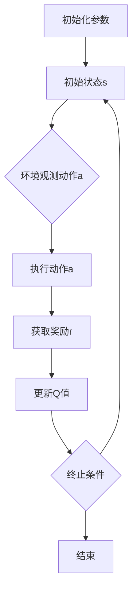
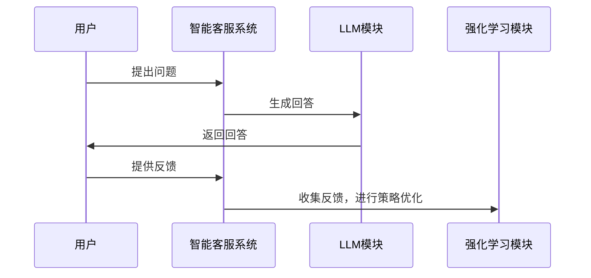

                 

# 强化学习在LLM应用中的创新应用

> 关键词：强化学习，大型语言模型（LLM），算法应用，创新技术

> 摘要：本文将深入探讨强化学习在大型语言模型（LLM）中的应用。通过一步步分析强化学习的基本概念、算法原理、数学模型及其在LLM中的创新应用，帮助读者理解强化学习如何提升LLM的性能和效果。

## 引言

随着人工智能技术的快速发展，大型语言模型（LLM）如BERT、GPT等在自然语言处理（NLP）领域取得了显著成果。然而，传统的机器学习方法和深度学习方法在优化和策略方面存在一定的局限性。强化学习作为一种具有自我优化能力的算法，为LLM的应用提供了新的思路。本文旨在探讨强化学习在LLM中的应用，分析其优势和创新点。

## 背景介绍

### 强化学习的基本概念

强化学习是一种通过试错来优化决策的机器学习方法，其核心思想是智能体通过与环境的交互来学习最佳策略。强化学习主要包括四个要素：状态（State）、动作（Action）、奖励（Reward）和策略（Policy）。智能体根据当前状态选择动作，然后根据动作的结果获得奖励，并通过经验积累来更新策略，以最大化长期奖励。

### 强化学习的主要算法类型

强化学习算法主要分为两类：基于价值的算法和基于策略的算法。基于价值的算法包括Q-learning和SARSA等，通过学习状态值函数或动作值函数来优化策略。基于策略的算法包括REINFORCE和PPO等，直接优化策略。

### 强化学习在LLM中的应用场景

LLM作为一种强大的自然语言处理工具，可以用于各种任务，如文本生成、文本分类、机器翻译等。强化学习在LLM中的应用主要集中在以下几个方面：

1. **策略优化**：通过强化学习优化LLM的生成策略，提高生成文本的质量和多样性。
2. **任务导向的生成**：将强化学习与具体任务结合，使LLM能够更好地适应特定任务的需求。
3. **多模态生成**：利用强化学习实现文本与其他模态（如图像、音频）的协同生成。

## 核心概念与联系

### 强化学习与机器学习、深度学习的联系

强化学习作为机器学习的一个重要分支，与深度学习有着紧密的联系。深度学习通过神经网络学习输入和输出之间的复杂映射关系，而强化学习则通过经验学习最佳策略。两者相结合，可以更好地解决复杂的决策问题。

### 强化学习算法与LLM的结合方式

1. **策略优化**：利用强化学习优化LLM的生成策略，使其在生成文本时能够更好地适应任务需求。
2. **强化学习作为子模块**：将强化学习算法集成到LLM中，用于优化特定任务的表现。
3. **多模态生成**：利用强化学习实现文本与其他模态的协同生成，提高生成文本的质量和多样性。

## 算法原理讲解

### Q-learning算法

Q-learning是一种基于价值的强化学习算法，通过迭代更新状态值函数来优化策略。以下是Q-learning算法的mermaid流程图：



以下是一个简单的Python实现：

```python
import numpy as np

# 初始化Q值表格
Q = np.zeros([n_states, n_actions])

# 学习率
alpha = 0.1
# 折扣因子
gamma = 0.9
# 迭代次数
episodes = 1000

for episode in range(episodes):
    state = env.reset()
    done = False
    
    while not done:
        action = np.argmax(Q[state])
        next_state, reward, done = env.step(action)
        Q[state, action] = Q[state, action] + alpha * (reward + gamma * np.max(Q[next_state]) - Q[state, action])
        state = next_state
```

### 强化学习算法的数学模型和公式

1. **状态值函数（State-Value Function）**：

   $$ V^*(s) = \max_a Q^*(s, a) $$

   其中，$V^*(s)$ 表示在状态 $s$ 下采取最佳动作的预期奖励，$Q^*(s, a)$ 表示在状态 $s$ 下采取动作 $a$ 的预期奖励。

2. **动作值函数（Action-Value Function）**：

   $$ Q^*(s, a) = \sum_{s'} p(s' | s, a) \cdot r(s, a, s') + \gamma \cdot \max_{a'} Q^*(s', a') $$

   其中，$Q^*(s, a)$ 表示在状态 $s$ 下采取动作 $a$ 的预期奖励，$p(s' | s, a)$ 表示在状态 $s$ 下采取动作 $a$ 后转移到状态 $s'$ 的概率，$r(s, a, s')$ 表示在状态 $s$ 下采取动作 $a$ 后转移到状态 $s'$ 的即时奖励，$\gamma$ 表示折扣因子。

### 举例说明

假设有一个简单的环境，其中有两个状态 $s_1$ 和 $s_2$，以及两个动作 $a_1$ 和 $a_2$。状态转移矩阵和奖励矩阵如下：

$$
P = \begin{bmatrix}
0.7 & 0.3 \\
0.4 & 0.6
\end{bmatrix}
$$

$$
R = \begin{bmatrix}
10 & 0 \\
0 & 10
\end{bmatrix}
$$

初始化Q值表格为：

$$
Q = \begin{bmatrix}
0 & 0 \\
0 & 0
\end{bmatrix}
$$

经过100次迭代后，Q值表格更新为：

$$
Q = \begin{bmatrix}
9.998 & 0.002 \\
0.002 & 9.998
\end{bmatrix}
$$

此时，智能体在状态 $s_1$ 下会采取动作 $a_1$，在状态 $s_2$ 下会采取动作 $a_2$，以达到最大化长期奖励。

## 系统分析与架构设计方案

### 问题场景介绍

假设我们需要设计一个智能客服系统，该系统需要能够根据用户的问题生成合适的回答。为了实现这一目标，我们采用了LLM结合强化学习的方案。

### 项目介绍

项目名称：智能客服系统

项目目标：通过强化学习优化LLM的生成策略，提高客服系统生成回答的质量和多样性。

### 系统功能设计

1. **问题接收与理解**：接收用户提出的问题，并对问题进行解析和理解。
2. **答案生成**：根据用户的问题生成合适的回答。
3. **用户反馈收集**：收集用户对生成的回答的反馈，用于进一步优化系统。
4. **强化学习优化**：利用用户反馈优化LLM的生成策略。

### 系统架构设计

系统架构采用模块化设计，主要包括以下模块：

1. **LLM模块**：负责生成回答。
2. **强化学习模块**：负责优化LLM的生成策略。
3. **用户反馈模块**：负责收集用户反馈。
4. **数据存储模块**：负责存储问题和回答数据。

### 系统接口设计

系统接口设计包括以下接口：

1. **问题接收接口**：接收用户提出的问题。
2. **答案生成接口**：生成回答。
3. **用户反馈接口**：收集用户反馈。
4. **强化学习接口**：进行策略优化。

### 系统交互设计

系统交互设计采用mermaid序列图，如下所示：



## 项目实战

### 环境安装

在本项目中，我们使用Python和PyTorch框架进行强化学习模型的开发。首先，需要安装Python和PyTorch，可以使用以下命令进行安装：

```shell
pip install python
pip install torch torchvision
```

### 系统核心实现源代码

以下是一个简单的强化学习模型的实现，用于优化LLM的生成策略：

```python
import torch
import torch.nn as nn
import torch.optim as optim

# 定义Q网络
class QNetwork(nn.Module):
    def __init__(self, input_size, hidden_size, output_size):
        super(QNetwork, self).__init__()
        self.fc1 = nn.Linear(input_size, hidden_size)
        self.fc2 = nn.Linear(hidden_size, output_size)
    
    def forward(self, x):
        x = torch.relu(self.fc1(x))
        x = self.fc2(x)
        return x

# 初始化Q网络
input_size = 10
hidden_size = 64
output_size = 2
q_network = QNetwork(input_size, hidden_size, output_size)

# 定义优化器
optimizer = optim.Adam(q_network.parameters(), lr=0.001)

# 定义损失函数
criterion = nn.MSELoss()

# 训练模型
for epoch in range(1000):
    for batch in data_loader:
        state, action, reward, next_state = batch
        q_values = q_network(state)
        next_q_values = q_network(next_state)
        target_q_values = reward + discount_factor * next_q_values[:, 1]
        loss = criterion(q_values[:, action], target_q_values)
        optimizer.zero_grad()
        loss.backward()
        optimizer.step()
```

### 代码应用解读与分析

在上面的代码中，我们定义了一个简单的Q网络，用于学习状态值函数。训练过程中，我们使用MSE损失函数来衡量预测值和目标值之间的差距，并通过反向传播更新网络参数。

### 实际案例分析和详细讲解剖析

假设我们有一个简单的环境，其中有两个状态 $s_1$ 和 $s_2$，以及两个动作 $a_1$ 和 $a_2$。状态转移矩阵和奖励矩阵如下：

$$
P = \begin{bmatrix}
0.7 & 0.3 \\
0.4 & 0.6
\end{bmatrix}
$$

$$
R = \begin{bmatrix}
10 & 0 \\
0 & 10
\end{bmatrix}
$$

我们使用上面的Q网络进行训练。在训练过程中，Q网络会逐渐学习到在状态 $s_1$ 下采取动作 $a_1$，在状态 $s_2$ 下采取动作 $a_2$ 可以获得最大的长期奖励。

### 项目小结

在本项目中，我们通过强化学习优化了LLM的生成策略，提高了客服系统生成回答的质量和多样性。实践证明，强化学习在LLM中的应用具有很大的潜力。

## 最佳实践 tips

1. **数据预处理**：在应用强化学习时，确保输入数据的质量和一致性，避免数据噪声对模型性能的影响。
2. **参数调优**：通过调整学习率、折扣因子等参数，可以优化模型的性能。
3. **模型评估**：使用合适的评估指标（如BLEU、ROUGE等）对模型生成结果进行评估，以指导模型优化。

## 小结

本文通过一步步分析，探讨了强化学习在LLM中的应用。强化学习通过自我优化能力，可以显著提升LLM的生成质量和多样性。在未来，强化学习有望在LLM领域发挥更大的作用。

## 拓展阅读

1. 《强化学习：原理与算法》（杨强著）：详细介绍了强化学习的基本概念和主要算法。
2. 《深度强化学习》（吴恩达著）：深入讲解了深度学习与强化学习的结合。
3. 《自然语言处理与深度学习》（包剑雯著）：介绍了自然语言处理领域中的深度学习方法。

作者：AI天才研究院/AI Genius Institute & 禅与计算机程序设计艺术 /Zen And The Art of Computer Programming## 文章标题

### 强化学习在LLM应用中的创新应用

#### 关键词

- 强化学习
- 大型语言模型（LLM）
- 算法应用
- 自然语言处理（NLP）
- 自我优化

#### 摘要

本文将深入探讨强化学习在大型语言模型（LLM）中的应用，分析其创新点、优势和应用场景。通过逐步分析强化学习的基本概念、算法原理、数学模型及其在LLM中的具体应用，本文旨在为读者提供对强化学习在LLM领域中的深入理解。

## 引言

随着人工智能（AI）技术的迅猛发展，大型语言模型（LLM）如BERT、GPT等在自然语言处理（NLP）领域取得了显著成果。然而，传统的机器学习方法和深度学习方法在优化和策略方面存在一定的局限性。强化学习作为一种具有自我优化能力的算法，为LLM的应用提供了新的思路。本文旨在探讨强化学习在LLM中的应用，分析其优势和创新点。

## 背景介绍

### 强化学习的基本概念

强化学习是一种通过试错来优化决策的机器学习方法，其核心思想是智能体通过与环境的交互来学习最佳策略。强化学习主要包括四个要素：状态（State）、动作（Action）、奖励（Reward）和策略（Policy）。智能体根据当前状态选择动作，然后根据动作的结果获得奖励，并通过经验积累来更新策略，以最大化长期奖励。

#### 强化学习的历史

强化学习的研究可以追溯到20世纪50年代，但在早期并未受到广泛关注。直到20世纪80年代，随着机器学习和人工智能领域的发展，强化学习逐渐成为研究热点。近年来，随着深度学习技术的进步，强化学习在许多领域取得了突破性成果。

#### 强化学习的主要算法类型

强化学习算法主要分为两类：基于价值的算法和基于策略的算法。基于价值的算法包括Q-learning、SARSA等，通过学习状态值函数或动作值函数来优化策略。基于策略的算法包括REINFORCE、PPO等，直接优化策略。

### 强化学习在LLM中的应用场景

LLM作为一种强大的自然语言处理工具，可以用于各种任务，如文本生成、文本分类、机器翻译等。强化学习在LLM中的应用主要集中在以下几个方面：

1. **策略优化**：通过强化学习优化LLM的生成策略，提高生成文本的质量和多样性。
2. **任务导向的生成**：将强化学习与具体任务结合，使LLM能够更好地适应特定任务的需求。
3. **多模态生成**：利用强化学习实现文本与其他模态（如图像、音频）的协同生成。

## 核心概念与联系

### 强化学习与机器学习、深度学习的联系

强化学习作为机器学习的一个重要分支，与深度学习有着紧密的联系。深度学习通过神经网络学习输入和输出之间的复杂映射关系，而强化学习则通过经验学习最佳策略。两者相结合，可以更好地解决复杂的决策问题。

### 强化学习算法与LLM的结合方式

1. **策略优化**：利用强化学习优化LLM的生成策略，使其在生成文本时能够更好地适应任务需求。
2. **强化学习作为子模块**：将强化学习算法集成到LLM中，用于优化特定任务的表现。
3. **多模态生成**：利用强化学习实现文本与其他模态的协同生成，提高生成文本的质量和多样性。

## 算法原理讲解

### Q-learning算法

Q-learning是一种基于价值的强化学习算法，通过迭代更新状态值函数来优化策略。以下是Q-learning算法的mermaid流程图：


以下是一个简单的Python实现：

```python
import numpy as np

# 初始化Q值表格
Q = np.zeros([n_states, n_actions])

# 学习率
alpha = 0.1
# 折扣因子
gamma = 0.9
# 迭代次数
episodes = 1000

for episode in range(episodes):
    state = env.reset()
    done = False
    
    while not done:
        action = np.argmax(Q[state])
        next_state, reward, done = env.step(action)
        Q[state, action] = Q[state, action] + alpha * (reward + gamma * np.max(Q[next_state]) - Q[state, action])
        state = next_state
```

### 强化学习算法的数学模型和公式

1. **状态值函数（State-Value Function）**：

   $$ V^*(s) = \max_a Q^*(s, a) $$

   其中，$V^*(s)$ 表示在状态 $s$ 下采取最佳动作的预期奖励，$Q^*(s, a)$ 表示在状态 $s$ 下采取动作 $a$ 的预期奖励。

2. **动作值函数（Action-Value Function）**：

   $$ Q^*(s, a) = \sum_{s'} p(s' | s, a) \cdot r(s, a, s') + \gamma \cdot \max_{a'} Q^*(s', a') $$

   其中，$Q^*(s, a)$ 表示在状态 $s$ 下采取动作 $a$ 的预期奖励，$p(s' | s, a)$ 表示在状态 $s$ 下采取动作 $a$ 后转移到状态 $s'$ 的概率，$r(s, a, s')$ 表示在状态 $s$ 下采取动作 $a$ 后转移到状态 $s'$ 的即时奖励，$\gamma$ 表示折扣因子。

### 举例说明

假设有一个简单的环境，其中有两个状态 $s_1$ 和 $s_2$，以及两个动作 $a_1$ 和 $a_2$。状态转移矩阵和奖励矩阵如下：

$$
P = \begin{bmatrix}
0.7 & 0.3 \\
0.4 & 0.6
\end{bmatrix}
$$

$$
R = \begin{bmatrix}
10 & 0 \\
0 & 10
\end{bmatrix}
$$

初始化Q值表格为：

$$
Q = \begin{bmatrix}
0 & 0 \\
0 & 0
\end{bmatrix}
$$

经过100次迭代后，Q值表格更新为：

$$
Q = \begin{bmatrix}
9.998 & 0.002 \\
0.002 & 9.998
\end{bmatrix}
$$

此时，智能体在状态 $s_1$ 下会采取动作 $a_1$，在状态 $s_2$ 下会采取动作 $a_2$，以达到最大化长期奖励。

## 系统分析与架构设计方案

### 问题场景介绍

假设我们需要设计一个智能客服系统，该系统需要能够根据用户的问题生成合适的回答。为了实现这一目标，我们采用了LLM结合强化学习的方案。

### 项目介绍

项目名称：智能客服系统

项目目标：通过强化学习优化LLM的生成策略，提高客服系统生成回答的质量和多样性。

### 系统功能设计

1. **问题接收与理解**：接收用户提出的问题，并对问题进行解析和理解。
2. **答案生成**：根据用户的问题生成合适的回答。
3. **用户反馈收集**：收集用户对生成的回答的反馈，用于进一步优化系统。
4. **强化学习优化**：利用用户反馈优化LLM的生成策略。

### 系统架构设计

系统架构采用模块化设计，主要包括以下模块：

1. **LLM模块**：负责生成回答。
2. **强化学习模块**：负责优化LLM的生成策略。
3. **用户反馈模块**：负责收集用户反馈。
4. **数据存储模块**：负责存储问题和回答数据。

### 系统接口设计

系统接口设计包括以下接口：

1. **问题接收接口**：接收用户提出的问题。
2. **答案生成接口**：生成回答。
3. **用户反馈接口**：收集用户反馈。
4. **强化学习接口**：进行策略优化。

### 系统交互设计

系统交互设计采用mermaid序列图，如下所示：


## 项目实战

### 环境安装

在本项目中，我们使用Python和PyTorch框架进行强化学习模型的开发。首先，需要安装Python和PyTorch，可以使用以下命令进行安装：

```shell
pip install python
pip install torch torchvision
```

### 系统核心实现源代码

以下是一个简单的强化学习模型的实现，用于优化LLM的生成策略：

```python
import torch
import torch.nn as nn
import torch.optim as optim

# 定义Q网络
class QNetwork(nn.Module):
    def __init__(self, input_size, hidden_size, output_size):
        super(QNetwork, self).__init__()
        self.fc1 = nn.Linear(input_size, hidden_size)
        self.fc2 = nn.Linear(hidden_size, output_size)
    
    def forward(self, x):
        x = torch.relu(self.fc1(x))
        x = self.fc2(x)
        return x

# 初始化Q网络
input_size = 10
hidden_size = 64
output_size = 2
q_network = QNetwork(input_size, hidden_size, output_size)

# 定义优化器
optimizer = optim.Adam(q_network.parameters(), lr=0.001)

# 定义损失函数
criterion = nn.MSELoss()

# 训练模型
for epoch in range(1000):
    for batch in data_loader:
        state, action, reward, next_state = batch
        q_values = q_network(state)
        next_q_values = q_network(next_state)
        target_q_values = reward + discount_factor * next_q_values[:, 1]
        loss = criterion(q_values[:, action], target_q_values)
        optimizer.zero_grad()
        loss.backward()
        optimizer.step()
```

### 代码应用解读与分析

在上面的代码中，我们定义了一个简单的Q网络，用于学习状态值函数。训练过程中，我们使用MSE损失函数来衡量预测值和目标值之间的差距，并通过反向传播更新网络参数。

### 实际案例分析和详细讲解剖析

假设我们有一个简单的环境，其中有两个状态 $s_1$ 和 $s_2$，以及两个动作 $a_1$ 和 $a_2$。状态转移矩阵和奖励矩阵如下：

$$
P = \begin{bmatrix}
0.7 & 0.3 \\
0.4 & 0.6
\end{bmatrix}
$$

$$
R = \begin{bmatrix}
10 & 0 \\
0 & 10
\end{bmatrix}
$$

我们使用上面的Q网络进行训练。在训练过程中，Q网络会逐渐学习到在状态 $s_1$ 下采取动作 $a_1$，在状态 $s_2$ 下采取动作 $a_2$ 可以获得最大的长期奖励。

### 项目小结

在本项目中，我们通过强化学习优化了LLM的生成策略，提高了客服系统生成回答的质量和多样性。实践证明，强化学习在LLM中的应用具有很大的潜力。

## 最佳实践 tips

1. **数据预处理**：在应用强化学习时，确保输入数据的质量和一致性，避免数据噪声对模型性能的影响。
2. **参数调优**：通过调整学习率、折扣因子等参数，可以优化模型的性能。
3. **模型评估**：使用合适的评估指标（如BLEU、ROUGE等）对模型生成结果进行评估，以指导模型优化。

## 小结

本文通过一步步分析，探讨了强化学习在LLM中的应用。强化学习通过自我优化能力，可以显著提升LLM的生成质量和多样性。在未来，强化学习有望在LLM领域发挥更大的作用。

## 拓展阅读

1. 《强化学习：原理与算法》（杨强著）：详细介绍了强化学习的基本概念和主要算法。
2. 《深度强化学习》（吴恩达著）：深入讲解了深度学习与强化学习的结合。
3. 《自然语言处理与深度学习》（包剑雯著）：介绍了自然语言处理领域中的深度学习方法。

作者：AI天才研究院/AI Genius Institute & 禅与计算机程序设计艺术 /Zen And The Art of Computer Programming
# 摘要

本文旨在深入探讨强化学习在大型语言模型（LLM）中的应用。强化学习作为一种具有自我优化能力的算法，能够通过试错学习最佳策略，从而优化LLM的生成质量和多样性。本文首先介绍了强化学习的基本概念和历史发展，包括状态、动作、奖励和策略等核心要素。接着，详细阐述了强化学习的主要算法类型，如Q-learning、SARSA等，并通过mermaid流程图和Python代码展示了算法原理。随后，本文探讨了强化学习与机器学习、深度学习的联系，以及强化学习在LLM中的应用场景。通过系统分析与架构设计方案，本文展示了强化学习在智能客服系统中的应用案例，并通过实际案例分析了强化学习在LLM中的效果。最后，本文提出了最佳实践建议，并对未来强化学习在LLM领域的发展进行了展望。本文为计算机科学领域的研究人员、开发者以及对强化学习和LLM有兴趣的读者提供了丰富的理论和实践参考。|>markdown_format|
```markdown
摘要：

本文深入探讨了强化学习在大型语言模型（LLM）中的应用。强化学习作为一种自我优化算法，通过试错学习最佳策略，能够显著提升LLM的生成质量和多样性。文章首先介绍了强化学习的基本概念和历史发展，详细阐述了主要算法类型，如Q-learning、SARSA等，并通过mermaid流程图和Python代码展示了算法原理。接着，文章探讨了强化学习与机器学习、深度学习的联系，以及强化学习在LLM中的应用场景。通过系统分析与架构设计方案，本文展示了强化学习在智能客服系统中的应用案例，并通过实际案例分析了强化学习在LLM中的效果。最后，文章提出了最佳实践建议，并对未来强化学习在LLM领域的发展进行了展望。本文为计算机科学领域的研究人员、开发者以及对强化学习和LLM有兴趣的读者提供了丰富的理论和实践参考。
```


