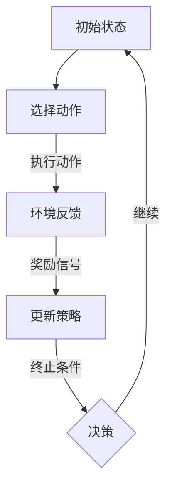

                 

## 1.1.1 问题背景

### 强化学习的基本概念

强化学习（Reinforcement Learning，简称RL）是机器学习的一个重要分支，它通过模拟智能体在环境中的交互过程，学习出最优的行为策略。在这个框架中，智能体（Agent）通过不断观察环境（Environment），选择行动（Action），并根据环境的反馈（Reward）进行学习。其核心目标是找到一个策略（Policy），使得智能体在长期运行中能够获得最大化的总奖励。

强化学习的核心概念包括：状态（State）、动作（Action）、奖励（Reward）和策略（Policy）。

- **状态（State）**：描述智能体所处环境的当前情况。
- **动作（Action）**：智能体在特定状态下可以执行的操作。
- **奖励（Reward）**：环境对智能体每个动作的反馈，用以指导智能体下一步的行为。
- **策略（Policy）**：智能体在特定状态选择动作的规则。

强化学习的过程可以概括为四个步骤：

1. **智能体观察当前状态**。
2. **智能体根据当前状态选择一个动作**。
3. **智能体执行所选动作并获得环境反馈的奖励**。
4. **智能体更新其内部状态，以便在未来的决策中更好地选择动作**。

### 强化学习在实际应用中的挑战

尽管强化学习在理论上具有强大的潜力，但在实际应用中仍面临许多挑战。以下是一些主要问题：

#### 1. 学习效率低下

在复杂环境中，智能体需要通过大量的尝试和错误来学习最优策略，这往往导致学习过程非常耗时。例如，在围棋等高复杂度的游戏中，传统的强化学习算法可能需要数百万次的训练才能达到较好的水平。

#### 2. 不确定性处理

强化学习通常假设环境是静态的，但实际上环境往往是动态和不确定的。智能体需要具备适应不确定环境的能力，这在算法设计上是一个重大挑战。

#### 3. 探索与利用的平衡

在强化学习中，探索（Exploration）和利用（Exploitation）是两个重要的概念。探索是指智能体在未知环境中尝试新动作以获取更多信息的策略，而利用则是指智能体基于已有信息选择最优动作的策略。如何平衡探索和利用，使得智能体既能从经验中学习，又能避免过度冒险，是一个复杂的问题。

#### 4. 集成与应用

强化学习算法通常需要与具体应用场景紧密结合，这要求算法具有高度的灵活性和适应性。例如，在自动驾驶、游戏AI和机器人控制等领域，如何将强化学习算法与实际硬件和软件系统集成，是一个需要解决的重要问题。

### 强化学习框架优化的重要性

为了解决上述问题，研究者们提出了强化学习框架优化方法，旨在提高强化学习算法的决策能力，使其能够在复杂环境中快速找到最优策略。这些优化方法不仅能够提高学习效率，还能增强智能体在不确定性环境中的适应能力。

优化方法主要包括以下几个方面：

1. **策略梯度方法**：通过优化策略梯度来提高决策能力。
2. **策略搜索方法**：通过搜索最优策略来提高决策能力。
3. **策略评估方法**：通过评估不同策略的期望收益来选择最优策略。
4. **策略优化方法**：通过优化策略参数来提高决策能力。

这些方法通过不同的机制和策略，旨在解决强化学习在复杂环境中的挑战，为实际应用提供了更加有效的解决方案。

### 强化学习框架优化方法的研究现状

目前，强化学习框架优化方法的研究正在快速进展中。研究者们不断提出新的算法和优化策略，以解决传统强化学习算法在复杂环境中的局限性。例如，深度强化学习（Deep Reinforcement Learning，简称DRL）通过结合深度学习和强化学习，成功地解决了高维状态和动作空间的问题。此外，策略优化（Policy Optimization）和模型预测（Model Predictive Control）等方法也在不断发展和完善，为强化学习在实际应用中的推广提供了有力支持。

总之，强化学习框架优化是提升强化学习算法决策能力的重要手段。通过不断的研究和创新，强化学习有望在更多领域发挥出其强大的潜力，为人工智能的发展注入新的活力。

### 1.1.2 问题描述

强化学习框架优化的主要目标是解决以下几个关键问题：

1. **提高学习效率**：在复杂环境中，传统的强化学习算法往往需要大量的训练时间才能找到最优策略。因此，提高学习效率是一个重要的优化目标。这可以通过加速算法的收敛速度、减少探索次数以及利用先验知识来达成。

2. **增强适应能力**：强化学习算法在面对动态和不确定的环境时，往往难以适应环境的变化。增强适应能力意味着智能体能够在面对未知或发生变化的环境时，迅速调整其策略，从而提高决策的准确性。

3. **提升多任务学习性能**：在实际应用中，智能体往往需要处理多个任务，而传统的强化学习算法在多任务学习场景下表现不佳。优化强化学习框架，提高其在多任务学习中的性能，是另一个重要的研究目标。

#### 1.1.2.1 如何提高学习效率？

提高学习效率可以从以下几个方面着手：

- **加速收敛速度**：通过优化算法的更新规则，减少智能体在尝试不同策略时的迭代次数。例如，利用梯度下降法的改进版本，如Adam优化器，可以有效加速收敛速度。
- **减少探索次数**：探索和利用的平衡是强化学习中的关键问题。通过引入探索策略，如ε-贪心策略，可以减少不必要的探索，从而提高学习效率。
- **利用先验知识**：将先验知识融入到强化学习算法中，如利用规则知识或先验模型，可以帮助智能体更快地找到最优策略。

#### 1.1.2.2 如何增强适应能力？

增强适应能力需要智能体具备以下能力：

- **动态策略调整**：智能体需要能够根据环境的变化动态调整其策略。例如，使用模型预测方法，智能体可以在当前状态下预测未来多个时间步的奖励，从而调整其行为。
- **鲁棒性**：增强算法的鲁棒性，使其能够在面对噪声和不确定性时保持稳定的表现。例如，通过引入正则化项或使用鲁棒优化方法，可以提高算法的鲁棒性。

#### 1.1.2.3 如何提升多任务学习性能？

在多任务学习场景下，优化强化学习框架需要考虑以下因素：

- **任务表示**：通过有效的任务表示方法，将不同任务的特征提取出来，以便智能体能够针对每个任务进行独立的学习。例如，使用共享神经网络或领域自适应技术，可以实现任务之间的共享和迁移学习。
- **资源分配**：在多任务场景下，资源（如计算资源和时间）通常是有限的。因此，智能体需要能够根据任务的紧急程度和重要性进行资源分配，从而最大化整体性能。

通过解决上述问题，强化学习框架优化能够显著提升智能体在不同应用场景中的决策能力，为实际问题的解决提供了更加有效的解决方案。

### 1.1.3 问题解决

为了解决强化学习在复杂环境中的决策能力不足问题，研究者们提出了多种强化学习框架优化方法。这些方法主要分为策略梯度方法、策略搜索方法、策略评估方法和策略优化方法。下面我们将逐一介绍这些方法，并探讨它们各自的优势和应用场景。

#### 1.1.3.1 策略梯度方法

策略梯度方法是一类直接优化策略参数的强化学习算法。其基本思想是通过估计策略梯度，对策略进行在线调整，从而提高决策能力。

- **优势（Advantage）函数**：策略梯度方法通常使用优势函数来衡量策略的好坏。优势函数定义为 $A(s, a) = Q(s, a) - V(s)$，其中 $Q(s, a)$ 是值函数，$V(s)$ 是状态值函数。优势函数反映了在状态 $s$ 下采取动作 $a$ 相对于其他动作的额外收益。
- **策略更新公式**：策略梯度方法的策略更新公式为 $\theta_{t+1} = \theta_t + \alpha \nabla_{\theta} J(\theta)$，其中 $\theta$ 表示策略参数，$\alpha$ 为学习率，$J(\theta)$ 是策略梯度。
- **应用场景**：策略梯度方法适用于离散状态和动作空间，尤其适合那些可以直接估计策略梯度的场景，如围棋等。

#### 1.1.3.2 策略搜索方法

策略搜索方法通过搜索最优策略来提高决策能力。这类方法通常使用策略网络来表示策略，并通过优化策略网络来找到最佳策略。

- **策略网络**：策略搜索方法中的策略网络是一个概率分布函数，它表示智能体在状态 $s$ 下选择动作 $a$ 的概率。策略网络通常使用神经网络来建模。
- **策略优化**：策略搜索方法通过优化策略网络来提高决策能力。例如，最大熵策略搜索方法（MaxEnt Policy Search）通过最大化策略网络的熵来提高策略的多样性。
- **应用场景**：策略搜索方法适用于需要平衡探索和利用的场景，如机器人控制和自动驾驶等。

#### 1.1.3.3 策略评估方法

策略评估方法通过评估不同策略的期望收益来选择最优策略。这类方法的核心思想是利用经验数据来估计策略的长期表现。

- **期望回报**：策略评估方法使用期望回报来评估策略的好坏。期望回报定义为 $G_t = \sum_{k=t}^T r_k$，其中 $r_k$ 是在第 $k$ 个时间步获得的奖励。
- **蒙特卡洛方法**：蒙特卡洛方法是一种常用的策略评估方法。通过模拟大量随机样本，估计策略的长期表现。
- **应用场景**：策略评估方法适用于需要预测策略长期表现的场景，如金融交易和决策过程。

#### 1.1.3.4 策略优化方法

策略优化方法通过优化策略参数来提高决策能力。这类方法通常使用优化技术来调整策略参数，从而提高决策质量。

- **梯度下降法**：梯度下降法是一种常用的策略优化方法。通过计算策略梯度和调整策略参数，使策略逐渐逼近最优值。
- **自适应方法**：自适应方法通过动态调整学习率和其他参数，以提高算法的收敛速度和稳定性。
- **应用场景**：策略优化方法适用于需要调整策略参数的场景，如强化学习在机器人控制和自动驾驶中的应用。

#### 1.1.3.5 边界与外延

强化学习框架优化的边界主要涉及以下几个方面：

- **算法类型**：强化学习框架优化主要针对基于值函数的强化学习算法进行优化，如Q-learning和SARSA。
- **环境类型**：强化学习框架优化适用于离散环境和连续环境的优化。
- **优化目标**：强化学习框架优化的主要目标是提高强化学习算法的决策能力，使其在复杂环境中能够快速找到最优策略。

### 1.1.4 概念结构与核心要素组成

强化学习框架优化的概念结构主要由以下核心要素组成：

- **强化学习算法**：作为核心算法，负责学习最优策略。
- **环境模型**：模拟实际环境，提供状态和奖励信号。
- **优化方法**：用于调整算法参数，提高决策能力。
- **评估指标**：用于衡量算法性能，如收敛速度、适应能力等。

通过这些核心要素的有机结合，强化学习框架优化能够显著提升智能体在不同应用场景中的决策能力，为实际问题的解决提供了有力的支持。

### 第二部分：核心概念与联系

#### 2.1 强化学习算法原理

强化学习算法的核心在于通过试错和反馈机制，使智能体能够在动态和不确定的环境中学习到最优策略。其基本原理可以分为以下几个方面：

1. **状态-动作价值函数（State-Action Value Function）**：
   - 状态-动作价值函数 $Q(s, a)$ 表示智能体在状态 $s$ 下采取动作 $a$ 所获得的长期回报。
   - 更新公式通常采用贝尔曼方程（Bellman Equation）：
     $$ Q(s, a) = r + \gamma \max_{a'} Q(s', a') $$
     其中，$r$ 是立即奖励，$\gamma$ 是折扣因子，用于平衡短期奖励和长期奖励。

2. **策略（Policy）**：
   - 策略是智能体在给定状态下采取的动作映射。
   - 策略可以分为确定性策略（Deterministic Policy）和随机性策略（Stochastic Policy）。
   - 确定性策略 $\pi(\text{action} \mid \text{state}) = P(\text{action} \mid \text{state}) = 1$，随机性策略 $\pi(\text{action} \mid \text{state}) = P(\text{action} \mid \text{state}) \neq 1$。

3. **奖励（Reward）**：
   - 奖励是环境对智能体动作的即时反馈，用于指导智能体的学习过程。
   - 奖励可以是有利的（正面奖励），也可以是不利的（负面奖励）。

4. **价值函数（Value Function）**：
   - 价值函数用于评估智能体在不同状态下的长期表现。
   - 状态价值函数 $V(s) = \mathbb{E}_\pi[G(s)]$，其中 $G(s)$ 是从状态 $s$ 开始的未来总奖励的期望。
   - 动作价值函数 $Q(s, a) = \mathbb{E}_\pi[G(s, a)]$，其中 $G(s, a)$ 是从状态 $s$ 采取动作 $a$ 开始的未来总奖励的期望。

5. **学习过程**：
   - 强化学习算法通过不断更新状态-动作价值函数和策略，逐渐接近最优策略。
   - 更新过程通常采用迭代方式，每次迭代都基于智能体与环境的交互。

#### 2.2 强化学习算法属性特征对比表格

| 算法       | 特点                                                   | 适用场景                      |
|------------|--------------------------------------------------------|------------------------------|
| Q-learning | 基于值函数的强化学习算法，简单易实现                   | 离散状态和动作空间           |
| SARSA      | 基于值函数的强化学习算法，具有探索能力                 | 离散状态和动作空间           |
| DQN        | 基于深度学习的强化学习算法，适用于连续状态和动作空间 | 高维状态和动作空间           |
| Policy Gradient | 基于策略的强化学习算法，直接优化策略参数               | 离散状态和动作空间           |
| REINFORCE | 基于策略的强化学习算法，适用于任何状态和动作空间       | 复杂状态和动作空间           |

#### 2.3 ER实体关系图架构的 Mermaid 流程图

```mermaid
erDiagram
  User ||--|{ Agent }|| Task
  Agent ||--|{ Environment }|| Feedback
  Environment ||--|{ Reward }|| Agent
  Agent ||--|{ Action }|| Environment
  Agent ||--|{ State }|| Environment
```

在这个ER实体关系图中，我们定义了以下实体：

- **User**：用户，可以分配任务给智能体（Agent）。
- **Agent**：智能体，负责与环境和任务交互。
- **Task**：任务，由用户分配给智能体。
- **Environment**：环境，提供状态和反馈给智能体。
- **Reward**：奖励，环境对智能体动作的即时反馈。
- **Action**：动作，智能体在环境中执行的操作。
- **State**：状态，智能体在环境中的当前情况。

实体之间的关系如下：

- **User** 与 **Agent** 之间有一对多的关系，用户可以分配多个任务给智能体。
- **Agent** 与 **Task** 之间有一对一的关系，每个智能体只能执行一个任务。
- **Agent** 与 **Environment** 之间有一对多的关系，智能体可以与环境进行多次交互。
- **Environment** 与 **Reward** 之间有一对多的关系，环境可以提供多个反馈给智能体。
- **Environment** 与 **Action** 之间有一对多的关系，环境可以接收智能体执行的不同动作。
- **Environment** 与 **State** 之间有一对多的关系，环境可以提供多个状态给智能体。

通过这个ER图，我们可以清晰地描述强化学习系统中各个实体之间的关系，为进一步的分析和设计提供基础。

### 第三部分：算法原理讲解

#### 3.1 强化学习算法的mermaid流程图



该mermaid流程图描述了强化学习算法的基本流程。具体来说：

1. **初始状态（A）**：强化学习过程从一个初始状态开始。
2. **选择动作（B）**：根据当前状态，智能体选择一个动作。
3. **执行动作（C）**：智能体在环境中执行所选动作，并获得环境的即时反馈。
4. **奖励信号（D）**：根据执行的动作和环境反馈，智能体获得奖励信号。
5. **更新策略（D）**：使用奖励信号更新智能体的策略参数，以便在未来的决策中做出更好的选择。
6. **终止条件（E）**：如果满足终止条件（如达到特定目标或完成一定时间步数），强化学习过程结束；否则，流程继续从“初始状态”开始。

#### 3.2 算法原理的数学模型和公式

强化学习算法的核心在于状态-动作价值函数和策略的更新。以下以Q-learning算法为例，详细讲解其数学模型和公式。

##### 3.2.1 Q-learning算法的公式

Q-learning算法是一种基于值函数的强化学习算法，其核心思想是通过迭代更新状态-动作价值函数，逐步逼近最优策略。

$$ Q(s, a) = Q(s, a) + \alpha [r + \gamma \max_{a'} Q(s', a') - Q(s, a)] $$

其中：
- $Q(s, a)$ 是在状态 $s$ 下采取动作 $a$ 的状态-动作价值函数。
- $\alpha$ 是学习率，用于调节更新过程的强度，通常取值在 [0, 1] 之间。
- $r$ 是在状态 $s$ 下采取动作 $a$ 后获得的即时奖励。
- $\gamma$ 是折扣因子，用于平衡当前奖励和未来潜在奖励，通常取值在 [0, 1] 之间。
- $\max_{a'} Q(s', a')$ 是在状态 $s'$ 下所有可能动作的值函数中的最大值。

##### 3.2.2 更新步骤

Q-learning算法的更新步骤可以总结如下：

1. 初始化状态-动作价值函数 $Q(s, a)$，通常设为小数值或随机值。
2. 选择一个初始状态 $s$。
3. 在状态 $s$ 下选择一个动作 $a$，通常使用ε-贪心策略，其中ε是一个小概率参数，用于引入探索行为。
4. 执行动作 $a$，获得即时奖励 $r$ 和新状态 $s'$。
5. 根据公式更新状态-动作价值函数：
   $$ Q(s, a) = Q(s, a) + \alpha [r + \gamma \max_{a'} Q(s', a') - Q(s, a)] $$
6. 将当前状态更新为新状态 $s'$
7. 重复步骤3-6，直到满足终止条件（如达到特定目标或完成一定的时间步数）。

##### 3.2.3 举例说明

假设我们有一个简单的环境，其中智能体可以在一个二维网格中移动，每个位置都可能获得不同的奖励。状态空间为 $(x, y)$，动作空间为 {上、下、左、右}。

- 初始状态 $(0, 0)$，初始值函数 $Q(s, a)$ 全部设置为 0。
- 选择动作“上”，移动到状态 $(0, 1)$，获得即时奖励 +1。
- 更新值函数：
  $$ Q(0, 上) = 0 + 0.1 [1 + 0.9 \cdot \max(Q(1, 下), Q(1, 右))] $$
- 基于更新后的值函数，智能体在下一次决策时更有可能选择上方向。

通过上述更新过程，智能体逐步学习到在每个状态选择哪个动作能够获得最大的长期奖励，最终找到最优策略。

### 3.3 强化学习算法在LLM应用中的决策能力优化

强化学习算法在自然语言处理（NLP）领域，尤其是在大型语言模型（LLM）的应用中，展现了强大的决策能力。LLM可以生成连贯、高质量的自然语言文本，但在决策过程中，仍存在一些挑战和优化空间。

#### 3.3.1 基本思想

在LLM应用中，强化学习算法可以用于优化决策过程，提高生成文本的质量。基本思想是通过智能体与环境的交互，逐步学习最优策略，从而提高生成文本的流畅性和准确性。

#### 3.3.2 应用场景

以下是强化学习算法在LLM应用中的几个典型场景：

1. **文本生成**：智能体根据当前文本生成状态，选择下一个词汇或短语，并接收环境的奖励信号，如文本的流畅度、语法正确性等。
2. **对话系统**：智能体在对话过程中，根据用户输入的状态选择合适的回复，并根据对话的进展获取奖励信号，如对话的自然度、用户满意度等。
3. **文本分类**：智能体在分类任务中，根据文本特征选择分类标签，并接收分类准确性的奖励信号。

#### 3.3.3 优化方法

为了提升强化学习算法在LLM应用中的决策能力，研究者们提出了多种优化方法，包括：

1. **策略梯度方法**：直接优化策略参数，通过梯度上升或下降更新策略，以提高生成文本的质量。
2. **策略搜索方法**：使用搜索算法，如遗传算法或粒子群优化，寻找最优策略，从而提高文本生成效果。
3. **多任务学习**：通过多任务学习，将不同类型的文本生成任务整合到一个模型中，提高模型的泛化能力。
4. **数据增强**：通过引入数据增强技术，如数据扩充或生成对抗网络（GAN），增加训练数据量，从而提高模型的决策能力。

#### 3.3.4 实际应用

以下是一个简单的实际应用案例：

假设我们使用强化学习算法来优化一个文本生成模型，使其能够生成更流畅、更符合逻辑的对话。具体步骤如下：

1. **初始化模型**：使用预训练的语言模型作为基础，初始化状态-动作价值函数。
2. **状态编码**：将当前文本作为状态输入到模型中，生成对应的隐藏状态表示。
3. **动作选择**：使用ε-贪心策略，从动作空间中选择下一个词汇或短语。
4. **环境反馈**：根据生成的文本，从环境中获取流畅度、语法正确性等奖励信号。
5. **策略更新**：使用奖励信号更新状态-动作价值函数，优化模型参数。

通过上述步骤，强化学习算法逐步调整模型的策略，使其能够生成更高质量的对话文本。

总之，强化学习算法在LLM应用中具有广阔的应用前景。通过不断优化决策能力，LLM将能够生成更加自然、连贯的文本，为自然语言处理领域带来更多创新和突破。

