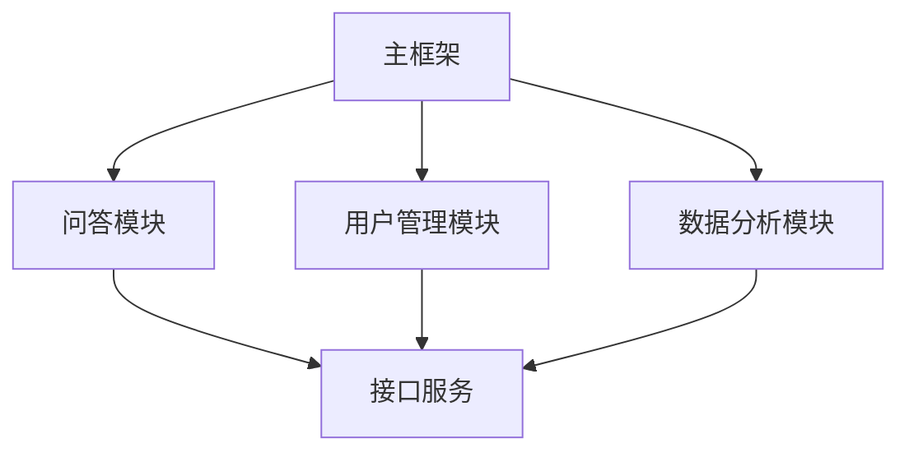

                 

### 文章标题：微前端架构在LLM应用UI开发中的应用

#### 关键词：微前端架构、LLM、UI开发、前端框架、技术选型、跨团队协作

#### 摘要：
本文将深入探讨微前端架构在大型语言模型（LLM）应用UI开发中的实际应用。我们将从微前端架构的背景、核心原则、优势与挑战，以及其在LLM UI开发中的适用性和设计原则等方面，逐步展开讨论。通过实际项目案例，我们将详细介绍微前端架构在LLM UI开发中的技术选型、实现步骤、项目测试与优化，并总结最佳实践。最后，我们将展望微前端架构在LLM UI开发中的未来趋势。

### 第一部分：微前端架构概述

#### 第1章：微前端架构概述

##### 1.1 微前端架构的背景与概念

##### 1.1.1 微前端架构的起源

微前端架构的起源可以追溯到单体架构在大型项目中面临的诸多问题。随着互联网应用日益复杂，单体架构的单点故障、代码复用困难、技术栈统一性降低等问题逐渐显现。为了解决这些问题，微前端架构应运而生。

##### 1.1.2 微前端架构的定义

微前端架构是一种将前端应用程序分解为多个独立、可复用组件的架构模式。这些组件可以是使用不同技术栈、由不同团队独立开发、部署和运维的模块。微前端架构的核心在于通过明确的通信协议和资源共享机制，实现各组件之间的协同工作。

##### 1.1.3 微前端架构与传统前端架构的区别

与传统前端架构相比，微前端架构具有以下特点：

- **模块化**：微前端架构强调模块化，使得各个组件可以独立开发、测试和部署。
- **技术栈灵活性**：各组件可以使用不同的技术栈，满足不同团队的需求。
- **跨团队协作**：微前端架构鼓励跨团队协作，提高开发效率。
- **独立部署与维护**：各组件可以独立部署和运维，降低系统的复杂度。

##### 1.2 微前端架构的核心原则

##### 1.2.1 单一职责

单一职责原则要求每个组件只关注一个功能模块，实现高内聚、低耦合的设计。这有助于提高组件的可维护性和可复用性。

##### 1.2.2 独立开发与部署

独立开发与部署原则使得各组件可以独立开发、测试和部署，降低系统的复杂度和风险。

##### 1.2.3 明确的通信协议

明确的通信协议原则要求组件之间通过标准化的接口进行通信，确保各组件之间的协同工作。

##### 1.3 微前端架构的优势与挑战

##### 1.3.1 优势

- **开发效率提升**：各团队可以独立开发，减少协调成本，提高开发效率。
- **技术栈灵活性**：可以采用不同的技术栈，满足不同团队的需求。
- **跨团队协作**：鼓励跨团队协作，提高团队之间的沟通效率。

##### 1.3.2 挑战

- **资源共享与依赖管理**：各组件之间的资源共享和依赖管理可能带来一定的复杂度。
- **跨域问题**：跨域请求可能需要额外的配置和解决方案。
- **性能优化**：各组件独立部署可能导致性能问题。

### 第二部分：LLM应用UI开发背景

#### 第2章：LLM应用UI开发背景

##### 2.1 什么是LLM

##### 2.1.1 LLM的概念

大型语言模型（Large Language Model，简称LLM）是一种基于神经网络的语言处理模型，能够对自然语言进行理解和生成。LLM通过训练大量的文本数据，学习语言的模式和规则，从而实现文本生成、情感分析、命名实体识别等任务。

##### 2.1.2 LLM的发展历程

LLM的发展历程可以分为以下几个阶段：

- **传统机器学习时代**：基于规则的方法和统计方法。
- **深度学习时代**：引入神经网络，特别是递归神经网络（RNN）和变换器（Transformer）。
- **预训练 + 微调**：通过大规模预训练，提高模型在特定任务上的表现。

##### 2.1.3 LLM的应用场景

LLM在以下应用场景中具有广泛的应用：

- **自然语言处理**：文本分类、情感分析、问答系统。
- **生成式文本**：自动写作、对话生成。
- **辅助工具**：智能客服、代码生成、文档生成。

##### 2.2 UI开发在LLM应用中的重要性

##### 2.2.1 UI设计的基本原则

- **用户体验**：设计简洁、直观、易用的界面。
- **可访问性**：确保所有人都能访问和使用应用。
- **可维护性**：便于后续的修改和扩展。

##### 2.2.2 UI开发流程

- **需求分析**：了解用户需求和业务目标。
- **原型设计**：设计界面原型，验证用户需求。
- **UI组件开发**：开发UI组件，实现界面功能。
- **UI测试与优化**：测试UI性能和用户体验，持续优化。

### 第三部分：微前端架构在LLM UI开发中的应用

#### 第3章：微前端架构在LLM UI开发中的应用

##### 3.1 微前端架构在LLM UI开发中的适用性

##### 3.1.1 单体架构的局限性

- **单点故障**：一旦单体架构出现故障，整个系统将受到影响。
- **代码复用困难**：难以实现代码的复用，导致开发效率低下。
- **技术栈统一性降低**：难以满足不同团队的需求，导致技术栈的多样性。

##### 3.1.2 微前端架构的优势

- **模块化**：提高代码的可维护性和复用性。
- **技术栈灵活性**：满足不同团队的需求，提高开发效率。
- **跨团队协作**：鼓励跨团队协作，提高团队之间的沟通效率。

##### 3.2 微前端架构在LLM UI开发中的设计原则

##### 3.2.1 跨团队协作

- **明确的职责划分**：确保每个团队负责的组件清晰明确。
- **统一的接口定义**：确保组件之间的通信标准化。
- **协作工具集成**：使用合适的协作工具，提高团队协作效率。

##### 3.2.2 独立部署与维护

- **独立部署**：各组件可以独立部署，降低系统的复杂度。
- **独立维护**：各组件可以独立维护，提高系统的稳定性。

##### 3.2.3 统一风格与用户体验

- **设计规范**：制定统一的设计规范，确保界面风格一致性。
- **用户体验**：确保用户在不同组件之间的体验一致。

##### 3.3 微前端架构在LLM UI开发中的技术选型

##### 3.3.1 前端框架的选择

- **React**：组件化开发，良好的生态和社区支持。
- **Vue**：简洁的语法和高效的渲染性能。
- **Angular**：严格的类型检查和强大的数据绑定功能。

##### 3.3.2 工具与平台的选择

- **Lerna**：用于管理多个相关项目的工具。
- **Webpack**：模块打包工具，支持模块化开发和性能优化。
- **Docker**：容器化技术，提高部署效率和稳定性。

### 第四部分：微前端架构在LLM UI开发中的实践

#### 第4章：微前端架构在LLM UI开发中的实践

##### 4.1 实践项目背景

##### 4.1.1 项目概述

本项目旨在开发一个基于LLM的智能问答系统，该系统需要具备良好的用户体验和高效的功能实现。

##### 4.1.2 项目需求

- **需求分析**：了解用户需求和业务目标，明确系统的功能模块。
- **原型设计**：设计界面原型，验证用户需求。
- **UI组件开发**：开发UI组件，实现界面功能。
- **UI测试与优化**：测试UI性能和用户体验，持续优化。

##### 4.2 微前端架构设计

##### 4.2.1 微前端架构设计思路

- **职责划分**：将系统功能模块划分为多个独立的组件，每个组件负责一个特定的功能。
- **通信协议**：使用标准化接口，确保组件之间的通信畅通。
- **部署与维护**：各组件可以独立部署和维护，提高系统的稳定性。

##### 4.2.2 微前端架构图

##### 4.3 实现步骤

##### 4.3.1 环境搭建

- **开发环境配置**：配置Node.js、npm、Webpack等开发环境。
- **微前端框架搭建**：使用Lerna创建多个项目，并集成Webpack进行模块打包。

##### 4.3.2 UI组件开发

- **组件设计与开发**：根据设计原型，设计并开发UI组件。
- **组件测试与优化**：对UI组件进行测试和优化，确保其性能和用户体验。

##### 4.4 项目测试与优化

- **功能测试**：对系统功能进行全面的测试，确保功能实现正确。
- **性能测试**：对系统性能进行测试，确保系统在高并发场景下的稳定性。
- **用户体验测试**：对系统进行用户体验测试，确保用户能够轻松、高效地使用系统。

### 第五部分：微前端架构在LLM UI开发中的最佳实践

#### 第5章：微前端架构在LLM UI开发中的最佳实践

##### 5.1 微前端架构在UI开发中的最佳实践

##### 5.1.1 统一风格指南

- **设计规范**：制定统一的设计规范，确保界面风格一致性。
- **样式库**：使用流行的样式库，如Ant Design或Element UI，提高开发效率。

##### 5.1.2 UI组件复用

- **组件库**：建立组件库，实现UI组件的复用。
- **抽象封装**：对重复性的UI元素进行抽象封装，提高代码的可维护性。

##### 5.1.3 性能优化策略

- **代码分割**：使用Webpack的代码分割功能，提高页面加载速度。
- **懒加载**：对大型组件进行懒加载，减少页面初始加载时间。

##### 5.2 案例分析与总结

##### 5.2.1 成功案例分析

- **案例1**：某知名电商平台采用微前端架构，提高了开发效率和用户体验。
- **案例2**：某大型企业采用微前端架构，实现了不同业务模块的独立开发、部署和维护。

##### 5.2.2 失败案例分析

- **案例1**：某项目由于缺乏统一的设计规范，导致界面风格不一致，用户体验差。
- **案例2**：某项目由于组件复用不足，导致代码冗余，维护难度大。

##### 5.2.3 经验总结

- **明确职责划分**：确保每个组件都有明确的职责，避免功能重叠。
- **加强团队协作**：鼓励跨团队协作，提高开发效率。
- **持续优化**：定期对系统进行性能优化和用户体验优化。

### 第六部分：微前端架构在LLM UI开发中的未来趋势

#### 第6章：微前端架构在LLM UI开发中的未来趋势

##### 6.1 未来的发展方向

- **新兴技术的影响**：随着技术的不断发展，如React、Vue、Angular等前端框架的更新，微前端架构将继续保持活力。
- **跨平台与移动端开发**：微前端架构将更好地支持跨平台和移动端开发，提高开发效率。
- **自动化与智能化**：微前端架构将结合自动化和智能化技术，提高开发效率和用户体验。

##### 6.2 微前端架构的持续优化

- **技术选型的动态调整**：根据项目需求和团队技术栈，动态调整技术选型。
- **架构的持续演进**：随着业务的发展，微前端架构将不断演进，以适应不断变化的需求。
- **人才培养与团队协作**：加强人才培养和团队协作，提高团队的整体素质。

### 附录：参考资料与拓展阅读

- 《微前端架构：实践与原理》
- 《前端架构：从入门到实践》
- 《大话前端：基于微前端架构的企业级前端解决方案》

---

作者：AI天才研究院/AI Genius Institute & 禅与计算机程序设计艺术 /Zen And The Art of Computer Programming

