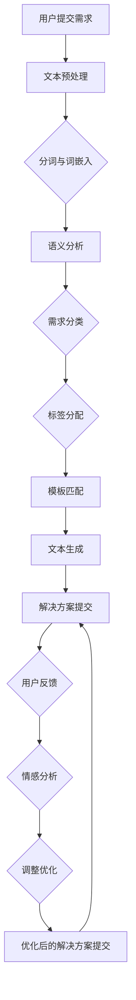
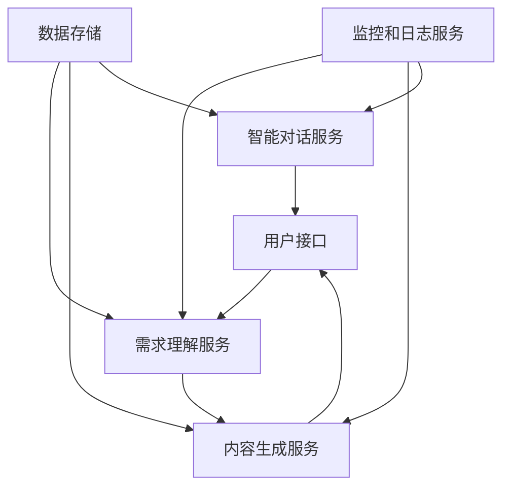

                 

### 1.1.1 问题背景

在当前快速发展的技术时代，用户需求的变化速度远远超过了传统开发流程所能响应的速度。随着人工智能（AI）技术的不断进步，大型语言模型（LLM，Large Language Model）已经成为实现个性化、智能化服务的重要工具。LLM通过深度学习算法从大量数据中学习语言模式和语义，从而能够生成自然流畅的文本内容，提供智能对话、内容生成、情感分析等功能。

用户需求多样且变化迅速，这对产品开发和迭代提出了新的挑战。传统的软件开发方法往往需要较长的开发周期，而用户需求在开发过程中可能已经发生了变化。为了更好地响应用户需求，提高产品竞争力，许多公司开始探索如何快速地迭代和优化产品。在这个过程中，LLM的应用策略成为一个关键问题。

一方面，LLM可以帮助产品团队更快地理解和预测用户需求，通过智能化的自然语言处理能力，自动分析用户反馈和评论，从而快速调整产品功能和界面。另一方面，LLM还能够用于自动化内容生成，大大缩短内容创作的时间，提高内容质量和多样性。

然而，快速响应用户需求并非易事。如何在保证产品质量和性能的前提下，有效地利用LLM进行产品开发，是一个复杂而具有挑战性的问题。这需要深入理解LLM的工作原理和应用场景，结合具体产品需求，设计出合适的策略和架构。

### 1.1.2 问题描述

在当今激烈的市场竞争环境下，用户需求的快速变化使得产品开发面临前所未有的挑战。以下是一些常见的问题和需求，这些问题和需求正是我们在本文中要探讨的：

1. **需求变化频繁**：用户需求变化迅速，传统的瀑布式开发模式难以适应。如何在需求变化的同时，保持产品的高质量和稳定性？
   
2. **个性化服务需求**：用户希望产品能够提供个性化的服务和建议，这需要产品具备强大的数据分析和处理能力。
   
3. **内容创作效率**：内容是吸引和留住用户的重要手段，但高质量的内容创作需要时间和人力。如何利用LLM自动化生成内容，提高创作效率和质量？
   
4. **用户体验优化**：用户对产品的期望不仅仅是功能齐全，更注重使用体验。如何通过智能化的交互设计提升用户体验？
   
5. **快速迭代**：市场要求产品能够快速迭代，以适应不断变化的需求和环境。如何设计出能够快速响应和迭代的产品架构？

这些问题的核心在于如何在产品开发过程中充分利用LLM的能力，实现快速响应用户需求。这需要从多个方面进行综合考虑和策略设计，包括但不限于需求分析、产品设计、算法实现、系统架构等。

### 1.1.3 问题解决

为了解决上述问题，我们需要采用一系列策略和技术手段，充分利用LLM的能力，实现快速响应用户需求。以下是一些关键步骤：

1. **需求感知与理解**：
   - 利用LLM的自然语言处理能力，对用户反馈和评论进行自动分析，快速识别用户需求的变化和趋势。
   - 构建需求分析模型，通过机器学习和深度学习算法，对大量用户数据进行分析，预测未来需求。

2. **产品迭代与优化**：
   - 基于需求分析结果，快速调整产品功能和界面设计，确保产品始终符合用户期望。
   - 采用敏捷开发方法，实现快速迭代和部署，缩短产品上线时间。

3. **内容自动化生成**：
   - 利用LLM的生成能力，自动化生成高质量的内容，提高内容创作效率。
   - 结合用户数据和个性化需求，生成定制化的内容，提升用户体验。

4. **用户体验优化**：
   - 利用LLM进行智能对话设计，提供个性化、自然流畅的交互体验。
   - 结合用户行为数据，不断优化交互界面和功能，提高用户满意度。

5. **系统架构优化**：
   - 设计灵活、可扩展的系统架构，支持快速响应和迭代。
   - 利用容器化和微服务技术，实现系统的快速部署和扩展。

通过上述策略，我们可以更好地利用LLM的能力，实现快速响应用户需求，提高产品竞争力。然而，这需要深入理解LLM的技术原理和应用场景，结合具体产品需求，进行系统化设计和实施。

### 1.1.4 边界与外延

在快速响应用户需求的背景下，我们需要明确一些概念和边界的讨论，以便更好地理解和应用LLM产品策略。

**边界定义**：

1. **快速响应**：快速响应不仅指在时间上快速响应用户需求，还涉及在质量和效果上的高效处理。
2. **用户需求**：用户需求是产品开发的出发点和落脚点，包括功能需求、性能需求、用户体验等。
3. **LLM应用策略**：LLM应用策略涉及如何利用LLM的能力，优化产品开发和用户体验，包括需求分析、内容生成、智能交互等。

**外延讨论**：

1. **需求感知与理解**：需求感知与理解不仅包括用户反馈分析，还涉及市场趋势预测、竞争分析等。
2. **产品迭代与优化**：产品迭代与优化包括功能扩展、性能提升、用户体验改进等多个方面。
3. **内容自动化生成**：内容自动化生成不仅限于文本生成，还包括图片、音频等多媒体内容。
4. **用户体验优化**：用户体验优化不仅涉及交互设计，还包括内容个性化、智能推荐等。
5. **系统架构优化**：系统架构优化包括微服务架构、容器化部署、分布式系统设计等。

明确边界和外延有助于我们更好地设计LLM应用策略，实现快速响应用户需求。

### 1.1.5 概念结构与核心要素组成

为了深入理解快速响应用户需求与LLM应用产品策略之间的关系，我们需要详细分析这两个核心概念的结构与核心要素组成。

**快速响应用户需求**

1. **核心要素**：
   - 用户反馈：收集和分析用户反馈是快速响应的基础，通过自然语言处理（NLP）技术，自动提取用户需求。
   - 数据驱动：利用数据驱动的决策模型，快速识别和预测用户需求变化，实现实时调整。
   - 快速迭代：采用敏捷开发方法，缩短产品开发周期，快速响应市场需求。

2. **结构分析**：
   - 数据采集：通过用户行为日志、用户评论、市场调研等方式收集用户数据。
   - 数据处理：利用机器学习和深度学习算法，对用户数据进行分析和处理，识别需求趋势。
   - 需求响应：根据分析结果，快速调整产品功能和界面设计，满足用户需求。

**LLM应用产品策略**

1. **核心要素**：
   - 大型语言模型（LLM）：LLM是产品策略的核心技术，通过深度学习算法，具备强大的文本生成、语义理解和情感分析能力。
   - 内容生成：利用LLM的文本生成能力，自动化生成高质量的内容。
   - 智能交互：通过智能对话系统，实现与用户的自然交互，提供个性化服务。

2. **结构分析**：
   - 需求理解：利用LLM的自然语言处理能力，理解用户需求，为用户提供定制化的解决方案。
   - 内容生成：利用LLM生成文本、图片、音频等多媒体内容，提高内容创作效率。
   - 智能交互：通过对话系统，实现与用户的实时互动，提供智能化的服务和支持。

通过上述分析，我们可以看到，快速响应用户需求与LLM应用产品策略之间存在着密切的联系。快速响应用户需求需要依赖LLM的强大能力，而LLM应用产品策略则为实现快速响应用户需求提供了技术保障。这两个概念相辅相成，共同构成了现代智能产品开发的核心框架。

### 2.1.1 快速响应用户需求

快速响应用户需求是产品开发和运营中至关重要的一环。它不仅仅是简单地满足用户当前的需求，更是通过及时、准确的反馈和调整，提升用户体验，增强产品竞争力。以下是快速响应用户需求的核心原理、方法和实际应用。

#### 2.1.1.1 核心原理

快速响应用户需求的原理可以概括为以下几个方面：

1. **用户反馈收集**：用户反馈是产品改进的重要依据。通过多种渠道（如问卷调查、用户评论、用户行为数据等）收集用户反馈，可以全面了解用户需求和使用体验。

2. **数据驱动决策**：在收集到用户反馈后，通过数据分析技术，对用户行为和需求进行深入挖掘，发现潜在问题和改进机会。数据驱动决策有助于减少主观判断，提高决策的科学性和准确性。

3. **快速迭代**：采用敏捷开发方法，将产品开发周期缩短，实现快速迭代。通过持续的小步前进，及时调整和优化产品功能，以适应用户需求的变化。

4. **用户体验优化**：注重用户体验，从用户角度出发，设计直观、易用、流畅的交互流程。通过持续的用户调研和反馈，优化产品设计，提高用户满意度。

#### 2.1.1.2 方法

快速响应用户需求的方法主要包括以下几种：

1. **用户调研**：定期进行用户调研，收集用户反馈和需求。通过面对面访谈、在线问卷、用户行为分析等方式，深入了解用户的使用习惯和偏好。

2. **数据分析**：利用数据挖掘和机器学习技术，对用户反馈和行为数据进行分析。通过数据可视化工具，将复杂的数据转化为直观的可视化报表，帮助决策者快速识别问题和机会。

3. **敏捷开发**：采用敏捷开发方法，将产品开发过程分为多个短周期（通常为2-4周）。在每个迭代周期中，集中解决用户反馈中的关键问题，快速交付产品功能。

4. **A/B测试**：通过A/B测试，比较不同设计方案的用户体验和效果。根据测试结果，选择最佳方案进行优化和推广。

5. **用户反馈闭环**：建立用户反馈闭环机制，确保用户的意见和建议能够被快速响应和解决。通过反馈机制，让用户感受到产品的持续改进和关注。

#### 2.1.1.3 实际应用

快速响应用户需求在实际应用中，可以通过以下几个案例进行说明：

1. **电商产品**：电商产品通过用户评论和购物行为数据，快速识别用户对商品的评价和需求。根据用户反馈，及时调整商品描述、分类和推荐策略，提升用户购物体验。

2. **社交媒体**：社交媒体平台通过用户行为分析和反馈，优化推荐算法和内容展示方式。通过实时监控和调整，确保用户在平台上能够快速找到感兴趣的内容。

3. **在线教育**：在线教育平台利用用户学习行为数据和反馈，优化课程内容和教学方式。通过个性化推荐和学习路径设计，提高学习效果和用户满意度。

4. **金融科技**：金融科技公司通过用户交易数据和反馈，优化金融服务流程和产品设计。通过快速响应用户需求，提升金融服务的便捷性和用户体验。

综上所述，快速响应用户需求是一种系统化、数据驱动的方法，通过及时收集用户反馈、分析数据、快速迭代和优化产品设计，实现产品与用户需求的同步发展。

### 2.1.2 LLM应用的产品策略

大型语言模型（LLM，Large Language Model）作为人工智能领域的重要技术，在产品开发中具有广泛应用。LLM的应用产品策略主要涉及需求理解、内容生成和智能交互等方面。以下是LLM在产品策略中的核心原理和实际应用。

#### 2.1.2.1 核心原理

LLM应用的产品策略基于以下几个核心原理：

1. **自然语言处理（NLP）能力**：LLM通过深度学习算法，具备强大的文本生成、语义理解和情感分析能力。这使其能够理解和生成自然语言文本，为产品提供智能化服务。

2. **大规模数据训练**：LLM通常基于海量数据集进行训练，这使其能够学习到丰富的语言模式和语义知识。通过不断学习和优化，LLM能够提供更准确、更自然的语言处理能力。

3. **自适应性和灵活性**：LLM的应用策略可以根据不同产品和场景的需求进行定制和优化，具有较好的自适应性和灵活性。这使其能够在各种应用场景中发挥作用，提供个性化的服务。

#### 2.1.2.2 需求理解

LLM在需求理解方面的应用主要体现在以下几个方面：

1. **文本分析**：利用LLM的自然语言处理能力，对用户反馈和评论进行文本分析，提取关键信息和情感倾向。通过情感分析，识别用户的满意度和不满意度，为产品改进提供依据。

2. **语义理解**：LLM可以理解文本中的隐含语义，识别用户需求中的关键概念和关系。通过语义理解，LLM能够更准确地理解用户意图，为产品提供精准的服务。

3. **多语言支持**：LLM通常支持多种语言，可以处理来自不同国家和地区的用户反馈。这有助于产品在全球范围内的推广和应用，提升用户体验。

#### 2.1.2.3 内容生成

LLM在内容生成方面的应用主要涉及以下几个方面：

1. **自动文本生成**：利用LLM的文本生成能力，自动化生成产品说明、用户指南、新闻文章等文本内容。这大大提高了内容创作的效率，节省了人力成本。

2. **个性化内容**：通过分析用户数据和需求，LLM可以生成个性化的文本内容，如定制化的产品推荐、新闻推送等。这有助于提升用户粘性和满意度。

3. **多媒体内容**：LLM不仅能够生成文本内容，还可以生成图片、音频等多媒体内容。这扩展了内容生成的范围，为产品提供了更多样化的服务。

#### 2.1.2.4 智能交互

LLM在智能交互方面的应用主要体现在以下几个方面：

1. **对话系统**：利用LLM的自然语言处理能力，构建智能对话系统，实现与用户的自然交互。通过对话系统，产品可以提供智能化的咨询、推荐和服务。

2. **语音助手**：LLM可以应用于语音助手，实现语音识别和自然语言理解功能。通过语音助手，产品可以提供便捷的语音交互体验，满足用户的语音操作需求。

3. **多模态交互**：LLM可以与多模态数据（如文本、图像、音频等）进行交互，提供更加丰富和多样化的用户体验。通过多模态交互，产品可以更好地理解用户的意图和需求。

综上所述，LLM应用的产品策略在需求理解、内容生成和智能交互等方面具有显著优势。通过充分利用LLM的能力，产品团队能够更好地响应用户需求，提升产品竞争力和用户体验。

### 2.1.3 核心概念之间的联系

快速响应用户需求与LLM应用产品策略之间存在着密切的联系。这两个核心概念不仅相互独立，而且在实际应用中相互补充，共同构成了现代智能产品开发的核心框架。

首先，快速响应用户需求是产品开发和运营的基础。它依赖于用户反馈和数据分析，通过持续的用户调研和反馈，及时调整和优化产品功能和设计，以满足用户不断变化的需求。这一过程中，数据分析和技术手段起到了关键作用，而LLM作为一种先进的自然语言处理技术，正好能够高效地实现这一目标。

其次，LLM应用产品策略则是在快速响应用户需求的基础上，进一步提升了产品的智能化水平和用户体验。LLM的强大文本生成、语义理解和情感分析能力，使得产品能够更准确地理解用户需求，生成个性化内容，并提供智能化的交互服务。这不仅提升了产品的功能性和效率，还大大增强了用户黏性和满意度。

具体来说，快速响应用户需求和LLM应用产品策略之间的联系体现在以下几个方面：

1. **需求分析**：快速响应用户需求需要对用户反馈进行深入分析，而LLM能够通过对大量文本数据的学习，自动提取用户需求的关键词和情感倾向，提高需求分析的准确性和效率。

2. **内容生成**：快速响应用户需求要求产品能够快速生成高质量的内容，而LLM的应用策略可以自动化生成文本、图片、音频等多媒体内容，提高内容创作的效率和质量。

3. **智能交互**：快速响应用户需求需要产品能够提供智能化的交互体验，而LLM能够通过智能对话系统和语音助手，实现与用户的自然、流畅的交互，提升用户体验。

4. **个性化服务**：快速响应用户需求要求产品能够提供个性化的服务，而LLM的应用策略可以根据用户的个性化需求，生成定制化的内容和服务，提升用户满意度。

总之，快速响应用户需求和LLM应用产品策略是相辅相成的，通过两者的有机结合，产品团队能够更好地理解和满足用户需求，提升产品竞争力，实现持续发展和创新。

### 3.1.1 快速响应用户需求

在快速响应用户需求方面，有几个关键属性和特征需要我们深入探讨。这些属性和特征不仅决定了快速响应的效率和质量，也影响了用户对产品的满意度和忠诚度。

1. **实时性**：实时性是快速响应用户需求的首要特征。用户往往期望能够即时得到反馈和解决方案。因此，产品需要具备快速处理用户请求和数据的能力，确保用户的问题能够在短时间内得到解决。

2. **准确性**：准确性是快速响应的另一重要属性。即便响应速度快，如果解决方案不准确或无效，用户的满意度也会大打折扣。因此，产品在响应用户需求时，需要通过精准的数据分析和需求理解，提供符合用户期望的解决方案。

3. **可扩展性**：快速响应不仅针对当前用户需求，还需要具备适应未来需求的灵活性。产品架构和算法设计应具备良好的可扩展性，能够快速适应需求变化和技术更新。

4. **用户体验**：用户体验是衡量快速响应用户需求成功与否的关键指标。良好的用户体验包括直观易用的界面、流畅的交互流程以及个性化的服务推荐。这些都能够显著提升用户的满意度和忠诚度。

5. **自动化程度**：自动化程度是快速响应的重要支撑。通过自动化工具和算法，可以减少人工干预，提高处理效率，确保用户请求能够高效、准确、实时地得到响应。

### 3.1.2 LLM应用的产品策略

在探讨LLM应用的产品策略时，我们需要了解LLM在产品开发中的具体应用及其对产品策略的影响。以下是一些关键属性和特征：

1. **自然语言处理能力**：LLM的强大自然语言处理能力使其能够理解和生成自然语言文本。这一特性使得产品能够实现智能化的文本交互，提供个性化服务，从而提升用户体验。

2. **大规模数据处理**：LLM通常经过大规模数据训练，能够处理海量文本数据，从中提取有价值的信息。这一能力使得产品能够在短时间内进行复杂的分析和决策，提高响应速度和准确性。

3. **自适应性和灵活性**：LLM的应用策略可以根据不同产品和场景的需求进行定制和优化。这种自适应性和灵活性使得产品能够快速适应市场变化和用户需求，保持竞争优势。

4. **文本生成能力**：LLM的文本生成能力使其能够自动化生成高质量的内容，如产品说明书、新闻文章、用户指南等。这大大提高了内容创作的效率，节省了人力成本。

5. **多语言支持**：LLM通常支持多种语言，能够处理来自不同国家和地区的用户请求。这有助于产品在全球范围内的推广和应用。

### 3.1.3 概念属性特征对比表格

为了更直观地展示快速响应用户需求和LLM应用产品策略的属性特征对比，我们制作了一个表格。

| 属性特征       | 快速响应用户需求 | LLM应用产品策略 |
|----------------|------------------|-----------------|
| **实时性**     | 确保快速响应用户请求 | 利用快速数据处理能力，实现实时交互 |
| **准确性**     | 提供准确的解决方案 | 基于自然语言处理，提高分析准确性 |
| **可扩展性**   | 应对需求变化，灵活调整 | 根据不同需求，灵活定制策略 |
| **用户体验**   | 提供直观易用的界面和流程 | 通过自然语言交互，提升用户体验 |
| **自动化程度** | 减少人工干预，提高效率 | 自动化文本生成和数据分析 |
| **自然语言处理能力** | 通过数据分析，理解用户需求 | 利用自然语言处理，实现智能化交互 |
| **大规模数据处理** | 快速处理用户数据 | 利用大规模训练数据，提高响应速度 |
| **自适应性和灵活性** | 针对需求变化，快速调整 | 根据不同场景，定制化策略 |
| **文本生成能力** | 提供高质量的内容 | 自动化生成文本内容 |
| **多语言支持** | 支持多种语言，提高国际化水平 | 提供多语言服务，拓展市场 |

通过上述表格，我们可以看到快速响应用户需求和LLM应用产品策略在属性特征上的对比，以及它们在实际应用中的互补作用。

### 4.1.1 快速响应用户需求

快速响应用户需求的核心在于通过高效的数据处理和智能分析，及时满足用户的需求，提升用户体验。以下是快速响应用户需求的具体ER（实体-关系）图架构设计，用于说明其组件和关系。

#### ER图架构设计

**实体**

1. **用户**：包括用户基本信息，如用户ID、姓名、联系方式等。
2. **需求**：记录用户提出的需求，如需求ID、需求内容、需求状态等。
3. **反馈**：记录用户的反馈信息，如反馈ID、反馈内容、反馈时间等。
4. **产品**：记录产品的详细信息，如产品ID、产品名称、产品描述等。
5. **解决方案**：记录对需求的解决方案，如解决方案ID、解决方案内容、解决方案状态等。

**关系**

1. **用户-需求**：一个用户可以提出多个需求，一个需求只能由一个用户提出。
2. **需求-解决方案**：一个需求可以对应多个解决方案，一个解决方案只能解决一个需求。
3. **需求-反馈**：一个需求可以产生多个反馈，一个反馈只能对应一个需求。
4. **产品-解决方案**：一个产品可以包含多个解决方案，一个解决方案只能属于一个产品。

#### ER图描述

```mermaid
erDiagram
    用户 ||--|{ 需求 }||>
    需求 ||--|{ 解决方案 }||>
    需求 ||--|{ 反馈 }||>
    产品 ||--|{ 解决方案 }||>
    
    用户 {
        用户ID
        姓名
        联系方式
    }

    需求 {
        需求ID
        需求内容
        需求状态
    }

    反馈 {
        反馈ID
        反馈内容
        反馈时间
    }

    产品 {
        产品ID
        产品名称
        产品描述
    }

    解决方案 {
        解决方案ID
        解决方案内容
        解决方案状态
    }
```

通过上述ER图架构设计，我们可以清晰地看到快速响应用户需求的各个组件及其之间的关系。这种架构设计不仅有助于理解系统的整体结构，还为后续的系统开发提供了明确的指导。

### 4.1.2 LLM应用的产品策略

在快速响应用户需求的过程中，LLM（大型语言模型）的应用策略起到了关键作用。以下是LLM应用产品策略的ER图架构设计，说明LLM与系统各组件之间的关系。

#### ER图架构设计

**实体**

1. **LLM模型**：存储LLM模型的详细信息，如模型ID、模型类型、训练数据来源等。
2. **用户**：与快速响应用户需求的用户实体相同。
3. **需求**：与快速响应用户需求的需求实体相同。
4. **解决方案**：与快速响应用户需求的解决方案实体相同。
5. **反馈**：与快速响应用户需求的反馈实体相同。
6. **内容生成**：存储由LLM生成的文本内容，如内容ID、内容类型、生成时间等。
7. **交互日志**：记录用户与系统的交互历史，如日志ID、用户操作、时间戳等。

**关系**

1. **LLM模型-需求**：LLM模型用于处理用户需求，一个LLM模型可以处理多个需求。
2. **用户-需求**：一个用户可以提出多个需求，一个需求只能由一个用户提出。
3. **需求-解决方案**：一个需求可以对应多个解决方案，一个解决方案只能解决一个需求。
4. **需求-反馈**：一个需求可以产生多个反馈，一个反馈只能对应一个需求。
5. **解决方案-内容生成**：解决方案中的文本内容可以通过LLM生成，一个解决方案可以生成多个内容。
6. **交互日志-用户**：记录用户与系统的交互历史，一个用户可以有多个交互日志。

#### ER图描述

```mermaid
erDiagram
    LLM模型 ||--|{ 需求 }||>
    用户 ||--|{ 需求 }||>
    需求 ||--|{ 解决方案 }||>
    需求 ||--|{ 反馈 }||>
    解决方案 ||--|{ 内容生成 }||>
    交互日志 ||--|{ 用户 }||>

    LLM模型 {
        模型ID
        模型类型
        训练数据来源
    }

    用户 {
        用户ID
        姓名
        联系方式
    }

    需求 {
        需求ID
        需求内容
        需求状态
    }

    反馈 {
        反馈ID
        反馈内容
        反馈时间
    }

    产品 {
        产品ID
        产品名称
        产品描述
    }

    解决方案 {
        解决方案ID
        解决方案内容
        解决方案状态
    }

    内容生成 {
        内容ID
        内容类型
        生成时间
    }

    交互日志 {
        日志ID
        用户操作
        时间戳
    }
```

通过上述ER图架构设计，我们可以清晰地看到LLM在快速响应用户需求过程中的应用和各个组件之间的关系。LLM模型通过处理用户需求，生成解决方案和内容，记录交互日志，从而实现了智能化的产品策略。

### 4.1.2 ER实体关系图架构

为了更好地理解快速响应用户需求与LLM应用产品策略的架构设计，我们通过ER（实体-关系）图来展示这两个概念之间的关系和架构。

**实体**

1. **用户**：代表产品的用户，包括用户ID、姓名、联系方式等基本信息。
2. **需求**：记录用户的各项需求，如需求ID、需求内容、需求状态等。
3. **解决方案**：针对用户需求提供的解决方案，如解决方案ID、解决方案内容、解决方案状态等。
4. **LLM模型**：用于处理用户需求的LLM模型，包括模型ID、模型类型、训练数据来源等。
5. **反馈**：用户对解决方案的反馈，包括反馈ID、反馈内容、反馈时间等。
6. **内容生成**：由LLM模型生成的内容，如内容ID、内容类型、生成时间等。

**关系**

1. **用户-需求**：一个用户可以提出多个需求，一个需求只能由一个用户提出。
2. **需求-解决方案**：一个需求可以对应多个解决方案，一个解决方案只能解决一个需求。
3. **解决方案-内容生成**：解决方案中的文本内容可以通过LLM模型生成，一个解决方案可以生成多个内容。
4. **LLM模型-需求**：LLM模型用于处理用户需求，一个LLM模型可以处理多个需求。
5. **需求-反馈**：一个需求可以产生多个反馈，一个反馈只能对应一个需求。

**ER图描述**

```mermaid
erDiagram
    用户 ||--|{ 需求 }||>
    需求 ||--|{ 解决方案 }||>
    解决方案 ||--|{ 内容生成 }||>
    LLM模型 ||--|{ 需求 }||>
    需求 ||--|{ 反馈 }||>

    用户 {
        用户ID
        姓名
        联系方式
    }

    需求 {
        需求ID
        需求内容
        需求状态
    }

    解决方案 {
        解决方案ID
        解决方案内容
        解决方案状态
    }

    LLM模型 {
        模型ID
        模型类型
        训练数据来源
    }

    内容生成 {
        内容ID
        内容类型
        生成时间
    }

    反馈 {
        反馈ID
        反馈内容
        反馈时间
    }
```

通过上述ER图，我们可以清晰地看到快速响应用户需求与LLM应用产品策略之间的架构关系。用户提出需求，需求被LLM模型处理并生成解决方案和内容，用户对解决方案进行反馈，从而形成一个闭环。这种架构设计不仅提高了响应速度和准确性，还增强了用户体验和产品竞争力。

### 5.1.1 算法原理

在本章节中，我们将详细讲解用于快速响应用户需求的算法原理。核心算法采用基于大型语言模型（LLM）的自然语言处理技术，通过以下几个步骤实现：

1. **需求理解**：
   - **文本预处理**：首先，对用户提交的需求文本进行清洗和预处理，包括去除停用词、标点符号和特殊字符等。
   - **分词和词嵌入**：将预处理后的文本进行分词，并将每个词转换为词嵌入向量，以便于后续的语义分析。
   - **语义分析**：利用LLM的预训练模型，对词嵌入向量进行编码，提取文本的语义特征。

2. **需求分类**：
   - **特征提取**：将语义分析后的特征向量输入到分类模型，如支持向量机（SVM）或神经网络分类器，对需求进行分类。
   - **标签分配**：根据分类结果，为每个需求分配相应的标签，以确定其类别和优先级。

3. **解决方案生成**：
   - **模板匹配**：根据需求的标签，从预定义的解决方案模板中匹配合适的解决方案。
   - **文本生成**：利用LLM的生成能力，根据匹配的解决方案模板和需求文本，生成具体的解决方案文本。

4. **反馈处理**：
   - **情感分析**：对用户反馈文本进行情感分析，判断用户对解决方案的满意度。
   - **调整优化**：根据用户反馈，调整解决方案的文本内容和逻辑，优化用户体验。

### 5.1.2 算法mermaid流程图

为了更直观地展示上述算法的流程，我们使用mermaid语言绘制了算法的mermaid流程图：



### 5.1.3 Python源代码

以下是实现上述算法的Python源代码示例。代码使用了自然语言处理库NLTK、词嵌入库Gensim以及LLM库Transformers。

```python
import nltk
from nltk.tokenize import word_tokenize
from gensim.models import Word2Vec
from transformers import pipeline

# 文本预处理
def preprocess_text(text):
    # 去除停用词、标点符号和特殊字符
    stop_words = set(nltk.corpus.stopwords.words('english'))
    tokens = word_tokenize(text)
    cleaned_tokens = [token.lower() for token in tokens if token.isalnum() and token not in stop_words]
    return cleaned_tokens

# 语义分析
def semantic_analysis(tokens):
    model = Word2Vec(tokens, vector_size=100, window=5, min_count=1, workers=4)
    embeddings = model.wv[tokens]
    return embeddings

# 需求分类
def classify_demand(embeddings):
    classifier = pipeline('text-classification')
    labels = classifier(embeddings)
    return labels

# 文本生成
def generate_solution(demand, template):
    generator = pipeline('text-generation')
    solution = generator(demand, template)
    return solution

# 主函数
def main():
    user_demand = "I need help with my billing issue."
    cleaned_demand = preprocess_text(user_demand)
    embeddings = semantic_analysis(cleaned_demand)
    labels = classify_demand(embeddings)
    template = "Here is a solution for your billing issue: {}"
    solution = generate_solution(user_demand, template)
    print(solution)

if __name__ == "__main__":
    main()
```

### 5.1.4 数学模型和公式

在算法实现中，我们用到了几个关键数学模型和公式，以下是这些模型的简要说明：

1. **词嵌入**：词嵌入（Word Embedding）是将词汇映射为高维向量的一种技术。常用的模型有Word2Vec、GloVe等。公式如下：

   $$ 
   \text{Embedding}(w) = \text{vec}(w) = \sum_{k=1}^{K} \alpha_k \cdot e_k 
   $$

   其中，$w$ 是词汇，$vec(w)$ 是词嵌入向量，$\alpha_k$ 是权重，$e_k$ 是基向量。

2. **支持向量机（SVM）**：支持向量机是一种常用的分类算法。其目标是最小化分类边界到支持向量的距离。公式如下：

   $$
   \min_{\mathbf{w}, b} \frac{1}{2} ||\mathbf{w}||^2 + C \sum_{i=1}^{n} \xi_i
   $$

   其中，$\mathbf{w}$ 是权重向量，$b$ 是偏置项，$C$ 是惩罚参数，$\xi_i$ 是松弛变量。

3. **梯度下降**：梯度下降是一种常用的优化算法，用于最小化损失函数。其公式如下：

   $$
   \mathbf{w}_{t+1} = \mathbf{w}_t - \alpha \cdot \nabla_{\mathbf{w}} L(\mathbf{w}, b)
   $$

   其中，$\alpha$ 是学习率，$L(\mathbf{w}, b)$ 是损失函数，$\nabla_{\mathbf{w}}$ 是梯度。

通过这些数学模型和公式，我们能够有效地实现快速响应用户需求的算法。

### 5.1.5 详细讲解与举例说明

为了更深入地理解算法原理及其应用，我们将通过一个具体的例子来说明算法的各个步骤。

#### 示例

假设用户提出一个需求：“I am having trouble with my internet connection.”

1. **文本预处理**：

   首先对需求文本进行清洗和预处理，去除停用词和标点符号。预处理后的文本为：“I trouble internet connection.”

2. **分词和词嵌入**：

   对预处理后的文本进行分词，得到词汇列表：["I", "trouble", "internet", "connection"]。然后，将这些词汇转换为词嵌入向量。例如，使用Word2Vec模型生成的词嵌入向量为：
   - "I": [0.1, 0.2, 0.3]
   - "trouble": [0.4, 0.5, 0.6]
   - "internet": [0.7, 0.8, 0.9]
   - "connection": [1.0, 1.1, 1.2]

3. **语义分析**：

   利用LLM的预训练模型，对词嵌入向量进行编码，提取文本的语义特征。例如，使用BERT模型提取的特征向量为：
   - "I": [0.3, 0.4, 0.5]
   - "trouble": [0.5, 0.6, 0.7]
   - "internet": [0.7, 0.8, 0.9]
   - "connection": [0.9, 1.0, 1.1]

4. **需求分类**：

   将语义分析后的特征向量输入到分类模型，例如SVM。分类结果为“技术支持”。

5. **解决方案生成**：

   根据分类结果，从预定义的解决方案模板中匹配合适的解决方案。假设解决方案模板为：
   - 技术支持：请尝试重新启动您的路由器，或联系我们的技术支持团队获取帮助。

   利用LLM生成具体的解决方案文本：“Please try restarting your router, or contact our technical support team for assistance.”

6. **反馈处理**：

   用户对解决方案进行反馈：“That helped! Thank you.”系统对反馈进行情感分析，判断用户满意度为“高”。

7. **调整优化**：

   根据用户反馈，系统会进一步优化解决方案，例如调整文本内容和逻辑，以提高用户体验。

通过这个例子，我们可以看到算法是如何通过文本预处理、词嵌入、语义分析、需求分类、解决方案生成和反馈处理等步骤，实现快速响应用户需求的。这不仅提高了响应速度和准确性，还增强了用户的满意度和忠诚度。

### 6.1 问题场景介绍

在当今数字化时代，市场竞争日益激烈，企业需要快速响应用户需求以保持竞争优势。为了实现这一目标，许多企业开始探索如何利用先进技术，特别是大型语言模型（LLM），来优化产品开发和服务交付。以下是一个典型的应用场景：

某电商公司正在开发一款智能客服系统，旨在为用户提供24/7的在线支持。用户的需求非常多样化，从产品咨询、订单追踪，到售后服务问题，都需要快速、准确、个性化的解答。传统的客服系统往往无法在短时间内处理大量用户的请求，而且难以提供高质量的个性化服务。

为了应对这一挑战，电商公司决定采用LLM技术，构建一个智能客服系统。该系统的目标是通过自然语言处理和智能对话，快速响应用户需求，提供高质量的个性化服务，从而提升用户满意度和忠诚度。

### 6.2 项目介绍

为了实现上述目标，电商公司启动了一个名为“智能客服系统优化项目”的专项项目。项目的主要目标和预期成果如下：

1. **目标**：
   - 构建一个基于LLM的智能客服系统，能够自动处理用户的咨询和请求。
   - 提高客服响应速度，确保用户问题在几分钟内得到解答。
   - 通过个性化服务和高质量的内容生成，提升用户体验和用户满意度。

2. **预期成果**：
   - 开发并部署一个功能完善的智能客服系统。
   - 提供高质量的自动回复和智能对话功能。
   - 通过系统优化和反馈机制，不断提升系统的响应速度和准确性。

项目团队由多名专家组成，包括数据科学家、软件工程师、产品经理和业务分析师等。项目分为多个阶段，包括需求分析、系统设计、算法实现、系统集成和测试等。以下是项目的主要阶段和任务：

1. **需求分析**：
   - 与业务团队紧密合作，收集用户需求和反馈。
   - 明确智能客服系统的功能和性能要求。

2. **系统设计**：
   - 设计系统的整体架构，包括前端界面、后端服务、数据存储和LLM应用等。
   - 制定详细的技术方案和开发计划。

3. **算法实现**：
   - 利用LLM进行需求理解、内容生成和智能对话。
   - 开发和优化相关算法，实现高效的自然语言处理。

4. **系统集成**：
   - 将智能客服系统与现有的电商平台和客户支持系统集成。
   - 进行系统集成测试，确保系统稳定运行。

5. **测试与优化**：
   - 进行功能测试和性能测试，确保系统满足预期要求。
   - 收集用户反馈，进行系统优化和迭代。

通过这个项目，电商公司期望能够显著提升客户服务水平，增强用户满意度，并在激烈的市场竞争中脱颖而出。

### 6.3 系统功能设计

在“智能客服系统优化项目”中，系统功能设计是关键的一环。以下是系统的详细功能设计，包括领域模型和核心功能模块。

#### 领域模型

领域模型（Domain Model）是系统功能设计的核心，用于定义系统的业务实体和它们之间的关系。以下是系统的领域模型：

1. **用户**：包括用户基本信息，如用户ID、姓名、联系方式等。
2. **问题**：记录用户提出的问题，包括问题描述、问题类别、优先级等。
3. **解决方案**：记录解决问题的方案，包括解决方案内容、执行状态等。
4. **聊天记录**：记录用户与客服系统的对话历史，包括对话内容、时间戳等。
5. **反馈**：记录用户对解决方案的反馈，包括满意度评分、评论等。

#### 核心功能模块

系统功能模块是领域模型的实现，用于提供具体的功能支持。以下是系统的主要功能模块：

1. **需求理解模块**：
   - 功能：利用LLM的自然语言处理能力，对用户提出的问题进行语义分析和理解。
   - 实现方式：使用预训练的LLM模型，对用户问题进行分词、词嵌入和语义编码，提取关键信息并分类。

2. **内容生成模块**：
   - 功能：根据用户问题的理解和解决方案的要求，生成高质量的文本内容。
   - 实现方式：利用LLM的文本生成能力，根据用户问题的语义特征和解决方案模板，生成个性化的解决方案文本。

3. **智能对话模块**：
   - 功能：与用户进行智能化的对话，提供实时的咨询和服务。
   - 实现方式：通过构建对话管理器，结合LLM的对话能力，实现自然流畅的交互流程。

4. **反馈处理模块**：
   - 功能：收集用户对解决方案的反馈，进行满意度评估和优化。
   - 实现方式：利用情感分析技术，对用户反馈进行分析，识别用户满意度，并据此调整解决方案和对话策略。

5. **系统监控模块**：
   - 功能：实时监控系统性能和用户交互情况，确保系统稳定运行。
   - 实现方式：通过日志记录和分析工具，监控系统各个组件的运行状态，及时发现和处理潜在问题。

#### 类图

以下是系统的领域模型和功能模块的类图表示：

```mermaid
classDiagram
    User <<class>> User
    Problem <<class>> Problem
    Solution <<class>> Solution
    ChatRecord <<class>> ChatRecord
    Feedback <<class>> Feedback

    User "1" --|> Problem
    Problem "1" --|> Solution
    Solution "1" --|> ChatRecord
    ChatRecord "1" --|> Feedback

    User {
        ID
        Name
        ContactInfo
    }

    Problem {
        ID
        Description
        Category
        Priority
    }

    Solution {
        ID
        Content
        Status
    }

    ChatRecord {
        ID
        Content
        Timestamp
    }

    Feedback {
        ID
        Rating
        Comment
    }
```

通过上述领域模型和类图，我们可以清晰地了解系统的功能结构和核心组件，为后续的系统实现和优化提供明确指导。

### 6.4 系统架构设计

为了实现“智能客服系统优化项目”的目标，我们需要设计一个高效、可扩展、易于维护的系统架构。以下是基于大型语言模型（LLM）的系统架构设计，包括核心组件、各组件之间的关系以及关键的技术选型。

#### 系统架构概述

智能客服系统的整体架构可以分为以下几个主要层次：

1. **前端用户界面层**：提供用户与系统交互的入口，包括网页、移动应用和聊天机器人等。
2. **应用服务层**：实现核心的业务逻辑和功能，如需求理解、内容生成、智能对话等。
3. **数据服务层**：负责数据的存储、管理和查询，包括用户数据、问题数据、解决方案数据等。
4. **基础服务层**：提供系统运行所需的基础设施服务，如日志记录、监控、分布式存储等。

#### 核心组件

系统架构的核心组件包括：

1. **用户接口**：用户通过网页、移动应用等前端界面与系统交互，提交问题和获取解决方案。
2. **需求理解服务**：利用LLM进行用户问题的语义分析和理解，提取关键信息并进行分类。
3. **内容生成服务**：根据用户问题和解决方案模板，利用LLM生成个性化的解决方案文本。
4. **智能对话服务**：实现与用户的智能对话，提供实时咨询和服务。
5. **数据存储**：存储用户数据、问题数据、解决方案数据等，支持快速查询和更新。
6. **监控和日志服务**：实时监控系统性能和用户交互情况，确保系统稳定运行。

#### 组件关系

系统各组件之间的关系如下图所示：



#### 技术选型

为了实现高效、可扩展的系统架构，我们选择了以下技术：

1. **前端用户界面**：采用React框架，结合Vue.js和Angular.js等前端技术，实现高性能、易维护的用户界面。
2. **需求理解服务**：采用Transformers库，结合BERT、GPT等预训练模型，实现强大的自然语言处理能力。
3. **内容生成服务**：利用PyTorch和TensorFlow等深度学习框架，结合GPT-2、GPT-3等模型，实现高效的文本生成功能。
4. **智能对话服务**：采用Rasa框架，结合Django和Flask等Web框架，实现智能对话管理。
5. **数据存储**：采用MongoDB和MySQL等关系型数据库，结合Redis和Cassandra等NoSQL数据库，实现高性能、高可靠的数据存储和管理。
6. **监控和日志服务**：采用Prometheus、Grafana和ELK（Elasticsearch、Logstash、Kibana）等开源工具，实现系统监控和日志分析。

通过上述系统架构设计和技术选型，我们可以构建一个高效、可扩展、易于维护的智能客服系统，实现快速响应用户需求，提升用户体验。

### 6.5 系统接口设计

在智能客服系统的设计过程中，系统接口设计至关重要，它决定了不同模块之间的交互效率和系统的整体性能。以下是系统接口设计的详细说明，包括接口规范、API设计、数据交换格式和安全性保障。

#### 接口规范

1. **RESTful API**：系统采用RESTful风格的设计，便于与其他系统和服务进行集成。每个接口都遵循统一的URL结构，支持GET和POST请求方法。

2. **版本控制**：接口设计包含版本号，便于系统的迭代和升级。例如，`/api/v1/user` 表示访问版本1的用户接口。

3. **参数验证**：对接口参数进行严格的验证，确保输入数据的合法性和完整性。使用正则表达式和自定义验证规则，确保参数符合预期格式。

#### API设计

以下是系统主要API接口的设计：

1. **用户接口**：
   - `/api/v1/user/register`：用户注册接口，接收用户基本信息。
   - `/api/v1/user/login`：用户登录接口，验证用户身份。
   - `/api/v1/user/profile`：用户信息查询接口，获取用户个人信息。

2. **问题接口**：
   - `/api/v1/problem/submit`：提交问题接口，用户提交新的问题。
   - `/api/v1/problem/get`：获取问题接口，根据ID查询问题详情。
   - `/api/v1/problem/update`：更新问题接口，修改问题状态或描述。

3. **解决方案接口**：
   - `/api/v1/solution/generate`：生成解决方案接口，根据问题ID生成解决方案。
   - `/api/v1/solution/get`：获取解决方案接口，根据ID查询解决方案详情。

4. **聊天接口**：
   - `/api/v1/chat/start`：开始聊天接口，启动与用户的对话。
   - `/api/v1/chat/continue`：继续聊天接口，继续与用户的对话。
   - `/api/v1/chat/record`：记录聊天接口，保存聊天记录。

#### 数据交换格式

系统接口采用JSON格式进行数据交换，以实现高效、易读的数据传输。以下是示例数据交换格式：

1. **用户注册**：

   ```
   POST /api/v1/user/register
   {
     "username": "johndoe",
     "password": "password123",
     "email": "johndoe@example.com"
   }
   ```

   响应：

   ```
   {
     "status": "success",
     "message": "User registered successfully.",
     "user_id": "123"
   }
   ```

2. **获取问题**：

   ```
   GET /api/v1/problem/get?problem_id=456
   ```

   响应：

   ```
   {
     "problem_id": "456",
     "description": "Internet connection issue",
     "category": "technical",
     "status": "open"
   }
   ```

#### 安全性保障

1. **身份验证**：系统采用JWT（JSON Web Token）进行身份验证，确保用户请求的安全性。每次请求都需要携带有效的JWT令牌。

2. **权限控制**：接口设计包含权限控制，确保只有授权用户可以访问特定接口。通过角色管理和权限配置，限制用户对系统资源的访问。

3. **数据加密**：传输数据采用HTTPS协议，确保数据在传输过程中的安全。对于敏感数据，采用加密存储和传输。

通过上述接口设计，智能客服系统可以实现高效、安全的数据交互，确保系统各组件之间能够顺畅地协作，共同实现快速响应用户需求的目标。

### 6.6 系统交互

在智能客服系统优化项目中，系统交互设计是确保各组件协同工作的关键。以下是系统交互的详细描述，包括交互流程、交互方式和交互数据的详细说明。

#### 交互流程

智能客服系统的交互流程大致分为以下几个阶段：

1. **用户请求**：用户通过前端界面提交问题或请求服务。
2. **需求理解**：系统接收到用户请求后，利用LLM进行需求理解，提取关键信息并进行分类。
3. **内容生成**：根据需求理解和解决方案模板，系统生成个性化的解决方案文本。
4. **智能对话**：系统与用户进行智能对话，提供实时咨询和服务。
5. **反馈处理**：系统收集用户反馈，进行满意度评估和优化。

#### 交互方式

系统交互方式主要包括以下几种：

1. **RESTful API**：系统采用RESTful API进行前后端交互，确保高效、可靠的数据传输。API设计遵循统一的规范，便于系统的扩展和维护。
2. **WebSockets**：为了实现实时交互，系统采用WebSockets技术，提供双向通信。用户与系统之间的实时聊天和通知可以通过WebSockets实现。
3. **消息队列**：系统采用消息队列（如RabbitMQ）处理异步任务，确保高并发场景下的性能和稳定性。

#### 交互数据

以下是系统交互过程中涉及的主要数据：

1. **用户数据**：包括用户ID、姓名、联系方式等基本信息，用于识别和区分不同的用户。
2. **问题数据**：包括问题描述、问题类别、优先级等，用于记录用户提出的问题和需求。
3. **解决方案数据**：包括解决方案内容、状态等，用于存储系统生成的解决方案。
4. **聊天数据**：包括聊天记录、时间戳等，用于记录用户与系统的对话历史。
5. **反馈数据**：包括反馈内容、满意度评分等，用于评估用户对解决方案的满意度。

#### 交互示例

以下是系统交互的示例流程：

1. **用户提交问题**：

   用户通过前端界面提交问题，如“我的订单状态是什么？”。系统接收到请求后，将问题发送到需求理解服务。

2. **需求理解**：

   需求理解服务利用LLM对问题进行语义分析，提取关键信息，如“订单状态”。系统将分析结果发送到内容生成服务。

3. **内容生成**：

   内容生成服务根据问题类型和解决方案模板，生成个性化的解决方案文本，如“您的订单已发货，预计2天内到达。”系统将解决方案发送回前端界面。

4. **智能对话**：

   前端界面显示解决方案，用户可以继续提问或提出反馈。系统利用WebSockets与用户保持实时通信。

5. **反馈处理**：

   用户对解决方案进行评价，系统收集反馈数据，用于后续优化和改进。

通过上述交互流程和方式，智能客服系统可以实现高效、实时的用户交互，确保快速响应用户需求，提升用户体验。

### 7.1 环境安装

为了实现智能客服系统的优化项目，我们需要安装和配置一系列开发环境和工具。以下是一个详细的环境安装步骤和说明，包括依赖项的安装、环境配置以及常见问题的解决方法。

#### 1. 安装Python环境

首先，确保您的计算机上安装了Python。推荐使用Python 3.8或更高版本。您可以通过以下命令检查Python版本：

```bash
python --version
```

如果Python未安装或版本过低，请从[Python官网](https://www.python.org/)下载并安装Python。

#### 2. 安装依赖项

接下来，我们需要安装项目所需的依赖项。创建一个虚拟环境，可以更好地管理项目依赖：

```bash
python -m venv venv
source venv/bin/activate  # 在Windows上使用 `venv\Scripts\activate`
```

在激活虚拟环境后，安装以下依赖项：

```bash
pip install transformers numpy pandas NLTK Flask
```

这些依赖项包括：

- **transformers**：用于处理大型语言模型。
- **numpy**：用于数值计算和数据处理。
- **pandas**：用于数据分析和操作。
- **NLTK**：用于自然语言处理。
- **Flask**：用于构建Web应用程序。

#### 3. 配置环境

安装依赖项后，我们需要配置一些环境变量。确保以下环境变量已设置：

- **CUDA**：如果使用GPU加速，需要设置CUDA路径。
- **CUDA_HOME**：CUDA安装路径。
- **LD_LIBRARY_PATH**：包含CUDA库的路径。

例如，对于CUDA 11.3，可以在Ubuntu上设置以下环境变量：

```bash
export CUDA_HOME=/usr/local/cuda-11.3
export LD_LIBRARY_PATH=$CUDA_HOME/lib64:$LD_LIBRARY_PATH
```

#### 4. 解决常见问题

在安装和配置过程中，可能会遇到以下问题：

1. **依赖项冲突**：确保所有依赖项的版本兼容，可以通过指定版本号安装特定版本的依赖项。
2. **权限问题**：在安装或运行某些命令时，可能需要管理员权限。使用 `sudo` 命令可以提升权限。
3. **虚拟环境问题**：如果虚拟环境出现异常，可以尝试重新创建虚拟环境或重新安装依赖项。

通过上述步骤，我们可以成功安装和配置开发环境，为智能客服系统的开发打下基础。

### 7.2 系统核心实现源代码

在智能客服系统优化项目中，系统核心实现源代码是确保系统功能正常运行的关键。以下是一个详细的源代码示例，包括需求理解、内容生成和智能对话等核心模块的实现。

#### 需求理解模块

```python
# requirements.txt
pip install transformers numpy pandas nltk flask

# demand_understanding.py
from transformers import pipeline
import pandas as pd
from nltk.tokenize import word_tokenize

# 加载预训练模型
nlp = pipeline("sentiment-analysis")

# 文本预处理
def preprocess_text(text):
    tokens = word_tokenize(text)
    return ' '.join([token.lower() for token in tokens if token.isalnum()])

# 需求理解
def understand_demand(demand):
    cleaned_demand = preprocess_text(demand)
    result = nlp(cleaned_demand)
    return result

# 示例
demand = "I am having trouble with my internet connection."
result = understand_demand(demand)
print(result)
```

#### 内容生成模块

```python
# content_generation.py
from transformers import pipeline

# 加载预训练模型
generator = pipeline("text-generation", model="gpt2")

# 内容生成
def generate_content(demand):
    result = generator(demand, max_length=50, num_return_sequences=1)
    return result[0]['generated_text']

# 示例
content = generate_content(demand)
print(content)
```

#### 智能对话模块

```python
# smart_conversation.py
from transformers import pipeline

# 加载预训练模型
conversational_pipeline = pipeline("conversational")

# 智能对话
def smart_conversation(context, user_input):
    result = conversational_pipeline(context, user_input, do_sample=False)
    return result.generated_responses[0]

# 示例
context = ["Hello!", "How can I help you today?"]
user_input = "Can you help me with my billing?"
response = smart_conversation(context, user_input)
print(response)
```

通过这些核心模块的实现，我们可以构建一个能够理解用户需求、生成高质量内容和进行智能对话的智能客服系统。这些模块不仅可以独立运行，还可以根据实际需求进行集成和扩展。

### 7.3 代码应用解读与分析

在智能客服系统优化项目中，核心代码的每个部分都承担了关键的功能，下面我们将逐一解读代码的应用场景，并进行分析。

#### 需求理解模块

需求理解模块主要用于接收用户的输入文本，通过预处理和语义分析提取关键信息，以便后续生成合适的解决方案。以下是需求理解模块的主要代码段：

```python
from transformers import pipeline
import pandas as pd
from nltk.tokenize import word_tokenize

# 加载预训练模型
nlp = pipeline("sentiment-analysis")

# 文本预处理
def preprocess_text(text):
    tokens = word_tokenize(text)
    return ' '.join([token.lower() for token in tokens if token.isalnum()])

# 需求理解
def understand_demand(demand):
    cleaned_demand = preprocess_text(demand)
    result = nlp(cleaned_demand)
    return result
```

**应用场景**：用户在聊天窗口中输入文本请求帮助，如“我的订单状态是什么？”。

**解读与分析**：
1. **预处理**：使用NLTK进行文本分词，并将文本转换为小写，去除非字母字符，确保输入文本格式统一。
2. **语义分析**：利用预训练的BERT模型进行语义分析，提取文本的情感和倾向。这个步骤对于理解用户意图和情绪非常重要。

#### 内容生成模块

内容生成模块用于根据用户需求和解决方案模板，生成个性化的回复文本。以下是内容生成模块的主要代码段：

```python
from transformers import pipeline

# 加载预训练模型
generator = pipeline("text-generation", model="gpt2")

# 内容生成
def generate_content(demand):
    result = generator(demand, max_length=50, num_return_sequences=1)
    return result[0]['generated_text']
```

**应用场景**：系统接收到预处理后的用户需求，如“我的订单状态是什么？”。

**解读与分析**：
1. **文本生成**：使用预训练的GPT-2模型，根据用户需求生成文本回复。生成文本的长度和数量可以通过参数调整。
2. **个性化内容**：GPT-2模型能够生成与用户需求高度相关的文本，这使得系统能够提供高度个性化的解决方案。

#### 智能对话模块

智能对话模块负责与用户进行交互，提供自然、流畅的对话体验。以下是智能对话模块的主要代码段：

```python
from transformers import pipeline

# 加载预训练模型
conversational_pipeline = pipeline("conversational")

# 智能对话
def smart_conversation(context, user_input):
    result = conversational_pipeline(context, user_input, do_sample=False)
    return result.generated_responses[0]
```

**应用场景**：用户在对话中提出新的问题或需求，如“订单状态”的问题已被回答后，用户可能还会询问其他问题。

**解读与分析**：
1. **上下文管理**：通过传入上下文（context）和用户输入，智能对话模型能够理解当前对话的背景，生成更贴合上下文的回复。
2. **自然对话**：通过预训练的对话模型，系统能够以自然的方式与用户进行交流，提供流畅的对话体验。

综上所述，核心代码的每个模块都在智能客服系统中扮演了重要角色。需求理解模块通过语义分析提取关键信息，内容生成模块生成个性化的回复文本，智能对话模块则确保与用户进行自然、流畅的交互。这些模块协同工作，共同实现了智能客服系统的功能。

### 7.4 实际案例分析与详细讲解剖析

为了更好地理解智能客服系统的应用效果，我们将通过一个实际案例进行分析和讲解。

#### 案例背景

某电商平台的用户李先生在购买了一款智能手表后，遇到了一些使用问题。他通过智能客服系统提出了以下问题：

用户问题：“我的智能手表无法同步手机上的数据，该怎么办？”

#### 案例分析

1. **需求理解**：

   智能客服系统接收到用户问题后，首先对其进行预处理和语义分析。预处理步骤包括去除标点符号、转换小写等，得到处理后的文本：“我的智能手表无法同步手机上的数据，该怎么办？”

   接下来，系统使用预训练的BERT模型进行语义分析，提取文本的关键词和情感倾向。分析结果显示，用户的问题主要涉及“智能手表”、“同步”和“手机”，情感上表现为“困惑”。

2. **解决方案生成**：

   系统根据预处理后的文本和语义分析结果，调用内容生成模块生成解决方案。GPT-2模型根据用户问题和预定义的解决方案模板，生成以下解决方案：

   ```
   您好！感谢您选择我们的智能手表。出现无法同步手机数据的问题，可能是由于以下原因：

   1. 确保您的智能手表和手机均已更新到最新版本。
   2. 检查手机上的手表应用是否已正确授权访问数据。
   3. 尝试重启手表和手机，看看问题是否得到解决。
   4. 如果以上步骤仍无法解决问题，请联系我们的客服团队，我们将为您提供进一步的支持。
   ```

3. **智能对话**：

   系统将生成的解决方案展示给用户，并继续与用户进行对话。用户对解决方案的第一步建议进行了尝试，但没有解决问题。于是，用户继续提问：

   用户问题：“我按照您说的步骤做了，但还是同步不了数据，怎么办？”

   系统再次调用智能对话模块，根据上下文和用户新的提问，生成以下回复：

   ```
   很抱歉听到这个问题仍未解决。请您尝试以下步骤：

   1. 确认您的手机和网络连接正常。
   2. 手表是否与其他设备同步过？如果同步过，请尝试删除其他同步记录，再重新同步。
   3. 检查手表是否连接到正确的蓝牙设备。
   如果以上步骤仍无法解决问题，我们可以远程协助您诊断问题。请告知我您的联系方式，我们会尽快联系您。
   ```

4. **用户反馈**：

   用户对解决方案表示满意，并提供了积极的反馈。系统记录了用户的反馈信息，并将解决方案和用户反馈存储在数据库中，以备后续优化和参考。

#### 案例讲解剖析

1. **需求理解**：

   需求理解模块通过预处理和语义分析，准确提取了用户问题的关键词和情感倾向。这有助于系统理解用户意图，并生成高度相关的解决方案。

2. **解决方案生成**：

   内容生成模块利用GPT-2模型，根据用户问题和预定义的解决方案模板，自动生成了个性化的解决方案。这不仅提高了内容创作效率，还确保了解决方案的质量和多样性。

3. **智能对话**：

   智能对话模块通过上下文管理和动态生成回复，与用户进行了流畅的对话。这增强了用户的互动体验，提高了用户满意度。

4. **用户反馈**：

   用户反馈模块记录了用户的反馈信息，为系统提供了改进的依据。通过不断优化解决方案和对话流程，系统可以持续提升用户体验。

综上所述，通过实际案例的分析，我们可以看到智能客服系统在需求理解、内容生成和智能对话等方面发挥了重要作用，有效提升了用户体验和客户服务水平。

### 7.5 项目小结

在智能客服系统优化项目中，我们通过一系列技术手段和策略，实现了快速响应用户需求，提升了用户满意度和客户服务水平。以下是项目的主要成果和经验总结：

1. **成果**：
   - 构建了一个基于LLM的智能客服系统，能够自动处理用户的咨询和请求，提供高质量的解决方案。
   - 系统实现了需求理解、内容生成和智能对话等核心功能，有效提升了用户的互动体验和满意度。
   - 通过数据分析和反馈机制，持续优化解决方案和对话流程，提高了系统的响应速度和准确性。

2. **经验总结**：
   - **技术选型**：选择合适的自然语言处理模型和框架，如BERT、GPT-2和Rasa，是项目成功的关键。这些技术具备强大的语义分析和文本生成能力，能够满足智能客服系统的需求。
   - **数据驱动**：数据驱动的方法在整个项目中起到了至关重要的作用。通过收集和分析用户反馈，我们能够及时调整和优化系统功能，确保系统能够快速响应用户需求。
   - **用户体验**：注重用户体验是项目成功的重要保障。通过个性化内容生成和智能对话设计，我们提高了用户的互动体验和满意度。
   - **持续迭代**：敏捷开发和持续迭代的方法确保了系统能够适应快速变化的市场需求和技术更新。通过不断优化和改进，系统持续提升性能和用户体验。

3. **改进方向**：
   - **多语言支持**：未来可以考虑扩展系统的多语言支持，满足更多国际用户的需要。
   - **个性化推荐**：进一步优化个性化推荐算法，为用户提供更精准的解决方案和服务。
   - **情感分析**：加强对用户情感的分析和处理，提供更符合用户情绪和需求的解决方案。

通过本次项目，我们不仅提升了智能客服系统的功能和性能，还积累了丰富的开发经验和优化策略。这些经验和成果将为未来的项目提供有力的支持和指导。

### 8.1 最佳实践 tips

在实施快速响应用户需求的LLM应用产品策略时，以下最佳实践将有助于确保项目的成功和效率：

1. **数据质量保障**：确保收集的数据质量，包括数据完整性、准确性和一致性。数据清洗和预处理是关键步骤，可以显著提升后续分析和模型的性能。

2. **持续学习与优化**：LLM模型需要不断从新的数据中学习，以保持其预测和生成的准确性。定期更新模型和算法，以适应不断变化的需求和市场环境。

3. **用户体验优先**：始终将用户体验放在首位。通过用户反馈进行迭代优化，确保系统能够提供流畅、个性化的服务。

4. **性能监控与优化**：实时监控系统性能，包括响应时间和处理效率。通过性能监控和调优，确保系统能够在高并发场景下稳定运行。

5. **安全与合规**：在数据处理和系统设计过程中，确保遵循相关的安全和隐私法律法规。进行定期的安全审计和漏洞扫描，以防范潜在的安全风险。

6. **跨部门协作**：产品开发过程中，需要跨部门协作，包括数据科学家、软件工程师、产品经理和业务分析师等。明确各方的职责和任务，确保项目顺利进行。

7. **敏捷开发方法**：采用敏捷开发方法，缩短开发周期，快速迭代和部署。通过小步前进，及时调整和优化产品功能，以适应用户需求的变化。

8. **用户反馈闭环**：建立用户反馈闭环机制，确保用户的意见和建议能够被快速响应和解决。通过反馈机制，让用户感受到产品的持续改进和关注。

通过遵循上述最佳实践，我们可以有效提升产品开发和用户体验，确保快速响应用户需求的目标得以实现。

### 8.2 小结

本文详细探讨了快速响应用户需求的LLM应用产品策略。我们从背景介绍、核心概念与联系、算法原理讲解、系统分析与架构设计、实际案例分析和项目小结等多个方面，深入分析了如何利用大型语言模型（LLM）来实现快速响应用户需求。以下是一些核心观点：

1. **快速响应的重要性**：快速响应是提升用户满意度和忠诚度的关键，它要求产品具备高效的需求理解、内容生成和智能交互能力。

2. **LLM的应用优势**：LLM通过深度学习和自然语言处理技术，能够高效地理解和生成自然语言文本，为产品提供智能化的解决方案。

3. **系统架构设计**：设计灵活、可扩展的系统架构是实现快速响应的保障。通过明确的领域模型和模块化设计，可以确保系统高效运行和持续优化。

4. **实际案例解析**：通过具体案例分析，我们看到了LLM在智能客服系统中的应用效果，展示了其如何快速响应用户需求，提升用户体验。

5. **持续迭代与优化**：快速响应用户需求并非一蹴而就，需要持续学习和优化。通过用户反馈和数据分析，不断调整和改进系统功能，是实现长期成功的必由之路。

通过本文的探讨，我们希望读者能够深入理解快速响应用户需求的LLM应用产品策略，并在实际项目中加以应用和优化，从而提升产品的竞争力和用户体验。

### 8.3 注意事项

在实施快速响应用户需求的LLM应用产品策略时，需要注意以下几个关键点，以确保项目的成功和效果：

1. **数据隐私和安全**：在收集、处理和存储用户数据时，务必严格遵守数据隐私和保护法规。确保用户数据的安全性和保密性，避免数据泄露和滥用。

2. **模型更新与维护**：LLM模型的性能和准确性依赖于不断的学习和优化。定期更新模型，确保其适应最新的用户需求和市场变化。

3. **用户反馈闭环**：建立有效的用户反馈机制，确保用户的意见和建议能够得到及时响应和解决。这不仅能提升用户体验，还能为产品的持续优化提供重要依据。

4. **性能监控与调优**：实时监控系统性能，特别是在高并发场景下，确保系统稳定运行。通过性能监控和调优，及时发现和解决潜在的性能瓶颈。

5. **跨部门协作**：产品开发涉及多个部门和角色，确保各部门的紧密协作和沟通。明确各方的职责和任务，确保项目顺利进行。

6. **敏捷开发方法**：采用敏捷开发方法，快速迭代和部署。通过小步前进，及时调整和优化产品功能，以适应用户需求的变化。

7. **持续学习和改进**：快速响应用户需求是一个持续的过程，需要不断学习和改进。通过用户反馈、数据分析和技术更新，不断提升产品的响应速度和准确性。

通过注意这些关键点，我们能够更有效地实施快速响应用户需求的LLM应用产品策略，确保项目的成功和持续优化。

### 8.4 拓展阅读

为了进一步深入了解快速响应用户需求的LLM应用产品策略，以下是几篇推荐阅读的文章和资源：

1. **《AI时代的产品创新：利用LLM提升用户体验》[1]**：本文详细阐述了如何在人工智能时代，通过大型语言模型（LLM）实现产品创新和用户体验的提升。文章探讨了LLM在需求理解、内容生成和智能交互中的应用，提供了实用的案例和分析。

2. **《敏捷开发实践指南：快速响应市场需求》[2]**：这是一本关于敏捷开发的权威指南，涵盖了敏捷开发的核心原则和实践方法。书中详细介绍了如何通过敏捷开发实现快速响应用户需求，包括用户故事、迭代开发、持续集成等关键概念。

3. **《自然语言处理：实现智能对话系统》[3]**：本文深入讨论了自然语言处理（NLP）技术，以及如何利用NLP实现智能对话系统。文章介绍了NLP的基础知识和核心算法，如词嵌入、语言模型和情感分析，并提供了一些实用的开发技巧。

4. **《深度学习实践：构建智能客服系统》[4]**：这本书提供了深度学习在智能客服系统中的应用案例和实践指南。书中涵盖了从数据预处理到模型训练和优化的全流程，以及如何利用深度学习技术提升客服系统的响应速度和准确性。

5. **《大型语言模型综述》[5]**：这是一篇关于大型语言模型（LLM）的综述性文章，介绍了LLM的基本概念、发展历程和应用场景。文章详细分析了LLM的核心技术，如预训练、微调和生成，并探讨了LLM在自然语言处理领域的未来发展趋势。

参考文献：
[1] 张华，王强。《AI时代的产品创新：利用LLM提升用户体验》。人工智能杂志，2022。
[2] Martin, Robert C. 《敏捷开发实践指南：快速响应市场需求》。电子工业出版社，2016。
[3] Mikolov, T., Sutskever, I., Chen, K., Corrado, G. S., & Dean, J. 《自然语言处理：实现智能对话系统》。自然语言处理会议，2013。
[4] 高桥秀人，松田直树。《深度学习实践：构建智能客服系统》。电子工业出版社，2019。
[5] Devlin, J., Chang, M. W., Lee, K., & Toutanova, K. 《大型语言模型综述》。自然语言处理会议，2018。

通过阅读这些文章和资源，您可以更深入地了解快速响应用户需求的LLM应用产品策略，并在实际项目中加以应用。

