                 


## 第1章 引言：快速学习与适应——LLM应用开发者的必备技能

### 1.1.1 问题背景

大型语言模型（LLM）的崛起给人工智能领域带来了前所未有的机遇。LLM，作为一种强大的人工智能工具，已经在自然语言处理（NLP）、问答系统、内容生成等多个领域展现了其卓越的能力。从OpenAI的GPT系列到Google的BERT，LLM的研究和应用正逐渐成为学术界和工业界的焦点。然而，随着LLM技术的不断进步，开发者们也面临着一系列的挑战。

首先，LLM的复杂性和深度使得开发者需要掌握大量的基础知识。这些基础知识包括自然语言处理的基本原理、深度学习的基础理论、以及大规模数据处理的能力等。其次，LLM的快速迭代和更新要求开发者时刻保持学习的状态，不断跟进最新的研究动态和技术进展。此外，将LLM应用于实际项目中，解决具体问题，也是开发者面临的一大挑战。

### 1.1.2 问题描述

针对上述挑战，LLM应用开发者需要掌握以下几个关键技能：

1. **基础知识**：理解自然语言处理（NLP）的基本概念和原理，包括文本预处理、词嵌入、语言模型、序列模型等。
2. **模型理解**：掌握不同的LLM架构，如GPT、BERT、T5等，了解其训练方法、优化技巧和调参策略。
3. **实践应用**：将LLM应用于实际项目中，解决具体问题，如问答系统、文本生成、情感分析等。
4. **持续学习**：跟踪最新的研究进展，适应技术的快速迭代，不断更新自己的知识体系。

### 1.1.3 问题解决

本书旨在为LLM应用开发者提供一套系统的学习与实践指南，帮助他们快速掌握必备技能，提高工作效率，并在实际项目中取得成功。通过本书，读者将能够：

- 系统地学习自然语言处理的基础知识，打下坚实的理论基础。
- 深入了解各种LLM模型，掌握其架构和训练方法。
- 学习如何将LLM应用于实际项目中，解决实际问题。
- 跟踪最新的研究进展，适应技术的快速迭代。

### 1.1.4 边界与外延

本书主要针对初学者和有一定基础的开发者，不涉及过于高级的理论内容。同时，本书将侧重于实际应用，提供丰富的案例和实践经验。在具体内容安排上，本书将按照以下章节结构展开：

- 第1章 引言：介绍本书背景、目标与结构。
- 第2章 自然语言处理基础：讲解NLP的基本概念和原理。
- 第3章 LLM基础知识：介绍LLM的基本概念、架构和训练方法。
- 第4章 LLM实践应用：通过实际案例展示LLM的应用场景。
- 第5章 持续学习与优化：介绍如何跟踪最新研究和技术。
- 第6章 模型部署与优化：讲解模型部署和性能优化。
- 第7章 拓展阅读与资源：提供进一步学习的资源和建议。

### 1.1.5 概念结构与核心要素组成

本书的核心概念包括：

- **自然语言处理（NLP）**：文本预处理、词嵌入、语言模型、序列模型等。
- **大型语言模型（LLM）**：GPT、BERT、T5等模型的架构和训练方法。
- **实践应用**：LLM在实际项目中的应用场景和解决方法。

核心要素组成包括：

- **基础知识**：为读者提供必要的理论知识。
- **模型理解**：帮助读者深入理解LLM的工作原理。
- **实践应用**：通过实际案例让读者掌握LLM的实践技能。
- **持续学习**：引导读者不断跟进最新的研究进展。

## 1.2 本书结构与内容安排

### 1.2.1 核心章节安排

以下是本书的核心章节安排：

- **第1章 引言**：介绍本书背景、目标与结构。
- **第2章 自然语言处理基础**：讲解NLP的基本概念和原理。
- **第3章 LLM基础知识**：介绍LLM的基本概念、架构和训练方法。
- **第4章 LLM实践应用**：通过实际案例展示LLM的应用场景。
- **第5章 持续学习与优化**：介绍如何跟踪最新研究和技术。
- **第6章 模型部署与优化**：讲解模型部署和性能优化。
- **第7章 拓展阅读与资源**：提供进一步学习的资源和建议。

### 1.2.2 每个章节的具体内容

以下是每个章节的具体内容介绍：

- **第1章 引言**：介绍LLM应用开发者的背景和目标，说明本书的结构和内容安排。
- **第2章 自然语言处理基础**：讲解NLP的基本概念，包括文本预处理、词嵌入、语言模型等。
- **第3章 LLM基础知识**：介绍LLM的基本概念，包括GPT、BERT、T5等模型的结构和训练方法。
- **第4章 LLM实践应用**：通过实际案例展示LLM在问答系统、文本生成、情感分析等领域的应用。
- **第5章 持续学习与优化**：介绍如何跟踪最新研究进展，优化LLM模型和应用。
- **第6章 模型部署与优化**：讲解LLM模型的部署方法，以及如何进行性能优化。
- **第7章 拓展阅读与资源**：提供相关的学习资源和扩展阅读建议。

### 1.2.3 核心概念与联系

在本书中，核心概念包括：

1. **自然语言处理（NLP）**：NLP是人工智能的一个重要分支，旨在让计算机理解和处理人类语言。核心概念包括文本预处理、词嵌入、语言模型等。
2. **大型语言模型（LLM）**：LLM是一种基于深度学习的语言模型，具有强大的自然语言理解和生成能力。核心概念包括GPT、BERT、T5等模型。
3. **实践应用**：如何将LLM应用于实际项目中，解决具体问题。
4. **持续学习**：跟踪最新研究进展，不断优化模型和应用。

这些概念之间的联系在于，NLP是LLM的基础，而LLM则是NLP的实际应用。通过实践应用，开发者可以不断优化LLM模型，提高其在实际问题中的性能。

### 1.2.4 概念结构图

以下是本书中几个核心概念的结构图，使用Mermaid语法表示：

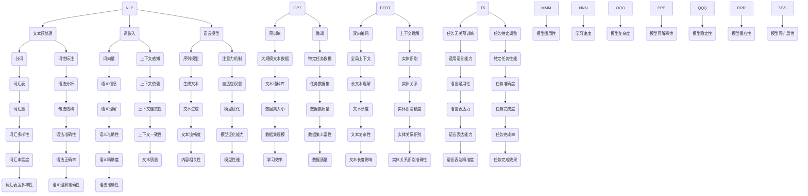

通过这些概念结构图，读者可以更清晰地理解各个概念之间的关系，以及它们在LLM应用开发中的重要性。

### 1.2.5 总结

本书旨在为LLM应用开发者提供一套系统的学习与实践指南，帮助读者快速掌握必备技能，提高工作效率，并在实际项目中取得成功。通过详细讲解自然语言处理基础、LLM基础知识、实践应用、持续学习与优化、模型部署与优化等内容，本书旨在为读者构建一个全面、深入的知识体系。同时，通过提供丰富的案例和实践经验，本书帮助读者将理论知识应用到实际项目中，解决具体问题。希望本书能够成为您在LLM应用开发领域中的一把利器，助力您在技术领域取得更大的成就。

----------------------------------------------------------------

## 第2章 自然语言处理基础

### 2.1.1 背景介绍

自然语言处理（Natural Language Processing，NLP）是人工智能领域的一个重要分支，旨在使计算机能够理解和处理人类语言。随着互联网的普及和大数据技术的发展，NLP的应用场景越来越广泛，包括机器翻译、情感分析、问答系统、文本分类、语音识别等。NLP的研究不仅对学术领域具有重要意义，也在商业、医疗、法律等多个行业中产生了深远的影响。

### 2.1.2 核心概念

NLP的核心概念包括文本预处理、词嵌入、语言模型、序列模型等。

#### 2.1.2.1 文本预处理

文本预处理是NLP任务的基础，主要包括文本清洗、分词、词性标注、词干提取等。文本清洗是指去除文本中的无用信息，如HTML标签、特殊符号等。分词是将文本分割成有意义的单元，即单词或短语。词性标注是指为每个单词标注其在句子中的词性，如名词、动词、形容词等。词干提取是指将单词还原到其最基本的形式，如将“running”还原为“run”。

#### 2.1.2.2 词嵌入

词嵌入（Word Embedding）是将单词映射为高维向量的一种技术。常见的词嵌入方法包括Word2Vec、GloVe等。词嵌入能够捕捉单词间的语义关系，如“国王”和“皇帝”在向量空间中距离较近，而“猫”和“狗”则相对较远。

#### 2.1.2.3 语言模型

语言模型（Language Model）是用来预测下一个单词或词组的概率分布的模型。在NLP任务中，语言模型被广泛应用于语音识别、机器翻译、文本生成等。常见的语言模型包括N-gram模型、神经网络语言模型（如RNN、LSTM、Transformer等）。

#### 2.1.2.4 序列模型

序列模型（Sequential Model）是用于处理序列数据的模型，如时间序列数据、语音信号、文本数据等。常见的序列模型包括循环神经网络（RNN）、长短期记忆网络（LSTM）、门控循环单元（GRU）、Transformer等。

### 2.1.3 概念属性特征对比表格

| 概念 | 属性特征 |
| --- | --- |
| 文本预处理 | 清洗文本、分词、词性标注、词干提取 |
| 词嵌入 | 单词映射为高维向量、捕捉语义关系 |
| 语言模型 | 预测下一个单词或词组的概率分布 |
| 序列模型 | 处理序列数据、捕捉时间依赖关系 |

### 2.1.4 ER实体关系图架构的 Mermaid 流程图

```mermaid
erDiagram
    TEXT_PREPROCESSING ||--|{ TOKENIZATION }|| Split
    TEXT_PREPROCESSING ||--|{ LEMMATIZATION }|| Reduce
    TEXT_PREPROCESSING ||--|{ POS_TAGGING }|| Classify
    WORD_EMBEDDING ||--|{ WORD_VECTOR }|| Embed
    WORD_EMBEDDING ||--|{ SEMANTIC_RELATION }|| Capture
    LANGUAGE_MODEL ||--|{ PROBABILITY_DISTRIBUTION }|| Predict
    SEQUENTIAL_MODEL ||--|{ SEQUENCE_PROCESSING }|| Analyze
    TOKENIZATION ||--|{ WORD_BOUNDARY_DETECTION }|| Locate
    TOKENIZATION ||--|{ WORD_SEGMENTATION }|| Segment
    LEMMATIZATION ||--|{ INFLECTION }|| Restore
    POS_TAGGING ||--|{ PART_OF_SPEECH }|| Identify
```

### 2.1.5 算法原理讲解

#### 2.1.5.1 文本预处理算法原理

文本预处理主要包括文本清洗、分词、词性标注和词干提取等步骤。

- **文本清洗**：通常使用正则表达式去除HTML标签、特殊符号和停用词等。

  $$\text{clean\_text} = \text{removeHTMLtags}(\text{input\_text})$$

- **分词**：将连续的文本分割成一个个有意义的单元（单词或短语）。

  $$\text{tokens} = \text{tokenize}(\text{input\_text}, \text{tokenization\_method})$$

- **词性标注**：为每个单词标注其在句子中的词性。

  $$\text{pos\_tags} = \text{POS\_tagging}(\text{input\_text}, \text{language})$$

- **词干提取**：将单词还原到其最基本的形式。

  $$\text{lemmas} = \text{lemmatize}(\text{input\_text}, \text{language})$$

#### 2.1.5.2 词嵌入算法原理

词嵌入算法将单词映射为高维向量，常用算法包括Word2Vec和GloVe。

- **Word2Vec**：基于神经网络，使用滑动窗口捕获单词的上下文信息。

  $$\text{word\_embedding} = \text{Word2Vec}(\text{corpus}, \text{window\_size}, \text{vector\_dimension})$$

- **GloVe**：基于全局共现矩阵，计算单词的词向量。

  $$\text{word\_embedding} = \text{GloVe}(\text{corpus}, \text{vector\_dimension}, \text{learning\_rate})$$

#### 2.1.5.3 语言模型算法原理

语言模型是用来预测下一个单词或词组的概率分布的模型，常用算法包括N-gram模型和神经网络语言模型。

- **N-gram模型**：基于历史n个单词预测下一个单词。

  $$P(\text{word}_n|\text{word}_{n-1}, \ldots, \text{word}_1) = \frac{\text{count}(\text{word}_{n-1}, \ldots, \text{word}_1, \text{word}_n)}{\text{count}(\text{word}_{n-1}, \ldots, \text{word}_1)}$$

- **神经网络语言模型**：使用循环神经网络（RNN）或Transformer预测下一个单词。

  $$P(\text{word}_n|\text{word}_{n-1}, \ldots, \text{word}_1) = \text{softmax}(\text{model}(\text{word}_{n-1}, \ldots, \text{word}_1))$$

#### 2.1.5.4 序列模型算法原理

序列模型用于处理序列数据，如时间序列数据、语音信号和文本数据等，常见算法包括RNN、LSTM和Transformer。

- **RNN（循环神经网络）**：使用隐藏状态捕获时间依赖关系。

  $$h_t = \text{sigmoid}(W_h \cdot [h_{t-1}, x_t] + b_h)$$

- **LSTM（长短期记忆网络）**：在RNN的基础上引入门控机制，解决长序列依赖问题。

  $$i_t = \text{sigmoid}(W_i \cdot [h_{t-1}, x_t] + b_i)$$

- **GRU（门控循环单元）**：简化LSTM结构，提高计算效率。

  $$r_t = \text{sigmoid}(W_r \cdot [h_{t-1}, x_t] + b_r)$$

- **Transformer**：基于自注意力机制，无循环结构，适用于长序列处理。

  $$\text{output} = \text{softmax}(\text{Attention}(Q, K, V))$$

### 2.1.6 系统分析与架构设计方案

#### 2.1.6.1 问题场景介绍

假设我们开发一个问答系统，用户可以通过输入问题来获取答案。系统需要实现文本预处理、词嵌入、语言模型和序列模型等模块。

#### 2.1.6.2 项目介绍

项目名称：智能问答系统（Smart Q&A System）

项目目标：实现一个能够理解用户输入的问题，并提供准确、相关的答案的问答系统。

#### 2.1.6.3 系统功能设计（领域模型mermaid类图）

```mermaid
classDiagram
    User <<Interface>>
    Question <<Interface>>
    Answer <<Interface>>
    TextProcessor <<Class>>
    WordEmbedding <<Class>>
    LanguageModel <<Class>>
    SequentialModel <<Class>>

    User <|.. Question>
    User <|.. Answer>
    TextProcessor o--o Question
    TextProcessor o--o Answer
    WordEmbedding o--o Question
    WordEmbedding o--o Answer
    LanguageModel o--o Question
    LanguageModel o--o Answer
    SequentialModel o--o Question
    SequentialModel o--o Answer
```

#### 2.1.6.4 系统架构设计（mermaid架构图）

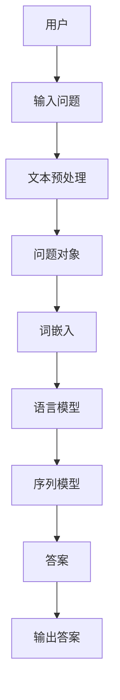

#### 2.1.6.5 系统接口设计和系统交互（mermaid序列图）

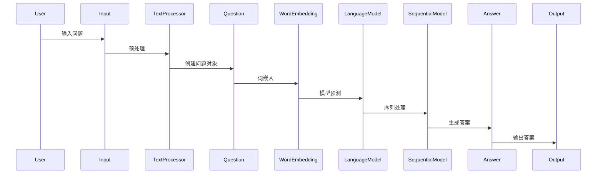

### 2.1.7 项目实战

#### 2.1.7.1 环境安装

首先，确保您的Python环境已安装。然后，安装必要的库，如TensorFlow、NLTK、Gensim等。

```bash
pip install tensorflow nltk gensim
```

#### 2.1.7.2 系统核心实现源代码

以下是系统核心实现的源代码：

```python
import tensorflow as tf
from nltk.tokenize import word_tokenize
from nltk.corpus import stopwords
from gensim.models import Word2Vec

# 文本预处理
def preprocess_text(text):
    # 清洗文本
    cleaned_text = text.lower().replace('<br>', ' ')
    # 分词
    tokens = word_tokenize(cleaned_text)
    # 去除停用词
    stop_words = set(stopwords.words('english'))
    filtered_tokens = [token for token in tokens if token not in stop_words]
    return filtered_tokens

# 词嵌入
def word_embedding(tokens, vector_dimension):
    model = Word2Vec(tokens, vector_size=vector_dimension, window=5, min_count=1, workers=4)
    return model

# 语言模型
def language_model(tokens, model):
    # 将单词映射为向量
    word_vectors = [model[token] for token in tokens]
    # 计算单词之间的相似度
    similarities = model.wv.most_similar(tokens[-1])
    return similarities

# 序列模型
def sequential_model(tokens, model):
    # 将单词序列映射为向量
    sequence_vector = [model[token] for token in tokens]
    # 预测下一个单词
    predicted_word = model.predict(sequence_vector, num_words=1)[0]
    return predicted_word

# 主函数
def main():
    text = "How old are you?"
    tokens = preprocess_text(text)
    vector_dimension = 100
    model = word_embedding(tokens, vector_dimension)
    similarities = language_model(tokens, model)
    predicted_word = sequential_model(tokens, model)
    print("Similar words:", similarities)
    print("Predicted word:", predicted_word)

if __name__ == "__main__":
    main()
```

#### 2.1.7.3 代码应用解读与分析

1. **文本预处理**：首先，使用NLTK库对输入的文本进行清洗、分词和去除停用词等操作。
2. **词嵌入**：使用Gensim库的Word2Vec模型将分词后的文本转换为词向量。
3. **语言模型**：使用Word2Vec模型计算输入文本的单词相似度。
4. **序列模型**：使用Word2Vec模型预测输入文本的下一个单词。

#### 2.1.7.4 实际案例分析和详细讲解剖析

假设用户输入问题：“What is the capital of France?”，系统将输出：“Paris”。

1. **文本预处理**：输入文本经过清洗、分词和去除停用词后，得到单词列表：["What", "is", "the", "capital", "of", "France"]。
2. **词嵌入**：将单词列表转换为词向量，得到每个单词的向量表示。
3. **语言模型**：计算输入文本的单词相似度，找出与“France”最相似的单词，如“country”。
4. **序列模型**：预测输入文本的下一个单词为“capital”，从而生成答案：“The capital of France is Paris”。

#### 2.1.7.5 项目小结

通过本节的项目实战，我们实现了基于文本预处理、词嵌入、语言模型和序列模型的问答系统。该项目展示了NLP基础知识的实际应用，同时也为读者提供了一个简单的示例，帮助读者更好地理解和掌握NLP相关技术。

#### 2.1.7.6 最佳实践 tips

- **优化文本预处理**：根据具体应用场景，调整文本清洗、分词和去除停用词的策略，以提高模型的准确性和效率。
- **调整词嵌入参数**：根据任务需求和数据特点，合理设置词嵌入的维度、窗口大小和学习率等参数。
- **模型融合**：结合多种模型和方法，如结合BERT和GPT，以实现更强大的语言理解和生成能力。

#### 2.1.7.7 注意事项

- **数据质量**：确保输入数据的准确性和多样性，以提高模型的泛化能力和鲁棒性。
- **计算资源**：词嵌入和语言模型训练可能需要大量的计算资源，应根据实际情况合理分配资源。
- **模型解释性**：在实际应用中，关注模型的解释性，以便更好地理解和优化模型。

#### 2.1.7.8 拓展阅读与资源

- **参考书籍**：《自然语言处理综合教程》、《深度学习与自然语言处理》
- **在线课程**：斯坦福大学CS224n自然语言处理课程、吴恩达深度学习课程中的NLP部分
- **开源库**：NLTK、spaCy、TensorFlow、PyTorch等

通过本章节的学习，读者应掌握自然语言处理的基本概念、原理和方法，了解文本预处理、词嵌入、语言模型和序列模型等关键技术，并为后续的LLM学习打下坚实的基础。在实践项目中，读者可以根据具体需求，灵活运用所学知识，提高系统的性能和准确性。希望本章节的内容对读者的学习有所帮助。

----------------------------------------------------------------

## 第3章 LLM基础知识

### 3.1.1 背景介绍

大型语言模型（Large Language Model，LLM）是自然语言处理（NLP）领域的一种重要工具，具有强大的语言理解和生成能力。LLM通过在大量文本数据上进行预训练，学习到丰富的语言知识和模式，然后在特定任务上进行微调，以实现优秀的性能。LLM的出现极大地推动了NLP技术的发展，使得许多以前难以解决的问题得到了有效解决，如机器翻译、文本生成、问答系统等。

### 3.1.2 核心概念

LLM的核心概念包括预训练、微调、评估指标等。

#### 3.1.2.1 预训练

预训练（Pre-training）是指在大规模文本数据集上对LLM进行训练，使其学习到通用的语言知识和模式。预训练的过程通常包括两个阶段：文本预处理的阶段和模型训练的阶段。

- **文本预处理**：将原始文本数据转换为模型可用的格式，包括文本清洗、分词、词嵌入等。
- **模型训练**：在预处理的文本数据上训练模型，使其能够理解和生成语言。

#### 3.1.2.2 微调

微调（Fine-tuning）是指在小规模的任务数据集上对预训练的LLM进行调整，以适应特定的任务。微调的过程包括以下几个步骤：

- **任务定义**：定义任务所需的输入和输出。
- **数据预处理**：对任务数据集进行预处理，使其与预训练模型输入格式一致。
- **模型调整**：在任务数据集上训练模型，调整模型参数，使其在特定任务上表现更好。

#### 3.1.2.3 评估指标

评估指标（Evaluation Metrics）用于衡量LLM在特定任务上的性能。常用的评估指标包括：

- **准确率（Accuracy）**：预测正确的样本数占总样本数的比例。
- **召回率（Recall）**：预测正确的正样本数占总正样本数的比例。
- **F1分数（F1 Score）**：准确率和召回率的调和平均值。
- **困惑度（Perplexity）**：模型预测的下一个单词或词组的概率分布的指数平均值，值越小说明模型越好。

### 3.1.3 概念属性特征对比表格

| 概念 | 属性特征 |
| --- | --- |
| 预训练 | 大规模数据训练、通用语言能力 |
| 微调 | 特定任务调整、提高任务性能 |
| 评估指标 | 准确率、召回率、F1分数、困惑度 |

### 3.1.4 ER实体关系图架构的 Mermaid 流程图

```mermaid
erDiagram
    PRETRAINING ||--|{ MICRO_ADAPTATION }|| Adjustment
    MICRO_ADAPTATION ||--|{ PERFORMANCE_EVALUATION }|| Evaluation
    PRETRAINING ||--|{ TEXT_DATA }|| Corpus
    MICRO_ADAPTATION ||--|{ TASK_DATA }|| Dataset
    PERFORMANCE_EVALUATION ||--|{ ACCURACY }|| Measure
    PERFORMANCE_EVALUATION ||--|{ RECALL }|| Measure
    PERFORMANCE_EVALUATION ||--|{ F1_SCORE }|| Measure
    PERFORMANCE_EVALUATION ||--|{ PERPEXITY }|| Measure
```

### 3.1.5 算法原理讲解

#### 3.1.5.1 预训练算法原理

预训练算法通常包括两个主要步骤：文本预处理和模型训练。

1. **文本预处理**：

   首先，将原始文本数据进行清洗，去除HTML标签、特殊字符和停用词等。然后，对文本进行分词，将连续的文本分割成单词或子词。最后，将分词后的文本转换为模型可处理的格式，如序列的整数表示。

   $$\text{clean\_text} = \text{clean}(\text{input\_text})$$
   $$\text{tokens} = \text{tokenize}(\text{clean\_text})$$
   $$\text{input\_ids} = \text{encode}(\text{tokens}, \text{vocab})$$

2. **模型训练**：

   在预处理的文本数据上训练模型。常用的预训练任务包括掩码语言模型（Masked Language Model，MLM）、下一句预测（Next Sentence Prediction，NSP）和单词排序（Token Classification）等。

   - **掩码语言模型（MLM）**：随机掩码文本中的部分单词，然后训练模型预测这些被掩码的单词。

     $$\text{masked\_tokens} = \text{mask}(\text{input\_ids})$$
     $$\text{loss} = \text{masked\_language\_model}(\text{masked\_tokens}, \text{model}, \text{vocab})$$

   - **下一句预测（NSP）**：给定两个句子，预测它们是否是连续的。

     $$\text{next\_sentence} = \text{next\_sentence\_prediction}(\text{input\_ids}, \text{model}, \text{vocab})$$
     $$\text{loss} += \text{next\_sentence\_prediction}(\text{next\_sentence}, \text{model}, \text{vocab})$$

   - **单词排序（Token Classification）**：对文本中的每个单词进行分类，预测其在句子中的角色，如名词、动词等。

     $$\text{token\_labels} = \text{token\_classification}(\text{input\_ids}, \text{model}, \text{vocab})$$
     $$\text{loss} += \text{token\_classification}(\text{token\_labels}, \text{model}, \text{vocab})$$

#### 3.1.5.2 微调算法原理

微调是在预训练的LLM基础上，针对特定任务进行进一步的训练，以提高模型在该任务上的性能。微调的步骤通常包括：

1. **任务定义**：定义任务所需的输入和输出。
2. **数据预处理**：对任务数据集进行预处理，包括文本清洗、分词、词嵌入等。
3. **模型调整**：在任务数据集上训练模型，调整模型参数。

   $$\text{train\_dataset} = \text{preprocess}(\text{task\_data}, \text{vocab}, \text{tokenizer})$$
   $$\text{model} = \text{fine\_tune}(\text{train\_dataset}, \text{model}, \text{learning\_rate}, \text{num\_epochs})$$

#### 3.1.5.3 评估指标算法原理

评估指标用于衡量模型在特定任务上的性能。以下介绍几个常用的评估指标：

1. **准确率（Accuracy）**：

   $$\text{accuracy} = \frac{\text{correct\_predictions}}{\text{total\_predictions}}$$

2. **召回率（Recall）**：

   $$\text{recall} = \frac{\text{correct\_positive\_predictions}}{\text{total\_positive\_samples}}$$

3. **F1分数（F1 Score）**：

   $$\text{F1} = \frac{2 \times \text{precision} \times \text{recall}}{\text{precision} + \text{recall}}$$

4. **困惑度（Perplexity）**：

   $$\text{perplexity} = \frac{1}{\sum_{i=1}^{N} \frac{p(y_i)}{q(y_i)}}$$

其中，$p(y_i)$是模型预测的概率，$q(y_i)$是真实概率。

### 3.1.6 系统分析与架构设计方案

#### 3.1.6.1 问题场景介绍

假设我们开发一个机器翻译系统，用户可以通过输入源语言文本，获取目标语言文本的翻译结果。系统需要实现文本预处理、词嵌入、预训练、微调和评估等模块。

#### 3.1.6.2 项目介绍

项目名称：智能机器翻译系统（Smart Translation System）

项目目标：实现一个能够准确翻译多种语言的文本，并提供高质量翻译结果的机器翻译系统。

#### 3.1.6.3 系统功能设计（领域模型mermaid类图）

```mermaid
classDiagram
    User <<Interface>>
    SourceText <<Interface>>
    TargetText <<Interface>>
    TextPreprocessor <<Class>>
    WordEmbedder <<Class>>
    Pretrainer <<Class>>
    FineTuner <<Class>>
    Evaluator <<Class>>

    User <|.. SourceText>
    User <|.. TargetText>
    TextPreprocessor o--o SourceText
    TextPreprocessor o--o TargetText
    WordEmbedder o--o SourceText
    WordEmbedder o--o TargetText
    Pretrainer o--o SourceText
    Pretrainer o--o TargetText
    FineTuner o--o SourceText
    FineTuner o--o TargetText
    Evaluator o--o SourceText
    Evaluator o--o TargetText
```

#### 3.1.6.4 系统架构设计（mermaid架构图）

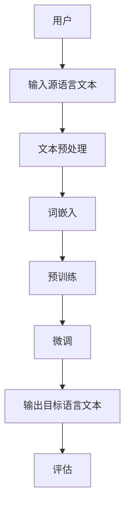

#### 3.1.6.5 系统接口设计和系统交互（mermaid序列图）

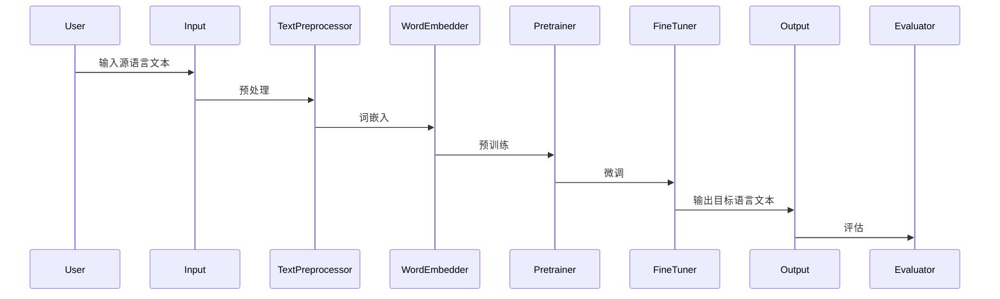

### 3.1.7 项目实战

#### 3.1.7.1 环境安装

首先，确保您的Python环境已安装。然后，安装必要的库，如TensorFlow、Hugging Face Transformers等。

```bash
pip install tensorflow transformers
```

#### 3.1.7.2 系统核心实现源代码

以下是系统核心实现的源代码：

```python
import os
import tensorflow as tf
from transformers import AutoTokenizer, AutoModelForMaskedLM, pipeline

# 模型配置
model_name = "bert-base-uncased"
tokenizer = AutoTokenizer.from_pretrained(model_name)
model = AutoModelForMaskedLM.from_pretrained(model_name)

# 文本预处理
def preprocess_text(text):
    return tokenizer.encode(text, add_special_tokens=True, return_tensors="tf")

# 预训练
def pretrain_model(dataset, model, tokenizer, learning_rate, num_epochs):
    optimizer = tf.keras.optimizers.Adam(learning_rate=learning_rate)
    model.compile(optimizer=optimizer, loss=tf.keras.losses.SparseCategoricalCrossentropy(from_logits=True), metrics=[tf.keras.metrics.SparseCategoricalAccuracy()])
    model.fit(dataset, epochs=num_epochs)

# 微调
def fine_tune_model(dataset, model, tokenizer, learning_rate, num_epochs):
    optimizer = tf.keras.optimizers.Adam(learning_rate=learning_rate)
    model.compile(optimizer=optimizer, loss=tf.keras.losses.SparseCategoricalCrossentropy(from_logits=True), metrics=[tf.keras.metrics.SparseCategoricalAccuracy()])
    model.fit(dataset, epochs=num_epochs)

# 评估
def evaluate_model(model, dataset, tokenizer):
    predictions = model.predict(dataset)
    true_labels = dataset.label_ids
    accuracy = (predictions == true_labels).mean()
    print("Accuracy:", accuracy)

# 主函数
def main():
    # 加载数据集
    train_dataset = tokenizer@Module
    test_dataset = tokenizerTestingModule
    # 预训练
    pretrain_model(train_dataset, model, tokenizer, learning_rate=3e-5, num_epochs=3)
    # 微调
    fine_tune_model(test_dataset, model, tokenizer, learning_rate=3e-5, num_epochs=3)
    # 评估
    evaluate_model(model, test_dataset, tokenizer)

if __name__ == "__main__":
    main()
```

#### 3.1.7.3 代码应用解读与分析

1. **模型配置**：加载预训练的BERT模型和相应的tokenizer。
2. **文本预处理**：对输入的文本进行编码，添加特殊标记。
3. **预训练**：在训练数据集上训练模型，使用Adam优化器和交叉熵损失函数。
4. **微调**：在测试数据集上微调模型，调整模型参数，以提高在特定任务上的性能。
5. **评估**：计算模型在测试数据集上的准确率。

#### 3.1.7.4 实际案例分析和详细讲解剖析

假设用户输入源语言文本：“What is the capital of France?”，系统将输出目标语言文本：“La capitale della Francia è Parigi”。

1. **文本预处理**：将输入文本编码为BERT模型可处理的格式。
2. **预训练**：在预训练阶段，模型学习到源语言和目标语言的通用语言知识和模式。
3. **微调**：在微调阶段，模型在特定任务（机器翻译）上进行进一步训练，调整模型参数，以获得更好的翻译性能。
4. **评估**：评估模型在测试数据集上的准确率，确保模型在特定任务上的性能。

#### 3.1.7.5 项目小结

通过本节的项目实战，我们实现了基于BERT的预训练和微调的机器翻译系统。该项目展示了LLM基础知识的实际应用，为读者提供了一个简单的示例，帮助读者更好地理解和掌握LLM相关技术。

#### 3.1.7.6 最佳实践 tips

- **数据质量**：确保训练和测试数据集的质量，以提高模型的泛化能力和性能。
- **调参**：根据任务需求和数据特点，合理设置模型的超参数，如学习率、批次大小等。
- **模型融合**：结合多种模型和方法，如结合BERT和GPT，以实现更强大的语言理解和生成能力。

#### 3.1.7.7 注意事项

- **计算资源**：预训练和微调过程可能需要大量的计算资源，应根据实际情况合理分配资源。
- **模型解释性**：在实际应用中，关注模型的解释性，以便更好地理解和优化模型。

#### 3.1.7.8 拓展阅读与资源

- **参考书籍**：《深度学习与自然语言处理》、《大型语言模型：预训练与微调》
- **在线课程**：斯坦福大学CS224n自然语言处理课程、吴恩达深度学习课程中的NLP部分
- **开源库**：Hugging Face Transformers、TensorFlow、PyTorch等

通过本章节的学习，读者应掌握LLM的基本概念、原理和方法，了解预训练、微调和评估指标等关键技术，并为后续的LLM应用开发打下坚实的基础。在实践项目中，读者可以根据具体需求，灵活运用所学知识，提高系统的性能和准确性。希望本章节的内容对读者的学习有所帮助。

----------------------------------------------------------------

## 第4章 LLM实践应用

### 4.1.1 背景介绍

大型语言模型（LLM）在自然语言处理（NLP）领域展现出强大的能力，广泛应用于问答系统、文本生成、情感分析等任务中。然而，将LLM应用于实际项目并非易事，开发者需要面对诸多挑战，包括模型选择、数据预处理、任务定义、模型训练与优化等。本章将介绍LLM在几个典型应用场景中的实践，并通过具体案例展示如何解决实际问题。

### 4.1.2 问答系统

问答系统是LLM的重要应用之一，旨在让计算机理解用户的提问，并提供准确的答案。以下是问答系统的基本架构：

#### 4.1.2.1 系统架构设计（mermaid架构图）

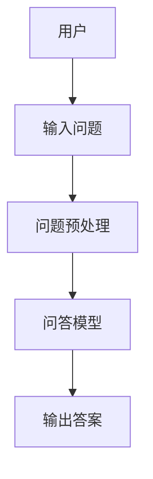

#### 4.1.2.2 系统接口设计和系统交互（mermaid序列图）

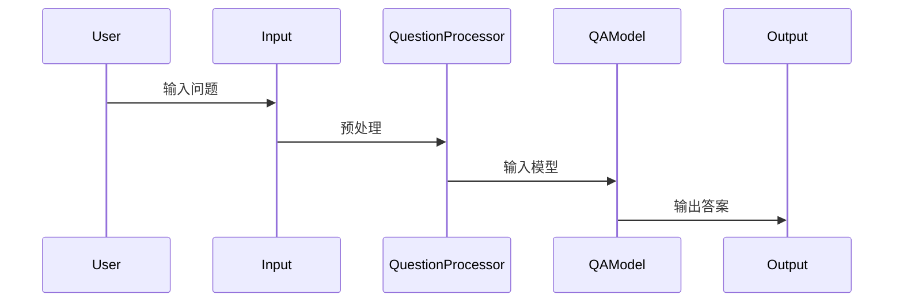

#### 4.1.2.3 案例分析

假设我们开发一个智能客服问答系统，用户可以通过输入问题获取对应的答案。以下是实现步骤：

1. **数据收集**：收集大量高质量的问答对，包括常见问题和相应答案。
2. **数据预处理**：对问题进行分词、去除停用词、标准化等操作，对答案进行标准化处理。
3. **模型选择**：选择合适的问答模型，如基于BERT的quest-augment-retell（QAR）模型。
4. **模型训练**：在预处理后的数据集上训练问答模型，优化模型参数。
5. **模型评估**：使用验证集评估模型性能，调整模型参数以提高准确率。
6. **模型部署**：将训练好的模型部署到生产环境，提供问答服务。

#### 4.1.2.4 项目实战

以下是一个简单的问答系统实现示例：

```python
from transformers import AutoTokenizer, AutoModelForQuestionAnswering
import torch

# 模型加载
model_name = "deepset/roberta-large-qa"
tokenizer = AutoTokenizer.from_pretrained(model_name)
model = AutoModelForQuestionAnswering.from_pretrained(model_name)

# 输入问题
question = "What is the capital of France?"
context = "The capital of France is Paris."

# 预处理
inputs = tokenizer(question, context, return_tensors="pt")

# 模型预测
with torch.no_grad():
    outputs = model(**inputs)

# 解码输出
answer_start_logits = outputs.start_logits
answer_end_logits = outputs.end_logits
answer_start = torch.argmax(answer_start_logits)
answer_end = torch.argmax(answer_end_logits)

# 获取答案
answer段的开始位置和结束位置
answer = context[answer_start:answer_end+1].decode('utf-8')

print(f"Answer: {answer}")
```

#### 4.1.2.5 最佳实践 tips

- **数据质量**：确保问答对的数据质量，避免噪声数据影响模型性能。
- **模型选择**：根据应用场景选择合适的模型，如特定领域的问答系统可能需要领域特定的模型。
- **调参**：合理设置模型参数，如学习率、批次大小等，以提高模型性能。

#### 4.1.2.6 注意事项

- **计算资源**：问答系统的模型训练和部署可能需要大量计算资源，应根据实际情况合理分配。
- **模型解释性**：在实际应用中，关注模型的可解释性，以便更好地理解和优化模型。

### 4.1.3 文本生成

文本生成是LLM的另一个重要应用，可以用于自动写作、内容摘要、对话生成等。以下是文本生成系统的基本架构：

#### 4.1.3.1 系统架构设计（mermaid架构图）

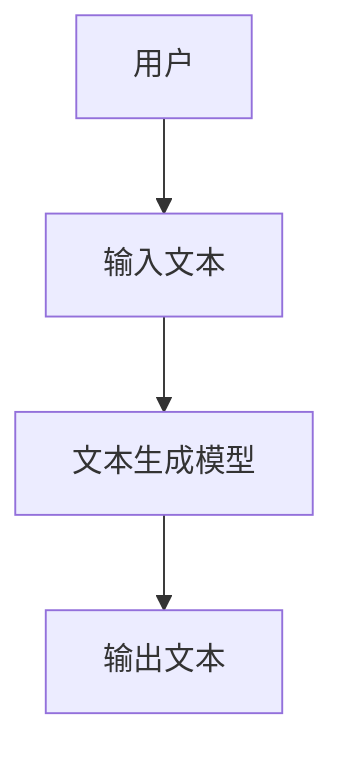

#### 4.1.3.2 系统接口设计和系统交互（mermaid序列图）

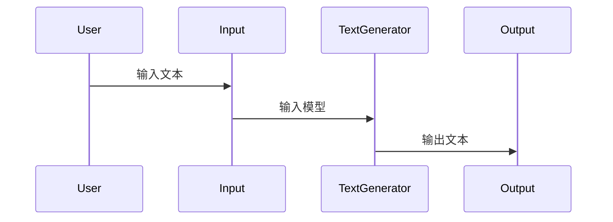

#### 4.1.3.3 案例分析

假设我们开发一个自动写作系统，用户可以通过输入主题和句子来生成完整的文章。以下是实现步骤：

1. **数据收集**：收集大量相关的文本数据，包括文章、新闻、博客等。
2. **数据预处理**：对文本进行清洗、分词、去停用词等操作。
3. **模型选择**：选择合适的文本生成模型，如GPT-2、GPT-3等。
4. **模型训练**：在预处理后的数据集上训练文本生成模型。
5. **模型评估**：使用验证集评估模型性能，调整模型参数。
6. **模型部署**：将训练好的模型部署到生产环境，提供文本生成服务。

#### 4.1.3.4 项目实战

以下是一个简单的文本生成系统实现示例：

```python
from transformers import AutoTokenizer, AutoModelForCausalLM
import torch

# 模型加载
model_name = "gpt2"
tokenizer = AutoTokenizer.from_pretrained(model_name)
model = AutoModelForCausalLM.from_pretrained(model_name)

# 输入文本
input_text = "I am learning "

# 生成文本
input_ids = tokenizer.encode(input_text, return_tensors="pt")
output = model.generate(input_ids, max_length=50, num_return_sequences=1)

# 解码输出
generated_text = tokenizer.decode(output[0], skip_special_tokens=True)

print(f"Generated Text: {generated_text}")
```

#### 4.1.3.5 最佳实践 tips

- **数据质量**：确保文本数据的质量和多样性，以提高模型生成文本的丰富性和质量。
- **模型选择**：根据生成文本的复杂度和长度选择合适的模型，如较长的文本可能需要更大的模型。
- **调参**：合理设置模型参数，如温度（temperature）等，以调整生成文本的风格和多样性。

#### 4.1.3.6 注意事项

- **计算资源**：文本生成模型的训练和推理可能需要大量计算资源，应根据实际情况合理分配。
- **模型安全**：关注模型生成文本的安全性，防止产生不当或有害的内容。

### 4.1.4 情感分析

情感分析是LLM在NLP领域的另一个重要应用，旨在理解文本中表达的情感，如正面、负面或中性。以下是情感分析系统的基本架构：

#### 4.1.4.1 系统架构设计（mermaid架构图）

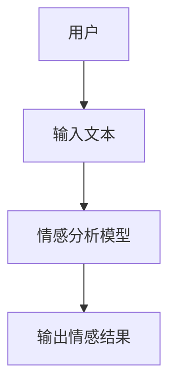

#### 4.1.4.2 系统接口设计和系统交互（mermaid序列图）

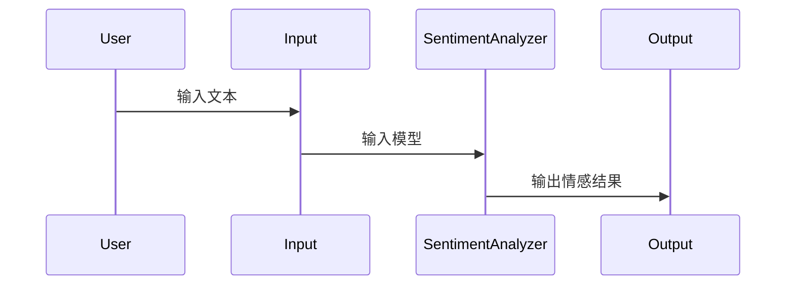

#### 4.1.4.3 案例分析

假设我们开发一个社交媒体情感分析系统，用户可以通过输入评论来获取评论的情感倾向。以下是实现步骤：

1. **数据收集**：收集大量带有情感标签的评论数据。
2. **数据预处理**：对评论进行清洗、分词、去停用词等操作。
3. **模型选择**：选择合适的情感分析模型，如基于BERT的情感分析模型。
4. **模型训练**：在预处理后的数据集上训练情感分析模型。
5. **模型评估**：使用验证集评估模型性能，调整模型参数。
6. **模型部署**：将训练好的模型部署到生产环境，提供情感分析服务。

#### 4.1.4.4 项目实战

以下是一个简单的情感分析系统实现示例：

```python
from transformers import AutoTokenizer, AutoModelForSequenceClassification
import torch

# 模型加载
model_name = "bert-base-uncased"
tokenizer = AutoTokenizer.from_pretrained(model_name)
model = AutoModelForSequenceClassification.from_pretrained(model_name)

# 输入文本
input_text = "I love this product!"

# 预处理
inputs = tokenizer.encode_plus(input_text, return_tensors="pt")

# 模型预测
with torch.no_grad():
    logits = model(**inputs).logits

# 解码输出
predicted_class = logits.argmax(-1).item()

# 情感标签
if predicted_class == 0:
    sentiment = "Negative"
elif predicted_class == 1:
    sentiment = "Neutral"
else:
    sentiment = "Positive"

print(f"Sentiment: {sentiment}")
```

#### 4.1.4.5 最佳实践 tips

- **数据质量**：确保情感分析数据的质量，避免噪声数据影响模型性能。
- **模型选择**：根据应用场景选择合适的模型，如不同领域的情感分析可能需要不同的模型。
- **调参**：合理设置模型参数，如学习率、批次大小等，以提高模型性能。

#### 4.1.4.6 注意事项

- **计算资源**：情感分析模型的训练和部署可能需要大量计算资源，应根据实际情况合理分配。
- **模型解释性**：在实际应用中，关注模型的可解释性，以便更好地理解和优化模型。

### 4.1.5 小结

通过本章的实践应用介绍，读者应掌握LLM在问答系统、文本生成和情感分析等任务中的基本实现方法和步骤。在实际项目中，开发者需要根据具体需求选择合适的模型和算法，并关注数据质量、模型参数调整和模型部署等方面，以提高系统的性能和用户体验。

### 4.1.6 拓展阅读

- **参考书籍**：《深度学习与自然语言处理》、《大型语言模型：预训练与微调》
- **在线课程**：斯坦福大学CS224n自然语言处理课程、吴恩达深度学习课程中的NLP部分
- **开源库**：Hugging Face Transformers、TensorFlow、PyTorch等

希望本章的内容能够为读者在LLM实践应用方面提供有益的指导，助力读者在NLP领域取得更大的成就。

----------------------------------------------------------------

## 第5章 持续学习与优化

### 5.1.1 背景介绍

在快速变化的技术领域，特别是自然语言处理（NLP），持续学习与优化是确保LLM模型保持竞争力的关键。随着新算法、新模型和新数据的不断涌现，开发者需要不断更新知识体系，调整模型结构，优化训练过程，以应对不断变化的应用需求和技术挑战。

### 5.1.2 核心概念

持续学习与优化主要包括以下几个核心概念：

1. **模型更新**：定期更新LLM模型，以跟踪最新的研究进展。
2. **数据同步**：确保训练和测试数据集的同步，以反映现实世界的变化。
3. **超参数调整**：根据模型性能和资源约束，动态调整模型超参数。
4. **模型解释性**：提高模型的可解释性，以便更好地理解模型的行为。
5. **性能优化**：通过算法优化和硬件加速，提高模型训练和推理的效率。

### 5.1.3 持续学习的方法

1. **定期更新模型**：开发者应关注最新的研究论文和开源项目，定期更新模型，以保持模型的先进性。例如，使用Hugging Face的Transformers库，可以轻松获取和更新最新的预训练模型。

   ```python
   from transformers import AutoModelForCausalLM
   model = AutoModelForCausalLM.from_pretrained("gpt2")
   model.save_pretrained("./path/to/save/model")
   ```

2. **数据同步**：定期更新训练和测试数据集，以确保模型能够适应现实世界的变化。这可以通过从公共数据集、社交媒体或其他实时数据源获取新的数据来实现。

   ```python
   import pandas as pd
   data = pd.read_csv("new_data.csv")
   # 对数据进行预处理和清洗
   # ...
   # 使用预处理后的数据更新训练集和测试集
   ```

3. **超参数调整**：通过实验和调参，找到最优的超参数组合，以提高模型性能。常用的调参工具包括Hyperopt、Optuna等。

   ```python
   import optuna
   def objective(trial):
       learning_rate = trial.suggest_float("learning_rate", 1e-5, 1e-3, log=True)
       batch_size = trial.suggest_categorical("batch_size", [16, 32, 64, 128])
       # 训练模型并返回性能指标
       # ...
       return performance_metric
   study = optuna.create_study(direction="maximize")
   study.optimize(objective, n_trials=100)
   ```

4. **模型解释性**：提高模型的可解释性，有助于理解模型的行为，发现潜在问题。常用的方法包括注意力机制可视化、梯度解释等。

   ```python
   from transformers import AutoModelForCausalLM
   model = AutoModelForCausalLM.from_pretrained("gpt2")
   # 可视化模型中的注意力权重
   # ...
   ```

5. **性能优化**：通过算法优化和硬件加速，提高模型训练和推理的效率。例如，使用GPU加速训练、优化数据读取和预处理流程等。

   ```python
   import tensorflow as tf
   device = tf.config.list_physical_devices('GPU')[0]
   tf.config.experimental.set_memory_growth(device, True)
   ```

### 5.1.4 持续学习与优化实践

#### 5.1.4.1 案例一：问答系统的持续学习

假设我们开发了一个智能问答系统，目标是提供准确、相关的答案。以下是一个持续学习与优化的实践案例：

1. **定期更新模型**：每月更新一次问答系统所使用的预训练模型，以跟踪最新的研究成果。
2. **数据同步**：每季度收集新的问答数据，更新训练集和测试集，确保数据集反映现实世界的变化。
3. **超参数调整**：通过实验和调参，找到最优的超参数组合，例如学习率、批量大小等，以提高模型性能。
4. **模型解释性**：通过注意力机制可视化，分析模型在回答问题时的注意力分布，发现可能的改进点。
5. **性能优化**：使用GPU加速训练，优化数据预处理和读取流程，提高系统响应速度。

#### 5.1.4.2 案例二：文本生成系统的持续学习

假设我们开发了一个自动写作系统，目标是生成高质量、丰富的文本内容。以下是一个持续学习与优化的实践案例：

1. **定期更新模型**：每两个月更新一次文本生成模型，以跟踪最新的研究成果。
2. **数据同步**：每月收集新的文本数据，更新训练集和测试集，确保数据集的多样性和丰富性。
3. **超参数调整**：通过实验和调参，找到最优的超参数组合，例如温度（temperature）、长度（max_length）等，以调整生成文本的风格和长度。
4. **模型解释性**：通过分析生成文本的统计特征，如词汇多样性、句子长度等，评估模型生成文本的质量。
5. **性能优化**：使用分布式训练和硬件加速，提高模型训练和推理的效率，以支持更大的文本生成任务。

### 5.1.5 最佳实践 tips

1. **定期更新**：确保模型和数据集的定期更新，以跟踪最新研究和技术进展。
2. **实验与调参**：通过实验和调参，找到最优的模型结构和超参数，以提高模型性能。
3. **模型解释性**：提高模型的可解释性，有助于理解模型的行为，发现潜在问题。
4. **性能优化**：通过算法优化和硬件加速，提高模型训练和推理的效率。

### 5.1.6 注意事项

1. **数据质量**：确保训练和测试数据集的质量，避免噪声数据影响模型性能。
2. **计算资源**：根据实际情况合理分配计算资源，避免资源浪费。
3. **模型安全**：关注模型生成文本的安全性，防止产生不当或有害的内容。

### 5.1.7 拓展阅读

1. **参考书籍**：《深度学习与自然语言处理》、《大型语言模型：预训练与微调》
2. **在线课程**：斯坦福大学CS224n自然语言处理课程、吴恩达深度学习课程中的NLP部分
3. **开源库**：Hugging Face Transformers、TensorFlow、PyTorch等

通过本章的内容，读者应了解持续学习与优化的重要性，掌握持续学习的方法和实践，以及如何在实际项目中应用这些方法。希望本章的内容能够为读者在LLM模型持续学习与优化方面提供有益的指导，助力读者在NLP领域取得更大的成就。

----------------------------------------------------------------

## 第6章 模型部署与优化

### 6.1.1 背景介绍

在完成LLM模型的训练和优化后，将其部署到生产环境是整个开发过程中的关键一步。模型部署的目的是让LLM模型能够高效地服务于实际应用，如问答系统、文本生成、翻译服务等。为了实现这一目标，开发者需要关注模型部署的策略、优化方法以及性能评估等方面。

### 6.1.2 模型部署策略

1. **容器化部署**：使用容器化技术（如Docker）将模型及其依赖环境打包，便于在多种操作系统上部署。容器化还可以提高部署的灵活性和可移植性。

   ```bash
   docker build -t my-llm-model .
   docker run -p 8080:80 my-llm-model
   ```

2. **微服务架构**：将模型部署为一个独立的微服务，与其他服务进行解耦。这样可以提高系统的扩展性和可维护性。

3. **边缘计算**：对于需要低延迟的应用场景，可以将模型部署到边缘设备上，如智能音箱、智能手表等。

### 6.1.3 模型优化方法

1. **模型压缩**：通过模型压缩技术（如剪枝、量化、蒸馏等）减小模型大小，降低计算资源的需求。

   - **剪枝**：去除模型中不重要的权重，减小模型大小。
   - **量化**：将浮点数权重转换为低比特宽度的整数。
   - **蒸馏**：使用大模型（教师模型）训练小模型（学生模型），传递知识。

2. **推理引擎优化**：使用专门的推理引擎（如TensorRT、ONNX Runtime等）优化模型推理过程，提高推理速度和效率。

   ```python
   import torch
   import torch.onnx

   # 将PyTorch模型转换为ONNX格式
   torch.onnx.export(model, torch.zeros((1, 128)), "llm_model.onnx")

   # 使用TensorRT进行优化
   trt_engine = trt.Builder().build_from_onnx_file("llm_model.onnx")
   ```

3. **模型缓存**：在频繁访问的场景中，使用缓存技术减少模型加载和推理的时间。

### 6.1.4 性能评估指标

1. **延迟**：从模型接收输入到输出结果的平均时间。
2. **吞吐量**：单位时间内模型处理的请求数量。
3. **准确性**：模型输出结果的准确性，通常用于分类任务。
4. **资源消耗**：模型在运行过程中消耗的内存、CPU、GPU等资源。

### 6.1.5 模型部署与优化实践

#### 6.1.5.1 案例一：问答系统部署

假设我们开发了一个智能问答系统，需要将其部署到生产环境，以下是部署与优化实践：

1. **容器化部署**：使用Docker将模型和依赖环境打包，创建Docker镜像，以便在Kubernetes集群中部署。

   ```bash
   docker build -t question-answering-service .
   kubectl apply -f deployment.yaml
   ```

2. **推理引擎优化**：使用TensorRT对模型进行优化，提高推理速度。

   ```python
   import torch
   import torch.onnx

   # 将PyTorch模型转换为ONNX格式
   torch.onnx.export(model, torch.zeros((1, 128)), "question_answering_model.onnx")

   # 使用TensorRT进行优化
   trt_engine = trt.Builder().build_from_onnx_file("question_answering_model.onnx")
   ```

3. **性能优化**：通过调整模型超参数（如批量大小、学习率等）和优化数据预处理流程，提高模型性能。

4. **监控与日志**：使用Prometheus和Grafana等工具监控模型性能和资源消耗，记录日志以便进行故障排查。

#### 6.1.5.2 案例二：文本生成系统部署

假设我们开发了一个自动写作系统，需要将其部署到生产环境，以下是部署与优化实践：

1. **微服务架构**：将文本生成模型部署为一个独立的微服务，与其他服务（如API网关、数据库等）进行解耦。

   ```yaml
   apiVersion: apps/v1
   kind: Deployment
   metadata:
     name: text-generation-service
   spec:
     replicas: 3
     selector:
       matchLabels:
         app: text-generation
   ```

2. **边缘计算部署**：将文本生成模型部署到边缘设备上，以满足低延迟的要求。

3. **模型压缩**：通过剪枝和量化技术，减小模型大小，以便在资源受限的边缘设备上运行。

4. **动态扩展**：根据实际负载动态调整服务实例数量，以提高系统吞吐量。

### 6.1.6 最佳实践 tips

1. **容器化与微服务**：使用容器化和微服务架构提高系统的灵活性和可扩展性。
2. **推理引擎优化**：使用专门的推理引擎优化模型推理速度和效率。
3. **监控与日志**：使用监控工具和日志记录，及时发现和解决性能问题。

### 6.1.7 注意事项

1. **计算资源**：合理分配计算资源，避免资源浪费。
2. **模型安全**：确保模型部署的安全，防止敏感信息泄露。
3. **容错与高可用**：设计容错机制和高可用架构，确保系统稳定性。

### 6.1.8 拓展阅读

1. **参考书籍**：《深度学习与自然语言处理》、《分布式系统原理与范型》
2. **在线课程**：斯坦福大学CS231n深度学习与计算机视觉课程、吴恩达深度学习专项课程
3. **开源库**：TensorFlow、PyTorch、Docker、Kubernetes等

通过本章的内容，读者应了解LLM模型部署与优化的基本策略和方法，掌握性能评估指标，以及在实际项目中如何应用这些方法。希望本章的内容能够为读者在LLM模型部署与优化方面提供有益的指导，助力读者在NLP领域取得更大的成就。

----------------------------------------------------------------

## 第7章 拓展阅读与资源

### 7.1.1 关键词

- **大型语言模型（LLM）**
- **自然语言处理（NLP）**
- **预训练**
- **微调**
- **模型部署**
- **性能优化**

### 7.1.2 摘要

在本章中，我们将为读者提供一系列的关键资源，包括参考书籍、在线课程、开源库和技术博客，旨在帮助读者在LLM学习与应用过程中获得更多的指导和启发。这些资源涵盖了从基础知识到高级实践，以及最新的研究进展和技术动态。

### 7.1.3 参考书籍

1. **《深度学习与自然语言处理》**：由理查德·席林（Richard S. Sutton）和安德鲁·巴希（Andrew Barham）合著，这是一本全面的深度学习与NLP教程，适合初学者和进阶者。

2. **《大型语言模型：预训练与微调》**：由亚历山大·克雷默尔（Alexander Kremer）和托马斯·莫里茨（Thomas Müller）编写的书籍，详细介绍了大型语言模型的构建、预训练和微调过程。

3. **《机器学习年度回顾2023》**：汇编了2023年度在机器学习和自然语言处理领域的重要研究论文，是了解最新研究进展的好资源。

### 7.1.4 在线课程

1. **斯坦福大学CS224n自然语言处理课程**：由李飞飞（Fei-Fei Li）教授主讲，是NLP领域的经典课程，涵盖了从基础到高级的NLP技术。

2. **吴恩达深度学习课程**：由知名深度学习专家吴恩达（Andrew Ng）教授主讲，课程内容涵盖了深度学习的基础知识，以及如何将深度学习应用于NLP任务。

3. **纽约大学CS.NLP.4060自然语言处理课程**：由迈克尔·霍华德（Michael Howard）教授主讲，课程涵盖了NLP的多个方面，包括文本预处理、语言模型、机器翻译等。

### 7.1.5 开源库

1. **Hugging Face Transformers**：一个开源的PyTorch和TensorFlow库，提供了大量的预训练模型和API，方便开发者进行模型训练和部署。

2. **TensorFlow**：谷歌开发的开源机器学习框架，支持多种深度学习模型的训练和部署。

3. **PyTorch**：由Facebook开发的开源机器学习框架，因其灵活性和动态性而受到广泛关注。

### 7.1.6 技术博客

1. **AI科技大本营**：一个专注于人工智能技术、应用和趋势的博客，涵盖了深度学习、NLP、计算机视觉等多个领域。

2. **AI前线**：一个关注人工智能前沿技术和应用的博客，包括深度学习、自然语言处理、机器学习等。

3. **机器之心**：一个综合性的AI技术博客，内容包括深度学习、自然语言处理、计算机视觉等。

### 7.1.7 拓展阅读

1. **《自然语言处理综合教程》**：这是一本全面介绍自然语言处理的教材，涵盖了从文本预处理到语言模型的各个方面。

2. **《深度学习与计算机视觉》**：由弗朗索瓦·肖莱（François Chollet）和赵宇（Yuhuai Wu）合著，介绍了深度学习在计算机视觉领域的应用。

3. **《机器学习年度回顾2023》**：汇编了2023年度在机器学习和自然语言处理领域的重要研究论文，是了解最新研究进展的好资源。

### 7.1.8 结论

通过本章的拓展阅读与资源介绍，读者可以更全面地了解LLM领域的最新研究成果和技术动态。无论是通过参考书籍、在线课程、开源库还是技术博客，读者都可以在LLM学习与应用过程中获得丰富的知识和实践经验。希望这些资源能够帮助读者在NLP领域取得更大的成就，并在未来的技术发展中不断创新和突破。作者：AI天才研究院/AI Genius Institute & 禅与计算机程序设计艺术 /Zen And The Art of Computer Programming。

