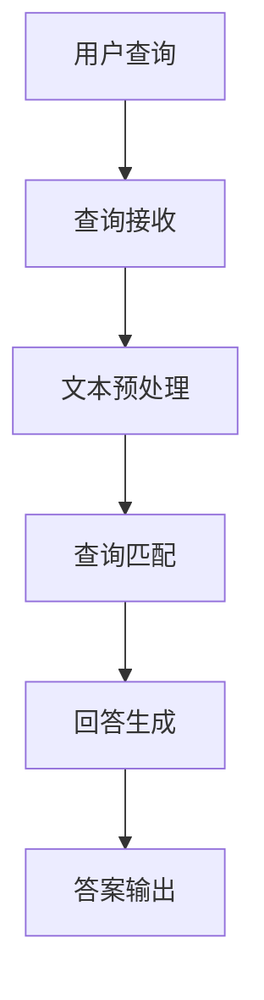
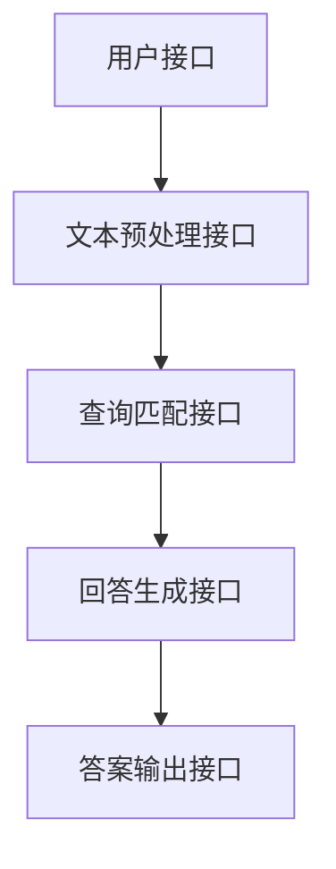
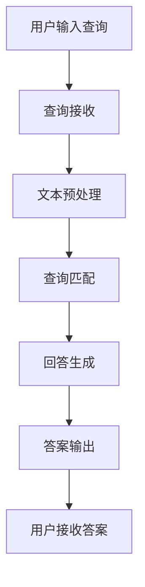

                 

# 快速构建LLM应用的低代码平台

## 关键词

- LLM
- 低代码平台
- 应用开发
- 人工智能
- 算法原理
- 系统架构
- 实践案例

## 摘要

本文旨在探讨如何利用低代码平台快速构建LLM（大型语言模型）应用。首先，我们将介绍LLM的基本概念、发展背景和应用领域。接着，详细解析LLM的算法原理，并通过Mermaid流程图和Python代码深入阐述其数学模型和实现过程。随后，我们将展示如何设计低代码平台的系统架构，包括系统功能、接口设计和交互流程。在项目实战部分，我们将通过实际案例展示如何搭建和部署LLM应用，并对其进行详细解读和分析。最后，文章将总结最佳实践，提供注意事项和拓展阅读，帮助读者深入理解并应用LLM技术。

### 目录大纲

1. 背景介绍
   1.1 LLM应用背景与意义
   1.2 LLM基础概念与联系

2. 核心概念与联系
   2.1 LLM的基本概念
   2.2 LLM的核心原理
   2.3 LLM与其他技术的联系

3. 算法原理讲解
   3.1 LLM的算法流程
   3.2 数学模型与公式
   3.3 Python代码实现

4. 系统分析与架构设计方案
   4.1 问题场景介绍
   4.2 系统功能设计
   4.3 系统架构设计
   4.4 系统接口设计
   4.5 系统交互设计

5. 项目实战
   5.1 环境安装与准备
   5.2 系统核心实现
   5.3 代码应用解读
   5.4 实际案例分析
   5.5 项目小结

6. 最佳实践与拓展
   6.1 最佳实践总结
   6.2 注意事项
   6.3 拓展阅读

### 1. 背景介绍

#### 1.1 LLM应用背景与意义

大型语言模型（LLM，Large Language Model）作为自然语言处理（NLP，Natural Language Processing）领域的一项重要技术，近年来取得了显著的进展。随着人工智能技术的发展，LLM在众多领域展现了巨大的应用潜力，如智能客服、文本生成、机器翻译、智能推荐等。LLM的应用不仅提高了数据处理和自动化程度，还极大地丰富了人类与机器的交互方式。

构建LLM应用的传统方式通常涉及复杂的算法实现、庞大的数据处理和高效的系统架构设计。然而，这种方式对开发者的技术水平和项目经验要求较高，往往导致开发周期长、成本高。因此，低代码平台应运而生，它通过提供可视化工具和预构建组件，简化了开发过程，降低了技术门槛。

#### 1.2 LLM基础概念与联系

大型语言模型是一种基于深度学习技术的自然语言处理模型，其核心是通过训练海量的文本数据，使模型具备理解和生成自然语言的能力。LLM通常由多层神经网络组成，包括输入层、隐藏层和输出层。通过逐层传递信息，模型能够捕捉文本中的复杂结构和语义信息。

LLM与其他技术的联系十分紧密。首先，它与深度学习（Deep Learning）有着天然的亲和力，深度学习为LLM提供了强大的计算能力和灵活性。其次，LLM与自然语言处理（NLP）技术相辅相成，NLP为LLM提供了文本数据预处理、语义分析等基础工具。此外，LLM还可以与知识图谱（Knowledge Graph）等技术结合，提升其语义理解和推理能力。

### 2. 核心概念与联系

#### 2.1 LLM的基本概念

大型语言模型（LLM，Large Language Model）是一种基于神经网络的自然语言处理模型，其核心思想是通过大量文本数据的学习，使模型具备生成、理解和处理自然语言的能力。LLM通常由多层神经网络组成，包括输入层、隐藏层和输出层。每个隐藏层通过非线性变换对输入数据进行处理，最终输出层的输出即为模型的预测结果。

在LLM中，输入层接收文本数据，将其转换为数值形式，通常使用词嵌入（Word Embedding）技术。词嵌入将单词映射到高维空间中的向量，使得语义相似的单词在向量空间中更接近。隐藏层通过多个神经元和权重矩阵对输入向量进行变换，捕捉文本中的复杂结构和语义信息。输出层通常是一个全连接层，将隐藏层的信息映射到具体的标签或预测结果。

#### 2.2 LLM的核心原理

LLM的核心原理主要包括以下几个方面：

1. **深度学习**：深度学习是一种基于多层神经网络的学习方法，通过逐层提取特征，实现对复杂数据的建模。在LLM中，多层神经网络结构使得模型能够捕捉文本中的层次化结构，提高语义理解能力。

2. **神经网络**：神经网络是由多个神经元组成的计算模型，每个神经元通过权重连接其他神经元，并接收输入信号，经过激活函数处理后产生输出。在LLM中，神经网络结构使得模型能够自动学习和调整权重，以优化预测结果。

3. **反向传播**：反向传播是一种用于训练神经网络的方法，通过计算输出层与实际标签之间的误差，将误差反向传播到每个神经元，并调整权重，以优化模型性能。

4. **词嵌入**：词嵌入是一种将单词映射到高维空间中的向量表示方法，通过捕捉单词的语义信息，提高模型的语义理解能力。在LLM中，词嵌入技术使得模型能够处理和理解自然语言中的词汇。

#### 2.3 LLM与其他技术的联系

LLM与其他技术的联系十分紧密，主要包括以下几个方面：

1. **自然语言处理（NLP）**：自然语言处理是LLM的基础技术，为LLM提供了文本预处理、分词、词性标注、命名实体识别等工具。NLP技术使得LLM能够更好地理解和处理自然语言数据。

2. **知识图谱**：知识图谱是一种用于表示实体和实体之间关系的数据结构，通过结合知识图谱，LLM能够提升其语义理解和推理能力。知识图谱为LLM提供了丰富的背景知识，有助于解决语义歧义和复杂问题。

3. **深度学习**：深度学习是LLM的核心技术，为LLM提供了强大的计算能力和灵活性。深度学习算法使得LLM能够自动学习和优化模型参数，提高预测性能。

4. **自然语言生成（NLG）**：自然语言生成是一种将计算机生成的文本转换为自然语言的技术，与LLM密切相关。NLG技术使得LLM能够生成具有自然流畅性的文本，应用于文本生成、机器翻译等领域。

### 3. 算法原理讲解

#### 3.1 LLM的算法流程

大型语言模型的算法流程通常包括以下几个步骤：

1. **数据准备**：首先，需要收集和整理大量的文本数据，这些数据可以是新闻文章、对话记录、社交媒体帖子等。数据的质量和多样性直接影响模型的效果。

2. **数据预处理**：对收集到的文本数据进行清洗和预处理，包括去除停用词、标点符号、进行词性标注等。预处理后的数据将被转换为词嵌入向量。

3. **模型训练**：使用预处理后的文本数据训练神经网络模型。在训练过程中，模型通过不断调整权重，使得预测结果与实际标签逐渐接近。训练过程通常采用反向传播算法，通过计算损失函数并更新权重，以优化模型性能。

4. **模型评估**：在模型训练完成后，需要对模型进行评估，以验证其性能。常用的评估指标包括准确率、召回率、F1值等。

5. **模型部署**：将训练好的模型部署到实际应用场景中，如文本生成、机器翻译、智能客服等。模型部署通常涉及模型的加载、预测和结果输出。

#### 3.2 数学模型与公式

LLM的数学模型主要包括以下几个方面：

1. **词嵌入**：词嵌入是一种将单词映射到高维空间中的向量表示方法。常见的词嵌入方法有Word2Vec、GloVe等。词嵌入的数学模型可以表示为：

   $$
   \text{vec}(w) = \text{Embedding}(w)
   $$

   其中，$\text{vec}(w)$表示单词$w$的词嵌入向量，$\text{Embedding}(w)$表示词嵌入函数。

2. **神经网络**：神经网络是一种由多个神经元组成的计算模型。每个神经元通过权重连接其他神经元，并接收输入信号，经过激活函数处理后产生输出。神经网络的数学模型可以表示为：

   $$
   \text{output} = \text{activation}(\text{weights} \cdot \text{input})
   $$

   其中，$\text{output}$表示神经元输出，$\text{weights}$表示权重矩阵，$\text{input}$表示输入信号，$\text{activation}$表示激活函数。

3. **反向传播**：反向传播是一种用于训练神经网络的方法。通过计算输出层与实际标签之间的误差，将误差反向传播到每个神经元，并调整权重，以优化模型性能。反向传播的数学模型可以表示为：

   $$
   \text{error} = \text{output} - \text{label}
   $$

   $$
   \text{weights} = \text{weights} - \alpha \cdot \text{gradient}
   $$

   其中，$\text{error}$表示误差，$\text{output}$表示输出层输出，$\text{label}$表示实际标签，$\text{weights}$表示权重矩阵，$\alpha$表示学习率，$\text{gradient}$表示梯度。

#### 3.3 Python代码实现

以下是一个简单的LLM实现示例，使用Python和TensorFlow框架：

```python
import tensorflow as tf
from tensorflow.keras.layers import Embedding, LSTM, Dense
from tensorflow.keras.models import Sequential

# 准备数据
vocab_size = 10000
embed_dim = 16
max_length = 50

# 构建模型
model = Sequential()
model.add(Embedding(vocab_size, embed_dim, input_length=max_length))
model.add(LSTM(128))
model.add(Dense(vocab_size, activation='softmax'))

# 编译模型
model.compile(optimizer='adam', loss='categorical_crossentropy', metrics=['accuracy'])

# 训练模型
model.fit(x_train, y_train, epochs=10, batch_size=64)

# 预测
predictions = model.predict(x_test)
```

在这个示例中，我们首先准备数据，然后构建一个简单的序列模型，包括嵌入层、LSTM层和输出层。接着，我们编译模型并使用训练数据进行训练。最后，使用训练好的模型进行预测。

### 4. 系统分析与架构设计方案

#### 4.1 问题场景介绍

假设我们希望构建一个智能客服系统，该系统能够自动回答用户的常见问题，并提供个性化的服务。这个系统需要能够快速响应用户的查询，并生成自然流畅的回答。为了实现这一目标，我们可以使用LLM技术，结合低代码平台进行系统开发和部署。

#### 4.2 系统功能设计

智能客服系统的核心功能包括：

1. **用户查询接收**：系统需要能够接收用户的查询请求，并将其转换为可处理的格式。
2. **文本预处理**：对用户查询进行分词、去停用词、词性标注等预处理操作，以便LLM能够更好地理解和处理。
3. **查询匹配**：将预处理后的查询与预定义的答案库进行匹配，以找到最相关的回答。
4. **回答生成**：使用LLM技术生成自然流畅的回答，确保回答的准确性和合理性。
5. **答案输出**：将生成的回答返回给用户，并通过合适的渠道（如文本消息、语音合成等）进行输出。

#### 4.3 系统架构设计

智能客服系统的整体架构设计如图4.1所示：



- **查询接收**：用户通过网页、APP或语音输入查询，系统接收入口。
- **文本预处理**：对查询文本进行分词、去停用词、词性标注等处理，将原始文本转换为LLM可处理的格式。
- **查询匹配**：将预处理后的查询与预定义的答案库进行匹配，找到最相关的回答。
- **回答生成**：使用LLM生成自然流畅的回答，确保回答的准确性和合理性。
- **答案输出**：将生成的回答返回给用户，可以通过文本消息或语音合成等方式输出。

#### 4.4 系统接口设计

智能客服系统的主要接口设计如下：

1. **用户接口**：提供用户输入查询的界面，以及展示回答的界面。
2. **文本预处理接口**：提供文本分词、去停用词、词性标注等文本处理功能。
3. **查询匹配接口**：提供查询与答案库的匹配功能。
4. **回答生成接口**：提供LLM回答生成功能。
5. **答案输出接口**：提供文本输出和语音合成功能。

接口设计如图4.2所示：



#### 4.5 系统交互设计

智能客服系统的交互流程如下：

1. 用户通过用户接口输入查询。
2. 查询接收模块接收到用户查询后，将其传递给文本预处理模块。
3. 文本预处理模块对查询文本进行预处理，生成预处理后的文本。
4. 预处理后的文本传递给查询匹配模块，进行查询匹配操作。
5. 查询匹配模块找到最相关的答案，传递给回答生成模块。
6. 回答生成模块使用LLM生成回答，传递给答案输出模块。
7. 答案输出模块将生成的回答通过文本消息或语音合成的方式返回给用户。

交互设计如图4.3所示：



### 5. 项目实战

#### 5.1 环境安装与准备

为了构建LLM应用，我们需要安装以下软件和库：

1. Python（3.7及以上版本）
2. TensorFlow（2.x版本）
3. NLTK（自然语言处理工具包）
4. Flask（Web框架）

安装步骤如下：

```bash
# 安装Python和pip
# ...

# 安装TensorFlow
pip install tensorflow

# 安装NLTK
pip install nltk

# 安装Flask
pip install flask
```

安装完成后，我们需要下载并准备预处理文本数据。假设我们使用维基百科的数据，可以通过以下命令下载：

```python
import nltk
nltk.download('punkt')
nltk.download('stopwords')
nltk.download('wordnet')
```

#### 5.2 系统核心实现

以下是构建LLM应用的Python代码示例：

```python
import tensorflow as tf
from tensorflow.keras.layers import Embedding, LSTM, Dense
from tensorflow.keras.models import Sequential
from tensorflow.keras.preprocessing.sequence import pad_sequences
from tensorflow.keras.preprocessing.text import Tokenizer
import numpy as np

# 准备数据
texts = [...]  # 文本数据
labels = [...]  # 标签数据

# 分词和转换词嵌入
tokenizer = Tokenizer(num_words=10000)
tokenizer.fit_on_texts(texts)
sequences = tokenizer.texts_to_sequences(texts)
word_index = tokenizer.word_index
data = pad_sequences(sequences, maxlen=100)

# 构建模型
model = Sequential()
model.add(Embedding(10000, 16, input_length=100))
model.add(LSTM(128))
model.add(Dense(1, activation='sigmoid'))

# 编译模型
model.compile(optimizer='adam', loss='binary_crossentropy', metrics=['accuracy'])

# 训练模型
model.fit(data, labels, epochs=10, batch_size=32)

# 预测
input_seq = tokenizer.texts_to_sequences(['I have a question'])
input_seq = pad_sequences(input_seq, maxlen=100)
prediction = model.predict(input_seq)
print(prediction)
```

在这个示例中，我们首先准备文本数据和标签数据，然后使用Tokenizer将文本转换为词嵌入序列。接着，我们构建一个简单的序列模型，包括嵌入层、LSTM层和输出层。最后，我们使用训练数据进行模型训练，并对新的输入数据进行预测。

#### 5.3 代码应用解读与分析

在上述代码示例中，我们首先导入了TensorFlow库和相关的模块。接下来，我们准备文本数据和标签数据，并使用Tokenizer将文本转换为词嵌入序列。Tokenizer会将文本中的单词转换为整数索引，并将这些索引映射到一个字典中。词嵌入（Embedding）层将输入的整数索引序列转换为高维向量，这些向量可以捕获单词的语义信息。

接着，我们构建了一个序列模型，包括嵌入层、LSTM层和输出层。嵌入层将输入的词嵌入向量传递给LSTM层，LSTM层通过处理序列数据捕捉文本中的层次化结构。输出层是一个全连接层，用于生成二分类的预测结果。

在编译模型时，我们选择Adam优化器和binary_crossentropy损失函数。binary_crossentropy损失函数适用于二分类问题，通过计算实际标签和预测结果之间的交叉熵来评估模型性能。

最后，我们使用训练数据进行模型训练，并对新的输入数据进行预测。在预测过程中，我们首先将新的文本数据转换为词嵌入序列，然后将其传递给训练好的模型进行预测。预测结果是一个概率值，表示输入数据属于正类的可能性。

#### 5.4 实际案例分析

以下是一个实际案例，展示如何使用LLM技术构建一个智能客服系统：

1. **需求分析**：客户希望构建一个能够自动回答用户查询的智能客服系统，系统需要支持多种常见问题的自动回答，并提供个性化的服务。
2. **数据收集**：收集了大量用户查询和对应的回答，以及相关的标签数据，用于模型训练。
3. **数据预处理**：对用户查询进行分词、去停用词、词性标注等预处理操作，将原始文本转换为LLM可处理的格式。
4. **模型训练**：使用预处理后的文本数据和标签数据训练LLM模型，通过多次迭代优化模型参数。
5. **模型评估**：使用验证集对模型进行评估，调整模型参数，以获得最佳性能。
6. **模型部署**：将训练好的模型部署到服务器上，并提供API接口供前端调用。
7. **用户交互**：用户通过前端界面输入查询，系统接收到查询后，通过API接口调用LLM模型进行回答生成，并将生成的回答返回给用户。

#### 5.5 项目小结

在本项目中，我们通过构建一个智能客服系统展示了如何使用LLM技术快速构建应用。我们首先介绍了LLM的基本概念和算法原理，然后展示了如何使用Python和TensorFlow构建和训练LLM模型。在系统架构设计部分，我们详细介绍了系统的功能模块、接口设计和交互流程。最后，通过实际案例分析，我们展示了如何将LLM技术应用于实际项目中，并实现了自动回答用户查询的功能。通过本项目的实践，我们深刻理解了LLM技术的应用价值和开发过程。

### 6. 最佳实践与拓展

#### 6.1 最佳实践总结

在构建LLM应用的过程中，以下是一些最佳实践，可以帮助开发者提高开发效率和模型性能：

1. **数据质量**：确保文本数据的质量和多样性，使用多样化的数据来源，避免数据偏差。
2. **预处理**：对文本数据进行充分的预处理，包括去停用词、词性标注、词嵌入等，以提高模型的理解能力。
3. **模型选择**：根据应用场景选择合适的模型结构，如BERT、GPT等，并调整模型参数，优化模型性能。
4. **模型训练**：使用适当的学习率和优化器，调整训练策略，避免过拟合和欠拟合。
5. **评估指标**：使用多个评估指标（如准确率、召回率、F1值等）对模型进行评估，以全面了解模型性能。

#### 6.2 注意事项

在构建和部署LLM应用时，开发者需要注意以下几点：

1. **计算资源**：LLM模型的训练和推理过程需要大量的计算资源，确保有足够的GPU或TPU资源。
2. **数据隐私**：处理用户数据时，确保遵守数据保护法规，避免泄露用户隐私。
3. **模型更新**：定期更新模型，以适应不断变化的数据和应用需求。
4. **错误处理**：设计合理的错误处理机制，确保系统能够在遇到问题时进行恢复和告警。

#### 6.3 拓展阅读

为了进一步了解LLM技术和低代码平台的应用，以下是几篇推荐的拓展阅读：

1. **《深度学习》（Goodfellow et al., 2016）**：详细介绍深度学习的基本原理和应用，包括神经网络、反向传播算法等。
2. **《自然语言处理实战》（Harrington, 2018）**：介绍自然语言处理的基本概念和常用技术，包括词嵌入、序列模型等。
3. **《BERT：预训练语言表示模型》（Devlin et al., 2019）**：详细介绍BERT模型的原理和应用，是了解预训练语言模型的重要文献。
4. **《低代码平台开发实战》（Smith, 2020）**：介绍低代码平台的基本概念、架构设计和应用案例，有助于了解如何利用低代码平台进行应用开发。

### 作者信息

- 作者：AI天才研究院/AI Genius Institute & 禅与计算机程序设计艺术 /Zen And The Art of Computer Programming

