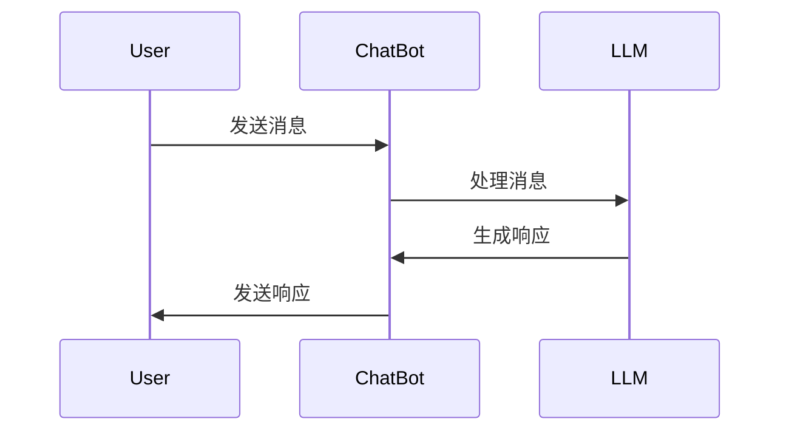

                 

# 快速构建LLM应用的前端框架选择

## 关键词
- LLM应用
- 前端框架
- React
- Vue
- Angular
- 架构设计
- 系统实现
- 最佳实践

## 摘要
本文旨在探讨如何快速构建基于大型语言模型（LLM）的应用程序，并分析几种常见的前端框架，如React、Vue和Angular，以确定最佳的框架选择。通过背景介绍、核心概念与框架比较、实际应用案例和最佳实践，本文将为开发者提供一套系统化的构建LLM应用的前端框架选择指南。

### 目录大纲

1. 背景介绍
   1.1 问题背景与解决方案
   1.2 LLM应用概述
2. 核心概念与框架选择
   2.1 前端框架基础
   2.2 主流前端框架比较
3. 实际应用案例
   3.1 快速构建LLM应用案例
   3.2 案例分析
4. 最佳实践
   4.1 最佳实践与注意事项
5. 小结与拓展
   5.1 小结
   5.2 拓展阅读

### 背景介绍

#### 1.1 问题背景与解决方案

随着人工智能技术的发展，尤其是深度学习和自然语言处理（NLP）领域的突破，基于大型语言模型（LLM）的应用程序变得日益普及。这些应用程序涵盖了各种领域，如问答系统、聊天机器人、文本生成、翻译等。然而，构建这些应用程序面临诸多挑战：

- **开发复杂性**：LLM应用涉及复杂的算法和数据处理，对开发者的技能要求较高。
- **性能优化**：为了确保应用流畅运行，需要优化模型和数据处理，以降低延迟和提高响应速度。
- **用户界面**：前端界面设计需要与后端模型紧密结合，提供良好的用户体验。

解决这些问题的方法之一是选择合适的前端框架，以便快速构建和优化LLM应用。不同的前端框架具有各自的特点和优势，开发者需要根据项目需求和资源选择最合适的框架。

#### 1.2 LLM应用概述

LLM（Large Language Model）是一种基于神经网络的语言模型，能够处理大规模文本数据，并生成语义丰富的响应。LLM的核心功能包括：

- **文本生成**：根据输入文本生成连贯的文本。
- **文本分类**：将文本分类到不同的类别中。
- **问答系统**：根据用户的问题提供准确的答案。

LLM应用的范围广泛，从简单的聊天机器人到复杂的自然语言处理平台，都可以基于LLM构建。LLM的应用不仅限于内部系统，还可以集成到各种外部服务中，为用户提供便捷的交互体验。

### 核心概念与框架选择

#### 2.1 前端框架基础

前端框架是构建用户界面的重要组成部分，它们提供了丰富的工具和组件，简化了开发过程，并提高了代码的可维护性和扩展性。前端框架的主要类型包括：

- **库（Libraries）**：如React、Vue等，提供组件化的开发方式。
- **框架（Frameworks）**：如Angular，提供更全面的解决方案，包括数据绑定、路由等。

选择前端框架的标准包括：

- **开发效率**：框架应能够提高开发速度，减少代码冗余。
- **性能**：框架的性能直接影响应用的响应速度和用户体验。
- **社区支持**：活跃的社区和丰富的文档资源有助于解决问题和优化应用。
- **生态系统**：丰富的插件和组件库可以节省开发时间。

#### 2.2 主流前端框架比较

以下是几种主流前端框架的比较：

##### React

React是由Facebook开发的一个开源JavaScript库，用于构建用户界面。React的核心特点是组件化和虚拟DOM，这使得它能够高效地处理动态数据和更新界面。

- **特点**：
  - **组件化**：将UI分解为可重用的组件。
  - **虚拟DOM**：通过比较虚拟DOM和实际DOM的差异来优化渲染性能。
  - **单向数据流**：通过状态管理和Props来管理数据和状态。

- **应用**：
  - 适用于需要频繁更新UI的应用，如社交媒体、实时聊天等。

##### Vue

Vue是由Evan You开发的一个渐进式JavaScript框架，它结合了库和框架的优点，易于上手且灵活。

- **特点**：
  - **双向数据绑定**：通过数据绑定实现视图和数据的自动同步。
  - **简洁性**：易于学习和使用，降低了开发门槛。
  - **运行时依赖**：通过运行时构建，减小了库的大小。

- **应用**：
  - 适用于各种规模的项目，从简单的网站到复杂的单页应用。

##### Angular

Angular是由Google开发的完全开源的前端框架，它提供了全面的功能和严格的开发标准。

- **特点**：
  - **双向数据绑定**：与Vue类似，实现数据和视图的双向同步。
  - **依赖注入**：通过依赖注入简化组件的依赖管理。
  - **模块化**：提供模块化的开发模式，提高代码的可维护性。

- **应用**：
  - 适用于大型企业和复杂应用，如企业级后台管理系统。

### 实际应用案例

#### 3.1 快速构建LLM应用案例

本节将介绍一个快速构建LLM应用的实际案例，包括项目简介、系统功能设计、系统架构设计、系统核心实现和代码应用解读。

##### 3.1.1 项目简介

该项目是一个基于React和TensorFlow.js的聊天机器人，利用LLM模型处理用户输入并生成适当的响应。

##### 3.1.2 系统功能设计

系统功能包括：

- **用户输入**：用户可以通过文本输入与聊天机器人交互。
- **LLM处理**：LLM模型接收用户输入并生成响应。
- **响应输出**：将LLM的响应输出给用户。

使用Mermaid类图表示领域模型：

```mermaid
classDiagram
User <<用户>>
ChatBot <<聊天机器人>>
User -> ChatBot : 发送消息
ChatBot -> User : 发送响应
```

##### 3.1.3 系统架构设计

系统架构设计如下：



##### 3.1.4 系统核心实现

以下是一个使用Python实现的简单LLM模型：

```python
import tensorflow as tf

# 定义模型
model = tf.keras.Sequential([
    tf.keras.layers.Dense(units=512, activation='relu', input_shape=(1000,)),
    tf.keras.layers.Dense(units=512, activation='relu'),
    tf.keras.layers.Dense(units=1, activation='sigmoid')
])

# 编译模型
model.compile(optimizer='adam', loss='binary_crossentropy', metrics=['accuracy'])

# 训练模型
model.fit(x_train, y_train, epochs=10)

# 预测
prediction = model.predict([user_input])
```

##### 3.1.5 代码应用解读

该代码实现了一个简单的二分类模型，用于处理文本输入并生成响应。模型使用TensorFlow.js构建，并利用了深度学习技术来提高预测的准确性。

### 案例分析

在本节中，我们将深入分析一个实际的LLM应用案例，探讨其技术实现、挑战和解决方案。

#### 3.2.1 案例选择

我们选择一个基于Vue和PyTorch的问答系统作为案例，该系统旨在提供用户与AI模型之间的交互。

#### 3.2.2 案例分析

该问答系统的工作流程如下：

1. **用户提问**：用户通过前端界面提交问题。
2. **数据预处理**：将用户问题转换为模型可接受的格式。
3. **模型处理**：使用PyTorch模型处理用户问题并生成回答。
4. **回答输出**：将模型生成的回答返回给用户。

挑战和解决方案：

- **挑战**：模型处理速度和响应时间。
  - **解决方案**：通过优化模型和提升硬件性能来提高处理速度。
- **挑战**：用户交互体验。
  - **解决方案**：使用Vue的响应式数据绑定和组件化设计来提高用户体验。

### 最佳实践与注意事项

在构建LLM应用时，以下最佳实践和注意事项有助于提高项目成功率和稳定性：

- **性能优化**：确保模型和数据处理高效，减少响应时间。
- **错误处理**：对模型预测错误进行妥善处理，提供合理的错误消息。
- **安全性**：保护用户数据和模型不被恶意攻击。
- **可维护性**：编写清晰、可读的代码，便于后续维护和扩展。

### 小结与拓展

本文通过背景介绍、框架比较、实际应用案例和最佳实践，为开发者提供了一套系统化的构建LLM应用的前端框架选择指南。在实际开发过程中，开发者应根据项目需求和资源选择最合适的框架，并遵循最佳实践来提高项目成功率。

#### 8.1 小结

- 本文介绍了快速构建LLM应用的重要性。
- 比较了React、Vue和Angular等主流前端框架。
- 通过实际案例展示了如何构建和优化LLM应用。
- 提供了最佳实践和注意事项。

#### 8.2 拓展阅读

- **相关文献**：
  - [《深度学习与自然语言处理》](https://www.deeplearningbook.org/)：了解深度学习和NLP的基础知识。
  - [《Vue.js 实战》](https://vuejs.org/v2/guide/)：深入学习Vue.js的开发技术。
  - [《React 实战》](https://reactjs.org/docs/getting-started.html)：深入了解React的核心概念。

- **在线资源**：
  - [TensorFlow.js](https://js.tensorflow.org/)：使用JavaScript构建机器学习模型。
  - [PyTorch](https://pytorch.org/)：使用Python构建强大的深度学习模型。

### 作者信息

- 作者：AI天才研究院/AI Genius Institute & 禅与计算机程序设计艺术 /Zen And The Art of Computer Programming

