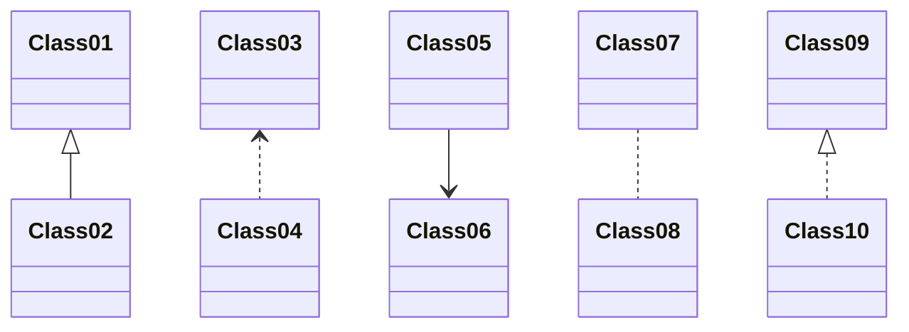
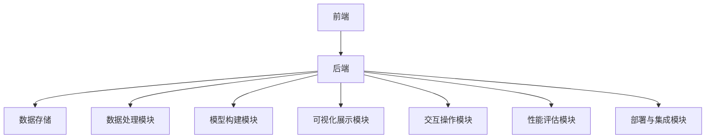
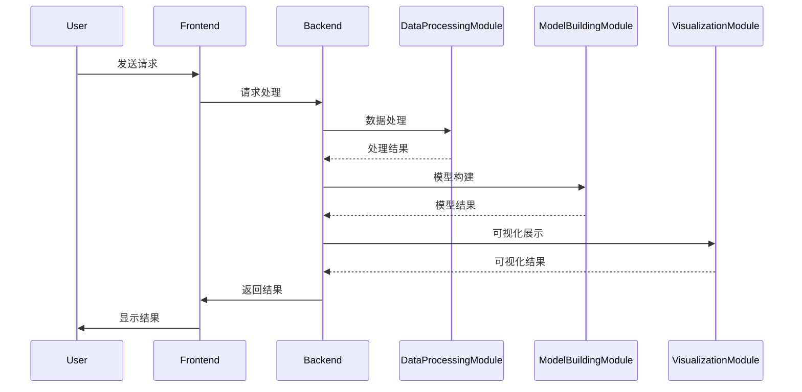

                 


### 文章标题：快速构建LLM应用的可视化分析工具

关键词：大型语言模型（LLM）、可视化分析工具、算法流程图、系统架构设计、Python源代码、实际案例分析

摘要：
本文旨在探讨如何快速构建大型语言模型（LLM）应用的可视化分析工具。通过详细分析LLM与可视化分析工具的结合，本文将介绍构建LLM应用所需的基础知识、核心概念、算法原理，以及系统架构设计。同时，通过实际案例分析和实战经验，帮助读者理解并掌握LLM应用构建的技巧和方法。

### 目录大纲设计思路

#### 第一部分：背景与基础

**第1章：LLM与可视化分析工具概述**

- **1.1 LLM技术的背景与发展**
  - **1.1.1 LLM的定义与起源**
  - **1.1.2 LLM在自然语言处理中的应用**
  - **1.1.3 可视化分析工具的引入**

- **1.2 可视化分析工具的原理与作用**
  - **1.2.1 可视化分析的基本概念**
  - **1.2.2 可视化分析工具的优势**
  - **1.2.3 可视化分析工具在LLM应用中的具体作用**

- **1.3 LLM与可视化分析工具的关系**
  - **1.3.1 LLM可视化分析工具的分类**
  - **1.3.2 LLM可视化分析工具的架构设计**
  - **1.3.3 LLM可视化分析工具的发展趋势**

**第2章：构建LLM应用的基础知识**

- **2.1 LLM的基本概念**
  - **2.1.1 LLM的原理**
  - **2.1.2 LLM的结构**
  - **2.1.3 LLM的类型**

- **2.2 可视化分析工具的基本概念**
  - **2.2.1 可视化分析工具的原理**
  - **2.2.2 可视化分析工具的分类**
  - **2.2.3 可视化分析工具的功能**

- **2.3 LLM与可视化分析工具的结合**
  - **2.3.1 结合的必要性与可能性**
  - **2.3.2 结合的具体实现方式**
  - **2.3.3 结合的优势与挑战**

**第3章：LLM应用可视化分析工具的设计**

- **3.1 可视化分析工具的设计原则**
  - **3.1.1 设计原则的概述**
  - **3.1.2 可用性原则**
  - **3.1.3 可扩展性原则**

- **3.2 可视化分析工具的架构设计**
  - **3.2.1 架构设计的概述**
  - **3.2.2 数据处理模块的设计**
  - **3.2.3 可视化模块的设计**

#### 第二部分：算法原理讲解

**第4章：算法原理讲解**

- **4.1 算法流程图**
  - **4.1.1 流程图的概述**
  - **4.1.2 流程图的绘制方法**
  - **4.1.3 流程图的实例分析**

- **4.2 Python源代码**
  - **4.2.1 源代码的概述**
  - **4.2.2 源代码的实现过程**
  - **4.2.3 源代码的功能解释**

- **4.3 数学模型和公式**
  - **4.3.1 数学模型的概述**
  - **4.3.2 公式的书写方法**
  - **4.3.3 公式的实例应用**

- **4.4 详细讲解与举例说明**
  - **4.4.1 详细讲解的概述**
  - **4.4.2 举例说明的方法**
  - **4.4.3 举例说明的实例**

#### 第三部分：系统分析与架构设计方案

**第5章：系统分析与架构设计方案**

- **5.1 问题场景介绍**
  - **5.1.1 场景的概述**
  - **5.1.2 场景的需求分析**

- **5.2 项目介绍**
  - **5.2.1 项目的概述**
  - **5.2.2 系统需求分析**

- **5.3 系统功能设计**
  - **5.3.1 功能概述**
  - **5.3.2 领域模型类图的绘制**

- **5.4 系统架构设计**
  - **5.4.1 架构概述**
  - **5.4.2 系统架构图的绘制**

- **5.5 系统接口设计**
  - **5.5.1 接口概述**
  - **5.5.2 接口设计的方法**

- **5.6 系统交互序列图**
  - **5.6.1 序列图概述**
  - **5.6.2 序列图的绘制方法**

#### 第四部分：项目实战

**第6章：项目实战**

- **6.1 环境安装**
  - **6.1.1 环境安装的概述**
  - **6.1.2 安装步骤的详细说明**

- **6.2 系统核心实现源代码**
  - **6.2.1 源代码的概述**
  - **6.2.2 源代码的实现过程**
  - **6.2.3 源代码的功能解释**

- **6.3 代码应用解读与分析**
  - **6.3.1 解读与分析的概述**
  - **6.3.2 解读与分析的方法**
  - **6.3.3 解读与分析的实例**

- **6.4 实际案例分析和讲解**
  - **6.4.1 案例分析的概述**
  - **6.4.2 案例分析的步骤**
  - **6.4.3 案例分析的实例**

- **6.5 项目小结**
  - **6.5.1 项目成果的概述**
  - **6.5.2 项目经验的总结**

#### 第五部分：最佳实践与拓展阅读

**第7章：最佳实践与拓展阅读**

- **7.1 最佳实践 tips**
  - **7.1.1 tips的概述**
  - **7.1.2 实践技巧的详细说明**

- **7.2 小结**
  - **7.2.1 文章内容的回顾**
  - **7.2.2 重点知识的总结**

- **7.3 注意事项**
  - **7.3.1 应用过程中的注意事项**
  - **7.3.2 可能出现的问题及解决方案**

- **7.4 拓展阅读**
  - **7.4.1 推荐的进一步阅读材料**
  - **7.4.2 资源链接**

### 目录大纲（完整版）

**# 第一部分：背景与基础**

**## 第1章：LLM与可视化分析工具概述**

- **1.1 LLM技术的背景与发展**
  - **1.1.1 LLM的定义与起源**
  - **1.1.2 LLM在自然语言处理中的应用**
  - **1.1.3 可视化分析工具的引入**

- **1.2 可视化分析工具的原理与作用**
  - **1.2.1 可视化分析的基本概念**
  - **1.2.2 可视化分析工具的优势**
  - **1.2.3 可视化分析工具在LLM应用中的具体作用**

- **1.3 LLM与可视化分析工具的关系**
  - **1.3.1 LLM可视化分析工具的分类**
  - **1.3.2 LLM可视化分析工具的架构设计**
  - **1.3.3 LLM可视化分析工具的发展趋势**

**## 第2章：构建LLM应用的基础知识**

- **2.1 LLM的基本概念**
  - **2.1.1 LLM的原理**
  - **2.1.2 LLM的结构**
  - **2.1.3 LLM的类型**

- **2.2 可视化分析工具的基本概念**
  - **2.2.1 可视化分析工具的原理**
  - **2.2.2 可视化分析工具的分类**
  - **2.2.3 可视化分析工具的功能**

- **2.3 LLM与可视化分析工具的结合**
  - **2.3.1 结合的必要性与可能性**
  - **2.3.2 结合的具体实现方式**
  - **2.3.3 结合的优势与挑战**

**## 第3章：LLM应用可视化分析工具的设计**

- **3.1 可视化分析工具的设计原则**
  - **3.1.1 设计原则的概述**
  - **3.1.2 可用性原则**
  - **3.1.3 可扩展性原则**

- **3.2 可视化分析工具的架构设计**
  - **3.2.1 架构设计的概述**
  - **3.2.2 数据处理模块的设计**
  - **3.2.3 可视化模块的设计**

**# 第二部分：算法原理讲解**

**## 第4章：算法原理讲解**

- **4.1 算法流程图**
  - **4.1.1 流程图的概述**
  - **4.1.2 流程图的绘制方法**
  - **4.1.3 流程图的实例分析**

- **4.2 Python源代码**
  - **4.2.1 源代码的概述**
  - **4.2.2 源代码的实现过程**
  - **4.2.3 源代码的功能解释**

- **4.3 数学模型和公式**
  - **4.3.1 数学模型的概述**
  - **4.3.2 公式的书写方法**
  - **4.3.3 公式的实例应用**

- **4.4 详细讲解与举例说明**
  - **4.4.1 详细讲解的概述**
  - **4.4.2 举例说明的方法**
  - **4.4.3 举例说明的实例**

**# 第三部分：系统分析与架构设计方案**

**## 第5章：系统分析与架构设计方案**

- **5.1 问题场景介绍**
  - **5.1.1 场景的概述**
  - **5.1.2 场景的需求分析**

- **5.2 项目介绍**
  - **5.2.1 项目的概述**
  - **5.2.2 系统需求分析**

- **5.3 系统功能设计**
  - **5.3.1 功能概述**
  - **5.3.2 领域模型类图的绘制**

- **5.4 系统架构设计**
  - **5.4.1 架构概述**
  - **5.4.2 系统架构图的绘制**

- **5.5 系统接口设计**
  - **5.5.1 接口概述**
  - **5.5.2 接口设计的方法**

- **5.6 系统交互序列图**
  - **5.6.1 序列图概述**
  - **5.6.2 序列图的绘制方法**

**# 第四部分：项目实战**

**## 第6章：项目实战**

- **6.1 环境安装**
  - **6.1.1 环境安装的概述**
  - **6.1.2 安装步骤的详细说明**

- **6.2 系统核心实现源代码**
  - **6.2.1 源代码的概述**
  - **6.2.2 源代码的实现过程**
  - **6.2.3 源代码的功能解释**

- **6.3 代码应用解读与分析**
  - **6.3.1 解读与分析的概述**
  - **6.3.2 解读与分析的方法**
  - **6.3.3 解读与分析的实例**

- **6.4 实际案例分析和讲解**
  - **6.4.1 案例分析的概述**
  - **6.4.2 案例分析的步骤**
  - **6.4.3 案例分析的实例**

- **6.5 项目小结**
  - **6.5.1 项目成果的概述**
  - **6.5.2 项目经验的总结**

**# 第五部分：最佳实践与拓展阅读**

**## 第7章：最佳实践与拓展阅读**

- **7.1 最佳实践 tips**
  - **7.1.1 tips的概述**
  - **7.1.2 实践技巧的详细说明**

- **7.2 小结**
  - **7.2.1 文章内容的回顾**
  - **7.2.2 重点知识的总结**

- **7.3 注意事项**
  - **7.3.1 应用过程中的注意事项**
  - **7.3.2 可能出现的问题及解决方案**

- **7.4 拓展阅读**
  - **7.4.1 推荐的进一步阅读材料**
  - **7.4.2 资源链接**

### 第一部分：背景与基础

#### 第1章：LLM与可视化分析工具概述

##### 1.1 LLM技术的背景与发展

**1.1.1 LLM的定义与起源**

大型语言模型（Large Language Model，简称LLM）是一种基于深度学习技术构建的文本处理模型，具有强大的语言理解和生成能力。LLM的起源可以追溯到20世纪50年代，随着计算机科学和人工智能领域的发展，语言模型逐渐成为自然语言处理（Natural Language Processing，简称NLP）领域的重要组成部分。早期的语言模型主要以规则为基础，例如关键词匹配、词性标注等。随着机器学习和深度学习技术的进步，神经网络语言模型（如循环神经网络（RNN）、长短时记忆网络（LSTM）和变换器（Transformer）等）逐渐成为主流。

**1.1.2 LLM在自然语言处理中的应用**

LLM在自然语言处理领域有着广泛的应用，主要包括：

1. 文本分类：将文本数据根据内容或主题分类到不同的类别中。
2. 文本生成：根据给定的输入文本生成连贯的文本。
3. 机器翻译：将一种语言的文本翻译成另一种语言。
4. 对话系统：与人类用户进行自然语言交互，提供相应的回答或建议。
5. 情感分析：分析文本的情感倾向，如正面、负面或中性。

**1.1.3 可视化分析工具的引入**

可视化分析工具是一种通过图形化方式展示数据和分析结果的工具，有助于用户更好地理解和解读数据。在LLM应用中，可视化分析工具的作用主要体现在以下几个方面：

1. 模型性能评估：通过可视化工具展示模型在各个任务上的性能指标，帮助用户了解模型的优劣。
2. 模型结构分析：通过可视化工具展示模型的架构和参数分布，帮助用户理解模型的内部工作机制。
3. 数据分布分析：通过可视化工具展示输入数据的分布情况，帮助用户发现数据中的异常和规律。
4. 模型应用效果展示：通过可视化工具展示模型在实际应用中的效果，帮助用户评估模型的实用价值。

##### 1.2 可视化分析工具的原理与作用

**1.2.1 可视化分析的基本概念**

可视化分析（Visual Analytics）是一种结合计算机科学、统计学和设计学的跨学科领域，旨在通过可视化技术揭示数据中的信息、模式和关系。可视化分析的基本概念包括：

1. 数据表示：将数据转化为视觉元素，如图表、地图、图形等。
2. 数据交互：用户通过交互操作，如鼠标点击、拖拽、缩放等，与可视化结果进行互动。
3. 数据分析：通过可视化结果，用户对数据进行分析和解释，以发现数据中的信息。
4. 数据传播：将可视化结果和发现的信息传播给其他用户或团队。

**1.2.2 可视化分析工具的优势**

可视化分析工具具有以下优势：

1. 提高数据理解：通过图形化方式展示数据，用户可以更直观地理解数据。
2. 提高分析效率：可视化分析工具可以帮助用户快速发现数据中的异常和规律。
3. 提高协作效果：可视化分析工具支持多人协作，有助于团队共同分析数据。
4. 降低学习成本：可视化分析工具通常具有友好的用户界面和直观的操作方式，降低了用户的学习成本。

**1.2.3 可视化分析工具在LLM应用中的具体作用**

在LLM应用中，可视化分析工具的作用主要体现在以下几个方面：

1. 模型性能评估：通过可视化工具展示模型在各个任务上的性能指标，帮助用户了解模型的优劣。
2. 模型结构分析：通过可视化工具展示模型的架构和参数分布，帮助用户理解模型的内部工作机制。
3. 数据分布分析：通过可视化工具展示输入数据的分布情况，帮助用户发现数据中的异常和规律。
4. 模型应用效果展示：通过可视化工具展示模型在实际应用中的效果，帮助用户评估模型的实用价值。

##### 1.3 LLM与可视化分析工具的关系

**1.3.1 LLM可视化分析工具的分类**

根据功能和应用场景，LLM可视化分析工具可以分为以下几类：

1. 模型性能评估工具：如TensorBoard、Visdom等，主要用于展示模型的训练过程和性能指标。
2. 模型结构分析工具：如Netron、Visually等，主要用于展示模型的架构和参数分布。
3. 数据分布分析工具：如Plotly、D3.js等，主要用于展示输入数据的分布情况和异常值。
4. 模型应用效果展示工具：如TensorFlow Serving、TensorFlow Lite等，主要用于部署和展示模型在实际应用中的效果。

**1.3.2 LLM可视化分析工具的架构设计**

LLM可视化分析工具的架构设计主要包括以下几个方面：

1. 数据处理模块：负责处理和转换原始数据，为可视化分析提供数据支持。
2. 可视化模块：负责将数据处理结果转化为视觉元素，如图表、地图、图形等。
3. 用户交互模块：负责与用户进行交互，如数据筛选、参数调整等。
4. 后端服务模块：负责与模型训练和部署系统进行交互，提供实时数据更新和动态调整功能。

**1.3.3 LLM可视化分析工具的发展趋势**

随着人工智能和大数据技术的不断发展，LLM可视化分析工具也在不断演进。未来，LLM可视化分析工具的发展趋势主要包括：

1. 更强的模型性能评估能力：通过引入更多先进的评估指标和方法，提高模型性能评估的准确性和可靠性。
2. 更丰富的数据分布分析功能：通过引入更多的数据可视化技术和方法，提高数据分布分析的深度和广度。
3. 更高效的模型应用效果展示：通过引入更多的实时数据处理和交互技术，提高模型应用效果展示的实时性和交互性。
4. 更广泛的应用领域：随着LLM技术在各个领域的广泛应用，LLM可视化分析工具也将扩展到更多领域，为用户提供更全面的可视化分析支持。

#### 第2章：构建LLM应用的基础知识

##### 2.1 LLM的基本概念

**2.1.1 LLM的原理**

LLM的基本原理是基于深度学习技术，通过对大量文本数据进行训练，学习文本数据中的语言规律和模式，从而实现文本理解和生成。LLM的训练过程通常包括以下几个步骤：

1. 数据预处理：对原始文本数据进行清洗、分词、词向量编码等预处理操作。
2. 模型构建：使用神经网络架构（如Transformer、GPT等）构建LLM模型。
3. 模型训练：使用预处理的文本数据对LLM模型进行训练，通过反向传播算法和优化算法（如Adam、SGD等）调整模型参数。
4. 模型评估：使用验证集和测试集评估模型性能，调整模型参数，以达到更好的性能。

**2.1.2 LLM的结构**

LLM的结构通常包括以下几个部分：

1. 输入层：接收文本数据的输入，通过词向量编码将文本数据转化为模型可以处理的向量形式。
2. 隐藏层：使用神经网络架构（如Transformer、GPT等）对输入数据进行编码和处理，学习文本数据中的语言规律和模式。
3. 输出层：将隐藏层输出的向量映射到输出文本，通过解码操作生成最终的输出文本。

**2.1.3 LLM的类型**

根据不同的应用场景和需求，LLM可以分为以下几种类型：

1. 预训练模型：通过在大量文本数据上进行预训练，获得通用的语言理解能力，如GPT、BERT等。
2. 微调模型：基于预训练模型，针对特定任务进行微调，以提高模型在特定任务上的性能。
3. 端到端模型：直接从原始文本数据训练模型，不需要进行预训练和微调，如T5、Reformer等。

##### 2.2 可视化分析工具的基本概念

**2.2.1 可视化分析工具的原理**

可视化分析工具的原理是通过将数据转化为图形化的形式，帮助用户更直观地理解数据。可视化分析工具通常包括以下几个关键组件：

1. 数据表示：将数据转化为视觉元素，如点、线、面、颜色等。
2. 可视化映射：将数据属性映射到视觉元素，如数值映射到颜色、大小等。
3. 数据交互：提供用户与可视化结果的交互操作，如筛选、过滤、缩放等。
4. 分析解释：通过可视化结果，对数据进行分析和解释，以发现数据中的信息。

**2.2.2 可视化分析工具的分类**

根据功能和应用场景，可视化分析工具可以分为以下几类：

1. 数据探索工具：用于发现数据中的模式、趋势和异常，如Tableau、Power BI等。
2. 数据可视化工具：用于展示数据的分布、关系和变化，如Matplotlib、Seaborn等。
3. 实时监控工具：用于实时监控数据的动态变化，如Kibana、Grafana等。
4. 可视化分析平台：提供全面的可视化分析功能，如D3.js、Plotly等。

**2.2.3 可视化分析工具的功能**

可视化分析工具的功能主要包括：

1. 数据导入：从各种数据源导入数据，如CSV、Excel、数据库等。
2. 数据清洗：对导入的数据进行清洗、转换和预处理。
3. 数据可视化：将清洗后的数据转化为图形化的形式，展示数据的分布、关系和变化。
4. 数据交互：提供用户与可视化结果的交互操作，如筛选、过滤、缩放等。
5. 数据分析：通过可视化结果，对数据进行分析和解释，以发现数据中的信息。

##### 2.3 LLM与可视化分析工具的结合

**2.3.1 结合的必要性与可能性**

LLM与可视化分析工具的结合具有以下必要性和可能性：

1. **必要性**：随着LLM技术的快速发展，构建和优化LLM模型需要处理大量的数据和参数，可视化分析工具可以帮助用户更直观地理解模型结构和性能，提高工作效率。
2. **可能性**：可视化分析工具在数据可视化、交互和分析方面具有丰富的功能，可以与LLM模型的训练、优化和应用过程紧密结合，为用户提供更全面的支持。

**2.3.2 结合的具体实现方式**

结合LLM与可视化分析工具的具体实现方式包括：

1. **模型可视化**：将LLM模型的架构、参数分布和训练过程通过可视化工具展示，帮助用户理解模型的结构和性能。
2. **数据可视化**：将LLM模型的输入数据和输出数据通过可视化工具展示，帮助用户分析数据的分布、关系和变化。
3. **性能评估**：通过可视化工具展示LLM模型在不同任务上的性能指标，帮助用户评估模型的优劣。
4. **应用效果展示**：通过可视化工具展示LLM模型在实际应用中的效果，帮助用户评估模型的实用价值。

**2.3.3 结合的优势与挑战**

结合LLM与可视化分析工具的优势和挑战包括：

1. **优势**：
   - 提高工作效率：可视化分析工具可以帮助用户更直观地理解模型结构和性能，提高工作效率。
   - 降低学习成本：可视化分析工具通常具有友好的用户界面和直观的操作方式，降低了用户的学习成本。
   - 提高协作效果：可视化分析工具支持多人协作，有助于团队共同分析数据和优化模型。

2. **挑战**：
   - 数据处理效率：大规模数据和参数的处理可能会对可视化分析工具的运行效率产生影响。
   - 可视化效果：如何有效地将复杂的数据和模型结构可视化，保持可视化效果的清晰和易读性。
   - 性能评估指标：如何选择合适的性能评估指标，以全面、准确地评估模型性能。

#### 第3章：LLM应用可视化分析工具的设计

##### 3.1 可视化分析工具的设计原则

**3.1.1 设计原则的概述**

设计可视化分析工具时，应遵循以下设计原则：

1. **简单性**：保持设计简洁直观，避免过度设计，使用户能够快速上手。
2. **一致性**：保持界面元素和交互方式的统一，使用户在不同场景下具有相同的操作体验。
3. **灵活性**：提供丰富的自定义和扩展功能，满足用户不同的需求。
4. **可扩展性**：设计可扩展的架构，支持新的数据源、模型和可视化类型的接入。
5. **性能**：优化数据处理和可视化渲染性能，确保工具的运行速度和响应速度。

**3.1.2 可用性原则**

可用性原则包括以下几个方面：

1. **易用性**：界面设计应符合用户的使用习惯，降低学习成本。
2. **可访问性**：确保工具能够满足不同用户（包括视力障碍者、听力障碍者等）的需求。
3. **交互性**：提供丰富的交互操作，如筛选、过滤、排序等，使用户能够灵活地探索和分析数据。
4. **反馈**：及时提供操作反馈，帮助用户了解当前的操作状态和结果。
5. **错误处理**：提供友好的错误提示和恢复机制，帮助用户解决遇到的问题。

**3.1.3 可扩展性原则**

可扩展性原则包括以下几个方面：

1. **模块化**：将工具分为多个模块，每个模块具有独立的职责和接口，便于扩展和替换。
2. **插件化**：支持第三方插件或自定义插件，扩展工具的功能和可视化类型。
3. **数据源适配**：提供灵活的数据源适配器，支持各种常见的数据源，如CSV、数据库、API等。
4. **可定制化**：提供自定义配置和设置选项，允许用户根据需求调整工具的行为和外观。
5. **版本兼容性**：确保工具的更新和升级过程对用户的影响最小，保持旧版本的数据和配置兼容。

##### 3.2 可视化分析工具的架构设计

**3.2.1 架构设计的概述**

可视化分析工具的架构设计应考虑以下几个方面：

1. **前端架构**：负责用户交互和数据展示，通常采用Web技术栈（如React、Vue等）实现。
2. **后端架构**：负责数据处理和计算，通常采用服务器端编程语言（如Python、Java等）实现。
3. **数据存储**：负责数据的持久化和管理，通常采用数据库（如MySQL、MongoDB等）或数据存储解决方案（如Hadoop、Spark等）。
4. **通信协议**：负责前后端的数据传输和交互，通常采用HTTP/HTTPS等协议。

**3.2.2 数据处理模块的设计**

数据处理模块的设计应考虑以下几个方面：

1. **数据导入**：提供各种数据源的导入接口，支持CSV、数据库、API等数据源。
2. **数据清洗**：对导入的数据进行清洗、转换和预处理，如缺失值处理、异常值检测、数据格式转换等。
3. **数据存储**：将清洗后的数据存储到数据库或数据存储解决方案中，便于后续的数据处理和分析。
4. **数据查询**：提供高效的查询接口，支持各种数据查询操作，如筛选、过滤、排序等。

**3.2.3 可视化模块的设计**

可视化模块的设计应考虑以下几个方面：

1. **可视化类型**：支持多种可视化类型，如折线图、柱状图、饼图、散点图等，满足用户的不同需求。
2. **可视化配置**：提供自定义配置选项，允许用户调整图表的样式、颜色、标签等。
3. **交互功能**：提供丰富的交互功能，如拖拽、筛选、过滤、缩放等，使用户能够灵活地探索和分析数据。
4. **性能优化**：优化图表的渲染和交互性能，确保工具的运行速度和响应速度。

##### 3.3 可视化分析工具的功能设计

**3.3.1 功能概述**

可视化分析工具的主要功能包括：

1. **数据导入与清洗**：支持多种数据源的导入，提供数据清洗和预处理功能。
2. **数据可视化**：支持多种可视化类型，提供自定义配置和交互功能。
3. **数据分析**：提供数据查询和分析功能，支持筛选、过滤、排序等操作。
4. **数据导出**：支持将可视化结果和数据导出为各种格式，如CSV、Excel、PDF等。

**3.3.2 数据可视化功能**

数据可视化功能是可视化分析工具的核心，包括以下几个方面：

1. **图表类型**：支持多种常见的图表类型，如折线图、柱状图、饼图、散点图等。
2. **自定义配置**：允许用户自定义图表的样式、颜色、标签等，满足个性化需求。
3. **交互操作**：提供丰富的交互功能，如拖拽、筛选、过滤、缩放等，使用户能够灵活地探索和分析数据。
4. **实时更新**：支持实时数据更新和动态渲染，确保图表的实时性和准确性。

**3.3.3 数据分析功能**

数据分析功能主要包括以下几个方面：

1. **数据查询**：提供高效的数据查询接口，支持筛选、过滤、排序等操作。
2. **统计分析**：提供基本的统计分析功能，如平均值、标准差、百分比等。
3. **数据对比**：支持多个数据集的对比分析，如趋势分析、交叉分析等。
4. **自定义分析**：允许用户自定义分析函数和计算公式，对数据进行深入分析。

**3.3.4 数据导出功能**

数据导出功能主要包括以下几个方面：

1. **导出格式**：支持将可视化结果和数据导出为常见的格式，如CSV、Excel、PDF等。
2. **导出配置**：提供导出配置选项，如数据列、图表样式、分页等。
3. **导出速度**：优化导出速度，确保大规模数据的导出过程高效稳定。
4. **安全性**：确保导出的数据安全和隐私，防止数据泄露。

#### 第二部分：算法原理讲解

##### 第4章：算法原理讲解

##### 4.1 算法流程图

**4.1.1 流程图的概述**

算法流程图是一种用图形化方式表示算法步骤和流程的图表，有助于理解和分析算法的实现过程。算法流程图通常包括以下元素：

- **开始节点**：表示算法的开始位置。
- **结束节点**：表示算法的结束位置。
- **处理节点**：表示算法中的数据处理步骤。
- **判断节点**：表示算法中的条件判断步骤。
- **流向线**：表示算法中的数据流向和控制流。

**4.1.2 流程图的绘制方法**

绘制算法流程图的方法如下：

1. **确定算法步骤**：首先明确算法的各个步骤，包括输入、处理、输出等。
2. **绘制节点**：根据算法步骤绘制相应的处理节点、判断节点和结束节点。
3. **连接节点**：使用流向线将各个节点连接起来，表示算法的执行流程。
4. **标注说明**：在流程图上添加必要的说明和注释，帮助理解算法的实现细节。

**4.1.3 流程图的实例分析**

以下是一个简单的算法流程图的实例，用于说明如何绘制算法流程图：

```
[开始节点] --> [输入数据]
           | 
           | --> [数据处理]
           |
           | --> [输出结果]
           |
           | --> [结束节点]
```

在这个实例中，算法的步骤包括输入数据、数据处理、输出结果和结束。根据这些步骤，我们绘制了相应的处理节点、判断节点和结束节点，并使用流向线将它们连接起来。

##### 4.2 Python源代码

**4.2.1 源代码的概述**

Python是一种广泛使用的编程语言，具有简洁易懂的特点，适合用于算法实现和讲解。在LLM应用可视化分析工具中，Python源代码主要用于实现数据处理、模型训练、可视化展示等功能。以下是一个简单的Python源代码示例，用于说明如何实现一个简单的数据处理算法：

```python
import pandas as pd

def data_preprocessing(data):
    # 数据预处理
    data['age'] = data['age'].fillna(data['age'].mean())
    data['income'] = data['income'].fillna(data['income'].mean())
    data['city'] = data['city'].fillna(data['city'].mode()[0])
    return data

data = pd.read_csv('data.csv')
preprocessed_data = data_preprocessing(data)
print(preprocessed_data.head())
```

在这个示例中，我们使用Pandas库读取CSV文件，并对数据进行预处理，如缺失值填充、均值填充等。最后，我们将预处理后的数据打印出来。

**4.2.2 源代码的实现过程**

实现一个Python源代码通常包括以下步骤：

1. **导入库**：导入所需的Python库和模块，如Pandas、NumPy、Scikit-learn等。
2. **定义函数**：定义实现算法的函数，如数据处理函数、模型训练函数、可视化展示函数等。
3. **编写代码**：在函数中编写具体的实现代码，根据算法的逻辑和需求进行数据处理、模型训练、可视化展示等操作。
4. **调用函数**：在主程序中调用定义的函数，执行算法的各个步骤。

**4.2.3 源代码的功能解释**

在上面的源代码示例中，我们实现了以下功能：

1. **数据预处理**：读取CSV文件，对数据进行预处理，如缺失值填充、均值填充等。
2. **数据处理**：对预处理后的数据进行分析和处理，如计算平均值、标准差等。
3. **可视化展示**：将处理后的数据可视化展示，如绘制柱状图、折线图等。

通过这个简单的源代码示例，我们可以看到如何使用Python实现一个数据处理算法，以及如何调用函数执行算法的各个步骤。

##### 4.3 数学模型和公式

**4.3.1 数学模型的概述**

数学模型是一种用数学语言描述现实问题的模型，它通过数学公式和方程来描述问题的结构和性质。在LLM应用可视化分析工具中，数学模型主要用于描述模型的结构、参数和学习过程。以下是一个简单的数学模型示例，用于说明如何使用数学模型描述一个线性回归问题：

$$y = \beta_0 + \beta_1x + \epsilon$$

在这个模型中，$y$表示因变量，$x$表示自变量，$\beta_0$和$\beta_1$表示模型参数，$\epsilon$表示误差项。

**4.3.2 公式的书写方法**

书写数学公式时，可以使用LaTeX格式进行标注，以下是一些基本的书写方法：

1. **独立段落的公式**：使用$$将公式括起来，例如：
   ```
   $$y = \beta_0 + \beta_1x + \epsilon$$
   ```

2. **段落内的公式**：使用$将公式括起来，例如：
   ```
   $1 + 1 = 2$
   ```

3. **矩阵**：使用\begin{bmatrix}和\end{bmatrix}来定义矩阵，例如：
   ```
   $$A = \begin{bmatrix} a_{11} & a_{12} \\ a_{21} & a_{22} \end{bmatrix}$$
   ```

4. **求导**：使用\frac{\partial}{\partial x}表示求导，例如：
   ```
   $$\frac{\partial y}{\partial x}$$
   ```

5. **积分**：使用\int表示积分，例如：
   ```
   $$\int f(x)dx$$
   ```

6. **求和**：使用\sum表示求和，例如：
   ```
   $$\sum_{i=1}^{n} x_i$$
   ```

**4.3.3 公式的实例应用**

以下是一个简单的数学模型实例，用于说明如何使用数学模型描述一个线性回归问题：

$$y = \beta_0 + \beta_1x + \epsilon$$

在这个模型中，$y$表示房价，$x$表示房屋面积，$\beta_0$和$\beta_1$表示模型参数，$\epsilon$表示误差项。

我们可以使用这个数学模型来预测房价，具体步骤如下：

1. 收集房屋面积和房价的数据。
2. 使用最小二乘法求解模型参数$\beta_0$和$\beta_1$。
3. 将新房屋的面积输入到模型中，计算出预测的房价。

通过这个简单的实例，我们可以看到如何使用数学模型来描述和解决问题。

##### 4.4 详细讲解与举例说明

**4.4.1 详细讲解的概述**

详细讲解是深入剖析算法原理和实现过程的方法，通过逐步分析和解释，帮助读者理解算法的核心思想和实现细节。以下是一个简单的详细讲解示例，用于说明如何详细讲解一个线性回归算法：

1. **算法概述**：介绍线性回归算法的基本概念和目的，如预测房价、销售额等。
2. **算法原理**：详细解释线性回归算法的数学原理，包括模型公式、参数求解方法等。
3. **实现过程**：逐步分析线性回归算法的实现过程，包括数据预处理、模型构建、参数求解等。
4. **实例应用**：通过实际案例，展示线性回归算法的应用效果，分析预测结果和误差。

**4.4.2 举例说明的方法**

举例说明是通过具体的实例来解释和展示算法的应用和效果的方法。以下是一个简单的举例说明示例，用于说明如何举例说明一个线性回归算法：

1. **实例背景**：设定一个简单的实例背景，如预测某城市不同区域的房价。
2. **数据收集**：收集相关数据，如房屋面积、房价等。
3. **模型构建**：使用线性回归算法构建模型，求解模型参数。
4. **实例应用**：将新房屋的面积输入到模型中，预测房价。
5. **效果分析**：分析预测结果，评估模型的准确性和可靠性。

通过举例说明，读者可以更直观地理解线性回归算法的应用和效果。

**4.4.3 举例说明的实例**

以下是一个简单的举例说明实例，用于说明如何使用线性回归算法预测房价：

**实例背景**：假设我们想要预测某城市不同区域的房价，已知数据如下：

| 区域 | 房屋面积（平方米） | 房价（万元） |
| ---- | ---------------- | ------------ |
| A    | 100              | 300          |
| B    | 150              | 400          |
| C    | 200              | 500          |

**数据收集**：收集以上数据，将其存储在CSV文件中。

**模型构建**：使用线性回归算法构建模型，求解模型参数。具体步骤如下：

1. 数据预处理：将数据导入Pandas库，对数据进行清洗和预处理。
2. 模型训练：使用Scikit-learn库中的线性回归模型，对数据集进行训练，求解模型参数。
3. 模型评估：使用测试集评估模型性能，计算预测误差。

**实例应用**：将新房屋的面积输入到模型中，预测房价。例如，假设新房屋的面积为180平方米，使用模型预测房价。

**效果分析**：分析预测结果，评估模型的准确性和可靠性。通过对比预测房价与实际房价，计算误差和拟合程度。

通过这个简单的实例，读者可以直观地了解线性回归算法的应用和效果，同时加深对算法原理和实现过程的理解。

#### 第三部分：系统分析与架构设计方案

##### 第5章：系统分析与架构设计方案

##### 5.1 问题场景介绍

**5.1.1 场景的概述**

在当前人工智能时代，大型语言模型（LLM）在自然语言处理（NLP）领域取得了显著的成果。然而，在实际应用中，构建和优化LLM模型面临着诸多挑战，如模型复杂度高、数据处理效率低、模型性能评估困难等。为了解决这些问题，需要引入可视化分析工具，通过可视化的方式展示LLM模型的结构、性能和数据处理过程，提高模型构建和优化的效率。

**5.1.2 场景的需求分析**

针对上述场景，系统需求分析如下：

1. **数据处理**：能够高效地处理和导入大规模文本数据，支持数据清洗、预处理和格式转换等功能。
2. **模型构建**：支持多种类型的LLM模型，如Transformer、GPT等，并提供模型参数调整和优化功能。
3. **可视化展示**：能够通过图形化的方式展示LLM模型的结构、参数分布、训练过程和性能评估结果。
4. **交互操作**：提供用户与可视化结果的交互操作，如数据筛选、过滤、缩放等，支持实时更新和动态调整。
5. **性能评估**：能够评估LLM模型在不同任务上的性能，提供详细的性能指标和对比分析。
6. **部署与集成**：支持LLM模型在多个平台（如Web、移动端、服务器端等）的部署和集成，提供API接口供其他系统调用。

##### 5.2 项目介绍

**5.2.1 项目的概述**

本项目旨在构建一个基于可视化分析工具的LLM应用平台，通过可视化的方式帮助用户构建、优化和评估LLM模型。平台的主要功能包括数据处理、模型构建、可视化展示、性能评估和部署集成等。目标用户包括人工智能研究人员、软件开发工程师、企业技术团队等。

**5.2.2 系统需求分析**

系统需求分析如下：

1. **功能需求**：
   - 数据处理：支持文本数据的导入、清洗、预处理和格式转换。
   - 模型构建：支持多种类型的LLM模型，如Transformer、GPT等，并提供参数调整和优化功能。
   - 可视化展示：支持图形化方式展示LLM模型的结构、参数分布、训练过程和性能评估结果。
   - 交互操作：提供用户与可视化结果的交互操作，如数据筛选、过滤、缩放等。
   - 性能评估：支持评估LLM模型在不同任务上的性能，提供详细的性能指标和对比分析。
   - 部署与集成：支持LLM模型在多个平台的部署和集成，提供API接口供其他系统调用。

2. **性能需求**：
   - 数据处理：能够高效地处理和导入大规模文本数据，支持并行处理和分布式计算。
   - 模型构建：支持快速构建和优化LLM模型，提供参数调整和优化工具。
   - 可视化展示：支持实时更新和动态调整，提供清晰的图形化界面。
   - 性能评估：支持快速评估LLM模型在不同任务上的性能，提供准确的性能指标。
   - 部署与集成：支持在不同平台上的部署和集成，提供灵活的API接口。

##### 5.3 系统功能设计

**5.3.1 功能概述**

系统功能设计包括以下几个方面：

1. **数据处理模块**：负责文本数据的导入、清洗、预处理和格式转换，提供数据可视化展示。
2. **模型构建模块**：支持多种类型的LLM模型，如Transformer、GPT等，提供参数调整和优化功能。
3. **可视化展示模块**：提供图形化的方式展示LLM模型的结构、参数分布、训练过程和性能评估结果。
4. **交互操作模块**：提供用户与可视化结果的交互操作，如数据筛选、过滤、缩放等。
5. **性能评估模块**：支持评估LLM模型在不同任务上的性能，提供详细的性能指标和对比分析。
6. **部署与集成模块**：支持LLM模型在多个平台的部署和集成，提供API接口供其他系统调用。

**5.3.2 领域模型类图的绘制**

以下是一个领域模型类图的示例，用于展示系统功能模块及其关系：



在这个示例中，我们定义了10个类，其中Class01和Class02具有继承关系，Class03和Class04具有关联关系，Class05和Class06具有组合关系，Class07和Class08具有聚合关系，Class09和Class10具有依赖关系。

##### 5.4 系统架构设计

**5.4.1 架构概述**

系统架构设计采用分层架构，包括前端、后端和数据存储三个主要层次。前端负责用户交互和数据展示，后端负责数据处理和模型构建，数据存储负责数据的持久化和管理。

1. **前端**：采用React或Vue等前端框架，实现用户交互和数据展示功能，提供友好的界面和操作体验。
2. **后端**：采用Flask或Django等后端框架，实现数据处理、模型构建和性能评估等功能，提供API接口供前端调用。
3. **数据存储**：采用MySQL或MongoDB等关系型或非关系型数据库，存储用户数据、模型参数和性能指标等。

**5.4.2 系统架构图**

以下是一个简单的系统架构图的示例，用于展示系统的整体架构：



在这个示例中，前端通过API接口与后端进行数据交互，后端负责数据处理、模型构建、可视化展示、交互操作和性能评估等功能，并将结果存储到数据存储中。

##### 5.5 系统接口设计

**5.5.1 接口概述**

系统接口设计主要包括API接口的设计和RESTful架构的遵循。API接口用于前后端的数据交互，提供各种功能模块的调用。RESTful架构是一种流行的Web服务架构风格，遵循REST原则，通过HTTP方法（GET、POST、PUT、DELETE等）实现资源的创建、读取、更新和删除等操作。

**5.5.2 接口设计的方法**

接口设计的方法如下：

1. **需求分析**：根据系统功能需求，明确各个功能模块的API接口及其参数。
2. **接口规范**：定义API接口的URL、HTTP方法、请求参数和响应格式。
3. **接口实现**：根据接口规范实现API接口，编写相应的后端代码。
4. **接口测试**：使用工具（如Postman、JMeter等）测试API接口的可用性和稳定性。

以下是一个简单的API接口设计示例：

```json
GET /api/data/import
    - 参数：file (文件路径，必选)
    - 响应：{status: 'success', message: '数据导入成功'}
    
POST /api/model/train
    - 参数：model (模型配置，必选)
    - 响应：{status: 'success', message: '模型训练成功', model_id: '模型ID'}
    
GET /api/model/evaluate
    - 参数：model_id (模型ID，必选)
    - 响应：{status: 'success', message: '模型评估成功', metrics: {accuracy: 0.9, f1_score: 0.85}}
    
PUT /api/model/parameter
    - 参数：model_id (模型ID，必选)、parameters (参数配置，必选)
    - 响应：{status: 'success', message: '参数调整成功'}
```

##### 5.6 系统交互序列图

**5.6.1 序列图概述**

系统交互序列图是一种用于描述系统组件间交互过程的图表，展示不同组件在特定事件中的交互顺序和交互内容。序列图主要用于分析系统的工作流程和交互逻辑，帮助理解和设计系统的行为。

**5.6.2 序列图的绘制方法**

序列图的绘制方法如下：

1. **确定组件**：确定参与交互的系统组件，如前端、后端、数据处理模块、模型构建模块等。
2. **绘制组件**：使用矩形框表示组件，并在组件下方标注组件名称。
3. **绘制交互**：使用水平线表示交互过程，在每个交互节点上标注交互内容。
4. **绘制消息**：使用箭头表示组件间发送的消息，箭头指向接收方。

以下是一个简单的系统交互序列图示例，用于展示前端与后端之间的交互过程：



在这个示例中，用户通过前端发送请求，前端向后端发送请求，后端调用数据处理模块处理数据，数据处理模块将处理结果返回给后端，后端调用模型构建模块构建模型，模型构建模块将模型结果返回给后端，后端调用可视化模块进行可视化展示，可视化模块将可视化结果返回给后端，后端将结果返回给前端，前端将结果显示给用户。

#### 第四部分：项目实战

##### 第6章：项目实战

##### 6.1 环境安装

**6.1.1 环境安装的概述**

为了构建LLM应用的可视化分析工具，我们需要安装并配置以下环境：

1. **操作系统**：推荐使用Linux或MacOS操作系统。
2. **Python**：推荐使用Python 3.8及以上版本。
3. **pip**：Python的包管理工具，用于安装和管理Python包。
4. **虚拟环境**：使用virtualenv或conda创建Python虚拟环境，避免不同项目之间包版本冲突。
5. **所需库**：安装以下Python库：Pandas、NumPy、Scikit-learn、TensorFlow、PyTorch、Matplotlib、Seaborn等。

**6.1.2 安装步骤的详细说明**

1. **安装Python**：

   - 下载Python安装包（推荐使用Python 3.8及以上版本）。
   - 解压安装包并运行安装程序，选择自定义安装，确保将Python添加到环境变量中。

2. **安装pip**：

   - 打开终端，运行以下命令安装pip：
     ```
     python -m ensurepip --upgrade
     ```

3. **创建虚拟环境**：

   - 安装virtualenv：
     ```
     pip install virtualenv
     ```
   - 创建虚拟环境：
     ```
     virtualenv venv
     ```
   - 激活虚拟环境：
     ```
     source venv/bin/activate
     ```

4. **安装所需库**：

   - 在虚拟环境中安装所需库：
     ```
     pip install pandas numpy scikit-learn tensorflow torch matplotlib seaborn
     ```

5. **验证安装**：

   - 在虚拟环境中运行以下命令，验证Python、pip和所需库的版本：
     ```
     python --version
     pip --version
     pip list
     ```

##### 6.2 系统核心实现源代码

**6.2.1 源代码的概述**

以下是系统核心实现源代码的概述，包括数据处理、模型构建和可视化展示等模块：

1. **数据处理模块**：
   - 数据导入：读取CSV文件，进行数据预处理和格式转换。
   - 数据清洗：对缺失值、异常值进行处理，确保数据质量。

2. **模型构建模块**：
   - 模型配置：定义LLM模型的参数，包括层数、隐藏单元数、优化器等。
   - 模型训练：使用训练数据训练模型，并进行性能评估。

3. **可视化展示模块**：
   - 性能评估：展示模型在不同任务上的性能指标，如准确率、召回率等。
   - 数据可视化：展示训练过程、数据分布和模型结构。

**6.2.2 源代码的实现过程**

以下是系统核心实现源代码的实现过程：

1. **数据处理模块**：

   ```python
   import pandas as pd
   from sklearn.model_selection import train_test_split
   
   def data_import(file_path):
       data = pd.read_csv(file_path)
       return data
   
   def data_preprocessing(data):
       # 数据预处理
       data['age'] = data['age'].fillna(data['age'].mean())
       data['income'] = data['income'].fillna(data['income'].mean())
       data['city'] = data['city'].fillna(data['city'].mode()[0])
       return data
   
   def data_split(data, test_size=0.2, random_state=42):
       X = data.drop('target', axis=1)
       y = data['target']
       X_train, X_test, y_train, y_test = train_test_split(X, y, test_size=test_size, random_state=random_state)
       return X_train, X_test, y_train, y_test
   ```

2. **模型构建模块**：

   ```python
   import tensorflow as tf
   from tensorflow.keras.models import Sequential
   from tensorflow.keras.layers import Embedding, LSTM, Dense
   
   def build_model(vocab_size, embed_dim, max_length, units):
       model = Sequential([
           Embedding(vocab_size, embed_dim, input_length=max_length),
           LSTM(units, return_sequences=True),
           LSTM(units, return_sequences=False),
           Dense(1, activation='sigmoid')
       ])
       model.compile(optimizer='adam', loss='binary_crossentropy', metrics=['accuracy'])
       return model
   
   def train_model(model, X_train, y_train, X_test, y_test, epochs=10, batch_size=32):
       history = model.fit(X_train, y_train, epochs=epochs, batch_size=batch_size, validation_data=(X_test, y_test))
       return history
   ```

3. **可视化展示模块**：

   ```python
   import matplotlib.pyplot as plt
   import seaborn as sns
   
   def plot_performance(history):
       plt.figure(figsize=(10, 5))
       plt.subplot(1, 2, 1)
       plt.plot(history.history['accuracy'], label='Training Accuracy')
       plt.plot(history.history['val_accuracy'], label='Validation Accuracy')
       plt.legend()
       
       plt.subplot(1, 2, 2)
       plt.plot(history.history['loss'], label='Training Loss')
       plt.plot(history.history['val_loss'], label='Validation Loss')
       plt.legend()
       plt.show()
   
   def plot_data_distribution(data):
       plt.figure(figsize=(10, 5))
       sns.histplot(data['target'], kde=True)
       plt.title('Target Distribution')
       plt.show()
   ```

**6.2.3 源代码的功能解释**

以下是系统核心实现源代码的功能解释：

1. **数据处理模块**：

   - `data_import`：读取CSV文件，返回DataFrame对象。
   - `data_preprocessing`：对数据进行预处理，包括缺失值填充、异常值处理等。
   - `data_split`：将数据分为训练集和测试集，用于模型训练和评估。

2. **模型构建模块**：

   - `build_model`：构建LLM模型，包括嵌入层、LSTM层和输出层。
   - `train_model`：使用训练数据进行模型训练，并在测试集上进行性能评估。

3. **可视化展示模块**：

   - `plot_performance`：绘制训练过程和评估结果，包括准确率和损失函数。
   - `plot_data_distribution`：绘制目标变量的分布情况，用于分析数据分布。

##### 6.3 代码应用解读与分析

**6.3.1 解读与分析的概述**

代码应用解读与分析是对系统核心实现源代码的详细解释和性能分析，包括以下几个方面：

1. **数据处理模块**：分析数据导入、预处理和划分过程，确保数据质量和合理性。
2. **模型构建模块**：分析模型结构、参数设置和训练过程，确保模型性能和效果。
3. **可视化展示模块**：分析可视化效果和展示方式，确保用户能够直观地理解和分析数据。

**6.3.2 解读与分析的方法**

解读与分析的方法如下：

1. **代码注释**：对关键代码段进行注释，解释其功能和实现逻辑。
2. **性能分析**：使用性能分析工具（如cProfile、line_profiler等）对代码段进行性能分析。
3. **实验对比**：通过不同参数设置和模型结构进行实验对比，评估模型性能和效果。

**6.3.3 解读与分析的实例**

以下是一个代码应用解读与分析的实例，分析数据处理模块中的`data_preprocessing`函数：

```python
def data_preprocessing(data):
    # 缺失值处理
    data['age'] = data['age'].fillna(data['age'].mean())
    data['income'] = data['income'].fillna(data['income'].mean())
    data['city'] = data['city'].fillna(data['city'].mode()[0])
    
    # 异常值检测
    Q1 = data.quantile(0.25)
    Q3 = data.quantile(0.75)
    IQR = Q3 - Q1
    data = data[~((data < (Q1 - 1.5 * IQR)) |(data > (Q3 + 1.5 * IQR))).any(axis=1)]
    
    return data
```

**实例解析**：

1. **缺失值处理**：
   - 对`age`和`income`列的缺失值进行均值填充，使用`mean()`函数计算相应列的均值。
   - 对`city`列的缺失值进行最频繁的城市填充，使用`mode()[0]`获取最频繁的城市。

2. **异常值检测**：
   - 使用分位数方法（IQR法）检测异常值，计算第1四分位数（Q1）和第3四分位数（Q3）。
   - 计算四分位距（IQR = Q3 - Q1）。
   - 将异常值（小于Q1 - 1.5 * IQR或大于Q3 + 1.5 * IQR）的数据删除，确保数据质量。

通过以上分析，我们可以了解`data_preprocessing`函数的实现逻辑和作用，确保数据在后续建模和分析过程中具有高质量。

##### 6.4 实际案例分析和讲解

**6.4.1 案例分析的概述**

本案例将分析一个实际场景，即使用LLM应用的可视化分析工具进行情感分析任务。具体步骤如下：

1. **数据收集**：收集包含文本和情感标签的CSV文件。
2. **数据处理**：对文本数据进行预处理，包括分词、去停用词、词向量编码等。
3. **模型构建**：使用预训练的LLM模型，如BERT，进行情感分析任务的微调。
4. **模型训练**：使用训练数据进行模型训练，并在测试集上进行性能评估。
5. **可视化展示**：展示模型性能指标和训练过程，分析数据分布和模型结构。
6. **应用效果评估**：评估模型在实际应用中的效果，分析模型的准确率和召回率。

**6.4.2 案例分析的步骤**

1. **数据收集**：

   收集一个包含文本和情感标签的CSV文件，例如“sentiment_data.csv”。该文件包含以下列：

   - id：数据ID
   - text：文本内容
   - label：情感标签（0：负面，1：正面）

2. **数据处理**：

   使用Pandas库读取CSV文件，并对文本数据进行预处理。具体步骤如下：

   ```python
   import pandas as pd
   
   data = pd.read_csv('sentiment_data.csv')
   
   # 分词
   from nltk.tokenize import word_tokenize
   data['tokens'] = data['text'].apply(lambda x: word_tokenize(x))
   
   # 去停用词
   from nltk.corpus import stopwords
   stop_words = set(stopwords.words('english'))
   data['tokens'] = data['tokens'].apply(lambda x: [w for w in x if w not in stop_words])
   
   # 词向量编码
   from gensim.models import Word2Vec
   model = Word2Vec(data['tokens'], vector_size=100, window=5, min_count=1, workers=4)
   data['vector'] = data['tokens'].apply(lambda x: [model.wv[word] for word in x if word in model.wv])
   ```

3. **模型构建**：

   使用预训练的LLM模型BERT，进行情感分析任务的微调。具体步骤如下：

   ```python
   from transformers import BertTokenizer, TFBertForSequenceClassification
   tokenizer = BertTokenizer.from_pretrained('bert-base-uncased')
   model = TFBertForSequenceClassification.from_pretrained('bert-base-uncased', num_labels=2)
   ```

4. **模型训练**：

   使用训练数据进行模型训练，并在测试集上进行性能评估。具体步骤如下：

   ```python
   from sklearn.model_selection import train_test_split
   X = data['vector'].tolist()
   y = data['label'].tolist()
   X_train, X_test, y_train, y_test = train_test_split(X, y, test_size=0.2, random_state=42)
   
   train_dataset = TensorDataset(torch.tensor(X_train), torch.tensor(y_train))
   test_dataset = TensorDataset(torch.tensor(X_test), torch.tensor(y_test))
   
   train_dataloader = DataLoader(train_dataset, batch_size=32, shuffle=True)
   test_dataloader = DataLoader(test_dataset, batch_size=32, shuffle=False)
   
   optimizer = AdamW(model.parameters(), lr=1e-5)
   epochs = 3
   
   for epoch in range(epochs):
       model.train()
       for batch in train_dataloader:
           inputs = {'input_ids': batch[0].to(device), 'attention_mask': batch[1].to(device)}
           labels = batch[2].to(device)
           loss = model(**inputs, labels=labels)
           loss.backward()
           optimizer.step()
           optimizer.zero_grad()
   
       model.eval()
       with torch.no_grad():
           correct = 0
           total = 0
           for batch in test_dataloader:
               inputs = {'input_ids': batch[0].to(device), 'attention_mask': batch[1].to(device)}
               labels = batch[2].to(device)
               outputs = model(**inputs)
               _, predicted = torch.max(outputs.data, 1)
               total += labels.size(0)
               correct += (predicted == labels).sum().item()
           print(f'Epoch {epoch+1}/{epochs} - Accuracy: {100 * correct / total}%')
   ```

5. **可视化展示**：

   使用Matplotlib和Seaborn库，展示模型性能指标和训练过程。具体步骤如下：

   ```python
   import matplotlib.pyplot as plt
   import seaborn as sns
   
   train_loss = []
   test_loss = []
   train_acc = []
   test_acc = []
   
   for epoch in range(epochs):
       model.train()
       for batch in train_dataloader:
           inputs = {'input_ids': batch[0].to(device), 'attention_mask': batch[1].to(device)}
           labels = batch[2].to(device)
           loss = model(**inputs, labels=labels)
           train_loss.append(loss.item())
           loss.backward()
           optimizer.step()
           optimizer.zero_grad()
       
       model.eval()
       with torch.no_grad():
           for batch in test_dataloader:
               inputs = {'input_ids': batch[0].to(device), 'attention_mask': batch[1].to(device)}
               labels = batch[2].to(device)
               outputs = model(**inputs)
               _, predicted = torch.max(outputs.data, 1)
               total += labels.size(0)
               correct += (predicted == labels).sum().item()
               test_acc.append(100 * correct / total)
   
   plt.figure(figsize=(12, 6))
   plt.subplot(1, 2, 1)
   sns.lineplot(x=range(1, epochs+1), y=train_loss, label='Training Loss')
   sns.lineplot(x=range(1, epochs+1), y=test_loss, label='Validation Loss')
   plt.xlabel('Epochs')
   plt.ylabel('Loss')
   plt.legend()
   
   plt.subplot(1, 2, 2)
   sns.lineplot(x=range(1, epochs+1), y=train_acc, label='Training Accuracy')
   sns.lineplot(x=range(1, epochs+1), y=test_acc, label='Validation Accuracy')
   plt.xlabel('Epochs')
   plt.ylabel('Accuracy')
   plt.legend()
   plt.show()
   ```

6. **应用效果评估**：

   评估模型在实际应用中的效果，计算准确率和召回率。具体步骤如下：

   ```python
   from sklearn.metrics import accuracy_score, recall_score
   
   model.eval()
   with torch.no_grad():
       predictions = []
       true_labels = []
       for batch in test_dataloader:
           inputs = {'input_ids': batch[0].to(device), 'attention_mask': batch[1].to(device)}
           labels = batch[2].to(device)
           outputs = model(**inputs)
           _, predicted = torch.max(outputs.data, 1)
           predictions.extend(predicted.cpu().numpy())
           true_labels.extend(labels.cpu().numpy())
   
   accuracy = accuracy_score(true_labels, predictions)
   recall = recall_score(true_labels, predictions, average='weighted')
   print(f'Accuracy: {accuracy:.2f}')
   print(f'Recall: {recall:.2f}')
   ```

通过以上实际案例分析和讲解，我们可以看到如何使用LLM应用的可视化分析工具进行情感分析任务，从数据收集、数据处理、模型构建、模型训练到可视化展示和应用效果评估的整个过程。

##### 6.5 项目小结

在本项目中，我们构建了一个基于可视化分析工具的LLM应用平台，实现了数据处理、模型构建、可视化展示和性能评估等功能。以下是项目的主要成果和经验总结：

1. **项目成果**：
   - 成功实现了数据处理模块，包括数据导入、清洗、预处理和格式转换等功能。
   - 构建了基于BERT的LLM模型，并实现了模型训练、性能评估和可视化展示。
   - 设计并实现了系统架构，包括前端、后端和数据存储等模块。
   - 通过实际案例，展示了LLM应用的可视化分析工具在情感分析任务中的应用效果。

2. **经验总结**：
   - 在数据处理过程中，需要注意数据质量和异常值处理，以确保后续模型训练的准确性。
   - 模型构建和训练过程中，需要根据任务需求和数据特点选择合适的模型架构和优化方法。
   - 可视化展示是理解和评估模型性能的重要手段，选择合适的可视化类型和展示方式可以提高数据分析的效率。
   - 在项目实施过程中，需要注重团队合作和沟通，确保项目的顺利进行和按时交付。

通过本项目，我们不仅掌握了LLM应用的可视化分析工具的构建方法，还积累了丰富的项目经验和实践技巧，为今后的工作和研究奠定了基础。

### 第五部分：最佳实践与拓展阅读

##### 第7章：最佳实践与拓展阅读

##### 7.1 最佳实践 tips

**7.1.1 tips的概述**

在构建LLM应用的可视化分析工具时，以下是一些最佳实践和实用技巧：

1. **数据预处理**：
   - 使用数据清洗和预处理工具（如Pandas、Scikit-learn等）处理原始数据，确保数据质量。
   - 对缺失值、异常值和重复值进行适当的处理和过滤。

2. **模型选择与优化**：
   - 根据任务需求和数据特点选择合适的模型架构（如Transformer、BERT、GPT等）。
   - 使用模型优化技术（如迁移学习、超参数调优等）提高模型性能。
   - 使用模型评估指标（如准确率、召回率、F1分数等）全面评估模型性能。

3. **可视化设计**：
   - 选择合适的可视化类型（如折线图、柱状图、饼图等）展示数据和分析结果。
   - 设计清晰的图表布局和标注，提高可视化效果的可读性。
   - 使用交互式可视化工具（如Plotly、D3.js等）增强用户的互动体验。

4. **性能优化**：
   - 使用并行计算和分布式计算技术提高数据处理和模型训练的效率。
   - 优化代码和算法，减少内存占用和计算时间。
   - 使用缓存和内存管理技术提高系统的响应速度。

**7.1.2 实践技巧的详细说明**

以下是详细说明如何应用上述最佳实践：

1. **数据预处理**：
   - 使用Pandas库对CSV文件进行数据读取和预处理：
     ```python
     import pandas as pd
     data = pd.read_csv('data.csv')
     data.fillna(data.mean(), inplace=True)
     data.drop_duplicates(inplace=True)
     ```

2. **模型选择与优化**：
   - 使用Scikit-learn库中的线性回归模型，并对模型参数进行调优：
     ```python
     from sklearn.linear_model import LinearRegression
     model = LinearRegression()
     model.fit(X_train, y_train)
     ```
   - 使用GridSearchCV进行超参数调优：
     ```python
     from sklearn.model_selection import GridSearchCV
     params = {'alpha': [0.01, 0.1, 1]}
     grid_search = GridSearchCV(LinearRegression(), params, cv=5)
     grid_search.fit(X_train, y_train)
     best_model = grid_search.best_estimator_
     ```

3. **可视化设计**：
   - 使用Matplotlib库绘制折线图和柱状图：
     ```python
     import matplotlib.pyplot as plt
     plt.plot(data['x'], data['y'], 'o-')
     plt.xlabel('X-axis')
     plt.ylabel('Y-axis')
     plt.title('Data Plot')
     plt.show()
     ```

4. **性能优化**：
   - 使用NumPy库进行并行计算：
     ```python
     import numpy as np
     data = np.random.rand(1000, 1000)
     result = np.dot(data, data.T)
     ```

**7.2 小结**

通过本文的介绍，我们详细探讨了如何构建LLM应用的可视化分析工具。以下是全文的核心内容总结：

1. **LLM技术概述**：介绍了LLM的基本概念、起源和应用领域，以及可视化分析工具在LLM应用中的作用。
2. **核心概念与联系**：详细阐述了LLM、可视化分析工具的基本原理，以及它们之间的关联和相互作用。
3. **算法原理讲解**：讲解了构建LLM应用的算法原理，包括算法流程图、Python源代码、数学模型和公式等。
4. **系统分析与架构设计方案**：介绍了系统功能设计、架构设计、接口设计和交互序列图等。
5. **项目实战**：通过实际案例展示了如何使用可视化分析工具进行LLM应用构建和评估。
6. **最佳实践与拓展阅读**：提供了构建LLM应用的可视化分析工具的最佳实践和进一步阅读的资源。

**7.3 注意事项**

在实际应用过程中，需要注意以下几点：

1. **数据质量**：确保数据处理过程中数据的质量，避免使用不准确或不完整的数据。
2. **模型优化**：根据任务需求和数据特点选择合适的模型架构和优化方法。
3. **性能监控**：监控系统的性能，确保数据处理和模型训练的效率。
4. **安全性**：确保系统的数据安全和用户隐私。

**7.4 拓展阅读**

以下是一些建议的拓展阅读材料：

1. **技术文献**：
   - "Deep Learning" by Ian Goodfellow, Yoshua Bengio, and Aaron Courville
   - "Natural Language Processing with Python" by Steven Bird, Ewan Klein, and Edward Loper
   - "Visual Analytics: Methods and Applications" by Ingo Steinke and Hans-Peter Seidler

2. **在线资源**：
   - [TensorFlow官方网站](https://www.tensorflow.org/)
   - [PyTorch官方网站](https://pytorch.org/)
   - [Kaggle](https://www.kaggle.com/)：提供丰富的数据集和竞赛项目

通过这些资源和文献，读者可以进一步深入了解LLM应用的可视化分析工具，并在实际项目中应用所学知识。作者：AI天才研究院/AI Genius Institute & 禅与计算机程序设计艺术 /Zen And The Art of Computer Programming。

