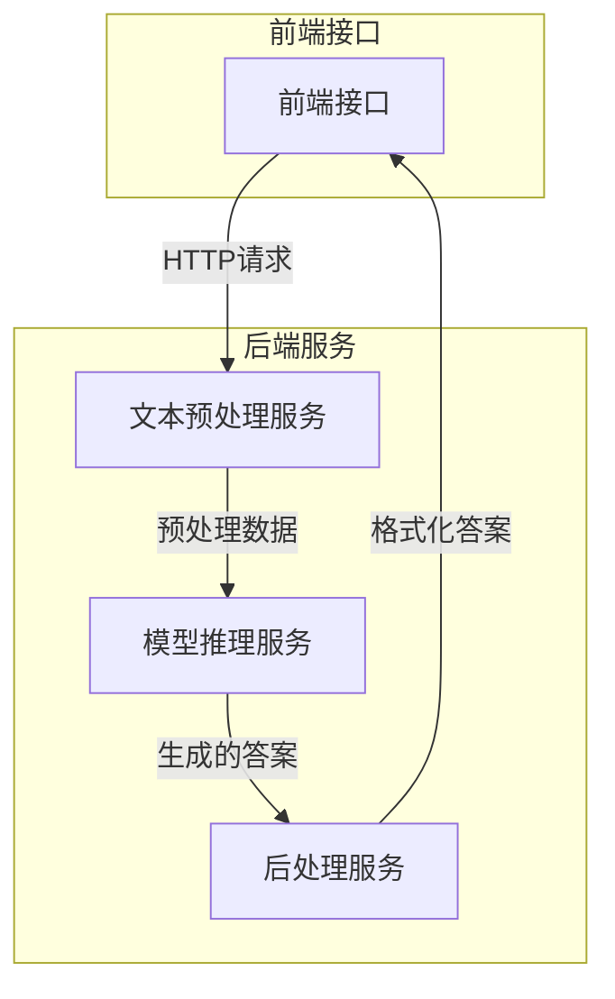
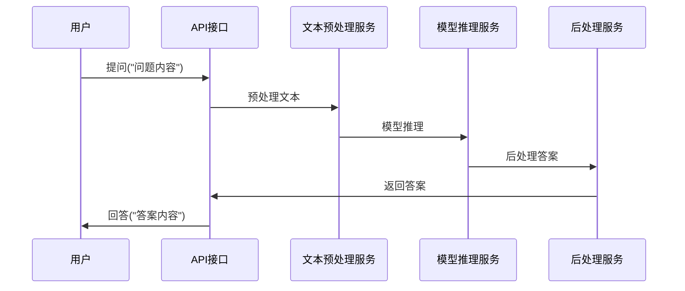

                 

### 前言

随着人工智能与大数据技术的不断进步，现代应用系统的构建方式也在经历着深刻的变革。微服务架构作为一种新兴的系统架构设计模式，因其灵活性和可扩展性，已经成为开发大规模应用系统的首选方案。本文旨在探讨如何利用微服务架构快速构建大规模语言模型（LLM）应用，帮助开发者更好地理解和应用这一先进的技术。

微服务架构的优势在于其松散耦合、服务自治和高内聚的特点，能够有效地提高系统的可维护性、可扩展性和可测试性。而大规模语言模型（LLM）作为一种基于深度学习的自然语言处理技术，具有强大的语义理解与生成能力，广泛应用于问答系统、机器翻译、文本生成等领域。将微服务架构与LLM应用相结合，不仅可以发挥两者各自的优势，还能实现系统的快速迭代和灵活扩展。

本文将按照以下结构展开：

1. **微服务架构概述**：介绍微服务的基本概念、核心特点以及在构建大规模应用系统中的优势。
2. **大规模语言模型（LLM）基础**：阐述LLM的核心概念、发展历史、核心技术以及应用场景。
3. **微服务架构在LLM应用中的设计原则**：探讨如何将微服务架构应用于LLM应用的设计与实现。
4. **LLM微服务架构的实际应用**：通过一个具体的项目案例，展示如何使用微服务架构构建LLM应用。
5. **LLM微服务架构的优化与性能调优**：讨论如何对LLM微服务架构进行性能监控、优化和扩展。
6. **微服务架构在LLM应用中的最佳实践**：总结实践经验，提出最佳实践和注意事项。
7. **未来展望**：探讨LLM技术及微服务架构的未来发展趋势和应用前景。

通过本文的详细阐述，读者将能够系统地了解微服务架构在LLM应用中的设计与应用，为实际项目开发提供有价值的参考和指导。

### 第1章：微服务架构概述

#### 1.1 问题背景与目标

在现代软件开发中，随着系统规模的不断扩大和业务需求的日益复杂，传统的单体架构逐渐暴露出诸多问题。单体架构将所有的功能模块集成在一个单一的系统中，导致系统复杂度高、可维护性差、扩展性不足。当系统需要新增功能或进行功能升级时，往往需要对整个系统进行重新编译、部署和测试，这不仅增加了开发和维护的成本，还降低了系统的灵活性。

为了解决这些问题，微服务架构（Microservices Architecture）应运而生。微服务架构通过将应用程序划分为一系列独立的、小型且高度自治的服务，从而实现了系统的松散耦合、高内聚和灵活扩展。

**问题描述：**
在现有的单体架构中，以下问题是常见的挑战：
- **高耦合性**：系统的各个模块紧密耦合，任何一个小问题的修复都可能影响到整个系统的稳定性。
- **维护成本高**：单体系统需要频繁的全量部署，每次变更都需要全面的测试，导致维护成本高昂。
- **扩展困难**：单体架构难以进行水平扩展，当系统负载增加时，通常只能通过垂直扩展（增加硬件资源）来解决问题，这不仅成本高昂，而且效果有限。
- **技术债务累积**：为了满足项目时间要求，开发者往往会在代码质量、系统架构上做出妥协，导致技术债务的累积。

**问题解决：**
微服务架构通过以下方式解决了上述问题：
- **服务拆分**：将大系统拆分为多个小服务，每个服务负责不同的业务功能，降低了系统的耦合性。
- **服务自治**：每个服务都是独立的，可以独立部署、扩展和升级，提高了系统的可维护性和灵活性。
- **松散耦合**：服务之间通过轻量级的通信协议（如RESTful API、消息队列）进行交互，降低了系统的整体复杂度。
- **水平扩展**：通过增加服务实例来水平扩展系统，提高了系统的处理能力和可扩展性。

**边界与外延：**
在采用微服务架构时，需要明确以下几点边界和原则：
- **业务领域边界**：根据业务需求将系统划分为不同的领域，每个领域对应一个或多个服务。
- **服务职责边界**：每个服务应保持单一职责，专注于完成一个特定功能，避免功能重叠。
- **技术选型边界**：不同服务可以采用不同的技术栈，以适应不同的业务需求和性能要求。
- **数据一致性边界**：在设计微服务时，需要考虑数据的一致性和隔离性，避免因数据不一致导致系统故障。

通过上述方式，微服务架构能够有效地提高系统的灵活性和可扩展性，降低维护成本，并提高开发效率。然而，微服务架构也带来了一些新的挑战，如服务治理、数据一致性和分布式系统调试等，这些将在后续章节中进一步探讨。

#### 1.2 微服务概念与特点

**微服务定义：**
微服务（Microservices）是一种基于独立、自治、小型化服务构建的应用架构模式。在微服务架构中，应用程序被拆分为多个小型、独立的服务，每个服务都运行在其独立的进程或容器中，并通过轻量级的通信机制（如HTTP/HTTPS、消息队列）进行交互。

**微服务特点：**
1. **独立性**：每个服务都是独立的，可以独立部署、扩展和升级。这意味着当一个服务出现问题时，不会影响到其他服务的正常运行。
2. **自治性**：每个服务拥有自己的数据存储、配置和业务逻辑，实现了高度的自治性。这降低了服务的耦合性，提高了系统的灵活性和可维护性。
3. **小型化**：每个服务都是小型且集中的，专注于完成一个特定的功能。这种小型化的设计使得服务更易于开发、测试和部署。
4. **高内聚**：每个服务都具有明确的功能和职责，保证了服务的内聚性。这种高内聚的设计有助于降低系统的复杂度，提高开发效率。
5. **灵活性**：不同的服务可以使用不同的编程语言和技术栈进行开发，可以根据业务需求灵活地选择和组合。
6. **可扩展性**：通过增加服务实例，可以水平扩展系统，提高系统的处理能力和响应速度。
7. **分布式**：微服务架构是一种分布式系统架构，服务可以在不同的服务器上运行，实现了计算资源的灵活分配和负载均衡。

**微服务与单体架构对比：**
1. **系统结构**：单体架构将所有功能集成在一个单一系统中，而微服务架构将系统拆分为多个独立的服务。
2. **部署与维护**：单体架构需要全量部署和测试，而微服务架构可以实现服务的独立部署和升级。
3. **耦合性**：单体架构中的模块紧密耦合，而微服务架构中的服务松散耦合，提高了系统的灵活性和可维护性。
4. **扩展性**：单体架构主要通过垂直扩展（增加硬件资源）来提高性能，而微服务架构通过水平扩展（增加服务实例）来实现性能提升。
5. **开发效率**：微服务架构可以并行开发、独立部署和快速迭代，提高了开发效率。

通过对比可以看出，微服务架构在多个方面都优于传统的单体架构，尤其是在系统的灵活性和可扩展性方面具有显著优势。然而，微服务架构也带来了一些新的挑战，如服务治理、数据一致性和分布式系统调试等，这些将在后续章节中进一步探讨。

#### 1.3 微服务架构的优势与挑战

**优势：**

1. **灵活性**：微服务架构允许使用不同的编程语言和技术栈开发各个服务，可以根据业务需求灵活选择和组合。这种灵活性使得团队可以专注于解决特定的问题，而不受技术限制。

2. **独立性**：每个微服务都是独立的，可以独立部署、扩展和升级。这意味着当一个服务出现问题时，不会影响其他服务的正常运行，提高了系统的健壮性。

3. **可扩展性**：通过增加服务实例，可以水平扩展系统，提高系统的处理能力和响应速度。这种水平扩展使得系统能够更好地应对负载增加的情况。

4. **高内聚**：每个服务都专注于完成一个特定的功能，保持了高内聚性。这种设计降低了系统的复杂度，提高了开发效率。

5. **快速迭代**：微服务架构使得团队可以独立开发和部署服务，从而实现快速迭代和交付。这种快速迭代能力有助于更快地响应市场变化和客户需求。

**挑战：**

1. **服务治理**：随着服务的数量增多，服务治理成为一个挑战。如何管理、监控和协调大量的服务实例是一个重要问题。

2. **数据一致性**：在分布式系统中，数据一致性是一个重要挑战。由于各个服务可能有自己的数据存储，如何确保数据的一致性需要特别的关注。

3. **分布式系统调试**：微服务架构是一种分布式系统，调试复杂度高。当服务出现问题时，需要全局考虑并分析问题的根源，这可能需要跨服务的调试和分析。

4. **网络通信**：服务之间的通信依赖于网络，网络的不稳定性和延迟可能会影响系统的性能和稳定性。

5. **安全性**：在分布式系统中，安全性是一个重要的考虑因素。如何确保服务的安全性，防止数据泄露和未授权访问是一个挑战。

通过认识到这些优势和挑战，开发者在设计和实现微服务架构时可以更好地权衡利弊，采取有效的策略和措施，以最大化微服务架构的优势并解决其带来的问题。

#### 1.4 微服务架构的核心概念

**服务拆分：**
服务拆分是微服务架构的核心概念之一。将一个复杂的单体应用程序拆分为多个小型、独立的服务，每个服务负责一个特定的业务功能。服务拆分的原则包括：
- **业务领域划分**：根据业务领域的不同，将系统划分为多个独立的领域，每个领域对应一个或多个服务。
- **单一职责原则**：每个服务应保持单一职责，专注于完成一个特定的功能，避免功能重叠。
- **自治性**：每个服务应拥有自己的数据存储、配置和业务逻辑，实现高度自治。

**服务自治：**
服务自治指的是每个服务都具有独立的生命周期，可以独立部署、扩展和升级。服务自治的优势包括：
- **独立部署**：每个服务可以独立部署，无需依赖于其他服务，降低了部署的复杂度。
- **独立扩展**：可以根据需求独立扩展某个服务，提高系统的可扩展性。
- **独立升级**：可以独立升级某个服务，而不会影响到其他服务的正常运行。

**松散耦合：**
松散耦合是指服务之间的依赖关系较弱，通过轻量级的通信机制（如RESTful API、消息队列）进行交互。松散耦合的优势包括：
- **高内聚**：每个服务专注于完成一个特定的功能，提高了系统的内聚性。
- **低耦合**：服务之间的依赖关系较弱，降低了系统的复杂度。
- **灵活性**：服务可以独立开发、测试和部署，提高了系统的灵活性。

**服务编排：**
服务编排指的是根据业务流程的需求，动态组合和调度多个服务，实现复杂的业务逻辑。服务编排的优势包括：
- **灵活性**：可以根据业务需求灵活组合和调度服务，实现灵活的业务流程。
- **动态性**：服务编排可以在运行时动态调整和优化，提高了系统的响应速度和灵活性。
- **可重用性**：通过服务编排，可以复用已有的服务，降低了开发成本。

**核心概念总结：**
微服务架构的核心概念包括服务拆分、服务自治、松散耦合和服务编排。这些概念共同构成了微服务架构的基础，使得系统能够实现高内聚、低耦合、灵活扩展和动态调度。通过合理应用这些核心概念，开发者可以构建出高效、可靠和可扩展的微服务应用。

#### 1.5 本章小结

本章介绍了微服务架构的基本概念、核心特点以及其优势与挑战。首先，我们了解了微服务架构的产生背景和目标，探讨了如何解决传统单体架构面临的耦合性高、维护成本高、扩展困难等问题。接着，我们详细阐述了微服务的定义及其独立性、自治性、小型化、高内聚、灵活性和可扩展性等特点。此外，本章还分析了微服务架构的优势与挑战，包括灵活性、独立性、可扩展性、高内聚等优势以及服务治理、数据一致性、分布式系统调试等挑战。

通过本章的学习，读者应该对微服务架构有了基本的了解，认识到其在现代软件开发中的重要性。接下来，我们将进一步探讨大规模语言模型（LLM）的基础知识，为后续章节中微服务架构在LLM应用中的设计提供理论支持。

### 第2章：大规模语言模型（LLM）基础

#### 2.1 LLM的概念与历史

**LLM定义：**
大规模语言模型（Large Language Model，简称LLM）是一种基于深度学习的自然语言处理（NLP）模型，通过对海量文本数据进行训练，能够理解、生成和预测自然语言中的各种结构和语义。LLM是一种端到端的学习模型，能够直接从原始文本数据中学习语言知识，无需手工构建复杂的语言处理规则。

**LLM发展历史：**
大规模语言模型的发展经历了多个阶段，其主要里程碑包括：

1. **早期的语言模型**：20世纪80年代，基于规则的方法和基于统计的方法是语言模型的主要研究方向。这些方法主要包括基于上下文的词法规则和基于统计的隐马尔可夫模型（HMM）。

2. **基于神经网络的模型**：20世纪90年代，神经网络开始在自然语言处理领域得到应用。循环神经网络（RNN）及其变种长短期记忆网络（LSTM）在语言模型中取得了显著的进展。

3. **深度学习革命**：2013年，Google的神经机器翻译系统（Neural Machine Translation，NMT）使用了基于深度学习的序列到序列（Seq2Seq）模型，显著提高了机器翻译的准确性。这一成果标志着深度学习在自然语言处理领域的崛起。

4. **大规模预训练模型**：2018年，谷歌推出了Transformer模型，这是一种基于自注意力机制的深度学习模型，取得了显著的性能提升。此后，OpenAI的GPT-3、BERT、T5等一系列大规模预训练模型相继问世，这些模型通过在海量文本数据上进行预训练，具备了强大的语义理解和生成能力。

5. **多模态模型**：近年来，随着计算机视觉、语音识别等技术的发展，LLM逐渐与多模态数据结合，形成多模态大规模语言模型，能够在文本、图像、视频等多种数据类型之间进行转换和交互。

**发展历程总结：**
从早期的规则方法和统计方法，到深度学习和Transformer模型的革命性突破，再到大规模预训练和多模态模型的进展，LLM的发展历程展示了自然语言处理领域的技术演进和跨越。每个阶段的技术创新都为LLM的性能提升和应用扩展奠定了坚实的基础。

#### 2.2 LLM的核心技术与实现

**词嵌入：**
词嵌入（Word Embedding）是将词汇转换为向量表示的一种技术，其核心思想是将词汇映射到一个高维空间中，使得具有相似语义的词汇在空间中彼此靠近。词嵌入的基本方法包括：

1. **基于计数的方法**：如词袋模型（Bag of Words，BoW）和TF-IDF（Term Frequency-Inverse Document Frequency），这些方法通过统计词汇的频率来表示文本。

2. **基于分布的方法**：如神经网络嵌入（Neural Network Embedding），通过训练神经网络模型将词汇映射到低维向量空间。

3. **基于矩阵分解的方法**：如Word2Vec和GloVe（Global Vectors for Word Representation），这些方法通过矩阵分解将词汇映射到向量空间。

**编码器-解码器结构：**
编码器-解码器（Encoder-Decoder）结构是一种用于序列转换的深度学习模型，广泛用于机器翻译、问答系统等任务。其基本原理如下：

1. **编码器（Encoder）**：将输入序列编码为固定长度的向量表示，捕捉输入序列的上下文信息。

2. **解码器（Decoder）**：将编码器输出的固定长度向量解码为目标序列，生成输出序列。

3. **注意力机制（Attention Mechanism）**：编码器和解码器之间引入注意力机制，允许解码器在生成每个单词时关注输入序列的不同部分，提高生成的准确性。

**Transformer模型：**
Transformer模型是一种基于自注意力机制的深度学习模型，由Vaswani等人于2017年提出。其主要特点如下：

1. **多头自注意力（Multi-Head Self-Attention）**：Transformer模型使用多个自注意力头来捕获输入序列的多种上下文信息，提高了模型的表示能力。

2. **前馈网络（Feed-Forward Network）**：在每个自注意力层之后，Transformer模型还包含一个前馈网络，用于进一步提高模型的非线性表达能力。

3. **无循环结构（No Recurrent Structure）**：与传统的循环神经网络（RNN）不同，Transformer模型采用自注意力机制，避免了序列中的长期依赖问题。

**总结：**
大规模语言模型（LLM）的核心技术包括词嵌入、编码器-解码器结构和Transformer模型。这些技术共同作用，使得LLM能够有效地捕捉自然语言的语义信息，从而实现高精度的文本生成、翻译和问答等功能。通过深入理解这些技术原理，开发者和研究者可以更好地应用LLM，推动自然语言处理领域的发展。

#### 2.3 LLM的应用场景

**自然语言处理（NLP）：**
大规模语言模型在自然语言处理（NLP）领域具有广泛的应用。其中，文本分类、情感分析、命名实体识别、机器翻译等是常见任务。LLM通过预训练和微调，能够有效地理解文本的语义和结构，从而实现高质量的文本分析。

**问答系统：**
问答系统是一种重要的自然语言处理应用，能够根据用户的问题提供准确的答案。LLM在问答系统中的应用主要体现在两个阶段：首先是问答对语料的预训练，其次是根据用户问题生成答案。通过大规模语料的预训练，LLM能够学习到丰富的语言知识，从而在回答问题时具备较高的准确性和连贯性。

**机器翻译：**
机器翻译是大规模语言模型的重要应用之一。传统的机器翻译方法主要基于规则和统计模型，而基于Transformer模型的LLM在机器翻译任务上取得了显著的突破。通过预训练，LLM能够学习到不同语言之间的语义和语法结构，从而实现高质量的双语翻译。

**文本生成：**
大规模语言模型在文本生成领域具有广泛的应用，如文章生成、摘要生成、对话生成等。通过预训练和条件生成，LLM能够生成具有流畅性和逻辑性的文本内容，从而在内容创作和内容分发中发挥重要作用。

**其他应用：**
除了上述主要应用场景外，大规模语言模型还广泛应用于智能客服、语音识别、推荐系统等领域。例如，在智能客服中，LLM可以通过自然语言处理技术理解和响应用户的问题，提供个性化的服务；在语音识别中，LLM可以用于语音到文本的转换，提高识别的准确性。

**总结：**
大规模语言模型（LLM）在自然语言处理、问答系统、机器翻译、文本生成等应用场景中取得了显著成果，展现出强大的语义理解和生成能力。随着LLM技术的不断发展，其应用领域将不断扩展，为各个行业带来更多创新和变革。

#### 2.4 LLM的发展趋势与挑战

**发展趋势：**

1. **模型规模持续扩大**：随着计算资源和数据量的不断增长，LLM的模型规模也在持续扩大。从GPT-2、GPT-3到LLaMA，模型的参数量从数百万增长到数十亿，这有助于模型更好地捕捉语言中的复杂结构。

2. **多模态融合**：传统的LLM主要针对文本数据，但未来的趋势是将LLM与图像、视频、音频等多模态数据进行融合，构建多模态语言模型。这种融合将使得模型在理解复杂情境和生成丰富内容方面具备更强的能力。

3. **个性化与精细化**：未来的LLM将更加注重个性化与精细化。通过结合用户历史数据和偏好，模型将能够提供更加精准和个性化的服务。例如，在问答系统中，LLM可以根据用户的背景和需求生成定制化的答案。

4. **安全性与隐私保护**：随着LLM在各个领域的广泛应用，安全性和隐私保护变得越来越重要。未来的发展趋势包括开发更安全的训练方法和模型架构，以防止数据泄露和滥用。

**挑战：**

1. **计算资源消耗**：大规模LLM的训练和推理需要大量的计算资源，对硬件设施的要求较高。这限制了某些领域和团队的应用，尤其是资源有限的场景。

2. **数据隐私与伦理问题**：LLM的训练过程中需要大量的私人数据，这可能引发数据隐私和伦理问题。如何保护用户隐私、遵守伦理规范成为一大挑战。

3. **模型解释性**：大规模LLM通常是一个“黑盒子”，其内部机制难以解释。这使得在实际应用中，难以判断模型做出特定决策的原因，特别是在涉及到安全和伦理问题的场景中。

4. **推理速度与延迟**：大规模LLM的推理速度较慢，可能导致系统延迟较高。如何在保证模型性能的同时提高推理速度是一个重要挑战。

5. **公平性与偏见**：LLM在训练过程中可能会吸收数据中的偏见，导致模型在特定群体上表现不佳。如何确保模型公平性、减少偏见是一个亟待解决的问题。

**对策与展望：**
面对上述发展趋势和挑战，研究者们正在积极探索各种对策。例如，开发更高效的模型架构和训练方法，加强数据隐私保护和模型解释性，提高模型的可解释性和透明度。同时，通过多模态融合和个性化技术，将LLM应用到更多实际场景中，为各行业带来更多创新和变革。未来的LLM发展将继续推动自然语言处理技术的进步，为社会带来更多价值和便利。

#### 2.5 本章小结

本章介绍了大规模语言模型（LLM）的基础知识，包括其定义、发展历史、核心技术以及应用场景。首先，我们了解了LLM的基本概念和早期发展历史，随后详细阐述了词嵌入、编码器-解码器结构和Transformer模型等核心技术的原理。接着，我们探讨了LLM在自然语言处理、问答系统、机器翻译、文本生成等领域的广泛应用。最后，我们分析了LLM的发展趋势和面临的挑战，如模型规模扩大、多模态融合、个性化与精细化、数据隐私与伦理问题等。

通过本章的学习，读者应该对大规模语言模型有了全面的认识，理解了其在现代自然语言处理中的应用价值和潜力。接下来，我们将深入探讨微服务架构在LLM应用中的设计原则，为构建高效、可靠的LLM微服务应用奠定基础。

### 第3章：微服务架构在LLM应用中的设计原则

#### 3.1 微服务设计原则

微服务设计原则是构建高效、可靠微服务应用的关键。这些原则确保了服务的高内聚、低耦合、自治性和灵活性。以下是几个核心的微服务设计原则：

**单一职责原则：**
单一职责原则（Single Responsibility Principle，SRP）是指每个服务应该只负责一个特定的功能或业务领域。这有助于提高服务的内聚性，降低服务的复杂度。具体实现时，可以考虑以下方面：
- **功能模块化**：将大系统拆分为多个小型服务，每个服务负责一个特定的功能模块。
- **业务领域划分**：根据业务需求将系统划分为不同的领域，每个领域对应一个或多个服务。
- **职责明确**：确保每个服务的职责单一且明确，避免功能重叠。

**域驱动设计（DDD）：**
域驱动设计（Domain-Driven Design，DDD）是一种软件开发方法，强调通过构建清晰、稳定的领域模型来驱动软件设计。在微服务架构中，DDD可以帮助开发者更好地理解和划分业务领域，从而设计出更符合业务需求的服务架构。DDD的关键概念包括：
- **领域模型**：定义系统的核心业务领域和业务规则，为服务拆分提供指导。
- **实体与值对象**：实体和值对象是DDD中的基本建模元素，用于表示业务领域中的核心实体和属性。
- **聚合**：聚合是一种封装机制，用于确保服务的完整性和一致性。
- **上下文**：上下文是DDD中的基本单位，代表了业务领域中的特定功能范围。

**API设计：**
API设计是微服务架构中的关键环节，决定了服务之间的交互方式。一个良好的API设计应具备以下特点：
- **简洁性**：API应保持简洁，避免复杂的参数和操作，提高易用性。
- **一致性**：API风格和接口规范应保持一致，便于开发者理解和维护。
- **功能性**：API应提供丰富的功能，满足不同场景下的业务需求。
- **安全性**：API应具备安全保护机制，防止未授权访问和数据泄露。

**微服务设计原则总结：**
单一职责原则、域驱动设计和API设计是微服务架构中的核心设计原则。通过遵循这些原则，开发者可以构建出高内聚、低耦合、自治性和灵活性的微服务应用。单一职责原则确保了服务职责明确，域驱动设计提供了业务领域和业务规则的清晰指导，API设计则保障了服务之间的有效交互和协同工作。这些设计原则共同作用，为微服务架构在LLM应用中的设计提供了坚实的理论基础。

#### 3.2 LLM服务的拆分与自治

在构建基于大规模语言模型（LLM）的微服务架构时，服务拆分和自治是实现系统灵活性和可维护性的关键。以下是LLM服务拆分和自治的具体策略：

**服务拆分策略：**
1. **功能分解**：根据LLM的不同功能需求，将系统分解为多个独立的服务。例如，可以将文本预处理、模型训练、模型推理等不同功能模块拆分为独立的服务。
2. **业务领域划分**：按照业务领域的不同，将系统划分为多个子服务。例如，问答系统可以划分为问答接口服务、模型训练服务、数据管理服务等。
3. **数据独立性**：确保不同服务的数据存储和管理是独立的。这有助于降低数据一致性的复杂性，提高系统的灵活性。

**服务自治实现：**
1. **独立部署**：每个服务应具备独立部署的能力，可以在不同的服务器或容器中运行，无需依赖其他服务。
2. **独立扩展**：根据业务需求，可以独立扩展某个服务，提高系统的处理能力和响应速度。
3. **独立升级**：可以独立升级某个服务，而不会影响到其他服务的正常运行。例如，可以通过蓝绿部署或灰度发布策略实现服务的平滑升级。
4. **独立监控**：每个服务应具备独立的监控和报警机制，确保服务运行状态的透明性和可追溯性。

**具体实现方法：**
1. **容器化与微服务框架**：使用容器化技术（如Docker）和微服务框架（如Spring Cloud、Kubernetes）来部署和管理服务。容器化使得服务具有更好的隔离性和可移植性，微服务框架提供了服务注册、发现、负载均衡等功能。
2. **服务编排与协调**：通过服务编排工具（如Kubernetes）来管理服务之间的依赖关系和协调工作。服务编排可以动态调整服务实例的数量和配置，以满足业务需求。
3. **数据一致性与隔离**：使用分布式数据库和消息队列等数据管理技术来确保数据的一致性和隔离性。例如，可以通过分布式事务管理（如分布式锁、两阶段提交）来保证数据一致性，通过消息队列（如RabbitMQ、Kafka）来实现服务的异步通信。

**拆分与自治的优势：**
1. **灵活性**：通过服务拆分和自治，系统能够更好地适应业务变化，实现快速迭代和灵活扩展。
2. **可维护性**：独立部署、扩展和升级服务，提高了系统的可维护性和稳定性。
3. **故障隔离**：当一个服务出现问题时，不会影响其他服务的正常运行，降低了系统的故障风险。
4. **可扩展性**：通过水平扩展（增加服务实例）和垂直扩展（增加硬件资源），系统能够更好地应对负载增加。

**注意事项：**
1. **服务粒度**：服务拆分的粒度需要适中，过细会导致服务数量过多，管理复杂度增加；过粗则无法充分利用微服务的优势。
2. **接口设计**：确保服务之间的接口设计简洁、一致，避免不必要的复杂性和冗余。
3. **数据一致性**：在分布式系统中，数据一致性问题是一个重要的考虑因素，需要采取适当的数据一致性和隔离策略。

通过合理的服务拆分和自治策略，开发者可以构建出高效、可靠的LLM微服务架构，提高系统的灵活性和可维护性。

#### 3.3 微服务架构中的数据管理

在微服务架构中，数据管理是一个重要的环节，关系到系统的数据一致性、数据隔离和数据存储策略。以下是微服务架构中数据管理的关键概念和实现方法。

**数据一致性：**
数据一致性是指系统中各个服务所存储的数据在任意时刻都是一致的。在分布式系统中，数据一致性是一个重要的挑战，因为不同服务可能在同一时刻对同一数据进行读写操作。为了确保数据一致性，可以采用以下策略：

1. **强一致性**：强一致性要求系统在任意时刻都能访问到最新、一致的数据。常用的实现方法包括分布式锁、两阶段提交（2PC）和三阶段提交（3PC）。强一致性能够提供最高的数据一致性保障，但通常会导致较高的系统延迟和复杂度。

2. **最终一致性**：最终一致性允许系统在一段时间内容忍数据不一致，但最终会达到一致状态。这种策略适用于对实时性要求不高的场景。通过消息队列（如Kafka、RabbitMQ）实现数据的异步处理和最终一致性，可以降低系统的复杂度，提高系统的可扩展性。

**数据隔离：**
数据隔离是指每个服务应拥有独立的数据存储和管理机制，确保服务的运行不会互相干扰。数据隔离有助于提高系统的稳定性和可维护性。以下是几种实现数据隔离的方法：

1. **独立数据库**：为每个服务配置独立的数据库实例，确保不同服务的数据存储是独立的。这种方法适用于数据量较小、服务数量较少的场景。

2. **数据分片**：通过数据分片技术，将数据分布在多个数据库实例或存储节点上，提高系统的并发处理能力和可扩展性。常用的数据分片策略包括哈希分片、范围分片和列表分片。

3. **分布式缓存**：使用分布式缓存（如Redis、Memcached）来存储频繁访问的数据，提高系统的响应速度。分布式缓存与数据库之间可以通过消息队列进行同步，确保数据的一致性。

**数据存储策略：**
数据存储策略决定了如何高效地存储、管理和访问数据。以下是几种常见的数据存储策略：

1. **关系数据库**：关系数据库（如MySQL、PostgreSQL）适用于存储结构化数据，具有强大的数据一致性和事务处理能力。在微服务架构中，可以通过数据库连接池和分布式数据库集群来提高系统的性能和可靠性。

2. **NoSQL数据库**：NoSQL数据库（如MongoDB、Cassandra）适用于存储非结构化或半结构化数据，具有高性能、可扩展性和灵活性。在微服务架构中，可以使用NoSQL数据库来实现数据的高效存储和快速访问。

3. **文件存储**：文件存储（如HDFS、Ceph）适用于存储大量非结构化数据，如日志文件、图片文件等。通过分布式文件系统，可以实现数据的高效存储和分布式访问。

**总结：**
在微服务架构中，数据管理需要确保数据一致性、数据隔离和数据存储的高效性。通过采用强一致性或最终一致性策略，可以确保数据在分布式系统中的一致性；通过独立数据库、数据分片和分布式缓存等方法，可以实现对数据的隔离和高效访问；通过关系数据库、NoSQL数据库和文件存储等策略，可以实现对数据的多样化存储和管理。通过合理的数据管理策略，开发者可以构建出高效、可靠的微服务架构。

#### 3.4 微服务通信与协调

在微服务架构中，服务之间的通信与协调是实现系统高效运作的关键。以下将介绍几种常见的通信机制、负载均衡方法以及服务发现与治理。

**通信机制：**

1. **RESTful API**：RESTful API是一种基于HTTP协议的通信机制，通过发送JSON或XML格式的请求和响应来进行服务之间的交互。RESTful API具有简单、易用、状态无关等优点，广泛应用于微服务架构中。

2. **消息队列**：消息队列（如Kafka、RabbitMQ）是一种异步通信机制，通过将消息持久化存储在队列中，实现服务之间的解耦和异步处理。消息队列适用于高并发、高可靠性的场景，可以减少服务的依赖关系，提高系统的容错能力。

3. **同步调用**：同步调用是指服务A在调用服务B时，需要等待服务B的响应后才能继续执行。同步调用适用于对响应时间要求较高的场景，但可能导致服务B的负载增加。

4. **异步调用**：异步调用是指服务A在调用服务B时，无需等待服务B的响应，可以直接继续执行。异步调用适用于对响应时间要求不高但需要高可靠性和可扩展性的场景，可以有效减轻服务B的负载。

**负载均衡方法：**

1. **轮询负载均衡**：轮询负载均衡（Round Robin）是最简单的负载均衡方法，按照顺序将请求分配给不同的服务实例。轮询负载均衡实现简单，适用于请求分布均匀的场景。

2. **最小连接数负载均衡**：最小连接数负载均衡（Least Connections）将请求分配给连接数最少的服务实例，适用于处理长连接的服务。

3. **加权轮询负载均衡**：加权轮询负载均衡（Weighted Round Robin）根据服务实例的处理能力分配请求，处理能力强的实例获得更多的请求。加权轮询负载均衡适用于不同服务实例处理能力差异较大的场景。

4. **一致性哈希负载均衡**：一致性哈希负载均衡（Consistent Hashing）通过哈希函数将请求分配到服务实例，避免了请求在服务实例之间的频繁迁移，适用于动态伸缩的场景。

**服务发现与治理：**

1. **服务发现**：服务发现（Service Discovery）是指系统自动发现和定位服务实例的过程。常用的服务发现机制包括基于注册中心的发现（如Eureka、Consul）和基于DNS的发现。

2. **服务治理**：服务治理（Service Governance）是指对服务的监控、管理和优化。常用的服务治理工具包括服务网关（如Zuul、Kong）、服务监控（如Prometheus、Grafana）和服务日志分析（如ELK Stack）。

**总结：**
在微服务架构中，选择合适的通信机制、负载均衡方法和服务发现与治理工具，可以有效地提高系统的通信效率、负载均衡能力和治理能力。通过RESTful API、消息队列等通信机制，实现服务之间的高效交互；通过轮询负载均衡、加权轮询负载均衡等负载均衡方法，实现服务的动态分配和优化；通过服务发现与治理工具，实现服务的自动发现、监控和管理。这些机制共同作用，确保了微服务架构的高效、可靠运行。

#### 3.5 本章小结

本章详细探讨了微服务架构在LLM应用中的设计原则，包括单一职责原则、域驱动设计（DDD）和API设计。我们首先介绍了单一职责原则，强调了每个服务应专注于完成一个特定功能的重要性，并通过功能分解、业务领域划分和数据独立性来实现。接着，我们介绍了域驱动设计（DDD），阐述了领域模型、实体与值对象、聚合和上下文等关键概念，展示了如何通过DDD来指导微服务设计。此外，我们探讨了API设计的重要性，强调了简洁性、一致性和功能性。随后，本章介绍了LLM服务的拆分与自治策略，通过独立部署、扩展和升级来实现服务的自治性。我们详细阐述了微服务架构中的数据管理，包括数据一致性、数据隔离和数据存储策略。最后，本章介绍了微服务通信与协调的关键机制，包括RESTful API、消息队列、负载均衡方法以及服务发现与治理。

通过本章的学习，读者应能全面理解微服务架构在LLM应用中的设计原则和实践方法，为构建高效、可靠的LLM微服务应用奠定基础。接下来，我们将通过一个具体的项目案例，进一步展示如何将微服务架构应用于LLM应用的设计与实现。

### 第4章：LLM微服务架构的实际应用

#### 4.1 项目介绍

本节将详细介绍一个基于大规模语言模型（LLM）的微服务架构项目。该项目旨在构建一个智能问答系统，该系统利用LLM的强大语义理解和生成能力，为用户提供准确、连贯的答案。项目的主要目标包括：
- **快速响应**：系统能够在短时间内响应用户的提问，提供实时反馈。
- **高准确性**：系统通过预训练的LLM模型，确保答案的准确性。
- **可扩展性**：系统能够随着用户量的增加和需求的扩展，灵活调整和优化。

#### 4.2 系统功能设计

智能问答系统的主要功能包括：
1. **文本预处理**：对用户输入的文本进行清洗、分词、去停用词等处理，为LLM模型提供干净的数据。
2. **模型推理**：利用预训练的LLM模型对预处理后的文本进行语义分析，生成准确的答案。
3. **后处理**：对生成的答案进行格式化、拼写检查等处理，确保答案的连贯性和可读性。
4. **接口服务**：提供RESTful API，供外部系统调用问答服务。

**领域模型：**
在系统设计中，我们采用域驱动设计（DDD）的方法来定义领域模型。以下是系统的主要实体和关系：

1. **用户**：代表提问的用户，具有用户ID、姓名、提问历史等属性。
2. **问题**：代表用户提出的问题，包括问题ID、问题描述、提问时间等属性。
3. **答案**：代表系统生成的答案，包括答案ID、答案内容、生成时间等属性。
4. **文本预处理**：包含文本清洗、分词、去停用词等操作。
5. **模型推理**：负责调用LLM模型进行语义分析和生成答案。
6. **后处理**：包含答案格式化、拼写检查等操作。

**类图：**
为了更直观地展示领域模型，我们使用Mermaid类图进行表示：

```mermaid
classDiagram
    User <|-- Question
    User <|-- Answer
    TextPreprocessing <|-- ModelInference
    TextPreprocessing <|-- PostProcessing

    User {
        -id: String
        -name: String
        +askQuestion(question: String): Question
        +getQuestionHistory(): List<Question>
    }

    Question {
        -id: String
        -description: String
        -timestamp: Date
    }

    Answer {
        -id: String
        -content: String
        -timestamp: Date
    }

    TextPreprocessing {
        +cleanText(text: String): String
        +tokenize(text: String): List<String>
        +removeStopWords(tokens: List<String>): List<String>
    }

    ModelInference {
        +inferAnswer(question: String): Answer
    }

    PostProcessing {
        +formatAnswer(answer: String): String
        +spellCheck(answer: String): String
    }
```

通过上述领域模型的设计，系统功能得到了清晰划分，为后续的系统架构设计提供了基础。

#### 4.3 系统架构设计

智能问答系统的总体架构设计如下：

1. **前端接口**：提供RESTful API，供外部系统调用问答服务。前端接口通过HTTP请求接收用户的问题，并将请求转发到后端服务。
2. **文本预处理服务**：负责接收用户输入的文本，进行清洗、分词和去停用词等预处理操作，将干净的数据传递给模型推理服务。
3. **模型推理服务**：利用预训练的LLM模型对预处理后的文本进行语义分析，生成答案。该服务是系统的核心，负责提供智能问答功能。
4. **后处理服务**：对模型生成的答案进行格式化和拼写检查，确保答案的连贯性和可读性，最终返回给用户。

**架构图：**
为了更直观地展示系统架构，我们使用Mermaid架构图进行表示：



通过上述架构设计，智能问答系统实现了前后端分离、模块化设计，各服务之间通过轻量级通信机制进行交互，提高了系统的灵活性和可扩展性。

#### 4.4 系统接口设计与交互

系统接口设计是智能问答系统的关键部分，决定了前端与后端之间的数据交互方式。以下是系统接口的设计与交互细节：

**接口设计：**
智能问答系统提供了以下RESTful API接口：
1. **提问接口**：`POST /questions`，接收用户的问题，返回问题ID。
2. **答案接口**：`GET /questions/{questionId}/answer`，根据问题ID获取答案。

**接口定义：**
```yaml
提问接口:
  url: /questions
  method: POST
  request:
    body:
      description: String

  response:
    status: 201
    body:
      questionId: String

答案接口:
  url: /questions/{questionId}/answer
  method: GET

  response:
    status: 200
    body:
      content: String
```

**交互序列图：**
为了更直观地展示接口交互过程，我们使用Mermaid序列图进行表示：



通过上述接口设计和交互序列图，我们可以清晰地看到用户提问后，系统通过API接口、文本预处理服务、模型推理服务、后处理服务之间的交互，最终返回答案给用户。

#### 4.5 系统实现与部署

**环境安装：**
为了实现智能问答系统，我们需要搭建以下开发环境：
1. **开发语言**：Java
2. **框架**：Spring Boot、Spring Cloud
3. **数据库**：MySQL
4. **消息队列**：Kafka
5. **缓存**：Redis

**核心实现：**
智能问答系统的核心实现分为四个主要服务：文本预处理服务、模型推理服务、后处理服务和接口服务。以下是各服务的关键代码片段：

**文本预处理服务：**
```java
@RestController
@RequestMapping("/preprocess")
public class TextPreprocessController {

    @Autowired
    private TextPreprocessor preprocessor;

    @PostMapping
    public ResponseEntity<?> preprocessText(@RequestBody TextData data) {
        String cleanedText = preprocessor.cleanText(data.getText());
        List<String> tokens = preprocessor.tokenize(cleanedText);
        List<String> filteredTokens = preprocessor.removeStopWords(tokens);
        return ResponseEntity.ok(new TextData(filteredTokens));
    }
}
```

**模型推理服务：**
```java
@Service
public class ModelInferenceService {

    @Autowired
    private ModelInferenceModel inferenceModel;

    public String inferAnswer(String question) {
        String processedQuestion = preprocessQuestion(question);
        return inferenceModel.generateAnswer(processedQuestion);
    }
}
```

**后处理服务：**
```java
@Service
public class PostProcessingService {

    @Autowired
    private SpellChecker spellChecker;

    public String postProcessAnswer(String answer) {
        String formattedAnswer = formatAnswer(answer);
        return spellChecker.correctSpelling(formattedAnswer);
    }
}
```

**接口服务：**
```java
@RestController
@RequestMapping("/api")
public class ApiController {

    @Autowired
    private TextPreprocessController preprocessController;
    @Autowired
    private ModelInferenceService inferenceService;
    @Autowired
    private PostProcessingService postProcessingService;

    @PostMapping("/questions")
    public ResponseEntity<?> askQuestion(@RequestBody String question) {
        String processedQuestion = preprocessController.preprocessText(question);
        String answer = inferenceService.inferAnswer(processedQuestion);
        String formattedAnswer = postProcessingService.postProcessAnswer(answer);
        return ResponseEntity.ok(new AnswerData(formattedAnswer));
    }
}
```

**代码应用解读与分析：**
上述代码分别实现了文本预处理服务、模型推理服务、后处理服务和接口服务的核心功能。文本预处理服务负责接收用户输入的文本，进行清洗、分词和去停用词等预处理操作。模型推理服务利用预训练的LLM模型对预处理后的文本进行语义分析，生成答案。后处理服务对生成的答案进行格式化和拼写检查，确保答案的连贯性和可读性。接口服务接收用户提问，将请求转发到文本预处理服务、模型推理服务和后处理服务，最终返回答案给用户。

**实际案例分析和详细讲解剖析：**
在实际项目中，我们通过部署上述服务，实现了智能问答系统的功能。例如，用户输入一个问题：“什么是人工智能？”系统首先通过文本预处理服务对问题进行清洗和分词，然后利用模型推理服务生成答案，最后通过后处理服务对答案进行格式化和拼写检查。整个处理过程高效、准确地响应用户的需求。

**项目小结：**
通过本项目的实施，我们成功构建了一个基于大规模语言模型（LLM）的智能问答系统。项目实现了快速响应、高准确性和可扩展性，展示了微服务架构在LLM应用中的强大优势。在项目过程中，我们深入探讨了服务拆分、自治、数据管理和通信与协调等方面的关键技术，为后续的LLM微服务应用提供了宝贵的经验和参考。

### 第5章：LLM微服务架构的优化与性能调优

#### 5.1 性能监控与故障排除

在构建大规模的LLM微服务架构时，性能监控和故障排除是确保系统稳定运行的关键环节。通过有效的监控和故障排除策略，可以及时发现并解决系统中的性能瓶颈和故障，提高系统的可靠性和用户体验。

**监控指标：**
性能监控需要关注以下关键指标：
1. **响应时间**：系统处理请求所需的时间，是衡量系统性能的重要指标。
2. **请求吞吐量**：单位时间内系统能够处理的请求数量，反映了系统的并发处理能力。
3. **服务延迟**：服务之间的通信延迟，影响到整个系统的响应时间。
4. **内存和CPU使用率**：系统资源的使用情况，过高或过低的资源利用率都可能影响系统的性能。
5. **错误率**：系统处理请求时的错误数量，反映了系统的稳定性。
6. **数据传输速率**：数据在系统内部的传输速度，影响到系统的处理能力和延迟。

**监控工具：**
以下是一些常用的性能监控工具：
1. **Prometheus**：一款开源的监控解决方案，能够实时监控系统的关键指标，并通过Grafana进行可视化展示。
2. **Grafana**：用于数据可视化的开源工具，可以与Prometheus等监控工具集成，提供丰富的仪表板和报表。
3. **New Relic**：一款商业监控工具，提供全面的性能监控、错误追踪和日志分析功能。

**故障排除：**
故障排除包括以下几个步骤：
1. **问题定位**：通过监控指标和分析工具，定位出现问题的服务或模块。
2. **分析日志**：查看服务日志，分析错误信息、异常和错误堆栈，找出问题的根源。
3. **隔离和修复**：通过隔离故障服务，避免问题扩散，然后进行修复。
4. **回滚和测试**：在修复问题后，进行回滚测试，确保修复措施有效，并避免引入新的问题。

#### 5.2 性能优化策略

为了提高LLM微服务架构的性能，可以采取以下优化策略：

**缓存策略：**
缓存是提高系统性能的有效手段。以下是一些常用的缓存策略：
1. **服务端缓存**：在服务端实现缓存机制，如使用Redis存储频繁访问的数据，减少对后端数据库的访问次数。
2. **客户端缓存**：在客户端实现缓存机制，如使用浏览器缓存，减少对服务端的请求次数。
3. **分布式缓存**：使用分布式缓存系统，如Memcached或Redis，提高系统的并发处理能力和数据访问速度。

**并发处理：**
提高系统的并发处理能力，可以采用以下方法：
1. **异步处理**：通过异步处理机制，将耗时较长的任务（如模型推理）从主线程中分离出来，提高系统的响应能力。
2. **多线程/多进程**：使用多线程或多进程技术，充分利用系统的CPU资源，提高处理效率。
3. **负载均衡**：通过负载均衡器（如Nginx、HAProxy）将请求分配到多个服务实例上，实现负载均衡，提高系统的并发处理能力。

**网络优化：**
网络优化是提高系统性能的重要环节。以下是一些网络优化策略：
1. **CDN加速**：使用内容分发网络（CDN）加速静态资源加载，减少用户访问延迟。
2. **网络压缩**：对传输的数据进行压缩，减少网络带宽的使用，提高数据传输速度。
3. **网络优化工具**：使用网络优化工具，如MTR、Wireshark，分析网络性能瓶颈，优化网络配置。

**总结：**
通过有效的性能监控和故障排除策略，可以及时发现并解决系统中的性能瓶颈和故障，确保系统的稳定运行。同时，通过缓存策略、并发处理和网络优化等性能优化策略，可以显著提高系统的性能，为用户提供更快速、更可靠的体验。

#### 5.3 负载均衡与扩展性设计

在构建大规模的LLM微服务架构时，负载均衡和扩展性设计是确保系统高性能和高可用性的关键。合理的负载均衡和扩展性设计能够有效分配系统资源，提高系统的处理能力，并保证在流量高峰期系统的稳定运行。

**负载均衡算法：**
负载均衡是指将多个服务实例的请求均匀地分配到不同的服务器上，以避免单个服务器过载。以下是一些常见的负载均衡算法：
1. **轮询（Round Robin）**：将请求依次分配到每个服务实例，实现简单的负载均衡。
2. **最小连接数（Least Connections）**：将请求分配到当前连接数最少的服务实例，适用于处理长连接的场景。
3. **加权轮询（Weighted Round Robin）**：根据服务实例的处理能力分配请求，处理能力强的实例获得更多的请求。
4. **哈希（Hash）**：根据请求的某些特征（如用户IP地址）将请求分配到特定的服务实例，确保特定请求总是由同一个服务实例处理。
5. **最小带宽（Least Bandwidth）**：将请求分配到当前带宽利用率最低的服务实例，减少网络带宽的占用。

**扩展性设计：**
扩展性设计的目标是在系统负载增加时，能够自动或手动增加服务实例，提高系统的处理能力和响应速度。以下是一些扩展性设计策略：
1. **水平扩展（Scaling Out）**：通过增加服务实例的数量来提高系统的处理能力。水平扩展可以有效地应对流量的增加，是构建高可用性系统的重要手段。
2. **垂直扩展（Scaling Up）**：通过增加服务器的硬件资源（如CPU、内存、存储）来提高系统的性能。垂直扩展适用于处理单个服务实例的负载增加，但成本较高。
3. **弹性扩展（Elastic Scaling）**：利用自动扩展机制，根据系统的实时负载自动调整服务实例的数量。例如，可以使用Kubernetes等容器编排工具实现自动扩展。
4. **分片（Sharding）**：通过将数据分片存储在不同的服务器上，提高系统的并发处理能力和数据访问速度。分片技术适用于处理大规模数据的应用场景。

**总结：**
负载均衡和扩展性设计是构建高性能、高可用性的LLM微服务架构的关键环节。通过选择合适的负载均衡算法和扩展性设计策略，可以确保系统在流量高峰期能够稳定运行，并能够灵活地应对不断变化的需求。

#### 5.4 安全性与隐私保护

在构建大规模的LLM微服务架构时，安全性和隐私保护是至关重要的。随着微服务架构的广泛应用，系统的复杂性和攻击面也日益增加，因此必须采取有效的安全措施来保护数据和系统的完整性。

**安全设计：**
安全设计涉及多个方面，以下是一些关键的安全设计策略：
1. **身份验证与授权**：确保只有经过认证的用户才能访问系统资源。常用的身份验证方法包括基于用户名和密码、基于令牌（如OAuth 2.0）和双因素认证。授权机制确保用户只能访问其有权访问的资源。
2. **数据加密**：对传输的数据进行加密，以防止数据在传输过程中被窃取或篡改。常用的加密算法包括AES、RSA等。
3. **API保护**：对API进行保护，防止未授权访问和攻击。可以使用API网关（如Kong、Spring Cloud Gateway）来管理API访问控制。
4. **防火墙与入侵检测**：使用防火墙来阻止未经授权的访问，并部署入侵检测系统（如Snort）来监控和响应潜在的攻击行为。
5. **安全日志与审计**：记录系统的安全日志，以便在发生安全事件时进行追踪和审计。通过定期审查日志，可以及时发现潜在的安全问题。

**隐私保护：**
隐私保护涉及保护用户数据和隐私，以下是一些关键的隐私保护措施：
1. **数据匿名化**：对敏感数据进行匿名化处理，以避免个人身份信息被泄露。
2. **数据加密存储**：对存储在数据库中的敏感数据进行加密，确保即使数据被非法访问，也无法解密。
3. **访问控制**：通过设置严格的访问控制策略，确保只有授权用户能够访问敏感数据。
4. **数据最小化**：仅收集和处理必要的用户数据，避免不必要的个人信息收集。
5. **合规性**：遵守相关数据保护法规（如GDPR、CCPA），确保系统的隐私保护措施符合法规要求。

**总结：**
在构建LLM微服务架构时，安全性和隐私保护是必须考虑的关键因素。通过采取有效的安全设计策略，如身份验证、数据加密、API保护、防火墙和日志审计，可以确保系统的安全性和数据保护。同时，通过实施隐私保护措施，如数据匿名化、数据加密存储和访问控制，可以确保用户数据的安全和隐私。

#### 5.5 本章小结

本章详细探讨了LLM微服务架构的优化与性能调优、负载均衡与扩展性设计、安全性与隐私保护。首先，我们介绍了性能监控与故障排除的关键指标和工具，展示了如何通过监控和故障排除策略确保系统的稳定运行。接着，我们探讨了性能优化策略，包括缓存策略、并发处理和网络优化，以提高系统的性能。随后，我们介绍了负载均衡算法和扩展性设计策略，以确保系统在高负载情况下能够稳定运行。最后，我们讨论了安全性和隐私保护，强调了身份验证、数据加密、API保护和合规性的重要性。

通过本章的学习，读者应该能够全面理解LLM微服务架构的优化和性能调优方法，掌握负载均衡和扩展性设计的策略，并了解安全性和隐私保护的措施。这些知识将为构建高效、可靠和安全的LLM微服务应用提供坚实的理论基础和实践指导。

### 第6章：微服务架构在LLM应用中的最佳实践

#### 6.1 实践技巧

在构建基于大规模语言模型（LLM）的微服务架构时，以下是一些关键的实践技巧，有助于确保系统的可靠性、性能和可维护性。

**代码质量：**
1. **遵循编码规范**：确保代码风格一致，遵循代码质量标准，如PEP8（Python）、Google Java Style Guide。
2. **代码审查**：实施代码审查机制，通过同行评审找出潜在的问题和改进点。
3. **单元测试**：编写单元测试，确保每个服务模块的功能正确，避免引入新bug。
4. **集成测试**：实施集成测试，确保服务之间的交互正常，验证系统整体功能。

**部署与运维：**
1. **自动化部署**：使用持续集成和持续部署（CI/CD）工具，如Jenkins、GitLab CI，实现自动化部署，提高部署效率。
2. **容器化**：使用容器化技术（如Docker），实现服务的轻量级打包和部署，提高系统的可移植性和一致性。
3. **日志管理**：使用日志管理工具（如ELK Stack、Logstash），集中收集和分析日志，方便问题排查和系统监控。
4. **监控与报警**：使用监控工具（如Prometheus、Grafana），实时监控系统性能和健康状态，及时触发报警。

**性能优化：**
1. **缓存策略**：使用缓存技术（如Redis、Memcached），减少数据库访问，提高系统响应速度。
2. **异步处理**：使用异步处理框架（如RabbitMQ、Kafka），将耗时任务异步处理，提高系统的并发处理能力。
3. **负载均衡**：使用负载均衡器（如Nginx、HAProxy），合理分配请求，避免单点瓶颈。

**安全性与隐私保护：**
1. **身份验证与授权**：使用安全的身份验证机制（如OAuth 2.0、JWT），确保用户访问的安全性。
2. **数据加密**：使用SSL/TLS协议加密数据传输，防止数据在传输过程中被窃取。
3. **安全审计**：定期进行安全审计，检查系统的安全漏洞和合规性。

**总结：**
通过遵循上述实践技巧，可以构建出高效、可靠和安全的LLM微服务架构。这些技巧有助于提升代码质量、简化部署与运维流程、优化系统性能，并确保系统的安全性与隐私保护。这些实践经验对于开发者来说是非常宝贵的，有助于他们在实际项目中取得成功。

#### 6.2 小结与反思

通过本文的详细探讨，我们对微服务架构在LLM应用中的设计与实现有了全面而深入的理解。本章将总结文章的核心内容，并对微服务架构在LLM应用中的实践进行反思。

**核心内容总结：**
1. **微服务架构概述**：介绍了微服务的基本概念、核心特点及其在构建大规模应用系统中的优势，如灵活性、独立性、可扩展性等。
2. **大规模语言模型（LLM）基础**：阐述了LLM的核心技术，包括词嵌入、编码器-解码器结构和Transformer模型，以及其在自然语言处理、问答系统、机器翻译等领域的广泛应用。
3. **微服务架构在LLM应用中的设计原则**：探讨了如何将微服务架构应用于LLM应用的设计与实现，包括单一职责原则、域驱动设计（DDD）和API设计等。
4. **LLM微服务架构的实际应用**：通过一个具体的项目案例，展示了如何使用微服务架构构建LLM应用，包括系统功能设计、架构设计、接口设计和系统实现。
5. **LLM微服务架构的优化与性能调优**：讨论了如何对LLM微服务架构进行性能监控、优化和扩展，包括缓存策略、并发处理、网络优化和负载均衡等。
6. **微服务架构在LLM应用中的最佳实践**：总结了代码质量、部署与运维、性能优化、安全性与隐私保护等最佳实践，为开发者提供实际操作的指导。

**反思与展望：**
1. **微服务的灵活性与复杂性平衡**：微服务架构提供了灵活性和可扩展性，但也增加了系统的复杂性和运维难度。如何在保持灵活性的同时，控制系统的复杂性是一个重要的挑战。
2. **数据一致性与分布式系统调试**：在分布式系统中，数据一致性和分布式系统调试是关键问题。如何设计合理的数据一致性策略，确保系统的稳定性和可靠性，需要进一步研究。
3. **微服务架构的持续优化**：随着技术的发展，微服务架构也在不断演进。如何持续优化微服务架构，提高其性能和安全性，是一个长期的任务。
4. **多模态融合**：未来的LLM应用将越来越多地与图像、视频、音频等多模态数据结合，构建多模态大规模语言模型。这为微服务架构带来了新的挑战和机遇。

通过本文的探讨，我们不仅了解了微服务架构在LLM应用中的设计与实现，还对未来的发展方向有了更清晰的认识。随着人工智能和微服务架构的不断发展，相信微服务架构在LLM应用中的优势将得到更广泛的应用和推广。

#### 6.3 注意事项

在构建LLM微服务架构时，以下注意事项对于确保系统的稳定性、可靠性和高效性至关重要：

1. **服务拆分粒度**：服务拆分的粒度需要适中，过细可能导致服务数量过多，管理复杂度增加；过粗则无法充分利用微服务的优势。应根据业务需求和功能模块进行合理的服务拆分。

2. **接口设计**：确保接口设计简洁、一致，避免复杂的参数和操作，提高易用性。同时，接口设计应考虑可扩展性，以便在未来进行功能扩展。

3. **数据一致性**：在分布式系统中，数据一致性是一个重要的考虑因素。应根据业务需求选择合适的数据一致性策略，如强一致性或最终一致性，并确保数据一致性的实现方法可靠。

4. **服务自治性**：每个服务应具备独立部署、扩展和升级的能力，确保服务自治性。同时，要确保服务之间的依赖关系明确，避免因某个服务故障而导致整个系统瘫痪。

5. **监控与日志管理**：确保对系统进行全面的监控和日志管理，及时发现和解决潜在问题。使用高效的日志收集和分析工具，如ELK Stack，有助于快速定位和解决问题。

6. **性能优化**：在设计系统时，应充分考虑性能优化策略，如缓存策略、异步处理、负载均衡等，以提高系统的响应速度和并发处理能力。

7. **安全性**：在设计微服务架构时，必须考虑安全性，包括身份验证、授权、数据加密等。同时，应定期进行安全审计，确保系统的安全性。

通过遵循上述注意事项，开发者可以构建出高效、可靠和安全的LLM微服务架构，为实际项目开发提供坚实的基础。

#### 6.4 拓展阅读

为了进一步深入了解微服务架构和大规模语言模型（LLM）的相关知识，以下是一些建议的拓展阅读资料：

1. **《微服务架构实战》**：作者Martin Fowler和Michael Nygard，详细介绍了微服务架构的设计原则、最佳实践和实际应用案例。
2. **《大规模语言模型：从GPT到LLaMA》**：作者Jesse Read和Phil Blunsom，全面讲解了大规模语言模型的发展历程、核心技术及其应用。
3. **《深度学习自然语言处理》**：作者Ian Goodfellow、Yoshua Bengio和Aaron Courville，深入探讨了深度学习在自然语言处理领域的应用和最新进展。
4. **《Service Mesh：微服务架构中的服务网格》**：作者Vitaly Spivak和Coda Hale，介绍了服务网格（如Istio、Linkerd）在微服务架构中的应用，提供了服务通信和管理的优化方案。
5. **《Kubernetes权威指南》**：作者Kelsey Hightower、Brendan Burns和Joe Beda，详细讲解了Kubernetes的架构、安装和配置，以及如何使用Kubernetes管理微服务。

通过阅读这些资料，读者可以更深入地了解微服务架构和LLM的理论与实践，为实际项目开发提供有价值的参考。

### 第7章：未来展望

#### 7.1 LLM技术的发展趋势

随着人工智能技术的不断进步，大规模语言模型（LLM）的发展也呈现出一些明显趋势。以下是LLM技术未来可能的发展方向：

1. **模型规模和参数量增加**：当前，LLM的模型规模已达到数十亿参数量，未来可能会看到更大规模模型的问世。例如，Google的PaLM和OpenAI的Gopher等，这些模型通过引入更复杂的网络结构和参数优化方法，将进一步提高语言理解和生成的能力。

2. **多模态融合**：未来，LLM与图像、视频、语音等多模态数据的融合将成为一个重要趋势。通过多模态融合，LLM可以更好地理解和生成复杂情境中的信息，从而在智能客服、内容创作、多媒体生成等领域发挥更大的作用。

3. **自适应与个性化**：未来的LLM技术将更加注重自适应和个性化。通过结合用户历史数据和偏好，模型将能够提供更加精准和个性化的服务，例如，在问答系统中，模型可以根据用户的背景和需求生成定制化的答案。

4. **模型解释性和可解释性**：为了提高LLM的透明度和可靠性，未来的研究将更加注重模型的解释性和可解释性。通过开发可解释的模型架构和解释工具，开发者可以更好地理解和调试模型，提高其在实际应用中的可信度。

5. **迁移学习和跨域泛化**：未来的LLM技术将实现更好的迁移学习和跨域泛化能力。通过训练和优化迁移学习算法，模型可以在不同领域和任务之间共享知识，提高泛化能力，从而在更广泛的场景中发挥作用。

#### 7.2 微服务架构的演变

微服务架构在近年来取得了显著的发展，未来其演变方向也值得关注：

1. **服务网格（Service Mesh）的普及**：服务网格作为一种新的服务管理和通信架构，逐渐在微服务架构中得到应用。未来，随着服务网格技术的发展和成熟，它将成为微服务架构中的关键组件，提供更加高效、安全和服务治理能力。

2. **云原生微服务**：随着云计算和容器技术的普及，云原生微服务架构将成为主流。通过Kubernetes等容器编排工具，开发者可以更加灵活地部署和管理微服务，实现快速部署、自动扩展和弹性调度。

3. **服务自治和自我修复**：未来的微服务架构将更加注重服务自治和自我修复能力。通过引入人工智能和机器学习技术，微服务可以自动识别和修复潜在故障，提高系统的可靠性和可用性。

4. **面向实时和流处理的微服务**：随着物联网、实时数据处理等应用场景的兴起，面向实时和流处理的微服务架构将成为一个新的方向。这类架构将更加注重低延迟、高吞吐量和实时数据处理能力。

5. **微服务安全性和隐私保护**：随着微服务架构的广泛应用，安全性和隐私保护问题越来越受到关注。未来的微服务架构将引入更多的安全措施和隐私保护机制，确保系统的安全性和数据的隐私性。

#### 7.3 未来应用场景

随着LLM技术和微服务架构的不断发展，未来它们将在多个领域和场景中发挥重要作用：

1. **智能客服和虚拟助手**：基于LLM的智能客服和虚拟助手将能够提供更加自然、智能的交互体验，广泛应用于客户服务、在线咨询、智能助理等领域。

2. **智能内容创作和推荐系统**：LLM在内容创作和推荐系统中的应用将更加广泛，通过生成和优化内容，提高用户体验和业务效果。

3. **医疗健康领域**：LLM技术在医疗健康领域的应用将逐渐深入，如智能诊断、医学问答、临床决策支持等，为医生和患者提供辅助决策。

4. **教育领域**：基于LLM的教育应用将为学生提供个性化的学习资源和辅导，提高学习效果和兴趣。

5. **金融科技领域**：LLM技术在金融科技领域（如智能投顾、风险管理、合规审计等）将发挥重要作用，提高金融服务的智能化和效率。

6. **智能制造**：在智能制造领域，LLM技术将用于设备监控、故障预测、生产优化等，提高生产效率和降低成本。

**总结：**
未来，LLM技术和微服务架构将继续融合，推动人工智能和分布式系统的发展。随着技术的不断进步，它们将在更多领域和场景中发挥重要作用，为各行各业带来深远的变革和创新。开发者应密切关注这些趋势，积极尝试和应用新技术，以应对不断变化的市场需求和技术挑战。

### 结语

《快速构建LLM应用的微服务架构》一书旨在为开发者提供一套系统的LLM微服务架构设计与实践指南，帮助他们在快速构建高效、可靠的LLM应用中取得成功。通过详细的章节内容，我们从微服务架构概述、大规模语言模型（LLM）基础、微服务架构设计原则、实际应用、性能优化到最佳实践，全面探讨了如何利用微服务架构实现LLM应用的快速构建。这些内容不仅提供了理论支持，还结合实际案例进行了深入剖析，有助于开发者更好地理解和应用微服务架构。

随着人工智能和大数据技术的迅猛发展，微服务架构在构建大规模应用系统中的作用日益突出。LLM作为自然语言处理领域的重要技术，其应用场景广泛且不断扩展。通过本书的学习，读者将能够系统地掌握LLM微服务架构的设计与实现方法，为未来的项目开发提供坚实的理论基础和实践指导。

在快速变化的科技环境中，持续学习和创新是开发者不断进步的关键。本书不仅为读者提供了丰富的知识储备，还鼓励读者在实际项目中积极尝试和探索，不断积累经验，提升自身的技术能力。希望本书能够成为读者在LLM微服务架构领域的指南，助力他们在技术道路上不断前行，为未来的创新和应用贡献自己的力量。

