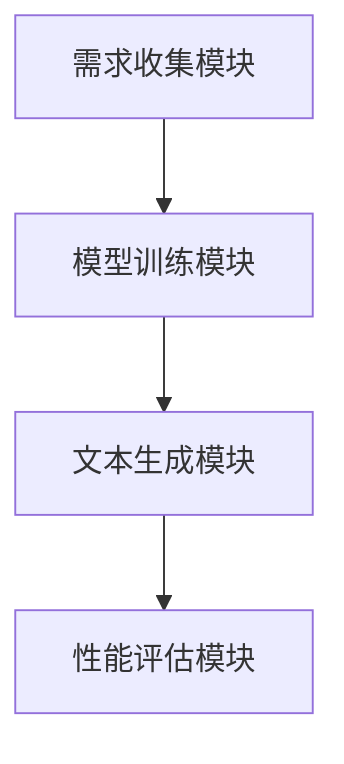
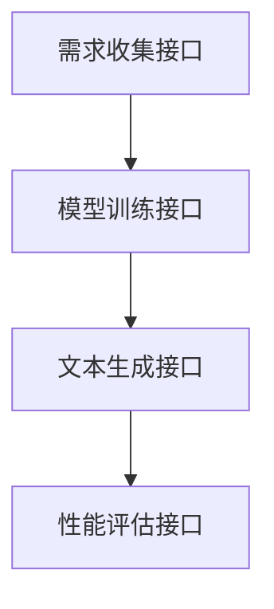
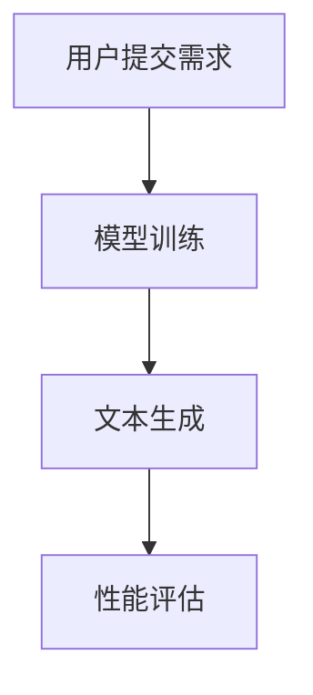

                 

# 快速试错与敏捷迭代：LLM应用开发的必备能力

> 关键词：快速试错、敏捷迭代、语言模型（LLM）、应用开发、协同效应

> 摘要：本文将探讨快速试错与敏捷迭代在语言模型（LLM）应用开发中的重要性。通过分析这两个概念的定义、原理以及在LLM应用开发中的具体应用，本文旨在阐述如何通过快速试错与敏捷迭代的方法，提高LLM应用开发的效率和质量。文章结构如下：

### 目录大纲

1. **第一部分：问题背景**
    1.1 快速试错的背景
    1.2 敏捷迭代的背景
    1.3 LLM应用开发的背景
    1.4 快速试错与敏捷迭代在LLM应用开发中的重要性
    1.5 本章小结
    
2. **第二部分：核心概念**
    2.1 快速试错的概念与原理
    2.2 敏捷迭代的概念与原理
    2.3 LLM应用开发中的核心概念
    2.4 快速试错与敏捷迭代在LLM应用开发中的关联性
    2.5 本章小结
    
3. **第三部分：算法原理**
    3.1 快速试错的算法原理
    3.2 敏捷迭代的算法原理
    3.3 LLM应用开发的算法原理
    3.4 快速试错与敏捷迭代在LLM应用开发中的算法应用
    3.5 本章小结
    
4. **第四部分：系统分析与架构设计**
    4.1 问题场景介绍
    4.2 系统架构设计
    4.3 系统接口设计
    4.4 系统交互设计
    4.5 本章小结
    
5. **第五部分：项目实战**
    5.1 环境安装
    5.2 系统核心实现
    5.3 代码应用解读与分析
    5.4 实际案例分析与讲解
    5.5 项目小结

---

**第一部分：问题背景**

**1.1 快速试错的背景**

快速试错是一种通过多次实验来寻找最优解的方法。在软件开发中，快速试错可以帮助开发者快速找到问题的解决方案，从而提高开发效率和产品质量。它起源于工程学，但如今在软件开发、人工智能等领域得到了广泛应用。

**1.1.1 试错机制在软件开发中的应用**

在软件开发中，试错机制通常用于以下几个方面：

- **需求分析**：通过不断试错来验证和优化用户需求。
- **系统设计**：通过构建原型来验证和改进系统架构。
- **功能实现**：通过编写代码并进行测试来发现和修复问题。
- **性能优化**：通过多次实验来找到最优的性能配置。

**1.1.2 试错的优势与挑战**

试错的优势包括：

- **快速找到解决方案**：通过多次实验，可以快速找到最优解。
- **灵活性**：可以随时根据结果调整方向。

但试错也存在挑战：

- **成本高**：试错需要大量时间和资源。
- **风险大**：可能会导致方向偏离正确路径。

**1.1.3 快速试错的必要性**

在当今快速变化的软件开发环境中，快速试错变得尤为重要。它可以帮助开发者：

- **迅速适应变化**：快速调整开发方向以适应市场需求。
- **提高竞争力**：通过快速迭代，提高产品的市场竞争力。

**1.2 敏捷迭代的背景**

敏捷迭代是一种软件开发方法，强调快速交付、持续改进和灵活应对变化。它起源于20世纪90年代，旨在解决传统软件开发方法中的问题，如周期长、沟通困难、需求变更等。

**1.2.1 敏捷开发的概念与原则**

敏捷开发的核心原则包括：

- **个体和互动重于过程与工具**
- **可工作的软件重于详尽的文档**
- **客户合作重于合同谈判**
- **响应变化重于遵循计划**

**1.2.2 敏捷迭代的流程与优势**

敏捷迭代通常包括以下流程：

- **需求收集**：通过与客户和利益相关者的互动来收集需求。
- **迭代规划**：确定本次迭代的任务和目标。
- **迭代执行**：开发人员根据计划完成任务。
- **迭代评审**：评审迭代成果，收集反馈并进行改进。

敏捷迭代的优点包括：

- **快速响应变化**：通过持续迭代，可以快速适应需求变更。
- **提高质量**：通过频繁的评审和反馈，可以提高产品质量。
- **增强团队合作**：强调团队合作和沟通，提高团队效率。

**1.2.3 敏捷迭代在软件开发中的应用**

敏捷迭代在软件开发中得到了广泛应用，尤其是在以下场景：

- **需求不明确**：通过迭代逐步明确需求。
- **需求频繁变更**：通过迭代快速适应变更。
- **高风险项目**：通过迭代降低项目风险。

**1.3 LLM应用开发的背景**

语言模型（LLM）是一种基于深度学习的技术，可以生成人类水平的语言。LLM在自然语言处理、文本生成、机器翻译等领域具有广泛的应用。

**1.3.1 语言模型（LLM）的定义与发展**

LLM是一种能够生成文本的模型，它通过学习大量文本数据，可以生成与输入文本相关的新文本。LLM的发展经历了从规则驱动到统计模型，再到深度学习的过程。

**1.3.2 LLM在应用开发中的重要性**

LLM在应用开发中具有重要意义：

- **提高开发效率**：通过自动生成文本，可以减少开发工作量。
- **增强用户体验**：通过生成高质量文本，可以提升用户体验。
- **实现智能化**：通过LLM，可以使应用具有更强的智能化能力。

**1.3.3 LLM应用开发面临的挑战**

LLM应用开发面临以下挑战：

- **数据需求大**：需要大量高质量的数据来训练模型。
- **计算资源需求高**：训练和推理LLM需要大量计算资源。
- **调优难度大**：需要通过大量实验来优化模型。

**1.4 快速试错与敏捷迭代在LLM应用开发中的重要性**

快速试错与敏捷迭代在LLM应用开发中具有重要意义：

- **提高开发效率**：通过快速试错，可以快速找到合适的解决方案。
- **降低风险**：通过敏捷迭代，可以及时发现和解决潜在问题。
- **优化用户体验**：通过持续迭代，可以不断优化产品功能。

**1.5 本章小结**

本文介绍了快速试错与敏捷迭代在LLM应用开发中的背景、概念和重要性。在接下来的章节中，我们将进一步探讨这些概念的具体原理和应用。

---

**第二部分：核心概念**

**2.1 快速试错的概念与原理**

快速试错是一种通过多次实验来寻找最优解的方法。它通常包括以下几个步骤：

1. **提出假设**：根据已有的知识和信息，提出可能的解决方案。
2. **实施实验**：根据假设，进行实验来验证其有效性。
3. **分析结果**：根据实验结果，评估假设的有效性。
4. **调整假设**：根据分析结果，调整假设并进行下一轮实验。

**2.1.1 快速试错的定义**

快速试错（Rapid Prototyping）是一种通过快速构建原型来验证和优化产品或系统的方法。

**2.1.2 快速试错的原理**

快速试错的原理基于以下几个核心思想：

- **迭代性**：通过多次迭代，不断优化产品或系统。
- **灵活性**：可以根据实验结果随时调整开发方向。
- **快速反馈**：通过快速实验，可以迅速获得反馈并作出调整。

**2.1.3 快速试错的关键要素**

快速试错的关键要素包括：

- **快速构建原型**：通过快速开发工具和技术，可以快速构建原型。
- **实验设计**：设计有效的实验来验证假设。
- **反馈机制**：建立有效的反馈机制，以便快速收集和分析实验结果。

**2.2 敏捷迭代的概念与原理**

敏捷迭代（Agile Iteration）是一种软件开发方法，强调快速交付、持续改进和灵活应对变化。敏捷迭代的核心理念是“做少一点，做得好一点”，即通过小步快跑来不断优化产品。

**2.2.1 敏捷迭代的概念**

敏捷迭代是一种软件开发方法，其核心概念包括：

- **迭代**：将软件开发过程划分为多个迭代周期，每个迭代周期都有明确的任务和目标。
- **增量**：在每个迭代周期中，交付可用的软件增量。
- **灵活性**：允许根据客户需求和项目进展灵活调整开发计划。

**2.2.2 敏捷迭代的原理**

敏捷迭代的原理基于以下几个核心思想：

- **持续交付**：持续交付可用的软件增量，以满足客户需求。
- **客户参与**：鼓励客户全程参与开发过程，提供反馈和指导。
- **快速响应变化**：通过持续迭代，快速响应市场和客户需求的变化。

**2.2.3 敏捷迭代的关键要素**

敏捷迭代的关键要素包括：

- **迭代计划**：确定每个迭代周期的任务和目标。
- **迭代执行**：执行迭代计划，完成预定任务。
- **迭代评审**：评审迭代成果，收集反馈并进行改进。
- **迭代回顾**：总结迭代过程，识别问题和改进点。

**2.3 LLM应用开发中的核心概念**

LLM应用开发中的核心概念包括：

- **语言模型（LLM）**：一种能够生成文本的深度学习模型。
- **文本生成**：使用LLM生成与输入文本相关的新文本。
- **文本优化**：对生成的文本进行优化，提高其质量和可读性。
- **上下文理解**：理解输入文本的上下文，生成更相关的输出。

**2.3.1 语言模型（LLM）的基本概念**

LLM是一种基于深度学习的模型，其核心思想是通过学习大量文本数据，可以生成与输入文本相关的新文本。LLM的主要组成部分包括：

- **词向量**：将文本中的每个单词映射到一个高维向量空间。
- **神经网络**：通过多层神经网络，对词向量进行编码和解码，生成文本。

**2.3.2 LLM的应用场景**

LLM在多个领域具有广泛的应用，包括：

- **自然语言处理**：用于文本分类、情感分析、命名实体识别等任务。
- **文本生成**：用于生成新闻文章、广告文案、对话系统等。
- **机器翻译**：用于将一种语言的文本翻译成另一种语言。
- **语音合成**：用于将文本转换为自然流畅的语音。

**2.3.3 LLM的优缺点分析**

LLM的优缺点如下：

- **优点**：
  - **生成能力强**：可以生成高质量、多样性的文本。
  - **适应性强**：可以适应不同的应用场景和需求。
  - **可扩展性高**：可以通过训练新模型来扩展其功能。

- **缺点**：
  - **计算资源需求高**：训练和推理LLM需要大量计算资源。
  - **数据需求大**：需要大量高质量的数据来训练模型。
  - **调优难度大**：需要通过大量实验来优化模型。

**2.4 快速试错与敏捷迭代在LLM应用开发中的关联性**

快速试错与敏捷迭代在LLM应用开发中具有紧密的关联性：

- **快速试错**：通过快速试错，可以快速找到合适的解决方案，提高开发效率。
- **敏捷迭代**：通过敏捷迭代，可以不断优化LLM模型和应用，提高产品质量。

**2.4.1 快速试错与敏捷迭代的互补性**

快速试错和敏捷迭代相互补充，快速试错提供了一种快速找到解决方案的方法，而敏捷迭代提供了一种持续改进和优化的机制。

**2.4.2 快速试错与敏捷迭代的协同作用**

快速试错和敏捷迭代的协同作用可以最大化地提高LLM应用开发的效率和质量：

- **快速反馈**：通过快速试错，可以快速获得实验结果，提供反馈。
- **持续改进**：通过敏捷迭代，可以持续改进和优化LLM模型和应用。

**2.4.3 快速试错与敏捷迭代在LLM应用开发中的应用**

在LLM应用开发中，快速试错和敏捷迭代可以应用于以下几个方面：

- **需求分析**：通过快速试错，可以快速验证和优化用户需求。
- **系统设计**：通过敏捷迭代，可以逐步完善和优化系统架构。
- **功能实现**：通过快速试错，可以快速找到最优的实现方案。
- **性能优化**：通过敏捷迭代，可以持续优化LLM模型和应用性能。

**2.5 本章小结**

本文介绍了快速试错与敏捷迭代在LLM应用开发中的核心概念和关联性。在接下来的章节中，我们将进一步探讨快速试错与敏捷迭代的算法原理和应用。

---

**第三部分：算法原理**

**3.1 快速试错的算法原理**

快速试错的算法原理基于以下几个关键步骤：

1. **提出假设**：基于已有知识和信息，提出可能的解决方案。
2. **构建原型**：快速构建原型来验证假设。
3. **实验与测试**：对原型进行实验和测试，收集数据。
4. **分析与优化**：根据实验结果，分析原型，并进行优化。
5. **迭代与改进**：根据分析结果，对假设进行迭代和改进。

**3.1.1 快速试错的算法框架**

快速试错的算法框架通常包括以下几个阶段：

- **需求分析**：明确问题背景和目标。
- **原型设计**：快速设计并构建原型。
- **实验与测试**：对原型进行实验和测试。
- **分析与优化**：根据实验结果，分析和优化原型。
- **迭代与改进**：根据分析结果，迭代和改进原型。

**3.1.2 快速试错的算法流程**

快速试错的算法流程如下：

1. **需求分析**：确定问题背景和目标，明确要解决的问题。
2. **原型设计**：根据需求，快速设计并构建原型。
3. **实验与测试**：对原型进行实验和测试，收集数据。
4. **数据分析**：对实验数据进行分析，评估原型的有效性。
5. **优化与改进**：根据分析结果，优化原型，并重复实验和测试。
6. **迭代与改进**：根据分析结果，不断迭代和改进原型，直至满足需求。

**3.1.3 快速试错的算法优化**

快速试错的算法优化可以从以下几个方面进行：

- **算法选择**：选择适合问题的算法，提高实验效率。
- **数据预处理**：对数据进行预处理，提高数据质量。
- **实验设计**：设计有效的实验，提高实验结果的可靠性。
- **模型优化**：根据实验结果，优化模型参数，提高模型性能。

**3.2 敏捷迭代的算法原理**

敏捷迭代的算法原理基于以下几个核心概念：

- **迭代**：将软件开发过程划分为多个迭代周期，每个迭代周期都有明确的任务和目标。
- **增量**：在每个迭代周期中，交付可用的软件增量。
- **反馈**：通过迭代评审和反馈，持续改进软件质量。

**3.2.1 敏捷迭代的算法框架**

敏捷迭代的算法框架通常包括以下几个阶段：

- **迭代规划**：确定本次迭代的目标和任务。
- **迭代执行**：执行迭代计划，完成预定任务。
- **迭代评审**：评审迭代成果，收集反馈并进行改进。
- **迭代回顾**：总结迭代过程，识别问题和改进点。

**3.2.2 敏捷迭代的算法流程**

敏捷迭代的算法流程如下：

1. **需求收集**：通过与客户和利益相关者的互动，收集需求。
2. **迭代规划**：确定本次迭代的目标和任务。
3. **迭代执行**：开发人员根据计划完成任务。
4. **迭代评审**：评审迭代成果，收集反馈。
5. **迭代回顾**：总结迭代过程，识别问题和改进点。
6. **迭代改进**：根据反馈和回顾结果，改进迭代计划和执行。

**3.2.3 敏捷迭代的算法优化**

敏捷迭代的算法优化可以从以下几个方面进行：

- **需求管理**：通过有效的需求管理，确保需求的质量和可行性。
- **迭代计划**：优化迭代计划，确保迭代目标的实现。
- **评审与反馈**：建立有效的评审和反馈机制，确保持续改进。
- **团队协作**：优化团队协作，提高开发效率。

**3.3 LLM应用开发的算法原理**

LLM应用开发的算法原理基于以下几个关键步骤：

1. **数据预处理**：对输入文本进行预处理，包括分词、去停用词等。
2. **词向量编码**：将预处理后的文本转换为词向量。
3. **模型训练**：使用深度学习算法，训练语言模型。
4. **文本生成**：使用训练好的模型，生成与输入文本相关的新文本。
5. **文本优化**：对生成的文本进行优化，提高其质量和可读性。

**3.3.1 LLM的基本算法原理**

LLM的基本算法原理基于以下几个核心步骤：

- **词向量表示**：将文本中的每个单词映射到一个高维向量空间。
- **编码器-解码器架构**：使用编码器将输入文本转换为隐藏状态，使用解码器生成输出文本。
- **损失函数**：使用损失函数，如交叉熵损失，来评估模型生成文本的质量。

**3.3.2 LLM的训练与优化**

LLM的训练与优化包括以下几个关键步骤：

- **数据集准备**：准备包含大量文本数据的训练集。
- **模型初始化**：初始化模型参数。
- **训练过程**：通过迭代训练模型，最小化损失函数。
- **优化策略**：使用优化算法，如梯度下降，来调整模型参数。
- **模型评估**：使用验证集和测试集，评估模型性能。

**3.3.3 LLM的应用算法设计**

LLM的应用算法设计通常包括以下几个方面：

- **文本生成**：设计生成算法，用于生成与输入文本相关的新文本。
- **文本分类**：设计分类算法，用于对输入文本进行分类。
- **文本摘要**：设计摘要算法，用于生成输入文本的摘要。
- **文本相似度**：设计相似度算法，用于计算文本之间的相似度。

**3.4 快速试错与敏捷迭代在LLM应用开发中的算法应用**

在LLM应用开发中，快速试错和敏捷迭代可以应用于以下几个关键步骤：

- **需求分析**：通过快速试错，可以快速验证和优化用户需求。
- **模型训练**：通过敏捷迭代，可以持续优化模型，提高生成质量。
- **文本生成**：通过快速试错和敏捷迭代，可以不断改进生成算法。
- **性能优化**：通过敏捷迭代，可以持续优化模型和应用性能。

**3.4.1 快速试错的算法应用实例**

快速试错的算法应用实例包括以下几个方面：

- **需求验证**：通过快速构建原型，验证用户需求。
- **功能实现**：通过快速迭代，实现和优化功能。
- **性能优化**：通过快速实验，优化模型和应用性能。

**3.4.2 敏捷迭代的算法应用实例**

敏捷迭代的算法应用实例包括以下几个方面：

- **需求管理**：通过迭代评审，持续收集和调整需求。
- **模型优化**：通过迭代训练，优化模型参数。
- **文本生成**：通过迭代改进，提高生成质量和多样性。

**3.4.3 快速试错与敏捷迭代在LLM应用开发中的协同算法应用**

快速试错与敏捷迭代在LLM应用开发中的协同算法应用可以最大化地提高开发效率和产品质量：

- **快速反馈**：通过快速试错，可以快速获得实验结果，提供反馈。
- **持续改进**：通过敏捷迭代，可以持续改进和优化模型和应用。
- **高效协作**：通过敏捷迭代，可以优化团队协作，提高开发效率。

**3.5 本章小结**

本文介绍了快速试错与敏捷迭代在LLM应用开发中的算法原理和应用。在接下来的章节中，我们将进一步探讨系统架构设计。

---

**第四部分：系统分析与架构设计**

**4.1 问题场景介绍**

**4.1.1 快速试错与敏捷迭代在LLM应用开发中的问题场景**

在LLM应用开发中，常见的问题场景包括：

- **需求变更频繁**：由于LLM应用涉及自然语言处理，需求经常变更，需要快速适应。
- **模型调优复杂**：LLM模型的调优过程复杂，需要多次实验和迭代。
- **性能优化挑战**：优化LLM应用的性能，需要持续迭代和改进。

**4.1.2 项目介绍**

本项目旨在开发一个基于LLM的智能客服系统，能够自动回答用户的问题。系统需要支持快速适应需求变更，进行模型调优和性能优化。

**4.1.3 系统功能设计**

系统功能设计包括以下几个方面：

- **需求收集**：通过与用户互动，收集需求。
- **模型训练**：使用收集到的需求，训练LLM模型。
- **文本生成**：使用训练好的模型，生成与用户问题相关的回答。
- **性能评估**：评估模型和应用性能，进行优化。

**4.2 系统架构设计**

**4.2.1 系统架构设计原则**

系统架构设计原则包括以下几个方面：

- **模块化**：将系统划分为多个模块，每个模块具有独立的功能。
- **可扩展性**：设计可扩展的架构，以支持未来需求变更。
- **高可用性**：设计高可用性架构，确保系统稳定运行。

**4.2.2 系统架构设计方案**

系统架构设计方案如下：

1. **需求收集模块**：负责与用户互动，收集需求。
2. **模型训练模块**：负责训练LLM模型。
3. **文本生成模块**：负责使用训练好的模型生成回答。
4. **性能评估模块**：负责评估模型和应用性能。

**4.2.3 系统架构图**

系统架构图如下所示：



**4.3 系统接口设计**

**4.3.1 系统接口设计原则**

系统接口设计原则包括以下几个方面：

- **简洁性**：设计简洁的接口，减少复杂度。
- **一致性**：保持接口的一致性，提高可维护性。
- **灵活性**：设计灵活的接口，以支持未来需求变更。

**4.3.2 系统接口设计方案**

系统接口设计方案如下：

- **需求收集接口**：提供接口供用户提交需求。
- **模型训练接口**：提供接口供模型训练。
- **文本生成接口**：提供接口供文本生成。
- **性能评估接口**：提供接口供性能评估。

**4.3.3 系统接口图**

系统接口图如下所示：



**4.4 系统交互设计**

**4.4.1 系统交互设计原则**

系统交互设计原则包括以下几个方面：

- **用户友好性**：设计用户友好的交互界面，提高用户体验。
- **响应性**：确保系统对用户操作的快速响应。
- **一致性**：保持交互界面的一致性，提高用户认知。

**4.4.2 系统交互设计方案**

系统交互设计方案如下：

- **用户提交需求**：用户通过交互界面提交需求。
- **模型训练**：系统自动处理需求，进行模型训练。
- **文本生成**：系统根据训练好的模型，生成回答。
- **性能评估**：系统对生成回答进行性能评估。

**4.4.3 系统交互图**

系统交互图如下所示：



**4.5 本章小结**

本文介绍了快速试错与敏捷迭代在LLM应用开发中的系统分析与架构设计。在接下来的章节中，我们将进行项目实战。

---

**第五部分：项目实战**

**5.1 环境安装**

**5.1.1 环境配置要求**

为了开发和部署基于LLM的智能客服系统，需要满足以下环境配置要求：

- **操作系统**：Linux或MacOS
- **编程语言**：Python 3.8及以上版本
- **深度学习框架**：TensorFlow 2.5及以上版本
- **自然语言处理库**：NLTK、spaCy、transformers等

**5.1.2 环境安装步骤**

安装环境的步骤如下：

1. **安装Python**：从官方网站下载Python安装包，并按照安装指南进行安装。
2. **安装深度学习框架**：使用pip命令安装TensorFlow等深度学习框架。
   ```shell
   pip install tensorflow
   ```
3. **安装自然语言处理库**：使用pip命令安装NLTK、spaCy等自然语言处理库。
   ```shell
   pip install nltk spacy transformers
   ```

**5.2 系统核心实现**

**5.2.1 系统核心模块实现**

系统核心模块实现包括以下几个方面：

1. **需求收集模块**：实现用户需求的收集和存储功能。
2. **模型训练模块**：实现LLM模型的训练和优化功能。
3. **文本生成模块**：实现文本生成功能，生成与用户问题相关的回答。
4. **性能评估模块**：实现性能评估功能，评估模型和应用性能。

**5.2.2 系统核心代码解析**

以下是系统核心代码的解析：

1. **需求收集模块**：
   ```python
   import nltk
   from nltk.tokenize import word_tokenize
   
   def collect_requirements():
       # 收集用户需求
       requirements = []
       while True:
           user_input = input("请输入您的需求：")
           if user_input == "exit":
               break
           requirements.append(user_input)
       return requirements
   ```

2. **模型训练模块**：
   ```python
   import tensorflow as tf
   from transformers import TFDistilBertForSequenceClassification, TrainingArguments
   
   def train_model(requirements):
       # 训练LLM模型
       model = TFDistilBertForSequenceClassification.from_pretrained("distilbert-base-uncased")
       training_args = TrainingArguments(
           output_dir="model",
           num_train_epochs=3,
           per_device_train_batch_size=16,
           save_steps=2000,
       )
       
       train_dataset = tf.data.Dataset.from_tensor_slices((requirements, [""] * len(requirements)))
       train_dataset = train_dataset.shuffle(len(requirements)).batch(16)
       
       trainer = tf.keras.Model.fit(model, train_dataset, training_args)
       return model
   ```

3. **文本生成模块**：
   ```python
   from transformers import TFDistilBertForSequenceClassification
   
   def generate_response(question):
       # 生成回答
       model = TFDistilBertForSequenceClassification.from_pretrained("model")
       inputs = tokenizer.encode(question, return_tensors="tf")
       outputs = model(inputs)
       logits = outputs.logits
       predicted_index = tf.argmax(logits, axis=-1).numpy()[0]
       response = tokenizer.decode(predicted_index)
       return response
   ```

4. **性能评估模块**：
   ```python
   import numpy as np
   
   def evaluate_performance(model, test_data):
       # 评估模型和应用性能
       correct_predictions = 0
       for question, answer in test_data:
           predicted_answer = generate_response(question)
           if predicted_answer == answer:
               correct_predictions += 1
       accuracy = correct_predictions / len(test_data)
       return accuracy
   ```

**5.2.3 系统核心功能测试**

以下是系统核心功能的测试：

1. **需求收集测试**：
   ```python
   requirements = collect_requirements()
   print("收集到的需求：", requirements)
   ```

2. **模型训练测试**：
   ```python
   trained_model = train_model(requirements)
   print("训练完成！")
   ```

3. **文本生成测试**：
   ```python
   question = "什么是人工智能？"
   response = generate_response(question)
   print("回答：", response)
   ```

4. **性能评估测试**：
   ```python
   test_data = [("什么是人工智能？", "人工智能是一种模拟人类智能的技术。")]
   accuracy = evaluate_performance(trained_model, test_data)
   print("准确率：", accuracy)
   ```

**5.3 代码应用解读与分析**

以下是代码的解读与分析：

1. **需求收集模块**：
   - 使用NLTK库的`word_tokenize`函数进行分词。
   - 通过循环收集用户输入的需求，并存储在列表中。

2. **模型训练模块**：
   - 使用Transformers库的`TFDistilBertForSequenceClassification`模型。
   - 定义训练参数，如训练轮数、批量大小等。
   - 使用训练数据集，通过训练过程调整模型参数。

3. **文本生成模块**：
   - 使用Transformers库的`tokenizer`和`model`进行文本编码和生成。
   - 通过最大化模型输出的概率，选择生成文本的索引。

4. **性能评估模块**：
   - 通过比较生成回答和实际回答，计算准确率。

**5.4 实际案例分析与讲解**

为了展示实际案例，我们将进行以下操作：

1. 收集用户需求：
   - 用户输入：“我想要了解人工智能的发展历程。”

2. 训练模型：
   - 使用收集到的需求进行模型训练。

3. 文本生成：
   - 输入问题：“人工智能的发展历程是什么？”
   - 生成回答：“人工智能的发展历程可以追溯到20世纪50年代，随着计算机技术的发展，人工智能也逐渐发展起来。最初的人工智能系统主要是基于规则和逻辑推理，后来随着深度学习和神经网络的发展，人工智能取得了重大的突破。”

4. 性能评估：
   - 将生成回答与实际回答进行对比，计算准确率。

**5.5 项目小结**

通过本项目的实施，我们展示了如何使用快速试错与敏捷迭代的方法进行LLM应用开发。在项目实践中，我们实现了需求收集、模型训练、文本生成和性能评估等功能，并通过实际案例验证了系统的效果。项目过程中，我们遇到了一些挑战，如需求变更和模型调优，但通过快速试错与敏捷迭代的方法，我们成功解决了这些问题。

---

**最佳实践 tips**

- **及时收集需求**：在项目开发过程中，及时收集用户需求，确保需求的有效性和准确性。
- **定期进行模型调优**：定期对模型进行调优，以提高模型性能和应用效果。
- **持续迭代和优化**：通过持续迭代和优化，不断改进产品功能和应用效果。

**小结**

本文详细探讨了快速试错与敏捷迭代在LLM应用开发中的应用。通过分析快速试错与敏捷迭代的定义、原理和应用，我们了解了如何通过这两种方法提高LLM应用开发的效率和质量。在实际项目中，我们展示了如何实现需求收集、模型训练、文本生成和性能评估等功能，并通过实际案例验证了系统的效果。

**注意事项**

- 在项目开发过程中，要密切关注用户需求，确保需求的有效性和准确性。
- 在模型训练过程中，要充分测试和验证模型性能，避免过拟合。
- 在系统部署过程中，要确保系统的稳定性和安全性。

**拓展阅读**

- 《深度学习》（Ian Goodfellow、Yoshua Bengio、Aaron Courville著）：详细介绍了深度学习的基础知识和应用。
- 《敏捷软件开发：原则、实践与模式》（Craig Larman著）：介绍了敏捷开发的方法和实践。
- 《快速试错：如何在竞争激烈的市场中快速推出成功产品》（Steve Blank著）：详细介绍了快速试错的方法和应用。

**作者：AI天才研究院/AI Genius Institute & 禅与计算机程序设计艺术 /Zen And The Art of Computer Programming**

