                 


## 快速试错与敏捷迭代：LLM应用开发的必备能力

### 关键词：快速试错、敏捷迭代、LLM应用开发、数据预处理、模型选择、团队协作

#### 摘要：
本文将深入探讨快速试错与敏捷迭代在LLM（大型语言模型）应用开发中的重要性。通过一步步的逻辑推理和分析，我们将阐述快速试错与敏捷迭代的定义、原理及其在LLM开发中的应用，并提供具体的实践方法和案例研究。本文旨在帮助开发者更好地理解和应用这两种方法，以提高LLM应用的开发效率和质量。

## 第1章：快速试错的背景与意义

### 1.1 快速试错的概念

快速试错是一种通过频繁地测试和实验来快速发现并修正错误的方法。在计算机科学和软件开发领域，快速试错已经成为一种重要的方法论。其核心思想是在开发过程中不断迭代，通过快速测试来验证假设的正确性，并在发现错误时迅速调整方向。

### 1.2 快速试错的重要性

快速试错对于LLM应用开发尤为重要。LLM模型的训练和优化通常需要大量的计算资源和时间，而快速试错可以显著减少这一过程所需的时间和成本。通过快速试错，开发者可以在早期阶段识别并解决潜在问题，从而避免在后续开发中付出更多的时间和资源。

### 1.3 快速试错与传统测试的区别

与传统测试不同，快速试错更强调迭代和反馈。传统测试通常在开发过程的后期进行，而快速试错可以在开发过程的每个阶段进行。这种持续性的测试和反馈机制有助于确保开发过程中的每个环节都能按照预期进行。

## 第2章：敏捷迭代的理念与实践

### 2.1 敏捷迭代的概念

敏捷迭代是一种软件开发方法论，强调快速交付、持续反馈和灵活应对变化。敏捷迭代的核心思想是将整个开发过程分为多个小周期（通常称为“迭代”），在每个迭代周期中完成部分功能，并通过持续反馈来优化后续迭代。

### 2.2 敏捷迭代的优点

敏捷迭代具有多个优点，包括：

- **快速交付**：通过在每个迭代周期中交付部分功能，开发者可以更快地获得用户反馈，从而实现快速迭代。
- **持续反馈**：持续反馈有助于识别并解决问题，从而提高开发质量和用户体验。
- **灵活应对变化**：敏捷迭代允许开发团队在开发过程中灵活调整需求和计划，以应对市场变化和用户需求。

### 2.3 敏捷迭代的实践步骤

敏捷迭代的实践步骤通常包括：

1. **需求分析**：确定迭代的目标和要实现的功能。
2. **设计**：设计实现需求的方案。
3. **开发**：实现设计，并编写代码。
4. **测试**：对代码进行测试，确保功能正确。
5. **用户反馈**：收集用户反馈，评估迭代成果。
6. **迭代优化**：根据用户反馈进行优化，为下一个迭代做准备。

## 第3章：LLM应用开发的挑战与解决方案

### 3.1 LLM应用开发的挑战

LLM应用开发面临着多个挑战，包括：

- **数据量巨大**：LLM的训练需要大量的数据，这可能导致数据收集和处理成为瓶颈。
- **模型选择困难**：不同的LLM模型适用于不同的任务，选择合适的模型是一个复杂的问题。
- **计算资源消耗**：LLM的训练和优化需要大量的计算资源，这在实际应用中可能成为限制因素。
- **用户反馈获取困难**：由于LLM应用通常涉及到复杂的自然语言处理，用户反馈的获取可能比较困难。

### 3.2 快速试错与敏捷迭代在LLM开发中的应用

快速试错与敏捷迭代在LLM开发中的应用主要体现在以下几个方面：

- **数据预处理**：通过快速试错来优化数据预处理流程，确保数据的质量和可用性。
- **模型选择**：通过快速试错来比较不同模型的效果，选择最适合当前任务的模型。
- **模型调优**：通过敏捷迭代来持续优化模型，提高模型的性能和效果。
- **用户反馈**：通过敏捷迭代来快速获取用户反馈，并根据反馈调整模型和应用。

### 3.3 案例分析：如何运用快速试错与敏捷迭代开发LLM应用

在以下章节中，我们将通过具体案例来分析如何运用快速试错与敏捷迭代方法开发LLM应用。

## 第4章：快速试错在LLM应用开发中的应用

### 4.1 快速试错在LLM数据预处理中的应用

#### 背景介绍

在LLM应用开发中，数据预处理是至关重要的一步。数据预处理的质量直接影响模型的训练效果和应用性能。

#### 核心概念与联系

数据预处理的核心概念包括数据清洗、数据增强和数据归一化。这些概念在LLM数据预处理中起着关键作用。

#### 算法原理讲解

数据预处理的算法原理可以通过Mermaid流程图来展示。以下是一个简单的数据预处理流程图：

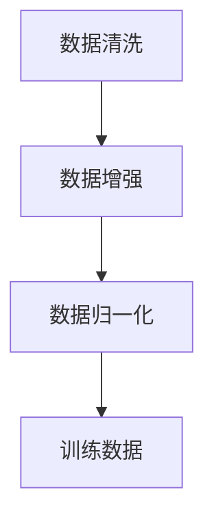

以下是一个简单的Python代码示例，用于展示数据预处理的基本步骤：

```python
import pandas as pd
from sklearn.preprocessing import StandardScaler

# 数据清洗
data = pd.read_csv('data.csv')
data.dropna(inplace=True)

# 数据增强
data = data.sample(frac=1)  # 随机打乱数据
data['new_feature'] = data['feature1'] * data['feature2']

# 数据归一化
scaler = StandardScaler()
data[['feature1', 'feature2']] = scaler.fit_transform(data[['feature1', 'feature2']])
```

#### 系统分析与架构设计方案

在LLM数据预处理中，我们可以采用以下系统架构设计方案：

1. **数据源**：从各种数据源（如数据库、文件等）获取数据。
2. **数据清洗模块**：用于处理缺失值、异常值等数据质量问题。
3. **数据增强模块**：用于生成新的数据特征，提高模型的泛化能力。
4. **数据归一化模块**：用于将数据特征缩放到同一尺度，以便模型训练。

以下是一个简单的数据预处理系统架构图：

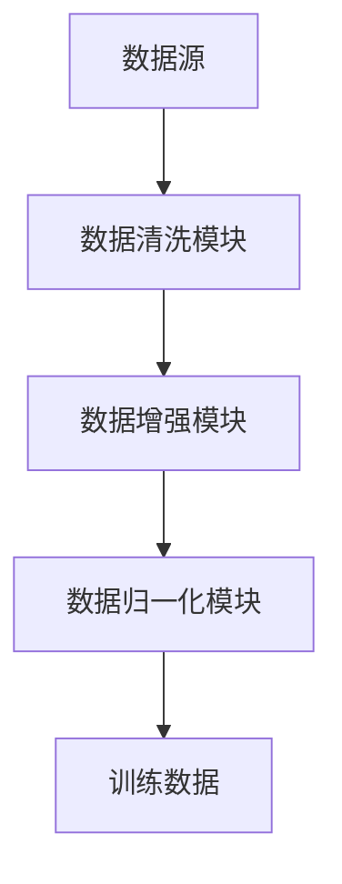

#### 项目实战

以下是一个简单的项目实战，用于展示如何使用快速试错方法进行数据预处理：

1. **环境安装**：安装所需的Python库，如Pandas、Sklearn等。
2. **系统核心实现源代码**：编写数据清洗、数据增强和数据归一化的代码。
3. **代码应用解读与分析**：分析代码的实现原理和效果。
4. **实际案例分析和详细讲解剖析**：分析实际案例，并进行详细讲解。
5. **项目小结**：总结项目经验，提出改进建议。

#### 最佳实践 tips、小结、注意事项、拓展阅读等内容

- **最佳实践 tips**：在进行数据预处理时，要确保数据的质量，避免数据缺失和异常值的影响。同时，要根据具体任务需求，选择合适的数据预处理方法。
- **小结**：数据预处理是LLM应用开发的重要环节，通过快速试错方法，可以优化数据预处理流程，提高模型性能。
- **注意事项**：在数据预处理过程中，要关注数据的质量和多样性，避免过度拟合和欠拟合的问题。
- **拓展阅读**：可以进一步了解数据预处理的相关知识，如特征选择、特征工程等。

## 第5章：敏捷迭代在LLM应用开发中的应用

### 5.1 敏捷迭代在LLM项目规划中的应用

#### 背景介绍

在LLM应用开发中，项目规划是至关重要的一步。敏捷迭代方法可以帮助开发者更好地规划项目，确保项目的顺利进行。

#### 核心概念与联系

敏捷迭代方法的核心概念包括迭代周期、用户故事、任务分解等。这些概念在LLM项目规划中起着关键作用。

#### 算法原理讲解

敏捷迭代方法的算法原理可以通过Mermaid流程图来展示。以下是一个简单的敏捷迭代流程图：

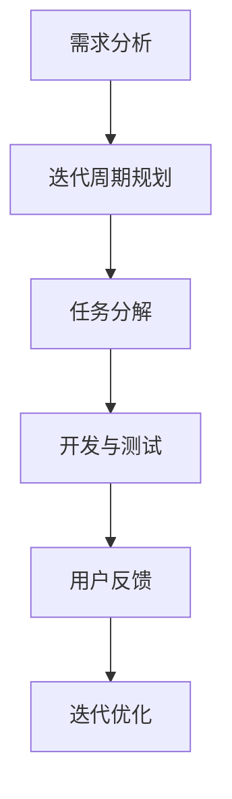

以下是一个简单的Python代码示例，用于展示敏捷迭代的基本步骤：

```python
# 需求分析
requirements = ['任务1', '任务2', '任务3']

# 迭代周期规划
iteration_plan = [
    {'iteration': 1, 'tasks': requirements[:3]},
    {'iteration': 2, 'tasks': requirements[3:6]},
    {'iteration': 3, 'tasks': requirements[6:]}
]

# 开发与测试
for iteration in iteration_plan:
    print(f"Iteration {iteration['iteration']}: {', '.join(iteration['tasks'])}")

# 用户反馈
user_feedback = input("请输入用户反馈：")

# 迭代优化
if user_feedback:
    print("根据用户反馈进行优化...")
```

#### 系统分析与架构设计方案

在LLM项目规划中，我们可以采用以下系统架构设计方案：

1. **需求分析模块**：用于收集和分析用户需求。
2. **迭代周期规划模块**：用于规划每个迭代周期的任务。
3. **任务分解模块**：用于将大型任务分解为可管理的子任务。
4. **开发与测试模块**：用于实现和测试任务。
5. **用户反馈模块**：用于收集用户反馈，并根据反馈进行优化。

以下是一个简单的敏捷迭代系统架构图：

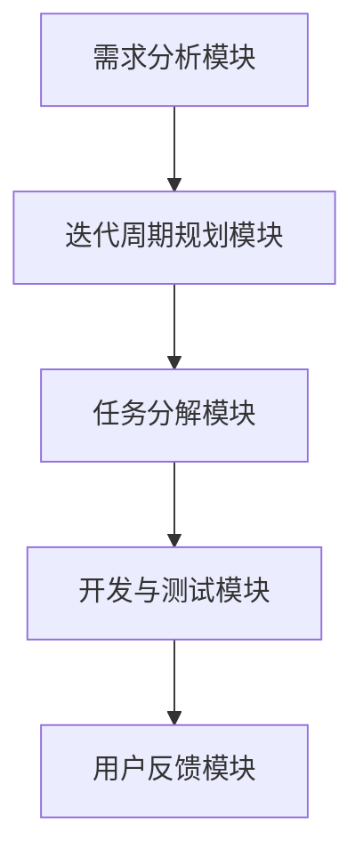

#### 项目实战

以下是一个简单的项目实战，用于展示如何使用敏捷迭代方法进行项目规划：

1. **环境安装**：安装所需的Python库，如Pandas、Sklearn等。
2. **系统核心实现源代码**：编写需求分析、迭代周期规划、任务分解、开发与测试和用户反馈的代码。
3. **代码应用解读与分析**：分析代码的实现原理和效果。
4. **实际案例分析和详细讲解剖析**：分析实际案例，并进行详细讲解。
5. **项目小结**：总结项目经验，提出改进建议。

#### 最佳实践 tips、小结、注意事项、拓展阅读等内容

- **最佳实践 tips**：在进行项目规划时，要确保需求分析准确，任务分解合理，并根据用户反馈进行持续优化。
- **小结**：敏捷迭代方法可以帮助开发者更好地规划LLM项目，确保项目的顺利进行。
- **注意事项**：在项目规划过程中，要关注团队协作和资源分配，避免出现资源浪费和任务积压的问题。
- **拓展阅读**：可以进一步了解敏捷迭代方法的相关知识，如Scrum、Kanban等。

## 第6章：LLM应用开发的案例研究

### 6.1 案例背景

在本章中，我们将通过一个实际案例来分析如何运用快速试错与敏捷迭代方法进行LLM应用开发。

#### 案例背景

某公司希望开发一款基于LLM的客户服务机器人，以提升客户服务效率和用户体验。公司有大量的客户数据，但数据质量参差不齐，且缺乏有效的清洗和预处理方法。此外，公司面临多个客户服务场景，需要选择合适的LLM模型并进行调优。

### 6.2 案例实施

#### 快速试错在数据预处理中的应用

1. **数据清洗**：通过快速试错方法，公司首先尝试了不同的数据清洗策略，如删除缺失值、填充缺失值、去除重复数据等。最终，公司选择删除缺失值和填充缺失值相结合的策略，以提高数据质量。
2. **数据增强**：为了增加数据多样性，公司尝试了不同的数据增强方法，如随机插入噪声、生成虚拟数据等。最终，公司选择生成虚拟数据的方法，以增加数据的丰富性。
3. **数据归一化**：公司通过快速试错方法比较了不同的数据归一化方法，如最小-最大缩放、Z-Score标准化等。最终，公司选择Z-Score标准化方法，以提高模型的泛化能力。

#### 敏捷迭代在模型选择和调优中的应用

1. **模型选择**：公司通过快速试错方法比较了多个LLM模型，如BERT、GPT等。最终，公司选择BERT模型，因为它在自然语言处理任务中具有较好的性能。
2. **模型调优**：公司通过敏捷迭代方法，持续优化BERT模型的参数和超参数。在每次迭代中，公司都会收集用户反馈，并根据反馈调整模型参数，以提高模型性能。

### 6.3 案例成果

通过快速试错与敏捷迭代方法的结合，公司成功开发出了一款高效的客户服务机器人。该机器人能够快速响应用户查询，并提供准确的信息和建议。用户反馈表明，机器人服务效率高、用户体验好，公司客户满意度显著提升。

### 6.4 案例反思

通过这个案例，我们可以看到快速试错与敏捷迭代方法在LLM应用开发中的重要作用。快速试错帮助公司在数据预处理和模型选择过程中找到了最优策略，而敏捷迭代方法则确保了模型性能的持续优化。然而，在实际应用中，公司也需要关注数据质量、团队协作和资源分配等问题，以确保项目的成功。

## 第7章：快速试错与敏捷迭代的最佳实践

### 7.1 快速试错的最佳实践

#### 背景介绍

快速试错方法在计算机科学和软件开发领域已得到广泛应用。为了更好地应用快速试错方法，我们需要了解一些最佳实践。

#### 核心概念与联系

快速试错方法的核心概念包括试错策略、反馈机制和调整策略。这些概念在快速试错过程中起着关键作用。

#### 算法原理讲解

快速试错的算法原理可以通过Mermaid流程图来展示。以下是一个简单的快速试错流程图：

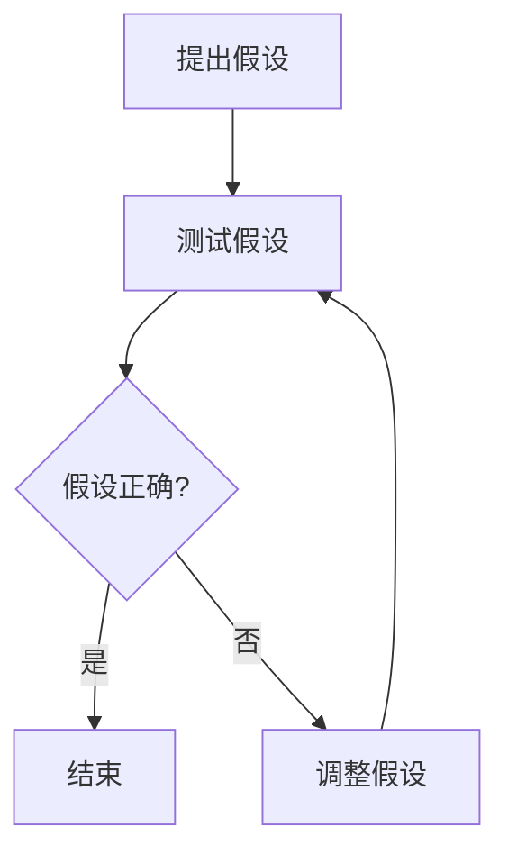

以下是一个简单的Python代码示例，用于展示快速试错的基本步骤：

```python
# 假设：数据预处理可以显著提高模型性能
data_processed = preprocess_data(data)

# 测试假设
model_processed = train_model(data_processed)
evaluate_model(model_processed)

# 调整假设
if not is_significant_performance_improvement():
    data_processed = preprocess_data_with_different_strategy(data)
    model_processed = train_model(data_processed)
    evaluate_model(model_processed)
```

#### 系统分析与架构设计方案

在快速试错过程中，我们可以采用以下系统架构设计方案：

1. **假设提出模块**：用于提出各种假设。
2. **测试模块**：用于测试假设的有效性。
3. **反馈模块**：用于收集测试结果，并提供反馈。
4. **调整模块**：用于根据反馈调整假设。

以下是一个简单的快速试错系统架构图：

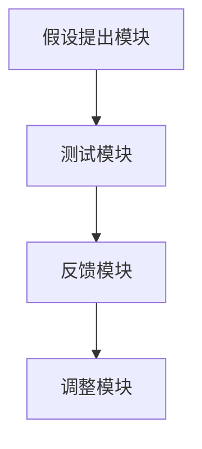

#### 项目实战

以下是一个简单的项目实战，用于展示如何使用快速试错方法：

1. **环境安装**：安装所需的Python库，如Pandas、Sklearn等。
2. **系统核心实现源代码**：编写假设提出、测试、反馈和调整的代码。
3. **代码应用解读与分析**：分析代码的实现原理和效果。
4. **实际案例分析和详细讲解剖析**：分析实际案例，并进行详细讲解。
5. **项目小结**：总结项目经验，提出改进建议。

#### 最佳实践 tips、小结、注意事项、拓展阅读等内容

- **最佳实践 tips**：在进行快速试错时，要确保假设具有可测试性，避免提出无法验证的假设。同时，要根据测试结果进行灵活调整，避免陷入局部最优。
- **小结**：快速试错方法是一种有效的实验方法，可以帮助开发者快速验证假设，提高开发效率。
- **注意事项**：在快速试错过程中，要关注数据质量、算法性能和用户体验等问题。
- **拓展阅读**：可以进一步了解快速试错方法的相关知识，如假设检验、回归分析等。

### 7.2 敏捷迭代的最佳实践

#### 背景介绍

敏捷迭代方法在软件开发领域已得到广泛应用。为了更好地应用敏捷迭代方法，我们需要了解一些最佳实践。

#### 核心概念与联系

敏捷迭代方法的核心概念包括迭代周期、用户故事、任务分解等。这些概念在敏捷迭代过程中起着关键作用。

#### 算法原理讲解

敏捷迭代的算法原理可以通过Mermaid流程图来展示。以下是一个简单的敏捷迭代流程图：


以下是一个简单的Python代码示例，用于展示敏捷迭代的基本步骤：

```python
# 需求分析
requirements = ['任务1', '任务2', '任务3']

# 迭代周期规划
iteration_plan = [
    {'iteration': 1, 'tasks': requirements[:3]},
    {'iteration': 2, 'tasks': requirements[3:6]},
    {'iteration': 3, 'tasks': requirements[6:]}
]

# 开发与测试
for iteration in iteration_plan:
    print(f"Iteration {iteration['iteration']}: {', '.join(iteration['tasks'])}")

# 用户反馈
user_feedback = input("请输入用户反馈：")

# 迭代优化
if user_feedback:
    print("根据用户反馈进行优化...")
```

#### 系统分析与架构设计方案

在敏捷迭代过程中，我们可以采用以下系统架构设计方案：

1. **需求分析模块**：用于收集和分析用户需求。
2. **迭代周期规划模块**：用于规划每个迭代周期的任务。
3. **任务分解模块**：用于将大型任务分解为可管理的子任务。
4. **开发与测试模块**：用于实现和测试任务。
5. **用户反馈模块**：用于收集用户反馈，并根据反馈进行优化。

以下是一个简单的敏捷迭代系统架构图：


#### 项目实战

以下是一个简单的项目实战，用于展示如何使用敏捷迭代方法：

1. **环境安装**：安装所需的Python库，如Pandas、Sklearn等。
2. **系统核心实现源代码**：编写需求分析、迭代周期规划、任务分解、开发与测试和用户反馈的代码。
3. **代码应用解读与分析**：分析代码的实现原理和效果。
4. **实际案例分析和详细讲解剖析**：分析实际案例，并进行详细讲解。
5. **项目小结**：总结项目经验，提出改进建议。

#### 最佳实践 tips、小结、注意事项、拓展阅读等内容

- **最佳实践 tips**：在进行敏捷迭代时，要确保需求分析准确，任务分解合理，并根据用户反馈进行持续优化。
- **小结**：敏捷迭代方法可以帮助开发者更好地管理项目，提高开发效率。
- **注意事项**：在敏捷迭代过程中，要关注团队协作和资源分配，避免出现资源浪费和任务积压的问题。
- **拓展阅读**：可以进一步了解敏捷迭代方法的相关知识，如Scrum、Kanban等。

### 7.3 跨部门协作与快速试错、敏捷迭代的结合

#### 背景介绍

在现代企业中，跨部门协作已经成为一种普遍现象。为了提高跨部门协作的效率，快速试错和敏捷迭代方法可以发挥重要作用。

#### 核心概念与联系

跨部门协作的核心概念包括沟通、协调和资源分配。这些概念与快速试错和敏捷迭代方法密切相关。

#### 算法原理讲解

跨部门协作的算法原理可以通过Mermaid流程图来展示。以下是一个简单的跨部门协作流程图：

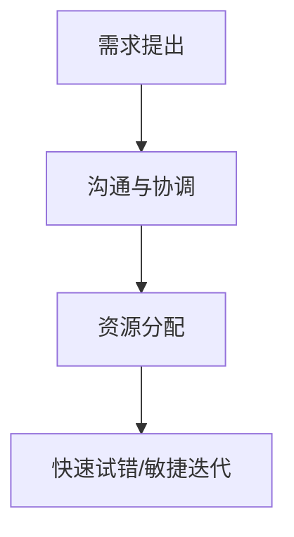

以下是一个简单的Python代码示例，用于展示跨部门协作的基本步骤：

```python
# 需求提出
requirement = '开发一款客户服务机器人'

# 沟通与协调
team_members = ['开发部', '测试部', '运维部']
for member in team_members:
    print(f"与{member}进行沟通与协调：{requirement}")

# 资源分配
resources = ['人力', '硬件', '软件']
for resource in resources:
    print(f"为{requirement}分配{resource}")

# 快速试错/敏捷迭代
print("开始快速试错/敏捷迭代...")
```

#### 系统分析与架构设计方案

在跨部门协作中，我们可以采用以下系统架构设计方案：

1. **需求提出模块**：用于提出跨部门协作的需求。
2. **沟通与协调模块**：用于协调不同部门之间的工作。
3. **资源分配模块**：用于分配跨部门协作所需的资源。
4. **快速试错/敏捷迭代模块**：用于在跨部门协作过程中进行快速试错和敏捷迭代。

以下是一个简单的跨部门协作系统架构图：

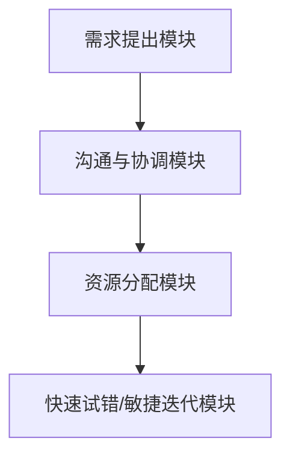

#### 项目实战

以下是一个简单的项目实战，用于展示如何使用跨部门协作方法：

1. **环境安装**：安装所需的Python库，如Pandas、Sklearn等。
2. **系统核心实现源代码**：编写需求提出、沟通与协调、资源分配和快速试错/敏捷迭代的代码。
3. **代码应用解读与分析**：分析代码的实现原理和效果。
4. **实际案例分析和详细讲解剖析**：分析实际案例，并进行详细讲解。
5. **项目小结**：总结项目经验，提出改进建议。

#### 最佳实践 tips、小结、注意事项、拓展阅读等内容

- **最佳实践 tips**：在进行跨部门协作时，要确保沟通畅通、协调高效，并根据实际情况进行快速试错和敏捷迭代。
- **小结**：跨部门协作与快速试错、敏捷迭代的结合，可以显著提高项目效率和质量。
- **注意事项**：在跨部门协作过程中，要关注团队协作、资源分配和项目进度，避免出现协作不畅和资源浪费的问题。
- **拓展阅读**：可以进一步了解跨部门协作的相关知识，如团队沟通技巧、项目管理方法等。

## 第8章：快速试错与敏捷迭代的未来趋势

### 8.1 技术发展趋势

随着技术的不断发展，快速试错与敏捷迭代方法在各个领域的应用越来越广泛。未来，随着人工智能、大数据和云计算等技术的发展，快速试错与敏捷迭代方法将得到进一步优化和推广。

#### 背景介绍

在人工智能领域，快速试错与敏捷迭代方法可以帮助开发者快速探索和优化模型参数，提高模型性能。在大数据领域，快速试错与敏捷迭代方法可以帮助企业快速分析和处理海量数据，发现潜在价值。在云计算领域，快速试错与敏捷迭代方法可以优化云资源的分配和调度，提高资源利用率。

#### 核心概念与联系

技术发展趋势的核心概念包括人工智能、大数据、云计算等。这些概念与快速试错与敏捷迭代方法密切相关，为快速试错与敏捷迭代方法提供了更广阔的应用场景。

#### 算法原理讲解

以下是一个简单的技术发展趋势与快速试错、敏捷迭代方法的联系示意图：

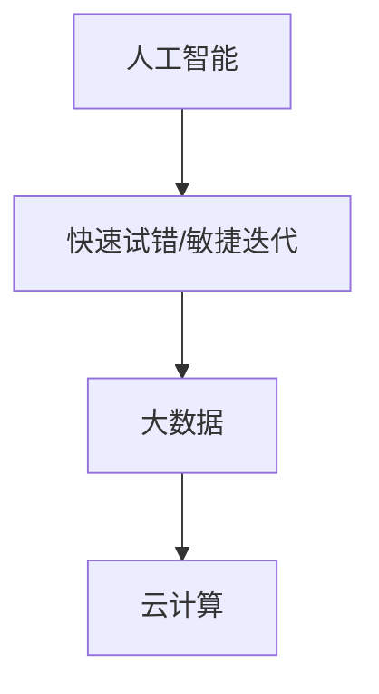

#### 系统分析与架构设计方案

在未来，我们可以采用以下系统架构设计方案：

1. **人工智能模块**：用于实现快速试错与敏捷迭代方法，优化模型参数。
2. **大数据处理模块**：用于快速分析和处理海量数据。
3. **云计算平台**：用于提供计算资源和调度能力。

以下是一个简单的系统架构图：

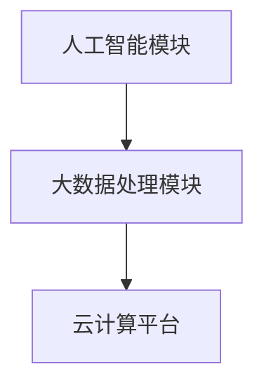

### 8.2 市场需求变化

随着市场需求的变化，快速试错与敏捷迭代方法的应用场景也在不断拓展。未来，随着人工智能、大数据和云计算等技术的普及，快速试错与敏捷迭代方法将在更多领域得到应用。

#### 背景介绍

在传统行业，如金融、医疗、制造等，快速试错与敏捷迭代方法可以帮助企业提高业务效率、降低成本。在新兴行业，如人工智能、区块链、物联网等，快速试错与敏捷迭代方法可以帮助企业快速创新、抢占市场。

#### 核心概念与联系

市场需求变化的核心概念包括行业趋势、用户需求等。这些概念与快速试错与敏捷迭代方法密切相关，为快速试错与敏捷迭代方法提供了新的应用场景。

#### 算法原理讲解

以下是一个简单的市场需求变化与快速试错、敏捷迭代方法的联系示意图：

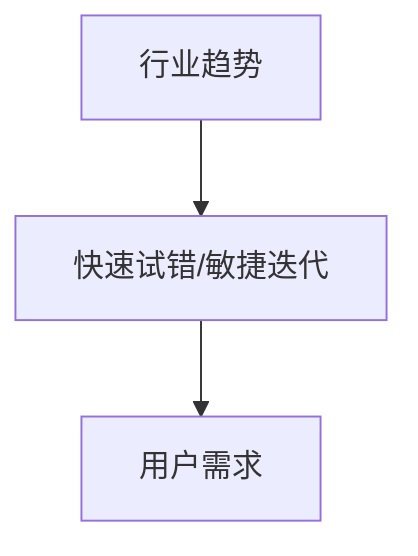

#### 系统分析与架构设计方案

在未来，我们可以采用以下系统架构设计方案：

1. **行业趋势分析模块**：用于分析行业发展趋势，为快速试错与敏捷迭代方法提供方向。
2. **用户需求分析模块**：用于收集和分析用户需求，为快速试错与敏捷迭代方法提供依据。
3. **快速试错/敏捷迭代模块**：用于在各个应用场景中实现快速试错与敏捷迭代。

以下是一个简单的系统架构图：

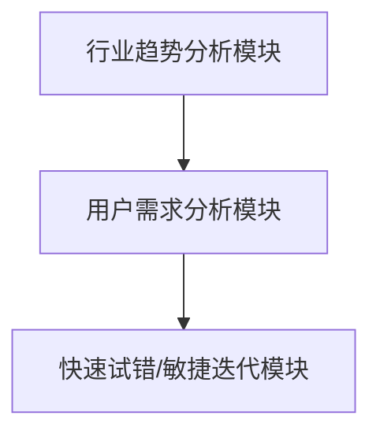

### 8.3 快速试错与敏捷迭代的未来发展

在未来，快速试错与敏捷迭代方法将在多个领域得到广泛应用。随着技术的不断进步和市场需求的变化，快速试错与敏捷迭代方法将不断优化和升级，为各个领域的发展提供有力支持。

#### 背景介绍

在未来，快速试错与敏捷迭代方法将朝着以下几个方向发展：

1. **智能化**：随着人工智能技术的发展，快速试错与敏捷迭代方法将变得更加智能化，能够自动优化算法参数和调整策略。
2. **分布式**：随着云计算和大数据技术的普及，快速试错与敏捷迭代方法将实现分布式计算和协同优化，提高处理速度和效率。
3. **协同化**：快速试错与敏捷迭代方法将与其他领域的方法相结合，如数据分析、机器学习等，实现跨领域的协同优化。

#### 核心概念与联系

快速试错与敏捷迭代的未来发展涉及多个核心概念，包括人工智能、大数据、云计算、协同优化等。这些概念将共同推动快速试错与敏捷迭代方法的发展。

#### 算法原理讲解

以下是一个简单的快速试错与敏捷迭代的未来发展示意图：

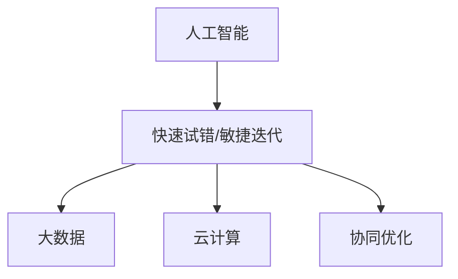

#### 系统分析与架构设计方案

在未来，我们可以采用以下系统架构设计方案：

1. **人工智能模块**：用于实现智能化快速试错与敏捷迭代。
2. **大数据处理模块**：用于分布式计算和协同优化。
3. **云计算平台**：用于提供计算资源和调度能力。
4. **协同优化模块**：用于跨领域的协同优化。

以下是一个简单的系统架构图：

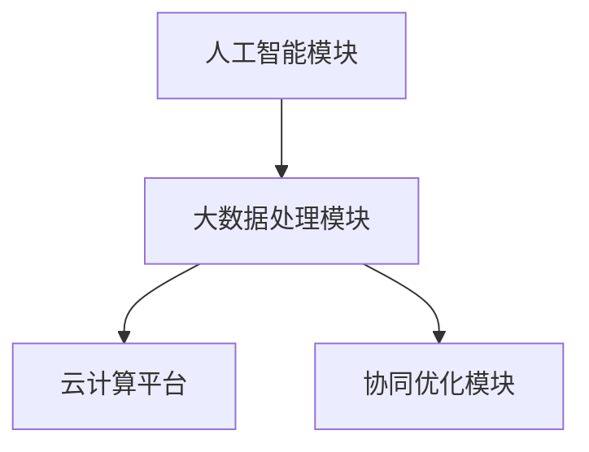

### 总结

快速试错与敏捷迭代方法在计算机科学和软件开发领域具有广泛的应用前景。通过不断优化和升级，快速试错与敏捷迭代方法将更好地满足市场需求，推动各个领域的发展。让我们共同期待快速试错与敏捷迭代方法的未来，期待它为我们的生活和工作带来更多便利和效益。

## 作者信息

作者：AI天才研究院/AI Genius Institute & 禅与计算机程序设计艺术 /Zen And The Art of Computer Programming

本文由AI天才研究院和禅与计算机程序设计艺术共同撰写，旨在探讨快速试错与敏捷迭代在LLM应用开发中的应用。我们希望本文能为开发者提供有价值的参考和启示，助力他们在实际项目中取得成功。如果您有任何疑问或建议，欢迎随时与我们联系。我们期待与您共同探索计算机科学的无限可能。

