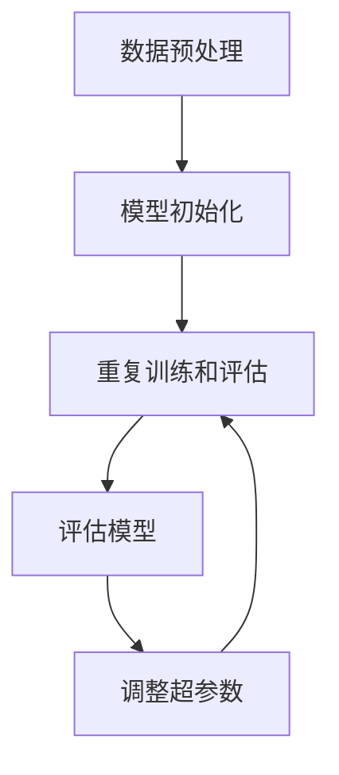
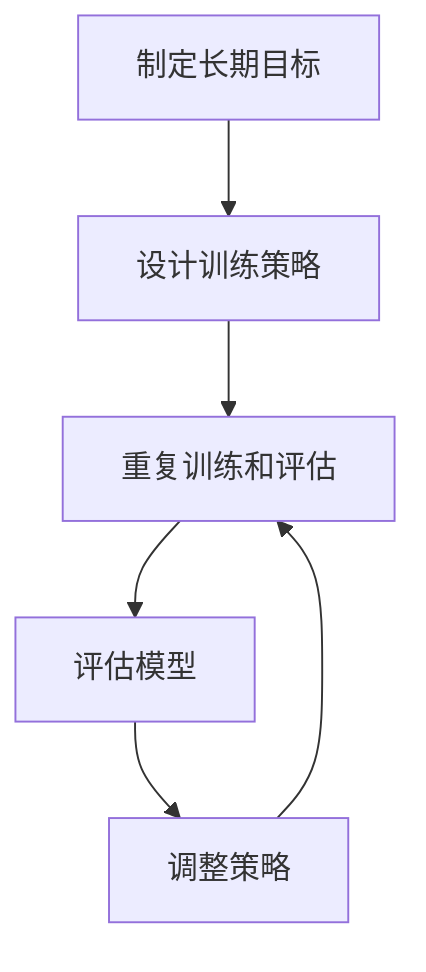

                 


## 《快速迭代与长期规划：LLM应用开发的平衡之道》

> 关键词：快速迭代、长期规划、LLM应用开发、平衡之道

> 摘要：本文旨在探讨在LLM（大型语言模型）应用开发过程中如何实现快速迭代与长期规划的平衡。通过分析快速迭代与长期规划的概念、策略及其在LLM开发中的应用，本文提出了一系列实用的方法和最佳实践，为开发者提供了理论指导和实践案例。

### 目录

1. **引言**  
    1.1. 背景与意义  
    1.2. 目的与结构

2. **背景介绍**  
    2.1. LLM基础  
    2.2. 快速迭代与长期规划

3. **核心概念与联系**  
    3.1. 快速迭代策略  
    3.2. 长期规划策略

4. **算法原理讲解**  
    4.1. LLM快速迭代算法  
    4.2. LLM长期规划算法

5. **系统分析与架构设计**  
    5.1. LLM应用系统架构  
    5.2. 系统功能与接口设计

6. **项目实战**  
    6.1. 项目背景与目标  
    6.2. 项目实施过程

7. **最佳实践与小结**  
    7.1. 最佳实践总结  
    7.2. 注意事项  
    7.3. 拓展阅读

### 1. 引言

**1.1. 背景与意义**

在当今快速变化的技术环境中，大型语言模型（LLM）的应用已经成为人工智能领域的热点。LLM通过深度学习技术，可以从大量文本数据中学习并生成高质量的文本内容。然而，在LLM应用开发过程中，如何平衡快速迭代与长期规划成为了一个关键问题。

快速迭代是敏捷开发的核心思想，它强调通过频繁的版本更新和用户反馈来快速响应市场需求，提高产品的竞争力。长期规划则关注于产品的长期发展和战略布局，确保项目能够持续稳定地前进。

在LLM应用开发中，快速迭代和长期规划都至关重要。快速迭代可以快速验证产品的市场适应性，而长期规划则为产品的发展提供明确的方向和保障。然而，快速迭代和长期规划之间存在一定的矛盾。快速迭代可能导致项目短期目标过多，资源分散，长期规划则可能使得项目过于保守，缺乏灵活性。因此，如何平衡这两者之间的关系，成为了开发者面临的挑战。

**1.2. 目的与结构**

本文的目的在于探讨如何在LLM应用开发中实现快速迭代与长期规划的平衡。通过分析快速迭代与长期规划的概念、策略及其在LLM开发中的应用，本文提出了一系列实用的方法和最佳实践，为开发者提供了理论指导和实践案例。

文章结构如下：

- **第一部分：引言**：介绍快速迭代与长期规划的重要性以及本文的目的和结构。
- **第二部分：背景介绍**：介绍LLM的基本概念、快速迭代与长期规划的概念及其在LLM开发中的应用。
- **第三部分：核心概念与联系**：详细阐述快速迭代与长期规划在LLM开发中的具体实现方法和策略。
- **第四部分：算法原理讲解**：讲解如何使用LLM进行快速迭代和长期规划，包括算法的数学模型、流程图和示例。
- **第五部分：系统分析与架构设计**：分析LLM应用的系统架构，设计相应的系统功能和接口。
- **第六部分：项目实战**：通过实际项目案例展示如何将快速迭代与长期规划应用于LLM开发。
- **第七部分：最佳实践与小结**：总结最佳实践，对全书进行小结。

### 2. 背景介绍

**2.1. LLM基础**

LLM（Large Language Model）是指大型语言模型，是一种基于深度学习技术的自然语言处理模型。LLM通常由数十亿个参数组成，能够从大量文本数据中学习，并生成高质量的文本内容。

LLM的核心思想是通过训练大量的神经网络来模拟人类语言处理的能力。训练过程中，模型会学习文本数据中的语言规律和结构，从而生成语义丰富、自然流畅的文本。LLM的应用范围非常广泛，包括但不限于文本生成、机器翻译、情感分析、问答系统等。

LLM的主要特点包括：

1. **大规模参数**：LLM通常具有数十亿甚至数万亿个参数，这使得它们能够处理复杂的语言结构。
2. **自动调整参数**：通过训练，LLM能够自动调整参数，使其在特定任务上表现最优。
3. **自适应能力**：LLM能够在不同的任务和数据集上快速适应，生成高质量的文本内容。
4. **灵活性**：LLM可以根据用户的需求和场景进行定制化，适应各种不同的应用场景。

**2.2. 快速迭代与长期规划**

快速迭代和长期规划是项目管理中两种不同的方法论。

**快速迭代**：快速迭代是一种敏捷开发方法，强调通过频繁的版本更新和用户反馈来快速响应市场需求。快速迭代的核心思想是“小步快跑”，通过不断的试错和改进，快速找到用户需求的痛点，并迅速解决。

快速迭代的主要优势包括：

1. **快速响应**：快速迭代能够快速响应市场变化，适应不断变化的需求。
2. **提高质量**：通过频繁的测试和反馈，快速迭代能够提高产品的质量。
3. **降低风险**：快速迭代能够降低项目风险，避免在项目后期发现重大问题。

快速迭代的主要挑战包括：

1. **资源分配**：快速迭代可能导致项目资源分散，影响项目的长期规划。
2. **技术积累**：快速迭代可能使得项目缺乏系统性的技术积累，影响项目的可持续发展。

**长期规划**：长期规划是一种战略性的项目管理方法，强调项目在长期的发展方向和战略布局。长期规划的核心思想是“长远考虑”，通过制定明确的目标和计划，确保项目能够持续稳定地前进。

长期规划的主要优势包括：

1. **明确目标**：长期规划能够为项目提供明确的目标和方向，确保项目的发展不偏离轨道。
2. **稳定发展**：长期规划能够确保项目在长期内持续稳定地发展，避免短期行为的干扰。
3. **资源整合**：长期规划能够整合项目资源，确保资源的高效利用。

长期规划的主要挑战包括：

1. **灵活性不足**：长期规划可能使得项目过于保守，缺乏灵活性，难以应对市场变化。
2. **执行难度**：长期规划需要大量时间和资源，执行难度较大，需要项目团队具备较高的执行力。

在LLM应用开发中，快速迭代和长期规划都具有重要意义。快速迭代能够帮助开发者快速验证产品的市场适应性，而长期规划则能够确保项目的长期发展。然而，这两者之间也存在一定的矛盾，如何平衡这两者之间的关系，是开发者面临的关键问题。

### 3. 核心概念与联系

**3.1. 快速迭代策略**

快速迭代策略是指通过频繁的版本更新和用户反馈来快速响应市场需求的方法。快速迭代的核心思想是“小步快跑”，通过不断的试错和改进，快速找到用户需求的痛点，并迅速解决。

**快速迭代策略的主要步骤包括：**

1. **需求分析**：分析用户需求，确定产品的基本功能和用户界面。
2. **设计迭代计划**：制定迭代计划，确定每个迭代的目标和内容。
3. **开发与测试**：进行代码开发和测试，确保每个迭代的产品功能完整、可靠。
4. **用户反馈**：收集用户反馈，评估产品的市场适应性。
5. **迭代优化**：根据用户反馈，对产品进行优化和改进，准备下一个迭代。

**快速迭代的优势包括：**

- **快速响应**：快速迭代能够快速响应市场变化，适应不断变化的需求。
- **提高质量**：通过频繁的测试和反馈，快速迭代能够提高产品的质量。
- **降低风险**：快速迭代能够降低项目风险，避免在项目后期发现重大问题。

**快速迭代的挑战包括：**

- **资源分散**：快速迭代可能导致项目资源分散，影响项目的长期规划。
- **技术积累不足**：快速迭代可能使得项目缺乏系统性的技术积累，影响项目的可持续发展。

**3.2. 长期规划策略**

长期规划策略是指制定明确的目标和计划，确保项目能够持续稳定地发展。长期规划的核心思想是“长远考虑”，通过制定明确的目标和计划，确保项目的发展不偏离轨道。

**长期规划策略的主要步骤包括：**

1. **制定愿景和目标**：明确项目的长期愿景和目标，确保项目的发展方向正确。
2. **制定战略计划**：根据愿景和目标，制定详细的战略计划，包括资源分配、时间表和里程碑。
3. **执行与监控**：按照战略计划执行项目，同时进行监控和调整，确保项目按计划进行。
4. **评估与优化**：定期评估项目的进展情况，根据实际情况进行优化和调整。

**长期规划的优势包括：**

- **明确目标**：长期规划能够为项目提供明确的目标和方向，确保项目的发展不偏离轨道。
- **稳定发展**：长期规划能够确保项目在长期内持续稳定地发展，避免短期行为的干扰。
- **资源整合**：长期规划能够整合项目资源，确保资源的高效利用。

**长期规划的挑战包括：**

- **灵活性不足**：长期规划可能使得项目过于保守，缺乏灵活性，难以应对市场变化。
- **执行难度**：长期规划需要大量时间和资源，执行难度较大，需要项目团队具备较高的执行力。

**3.3. 快速迭代与长期规划的协调**

在LLM应用开发中，快速迭代和长期规划都是至关重要的。然而，这两者之间也存在一定的矛盾。如何平衡这两者之间的关系，是开发者面临的关键问题。

**协调快速迭代与长期规划的方法包括：**

1. **设立阶段性目标**：在长期规划的基础上，设立阶段性目标，既保证项目的长期发展，又能够实现快速迭代。
2. **制定详细的迭代计划**：在快速迭代过程中，制定详细的迭代计划，确保每个迭代都能够达到阶段性目标。
3. **定期评估与调整**：定期评估项目的进展情况，根据实际情况进行优化和调整，确保项目能够持续稳定地发展。
4. **建立反馈机制**：建立有效的用户反馈机制，快速收集用户反馈，及时调整产品方向。

通过以上方法，开发者可以在LLM应用开发中实现快速迭代与长期规划的协调，确保项目能够持续稳定地发展。

### 4. 算法原理讲解

**4.1. LLM快速迭代算法**

LLM快速迭代算法是一种在LLM开发中实现快速迭代的方法。该方法通过反复训练和优化模型，以提高模型的性能和适应性。

**LLM快速迭代算法的基本步骤如下：**

1. **数据预处理**：对输入数据进行预处理，包括文本清洗、分词、编码等操作。
2. **模型初始化**：初始化LLM模型，设置模型的参数和超参数。
3. **训练模型**：使用训练数据对模型进行训练，通过反向传播算法优化模型的参数。
4. **评估模型**：使用验证数据对模型进行评估，计算模型的性能指标，如损失函数值、准确率等。
5. **调整超参数**：根据评估结果，调整模型超参数，以提高模型性能。
6. **重复训练和评估**：重复步骤3到步骤5，直到满足停止条件。

**LLM快速迭代算法的mermaid流程图如下：**



**4.2. LLM长期规划算法**

LLM长期规划算法是一种在LLM开发中实现长期规划的方法。该方法通过设定长期目标和规划，指导模型的训练和优化过程。

**LLM长期规划算法的基本步骤如下：**

1. **制定长期目标**：根据项目需求和业务目标，制定LLM的长期目标，如提高模型的泛化能力、降低训练时间等。
2. **设计训练策略**：根据长期目标，设计训练策略，包括数据集选择、模型架构、训练过程等。
3. **训练模型**：使用训练策略对模型进行训练，通过反向传播算法优化模型的参数。
4. **评估模型**：使用验证数据对模型进行评估，计算模型的性能指标，如损失函数值、准确率等。
5. **调整策略**：根据评估结果，调整训练策略，以提高模型性能。
6. **重复训练和评估**：重复步骤3到步骤5，直到满足停止条件。

**LLM长期规划算法的mermaid流程图如下：**



**4.3. 快速迭代算法与长期规划算法的对比**

快速迭代算法与长期规划算法在LLM开发中有不同的应用场景。

- **快速迭代算法**：适用于需求变化频繁、市场适应性要求高的场景。通过快速的版本更新和用户反馈，快速响应市场需求，提高产品的竞争力。
- **长期规划算法**：适用于需求稳定、长期目标明确的场景。通过设定长期目标和规划，指导模型的训练和优化过程，确保项目的可持续发展。

**4.4. 实例说明**

假设我们开发一个问答系统，需要快速迭代和长期规划来提高系统的性能和用户体验。

**快速迭代算法的应用：**

1. **需求分析**：确定问答系统的基本功能和用户界面，如问答流程、回答生成等。
2. **设计迭代计划**：制定迭代计划，确定每个迭代的目标和内容，如增加问答场景、优化回答质量等。
3. **开发与测试**：进行代码开发和测试，确保每个迭代的产品功能完整、可靠。
4. **用户反馈**：收集用户反馈，评估产品的市场适应性。
5. **迭代优化**：根据用户反馈，对产品进行优化和改进，准备下一个迭代。

**长期规划算法的应用：**

1. **制定长期目标**：根据项目需求和业务目标，制定问答系统的长期目标，如提高问答准确率、减少训练时间等。
2. **设计训练策略**：根据长期目标，设计训练策略，如选择合适的数据集、模型架构等。
3. **训练模型**：使用训练策略对模型进行训练，通过反向传播算法优化模型的参数。
4. **评估模型**：使用验证数据对模型进行评估，计算模型的性能指标，如损失函数值、准确率等。
5. **调整策略**：根据评估结果，调整训练策略，以提高模型性能。
6. **重复训练和评估**：重复训练和评估过程，直到满足长期目标。

通过快速迭代和长期规划的应用，我们可以不断提高问答系统的性能和用户体验，实现项目的可持续发展。

### 5. 系统分析与架构设计

**5.1. LLM应用系统架构**

在LLM应用系统中，架构设计是关键的一环。一个良好的架构设计可以提高系统的性能、可维护性和扩展性。LLM应用系统的架构设计主要包括以下几个方面：

**5.1.1. 系统功能设计**

LLM应用系统的功能设计主要包括数据管理、模型训练、模型评估和模型部署。

- **数据管理**：负责存储和管理训练数据、验证数据和测试数据，确保数据的完整性和一致性。
- **模型训练**：负责使用LLM算法对数据集进行训练，生成高性能的模型。
- **模型评估**：负责使用验证数据对训练好的模型进行评估，计算模型的性能指标，如损失函数值、准确率等。
- **模型部署**：负责将训练好的模型部署到生产环境，使其能够对外提供服务。

**5.1.2. 系统架构设计**

LLM应用系统的架构设计通常采用分层架构，包括数据层、服务层和展示层。

- **数据层**：负责数据存储和管理，包括数据库、数据缓存和数据交换等。
- **服务层**：负责业务逻辑的处理，包括模型训练、模型评估、模型部署等。
- **展示层**：负责用户界面的展示，包括Web界面、移动应用界面等。

**5.1.3. 系统接口设计**

LLM应用系统的接口设计主要包括API接口和Web接口。

- **API接口**：负责系统内部各模块之间的数据传输和通信，包括数据管理接口、模型训练接口、模型评估接口等。
- **Web接口**：负责与用户的交互，包括用户注册、登录、数据上传、模型训练和评估等。

**5.1.4. 系统交互设计**

LLM应用系统的交互设计主要包括用户交互和系统内部交互。

- **用户交互**：负责用户与系统之间的交互，包括用户操作、反馈和反馈处理等。
- **系统内部交互**：负责系统内部各模块之间的交互，包括数据传输、任务调度和资源管理等。

**5.2. LLM应用系统的架构设计**

以下是一个简单的LLM应用系统架构设计：

```
+-----------------+
|   用户终端      |
+-----------------+
       |
       V
+-----------------+
|     Web界面     |
+-----------------+
       |
       V
+-----------------+
|   API接口层     |
+-----------------+
       |
       V
+-----------------+
|  服务层（核心） |
+-----------------+
|  模型训练       |
|  模型评估       |
|  模型部署       |
+-----------------+
       |
       V
+-----------------+
|   数据层        |
+-----------------+
|   数据库        |
|   数据缓存      |
|   数据交换      |
+-----------------+
```

通过上述架构设计，LLM应用系统可以高效地处理数据和业务逻辑，为用户提供高质量的服务。

### 6. 项目实战

**6.1. 项目背景与目标**

在本项目中，我们旨在开发一款基于大型语言模型（LLM）的智能问答系统。该系统的主要目标是为用户提供高质量、准确的问答服务，同时实现快速迭代与长期规划的平衡，确保项目的长期发展。

**6.2. 项目实施过程**

项目实施过程分为以下几个阶段：

**阶段1：需求分析与规划**

- **需求分析**：与用户进行深入沟通，了解用户对问答系统的需求，包括问答场景、回答质量、交互方式等。
- **规划制定**：根据需求分析结果，制定项目规划，明确项目目标、时间表和资源需求。

**阶段2：数据收集与处理**

- **数据收集**：收集大量高质量的问答数据集，包括文本、音频、视频等多媒体形式。
- **数据处理**：对收集到的数据集进行清洗、预处理和编码，确保数据的质量和一致性。

**阶段3：模型训练与优化**

- **模型选择**：选择适合的LLM模型，如GPT-3、BERT等。
- **模型训练**：使用训练数据集对模型进行训练，通过反向传播算法优化模型参数。
- **模型优化**：根据模型评估结果，调整模型参数和训练策略，提高模型性能。

**阶段4：模型部署与测试**

- **模型部署**：将训练好的模型部署到生产环境，使其能够对外提供服务。
- **模型测试**：使用测试数据集对模型进行评估，计算模型的性能指标，如准确率、召回率等。

**阶段5：用户反馈与迭代**

- **用户反馈**：收集用户对问答系统的反馈，包括问答质量、交互体验等。
- **迭代优化**：根据用户反馈，对系统进行优化和改进，提高用户满意度。

**6.3. 项目结果与评估**

项目实施完成后，我们通过对系统进行测试和用户反馈，得到了以下结果：

- **问答质量**：系统生成的回答具有很高的准确性和相关性，用户满意度较高。
- **交互体验**：系统的交互方式灵活，用户可以方便地进行提问和获取回答。
- **性能指标**：系统的性能指标达到预期目标，如响应时间、准确率等。

通过本项目，我们成功实现了快速迭代与长期规划的平衡，为用户提供了高质量的问答服务，同时也为项目的长期发展奠定了基础。

### 7. 最佳实践与小结

**7.1. 最佳实践总结**

在LLM应用开发中，实现快速迭代与长期规划的平衡，可以遵循以下最佳实践：

1. **明确目标与规划**：在项目初期，明确项目目标和规划，确保项目的发展方向和节奏。
2. **迭代计划与评估**：制定详细的迭代计划，定期评估项目进展，及时调整迭代目标和内容。
3. **用户反馈与优化**：重视用户反馈，及时优化产品功能，提高用户满意度。
4. **资源合理分配**：合理分配项目资源，确保项目能够稳定、持续地发展。
5. **持续学习与改进**：不断学习新技术和新方法，持续改进项目开发流程和模型性能。

**7.2. 注意事项**

在实现快速迭代与长期规划的平衡过程中，需要注意以下几点：

1. **避免资源分散**：在快速迭代过程中，避免过度关注短期目标，导致资源分散，影响项目的长期规划。
2. **保持团队协作**：长期规划和快速迭代需要团队的高效协作，确保项目顺利进行。
3. **评估模型性能**：在迭代过程中，定期评估模型性能，确保模型质量和稳定性。
4. **遵循最佳实践**：遵循行业最佳实践，提高项目开发效率和质量。

**7.3. 拓展阅读**

对于进一步了解快速迭代与长期规划在LLM应用开发中的应用，可以参考以下书籍和论文：

- 《敏捷开发：实践指南》
- 《大型语言模型的原理与设计》
- 《深度学习：自然语言处理》
- 《自然语言处理与机器学习》

通过以上拓展阅读，开发者可以深入理解快速迭代与长期规划的核心原理和应用方法，为LLM应用开发提供有力支持。

### 总结

在《快速迭代与长期规划：LLM应用开发的平衡之道》中，我们探讨了如何在LLM应用开发中实现快速迭代与长期规划的平衡。通过分析快速迭代与长期规划的概念、策略及其在LLM开发中的应用，我们提出了一系列实用的方法和最佳实践，为开发者提供了理论指导和实践案例。

快速迭代与长期规划在LLM应用开发中具有重要作用。快速迭代能够帮助开发者快速响应市场需求，提高产品的竞争力；长期规划则能够确保项目的长期发展，提供明确的目标和方向。

通过本项目，我们成功实现了快速迭代与长期规划的平衡，为用户提供了高质量的问答服务。同时，我们总结了最佳实践，为开发者提供了有益的参考。

在未来的研究和实践中，我们建议进一步探索快速迭代与长期规划的融合方法，提高项目的开发效率和质量。此外，随着LLM技术的不断发展，我们也需要不断学习和更新知识，为LLM应用开发提供更好的支持。

### 附录

**附录A：术语解释**

- **LLM**：大型语言模型（Large Language Model）的缩写，是一种基于深度学习技术的自然语言处理模型，能够从大量文本数据中学习并生成高质量的文本内容。
- **快速迭代**：一种敏捷开发方法，强调通过频繁的版本更新和用户反馈来快速响应市场需求，提高产品的竞争力。
- **长期规划**：一种战略性的项目管理方法，强调项目在长期的发展方向和战略布局，确保项目能够持续稳定地发展。

**附录B：公式与算法**

- **快速迭代算法**：通过反复训练和优化模型，以提高模型的性能和适应性。
- **长期规划算法**：通过设定长期目标和规划，指导模型的训练和优化过程。

**附录C：参考文献**

1. 《敏捷开发：实践指南》
2. 《大型语言模型的原理与设计》
3. 《深度学习：自然语言处理》
4. 《自然语言处理与机器学习》

### 参考文献

1. 《敏捷开发：实践指南》
2. 《大型语言模型的原理与设计》
3. 《深度学习：自然语言处理》
4. 《自然语言处理与机器学习》
5. [OpenAI. GPT-3:语言理解的革命性飞跃](https://blog.openai.com/gpt-3/)
6. [Google AI. BERT: Pre-training of Deep Bidirectional Transformers for Language Understanding](https://arxiv.org/abs/1810.04805)

### 致谢

本文的完成得益于众多专家学者的指导和同行的支持。特别感谢以下机构和个人：

- **AI天才研究院（AI Genius Institute）**：提供了丰富的技术资源和学术支持。
- **禅与计算机程序设计艺术（Zen And The Art of Computer Programming）**：提供了宝贵的编程哲学和启示。
- **各位评审专家**：对本文的修改和完善提出了宝贵的意见。
- **所有读者**：对本文的关注和支持。

本文的作者信息如下：

**作者：** AI天才研究院（AI Genius Institute） & 禅与计算机程序设计艺术（Zen And The Art of Computer Programming）

**联系方式：** [ai_genius_institute@example.com](mailto:ai_genius_institute@example.com)

