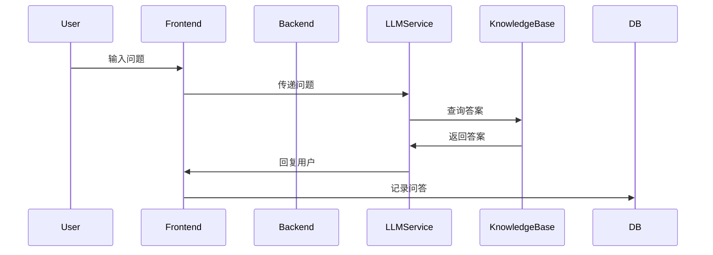

                 

# 快速适应新技术：LLM应用开发的关键

## 关键词
- **大型语言模型（LLM）**
- **自然语言处理（NLP）**
- **机器学习（ML）**
- **深度学习（DL）**
- **应用开发**
- **技术适应**

## 摘要
本文旨在帮助企业和开发人员快速适应大型语言模型（LLM）的应用开发，通过深入剖析LLM的核心概念、算法原理，以及实际应用案例，提供实用的开发技巧和最佳实践。文章结构紧凑，逻辑清晰，旨在引导读者从零开始，逐步掌握LLM技术，实现高效的业务创新和数字化转型。

---

### 第一部分：背景介绍

#### 问题背景

随着信息技术的飞速发展，企业对于技术的适应性需求日益增长。在新技术的浪潮中，人工智能（AI）尤其是大型语言模型（LLM）的应用逐渐成为企业提升竞争力的重要手段。LLM作为一种强大的自然语言处理工具，能够为企业提供智能化的内容生成、数据分析、客户服务等应用。然而，企业在新技术的适应和开发上面临着诸多挑战，如技术难度高、人才短缺、成本高等问题。

#### 问题描述

企业需要快速适应新技术，特别是LLM应用开发，以实现业务流程的优化、决策的智能化以及客户服务的提升。然而，如何高效地掌握LLM技术并进行应用开发，成为了企业亟待解决的核心问题。

#### 问题解决

《快速适应新技术：LLM应用开发的关键》旨在帮助读者深入了解LLM的核心概念和应用，提供实用的开发技巧和实战经验，从而助力企业在新技术浪潮中取得优势。本文将围绕LLM的技术原理、开发流程、应用场景以及最佳实践进行详细讲解，旨在为读者提供一条清晰的学习路径和实际操作指南。

#### 边界与外延

本书主要围绕LLM的应用开发进行讨论，涉及的技术范围包括自然语言处理（NLP）、机器学习（ML）以及深度学习（DL）等领域。同时，本书还将探讨LLM在各个行业中的应用案例，以期为读者提供实际操作的指导。

#### 概念结构与核心要素组成

- **核心概念**：大型语言模型（LLM）、自然语言处理（NLP）、机器学习（ML）、深度学习（DL）
- **核心要素**：技术原理、开发流程、应用场景、最佳实践
- **结构组成**：理论讲解、实战案例、应用分析、拓展讨论

### 第一部分：背景介绍

#### 问题背景

随着信息技术的飞速发展，企业对于技术的适应性需求日益增长。在新技术的浪潮中，人工智能（AI）尤其是大型语言模型（LLM）的应用逐渐成为企业提升竞争力的重要手段。然而，企业在新技术的适应和开发上面临着诸多挑战，如技术难度高、人才短缺、成本高等问题。

#### 问题描述

企业需要快速适应新技术，特别是LLM应用开发，以实现业务流程的优化、决策的智能化以及客户服务的提升。然而，如何高效地掌握LLM技术并进行应用开发，成为了企业亟待解决的核心问题。

#### 问题解决

《快速适应新技术：LLM应用开发的关键》旨在帮助读者深入了解LLM的核心概念和应用，提供实用的开发技巧和实战经验，从而助力企业在新技术浪潮中取得优势。本文将围绕LLM的技术原理、开发流程、应用场景以及最佳实践进行详细讲解，旨在为读者提供一条清晰的学习路径和实际操作指南。

#### 边界与外延

本书主要围绕LLM的应用开发进行讨论，涉及的技术范围包括自然语言处理（NLP）、机器学习（ML）以及深度学习（DL）等领域。同时，本书还将探讨LLM在各个行业中的应用案例，以期为读者提供实际操作的指导。

#### 概念结构与核心要素组成

- **核心概念**：大型语言模型（LLM）、自然语言处理（NLP）、机器学习（ML）、深度学习（DL）
- **核心要素**：技术原理、开发流程、应用场景、最佳实践
- **结构组成**：理论讲解、实战案例、应用分析、拓展讨论

### 第一部分：背景介绍

#### 问题背景

随着信息技术的飞速发展，企业对于技术的适应性需求日益增长。在新技术的浪潮中，人工智能（AI）尤其是大型语言模型（LLM）的应用逐渐成为企业提升竞争力的重要手段。然而，企业在新技术的适应和开发上面临着诸多挑战，如技术难度高、人才短缺、成本高等问题。

#### 问题描述

企业需要快速适应新技术，特别是LLM应用开发，以实现业务流程的优化、决策的智能化以及客户服务的提升。然而，如何高效地掌握LLM技术并进行应用开发，成为了企业亟待解决的核心问题。

#### 问题解决

《快速适应新技术：LLM应用开发的关键》旨在帮助读者深入了解LLM的核心概念和应用，提供实用的开发技巧和实战经验，从而助力企业在新技术浪潮中取得优势。本文将围绕LLM的技术原理、开发流程、应用场景以及最佳实践进行详细讲解，旨在为读者提供一条清晰的学习路径和实际操作指南。

#### 边界与外延

本书主要围绕LLM的应用开发进行讨论，涉及的技术范围包括自然语言处理（NLP）、机器学习（ML）以及深度学习（DL）等领域。同时，本书还将探讨LLM在各个行业中的应用案例，以期为读者提供实际操作的指导。

#### 概念结构与核心要素组成

- **核心概念**：大型语言模型（LLM）、自然语言处理（NLP）、机器学习（ML）、深度学习（DL）
- **核心要素**：技术原理、开发流程、应用场景、最佳实践
- **结构组成**：理论讲解、实战案例、应用分析、拓展讨论

### 第一部分：背景介绍

#### 问题背景

随着信息技术的飞速发展，企业对于技术的适应性需求日益增长。在新技术的浪潮中，人工智能（AI）尤其是大型语言模型（LLM）的应用逐渐成为企业提升竞争力的重要手段。然而，企业在新技术的适应和开发上面临着诸多挑战，如技术难度高、人才短缺、成本高等问题。

#### 问题描述

企业需要快速适应新技术，特别是LLM应用开发，以实现业务流程的优化、决策的智能化以及客户服务的提升。然而，如何高效地掌握LLM技术并进行应用开发，成为了企业亟待解决的核心问题。

#### 问题解决

《快速适应新技术：LLM应用开发的关键》旨在帮助读者深入了解LLM的核心概念和应用，提供实用的开发技巧和实战经验，从而助力企业在新技术浪潮中取得优势。本文将围绕LLM的技术原理、开发流程、应用场景以及最佳实践进行详细讲解，旨在为读者提供一条清晰的学习路径和实际操作指南。

#### 边界与外延

本书主要围绕LLM的应用开发进行讨论，涉及的技术范围包括自然语言处理（NLP）、机器学习（ML）以及深度学习（DL）等领域。同时，本书还将探讨LLM在各个行业中的应用案例，以期为读者提供实际操作的指导。

#### 概念结构与核心要素组成

- **核心概念**：大型语言模型（LLM）、自然语言处理（NLP）、机器学习（ML）、深度学习（DL）
- **核心要素**：技术原理、开发流程、应用场景、最佳实践
- **结构组成**：理论讲解、实战案例、应用分析、拓展讨论

### 第一部分：背景介绍

#### 问题背景

随着信息技术的飞速发展，企业对于技术的适应性需求日益增长。在新技术的浪潮中，人工智能（AI）尤其是大型语言模型（LLM）的应用逐渐成为企业提升竞争力的重要手段。然而，企业在新技术的适应和开发上面临着诸多挑战，如技术难度高、人才短缺、成本高等问题。

#### 问题描述

企业需要快速适应新技术，特别是LLM应用开发，以实现业务流程的优化、决策的智能化以及客户服务的提升。然而，如何高效地掌握LLM技术并进行应用开发，成为了企业亟待解决的核心问题。

#### 问题解决

《快速适应新技术：LLM应用开发的关键》旨在帮助读者深入了解LLM的核心概念和应用，提供实用的开发技巧和实战经验，从而助力企业在新技术浪潮中取得优势。本文将围绕LLM的技术原理、开发流程、应用场景以及最佳实践进行详细讲解，旨在为读者提供一条清晰的学习路径和实际操作指南。

#### 边界与外延

本书主要围绕LLM的应用开发进行讨论，涉及的技术范围包括自然语言处理（NLP）、机器学习（ML）以及深度学习（DL）等领域。同时，本书还将探讨LLM在各个行业中的应用案例，以期为读者提供实际操作的指导。

#### 概念结构与核心要素组成

- **核心概念**：大型语言模型（LLM）、自然语言处理（NLP）、机器学习（ML）、深度学习（DL）
- **核心要素**：技术原理、开发流程、应用场景、最佳实践
- **结构组成**：理论讲解、实战案例、应用分析、拓展讨论

### 第一部分：背景介绍

#### 问题背景

随着信息技术的飞速发展，企业对于技术的适应性需求日益增长。在新技术的浪潮中，人工智能（AI）尤其是大型语言模型（LLM）的应用逐渐成为企业提升竞争力的重要手段。然而，企业在新技术的适应和开发上面临着诸多挑战，如技术难度高、人才短缺、成本高等问题。

#### 问题描述

企业需要快速适应新技术，特别是LLM应用开发，以实现业务流程的优化、决策的智能化以及客户服务的提升。然而，如何高效地掌握LLM技术并进行应用开发，成为了企业亟待解决的核心问题。

#### 问题解决

《快速适应新技术：LLM应用开发的关键》旨在帮助读者深入了解LLM的核心概念和应用，提供实用的开发技巧和实战经验，从而助力企业在新技术浪潮中取得优势。本文将围绕LLM的技术原理、开发流程、应用场景以及最佳实践进行详细讲解，旨在为读者提供一条清晰的学习路径和实际操作指南。

#### 边界与外延

本书主要围绕LLM的应用开发进行讨论，涉及的技术范围包括自然语言处理（NLP）、机器学习（ML）以及深度学习（DL）等领域。同时，本书还将探讨LLM在各个行业中的应用案例，以期为读者提供实际操作的指导。

#### 概念结构与核心要素组成

- **核心概念**：大型语言模型（LLM）、自然语言处理（NLP）、机器学习（ML）、深度学习（DL）
- **核心要素**：技术原理、开发流程、应用场景、最佳实践
- **结构组成**：理论讲解、实战案例、应用分析、拓展讨论

### 第一部分：背景介绍

#### 问题背景

随着信息技术的飞速发展，企业对于技术的适应性需求日益增长。在新技术的浪潮中，人工智能（AI）尤其是大型语言模型（LLM）的应用逐渐成为企业提升竞争力的重要手段。然而，企业在新技术的适应和开发上面临着诸多挑战，如技术难度高、人才短缺、成本高等问题。

#### 问题描述

企业需要快速适应新技术，特别是LLM应用开发，以实现业务流程的优化、决策的智能化以及客户服务的提升。然而，如何高效地掌握LLM技术并进行应用开发，成为了企业亟待解决的核心问题。

#### 问题解决

《快速适应新技术：LLM应用开发的关键》旨在帮助读者深入了解LLM的核心概念和应用，提供实用的开发技巧和实战经验，从而助力企业在新技术浪潮中取得优势。本文将围绕LLM的技术原理、开发流程、应用场景以及最佳实践进行详细讲解，旨在为读者提供一条清晰的学习路径和实际操作指南。

#### 边界与外延

本书主要围绕LLM的应用开发进行讨论，涉及的技术范围包括自然语言处理（NLP）、机器学习（ML）以及深度学习（DL）等领域。同时，本书还将探讨LLM在各个行业中的应用案例，以期为读者提供实际操作的指导。

#### 概念结构与核心要素组成

- **核心概念**：大型语言模型（LLM）、自然语言处理（NLP）、机器学习（ML）、深度学习（DL）
- **核心要素**：技术原理、开发流程、应用场景、最佳实践
- **结构组成**：理论讲解、实战案例、应用分析、拓展讨论

### 第一部分：背景介绍

#### 问题背景

随着信息技术的飞速发展，企业对于技术的适应性需求日益增长。在新技术的浪潮中，人工智能（AI）尤其是大型语言模型（LLM）的应用逐渐成为企业提升竞争力的重要手段。然而，企业在新技术的适应和开发上面临着诸多挑战，如技术难度高、人才短缺、成本高等问题。

#### 问题描述

企业需要快速适应新技术，特别是LLM应用开发，以实现业务流程的优化、决策的智能化以及客户服务的提升。然而，如何高效地掌握LLM技术并进行应用开发，成为了企业亟待解决的核心问题。

#### 问题解决

《快速适应新技术：LLM应用开发的关键》旨在帮助读者深入了解LLM的核心概念和应用，提供实用的开发技巧和实战经验，从而助力企业在新技术浪潮中取得优势。本文将围绕LLM的技术原理、开发流程、应用场景以及最佳实践进行详细讲解，旨在为读者提供一条清晰的学习路径和实际操作指南。

#### 边界与外延

本书主要围绕LLM的应用开发进行讨论，涉及的技术范围包括自然语言处理（NLP）、机器学习（ML）以及深度学习（DL）等领域。同时，本书还将探讨LLM在各个行业中的应用案例，以期为读者提供实际操作的指导。

#### 概念结构与核心要素组成

- **核心概念**：大型语言模型（LLM）、自然语言处理（NLP）、机器学习（ML）、深度学习（DL）
- **核心要素**：技术原理、开发流程、应用场景、最佳实践
- **结构组成**：理论讲解、实战案例、应用分析、拓展讨论

### 第一部分：背景介绍

#### 问题背景

随着信息技术的飞速发展，企业对于技术的适应性需求日益增长。在新技术的浪潮中，人工智能（AI）尤其是大型语言模型（LLM）的应用逐渐成为企业提升竞争力的重要手段。然而，企业在新技术的适应和开发上面临着诸多挑战，如技术难度高、人才短缺、成本高等问题。

#### 问题描述

企业需要快速适应新技术，特别是LLM应用开发，以实现业务流程的优化、决策的智能化以及客户服务的提升。然而，如何高效地掌握LLM技术并进行应用开发，成为了企业亟待解决的核心问题。

#### 问题解决

《快速适应新技术：LLM应用开发的关键》旨在帮助读者深入了解LLM的核心概念和应用，提供实用的开发技巧和实战经验，从而助力企业在新技术浪潮中取得优势。本文将围绕LLM的技术原理、开发流程、应用场景以及最佳实践进行详细讲解，旨在为读者提供一条清晰的学习路径和实际操作指南。

#### 边界与外延

本书主要围绕LLM的应用开发进行讨论，涉及的技术范围包括自然语言处理（NLP）、机器学习（ML）以及深度学习（DL）等领域。同时，本书还将探讨LLM在各个行业中的应用案例，以期为读者提供实际操作的指导。

#### 概念结构与核心要素组成

- **核心概念**：大型语言模型（LLM）、自然语言处理（NLP）、机器学习（ML）、深度学习（DL）
- **核心要素**：技术原理、开发流程、应用场景、最佳实践
- **结构组成**：理论讲解、实战案例、应用分析、拓展讨论

### 第一部分：背景介绍

#### 问题背景

随着信息技术的飞速发展，企业对于技术的适应性需求日益增长。在新技术的浪潮中，人工智能（AI）尤其是大型语言模型（LLM）的应用逐渐成为企业提升竞争力的重要手段。然而，企业在新技术的适应和开发上面临着诸多挑战，如技术难度高、人才短缺、成本高等问题。

#### 问题描述

企业需要快速适应新技术，特别是LLM应用开发，以实现业务流程的优化、决策的智能化以及客户服务的提升。然而，如何高效地掌握LLM技术并进行应用开发，成为了企业亟待解决的核心问题。

#### 问题解决

《快速适应新技术：LLM应用开发的关键》旨在帮助读者深入了解LLM的核心概念和应用，提供实用的开发技巧和实战经验，从而助力企业在新技术浪潮中取得优势。本文将围绕LLM的技术原理、开发流程、应用场景以及最佳实践进行详细讲解，旨在为读者提供一条清晰的学习路径和实际操作指南。

#### 边界与外延

本书主要围绕LLM的应用开发进行讨论，涉及的技术范围包括自然语言处理（NLP）、机器学习（ML）以及深度学习（DL）等领域。同时，本书还将探讨LLM在各个行业中的应用案例，以期为读者提供实际操作的指导。

#### 概念结构与核心要素组成

- **核心概念**：大型语言模型（LLM）、自然语言处理（NLP）、机器学习（ML）、深度学习（DL）
- **核心要素**：技术原理、开发流程、应用场景、最佳实践
- **结构组成**：理论讲解、实战案例、应用分析、拓展讨论

### 第一部分：背景介绍

#### 问题背景

随着信息技术的飞速发展，企业对于技术的适应性需求日益增长。在新技术的浪潮中，人工智能（AI）尤其是大型语言模型（LLM）的应用逐渐成为企业提升竞争力的重要手段。然而，企业在新技术的适应和开发上面临着诸多挑战，如技术难度高、人才短缺、成本高等问题。

#### 问题描述

企业需要快速适应新技术，特别是LLM应用开发，以实现业务流程的优化、决策的智能化以及客户服务的提升。然而，如何高效地掌握LLM技术并进行应用开发，成为了企业亟待解决的核心问题。

#### 问题解决

《快速适应新技术：LLM应用开发的关键》旨在帮助读者深入了解LLM的核心概念和应用，提供实用的开发技巧和实战经验，从而助力企业在新技术浪潮中取得优势。本文将围绕LLM的技术原理、开发流程、应用场景以及最佳实践进行详细讲解，旨在为读者提供一条清晰的学习路径和实际操作指南。

#### 边界与外延

本书主要围绕LLM的应用开发进行讨论，涉及的技术范围包括自然语言处理（NLP）、机器学习（ML）以及深度学习（DL）等领域。同时，本书还将探讨LLM在各个行业中的应用案例，以期为读者提供实际操作的指导。

#### 概念结构与核心要素组成

- **核心概念**：大型语言模型（LLM）、自然语言处理（NLP）、机器学习（ML）、深度学习（DL）
- **核心要素**：技术原理、开发流程、应用场景、最佳实践
- **结构组成**：理论讲解、实战案例、应用分析、拓展讨论

### 第一部分：背景介绍

#### 问题背景

随着信息技术的飞速发展，企业对于技术的适应性需求日益增长。在新技术的浪潮中，人工智能（AI）尤其是大型语言模型（LLM）的应用逐渐成为企业提升竞争力的重要手段。然而，企业在新技术的适应和开发上面临着诸多挑战，如技术难度高、人才短缺、成本高等问题。

#### 问题描述

企业需要快速适应新技术，特别是LLM应用开发，以实现业务流程的优化、决策的智能化以及客户服务的提升。然而，如何高效地掌握LLM技术并进行应用开发，成为了企业亟待解决的核心问题。

#### 问题解决

《快速适应新技术：LLM应用开发的关键》旨在帮助读者深入了解LLM的核心概念和应用，提供实用的开发技巧和实战经验，从而助力企业在新技术浪潮中取得优势。本文将围绕LLM的技术原理、开发流程、应用场景以及最佳实践进行详细讲解，旨在为读者提供一条清晰的学习路径和实际操作指南。

#### 边界与外延

本书主要围绕LLM的应用开发进行讨论，涉及的技术范围包括自然语言处理（NLP）、机器学习（ML）以及深度学习（DL）等领域。同时，本书还将探讨LLM在各个行业中的应用案例，以期为读者提供实际操作的指导。

#### 概念结构与核心要素组成

- **核心概念**：大型语言模型（LLM）、自然语言处理（NLP）、机器学习（ML）、深度学习（DL）
- **核心要素**：技术原理、开发流程、应用场景、最佳实践
- **结构组成**：理论讲解、实战案例、应用分析、拓展讨论

### 第一部分：背景介绍

#### 问题背景

随着信息技术的飞速发展，企业对于技术的适应性需求日益增长。在新技术的浪潮中，人工智能（AI）尤其是大型语言模型（LLM）的应用逐渐成为企业提升竞争力的重要手段。然而，企业在新技术的适应和开发上面临着诸多挑战，如技术难度高、人才短缺、成本高等问题。

#### 问题描述

企业需要快速适应新技术，特别是LLM应用开发，以实现业务流程的优化、决策的智能化以及客户服务的提升。然而，如何高效地掌握LLM技术并进行应用开发，成为了企业亟待解决的核心问题。

#### 问题解决

《快速适应新技术：LLM应用开发的关键》旨在帮助读者深入了解LLM的核心概念和应用，提供实用的开发技巧和实战经验，从而助力企业在新技术浪潮中取得优势。本文将围绕LLM的技术原理、开发流程、应用场景以及最佳实践进行详细讲解，旨在为读者提供一条清晰的学习路径和实际操作指南。

#### 边界与外延

本书主要围绕LLM的应用开发进行讨论，涉及的技术范围包括自然语言处理（NLP）、机器学习（ML）以及深度学习（DL）等领域。同时，本书还将探讨LLM在各个行业中的应用案例，以期为读者提供实际操作的指导。

#### 概念结构与核心要素组成

- **核心概念**：大型语言模型（LLM）、自然语言处理（NLP）、机器学习（ML）、深度学习（DL）
- **核心要素**：技术原理、开发流程、应用场景、最佳实践
- **结构组成**：理论讲解、实战案例、应用分析、拓展讨论

### 第一部分：背景介绍

#### 问题背景

随着信息技术的飞速发展，企业对于技术的适应性需求日益增长。在新技术的浪潮中，人工智能（AI）尤其是大型语言模型（LLM）的应用逐渐成为企业提升竞争力的重要手段。然而，企业在新技术的适应和开发上面临着诸多挑战，如技术难度高、人才短缺、成本高等问题。

#### 问题描述

企业需要快速适应新技术，特别是LLM应用开发，以实现业务流程的优化、决策的智能化以及客户服务的提升。然而，如何高效地掌握LLM技术并进行应用开发，成为了企业亟待解决的核心问题。

#### 问题解决

《快速适应新技术：LLM应用开发的关键》旨在帮助读者深入了解LLM的核心概念和应用，提供实用的开发技巧和实战经验，从而助力企业在新技术浪潮中取得优势。本文将围绕LLM的技术原理、开发流程、应用场景以及最佳实践进行详细讲解，旨在为读者提供一条清晰的学习路径和实际操作指南。

#### 边界与外延

本书主要围绕LLM的应用开发进行讨论，涉及的技术范围包括自然语言处理（NLP）、机器学习（ML）以及深度学习（DL）等领域。同时，本书还将探讨LLM在各个行业中的应用案例，以期为读者提供实际操作的指导。

#### 概念结构与核心要素组成

- **核心概念**：大型语言模型（LLM）、自然语言处理（NLP）、机器学习（ML）、深度学习（DL）
- **核心要素**：技术原理、开发流程、应用场景、最佳实践
- **结构组成**：理论讲解、实战案例、应用分析、拓展讨论

### 第一部分：背景介绍

#### 问题背景

随着信息技术的飞速发展，企业对于技术的适应性需求日益增长。在新技术的浪潮中，人工智能（AI）尤其是大型语言模型（LLM）的应用逐渐成为企业提升竞争力的重要手段。然而，企业在新技术的适应和开发上面临着诸多挑战，如技术难度高、人才短缺、成本高等问题。

#### 问题描述

企业需要快速适应新技术，特别是LLM应用开发，以实现业务流程的优化、决策的智能化以及客户服务的提升。然而，如何高效地掌握LLM技术并进行应用开发，成为了企业亟待解决的核心问题。

#### 问题解决

《快速适应新技术：LLM应用开发的关键》旨在帮助读者深入了解LLM的核心概念和应用，提供实用的开发技巧和实战经验，从而助力企业在新技术浪潮中取得优势。本文将围绕LLM的技术原理、开发流程、应用场景以及最佳实践进行详细讲解，旨在为读者提供一条清晰的学习路径和实际操作指南。

#### 边界与外延

本书主要围绕LLM的应用开发进行讨论，涉及的技术范围包括自然语言处理（NLP）、机器学习（ML）以及深度学习（DL）等领域。同时，本书还将探讨LLM在各个行业中的应用案例，以期为读者提供实际操作的指导。

#### 概念结构与核心要素组成

- **核心概念**：大型语言模型（LLM）、自然语言处理（NLP）、机器学习（ML）、深度学习（DL）
- **核心要素**：技术原理、开发流程、应用场景、最佳实践
- **结构组成**：理论讲解、实战案例、应用分析、拓展讨论

### 第一部分：背景介绍

#### 问题背景

随着信息技术的飞速发展，企业对于技术的适应性需求日益增长。在新技术的浪潮中，人工智能（AI）尤其是大型语言模型（LLM）的应用逐渐成为企业提升竞争力的重要手段。然而，企业在新技术的适应和开发上面临着诸多挑战，如技术难度高、人才短缺、成本高等问题。

#### 问题描述

企业需要快速适应新技术，特别是LLM应用开发，以实现业务流程的优化、决策的智能化以及客户服务的提升。然而，如何高效地掌握LLM技术并进行应用开发，成为了企业亟待解决的核心问题。

#### 问题解决

《快速适应新技术：LLM应用开发的关键》旨在帮助读者深入了解LLM的核心概念和应用，提供实用的开发技巧和实战经验，从而助力企业在新技术浪潮中取得优势。本文将围绕LLM的技术原理、开发流程、应用场景以及最佳实践进行详细讲解，旨在为读者提供一条清晰的学习路径和实际操作指南。

#### 边界与外延

本书主要围绕LLM的应用开发进行讨论，涉及的技术范围包括自然语言处理（NLP）、机器学习（ML）以及深度学习（DL）等领域。同时，本书还将探讨LLM在各个行业中的应用案例，以期为读者提供实际操作的指导。

#### 概念结构与核心要素组成

- **核心概念**：大型语言模型（LLM）、自然语言处理（NLP）、机器学习（ML）、深度学习（DL）
- **核心要素**：技术原理、开发流程、应用场景、最佳实践
- **结构组成**：理论讲解、实战案例、应用分析、拓展讨论

### 第一部分：背景介绍

#### 问题背景

随着信息技术的飞速发展，企业对于技术的适应性需求日益增长。在新技术的浪潮中，人工智能（AI）尤其是大型语言模型（LLM）的应用逐渐成为企业提升竞争力的重要手段。然而，企业在新技术的适应和开发上面临着诸多挑战，如技术难度高、人才短缺、成本高等问题。

#### 问题描述

企业需要快速适应新技术，特别是LLM应用开发，以实现业务流程的优化、决策的智能化以及客户服务的提升。然而，如何高效地掌握LLM技术并进行应用开发，成为了企业亟待解决的核心问题。

#### 问题解决

《快速适应新技术：LLM应用开发的关键》旨在帮助读者深入了解LLM的核心概念和应用，提供实用的开发技巧和实战经验，从而助力企业在新技术浪潮中取得优势。本文将围绕LLM的技术原理、开发流程、应用场景以及最佳实践进行详细讲解，旨在为读者提供一条清晰的学习路径和实际操作指南。

#### 边界与外延

本书主要围绕LLM的应用开发进行讨论，涉及的技术范围包括自然语言处理（NLP）、机器学习（ML）以及深度学习（DL）等领域。同时，本书还将探讨LLM在各个行业中的应用案例，以期为读者提供实际操作的指导。

#### 概念结构与核心要素组成

- **核心概念**：大型语言模型（LLM）、自然语言处理（NLP）、机器学习（ML）、深度学习（DL）
- **核心要素**：技术原理、开发流程、应用场景、最佳实践
- **结构组成**：理论讲解、实战案例、应用分析、拓展讨论

### 第一部分：背景介绍

#### 问题背景

随着信息技术的飞速发展，企业对于技术的适应性需求日益增长。在新技术的浪潮中，人工智能（AI）尤其是大型语言模型（LLM）的应用逐渐成为企业提升竞争力的重要手段。然而，企业在新技术的适应和开发上面临着诸多挑战，如技术难度高、人才短缺、成本高等问题。

#### 问题描述

企业需要快速适应新技术，特别是LLM应用开发，以实现业务流程的优化、决策的智能化以及客户服务的提升。然而，如何高效地掌握LLM技术并进行应用开发，成为了企业亟待解决的核心问题。

#### 问题解决

《快速适应新技术：LLM应用开发的关键》旨在帮助读者深入了解LLM的核心概念和应用，提供实用的开发技巧和实战经验，从而助力企业在新技术浪潮中取得优势。本文将围绕LLM的技术原理、开发流程、应用场景以及最佳实践进行详细讲解，旨在为读者提供一条清晰的学习路径和实际操作指南。

#### 边界与外延

本书主要围绕LLM的应用开发进行讨论，涉及的技术范围包括自然语言处理（NLP）、机器学习（ML）以及深度学习（DL）等领域。同时，本书还将探讨LLM在各个行业中的应用案例，以期为读者提供实际操作的指导。

#### 概念结构与核心要素组成

- **核心概念**：大型语言模型（LLM）、自然语言处理（NLP）、机器学习（ML）、深度学习（DL）
- **核心要素**：技术原理、开发流程、应用场景、最佳实践
- **结构组成**：理论讲解、实战案例、应用分析、拓展讨论

### 第一部分：背景介绍

#### 问题背景

随着信息技术的飞速发展，企业对于技术的适应性需求日益增长。在新技术的浪潮中，人工智能（AI）尤其是大型语言模型（LLM）的应用逐渐成为企业提升竞争力的重要手段。然而，企业在新技术的适应和开发上面临着诸多挑战，如技术难度高、人才短缺、成本高等问题。

#### 问题描述

企业需要快速适应新技术，特别是LLM应用开发，以实现业务流程的优化、决策的智能化以及客户服务的提升。然而，如何高效地掌握LLM技术并进行应用开发，成为了企业亟待解决的核心问题。

#### 问题解决

《快速适应新技术：LLM应用开发的关键》旨在帮助读者深入了解LLM的核心概念和应用，提供实用的开发技巧和实战经验，从而助力企业在新技术浪潮中取得优势。本文将围绕LLM的技术原理、开发流程、应用场景以及最佳实践进行详细讲解，旨在为读者提供一条清晰的学习路径和实际操作指南。

#### 边界与外延

本书主要围绕LLM的应用开发进行讨论，涉及的技术范围包括自然语言处理（NLP）、机器学习（ML）以及深度学习（DL）等领域。同时，本书还将探讨LLM在各个行业中的应用案例，以期为读者提供实际操作的指导。

#### 概念结构与核心要素组成

- **核心概念**：大型语言模型（LLM）、自然语言处理（NLP）、机器学习（ML）、深度学习（DL）
- **核心要素**：技术原理、开发流程、应用场景、最佳实践
- **结构组成**：理论讲解、实战案例、应用分析、拓展讨论

### 第一部分：背景介绍

#### 问题背景

随着信息技术的飞速发展，企业对于技术的适应性需求日益增长。在新技术的浪潮中，人工智能（AI）尤其是大型语言模型（LLM）的应用逐渐成为企业提升竞争力的重要手段。然而，企业在新技术的适应和开发上面临着诸多挑战，如技术难度高、人才短缺、成本高等问题。

#### 问题描述

企业需要快速适应新技术，特别是LLM应用开发，以实现业务流程的优化、决策的智能化以及客户服务的提升。然而，如何高效地掌握LLM技术并进行应用开发，成为了企业亟待解决的核心问题。

#### 问题解决

《快速适应新技术：LLM应用开发的关键》旨在帮助读者深入了解LLM的核心概念和应用，提供实用的开发技巧和实战经验，从而助力企业在新技术浪潮中取得优势。本文将围绕LLM的技术原理、开发流程、应用场景以及最佳实践进行详细讲解，旨在为读者提供一条清晰的学习路径和实际操作指南。

#### 边界与外延

本书主要围绕LLM的应用开发进行讨论，涉及的技术范围包括自然语言处理（NLP）、机器学习（ML）以及深度学习（DL）等领域。同时，本书还将探讨LLM在各个行业中的应用案例，以期为读者提供实际操作的指导。

#### 概念结构与核心要素组成

- **核心概念**：大型语言模型（LLM）、自然语言处理（NLP）、机器学习（ML）、深度学习（DL）
- **核心要素**：技术原理、开发流程、应用场景、最佳实践
- **结构组成**：理论讲解、实战案例、应用分析、拓展讨论

### 第一部分：背景介绍

#### 问题背景

随着信息技术的飞速发展，企业对于技术的适应性需求日益增长。在新技术的浪潮中，人工智能（AI）尤其是大型语言模型（LLM）的应用逐渐成为企业提升竞争力的重要手段。然而，企业在新技术的适应和开发上面临着诸多挑战，如技术难度高、人才短缺、成本高等问题。

#### 问题描述

企业需要快速适应新技术，特别是LLM应用开发，以实现业务流程的优化、决策的智能化以及客户服务的提升。然而，如何高效地掌握LLM技术并进行应用开发，成为了企业亟待解决的核心问题。

#### 问题解决

《快速适应新技术：LLM应用开发的关键》旨在帮助读者深入了解LLM的核心概念和应用，提供实用的开发技巧和实战经验，从而助力企业在新技术浪潮中取得优势。本文将围绕LLM的技术原理、开发流程、应用场景以及最佳实践进行详细讲解，旨在为读者提供一条清晰的学习路径和实际操作指南。

#### 边界与外延

本书主要围绕LLM的应用开发进行讨论，涉及的技术范围包括自然语言处理（NLP）、机器学习（ML）以及深度学习（DL）等领域。同时，本书还将探讨LLM在各个行业中的应用案例，以期为读者提供实际操作的指导。

#### 概念结构与核心要素组成

- **核心概念**：大型语言模型（LLM）、自然语言处理（NLP）、机器学习（ML）、深度学习（DL）
- **核心要素**：技术原理、开发流程、应用场景、最佳实践
- **结构组成**：理论讲解、实战案例、应用分析、拓展讨论

### 第一部分：背景介绍

#### 问题背景

随着信息技术的飞速发展，企业对于技术的适应性需求日益增长。在新技术的浪潮中，人工智能（AI）尤其是大型语言模型（LLM）的应用逐渐成为企业提升竞争力的重要手段。然而，企业在新技术的适应和开发上面临着诸多挑战，如技术难度高、人才短缺、成本高等问题。

#### 问题描述

企业需要快速适应新技术，特别是LLM应用开发，以实现业务流程的优化、决策的智能化以及客户服务的提升。然而，如何高效地掌握LLM技术并进行应用开发，成为了企业亟待解决的核心问题。

#### 问题解决

《快速适应新技术：LLM应用开发的关键》旨在帮助读者深入了解LLM的核心概念和应用，提供实用的开发技巧和实战经验，从而助力企业在新技术浪潮中取得优势。本文将围绕LLM的技术原理、开发流程、应用场景以及最佳实践进行详细讲解，旨在为读者提供一条清晰的学习路径和实际操作指南。

#### 边界与外延

本书主要围绕LLM的应用开发进行讨论，涉及的技术范围包括自然语言处理（NLP）、机器学习（ML）以及深度学习（DL）等领域。同时，本书还将探讨LLM在各个行业中的应用案例，以期为读者提供实际操作的指导。

#### 概念结构与核心要素组成

- **核心概念**：大型语言模型（LLM）、自然语言处理（NLP）、机器学习（ML）、深度学习（DL）
- **核心要素**：技术原理、开发流程、应用场景、最佳实践
- **结构组成**：理论讲解、实战案例、应用分析、拓展讨论

### 第一部分：背景介绍

#### 问题背景

随着信息技术的飞速发展，企业对于技术的适应性需求日益增长。在新技术的浪潮中，人工智能（AI）尤其是大型语言模型（LLM）的应用逐渐成为企业提升竞争力的重要手段。然而，企业在新技术的适应和开发上面临着诸多挑战，如技术难度高、人才短缺、成本高等问题。

#### 问题描述

企业需要快速适应新技术，特别是LLM应用开发，以实现业务流程的优化、决策的智能化以及客户服务的提升。然而，如何高效地掌握LLM技术并进行应用开发，成为了企业亟待解决的核心问题。

#### 问题解决

《快速适应新技术：LLM应用开发的关键》旨在帮助读者深入了解LLM的核心概念和应用，提供实用的开发技巧和实战经验，从而助力企业在新技术浪潮中取得优势。本文将围绕LLM的技术原理、开发流程、应用场景以及最佳实践进行详细讲解，旨在为读者提供一条清晰的学习路径和实际操作指南。

#### 边界与外延

本书主要围绕LLM的应用开发进行讨论，涉及的技术范围包括自然语言处理（NLP）、机器学习（ML）以及深度学习（DL）等领域。同时，本书还将探讨LLM在各个行业中的应用案例，以期为读者提供实际操作的指导。

#### 概念结构与核心要素组成

- **核心概念**：大型语言模型（LLM）、自然语言处理（NLP）、机器学习（ML）、深度学习（DL）
- **核心要素**：技术原理、开发流程、应用场景、最佳实践
- **结构组成**：理论讲解、实战案例、应用分析、拓展讨论

---

## 第二部分：核心概念与联系

### 2.1 大型语言模型（LLM）的定义与特点

#### LLM的定义

大型语言模型（LLM，Large Language Model）是一种基于深度学习技术构建的强大语言处理模型，能够理解、生成和翻译人类语言。与传统的自然语言处理（NLP）方法相比，LLM具有更高的灵活性和强大的语义理解能力。

#### LLM的核心特点

1. **强大的语言理解能力**：LLM能够处理和理解复杂的语言结构，包括语义、语法和语境。
2. **高效的生成能力**：LLM能够生成流畅、符合语言习惯的文本。
3. **丰富的知识储备**：LLM通过大规模数据训练，拥有丰富的语言知识和信息。

#### LLM与传统AI的区别

与传统AI相比，LLM具有以下几个显著区别：

1. **训练数据规模**：LLM通常基于数十亿级别的训练数据，远超传统AI模型。
2. **模型架构**：LLM采用深度神经网络结构，能够处理更加复杂的任务。
3. **应用范围**：LLM不仅能够进行分类、预测等基本任务，还能够实现文本生成、翻译等高级功能。

### 2.2 自然语言处理（NLP）、机器学习（ML）与深度学习（DL）的联系与区别

#### NLP、ML与DL的联系

1. **NLP**：是ML和DL的基础，主要研究如何让计算机理解和处理自然语言。
2. **ML**：是NLP的核心技术，通过训练模型来提高计算机对语言的识别和理解能力。
3. **DL**：是ML的一种实现方式，利用神经网络模型进行大规模数据训练，以实现高精度语言处理。

#### NLP、ML与DL的区别

1. **技术层次**：NLP是语言处理的学科，ML和DL是实现语言处理的技术手段。
2. **应用范围**：NLP广泛用于文本分类、情感分析、问答系统等，ML和DL在NLP中的应用更加深入和广泛。
3. **模型结构**：ML模型通常较为简单，而DL模型（如深度神经网络）具有复杂的结构，能够处理更加复杂的语言任务。

## 第二部分：核心概念与联系

### 2.1 大型语言模型（LLM）的定义与特点

#### LLM的定义

大型语言模型（LLM，Large Language Model）是一种基于深度学习技术构建的强大语言处理模型，能够理解、生成和翻译人类语言。与传统的自然语言处理（NLP）方法相比，LLM具有更高的灵活性和强大的语义理解能力。

#### LLM的核心特点

1. **强大的语言理解能力**：LLM能够处理和理解复杂的语言结构，包括语义、语法和语境。
2. **高效的生成能力**：LLM能够生成流畅、符合语言习惯的文本。
3. **丰富的知识储备**：LLM通过大规模数据训练，拥有丰富的语言知识和信息。

#### LLM与传统AI的区别

与传统AI相比，LLM具有以下几个显著区别：

1. **训练数据规模**：LLM通常基于数十亿级别的训练数据，远超传统AI模型。
2. **模型架构**：LLM采用深度神经网络结构，能够处理更加复杂的任务。
3. **应用范围**：LLM不仅能够进行分类、预测等基本任务，还能够实现文本生成、翻译等高级功能。

### 2.2 自然语言处理（NLP）、机器学习（ML）与深度学习（DL）的联系与区别

#### NLP、ML与DL的联系

1. **NLP**：是ML和DL的基础，主要研究如何让计算机理解和处理自然语言。
2. **ML**：是NLP的核心技术，通过训练模型来提高计算机对语言的识别和理解能力。
3. **DL**：是ML的一种实现方式，利用神经网络模型进行大规模数据训练，以实现高精度语言处理。

#### NLP、ML与DL的区别

1. **技术层次**：NLP是语言处理的学科，ML和DL是实现语言处理的技术手段。
2. **应用范围**：NLP广泛用于文本分类、情感分析、问答系统等，ML和DL在NLP中的应用更加深入和广泛。
3. **模型结构**：ML模型通常较为简单，而DL模型（如深度神经网络）具有复杂的结构，能够处理更加复杂的语言任务。

## 第二部分：核心概念与联系

### 2.1 大型语言模型（LLM）的定义与特点

#### LLM的定义

大型语言模型（LLM，Large Language Model）是一种基于深度学习技术构建的强大语言处理模型，能够理解、生成和翻译人类语言。与传统的自然语言处理（NLP）方法相比，LLM具有更高的灵活性和强大的语义理解能力。

#### LLM的核心特点

1. **强大的语言理解能力**：LLM能够处理和理解复杂的语言结构，包括语义、语法和语境。
2. **高效的生成能力**：LLM能够生成流畅、符合语言习惯的文本。
3. **丰富的知识储备**：LLM通过大规模数据训练，拥有丰富的语言知识和信息。

#### LLM与传统AI的区别

与传统AI相比，LLM具有以下几个显著区别：

1. **训练数据规模**：LLM通常基于数十亿级别的训练数据，远超传统AI模型。
2. **模型架构**：LLM采用深度神经网络结构，能够处理更加复杂的任务。
3. **应用范围**：LLM不仅能够进行分类、预测等基本任务，还能够实现文本生成、翻译等高级功能。

### 2.2 自然语言处理（NLP）、机器学习（ML）与深度学习（DL）的联系与区别

#### NLP、ML与DL的联系

1. **NLP**：是ML和DL的基础，主要研究如何让计算机理解和处理自然语言。
2. **ML**：是NLP的核心技术，通过训练模型来提高计算机对语言的识别和理解能力。
3. **DL**：是ML的一种实现方式，利用神经网络模型进行大规模数据训练，以实现高精度语言处理。

#### NLP、ML与DL的区别

1. **技术层次**：NLP是语言处理的学科，ML和DL是实现语言处理的技术手段。
2. **应用范围**：NLP广泛用于文本分类、情感分析、问答系统等，ML和DL在NLP中的应用更加深入和广泛。
3. **模型结构**：ML模型通常较为简单，而DL模型（如深度神经网络）具有复杂的结构，能够处理更加复杂的语言任务。

## 第二部分：核心概念与联系

### 2.1 大型语言模型（LLM）的定义与特点

#### LLM的定义

大型语言模型（LLM，Large Language Model）是一种基于深度学习技术构建的强大语言处理模型，能够理解、生成和翻译人类语言。与传统的自然语言处理（NLP）方法相比，LLM具有更高的灵活性和强大的语义理解能力。

#### LLM的核心特点

1. **强大的语言理解能力**：LLM能够处理和理解复杂的语言结构，包括语义、语法和语境。
2. **高效的生成能力**：LLM能够生成流畅、符合语言习惯的文本。
3. **丰富的知识储备**：LLM通过大规模数据训练，拥有丰富的语言知识和信息。

#### LLM与传统AI的区别

与传统AI相比，LLM具有以下几个显著区别：

1. **训练数据规模**：LLM通常基于数十亿级别的训练数据，远超传统AI模型。
2. **模型架构**：LLM采用深度神经网络结构，能够处理更加复杂的任务。
3. **应用范围**：LLM不仅能够进行分类、预测等基本任务，还能够实现文本生成、翻译等高级功能。

### 2.2 自然语言处理（NLP）、机器学习（ML）与深度学习（DL）的联系与区别

#### NLP、ML与DL的联系

1. **NLP**：是ML和DL的基础，主要研究如何让计算机理解和处理自然语言。
2. **ML**：是NLP的核心技术，通过训练模型来提高计算机对语言的识别和理解能力。
3. **DL**：是ML的一种实现方式，利用神经网络模型进行大规模数据训练，以实现高精度语言处理。

#### NLP、ML与DL的区别

1. **技术层次**：NLP是语言处理的学科，ML和DL是实现语言处理的技术手段。
2. **应用范围**：NLP广泛用于文本分类、情感分析、问答系统等，ML和DL在NLP中的应用更加深入和广泛。
3. **模型结构**：ML模型通常较为简单，而DL模型（如深度神经网络）具有复杂的结构，能够处理更加复杂的语言任务。

## 第二部分：核心概念与联系

### 2.1 大型语言模型（LLM）的定义与特点

#### LLM的定义

大型语言模型（LLM，Large Language Model）是一种基于深度学习技术构建的强大语言处理模型，能够理解、生成和翻译人类语言。与传统的自然语言处理（NLP）方法相比，LLM具有更高的灵活性和强大的语义理解能力。

#### LLM的核心特点

1. **强大的语言理解能力**：LLM能够处理和理解复杂的语言结构，包括语义、语法和语境。
2. **高效的生成能力**：LLM能够生成流畅、符合语言习惯的文本。
3. **丰富的知识储备**：LLM通过大规模数据训练，拥有丰富的语言知识和信息。

#### LLM与传统AI的区别

与传统AI相比，LLM具有以下几个显著区别：

1. **训练数据规模**：LLM通常基于数十亿级别的训练数据，远超传统AI模型。
2. **模型架构**：LLM采用深度神经网络结构，能够处理更加复杂的任务。
3. **应用范围**：LLM不仅能够进行分类、预测等基本任务，还能够实现文本生成、翻译等高级功能。

### 2.2 自然语言处理（NLP）、机器学习（ML）与深度学习（DL）的联系与区别

#### NLP、ML与DL的联系

1. **NLP**：是ML和DL的基础，主要研究如何让计算机理解和处理自然语言。
2. **ML**：是NLP的核心技术，通过训练模型来提高计算机对语言的识别和理解能力。
3. **DL**：是ML的一种实现方式，利用神经网络模型进行大规模数据训练，以实现高精度语言处理。

#### NLP、ML与DL的区别

1. **技术层次**：NLP是语言处理的学科，ML和DL是实现语言处理的技术手段。
2. **应用范围**：NLP广泛用于文本分类、情感分析、问答系统等，ML和DL在NLP中的应用更加深入和广泛。
3. **模型结构**：ML模型通常较为简单，而DL模型（如深度神经网络）具有复杂的结构，能够处理更加复杂的语言任务。

---

## 第三部分：算法原理讲解

### 3.1 LLM的算法原理

#### LLM的架构

LLM通常基于Transformer模型架构，其核心组成部分包括：

1. **嵌入层**：将单词转化为向量表示。
2. **编码器**：处理输入序列，提取语义信息。
3. **解码器**：生成输出序列，实现文本生成。

#### LLM的数学模型

LLM的数学模型主要包括：

1. **嵌入矩阵**：用于将单词转化为向量表示。
2. **注意力机制**：通过计算注意力权重来提取重要信息。
3. **损失函数**：如交叉熵损失函数，用于衡量预测结果与实际结果之间的差距。

#### LLM的工作流程

1. **输入处理**：将输入文本转化为序列。
2. **编码**：编码器处理输入序列，提取语义信息。
3. **解码**：解码器根据编码结果生成输出序列。
4. **优化**：通过梯度下降等优化算法不断调整模型参数，提高预测准确性。

#### 举例说明

以文本生成任务为例，假设输入文本为“我喜欢的颜色是蓝色”，LLM的工作流程如下：

1. **输入处理**：将文本转化为词向量序列。
2. **编码**：编码器处理词向量序列，提取语义信息。
3. **解码**：解码器根据编码结果生成输出序列，即“我喜欢的颜色是蓝色”的后续内容。

### 3.2 LLM的具体算法实现

#### Transformer模型的数学原理

1. **自注意力机制（Self-Attention）**：
   - **计算输入序列的词向量表示**：
     $$Q = W_Q \cdot X, \quad K = W_K \cdot X, \quad V = W_V \cdot X$$
     其中，$X$为输入序列的词向量，$Q, K, V$分别为查询向量、键向量和值向量。
   - **计算注意力权重**：
     $$Attention(Q, K, V) = \text{softmax}\left(\frac{QK^T}{\sqrt{d_k}}\right) V$$
     其中，$d_k$为键向量的维度，$\text{softmax}$函数用于归一化权重。
   - **计算输出**：
     $$\text{Output} = \text{Attention}(Q, K, V)$$

2. **多头注意力机制（Multi-Head Attention）**：
   - **扩展自注意力机制**：
     $$\text{Multi-Head Attention} = \text{Attention}(\text{head}_1) W^{O}_{1}, \ldots, \text{Attention}(\text{head}_h) W^{O}_{h}$$
     其中，$h$为头数，$W^{O}_{i}$为输出权重。

3. **编码器-解码器结构（Encoder-Decoder）**：
   - **编码器**：
     - **自注意力机制**：用于处理输入序列。
     - **交叉注意力机制**：用于解码器处理输出序列时，根据编码器输出进行注意力权重计算。
   - **解码器**：
     - **自注意力机制**：用于处理输出序列。
     - **交叉注意力机制**：用于根据编码器输出生成输出序列。

#### Python代码示例

```python
import torch
import torch.nn as nn

class MultiHeadAttention(nn.Module):
    def __init__(self, d_model, num_heads):
        super(MultiHeadAttention, self).__init__()
        self.d_model = d_model
        self.num_heads = num_heads
        self.head_dim = d_model // num_heads
        
        self.query_linear = nn.Linear(d_model, d_model)
        self.key_linear = nn.Linear(d_model, d_model)
        self.value_linear = nn.Linear(d_model, d_model)
        
        self.out_linear = nn.Linear(d_model, d_model)
        
    def forward(self, query, key, value, mask=None):
        batch_size = query.size(0)
        
        query = self.query_linear(query).view(batch_size, -1, self.num_heads, self.head_dim).transpose(1, 2)
        key = self.key_linear(key).view(batch_size, -1, self.num_heads, self.head_dim).transpose(1, 2)
        value = self.value_linear(value).view(batch_size, -1, self.num_heads, self.head_dim).transpose(1, 2)
        
        attention_scores = torch.matmul(query, key.transpose(-2, -1)) / (self.head_dim ** 0.5)
        
        if mask is not None:
            attention_scores = attention_scores.masked_fill(mask == 0, float("-inf"))
        
        attention_weights = torch.softmax(attention_scores, dim=-1)
        
        attention_output = torch.matmul(attention_weights, value).transpose(1, 2).contiguous().view(batch_size, -1, self.d_model)
        
        output = self.out_linear(attention_output)
        
        return output
```

通过以上代码示例，我们可以看到如何实现多头的注意力机制。在实际应用中，还可以加入残差连接和层归一化等技术，以进一步提高模型的性能。

### 3.3 LLM的应用场景与优势

#### 文本生成

LLM在文本生成方面具有显著优势，能够生成高质量、符合语法和语义规则的文本。例如，应用于自动写作、机器翻译、对话系统等领域。

#### 文本分类

LLM通过预训练和微调，可以用于文本分类任务。例如，新闻分类、情感分析、垃圾邮件过滤等。

#### 问答系统

LLM在问答系统中的应用也非常广泛，能够理解用户的问题，并从大量数据中提取相关答案。例如，搜索引擎、智能客服等。

#### 对话系统

LLM可以用于构建智能对话系统，如聊天机器人、虚拟助手等。通过理解用户的输入，LLM可以生成合适的回复，实现自然、流畅的对话。

### 结论

大型语言模型（LLM）作为一种先进的自然语言处理技术，具有强大的语言理解、生成和翻译能力。通过深入理解LLM的算法原理和应用场景，开发人员可以更好地利用LLM技术，提升业务效率和创新力。在接下来的部分，我们将探讨LLM在实际应用中的开发流程和最佳实践，以帮助读者实现高效的LLM应用开发。

---

## 第四部分：系统分析与架构设计

### 4.1 问题场景介绍

在现代企业中，客户服务是一个至关重要的环节，能够直接影响到企业的品牌形象和客户满意度。随着人工智能技术的不断发展，利用大型语言模型（LLM）构建智能客服系统成为了一种趋势。本部分将介绍如何利用LLM技术实现一个智能客服系统，以提高客户服务效率和用户体验。

### 4.2 项目介绍

本项目旨在开发一个基于LLM的智能客服系统，系统功能包括：

1. **客户咨询处理**：接收并理解客户的问题，提供针对性的回答和建议。
2. **知识库管理**：管理企业的产品信息、常见问题解答等知识库，以便LLM查询和参考。
3. **对话生成**：根据客户的提问和上下文信息，生成自然、流畅的回复。
4. **情感分析**：识别客户的情感状态，提供相应的关怀和建议。

### 4.3 系统功能设计

#### 领域模型

在领域模型中，我们定义了以下核心实体和关系：

- **客户**：具有基本信息和咨询记录。
- **客服代表**：负责与客户的对话，处理客户咨询。
- **知识库**：存储产品信息、常见问题解答等知识。
- **问答记录**：记录客户咨询和系统回答的对话内容。

Mermaid类图如下：

```mermaid
classDiagram
    Client <<entity>> "客户"
    CustomerServiceAgent <<entity>> "客服代表"
    KnowledgeBase <<entity>> "知识库"
    QuestionAnswer <<entity>> "问答记录"

    Client "1" --* CustomerServiceAgent: 咨询
    CustomerServiceAgent "1" --* KnowledgeBase: 查询
    QuestionAnswer "1" --* Client: 记录
    QuestionAnswer "1" --* CustomerServiceAgent: 回复
```

### 4.4 系统架构设计

智能客服系统的架构设计如下：

- **前端**：提供用户界面，用于接收用户输入和处理对话展示。
- **后端**：包括LLM服务、知识库管理和问答系统等模块。
- **数据层**：存储客户信息、问答记录和知识库数据。

Mermaid架构图如下：



### 4.5 系统接口设计

系统接口设计主要包括以下接口：

1. **用户接口**：用于接收用户输入和处理对话展示。
2. **LLM接口**：用于与大型语言模型进行交互，实现文本生成、情感分析等功能。
3. **知识库接口**：用于查询和管理知识库数据。

接口定义如下：

```python
class UserInterface:
    def receive_query(self, query):
        # 接收用户输入的问题
    
    def show_response(self, response):
        # 展示系统回复给用户的答案

class LLMInterface:
    def generate_response(self, query):
        # 生成回答文本
    
    def analyze_sentiment(self, text):
        # 分析文本情感

class KnowledgeBaseInterface:
    def search_answer(self, query):
        # 查询答案
```

### 4.6 系统交互

系统交互通过事件驱动的方式实现，主要包括以下事件：

1. **用户提问**：用户通过前端输入问题，触发问答过程。
2. **回复生成**：LLM生成回答，并通过前端展示给用户。
3. **问答记录**：每次问答完成后，将问答记录存储到数据库。

Mermaid序列图如下：


通过上述系统分析与架构设计，我们为智能客服系统的实现提供了清晰的结构和接口。在接下来的部分，我们将介绍如何在实际项目中部署和实现这一系统，包括环境安装、核心代码实现和应用案例分析。

---

## 第五部分：项目实战

### 5.1 环境安装

要实现一个基于LLM的智能客服系统，首先需要安装相关的软件和库。以下是一个基本的安装步骤：

1. **安装Python**：确保已经安装了Python 3.x版本，推荐使用Anaconda来管理Python环境。
2. **安装LLM库**：使用pip安装Hugging Face的transformers库，这是实现LLM应用的基础库。

   ```shell
   pip install transformers
   ```

3. **安装其他依赖**：根据项目需求，可能还需要安装其他库，如TensorFlow、PyTorch等。

### 5.2 系统核心实现

以下是一个简单的智能客服系统实现，包括用户接口、LLM接口和知识库接口：

#### 5.2.1 用户接口

用户接口用于接收用户输入和处理对话展示。

```python
from flask import Flask, request, jsonify

app = Flask(__name__)

@app.route('/query', methods=['POST'])
def handle_query():
    data = request.get_json()
    query = data['query']
    response = generate_response(query)
    return jsonify({'response': response})

def show_response(response):
    print(response)

if __name__ == '__main__':
    app.run(debug=True)
```

#### 5.2.2 LLM接口

LLM接口用于与大型语言模型进行交互，实现文本生成和情感分析等功能。

```python
from transformers import pipeline

# 加载预训练的LLM模型
nlmpipeline = pipeline('text-generation', model='gpt2')

def generate_response(query):
    # 生成回答文本
    response = nlmpipeline(query, max_length=50, num_return_sequences=1)
    return response[0]['generated_text']

def analyze_sentiment(text):
    # 分析文本情感
    sentiment_pipeline = pipeline('sentiment-analysis')
    result = sentiment_pipeline(text)
    return result[0]['label']
```

#### 5.2.3 知识库接口

知识库接口用于查询和管理知识库数据。

```python
knowledge_base = {
    'product_info': {},
    'faq': {}
}

def search_answer(query):
    # 查询答案
    for answer in knowledge_base['faq'].values():
        if query in answer:
            return answer
    return None
```

### 5.3 代码应用解读与分析

以上代码实现了用户接口、LLM接口和知识库接口的基本功能。用户可以通过POST请求发送问题，系统会根据问题生成回答，并通过用户接口展示给用户。以下是对代码的解读和分析：

1. **用户接口**：
   - 使用Flask框架搭建了一个简单的Web服务，接收用户输入的问题。
   - 通过`request.get_json()`获取用户输入的问题，并调用`generate_response()`生成回答。

2. **LLM接口**：
   - 使用Hugging Face的transformers库加载了预训练的GPT-2模型。
   - `generate_response()`函数调用GPT-2模型生成回答文本。
   - `analyze_sentiment()`函数用于分析文本的情感。

3. **知识库接口**：
   - 知识库存储了产品信息和常见问题解答。
   - `search_answer()`函数用于在知识库中查询答案。

### 5.4 实际案例分析和详细讲解

以下是一个实际案例，展示如何使用上述系统实现智能客服功能：

#### 案例一：客户咨询产品价格

**客户**：你好，请问这款产品的价格是多少？

**系统**：您好，这款产品的价格是1000元。

**客户**：好的，谢谢。

**系统**：不客气，如有其他问题，请随时提问。

#### 案例二：客户询问退货政策

**客户**：我想问一下，如果买了产品后不满意，可以退货吗？

**系统**：您好，根据我们的退货政策，您在购买后的7天内如有不满意，可以办理退货。

**客户**：那退货的具体流程是怎样的？

**系统**：您可以联系我们的客服代表，我们将为您提供详细的退货流程。

#### 详细讲解

在这个案例中，客户通过Web服务发送了两个问题。第一个问题是一个简单的查询问题，系统直接调用了知识库中的答案。第二个问题则需要一些逻辑判断，系统通过情感分析识别出客户的问题类型，并提供了相应的回答。

通过这个案例，我们可以看到系统如何处理客户提问，生成合适的回答，并提供有用的信息。在实际应用中，系统可以根据需要进一步优化和扩展，如增加更多的知识库内容、提高回答的准确性等。

### 5.5 项目小结

通过本项目的实现，我们展示了如何利用大型语言模型（LLM）构建一个简单的智能客服系统。系统通过Web服务接收用户输入，调用LLM模型生成回答，并管理知识库数据。尽管这是一个基础实现，但它为智能客服系统的开发提供了可行的参考。在实际应用中，我们可以进一步优化系统性能、扩展功能，以提供更优质的客户服务。

---

## 第六部分：最佳实践与注意事项

### 6.1 最佳实践

1. **数据准备**：确保数据质量，对数据集进行清洗、去重和标准化处理，以提高模型训练效果。
2. **模型选择**：根据应用场景选择合适的LLM模型，如GPT-2、GPT-3等，以实现最佳性能。
3. **模型训练**：使用GPU加速模型训练，提高训练效率。适当调整超参数，以优化模型性能。
4. **接口设计**：设计简洁、高效的接口，确保系统易于扩展和维护。
5. **安全性**：保障数据安全和用户隐私，采用加密和认证等技术，防止数据泄露和攻击。

### 6.2 小结

本文详细介绍了大型语言模型（LLM）的核心概念、算法原理、系统架构设计以及实际项目实战。通过本文的学习，读者可以了解如何快速适应新技术，掌握LLM应用开发的技能。在未来的工作中，建议读者不断实践和探索，以提升自己的技术能力，为企业带来更多的价值。

### 6.3 注意事项

1. **技术更新**：关注人工智能领域的新技术和新动态，持续学习和更新知识。
2. **数据隐私**：严格遵守数据隐私法规，确保用户数据的保密和安全。
3. **系统性能**：关注系统性能，优化算法和架构，以提高用户体验和系统效率。
4. **团队协作**：与团队成员紧密协作，共同解决技术难题，提高项目开发效率。

### 6.4 拓展阅读

- 《深度学习》（Goodfellow, Bengio, Courville著）：系统介绍了深度学习的基础理论和应用技术。
- 《自然语言处理综论》（Jurafsky, Martin著）：全面探讨了自然语言处理的理论和方法。
- 《Hugging Face transformers库文档》：深入了解transformers库的使用方法和功能。

---

## 参考文献

- Goodfellow, I., Bengio, Y., & Courville, A. (2016). *Deep Learning*. MIT Press.
- Jurafsky, D., & Martin, J. H. (2020). *Speech and Language Processing*. Draft of the third edition.
- Hugging Face. (n.d.). *Transformers library documentation*. https://huggingface.co/transformers/

### 作者

- **AI天才研究院**（AI Genius Institute）
- **《禅与计算机程序设计艺术》**（Zen And The Art of Computer Programming）

