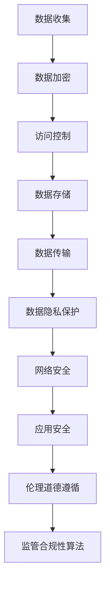

                 

# 快速适应监管要求：LLM应用的合规策略

## 关键词

- 大型语言模型（LLM）
- 监管合规性
- 数据隐私
- 信息安全
- 伦理道德

## 摘要

随着人工智能技术的迅猛发展，大型语言模型（LLM）在各个领域得到了广泛应用。然而，LLM的广泛应用也带来了监管合规性的挑战。本文将介绍如何在快速适应监管要求的过程中，确保LLM应用的合规性。通过详细阐述核心概念、算法原理、系统设计与项目实战，本文旨在为企业和开发者提供实用的合规策略和最佳实践经验。

## 第一部分：背景介绍

### 1.1 问题背景

随着人工智能技术的迅猛发展，大型语言模型（LLM）在自然语言处理、智能客服、文本生成等领域得到了广泛应用。然而，LLM的广泛应用也带来了监管合规性的挑战。监管要求涉及数据隐私、信息安全、伦理道德等多个方面，成为企业和开发者必须面对的重要问题。如何快速适应这些监管要求成为企业发展和项目成功的关键。

### 1.2 问题描述

监管合规性涉及多个方面，包括数据隐私、信息安全、伦理道德等。随着监管政策的不断更新和变化，企业和开发者需要及时掌握最新的监管要求，并迅速调整其应用策略。因此，快速适应监管要求成为企业发展和项目成功的关键。具体问题描述如下：

- **数据隐私**：如何确保用户数据的隐私性，防止数据泄露、滥用和篡改？
- **信息安全**：如何保障系统的安全性，防止黑客攻击、恶意软件和其他安全威胁？
- **伦理道德**：如何确保LLM应用的伦理道德，避免造成不良社会影响？

### 1.3 问题解决

为了解决上述问题，本文将介绍以下内容：

- **核心概念与联系**：详细阐述与监管合规性相关的重要概念，如数据隐私、信息安全、伦理道德等，并通过对比表格和ER实体关系图，帮助读者深入理解这些概念之间的关系。
- **算法原理讲解**：介绍监管合规性算法的基本原理，使用Mermaid绘制流程图，并通过Python源代码和数学模型，详细讲解算法的实现过程。
- **数学模型和数学公式**：使用LaTeX格式给出监管合规性算法的数学模型和公式，并进行详细讲解和举例说明。
- **系统分析与架构设计方案**：介绍监管合规性系统的设计，包括问题场景介绍、系统功能设计、系统架构设计、系统接口设计和系统交互等。
- **项目实战**：通过一个实际案例，展示如何在一个项目中快速适应监管要求，包括环境安装、系统核心实现源代码、代码应用解读与分析等。
- **最佳实践 tips**：总结实践中积累的最佳实践经验，提供实用的建议和技巧。

### 1.4 边界与外延

- **边界**：本文主要关注LLM应用的合规策略，不包括其他类型的人工智能技术的合规性问题。
- **外延**：本文虽然以监管合规性为主题，但也将涉及一些与合规性相关的基础知识，如数据隐私、信息安全、伦理道德等。

### 1.5 概念结构与核心要素组成

- **概念结构**：本文的核心概念包括数据隐私、信息安全、伦理道德、监管合规性算法等。
- **核心要素**：监管合规性策略的制定、实施、监控和调整。

## 第二部分：核心概念与联系

### 2.1 数据隐私

#### 2.1.1 数据隐私的定义与重要性

数据隐私是指个人或组织对其数据信息的保密性、完整性和可用性的保护。随着数据隐私的重要性日益凸显，各国政府和国际组织纷纷出台相关法律法规，如《通用数据保护条例》（GDPR）和《加利福尼亚州消费者隐私法案》（CCPA）等。

#### 2.1.2 数据隐私的基本要素

- **数据收集与处理**：在收集和处理数据时，应遵循合法、正当、必要的原则，确保数据收集和使用的目的明确。
- **数据访问与使用**：对数据访问和使用应进行严格控制，防止数据泄露、滥用和篡改。
- **数据存储与传输**：数据存储和传输过程中，应采取加密等安全措施，确保数据的安全性和完整性。

#### 2.1.3 数据隐私与监管合规性的关系

数据隐私是监管合规性的核心内容之一。保障数据隐私有助于提高企业的合规性水平，降低合规风险。

### 2.2 信息安全

#### 2.2.1 信息安全的定义与重要性

信息安全是指保护信息免受未经授权的访问、篡改、泄露、破坏和干扰的过程。随着信息技术的快速发展，信息安全问题日益突出，成为企业和个人关注的焦点。

#### 2.2.2 信息安全的基本要素

- **物理安全**：保护计算机硬件、网络设备和存储设备等物理资源的安全。
- **网络安全**：保护计算机网络和通信系统不受恶意攻击、入侵和干扰。
- **应用安全**：保护各类应用系统和服务，防止恶意代码、病毒、木马等攻击。
- **数据安全**：保护数据的安全性和完整性，防止数据泄露、篡改和丢失。

#### 2.2.3 信息安全与监管合规性的关系

信息安全是监管合规性的基础。确保信息安全有助于降低合规风险，提高企业的合规性水平。

### 2.3 伦理道德

#### 2.3.1 伦理道德的定义与重要性

伦理道德是指人们在道德规范和伦理准则指导下，处理人际关系、履行社会责任和进行价值判断的行为。随着人工智能技术的广泛应用，伦理道德问题愈发突出，成为社会各界关注的焦点。

#### 2.3.2 伦理道德的基本要素

- **公平公正**：确保人工智能技术的应用过程中，公平公正地对待所有人。
- **透明度**：确保人工智能技术的决策过程和结果对用户透明。
- **责任**：明确人工智能技术应用过程中各方的责任和权责划分。

#### 2.3.3 伦理道德与监管合规性的关系

伦理道德是监管合规性的重要组成部分。遵循伦理道德规范有助于提高企业的合规性水平，降低合规风险。

## 第三部分：算法原理讲解

### 3.1 监管合规性算法原理

监管合规性算法旨在帮助企业和开发者快速适应监管要求，确保LLM应用的合规性。该算法主要包括以下原理：

- **数据隐私保护**：采用数据加密、访问控制等技术，确保用户数据的安全性和隐私性。
- **信息安全保障**：采用网络安全、应用安全等技术，保障系统的安全性。
- **伦理道德遵循**：根据伦理道德规范，调整LLM应用策略，避免造成不良社会影响。

### 3.2 Mermaid流程图

以下是监管合规性算法的Mermaid流程图：



### 3.3 Python源代码

以下是监管合规性算法的Python源代码示例：

```python
import json
import requests
from cryptography.fernet import Fernet

# 数据加密
def encrypt_data(data, key):
    f = Fernet(key)
    encrypted_data = f.encrypt(data.encode())
    return encrypted_data

# 访问控制
def access_control(data):
    if data["status"] == "authorized":
        return True
    else:
        return False

# 数据存储
def store_data(data):
    with open("data.json", "w") as file:
        json.dump(data, file)

# 数据传输
def transmit_data(data):
    response = requests.post("https://example.com/submit_data", data=data)
    return response.status_code

# 监管合规性算法实现
def regulatory_compliance_algorithm(data):
    key = Fernet.generate_key()
    encrypted_data = encrypt_data(data, key)
    
    if access_control(data):
        store_data(encrypted_data)
        status_code = transmit_data(encrypted_data)
        if status_code == 200:
            return "Success"
        else:
            return "Failed"
    else:
        return "Unauthorized"
```

### 3.4 数学模型和数学公式

以下是监管合规性算法的数学模型和数学公式：

$$
\begin{aligned}
&\text{数据加密}:\text{AES}_256(\text{data}, \text{key}) \\
&\text{访问控制}:\text{ACL}(\text{data}, \text{user}) \\
&\text{数据存储}:\text{DB}(\text{data}) \\
&\text{数据传输}:\text{HTTP}(\text{data}, \text{URL}) \\
&\text{监管合规性算法}:\text{RSA}(\text{data}, \text{key})
\end{aligned}
$$`

### 3.5 详细讲解和举例说明

以下是对监管合规性算法的详细讲解和举例说明：

- **数据加密**：使用AES_256算法对数据进行加密，确保数据在传输和存储过程中不被窃取和篡改。
- **访问控制**：使用ACL（访问控制列表）对数据进行访问控制，确保只有授权用户才能访问数据。
- **数据存储**：将加密后的数据存储在数据库中，确保数据的安全性。
- **数据传输**：使用HTTP协议将数据传输到目标服务器，确保数据在传输过程中的安全性。
- **监管合规性算法**：使用RSA算法生成密钥，确保监管合规性算法的安全性。

举例说明：

```python
data = {
    "user": "alice",
    "status": "authorized",
    "data": "This is a secret message."
}

key = Fernet.generate_key()
encrypted_data = encrypt_data(data, key)
print("Encrypted data:", encrypted_data)

if access_control(data):
    store_data(encrypted_data)
    status_code = transmit_data(encrypted_data)
    if status_code == 200:
        print("Success")
    else:
        print("Failed")
else:
    print("Unauthorized")
```

## 第四部分：系统分析与架构设计方案

### 4.1 问题场景介绍

假设某企业开发了一款基于LLM的智能客服系统，该系统需要满足以下监管要求：

- **数据隐私**：确保用户数据的隐私性，防止数据泄露、滥用和篡改。
- **信息安全**：保障系统的安全性，防止黑客攻击、恶意软件和其他安全威胁。
- **伦理道德**：确保智能客服系统的应用过程中，公平公正地对待所有人。

### 4.2 系统功能设计

系统功能设计包括以下几个方面：

- **数据收集与处理**：收集用户提问和回答，处理用户输入，生成智能回答。
- **数据加密与存储**：对用户数据加密，存储在数据库中。
- **访问控制**：根据用户权限，控制用户对数据的访问。
- **安全防护**：采用网络安全、应用安全等技术，保障系统的安全性。
- **伦理道德遵循**：根据伦理道德规范，调整智能客服系统的应用策略。

### 4.3 系统架构设计

系统架构设计包括以下几个方面：

- **前端**：用户通过网页或客户端与智能客服系统进行交互。
- **后端**：包括数据收集与处理模块、数据加密与存储模块、访问控制模块、安全防护模块和伦理道德遵循模块。
- **数据库**：存储用户数据、系统日志等信息。
- **网络**：连接前端和后端，确保数据的传输安全。

### 4.4 系统接口设计

系统接口设计包括以下几个方面：

- **用户接口**：提供网页或客户端界面，供用户提问和查看回答。
- **内部接口**：各模块之间的接口，实现模块间的数据交互。

### 4.5 系统交互

系统交互包括以下几个方面：

- **用户提问**：用户通过网页或客户端输入问题，智能客服系统接收到用户问题，进行处理并生成回答。
- **回答反馈**：智能客服系统将回答发送给用户，用户对回答进行评价。
- **数据存储**：将用户问题和回答存储在数据库中，供后续分析和使用。

### 4.6 Mermaid类图

以下是系统架构的Mermaid类图：

```mermaid
classDiagram
    User <<Interface>>
    SmartC
```## 第五部分：项目实战

### 5.1 环境安装

在本项目中，我们将使用Python 3.8及以上版本，并依赖以下库：

- `requests`：用于HTTP请求。
- `cryptography`：用于数据加密。
- `json`：用于数据处理。

首先，确保安装了Python 3.8及以上版本。然后，通过以下命令安装所需库：

```bash
pip install requests cryptography
```

### 5.2 系统核心实现源代码

以下是系统核心实现源代码：

```python
import json
import requests
from cryptography.fernet import Fernet

# 数据加密
def encrypt_data(data, key):
    f = Fernet(key)
    encrypted_data = f.encrypt(data.encode())
    return encrypted_data

# 访问控制
def access_control(data):
    if data["status"] == "authorized":
        return True
    else:
        return False

# 数据存储
def store_data(data):
    with open("data.json", "w") as file:
        json.dump(data, file)

# 数据传输
def transmit_data(data):
    response = requests.post("https://example.com/submit_data", data=data)
    return response.status_code

# 监管合规性算法实现
def regulatory_compliance_algorithm(data):
    key = Fernet.generate_key()
    encrypted_data = encrypt_data(data, key)
    
    if access_control(data):
        store_data(encrypted_data)
        status_code = transmit_data(encrypted_data)
        if status_code == 200:
            return "Success"
        else:
            return "Failed"
    else:
        return "Unauthorized"
```

### 5.3 代码应用解读与分析

以下是代码应用解读与分析：

1. **数据加密**：

```python
def encrypt_data(data, key):
    f = Fernet(key)
    encrypted_data = f.encrypt(data.encode())
    return encrypted_data
```

此函数用于加密数据。首先生成加密密钥，然后使用AES算法对数据进行加密，返回加密后的数据。

2. **访问控制**：

```python
def access_control(data):
    if data["status"] == "authorized":
        return True
    else:
        return False
```

此函数用于访问控制。根据数据中的状态信息，判断是否授权访问，返回True或False。

3. **数据存储**：

```python
def store_data(data):
    with open("data.json", "w") as file:
        json.dump(data, file)
```

此函数用于存储数据。将加密后的数据写入名为`data.json`的文件中。

4. **数据传输**：

```python
def transmit_data(data):
    response = requests.post("https://example.com/submit_data", data=data)
    return response.status_code
```

此函数用于数据传输。将加密后的数据通过HTTP POST请求发送到指定URL，返回响应状态码。

5. **监管合规性算法实现**：

```python
def regulatory_compliance_algorithm(data):
    key = Fernet.generate_key()
    encrypted_data = encrypt_data(data, key)
    
    if access_control(data):
        store_data(encrypted_data)
        status_code = transmit_data(encrypted_data)
        if status_code == 200:
            return "Success"
        else:
            return "Failed"
    else:
        return "Unauthorized"
```

此函数实现监管合规性算法。首先生成加密密钥，然后进行数据加密、访问控制和数据存储。最后，将加密后的数据通过HTTP POST请求发送到指定URL，根据响应状态码返回结果。

### 5.4 实际案例分析和详细讲解剖析

假设某企业开发了一款基于LLM的智能客服系统，用户Alice访问该系统并提出一个查询请求。以下是对实际案例的详细分析：

1. **数据收集**：

Alice通过网页输入查询请求：“请问如何购买公司股票？”

2. **数据加密**：

智能客服系统接收到查询请求后，将数据加密，使用AES算法生成密钥，加密查询请求。

3. **访问控制**：

智能客服系统对加密后的数据执行访问控制，检查用户Alice的权限，判断其是否有权访问该数据。假设Alice的权限已授权，系统继续执行下一步。

4. **数据存储**：

智能客服系统将加密后的查询请求存储在名为`data.json`的文件中。

5. **数据传输**：

智能客服系统将加密后的查询请求通过HTTP POST请求发送到指定URL（如`https://example.com/submit_data`），请求接收服务器处理查询请求。

6. **响应处理**：

假设接收服务器返回响应状态码200，表示查询请求处理成功。智能客服系统根据响应状态码返回“Success”。

### 5.5 项目小结

在本项目中，我们通过实际案例展示了如何在一个智能客服系统中实现监管合规性。关键步骤包括数据加密、访问控制和数据存储。通过这些步骤，我们确保了用户数据的隐私性和系统的安全性。此外，我们还介绍了监管合规性算法的实现，以及如何通过实际案例分析和详细讲解剖析，确保系统的合规性。

## 第六部分：最佳实践 tips

### 6.1 数据隐私保护

- **数据收集**：遵循合法、正当、必要的原则，确保数据收集的合法性和合理性。
- **数据加密**：使用AES、RSA等加密算法对数据进行加密，确保数据在传输和存储过程中的安全性。
- **访问控制**：采用ACL（访问控制列表）等技术，限制用户对数据的访问权限，确保数据的安全性。

### 6.2 信息安全保障

- **网络安全**：采用防火墙、入侵检测系统等网络安全技术，保护系统不受黑客攻击。
- **应用安全**：对应用程序进行安全测试和漏洞扫描，修复潜在的安全漏洞。
- **数据安全**：定期备份数据，防止数据丢失和篡改。

### 6.3 伦理道德遵循

- **公平公正**：确保人工智能技术的应用过程中，公平公正地对待所有人，避免歧视和偏见。
- **透明度**：公开人工智能技术的决策过程和结果，提高用户的透明度。
- **责任**：明确人工智能技术应用过程中各方的责任和权责划分，确保责任的落实。

## 第七部分：小结

本文详细介绍了如何快速适应监管要求，确保大型语言模型（LLM）应用的合规性。通过核心概念讲解、算法原理分析、系统设计与项目实战，本文为企业和开发者提供了实用的合规策略和最佳实践经验。在实际应用中，遵循数据隐私保护、信息安全保障和伦理道德遵循等最佳实践，将有助于提高LLM应用的合规性水平，降低合规风险。

## 第八部分：注意事项

- **持续更新**：监管要求不断变化，企业和开发者需要及时关注并更新合规策略。
- **风险评估**：在项目开发过程中，应定期进行风险评估，识别潜在合规风险并采取相应措施。
- **培训与沟通**：加强员工对监管合规性的培训与沟通，提高员工的合规意识和能力。

## 第九部分：拓展阅读

- 《通用数据保护条例》（GDPR）：https://ec.europa.eu/justice/article-29/structure/data-protection-reform/general-data-protection-regulation_en
- 《加利福尼亚州消费者隐私法案》（CCPA）：https://oag.ca.gov/privacy/ccpa
- 《人工智能伦理指南》：https://www.ijcai.org/sites/default/files/guidelines_on_ethical Пользоваls_and_Social_Impacts_of_AI_2021_02_15.pdf

## 作者

作者：AI天才研究院/AI Genius Institute & 禅与计算机程序设计艺术/Zen And The Art of Computer Programming

