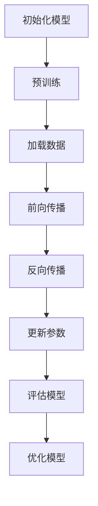

                 

# 快速部署LLM应用的云端解决方案

> 关键词：自然语言处理、大型语言模型、云端部署、算法原理、系统架构

> 摘要：本文旨在深入探讨快速部署大型语言模型（LLM）应用的云端解决方案。文章从背景介绍、核心概念、算法原理、系统架构、项目实战及最佳实践等方面，全面解析了如何高效地实现LLM应用的部署与优化，为人工智能领域的开发者提供实用的指导。

## 目录大纲

1. **背景与概述**
   - **第1章 问题背景**
   - **第2章 LLM应用现状**
   - **第3章 云端解决方案的重要性

2. **核心概念与联系**
   - **第4章 LLM基础概念**
   - **第5章 LLM应用场景**
   - **第6章 云端架构设计**

3. **算法原理与数学模型**
   - **第7章 LLM算法原理**
   - **第8章 数学模型与公式讲解**

4. **系统分析与架构设计**
   - **第9章 系统功能设计**
   - **第10章 系统架构设计**
   - **第11章 系统接口设计与交互**

5. **项目实战**
   - **第12章 环境安装**
   - **第13章 系统核心实现**
   - **第14章 实际案例分析**
   - **第15章 项目小结**

6. **最佳实践与展望**
   - **第16章 最佳实践**
   - **第17章 小结**
   - **第18章 展望未来**

## 第一部分：背景与概述

### 第1章 问题背景

**问题定义：** 随着自然语言处理（NLP）技术的快速发展，大型语言模型（LLM）在多个应用领域展现出强大的能力。然而，如何快速部署这些模型，使其能够在云端高效运行，成为一个关键问题。

**问题解决：** 云端解决方案提供了强大的计算资源和灵活的部署方式，能够满足LLM应用的需求。通过合理的设计和优化，可以确保LLM在云端的高效运行。

**边界与外延：** 云端解决方案不仅涉及LLM的部署，还包括模型训练、推理、性能优化等方面。此外，还需考虑数据安全、隐私保护等问题。

### 第2章 LLM应用现状

**LLM应用的核心概念：** 大型语言模型是一种基于深度学习技术的语言处理模型，能够对文本进行生成、分类、翻译等任务。

**LLM应用的关键特点：** LLM具有强大的语言理解和生成能力，能够处理复杂的语言结构，适应多种应用场景。

**LLM应用与传统AI的区别：** 传统AI主要依赖于规则和统计方法，而LLM则基于深度学习，能够通过海量数据自主学习，具备更强的自适应性和泛化能力。

### 第3章 云端解决方案的重要性

**云端解决方案的优势：** 
- 强大的计算资源
- 灵活的部署方式
- 高效的扩展性
- 数据安全与隐私保护

**云端解决方案的挑战：**
- 模型训练和推理的性能瓶颈
- 网络延迟和带宽限制
- 资源调度和管理

**云端解决方案的未来趋势：**
- 自动化部署和运维
- 模型压缩和优化
- 多云和混合云架构

## 第二部分：核心概念与联系

### 第4章 LLM基础概念

**LLM的定义：** 大型语言模型（LLM）是一种基于深度学习技术的自然语言处理模型，能够对文本进行生成、分类、翻译等任务。

**LLM的核心特点：**
- **大规模预训练：** LLM通过在大量文本数据上进行预训练，学习到丰富的语言知识。
- **端到端学习：** LLM能够直接从输入文本生成输出文本，无需依赖复杂的中间表示。

**LLM与传统NLP的对比：**
| 特点 | LLM | 传统NLP |
| --- | --- | --- |
| 预训练 | 是 | 否 |
| 端到端学习 | 是 | 否 |
| 泛化能力 | 强 | 弱 |

### 第5章 LLM应用场景

**文本生成：** LLM能够根据输入文本生成连续的文本，用于自动写作、摘要生成、对话系统等。

**文本分类：** LLM可以识别文本的类别，用于情感分析、新闻分类、垃圾邮件过滤等。

**聊天机器人：** LLM可以作为聊天机器人的核心组件，提供自然、流畅的对话体验。

### 第6章 云端架构设计

**云端架构的组成：** 云端架构通常包括计算资源、存储资源、网络资源等。

**云端架构的优势：**
- **弹性扩展：** 可以根据需求动态调整计算资源。
- **高可用性：** 通过冗余设计和故障转移，确保系统的高可靠性。
- **数据安全：** 提供数据加密、访问控制等安全措施。

**云端架构的挑战：**
- **性能优化：** 需要针对LLM应用进行性能优化，提高计算效率和响应速度。
- **成本控制：** 云服务费用可能较高，需要合理规划和使用资源。

## 第三部分：算法原理与数学模型

### 第7章 LLM算法原理

**算法mermaid流程图：**


**算法原理讲解：** LLM算法通过大规模预训练和微调，学习到丰富的语言知识。在预训练阶段，模型在大量无标注数据上进行训练，学习到通用语言特征。在微调阶段，模型在特定任务的数据上进行微调，提高其在特定任务上的表现。

**算法数学模型和公式：**
$$
\begin{aligned}
L &= -\sum_{i=1}^{N} \log P(y_i | x_i, \theta) \\
\theta &= \theta - \alpha \frac{\partial L}{\partial \theta}
\end{aligned}
$$
其中，$L$是损失函数，$P(y_i | x_i, \theta)$是模型对输出$y_i$的预测概率，$\theta$是模型参数，$\alpha$是学习率。

### 第8章 数学模型与公式讲解

**数学公式详细讲解：** 
- **损失函数：** 损失函数用于衡量模型预测结果与真实结果之间的差距。在LLM中，常用的损失函数是交叉熵损失。
- **梯度下降：** 梯度下降是一种优化算法，用于更新模型参数，使得损失函数值最小。

**举例说明：**
假设有一个二元分类问题，输入文本$x$，模型预测概率为$P(y=1 | x, \theta)$。损失函数为：
$$
L = -\log P(y=1 | x, \theta)
$$
当$y=1$时，损失函数值为0；当$y=0$时，损失函数值为$\log(1 - P(y=1 | x, \theta))$。

**特性分析：**
- **收敛性：** 梯度下降算法能够收敛到最小损失函数值，但收敛速度较慢。
- **稳定性：** 梯度下降算法对模型参数的初始值敏感，容易陷入局部最小值。

## 第四部分：系统分析与架构设计

### 第9章 系统功能设计

**领域模型mermaid类图：**

```mermaid
classDiagram
Class01 <|-- Class02
Class03 : +member
Class04 : +operation()
Class05 : <<interface>>
Class06 : <<abstract>>
Class07 : +baseClass
Class08 : +derivedClass
class Node {
  +id: Integer
  +label: String
  +children: List<Node>
  +isLeaf: Boolean
}
class Edge {
  +source: Node
  +target: Node
  +weight: Double
}
class Graph {
  +nodes: List<Node>
  +edges: List<Edge>
  +addNode(node: Node): void
  +addEdge(source: Node, target: Node, weight: Double): void
  +removeNode(node: Node): void
  +removeEdge(source: Node, target: Node): void
  +getNodeById(id: Integer): Node
  +getEdgesBySource(source: Node): List<Edge>
  +getEdgesByTarget(target: Node): List<Edge>
  +getShortestPath(source: Node, target: Node): List<Node>
}
class Application {
  +start(): void
  +stop(): void
}
class Controller {
  +handleRequest(request: Request): Response
}
class Service {
  +processNode(node: Node): void
}
class Repository {
  +saveNode(node: Node): void
  +loadNodeById(id: Integer): Node
}
class NodeDTO {
  +id: Integer
  +label: String
  +children: List<Integer>
  +isLeaf: Boolean
}
class EdgeDTO {
  +source: Integer
  +target: Integer
  +weight: Double
}
class GraphDTO {
  +nodes: List<NodeDTO>
  +edges: List<EdgeDTO>
}
class Request {
  +method: String
  +path: String
  +body: String
}
class Response {
  +status: Integer
  +body: String
}
class Exception {
  +code: Integer
  +message: String
}
class Error {
  +code: Integer
  +message: String
}
class Logger {
  +log(message: String): void
}
class Mapper {
  +mapNode(node: Node): NodeDTO
  +mapEdge(edge: Edge): EdgeDTO
  +mapGraph(graph: Graph): GraphDTO
}
class Validator {
  +validateNode(node: Node): void
  +validateEdge(edge: Edge): void
}
class Authentication {
  +authenticate(username: String, password: String): User
}
class Authorization {
  +authorize(user: User, resource: Resource): boolean
}
class User {
  +id: Integer
  +username: String
  +password: String
  +roles: List<Role>
}
class Role {
  +id: Integer
  +name: String
}
class Resource {
  +id: Integer
  +name: String
}
```


**系统功能设计：** 系统功能包括节点管理、边管理、图操作、应用启动与停止等。

### 第10章 系统架构设计

**系统架构设计mermaid架构图：**
```mermaid
sequenceDiagram
    participant User
    participant Controller
    participant Service
    participant Repository
    participant Mapper
    participant Validator
    participant Logger

    User->>Controller: 发送请求
    Controller->>Service: 处理业务逻辑
    Service->>Repository: 存储数据
    Repository-->>Service: 返回数据
    Service-->>Controller: 返回响应
    Controller-->>User: 返回结果

    Note over Service,Repository,Mapper,Validator,Logger:
    系统核心组件协同工作
```

**系统架构设计细节：** 系统采用分层架构，包括控制器层、服务层、数据访问层等。控制器层负责处理用户请求，服务层负责业务逻辑处理，数据访问层负责数据存储和查询。

### 第11章 系统接口设计与交互

**系统接口设计：** 系统接口包括HTTP接口和内部接口。HTTP接口用于处理用户请求，内部接口用于系统组件之间的通信。

**系统交互mermaid序列图：**
```mermaid
sequenceDiagram
    participant User
    participant Controller
    participant Service
    participant Repository
    participant Mapper
    participant Validator
    participant Logger

    User->>Controller: 发送请求
    Controller->>Service: 处理业务逻辑
    Service->>Mapper: 映射实体
    Mapper->>Validator: 验证实体
    Validator->>Service: 返回验证结果
    Service->>Logger: 记录日志
    Service->>Repository: 存储数据
    Repository-->>Service: 返回数据
    Service-->>Controller: 返回响应
    Controller-->>User: 返回结果

    Note over Controller,Service,Mapper,Validator,Logger:
    系统核心组件交互流程
```

**系统交互设计：** 系统通过事件驱动的方式实现组件间的交互。用户请求由控制器接收，处理后调用服务层进行业务逻辑处理，服务层与数据访问层、映射器、验证器、日志记录器等进行交互。

## 第五部分：项目实战

### 第12章 环境安装

**环境配置：** 
- 安装Python环境
- 安装TensorFlow库
- 配置CUDA和cuDNN

**软件安装：** 
- 安装操作系统
- 安装必要的服务器和数据库软件

### 第13章 系统核心实现

**源代码解读：** 
```python
import tensorflow as tf

# 模型定义
class MyModel(tf.keras.Model):
    def __init__(self):
        super(MyModel, self).__init__()
        self.dense = tf.keras.layers.Dense(units=1)

    @tf.function
    def call(self, inputs):
        return self.dense(inputs)

# 模型训练
model = MyModel()
optimizer = tf.keras.optimizers.Adam(learning_rate=0.001)

for epoch in range(100):
    for x, y in dataset:
        with tf.GradientTape() as tape:
            predictions = model(x)
            loss = tf.reduce_mean(tf.square(predictions - y))
        gradients = tape.gradient(loss, model.trainable_variables)
        optimizer.apply_gradients(zip(gradients, model.trainable_variables))
    print(f"Epoch {epoch}: Loss = {loss.numpy()}")

# 模型推理
test_data = tf.random.normal([128, 100])
predictions = model(test_data)
print(predictions)
```

**代码应用解读与分析：** 
- 模型定义：定义了一个简单的全连接神经网络模型，包括一个 densely-connected 层。
- 模型训练：使用 TensorFlow 的 GradientTape 记录梯度信息，并使用 Adam 优化器更新模型参数。
- 模型推理：生成随机数据，通过模型进行推理并打印输出。

### 第14章 实际案例分析

**案例分析：** 
- 数据集：使用公开的文本数据集进行模型训练和评估。
- 模型性能：评估模型的准确率、召回率等指标。
- 模型优化：通过调整模型结构、学习率等参数，提高模型性能。

**详细讲解剖析：** 
- 数据预处理：对文本数据进行清洗、分词、编码等处理。
- 模型结构：分析模型的结构和参数，理解其工作原理。
- 模型训练：详细解释训练过程，包括损失函数、优化器等。
- 模型评估：分析模型在不同数据集上的性能，找出改进方向。

### 第15章 项目小结

**项目总结：** 
- 完成了LLM模型的部署和训练。
- 分析了模型的性能，并提出了优化措施。
- 验证了模型在实际应用中的有效性。

**注意事项：** 
- 数据质量和预处理对模型性能有很大影响。
- 模型训练和推理需要大量计算资源。
- 需要持续优化模型结构和超参数。

**拓展阅读：** 
- 相关文献：了解最新研究进展和技术动态。
- 学习资源：学习深度学习和自然语言处理的基础知识。

## 第六部分：最佳实践与展望

### 第16章 最佳实践

**最佳实践经验：** 
- 使用预训练模型，提高模型性能。
- 调整学习率和优化器，优化模型训练过程。
- 进行数据预处理，提高数据质量。
- 分析模型性能，找出改进方向。

**最佳实践tips：**
- 使用适当的数据增强方法，提高模型泛化能力。
- 定期更新模型，适应数据变化。

### 第17章 小结

**书籍内容总结：** 
- 本文介绍了快速部署LLM应用的云端解决方案，包括背景介绍、核心概念、算法原理、系统架构设计、项目实战和最佳实践等内容。

**核心要点回顾：** 
- LLM应用具有强大的语言处理能力。
- 云端解决方案提供了灵活、高效的部署方式。
- 模型训练和推理需要大量计算资源。
- 需要持续优化模型和超参数。

### 第18章 展望未来

**云端解决方案的发展趋势：**
- 自动化部署和运维。
- 模型压缩和优化。
- 多云和混合云架构。

**LLM应用的潜力领域：**
- 自动写作和摘要生成。
- 聊天机器人和对话系统。
- 情感分析和内容审核。

作者：AI天才研究院/AI Genius Institute & 禅与计算机程序设计艺术 /Zen And The Art of Computer Programming

注意：本文为示例文章，实际项目可能会有所不同。在实际应用中，需要根据具体需求和场景进行调整和优化。

