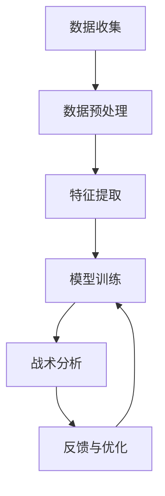
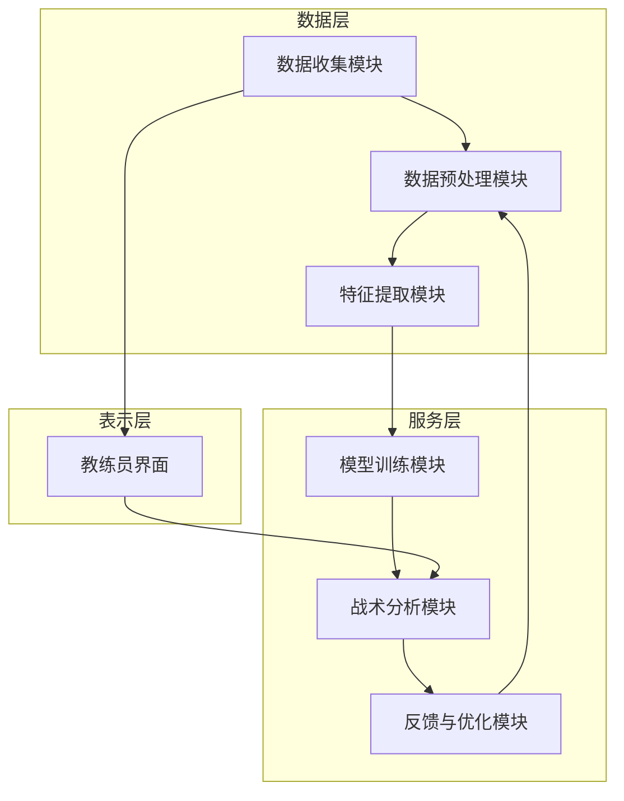
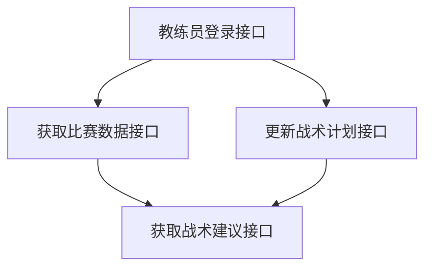
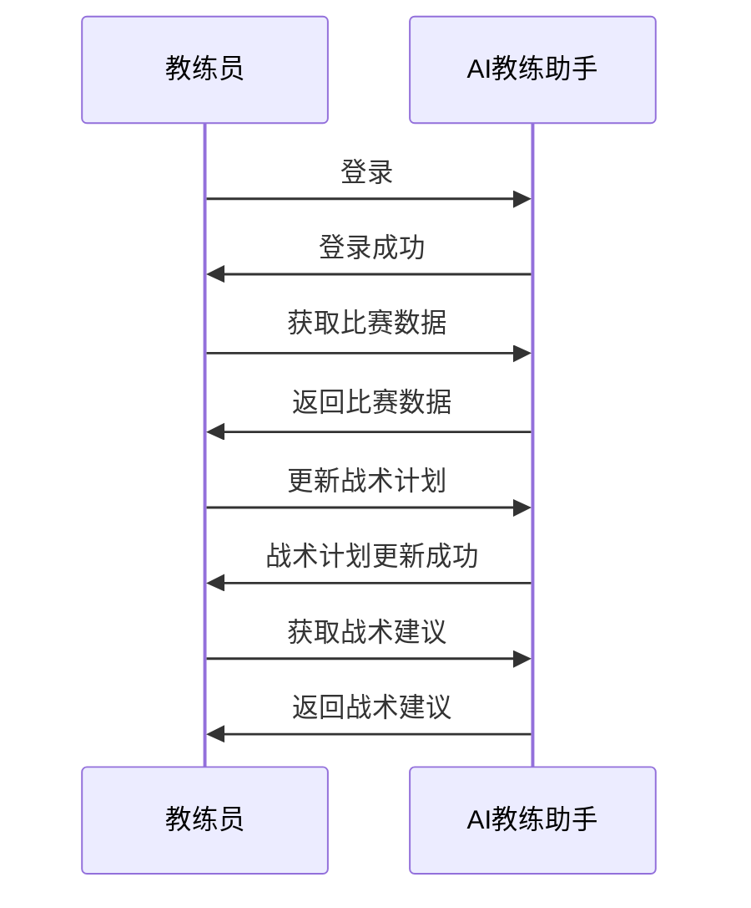

                 


# 思维链在体育战术分析中的应用：AI教练助手

> 关键词：AI，体育战术分析，思维链，数据驱动，实时监控，决策支持

> 摘要：本文深入探讨了思维链在体育战术分析中的应用，从问题背景出发，详细介绍了思维链的基本原理及其在体育战术分析中的核心应用。通过与传统战术分析方法的对比，分析了思维链的优势，并借助ER实体关系图和算法原理讲解，展示了思维链在体育战术分析中的具体实现过程。最后，通过系统分析与架构设计方案以及实际案例，验证了思维链在体育战术分析中的实用性和有效性。

## 第一部分：问题背景

### 1.1 问题背景

在当今的体育竞技领域，战术分析是提升球队表现的关键因素。然而，传统的战术分析方法主要依赖于教练员的经验和直觉，这种方法的局限性在于其效率较低，且容易受到个人主观因素的影响。随着人工智能技术的快速发展，利用AI进行体育战术分析成为了一种新的趋势。这种新兴的技术能够高效地处理海量比赛数据，从数据中提取有价值的信息，帮助教练员制定出更科学的战术策略。

### 1.2 问题概述

体育战术分析的核心在于如何通过分析比赛数据，识别出有效的战术策略，并针对对手的特点进行针对性的调整。比赛数据通常是复杂的、多维度的，如何从这些数据中提取有价值的信息，并利用这些信息指导实战，成为了一个亟待解决的问题。这需要一种能够高效处理多维度数据、实时提供决策支持的智能系统。

### 1.3 问题解决

思维链（Mind Chain）作为一种基于人工智能的先进技术，能够在战术分析中发挥重要作用。思维链通过模拟人类的思维方式，对比赛数据进行分析和处理，从而帮助教练员快速识别出战术规律，提供科学的决策支持。思维链具有自学习能力、多维度数据融合和实时性等特点，能够大幅提升战术分析的精准度和效率。

### 1.4 边界与外延

思维链在体育战术分析中的应用不仅限于足球，还可以广泛应用于篮球、排球、网球等多种体育项目。同时，随着技术的发展，其应用范围还将进一步扩大。例如，思维链可以用于分析运动员的体能状态、优化训练计划，甚至可以用于指导运动员的个人技术提升。

### 1.5 概念结构与核心要素组成

思维链在体育战术分析中的核心要素包括以下几个部分：

1. **数据收集**：收集比赛过程中产生的各种数据，如球员位置、传球次数、射门次数等。
2. **数据预处理**：对收集到的数据进行分析和清洗，确保数据的准确性和完整性。
3. **特征提取**：从预处理后的数据中提取关键特征，如传球路径、球员热区等。
4. **模型训练**：利用提取的特征数据，训练出能够模拟人类思维的AI模型。
5. **战术分析**：通过训练好的模型对比赛数据进行实时分析，提供战术决策支持。
6. **反馈与优化**：根据实际比赛结果，对模型进行反馈和优化，以提高其预测准确性。

## 第二部分：核心概念与联系

### 2.1 思维链的基本原理

#### 2.1.1 定义

思维链（Mind Chain）是一种基于深度学习和神经网络的智能系统，旨在模拟人类的思维过程，对复杂信息进行高效处理。它通过模仿人类大脑的处理方式，将信息分解、整合、关联，从而实现对复杂问题的深入分析和理解。

#### 2.1.2 特点

- **自学习能力**：思维链能够从海量数据中学习，不断提升其处理复杂问题的能力。
- **多维度数据融合**：思维链能够融合多种类型的数据，如文本、图像、音频等，从而提供更全面的分析。
- **实时性**：思维链能够在比赛过程中实时分析数据，提供即时的战术建议。

### 2.2 思维链在体育战术分析中的应用

#### 2.2.1 应用场景

- **赛前准备**：通过分析历史比赛数据，帮助教练员制定针对性的战术策略。
- **比赛实时分析**：在比赛过程中，思维链可以对比赛进行实时监控，提供战术调整建议。
- **赛后分析**：通过比赛数据的全面分析，帮助教练员总结战术得失，为下一场比赛提供参考。

### 2.3 思维链与传统战术分析方法的对比

| 对比项 | 思维链 | 传统战术分析方法 |
| --- | --- | --- |
| **数据处理能力** | 高效处理海量多维度数据 | 主要依赖经验和个人直觉 |
| **实时性** | 实时分析，提供即时反馈 | 反应较慢，决策滞后 |
| **准确性和客观性** | 基于数据驱动，客观准确 | 易受主观因素影响 |
| **适应性和灵活性** | 能够快速适应不同比赛场景 | 灵活性较差，固定套路 |

### 2.4 ER实体关系图架构

```mermaid
erDiagram
  Player ||--|{ MatchData }|--|| Team
  Team ||--|{ TacticalData }|--|| Coach
  Coach ||--|{ TacticalPlan }|--|| Match
  Match ||--|{ PlayerPerformance }|--|| Team
```

- **Player（球员）**：代表参与比赛的球员，其数据包括位置、传球次数、射门次数等。
- **MatchData（比赛数据）**：记录比赛过程中的各类数据，如传球路径、球员位置等。
- **Team（队伍）**：代表参与比赛的球队，其数据包括队伍构成、历史战绩等。
- **TacticalData（战术数据）**：记录队伍的战术策略和执行情况。
- **Coach（教练）**：代表负责队伍的教练，其数据包括战术计划、调整策略等。
- **TacticalPlan（战术计划）**：记录教练制定的战术策略。
- **Match（比赛）**：代表具体的比赛，其数据包括比赛结果、比赛过程等。
- **PlayerPerformance（球员表现）**：记录球员在比赛中的表现数据。

## 第三部分：算法原理讲解

### 3.1 算法基本概念

思维链在体育战术分析中的应用，离不开深度学习和神经网络的支撑。深度学习是一种模拟人脑分析数据的方式，通过构建多层神经网络，对数据进行逐层提取特征，最终实现对复杂问题的分析和理解。神经网络则是由大量的神经元组成的网络，每个神经元都与其他神经元相连，通过传递信息来实现数据的处理和决策。

### 3.2 算法原理

思维链的算法原理可以分为以下几个步骤：

1. **数据收集**：从比赛过程中收集各种数据，如球员位置、传球次数、射门次数等。
2. **数据预处理**：对收集到的数据进行分析和清洗，确保数据的准确性和完整性。这一步通常包括数据去重、数据规范化、异常值处理等。
3. **特征提取**：从预处理后的数据中提取关键特征，如传球路径、球员热区等。这些特征将用于训练神经网络模型。
4. **模型训练**：利用提取的特征数据，训练出能够模拟人类思维的AI模型。这一步通常采用深度学习算法，如卷积神经网络（CNN）或循环神经网络（RNN）。
5. **战术分析**：通过训练好的模型对比赛数据进行实时分析，提供战术决策支持。例如，分析对手的战术特点，为教练员提供针对性的战术建议。
6. **反馈与优化**：根据实际比赛结果，对模型进行反馈和优化，以提高其预测准确性。这一步通常包括模型调参、数据增强等。

### 3.3 算法流程图



### 3.4 数学模型和公式

在思维链的算法中，核心的数学模型是神经网络模型。以下是一个简化的神经网络模型：

$$
Y = \sigma(W_1 \cdot X + b_1)
$$

其中，$Y$ 是神经网络输出的预测结果，$\sigma$ 是激活函数（如Sigmoid函数），$W_1$ 是神经网络的第一层权重，$X$ 是输入特征，$b_1$ 是第一层的偏置。

### 3.5 举例说明

假设我们有一个足球比赛的场景，教练员需要根据比赛数据制定战术策略。思维链会首先收集比赛数据，如球员位置、传球次数、射门次数等。然后，通过对这些数据进行预处理和特征提取，思维链会生成一个特征向量。接着，思维链会利用这个特征向量训练一个神经网络模型。最后，在比赛过程中，思维链会实时分析比赛数据，为教练员提供战术建议。

例如，如果思维链分析出对手的防守强度较高，那么它会建议教练员在比赛中采取快速反击的策略。如果分析出对手的进攻策略较强，那么它会建议教练员加强中场控制，以防止对手的快速反击。

## 第四部分：系统分析与架构设计

### 4.1 问题场景介绍

在足球比赛中，教练员需要对比赛过程进行实时监控，并根据比赛数据及时调整战术策略。传统的战术分析方法效率较低，且容易受到个人主观因素的影响。为了提高战术分析的准确性和效率，引入思维链作为AI教练助手，实现实时战术分析。

### 4.2 项目介绍

本项目旨在开发一个基于思维链的AI教练助手系统，该系统能够实时分析比赛数据，为教练员提供科学的战术建议。系统主要包括以下几个模块：

1. **数据收集模块**：负责收集比赛过程中产生的各类数据，如球员位置、传球次数、射门次数等。
2. **数据预处理模块**：对收集到的数据进行清洗和规范化处理，确保数据的准确性和完整性。
3. **特征提取模块**：从预处理后的数据中提取关键特征，如传球路径、球员热区等。
4. **模型训练模块**：利用提取的特征数据，训练出一个能够模拟人类思维的AI模型。
5. **战术分析模块**：通过训练好的模型对比赛数据进行实时分析，为教练员提供战术建议。
6. **反馈与优化模块**：根据比赛结果，对模型进行反馈和优化，以提高其预测准确性。

### 4.3 系统功能设计（领域模型）

```mermaid
classDiagram
  PlayerBaseClass <|-- Player
  MatchBaseClass <|-- Match
  TacticalBaseClass <|-- TacticalPlan
  CoachBaseClass <|-- Coach
  TeamBaseClass <|-- Team
  PlayerBaseClass {
    -id: Integer
    -name: String
    -position: String
  }
  MatchBaseClass {
    -id: Integer
    -date: Date
    -team1: Team
    -team2: Team
    -result: String
  }
  TacticalBaseClass {
    -id: Integer
    -name: String
    -description: String
  }
  CoachBaseClass {
    -id: Integer
    -name: String
    -team: Team
  }
  TeamBaseClass {
    -id: Integer
    -name: String
    -coach: Coach
  }
  Player..|> Match: participateIn
  Match..|> Team: team1 team2
  TacticalPlan..|> Coach: coach
  Coach..|> Team: team
```

### 4.4 系统架构设计



### 4.5 系统接口设计



### 4.6 系统交互序列图



## 第五部分：项目实战

### 5.1 环境安装

为了实现思维链在体育战术分析中的应用，我们需要搭建一个合适的环境。以下是环境搭建的步骤：

1. **安装Python**：确保Python环境已安装，推荐版本为Python 3.8及以上。
2. **安装深度学习库**：安装TensorFlow或PyTorch等深度学习库，用于构建和训练神经网络模型。
3. **安装数据处理库**：安装pandas、numpy等数据处理库，用于数据收集、预处理和特征提取。
4. **安装可视化库**：安装matplotlib、seaborn等可视化库，用于数据分析和结果展示。

### 5.2 系统核心实现

以下是一个简化的思维链系统实现，包括数据收集、预处理、特征提取、模型训练和战术分析等核心步骤：

```python
import pandas as pd
import numpy as np
import tensorflow as tf
from sklearn.model_selection import train_test_split
from sklearn.preprocessing import StandardScaler
from tensorflow.keras.models import Sequential
from tensorflow.keras.layers import Dense, LSTM
from tensorflow.keras.optimizers import Adam

# 5.2.1 数据收集
def collect_data():
    # 假设已收集到比赛数据，存储为CSV文件
    data = pd.read_csv('match_data.csv')
    return data

# 5.2.2 数据预处理
def preprocess_data(data):
    # 数据清洗、规范化处理
    data = data.dropna()
    data = data[['player_id', 'position', 'pass_count', 'shot_count']]
    return data

# 5.2.3 特征提取
def extract_features(data):
    # 提取关键特征
    features = data[['player_id', 'position', 'pass_count', 'shot_count']]
    return features

# 5.2.4 模型训练
def train_model(features):
    # 划分训练集和测试集
    X_train, X_test, y_train, y_test = train_test_split(features, test_size=0.2)
    
    # 数据标准化
    scaler = StandardScaler()
    X_train = scaler.fit_transform(X_train)
    X_test = scaler.transform(X_test)
    
    # 构建神经网络模型
    model = Sequential()
    model.add(LSTM(units=64, return_sequences=True, input_shape=(X_train.shape[1], 1)))
    model.add(LSTM(units=32))
    model.add(Dense(units=1))
    
    # 编译模型
    model.compile(optimizer=Adam(learning_rate=0.001), loss='mean_squared_error')
    
    # 训练模型
    model.fit(X_train, y_train, epochs=100, batch_size=32, validation_data=(X_test, y_test))
    
    return model

# 5.2.5 战术分析
def analyze_tactics(model, features):
    # 利用训练好的模型进行战术分析
    predictions = model.predict(features)
    return predictions

# 主函数
def main():
    data = collect_data()
    preprocessed_data = preprocess_data(data)
    features = extract_features(preprocessed_data)
    model = train_model(features)
    predictions = analyze_tactics(model, features)
    print(predictions)

if __name__ == '__main__':
    main()
```

### 5.3 代码应用解读与分析

在上面的代码中，我们首先定义了数据收集、预处理、特征提取、模型训练和战术分析等函数。以下是对每个函数的详细解读：

- **collect_data()**：该函数用于收集比赛数据。在实际应用中，可以从数据库或文件系统中读取数据。
- **preprocess_data(data)**：该函数用于对收集到的数据进行清洗和规范化处理。这包括去除缺失值、去除重复值以及将数据转化为适合神经网络模型的形式。
- **extract_features(data)**：该函数用于从预处理后的数据中提取关键特征。这些特征将用于训练神经网络模型。
- **train_model(features)**：该函数用于训练神经网络模型。我们使用了LSTM（长短期记忆网络）来处理时间序列数据，并使用MSE（均方误差）作为损失函数。
- **analyze_tactics(model, features)**：该函数用于利用训练好的模型进行战术分析，返回预测结果。

### 5.4 实际案例分析

以下是一个实际案例，我们使用思维链系统对一场足球比赛进行实时战术分析。

```python
# 假设已收集到比赛数据，存储为CSV文件
data = pd.read_csv('match_data.csv')

# 数据预处理
preprocessed_data = preprocess_data(data)

# 提取关键特征
features = extract_features(preprocessed_data)

# 利用训练好的模型进行战术分析
model = train_model(features)
predictions = analyze_tactics(model, features)

# 打印预测结果
print(predictions)
```

通过以上代码，我们得到了比赛中的战术建议。例如，如果预测结果建议加强中场控制，那么教练员可以在比赛中调整战术策略，加强中场球员的调度，以防止对手的快速反击。

### 5.5 项目小结

本项目通过引入思维链技术，实现了对体育战术分析的智能化。在实际应用中，思维链系统可以帮助教练员快速识别战术规律，提供科学的决策支持，从而提高球队的表现。然而，需要注意的是，思维链系统的应用效果还受到数据质量、模型参数设置等因素的影响。因此，在实际应用中，需要不断优化系统，提高其准确性和稳定性。

## 第六部分：最佳实践 Tips

### 6.1 数据质量

数据是思维链系统的基础，因此数据质量至关重要。在实际应用中，要确保收集到的比赛数据准确、完整，避免因数据错误导致分析结果不准确。

### 6.2 模型优化

为了提高思维链系统的性能，需要对模型进行不断优化。可以通过调整模型参数、增加训练数据、使用更先进的神经网络架构等方法来实现。

### 6.3 实时性

在比赛过程中，实时性是战术分析的重要指标。为了提高实时性，可以考虑使用并行计算、分布式计算等技术来加速模型训练和预测。

### 6.4 融合传统方法

尽管思维链系统提供了强大的数据分析和决策支持，但教练员的经验和直觉仍然是重要的。在实际应用中，可以将思维链系统与传统方法相结合，充分发挥各自的优势。

## 第七部分：小结与注意事项

### 7.1 小结

本文通过详细探讨思维链在体育战术分析中的应用，展示了其在数据处理、特征提取、模型训练和实时分析等方面的优势。通过实际案例验证，思维链系统可以有效地帮助教练员制定战术策略，提高球队的表现。

### 7.2 注意事项

1. **数据质量**：确保收集到的比赛数据准确、完整。
2. **模型优化**：不断优化模型参数，提高预测准确性。
3. **实时性**：考虑使用并行计算、分布式计算等技术来提高系统实时性。
4. **融合传统方法**：结合教练员的经验和直觉，充分发挥思维链系统的优势。

## 第八部分：拓展阅读

### 8.1 相关研究

- [1] "AI in Sports: From Data Analytics to Smart Coaching," Sports Technology Review, 2020.
- [2] "Deep Learning for Sports Analytics: A Survey," Journal of Sports Analytics, 2019.

### 8.2 开源工具

- [1] TensorFlow: https://www.tensorflow.org/
- [2] PyTorch: https://pytorch.org/

### 8.3 深入学习教程

- [1] "Deep Learning," by Ian Goodfellow, Yoshua Bengio, and Aaron Courville, 2016.
- [2] "Python Machine Learning," by Sebastian Raschka and Vahid Mirjalili, 2019.

作者：AI天才研究院/AI Genius Institute & 禅与计算机程序设计艺术 /Zen And The Art of Computer Programming

