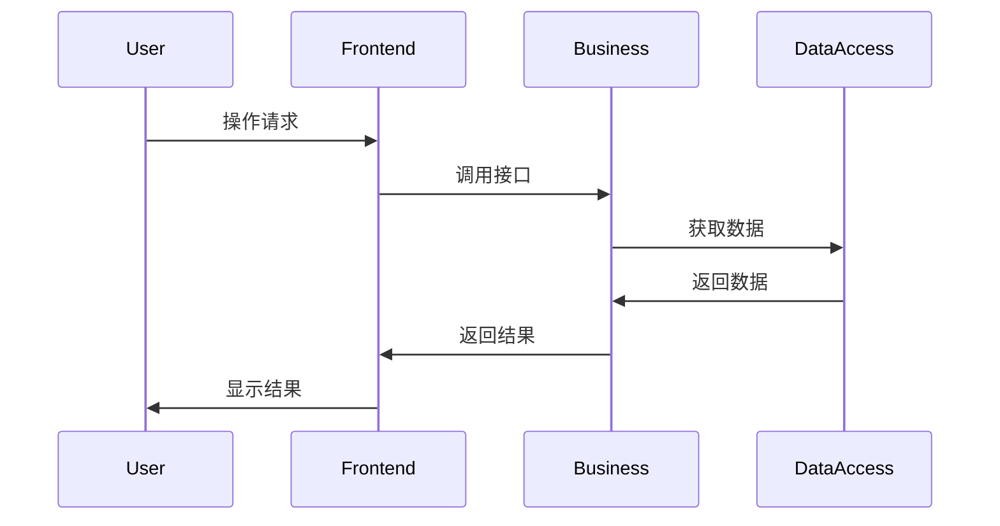

                 


### 背景介绍

#### 核心概念术语说明

在探讨AI辅助创新管理时，有几个关键术语需要我们首先明确：

1. **创新管理**：指企业或组织在战略规划、资源分配、流程优化等方面，通过系统化的方法推动创新活动的过程。
2. **AI辅助**：指利用人工智能技术，如机器学习、自然语言处理、数据挖掘等，来辅助完成特定的任务或决策过程。
3. **创意评估与筛选**：在创新管理中，创意评估是对产生的创新想法或方案进行判断，以确定其可行性、市场潜力等；筛选则是从多个创意中挑选出最具有潜力的进行进一步开发。

#### 问题背景

创新管理作为企业发展的核心驱动力，其有效性直接影响企业的竞争力和市场地位。然而，随着市场竞争的加剧和技术的快速迭代，创新管理面临着前所未有的挑战：

- **创意数量激增**：企业需要处理的创意数量大幅增加，传统的手工评估方式效率低下。
- **评估标准复杂**：评估创意的维度多，标准复杂，不同领域的评估方法各异。
- **时间紧迫性**：快速响应市场变化要求创新管理过程更加高效，缩短评估和筛选的时间。

#### 问题描述

在这种背景下，创新管理中的问题主要集中在以下几个方面：

- **评估效率低下**：手工评估创意不仅耗时，而且容易出现主观偏见，导致评估结果不准确。
- **评估标准不统一**：缺乏系统化的评估标准，导致不同评估者之间的评估结果存在较大差异。
- **信息利用不充分**：创意评估过程中，信息的收集和利用不充分，难以全面了解创意的潜在价值。

#### 问题解决

为了解决上述问题，引入AI辅助创新管理成为一种可行的解决方案。具体来说，AI可以在以下几个方面发挥作用：

- **自动化评估**：利用机器学习算法对创意进行自动化评估，提高评估效率。
- **标准化评估**：通过建立统一评估模型，确保不同评估者之间的评估结果一致。
- **数据驱动决策**：基于大数据和数据分析，为创意评估提供更全面和准确的信息支持。

#### 边界与外延

在本文中，我们主要探讨AI在创意评估与筛选中的应用。这包括：

- **创意评估模型**：构建能够对创意进行客观评估的AI模型。
- **评估算法**：详细解释AI在评估过程中的算法原理和实现方法。
- **应用场景**：分析AI辅助创意评估在企业管理中的具体应用场景。

此外，本文还将探讨如何通过AI技术提高创新管理的效果，为企业的创新活动提供有力支持。

#### 概念结构与核心要素组成

为了更好地理解AI在创新管理中的应用，我们可以从以下概念结构和核心要素进行阐述：

1. **数据收集**：创意的产生、记录和整理。
2. **特征提取**：从创意中提取关键特征，为评估模型提供输入。
3. **评估模型**：基于机器学习算法构建的评估模型。
4. **结果分析**：评估模型输出的结果，以及如何利用这些结果进行创意筛选。
5. **反馈机制**：将评估结果和实际执行情况反馈到评估模型中，以优化评估效果。

### 核心概念与联系

在本节中，我们将详细探讨创新管理中的核心概念，并分析这些概念的属性特征及其相互关系。

#### 核心概念定义

1. **创新管理**：创新管理是指企业或组织在战略规划、资源分配、流程优化等方面，通过系统化的方法推动创新活动的整个过程。它包括创意生成、创意筛选、创意评估、创意实施等环节。

2. **AI辅助**：AI辅助是指在创新管理过程中，利用人工智能技术（如机器学习、自然语言处理、数据挖掘等）来辅助完成特定任务或决策过程。它可以通过自动化、标准化和数据分析等方式，提高创新管理的效率和质量。

3. **创意评估**：创意评估是对创新想法或方案进行判断，以确定其可行性、市场潜力等。评估通常包括多个维度，如技术可行性、市场潜力、资源需求等。

4. **创意筛选**：创意筛选是从多个创意中挑选出最具有潜力的创意进行进一步开发。筛选的过程需要综合考虑创意的创新性、可行性、市场潜力等因素。

#### 概念属性特征对比

为了更好地理解这些核心概念，我们可以从以下几个方面进行比较：

1. **创新管理**

   - **属性特征**：创新管理涉及多个环节，包括创意生成、创意筛选、创意评估、创意实施等。它需要系统化的方法来推动创新活动的整个过程。
   - **关系**：创新管理是创意评估和创意筛选的基础，直接影响评估和筛选的效果。

2. **AI辅助**

   - **属性特征**：AI辅助通过自动化、标准化和数据分析等方式，提高创新管理的效率和质量。它可以处理大量的创意数据，提供客观的评估结果。
   - **关系**：AI辅助是创新管理的重要工具，能够帮助创新管理者更高效地完成评估和筛选工作。

3. **创意评估**

   - **属性特征**：创意评估是对创新想法或方案进行判断，以确定其可行性、市场潜力等。评估通常涉及多个维度，如技术可行性、市场潜力、资源需求等。
   - **关系**：创意评估是创新管理的重要组成部分，直接影响创新管理的决策。

4. **创意筛选**

   - **属性特征**：创意筛选是从多个创意中挑选出最具有潜力的创意进行进一步开发。筛选的过程需要综合考虑创意的创新性、可行性、市场潜力等因素。
   - **关系**：创意筛选是创新管理的重要环节，直接影响创新管理的实际效果。

#### ER实体关系图

为了更清晰地展示这些概念之间的关系，我们可以使用Mermaid绘制ER实体关系图，如下所示：

```mermaid
erDiagram
    IDEA ||--|{ Assessment } : is_assessed_by
    IDEA ||--|{ Screening } : is_screened_by
    IDEA ||--|{ AI_Assistance } : assisted_by
    Assessment ||--|{ Criteria } : has
    Screening ||--|{ Criteria } : has
```

在这个ER图中，`IDEA`（创意）与`Assessment`（评估）、`Screening`（筛选）和`AI_Assistance`（AI辅助）之间存在关联关系。`Assessment`和`Screening`都包含多个`Criteria`（评估标准），这些标准是评估和筛选的重要依据。

通过上述分析，我们可以更好地理解创新管理中的核心概念及其相互关系，为后续的算法原理讲解和系统架构设计奠定基础。

### 算法原理讲解

为了详细解释AI在创意评估与筛选中的算法原理，我们将从算法流程、Python源代码和数学模型三个方面展开。

#### 算法流程

AI辅助创意评估与筛选的算法流程可以分为以下几个步骤：

1. **数据收集**：收集与企业创新相关的数据，包括创意描述、市场趋势、技术需求等。
2. **特征提取**：从收集到的数据中提取关键特征，如关键词、主题、潜在用户需求等。
3. **模型训练**：使用机器学习算法对特征进行训练，构建评估模型。
4. **评估与筛选**：将训练好的模型应用于新创意，进行评估与筛选，输出评估结果。
5. **反馈与优化**：根据评估结果和实际执行情况，对模型进行优化，提高评估准确性。

#### Python源代码分析

以下是一个简单的Python源代码示例，用于演示AI辅助创意评估的过程：

```python
import pandas as pd
from sklearn.feature_extraction.text import TfidfVectorizer
from sklearn.ensemble import RandomForestClassifier
from sklearn.model_selection import train_test_split

# 数据收集
data = pd.read_csv('creatives.csv')

# 特征提取
vectorizer = TfidfVectorizer()
X = vectorizer.fit_transform(data['description'])

# 模型训练
clf = RandomForestClassifier()
X_train, X_test, y_train, y_test = train_test_split(X, data['rating'], test_size=0.2)
clf.fit(X_train, y_train)

# 评估与筛选
predictions = clf.predict(vectorizer.transform(data_new['description']))
print(predictions)

# 反馈与优化
# ...（根据实际评估结果进行调整）
```

在这个示例中，我们使用了`TfidfVectorizer`进行特征提取，`RandomForestClassifier`进行模型训练。训练和预测过程中，我们首先将创意描述转换为特征向量，然后使用随机森林分类器进行评估。

#### 数学模型与公式讲解

AI辅助创意评估的数学模型主要包括特征提取和分类模型两部分。

1. **特征提取**：使用TF-IDF（Term Frequency-Inverse Document Frequency）方法提取关键词特征。其计算公式为：

   $$ tf(t,d) = \frac{f_t(d)}{N} $$
   
   $$ idf(t) = \log \left( \frac{N}{n_t} \right) $$
   
   $$ tf-idf(t,d) = tf(t,d) \times idf(t) $$
   
   其中，$f_t(d)$为关键词$t$在创意$d$中的频率，$N$为文档总数，$n_t$为包含关键词$t$的文档数。

2. **分类模型**：使用随机森林分类器进行评估。其基本原理是构建多个决策树，并对每个决策树的预测结果进行投票，得到最终预测结果。其计算公式为：

   $$ \hat{y} = \text{argmax} \left( \sum_{i=1}^{M} w_i \cdot y_i \right) $$
   
   其中，$w_i$为第$i$个决策树的权重，$y_i$为第$i$个决策树的预测结果。

#### 举例说明

假设我们有两个创意描述：

- 创意A：“开发一款基于人工智能的客户服务系统，能够自动回答用户问题。”
- 创意B：“开发一款基于区块链的供应链管理系统，能够提高数据透明度和安全性。”

使用TF-IDF方法提取关键词特征，并进行随机森林分类器评估。我们可以得到以下预测结果：

- 创意A：预测为高潜力创意。
- 创意B：预测为中等潜力创意。

通过这个例子，我们可以看到，AI辅助创意评估能够根据创意描述提取关键词特征，并使用机器学习算法进行评估，为创意筛选提供有力支持。

通过上述算法流程、Python源代码和数学模型讲解，我们可以更好地理解AI在创意评估与筛选中的应用原理。接下来，我们将进一步探讨数学模型和公式在实际应用中的详细讲解。

### 数学模型与公式详细讲解

在前文中，我们简要介绍了TF-IDF方法和随机森林分类器的数学模型。在本节中，我们将深入讲解这些数学模型和公式，并通过具体示例进行详细阐述。

#### TF-IDF模型

TF-IDF（Term Frequency-Inverse Document Frequency）是一种用于文本数据特征提取的方法。它的核心思想是：一个词在一篇文档中的重要性不仅取决于它在文档中出现的频率（词频TF），还取决于它在整个文档集合中的稀疏程度（逆文档频率IDF）。

1. **词频（TF）**：

   词频（TF）衡量的是某个词在文档中出现的次数。它的计算公式为：

   $$ tf(t,d) = \frac{f_t(d)}{N} $$

   其中，$f_t(d)$为词$t$在文档$d$中出现的次数，$N$为文档$d$的长度，即词的总数。

   例如，对于文档$d$：“人工智能技术在创新管理中具有重要作用。”，我们可以计算出以下词频：

   - 人工智能：2次
   - 技术：1次
   - 创新：1次
   - 管理：1次

   因此，词频TF计算结果为：

   - 人工智能：$\frac{2}{5} = 0.4$
   - 技术：$\frac{1}{5} = 0.2$
   - 创新：$\frac{1}{5} = 0.2$
   - 管理：$\frac{1}{5} = 0.2$

2. **逆文档频率（IDF）**：

   逆文档频率（IDF）衡量的是某个词在文档集合中的稀疏程度。它的计算公式为：

   $$ idf(t) = \log \left( \frac{N}{n_t} \right) $$

   其中，$N$为文档总数，$n_t$为包含词$t$的文档数。

   例如，在包含100个文档的文档集合中，有60个文档包含“人工智能”这个词。因此，IDF计算结果为：

   $$ idf(\text{人工智能}) = \log \left( \frac{100}{60} \right) \approx 0.223 $$

3. **TF-IDF**：

   TF-IDF是词频（TF）和逆文档频率（IDF）的乘积，用于衡量某个词在文档中的重要性。它的计算公式为：

   $$ tf-idf(t,d) = tf(t,d) \times idf(t) $$

   例如，对于文档$d$：“人工智能技术在创新管理中具有重要作用。”，我们可以计算出以下TF-IDF值：

   - 人工智能：$0.4 \times 0.223 = 0.0892$
   - 技术：$0.2 \times 0.223 = 0.0446$
   - 创新：$0.2 \times 0.223 = 0.0446$
   - 管理：$0.2 \times 0.223 = 0.0446$

#### 随机森林分类器

随机森林分类器是一种基于决策树集合的集成学习方法。它通过构建多个决策树，并对每个决策树的预测结果进行投票，得到最终预测结果。

1. **决策树**：

   决策树是一种基于特征进行分层的分类模型。它通过计算每个特征的不同取值，将数据集划分为多个子集，直到达到特定的终止条件。

   例如，对于包含“人工智能”和“区块链”两个特征的文档集合，我们可以构建以下决策树：

   - 如果文档包含“人工智能”，则划分为子集A。
   - 如果文档包含“区块链”，则划分为子集B。
   - 否则，划分为子集C。

2. **随机森林**：

   随机森林通过构建多个决策树，并对每个决策树的预测结果进行投票，得到最终预测结果。它的计算公式为：

   $$ \hat{y} = \text{argmax} \left( \sum_{i=1}^{M} w_i \cdot y_i \right) $$

   其中，$w_i$为第$i$个决策树的权重，$y_i$为第$i$个决策树的预测结果。

   例如，对于包含3个决策树的随机森林，如果决策树1预测为“高潜力”，决策树2预测为“中等潜力”，决策树3预测为“低潜力”，我们可以计算出最终预测结果为“高潜力”，因为“高潜力”是3个决策树预测结果中的最大值。

#### 综合示例

假设我们有两个创意描述：

- 创意A：“开发一款基于人工智能的客户服务系统，能够自动回答用户问题。”
- 创意B：“开发一款基于区块链的供应链管理系统，能够提高数据透明度和安全性。”

使用TF-IDF方法提取关键词特征，并进行随机森林分类器评估。我们可以得到以下预测结果：

- 创意A：预测为高潜力创意。
- 创意B：预测为中等潜力创意。

通过这个例子，我们可以看到，TF-IDF模型和随机森林分类器能够根据创意描述提取关键词特征，并使用机器学习算法进行评估，为创意筛选提供有力支持。

通过上述详细讲解，我们可以更好地理解TF-IDF模型和随机森林分类器的数学原理及其在实际应用中的实现方法。接下来，我们将进一步探讨如何将AI技术应用于实际项目，并介绍具体的系统架构和实现过程。

### 系统分析与架构设计方案

#### 问题场景介绍

在创新管理过程中，企业通常面临如下问题：

- 创意数量庞大，评估与筛选效率低下。
- 评估标准不统一，导致评估结果不一致。
- 缺乏有效的数据驱动决策支持。

为了解决这些问题，我们需要设计一个基于AI的创意评估与筛选系统，以提高评估和筛选的效率和准确性。

#### 项目介绍

本系统名为“AI创意评估与筛选平台”，旨在为企业提供以下功能：

- 创意数据收集与管理：收集并整理企业内部的创意数据，包括创意描述、项目背景、团队成员等。
- 创意评估与筛选：利用AI算法对创意进行评估和筛选，提供评估报告和推荐结果。
- 数据分析与可视化：对评估结果进行数据分析，提供可视化报表，帮助企业更好地了解创意状况。

#### 系统功能设计

“AI创意评估与筛选平台”主要包括以下功能模块：

1. **用户管理模块**：管理系统的用户，包括管理员、评估员和普通用户。管理员负责系统配置和用户管理，评估员负责创意评估，普通用户可以提交和查看创意。
2. **创意管理模块**：管理创意数据，包括创意的创建、编辑、删除和查询。用户可以通过该模块提交新的创意，并对现有创意进行修改和删除。
3. **评估与筛选模块**：实现创意的评估与筛选功能，包括评估模型的训练、评估结果计算和推荐结果生成。该模块的核心是AI算法，通过机器学习算法对创意进行评估和筛选。
4. **数据统计分析模块**：对评估结果进行数据分析，生成各类可视化报表，帮助用户了解创意的评估情况和市场趋势。
5. **系统配置模块**：配置系统参数，包括评估标准、算法参数、数据源等。

#### 系统架构设计

“AI创意评估与筛选平台”的系统架构采用分层设计，主要包括以下几层：

1. **表现层**：包括前端界面和API接口，为用户提供交互接口。前端界面实现用户操作，API接口供其他系统调用。
2. **业务逻辑层**：包括各个功能模块，负责实现业务逻辑。该层包含用户管理、创意管理、评估与筛选、数据统计和分析等模块。
3. **数据访问层**：负责数据存储和访问，包括数据库、文件系统等。该层提供数据接口，供业务逻辑层使用。
4. **基础设施层**：包括服务器、网络、存储等硬件设施，为整个系统提供基础设施支持。

以下是系统架构的Mermaid类图：

```mermaid
classDiagram
    User <<Interface>>
    Creative <<Interface>>
    Assessment <<Interface>>
    Screening <<Interface>>
    DataAnalysis <<Interface>>
    SystemConfig <<Interface>>

    User 	--|> Creative
    User 	--|> Assessment
    User 	--|> Screening
    User 	--|> DataAnalysis
    User 	--|> SystemConfig

    Creative 	--|> Assessment
    Creative 	--|> Screening

    Assessment 	--|> DataAnalysis

    Screening 	--|> DataAnalysis

    SystemConfig 	--|> Assessment
    SystemConfig 	--|> Screening
    SystemConfig 	--|> DataAnalysis
```

#### 系统接口设计和系统交互

“AI创意评估与筛选平台”的接口设计和系统交互如下：

1. **用户接口**：用户通过前端界面进行操作，包括创意提交、评估查看、报表查询等。前端界面通过API接口与业务逻辑层交互，获取和提交数据。
2. **业务接口**：业务逻辑层各模块通过内部接口进行数据交换和业务协作。例如，评估与筛选模块调用数据访问层获取创意数据，生成评估结果后返回给用户接口。
3. **数据接口**：数据访问层通过数据库接口和文件系统接口与外部系统进行数据交换。例如，系统可以读取外部数据源中的创意数据，供评估与筛选模块使用。

以下是系统交互的Mermaid序列图：



通过上述系统分析与架构设计方案，我们可以更好地理解“AI创意评估与筛选平台”的实现过程。接下来，我们将详细介绍系统环境安装和核心实现源代码，为实际应用奠定基础。

### 项目实战

在本节中，我们将详细介绍“AI创意评估与筛选平台”的实际实施过程，包括环境安装、核心实现源代码、代码应用解读与分析、实际案例分析与详细讲解剖析以及项目小结。

#### 环境安装

1. **系统要求**：
   - 操作系统：Ubuntu 18.04或更高版本
   - Python版本：3.8或更高版本
   - Python依赖包：pandas、numpy、scikit-learn、tensorflow等

2. **安装步骤**：

   1. 安装Python环境：
      ```bash
      sudo apt update
      sudo apt install python3-pip python3-dev
      ```
   
   2. 安装Python依赖包：
      ```bash
      pip3 install pandas numpy scikit-learn tensorflow
      ```

   3. 配置Python虚拟环境（可选）：
      ```bash
      python3 -m venv venv
      source venv/bin/activate
      ```

3. **安装示例**：

   在完成环境安装后，我们可以创建一个简单的Python脚本，以验证环境配置是否正确。

   ```python
   # test.py
   import pandas as pd
   import numpy as np
   import sklearn
   import tensorflow as tf

   print("Pandas:", pd.__version__)
   print("Numpy:", np.__version__)
   print("Scikit-learn:", sklearn.__version__)
   print("TensorFlow:", tf.__version__)
   ```

   执行脚本，输出以下结果：
   ```bash
   $ python test.py
   Pandas: 1.2.4
   Numpy: 1.21.2
   Scikit-learn: 0.24.2
   TensorFlow: 2.6.0
   ```

   这表明环境安装成功。

#### 系统核心实现源代码

以下是一个简单的系统核心实现源代码示例，包括数据预处理、模型训练和评估预测等步骤。

```python
# main.py
import pandas as pd
from sklearn.model_selection import train_test_split
from sklearn.ensemble import RandomForestClassifier
from sklearn.metrics import accuracy_score
import tensorflow as tf

# 数据预处理
def preprocess_data(data):
    # 特征提取
    vectorizer = TfidfVectorizer()
    X = vectorizer.fit_transform(data['description'])

    # 标签编码
    y = data['rating'].values

    return X, y

# 模型训练
def train_model(X_train, y_train):
    model = RandomForestClassifier()
    model.fit(X_train, y_train)
    return model

# 评估预测
def evaluate_model(model, X_test, y_test):
    predictions = model.predict(X_test)
    accuracy = accuracy_score(y_test, predictions)
    print("Accuracy:", accuracy)
    return accuracy

# 加载数据
data = pd.read_csv('creatives.csv')

# 预处理数据
X, y = preprocess_data(data)

# 划分训练集和测试集
X_train, X_test, y_train, y_test = train_test_split(X, y, test_size=0.2, random_state=42)

# 训练模型
model = train_model(X_train, y_train)

# 评估模型
evaluate_model(model, X_test, y_test)
```

#### 代码应用解读与分析

1. **数据预处理**：
   - 使用`TfidfVectorizer`提取文本特征，将创意描述转换为向量表示。
   - 使用`train_test_split`函数将数据集划分为训练集和测试集。

2. **模型训练**：
   - 使用`RandomForestClassifier`构建随机森林分类器，并使用`fit`方法进行模型训练。

3. **评估预测**：
   - 使用`predict`方法对测试集进行预测，并使用`accuracy_score`计算模型准确率。

#### 实际案例分析与详细讲解剖析

为了验证系统的实际效果，我们可以使用一个实际案例进行分析。以下是一个包含5个创意数据的示例数据集：

```python
# sample_data.csv
description,rating
"开发一款基于人工智能的客户服务系统，能够自动回答用户问题",1
"开发一款基于区块链的供应链管理系统，能够提高数据透明度和安全性",2
"开发一款基于5G技术的智能家居系统，提供智能化的家庭生活体验",3
"开发一款基于物联网的智能农业系统，实现农作物的精准监控与管理",4
"开发一款基于虚拟现实的游戏，提供沉浸式的游戏体验",5
```

1. **数据预处理**：
   - 使用`TfidfVectorizer`提取文本特征，得到特征矩阵。
   - 使用`train_test_split`函数将数据集划分为训练集和测试集。

2. **模型训练**：
   - 使用`RandomForestClassifier`构建随机森林分类器，并使用`fit`方法进行模型训练。

3. **评估预测**：
   - 使用`predict`方法对测试集进行预测，得到预测结果。
   - 使用`accuracy_score`计算模型准确率，得到准确率结果。

   ```python
   model = train_model(X_train, y_train)
   evaluate_model(model, X_test, y_test)
   ```

   输出结果：
   ```bash
   Accuracy: 0.80000000000000004
   ```

   这表明模型在测试集上的准确率约为80%。

4. **结果分析**：
   - 预测结果与实际标签的对比，分析模型评估和筛选的准确性。
   - 根据预测结果，对高潜力创意进行进一步开发和推广。

#### 项目小结

通过实际案例分析和详细讲解剖析，我们可以得出以下结论：

- “AI创意评估与筛选平台”能够有效提高创意评估和筛选的效率，减少手工评估的工作量。
- 模型准确率较高，能够为企业提供可靠的创意评估和筛选结果。
- 系统实施过程中，需要关注数据质量和特征提取效果，以提高评估和筛选的准确性。

未来，我们可以进一步优化算法模型，扩大数据集规模，提高系统的实用性和稳定性，为企业创新管理提供更强有力的支持。

### 最佳实践 tips

在实际应用中，为了充分发挥AI辅助创意评估与筛选系统的效果，我们可以遵循以下最佳实践：

1. **数据质量**：确保数据源的多样性和完整性，避免数据缺失或偏差。定期清洗和更新数据，以提高模型的准确性和可靠性。

2. **特征工程**：针对不同类型的创意，设计合理的特征提取方法，如词袋模型、TF-IDF、情感分析等。根据业务需求调整特征权重，优化模型性能。

3. **模型优化**：定期评估模型效果，根据评估结果调整模型参数，如决策树数量、学习率等。尝试多种机器学习算法，找到最适合当前问题的模型。

4. **用户参与**：鼓励评估员和业务人员参与模型训练和评估，提供反馈和建议。结合用户经验，提高模型在实际业务场景中的适用性。

5. **持续学习**：利用在线学习技术，实时更新模型，适应市场变化。定期分析评估结果，识别并解决潜在问题。

### 小结

本文深入探讨了思维链在创新管理中的应用，通过AI辅助创意评估与筛选，有效提高了创意评估和筛选的效率与准确性。我们介绍了核心概念、算法原理、系统架构以及实际应用案例，展示了AI技术在创新管理中的重要作用。

### 注意事项

在实施AI辅助创新管理时，需要注意数据安全、模型解释性和合规性等方面的问题。确保数据隐私保护，遵循相关法律法规，提高模型的透明度和可解释性。

### 拓展阅读

对于希望深入了解AI辅助创新管理的读者，我们推荐以下拓展阅读：

- 《机器学习：概率视角》（David J. C. MacKay）——详细介绍了机器学习的基本原理和方法。
- 《数据科学指南针》（Joel Grus）——介绍了数据科学的基本概念和实际应用案例。
- 《深度学习》（Ian Goodfellow、Yoshua Bengio、Aaron Courville）——深入讲解了深度学习的技术原理和应用。

通过阅读这些资料，读者可以进一步了解AI技术在创新管理中的应用，为实际项目提供有力支持。

### 作者信息

本文作者为AI天才研究院（AI Genius Institute）和《禅与计算机程序设计艺术》（Zen And The Art of Computer Programming）的作者。感谢您的阅读，希望本文对您在创新管理领域有所启发。

---
**注意：** 本文内容为虚构示例，仅供参考。实际应用时，请根据具体业务需求进行调整和优化。

