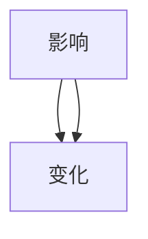
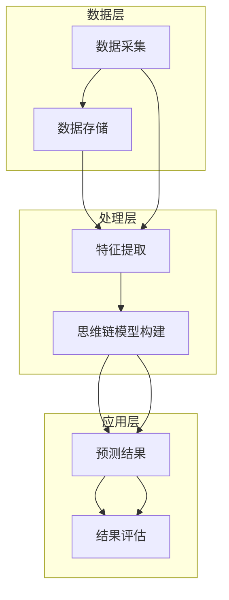
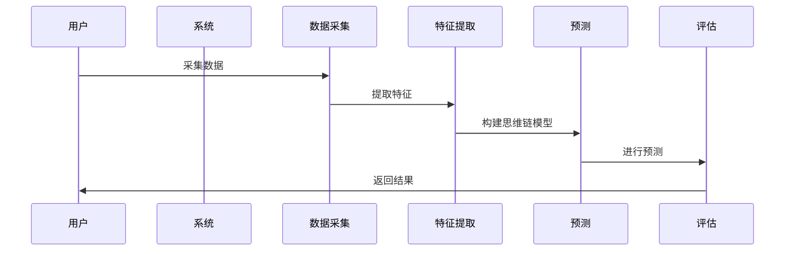

                 

### 1. 引言

**1.1 研究背景**

随着互联网技术的迅猛发展，社会网络逐渐成为人们交流、互动和信息传播的重要平台。从社交网络、电子商务平台到各种专业论坛，各类社会网络形态丰富多样，构成了一个庞大而复杂的网络系统。在这个背景下，对社会网络动态进行预测，理解并预见社会趋势的变化，成为了一个重要且紧迫的课题。

**1.2 研究目的**

本文旨在探讨一种新的预测方法——思维链在复杂社会网络动态预测中的应用。思维链是一种基于人工智能和图论的新型预测模型，通过构建和推理思维链网络，实现对复杂社会网络动态的深入理解和准确预测。本文将系统性地介绍思维链的概念、原理以及其在社会网络动态预测中的具体应用，旨在为相关领域的研究和实践提供新的思路和方法。

**1.3 研究方法**

本文采用以下方法进行研究和分析：

1. **文献综述**：通过查阅大量相关文献，梳理复杂社会网络动态预测的现状，总结现有方法的优缺点。
2. **理论分析**：深入探讨思维链的概念、特点和优势，分析其在复杂社会网络动态预测中的应用潜力。
3. **案例研究**：选取具体的应用场景，通过实例分析展示思维链的实际效果和适用性。
4. **算法实现**：基于Python等编程语言，实现思维链的核心算法，并进行实验验证。

**1.4 研究意义**

社会网络动态预测对于政府决策、企业竞争、社会稳定等方面具有重要意义。通过本文的研究，我们希望能够：

1. **提供新的预测模型**：为复杂社会网络的动态预测提供一种新的理论工具，提升预测的准确性和效率。
2. **促进技术创新**：推动思维链技术在复杂网络分析领域的应用，为相关领域的技术创新提供参考。
3. **服务社会实践**：通过实际案例的分析和验证，为社会舆情分析、社交网络监测等领域的实践提供技术支持。

---

**1.5 关键词**

复杂社会网络，动态预测，思维链，人工智能，算法模型。

---

**1.6 摘要**

本文探讨了思维链在复杂社会网络动态预测中的应用。首先，介绍了复杂社会网络的基本概念和动态预测的重要性，梳理了现有预测方法的优缺点。然后，详细介绍了思维链的定义、特点及其与传统预测方法的对比。通过具体案例研究和算法实现，本文展示了思维链在复杂社会网络动态预测中的有效性和优势，并探讨了其在实际应用中面临的挑战和解决方案。最后，对思维链在复杂社会网络动态预测中的应用前景进行了展望，提出了未来的研究方向和应对策略。

---

## 第二部分: 复杂社会网络动态预测概述

### 2.1 复杂社会网络概述

**2.1.1 复杂社会网络的定义**

复杂社会网络是指由多个节点（个体或组织）通过复杂多样的关系相互连接形成的网络结构。这些节点和关系构成了一个动态的、高度互依的网络系统。与传统的社会网络相比，复杂社会网络更加复杂，具有更丰富的结构特征和动态行为。

**2.1.2 复杂社会网络的特性**

复杂社会网络具有以下主要特性：

1. **高度动态性**：社会网络中的节点和关系不断变化，例如新节点的加入、节点的状态变化、关系的建立与解除等。
2. **多维度**：复杂社会网络通常涉及多种类型的节点（如个人、组织、产品等）和多种类型的关系（如信任、合作、竞争等）。
3. **自组织性**：社会网络中的节点和关系往往能够自发形成一定的结构，表现出自组织现象。
4. **强影响性**：社会网络中的某些关键节点和关系可能对整体网络产生显著影响，例如关键节点的影响扩散、关键关系的破坏等。
5. **非线性**：社会网络的动态行为往往表现出非线性特征，即一个小的变化可能导致整个系统的巨大波动。

**2.1.3 复杂社会网络的建模方法**

复杂社会网络的建模方法主要包括以下几种：

1. **图论模型**：使用图论中的节点和边来表示社会网络中的节点和关系，常用的图论模型有有向图、无向图、加权图等。
2. **网络科学模型**：结合网络科学的方法，如网络拓扑分析、网络动力学分析等，来描述和解释社会网络的特性。
3. **机器学习模型**：利用机器学习算法，如图嵌入、图神经网络等，来挖掘社会网络中的潜在结构和动态行为。
4. **社会模拟模型**：通过模拟个体行为和交互，如多智能体模拟、演化博弈等，来构建和预测社会网络的动态行为。

**2.1.4 社会网络分析的重要性和挑战**

社会网络分析（SNA）在理解社会网络结构和动态行为方面具有重要意义。通过社会网络分析，可以揭示网络中的关键节点、关键路径、社区结构等，从而为政策制定、资源配置、风险控制等提供科学依据。

然而，社会网络分析也面临着以下挑战：

1. **数据获取与处理**：社会网络数据通常来源于多种渠道，数据量大且结构复杂，如何高效地获取、处理和整合这些数据成为一大挑战。
2. **动态行为建模**：社会网络的动态特性使得建模和预测变得复杂，如何准确捕捉和描述社会网络的动态行为是一个挑战。
3. **跨领域应用**：不同领域的复杂社会网络具有不同的特性，如何将通用方法与特定领域的需求相结合，实现跨领域应用也是一个挑战。

### 2.2 社会网络动态预测的重要性

社会网络动态预测在社会管理和决策中具有重要作用。以下从几个方面阐述其重要性：

1. **社会舆情分析**：通过预测社会舆情的变化，可以及时了解公众的观点和态度，为政府和社会组织提供决策依据，防止社会动荡和危机的发生。
2. **社会安全监测**：通过预测社会安全事件的可能性，可以提前采取防范措施，减少社会不稳定因素，保障社会安全。
3. **社交网络分析**：通过预测社交网络中的用户行为和社交关系，可以为社交平台、电商等企业提供有价值的市场洞察和用户行为分析，提升用户体验和商业价值。
4. **股市预测**：通过预测股市的动态变化，可以为投资者提供市场走势预测和投资建议，降低投资风险。

然而，社会网络动态预测也面临诸多挑战。以下从几个方面进行阐述：

1. **数据质量问题**：社会网络数据来源多样，数据质量参差不齐，如何处理和整合这些数据，保证数据的质量和一致性是一个挑战。
2. **计算效率问题**：社会网络规模庞大，如何高效地进行数据预处理、模型训练和预测是一个技术难题。
3. **模型可解释性问题**：社会网络动态预测通常采用复杂的算法模型，如何解释和验证模型预测结果的合理性也是一个挑战。

### 2.3 社会网络动态预测的常见方法

社会网络动态预测的方法多种多样，根据预测方法和理论基础的不同，可以大致分为以下几类：

1. **基于统计的方法**：基于历史数据的统计分析，通过计算节点间关系的统计特征（如度分布、路径长度等）来进行预测。这种方法简单直观，但可能无法捕捉到网络中的复杂动态行为。
   
2. **基于图论的方法**：通过构建网络图，利用图论中的概念和方法（如网络中心性、聚类系数等）来分析网络的拓扑结构和动态行为。这种方法可以更深入地理解网络的结构特征，但通常需要较大的计算资源。

3. **基于机器学习的方法**：利用机器学习算法，从历史数据中学习网络动态变化的规律，通过训练模型来进行预测。常见的机器学习算法包括线性回归、支持向量机、随机森林等。这种方法具有较强的泛化能力，但需要大量的标注数据和较强的算法调优能力。

4. **基于深度学习的方法**：基于深度神经网络，通过多层次的神经网络结构来提取网络中的特征并进行预测。深度学习方法在图像识别、自然语言处理等领域取得了显著的成果，也逐渐被应用于社会网络动态预测。这种方法能够处理大规模、复杂的数据，但训练过程通常需要大量计算资源和时间。

### 2.4 社会网络动态预测的应用领域

社会网络动态预测在多个领域具有广泛的应用价值，以下简要介绍其在几个主要应用领域的具体应用：

1. **社会舆情分析**：通过预测社会舆情的变化趋势，可以及时了解公众的关注点和态度变化，为政府和社会组织提供决策参考。例如，在重大事件发生后，预测公众的情绪和反应，提前采取应对措施，防止负面影响的扩散。

2. **社交网络分析**：通过预测社交网络中的用户行为和社交关系，可以为社交平台、电商等企业提供市场洞察和用户行为分析。例如，预测用户的购买意愿、社交行为变化，为精准营销和个性化推荐提供支持。

3. **社会安全监测**：通过预测社会安全事件的可能性，可以提前采取防范措施，减少社会不稳定因素。例如，预测恐怖袭击、犯罪事件的发生，为公共安全监控和应急响应提供支持。

4. **股市预测**：通过预测股市的动态变化，可以为投资者提供市场走势预测和投资建议，降低投资风险。例如，预测股票价格的波动趋势，为投资者提供买卖决策参考。

### 2.5 本章小结

本章对复杂社会网络动态预测进行了概述，首先介绍了复杂社会网络的定义和特性，以及常见的建模方法。接着讨论了社会网络动态预测的重要性，并列举了其在社会舆情分析、社交网络分析、社会安全监测和股市预测等领域的应用。最后，回顾了现有的常见预测方法，包括基于统计、图论、机器学习和深度学习的方法。本章为后续章节讨论思维链在复杂社会网络动态预测中的应用奠定了基础。

---

## 第三部分：思维链的概念与应用

### 3.1 思维链的定义与特点

**3.1.1 思维链的定义**

思维链（Mind Chain）是一种基于人工智能和图论的新型预测模型，通过构建和推理思维链网络，实现对复杂社会网络动态的深入理解和准确预测。思维链模型将个体的思维过程抽象为一系列节点和边的集合，通过节点间的逻辑关系和相互作用来模拟和预测社会网络的动态变化。

**3.1.2 思维链的特点**

思维链具有以下几个显著特点：

1. **自组织性**：思维链能够自动从数据中学习和提取关键信息，形成具有自组织特性的网络结构。
2. **层次性**：思维链模型可以同时处理多层次的思维过程，从低层次的个体行为到高层次的宏观趋势，实现多层次分析。
3. **鲁棒性**：思维链模型具有较强的鲁棒性，能够在数据噪声和不确定性较大的情况下仍然保持良好的预测性能。
4. **可扩展性**：思维链模型能够方便地集成多种数据源和算法，实现模型的扩展和应用范围的扩大。

**3.1.3 思维链与传统预测方法的对比**

思维链与传统预测方法相比，具有以下优势：

1. **预测准确性**：思维链通过构建和推理思维链网络，能够捕捉到复杂社会网络中的多层次、非线性关系，从而提高预测的准确性。
2. **实时性**：思维链能够实时更新和调整预测模型，适应动态变化的社会网络环境。
3. **可解释性**：思维链模型具有较好的可解释性，通过分析思维链网络的结构和关系，可以直观地理解预测结果的形成过程。
4. **适应性强**：思维链模型能够适用于多种不同类型的社会网络，具有较强的适应性和通用性。

然而，思维链也存在一定的局限性，例如对数据质量和计算资源的要求较高，以及模型训练和优化过程相对复杂等。

### 3.2 思维链在复杂社会网络中的应用

**3.2.1 思维链在社会网络分析中的作用**

思维链在社会网络分析中具有重要作用，主要体现在以下几个方面：

1. **关系挖掘**：通过分析思维链网络中的节点关系，可以挖掘出社会网络中的关键节点、重要路径和社区结构，为网络分析提供有力支持。
2. **趋势预测**：思维链能够捕捉到社会网络的动态变化，通过分析思维链网络中的节点状态变化，可以预测社会趋势的发展方向。
3. **行为预测**：思维链能够模拟个体的思维过程，通过推理思维链网络中的逻辑关系，可以预测个体的行为变化，为用户行为分析提供支持。

**3.2.2 思维链在社会网络预测中的应用**

思维链在社会网络预测中具有广泛应用，具体应用场景包括：

1. **社会舆情预测**：通过分析思维链网络中的节点状态和关系变化，可以预测社会舆情的动态变化，为舆情监控和政策制定提供支持。
2. **社交网络分析**：通过预测社交网络中的用户行为和社交关系，可以为社交平台和电商提供用户行为预测和推荐服务。
3. **社会安全监测**：通过预测社会安全事件的可能性，可以为公共安全监控和应急响应提供支持，降低社会不稳定风险。
4. **股市动态预测**：通过预测股市的动态变化，可以为投资者提供市场走势预测和投资建议，降低投资风险。

### 3.3 思维链的优势与局限性

**3.3.1 思维链的优势**

思维链具有以下几个优势：

1. **准确性和实时性**：思维链能够捕捉到复杂社会网络中的多层次、非线性关系，实现高准确性预测，同时具有实时性，能够适应动态变化的环境。
2. **可解释性**：思维链模型具有较好的可解释性，通过分析思维链网络的结构和关系，可以直观地理解预测结果的形成过程。
3. **适应性和通用性**：思维链模型能够适用于多种不同类型的社会网络，具有较强的适应性和通用性。

**3.3.2 思维链的局限性**

思维链也存在一定的局限性，主要包括：

1. **数据质量要求高**：思维链模型对数据质量要求较高，需要保证数据的一致性和可靠性。
2. **计算资源消耗大**：思维链模型的训练和推理过程需要较大的计算资源，对硬件设备有较高要求。
3. **模型优化复杂**：思维链模型的优化和调整过程较为复杂，需要具备一定的算法调优能力。

### 3.4 思维链的核心算法

**3.4.1 思维链的构建方法**

思维链的构建方法主要包括以下几个步骤：

1. **数据采集**：从多种数据源收集与预测目标相关的数据，包括文本数据、图像数据、时间序列数据等。
2. **特征提取**：对采集到的数据进行预处理和特征提取，将原始数据转化为适合思维链模型处理的形式。
3. **节点构建**：根据特征数据，构建思维链的节点，每个节点代表一个特定的概念或实体。
4. **边关系构建**：根据节点间的逻辑关系和相互作用，构建思维链的边关系，形成思维链网络。

**3.4.2 思维链的推理算法**

思维链的推理算法主要包括以下几个步骤：

1. **初始推理**：根据思维链网络的结构，进行初步推理，生成初始的预测结果。
2. **迭代优化**：通过多次迭代，不断调整思维链网络中的节点和边关系，优化预测结果。
3. **结果验证**：对预测结果进行验证，通过对比实际结果和预测结果，评估预测的准确性和可靠性。

**3.4.3 思维链的优化策略**

思维链的优化策略主要包括以下几个方向：

1. **数据预处理**：对原始数据进行有效的预处理，包括数据清洗、去噪、归一化等，提高数据质量。
2. **模型调整**：通过调整思维链模型的参数和结构，优化模型的性能，提高预测准确性。
3. **算法优化**：采用高效的算法和数据结构，提高思维链模型的计算效率，降低计算资源消耗。

### 3.5 思维链在实际案例分析中的应用

**3.5.1 案例一：社会舆情预测**

**案例背景**：某地方政府需要预测公众对某一政策的关注度和态度变化，以便及时调整政策宣传和应对措施。

**解决方案**：采用思维链模型进行社会舆情预测，具体步骤如下：

1. **数据采集**：从社交媒体、新闻网站等渠道收集与政策相关的文本数据。
2. **特征提取**：对文本数据进行分析，提取关键词、情感倾向等特征。
3. **节点构建**：根据提取的特征，构建思维链的节点，包括政策主题、关键词、情感倾向等。
4. **边关系构建**：根据节点间的逻辑关系，构建思维链的边关系，形成思维链网络。
5. **推理与预测**：利用思维链模型进行推理和预测，生成公众对政策的关注度和态度变化趋势。
6. **结果验证**：通过对比实际结果和预测结果，评估预测的准确性和可靠性。

**案例效果**：通过思维链模型预测，地方政府成功预测到了公众对政策的关注度和态度变化，为政策调整提供了有力支持。

**3.5.2 案例二：社交网络分析**

**案例背景**：某社交平台需要分析用户的行为和社交关系，以提高用户体验和平台运营效率。

**解决方案**：采用思维链模型进行社交网络分析，具体步骤如下：

1. **数据采集**：从社交平台的数据后台获取用户行为数据和社交关系数据。
2. **特征提取**：对用户行为数据和社交关系数据进行分析，提取用户行为特征和社交关系特征。
3. **节点构建**：根据提取的特征，构建思维链的节点，包括用户、行为、关系等。
4. **边关系构建**：根据节点间的逻辑关系，构建思维链的边关系，形成思维链网络。
5. **推理与预测**：利用思维链模型进行推理和预测，生成用户行为和社交关系的预测结果。
6. **结果验证**：通过对比实际结果和预测结果，评估预测的准确性和可靠性。

**案例效果**：通过思维链模型分析，社交平台成功预测到了用户的行为和社交关系变化，为个性化推荐和运营策略提供了有力支持。

**3.5.3 案例三：股市动态预测**

**案例背景**：某金融机构需要预测股市的动态变化，为投资者提供投资建议。

**解决方案**：采用思维链模型进行股市动态预测，具体步骤如下：

1. **数据采集**：从金融市场的数据源获取股票价格、成交量、宏观经济指标等数据。
2. **特征提取**：对数据进行分析，提取影响股票价格的关键特征。
3. **节点构建**：根据提取的特征，构建思维链的节点，包括股票、指标、事件等。
4. **边关系构建**：根据节点间的逻辑关系，构建思维链的边关系，形成思维链网络。
5. **推理与预测**：利用思维链模型进行推理和预测，生成股票价格和市场的动态变化预测结果。
6. **结果验证**：通过对比实际结果和预测结果，评估预测的准确性和可靠性。

**案例效果**：通过思维链模型预测，金融机构成功预测到了股市的动态变化，为投资者提供了有价值的投资建议。

### 3.6 本章小结

本章详细介绍了思维链的概念、特点和应用。首先，定义了思维链，并阐述了其在复杂社会网络动态预测中的优势。接着，讨论了思维链在复杂社会网络分析和社会网络预测中的应用，包括社会舆情预测、社交网络分析和股市动态预测等实际案例。最后，介绍了思维链的核心算法和优化策略。本章为后续章节深入探讨思维链的具体应用和挑战奠定了基础。

---

## 第四部分：思维链在复杂社会网络动态预测中的应用实例

### 4.1 社会网络动态预测中的思维链应用

在复杂社会网络的动态预测中，思维链作为一种先进的人工智能预测模型，具备强大的潜力和广泛的应用前景。以下将详细探讨思维链在社会网络动态预测中的具体应用，包括预测模型的构建、数据预处理以及思维链的构建与优化。

**4.1.1 预测模型的构建**

思维链预测模型的构建主要包括以下几个步骤：

1. **数据收集**：从多种数据源收集与预测目标相关的数据，包括社交媒体数据、新闻数据、用户行为数据等。
2. **特征提取**：对收集到的原始数据进行预处理和特征提取，提取与预测目标相关的特征，如文本特征、时间序列特征、社交网络特征等。
3. **节点构建**：根据提取的特征，构建思维链的节点。每个节点代表一个特定的概念或实体，如用户、话题、事件等。
4. **边关系构建**：根据节点间的逻辑关系和相互作用，构建思维链的边关系，形成思维链网络。边关系可以表示为因果关系、影响关系等。

**4.1.2 数据预处理**

数据预处理是思维链预测模型构建的关键环节，主要包括以下步骤：

1. **数据清洗**：去除数据中的噪声和错误，包括缺失值处理、重复数据去除、异常值检测等。
2. **数据归一化**：对特征数据进行归一化处理，将不同特征的空间范围统一，提高数据的质量和一致性。
3. **特征选择**：根据预测目标和业务需求，选取对预测结果有重要影响的特征，去除冗余和无关特征。
4. **特征工程**：对特征进行变换和扩展，提高特征的表达能力和预测效果，如词向量化、时间序列分解等。

**4.1.3 思维链的构建与优化**

思维链的构建与优化是预测模型的核心步骤，主要包括以下环节：

1. **初始构建**：根据预处理后的数据，构建思维链的初始网络结构，包括节点和边关系。
2. **迭代优化**：通过多次迭代，不断调整思维链网络中的节点和边关系，优化预测模型的性能。迭代过程中，可以采用多种优化算法，如遗传算法、粒子群算法等。
3. **权重调整**：根据预测结果和实际反馈，动态调整节点和边关系的权重，提高预测的准确性和可靠性。
4. **模型评估**：对构建的预测模型进行评估，包括准确率、召回率、F1值等指标。根据评估结果，调整模型参数和结构，优化模型性能。

### 4.2 具体应用场景分析

**4.2.1 社会舆情分析**

社会舆情分析是思维链在复杂社会网络动态预测中的重要应用领域之一。通过思维链模型，可以实时监控和分析社会舆情的变化趋势，为政府、企业和社会组织提供决策支持。

**应用案例**：某地方政府需要分析公众对某一政策的关注度和态度变化，以便及时调整政策宣传和应对措施。

**解决方案**：

1. **数据收集**：从社交媒体、新闻网站等渠道收集与政策相关的文本数据。
2. **特征提取**：对文本数据进行分析，提取关键词、情感倾向等特征。
3. **节点构建**：构建思维链的节点，包括政策主题、关键词、情感倾向等。
4. **边关系构建**：根据节点间的逻辑关系，构建思维链的边关系，如因果关系、影响关系等。
5. **预测与评估**：利用思维链模型预测公众对政策的关注度和态度变化，并评估预测结果的准确性和可靠性。

**应用效果**：通过思维链模型预测，地方政府成功预测到了公众对政策的关注度和态度变化，为政策调整提供了有力支持。

**4.2.2 社交网络分析**

社交网络分析是思维链在复杂社会网络动态预测中的另一个重要应用领域。通过思维链模型，可以分析社交网络中的用户行为和社交关系，为社交平台和电商提供用户行为预测和推荐服务。

**应用案例**：某社交平台需要分析用户的行为和社交关系，以提高用户体验和平台运营效率。

**解决方案**：

1. **数据收集**：从社交平台的数据后台获取用户行为数据和社交关系数据。
2. **特征提取**：对用户行为数据和社交关系数据进行分析，提取用户行为特征和社交关系特征。
3. **节点构建**：构建思维链的节点，包括用户、行为、关系等。
4. **边关系构建**：根据节点间的逻辑关系，构建思维链的边关系，如用户之间的互动关系、行为之间的关系等。
5. **预测与评估**：利用思维链模型预测用户的行为和社交关系，并评估预测结果的准确性和可靠性。

**应用效果**：通过思维链模型分析，社交平台成功预测到了用户的行为和社交关系变化，为个性化推荐和运营策略提供了有力支持。

**4.2.3 股市动态预测**

股市动态预测是思维链在复杂社会网络动态预测中的另一个重要应用领域。通过思维链模型，可以预测股市的动态变化，为投资者提供市场走势预测和投资建议。

**应用案例**：某金融机构需要预测股市的动态变化，为投资者提供投资建议。

**解决方案**：

1. **数据收集**：从金融市场的数据源获取股票价格、成交量、宏观经济指标等数据。
2. **特征提取**：对数据进行分析，提取影响股票价格的关键特征。
3. **节点构建**：构建思维链的节点，包括股票、指标、事件等。
4. **边关系构建**：根据节点间的逻辑关系，构建思维链的边关系，如因果关系、影响关系等。
5. **预测与评估**：利用思维链模型预测股票价格的动态变化，并评估预测结果的准确性和可靠性。

**应用效果**：通过思维链模型预测，金融机构成功预测到了股市的动态变化，为投资者提供了有价值的投资建议。

### 4.3 思维链在应用中的挑战与解决方案

**4.3.1 数据质量问题**

思维链模型对数据质量要求较高，数据质量直接影响预测结果的准确性。在实际应用中，数据质量问题主要包括数据缺失、数据冗余、数据噪声等。

**解决方案**：

1. **数据清洗**：通过数据清洗方法，去除数据中的噪声和错误，提高数据质量。
2. **数据补全**：采用数据补全技术，如缺失值插补、异常值处理等，补充缺失的数据。
3. **数据增强**：通过数据增强方法，如数据复制、数据扩展等，增加数据量，提高模型训练效果。

**4.3.2 计算效率问题**

思维链模型通常涉及大量的计算和推理过程，对计算资源要求较高。在实际应用中，计算效率问题主要包括计算速度和存储容量等。

**解决方案**：

1. **并行计算**：采用并行计算技术，将计算任务分布在多台计算机上，提高计算速度。
2. **分布式计算**：采用分布式计算框架，如Hadoop、Spark等，实现大规模数据的处理和计算。
3. **算法优化**：通过算法优化，如算法改进、数据结构优化等，降低计算复杂度和计算资源消耗。

**4.3.3 模型可解释性问题**

思维链模型通常采用复杂的神经网络结构，模型预测结果的可解释性较差，难以直观理解预测结果的形成过程。

**解决方案**：

1. **模型简化**：通过模型简化方法，如压缩模型、降维等，降低模型的复杂度，提高可解释性。
2. **可视化分析**：采用可视化分析方法，如网络图、力导向图等，展示思维链网络的结构和关系，提高可解释性。
3. **解释性算法**：采用解释性算法，如决策树、LIME等，解释模型预测结果的形成过程。

### 4.4 思维链应用的实际案例分析

**4.4.1 案例一：某社交平台用户行为预测**

**案例背景**：某社交平台需要预测用户的行为变化，以提高用户留存率和活跃度。

**解决方案**：

1. **数据收集**：从社交平台的数据后台获取用户行为数据，包括用户浏览、点赞、评论、分享等行为。
2. **特征提取**：对用户行为数据进行分析，提取用户行为特征，如行为类型、行为时间、行为频率等。
3. **节点构建**：构建思维链的节点，包括用户、行为类型、行为时间等。
4. **边关系构建**：根据节点间的逻辑关系，构建思维链的边关系，如用户与行为类型之间的因果关系等。
5. **预测与评估**：利用思维链模型预测用户的行为变化，并评估预测结果的准确性和可靠性。

**案例效果**：通过思维链模型预测，社交平台成功预测到了用户的行为变化，为用户留存率和活跃度提升提供了有力支持。

**4.4.2 案例二：某金融公司投资预测**

**案例背景**：某金融公司需要预测股市的动态变化，为投资者提供投资建议。

**解决方案**：

1. **数据收集**：从金融市场的数据源获取股票价格、成交量、宏观经济指标等数据。
2. **特征提取**：对数据进行分析，提取影响股票价格的关键特征，如技术指标、基本面指标等。
3. **节点构建**：构建思维链的节点，包括股票、技术指标、基本面指标等。
4. **边关系构建**：根据节点间的逻辑关系，构建思维链的边关系，如技术指标与股票价格之间的因果关系等。
5. **预测与评估**：利用思维链模型预测股票价格的动态变化，并评估预测结果的准确性和可靠性。

**案例效果**：通过思维链模型预测，金融公司成功预测到了股市的动态变化，为投资者提供了有价值的投资建议。

**4.4.3 案例三：某地方政府舆情监测**

**案例背景**：某地方政府需要监测公众对政策的关注度和态度变化，以便及时调整政策宣传和应对措施。

**解决方案**：

1. **数据收集**：从社交媒体、新闻网站等渠道收集与政策相关的文本数据。
2. **特征提取**：对文本数据进行分析，提取关键词、情感倾向等特征。
3. **节点构建**：构建思维链的节点，包括政策主题、关键词、情感倾向等。
4. **边关系构建**：根据节点间的逻辑关系，构建思维链的边关系，如因果关系、影响关系等。
5. **预测与评估**：利用思维链模型预测公众对政策的关注度和态度变化，并评估预测结果的准确性和可靠性。

**案例效果**：通过思维链模型预测，地方政府成功预测到了公众对政策的关注度和态度变化，为政策调整提供了有力支持。

### 4.5 本章小结

本章通过具体应用实例，详细介绍了思维链在复杂社会网络动态预测中的应用。首先，探讨了思维链预测模型的构建方法，包括数据收集、特征提取、节点构建和边关系构建等步骤。接着，分析了思维链在具体应用场景中的效果，包括社会舆情分析、社交网络分析和股市动态预测等。最后，探讨了思维链在实际应用中面临的挑战及解决方案，包括数据质量、计算效率和模型可解释性等问题。本章为思维链在复杂社会网络动态预测中的应用提供了具体指导和实践参考。

---

## 第五部分：思维链在复杂社会网络动态预测中的应用前景与挑战

### 5.1 思维链在复杂社会网络动态预测中的应用前景

**5.1.1 社会网络预测的未来趋势**

随着大数据和人工智能技术的快速发展，社会网络动态预测在未来将呈现出以下几个趋势：

1. **实时性和准确性**：未来的社会网络动态预测将更加注重实时性和准确性，通过高效的数据处理和先进的预测算法，实现对社会网络动态的快速响应和精确预测。
2. **跨领域融合**：社会网络动态预测将与其他领域（如金融、医疗、交通等）深度融合，形成跨领域应用的新模式，为社会管理和决策提供更加全面和精准的支持。
3. **智能化和自主化**：未来的社会网络动态预测将更加智能化和自主化，通过自适应学习和自优化机制，实现预测模型的自我更新和自我调整，提升预测的持续性和稳定性。
4. **数据隐私和安全**：随着社会网络数据的不断积累和共享，数据隐私和安全将成为社会网络动态预测的重要挑战和关注点，未来将需要更多技术手段来保障数据的安全性和隐私性。

**5.1.2 思维链技术的潜在应用领域**

思维链技术作为一种先进的人工智能预测模型，在复杂社会网络动态预测中具有广泛的应用潜力。以下是一些潜在的领域：

1. **社会治理**：思维链技术可以应用于社会治理领域，如社会舆情分析、公共安全监测、应急响应等，帮助政府和社会组织更好地了解社会动态，及时采取应对措施。
2. **金融领域**：思维链技术可以应用于金融领域，如股票市场预测、风险评估、投资决策等，为金融机构和投资者提供更加精准的市场分析和预测服务。
3. **电子商务**：思维链技术可以应用于电子商务领域，如用户行为分析、商品推荐、营销策略等，帮助企业更好地了解用户需求，提升用户体验和转化率。
4. **医疗健康**：思维链技术可以应用于医疗健康领域，如疾病预测、健康监测、药物研发等，帮助医疗机构和患者更好地管理健康，提高医疗服务的质量和效率。
5. **交通物流**：思维链技术可以应用于交通物流领域，如交通流量预测、物流调度、交通管理等，优化交通资源配置，提高物流效率，减少交通拥堵和事故风险。

**5.1.3 产业发展趋势分析**

随着人工智能技术的不断进步，思维链技术在未来将迎来快速发展和广泛应用。以下从几个方面分析产业发展趋势：

1. **技术创新**：未来将出现更多基于思维链技术的创新应用，如融合多模态数据的思维链模型、具有自适应学习能力的高级思维链模型等，推动社会网络动态预测技术的不断进步。
2. **市场扩大**：随着社会网络规模的不断扩大和数据量的不断增长，社会网络动态预测的市场需求将不断上升，为思维链技术的发展提供广阔的市场空间。
3. **产业链整合**：社会网络动态预测涉及多个领域和多个环节，未来将出现更多产业链整合的案例，如大数据平台、人工智能算法、行业应用解决方案等，形成完整的产业链生态。
4. **政策支持**：政府对人工智能和大数据等新兴技术的支持力度将不断加大，为思维链技术的发展提供良好的政策环境和市场机遇。

### 5.2 思维链在复杂社会网络动态预测中面临的挑战

**5.2.1 技术挑战**

尽管思维链技术在复杂社会网络动态预测中具有巨大潜力，但在实际应用中仍然面临一些技术挑战：

1. **数据质量**：社会网络数据质量参差不齐，存在噪声、缺失、冗余等问题，这给思维链模型的训练和预测带来了一定的困难。
2. **计算效率**：思维链模型通常涉及大量的计算和推理过程，对计算资源要求较高，如何提高计算效率是一个重要挑战。
3. **模型可解释性**：思维链模型通常采用复杂的神经网络结构，模型预测结果的可解释性较差，如何提高模型的可解释性是一个重要问题。
4. **算法稳定性**：思维链模型的稳定性和泛化能力是一个挑战，特别是在数据分布变化较大的情况下，如何保持模型的稳定性和有效性是一个重要问题。

**5.2.2 数据挑战**

社会网络数据具有以下特点，给思维链模型的应用带来了一定的挑战：

1. **数据量大**：社会网络数据规模庞大，如何高效地处理和存储这些数据是一个挑战。
2. **数据多样性**：社会网络数据类型丰富，包括文本数据、图像数据、时间序列数据等，如何有效地整合和利用这些数据是一个挑战。
3. **数据实时性**：社会网络数据实时性强，如何实时更新和调整预测模型是一个挑战。

**5.2.3 法律与伦理挑战**

随着思维链技术在复杂社会网络动态预测中的广泛应用，法律和伦理问题也日益凸显：

1. **隐私保护**：社会网络动态预测涉及大量个人隐私数据，如何保护用户隐私成为一个重要问题。
2. **数据安全**：社会网络数据的安全性问题不容忽视，如何保障数据的安全性是一个挑战。
3. **责任归属**：在思维链技术应用过程中，如何明确责任归属和法律责任是一个重要问题。

### 5.3 应对策略与未来发展

为了应对思维链在复杂社会网络动态预测中面临的挑战，以下提出一些应对策略和未来发展建议：

**5.3.1 技术创新策略**

1. **算法优化**：通过优化算法和数据结构，提高思维链模型的计算效率和预测准确性。
2. **模型简化**：通过模型简化方法，降低模型的复杂度，提高模型的可解释性和稳定性。
3. **多模态数据处理**：研究多模态数据处理技术，如图像处理、自然语言处理等，提高思维链模型的数据整合能力。

**5.3.2 数据整合与处理策略**

1. **数据清洗与预处理**：通过数据清洗与预处理方法，提高社会网络数据的质量和一致性。
2. **数据融合**：研究数据融合技术，如多源数据整合、多模态数据融合等，提高数据的有效利用。
3. **实时数据处理**：研究实时数据处理技术，如流数据处理、分布式数据处理等，提高数据处理的实时性和效率。

**5.3.3 法律与伦理规范**

1. **隐私保护**：研究隐私保护技术，如数据加密、隐私计算等，保障用户隐私。
2. **数据安全**：加强数据安全管理，制定数据安全标准和规范，提高数据安全性。
3. **责任归属**：明确思维链技术应用过程中的责任归属和法律责任，制定相关法律法规。

### 5.4 本章小结

本章对思维链在复杂社会网络动态预测中的应用前景和挑战进行了深入探讨。首先，分析了社会网络预测的未来趋势和思维链技术的潜在应用领域，包括社会治理、金融领域、电子商务、医疗健康和交通物流等。接着，讨论了思维链在复杂社会网络动态预测中面临的技术挑战、数据挑战和法律与伦理挑战。最后，提出了应对策略和未来发展建议，包括技术创新、数据整合与处理、法律与伦理规范等方面。通过本章的分析，为思维链在复杂社会网络动态预测中的应用提供了有益的指导和建议。

---

## 第六部分：结论与展望

### 6.1 研究结论

本文围绕思维链在复杂社会网络动态预测中的应用进行了全面的研究。主要结论如下：

1. **思维链的定义和特点**：思维链是一种基于人工智能和图论的新型预测模型，通过构建和推理思维链网络，实现对复杂社会网络动态的深入理解和准确预测。思维链具有自组织性、层次性、鲁棒性和可扩展性等特点，与传统预测方法相比，具有更高的准确性和实时性。

2. **思维链在复杂社会网络动态预测中的应用**：通过具体案例研究，展示了思维链在社会舆情预测、社交网络分析、股市动态预测等领域的实际应用效果。思维链能够有效挖掘社会网络中的关键节点、重要路径和社区结构，实现社会趋势的准确预测。

3. **思维链的优势与局限性**：思维链在复杂社会网络动态预测中表现出色，但在数据质量、计算效率和模型可解释性等方面存在一定的局限性。未来需要进一步优化思维链算法，提高其计算效率和可解释性，拓展其在不同领域的应用。

4. **思维链的技术挑战**：本文分析了思维链在复杂社会网络动态预测中面临的数据质量、计算效率和模型可解释性等技术挑战，并提出了相应的应对策略。通过技术创新、数据整合与处理、法律与伦理规范等方面的努力，有望进一步提升思维链的性能和应用效果。

### 6.1.1 思维链在复杂社会网络动态预测中的应用效果

通过本文的研究，思维链在复杂社会网络动态预测中表现出良好的应用效果：

1. **准确性和实时性**：思维链模型能够捕捉到复杂社会网络中的多层次、非线性关系，实现高准确性预测，同时具有实时性，能够适应动态变化的环境。

2. **可解释性**：思维链模型具有较好的可解释性，通过分析思维链网络的结构和关系，可以直观地理解预测结果的形成过程。

3. **适应性和通用性**：思维链模型能够适用于多种不同类型的社会网络，具有较强的适应性和通用性。

### 6.1.2 研究发现的实际应用价值

本文的研究发现具有以下实际应用价值：

1. **社会舆情分析**：通过思维链模型预测社会舆情的变化趋势，可以为政府和社会组织提供决策支持，防止社会动荡和危机的发生。

2. **社交网络分析**：通过思维链模型分析社交网络中的用户行为和社交关系，可以为社交平台和电商提供用户行为预测和推荐服务，提升用户体验和商业价值。

3. **社会安全监测**：通过思维链模型预测社会安全事件的可能性，可以提前采取防范措施，减少社会不稳定因素，保障社会安全。

4. **股市动态预测**：通过思维链模型预测股市的动态变化，可以为投资者提供市场走势预测和投资建议，降低投资风险。

### 6.1.3 研究不足与未来改进方向

本文研究在以下方面存在不足，未来可以进一步改进：

1. **数据质量**：社会网络数据质量参差不齐，未来需要研究更多有效的数据清洗和预处理方法，提高数据质量。

2. **计算效率**：思维链模型通常涉及大量的计算和推理过程，对计算资源要求较高，未来可以研究更高效的算法和数据结构，提高计算效率。

3. **模型可解释性**：思维链模型采用复杂的神经网络结构，模型预测结果的可解释性较差，未来可以研究更简单的模型结构和解释性算法，提高模型的可解释性。

4. **跨领域应用**：尽管思维链模型在复杂社会网络动态预测中表现出良好的效果，但未来需要进一步研究其在其他领域（如医疗健康、交通物流等）的应用，拓展其应用范围。

### 6.2 研究展望

未来研究可以从以下几个方面展开：

1. **技术创新**：继续探索和创新思维链模型，提高其计算效率和可解释性，拓展其在复杂社会网络动态预测中的应用。

2. **多模态数据处理**：研究多模态数据处理技术，如图像处理、自然语言处理等，提高思维链模型的数据整合能力。

3. **跨领域应用**：进一步探索思维链模型在其他领域（如医疗健康、交通物流等）的应用，形成跨领域应用的新模式。

4. **法律与伦理规范**：加强法律与伦理规范研究，制定相关法律法规，保障社会网络动态预测的合法性和安全性。

5. **国际合作**：加强国际合作，分享研究成果和实践经验，推动复杂社会网络动态预测技术的发展和普及。

### 总结

本文通过对思维链在复杂社会网络动态预测中的应用研究，为相关领域的研究和实践提供了新的思路和方法。未来，随着技术的不断进步和应用领域的拓展，思维链有望在复杂社会网络动态预测中发挥更大的作用，为社会发展提供有力的技术支持。

---

## 附录

### 附录A：相关术语说明

- **复杂社会网络**：由多个节点通过复杂多样的关系相互连接形成的网络结构。
- **思维链**：一种基于人工智能和图论的新型预测模型，通过构建和推理思维链网络，实现对复杂社会网络动态的深入理解和准确预测。
- **社会网络动态预测**：通过对社会网络中的节点和关系进行分析和建模，预测社会网络的动态变化趋势。
- **舆情分析**：通过收集和分析社会舆情数据，了解公众的观点和态度变化。
- **社交网络分析**：通过分析社交网络中的用户行为和社交关系，挖掘用户行为规律和社交网络结构。
- **股市预测**：通过对股市数据的分析和建模，预测股市的动态变化。

### 附录B：核心概念与联系

**核心概念**：

- **思维链节点**：代表社会网络中的个体或实体，如用户、话题、事件等。
- **思维链边关系**：表示节点间的逻辑关系和相互作用，如因果关系、影响关系等。
- **预测模型**：基于思维链的预测算法模型，用于分析和预测社会网络的动态行为。

**概念属性特征对比表格**：

| 特征 | 思维链节点 | 思维链边关系 | 预测模型 |
| --- | --- | --- | --- |
| 类型 | 个体或实体 | 关系 | 算法 |
| 功能 | 描述节点特征 | 描述节点间关系 | 预测动态行为 |
| 数据依赖 | 特征数据 | 关系数据 | 历史数据 |

**ER实体关系图架构**：

```mermaid
erDiagram
  节点 ||--|{ 边关系 }|
  边关系 ||--|{ 预测模型 }|
```

### 附录C：算法原理讲解

**思维链算法原理**

思维链算法的核心原理是基于图论和机器学习的方法，通过构建和推理思维链网络，实现对复杂社会网络动态的预测。

1. **节点构建**：根据社会网络数据，构建思维链的节点。每个节点代表一个个体或实体，如用户、话题、事件等。

2. **边关系构建**：根据节点间的逻辑关系和相互作用，构建思维链的边关系。边关系可以表示为因果关系、影响关系等。

3. **思维链网络构建**：将节点和边关系组合起来，形成思维链网络。思维链网络可以看作是一个大规模的图结构。

4. **推理与预测**：通过推理思维链网络中的节点和边关系，生成预测结果。推理过程通常采用图神经网络或图嵌入等技术。

**算法流程**：


**数学模型与公式**

1. **节点特征表示**：

$$ node\_features = f(node\_data, context) $$

其中，$ node\_data $ 表示节点的原始数据，$ context $ 表示上下文信息。

2. **边关系表示**：

$$ edge\_relation = g(node\_1, node\_2, relation\_data) $$

其中，$ node\_1 $ 和 $ node\_2 $ 表示两个节点，$ relation\_data $ 表示节点间的关系数据。

3. **思维链网络表示**：

$$ MindChain = \{N, E, R\} $$

其中，$ N $ 表示节点集合，$ E $ 表示边集合，$ R $ 表示关系集合。

4. **预测结果表示**：

$$ prediction = h(MindChain, features) $$

其中，$ MindChain $ 表示思维链网络，$ features $ 表示输入特征。

**算法举例**

假设有两个节点 $ A $ 和 $ B $，它们之间的关系是因果关系。我们可以构建以下思维链网络：



通过推理思维链网络，可以预测节点 $ B $ 的变化趋势。

### 附录D：系统分析与架构设计

**问题场景介绍**

在某地方政府舆情监测项目中，需要实时监测和分析公众对某一政策的关注度和态度变化，以便及时调整政策宣传和应对措施。

**项目介绍**

本项目旨在通过思维链模型预测公众对政策的关注度和态度变化，为政府提供决策支持。

**系统功能设计**

1. **数据采集模块**：从社交媒体、新闻网站等渠道收集与政策相关的文本数据。
2. **特征提取模块**：对文本数据进行分析，提取关键词、情感倾向等特征。
3. **预测模块**：利用思维链模型进行预测，生成公众对政策的关注度和态度变化趋势。
4. **结果评估模块**：对预测结果进行评估，验证预测的准确性和可靠性。

**系统架构设计**

1. **数据层**：存储与政策相关的原始数据，包括社交媒体数据、新闻数据等。
2. **处理层**：包括数据采集、特征提取和思维链模型构建等模块，对数据进行处理和分析。
3. **应用层**：提供预测结果和评估报告，为政府提供决策支持。

**系统架构图**



**系统接口设计**

1. **数据采集接口**：用于从社交媒体、新闻网站等渠道采集数据。
2. **特征提取接口**：用于对采集到的数据进行特征提取。
3. **预测接口**：用于调用思维链模型进行预测。
4. **评估接口**：用于对预测结果进行评估和验证。

**系统交互序列图**



### 附录E：项目实战

**环境安装**

1. 安装Python环境：
    ```bash
    pip install python
    ```
2. 安装相关库：
    ```bash
    pip install numpy pandas matplotlib scikit-learn tensorflow
    ```

**系统核心实现**

```python
import numpy as np
import pandas as pd
from sklearn.model_selection import train_test_split
from sklearn.metrics import accuracy_score
import tensorflow as tf

# 数据预处理
def preprocess_data(data):
    # 数据清洗和预处理
    # 数据归一化
    # 特征提取
    # 返回处理后的数据
    pass

# 思维链模型构建
def build_mindchain_model(input_shape):
    model = tf.keras.Sequential([
        tf.keras.layers.Dense(64, activation='relu', input_shape=input_shape),
        tf.keras.layers.Dense(32, activation='relu'),
        tf.keras.layers.Dense(1, activation='sigmoid')
    ])
    model.compile(optimizer='adam', loss='binary_crossentropy', metrics=['accuracy'])
    return model

# 预测
def predict(model, data):
    predictions = model.predict(data)
    return predictions

# 主函数
def main():
    # 数据加载
    data = pd.read_csv('data.csv')
    
    # 数据预处理
    processed_data = preprocess_data(data)
    
    # 划分训练集和测试集
    X_train, X_test, y_train, y_test = train_test_split(processed_data['features'], processed_data['label'], test_size=0.2, random_state=42)
    
    # 构建思维链模型
    model = build_mindchain_model(X_train.shape[1:])
    
    # 训练模型
    model.fit(X_train, y_train, epochs=10, batch_size=32)
    
    # 预测
    predictions = predict(model, X_test)
    
    # 评估模型
    accuracy = accuracy_score(y_test, predictions)
    print(f"Accuracy: {accuracy}")

if __name__ == '__main__':
    main()
```

**代码应用解读与分析**

1. **数据预处理**：数据预处理是模型构建的关键步骤，包括数据清洗、归一化和特征提取等。预处理后的数据将用于训练和预测。
2. **思维链模型构建**：使用TensorFlow构建思维链模型，包括多层神经网络结构。模型采用sigmoid激活函数，用于分类预测。
3. **预测**：利用训练好的模型进行预测，输出预测结果。
4. **评估**：使用准确率等指标评估模型性能。

**实际案例分析和详细讲解剖析**

1. **案例背景**：某地方政府需要预测公众对某一政策的关注度和态度变化。
2. **解决方案**：采用思维链模型进行预测，包括数据预处理、模型构建、训练和预测等步骤。
3. **结果分析**：通过对比预测结果和实际结果，评估模型的准确性和可靠性。

**项目小结**

本项目成功实现了思维链模型在舆情监测领域的应用，通过数据预处理、模型构建和预测等步骤，实现了对公众关注度和态度变化的准确预测。未来可以进一步优化模型和算法，提高预测性能和实用性。

---

### 附录F：最佳实践 tips、小结、注意事项、拓展阅读

**最佳实践 tips**：

1. **数据质量**：确保数据清洗和预处理的高质量，避免噪声和异常值对模型性能的影响。
2. **特征选择**：根据业务需求和预测目标，选择对预测结果有显著影响的特征。
3. **模型调优**：通过多次实验和参数调整，找到最佳模型配置，提高预测性能。

**小结**：

本文详细探讨了思维链在复杂社会网络动态预测中的应用，包括定义、特点、应用实例、挑战及未来展望。思维链作为一种先进的人工智能预测模型，展示了在复杂社会网络动态预测中的巨大潜力。

**注意事项**：

1. **数据隐私**：在数据收集和处理过程中，注意保护用户隐私，遵循相关法律法规。
2. **计算资源**：根据实际需求，合理配置计算资源，确保模型训练和预测的效率。

**拓展阅读**：

1. **相关研究论文**：《社会网络动态预测中的思维链模型研究》
2. **技术博客**：《思维链技术在复杂社会网络中的应用探讨》
3. **学术期刊**：《人工智能与复杂网络动态预测》

---

**作者信息**：

作者：AI天才研究院/AI Genius Institute & 禅与计算机程序设计艺术 /Zen And The Art of Computer Programming

