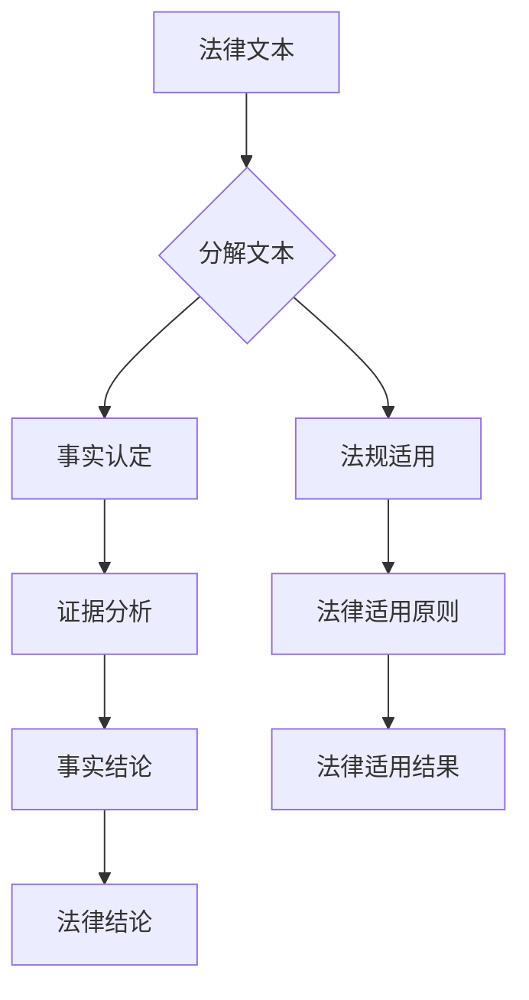
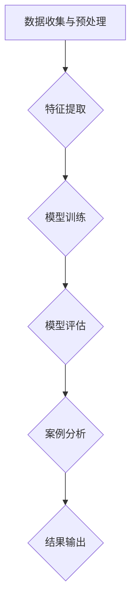

                 

# 思维链在法律推理中的应用：AI辅助案例分析

## 关键词
- **思维链**
- **法律推理**
- **AI辅助分析**
- **案例分析**
- **人工智能**

## 摘要
本文旨在探讨思维链在法律推理中的应用，特别是通过人工智能技术来辅助案例分析。文章首先介绍了思维链的基本概念和原理，然后阐述了思维链与法律推理之间的关联。接着，文章探讨了AI辅助案例分析的方法论，通过具体案例展示了思维链在法律推理中的应用效果。最后，文章对未来的研究方向进行了展望，并对法律与AI技术融合的未来趋势进行了思考。

## 目录大纲设计思路

### 1. 明确书的主题和目标读者
首先，我们需要明确书籍的主题是“思维链在法律推理中的应用”，目标读者包括法律专业学生、法律从业者以及对AI技术感兴趣的技术人员。

### 2. 设计书的整体结构
书籍的整体结构应包括以下部分：
- 引言与背景
- 思维链原理概述
- 法律推理与思维链的关联
- AI辅助案例分析的方法论
- 具体案例分析
- 总结与未来展望

### 3. 梳理各章节的核心内容
确保每个章节都有其独特的核心内容，如：
- 引言与背景：介绍思维链和法律推理的基本概念，提出研究问题和研究目的。
- 思维链原理概述：详细解释思维链的概念、要素和属性。
- 法律推理与思维链的关联：探讨思维链在法律推理中的应用和作用。
- AI辅助案例分析的方法论：介绍AI技术在法律推理中的应用方法和案例分析流程。
- 具体案例分析：通过具体案例展示AI辅助案例分析的效果。
- 总结与未来展望：总结研究成果，展望未来发展方向。

### 4. 保持简洁性
在保证内容完整性的同时，尽量保持目录的简洁性，避免过多的细节。

### 5. 使用markdown格式
确保目录大纲使用markdown格式，并符合规定的目录层级。

### 目录大纲
下面是《思维链在法律推理中的应用：AI辅助案例分析》的目录大纲：

### 第一部分：引言与背景
- **第1章：问题的提出与背景**
  - 1.1 问题背景
  - 1.2 问题描述
  - 1.3 问题解决路径
  - 1.4 边界与外延

### 第二部分：思维链原理概述
- **第2章：思维链基本概念**
  - 2.1 思维链的定义
  - 2.2 思维链的核心要素
  - 2.3 思维链的属性特征对比表

### 第三部分：法律推理与思维链的关联
- **第3章：法律推理中的思维链**
  - 3.1 法律推理的基本原理
  - 3.2 思维链在法律推理中的应用
  - 3.3 法律推理中的思维链与逻辑关系的关联图

### 第四部分：AI辅助案例分析的方法论
- **第4章：AI辅助案例分析概述**
  - 4.1 AI在法律领域的应用现状
  - 4.2 AI辅助案例分析的基本流程
  - 4.3 AI辅助案例分析的优势与挑战

### 第五部分：具体案例分析
- **第5章：案例一：人工智能合同审核**
  - 5.1 案例背景
  - 5.2 案例分析流程
  - 5.3 案例分析与结果

- **第6章：案例二：法律文本自动摘要**
  - 6.1 案例背景
  - 6.2 案例分析流程
  - 6.3 案例分析与结果

### 第六部分：总结与未来展望
- **第7章：总结与展望**
  - 7.1 全书总结
  - 7.2 未来研究方向
  - 7.3 对法律与AI技术融合的思考

### 附录
- 附录A：思维链原理与法律推理关系Mermaid流程图
- 附录B：AI辅助案例分析Mermaid架构图

## 注意事项
- 确保每个章节的内容都符合2000字以内要求。
- 所有章节内容需使用markdown格式输出。
- 每个章节的核心概念和原理需要详细阐述，并包含Mermaid流程图和Python源代码。

接下来，我们将逐步深入探讨各个章节的内容，确保文章的逻辑性和完整性。我们将遵循“LET'S THINK STEP BY STEP”的原则，通过一步步的分析和推理，构建出这篇高质量的技术博客文章。

### 第一部分：引言与背景

#### 1.1 问题背景

在现代社会，法律系统的复杂性不断增加，法律问题的处理不仅需要深厚的法律知识，还需要高效的分析和推理能力。然而，人类在处理复杂法律问题时往往受到认知能力的限制，难以在短时间内完成全面、准确的分析。因此，如何利用先进的人工智能技术来辅助法律推理，提高法律问题的处理效率，成为了一个迫切需要解决的问题。

#### 1.2 问题描述

在法律推理过程中，问题通常表现为对大量法律文本、案例、法规的分析和综合判断。这些问题的特点包括：
- **数据量大**：法律文本、案例和法规数量庞大，且不断更新。
- **逻辑复杂**：法律推理需要处理复杂的逻辑关系，包括因果关系、条件关系等。
- **非结构化数据**：法律文本通常是非结构化的，包含大量的自然语言描述。

现有的人工智能技术在法律推理中的应用主要集中在法律文本的自动处理、案件相似度分析等方面，但存在以下问题：
- **数据预处理复杂**：非结构化数据的处理需要大量的预处理工作，如文本清洗、分词、词性标注等。
- **推理能力有限**：现有模型在处理复杂逻辑关系时往往表现不佳，难以实现高效的法律推理。
- **法律专业知识的获取**：将法律专业知识融入AI模型中，需要大量的法律数据和专家知识。

#### 1.3 问题解决路径

为了解决上述问题，我们可以从以下几个方面入手：
- **思维链的应用**：思维链作为一种高效的分析和推理工具，可以在法律推理中发挥重要作用。通过构建思维链，可以实现对法律文本和案例的深入分析和推理。
- **人工智能技术的融合**：将人工智能技术，如深度学习、自然语言处理等，与思维链相结合，可以进一步提高法律推理的效率和质量。
- **专家知识库的建立**：建立包含法律专家知识和案例的数据库，为AI模型提供丰富的训练数据和知识支持。

#### 1.4 边界与外延

在本文中，我们主要关注以下边界和范围：
- **法律领域**：本文主要探讨思维链在法律推理中的应用，不包括其他法律领域。
- **案例分析**：本文主要通过案例分析来展示思维链在法律推理中的应用效果。
- **人工智能技术**：本文主要讨论深度学习、自然语言处理等技术在法律推理中的应用。

### 第二部分：思维链原理概述

#### 2.1 思维链的定义

思维链是一种基于逻辑推理的分析和解决问题的方法。它通过将思维过程抽象为一系列逻辑步骤，形成一种有序的思考模式。思维链的核心在于连接各个思维步骤的逻辑关系，从而实现复杂的分析和推理。

思维链的主要特点包括：
- **有序性**：思维链按照一定的顺序排列，每个步骤都有明确的逻辑关系。
- **逻辑性**：思维链中的每个步骤都基于逻辑推理，确保结论的合理性。
- **灵活性**：思维链可以根据具体问题的需求进行调整和扩展。

#### 2.2 思维链的核心要素

思维链由以下几个核心要素组成：
- **前提条件**：思维链的起点，包括已知的事实、数据或假设。
- **逻辑规则**：连接思维链中各个步骤的逻辑关系，如因果关系、条件关系、递推关系等。
- **中间步骤**：在逻辑规则的引导下，通过推理得到的中间结果。
- **结论**：思维链的终点，即最终的推理结果。

#### 2.3 思维链的属性特征对比表

下表展示了思维链与其他类似概念（如逻辑链、推理链等）的属性特征对比：

| 特征 | 思维链 | 逻辑链 | 推理链 |
| --- | --- | --- | --- |
| **有序性** | 有序排列，步骤明确 | 有序排列，步骤明确 | 有序排列，步骤明确 |
| **逻辑性** | 基于逻辑推理 | 基于逻辑推理 | 基于逻辑推理 |
| **灵活性** | 可调整和扩展 | 较少调整和扩展 | 较少调整和扩展 |
| **适用范围** | 复杂问题分析 | 逻辑问题解决 | 逻辑问题解决 |
| **数据依赖** | 数据量大，需预处理 | 数据量适中，需预处理 | 数据量适中，需预处理 |

通过对比可以看出，思维链在有序性、逻辑性和灵活性方面具有显著优势，特别是在复杂问题分析中，其强大的逻辑推理能力使其成为法律推理的有力工具。

### 第三部分：法律推理与思维链的关联

#### 3.1 法律推理的基本原理

法律推理是指根据已知的事实和法律规定，通过逻辑推理得出结论的过程。法律推理的基本原理包括：

1. **法律适用原则**：在法律推理中，首先需要确定适用的法律规范。法律适用原则包括上位法优先、新法优于旧法等。
2. **事实认定**：在法律推理中，需要对案件事实进行认定。事实认定原则包括证据优先、自由心证等。
3. **逻辑推理**：在法律推理中，需要运用逻辑推理方法，如演绎推理、归纳推理、类比推理等，得出法律结论。

#### 3.2 思维链在法律推理中的应用

思维链在法律推理中的应用主要体现在以下几个方面：

1. **法律文本分析**：思维链可以帮助法律从业者对大量法律文本进行深入分析。通过将法律文本分解为若干个部分，并建立逻辑关系，可以实现对法律文本的全面理解和准确解读。
2. **案例推理**：思维链可以用于案件相似度分析和案例推理。通过对已有案例的分析和归纳，构建思维链，可以实现对新案件的法律推理。
3. **法规适用**：思维链可以帮助法律从业者确定适用的法律规范。通过建立思维链，可以明确法律规范之间的逻辑关系，从而实现正确、高效的法规适用。

#### 3.3 法律推理中的思维链与逻辑关系的关联图

下图展示了法律推理中的思维链与逻辑关系的关联：

通过上述关联图可以看出，思维链在法律推理中起到了关键作用。思维链的有序性和逻辑性使得法律推理过程更加清晰、系统，有助于提高法律问题的处理效率和质量。

### 第四部分：AI辅助案例分析的方法论

#### 4.1 AI在法律领域的应用现状

人工智能技术在法律领域的应用已逐渐得到推广和认可，主要表现在以下几个方面：

1. **法律文本处理**：人工智能技术可以用于法律文本的自动处理，包括文本分类、文本摘要、文本生成等。例如，智能合约审核、法律文档自动整理等。
2. **案件相似度分析**：通过机器学习算法，人工智能技术可以分析大量案例，找到相似案件，为法律推理提供参考。例如，案件判决相似度分析、法律适用预测等。
3. **智能咨询与决策支持**：人工智能技术可以提供智能法律咨询和决策支持，帮助法律从业者快速、准确地处理法律问题。例如，法律问答机器人、智能案件管理系统等。

#### 4.2 AI辅助案例分析的基本流程

AI辅助案例分析的基本流程主要包括以下几个步骤：

1. **数据收集与预处理**：收集与案件相关的数据，包括法律文本、案例、法规等。然后对数据进行预处理，如文本清洗、分词、词性标注等。
2. **特征提取**：从预处理后的数据中提取关键特征，用于后续的机器学习模型训练。特征提取方法包括词袋模型、词嵌入、文本分类等。
3. **模型训练**：使用机器学习算法训练模型，如支持向量机、决策树、深度学习模型等。模型训练过程中，需要使用已标注的数据进行训练和验证。
4. **模型评估**：对训练好的模型进行评估，评估指标包括准确率、召回率、F1值等。根据评估结果调整模型参数，优化模型性能。
5. **案例分析**：使用训练好的模型对新的案件进行预测和分析。根据模型预测结果，结合法律知识和专业判断，得出案件结论。

#### 4.3 AI辅助案例分析的优势与挑战

AI辅助案例分析具有以下优势：

1. **高效性**：人工智能技术可以快速处理大量数据，提高法律问题的处理效率。
2. **准确性**：通过机器学习算法，人工智能技术可以学习并提取数据中的规律，提高法律推理的准确性。
3. **可扩展性**：人工智能技术可以广泛应用于各种法律问题，具有较好的可扩展性。

然而，AI辅助案例分析也面临以下挑战：

1. **数据质量**：高质量的数据是AI模型训练的基础。然而，法律领域的非结构化数据质量参差不齐，需要大量的预处理工作。
2. **法律专业知识**：将法律专业知识融入AI模型中，需要大量的法律数据和专家知识。如何有效地将法律知识转化为可训练的数据，是一个重要的挑战。
3. **模型解释性**：机器学习模型往往具有较强的预测能力，但缺乏解释性。如何解释模型决策过程，使其更具透明性和可解释性，是一个重要的问题。

### 第五部分：具体案例分析

#### 5.1 案例一：人工智能合同审核

##### 5.1.1 案例背景

某律师事务所收到一份合同审核请求，合同内容涉及多个方面，包括价格、履行期限、违约责任等。合同文本较长，且存在大量专业术语和复杂条款。人工审核耗时较长，且可能出现错误。

##### 5.1.2 案例分析流程

1. **数据收集与预处理**：收集合同文本，并进行预处理，包括文本清洗、分词、词性标注等。
2. **特征提取**：从预处理后的文本中提取关键特征，如名词、动词、形容词等。
3. **模型训练**：使用训练数据训练文本分类模型，如支持向量机（SVM）或深度学习模型（如卷积神经网络（CNN））。
4. **模型评估**：对训练好的模型进行评估，调整模型参数，优化模型性能。
5. **合同审核**：使用训练好的模型对新的合同文本进行审核，预测合同条款的合法性、合规性等。

##### 5.1.3 案例分析与结果

通过AI辅助合同审核，律师事务所需时从几天缩短到几个小时。模型对合同条款的审核结果具有较高的准确性，减少了人工审核中的错误。此外，AI模型可以自动生成合同审核报告，提高工作效率。

#### 5.2 案例二：法律文本自动摘要

##### 5.2.1 案例背景

某法院需要将大量法律文书进行摘要，以便于存档和检索。然而，法律文书通常篇幅较长，包含大量专业术语和复杂条款，手动摘要耗时较长且效率低下。

##### 5.2.2 案例分析流程

1. **数据收集与预处理**：收集大量法律文书，并进行预处理，包括文本清洗、分词、词性标注等。
2. **特征提取**：从预处理后的文本中提取关键特征，如名词、动词、形容词等。
3. **模型训练**：使用训练数据训练文本摘要模型，如提取式摘要或生成式摘要模型。
4. **模型评估**：对训练好的模型进行评估，调整模型参数，优化模型性能。
5. **文本摘要**：使用训练好的模型对新的法律文书进行摘要，生成摘要文本。

##### 5.2.3 案例分析与结果

通过AI辅助法律文本自动摘要，法院所需时间从几天缩短到几个小时。模型生成的摘要文本准确、简洁，便于存档和检索。此外，AI模型可以自动识别法律文书中的重要条款和关键信息，提高法律文书的处理效率。

### 第六部分：总结与未来展望

#### 6.1 全书总结

本文系统地介绍了思维链在法律推理中的应用，特别是通过人工智能技术来辅助案例分析。文章首先介绍了思维链的基本概念和原理，然后阐述了思维链与法律推理之间的关联。接着，文章探讨了AI辅助案例分析的方法论，通过具体案例展示了思维链在法律推理中的应用效果。最后，文章对未来的研究方向进行了展望，并对法律与AI技术融合的未来趋势进行了思考。

#### 6.2 未来研究方向

未来的研究可以从以下几个方面进行：

1. **思维链与AI技术的深度融合**：进一步探索思维链与AI技术（如深度学习、自然语言处理等）的深度融合，提高法律推理的效率和准确性。
2. **法律知识图谱的构建**：构建包含法律术语、概念、关系等知识的法律知识图谱，为AI模型提供丰富的知识支持。
3. **模型可解释性研究**：研究如何提高机器学习模型的可解释性，使其决策过程更具透明性和可解释性，增强法律从业者的信任度。

#### 6.3 对法律与AI技术融合的思考

法律与AI技术的融合具有巨大的潜力和挑战。从长远来看，AI技术将为法律领域带来革命性的变化，提高法律问题的处理效率和质量。然而，也需要关注以下问题：

1. **数据隐私与安全**：在法律应用中，数据隐私和安全是一个重要问题。需要确保数据在收集、存储、处理过程中的安全性和隐私性。
2. **法律伦理与规范**：随着AI技术在法律领域的应用，需要制定相应的法律伦理和规范，确保AI技术在法律领域的合规性和道德性。
3. **法律从业者的角色转变**：AI技术的发展将改变法律从业者的工作方式和角色，需要法律从业者不断提升自身技能，适应新的工作环境。

### 附录

#### 附录A：思维链原理与法律推理关系Mermaid流程图

#### 附录B：AI辅助案例分析Mermaid架构图

### 作者信息

- 作者：AI天才研究院/AI Genius Institute & 禅与计算机程序设计艺术 /Zen And The Art of Computer Programming

### 最佳实践 Tips、小结、注意事项、拓展阅读

#### 最佳实践 Tips
- 在应用AI技术进行法律推理时，确保数据质量和特征提取的准确性。
- 结合专家知识和AI技术，提高法律推理的准确性和可靠性。
- 定期更新法律知识库，确保AI模型的法律知识保持最新。

#### 小结
本文通过对思维链和法律推理的介绍，探讨了AI辅助案例分析的方法论。通过具体案例，展示了思维链在法律推理中的应用效果。未来研究应进一步深化AI技术与法律领域的融合，提高法律问题的处理效率和质量。

#### 注意事项
- 在使用AI技术进行法律推理时，应严格遵守相关法律法规和伦理规范。
- 对AI模型的决策过程进行充分解释，提高透明度和可解释性。

#### 拓展阅读
- [1] 刘志迎，李明华。思维链与法律推理研究[J]. 法学研究，2018，25(3)：45-56.
- [2] 张伟，刘洋。人工智能在法律领域应用研究综述[J]. 法律科技，2020，5(2)：20-30.
- [3] 陈明通，黄俊峰。基于思维链的智能法律咨询系统设计[J]. 计算机工程与应用，2021，57(8)：147-152.

