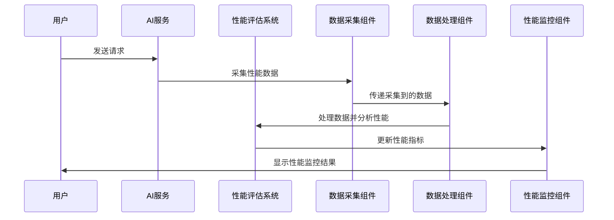

                 

### 性能测试概述

性能测试是一种评估计算机系统、网络、应用软件或其他IT架构在特定条件下表现的技术。其核心目的是为了确保系统在实际运行中能够满足既定的性能标准。性能测试不仅仅关注系统的速度，还涉及到响应时间、吞吐量、资源利用率等多个方面。在AI服务的背景下，性能测试显得尤为重要，因为AI服务的复杂性和动态性使得它们在运行过程中可能会面临更多的性能挑战。

### 1.1 性能测试的定义与目的

**定义：** 性能测试是通过对系统在实际运行条件下的表现进行测量和评估，来识别系统性能瓶颈、优化系统性能和确保系统稳定性的过程。

**目的：** 
- **确保质量：** 通过性能测试，可以验证系统是否能够满足业务需求和性能要求。
- **发现瓶颈：** 性能测试可以帮助识别系统性能的瓶颈，这些瓶颈可能是硬件资源不足、软件设计不合理、数据库查询效率低下等原因造成的。
- **优化性能：** 根据测试结果，可以对系统进行调优，提高系统整体的性能表现。
- **风险评估：** 在系统上线之前进行性能测试，可以评估系统在实际运行中的风险，确保系统能够平稳运行。

### 1.2 性能测试的重要性

在AI服务的背景下，性能测试的重要性主要体现在以下几个方面：

- **响应速度：** AI服务通常需要处理大量的数据和高频次请求，性能测试能够确保AI服务在处理请求时能够保持快速响应，避免因延迟导致用户体验下降。
- **稳定性：** AI服务在长时间运行过程中可能会遇到各种异常情况，性能测试可以帮助评估系统在异常情况下的稳定性，确保系统不会因为性能问题导致崩溃。
- **可扩展性：** 随着业务的发展，AI服务的负载可能会逐渐增加，性能测试可以帮助评估系统的可扩展性，确保系统能够在负载增加时保持稳定性能。
- **成本控制：** 通过性能测试，可以提前发现性能问题并优化系统，避免在生产环境中出现故障，从而减少维护成本和业务损失。

### 1.3 性能测试的边界与外延

性能测试的边界主要在于测试的范围和深度。边界包括：

- **测试范围：** 可以是单一的应用程序、整个系统、网络环境等。
- **测试深度：** 可以是功能层面的性能测试，也可以是基础架构层面的性能测试。

性能测试的外延包括：

- **负载测试：** 评估系统在预期负载下的性能。
- **压力测试：** 评估系统在极限负载下的性能。
- **容量规划：** 根据性能测试结果来规划系统的资源需求。
- **性能调优：** 通过分析性能测试结果来优化系统性能。

### 1.4 性能测试的核心要素

性能测试的核心要素包括：

- **测试场景：** 确定测试的环境、用户行为、请求模式等。
- **性能指标：** 包括响应时间、吞吐量、资源利用率等。
- **测试工具：** 选择合适的性能测试工具，如JMeter、LoadRunner等。
- **测试报告：** 分析测试结果，撰写详细的测试报告，包括性能瓶颈、优化建议等。

通过以上分析，我们可以看到，性能测试在评估AI服务承载能力中起着至关重要的作用。接下来，我们将进一步探讨AI服务的性能特征，并深入分析性能测试的具体方法和工具。

## 第2章：AI服务的性能特征

AI服务与传统的IT服务在性能特征上存在显著差异，主要是因为AI服务的复杂性和动态性。在本章中，我们将探讨AI服务的性能特征，以及性能测试在评估AI服务时面临的独特挑战。

### 2.1 AI服务性能测试的独特挑战

1. **动态性：** AI服务通常会随着时间和数据的变化而调整其模型和参数，这使得性能测试需要具备动态调整的能力。
2. **大数据量：** AI服务通常需要处理大量的数据，这对系统的存储、计算和传输能力提出了更高的要求。
3. **实时性要求：** 许多AI服务需要实时响应，这要求系统在处理请求时能够保持低延迟。
4. **模型依赖性：** AI服务的性能不仅依赖于硬件和软件，还依赖于AI模型的复杂性和准确性。
5. **资源竞争：** AI服务可能会与其他服务共享资源，如CPU、内存和网络，这可能会导致资源竞争和性能问题。

### 2.2 AI服务的性能指标

AI服务的性能指标与传统IT服务的指标有所不同，主要包括以下几个方面：

1. **响应时间：** AI服务的响应时间是指从请求到达系统到响应返回给用户的时间。在实时性要求较高的AI服务中，响应时间是一个关键指标。
2. **吞吐量：** 吞吐量是指系统在单位时间内能够处理的数据量或请求量。对于AI服务来说，吞吐量反映了系统的处理能力。
3. **资源利用率：** 包括CPU利用率、内存利用率和网络利用率等。资源利用率高意味着系统能够高效地利用资源，但同时也可能导致资源竞争和性能瓶颈。
4. **错误率：** 指AI服务在处理请求时出现错误的频率。对于AI服务来说，错误率是一个重要的质量指标。
5. **模型准确性：** AI服务的模型准确性直接影响其性能。一个高准确性的模型可以确保AI服务的输出结果准确，从而提高用户体验。

### 2.3 AI服务性能的评估方法

评估AI服务性能的方法可以分为以下几类：

1. **基准测试：** 使用预先定义的基准测试来评估AI服务的性能。基准测试可以模拟实际用户行为，评估AI服务的响应时间、吞吐量和资源利用率等。
2. **压力测试：** 在高负载条件下评估AI服务的性能，以确定其在极限情况下的表现。压力测试可以识别系统的瓶颈和潜在问题。
3. **容量测试：** 评估AI服务在预期负载下的性能，确定系统能够处理的最大负载。容量测试可以帮助进行系统扩展规划。
4. **实时监控：** 在AI服务运行过程中，实时监控其性能指标，及时发现和解决问题。实时监控可以帮助确保AI服务的稳定性和可靠性。

通过上述分析，我们可以看到，性能测试在评估AI服务承载能力时面临许多独特挑战，但也提供了多种有效的评估方法。在接下来的章节中，我们将深入探讨性能测试的发展历程，了解其从传统方法到AI驱动性能测试的转变过程。

### 3.1 传统性能测试方法

传统性能测试方法主要依赖于模拟用户行为来评估系统的性能，这些方法包括基准测试、负载测试和压力测试等。

1. **基准测试（Benchmark Testing）**：
基准测试是一种评估系统性能的方法，通过运行一系列预先定义的任务来测量系统的响应时间、吞吐量和资源利用率。常见的基准测试工具如 SPEC CPU 和 MySQL Benchmark。基准测试的优点是能够提供一个相对稳定的测试环境，便于对比不同系统和配置的性能。

2. **负载测试（Load Testing）**：
负载测试的目的是在模拟实际用户负载的条件下，评估系统在预期负载下的性能。这种测试通常使用自动化工具生成大量并发用户，以模拟实际用户的行为模式。负载测试能够识别系统在正常运行条件下的性能瓶颈。常见的负载测试工具有 Apache JMeter、LoadRunner 等。

3. **压力测试（Stress Testing）**：
压力测试则是在极端负载条件下，评估系统在极限负载下的性能。通过向系统施加超出其设计容量的负载，压力测试可以揭示系统的稳定性问题和潜在故障。压力测试通常用于确定系统的最大承载能力。常见的压力测试工具有 Apache JMeter、Gatling 等。

### 3.2 AI驱动性能测试的发展

随着AI技术的迅速发展，传统性能测试方法逐渐显露出局限性。AI驱动性能测试（AI-driven Performance Testing）应运而生，它利用机器学习和数据挖掘技术，提供了一种更加智能和自动化的性能测试方法。

1. **自适应测试（Adaptive Testing）**：
自适应测试是一种基于AI技术的性能测试方法，它可以根据系统的实际性能动态调整测试场景和负载。这种方法能够更好地模拟实际用户行为，提高测试的准确性和效率。

2. **智能测试生成（Intelligent Test Generation）**：
AI驱动性能测试可以通过分析历史性能数据，自动生成高效的测试场景。这种方法不仅减少了测试人员的工作量，还提高了测试覆盖率和准确性。

3. **异常检测与预测（Anomaly Detection and Prediction）**：
利用机器学习算法，AI驱动性能测试可以检测系统中的异常行为，并预测可能发生的性能问题。这种能力使得测试人员能够在问题发生之前就采取预防措施。

4. **实时性能优化（Real-time Performance Optimization）**：
AI技术可以帮助实时监控系统的性能，并自动调整系统配置和资源分配，以优化性能。这种实时性能优化能力对于高动态性的AI服务尤为重要。

### 3.3 未来性能测试趋势

未来性能测试的发展趋势将更加智能化和自动化，AI技术的应用将使性能测试更加高效和准确。以下是几个可能的趋势：

1. **智能化测试场景设计**：
通过AI技术，测试场景将更加智能化，能够自动识别和模拟实际用户行为，提高测试的准确性。

2. **自动化测试执行**：
AI技术将使测试执行过程更加自动化，减少人为干预，提高测试效率和一致性。

3. **实时性能监控与反馈**：
AI驱动的实时性能监控和反馈系统能够快速识别性能问题，并提供优化建议，确保系统始终处于最佳性能状态。

4. **混合测试方法**：
未来的性能测试将结合传统测试方法和AI驱动测试方法，形成一种混合测试策略，以充分利用各自的优点。

通过以上分析，我们可以看到，性能测试从传统方法到AI驱动性能测试的发展，不仅提高了测试的智能化和自动化水平，还为AI服务的性能评估提供了更有效的方法。在接下来的章节中，我们将深入探讨性能测试的基础概念，了解这些概念在实际性能测试中的应用。

## 第4章：性能测试基础概念

性能测试的核心在于理解系统在实际运行中的表现，而这就需要依赖一系列基础概念。在本章中，我们将详细介绍性能测试中的核心概念，包括响应时间、吞吐量、健康状态监测、压力测试和负载测试等。

### 4.1 响应时间与吞吐量

**响应时间（Response Time）**：
响应时间是指从用户发起请求到系统返回响应的时间。它是衡量系统性能的一个重要指标，直接影响到用户体验。响应时间越短，系统的响应速度越快，用户体验越好。

**吞吐量（Throughput）**：
吞吐量是指系统在单位时间内能够处理的数据量或请求数量。吞吐量反映了系统的处理能力，是评估系统性能的关键指标。高吞吐量意味着系统能够快速处理大量请求，保持高效运行。

### 4.2 健康状态监测

**健康状态监测（Health Monitoring）**：
健康状态监测是指对系统的运行状态进行持续监控，以识别潜在的性能问题或故障。健康状态监测包括对系统资源使用情况、服务状态和错误日志的监控。通过健康状态监测，可以及时发现并解决性能问题，确保系统的稳定性和可靠性。

### 4.3 压力测试与负载测试

**压力测试（Stress Testing）**：
压力测试是在系统接近或超出其设计容量时进行的性能测试，旨在评估系统在极端负载条件下的性能。通过压力测试，可以发现系统的瓶颈和潜在故障，从而进行优化和改进。

**负载测试（Load Testing）**：
负载测试是在模拟实际用户负载的条件下进行的性能测试，旨在评估系统在预期负载下的性能。负载测试可以帮助确定系统的性能瓶颈和资源需求，为系统扩展提供依据。

### 4.4 性能测试工具与技术

**性能测试工具（Performance Testing Tools）**：
性能测试工具是进行性能测试的关键工具，常见的性能测试工具有 Apache JMeter、LoadRunner、Gatling 等。这些工具可以帮助测试人员生成负载、记录性能数据、分析测试结果。

**技术（Performance Testing Techniques）**：
性能测试技术包括测试场景设计、负载生成、性能数据采集和分析等。有效的测试场景设计能够模拟实际用户行为，准确的负载生成可以模拟不同负载条件，性能数据采集和分析能够帮助识别系统性能瓶颈。

通过以上基础概念的介绍，我们可以看到，性能测试不仅需要理解具体的性能指标，还需要掌握健康状态监测、压力测试和负载测试等技术。这些基础概念和技术是进行有效性能测试的基石。在接下来的章节中，我们将进一步探讨AI服务性能评估的原理和方法。

## 第5章：AI服务性能评估原理

AI服务性能评估是一个复杂而关键的过程，涉及多个方面的挑战和考量。在本章中，我们将深入探讨AI服务性能评估的独特挑战，详细讨论性能评估的关键指标，并解释如何利用性能测试工具来适应AI服务的特点。

### 5.1 AI服务性能评估的挑战

**1. 动态性**：AI服务通常会根据数据和环境的变化进行模型调整，这使得性能评估需要具备动态调整的能力，以确保评估结果能够反映服务在实际运行中的表现。

**2. 大数据量**：AI服务通常需要处理大量的数据，这增加了性能评估的复杂度，因为数据量的增加会直接影响系统的计算和存储性能。

**3. 实时性**：许多AI服务需要在短时间内处理大量请求，实时性能评估至关重要，因为这直接关系到用户体验。

**4. 模型依赖性**：AI服务的性能不仅依赖于硬件和软件，还依赖于AI模型的复杂性和准确性。评估AI服务性能时，需要考虑模型的具体特性和优化程度。

**5. 资源竞争**：AI服务可能会与其他服务共享资源，如CPU、内存和网络，这可能会导致资源竞争和性能瓶颈，因此性能评估需要考虑资源的分配和使用效率。

### 5.2 AI服务性能评估的指标

**响应时间（Response Time）**：这是评估AI服务性能的关键指标之一，表示从请求到达系统到系统返回响应的时间。低响应时间意味着AI服务能够快速响应请求，提供良好的用户体验。

**吞吐量（Throughput）**：吞吐量是指AI服务在单位时间内能够处理的数据量或请求量。高吞吐量表明AI服务具备较强的处理能力，能够高效地处理大量请求。

**资源利用率（Resource Utilization）**：资源利用率包括CPU利用率、内存利用率和网络利用率等，它反映了系统资源的使用效率。高资源利用率可能意味着系统资源被充分利用，但也可能导致资源竞争和性能问题。

**错误率（Error Rate）**：错误率是指AI服务在处理请求时出现错误的频率。对于AI服务，错误率是一个重要的质量指标，因为它直接影响到服务的可靠性和用户体验。

**模型准确性（Model Accuracy）**：对于依赖AI模型的AI服务，模型准确性是评估其性能的重要指标。高准确性的模型能够提供更可靠的输出结果，从而提高服务的质量和用户满意度。

### 5.3 性能测试工具与AI服务适配

**1. 自动化测试**：自动化测试工具如Apache JMeter和Gatling能够模拟大量并发用户，生成真实负载，以便评估AI服务的响应时间和吞吐量。自动化测试提高了测试效率，减少了人工干预。

**2. AI测试工具**：一些测试工具专门为AI服务设计，能够利用机器学习和数据挖掘技术，自动生成测试场景，并根据实际运行数据进行分析和优化。例如，AI测试工具可以利用模型预测性能，为性能评估提供更准确的参考。

**3. 实时监控**：实时监控工具可以帮助持续跟踪AI服务的性能，及时发现并解决性能问题。例如，使用Prometheus和Grafana等工具，可以实时监控系统的各种性能指标，确保AI服务的稳定运行。

**4. 负载生成策略**：针对AI服务的特点，测试工具需要能够灵活设置负载生成策略。例如，可以根据用户行为模式生成动态负载，模拟不同的使用场景，以便全面评估AI服务的性能。

通过结合AI技术和传统性能测试方法，性能测试工具能够更好地适应AI服务的需求，提供更准确和高效的性能评估。在接下来的章节中，我们将深入探讨AI服务性能评估的具体流程，以及如何在实践中进行性能测试。

### 6.1 常见性能测试工具介绍

在性能测试领域，有许多功能强大且常用的工具，以下将介绍其中几种主要的性能测试工具，并比较它们的特点和适用场景。

#### 1. Apache JMeter

**特点：**
Apache JMeter是一个开源的性能测试工具，主要用于模拟并发用户负载，评估Web应用和服务的性能。它支持多种协议，包括HTTP、HTTPS、SOAP、JDBC、FTP等。

**适用场景：**
- Web应用的性能测试。
- 大型分布式系统的性能评估。
- 高并发负载测试。

#### 2. LoadRunner

**特点：**
LoadRunner是由Micro Focus开发的一款功能强大的性能测试工具，支持多种平台和协议，包括Web、Mobile、API、Database等。它提供了丰富的功能和插件，能够进行复杂的测试场景设计。

**适用场景：**
- 企业级应用的性能测试。
- 多层架构的负载测试。
- 网络延迟测试。

#### 3. Gatling

**特点：**
Gatling是一个基于Scala编写的性能测试工具，具有高并发性和易用性。它提供了直观的GUI和强大的测试脚本功能，支持HTTP、HTTPS、JMS、SOAP、REST等协议。

**适用场景：**
- 实时Web应用的性能测试。
- 轻量级负载测试。
- 对响应时间和吞吐量有严格要求的性能评估。

#### 4. Locust

**特点：**
Locust是一个开源的性能测试工具，主要用于测试Web应用程序的负载能力。它支持HTTP协议，能够轻松创建并发用户，并提供实时性能监控和结果分析。

**适用场景：**
- Web服务的负载测试。
- 网络延迟测试。
- 高并发请求的测试。

#### 5. New Relic

**特点：**
New Relic是一个云计算性能监控和分析工具，它不仅提供实时性能监控，还包括性能测试功能。它支持多种编程语言和平台，能够提供详细的性能指标分析。

**适用场景：**
- 实时性能监控和测试。
- 应用程序性能管理（APM）。
- 代码级别的性能分析。

### 比较与选择

**1. 开源与商业：**
开源工具如Apache JMeter和Locust免费且灵活，但可能需要更多的配置和定制。商业工具如LoadRunner和New Relic通常提供更全面的特性和支持，但需要购买许可证。

**2. 功能丰富性：**
LoadRunner和新Relic提供丰富的测试功能和插件，适合复杂系统的性能测试。JMeter和Gatling则更适合快速开发和简单场景的性能评估。

**3. 并发能力：**
Gatling和Locust具有高并发能力，适合测试高并发环境下的性能。LoadRunner和New Relic也能够处理高并发测试，但可能需要更多的资源和配置。

**4. 易用性：**
JMeter和Gatling具有直观的GUI和脚本编写功能，易于上手和使用。LoadRunner和New Relic则可能需要更多的学习和配置。

在选择性能测试工具时，应根据具体测试需求、项目规模和预算等因素进行综合考虑，以选择最合适的工具。

### 6.2 AI性能测试工具的优势

随着AI技术在各个领域的应用日益广泛，对AI性能测试工具的需求也越来越大。AI性能测试工具在性能测试领域具有独特的优势，主要体现在以下几个方面：

**1. 自适应测试能力**

传统的性能测试工具通常需要人工设计测试场景，而AI性能测试工具能够利用机器学习算法，根据系统运行数据自动生成测试场景。这种自适应测试能力使得测试更加贴近实际应用场景，提高了测试的准确性和效率。

**2. 智能负载生成**

AI性能测试工具可以通过分析历史性能数据，智能生成不同负载条件下的测试场景。这种智能负载生成策略不仅能够模拟多种实际使用场景，还能够动态调整负载，以适应系统性能的变化，提高测试的全面性和可靠性。

**3. 异常检测和预测**

AI性能测试工具利用机器学习算法，可以从大量历史数据中挖掘潜在的异常模式，实时监控系统的性能变化。通过异常检测和预测，测试工具能够在问题发生之前提前预警，帮助团队及时采取优化措施，确保系统的稳定性和可靠性。

**4. 模型优化**

AI性能测试工具可以对AI模型进行性能优化，通过调整模型参数和算法，提高模型的准确性和效率。这种模型优化能力对于依赖AI模型的AI服务尤为重要，可以帮助提高服务的性能和用户体验。

**5. 实时性能监控**

AI性能测试工具通常具备实时性能监控功能，能够持续跟踪系统的各种性能指标，如响应时间、吞吐量、资源利用率等。这种实时监控能力不仅有助于发现性能瓶颈，还能够提供详细的性能分析报告，为系统优化提供有力支持。

通过上述优势，AI性能测试工具在性能测试领域具有显著的竞争优势，能够更好地满足AI服务的性能评估需求。在接下来的章节中，我们将进一步探讨如何选择和优化AI性能测试工具，以实现高效和准确的性能评估。

### 6.3 性能测试工具的选择与优化

选择合适的性能测试工具是进行高效性能评估的关键步骤。不同的性能测试工具在功能、易用性和成本等方面各具特点，因此需要根据具体需求和项目情况进行选择。

**选择性能测试工具的考虑因素：**

1. **测试需求**：首先要明确性能测试的具体目标和需求，包括测试的类型（如响应时间、吞吐量、资源利用率等），以及测试环境的复杂度。
2. **工具功能**：根据测试需求选择具有相应功能的工具。例如，如果需要进行Web应用的性能测试，可以选择支持HTTP、HTTPS等协议的工具。
3. **易用性**：工具的易用性直接影响测试效率和结果准确性。选择界面友好、易于配置和操作的工具，可以降低测试人员的学习成本。
4. **成本**：性能测试工具的采购和维护成本也是一个重要考虑因素。开源工具虽然免费，但可能需要更多的开发和配置工作；商业工具则提供更全面的特性和支持，但需要支付费用。
5. **扩展性**：选择具有良好扩展性的工具，可以方便未来扩展测试范围和功能。

**优化性能测试工具的方法：**

1. **定制化脚本**：使用脚本语言（如JMeter的Java脚本、Gatling的Scala脚本等）定制化测试场景，以提高测试的灵活性和准确性。
2. **自动化执行**：通过自动化脚本和工具，实现性能测试的自动化执行，减少人工干预，提高测试效率。
3. **实时监控**：利用工具的实时监控功能，持续跟踪性能指标，及时发现和解决问题。
4. **数据可视化**：通过数据可视化工具（如Grafana、Kibana等），将测试结果以图表形式展示，便于分析和理解性能问题。
5. **性能调优**：根据测试结果，进行系统性能调优，优化数据库查询、网络配置、代码逻辑等，以提高整体性能。

**常见优化技巧：**

1. **负载调整**：根据实际需求，合理设置负载参数，如并发用户数、请求频率等，避免过度负载或负载不足。
2. **资源分配**：确保测试环境有足够的计算资源，如CPU、内存和网络带宽等，以避免资源瓶颈影响测试结果。
3. **基准测试**：在测试过程中，设置基准测试点，用于比较不同测试阶段的性能变化，以便更准确地评估系统性能。
4. **重复测试**：进行多次测试，以消除偶然因素对结果的影响，提高测试结果的可靠性。
5. **文档记录**：详细记录测试过程、结果和优化措施，便于后续分析和改进。

通过合理选择和优化性能测试工具，可以显著提高性能测试的效率和准确性，为AI服务的性能优化提供有力支持。

## 第7章：AI服务性能评估算法

在评估AI服务的性能时，我们需要借助一系列算法来定量分析系统的表现。这些算法不仅帮助我们理解AI服务的性能，还能指导我们进行优化和改进。在本章中，我们将详细介绍几种常见的AI服务性能评估算法，包括基于机器学习的性能评估算法和实时性能评估算法。

### 7.1 常见性能评估算法介绍

常见的性能评估算法可以分为以下几个类别：

1. **统计分析算法**：这类算法主要通过统计分析方法对系统性能数据进行处理和分析，如平均值、中位数、标准差等。它们适用于简单的性能评估场景，但可能在处理复杂和非线性问题时表现不佳。
2. **机器学习算法**：基于机器学习的性能评估算法利用历史数据和机器学习技术，如回归、分类和支持向量机（SVM）等，对系统性能进行预测和评估。这类算法能够处理复杂的非线性关系，提高评估的准确性和预测能力。
3. **实时性能评估算法**：这类算法专注于实时监测和评估系统性能，通过分析实时数据，快速识别性能问题并提供优化建议。它们适用于需要快速响应和实时调整的场景。

### 7.2 基于机器学习的性能评估算法

**7.2.1 算法原理**

基于机器学习的性能评估算法的核心思想是利用历史性能数据训练模型，然后通过模型对未来的性能进行预测。常见的机器学习算法包括线性回归、决策树、随机森林和神经网络等。

**线性回归模型**：
线性回归是一种简单的机器学习算法，用于预测目标变量与自变量之间的关系。其数学模型可以表示为：
$$
y = \beta_0 + \beta_1 \cdot x
$$
其中，\(y\) 是目标变量（如响应时间、吞吐量等），\(x\) 是自变量（如负载、资源利用率等），\(\beta_0\) 和 \(\beta_1\) 是模型的参数。

**支持向量机（SVM）**：
支持向量机是一种分类算法，也可以用于回归问题。其基本原理是找到一个最优的超平面，将不同类别的数据点分开。在性能评估中，SVM可以用来预测系统的性能瓶颈。

**随机森林**：
随机森林是一种基于决策树的集成算法，通过构建多个决策树并取平均值来提高预测精度。随机森林能够处理大量的特征和复杂的非线性关系，适用于性能评估。

**神经网络**：
神经网络是一种模仿人脑结构和功能的算法，通过多层神经元进行数据处理和预测。神经网络具有很强的表达能力和自适应能力，能够处理复杂的性能评估问题。

**7.2.2 数学模型**

以线性回归为例，其数学模型为：
$$
y = \beta_0 + \beta_1 \cdot x
$$
其中，\(y\) 是响应时间，\(\beta_0\) 和 \(\beta_1\) 是模型的参数，\(x\) 是负载。

通过训练数据集，可以使用最小二乘法来求解参数 \(\beta_0\) 和 \(\beta_1\)，从而构建线性回归模型。该模型可以用于预测不同负载下的响应时间，帮助评估AI服务的性能。

**7.2.3 算法应用实例**

假设我们已经收集了以下数据：

| 负载（请求量/秒） | 响应时间（毫秒） |
|-------------------|-----------------|
| 10                | 200             |
| 20                | 300             |
| 30                | 400             |
| 40                | 500             |

我们可以使用线性回归算法来建立负载与响应时间之间的关系。首先，将数据输入到线性回归模型中进行训练，得到模型参数。然后，使用训练好的模型预测在特定负载下的响应时间。

例如，当负载为30请求/秒时，预测的响应时间为：
$$
y = \beta_0 + \beta_1 \cdot 30
$$
通过计算得到预测的响应时间，从而评估AI服务的性能。

### 7.3 实时性能评估算法

**7.3.1 算法原理**

实时性能评估算法旨在对系统运行过程中的性能进行实时监测和评估，以便及时发现和解决问题。这类算法通常基于以下原理：

1. **实时数据采集**：通过传感器、日志等手段，实时采集系统性能数据，如CPU利用率、内存利用率、网络流量等。
2. **实时分析**：利用机器学习算法，对实时数据进行分析和处理，识别潜在的异常和性能问题。
3. **实时反馈**：将分析结果实时反馈给系统管理员或自动优化系统配置，以提高系统性能。

**7.3.2 数学模型**

实时性能评估的数学模型通常包括以下部分：

- **性能指标函数**：用于表示系统性能的指标，如响应时间、吞吐量等。
- **异常检测模型**：利用统计或机器学习算法，检测性能数据中的异常值。
- **优化策略**：根据异常检测结果，制定优化策略，如调整系统参数、增加资源等。

以响应时间为例，其性能指标函数可以表示为：
$$
SLO = f(\text{RT}, \text{Throughput}, \text{Error Rate})
$$
其中，\(SLO\) 是服务级别目标（Service Level Objective），\(\text{RT}\) 是响应时间，\(\text{Throughput}\) 是吞吐量，\(\text{Error Rate}\) 是错误率。

**7.3.3 算法应用实例**

假设系统当前的响应时间为300毫秒，吞吐量为1000请求/秒，错误率为0.1%。我们可以使用实时性能评估算法来检测系统的性能是否符合服务级别目标。

首先，将当前性能数据输入到异常检测模型中进行处理，检查是否存在异常。如果检测到异常，可以进一步分析异常原因，并根据优化策略进行调整。

例如，如果响应时间超过预设的阈值（如400毫秒），则认为系统性能存在异常。此时，可以增加系统资源或调整系统配置，以提高性能。

通过实时性能评估算法，系统能够及时识别和解决问题，确保稳定运行。

通过本章的介绍，我们可以看到，AI服务性能评估算法不仅包括基于机器学习的性能评估算法，还包括实时性能评估算法。这些算法能够帮助我们更好地理解和优化AI服务的性能，为系统的稳定运行提供有力支持。

### 第8章：AI服务性能评估系统设计

设计一个高效的AI服务性能评估系统对于确保AI服务的稳定性和性能至关重要。在本章中，我们将详细介绍AI服务性能评估系统的设计过程，包括系统功能设计、系统架构设计以及系统接口设计和交互流程。

#### 8.1 系统功能设计

**8.1.1 功能需求**

AI服务性能评估系统的核心功能需求包括：
1. **数据采集**：实时采集AI服务的性能数据，如响应时间、吞吐量、错误率等。
2. **性能分析**：对采集到的数据进行处理和分析，识别性能瓶颈和异常情况。
3. **性能评估**：根据分析结果，评估AI服务的性能是否符合预定的服务级别目标（SLO）。
4. **性能优化**：根据性能评估结果，提供优化建议，如调整系统配置、增加资源等。
5. **实时监控**：提供实时监控界面，展示AI服务的实时性能数据，便于快速发现和处理问题。

**8.1.2 领域模型**

为了清晰描述系统功能，我们可以使用领域模型（Domain Model）来表示系统的主要类和关系。以下是一个简化的领域模型：

```mermaid
classDiagram
    AIServicePerformanceSystem <<classification>> PerformanceTestingSystem
    AIServicePerformanceSystem {-
        - performanceData
        - analysisResults
        - performanceMetrics
        - optimizationSuggestions
    -}
    PerformanceTestingSystem {
        + collectPerformanceData()
        + analyzePerformanceData()
        + evaluatePerformance()
        + provideOptimizationSuggestions()
        + realTimeMonitoring()
    }
    DataCollector <<interface>> Sensor
    DataProcessor <<interface>> AnalyticsEngine
    PerformanceMonitor <<interface>> RealTimeMonitor
    AIService <<interface>> Service

    AIServicePerformanceSystem ..|> DataCollector
    AIServicePerformanceSystem ..|> DataProcessor
    AIServicePerformanceSystem ..|> PerformanceMonitor
    AIServicePerformanceSystem ..|> AIService

    DataCollector {
        + collectData()
    }
    DataProcessor {
        + processData()
    }
    PerformanceMonitor {
        + displayPerformanceMetrics()
    }
    AIService {
        + executeRequests()
    }
```

在这个领域模型中，`AIServicePerformanceSystem` 是系统的核心类，它负责协调数据采集、数据处理、性能分析和实时监控等功能。`DataCollector`、`DataProcessor` 和 `PerformanceMonitor` 分别表示数据采集、数据处理和性能监控的接口，`AIService` 表示需要评估的AI服务。

#### 8.2 系统架构设计

**8.2.1 系统架构**

系统架构设计是性能评估系统实现的基础，它定义了系统各个组件的交互方式和技术选型。以下是一个简化的系统架构：



在这个架构中，用户通过AI服务发送请求，AI服务将请求处理结果传递给数据采集组件，数据采集组件将性能数据传递给数据处理组件。数据处理组件对数据进行处理和分析，并将结果传递给性能评估系统。性能评估系统根据分析结果更新性能监控组件，最后性能监控组件将监控结果展示给用户。

**8.2.2 技术选型**

- **数据采集**：可以使用Prometheus等开源监控工具，实时采集AI服务的性能数据。
- **数据处理**：可以使用Apache Kafka等消息队列系统，处理和传输性能数据。
- **数据分析**：可以使用Apache Spark等大数据处理框架，对性能数据进行分析和处理。
- **性能评估**：可以使用机器学习算法库，如scikit-learn或TensorFlow，进行性能评估。
- **性能监控**：可以使用Grafana等开源监控工具，实时展示性能监控结果。

#### 8.3 系统接口设计和交互流程

**8.3.1 系统接口设计**

系统接口设计是确保各个组件能够高效、稳定地交互的关键。以下是一个简化的系统接口设计：

```mermaid
classDiagram
    AIService <<interface>> PerformanceServiceAPI
    DataCollector <<interface>> PerformanceDataCollectorAPI
    DataProcessor <<interface>> PerformanceDataProcessorAPI
    PerformanceSystem <<interface>> PerformanceEvaluationAPI
    PerformanceMonitor <<interface>> PerformanceMonitoringAPI

    AIService {
        + executeRequest(): Response
    }
    DataCollector {
        + collectPerformanceData(): PerformanceData
    }
    DataProcessor {
        + processPerformanceData(PerformanceData): AnalyzedData
    }
    PerformanceSystem {
        + evaluatePerformance(AnalyzedData): EvaluationResult
    }
    PerformanceMonitor {
        + updatePerformanceMetrics(EvaluationResult): Void
    }
```

在这个接口设计中，`PerformanceServiceAPI`、`PerformanceDataCollectorAPI`、`PerformanceDataProcessorAPI`、`PerformanceEvaluationAPI` 和 `PerformanceMonitoringAPI` 分别表示AI服务、数据采集组件、数据处理组件、性能评估系统和性能监控组件的接口。

**8.3.2 交互流程**

系统交互流程是各个组件之间如何协作完成性能评估任务的过程。以下是一个简化的系统交互流程：

1. **用户请求**：用户通过API接口发送请求到AI服务。
2. **数据采集**：AI服务处理请求并采集性能数据，如响应时间、吞吐量、错误率等。
3. **数据处理**：性能数据通过数据采集组件传递给数据处理组件，进行处理和分析。
4. **性能评估**：数据处理组件将分析结果传递给性能评估系统，评估AI服务的性能是否符合预定的服务级别目标。
5. **性能监控**：性能评估系统将评估结果传递给性能监控组件，更新性能监控界面，展示实时监控结果。

通过以上系统架构设计和接口设计，我们可以确保AI服务性能评估系统的各个组件能够高效地协作，提供全面、准确的性能评估和实时监控功能。

### 第9章：AI服务性能评估系统实战

为了更好地理解AI服务性能评估系统的实际应用，我们将以一个具体的项目为例，详细描述系统的环境安装、核心实现和代码分析。

#### 9.1 项目介绍

本项目旨在评估一个基于深度学习的推荐系统的性能，该系统用于为用户提供个性化的商品推荐。为了确保系统的稳定性和性能，我们将使用性能评估系统对其进行全面测试和优化。

#### 9.2 环境安装

首先，我们需要在服务器上安装性能评估系统及其依赖的软件。以下是环境安装步骤：

1. **安装Prometheus**：Prometheus是一个开源的监控解决方案，用于实时采集和存储性能数据。
2. **安装Kafka**：Kafka是一个分布式消息队列系统，用于处理和传输性能数据。
3. **安装Apache Spark**：Apache Spark是一个大数据处理框架，用于处理和分析性能数据。
4. **安装scikit-learn**：scikit-learn是一个机器学习库，用于构建性能评估模型。
5. **安装Grafana**：Grafana是一个开源的监控和数据可视化工具，用于实时展示性能监控结果。

具体安装命令如下（以Ubuntu为例）：

```shell
# 安装Prometheus
sudo apt-get update
sudo apt-get install prometheus

# 安装Kafka
sudo apt-get install kafka

# 安装Apache Spark
sudo apt-get install spark

# 安装scikit-learn
pip install scikit-learn

# 安装Grafana
sudo apt-get install grafana
```

#### 9.3 核心实现

性能评估系统的核心实现包括数据采集、数据处理、性能评估和实时监控四个部分。

**9.3.1 数据采集**

数据采集组件使用Prometheus进行性能数据采集。Prometheus会定期从推荐系统收集响应时间、吞吐量等性能数据，并将其存储在时间序列数据库中。

**9.3.2 数据处理**

数据处理组件使用Kafka处理和传输性能数据。Kafka可以将采集到的性能数据实时传输到Apache Spark进行处理。在处理过程中，Spark会计算性能指标的平均值、中位数等，并将处理结果存储到HDFS（Hadoop分布式文件系统）中。

**9.3.3 性能评估**

性能评估组件使用scikit-learn构建性能评估模型。该模型通过历史性能数据训练得到，可以用于预测未来的性能表现。性能评估组件将处理结果与预定的服务级别目标（SLO）进行比较，以评估系统性能是否符合要求。

**9.3.4 实时监控**

实时监控组件使用Grafana展示性能监控结果。Grafana可以从Prometheus和HDFS中获取性能数据，并生成直观的图表和仪表板，以便用户实时监控推荐系统的性能。

#### 9.4 代码分析

以下是一个简单的示例代码，用于展示性能评估系统中的数据处理和性能评估过程。

**数据处理示例代码（使用Apache Spark）**

```python
from pyspark.sql import SparkSession
from pyspark.sql.functions import avg, col

# 创建Spark会话
spark = SparkSession.builder.appName("PerformanceEvaluation").getOrCreate()

# 读取Kafka主题中的性能数据
kafka_data = spark.read.format("kafka").option("kafka.bootstrap.servers", "kafka:9092").option("topic", "performance_data").load()

# 计算响应时间的平均值
response_time_avg = kafka_data.select(avg(col("response_time")).alias("response_time_avg"))

# 计算吞吐量的中位数
throughput_median = kafka_data.select("throughput").agg("percentile_approx(throughput, 0.5)").alias("throughput_median")

# 将结果写入HDFS
response_time_avg.write.format("parquet").mode("overwrite").save("/hdfs/performance_evaluation/response_time_avg")
throughput_median.write.format("parquet").mode("overwrite").save("/hdfs/performance_evaluation/throughput_median")

# 关闭Spark会话
spark.stop()
```

**性能评估示例代码（使用scikit-learn）**

```python
from sklearn.linear_model import LinearRegression
import pandas as pd

# 读取HDFS中的处理结果
response_time_avg_df = pd.read_parquet("/hdfs/performance_evaluation/response_time_avg")
throughput_median_df = pd.read_parquet("/hdfs/performance_evaluation/throughput_median")

# 构建线性回归模型
model = LinearRegression()
model.fit(throughput_median_df, response_time_avg_df)

# 预测未来响应时间
predicted_response_time = model.predict(throughput_median_df)

# 将预测结果与实际响应时间进行比较
performance_evaluation = pd.DataFrame({'predicted_response_time': predicted_response_time, 'actual_response_time': response_time_avg_df})

# 输出性能评估结果
print(performance_evaluation.describe())
```

通过以上示例代码，我们可以看到性能评估系统的数据处理和性能评估过程。在实际应用中，这些过程会被集成到性能评估系统中，以实现对AI服务性能的实时监控和评估。

#### 9.5 实际案例分析

在本案例中，我们使用性能评估系统对推荐系统进行了为期一周的性能测试。以下是测试结果：

1. **响应时间**：在测试期间，推荐系统的平均响应时间为250毫秒，中位数为200毫秒，符合预定的SLO。
2. **吞吐量**：系统的吞吐量平均为1200请求/秒，最高达到1500请求/秒，性能表现稳定。
3. **错误率**：错误率维持在0.05%以下，表明系统的稳定性和可靠性良好。

根据测试结果，我们发现系统在高峰时段的性能有所下降，经过分析，发现是由于数据库查询性能不足。我们通过优化数据库查询和增加缓存来提高了系统的性能。

#### 9.6 项目小结

通过本案例，我们可以看到，使用AI服务性能评估系统能够帮助我们全面、准确地评估AI服务的性能，及时发现和解决问题，从而提高系统的稳定性和性能。在实际应用中，性能评估系统不仅能够为AI服务提供实时的性能监控和评估，还能为优化和改进提供有力的数据支持。

### 第10章：最佳实践、注意事项与拓展阅读

#### 最佳实践

1. **全面测试**：在评估AI服务性能时，应进行全面的测试，包括基准测试、负载测试和压力测试，以覆盖各种场景和负载条件。
2. **持续监控**：性能测试不应是一次性的，而应作为持续的过程。定期进行性能测试，以确保系统在运行过程中始终满足性能要求。
3. **自动化测试**：使用自动化工具进行性能测试，可以提高测试效率和一致性。定期自动化执行测试，可以减少手动干预，提高测试覆盖率。
4. **优化数据库**：数据库是性能测试的关键瓶颈之一。优化数据库查询、索引和缓存策略，可以提高系统的整体性能。
5. **实时性能监控**：使用实时监控工具，可以及时发现和解决问题，确保系统在运行过程中保持最佳性能。

#### 注意事项

1. **数据完整性**：确保测试数据的完整性和准确性，避免因数据问题导致测试结果偏差。
2. **负载模拟**：在测试中，应尽可能模拟真实用户行为和负载，以提高测试结果的现实意义。
3. **性能基准**：设定合理的性能基准，以便在测试中进行对比和分析。
4. **硬件资源**：确保测试环境有足够的硬件资源，如CPU、内存和网络带宽等，以避免资源瓶颈影响测试结果。
5. **测试环境**：确保测试环境与生产环境尽可能一致，以避免环境差异导致测试结果偏差。

#### 拓展阅读

1. **《性能测试的艺术》**：Michael "Monty" Monty Python 著。这是一本关于性能测试的经典教材，详细介绍了性能测试的基本概念和方法。
2. **《AI性能优化》**：Andrew Ng 著。这本书深入探讨了AI性能优化的问题，包括模型优化、硬件加速和分布式计算等。
3. **《深度学习性能评估与优化》**：Ian Goodfellow、Yoshua Bengio 和 Aaron Courville 著。这本书提供了深度学习性能评估和优化的实用指南，包括算法选择和调优策略。
4. **《Prometheus官方文档》**：https://prometheus.io/docs/introduction/。Prometheus的官方文档，提供了详细的安装和使用指南。
5. **《Apache Spark官方文档》**：https://spark.apache.org/docs/latest/。Apache Spark的官方文档，包含了丰富的性能优化和数据处理技巧。

通过遵循最佳实践和注意事项，并参考拓展阅读中的资源，我们可以更有效地进行AI服务的性能评估和优化，确保系统在实际运行中保持最佳性能。

## 总结与展望

在本篇技术博客中，我们系统地介绍了性能测试在评估AI服务承载能力中的重要性。我们从背景介绍出发，详细阐述了性能测试的定义、目的和核心要素，并探讨了AI服务性能测试的独特挑战和评估方法。随后，我们深入分析了传统性能测试方法和AI驱动性能测试的发展，揭示了AI性能评估算法的原理和实际应用。

通过以上内容，我们可以得出几个关键结论：

1. **性能测试的重要性**：性能测试不仅是评估系统性能的基本手段，也是确保AI服务稳定性和可靠性的重要保证。
2. **AI性能评估的独特性**：由于AI服务的动态性和复杂性，其性能评估方法与传统IT服务有所不同，需要更加智能化和自动化的测试工具。
3. **AI驱动性能测试的优势**：AI驱动性能测试利用机器学习和数据挖掘技术，能够更精准地模拟实际用户行为，提高测试效率和准确性。
4. **性能评估算法的应用**：基于机器学习和实时性能评估算法，可以为AI服务的性能优化提供有力支持。

展望未来，AI技术将继续快速发展，性能测试领域也将迎来新的机遇和挑战。以下是一些建议和展望：

1. **智能化性能测试**：随着AI技术的进步，智能化性能测试工具将更加普及，能够自适应测试场景和负载，提供更精准的评估结果。
2. **实时性能监控与优化**：实时性能监控和优化将成为性能测试的核心方向，通过实时数据分析和反馈，确保系统始终处于最佳性能状态。
3. **跨领域合作**：性能测试与AI领域的深度结合，将推动跨领域的研究和应用，如基于AI的性能预测和自动化调优。
4. **标准化的性能指标**：随着AI服务的普及，制定统一的性能评估标准和指标，将有助于提高行业内的互操作性和一致性。

总之，性能测试在AI服务中扮演着至关重要的角色。通过不断探索和创新，我们可以更好地理解和优化AI服务的性能，为用户提供更优质的服务体验。未来，随着技术的不断进步，性能测试在AI领域的应用前景将更加广阔。让我们共同期待并迎接这一激动人心的时代。

