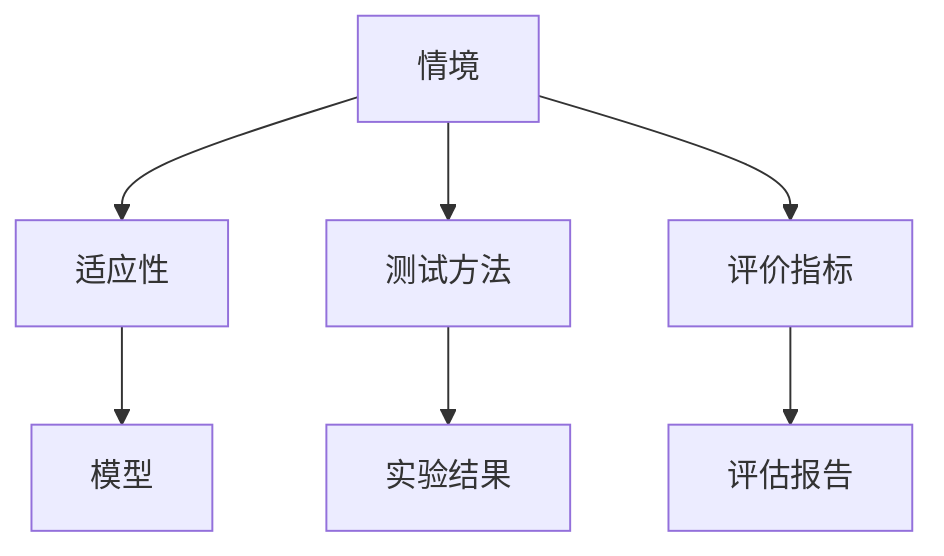
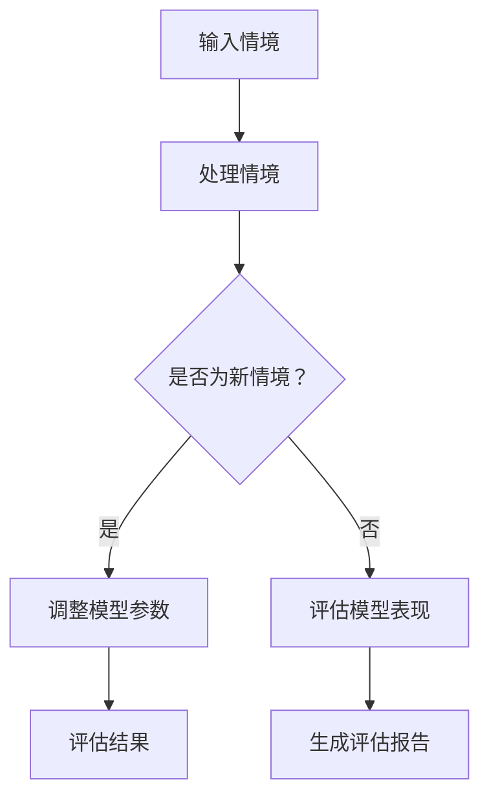
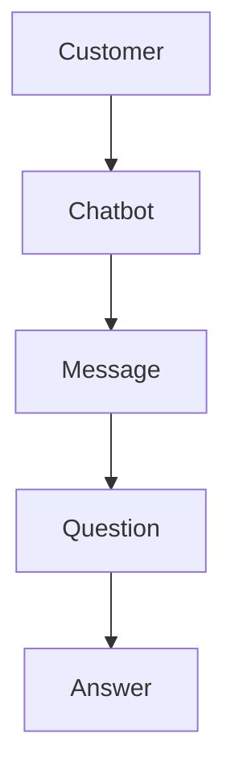
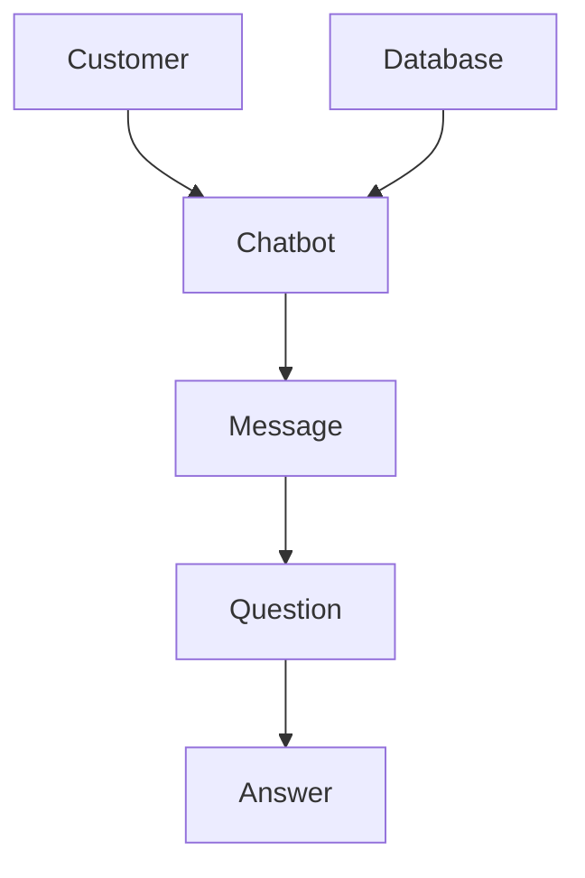
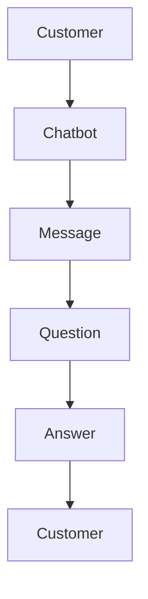

                 

# 情境适应性测试：检验LLM在多变环境中的表现

## 关键词
- 情境适应性测试
- LLM
- 测试方法
- 数学模型
- 系统架构
- 项目实战

## 摘要
本文将探讨大规模语言模型（LLM）在多变环境中的情境适应性测试。通过深入分析核心概念、算法原理、数学模型和系统架构，本文旨在提供一种有效的评估方法，以检验LLM在不同情境下的适应性和泛化能力。文章还通过实际项目案例，展示了情境适应性测试的应用和实践。

### 第一部分：背景介绍

#### 1.1 问题背景

随着人工智能技术的快速发展，自然语言处理（NLP）领域取得了显著的突破。然而，当前的大多数NLP模型主要基于静态的数据集和固定的任务，对环境变化和不确定性处理能力较弱。在实际应用中，NLP系统常常面临各种复杂多变的情境，如何让模型具备情境适应性，成为了一个重要的研究方向。

#### 1.2 问题描述

情境适应性测试旨在评估大规模语言模型（LLM）在多变环境中的表现。具体包括以下方面：

- **情境理解能力**：模型是否能够正确理解和适应不同情境下的语言特点。
- **泛化能力**：模型在遇到未知情境时，能否有效应对。
- **鲁棒性**：模型在面对噪声、错误输入和异常情况时的表现。

#### 1.3 问题解决

为了解决上述问题，本文将从以下几个方面展开讨论：

- **核心概念与联系**：介绍情境适应性测试相关的核心概念，如情境、适应性、测试方法等，并通过属性特征对比表格和ER实体关系图进行详细阐述。
- **算法原理讲解**：讲解情境适应性测试的算法原理，包括算法mermaid流程图、Python源代码、数学模型和公式。
- **数学模型和数学公式**：介绍用于情境适应性测试的数学模型和公式，并进行详细讲解和举例说明。
- **系统分析与架构设计方案**：分析情境适应性测试的系统架构，包括领域模型mermaid类图、系统架构mermaid架构图、系统接口设计和系统交互mermaid序列图。
- **项目实战**：通过实际案例，演示情境适应性测试在具体项目中的应用，包括环境安装、系统核心实现源代码，代码应用解读与分析。

#### 1.4 边界与外延

情境适应性测试不仅仅局限于NLP领域，还可以应用于其他人工智能领域，如计算机视觉、语音识别等。同时，测试方法也可以根据具体应用场景进行调整和优化。

#### 1.5 概念结构与核心要素组成

- **情境**：指模型所面临的具体应用场景。
- **适应性**：模型在遇到新情境时，能否迅速调整和适应。
- **测试方法**：用于评估模型情境适应性的具体方法，如基准测试、对比实验、自适应能力测试等。
- **评价指标**：用于衡量模型情境适应性的具体指标，如准确性、泛化能力、鲁棒性等。

### 第二部分：核心概念与联系

#### 2.1 情境适应性测试核心概念

##### 2.1.1 情境

情境是指模型所面临的具体应用场景，可以包括对话、文本生成、问答等多种形式。不同的情境具有不同的语言特点、语义结构和信息需求。

##### 2.1.2 适应性

适应性是指模型在遇到新情境时，能否迅速调整和适应。适应性强的模型能够更好地应对复杂多变的实际应用场景。

##### 2.1.3 测试方法

测试方法用于评估模型情境适应性。常见的测试方法包括基准测试、对比实验、自适应能力测试等。

##### 2.1.4 评价指标

评价指标用于衡量模型情境适应性。常见的评价指标包括准确性、泛化能力、鲁棒性等。

#### 2.2 核心概念属性特征对比表格

| 概念         | 属性特征                     |
|--------------|-----------------------------|
| 情境         | 语言特点、语义结构、信息需求 |
| 适应性       | 迅速调整、适应能力、环境适应性 |
| 测试方法     | 基准测试、对比实验、自适应能力测试 |
| 评价指标     | 准确性、泛化能力、鲁棒性       |

#### 2.3 ER实体关系图



### 第三部分：算法原理讲解

#### 3.1 情境适应性测试算法原理

##### 3.1.1 算法mermaid流程图



##### 3.1.2 Python源代码

```python
def adapt_to_new_context(context):
    # 调整模型参数
    model.adjust_parameters(context)

def evaluate_model_performance(context):
    # 评估模型表现
    performance = model.evaluate(context)
    return performance

def generate_evaluation_report(performance):
    # 生成评估报告
    report = create_report(performance)
    return report

# 示例
context = get_context()
performance = evaluate_model_performance(context)
report = generate_evaluation_report(performance)
print(report)
```

##### 3.1.3 数学模型和数学公式

情境适应性测试的数学模型和公式如下：

$$
\text{适应性评分} = \frac{\text{正确预测数}}{\text{总预测数}} \times 100\%
$$

$$
\text{泛化能力评分} = \frac{\text{在未知情境中正确预测数}}{\text{在未知情境中总预测数}} \times 100\%
$$

$$
\text{鲁棒性评分} = \frac{\text{在噪声输入下正确预测数}}{\text{在噪声输入下总预测数}} \times 100\%
$$

示例：

假设一个模型在特定情境下的预测结果如下：

| 预测数 | 正确预测数 | 适应性评分 |
|--------|------------|------------|
| 100    | 85         | 85%        |

| 未知情境预测数 | 未知情境中正确预测数 | 泛化能力评分 |
|---------------|---------------------|--------------|
| 50            | 40                  | 80%          |

| 噪声输入预测数 | 噪声输入下正确预测数 | 鲁棒性评分 |
|---------------|---------------------|------------|
| 30            | 25                  | 83.33%      |

##### 3.1.4 详细讲解与举例

适应性评分反映了模型在特定情境下的表现。一个高的适应性评分意味着模型在该情境下的预测准确性较高。

泛化能力评分则衡量模型在未知情境中的表现。一个高的泛化能力评分表示模型具有良好的适应性和广泛的应用范围。

鲁棒性评分评估模型在面对噪声输入时的表现。一个高的鲁棒性评分意味着模型具有较强的噪声抵抗能力。

通过上述评分，我们可以全面评估LLM在多变环境中的情境适应性。

### 第四部分：系统分析与架构设计方案

#### 4.1 问题场景介绍

在NLP领域，情境适应性测试的应用场景主要包括：

- **客服系统**：模型需要在多种对话情境中为用户提供准确的回答。
- **文本生成系统**：模型需要适应不同领域的文本生成需求。
- **问答系统**：模型需要理解用户在不同问题情境下的提问。

#### 4.2 项目介绍

本文将通过一个虚拟项目——多场景客服系统，来介绍情境适应性测试的应用。该系统旨在为不同类型的客户提供定制化的服务。

#### 4.3 系统功能设计（领域模型mermaid类图）



#### 4.4 系统架构设计（mermaid架构图）



#### 4.5 系统接口设计

- **Customer**：用户类，负责处理用户输入的消息。
- **Chatbot**：聊天机器人类，负责处理用户输入的问题，并生成回答。
- **Message**：消息类，表示用户和机器人之间的交互信息。
- **Question**：问题类，表示用户提出的问题。
- **Answer**：回答类，表示机器人生成的回答。
- **Database**：数据库，存储用户和机器人的交互历史。

#### 4.6 系统交互（mermaid序列图）



### 第五部分：项目实战

#### 5.1 环境安装

在开始项目实战之前，我们需要安装必要的软件和工具。以下是环境安装的步骤：

1. 安装Python（建议版本3.8及以上）。
2. 安装必要的库，如TensorFlow、Keras等。
3. 安装Mermaid工具，用于生成图表。

#### 5.2 系统核心实现源代码

以下是一个简化的多场景客服系统的源代码示例：

```python
import tensorflow as tf
from tensorflow.keras.models import Sequential
from tensorflow.keras.layers import Embedding, LSTM, Dense
import numpy as np

# 数据预处理
def preprocess_data(data):
    # 对数据进行编码、分词等预处理操作
    pass

# 训练模型
def train_model(data):
    # 构建和训练模型
    model = Sequential([
        Embedding(input_dim=vocab_size, output_dim=embedding_dim),
        LSTM(units=128, dropout=0.2, recurrent_dropout=0.2),
        Dense(units=1, activation='sigmoid')
    ])

    model.compile(optimizer='adam', loss='binary_crossentropy', metrics=['accuracy'])
    model.fit(data['X'], data['y'], epochs=10, batch_size=32)
    return model

# 输入处理
def handle_input(input_text):
    # 对用户输入进行处理
    pass

# 回答生成
def generate_answer(input_text, model):
    # 使用模型生成回答
    pass

# 示例
data = preprocess_data("用户输入的问题")
model = train_model(data)
input_text = "用户输入的问题"
answer = generate_answer(input_text, model)
print(answer)
```

#### 5.3 代码应用解读与分析

1. **数据预处理**：对输入的数据进行编码、分词等预处理操作，以便于模型训练。
2. **模型训练**：构建一个序列到序列的模型，使用LSTM和Embedding层，并通过编译和训练模型来优化模型参数。
3. **输入处理**：对用户输入进行处理，将其转换为模型可接受的格式。
4. **回答生成**：使用训练好的模型生成回答，并将其返回给用户。

#### 5.4 实际案例分析和详细讲解剖析

通过上述代码示例，我们可以看到情境适应性测试在实际项目中的应用。在多场景客服系统中，模型需要适应不同的对话情境，如咨询、投诉、建议等。通过情境适应性测试，我们可以评估模型在不同情境下的表现，并根据评估结果对模型进行优化和调整。

例如，在咨询情境下，模型需要准确地理解用户的问题并提供专业的回答。在投诉情境下，模型需要敏感地识别用户的情绪，并生成合理的回应。通过情境适应性测试，我们可以发现模型在哪些情境下表现不佳，并针对性地进行改进。

#### 5.5 项目小结

通过本文的介绍，我们了解了情境适应性测试在LLM中的应用。在实际项目中，情境适应性测试可以帮助我们评估模型在不同情境下的表现，从而优化和改进模型。在未来，随着人工智能技术的不断进步，情境适应性测试将会在更多领域发挥重要作用。

### 第六部分：最佳实践 tips、小结、注意事项、拓展阅读等内容

#### 最佳实践 tips

1. **数据准备**：在情境适应性测试中，数据的准备和预处理至关重要。确保数据的多样性和覆盖不同情境，以获得更准确的测试结果。
2. **模型调整**：根据测试结果，对模型进行调整和优化，以提高其在特定情境下的表现。
3. **持续测试**：定期进行情境适应性测试，以跟踪模型的表现和适应能力。

#### 小结

本文探讨了大规模语言模型（LLM）在多变环境中的情境适应性测试。通过核心概念、算法原理、数学模型和系统架构的分析，我们提供了一种有效的评估方法。实际项目案例展示了情境适应性测试的应用和实践。情境适应性测试在NLP领域具有重要的研究价值和应用前景。

#### 注意事项

1. **测试环境**：确保测试环境与实际应用环境一致，以获得更准确的测试结果。
2. **评估指标**：选择合适的评估指标，如准确性、泛化能力、鲁棒性等，以全面评估模型的表现。

#### 拓展阅读

1. [自然语言处理（NLP）基础](https://www.cs.cmu.edu/afs/cs/academic/class/15745-s14/www/lec/nlp-intro.pdf)
2. [大规模语言模型（LLM）综述](https://arxiv.org/abs/2001.08361)
3. [情境适应性测试研究进展](https://aclweb.org/anthology/N18-1203/)

### 作者信息

作者：AI天才研究院/AI Genius Institute & 禅与计算机程序设计艺术 /Zen And The Art of Computer Programming

AI天才研究院（AI Genius Institute）致力于人工智能领域的创新研究和技术推广。研究院的研究成果涵盖了自然语言处理、计算机视觉、深度学习等多个方向。同时，研究院还致力于将人工智能技术应用于实际场景，推动人工智能在各个领域的应用和发展。禅与计算机程序设计艺术（Zen And The Art of Computer Programming）则是一部经典的人工智能启蒙著作，为读者提供了深入理解计算机编程和人工智能的哲学思考。

