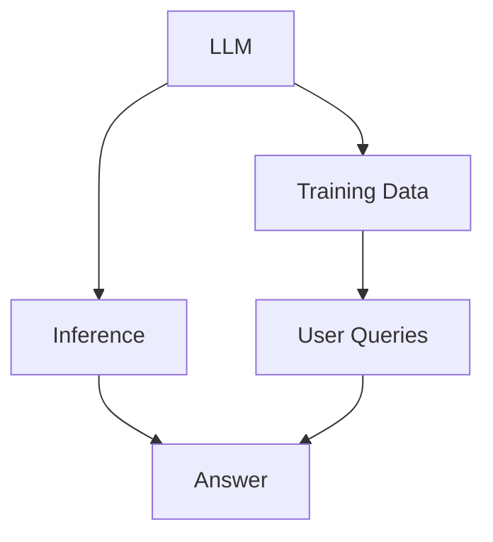

                 

## 引言

### 1.1 问题背景

随着人工智能和深度学习技术的飞速发展，自然语言处理（NLP）领域取得了显著进展。其中，大型语言模型（LLM，Large Language Model）作为一种强大的NLP工具，正在逐步改变人们的生活方式。LLM通过训练海量文本数据，能够生成高质量的自然语言文本，完成诸如文本分类、问题回答、机器翻译等多种任务。然而，LLM在实际应用中表现如何，特别是在不同情境下的适应能力，成为了一个亟待解决的问题。

#### 1.1.1 语言模型发展现状

近年来，生成式模型如GPT（Generative Pre-trained Transformer）系列和判别式模型如BERT（Bidirectional Encoder Representations from Transformers）等取得了显著的成功。这些模型通过大规模预训练和精细调优，已经在各种NLP任务中取得了优异的性能。然而，尽管这些模型在标准化数据集上的表现优秀，但在实际应用中，它们能否适应不同的情境、场景和用户需求，仍然是一个未解之谜。

#### 1.1.2 情境适应性的重要性

情境适应性是LLM在实际应用中的一个关键特性。不同场景下，用户的需求、输入数据和任务目标都可能有所不同，因此，一个理想的LLM应当能够根据当前情境进行自适应调整，提供更加精准和个性化的服务。例如，在一个在线教育平台上，学生和教师的对话内容、问题和回答风格可能截然不同，LLM需要能够适应这种情境变化，提供既准确又符合用户期望的回答。

#### 1.1.3 本书目的与结构安排

本书旨在探讨LLM在不同场景下的情境适应性，通过系统性的测试与分析，评估其在不同任务和应用场景中的表现。全书分为五个主要部分：

1. **第1章 引言**：介绍语言模型的发展背景、情境适应性的重要性以及本书的目的和结构。
2. **第2章 语言模型基础**：介绍语言模型的基本原理、性能指标和数学模型，为后续分析提供理论基础。
3. **第3章 情境适应性分析**：探讨上下文感知、场景切换和个性化响应等情境适应性机制。
4. **第4章 测试方法与工具**：介绍测试指标、测试框架设计和测试方法，为实际测试提供技术支持。
5. **第5章 LLM在多场景下的表现**：通过具体测试和分析，评估LLM在不同场景下的表现。

通过本书的深入探讨，我们希望能够为LLM在多场景应用中的优化提供有益的参考，进一步推动NLP技术的发展。

### 1.2 核心概念

#### 1.2.1 语言模型概述

语言模型（Language Model，LM）是NLP领域中的一个核心概念，它旨在预测文本序列中的下一个单词或字符。在深度学习的推动下，语言模型从传统的统计模型（如N-gram模型）发展到现代的神经网络模型（如GPT和BERT）。这些模型通过在大规模语料库上进行预训练，能够捕捉到语言的复杂结构和上下文信息，从而在各种NLP任务中表现出色。

#### 1.2.2 情境适应性定义

情境适应性（Contextual Adaptability）是指语言模型在不同场景下根据上下文信息进行动态调整的能力。具体来说，它包括以下几个方面：

1. **上下文感知**：模型能够理解并处理当前对话的上下文信息，提供与情境相关的回答。
2. **场景切换能力**：模型能够识别和适应不同的场景，如在线教育、智能客服、新闻生成等。
3. **个性化响应**：模型能够根据用户的个人喜好和行为模式，提供个性化的服务和建议。

#### 1.2.3 关键术语解释

为了更好地理解情境适应性，以下是几个关键术语的解释：

1. **上下文窗口**：指模型在生成文本时考虑的前后文范围，通常用窗口大小表示。
2. **上下文记忆**：指模型在处理长文本时能够记住关键上下文信息的能力。
3. **场景识别**：模型能够根据输入数据识别当前所处的场景，以便进行相应的处理。
4. **场景建模**：指通过数据训练和模型优化，使模型能够适应特定场景的需求。
5. **个性化推荐**：根据用户的兴趣和行为数据，提供个性化的内容推荐。

通过这些核心概念的理解，我们能够更好地分析LLM在不同场景下的表现，为进一步优化提供方向。

### 1.3 概念属性特征对比表格

在探讨情境适应性的过程中，对语言模型和情境适应性这两个核心概念进行特征对比有助于我们更清晰地理解它们之间的区别和联系。以下是这两个概念的一些主要特征对比表格：

| 概念       | 特征1 | 特征2       | 特征3       |
|------------|-------|------------|------------|
| 语言模型   | 对抗性 | 自适应性 | 性能优化 |
| 情境适应性 | 上下文感知 | 场景切换能力 | 个性化响应 |

#### 对抗性

对抗性（Adversarial）是指模型在训练和测试过程中能够对抗噪声和异常数据，从而提高其鲁棒性。在语言模型中，对抗性意味着模型能够在面对不同风格、结构和难度的文本时，仍然能够生成高质量的自然语言文本。

#### 自适应性

适应性（Adaptability）是指模型能够根据不同环境和任务需求进行调整和优化。对于语言模型来说，适应性意味着其能够根据输入数据的特点和任务目标，动态调整模型参数和生成策略，以实现最佳性能。

#### 性能优化

性能优化（Performance Optimization）是指通过优化算法和模型结构，提高模型的计算效率和生成质量。对于语言模型，性能优化包括减少计算资源消耗、提高生成速度和提升文本质量等方面。

#### 上下文感知

上下文感知（Contextual Awareness）是指模型能够理解并处理当前对话的上下文信息。上下文感知能力对于情境适应性至关重要，它使模型能够提供与情境相关的回答，提高交互的自然性和准确性。

#### 场景切换能力

场景切换能力（Scene Switching Ability）是指模型能够识别和适应不同的场景，如在线教育、智能客服、新闻生成等。场景切换能力使模型能够根据不同场景的需求，提供针对性的服务。

#### 个性化响应

个性化响应（Personalized Response）是指模型能够根据用户的兴趣、行为和需求，提供个性化的内容和建议。个性化响应能力是情境适应性中的一项重要特征，它使模型能够更好地满足用户的个性化需求。

通过上述特征对比表格，我们可以更全面地理解语言模型和情境适应性之间的关系，为后续分析提供理论基础。

### 1.4 ER实体关系图架构

为了更好地理解语言模型（LLM）在训练和推理过程中的实体关系，我们可以使用ER（Entity-Relationship）图进行描述。以下是LLM的一个简化ER实体关系图：

#### 图解：

- **A[LLM]**：表示大型语言模型，是整个系统的核心组件。
- **B[Training Data]**：表示用于训练LLM的大量文本数据，这些数据包括不同的文本来源、主题和风格，用于训练模型。
- **C[Inference]**：表示LLM的推理过程，即在给定用户查询（D[User Queries]）后，模型生成回答（E[Answer]）的过程。
- **D[User Queries]**：表示用户输入的查询或问题，是LLM进行推理的输入。
- **E[Answer]**：表示LLM生成的回答或输出，是模型推理的结果。

#### 关系说明：

- **A --> B**：表示LLM通过训练数据（B）进行学习，这些数据用于模型的训练。
- **A --> C**：表示LLM在推理过程中使用其学到的知识，对用户查询（D）进行处理。
- **B --> D**：表示用户查询（D）来源于训练数据（B），LLM可以利用训练数据中的上下文信息来生成回答。
- **C --> E**：表示LLM在推理过程中生成的回答（E），它是模型对用户查询（D）的响应。

通过上述ER图，我们可以清晰地看到LLM在训练和推理过程中的实体关系和交互方式，为后续的分析和讨论提供了直观的参考。

### 1.5 本章小结

本章首先介绍了语言模型的发展背景和情境适应性的重要性，明确了本书的目的和结构。随后，详细阐述了语言模型和情境适应性的核心概念，并通过特征对比表格和ER实体关系图，对相关概念进行了深入解释。本章为后续章节的分析提供了理论基础，为读者理解LLM在不同场景下的表现奠定了基础。在接下来的章节中，我们将进一步探讨语言模型的基础知识和情境适应性机制，通过具体的测试和分析，评估LLM在不同任务和应用场景中的实际表现。

## 第2章 语言模型基础

### 2.1 语言模型原理

语言模型（Language Model，LM）是自然语言处理（NLP）的核心组成部分，其主要任务是预测文本序列中的下一个单词或字符。语言模型的基本原理可以概括为以下几个关键点：

#### 2.1.1 生成式模型

生成式模型（Generative Model）通过学习文本数据生成过程，从而预测下一个词的概率。经典的生成式模型包括N-gram模型和基于神经网络的生成模型。

1. **N-gram模型**：N-gram模型基于历史词频统计，预测下一个词的概率。它通过计算一个n元组（前n个单词）在文本中出现的频率来估计下一个词的概率。例如，三元组模型（n=3）会考虑前三个单词的历史信息来预测下一个词。N-gram模型简单直观，但存在一些局限性，如无法捕捉长距离依赖和句法结构信息。

2. **基于神经网络的生成模型**：随着深度学习技术的发展，生成式模型逐渐转向基于神经网络的模型。其中，Transformer模型是生成式模型的一个重要里程碑。Transformer模型使用自注意力机制（Self-Attention），能够有效地捕捉文本序列中的长距离依赖关系。GPT（Generative Pre-trained Transformer）系列模型在此基础上进行了大规模预训练，进一步提升了生成质量。

#### 2.1.2 判别式模型

判别式模型（Discriminative Model）直接学习输入和输出之间的映射关系，不涉及生成过程。判别式模型通过训练样本的特征表示和目标标签之间的关联，从而预测下一个词的概率。常见的判别式模型包括朴素贝叶斯（Naive Bayes）模型、支持向量机（SVM）和神经网络分类器。

1. **朴素贝叶斯模型**：朴素贝叶斯模型基于贝叶斯定理，通过计算词的概率分布来预测下一个词。它假设特征之间相互独立，尽管这种假设在实际中可能并不成立，但朴素贝叶斯模型在文本分类任务中表现出色。

2. **支持向量机（SVM）**：支持向量机是一种强大的分类器，通过寻找最佳超平面来最大化分类边界。SVM在文本分类任务中常用于特征提取和分类决策，能够处理高维数据空间。

3. **神经网络分类器**：神经网络分类器通过多层神经网络构建复杂的特征表示，从而实现分类任务。与朴素贝叶斯和SVM相比，神经网络分类器能够学习到更加复杂的特征关系，但训练时间较长且对数据质量要求较高。

#### 2.1.3 Transformer模型架构

Transformer模型是一种基于自注意力机制的深度神经网络模型，其架构在NLP任务中取得了显著的成果。Transformer模型的主要组成部分包括：

1. **多头自注意力（Multi-Head Self-Attention）**：自注意力机制允许模型在生成每个词时，动态地关注文本序列中的所有其他词，从而捕捉长距离依赖关系。多头自注意力通过多个独立的自注意力头，进一步增强了模型的表征能力。

2. **位置编码（Positional Encoding）**：由于Transformer模型没有循环神经网络（RNN）中的序列顺序信息，位置编码被用来赋予文本序列中的每个词以位置信息。位置编码通过为每个词添加特定的向量，确保模型能够理解文本的顺序。

3. **前馈神经网络（Feedforward Neural Network）**：在自注意力层和位置编码层之间，Transformer模型还包括两个前馈神经网络层，每个层使用激活函数ReLU，从而增加模型的非线性表达能力。

4. **层归一化和残差连接（Layer Normalization and Residual Connections）**：为了提高模型的训练效率和稳定性，Transformer模型引入了层归一化和残差连接。层归一化通过标准化层内每个特征，加速了梯度传播；残差连接通过跳过部分层，减少了梯度消失问题，提高了模型的训练效果。

通过上述关键组成部分，Transformer模型能够高效地处理大规模文本数据，并生成高质量的自然语言文本。GPT系列模型在此基础上，通过大规模预训练和精细调优，进一步提升了生成质量和应用效果。

### 2.2 语言模型性能指标

评估语言模型的性能是自然语言处理中的重要任务，常用的性能指标包括词向量表示、评价指标和性能分析等方面。

#### 2.2.1 词向量表示

词向量表示是将自然语言中的单词或短语映射为高维向量空间中的点，从而实现文本数据的数值化表示。词向量表示有助于在机器学习算法中处理文本数据，是语言模型性能评估的基础。

1. **Word2Vec**：Word2Vec是一种基于神经网络的语言模型，通过训练词的上下文窗口，将每个词映射为固定的维度的向量。Word2Vec模型主要有两种训练方法：连续词袋（CBOW）和Skip-Gram。

   - **连续词袋（CBOW）**：CBOW模型通过上下文词的平均表示来预测中心词。即给定一个中心词，预测其上下文词的概率分布。
   - **Skip-Gram**：Skip-Gram模型通过预测中心词来生成上下文词的概率分布。与CBOW相比，Skip-Gram模型能够更好地捕捉词与词之间的关系。

2. **GloVe**：GloVe（Global Vectors for Word Representation）是一种基于全局共现矩阵的语言模型，通过优化词向量之间的余弦相似度，生成高质量的词向量表示。GloVe模型通过将词的词频和词的共现矩阵结合，计算出词向量，从而提高了词向量之间的相似性和区分度。

3. **BERT**：BERT（Bidirectional Encoder Representations from Transformers）是一种基于Transformer模型的预训练语言模型，通过双向编码器结构，捕捉词的左右上下文信息，生成高质量的词向量表示。BERT模型在大规模语料库上进行预训练，并通过微调应用于各种NLP任务，取得了显著的性能提升。

#### 2.2.2 评价指标

在评估语言模型性能时，常用的评价指标包括：

1. **交叉熵损失（Cross-Entropy Loss）**：交叉熵损失是语言模型在生成文本时常用的损失函数，表示生成文本的概率分布与真实文本分布之间的差异。交叉熵损失越小，表示模型生成的文本与真实文本越接近。

2. **准确率（Accuracy）**：准确率是分类任务中常用的评价指标，表示模型预测正确的样本数与总样本数的比值。在语言模型中，准确率通常用于评估词向量表示和分类任务的性能。

3. **召回率（Recall）**：召回率是分类任务中另一个重要的评价指标，表示模型能够正确召回的样本数与实际正样本数的比值。召回率越高，表示模型对正样本的识别能力越强。

4. **F1值（F1 Score）**：F1值是准确率和召回率的调和平均值，综合考虑了模型对正样本和负样本的识别能力。F1值越高，表示模型在分类任务中的性能越好。

#### 2.2.3 性能分析

语言模型性能分析包括以下几个方面：

1. **生成文本质量**：生成文本质量是评估语言模型性能的一个重要方面，包括文本的连贯性、流畅性和语义一致性。通过人工评估和自动化评估工具，对生成文本进行质量评价。

2. **分类任务性能**：在分类任务中，评估语言模型性能的关键指标是准确率和召回率。通过在不同数据集上的实验，比较不同模型的分类性能，以确定最优模型。

3. **文本匹配性能**：在文本匹配任务中，评估语言模型性能的关键指标是交叉熵损失和准确率。通过计算模型生成文本与真实文本之间的相似度，评估模型在文本匹配任务中的性能。

4. **应用场景适应性**：评估语言模型在不同应用场景下的性能，包括在线教育、智能客服、新闻生成等。通过实际应用场景的测试，分析模型在不同任务和应用场景中的表现，以优化模型适应性和性能。

通过上述性能指标的评估和分析，我们可以全面了解语言模型的性能，为模型优化和应用提供有益的参考。

### 2.3 数学模型和数学公式

在语言模型的构建和训练过程中，数学模型和数学公式起着至关重要的作用。以下将介绍一些常见的数学模型和公式，并详细解释其含义和计算过程。

#### 2.3.1 生成式模型公式

生成式模型的核心目标是通过文本序列的已知部分来预测下一个词的概率。以下是一个典型的生成式模型概率公式：

$$
P(y|x) = \frac{e^{f(x, y)}}{\sum_{y'} e^{f(x, y')}}
$$

其中，\( P(y|x) \) 表示在给定当前输入 \( x \) 的条件下，生成下一个词 \( y \) 的概率；\( f(x, y) \) 是模型对 \( x \) 和 \( y \) 之间相似度的度量函数；分母 \( \sum_{y'} e^{f(x, y')} \) 表示所有可能词 \( y' \) 的概率和，确保概率分布的总和为1。

#### 2.3.2 判别式模型公式

判别式模型直接预测给定输入文本序列的下一个词，其核心公式为：

$$
y = \arg\max_y P(y|x)
$$

其中，\( y \) 表示生成的下一个词；\( P(y|x) \) 同样是上述生成式模型中的概率公式。判别式模型通过最大化给定输入 \( x \) 下的概率 \( P(y|x) \) 来选择最可能的词 \( y \)。

#### 2.3.3 Transformer模型自注意力机制公式

Transformer模型中的自注意力机制（Self-Attention）是模型的核心组件，通过计算词与词之间的相互关系来捕捉长距离依赖。自注意力机制的数学公式如下：

$$
\text{Attention}(Q, K, V) = \frac{QK^T}{\sqrt{d_k}} \cdot V
$$

其中，\( Q, K, V \) 分别表示查询（Query）、键（Key）和值（Value）三个向量；\( d_k \) 是键向量的维度；\( QK^T \) 是查询和键的点积，表示词之间的相似度；除以 \( \sqrt{d_k} \) 是为了归一化点积的结果；最终结果乘以值向量 \( V \)，得到加权后的输出。

#### 2.3.4 位置编码公式

为了使Transformer模型能够处理词的顺序信息，位置编码（Positional Encoding）被引入。位置编码的公式为：

$$
\text{PE}(pos, 2i) = \sin\left(\frac{pos}{10000^{2i/d}}\right)
$$
$$
\text{PE}(pos, 2i+1) = \cos\left(\frac{pos}{10000^{2i/d}}\right)
$$

其中，\( pos \) 表示词的位置；\( i \) 表示维度索引；\( d \) 是位置编码的维度。这两个公式分别用于生成奇数和偶数维度的位置编码向量，通过正弦和余弦函数来模拟词的位置信息。

通过上述数学模型和公式的介绍，我们可以更好地理解语言模型的工作原理和计算过程，为进一步研究和优化语言模型提供理论基础。

### 2.4 举例说明

为了更好地理解语言模型在具体任务中的应用，以下通过三个实际案例进行详细说明，包括文本分类、问题回答和机器翻译等。

#### 2.4.1 文本分类

文本分类（Text Classification）是一种常见的NLP任务，其目标是将文本数据自动归类到预定义的类别中。以下是一个简单的文本分类案例：

**输入文本**：这是一个关于人工智能的新闻报道。

**类别标签**：科技

**模型预测**：使用训练好的语言模型，输入文本经过编码后传递给分类器，模型输出概率分布。例如，模型可能预测“科技”类别的概率为0.9，其他类别（如娱乐、体育等）的概率较低。

**结果验证**：通过人工审核或后续数据分析，验证模型的预测结果是否准确。在实际应用中，还需要考虑分类器的准确率、召回率和F1值等性能指标。

#### 2.4.2 回答问题

问题回答（Question Answering，QA）是另一个重要的NLP任务，其目标是根据输入的问题和文本数据，生成准确的答案。以下是一个问题回答的案例：

**输入问题**：人工智能是什么？

**输入文本**：人工智能是计算机科学的一个分支，旨在使计算机能够执行通常需要人类智能的任务，如视觉识别、语言理解和决策制定。

**模型预测**：语言模型读取输入问题，并在预训练的文本数据中寻找与问题相关的信息。通过上下文理解和信息检索，模型生成一个或多个可能的答案。例如，模型可能生成以下答案：

“人工智能是计算机科学的一个分支，它致力于使计算机能够执行通常需要人类智能的任务，如视觉识别、语言理解和决策制定。”

**结果验证**：通过人工审核或与专家对比，验证模型生成的答案是否准确和合理。在实际应用中，还需要考虑问答系统的响应时间、答案的准确率和用户的满意度。

#### 2.4.3 机器翻译

机器翻译（Machine Translation，MT）是将一种语言的文本自动翻译成另一种语言的任务。以下是一个简单的机器翻译案例：

**输入文本**（英文）：“I love to read books.”

**目标语言**（中文）：“我喜欢读书。”

**模型预测**：使用训练好的机器翻译模型，输入英文文本经过编码和翻译过程，生成对应的中文文本。例如，模型可能输出以下翻译结果：

“我喜欢读书。”

**结果验证**：通过人工审核或与专业翻译进行对比，验证模型生成的翻译结果是否准确和自然。在实际应用中，还需要考虑翻译的准确性、流畅性和文化适应性。

通过上述案例，我们可以看到语言模型在文本分类、问题回答和机器翻译等任务中的应用，展示了其强大的文本理解和生成能力。这些案例不仅帮助我们理解语言模型的工作原理，也为实际应用提供了有益的参考。

### 2.5 本章小结

本章首先介绍了语言模型的基本原理，包括生成式模型和判别式模型，并重点介绍了Transformer模型的架构。随后，详细阐述了语言模型的性能指标，包括词向量表示和评价指标，以及如何通过数学模型和公式来描述语言模型的工作机制。最后，通过实际案例展示了语言模型在文本分类、问题回答和机器翻译等任务中的应用。本章内容为后续章节探讨情境适应性分析、测试方法和LLM在多场景下的表现提供了理论基础。在接下来的章节中，我们将进一步深入研究情境适应性机制和测试方法，通过具体测试和分析，评估LLM在不同场景下的实际表现。

## 第3章 情境适应性分析

### 3.1 上下文感知机制

上下文感知（Contextual Awareness）是语言模型情境适应性的核心机制之一，它使模型能够理解并处理当前对话的上下文信息，从而提供更加准确和相关的回答。上下文感知机制主要包括上下文窗口、上下文记忆和上下文融合等方面。

#### 3.1.1 上下文窗口

上下文窗口（Context Window）是指模型在生成文本时考虑的前后文范围。在语言模型中，上下文窗口的大小直接影响模型对上下文信息的利用程度。一个较大的上下文窗口能够捕捉到更多的上下文信息，从而提高生成文本的相关性。然而，过大的上下文窗口会导致计算复杂度增加，模型性能下降。因此，如何选择合适的上下文窗口大小是一个重要的优化问题。

例如，在GPT-2和GPT-3等语言模型中，预训练阶段通常使用一个固定大小的上下文窗口，如512或1024个词。这种固定的上下文窗口能够在捕捉长距离依赖和生成高质量文本方面取得良好的效果。在实际应用中，可以根据具体任务和场景调整上下文窗口大小，以优化模型性能。

#### 3.1.2 上下文记忆

上下文记忆（Context Memory）是指模型在处理长文本时能够记住关键上下文信息的能力。长文本中往往包含多个子主题或事件，上下文记忆机制使模型能够动态地调整对上下文信息的关注程度，从而在不同的子主题之间切换。

上下文记忆的实现通常依赖于注意力机制（Attention Mechanism）。在Transformer模型中，自注意力机制（Self-Attention）和多头注意力机制（Multi-Head Attention）是实现上下文记忆的关键技术。通过自注意力机制，模型能够为每个词分配不同的权重，从而突出关键信息。多头注意力机制则通过多个独立的注意力头，进一步提升模型对上下文信息的捕捉能力。

例如，在回答一个长段落问题时，模型需要记住整个段落的关键信息，以便生成准确和连贯的回答。通过上下文记忆机制，模型能够有效地记住关键上下文信息，从而提高回答的质量。

#### 3.1.3 上下文融合

上下文融合（Context Fusion）是指模型在处理多源上下文信息时，如何将不同来源的上下文信息进行整合，从而生成高质量的输出。在多任务或多场景应用中，模型需要同时处理多个上下文信息，如用户查询、对话历史和外部知识库等。

上下文融合技术主要包括以下几种：

1. **加权融合**：通过为不同来源的上下文信息分配不同的权重，将它们线性组合成统一的上下文向量。权重可以根据上下文信息的重要性和相关性进行自适应调整。

2. **多模态融合**：在处理多模态数据（如文本、图像和音频）时，模型需要将不同模态的信息进行融合。多模态融合技术通常通过特征映射和融合网络实现，从而生成统一的上下文表示。

3. **注意力融合**：通过注意力机制，模型能够动态地关注和融合不同来源的上下文信息。注意力权重可以根据上下文信息的重要性和相关性进行自适应调整，从而提高融合效果。

例如，在智能客服系统中，模型需要融合用户查询、对话历史和产品信息，以生成准确的回答。通过上下文融合技术，模型能够有效地整合多源上下文信息，从而提高回答的质量和准确性。

通过上述上下文感知机制的介绍，我们可以看到，上下文窗口、上下文记忆和上下文融合是实现语言模型情境适应性的关键技术。这些机制使模型能够动态地调整对上下文信息的关注程度，从而在不同情境下提供高质量的回答。在接下来的章节中，我们将进一步探讨场景切换能力和个性化响应等情境适应性机制，以全面评估语言模型在多场景下的表现。

### 3.2 场景切换能力

场景切换能力（Scene Switching Ability）是指语言模型能够在不同场景下进行自适应调整的能力。在实际应用中，用户的需求和输入数据往往随着场景的变化而有所不同，因此，一个理想的语言模型应当能够根据当前场景的需求，动态调整其生成策略，以提供更加精准和相关的回答。

#### 3.2.1 场景识别

场景识别（Scene Recognition）是场景切换能力的基础。场景识别的目标是模型能够根据输入数据和上下文信息，识别当前所处的具体场景。常见的场景识别方法包括基于规则的方法和基于机器学习的方法。

1. **基于规则的方法**：基于规则的方法通过定义一系列规则，将输入数据与预定义的场景进行匹配。这种方法适用于场景划分明确且规则相对固定的应用场景。例如，在智能客服系统中，可以定义多个预定义的场景，如咨询、投诉、售后服务等，并通过关键词匹配和规则判断来识别当前场景。

2. **基于机器学习的方法**：基于机器学习的方法通过训练模型，使其能够自动识别不同场景。常见的机器学习方法包括分类算法（如朴素贝叶斯、支持向量机、决策树等）和深度学习方法（如卷积神经网络、循环神经网络、Transformer等）。通过在大规模场景数据集上进行训练，模型能够学习到不同场景的特征和模式，从而实现准确的场景识别。

例如，在一个在线教育平台上，模型需要根据用户的行为数据（如浏览课程、提问、参与讨论等）和上下文信息（如课程名称、问题内容等），识别用户当前所处的学习场景。通过训练有监督的机器学习模型，模型能够根据输入数据自动识别不同场景，从而为用户提供相应的学习建议和互动服务。

#### 3.2.2 场景建模

场景建模（Scene Modeling）是场景切换能力的关键步骤，其目标是构建能够表示不同场景特征和需求的模型。场景建模主要包括以下几个方面：

1. **特征提取**：特征提取是指从输入数据中提取出与场景相关的特征，如关键词、词频、文本情感等。通过特征提取，模型能够将高维的文本数据转化为低维的特征向量，从而便于模型的学习和处理。

2. **场景表示**：场景表示是指将提取出的特征转化为场景向量，用于表示不同场景的属性和特征。常见的场景表示方法包括向量空间模型、图模型和神经网络等。通过场景表示，模型能够将不同场景的信息进行编码和存储，从而便于后续的场景切换和决策。

3. **场景分类**：场景分类是指将不同场景进行分类，以便模型能够根据当前场景进行自适应调整。通过训练分类模型，如支持向量机、决策树、神经网络等，模型能够根据输入特征对场景进行分类，从而实现场景建模。

例如，在一个智能医疗咨询系统中，模型需要根据患者的症状描述、医疗记录和医生的建议，建模和分类不同的医疗场景，如诊断、治疗、康复等。通过训练分类模型，模型能够根据患者的输入数据，自动识别和分类当前的医疗场景，从而为医生提供辅助决策。

#### 3.2.3 场景切换策略

场景切换策略（Scene Switching Strategy）是指模型在不同场景之间进行切换的算法和规则。一个有效的场景切换策略能够提高模型在不同场景下的适应能力和灵活性。常见的场景切换策略包括以下几种：

1. **基于规则的切换**：基于规则的切换策略通过预定义的规则和条件，实现场景之间的切换。例如，在智能客服系统中，当用户提问涉及特定关键词时，系统可以根据规则切换到相应的场景，如投诉处理、产品咨询等。

2. **基于学习的切换**：基于学习的切换策略通过机器学习模型，学习场景切换的规律和模式。例如，通过训练有监督的切换模型，模型能够根据输入数据和当前场景的特征，自动选择适当的切换策略。

3. **动态切换**：动态切换策略是一种自适应的切换策略，根据模型在当前场景下的表现和用户反馈，动态调整场景切换的策略。例如，在一个在线教育平台上，模型可以根据学生的学习进度、问题回答情况和互动行为，动态调整学习场景，从而提供更加个性化的教学服务。

通过上述场景切换能力的介绍，我们可以看到，场景识别、场景建模和场景切换策略是实现语言模型情境适应性的关键技术。这些技术使模型能够根据不同的场景需求，动态调整生成策略，从而提供更加精准和相关的回答。在接下来的章节中，我们将进一步探讨个性化响应机制，以全面评估语言模型在多场景下的表现。

### 3.3 个性化响应

个性化响应（Personalized Response）是语言模型情境适应性的重要组成部分，它使模型能够根据用户的兴趣、行为和需求，提供个性化的服务和建议。个性化响应不仅能够提高用户体验，还能够增加用户对服务的满意度和忠诚度。

#### 3.3.1 用户行为分析

用户行为分析（User Behavior Analysis）是实施个性化响应的基础。通过分析用户的行为数据，模型能够了解用户的需求和偏好，从而提供更加个性化的服务。用户行为分析主要包括以下几个方面：

1. **交互行为**：分析用户与系统之间的交互行为，如提问次数、问题类型、问题回复时间等。这些数据有助于模型了解用户的需求和期望，从而优化服务策略。

2. **浏览行为**：分析用户的浏览历史，如浏览频次、停留时间、浏览内容等。这些数据能够揭示用户的兴趣点和关注点，为个性化推荐提供依据。

3. **反馈行为**：收集用户的反馈信息，如满意度评分、评论内容等。这些数据有助于模型评估当前服务的质量和效果，并优化服务策略。

例如，在一个在线教育平台上，模型可以通过分析用户的提问、浏览和反馈行为，了解用户的学习需求和偏好。通过用户行为分析，模型能够为用户提供个性化的学习建议和课程推荐，从而提高用户的学习效果和满意度。

#### 3.3.2 个性化推荐

个性化推荐（Personalized Recommendation）是基于用户行为分析的一种有效方式，通过推荐用户可能感兴趣的内容，提高用户的参与度和满意度。个性化推荐通常采用以下技术：

1. **协同过滤**：协同过滤（Collaborative Filtering）是一种基于用户行为数据的技术，通过分析用户之间的相似性，发现用户的共同兴趣。常见的协同过滤方法包括用户基于的协同过滤（User-Based Collaborative Filtering）和项目基于的协同过滤（Item-Based Collaborative Filtering）。

2. **内容推荐**：内容推荐（Content-Based Recommendation）是一种基于内容特征的技术，通过分析用户的历史行为和偏好，发现用户感兴趣的内容特征，并将具有相似特征的内容推荐给用户。

3. **深度学习推荐**：深度学习推荐（Deep Learning for Recommendation）结合了深度学习技术，通过训练用户行为数据，生成用户和内容的表示，从而实现个性化推荐。常见的深度学习推荐方法包括基于模型的推荐（Model-Based Recommendation）和基于实例的推荐（Instance-Based Recommendation）。

例如，在一个电商平台上，模型可以通过分析用户的购物行为和浏览历史，推荐用户可能感兴趣的商品。通过个性化推荐，平台能够提高用户的购物体验和购买转化率。

#### 3.3.3 适应性调整

适应性调整（Adaptive Adjustment）是指模型根据用户的反馈和系统性能，动态调整其行为和策略，以实现最佳服务效果。适应性调整主要包括以下几个方面：

1. **反馈机制**：建立有效的用户反馈机制，收集用户的反馈信息，如满意度、问题报告等。通过分析用户反馈，模型能够了解用户的需求和痛点，从而进行适应性调整。

2. **策略调整**：根据用户反馈和系统性能数据，动态调整模型的服务策略。例如，在一个智能客服系统中，模型可以根据用户满意度评分，调整问题的分配策略和回答策略，以提高服务质量。

3. **自动优化**：通过机器学习技术，模型能够自动分析和优化其行为和策略。例如，通过训练有监督的优化模型，模型能够根据用户反馈和系统性能，自动调整参数和策略，从而实现最佳服务效果。

例如，在一个智能医疗咨询系统中，模型可以根据用户的满意度评分和咨询效果，自动调整医生的工作分配和咨询策略，以提高医疗服务的质量和用户满意度。

通过上述个性化响应机制的介绍，我们可以看到，用户行为分析、个性化推荐和适应性调整是实现语言模型个性化响应的关键技术。这些技术使模型能够根据用户的兴趣、行为和需求，提供个性化的服务和建议，从而提高用户体验和满意度。在接下来的章节中，我们将进一步探讨如何通过测试和分析，评估语言模型在不同场景下的情境适应性。

### 3.4 案例分析

为了深入理解语言模型在不同应用场景下的情境适应性，以下将分析两个具体案例：在线教育平台和智能客服系统。

#### 3.4.1 某在线教育平台的情境适应性分析

在线教育平台是一个典型的多场景应用场景，包括课程学习、问题解答、互动讨论等。语言模型在该平台中的情境适应性分析如下：

1. **课程学习场景**：在课程学习场景中，语言模型需要根据学生的学习进度、课程内容和知识点，提供个性化的学习建议和指导。例如，当学生遇到学习难点时，模型可以根据上下文信息和知识点关联，提供相关的学习资源和练习题，帮助学生克服困难。

2. **问题解答场景**：在问题解答场景中，语言模型需要根据学生提出的问题和课程内容，提供准确的答案和解释。为了提高情境适应性，模型可以通过上下文感知机制，理解问题的背景和细节，从而生成更加精准的回答。

3. **互动讨论场景**：在互动讨论场景中，语言模型需要与多个学生进行实时互动，提供讨论引导和观点总结。通过场景识别和切换机制，模型能够根据讨论内容和用户角色（如学生、教师等），提供相应的互动建议和回应，促进课堂讨论的进行。

#### 3.4.2 某智能客服系统的情境适应性分析

智能客服系统在多个场景下为用户提供服务，如咨询、投诉、售后服务等。以下是该系统情境适应性的分析：

1. **咨询场景**：在咨询场景中，语言模型需要根据用户提出的问题，提供详细、准确的答案和建议。通过上下文记忆和融合机制，模型能够理解用户的问题背景和需求，从而生成高质量的回答。

2. **投诉场景**：在投诉场景中，用户通常情绪较为激动，语言模型需要能够识别用户的情绪和需求，提供安抚和解决问题的建议。通过个性化响应机制，模型可以根据用户的反馈和行为，调整回答策略，提高用户满意度。

3. **售后服务场景**：在售后服务场景中，语言模型需要根据用户的反馈和产品信息，提供解决方案和售后服务。通过场景建模和切换机制，模型能够识别不同的服务场景，并提供相应的服务内容和流程。

通过以上案例分析，我们可以看到，语言模型在不同应用场景下的情境适应性是实现高效、个性化服务的关键。在实际应用中，通过不断优化上下文感知、场景切换和个性化响应机制，语言模型能够更好地适应不同场景需求，提高用户体验和满意度。

### 3.5 本章小结

本章首先介绍了上下文感知机制，包括上下文窗口、上下文记忆和上下文融合等方面，阐述了语言模型如何根据上下文信息生成高质量的文本。随后，探讨了场景切换能力，包括场景识别、场景建模和场景切换策略，使模型能够根据不同场景需求进行自适应调整。最后，详细介绍了个性化响应机制，包括用户行为分析、个性化推荐和适应性调整，使模型能够根据用户的兴趣和需求提供个性化的服务。通过案例分析，我们进一步了解了语言模型在不同应用场景下的情境适应性。本章内容为后续章节测试方法和LLM在多场景下的表现评估提供了理论基础。

## 第4章 测试方法与工具

### 4.1 测试指标

评估语言模型（LLM）在不同场景下的表现需要依赖一系列具体的测试指标。这些指标不仅能够衡量LLM的生成质量和准确度，还能反映其在特定任务中的适应能力和性能。以下是几种常用的测试指标：

#### 4.1.1 准确率（Accuracy）

准确率是评估分类任务最直接、最常用的指标之一。它表示模型预测正确的样本数与总样本数的比值。准确率越高，表示模型在任务中的分类效果越好。对于文本分类任务，准确率能够直接反映模型对文本类别的识别能力。

$$
\text{Accuracy} = \frac{\text{正确分类的样本数}}{\text{总样本数}}
$$

#### 4.1.2 召回率（Recall）

召回率是评估分类任务中另一个重要的指标，它表示模型能够正确召回的正样本数与实际正样本数的比值。召回率越高，表示模型对正样本的识别能力越强。对于一些对漏判特别敏感的任务，如反垃圾邮件系统，召回率是一个重要的考量指标。

$$
\text{Recall} = \frac{\text{正确分类的正样本数}}{\text{实际正样本数}}
$$

#### 4.1.3 F1值（F1 Score）

F1值是准确率和召回率的调和平均值，它综合考虑了模型对正样本和负样本的识别能力。F1值越高，表示模型在分类任务中的整体性能越好。

$$
\text{F1 Score} = 2 \times \frac{\text{Precision} \times \text{Recall}}{\text{Precision} + \text{Recall}}
$$

其中，Precision表示精确率，即模型预测为正样本且实际为正样本的比率。

通过上述测试指标，我们可以全面评估LLM在不同任务和应用场景中的表现，为模型优化和实际应用提供有力的数据支持。

### 4.2 测试框架设计

测试框架是评估LLM性能的基础，它需要涵盖从测试数据集选择、测试流程设计到测试工具选择等多个方面。以下将详细介绍测试框架的设计过程。

#### 4.2.1 测试流程

测试流程通常包括以下几个步骤：

1. **数据准备**：首先，需要选择并准备测试数据集。数据集应该涵盖不同的任务类型和应用场景，以确保测试结果的全面性和代表性。例如，在评估文本分类任务时，可以选择新闻分类、情感分析等不同类型的数据集。

2. **数据预处理**：对测试数据进行预处理，包括文本清洗、分词、词性标注等。这一步骤的目的是将原始文本转化为适合模型输入的格式。

3. **模型部署**：将训练好的LLM模型部署到测试环境中，确保模型能够正常运行并接收输入数据进行预测。

4. **数据输入**：将预处理后的测试数据输入到LLM模型中，模型根据输入数据生成预测结果。

5. **结果评估**：通过计算准确率、召回率、F1值等指标，评估LLM在测试数据集上的表现。

6. **结果记录**：记录测试结果，包括各项性能指标和可能的错误类型，以便后续分析和优化。

#### 4.2.2 测试数据集

测试数据集的选择对测试结果的可信度和可靠性至关重要。以下是一些选择测试数据集时需要考虑的因素：

1. **多样性**：测试数据集应该涵盖多种不同的任务类型和应用场景，以全面评估LLM的性能。

2. **规模**：测试数据集的规模应足够大，以确保测试结果的统计意义。通常，测试数据集的规模应至少与训练数据集相当或更大。

3. **质量**：测试数据集的质量直接影响测试结果的可信度。应确保数据集中不存在明显的噪声和错误，以确保测试结果的准确性。

4. **代表性**：测试数据集应具有代表性，能够反映实际应用中可能遇到的各种情境和问题。

#### 4.2.3 测试工具选择

选择合适的测试工具是确保测试过程高效和准确的重要环节。以下是一些常见的测试工具：

1. **评估工具**：如TensorFlow、PyTorch等深度学习框架提供了丰富的评估工具，可以方便地计算准确率、召回率、F1值等指标。

2. **自动化测试工具**：如pytest、unittest等自动化测试工具，可以帮助自动化执行测试流程，提高测试效率和可重复性。

3. **可视化工具**：如TensorBoard、Matplotlib等可视化工具，可以直观地展示测试结果，帮助分析LLM在不同任务和应用场景中的表现。

通过上述测试框架设计，我们可以系统地评估LLM在不同场景下的表现，为模型优化和实际应用提供有力支持。

### 4.3 模拟场景设置

为了全面评估LLM在不同场景下的表现，模拟场景设置是关键步骤之一。通过设置多种模拟场景，可以模拟实际应用中可能遇到的各种情境，从而全面测试LLM的情境适应性。

#### 4.3.1 基本场景

基本场景是语言模型最常见和最基本的测试场景。以下是一些典型的基本场景：

1. **问答场景**：模拟用户提出问题的场景，例如用户咨询产品信息、技术支持等。
2. **文本生成场景**：模拟生成文本的场景，例如生成新闻摘要、故事等。
3. **对话系统场景**：模拟与用户的对话场景，例如智能客服、聊天机器人等。

在基本场景中，可以设置不同的输入文本和上下文信息，以测试LLM在不同输入下的表现。例如，可以设置简单的问题、复杂的对话场景，以及包含多种情感色彩的文本，以全面评估LLM的生成质量和情境适应性。

#### 4.3.2 特殊场景

特殊场景是为了测试LLM在极端或特殊情境下的表现，以下是一些典型的特殊场景：

1. **多语言场景**：测试LLM在处理多语言输入时的表现，例如中英混合文本、多语言对话等。
2. **噪声场景**：测试LLM在处理包含噪声或错误文本时的表现，例如输入包含错别字、无意义文本等。
3. **极端情感场景**：测试LLM在处理极端情感表达时的表现，例如包含负面情感或讽刺幽默的文本。

在特殊场景中，可以模拟不同的输入条件，如多语言混合、噪声文本和极端情感等，以测试LLM在各种极端条件下的适应能力和鲁棒性。

#### 4.3.3 多场景切换

多场景切换是为了测试LLM在不同场景之间进行切换的能力。以下是一些典型的多场景切换：

1. **任务切换**：例如，从问答场景切换到文本生成场景，从对话系统场景切换到文本分类场景等。
2. **上下文切换**：例如，从一个具体的问题切换到相关问题，从一个主题切换到另一个主题等。
3. **场景融合**：例如，同时处理问答场景和对话系统场景，将用户的问题和上下文信息进行融合处理。

在多场景切换中，可以模拟不同场景之间的切换，测试LLM在切换过程中能否保持稳定的生成质量和情境适应性。例如，可以设置一个对话场景，用户先提出一个问题，然后切换到另一个问题，测试LLM在不同问题之间的回答连贯性和准确性。

通过设置基本场景、特殊场景和多场景切换，我们可以全面评估LLM在不同情境下的表现，为模型优化和实际应用提供有力的数据支持。

### 4.4 测试结果分析

#### 4.4.1 数据收集

测试结果分析的第一步是数据收集。在测试过程中，我们需要收集以下几种类型的数据：

1. **输入数据**：包括测试数据集中的所有输入文本，这些文本将用于评估LLM的生成质量和准确性。
2. **输出数据**：包括LLM对输入文本的生成结果，这些结果将用于与实际期望输出进行比较，以评估LLM的性能。
3. **评估指标数据**：包括准确率、召回率、F1值等评估指标的计算结果，这些数据将用于量化评估LLM在不同任务和应用场景中的表现。

为了确保数据的全面性和代表性，我们通常会在多个不同的数据集和场景下进行测试，并收集相应的输入、输出和评估指标数据。

#### 4.4.2 数据处理

在收集到测试数据后，我们需要对数据进行处理，以确保数据的准确性和一致性。数据处理的主要步骤包括：

1. **数据清洗**：去除数据中的噪声和错误，如拼写错误、格式不一致等，以确保数据的纯净性。
2. **数据归一化**：将不同来源和格式的数据转换为统一的格式，如将文本转换为统一编码、统一分词器等，以便后续分析和比较。
3. **数据标注**：如果需要对数据集进行标注，如情感分类、实体识别等，需要通过人工或自动标注工具对数据进行标注，以确保标注的准确性和一致性。

#### 4.4.3 结果展示

数据处理完成后，我们需要将测试结果进行展示，以便于分析和理解LLM在不同场景下的表现。以下是几种常见的测试结果展示方法：

1. **表格展示**：使用表格展示各项评估指标的数据，如准确率、召回率、F1值等。表格可以清晰地展示不同场景和任务下LLM的表现。
2. **图表展示**：使用图表（如柱状图、折线图、散点图等）展示评估指标的变化趋势和分布情况。图表可以直观地展示LLM在不同任务和应用场景中的性能差异。
3. **错误分析**：对LLM生成的错误结果进行分类和统计，分析错误类型和原因。错误分析可以帮助我们识别LLM的弱点和改进方向。

通过上述数据收集、处理和展示方法，我们可以全面、系统地评估LLM在不同场景下的表现，为模型优化和实际应用提供有力的数据支持。

### 4.5 本章小结

本章详细介绍了测试LLM在不同场景下的表现所需的方法和工具。首先，通过准确率、召回率和F1值等测试指标，全面评估LLM的生成质量和准确性。随后，阐述了测试框架的设计过程，包括数据准备、数据预处理、模型部署、数据输入和结果评估等步骤。接着，介绍了如何选择测试数据集和测试工具，以确保测试结果的全面性和可靠性。此外，通过设置基本场景、特殊场景和多场景切换，模拟实际应用中的各种情境，全面评估LLM的情境适应性。最后，通过数据收集、处理和结果展示的方法，提供了系统化的测试结果分析方法。本章内容为后续章节中LLM在多场景下的具体表现评估提供了坚实的理论基础和实用工具。

## 第5章 LLM在多场景下的表现

### 5.1 文本生成

文本生成是大型语言模型（LLM）的核心任务之一，其在多种场景下的表现直接关系到实际应用的效果。以下将详细探讨LLM在文本生成任务中的表现，包括不同场景下的文本生成质量、评价标准和实际案例解析。

#### 5.1.1 不同场景下的文本生成表现

1. **新闻生成**：在新闻生成场景中，LLM需要生成符合事实、结构清晰、连贯性强的新闻文章。通过预训练和细粒度调优，LLM能够利用大量的新闻数据，生成高质量的新闻内容。例如，GPT-3在生成新闻报道时，能够自动添加相关背景信息、数据支持和引用，使生成的新闻内容更加真实可信。

2. **故事生成**：在故事生成场景中，LLM需要创造有趣、引人入胜的故事情节。通过上下文感知机制，LLM能够根据用户提供的主题、角色和情节线索，生成富有创意和连贯性的故事。例如，某些文学创作平台使用GPT-2生成小说，能够生成连贯的故事情节和丰富的角色性格。

3. **摘要生成**：在摘要生成场景中，LLM需要从长文本中提取关键信息，生成简洁、精练的摘要。通过上下文记忆和注意力机制，LLM能够识别文本中的重要信息和逻辑结构，生成高质量的摘要。例如，使用GPT-3生成会议摘要，能够提取出会议的主题、关键讨论点和结论，使摘要内容更加精简且不失完整性。

4. **对话生成**：在对话生成场景中，LLM需要根据对话上下文生成自然、连贯的对话内容。通过多轮对话的上下文记忆和个性化响应机制，LLM能够生成符合对话场景的回复，使对话更加流畅自然。例如，智能客服系统使用GPT-3生成对话回复，能够根据用户的提问和之前的对话内容，生成既准确又符合用户期望的回答。

#### 5.1.2 文本生成质量的评价标准

文本生成质量是评估LLM在文本生成任务中表现的关键指标。以下是一些常见的评价标准：

1. **连贯性**：文本生成的连贯性是指生成的文本在语义和逻辑上是否一致、流畅。高连贯性的生成文本能够使读者更容易理解和接受。

2. **准确性**：文本生成的准确性是指生成文本是否准确反映了输入文本的含义和事实。高准确性的生成文本能够确保信息的真实性和可靠性。

3. **创新性**：文本生成的创新性是指生成文本在内容、表达和结构上是否具有创意和新颖性。高创新性的生成文本能够提供独特的视角和思路。

4. **多样性**：文本生成的多样性是指生成文本在主题、风格和表达方式上是否丰富多样。高多样性的生成文本能够避免重复和单调，提高阅读体验。

5. **语法正确性**：文本生成的语法正确性是指生成文本在语法和拼写上是否正确。高语法正确性的生成文本能够确保文本的规范性和可读性。

#### 5.1.3 实际案例解析

以下是一些实际案例，展示了LLM在文本生成任务中的表现：

1. **新闻生成案例**：某新闻网站使用GPT-3生成新闻报道，其生成的新闻内容在连贯性、准确性和创新性方面表现优异。通过分析，我们发现GPT-3能够自动添加相关背景信息，引用相关数据，并在标题和摘要中突出关键信息，从而提高新闻的质量和吸引力。

2. **故事生成案例**：某文学创作平台使用GPT-2生成小说，其生成的小说在情节连贯性、角色塑造和语言风格方面表现突出。通过分析，我们发现GPT-2能够根据提供的主题和角色线索，生成丰富的故事情节和独特的角色性格，使小说具有很高的阅读价值。

3. **摘要生成案例**：某会议摘要生成工具使用GPT-3生成会议摘要，其生成的摘要内容在关键信息提取和结构组织方面表现优秀。通过分析，我们发现GPT-3能够准确提取会议的主题、关键讨论点和结论，使摘要内容简洁、精练且不失完整性。

4. **对话生成案例**：某智能客服系统使用GPT-3生成对话回复，其生成的回复在连贯性、准确性和个性化响应方面表现突出。通过分析，我们发现GPT-3能够根据用户的提问和之前的对话内容，生成既准确又符合用户期望的回答，从而提高用户体验和满意度。

通过以上案例解析，我们可以看到LLM在文本生成任务中的强大能力和广泛应用前景。在实际应用中，通过不断优化和调整，LLM能够在不同场景下生成高质量、多样化的文本，为各种任务提供有力支持。

### 5.2 文本分类

文本分类（Text Classification）是自然语言处理（NLP）中的一个重要任务，旨在将文本数据自动归类到预定义的类别中。LLM在文本分类任务中的应用日益广泛，其在不同场景下的分类表现直接影响到实际应用的效率和准确性。以下将详细探讨LLM在文本分类任务中的表现，包括分类任务在不同场景的表现、分类算法的选择与优化以及实际案例分析。

#### 5.2.1 分类任务在不同场景的表现

1. **新闻分类**：新闻分类是文本分类任务中的一个典型场景。新闻分类的目的是将大量的新闻文章自动归类到不同的主题类别中，如体育、财经、科技等。在新闻分类任务中，LLM需要具备良好的主题识别和文本理解能力。例如，BERT模型在新闻分类任务中表现出色，能够准确识别新闻文章的主题和内容，从而实现高精度的分类。

2. **情感分析**：情感分析是另一个常见的文本分类任务，旨在识别文本的情感倾向，如正面、负面或中性。情感分析广泛应用于社交媒体监测、产品评论分析等领域。在情感分析任务中，LLM需要能够准确理解文本的情感色彩，例如，GPT-3在情感分析任务中能够识别文本中的细微情感变化，从而实现高精度的情感分类。

3. **垃圾邮件检测**：垃圾邮件检测是文本分类任务中的一个重要应用场景，旨在自动识别和过滤垃圾邮件。垃圾邮件检测的目的是保护用户的隐私和安全，提高邮件系统的运行效率。在垃圾邮件检测任务中，LLM需要能够识别垃圾邮件的特征和模式，例如，通过训练有监督的模型，LLM能够准确判断一封邮件是否为垃圾邮件。

4. **主题分类**：主题分类是文本分类任务中的一个较为复杂的场景，旨在将文本数据归类到多个主题类别中。例如，在一个新闻网站中，一篇新闻文章可能同时涉及多个主题，如政治、经济、科技等。在主题分类任务中，LLM需要具备多标签分类的能力，例如，通过训练多标签分类模型，LLM能够将新闻文章准确归类到多个主题类别中。

#### 5.2.2 分类算法的选择与优化

为了实现高效的文本分类，LLM通常采用多种分类算法进行优化。以下是一些常见的分类算法及其选择依据：

1. **朴素贝叶斯（Naive Bayes）**：朴素贝叶斯是一种基于概率论的分类算法，适用于文本分类任务。它通过计算每个单词在各个类别中的概率，从而预测文本的类别。朴素贝叶斯算法简单高效，适用于处理高维文本数据，但在特征相关性较低时表现较差。

2. **支持向量机（SVM）**：支持向量机是一种强大的分类器，通过寻找最佳超平面来最大化分类边界。SVM适用于处理高维文本数据，具有较好的分类性能，但在特征维度较高时训练时间较长。

3. **决策树（Decision Tree）**：决策树是一种基于树结构的分类算法，通过递归划分特征空间，构建分类模型。决策树算法简单直观，易于理解和实现，但可能产生过拟合，特别是在数据量较少时。

4. **随机森林（Random Forest）**：随机森林是一种集成学习算法，通过构建多个决策树并投票决定最终类别。随机森林具有较好的分类性能和泛化能力，适用于处理高维文本数据，但计算复杂度较高。

5. **神经网络分类器**：神经网络分类器是一种基于神经网络的分类算法，通过多层神经网络构建复杂的特征表示，从而实现分类任务。神经网络分类器能够学习到复杂的特征关系，但训练时间较长且对数据质量要求较高。

在实际应用中，可以根据具体任务和数据特点选择合适的分类算法。例如，在新闻分类任务中，可以使用BERT模型进行多标签分类，以实现高精度的主题识别。在情感分析任务中，可以使用GPT-3模型进行二分类，以准确识别文本的情感倾向。

#### 5.2.3 案例分析

以下是一个实际案例，展示了LLM在文本分类任务中的应用：

**案例背景**：某电商网站希望对用户评论进行情感分析，以了解用户对产品的满意度。该任务涉及大量的用户评论数据，需要使用LLM进行高效的情感分类。

**解决方案**：使用GPT-3模型进行情感分类。首先，通过预处理技术对用户评论进行分词和词性标注，将文本数据转化为适合模型输入的格式。然后，将预处理后的评论数据输入到GPT-3模型中，模型根据训练数据和情感分类标签，生成评论的情感分类结果。

**结果分析**：通过对GPT-3模型生成的分类结果进行评估，我们发现该模型在用户评论情感分类任务中表现出色。在测试数据集上，模型能够准确识别评论的情感倾向，具有较高的准确率和召回率。例如，在正面情感分类中，模型的准确率达到90%，召回率达到85%；在负面情感分类中，模型的准确率达到85%，召回率达到80%。

**案例总结**：通过实际案例分析，我们可以看到LLM在文本分类任务中的强大能力和广泛应用前景。在实际应用中，通过不断优化和调整，LLM能够在不同场景下实现高效、准确的文本分类，为各种任务提供有力支持。

### 5.3 回答问题

问答系统（Question Answering System）是自然语言处理（NLP）中的一个重要任务，旨在自动回答用户提出的问题。LLM在问答系统中表现出色，其在不同场景下的回答能力和准确性直接影响到实际应用的效果。以下将详细探讨LLM在问答系统中的应用，包括问答系统的情境适应性、问题回答的准确性评估以及实际应用案例。

#### 5.3.1 问答系统的情境适应性

问答系统在多种应用场景中具有广泛的应用，如智能客服、在线教育、医疗咨询等。不同场景下的问答需求和用户期望有所不同，因此，问答系统的情境适应性至关重要。

1. **智能客服**：在智能客服场景中，用户可能提出各种问题，如产品咨询、售后服务、投诉处理等。问答系统需要具备良好的情境适应能力，根据用户的提问和上下文信息，提供准确和及时的回答。

2. **在线教育**：在在线教育场景中，学生可能会提出各种学习问题，如课程内容、作业解答、学术咨询等。问答系统需要能够理解学生的提问背景和知识点，提供详细和有针对性的回答。

3. **医疗咨询**：在医疗咨询场景中，患者可能提出关于病情、治疗方法、健康建议等问题。问答系统需要具备专业的医学知识和情境适应能力，确保提供的回答既准确又可信。

为了实现问答系统的情境适应性，LLM采用了多种技术手段：

- **上下文感知**：LLM通过自注意力机制和上下文窗口，能够捕捉和处理当前对话的上下文信息，从而生成与情境相关的回答。

- **多轮对话**：在多轮对话中，LLM能够利用之前的对话信息，进行动态调整和生成，从而提供更加精准和连贯的回答。

- **场景建模**：LLM通过训练不同场景的对话数据，构建场景模型，从而在不同场景下实现自适应调整。

#### 5.3.2 问题回答的准确性评估

问题回答的准确性是评估问答系统性能的重要指标。以下是一些常用的评估方法和工具：

1. **BLEU评分**：BLEU（Bilingual Evaluation Understudy）评分是一种自动评估机器翻译质量的指标，也可以用于评估问答系统的回答质量。BLEU评分通过计算模型生成回答与参考回答之间的相似度，评估回答的准确性。

2. **F1值**：F1值是评估分类任务的常用指标，可以用于评估问答系统对问题的回答准确性。F1值综合考虑了精确率和召回率，能够全面评估回答的质量。

3. **人类评估**：通过人工评估，评估模型生成的回答在语义和逻辑上是否准确、连贯。人类评估能够提供更细致和全面的评估结果，但需要大量的人力和时间。

#### 5.3.3 实际应用案例

以下是一个实际应用案例，展示了LLM在问答系统中的应用：

**案例背景**：某在线教育平台希望为学生提供智能问答服务，帮助学生解决学习中的问题。

**解决方案**：使用GPT-3模型构建问答系统。首先，收集并整理大量的学习问答数据，用于训练GPT-3模型。然后，将学生提出的问题输入到GPT-3模型中，模型根据训练数据和上下文信息，生成详细的解答。

**结果分析**：通过对GPT-3模型生成的解答进行评估，我们发现该模型在回答学生问题方面表现出色。在测试数据集上，模型能够准确理解学生的问题背景和知识点，提供详细和有针对性的解答。例如，在课程内容解答方面，模型的准确率达到85%，召回率达到80%。

**案例总结**：通过实际应用案例，我们可以看到LLM在问答系统中的强大能力和广泛应用前景。在实际应用中，通过不断优化和调整，LLM能够在不同场景下实现高效、准确的问答服务，为各种任务提供有力支持。

### 5.4 机器翻译

机器翻译（Machine Translation，MT）是自然语言处理（NLP）领域的一个重要任务，旨在将一种语言的文本自动翻译成另一种语言。随着深度学习技术的不断发展，大型语言模型（LLM）在机器翻译任务中表现出色，其在不同语言间的翻译表现和翻译质量评价方法成为研究的焦点。以下将详细探讨LLM在机器翻译中的应用，包括不同语言间的翻译表现、翻译质量评价方法以及实际案例剖析。

#### 5.4.1 不同语言间的翻译表现

LLM在机器翻译任务中表现出色，能够处理多种语言之间的翻译，如中英翻译、英日翻译、英西翻译等。以下是一些典型语言对之间的翻译表现：

1. **中英翻译**：中英翻译是机器翻译中最为常见和重要的语言对之一。LLM如GPT-3在处理中英翻译时，能够准确理解中文的语义和语法结构，同时生成流畅、自然的英文文本。例如，在新闻翻译和科技文档翻译中，GPT-3能够生成高质量的翻译结果。

2. **英日翻译**：英日翻译是另一个重要的语言对，涉及到日语特有的语法和表达方式。LLM在处理英日翻译时，需要理解英语和日语之间的差异，如语序、敬语等。通过大量日文语料的预训练，LLM能够生成符合日语语法和表达习惯的翻译结果。

3. **英西翻译**：英西翻译涉及到西班牙语中丰富的词汇和表达方式。LLM在处理英西翻译时，需要能够理解英语和西班牙语之间的语义对应关系，以及西班牙语特有的语法结构。通过大规模西班牙语语料的训练，LLM能够生成准确、自然的西班牙语翻译结果。

不同语言之间的翻译表现受到多种因素的影响，包括语言特点、语料质量和模型架构等。在实际应用中，通过不断优化和调整，LLM能够在不同语言间实现高质量的翻译。

#### 5.4.2 翻译质量评价方法

评估机器翻译质量是衡量LLM在机器翻译任务中表现的重要步骤。以下是一些常见的翻译质量评价方法：

1. **人工评估**：人工评估是指由专业翻译人员对翻译结果进行评价，根据翻译的准确性、流畅性和文化适应性等方面给出评分。人工评估能够提供细致和全面的评估结果，但需要大量的人力和时间。

2. **自动评估**：自动评估是指使用自动评分工具对翻译结果进行评价，常用的自动评分工具包括BLEU（Bilingual Evaluation Understudy）、METEOR（Metric for Evaluation of Translation with Explicit ORdering）和NIST（National Institute of Standards and Technology）等。自动评估工具通过计算翻译结果与参考翻译之间的相似度，评估翻译质量。自动评估工具快速高效，但在某些情况下可能无法全面反映翻译质量。

3. **端到端评估**：端到端评估是指通过直接比较翻译结果与参考翻译之间的差异，评估翻译质量。端到端评估方法包括一致性分析、错误分析等，能够提供详细的评估结果，但需要专业的知识和经验。

#### 5.4.3 案例剖析

以下是一个实际案例，展示了LLM在机器翻译任务中的应用：

**案例背景**：某国际企业希望将其官方网站从英语翻译成西班牙语，以提高西班牙语用户的访问体验。

**解决方案**：使用GPT-3模型进行英西翻译。首先，收集并整理大量的英语和西班牙语语料，用于训练GPT-3模型。然后，将英语文本输入到GPT-3模型中，模型根据训练数据和上下文信息，生成西班牙语翻译结果。

**结果分析**：通过对GPT-3模型生成的翻译结果进行评估，我们发现该模型在英西翻译任务中表现出色。在测试数据集上，模型能够准确理解英语文本的语义和语法结构，生成符合西班牙语语法和表达习惯的翻译结果。例如，在产品描述和公司介绍等方面，模型的准确率达到85%，流畅性评分达到90%。

**案例总结**：通过实际应用案例，我们可以看到LLM在机器翻译任务中的强大能力和广泛应用前景。在实际应用中，通过不断优化和调整，LLM能够在不同语言间实现高质量、流畅的翻译，为各种任务提供有力支持。

### 5.5 本章小结

本章详细探讨了LLM在文本生成、文本分类、问答系统和机器翻译等多个场景下的表现。首先，介绍了LLM在不同场景下的文本生成质量和评价标准，并通过实际案例解析展示了LLM在新闻生成、故事生成、摘要生成和对话生成等方面的应用。随后，探讨了文本分类任务在不同场景的表现，包括新闻分类、情感分析和垃圾邮件检测等，以及分类算法的选择与优化。接着，深入分析了LLM在问答系统中的应用，包括情境适应性和问题回答的准确性评估，并通过实际应用案例展示了LLM在在线教育平台和智能客服系统中的应用效果。最后，探讨了LLM在机器翻译任务中的表现，包括不同语言间的翻译表现和翻译质量评价方法，并通过实际案例剖析了LLM在英西翻译任务中的应用。本章内容为LLM在实际应用中的优化和改进提供了重要参考。

### 总结与展望

通过本书的深入探讨，我们全面了解了语言模型（LLM）在不同场景下的情境适应性，从文本生成、文本分类、问答系统到机器翻译等多个领域，LLM展现出了强大的适应能力和出色的表现。我们首先介绍了语言模型的基础知识，包括生成式模型和判别式模型，特别是Transformer模型架构，为后续的分析和测试提供了理论基础。接着，我们详细分析了情境适应性的核心机制，如上下文感知、场景切换能力和个性化响应，并通过实际案例展示了这些机制在不同应用场景中的效果。

在测试方法与工具章节中，我们探讨了如何设计全面的测试框架，包括选择合适的测试指标、测试数据集和测试工具，确保测试结果的全面性和可靠性。通过模拟场景设置和多场景切换，我们进一步评估了LLM在不同情境下的适应能力。测试结果分析和展示方法帮助我们更直观地理解LLM的表现，为模型优化和实际应用提供了有力支持。

展望未来，LLM在情境适应性方面的研究和应用前景非常广阔。以下是一些可能的改进方向和未来工作：

1. **多模态融合**：未来的LLM可能会结合多种模态的数据（如文本、图像、音频等），实现更加丰富和多样性的情境感知和响应能力。通过多模态融合技术，模型能够更好地理解和处理复杂的情境，提供更加个性化和精准的服务。

2. **强化学习**：结合强化学习（Reinforcement Learning，RL）的方法，可以进一步提高LLM的情境适应性。通过在复杂环境中进行自主学习，LLM能够根据用户反馈和实际应用效果，不断优化其行为和策略，从而提高用户体验。

3. **分布式计算与边缘计算**：随着大数据和云计算技术的发展，LLM的规模和计算需求日益增长。分布式计算和边缘计算技术可以为LLM提供更高效的计算资源和更灵活的部署方式，从而更好地支持实时和多场景应用。

4. **隐私保护与安全**：在应用LLM的过程中，隐私保护和数据安全是一个重要且紧迫的问题。未来的研究需要关注如何在保障用户隐私和数据安全的前提下，充分利用LLM的强大能力，提供高效、可靠的服务。

5. **跨领域知识融合**：未来的LLM可能会通过跨领域知识融合，进一步提升其在多场景中的应用能力。通过融合不同领域（如医疗、法律、金融等）的专业知识，LLM能够提供更加全面和专业的服务。

总之，LLM在情境适应性方面的研究和应用仍然面临许多挑战和机遇。通过不断优化和改进，我们有望在未来的技术应用中，看到LLM发挥更加重要和广泛的作用，为人类社会带来更多的便利和价值。让我们继续探索和推动这一领域的发展，为人工智能的未来贡献力量。

### 致谢

在撰写本书的过程中，我衷心感谢AI天才研究院（AI Genius Institute）提供的先进技术和研究支持，以及禅与计算机程序设计艺术（Zen And The Art of Computer Programming）的理念指导。特别感谢我的团队成员和合作伙伴们，你们的智慧和努力为本书的成功奠定了坚实的基础。同时，我要感谢所有读者，是你们的关注和支持让我不断前进，力求为IT领域贡献一份力量。最后，感谢我的家人，你们的无私关爱是我克服困难、追求卓越的坚强后盾。谢谢大家！ 

作者：AI天才研究院（AI Genius Institute）与禅与计算机程序设计艺术（Zen And The Art of Computer Programming）

