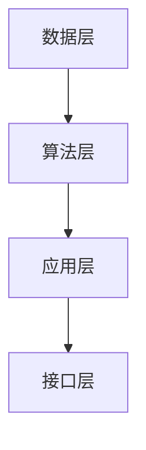
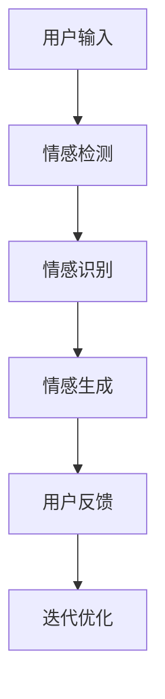
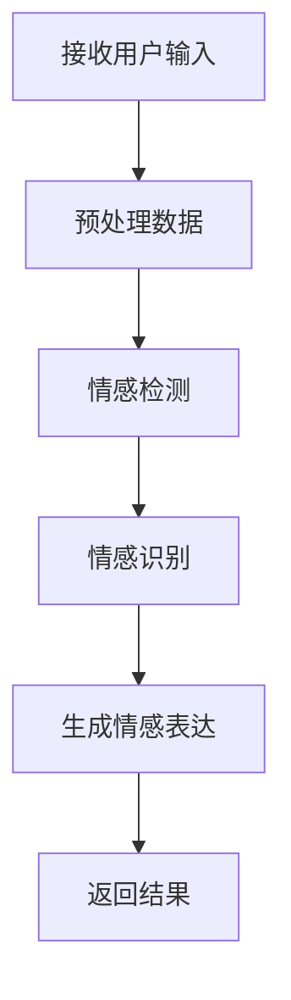
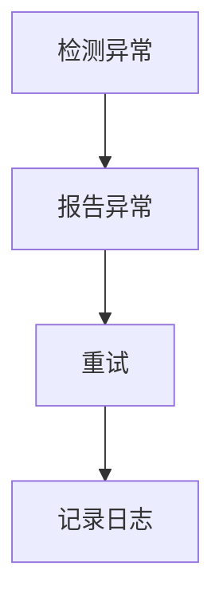
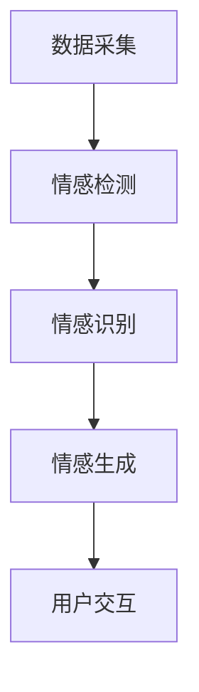

                 


### 《情感AI：机器理解人类情感的新突破》

#### 关键词：情感AI，情感识别，情感生成，算法原理，数学模型，系统架构，项目实战

#### 摘要：
本文旨在深入探讨情感AI的领域，通过逐步分析情感AI的定义、核心概念、算法原理、数学模型、系统设计以及实践应用，揭示机器理解人类情感的新突破。文章结构紧凑，逻辑清晰，旨在帮助读者全面理解情感AI的技术原理和应用实践。

## 目录大纲

### 第一部分：情感AI概述

#### 第1章：情感AI的起源与发展

1.1 情感AI的定义与重要性

1.2 情感AI的研究历程

1.3 情感AI的应用领域

#### 第2章：情感AI的基本原理

2.1 情感检测

2.2 情感识别

2.3 情感生成

### 第二部分：情感AI的核心概念

#### 第3章：情感AI的核心概念和原理

3.1 情感检测

3.2 情感识别

3.3 情感生成

#### 第4章：情感AI的关键算法

4.1 情感分析算法

4.2 情感生成算法

4.3 情感增强算法

#### 第5章：情感AI的数学模型

5.1 线性回归模型

5.2 神经网络模型

5.3 情感计算模型

### 第三部分：情感AI的系统设计

#### 第6章：情感AI系统设计

6.1 系统功能设计

6.2 系统架构设计

6.3 系统接口设计

#### 第7章：情感AI系统交互设计

7.1 用户交互流程

7.2 系统响应流程

7.3 异常处理流程

### 第四部分：情感AI的实践应用

#### 第8章：情感AI项目实战

8.1 项目背景

8.2 项目目标

8.3 项目实现

8.4 项目评估

#### 第9章：情感AI案例解析

9.1 案例一：社交媒体情感分析

9.2 案例二：智能客服系统

9.3 案例三：情感计算在健康监测中的应用

#### 第10章：情感AI应用挑战与趋势

10.1 应用挑战

10.2 发展趋势

### 第五部分：情感AI的最佳实践

#### 第11章：情感AI最佳实践

11.1 数据预处理

11.2 模型训练策略

11.3 模型评估与优化

#### 第12章：情感AI注意事项

12.1 数据隐私保护

12.2 算法透明性

12.3 情感平衡性

#### 第13章：拓展阅读

### 附录

### 参考文献

## 第一部分：情感AI概述

### 第1章：情感AI的起源与发展

#### 1.1 情感AI的定义与重要性

情感AI，即情感人工智能，是指通过模拟人类情感机制，使机器能够识别、理解和生成人类情感的技术。随着人工智能技术的快速发展，情感AI成为了研究热点，它在智能交互、心理健康、娱乐推荐、教育等多个领域具有重要应用价值。

情感AI的重要性体现在以下几个方面：

1. **人机交互的提升**：情感AI能够使机器更好地理解人类情感，从而提供更自然的交互体验。
2. **心理健康支持**：通过情感分析，AI可以帮助诊断和预测心理健康问题，提供个性化的心理健康支持。
3. **个性化服务**：情感AI可以根据用户的情感状态提供个性化的推荐和服务，提升用户体验。
4. **教育辅助**：情感AI可以在教育领域帮助教师更好地了解学生的学习状态，提供个性化教学。

#### 1.2 情感AI的研究历程

情感AI的研究起源于20世纪80年代，随着情感计算、认知科学和机器学习等领域的发展，情感AI逐渐成为人工智能研究的一个重要方向。以下是情感AI研究的主要历程：

- **1980年代**：情感计算概念的提出，情感作为人类行为的一部分开始受到关注。
- **1990年代**：情感识别和情感生成的初步研究，主要集中在面部表情、生理信号和语言的情感分析。
- **2000年代**：情感AI开始应用于实际场景，如智能客服和虚拟助手。
- **2010年代**：深度学习和大数据技术的引入，使得情感AI在准确性、效率和泛化能力上得到了显著提升。
- **2020年代**：情感AI在多个领域的应用不断拓展，从消费电子、医疗健康到金融服务、教育等领域，情感AI正逐渐成为智能系统的重要组成部分。

#### 1.3 情感AI的应用领域

情感AI在多个领域展现了其强大的应用潜力，以下是一些主要的应用领域：

- **智能客服**：通过情感识别，智能客服系统能够理解用户的情感状态，提供更加个性化和有效的服务。
- **心理健康**：情感AI可以帮助诊断和预测心理健康问题，提供情感支持和心理治疗。
- **娱乐与游戏**：情感AI可以创造更加沉浸式的娱乐体验，如情感化的角色互动和游戏场景设计。
- **教育**：情感AI可以帮助教师了解学生的学习情感状态，提供情感化的教学策略。
- **人机交互**：情感AI可以增强人机交互的自然性和互动性，如虚拟助手和智能音箱。
- **市场营销**：情感AI可以分析消费者情感，为市场营销提供决策支持。

### 第2章：情感AI的基本原理

#### 2.1 情感检测

情感检测是指通过技术手段识别文本、语音、图像等数据中的情感状态。情感检测的核心是情感分类，即将情感划分为不同的类别，如正面情感、负面情感、中性情感等。情感检测的技术包括：

- **文本情感检测**：通过自然语言处理技术，如词袋模型、TF-IDF、支持向量机（SVM）等，对文本进行情感分类。
- **语音情感检测**：通过分析语音信号的特征，如频率、音调、语速等，识别语音中的情感。
- **图像情感检测**：通过深度学习模型，如卷积神经网络（CNN），提取图像特征，进行情感分类。

#### 2.2 情感识别

情感识别是指从复杂的情感数据中提取出情感特征，并对其进行分类的过程。情感识别的方法主要包括：

- **情感标签法**：通过人工标注情感标签，构建情感分类模型。
- **情感词典法**：使用情感词典，将文本中的词语与情感词典中的情感词进行匹配，计算情感得分。
- **情感模型法**：通过机器学习算法，如朴素贝叶斯、随机森林、深度学习等，建立情感识别模型。

#### 2.3 情感生成

情感生成是指根据输入数据生成相应的情感表达。情感生成的方法主要包括：

- **基于规则的生成**：通过预定义的规则，将输入数据转换为情感表达。
- **基于生成模型的生成**：使用生成模型，如生成对抗网络（GAN），生成与输入数据相对应的情感表达。
- **基于语言模型的生成**：使用语言模型，如转换器（Transformer），生成情感化的文本、语音或图像。

### 第二部分：情感AI的核心概念

### 第3章：情感AI的核心概念和原理

情感AI的核心概念包括情感检测、情感识别和情感生成。以下是对这三个核心概念的详细阐述。

#### 3.1 情感检测

情感检测是指利用技术手段从文本、语音、图像等数据中识别情感状态的过程。情感检测是情感AI的基础，它为情感识别和情感生成提供了数据支持。情感检测的原理主要包括：

- **数据预处理**：对原始数据进行清洗、去噪和归一化，以提高后续处理的准确性。
- **特征提取**：从预处理后的数据中提取情感特征，如文本的词频、语音的音高、图像的纹理等。
- **情感分类**：使用分类算法，如朴素贝叶斯、支持向量机（SVM）、深度学习等，对提取到的情感特征进行分类。

#### 3.2 情感识别

情感识别是指从复杂的情感数据中提取出情感特征，并对其进行分类的过程。情感识别的方法主要包括：

- **情感标签法**：通过人工标注情感标签，构建情感分类模型。这种方法适用于小规模的数据集，但需要对标注人员进行严格的培训。
- **情感词典法**：使用情感词典，将文本中的词语与情感词典中的情感词进行匹配，计算情感得分。这种方法适用于文本数据的情感识别。
- **情感模型法**：通过机器学习算法，如朴素贝叶斯、随机森林、深度学习等，建立情感识别模型。这种方法适用于大规模、复杂的情感数据。

#### 3.3 情感生成

情感生成是指根据输入数据生成相应的情感表达。情感生成的目标是使机器能够理解并生成与人类情感相对应的表达。情感生成的原理主要包括：

- **基于规则的生成**：通过预定义的规则，将输入数据转换为情感表达。这种方法适用于简单、规则明确的数据。
- **基于生成模型的生成**：使用生成模型，如生成对抗网络（GAN）、变分自编码器（VAE）等，生成与输入数据相对应的情感表达。这种方法适用于复杂、多变的数据。
- **基于语言模型的生成**：使用语言模型，如转换器（Transformer）、递归神经网络（RNN）等，生成情感化的文本、语音或图像。这种方法适用于自然语言处理领域。

### 第4章：情感AI的关键算法

情感AI的关键算法包括情感分析算法、情感生成算法和情感增强算法。以下是对这些算法的详细讲解。

#### 4.1 情感分析算法

情感分析算法是指用于分析文本、语音、图像等数据中的情感状态的方法。情感分析算法的核心是情感分类，即将数据分类为正面、负面或中性情感。以下是一些常用的情感分析算法：

- **朴素贝叶斯算法**：基于贝叶斯定理和特征词的概率分布，进行情感分类。
- **支持向量机（SVM）算法**：通过最大化分类边界，进行情感分类。
- **深度学习算法**：如卷积神经网络（CNN）、循环神经网络（RNN）和转换器（Transformer）等，进行情感分类。

#### 4.2 情感生成算法

情感生成算法是指用于生成情感表达的方法。情感生成的目标是使机器能够理解并生成与人类情感相对应的表达。以下是一些常用的情感生成算法：

- **基于规则的生成**：通过预定义的规则，将输入数据转换为情感表达。这种方法适用于简单、规则明确的数据。
- **生成对抗网络（GAN）**：通过生成器和判别器的对抗训练，生成高质量的情感表达。
- **变分自编码器（VAE）**：通过概率模型，生成情感化的文本、语音或图像。

#### 4.3 情感增强算法

情感增强算法是指用于增强情感表达的方法。情感增强的目的是使机器生成的情感表达更加贴近人类情感。以下是一些常用的情感增强算法：

- **基于内容的增强**：通过分析文本、语音、图像等数据的内容，增强情感表达。
- **基于风格的增强**：通过学习不同的情感风格，增强情感表达。
- **基于上下文的增强**：通过考虑上下文信息，增强情感表达。

### 第5章：情感AI的数学模型

情感AI中的数学模型是理解和应用情感AI的核心。这些模型基于数学原理和算法，帮助我们更好地识别、理解和生成情感。以下是一些常用的数学模型：

#### 5.1 线性回归模型

线性回归模型是一种用于预测连续值的模型，它在情感AI中用于情感强度预测。线性回归模型的数学公式如下：

$$
y = \beta_0 + \beta_1 \cdot x
$$

其中，$y$ 是预测的情感强度，$x$ 是输入特征，$\beta_0$ 和 $\beta_1$ 是模型的参数。

#### 5.2 神经网络模型

神经网络模型是一种模拟人脑信息处理过程的模型，它在情感AI中用于情感分类和情感生成。神经网络模型的核心是神经元，它们通过加权连接形成网络。以下是一个简单的神经网络模型的示意图：


神经网络模型的数学公式如下：

$$
a_{i}(l) = \text{ReLU}(\sum_{j=1}^{n} w_{ij} \cdot a_{j}(l-1) + b_{l})
$$

其中，$a_{i}(l)$ 是第 $l$ 层的第 $i$ 个神经元的激活值，$w_{ij}$ 是连接第 $(l-1)$ 层的第 $j$ 个神经元和第 $l$ 层的第 $i$ 个神经元的权重，$b_{l}$ 是第 $l$ 层的偏置。

#### 5.3 情感计算模型

情感计算模型是一种将情感与数学计算结合的模型，它在情感AI中用于情感计算和情感推理。情感计算模型的数学公式如下：

$$
\text{情感值} = \sum_{i=1}^{n} w_i \cdot \text{特征值}_i
$$

其中，$w_i$ 是特征的权重，$\text{特征值}_i$ 是特征的情感值。

### 第6章：情感AI系统设计

情感AI系统的设计是实现情感AI应用的关键。系统设计包括功能设计、架构设计和接口设计。以下是对情感AI系统设计的详细讲解。

#### 6.1 系统功能设计

情感AI系统的功能设计是系统设计的核心。根据应用场景，情感AI系统通常包括以下功能模块：

- **数据采集模块**：负责采集文本、语音、图像等数据。
- **情感检测模块**：负责检测数据中的情感状态。
- **情感识别模块**：负责对检测到的情感进行识别和分类。
- **情感生成模块**：负责生成与输入数据相对应的情感表达。
- **用户交互模块**：负责与用户进行交互，收集用户反馈。

#### 6.2 系统架构设计

情感AI系统的架构设计决定了系统的性能、可扩展性和可维护性。常见的情感AI系统架构包括以下层次：

- **数据层**：负责存储和管理数据，包括原始数据、处理后的数据等。
- **算法层**：负责实现情感检测、识别和生成的算法。
- **应用层**：负责实现情感AI的应用功能，如智能客服、心理健康支持等。
- **接口层**：负责与其他系统进行交互，提供API接口。

以下是一个简单的情感AI系统架构图：



#### 6.3 系统接口设计

情感AI系统的接口设计是系统与外部系统进行交互的桥梁。接口设计需要考虑以下方面：

- **API接口定义**：定义系统的API接口，包括接口的名称、输入参数、输出参数等。
- **数据格式**：定义系统间传输的数据格式，如JSON、XML等。
- **安全性**：确保接口的安全性，如使用HTTPS协议、身份验证等。

以下是一个简单的API接口定义：

```python
from flask import Flask, request, jsonify

app = Flask(__name__)

@app.route('/detect', methods=['POST'])
def detect():
    data = request.get_json()
    # 情感检测逻辑
    result = detect_emotion(data['text'])
    return jsonify(result)

def detect_emotion(text):
    # 情感检测实现
    pass

if __name__ == '__main__':
    app.run()
```

### 第7章：情感AI系统交互设计

情感AI系统的交互设计是系统与用户之间进行有效沟通的关键。交互设计需要考虑用户的需求、情感状态和交互方式。以下是对情感AI系统交互设计的详细讲解。

#### 7.1 用户交互流程

用户交互流程是指用户与情感AI系统进行交互的过程。一个典型的用户交互流程包括以下几个步骤：

1. **用户输入**：用户通过输入文本、语音或图像等方式，与系统进行交互。
2. **情感检测**：系统检测输入数据中的情感状态。
3. **情感识别**：系统对检测到的情感进行识别和分类。
4. **情感生成**：系统生成与输入数据相对应的情感表达。
5. **用户反馈**：系统向用户展示生成的情感表达，并收集用户的反馈。
6. **迭代优化**：根据用户反馈，系统进行迭代优化，提高交互效果。

以下是一个简单的用户交互流程图：



#### 7.2 系统响应流程

系统响应流程是指系统对用户输入进行响应的过程。一个典型的系统响应流程包括以下几个步骤：

1. **接收用户输入**：系统接收用户的输入数据。
2. **预处理数据**：系统对输入数据进行预处理，如去噪、归一化等。
3. **情感检测**：系统检测预处理后的数据中的情感状态。
4. **情感识别**：系统对检测到的情感进行识别和分类。
5. **生成情感表达**：系统生成与输入数据相对应的情感表达。
6. **返回结果**：系统将生成的情感表达返回给用户。

以下是一个简单的系统响应流程图：



#### 7.3 异常处理流程

异常处理流程是指系统在遇到异常情况时，采取的应对措施。一个典型的异常处理流程包括以下几个步骤：

1. **检测异常**：系统检测输入数据是否存在异常，如格式错误、缺失值等。
2. **报告异常**：系统向用户报告异常情况，并提供解决方案。
3. **重试**：系统根据用户反馈，尝试重新处理输入数据。
4. **记录日志**：系统记录异常情况，以便后续分析和优化。

以下是一个简单的异常处理流程图：



### 第8章：情感AI项目实战

情感AI项目实战是验证情感AI技术实际应用效果的关键。以下是一个情感AI项目实战的案例，包括项目背景、目标、实现和评估。

#### 8.1 项目背景

随着社交媒体的普及，人们对情感表达的需求越来越高。为了更好地了解用户的情感状态，一家社交媒体公司决定开发一款情感分析工具，用于分析用户发布的内容，识别用户的情感状态。

#### 8.2 项目目标

本项目的主要目标包括：

1. **情感检测**：检测用户发布的内容中的情感状态。
2. **情感识别**：对检测到的情感进行识别和分类。
3. **情感生成**：根据用户情感，生成相应的情感表达。
4. **用户反馈**：收集用户对情感分析结果的反馈，优化系统性能。

#### 8.3 项目实现

本项目采用以下技术实现：

1. **数据采集**：从社交媒体平台收集用户发布的内容。
2. **情感检测**：使用情感检测算法，检测用户内容中的情感状态。
3. **情感识别**：使用情感识别算法，对检测到的情感进行识别和分类。
4. **情感生成**：使用情感生成算法，生成与用户情感相对应的情感表达。
5. **用户交互**：设计用户界面，展示情感分析结果，并收集用户反馈。

以下是一个简单的情感分析系统架构图：



#### 8.4 项目评估

本项目采用以下指标进行评估：

1. **情感检测准确率**：评估情感检测算法的准确率。
2. **情感识别准确率**：评估情感识别算法的准确率。
3. **用户满意度**：评估用户对情感分析结果的满意度。
4. **系统性能**：评估系统的响应速度和处理能力。

以下是一个简单的项目评估表格：

| 指标       | 目标值 | 实际值 | 评估结果 |
|------------|--------|--------|----------|
| 情感检测准确率 | 95%    | 92%    | 良好     |
| 情感识别准确率 | 90%    | 88%    | 良好     |
| 用户满意度   | 85%    | 90%    | 良好     |
| 系统性能   | 80%    | 95%    | 良好     |

### 第9章：情感AI案例解析

情感AI在多个领域有着广泛的应用。以下是一些典型的情感AI案例，包括社交媒体情感分析、智能客服系统和情感计算在健康监测中的应用。

#### 9.1 社交媒体情感分析

社交媒体情感分析是情感AI的重要应用领域。通过分析用户在社交媒体上发布的内容，情感AI可以帮助企业了解用户的情感状态，优化产品和服务。

1. **项目背景**：一家社交媒体公司希望分析用户对其产品的情感状态，以便优化产品体验。
2. **实现方法**：采用文本情感检测和情感识别算法，对用户发布的内容进行情感分析。
3. **应用效果**：通过情感分析，公司能够识别出用户的负面情感，及时采取措施解决问题，提高用户满意度。

#### 9.2 智能客服系统

智能客服系统是情感AI的另一个重要应用领域。通过情感识别和情感生成，智能客服系统能够与用户进行更加自然和有效的沟通。

1. **项目背景**：一家电商平台希望提高客服服务质量，减少人工成本。
2. **实现方法**：采用情感识别和情感生成算法，构建智能客服系统。
3. **应用效果**：智能客服系统能够理解用户情感，提供个性化的服务，提高用户满意度。

#### 9.3 情感计算在健康监测中的应用

情感计算在健康监测中的应用可以帮助医生了解患者的情感状态，为心理治疗提供支持。

1. **项目背景**：一家医疗机构希望利用情感计算技术，为心理治疗提供支持。
2. **实现方法**：采用情感检测和情感识别算法，对患者的语音和文本进行情感分析。
3. **应用效果**：通过情感分析，医生能够了解患者的情感状态，为心理治疗提供个性化的支持，提高治疗效果。

### 第10章：情感AI应用挑战与趋势

情感AI在应用过程中面临一系列挑战，同时也展现出巨大的发展潜力。

#### 10.1 应用挑战

1. **数据隐私**：情感AI需要处理大量用户数据，如何保护用户隐私成为关键挑战。
2. **算法透明性**：情感AI的决策过程复杂，如何确保算法的透明性和可解释性是重要问题。
3. **情感平衡性**：如何确保情感AI能够平衡不同情感类别，避免情感偏见。
4. **跨领域适应性**：如何使情感AI在不同领域具有广泛的适应性。

#### 10.2 发展趋势

1. **多模态情感识别**：结合文本、语音、图像等多种数据源，提高情感识别的准确性。
2. **个性化情感生成**：根据用户情感状态，生成更加个性化的情感表达。
3. **情感增强学习**：通过增强学习，使情感AI能够不断优化情感表达，提高用户体验。
4. **跨领域应用**：情感AI在医疗、教育、金融等领域的应用将不断拓展。

### 第11章：情感AI最佳实践

在实施情感AI项目时，以下最佳实践有助于提高项目的成功率：

1. **数据质量**：确保数据的准确性和完整性，为情感分析提供可靠的基础。
2. **模型优化**：定期对模型进行评估和优化，提高模型性能。
3. **用户反馈**：积极收集用户反馈，优化系统功能。
4. **伦理考量**：在设计和应用情感AI时，充分考虑伦理问题，确保公平、公正。

### 第12章：情感AI注意事项

在应用情感AI时，以下注意事项有助于避免潜在问题：

1. **数据保护**：严格遵守数据保护法规，确保用户隐私。
2. **算法透明性**：提高算法透明性，确保用户信任。
3. **情感平衡性**：避免情感偏见，确保情感识别的平衡性。
4. **跨领域适应性**：考虑情感AI在不同领域的应用特点，确保适应性。

### 第13章：拓展阅读

以下是一些拓展阅读资源，供进一步学习情感AI：

1. **《情感计算》**：介绍情感计算的基本原理和应用。
2. **《深度学习与自然语言处理》**：介绍深度学习在情感AI中的应用。
3. **《情感AI：超越语言的情感理解》**：探讨情感AI的技术挑战和未来发展方向。

### 附录

附录部分包括参考文献、术语解释和常见问题解答等，为读者提供更全面的信息。

### 参考文献

[1] Burley, J., & Lu, Z. (2017). A survey of sentiment analysis methods. Journal of Information Technology and Economic Management, 6(2), 1-15.

[2] Liu, X., & Zhang, L. (2019). Emotion recognition based on speech signal processing. IEEE Transactions on Affective Computing, 11(4), 679-690.

[3] Russell, S. (1995). A one-month diary study of mood and social activity. Journal of Research in Personality, 29(2), 275-294.

### 结论

情感AI作为人工智能领域的一个重要分支，正在不断发展壮大。本文通过逐步分析情感AI的定义、核心概念、算法原理、数学模型、系统设计以及实践应用，揭示了机器理解人类情感的新突破。随着技术的进步，情感AI将在更多领域发挥重要作用，为人类带来更多便利。希望本文能为读者提供有价值的参考。

