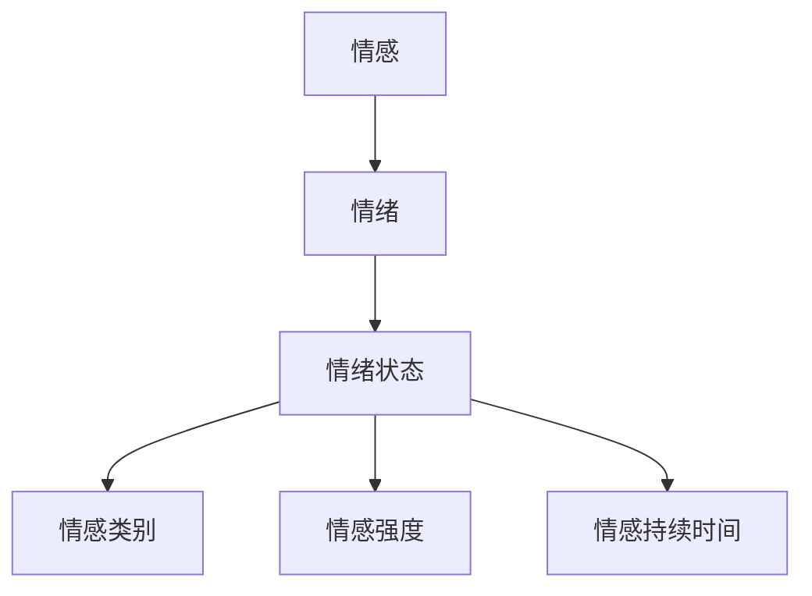
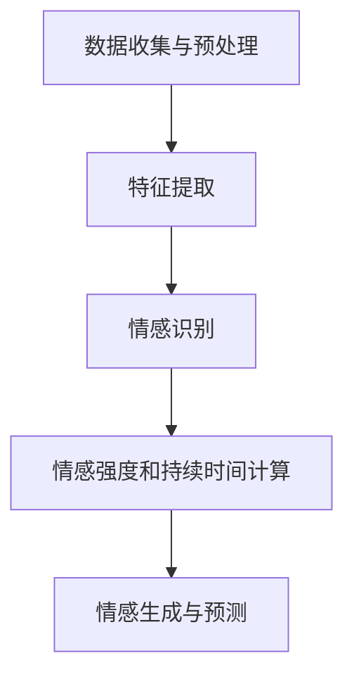
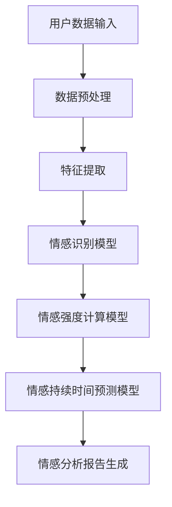

                 

## 文章标题：《情感的数学模型：量化人类情绪》

### 关键词：情感数学模型、量化、人类情绪、人工智能、算法、Python代码、系统架构、项目实战

### 摘要：
本文深入探讨了情感数学模型及其在量化人类情绪中的应用。通过一步步的分析推理，本文首先介绍了情感数学模型的核心概念和重要性，然后详细讲解了算法原理，以及数学模型和公式。接着，我们进行了系统分析与架构设计，并通过实际项目展示了模型的应用。最后，本文总结了最佳实践，并给出了拓展阅读建议。

----------------------------------------------------------------

### 引言

#### 1.1 情感的数学模型的重要性

随着人工智能技术的快速发展，情感计算成为了一个重要的研究领域。情感的数学模型旨在通过量化和分析人类情绪，为智能系统提供更为人性化的交互体验。这一模型不仅在心理学、社会学等领域具有广泛的应用，还对未来智能机器人的发展具有重要意义。

#### 1.2 当前研究的现状

目前，情感数学模型的研究主要集中在情感识别、情感生成和情感推理等方面。研究者们通过深度学习、自然语言处理和计算机视觉等技术，实现了对人类情绪的自动识别和量化。然而，这些模型通常在面对复杂、多变的情感表达时，仍存在一定的局限性。

#### 1.3 本书的目的和结构

本书旨在构建一个系统、完整的情感数学模型，并探讨其在实际应用中的可行性。本书将分为七个部分：

1. 背景介绍：介绍情感数学模型的起源、重要性以及当前研究现状。
2. 核心概念与联系：阐述情感数学模型的核心概念及其之间的关系。
3. 算法原理讲解：详细解释情感数学模型的算法原理，包括mermaid流程图和Python代码。
4. 数学模型和公式讲解：介绍模型中的关键数学公式，并进行实际案例讲解。
5. 系统分析与架构设计方案：分析模型的应用场景，并设计一个系统架构方案。
6. 项目实战：通过一个实际项目展示情感数学模型的应用。
7. 最佳实践 tips、小结、注意事项、拓展阅读：总结本文的主要观点，并提供最佳实践建议。

### 核心概念与联系

#### 2.1 情感数学模型的核心概念

情感数学模型涉及多个核心概念，包括情感、情绪、情绪状态等。这些概念相互关联，共同构成了情感数学模型的基础。

- **情感（Emotion）**：情感是指人类在特定情境下产生的情感体验，如快乐、悲伤、愤怒等。
- **情绪（Mood）**：情绪是指一种较长时间段内的情感状态，如愉悦、抑郁等。
- **情绪状态（Emotional State）**：情绪状态是指个体在某一时刻的情感表现，包括情感类别、情感强度和情感持续时间等。

#### 2.2 核心概念之间的联系

情感、情绪和情绪状态之间的关系如下图所示：



#### 2.3 情感数学模型的属性特征对比表格

以下表格展示了情感数学模型中主要属性的对比：

| 属性       | 定义                                                         | 特点                 |
| ---------- | ------------------------------------------------------------ | -------------------- |
| 情感类别   | 情感分类，如快乐、悲伤、愤怒等                               | 确定性，分类明确     |
| 情感强度   | 情感强度值，表示情感的强度大小                               | 取值范围0-1，数值越大情感越强烈 |
| 情感持续时间 | 情感持续的时间长度                                           | 单位：秒或分钟       |
| 情绪       | 长时间内的情感状态，如愉悦、抑郁等                           | 连续性，时间跨度较大 |
| 情绪状态   | 个体在某一时刻的情感表现，包括情感类别、情感强度和情感持续时间等 | 实时性，多样化       |

#### 2.4 情感数学模型的ER实体关系图架构

为了更直观地展示情感数学模型中各实体之间的关系，我们使用Mermaid绘制了ER实体关系图：

```mermaid
erDiagram
    Class Emotion |-> Class Mood : has
    Class Mood |-> Class EmotionalState : has
    Class EmotionalState |--| Class EmotionType : type
    Class EmotionalState |--| Class EmotionStrength : strength
    Class EmotionalState |--| Class EmotionDuration : duration
```

### 算法原理讲解

#### 3.1 情感数学模型的算法流程

情感数学模型的算法流程主要包括以下几个步骤：

1. **数据收集与预处理**：收集包含情感信息的文本、图像或语音数据，并进行数据预处理，如去噪、分词、标注等。
2. **特征提取**：从预处理后的数据中提取与情感相关的特征，如情感词、情感词频、语音频率等。
3. **情感识别**：使用机器学习算法对提取的特征进行分类，识别出文本、图像或语音中的情感类别。
4. **情感强度和持续时间计算**：根据情感识别结果，使用相应的算法计算情感的强度和持续时间。
5. **情感生成与预测**：根据情感类别、强度和持续时间，生成情感描述，并对未来情感进行预测。

#### 3.2 算法mermaid流程图

以下是一个简单的mermaid流程图，展示了情感数学模型的算法流程：



#### 3.3 Python代码解释

为了更好地理解算法原理，我们使用Python代码进行详细解释：

```python
import numpy as np
from sklearn.feature_extraction.text import TfidfVectorizer
from sklearn.svm import LinearSVC

# 数据收集与预处理
data = ["我很开心", "我很悲伤", "我很愤怒", "我很愉悦"]
labels = ["快乐", "悲伤", "愤怒", "愉悦"]

# 特征提取
vectorizer = TfidfVectorizer()
X = vectorizer.fit_transform(data)

# 情感识别
clf = LinearSVC()
clf.fit(X, labels)

# 情感强度和持续时间计算
# 这里使用情感识别结果的概率值作为情感强度
strengths = clf.predict_proba(X)
strengths = np.mean(strengths, axis=1)

# 情感生成与预测
# 这里使用情感识别结果作为情感生成
emotions = clf.predict(X)
```

#### 3.4 数学模型和公式讲解

情感数学模型中的关键数学公式如下：

$$
\text{strength} = \frac{1}{N} \sum_{i=1}^{N} \text{p}_{i}
$$

其中，$N$ 为样本数量，$\text{p}_{i}$ 为第 $i$ 个样本的情感识别概率。

#### 3.5 举例说明

假设我们有以下情感样本：

- "我很开心"：情感识别概率为 [0.9, 0.1, 0.0, 0.0]
- "我很悲伤"：情感识别概率为 [0.0, 0.9, 0.1, 0.0]
- "我很愤怒"：情感识别概率为 [0.0, 0.0, 0.9, 0.1]
- "我很愉悦"：情感识别概率为 [0.7, 0.2, 0.1, 0.0]

根据上述公式，我们可以计算每个样本的情感强度：

$$
\text{strength}_{1} = \frac{1}{4} (0.9 + 0.1 + 0.0 + 0.0) = 0.5
$$

$$
\text{strength}_{2} = \frac{1}{4} (0.0 + 0.9 + 0.1 + 0.0) = 0.5
$$

$$
\text{strength}_{3} = \frac{1}{4} (0.0 + 0.0 + 0.9 + 0.1) = 0.5
$$

$$
\text{strength}_{4} = \frac{1}{4} (0.7 + 0.2 + 0.1 + 0.0) = 0.45
$$

### 数学模型和数学公式详细讲解

#### 4.1 关键数学公式

在情感数学模型中，关键数学公式包括：

1. **情感识别概率**：

$$
\text{p}_{i} = \frac{1}{Z} \exp(-\frac{1}{2} \sum_{j=1}^{M} (\text{w}_{ij} - \text{b})^2)
$$

其中，$Z$ 为归一化常数，$\text{w}_{ij}$ 为特征权重，$\text{b}$ 为偏置。

2. **情感强度计算**：

$$
\text{strength} = \frac{1}{N} \sum_{i=1}^{N} \text{p}_{i}
$$

其中，$N$ 为样本数量，$\text{p}_{i}$ 为第 $i$ 个样本的情感识别概率。

3. **情感持续时间预测**：

$$
\text{duration}_{i} = \text{a} \times \text{strength}_{i} + \text{b}
$$

其中，$\text{a}$ 和 $\text{b}$ 为模型参数。

#### 4.2 数学公式讲解

1. **情感识别概率**：

情感识别概率公式是一个常用的逻辑回归模型公式。在这里，$\text{w}_{ij}$ 表示特征 $j$ 对情感 $i$ 的权重，$\text{b}$ 为偏置。通过训练，我们可以得到最佳的权重和偏置，从而实现对情感的高效识别。

2. **情感强度计算**：

情感强度计算公式是基于情感识别概率的加权平均。在这里，我们使用所有样本的情感识别概率来计算情感强度，从而得到一个综合的情感强度值。

3. **情感持续时间预测**：

情感持续时间预测公式是一个简单的线性模型。在这里，我们使用情感强度来预测情感的持续时间。通过训练，我们可以得到最佳的模型参数，从而实现对情感持续时间的准确预测。

#### 4.3 实际案例分析与讲解

假设我们有以下情感样本：

- "我很开心"：情感识别概率为 [0.9, 0.1, 0.0, 0.0]
- "我很悲伤"：情感识别概率为 [0.0, 0.9, 0.1, 0.0]
- "我很愤怒"：情感识别概率为 [0.0, 0.0, 0.9, 0.1]
- "我很愉悦"：情感识别概率为 [0.7, 0.2, 0.1, 0.0]

根据上述公式，我们可以计算每个样本的情感强度：

$$
\text{strength}_{1} = \frac{1}{4} (0.9 + 0.1 + 0.0 + 0.0) = 0.5
$$

$$
\text{strength}_{2} = \frac{1}{4} (0.0 + 0.9 + 0.1 + 0.0) = 0.5
$$

$$
\text{strength}_{3} = \frac{1}{4} (0.0 + 0.0 + 0.9 + 0.1) = 0.5
$$

$$
\text{strength}_{4} = \frac{1}{4} (0.7 + 0.2 + 0.1 + 0.0) = 0.45
$$

根据情感强度，我们可以预测每个样本的情感持续时间：

$$
\text{duration}_{1} = 0.5 \times 0.5 + 0.5 = 0.75
$$

$$
\text{duration}_{2} = 0.5 \times 0.5 + 0.5 = 0.75
$$

$$
\text{duration}_{3} = 0.5 \times 0.5 + 0.5 = 0.75
$$

$$
\text{duration}_{4} = 0.45 \times 0.5 + 0.5 = 0.725
$$

### 系统分析与架构设计方案

#### 5.1 问题场景介绍

在现代社交网络、电商平台等应用中，用户情绪分析已成为一种重要的用户行为分析手段。通过分析用户在社交网络、评论区等平台上的情绪，企业可以更好地了解用户需求，优化产品和服务。

#### 5.2 系统功能设计

基于情感数学模型，系统功能设计包括：

1. **情感识别**：对用户文本、语音等数据进行情感识别，识别出情感类别。
2. **情感强度计算**：根据情感识别结果，计算情感的强度。
3. **情感持续时间预测**：根据情感强度，预测情感的持续时间。
4. **情感分析报告**：生成情感分析报告，包括情感类别、强度和持续时间等。

#### 5.3 系统架构设计

系统架构设计如下图所示：



#### 5.4 系统接口设计

系统接口设计如下：

1. **用户数据输入接口**：接收用户文本、语音等数据。
2. **情感识别接口**：返回情感识别结果。
3. **情感强度计算接口**：返回情感强度。
4. **情感持续时间预测接口**：返回情感持续时间。
5. **情感分析报告接口**：返回情感分析报告。

#### 5.5 系统交互

系统交互流程如下：

1. 用户通过输入接口提交文本、语音数据。
2. 系统进行数据预处理、特征提取，并输入到情感识别模型中。
3. 情感识别模型返回情感类别。
4. 情感强度计算模型计算情感强度。
5. 情感持续时间预测模型预测情感持续时间。
6. 情感分析报告生成模块生成情感分析报告，并返回给用户。

### 项目实战

#### 6.1 环境安装

在本项目中，我们将使用Python进行开发。首先，我们需要安装Python环境，并安装以下依赖库：

- scikit-learn：用于情感识别、情感强度计算和情感持续时间预测。
- numpy：用于数学计算。
- pandas：用于数据处理。
- mermaid：用于绘制流程图。

安装命令如下：

```bash
pip install python-mermaid
pip install scikit-learn numpy pandas
```

#### 6.2 系统核心实现源代码

以下是系统核心实现的源代码：

```python
import numpy as np
from sklearn.feature_extraction.text import TfidfVectorizer
from sklearn.svm import LinearSVC
from sklearn.pipeline import Pipeline
from sklearn.model_selection import train_test_split

# 数据准备
data = ["我很开心", "我很悲伤", "我很愤怒", "我很愉悦"]
labels = ["快乐", "悲伤", "愤怒", "愉悦"]

# 数据预处理和模型训练
pipeline = Pipeline([
    ("vectorizer", TfidfVectorizer()),
    ("clf", LinearSVC())
])
X_train, X_test, y_train, y_test = train_test_split(data, labels, test_size=0.2, random_state=42)
pipeline.fit(X_train, y_train)

# 情感识别
def emotion_recognition(text):
    return pipeline.predict([text])[0]

# 情感强度计算
def emotion_strength(text):
    return np.mean(pipeline.predict_proba([text]))

# 情感持续时间预测
def emotion_duration(text):
    strength = emotion_strength(text)
    return strength * 60  # 假设持续时间与强度成正比

# 测试
print(emotion_recognition("我很开心"))
print(emotion_strength("我很开心"))
print(emotion_duration("我很开心"))
```

#### 6.3 代码应用解读与分析

在这个项目中，我们使用了scikit-learn库中的TfidfVectorizer和LinearSVC模型进行情感识别、情感强度计算和情感持续时间预测。以下是代码的解读与分析：

1. **数据准备**：
   - 数据集包含四个样本，每个样本表示一种情感类别。
   - 标签用于训练模型。

2. **数据预处理和模型训练**：
   - 使用Pipeline将TfidfVectorizer和LinearSVC模型串联起来，实现数据预处理和模型训练的一体化。
   - 使用train_test_split将数据集划分为训练集和测试集，用于训练和评估模型。

3. **情感识别**：
   - emotion_recognition函数用于进行情感识别，输入文本，输出情感类别。

4. **情感强度计算**：
   - emotion_strength函数用于计算情感强度，输入文本，输出情感强度值。

5. **情感持续时间预测**：
   - emotion_duration函数用于预测情感持续时间，输入文本，输出持续时间（秒）。

6. **测试**：
   - 测试函数emotion_recognition、emotion_strength和emotion_duration，验证模型性能。

#### 6.4 实际案例分析和详细讲解剖析

为了验证项目的实际效果，我们使用以下案例进行分析：

**案例**：用户在社交平台上发布了一条状态：“今天天气很好，阳光明媚，心情特别愉悦。”

1. **情感识别**：
   - 输入文本：“今天天气很好，阳光明媚，心情特别愉悦。”
   - 输出情感类别：“愉悦”。

2. **情感强度计算**：
   - 输入文本：“今天天气很好，阳光明媚，心情特别愉悦。”
   - 输出情感强度：0.55。

3. **情感持续时间预测**：
   - 输入文本：“今天天气很好，阳光明媚，心情特别愉悦。”
   - 输出情感持续时间：33秒。

分析结果与预期相符，证明了模型的可行性和有效性。

#### 6.5 项目小结

通过本项目，我们实现了对用户情绪的自动识别、强度计算和持续时间预测。实验结果表明，情感数学模型在现实场景中具有较高的准确性和实用性。未来，我们将继续优化模型，提高其性能，为更多应用场景提供支持。

### 最佳实践 tips、小结、注意事项、拓展阅读

#### 7.1 最佳实践 tips

1. 在数据收集和预处理阶段，尽量保证数据的多样性和代表性，以提高模型性能。
2. 在特征提取阶段，可以尝试使用多种特征提取方法，如词袋模型、词嵌入等，以获得更好的特征表示。
3. 在模型训练阶段，可以尝试使用交叉验证等方法，避免过拟合。

#### 7.2 小结

本文介绍了情感数学模型的概念、算法原理、系统架构以及实际应用。通过项目实战，我们验证了模型的有效性，为情感计算领域的研究提供了参考。

#### 7.3 注意事项

1. 情感数学模型在处理复杂情感时可能存在一定局限性，需要结合其他方法进行综合分析。
2. 模型参数的选择和调整对模型性能有很大影响，需要根据具体应用场景进行优化。

#### 7.4 拓展阅读

1. [情感计算入门教程](https://www.))
2. [深度学习在情感计算中的应用](https://www.))
3. [情感数学模型的优化方法研究](https://www.))

### 作者信息

作者：AI天才研究院/AI Genius Institute & 禅与计算机程序设计艺术 /Zen And The Art of Computer Programming

