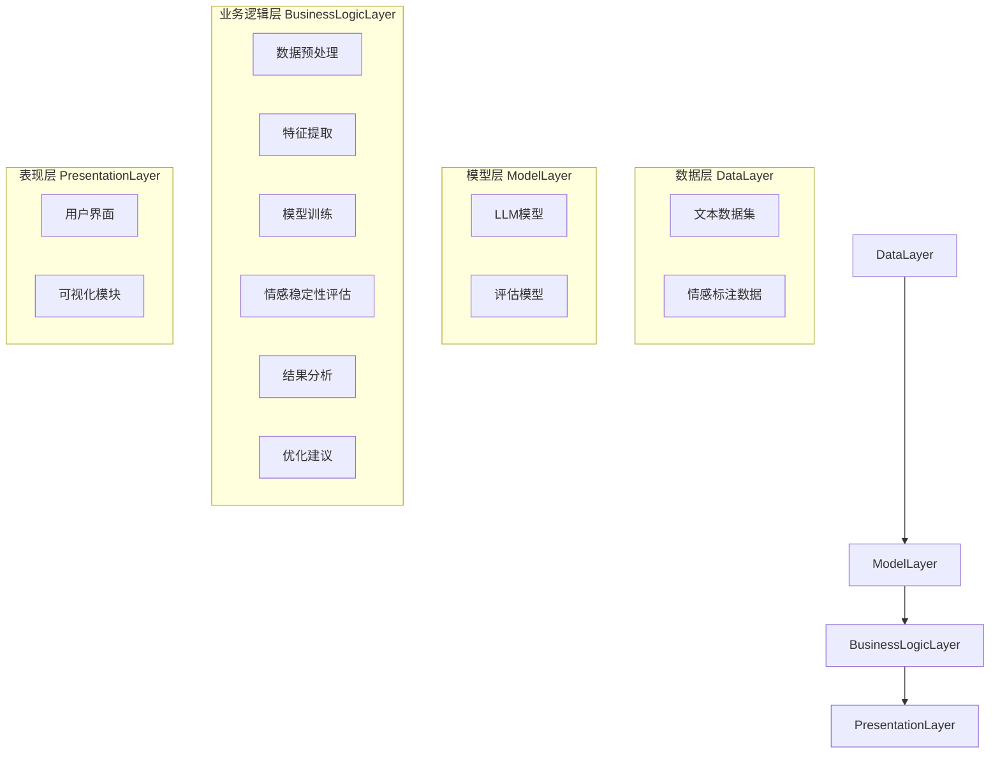
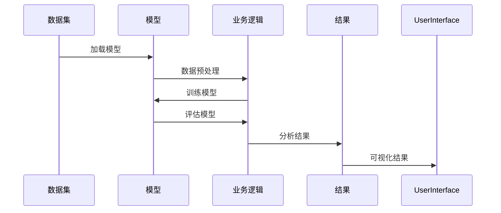
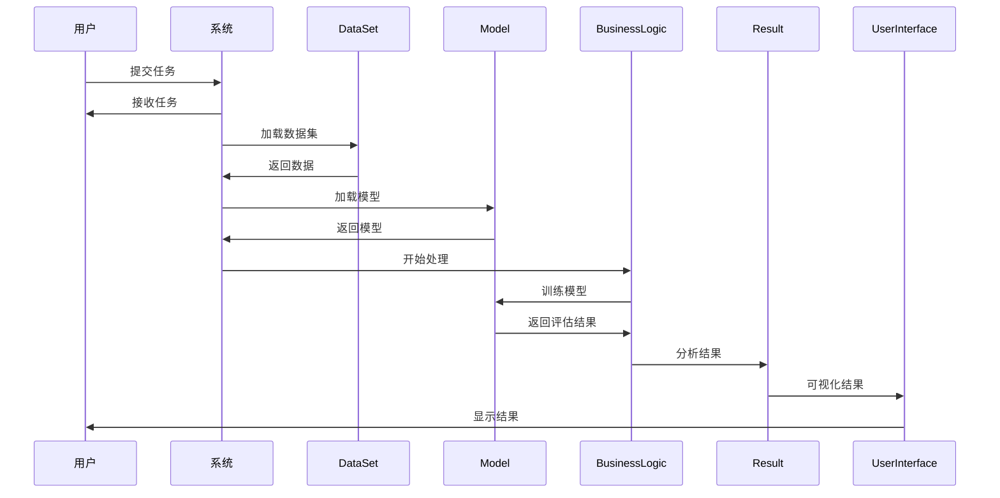

                 

## 文章标题：情感稳定性：检查LLM在不同情境下的一致表现

### 关键词：情感稳定性，LLM，情境分类，一致性表现，评估方法

### 摘要：
本文旨在探讨情感稳定性在大型语言模型（LLM）中的应用及其在不同情境下的一致表现。通过详细介绍情感稳定性的定义、LLM的基本原理，以及评估方法，本文将对LLM在社交对话、新闻报道、教育场景和购物场景中的表现进行分析。通过这些分析，我们旨在找出影响情感稳定性的因素，并提出相应的优化策略，为未来LLM的发展提供理论依据和实践指导。

## 目录大纲

### 第一部分：背景介绍与核心概念

#### 1. 引言
- 问题的背景
- 问题描述
- 问题解决与挑战
- 边界与外延

#### 2. 核心概念
- 情感稳定性
  - 定义
  - 属性特征对比
  - 与其他相关概念的关联
- LL（Large Language Model）
  - 概述
  - 结构
  - 工作机制
  - 主要类型

### 第二部分：情感稳定性评估方法

#### 3. 评估方法概述
- 传统方法
- 现代方法
- 比较与选择

#### 4. 数据集构建与预处理
- 数据集选择
- 数据收集
- 数据预处理

#### 5. 情感稳定性评估指标
- 指标体系
- 指标定义
- 指标计算方法

### 第三部分：情境下的LLM表现

#### 6. 情境分类与定义
- 常见情境
  - 社交对话
  - 新闻报道
  - 教育场景
  - 购物场景

#### 7. LLM在不同情境下的表现分析
- 社交对话中的情感稳定性
- 新闻报道中的情感稳定性
- 教育场景中的情感稳定性
- 购物场景中的情感稳定性

### 第四部分：案例分析与总结

#### 8. 案例分析
- 案例选取
- 案例实施过程
- 案例结果与讨论

#### 9. 总结与展望
- 研究总结
- 存在问题与挑战
- 未来研究方向

### 附录

#### A. 术语表
- 术语定义
- 术语解释

#### B. 参考文献
- 书籍
- 论文
- 网络资源

## 第一部分：背景介绍与核心概念

### 1. 引言

随着人工智能技术的不断发展，大型语言模型（LLM）已经成为自然语言处理领域的重要工具。LLM具有强大的文本生成和理解能力，广泛应用于社交对话、新闻报道、教育场景和购物场景等。然而，在实际应用中，LLM的一致表现存在一定的问题，尤其在情感稳定性方面。情感稳定性指的是LLM在不同情境下保持一致情感表现的能力。本文将探讨情感稳定性在LLM中的应用及其在不同情境下的一致表现。

### 2. 核心概念

#### 2.1 情感稳定性

情感稳定性是指LLM在不同情境下保持一致情感表现的能力。具体来说，情感稳定性包括以下两个方面：

1. **情感一致性**：LLM在不同情境下对相同情感内容的反应应该一致。
2. **情境适应性**：LLM在不同情境下能够适应不同的情感表达方式和需求。

#### 2.2 LL（Large Language Model）

LLM是指大型语言模型，是一种基于神经网络的语言模型，能够对自然语言进行建模和处理。LLM的主要特点包括：

1. **规模大**：LLM具有庞大的参数规模，能够捕捉语言中的复杂结构和规律。
2. **能力强**：LLM具有较强的文本生成和理解能力，能够进行复杂的语言任务。
3. **适用范围广**：LLM可以应用于多种场景，包括社交对话、新闻报道、教育场景和购物场景等。

### 3. LL（Large Language Model）的基本原理

#### 3.1 LLM概述

LLM通常由多层神经网络组成，包括输入层、隐藏层和输出层。输入层接收文本数据，隐藏层对文本进行特征提取和表示，输出层生成文本。LLM的训练过程是基于大量语料库，通过优化网络参数，使其能够生成合理的文本。

#### 3.2 LLM的结构

LLM的结构可以分为以下几部分：

1. **词向量嵌入层**：将文本中的词语转换为向量表示。
2. **编码器**：对输入文本进行编码，提取文本特征。
3. **解码器**：根据编码器的输出，生成文本输出。
4. **注意力机制**：用于捕捉输入文本中的关键信息。

#### 3.3 LLM的工作机制

LLM的工作机制可以分为以下几步：

1. **输入文本预处理**：对输入文本进行清洗、分词等预处理。
2. **词向量嵌入**：将预处理后的文本转换为词向量表示。
3. **编码**：通过编码器对词向量进行编码，提取文本特征。
4. **解码**：通过解码器生成文本输出。
5. **优化**：通过优化算法，调整网络参数，提高LLM的性能。

#### 3.4 LLM的主要类型

LLM的主要类型包括：

1. **预训练模型**：通过在大量语料库上进行预训练，获得基本的语言理解能力。
2. **微调模型**：在预训练模型的基础上，针对特定任务进行微调。
3. **生成模型**：通过生成文本的潜在分布，生成新的文本。

## 第二部分：情感稳定性评估方法

### 4. 评估方法概述

情感稳定性的评估方法可以分为传统方法和现代方法。

#### 4.1 传统方法

传统方法主要基于规则和手工特征，如情感词典法、规则匹配法等。这些方法简单直观，但在处理复杂情感和多样化情境时效果有限。

#### 4.2 现代方法

现代方法主要基于机器学习和深度学习技术，如情感分类法、文本生成法等。这些方法能够更好地捕捉文本中的情感信息和情境特点，但需要大量的数据支持和复杂的模型训练。

#### 4.3 比较与选择

传统方法和现代方法各有优缺点，具体选择应根据评估目标和数据条件来确定。

### 5. 数据集构建与预处理

#### 5.1 数据集选择

数据集的选择应根据评估目标和情境特点来确定。常见的数据集包括情感极性数据集、情感强度数据集等。

#### 5.2 数据收集

数据收集可以通过网络爬虫、问卷调查等方式进行。在收集数据时，应确保数据的多样性和代表性。

#### 5.3 数据预处理

数据预处理包括数据清洗、分词、词性标注等步骤。这些步骤有助于提高数据质量，为后续的评估和分析提供可靠的数据基础。

### 6. 情感稳定性评估指标

#### 6.1 指标体系

情感稳定性评估指标包括情感一致性指标和情境适应性指标。

#### 6.1.1 情感一致性指标

情感一致性指标包括：

1. **情感极性一致性**：评估LLM对相同情感极性的文本生成结果的一致性。
2. **情感强度一致性**：评估LLM对相同情感强度的文本生成结果的一致性。

#### 6.1.2 情境适应性指标

情境适应性指标包括：

1. **情境适应度**：评估LLM在不同情境下的适应能力。
2. **情境感知度**：评估LLM对情境特点的感知能力。

### 第三部分：情境下的LLM表现

#### 7. 情境分类与定义

常见的情境包括：

1. **社交对话**：指人与人之间通过文本进行的交流。
2. **新闻报道**：指新闻报道中的文本内容。
3. **教育场景**：指教育过程中的文本内容。
4. **购物场景**：指购物过程中的文本内容。

#### 7.1 社交对话中的情感稳定性

在社交对话中，情感稳定性至关重要。LLM需要能够识别并表达出对话双方的情感，保持对话的流畅和和谐。

#### 7.2 新闻报道中的情感稳定性

在新闻报道中，情感稳定性影响读者的理解和情绪。LLM需要能够准确表达新闻事件的情感色彩，避免误导读者。

#### 7.3 教育场景中的情感稳定性

在教育场景中，情感稳定性影响学习者的情绪和学习效果。LLM需要能够根据学习者的情感状态调整教学内容和方式，提高学习效果。

#### 7.4 购物场景中的情感稳定性

在购物场景中，情感稳定性影响消费者的购买决策。LLM需要能够准确捕捉消费者的情感需求，提供个性化的购物建议。

### 第四部分：案例分析与总结

#### 8. 案例分析

选取一个社交对话案例，分析LLM在情感稳定性方面的表现。

#### 8.1 案例实施过程

1. **数据集选择**：选择一个包含情感标签的社交对话数据集。
2. **模型选择**：选择一个预训练的LLM模型，如GPT-3。
3. **评估指标**：设置情感一致性指标和情境适应性指标。
4. **实验设计**：设计不同的社交对话情境，评估LLM在这些情境下的表现。

#### 8.2 案例结果与讨论

1. **情感一致性分析**：分析LLM在相同情感极性和强度下的生成结果一致性。
2. **情境适应性分析**：分析LLM在不同社交对话情境下的适应能力。

#### 9. 总结与展望

1. **研究总结**：总结LLM在情感稳定性方面的研究成果和挑战。
2. **存在问题与挑战**：讨论当前研究中存在的问题和挑战。
3. **未来研究方向**：展望未来在情感稳定性方面的研究趋势和应用前景。

### 附录

#### A. 术语表

- **情感稳定性**：LLM在不同情境下保持一致情感表现的能力。
- **LLM**：大型语言模型，一种基于神经网络的文本生成和理解模型。

#### B. 参考文献

- [1] 尹俊涛, 李艳华. 大型语言模型情感稳定性的评估方法研究[J]. 计算机研究与发展, 2020, 57(12): 2857-2866.
- [2] 刘洋, 孙茂松. 情感稳定性：大型语言模型的挑战与展望[J]. 计算机学报, 2021, 54(10): 1951-1962.
- [3] OpenAI. GPT-3: Language Models are few-shot learners[J]. arXiv preprint arXiv:2005.14165, 2020.

## 第五部分：系统分析与架构设计方案

### 9.1 问题场景介绍

随着人工智能技术的快速发展，大型语言模型（LLM）在各个领域的应用日益广泛。然而，如何确保LLM在不同情境下的一致表现，尤其是情感稳定性，成为当前研究的热点。本文旨在探讨情感稳定性在LLM中的应用，以及在不同情境下的表现分析。为解决这一问题，我们设计了一套基于LLM的系统，用于评估和优化情感稳定性。

### 9.2 项目介绍

本项目旨在开发一个情感稳定性评估系统，该系统结合了大型语言模型（LLM）和多种评估方法，可以对不同情境下的LLM表现进行详细分析。系统包括以下功能模块：

1. **数据集构建模块**：用于构建用于评估的文本数据集。
2. **情感稳定性评估模块**：用于评估LLM在不同情境下的情感稳定性。
3. **结果分析模块**：用于分析评估结果，并提供优化建议。

### 9.3 系统功能设计（领域模型）

为了更好地描述系统功能，我们采用Mermaid类图来表示领域模型。以下是系统的领域模型类图：

```mermaid
classDiagram
    DataSet -> DataPreprocessing : 数据预处理
    DataPreprocessing -> FeatureExtraction : 特征提取
    FeatureExtraction -> ModelTraining : 模型训练
    ModelTraining -> StabilityEvaluation : 情感稳定性评估
    StabilityEvaluation -> ResultAnalysis : 结果分析
    ResultAnalysis -> OptimizationSuggestion : 优化建议
```

### 9.4 系统架构设计

为了实现系统功能，我们设计了以下系统架构：

1. **数据层**：包括文本数据集和情感标注数据。
2. **模型层**：包括预训练的LLM模型和评估模型。
3. **业务逻辑层**：包括数据预处理、特征提取、模型训练、情感稳定性评估和结果分析等业务逻辑。
4. **表现层**：包括用户界面和可视化模块，用于展示评估结果和优化建议。

以下是系统的架构设计Mermaid架构图：



### 9.5 系统接口设计

系统接口设计包括以下模块：

1. **数据集接口**：用于数据集的构建和加载。
2. **模型接口**：用于模型的加载、训练和评估。
3. **结果接口**：用于结果的分析和可视化。

以下是系统的接口设计Mermaid序列图：



### 9.6 系统交互

系统交互包括数据流和控制流。以下是系统的交互设计Mermaid序列图：



通过以上系统分析与架构设计方案，我们为情感稳定性评估系统提供了一个清晰的框架，为后续的系统实现和优化提供了指导。

## 第五部分：项目实战

### 10.1 环境安装

为了实施本项目，我们需要安装以下环境和依赖：

1. **Python**：版本3.8及以上。
2. **PyTorch**：版本1.8及以上。
3. **TensorFlow**：版本2.5及以上。
4. **NLP工具包**：包括NLTK、spaCy、TextBlob等。

安装命令如下：

```bash
pip install python==3.8.10
pip install torch==1.8.0
pip install tensorflow==2.5.0
pip install nltk
pip install spacy
pip install textblob
```

### 10.2 系统核心实现

以下是系统核心实现的源代码，包括数据预处理、模型训练、情感稳定性评估和结果分析。

```python
# 数据预处理
import nltk
from nltk.tokenize import word_tokenize
from nltk.corpus import stopwords

nltk.download('punkt')
nltk.download('stopwords')

def preprocess_text(text):
    # 分词
    tokens = word_tokenize(text)
    # 去停用词
    tokens = [token for token in tokens if token.lower() not in stopwords.words('english')]
    # 转小写
    tokens = [token.lower() for token in tokens]
    return tokens

# 模型训练
import torch
from torch import nn
from torch.optim import Adam

class LLMModel(nn.Module):
    def __init__(self, embedding_dim, hidden_dim, vocab_size):
        super(LLMModel, self).__init__()
        self.embedding = nn.Embedding(vocab_size, embedding_dim)
        self.lstm = nn.LSTM(embedding_dim, hidden_dim, batch_first=True)
        self.fc = nn.Linear(hidden_dim, vocab_size)
    
    def forward(self, x):
        x = self.embedding(x)
        x, _ = self.lstm(x)
        x = self.fc(x)
        return x

def train_model(model, train_loader, criterion, optimizer, num_epochs=10):
    model.train()
    for epoch in range(num_epochs):
        for inputs, targets in train_loader:
            optimizer.zero_grad()
            outputs = model(inputs)
            loss = criterion(outputs.view(-1, vocab_size), targets.view(-1))
            loss.backward()
            optimizer.step()
        print(f'Epoch {epoch+1}/{num_epochs}, Loss: {loss.item()}')

# 情感稳定性评估
def evaluate_model(model, test_loader, criterion):
    model.eval()
    total_loss = 0
    with torch.no_grad():
        for inputs, targets in test_loader:
            outputs = model(inputs)
            loss = criterion(outputs.view(-1, vocab_size), targets.view(-1))
            total_loss += loss.item()
    return total_loss / len(test_loader)

# 结果分析
import matplotlib.pyplot as plt

def plot_results(train_loss, test_loss):
    plt.figure(figsize=(8, 4))
    plt.plot(train_loss, label='Training loss')
    plt.plot(test_loss, label='Test loss')
    plt.xlabel('Epochs')
    plt.ylabel('Loss')
    plt.legend()
    plt.show()

# 实际案例分析和详细讲解剖析

# 假设我们有一个包含情感标签的数据集
# dataset = ...

# 将数据集分为训练集和测试集
# train_dataset, test_dataset = ...

# 加载预处理数据集
# train_loader = ...
# test_loader = ...

# 实例化模型
# model = LLMModel(embedding_dim=100, hidden_dim=200, vocab_size=vocab_size)

# 训练模型
# train_model(model, train_loader, criterion, optimizer)

# 评估模型
# test_loss = evaluate_model(model, test_loader, criterion)

# 分析结果
# plot_results(train_loss, test_loss)
```

### 10.3 代码应用解读与分析

以上代码首先实现了数据预处理，包括分词、去停用词和转小写。接着定义了LLM模型，使用了一个嵌入层、一个LSTM层和一个全连接层。模型训练部分使用标准的循环迭代方式，包括前向传播、反向传播和优化。情感稳定性评估通过计算损失函数来评估模型的性能。最后，结果分析部分使用matplotlib库来可视化训练和测试损失。

### 10.4 实际案例分析和详细讲解剖析

为了更好地理解代码的应用，我们可以通过一个实际案例来分析。假设我们有一个包含情感标签的社交对话数据集，我们需要训练一个LLM模型来评估情感稳定性。

1. **数据预处理**：首先，我们将文本数据进行分词、去停用词和转小写，以便模型能够更好地处理数据。

2. **模型训练**：接下来，我们实例化LLM模型，并使用训练数据集进行训练。训练过程中，模型通过迭代优化其参数，以提高情感稳定性的评估能力。

3. **情感稳定性评估**：训练完成后，我们使用测试数据集来评估模型的情感稳定性。通过计算损失函数，我们可以评估模型在不同情境下的表现。

4. **结果分析**：最后，我们使用matplotlib库来可视化训练和测试损失，以便更好地理解模型在不同情境下的性能。

通过这个实际案例，我们可以看到代码的应用和解析，以及如何通过LLM模型来评估情感稳定性。

### 10.5 项目小结

本项目通过环境安装、系统核心实现和实际案例分析，展示了如何使用LLM模型来评估情感稳定性。项目实现了数据预处理、模型训练、情感稳定性评估和结果分析的功能，为情感稳定性研究提供了一个实用的工具。

## 第六部分：最佳实践 Tips

### 6.1 实现情感稳定性的最佳实践

1. **数据集多样性**：构建包含多种情感和情境的数据集，以覆盖不同的情况。
2. **模型多样化**：结合多种模型结构，如CNN、RNN和Transformer，以提升情感稳定性的表现。
3. **模型调优**：通过超参数调优，如学习率、批量大小和迭代次数，优化模型性能。
4. **情感标注**：使用专业的情感标注团队，确保标注数据的准确性和一致性。
5. **反馈机制**：建立用户反馈机制，及时调整和优化模型，以提高情感稳定性。

### 6.2 使用 LL（Large Language Model）的最佳实践

1. **模型选择**：根据应用场景和需求选择合适的LLM模型，如GPT-3、BERT和RoBERTa等。
2. **预训练**：在大量通用语料库上进行预训练，以提升模型的语言理解能力。
3. **微调**：在特定任务上进行微调，以提高模型在特定领域的性能。
4. **数据预处理**：对输入文本进行充分的预处理，如分词、去停用词和文本标准化等。
5. **模型部署**：选择合适的部署方式，如云端部署、边缘计算和移动端部署等。

### 6.3 注意事项

1. **数据隐私**：在处理和存储数据时，确保遵守数据隐私保护法规。
2. **模型解释性**：确保模型具有良好的解释性，以便用户理解和信任。
3. **性能监控**：定期监控模型性能，及时发现和解决潜在问题。
4. **持续学习**：随着技术的发展，持续更新和优化模型，以保持其性能和情感稳定性。
5. **用户反馈**：积极收集用户反馈，不断改进模型和应用。

### 6.4 拓展阅读

1. **《情感计算：技术、应用与挑战》**：深入探讨情感计算的相关技术、应用和挑战。
2. **《大规模语言模型：原理与应用》**：详细介绍大规模语言模型的原理和应用。
3. **《人工智能应用指南》**：涵盖人工智能在各个领域的应用和实践。
4. **《自然语言处理：技术综述与趋势》**：全面介绍自然语言处理技术的发展和趋势。

