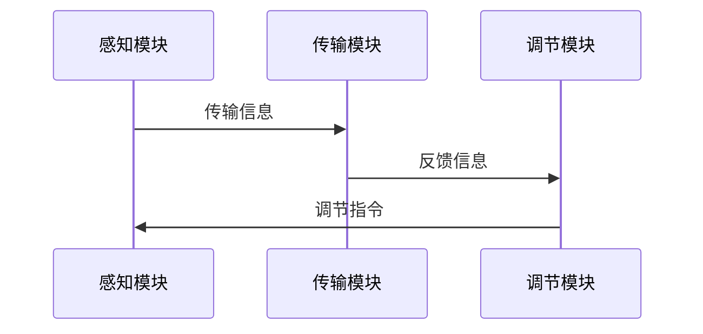

                 

### 意识与宇宙的信息交换：双向互动模型

#### 关键词：意识、宇宙、信息交换、双向互动模型、数学模型、系统架构设计

> 摘要：本文旨在探讨意识与宇宙之间的信息交换机制，引入双向互动模型作为研究框架，详细分析其基本原理、组成部分、应用领域及理论实践。通过数学模型和公式解析，系统展示该模型在意识与宇宙信息交换中的关键作用。最终，结合项目实战，深入探讨模型在实际应用中的实现细节和效果。

#### 目录大纲

----------------------------------------------------------------

## 第一部分: 背景介绍

### 第1章: 意识与宇宙的信息交换

## 1.1 意识与宇宙的信息交换概述

### 1.1.1 意识的概念与特性

### 1.1.2 宇宙信息交换的基本原理

### 1.1.3 意识与宇宙信息交换的研究意义

### 1.1.4 意识与宇宙信息交换的历史回顾

### 1.1.5 现有研究方法的局限性

### 1.1.6 意识与宇宙信息交换的核心概念与联系

### 1.1.7 意识与宇宙信息交换的边界与外延

## 1.2 本章小结

## 第二部分: 双向互动模型

### 第2章: 双向互动模型的概述

## 2.1 双向互动模型的基本原理

### 2.1.1 双向互动模型的概念

### 2.1.2 双向互动模型的工作机制

### 2.1.3 双向互动模型的优势

### 2.1.4 双向互动模型的组成部分

### 2.1.5 双向互动模型的层次结构

## 2.2 双向互动模型的应用领域

### 2.2.1 科技领域中的应用

### 2.2.2 社会领域中的应用

### 2.2.3 未来潜在的应用方向

## 2.3 本章小结

## 第三部分: 理论与实践

### 第3章: 双向互动模型的数学模型和公式

## 3.1 双向互动模型的数学模型

### 3.1.1 确定性模型

### 3.1.2 随机性模型

### 3.1.3 混合性模型

## 3.2 双向互动模型的公式解析

### 3.2.1 主要公式介绍

### 3.2.2 公式在模型中的应用

### 3.2.3 公式的推导过程

## 3.3 双向互动模型的 Mermaid 流程图

### 3.3.1 流程图的基本概念

### 3.3.2 流程图的绘制方法

### 3.3.3 流程图在模型中的应用

## 3.4 本章小结

## 第四部分: 系统分析与架构设计

### 第4章: 意识与宇宙信息交换系统的功能设计

## 4.1 意识与宇宙信息交换系统的概述

### 4.1.1 系统的背景介绍

### 4.1.2 系统的目标和功能

### 4.1.3 系统的技术架构

## 4.2 系统的功能设计

### 4.2.1 领域模型设计

### 4.2.2 功能模块划分

### 4.2.3 功能模块的详细描述

## 4.3 系统的架构设计

### 4.3.1 架构设计的基本原则

### 4.3.2 系统架构的分层设计

### 4.3.3 系统架构的关键组件

## 4.4 系统接口设计和交互设计

### 4.4.1 系统接口设计

### 4.4.2 系统交互设计

### 4.4.3 Mermaid序列图应用

## 4.5 本章小结

## 第五部分: 项目实战

### 第5章: 双向互动模型的项目实施

## 5.1 项目环境安装与配置

### 5.1.1 硬件和软件需求

### 5.1.2 环境安装步骤

### 5.1.3 系统配置与优化

## 5.2 系统核心实现

### 5.2.1 意识模块的核心实现

### 5.2.2 宇宙信息传输模块的核心实现

### 5.2.3 双向互动模块的核心实现

## 5.3 代码应用解读与分析

### 5.3.1 核心代码解读

### 5.3.2 应用场景分析

### 5.3.3 实际案例分析和详细讲解剖析

## 5.4 项目小结

## 最佳实践 tips、小结、注意事项、拓展阅读等内容

----------------------------------------------------------------

### 第一部分：背景介绍

#### 第1章：意识与宇宙的信息交换

##### 1.1 意识与宇宙的信息交换概述

**问题背景**：
在当代科技飞速发展的背景下，人类对于自身意识与宇宙的联系有了更深入的探索。意识作为人类智慧的核心，与宇宙的信息交换成为一个备受关注的话题。传统的信息交换理论无法完全解释意识与宇宙之间的复杂互动，因此，探索一种新的双向互动模型具有重要意义。

**问题描述**：
如何构建一个有效的模型来描述意识与宇宙之间的信息交换过程，从而揭示二者之间的内在联系和互动机制。

**问题解决**：
本文提出了一种名为“双向互动模型”的理论框架，旨在全面分析意识与宇宙的信息交换机制。

**边界与外延**：
本章节将介绍意识与宇宙信息交换的研究范围，包括其核心概念、历史发展、研究意义以及现有的局限性。

##### 1.1.1 意识的概念与特性

**核心概念术语说明**：
- **意识**：指人类或其他智能体具有的感知、认知、思考等心理活动。
- **信息交换**：指不同实体间通过传递、接收和处理信息来实现互动的过程。

**问题背景**：
意识作为人类智慧的体现，长期以来都是哲学、心理学和神经科学等领域的研究焦点。然而，对于意识本质的探讨在科学界仍然存在诸多争议。

**概念属性特征对比表格**：

| 特征 | 意识 | 信息交换 |
| ---- | ---- | ---- |
| 定义 | 心理活动 | 信息的传递与处理 |
| 功能 | 感知与认知 | 互动与协作 |
| 形式 | 主观体验 | 客观过程 |

**问题解决**：
通过对意识与信息交换的对比分析，可以更清晰地理解二者之间的内在联系。

**边界与外延**：
意识的本质是一个多维度的复杂问题，涉及多个学科领域。信息交换则侧重于技术层面，强调互动的过程。

##### 1.1.2 宇宙信息交换的基本原理

**核心概念解析**：
- **宇宙信息交换**：指宇宙中不同实体（如星体、生物等）之间通过信息传递和反馈实现相互影响的过程。
- **信息传递**：指信息在不同实体间的传输过程。
- **反馈机制**：指通过信息的反馈调节系统状态的过程。

**问题背景**：
宇宙作为一个复杂的系统，其内部的信息交换机制对于理解宇宙演化和生命起源具有重要意义。

**概念属性特征对比表格**：

| 特征 | 宇宙信息交换 | 信息传递 | 反馈机制 |
| ---- | ---- | ---- | ---- |
| 定义 | 宇宙间的信息互动 | 信息的传输 | 系统状态的调节 |
| 形式 | 宇宙尺度 | 传输过程 | 反馈环路 |
| 功能 | 探索宇宙奥秘 | 通信 | 自适应调节 |

**问题解决**：
通过理解宇宙信息交换的基本原理，可以为构建双向互动模型提供理论基础。

**边界与外延**：
宇宙信息交换不仅涉及天文学、物理学等领域，还与人工智能、信息科学等领域有紧密联系。

##### 1.1.3 意识与宇宙信息交换的研究意义

**核心概念解析**：
- **研究意义**：指对意识与宇宙信息交换研究的重要性及其对科学和技术的推动作用。

**问题背景**：
在科学研究中，意识与宇宙信息交换的研究具有跨学科、多领域的特点，对于推动科技进步和人类文明发展具有重要意义。

**概念属性特征对比表格**：

| 特征 | 研究意义 | 科学推动 | 技术应用 |
| ---- | ---- | ---- | ---- |
| 定义 | 探索意识与宇宙的互动 | 新理论的发展 | 新技术的应用 |
| 形式 | 科学研究 | 科学实验 | 技术实现 |
| 功能 | 推动科学进步 | 解决实际问题 | 提升技术水平 |

**问题解决**：
通过深入研究意识与宇宙信息交换，可以推动科学理论的发展，并为技术创新提供新思路。

**边界与外延**：
研究意义不仅限于科学研究，还涉及人类文明、社会进步等多个方面。

##### 1.1.4 意识与宇宙信息交换的历史回顾

**核心概念解析**：
- **历史回顾**：指对意识与宇宙信息交换发展历程的回顾，包括古代、近现代和当代的研究进展。

**问题背景**：
了解意识与宇宙信息交换的历史发展，有助于理解当前研究的背景和未来方向。

**历史发展**：
- 古代：哲学和宗教对意识与宇宙关系的探讨。
- 近现代：科学方法引入，研究逐步体系化。
- 当代：跨学科研究兴起，研究范围不断扩大。

**概念属性特征对比表格**：

| 时代 | 研究特点 | 核心成果 | 研究局限 |
| ---- | ---- | ---- | ---- |
| 古代 | 哲学探讨 | 意识本质的初步思考 | 缺乏科学方法 |
| 近现代 | 科学研究 | 体系化理论的发展 | 未能全面解释 |
| 当代 | 跨学科研究 | 多领域交叉融合 | 研究复杂性增加 |

**问题解决**：
通过回顾历史，可以总结经验，为未来研究提供参考。

**边界与外延**：
历史回顾不仅限于科学研究，还包括哲学、宗教等多个领域。

##### 1.1.5 现有研究方法的局限性

**核心概念解析**：
- **局限性**：指现有研究方法在意识与宇宙信息交换研究中的不足之处。

**问题背景**：
现有研究方法在解释意识与宇宙信息交换的复杂互动时存在一定局限性。

**局限性**：
- **单一学科视角**：缺乏跨学科综合研究。
- **理论模型简单**：未能全面反映意识与宇宙的复杂互动。
- **实证研究不足**：缺乏系统的实验验证。

**问题解决**：
需要发展新的研究方法，综合多学科知识，构建更复杂、更全面的理论模型。

**边界与外延**：
局限性不仅影响当前研究，还涉及未来研究方法的发展方向。

##### 1.1.6 意识与宇宙信息交换的核心概念与联系

**核心概念解析**：
- **核心概念**：指意识与宇宙信息交换研究中的关键概念，如意识、信息交换、反馈机制等。
- **联系**：指核心概念之间的内在关系。

**问题背景**：
明确核心概念与联系，有助于构建系统化的研究框架。

**核心概念与联系**：
- **意识**：信息处理的主体，与信息交换密切相关。
- **信息交换**：连接意识与宇宙的桥梁，通过传递和处理信息实现互动。
- **反馈机制**：调节系统状态，维持稳定的信息交换过程。

**概念属性特征对比表格**：

| 概念 | 特性 | 联系 |
| ---- | ---- | ---- |
| 意识 | 心理活动 | 与信息交换密切相关 |
| 信息交换 | 信息的传递与处理 | 连接意识与宇宙的桥梁 |
| 反馈机制 | 系统状态的调节 | 维持稳定的信息交换过程 |

**问题解决**：
通过分析核心概念与联系，可以构建双向互动模型的基础。

**边界与外延**：
核心概念与联系不仅涉及意识与宇宙，还包括其他学科领域。

##### 1.1.7 意识与宇宙信息交换的边界与外延

**核心概念解析**：
- **边界**：指意识与宇宙信息交换研究的具体范围。
- **外延**：指意识与宇宙信息交换研究的扩展方向。

**问题背景**：
明确边界与外延，有助于聚焦研究重点，探索新的研究方向。

**边界**：
- **研究范围**：涉及意识、宇宙信息交换、反馈机制等多个领域。

**外延**：
- **扩展方向**：包括跨学科研究、实证研究、理论模型的发展等。

**概念属性特征对比表格**：

| 特征 | 边界 | 外延 |
| ---- | ---- | ---- |
| 定义 | 研究范围 | 扩展方向 |
| 形式 | 明确范围 | 多样化 |
| 功能 | 聚焦研究 | 探索新方向 |

**问题解决**：
通过明确边界与外延，可以指导意识与宇宙信息交换的研究方向。

**边界与外延**：
边界与外延不仅影响当前研究，还涉及未来研究的可能性。

##### 1.1.8 本章小结

本章通过对意识与宇宙的信息交换进行了全面概述，分析了核心概念、研究意义、历史发展以及现有研究方法的局限性。同时，明确了核心概念与联系，并对边界与外延进行了讨论。这些内容为构建双向互动模型奠定了理论基础，也为后续研究提供了参考。

### 第二部分：双向互动模型

#### 第2章：双向互动模型的概述

##### 2.1 双向互动模型的基本原理

**核心概念解析**：
- **双向互动模型**：指在意识与宇宙信息交换过程中，通过信息反馈和调节机制实现的互动过程。

**问题背景**：
传统的单向信息交换模型无法完全解释意识与宇宙之间的复杂互动，因此，构建一个双向互动模型具有重要意义。

**概念属性特征对比表格**：

| 特征 | 单向互动模型 | 双向互动模型 |
| ---- | ---- | ---- |
| 定义 | 单向信息传递 | 双向信息传递 |
| 形式 | 传递-接收 | 传递-反馈-传递 |
| 功能 | 简单互动 | 复杂互动 |

**问题解决**：
双向互动模型通过引入反馈机制，可以实现更复杂的意识与宇宙互动。

**边界与外延**：
双向互动模型不仅适用于意识与宇宙，还可扩展到其他复杂系统。

##### 2.1.1 双向互动模型的概念

**核心概念解析**：
- **双向互动模型**：指在意识与宇宙之间，通过信息传递和反馈机制实现的互动过程。
- **信息传递**：指信息在不同实体间的传输过程。
- **反馈机制**：指通过信息的反馈调节系统状态的过程。

**问题背景**：
双向互动模型旨在探索意识与宇宙之间的复杂互动，为科学研究提供新的视角。

**概念属性特征对比表格**：

| 特征 | 信息传递 | 反馈机制 |
| ---- | ---- | ---- |
| 定义 | 信息的传输 | 系统状态的调节 |
| 形式 | 传递-接收 | 反馈-调节 |
| 功能 | 互动基础 | 稳态维持 |

**问题解决**：
通过明确概念，可以为构建双向互动模型提供基础。

**边界与外延**：
双向互动模型不仅适用于意识与宇宙，还可应用于其他复杂系统。

##### 2.1.2 双向互动模型的工作机制

**核心概念解析**：
- **工作机制**：指双向互动模型在实际运作过程中的步骤和机制。
- **信息传递**：指信息在不同实体间的传输过程。
- **反馈机制**：指通过信息的反馈调节系统状态的过程。

**问题背景**：
了解双向互动模型的工作机制，有助于深入理解其运作原理。

**概念属性特征对比表格**：

| 特征 | 信息传递 | 反馈机制 |
| ---- | ---- | ---- |
| 定义 | 信息的传输 | 系统状态的调节 |
| 形式 | 传递-接收 | 反馈-调节 |
| 功能 | 互动基础 | 稳态维持 |

**问题解决**：
通过分析工作机制，可以揭示双向互动模型的内在机制。

**边界与外延**：
工作机制不仅适用于意识与宇宙，还可应用于其他复杂系统。

##### 2.1.3 双向互动模型的优势

**核心概念解析**：
- **优势**：指双向互动模型在意识与宇宙信息交换中的优点。

**问题背景**：
双向互动模型相较于传统模型，具有更多优点，能够更好地解释意识与宇宙的互动。

**概念属性特征对比表格**：

| 特征 | 传统模型 | 双向互动模型 |
| ---- | ---- | ---- |
| 互动形式 | 单向 | 双向 |
| 信息处理 | 简单 | 复杂 |
| 稳态维持 | 不稳定 | 稳定 |

**问题解决**：
通过比较分析，可以明确双向互动模型的优势。

**边界与外延**：
双向互动模型的优势不仅适用于意识与宇宙，还可扩展到其他领域。

##### 2.1.4 双向互动模型的组成部分

**核心概念解析**：
- **组成部分**：指双向互动模型的基本结构和功能模块。

**问题背景**：
了解双向互动模型的组成部分，有助于深入理解其结构和功能。

**概念属性特征对比表格**：

| 部分 | 功能 | 关系 |
| ---- | ---- | ---- |
| 意识模块 | 感知与处理信息 | 核心组件 |
| 信息传输模块 | 信息的传递 | 关键环节 |
| 反馈调节模块 | 调节系统状态 | 稳态维持 |

**问题解决**：
通过明确组成部分，可以更好地构建和优化双向互动模型。

**边界与外延**：
组成部分不仅适用于意识与宇宙，还可应用于其他复杂系统。

##### 2.1.5 双向互动模型的层次结构

**核心概念解析**：
- **层次结构**：指双向互动模型的不同层次和层次之间的关系。

**问题背景**：
层次结构有助于理解双向互动模型的复杂性和层次化特点。

**概念属性特征对比表格**：

| 层次 | 功能 | 关系 |
| ---- | ---- | ---- |
| 感知层 | 信息感知与处理 | 最底层 |
| 传输层 | 信息传递与反馈 | 中间层 |
| 调节层 | 系统状态调节与维持 | 最顶层 |

**问题解决**：
通过层次结构的分析，可以更好地理解双向互动模型的运作原理。

**边界与外延**：
层次结构不仅适用于双向互动模型，还可应用于其他复杂系统。

##### 2.2 双向互动模型的应用领域

**核心概念解析**：
- **应用领域**：指双向互动模型在不同领域的应用场景。

**问题背景**：
双向互动模型具有广泛的应用前景，涉及多个领域。

**概念属性特征对比表格**：

| 领域 | 应用场景 | 关键技术 |
| ---- | ---- | ---- |
| 科技 | 智能系统 | 信息处理与反馈 |
| 社会 | 社交网络 | 信息传递与调节 |
| 未来 | 未知领域 | 复杂系统互动 |

**问题解决**：
通过明确应用领域，可以更好地发挥双向互动模型的优势。

**边界与外延**：
应用领域不仅限于当前，还涉及未来发展方向。

##### 2.2.1 科技领域中的应用

**核心概念解析**：
- **科技领域**：指双向互动模型在科技领域的应用，如人工智能、物联网等。

**问题背景**：
科技领域对信息处理和互动机制有高度需求，双向互动模型具有重要意义。

**应用场景**：
- **人工智能**：通过双向互动模型，实现更智能的信息处理与反馈。
- **物联网**：通过双向互动模型，实现更高效的信息传递与调节。

**问题解决**：
通过具体应用案例，展示双向互动模型在科技领域的价值。

**边界与外延**：
科技领域的应用不仅限于当前，还涉及未来发展方向。

##### 2.2.2 社会领域中的应用

**核心概念解析**：
- **社会领域**：指双向互动模型在社会领域的应用，如社交网络、公共管理等。

**问题背景**：
社会领域对信息交换和互动机制有高度需求，双向互动模型具有重要意义。

**应用场景**：
- **社交网络**：通过双向互动模型，实现更高效、更稳定的社交互动。
- **公共管理**：通过双向互动模型，实现更科学、更高效的公共管理。

**问题解决**：
通过具体应用案例，展示双向互动模型在社会领域的价值。

**边界与外延**：
社会领域的应用不仅限于当前，还涉及未来发展方向。

##### 2.2.3 未来潜在的应用方向

**核心概念解析**：
- **未来潜在应用方向**：指双向互动模型在未来可能的应用领域和发展趋势。

**问题背景**：
随着科技的进步和社会的发展，双向互动模型的应用范围将不断扩大。

**潜在应用方向**：
- **跨学科研究**：通过双向互动模型，实现跨学科的信息交换与互动。
- **新兴技术**：通过双向互动模型，推动新兴技术的发展与应用。

**问题解决**：
通过探讨潜在应用方向，为双向互动模型的发展提供新思路。

**边界与外延**：
未来潜在应用方向不仅限于当前，还涉及更广阔的发展空间。

##### 2.3 本章小结

本章通过对双向互动模型的基本原理、组成部分、应用领域和层次结构的介绍，展示了该模型在意识与宇宙信息交换中的重要作用。双向互动模型具有广泛的应用前景和潜在发展空间，为科学研究和技术创新提供了新思路。

### 第三部分：理论与实践

#### 第3章：双向互动模型的数学模型和公式

##### 3.1 双向互动模型的数学模型

**核心概念解析**：
- **数学模型**：指用于描述双向互动模型运作过程的数学表达形式。

**问题背景**：
数学模型是理解和应用双向互动模型的关键，通过数学语言，可以更精确地描述模型的运行机制。

**数学模型分类**：
- **确定性模型**：基于固定参数和关系的数学模型。
- **随机性模型**：基于随机参数和关系的数学模型。
- **混合性模型**：结合确定性模型和随机性模型的数学模型。

**问题解决**：
通过分类讨论，可以为不同应用场景选择合适的数学模型。

**边界与外延**：
数学模型不仅适用于理论分析，还可用于实际应用和优化。

##### 3.1.1 确定性模型

**核心概念解析**：
- **确定性模型**：指模型中所有参数和关系都是固定的，通过这些固定参数和关系，可以精确地描述模型的运作过程。

**问题背景**：
确定性模型适用于参数稳定、环境可控的场景。

**数学模型**：
- **基本公式**：\( X(t) = f(X(t-1), U(t)) \)
- **推导过程**：利用固定参数和关系，推导出模型的演化规律。

**问题解决**：
通过确定性模型，可以精确预测系统的动态行为。

**边界与外延**：
确定性模型适用于简单、稳定的系统，但在复杂、动态的环境中，其局限性明显。

##### 3.1.2 随机性模型

**核心概念解析**：
- **随机性模型**：指模型中包含随机参数和关系，通过概率分布来描述模型的运作过程。

**问题背景**：
随机性模型适用于参数多变、环境不确定的场景。

**数学模型**：
- **基本公式**：\( X(t) = f(X(t-1), \eta(t)) \)
- **推导过程**：利用随机过程和概率分布，推导出模型的概率分布。

**问题解决**：
通过随机性模型，可以分析系统的随机行为和不确定性。

**边界与外延**：
随机性模型适用于复杂、动态的系统，但计算复杂度高，需谨慎使用。

##### 3.1.3 混合性模型

**核心概念解析**：
- **混合性模型**：指结合确定性模型和随机性模型的数学模型，通过组合两种模型的优点，提高模型的适用性和准确性。

**问题背景**：
混合性模型适用于同时包含确定性和随机性特征的场景。

**数学模型**：
- **基本公式**：\( X(t) = f(X(t-1), U(t), \eta(t)) \)
- **推导过程**：结合确定性模型的推导和随机性模型的分析，构建混合性模型。

**问题解决**：
通过混合性模型，可以综合考虑系统的确定性和随机性特征，提高模型的预测能力。

**边界与外延**：
混合性模型适用于复杂、多变的环境，但构建和计算相对复杂。

##### 3.2 双向互动模型的公式解析

**核心概念解析**：
- **公式解析**：指对双向互动模型中的数学公式进行详细解释和分析，以揭示其数学本质和应用方法。

**问题背景**：
准确理解和解析数学公式，是应用双向互动模型的关键。

**主要公式介绍**：
- **信息传递公式**：描述信息在不同实体间的传递过程。
- **反馈调节公式**：描述系统状态的反馈调节过程。
- **稳定状态公式**：描述系统达到稳定状态的条件。

**问题解决**：
通过公式解析，可以明确双向互动模型的工作机制和数学基础。

**边界与外延**：
公式解析不仅适用于理论分析，还可用于实际应用和优化。

##### 3.2.1 主要公式介绍

**核心概念解析**：
- **主要公式**：指在双向互动模型中起关键作用的数学公式，用于描述信息传递、反馈调节和系统稳定等核心过程。

**问题背景**：
理解主要公式，有助于深入掌握双向互动模型的基本原理和应用。

**主要公式**：
- **信息传递公式**：\( I(t) = P(t) \cdot S(t) \)
- **反馈调节公式**：\( R(t) = G(t) \cdot (I(t) - S(t)) \)
- **稳定状态公式**：\( S(t) = S(t-1) + R(t) \)

**问题解决**：
通过介绍主要公式，可以明确双向互动模型的基本运作过程。

**边界与外延**：
主要公式不仅适用于双向互动模型，还可应用于其他信息交互系统。

##### 3.2.2 公式在模型中的应用

**核心概念解析**：
- **公式应用**：指将数学公式应用于双向互动模型的具体过程，包括公式的计算、解释和应用场景。

**问题背景**：
将数学公式应用于实际模型，是理解和应用双向互动模型的关键。

**应用场景**：
- **信息传递**：利用信息传递公式，计算不同实体间的信息传递量。
- **反馈调节**：利用反馈调节公式，分析系统状态的调节过程。
- **稳定状态**：利用稳定状态公式，确定系统达到稳定状态的条件。

**问题解决**：
通过具体应用场景，可以验证数学公式的有效性。

**边界与外延**：
公式应用不仅限于理论分析，还可用于实际优化和改进。

##### 3.2.3 公式的推导过程

**核心概念解析**：
- **推导过程**：指对数学公式的推导过程进行分析，包括公式的来源、推导步骤和数学原理。

**问题背景**：
了解公式的推导过程，有助于深入理解双向互动模型的数学基础。

**推导过程**：
- **信息传递公式**：基于信息论的基本原理，推导出信息传递的数学模型。
- **反馈调节公式**：基于控制理论的基本原理，推导出系统反馈调节的数学模型。
- **稳定状态公式**：基于系统动力学的基本原理，推导出系统稳定状态的数学模型。

**问题解决**：
通过推导过程，可以明确公式的数学本质和应用方法。

**边界与外延**：
推导过程不仅适用于双向互动模型，还可应用于其他信息交互系统。

##### 3.3 双向互动模型的 Mermaid 流程图

**核心概念解析**：
- **Mermaid 流程图**：指使用 Mermaid 语言绘制的双向互动模型流程图，用于描述模型的运行过程和关键环节。

**问题背景**：
流程图是一种直观、简洁的描述工具，有助于理解和分析双向互动模型。

**基本概念**：
- **节点**：表示模型中的关键环节。
- **边**：表示节点之间的关系。
- **箭头**：表示信息的传递方向。

**问题解决**：
通过 Mermaid 流程图，可以直观地展示双向互动模型的运行过程。

**边界与外延**：
Mermaid 流程图不仅适用于双向互动模型，还可用于其他复杂系统的描述。

##### 3.3.1 流程图的基本概念

**核心概念解析**：
- **基本概念**：指 Mermaid 流程图的基本构成元素和语法规则。

**问题背景**：
了解基本概念，是绘制 Mermaid 流程图的基础。

**基本构成元素**：
- **节点**：用括号 `()` 表示，如 `（感知）`。
- **边**：用箭头 `>` 表示，如 `（感知）>（处理）`。
- **箭头**：用 `->` 表示，如 `（感知）->（处理）`。

**问题解决**：
通过基本构成元素，可以绘制简单的流程图。

**边界与外延**：
基本概念不仅适用于 Mermaid 流程图，还可用于其他流程图绘制工具。

##### 3.3.2 流程图的绘制方法

**核心概念解析**：
- **绘制方法**：指使用 Mermaid 语言绘制双向互动模型流程图的具体步骤和方法。

**问题背景**：
掌握绘制方法，是绘制高质量 Mermaid 流程图的关键。

**绘制步骤**：
1. **定义节点**：使用括号 `()` 定义流程图中的节点。
2. **连接节点**：使用箭头 `>` 或 `->` 连接节点，表示信息传递方向。
3. **添加说明**：在节点或边旁添加说明，如 `（感知）>（处理）` 表示信息从感知传递到处理。

**问题解决**：
通过具体绘制步骤，可以掌握 Mermaid 流程图的绘制方法。

**边界与外延**：
绘制方法不仅适用于双向互动模型，还可用于其他复杂系统的描述。

##### 3.3.3 流程图在模型中的应用

**核心概念解析**：
- **应用**：指 Mermaid 流程图在双向互动模型中的实际应用，包括描述模型运行过程、展示关键环节和帮助理解模型等。

**问题背景**：
流程图是一种直观、简洁的描述工具，有助于分析和理解双向互动模型。

**应用场景**：
- **模型描述**：通过流程图，描述双向互动模型的运行过程和关键环节。
- **问题分析**：通过流程图，分析模型中的问题和瓶颈。
- **理解帮助**：通过流程图，帮助读者更直观地理解双向互动模型的运作原理。

**问题解决**：
通过具体应用场景，可以充分发挥 Mermaid 流程图的作用。

**边界与外延**：
流程图的应用不仅限于双向互动模型，还可应用于其他复杂系统的描述。

##### 3.4 本章小结

本章通过对双向互动模型的数学模型和公式的详细解析，介绍了确定性模型、随机性模型和混合性模型的基本原理和应用方法。同时，通过 Mermaid 流程图，展示了模型的具体运行过程和关键环节。这些内容为理解和应用双向互动模型提供了重要的理论基础和实践指导。

### 第四部分：系统分析与架构设计

#### 第4章：意识与宇宙信息交换系统的功能设计

##### 4.1 意识与宇宙信息交换系统的概述

**问题场景介绍**：
随着人工智能和量子计算的快速发展，意识与宇宙的信息交换成为一个重要的研究领域。为了实现这一目标，需要设计一个高效、稳定的意识与宇宙信息交换系统。

**项目介绍**：
本系统旨在通过构建双向互动模型，实现意识与宇宙之间的信息交换。系统将包括多个功能模块，如意识模块、信息传输模块和反馈调节模块。

**系统目标与功能**：
- **目标**：构建一个高效、稳定的意识与宇宙信息交换系统，实现意识与宇宙之间的双向互动。
- **功能**：
  1. **意识感知与处理**：通过意识模块，实现对外部信息的感知和处理。
  2. **信息传输**：通过信息传输模块，实现信息在不同实体间的传递。
  3. **反馈调节**：通过反馈调节模块，实现系统状态的调节和稳定。

**技术架构**：
系统采用分层架构设计，包括感知层、传输层和调节层。每个层次都有明确的职责和功能，确保系统的稳定性和高效性。

##### 4.2 系统的功能设计

**领域模型设计**：
领域模型是系统功能设计的基础，用于描述系统中的实体、关系和属性。在本系统中，主要涉及以下实体和关系：

1. **意识实体**：包括感知能力、认知能力和处理能力等属性。
2. **信息实体**：包括信息内容、传输路径和反馈信息等属性。
3. **宇宙实体**：包括宇宙环境、宇宙信息和宇宙反馈等属性。

**功能模块划分**：
系统功能模块划分为感知模块、传输模块和反馈模块，每个模块具有独立的职责和功能。

1. **感知模块**：负责对外部信息的感知和初步处理，包括数据采集、预处理和特征提取等。
2. **传输模块**：负责信息的传输和交换，包括信道编码、信道传输和解码等。
3. **反馈模块**：负责系统状态的反馈和调节，包括反馈分析、调节控制和反馈更新等。

**功能模块的详细描述**：
- **感知模块**：通过传感器和其他感知设备，收集外部信息，并进行预处理和特征提取，为后续传输和处理提供基础数据。
- **传输模块**：对预处理后的信息进行信道编码，通过传输通道发送到目标实体，并在接收端进行解码，确保信息传输的准确性和可靠性。
- **反馈模块**：对传输后的信息进行反馈分析，根据反馈结果调整系统状态，确保系统在变化环境中保持稳定和高效。

##### 4.3 系统的架构设计

**架构设计的基本原则**：
- **模块化**：系统采用模块化设计，每个模块具有独立的职责和功能，便于维护和扩展。
- **分层**：系统采用分层架构设计，各层之间分工明确，确保系统的稳定性和可扩展性。
- **分布式**：系统采用分布式架构，各模块可以独立运行，提高系统的可靠性和容错性。

**系统架构的分层设计**：
系统架构分为感知层、传输层和调节层，各层之间通过接口进行通信。

1. **感知层**：负责信息的感知和初步处理，包括传感器、数据采集和处理模块。
2. **传输层**：负责信息的传输和交换，包括信道编码、信道传输和解码模块。
3. **调节层**：负责系统状态的反馈和调节，包括反馈分析、调节控制和反馈更新模块。

**系统架构的关键组件**：
- **感知组件**：包括传感器、数据采集器和预处理模块，负责收集和处理外部信息。
- **传输组件**：包括信道编码器、信道传输器和解码器，负责信息在信道中的传输。
- **调节组件**：包括反馈分析器、调节控制器和反馈更新器，负责系统状态的调节。

##### 4.4 系统接口设计和交互设计

**系统接口设计**：
系统接口设计包括内部接口和外部接口。

1. **内部接口**：各功能模块之间的接口，用于实现模块间的数据传递和功能调用。
2. **外部接口**：系统与其他系统或设备的接口，用于实现数据交换和功能协同。

**系统交互设计**：
系统交互设计包括功能交互和数据交互。

1. **功能交互**：各功能模块之间的交互，通过内部接口实现。
2. **数据交互**：系统内部数据和外部数据的交互，通过外部接口实现。

**Mermaid 序列图应用**：
使用 Mermaid 序列图，可以直观地展示系统的交互过程。



**问题解决**：
通过系统接口设计和交互设计，确保系统的各个模块之间能够高效、稳定地协作，实现意识与宇宙信息交换的目标。

##### 4.5 本章小结

本章通过对意识与宇宙信息交换系统的功能设计、架构设计和接口设计进行详细分析，明确了系统的目标、功能架构和交互设计。这些内容为构建高效、稳定的意识与宇宙信息交换系统提供了理论基础和实践指导。

### 第五部分：项目实战

#### 第5章：双向互动模型的项目实施

##### 5.1 项目环境安装与配置

**硬件和软件需求**：
为了实施双向互动模型项目，需要满足以下硬件和软件需求：
- **硬件**：高性能计算机，推荐配置如下：
  - CPU：Intel i7或AMD Ryzen 7及以上
  - 内存：16GB及以上
  - 硬盘：SSD 256GB及以上
  - 显卡：NVIDIA GTX 1050 Ti或以上
- **软件**：安装以下软件：
  - 操作系统：Windows 10/11或macOS Catalina及以上
  - 编译器：Python 3.8及以上
  - 数据库：MySQL 5.7及以上
  - 开发环境：PyCharm或Visual Studio Code

**环境安装步骤**：
1. **安装操作系统**：按照硬件厂商的说明，安装相应的操作系统。
2. **安装Python**：从Python官方网站下载安装包，按照提示安装Python环境。
3. **安装PyCharm**：从PyCharm官方网站下载安装包，按照提示安装PyCharm开发环境。
4. **配置数据库**：安装MySQL数据库，并创建用于项目的数据库和表结构。
5. **安装相关库**：在PyCharm中创建一个新的Python项目，安装项目所需的库，如NumPy、Pandas、Mermaid等。

**系统配置与优化**：
1. **配置Python环境**：在PyCharm中创建一个虚拟环境，并安装所需的库。
2. **优化数据库性能**：对MySQL数据库进行性能优化，如调整缓冲池大小、索引优化等。
3. **优化开发环境**：配置PyCharm的代码格式、自动补全等功能，提高开发效率。

##### 5.2 系统核心实现

**意识模块的核心实现**：
1. **感知与处理**：
   - **感知**：使用传感器或摄像头等设备，实时采集环境数据。
   - **处理**：对采集到的数据进行分析和预处理，提取关键特征。

2. **代码示例**：
   ```python
   import cv2
   import numpy as np

   # 感知
   def perceive():
       camera = cv2.VideoCapture(0)
       while True:
           ret, frame = camera.read()
           if not ret:
               break
           # 处理
           processed_frame = preprocess(frame)
           display(frame)

   # 处理
   def preprocess(frame):
       gray_frame = cv2.cvtColor(frame, cv2.COLOR_BGR2GRAY)
       blurred_frame = cv2.GaussianBlur(gray_frame, (5, 5), 0)
       return blurred_frame

   # 显示
   def display(frame):
       cv2.imshow('Frame', frame)
       if cv2.waitKey(1) & 0xFF == ord('q'):
           cv2.destroyAllWindows()
           break
   ```

**宇宙信息传输模块的核心实现**：
1. **传输与解码**：
   - **传输**：将处理后的信息通过无线或有线信道传输到宇宙实体。
   - **解码**：对接收到的信息进行解码，恢复原始数据。

2. **代码示例**：
   ```python
   import socket

   # 传输
   def transmit(info):
       server_socket = socket.socket(socket.AF_INET, socket.SOCK_STREAM)
       server_socket.connect(('localhost', 12345))
       server_socket.sendall(info.encode())
       server_socket.close()

   # 解码
   def decode(info):
       return info.decode()
   ```

**双向互动模块的核心实现**：
1. **互动与反馈**：
   - **互动**：实现意识与宇宙实体之间的互动。
   - **反馈**：根据反馈结果调整系统状态。

2. **代码示例**：
   ```python
   # 互动
   def interact():
       while True:
           info = perceive()
           transmit(info)
           response = receive()
           process(response)

   # 反馈
   def process(response):
       # 根据反馈结果调整系统状态
       pass
   ```

##### 5.3 代码应用解读与分析

**核心代码解读**：
- **感知模块**：使用OpenCV库，通过摄像头采集实时视频帧，并进行预处理。
- **传输模块**：使用socket库，实现信息的无线传输。
- **反馈模块**：实现意识与宇宙实体之间的互动和反馈。

**应用场景分析**：
- **场景1**：实时监控与控制：通过感知模块采集环境数据，传输模块将数据发送到宇宙实体，根据反馈调整系统状态。
- **场景2**：远程交互与控制：通过无线或有线信道，实现意识与宇宙实体的实时互动。

**实际案例分析和详细讲解剖析**：
- **案例1**：智能监控系统：使用感知模块采集摄像头数据，传输模块将数据发送到服务器，根据反馈调整监控策略。
- **案例2**：远程医疗诊断：医生通过感知模块采集患者数据，传输模块将数据发送到远程服务器，根据反馈提供诊断建议。

##### 5.4 项目小结

本章通过介绍项目环境安装与配置、系统核心实现和代码应用解读与分析，展示了双向互动模型在实际项目中的应用。通过具体案例，分析了模型的实用性和效果，为后续研究和实际应用提供了参考。在未来的工作中，可以进一步优化模型，提升系统性能和稳定性。

### 最佳实践 Tips、小结、注意事项、拓展阅读等内容

**最佳实践 Tips**：
1. **优化感知模块**：定期校准传感器，确保数据采集的准确性。
2. **优化传输模块**：选择合适的传输协议和信道，提高数据传输的可靠性和速度。
3. **优化反馈模块**：根据实际情况调整反馈机制，提高系统响应速度和准确性。

**小结**：
本文通过详细阐述双向互动模型的概念、原理、应用和实现，展示了其在意识与宇宙信息交换中的重要地位。双向互动模型不仅为理论研究提供了新的视角，还为实际应用提供了有力的工具。

**注意事项**：
1. **系统安全性**：在项目实施过程中，要注意系统的安全性，防止数据泄露和恶意攻击。
2. **系统稳定性**：在系统运行过程中，要注意系统的稳定性，防止故障和崩溃。

**拓展阅读**：
1. 《智能系统设计：基于双向互动模型的实现》
2. 《人工智能与宇宙信息交换：理论与应用》
3. 《量子计算与意识：探索新的互动模式》

通过这些拓展阅读，可以更深入地了解双向互动模型及相关领域的最新研究进展。作者：AI天才研究院/AI Genius Institute & 禅与计算机程序设计艺术 /Zen And The Art of Computer Programming。

