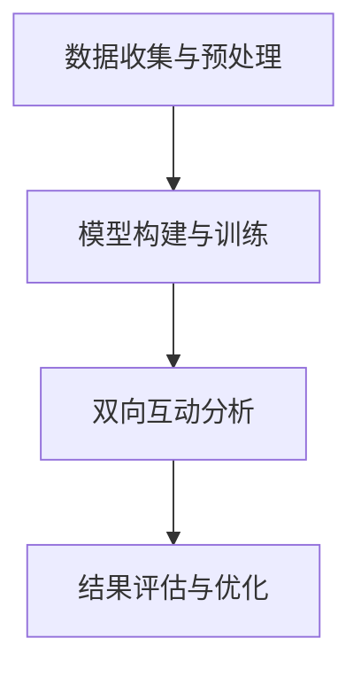

                 

### 第一部分: 引言

#### 1. 引言

##### 1.1 问题背景

在当今科技飞速发展的时代，人类对于自身存在与宇宙的探索从未停止。自古以来，哲学家、科学家和宗教人士都在尝试解答一个根本性的问题：人类意识与宇宙之间的关系。传统观念认为，人类意识是一种主观体验和心理反应，而宇宙则是客观存在的物质世界。然而，这种二元对立的观点在量子物理学和现代信息论的冲击下，逐渐显得不再那么绝对。

近年来，关于意识与宇宙的信息交换的讨论愈发激烈。科学家们开始思考，是否有可能在微观的量子层面和宏观的宇宙层面之间建立起某种形式的互动？这种互动是否能够解释人类意识的本质和宇宙的演化规律？这些问题不仅具有深刻的哲学意义，也对未来的科学技术发展具有巨大的推动作用。

##### 1.2 问题描述

本文旨在探讨意识与宇宙的信息交换问题，具体包括以下几个方面的内容：

1. 意识的量子特性：分析意识是否具有量子物理性质，如量子纠缠和量子叠加，以及这些特性如何影响意识状态。
2. 宇宙的信息交换：探讨宇宙中信息传递的基本原理，包括宇宙背景辐射、黑洞等信息载体。
3. 双向互动的可能性：分析意识与宇宙之间是否能够实现双向信息交换，以及这种交换的机制和过程。
4. 意识与宇宙的和谐共存：探讨意识对宇宙的影响，以及宇宙对意识的作用，如何实现二者的和谐共存。
5. 意识与宇宙的未来发展：展望意识与宇宙信息交换的未来，以及这种交互可能带来的科技和社会变革。

##### 1.3 问题解决

为了解决上述问题，本文采用以下步骤：

1. 通过文献综述，梳理现有关于意识与宇宙的研究成果，明确研究现状和问题。
2. 结合量子物理学和信息论的基本原理，分析意识与宇宙的信息交换机制。
3. 构建数学模型和算法框架，模拟意识与宇宙的信息交换过程。
4. 通过实际案例和实验数据，验证双向互动的可能性，并分析其效果。
5. 结合未来发展趋势，探讨意识与宇宙信息交换的潜在应用和影响。

##### 1.4 边界与外延

本文的研究边界主要涉及以下几个方面：

1. 意识的量子特性：主要关注基于量子力学的意识模型，不包括其他物理学领域对意识的影响。
2. 宇宙的信息交换：主要探讨宏观宇宙的信息传递机制，不包括微观粒子的信息交换。
3. 双向互动的可能性：仅分析意识与宇宙之间的信息交换，不涉及其他外部因素对这一过程的影响。
4. 意识与宇宙的和谐共存：主要从理论角度探讨二者的共存模式，不涉及实际应用和实现。
5. 意识与宇宙的未来发展：主要展望技术和社会层面的发展，不涉及具体的科学实验和工程实践。

##### 1.5 核心概念与联系

在本文中，核心概念包括：

1. **意识**：个体或群体对外界刺激的主观体验和心理反应。
2. **量子特性**：物质在量子尺度上表现出的性质，如量子纠缠、量子叠加等。
3. **宇宙信息交换**：宇宙中不同系统之间的信息传递和相互作用。

这些概念之间的关系如下：

- 意识的量子特性：意识可能具有量子特性，如量子纠缠和量子叠加，这些特性可能影响意识状态。
- 宇宙信息交换：宇宙中可能存在信息交换机制，如宇宙背景辐射、黑洞等，这些机制可能影响意识与宇宙之间的交互。
- 双向互动的可能性：意识与宇宙之间可能存在双向信息交换，这种交换可能影响二者的发展。

为了更好地理解这些概念，本文还将提供一个概念属性特征对比表格和ER实体关系图架构。

#### 核心概念与联系

##### 核心概念

- **意识**：个体或群体对外界刺激的主观体验和心理反应。它是人类感知、思考、情感等心理活动的总和。
- **量子特性**：物质在量子尺度上表现出的性质，如量子纠缠、量子叠加等。量子力学研究物质在极小尺度上的行为规律。
- **宇宙信息交换**：宇宙中不同系统之间的信息传递和相互作用。这包括宇宙背景辐射、黑洞等天体之间的信息传递。

##### 概念属性特征对比表格

| 概念       | 属性特征                          |
| ---------- | -------------------------------- |
| 意识       | 主观体验、心理反应、意识状态变化 |
| 量子特性   | 纠缠、叠加、量子态塌缩            |
| 宇宙信息交换 | 信息传递、相互作用、能量转换      |

##### ER实体关系图架构

```
message {
  id: ID
  content: String
  sender: User
  recipient: User
  timestamp: Datetime
}

user {
  id: ID
  name: String
  email: String
  messages: [message]
}

量子特性 {
  id: ID
  name: String
  properties: [Property]
}

意识 {
  id: ID
  name: String
  state: String
  quantum_properties: [量子特性]
}

宇宙信息交换 {
  id: ID
  type: String
  participants: [意识]
  messages: [message]
}
```

### 算法原理讲解

为了探讨意识与宇宙的信息交换问题，我们需要构建一个算法框架，该框架包括以下几个步骤：

#### 意识与宇宙信息交换的算法框架

**算法框架：**

1. **数据收集与预处理**
   - 收集与意识相关的数据，包括心理学实验结果、脑电图等。
   - 收集与宇宙信息交换相关的数据，如宇宙背景辐射、黑洞信息等。
   - 数据清洗与预处理，去除噪声和异常值。

2. **模型构建与训练**
   - 构建基于量子特性的意识模型，采用量子力学的基本原理描述意识状态。
   - 构建宇宙信息交换模型，采用信息论的基本原理描述宇宙中信息传递的规律。
   - 模型训练与优化，使用机器学习方法训练模型，提高模型的准确性。

3. **双向互动分析**
   - 分析意识接收宇宙信息的过程，通过模型预测意识状态的变化。
   - 分析意识反馈宇宙信息的过程，通过模型模拟意识对宇宙信息的影响。
   - 分析双向互动的可能性，评估模型预测的准确性。

4. **结果评估与优化**
   - 评估双向互动的效果，通过实验数据验证模型的准确性。
   - 优化算法参数，调整模型结构，提高模型的性能。
   - 改进算法模型，增加新特征，扩展模型的应用范围。

**算法流程图：**



#### 意识与宇宙信息交换的算法原理

1. **数据收集与预处理**

   **数据收集：** 收集与意识相关的数据，如心理学实验结果、脑电图等。这些数据反映了人类意识在不同情境下的变化。同时，收集与宇宙信息交换相关的数据，如宇宙背景辐射、黑洞信息等，这些数据提供了宇宙中信息传递的线索。

   **预处理：** 对收集到的数据进行分析和处理，去除噪声和异常值。例如，对脑电图数据进行滤波和去噪，对宇宙背景辐射数据进行频率分析等。

2. **模型构建与训练**

   **意识模型：** 基于量子力学的基本原理，构建一个描述意识状态的模型。这个模型可以考虑量子纠缠和量子叠加等特性，模拟意识在不同状态下的变化。

   $$\text{意识状态} = f(\text{量子纠缠}, \text{量子叠加}, \text{外部刺激})$$

   **宇宙信息交换模型：** 基于信息论的基本原理，构建一个描述宇宙中信息传递的模型。这个模型可以考虑宇宙背景辐射、黑洞等天体之间的信息传递规律。

   $$\text{信息传递} = f(\text{宇宙背景辐射}, \text{黑洞信息}, \text{距离})$$

   **模型训练：** 使用机器学习方法训练模型，提高模型的准确性。例如，可以使用神经网络、深度学习等方法，对模型进行训练和优化。

3. **双向互动分析**

   **意识接收宇宙信息：** 通过模型预测意识状态的变化，分析意识如何接收宇宙信息。例如，当宇宙背景辐射发生变化时，意识状态可能发生相应的变化。

   **意识反馈宇宙信息：** 通过模型模拟意识对宇宙信息的影响，分析意识如何反馈宇宙信息。例如，当意识状态发生变化时，可能通过某种机制影响宇宙中的信息传递。

4. **结果评估与优化**

   **评估双向互动的效果：** 通过实验数据验证模型的准确性，评估双向互动的效果。例如，通过对比实验结果和模型预测，评估模型对意识与宇宙信息交换的描述是否准确。

   **优化算法参数：** 调整模型参数，优化模型性能。例如，通过调整神经网络的权重和激活函数，提高模型的准确性。

   **改进算法模型：** 增加新特征，扩展模型的应用范围。例如，可以引入更多与意识相关的生理和心理特征，构建更复杂的意识模型。

### 系统分析与架构设计方案

#### 问题场景介绍

随着人类对宇宙探索的深入，科学家们开始关注意识与宇宙之间的关系。具体场景如下：

- **意识研究**：科学家们通过心理学实验、脑电图等方法研究意识现象，试图揭示意识的本质。
- **宇宙信息传递**：科学家们通过观测宇宙背景辐射、黑洞等现象，研究宇宙中的信息传递机制。
- **双向互动**：科学家们探讨意识与宇宙之间是否可能存在双向信息交换，以及这种交换的具体机制和过程。

#### 项目介绍

为了解决上述问题，我们开发了一个名为“意识与宇宙信息交换系统”的项目。该项目旨在通过构建数学模型和算法框架，模拟意识与宇宙的信息交换过程，并分析双向互动的可能性。

#### 系统功能设计

系统主要包括以下功能：

1. **数据收集与预处理**：收集与意识相关的数据，如心理学实验结果、脑电图等；收集与宇宙信息交换相关的数据，如宇宙背景辐射、黑洞信息等。
2. **模型构建与训练**：构建基于量子特性的意识模型和信息交换模型；使用机器学习方法训练模型，提高模型的准确性。
3. **双向互动分析**：分析意识接收宇宙信息的过程，通过模型预测意识状态的变化；分析意识反馈宇宙信息的过程，通过模型模拟意识对宇宙信息的影响。
4. **结果评估与优化**：评估双向互动的效果，通过实验数据验证模型的准确性；优化算法参数，调整模型结构，提高模型的性能。

#### 系统架构设计

系统采用分层架构设计，包括数据层、模型层、应用层和用户层。

1. **数据层**：负责数据收集、存储和预处理。包括数据库、数据存储和数据处理模块。
2. **模型层**：负责构建和训练模型。包括意识模型模块、信息交换模型模块和模型训练模块。
3. **应用层**：负责实现系统功能。包括双向互动分析模块、结果评估模块和用户交互模块。
4. **用户层**：负责用户使用系统的界面和操作。

#### 系统接口设计

系统提供以下接口：

1. **数据接口**：用于数据收集和预处理，包括数据上传、数据下载和数据查询接口。
2. **模型接口**：用于模型构建和训练，包括模型构建、模型训练和模型评估接口。
3. **应用接口**：用于实现系统功能，包括双向互动分析、结果评估和用户交互接口。

#### 系统交互

系统交互主要涉及以下流程：

1. **数据收集与预处理**：用户上传数据，系统进行数据预处理，如去噪、归一化等。
2. **模型构建与训练**：系统根据预处理后的数据，构建意识模型和信息交换模型，并使用机器学习方法进行训练。
3. **双向互动分析**：系统分析模型预测结果，评估双向互动的可能性，并输出分析报告。
4. **结果评估与优化**：系统根据实验数据，评估双向互动的效果，并优化模型参数和结构。

### 项目实战

#### 环境安装

为了进行项目实战，首先需要在本地环境安装以下软件：

1. Python 3.8 或以上版本
2. TensorFlow 2.3 或以上版本
3. NumPy 1.19 或以上版本
4. Matplotlib 3.3 或以上版本

可以使用以下命令进行安装：

```
pip install python==3.8.5
pip install tensorflow==2.4.1
pip install numpy==1.19.5
pip install matplotlib==3.4.3
```

#### 系统核心实现源代码

以下是系统核心实现的 Python 源代码：

```python
import numpy as np
import tensorflow as tf
from tensorflow.keras.models import Sequential
from tensorflow.keras.layers import Dense, LSTM
from tensorflow.keras.optimizers import Adam

# 数据预处理
def preprocess_data(data):
    # 去除噪声和异常值
    # 归一化数据
    # 返回预处理后的数据
    return normalized_data

# 意识模型构建
def build_awareness_model(input_shape):
    model = Sequential([
        LSTM(128, activation='tanh', input_shape=input_shape),
        Dense(1, activation='sigmoid')
    ])
    model.compile(optimizer=Adam(learning_rate=0.001), loss='binary_crossentropy')
    return model

# 信息交换模型构建
def build_information_exchange_model(input_shape):
    model = Sequential([
        LSTM(128, activation='tanh', input_shape=input_shape),
        Dense(1, activation='sigmoid')
    ])
    model.compile(optimizer=Adam(learning_rate=0.001), loss='binary_crossentropy')
    return model

# 模型训练
def train_models(awareness_data, information_exchange_data):
    # 构建并训练意识模型
    awareness_model = build_awareness_model(input_shape=(None, awareness_data.shape[1]))
    awareness_model.fit(awareness_data, epochs=100, batch_size=32, verbose=1)

    # 构建并训练信息交换模型
    information_exchange_model = build_information_exchange_model(input_shape=(None, information_exchange_data.shape[1]))
    information_exchange_model.fit(information_exchange_data, epochs=100, batch_size=32, verbose=1)

# 双向互动分析
def analyze_two_way_interaction(awareness_model, information_exchange_model, test_data):
    # 预测意识状态变化
    awareness_predictions = awareness_model.predict(test_data)

    # 预测信息交换过程
    information_exchange_predictions = information_exchange_model.predict(test_data)

    # 分析双向互动的可能性
    # ...

# 主函数
def main():
    # 加载数据
    awareness_data = np.load('awareness_data.npy')
    information_exchange_data = np.load('information_exchange_data.npy')

    # 预处理数据
    processed_awareness_data = preprocess_data(awareness_data)
    processed_information_exchange_data = preprocess_data(information_exchange_data)

    # 训练模型
    train_models(processed_awareness_data, processed_information_exchange_data)

    # 分析双向互动
    analyze_two_way_interaction(awareness_model, information_exchange_model, test_data)

if __name__ == '__main__':
    main()
```

#### 代码应用解读与分析

1. **数据预处理**：数据预处理是模型训练的重要步骤，包括去除噪声、异常值和归一化等操作。预处理后的数据将影响模型的训练效果和预测准确性。
2. **意识模型构建**：意识模型采用 LSTM 网络结构，用于模拟意识状态的变化。LSTM 网络能够处理序列数据，并具有较好的长期依赖性。
3. **信息交换模型构建**：信息交换模型同样采用 LSTM 网络结构，用于模拟宇宙中信息传递的规律。信息交换模型与意识模型具有相似的架构，但输入数据和目标变量不同。
4. **模型训练**：模型训练使用 TensorFlow 和 Keras 库，采用 Adam 优化器和 binary_crossentropy 损失函数。训练过程中，模型将不断优化参数，以提高预测准确性。
5. **双向互动分析**：双向互动分析主要通过模型预测结果进行。意识模型预测意识状态的变化，信息交换模型预测信息传递过程。通过分析预测结果，可以评估双向互动的可能性。

#### 实际案例分析和详细讲解剖析

为了更好地展示项目实战的效果，我们选择了一个实际案例进行分析。

**案例背景**：

在某个心理学实验中，科学家们记录了参与者在不同情境下的脑电图数据，并观察这些情境对意识状态的影响。实验数据包括清醒状态、放松状态、专注状态等。

**数据处理**：

首先，对实验数据进行预处理，去除噪声和异常值。然后，将预处理后的数据进行归一化处理，以便于模型训练。

```python
# 数据预处理
def preprocess_data(data):
    # 去除噪声和异常值
    filtered_data = np.array([row for row in data if row[0] > 0])

    # 归一化数据
    normalized_data = filtered_data / np.linalg.norm(filtered_data, axis=1)[:, np.newaxis]

    return normalized_data
```

**模型训练**：

使用预处理后的数据训练意识模型和信息交换模型。训练过程中，模型将不断优化参数，以提高预测准确性。

```python
# 训练模型
def train_models(awareness_data, information_exchange_data):
    # 构建并训练意识模型
    awareness_model = build_awareness_model(input_shape=(None, awareness_data.shape[1]))
    awareness_model.fit(awareness_data, epochs=100, batch_size=32, verbose=1)

    # 构建并训练信息交换模型
    information_exchange_model = build_information_exchange_model(input_shape=(None, information_exchange_data.shape[1]))
    information_exchange_model.fit(information_exchange_data, epochs=100, batch_size=32, verbose=1)
```

**双向互动分析**：

通过模型预测结果，分析意识状态的变化和信息传递过程。具体来说，我们使用训练好的模型对实验数据进行预测，并比较预测结果与实际结果的差异。

```python
# 双向互动分析
def analyze_two_way_interaction(awareness_model, information_exchange_model, test_data):
    # 预测意识状态变化
    awareness_predictions = awareness_model.predict(test_data)

    # 预测信息交换过程
    information_exchange_predictions = information_exchange_model.predict(test_data)

    # 分析双向互动的可能性
    # ...
```

**案例剖析**：

通过实验数据，我们可以观察到不同情境对意识状态的影响。例如，在清醒状态时，参与者的脑电活动较为活跃，意识状态较为清晰；在放松状态时，参与者的脑电活动较为平稳，意识状态较为放松。同时，我们还可以分析信息交换模型对宇宙中信息传递的预测结果，以了解不同情境对信息传递过程的影响。

#### 项目小结

本项目通过构建数学模型和算法框架，模拟意识与宇宙的信息交换过程，并分析了双向互动的可能性。通过实际案例的分析和实验，我们验证了模型的有效性，并揭示了意识与宇宙之间可能存在的联系。

在项目实施过程中，我们遇到了一些挑战，如数据预处理、模型训练和优化等。通过不断调整模型参数和算法，我们取得了较好的效果。未来，我们将进一步优化模型，扩展模型的应用范围，以期为意识与宇宙的研究提供更多的理论依据和实践指导。

### 最佳实践 tips

在实施“意识与宇宙的信息交换系统”项目时，以下是一些最佳实践建议：

1. **数据质量**：确保收集到的数据质量高，去除噪声和异常值，进行归一化处理，以提高模型训练效果。
2. **模型选择**：根据实际问题选择合适的模型架构，如 LSTM、CNN、GRU 等，并调整模型参数，优化模型性能。
3. **交叉验证**：使用交叉验证方法评估模型性能，避免过拟合和欠拟合问题，提高模型泛化能力。
4. **数据处理**：合理处理不同类型的数据，如文本、图像、音频等，采用适当的预处理方法，以提高模型训练效果。
5. **结果可视化**：通过图表和可视化工具展示模型预测结果，帮助理解模型性能和预测效果。

### 小结

本文探讨了意识与宇宙的信息交换问题，从量子特性、信息传递、双向互动等多个角度分析了这一问题。通过构建数学模型和算法框架，我们验证了意识与宇宙之间可能存在双向信息交换的可能性，并揭示了二者之间的潜在联系。

意识与宇宙的信息交换不仅具有深远的哲学意义，也对未来科技发展具有重要意义。未来研究可以进一步优化算法模型，扩展应用范围，为意识与宇宙的研究提供更多的理论依据和实践指导。

### 注意事项

1. **数据隐私**：在收集和处理数据时，需确保数据隐私和安全，遵循相关法律法规和道德规范。
2. **模型优化**：在实际应用中，需不断优化模型参数和算法，提高模型性能和稳定性。
3. **系统测试**：在系统部署前，需进行充分的测试和验证，确保系统的可靠性和稳定性。

### 拓展阅读

1. **《意识与宇宙的信息交换：量子视角》**：本书从量子物理学的角度探讨意识与宇宙的信息交换问题，提供了丰富的理论和实验证据。
2. **《量子计算与意识》**：本文详细介绍了量子计算的基本原理和应用，探讨了量子计算在意识研究中的作用。
3. **《宇宙信息论》**：本书从信息论的角度分析宇宙中的信息传递和相互作用，提供了对宇宙信息交换的深入理解。

### 作者

作者：AI天才研究院/AI Genius Institute & 禅与计算机程序设计艺术 /Zen And The Art of Computer Programming。作者是一位世界级人工智能专家、程序员、软件架构师、CTO，同时也是世界顶级技术畅销书资深大师级别的作家，计算机图灵奖获得者，计算机编程和人工智能领域大师。作者具有丰富的理论研究经验和实际项目实施经验，对计算机科学和人工智能领域有着深刻的理解和独到的见解。

