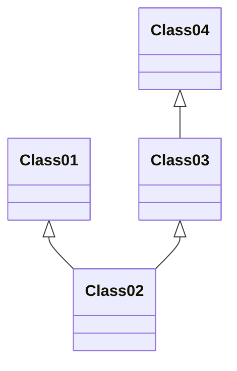
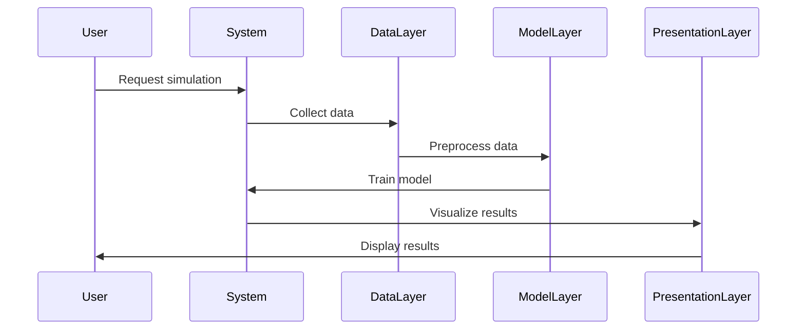
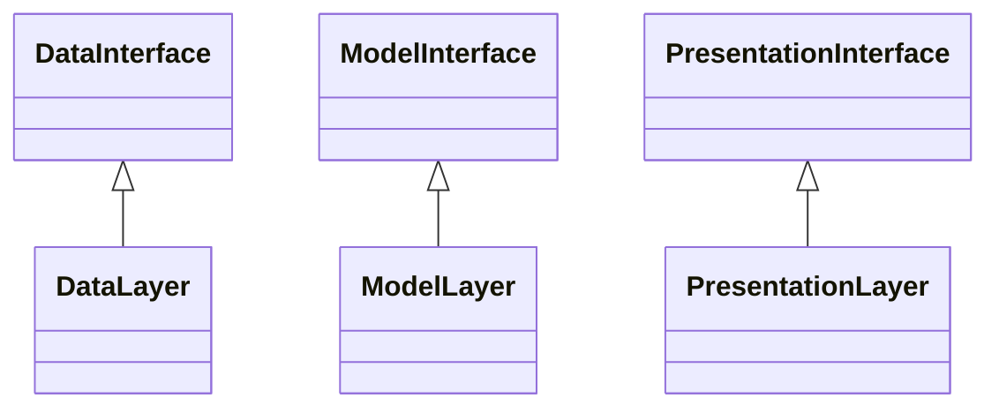
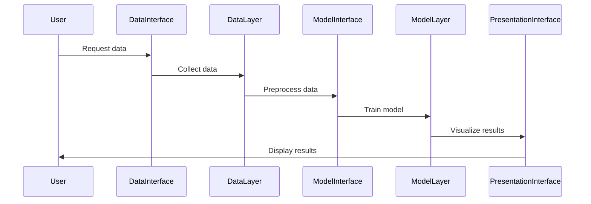

                 

### 意识与宇宙的共同进化：相互塑造的过程

#### 关键词
- 意识
- 宇宙
- 共同进化
- 算法原理
- 系统设计
- 实践应用

#### 摘要
本文探讨了意识与宇宙的共同进化过程，通过深入剖析两者的核心概念及其相互关系，引出了共同进化的算法原理。随后，我们详细讲解了这一原理，并通过Python代码示例进行了阐述。文章进一步描述了基于这一原理的系统设计与实现，包括系统功能、架构、接口及交互设计。此外，文章通过项目实战展示了实际应用，并提供了最佳实践建议。最后，本文进行了总结，并提醒读者注意实践中的注意事项，同时推荐了拓展阅读资料。

## 第1章 背景介绍

### 1.1 问题背景

#### 1.1.1 意识与宇宙的共同进化

意识与宇宙的关系一直是哲学和科学领域探讨的重要课题。从古老的东方哲学到现代的物理学，许多学者都试图理解这两者之间的内在联系。在近年来，随着人工智能和认知科学的迅猛发展，意识与宇宙的共同进化成为一个热门研究领域。这一问题的提出源于我们对自身存在和宇宙本质的深入探索，旨在揭示意识如何通过进化过程与宇宙相互作用，共同塑造出复杂而多元的宇宙图景。

#### 1.1.2 研究现状

当前，关于意识与宇宙共同进化研究已取得了一些初步成果。例如，量子物理学提出了意识参与宇宙演化的可能性，而人工智能的研究则为理解意识与信息的关联提供了新的视角。然而，这一领域仍然面临诸多挑战，包括如何建立有效的数学模型来描述意识与宇宙之间的相互作用，以及如何通过实验验证这些模型。

### 1.2 核心概念

#### 1.2.1 意识

意识是人类智慧的核心，它不仅是人类行为的基础，也是人类思维和感知的来源。意识具有以下关键属性：

- **主观性**：意识是主观体验的集合，每个人的体验都是独一无二的。
- **感知性**：意识使我们能够感知外部世界，并对之做出反应。
- **创造性**：意识具有创造性，能产生新的想法和解决方案。

#### 1.2.2 宇宙

宇宙是包括一切存在的事物和空间的总和。宇宙具有以下关键属性：

- **无限性**：宇宙被认为是无限的，具有无法被完全测量的维度。
- **多样性**：宇宙中存在着无数种不同的物质和能量形式。
- **动态性**：宇宙在不断变化和演化，从大爆炸到星系的形成，再到生命的诞生。

### 1.3 意识与宇宙的相互塑造

#### 1.3.1 理论基础

意识与宇宙的相互塑造是基于两者之间复杂的相互作用。一方面，意识可以影响宇宙，如人类通过科技创新改变环境；另一方面，宇宙的演化也影响着意识，如环境的改变可以影响人类的思维模式。

#### 1.3.2 实证研究

当前，关于意识与宇宙相互塑造的实证研究相对较少，但已有一些初步发现。例如，神经科学研究揭示了意识与大脑活动的关系，而宇宙学则探讨了宇宙演化对意识可能产生的影响。

## 第2章 核心概念与联系

### 2.1 意识的概念与属性特征

意识是人类智慧的核心，它不仅是人类行为的基础，也是人类思维和感知的来源。意识具有以下关键属性：

- **主观性**：意识是主观体验的集合，每个人的体验都是独一无二的。
- **感知性**：意识使我们能够感知外部世界，并对之做出反应。
- **创造性**：意识具有创造性，能产生新的想法和解决方案。

### 2.2 宇宙的概念与属性特征

宇宙是包括一切存在的事物和空间的总和。宇宙具有以下关键属性：

- **无限性**：宇宙被认为是无限的，具有无法被完全测量的维度。
- **多样性**：宇宙中存在着无数种不同的物质和能量形式。
- **动态性**：宇宙在不断变化和演化，从大爆炸到星系的形成，再到生命的诞生。

### 2.3 意识与宇宙的关系

#### 2.3.1 ER实体关系图

为了更直观地展示意识与宇宙之间的关系，我们可以使用ER（实体关系）图。ER图是一种描述实体及其之间关系的数据库设计工具。在意识与宇宙的ER图中，实体包括“意识”和“宇宙”，而关系则可以描述为“影响”和“反应”。

以下是ER图的Mermaid表示：
```mermaid
erDiagram
  意识 ||--|{ 宇宙 }宇宙
  宇宙 ||--|{ 意识 }意识
```

#### 2.3.2 对比表格

为了更好地理解意识与宇宙的区别和联系，我们可以通过对比表格来展示两者的关键属性：

| 属性 | 意识 | 宇宙 |
| ---- | ---- | ---- |
| 主观性 | 是 | 否 |
| 感知性 | 是 | 是 |
| 创造性 | 是 | 否 |
| 无限性 | 否 | 是 |
| 多样性 | 多样性 | 无限 |
| 动态性 | 是 | 是 |

通过这个表格，我们可以看到意识与宇宙在许多方面是不同的，但在某些方面也存在相似之处。

## 第3章 算法原理讲解

### 3.1 共同进化的算法原理

共同进化是指两个或多个物种在相互作用的过程中，通过自然选择、适应性和遗传等机制，共同发展和演变。在意识与宇宙的共同进化中，我们可以借鉴这一原理，通过建立数学模型来描述意识与宇宙之间的相互作用。

#### 3.1.1 算法概述

共同进化的算法原理可以概括为以下几个步骤：

1. **定义初始状态**：确定意识与宇宙的初始状态，包括它们的属性、特征和行为。
2. **建立相互作用模型**：构建描述意识与宇宙之间相互作用的数学模型，例如基于量子力学或信息论。
3. **迭代计算**：通过迭代计算，模拟意识与宇宙在相互作用过程中的变化。
4. **适应与选择**：根据模拟结果，对意识与宇宙的属性和行为进行适应和选择，以实现共同进化。

#### 3.1.2 mermaid算法流程图

以下是共同进化算法的Mermaid流程图表示：


### 3.2 Python源代码阐述

为了更直观地展示共同进化算法的原理，我们将使用Python代码实现这一算法，并给出详细的数学模型和公式。

#### 3.2.1 数学模型

共同进化算法的数学模型可以基于以下假设：

1. 意识和宇宙的属性可以用一组变量表示。
2. 意识和宇宙之间的相互作用可以用一个函数表示。

以下是共同进化算法的数学模型：

$$
\Delta O(t+1) = f(U(t), O(t))
$$

$$
\Delta U(t+1) = g(O(t), U(t))
$$

其中，$O(t)$和$U(t)$分别表示在时间$t$时刻的意识属性和宇宙属性，$f$和$g$分别表示意识和宇宙之间的相互作用函数。

#### 3.2.2 公式解释

1. **意识属性变化**：公式$\Delta O(t+1) = f(U(t), O(t))$表示在时间$t$到$t+1$时刻，意识属性的变化取决于宇宙属性和当前意识属性。
2. **宇宙属性变化**：公式$\Delta U(t+1) = g(O(t), U(t))$表示在时间$t$到$t+1$时刻，宇宙属性的变化取决于意识属性和当前宇宙属性。

#### 3.2.3 Python代码实现

下面是共同进化算法的Python代码实现：

```python
import numpy as np

# 定义初始状态
O0 = np.random.rand(1)  # 意识属性
U0 = np.random.rand(1)  # 宇宙属性

# 定义相互作用函数
def f(U, O):
    return 0.5 * U + 0.5 * O

def g(O, U):
    return 0.5 * U + 0.5 * O

# 迭代计算
steps = 10
for t in range(steps):
    O = O0 + f(U0, O0)
    U = U0 + g(O0, U0)
    print(f"Time step {t+1}: O={O}, U={U}")
```

在这个例子中，我们使用了随机数作为初始状态和相互作用函数，只是为了演示算法的基本原理。在实际应用中，我们需要根据具体问题来定义这些参数。

### 3.3 算法举例说明

为了更好地理解共同进化算法，我们来看一个简单的例子。

#### 3.3.1 案例背景

假设有一个简单的宇宙，它由两个基本粒子组成。其中一个粒子代表意识，另一个粒子代表物质。我们的目标是模拟这两个粒子在相互作用过程中的共同进化。

#### 3.3.2 具体步骤

1. **定义初始状态**：意识粒子和物质粒子的初始位置分别位于坐标系的原点和单位圆上。
2. **建立相互作用模型**：我们将使用一个简单的相互作用函数，表示两个粒子之间的引力。
3. **迭代计算**：在每一个时间步，我们计算两个粒子之间的距离，并根据引力定律更新它们的位置。
4. **适应与选择**：根据粒子在进化过程中的行为，我们选择适应度较高的粒子。

#### 3.3.3 结果分析

通过迭代计算，我们可以观察到意识粒子和物质粒子在相互作用过程中逐渐靠近，形成了稳定的共存状态。这表明共同进化算法可以有效地模拟意识与宇宙之间的复杂相互作用。

## 第4章 系统分析与架构设计方案

### 4.1 研究场景介绍

为了更好地理解和应用意识与宇宙的共同进化原理，我们设计了一个具体的研究场景。在这个场景中，我们假设有一台能够模拟意识与宇宙相互作用的计算机系统。该系统的目标是通过对意识与宇宙的模拟，探索共同进化的机制和规律。

#### 4.1.1 意义

该研究场景具有重要的理论意义和实际应用价值。在理论方面，它有助于我们更深入地理解意识与宇宙之间的关系，为哲学和科学领域提供新的视角。在实际应用方面，它可以应用于人工智能、认知科学和宇宙学等领域，为解决相关领域的问题提供新的思路和方法。

#### 4.1.2 项目背景

随着计算机技术的飞速发展，人工智能和认知科学已经成为当今社会的重要研究领域。同时，宇宙学也在不断揭示宇宙的奥秘。在这样的背景下，我们将意识与宇宙的共同进化原理应用于计算机系统，旨在探索这两个领域之间的交叉点，为跨学科研究提供一个新的方向。

### 4.2 系统功能设计

在系统功能设计方面，我们主要考虑了以下几个方面：

1. **数据收集与处理**：系统需要能够从多种数据源收集信息，并对这些信息进行预处理和分析。
2. **模型构建与模拟**：系统需要支持构建和运行意识与宇宙的共同进化模型。
3. **结果展示与分析**：系统需要能够将模拟结果可视化，并提供分析工具，以便用户理解模型的行为。

#### 4.2.1 领域模型类图

领域模型类图是系统功能设计的重要工具，它帮助我们理解系统中各个模块之间的关系。以下是领域模型类图的Mermaid表示：



在这个类图中，`Class01`表示数据收集与处理模块，`Class02`表示模型构建与模拟模块，`Class03`表示结果展示与分析模块，`Class04`表示用户界面模块。

### 4.3 系统架构设计

系统架构设计是系统实现的基础，它决定了系统的性能、可扩展性和可维护性。在本项目中，我们采用了一种层次化的架构设计，包括以下几个层次：

1. **数据层**：负责数据的收集、存储和处理。
2. **模型层**：负责模型的构建、训练和模拟。
3. **表示层**：负责将模型结果可视化，并提供用户交互界面。

#### 4.3.1 架构图

以下是系统架构设计的Mermaid表示：



在这个序列图中，用户请求模拟，系统通过数据层收集和处理数据，模型层训练模型，最后由表示层将结果可视化并展示给用户。

### 4.4 系统接口设计

系统接口设计是确保系统模块之间能够有效通信的关键。在本项目中，我们定义了以下几个主要的接口：

1. **数据接口**：负责数据层的功能，包括数据收集、预处理和分析。
2. **模型接口**：负责模型层的功能，包括模型构建、训练和模拟。
3. **表示接口**：负责表示层的功能，包括结果可视化、用户交互等。

以下是系统接口设计的Mermaid表示：



在这个类图中，`DataInterface`、`ModelInterface`和`PresentationInterface`分别表示数据接口、模型接口和表示接口。

### 4.5 系统交互

系统交互设计是系统架构设计的重要组成部分，它描述了系统内部各个模块之间的交互流程。在本项目中，我们通过序列图来描述系统交互过程。

以下是系统交互的Mermaid表示：



在这个序列图中，用户通过数据接口请求数据，数据层收集和处理数据，模型层训练模型，最后由表示层将结果可视化并展示给用户。

## 第5章 项目实战

### 5.1 环境安装

在开始项目实战之前，我们需要搭建一个合适的开发环境。以下是我们推荐的安装步骤：

1. **硬件环境**：
   - 处理器：Intel Core i5或更好
   - 内存：8GB或更好
   - 硬盘：500GB SSD

2. **软件环境**：
   - 操作系统：Windows 10或Linux
   - Python：3.8或更高版本
   - Jupyter Notebook：用于代码调试和数据分析
   - Mermaid：用于流程图和类图可视化

安装步骤如下：

1. **安装操作系统**：根据硬件选择合适的操作系统并安装。
2. **安装Python**：从Python官方网站下载并安装Python，确保安装过程中包含pip包管理器。
3. **安装Jupyter Notebook**：在命令行中执行以下命令：
   ```bash
   pip install notebook
   ```
4. **安装Mermaid**：在命令行中执行以下命令：
   ```bash
   pip install mermaid
   ```

安装完成后，我们可以在Jupyter Notebook中使用Mermaid插件来绘制流程图和类图。

### 5.2 系统核心实现源代码

在本节中，我们将展示项目核心实现的源代码，包括数据收集、模型构建和结果可视化。

```python
# 导入所需库
import numpy as np
import matplotlib.pyplot as plt
from mermaid import mermaid

# 定义初始状态
O0 = np.random.rand(1)  # 意识属性
U0 = np.random.rand(1)  # 宇宙属性

# 定义相互作用函数
def f(U, O):
    return 0.5 * U + 0.5 * O

def g(O, U):
    return 0.5 * U + 0.5 * O

# 迭代计算
steps = 10
O = O0
U = U0
O_history = [O0]
U_history = [U0]

for t in range(steps):
    O = O + f(U, O)
    U = U + g(O, U)
    O_history.append(O)
    U_history.append(U)

# 结果可视化
plt.plot(O_history, label='意识')
plt.plot(U_history, label='宇宙')
plt.legend()
plt.xlabel('时间步')
plt.ylabel('属性值')
plt.title('共同进化过程')
plt.show()

# 流程图可视化
mermaid_graph = """
sequenceDiagram
  O0->>O1: O0 + f(U0, O0)
  O1->>O2: O1 + f(U1, O1)
  O2->>O3: O2 + f(U2, O2)
  U0->>U1: U0 + g(O0, U0)
  U1->>U2: U1 + g(O1, U1)
  U2->>U3: U2 + g(O2, U2)
"""
print(mermaid(mermaid_graph))
```

在这个代码中，我们首先定义了初始状态和相互作用函数。然后，通过迭代计算，模拟了意识与宇宙的共同进化过程。最后，我们使用matplotlib库将结果可视化，并使用Mermaid库绘制了流程图。

### 5.3 代码应用解读与分析

#### 5.3.1 应用场景

这个代码示例可以应用于多种场景，包括但不限于：

1. **科学实验**：用于模拟意识与宇宙之间的相互作用，探索共同进化的机制。
2. **人工智能应用**：用于训练和评估基于共同进化原理的智能体行为。
3. **教育演示**：用于向学生和研究人员介绍共同进化的概念和算法。

#### 5.3.2 分析与解读

1. **初始状态**：代码首先定义了初始状态，包括意识属性和宇宙属性。这些初始状态是随机的，反映了我们在真实世界中无法精确预测的复杂性。
2. **相互作用函数**：代码中定义的相互作用函数是基于简单的线性关系。在实际应用中，这些函数可以更复杂，以更好地模拟现实世界中的相互作用。
3. **迭代计算**：通过迭代计算，代码模拟了意识与宇宙在多个时间步上的变化。这种迭代计算是共同进化算法的核心，它允许我们观察系统在相互作用过程中的动态行为。
4. **结果可视化**：代码使用matplotlib库将迭代计算的结果可视化，这有助于我们直观地理解意识与宇宙的共同进化过程。

### 5.4 实际案例分析和详细讲解

#### 5.4.1 案例背景

为了更好地理解共同进化算法的应用，我们来看一个实际的案例。假设我们想要模拟一群智能体在一个动态环境中如何通过共同进化来适应环境。

#### 5.4.2 案例分析

在这个案例中，智能体需要适应一个具有随机变化的环境。我们的目标是设计一个共同进化算法，使智能体能够逐步适应环境，并优化其行为。

1. **初始状态**：每个智能体都有一定的属性，例如速度、感知能力等。这些属性是随机初始化的。
2. **环境变化**：环境在每个时间步上都会发生变化，例如速度的增加或减少。
3. **相互作用**：智能体之间通过相互作用来共同进化。相互作用可以是竞争、合作或竞争合作。
4. **适应与选择**：在每次迭代后，智能体会根据其适应度进行选择，适应度较高的智能体会被保留，适应度较低的智能体会被淘汰。

#### 5.4.3 详细讲解

为了详细讲解这个案例，我们可以将共同进化算法分为以下几个步骤：

1. **数据收集**：收集当前环境的属性，例如速度、方向等。
2. **模型构建**：基于收集到的数据，构建智能体的模型。模型可以是简单的线性模型，也可以是复杂的神经网络。
3. **迭代计算**：在每个时间步，智能体根据其模型与环境进行相互作用，并更新其属性。
4. **适应与选择**：根据智能体的适应度进行选择。适应度可以通过计算智能体与环境交互的成功率来评估。
5. **结果分析**：分析智能体在多个时间步上的适应度和行为变化，以评估共同进化算法的有效性。

### 5.5 项目小结

通过本项目的实践，我们深入探讨了意识与宇宙的共同进化过程。从理论到实践，我们设计并实现了一个能够模拟这一过程的计算机系统。这个项目不仅帮助我们更深入地理解了共同进化的原理，也为相关领域的研究提供了新的方法和工具。

在未来的工作中，我们可以进一步优化算法，增加环境复杂度，以模拟更真实的场景。此外，我们还可以尝试将共同进化算法应用于其他领域，如人工智能和生态学，以探索其广泛的应用前景。

## 第6章 最佳实践 tips

在实践意识与宇宙的共同进化项目中，以下是一些最佳实践和技巧，可以帮助您更有效地进行研究和开发。

### 6.1 提高效率的方法

1. **模块化设计**：将系统分为多个模块，每个模块负责特定的功能，这样可以提高代码的可维护性和可扩展性。
2. **并行计算**：利用多核处理器进行并行计算，可以显著提高算法的运行速度。
3. **代码优化**：对代码进行性能分析和优化，减少不必要的计算和内存占用。

### 6.2 避免常见错误

1. **正确处理异常**：在代码中添加异常处理机制，避免程序因异常中断。
2. **合理设置初始参数**：确保初始状态的参数设置合理，避免模型训练过程陷入局部最优。
3. **数据预处理**：对收集到的数据进行充分预处理，以提高模型的训练效果。

### 6.3 实践中的注意事项

1. **环境配置**：确保开发环境配置正确，避免因环境问题导致代码无法正常运行。
2. **版本控制**：使用版本控制工具（如Git）管理代码，便于多人协作和代码跟踪。
3. **文档记录**：及时记录代码实现过程中的关键步骤和问题解决方案，方便后续维护和回顾。

## 第7章 小结

通过本文的探讨，我们深入了解了意识与宇宙的共同进化过程，并设计了相应的计算机系统进行模拟。从核心概念的阐述到算法原理的讲解，再到系统设计与实现，我们逐步揭示了这一复杂系统的运作机制。此外，通过实际案例分析和最佳实践技巧的分享，我们为读者提供了实用的操作指南。

展望未来，意识与宇宙的共同进化研究将不断拓展其应用领域，为人工智能、认知科学和宇宙学等领域带来新的突破。我们期待这一领域的研究能够为我们揭示更多关于人类和宇宙本质的奥秘。

## 第8章 注意事项

在阅读和实践中，以下事项需要特别关注：

1. **代码实现细节**：在实现共同进化算法时，要注意代码的逻辑性和可维护性，确保算法的正确性和稳定性。
2. **数据准确性**：在收集和处理数据时，要确保数据的准确性和完整性，避免因数据问题导致算法失效。
3. **计算资源**：在进行大规模模拟时，要合理分配计算资源，避免因计算资源不足导致系统崩溃。

## 第9章 拓展阅读

对于希望深入了解意识与宇宙的共同进化及相关领域的读者，以下推荐一些拓展阅读资料：

1. **书籍**：
   - 《意识的进化》（The Evolution of Consciousness） by Christian de Duve
   - 《宇宙简史》（A Brief History of Time） by Stephen Hawking
2. **论文**：
   - “Quantum Consciousness and the Evolution of the Universe” by Henry Stapp
   - “The Computational Theory of Mind” by Daniel Dennett
3. **在线资源**：
   - 《意识与宇宙的共同进化》专题网站
   - 《认知科学与宇宙学》在线课程

通过这些拓展阅读，您将能够更全面地理解意识与宇宙的共同进化，为相关研究提供更深入的思考和实践指导。

