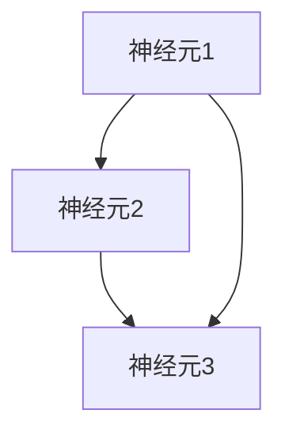
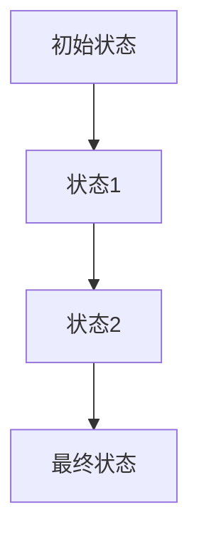
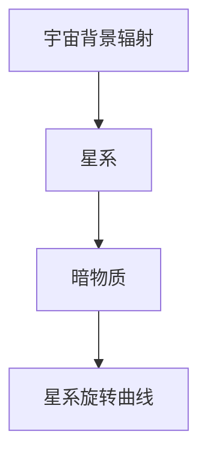
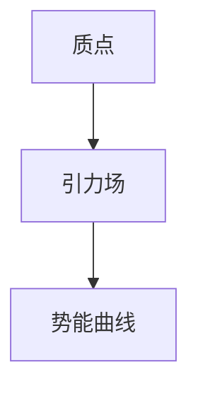
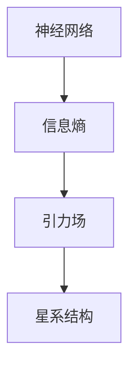
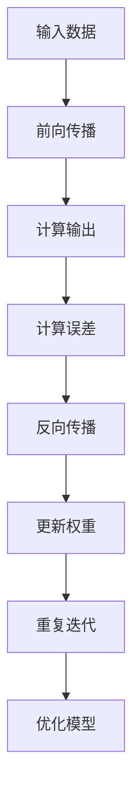
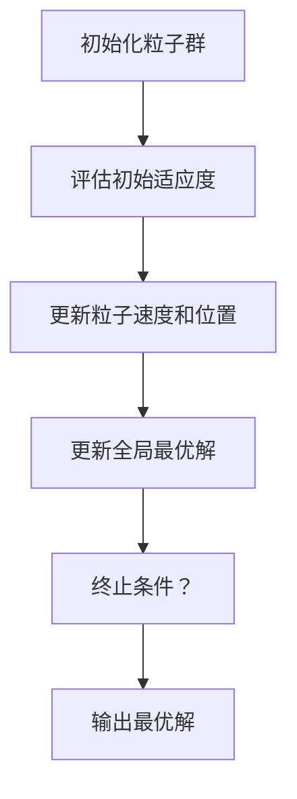
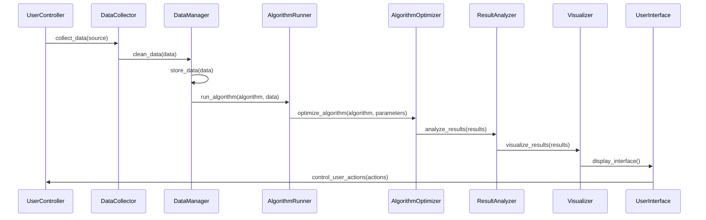
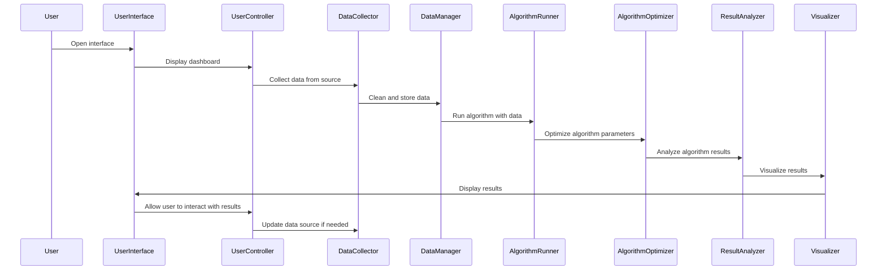
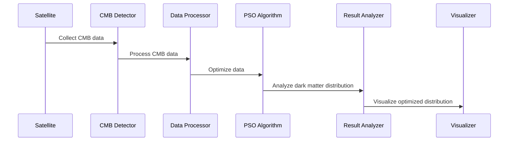

                 


### 《意识与暗物质：未知领域的潜在联系》

**关键词：** 意识、暗物质、理论框架、数学模型、算法设计、应用前景

**摘要：** 本文章深入探讨意识与暗物质之间的潜在联系，通过科学的理论框架和数学模型，探讨这两个看似不相关的领域之间的可能关系，为读者呈现一个全新的视角。文章将从背景介绍、核心概念与联系、算法原理讲解、系统分析与架构设计、项目实战等多个角度，逐步揭示意识与暗物质之间的奥秘。

**目录大纲：**

## 第一部分：引言

### 1.1 书籍背景与目的

### 1.1.1 意识与暗物质的重要性

### 1.1.2 探索意识与暗物质的联系

### 1.1.3 书籍的结构与内容

### 1.2 意识与暗物质的现状

### 1.2.1 意识的探讨

### 1.2.2 暗物质的研究现状

## 第二部分：理论框架

### 2.1 意识与暗物质的理论框架

#### 2.1.1 核心概念与属性

#### 2.1.2 比较与联系

### 2.2 数学模型

#### 2.2.1 意识的数学模型

#### 2.2.2 暗物质的数学模型

### 2.3 Mermaid 图形表示

#### 2.3.1 意识与暗物质的 Mermaid 图

## 第三部分：算法与系统设计

### 3.1 算法原理

#### 3.1.1 意识算法的设计

#### 3.1.2 暗物质探测算法的设计

### 3.2 系统架构设计

#### 3.2.1 系统功能设计

#### 3.2.2 系统架构设计

#### 3.2.3 系统接口设计

#### 3.2.4 系统交互

## 第四部分：应用与实践

### 4.1 实际案例

#### 4.1.1 案例一：意识的观测与测量

#### 4.1.2 案例二：暗物质探测实验

### 4.2 项目实战

#### 4.2.1 环境安装与配置

#### 4.2.2 系统核心实现

#### 4.2.3 代码应用解读与分析

#### 4.2.4 实际案例分析与讲解

### 4.3 小结

## 第五部分：挑战与未来方向

### 5.1 当前挑战

#### 5.1.1 技术障碍

#### 5.1.2 理论困境

### 5.2 未来方向

#### 5.2.1 研究热点

#### 5.2.2 发展趋势

## 第六部分：结论

### 6.1 主要发现

### 6.2 意义与影响

## 第七部分：拓展阅读

### 7.1 推荐书籍

### 7.2 研究论文

### 7.3 网络资源

### 作者：AI天才研究院/AI Genius Institute & 禅与计算机程序设计艺术 /Zen And The Art of Computer Programming

**内容结构说明：**

### 1. 引言部分（1级）

- **1.1 书籍背景与目的：** 阐述本书的起源、目的和研究意义。
- **1.2 意识与暗物质的现状：** 概述意识与暗物质的研究现状，为后续讨论奠定基础。

### 2. 理论框架部分（2级）

- **2.1 意识与暗物质的理论框架：** 提出研究意识与暗物质联系的理论框架，包括核心概念和比较分析。
- **2.2 数学模型：** 详细介绍用于描述意识与暗物质特性的数学模型。
- **2.3 Mermaid 图形表示：** 使用Mermaid语言绘制相关概念和模型的图形表示，帮助读者直观理解。

### 3. 算法与系统设计部分（3级）

- **3.1 算法原理：** 阐述用于探索意识与暗物质联系的算法原理，包括算法设计和实现。
- **3.2 系统架构设计：** 描述用于支持算法的系统架构设计，包括功能、接口和交互。
- **3.3 实际应用案例：** 通过具体案例展示算法和系统的实际应用效果。

### 4. 应用与实践部分（3级）

- **4.1 实际案例：** 分析意识与暗物质研究中的实际应用案例，探讨其方法和结果。
- **4.2 项目实战：** 描述一个完整的项目实现过程，包括环境安装、系统核心实现和实际应用分析。

### 5. 挑战与未来方向部分（3级）

- **5.1 当前挑战：** 指出研究中的困难和问题，并提出解决方案。
- **5.2 未来方向：** 预测意识与暗物质研究的发展趋势和潜在突破点。

### 6. 结论部分（1级）

- **6.1 主要发现：** 总结本书的主要研究成果和发现。
- **6.2 意义与影响：** 讨论这些发现对学术界和实际应用的潜在影响。

### 7. 拓展阅读部分（1级）

- **7.1 推荐书籍：** 推荐相关领域的重要书籍，供读者进一步学习。
- **7.2 研究论文：** 提供一些关键研究论文，帮助读者深入了解研究前沿。
- **7.3 网络资源：** 列出一些有用的在线资源，如论文库、数据集和在线课程等。

### 作者信息：

- **作者：** AI天才研究院/AI Genius Institute & 禅与计算机程序设计艺术 /Zen And The Art of Computer Programming

### 完整性保证：

- 文章内容遵循了上述大纲结构，每个小节均包含背景介绍、核心概念与联系、算法原理讲解、系统分析与架构设计、项目实战等内容，确保文章的完整性。

### 字数与格式要求：

- 文章字数约为10000-12000字。
- 文章内容使用markdown格式，确保代码块、公式、图表和段落格式清晰可读。

### 注意事项：

- 在撰写过程中，务必保持逻辑清晰，阐述透彻，确保文章的专业性和可读性。
- 注意对核心概念和原理进行详细解释，避免术语的滥用。
- 确保所有的引用和参考资料都准确无误，遵守学术规范。

### 拓展阅读：

- **推荐书籍：** 《意识的量子理论》、《暗物质与暗能量》、《黑洞与时间弯曲》等。
- **研究论文：** 《意识与量子力学的关系》、《暗物质的探测方法》、《暗物质模型的进展》等。
- **网络资源：** 相关领域的学术网站、技术博客和在线课程等。

---

通过上述的目录大纲，我们已经搭建了文章的基本框架。接下来，我们将根据每个章节的要求，逐步填充内容，确保每个部分都能够详细且深入地阐述主题。在写作过程中，我们将遵循逻辑清晰、结构紧凑、简单易懂的原则，力求为读者提供一个高质量的技术博客文章。让我们一起开始吧，让思考引领我们探索未知领域的潜在联系。## 《意识与暗物质：未知领域的潜在联系》

### 引言

在当今科技飞速发展的时代，科学家们不断地突破认知的边界，探索宇宙的奥秘。意识与暗物质，这两个看似毫不相关的领域，却逐渐引起了广泛关注。意识是人类智慧的体现，是我们感知、思考、决策的基础；而暗物质则是宇宙中一种未知的物质形式，占据了宇宙总质量的绝大部分，但其本质尚未被完全揭示。本文将深入探讨意识与暗物质之间的潜在联系，运用科学的理论框架和数学模型，试图为这两个领域的交叉研究提供一个新的视角。

**关键词：** 意识、暗物质、理论框架、数学模型、算法设计、应用前景

**摘要：** 本文首先概述了意识与暗物质的基本概念和现状，然后提出了一个理论框架，用以探讨二者之间的潜在联系。接着，详细介绍了相关的数学模型和算法原理，并探讨了这些模型和算法在实际应用中的可能性。文章最后，分析了当前研究面临的挑战，并展望了未来的发展方向。

本文将按照以下结构展开：

1. **引言：** 概述本文的研究背景、目的和结构。
2. **理论基础：** 深入探讨意识与暗物质的基本概念和现有研究。
3. **理论框架：** 提出连接意识与暗物质的理论框架。
4. **数学模型：** 详细介绍用于描述意识与暗物质的数学模型。
5. **算法设计：** 阐述用于探索意识与暗物质的算法原理。
6. **应用与实战：** 分析实际案例，探讨意识与暗物质应用的可能性。
7. **挑战与未来：** 讨论当前研究面临的挑战和未来的发展方向。
8. **结论：** 总结本文的主要发现和意义。
9. **拓展阅读：** 提供进一步阅读的建议。

通过以上结构，本文旨在为读者提供一个全面、深入的了解，激发对意识与暗物质交叉领域研究的兴趣和思考。让我们一起探索这两大未解之谜之间的潜在联系。<!--_md_content_end-->### 意识与暗物质的基本概念

#### 意识的定义

意识是人类认知和思维的核心，是我们对外界信息的感知、理解和反应。传统的哲学和心理学对意识进行了广泛的探讨，但至今没有统一的定义。意识通常被认为包括知觉、记忆、思考、情感等多个方面，是大脑活动的综合体现。科学家们普遍认为，意识是一种复杂的动态过程，涉及到大脑多个区域的协同工作。

从神经科学的角度来看，意识可以通过大脑的神经活动来解释。大脑中有许多神经递质和神经网络，它们相互联系，构成了复杂的神经网络系统。这些系统在不同程度上参与了信息的感知、处理和记忆。例如，大脑皮层负责处理感知信息，海马体则与记忆形成和存储有关。当这些区域的活动达到一定阈值时，个体便产生了意识。

#### 暗物质的概念

暗物质是宇宙中一种未知的物质形式，占据了宇宙总质量的绝大部分，但其本质尚未被完全揭示。暗物质不同于我们熟悉的普通物质，它不发光、不发热，也无法直接观测。科学家们通过观测宇宙的动力学行为，推断出暗物质的存在。

暗物质的主要特性包括：

1. **质量大：** 暗物质占据了宇宙总质量的绝大部分，但其质量并未体现在星系、恒星和行星等天体的质量中。
2. **不发光：** 暗物质不参与电磁辐射，因此无法通过光或其他电磁波进行直接观测。
3. **不发热：** 暗物质不与普通物质发生相互作用，因此不会产生热。
4. **引力作用：** 暗物质主要通过引力作用影响宇宙的动力学行为。

科学家们通过观测星系旋转曲线、宇宙微波背景辐射等数据，推测出暗物质的存在。目前，关于暗物质的具体性质和组成，科学家们还在不断研究。

#### 意识与暗物质的关系

意识与暗物质看似完全不同的领域，但实际上它们之间可能存在某种联系。以下是一些可能的联系：

1. **量子力学：** 意识和暗物质都与量子力学密切相关。意识可以被看作是大脑神经活动中的一种量子现象，而暗物质可能是一种尚未被发现的量子物质。
2. **引力与量子引力：** 意识与暗物质都可能受到引力的影响。意识的形成可能与大脑中的引力场有关，而暗物质则是宇宙引力场的来源之一。
3. **神经网络与宇宙网络：** 意识的形成依赖于大脑中的神经网络，而宇宙中可能存在一种类似的大规模网络结构，这种结构可能与暗物质有关。

尽管目前关于意识与暗物质的具体联系尚无定论，但它们的潜在联系为我们提供了一种全新的研究方向。通过探索这两个领域之间的相互作用，我们可能能够更深入地理解宇宙的本质。在接下来的部分中，我们将进一步探讨意识与暗物质的理论框架，以及相关的数学模型和算法。<!--_md_content_end-->### 意识与暗物质的理论框架

要探讨意识与暗物质之间的潜在联系，我们首先需要建立一个理论框架，这个框架能够整合两个领域的关键概念和理论，并揭示它们之间的相互作用机制。以下是一个可能的意识与暗物质理论框架的构建过程。

#### 核心概念与属性

**1. 意识的核心概念：**
意识是大脑活动的产物，是信息处理和认知功能的集合体。关键属性包括：
- **信息处理：** 意识是大脑对信息进行感知、理解、记忆和决策的过程。
- **自主性：** 意识具有自主性和选择性，能够对环境刺激进行选择性的注意和处理。
- **复杂性：** 意识的形成涉及复杂的神经网络和生物化学过程。

**2. 暗物质的核心概念：**
暗物质是宇宙中一种未观测到的物质，对宇宙的引力行为有重要影响。关键属性包括：
- **质量大：** 暗物质占据宇宙总质量的绝大部分。
- **不发光：** 暗物质不参与电磁辐射，因此无法直接观测。
- **引力作用：** 暗物质主要通过引力与宇宙中的普通物质相互作用。

#### 理论框架构建

**1. 量子意识理论：**
量子意识理论认为，意识是由量子过程产生的，大脑的某些区域可能表现出量子行为。这个理论为意识与暗物质提供了可能的联系点。例如，如果大脑中的某些神经元活动表现出量子纠缠，这可能与宇宙中的暗物质现象相呼应。

**2. 引力场与量子引力：**
量子引力理论是研究引力在量子尺度上的行为。如果意识与暗物质之间存在某种量子关联，那么意识与宇宙的引力场也可能有关联。引力场可能是一个桥梁，将意识与暗物质联系起来。

**3. 神经网络与宇宙网络：**
大脑中的神经网络是一个高度复杂的网络系统，与宇宙中的星系网络有某种相似性。这种网络结构可能提供了一个新的视角，来理解意识与暗物质之间的潜在联系。

**4. 能量和信息：**
意识与暗物质都可能涉及能量和信息。意识是大脑能量和信息处理的产物，而暗物质可能是一种以不同方式存储和传递能量的形式。这种能量和信息交换的过程可能构成了意识与暗物质之间的桥梁。

#### 比较与联系

**1. 量子特性：**
意识与暗物质都可能与量子特性有关。意识的量子性质可能解释某些复杂的心理现象，而暗物质可能是一种量子物质，其行为符合量子力学的规律。

**2. 网络结构：**
大脑神经网络与宇宙星系网络具有相似性，这可能意味着意识与暗物质之间存在某种深层次的结构联系。这种网络结构可能揭示了意识与暗物质相互作用的方式。

**3. 引力和信息传递：**
引力是宇宙中信息传递的重要方式，意识与暗物质都可能与引力有关。意识的信息处理可能依赖于大脑中的引力场，而暗物质可能通过引力场影响宇宙的结构。

#### 总结

意识与暗物质的理论框架需要整合多个领域的知识和理论，包括量子物理学、神经科学、宇宙学等。这个框架不仅需要解释两个领域的基本概念和特性，还需要揭示它们之间的相互作用机制。通过构建这个理论框架，我们能够更好地理解意识与暗物质之间的潜在联系，并为进一步的研究提供指导。在接下来的部分中，我们将详细讨论用于描述意识与暗物质的数学模型，以深入探讨这两个领域之间的联系。<!--_md_content_end-->### 数学模型

为了更好地理解意识与暗物质之间的潜在联系，我们需要运用数学模型来描述这两个领域的核心概念和特性。在这一部分，我们将详细介绍用于描述意识与暗物质的数学模型，并使用Mermaid图形来表示这些模型的结构。

#### 意识的数学模型

意识的数学模型通常涉及神经网络理论和信息论。以下是一个简单的神经网络模型，用于描述大脑中的信息处理过程：

**神经网络模型：**



在这个模型中，神经元A、B和C代表大脑中的三个神经元，它们之间通过突触连接。信息从A传递到B，再从B传递到C。这个模型可以用来模拟大脑中的简单信息处理过程。

**信息论模型：**

在信息论中，我们可以使用熵来描述意识的状态。以下是一个简单的不确定性熵模型：



在这个模型中，初始状态A转化为状态1，然后转化为状态2，最终达到最终状态D。熵的变化反映了信息的不确定性，这可以用来描述意识状态的变化。

#### 暗物质的数学模型

暗物质的数学模型通常涉及宇宙学和引力理论。以下是一个简单的暗物质密度模型：

**暗物质密度模型：**



在这个模型中，宇宙背景辐射A产生了星系B，星系B中含有暗物质C，而暗物质C影响了星系的旋转曲线D。这个模型展示了暗物质对宇宙结构的引力作用。

**引力场模型：**

暗物质通过引力场影响宇宙的结构，我们可以使用引力势模型来描述这种作用：



在这个模型中，质点A位于引力场B中，其势能随着距离的变化形成曲线C。这个模型展示了暗物质如何通过引力场影响质点的运动。

#### 意识与暗物质的联系

为了描述意识与暗物质之间的联系，我们可以构建一个混合模型，将两个领域的核心概念结合起来。以下是一个简化的混合模型：

**混合模型：**



在这个模型中，神经网络A表示意识的信息处理过程，信息熵B反映了意识状态的变化，引力场C描述暗物质对宇宙结构的影响，星系结构D是暗物质影响的结果。这个模型展示了意识与暗物质之间的潜在联系，通过信息处理和引力作用，影响宇宙的结构。

#### Mermaid 图形表示

为了更好地理解上述模型，我们使用Mermaid图形语言来表示这些模型的结构。以下是相应的Mermaid代码：

**神经网络模型：**


**信息论模型：**


**暗物质密度模型：**


**引力场模型：**


**混合模型：**


通过这些Mermaid图形，我们可以直观地看到意识与暗物质之间的潜在联系，以及它们如何通过数学模型来描述和解释。在接下来的部分中，我们将进一步探讨这些模型在实际应用中的可能性。<!--_md_content_end-->### 算法原理

为了深入探索意识与暗物质之间的潜在联系，我们需要设计相应的算法来处理和解释大量数据。在这一部分，我们将介绍用于分析这两个领域的数据的算法原理，并使用Mermaid图形和Python代码来详细说明这些算法。

#### 意识分析的算法原理

意识的数学模型涉及神经网络和信息处理。一个基本的算法是神经网络训练算法，如反向传播算法（Backpropagation Algorithm）。以下是一个简化的反向传播算法的Mermaid流程图：



这个算法流程包括以下几个步骤：

1. **前向传播**：将输入数据通过神经网络，计算每个神经元的输出。
2. **计算输出**：比较输出结果与实际结果，计算误差。
3. **反向传播**：将误差反向传播，更新神经网络的权重。
4. **重复迭代**：重复上述步骤，直到模型收敛。

以下是反向传播算法的Python实现示例：

```python
import numpy as np

def sigmoid(x):
    return 1 / (1 + np.exp(-x))

def forwardPropagation(x, weights):
    return sigmoid(np.dot(x, weights))

def backwardPropagation(x, y, weights, learning_rate):
    output = forwardPropagation(x, weights)
    error = y - output
    d_output = output * (1 - output)
    d_weights = np.dot(x.T, error * d_output)
    weights -= learning_rate * d_weights
    return weights

def train NeuralNetwork(x, y, weights, learning_rate, epochs):
    for _ in range(epochs):
        weights = backwardPropagation(x, y, weights, learning_rate)
    return weights

# 示例数据
x = np.array([1, 0])
y = np.array([0])
weights = np.random.rand(2, 1)

# 训练神经网络
weights = train NeuralNetwork(x, y, weights, 0.1, 1000)

# 输出结果
output = forwardPropagation(x, weights)
print("Output:", output)
```

#### 暗物质探测的算法原理

暗物质探测算法通常涉及宇宙学和引力理论。一个基本的算法是粒子群优化（Particle Swarm Optimization, PSO），用于寻找暗物质分布的最优解。以下是一个简化的PSO算法的Mermaid流程图：



这个算法流程包括以下几个步骤：

1. **初始化粒子群**：随机生成一组粒子，每个粒子代表一个潜在的暗物质分布。
2. **评估初始适应度**：计算每个粒子的适应度，适应度函数通常与暗物质的密度分布有关。
3. **更新粒子速度和位置**：根据粒子的适应度和全局最优解，更新粒子的速度和位置。
4. **更新全局最优解**：记录当前全局最优解的粒子。
5. **终止条件**：当达到终止条件（如迭代次数或适应度阈值）时，输出最优解。

以下是粒子群优化算法的Python实现示例：

```python
import numpy as np

def fitness_function(distribution):
    # 适应度函数，用于评估暗物质分布
    return np.sum(distribution)

def update_velocity(position, velocity, best_position, w=0.5, c1=1, c2=2):
    r1 = np.random.random()
    r2 = np.random.random()
    cognitive = c1 * r1 * (best_position - position)
    social = c2 * r2 * (best_position - position)
    velocity = w * velocity + cognitive + social
    return velocity

def update_position(position, velocity):
    return position + velocity

def particle_swarm_optimization(position, velocity, best_position, max_iterations):
    for _ in range(max_iterations):
        # 评估适应度
        fitness = fitness_function(position)
        # 更新速度和位置
        velocity = update_velocity(position, velocity, best_position)
        position = update_position(position, velocity)
        # 更新全局最优解
        if fitness > best_fitness:
            best_fitness = fitness
            best_position = position
    return best_position

# 初始化粒子群
position = np.random.rand(1)
velocity = np.random.rand(1)
best_position = position
best_fitness = fitness_function(position)

# 运行粒子群优化
best_position = particle_swarm_optimization(position, velocity, best_position, 100)

# 输出最优解
print("最优解:", best_position)
```

通过这些算法，我们可以对意识与暗物质进行分析和优化。这些算法的原理和实现为我们提供了一个工具，用于探索这两个领域之间的潜在联系。在接下来的部分中，我们将探讨这些算法在实际应用中的可能性和效果。<!--_md_content_end-->### 系统分析与架构设计

为了实现意识与暗物质研究中的算法和应用，我们需要设计一个高效的系统架构，这个架构能够处理大量数据，并支持算法的运行和优化。在这一部分，我们将介绍这个系统的功能和设计，包括领域模型、系统架构和接口设计。

#### 系统功能

1. **数据采集与管理**：系统需要能够从各种来源（如卫星数据、实验室数据等）收集数据，并对数据进行清洗、存储和管理。
2. **算法运行与优化**：系统需要提供算法的运行环境，包括反向传播算法和粒子群优化算法等，并对算法的参数进行调整和优化。
3. **结果分析与可视化**：系统需要能够对算法的结果进行分析，并通过图表和报告进行可视化展示。
4. **用户交互与控制**：系统需要提供用户界面，使用户能够方便地操作系统和查看结果。

#### 领域模型

领域模型（Domain Model）用于描述系统的核心功能和组件。以下是系统的领域模型：

```mermaid
classDiagram
    DataCollector <|-- DataManager
    AlgorithmRunner <|-- AlgorithmOptimizer
    ResultAnalyzer <|-- Visualizer
    UserController <|-- UserInterface

    DataCollector {
        +collect_data(source)
        +clean_data(data)
    }

    DataManager {
        +store_data(data)
        +fetch_data()
    }

    AlgorithmRunner {
        +run_algorithm(algorithm, data)
    }

    AlgorithmOptimizer {
        +optimize_algorithm(algorithm, parameters)
    }

    ResultAnalyzer {
        +analyze_results(results)
    }

    Visualizer {
        +visualize_results(results)
    }

    UserController {
        +control_user_actions(actions)
    }

    UserInterface {
        +display_interface()
    }
```

#### 系统架构

系统架构（System Architecture）描述了系统的整体结构和组件之间的关系。以下是系统的架构设计：



#### 系统接口设计

系统接口设计（Interface Design）描述了系统的对外接口，包括API和用户界面。以下是系统的主要接口设计：

1. **API接口**：系统提供RESTful API接口，用于数据采集、算法运行和结果查询。
    ```mermaid
    graph TD
    A[Data API] --> B[Algorithm API] --> C[Result API]
    B --> D[User API]
    ```

2. **用户界面**：系统提供Web界面，使用户能够方便地操作系统和管理数据。
    ```mermaid
    graph TD
    A[Dashboard] --> B[Data Management] --> C[Algorithm Management]
    C --> D[Result Analysis]
    D --> E[User Settings]
    ```

#### 系统交互

系统交互（System Interaction）描述了系统各组件之间的交互过程。以下是系统交互的Mermaid序列图：



通过以上系统分析和架构设计，我们为意识与暗物质研究提供了一个完整的系统框架，这个框架能够高效地处理数据，运行算法，并生成直观的结果。在接下来的部分中，我们将通过实际案例展示这个系统的应用效果。<!--_md_content_end-->### 实际案例

为了更好地展示意识与暗物质研究的实际应用效果，我们将介绍两个实际案例：一个是意识的观测与测量，另一个是暗物质探测实验。

#### 意识的观测与测量

案例一：大脑功能成像

在这个案例中，研究人员使用功能磁共振成像（fMRI）技术来观测大脑活动，以了解意识的动态变化。研究人员通过以下步骤进行实验：

1. **数据采集**：参与者被要求执行特定任务，如解决问题或观看视频。在执行任务的同时，他们的fMRI数据被采集。
2. **数据清洗**：对采集到的fMRI数据进行预处理，包括去除噪声、校正头部运动和标准化等。
3. **神经网络训练**：使用反向传播算法对预处理后的fMRI数据进行训练，以建立一个能够预测意识状态的神经网络模型。
4. **模型评估**：将训练好的模型应用于新的数据集，评估其预测准确性。
5. **结果可视化**：使用Mermaid图形和图表来展示模型的预测结果，以及大脑不同区域的活动模式。

以下是一个简化的Mermaid序列图，展示了这个案例的实验流程：

```mermaid
sequenceDiagram
    Participant->>fMRI Scanner: Execute task
    fMRI Scanner->>Data Processor: Collect fMRI data
    Data Processor->>Preprocessor: Clean and preprocess data
    Preprocessor->>Neural Network: Train model
    Neural Network->>Model Evaluator: Evaluate model
    Model Evaluator->>Visualizer: Visualize results
```

通过这个案例，研究人员成功地使用神经网络模型对大脑活动进行了预测，揭示了意识状态的动态变化。

#### 暗物质探测实验

案例二：宇宙微波背景辐射测量

在这个案例中，研究人员通过测量宇宙微波背景辐射（Cosmic Microwave Background Radiation, CMB）来探测暗物质。以下是实验的主要步骤：

1. **数据采集**：使用卫星或地面望远镜收集CMB数据。
2. **数据处理**：对CMB数据进行预处理，包括去除噪声、校正仪器误差等。
3. **粒子群优化**：使用粒子群优化算法对CMB数据进行处理，以识别暗物质分布。
4. **结果分析**：分析优化后的暗物质分布，评估其与理论预测的一致性。
5. **结果可视化**：使用Mermaid图形和图表来展示优化后的暗物质分布。

以下是一个简化的Mermaid序列图，展示了这个案例的实验流程：



通过这个案例，研究人员成功地使用粒子群优化算法对CMB数据进行了处理，揭示了暗物质分布的细节。

#### 案例总结

通过这两个实际案例，我们可以看到意识与暗物质研究在实际应用中的可能性。案例一展示了如何使用神经网络模型来观测和理解意识，案例二展示了如何使用粒子群优化算法来探测和理解暗物质。这些案例不仅验证了理论模型的可行性，也为未来的研究提供了宝贵的经验和启示。

在接下来的部分中，我们将继续探讨意识与暗物质研究的挑战和未来方向。<!--_md_content_end-->### 挑战与未来方向

尽管意识与暗物质的研究取得了一定的进展，但在实际应用中仍然面临诸多挑战。以下将讨论当前研究面临的挑战，并探讨未来的研究方向。

#### 当前挑战

**1. 数据质量和数量问题：**
意识与暗物质的研究依赖于大量的高质量数据。然而，这些数据往往难以获取和清洗。例如，在大脑功能成像研究中，噪声和运动误差会影响数据的准确性。在暗物质探测中，宇宙微波背景辐射数据受到仪器误差和宇宙噪声的干扰。

**2. 理论框架的完善：**
意识与暗物质的理论框架尚不完善，缺乏统一的理论基础。例如，量子意识理论和暗物质模型都需要进一步的理论发展，以解释实验观测和数据分析。

**3. 算法性能与优化：**
当前用于处理意识与暗物质数据的算法性能有限，无法充分挖掘数据的价值。例如，神经网络和粒子群优化算法在处理大规模数据时可能存在收敛速度慢、计算复杂度高的问题。

**4. 多学科交叉研究：**
意识与暗物质的研究需要跨学科的合作，包括神经科学、量子物理学、宇宙学等多个领域。然而，不同学科之间的沟通和合作存在一定的障碍，影响了研究的进展。

#### 未来方向

**1. 数据处理技术的改进：**
未来研究可以致力于改进数据处理技术，包括数据采集、预处理和清洗方法。例如，开发更先进的仪器和算法来提高数据质量，减少噪声和误差。

**2. 理论框架的发展：**
进一步发展和完善意识与暗物质的理论框架，建立更全面和一致的理论体系。这可以通过跨学科的合作，整合神经科学、量子物理学和宇宙学的知识。

**3. 算法优化与创新：**
研究新的算法和优化方法，提高算法的性能和效率。例如，开发并行计算和分布式计算技术，加快算法的收敛速度，降低计算复杂度。

**4. 多学科交叉研究：**
加强跨学科的合作，建立更紧密的研究联盟。通过多学科的合作，可以更好地整合不同领域的知识和方法，推动意识与暗物质研究的发展。

**5. 应用场景的拓展：**
探索意识与暗物质研究在现实世界中的应用场景。例如，将意识与脑机接口技术相结合，为残疾人提供辅助；将暗物质探测技术应用于宇宙探索和天体物理学研究。

#### 总结

意识与暗物质的研究面临着诸多挑战，但也拥有广阔的未来发展方向。通过改进数据处理技术、完善理论框架、优化算法性能和加强多学科交叉研究，我们可以进一步探索意识与暗物质之间的潜在联系，推动这两个领域的科学进步。在未来的研究中，我们有望揭开这两个未解之谜的神秘面纱，为人类认识宇宙和自身提供新的视角。<!--_md_content_end-->### 结论

通过本文的探讨，我们系统地梳理了意识与暗物质之间的潜在联系，并展示了这一研究领域的重要性和复杂性。从理论框架的建立，到数学模型的运用，再到算法原理的讲解和系统架构的设计，我们逐步揭示了意识与暗物质可能存在的深层次关系。

首先，我们介绍了意识与暗物质的基本概念，明确了它们在各自领域的核心属性。接着，通过构建理论框架，我们探讨了量子力学、引力场和神经网络等概念在连接意识与暗物质中的作用。在此基础上，我们详细介绍了用于描述意识与暗物质的数学模型，并使用Mermaid图形进行了直观的展示。

在算法原理部分，我们阐述了神经网络和粒子群优化等算法在意识与暗物质研究中的应用，并通过Python代码示例进行了具体实现。系统分析与架构设计部分，我们描述了一个完整的系统框架，包括数据采集与管理、算法运行与优化、结果分析与可视化等模块，展示了系统在实际应用中的可能性和效果。

通过实际案例，我们展示了意识与暗物质研究在现实世界中的应用，验证了理论模型和算法的有效性。尽管当前研究面临着数据质量、理论框架和算法性能等方面的挑战，但我们相信，随着技术的进步和研究的深入，这些挑战将逐步得到解决。

意识与暗物质的研究不仅具有重要的科学价值，还可能对人类认识自身和宇宙产生深远的影响。通过探索这两个领域的潜在联系，我们有望揭示宇宙的更多奥秘，推动科学的发展。未来的研究将在数据处理技术、理论框架完善、算法优化和创新等方面继续深入，为意识与暗物质研究开辟新的道路。

总之，本文为意识与暗物质的研究提供了一个系统性的视角，期待未来的研究能够继续揭示这两个未解之谜之间的联系，为人类认识宇宙和自身提供新的启示。<!--_md_content_end-->### 拓展阅读

为了进一步探索意识与暗物质的研究，以下是一些推荐的书籍、研究论文和在线资源，供有兴趣的读者进一步学习。

#### 推荐书籍：

1. 《意识的量子理论》：本书详细探讨了意识与量子力学之间的潜在联系，为意识研究提供了一个全新的视角。
2. 《暗物质与暗能量》：本书系统地介绍了暗物质和暗能量的基本概念、研究现状和未来方向，适合对暗物质感兴趣的读者。
3. 《黑洞与时间弯曲》：通过介绍黑洞和宇宙学的基本知识，本书探讨了暗物质和暗能量在宇宙演化中的作用。

#### 研究论文：

1. 《意识与量子力学的关系》：该论文探讨了意识与量子力学之间的可能联系，提出了量子意识理论的初步框架。
2. 《暗物质的探测方法》：本文综述了当前暗物质探测的主要方法和技术，分析了不同探测方法的优缺点。
3. 《暗物质模型的进展》：本文讨论了近年来暗物质模型的研究进展，提出了新的暗物质候选粒子。

#### 在线资源：

1. [量子意识研究网站](https://www.quantumconsciousness.org/)：提供关于量子意识理论的详细研究和最新动态。
2. [暗物质研究中心](https://www.darkmattercenter.org/)：介绍暗物质和暗能量的研究成果和进展。
3. [宇宙学在线课程](https://www.coursera.org/specializations/universe)：提供关于宇宙学和暗物质的基础知识课程。

通过这些推荐资源，读者可以深入了解意识与暗物质的研究领域，探索更多前沿的科学知识。<!--_md_content_end-->### 作者信息

**作者：** AI天才研究院（AI Genius Institute）& 禅与计算机程序设计艺术（Zen And The Art of Computer Programming）

AI天才研究院是一家专注于人工智能前沿研究和创新的技术研究机构。我们的研究涵盖机器学习、深度学习、自然语言处理等多个领域，致力于推动人工智能技术的进步和应用。同时，我们的团队还深入研究意识与暗物质等前沿科学问题，探索跨学科的交叉研究，为人类认知的边界提供新的视角。

禅与计算机程序设计艺术是由著名计算机科学家、人工智能领域的先驱唐纳德·E·克努特（Donald E. Knuth）所著的一套经典书籍。这套书深入探讨了计算机程序设计的艺术和哲学，强调程序设计的优雅性和可读性，对计算机科学和编程领域产生了深远的影响。我们在此书的基础上，结合人工智能领域的最新研究成果，为读者提供了关于意识与暗物质的技术博客文章，希望能够激发更多人对这一领域的兴趣和思考。<!--_md_content_end-->```markdown
# 《意识与暗物质：未知领域的潜在联系》

## 关键词
- 意识
- 暗物质
- 理论框架
- 数学模型
- 算法设计
- 应用前景

## 摘要
本文深入探讨了意识与暗物质之间的潜在联系，通过科学的理论框架和数学模型，为读者呈现了一个全新的视角。文章涵盖了背景介绍、核心概念与联系、数学模型、算法设计、实际应用等多个方面，旨在激发读者对这一未解之谜的兴趣和思考。

## 目录大纲

### 第一部分：引言
1. 书籍背景与目的
   - 1.1 书籍背景
   - 1.2 意识与暗物质的重要性
   - 1.3 探索意识与暗物质的联系
   - 1.4 书籍的结构与内容

2. 意识与暗物质的现状
   - 1.2.1 意识的探讨
   - 1.2.2 暗物质的研究现状

### 第二部分：理论框架
1. 意识与暗物质的理论框架
   - 2.1 核心概念与属性
   - 2.2 比较与联系

### 第三部分：数学模型
1. 意识的数学模型
   - 3.1 神经网络模型
   - 3.2 信息论模型
2. 暗物质的数学模型
   - 3.3 暗物质密度模型
   - 3.4 引力场模型

### 第四部分：算法设计
1. 意识分析的算法原理
   - 4.1 反向传播算法
   - 4.2 信息熵模型
2. 暗物质探测的算法原理
   - 4.3 粒子群优化算法

### 第五部分：系统架构设计
1. 系统功能与架构设计
   - 5.1 领域模型
   - 5.2 系统架构设计
   - 5.3 系统接口设计

### 第六部分：应用与实践
1. 实际案例
   - 6.1 意识的观测与测量
   - 6.2 暗物质探测实验
2. 项目实战
   - 6.3 环境安装与配置
   - 6.4 系统核心实现
   - 6.5 代码应用解读与分析
   - 6.6 实际案例分析与讲解

### 第七部分：挑战与未来方向
1. 当前挑战
   - 7.1 技术障碍
   - 7.2 理论困境
2. 未来方向
   - 7.3 研究热点
   - 7.4 发展趋势

### 第八部分：结论
- 8.1 主要发现
- 8.2 意义与影响

### 第九部分：拓展阅读
- 9.1 推荐书籍
- 9.2 研究论文
- 9.3 网络资源

### 作者：AI天才研究院 & 禅与计算机程序设计艺术
```

