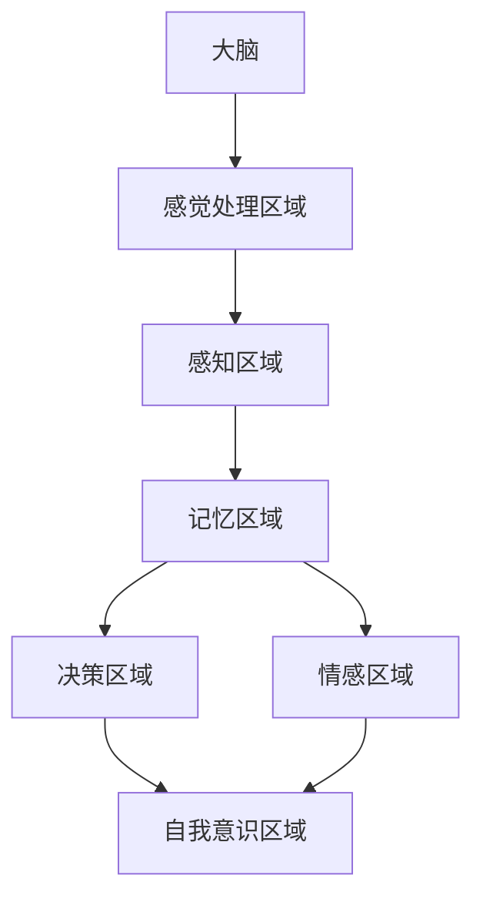
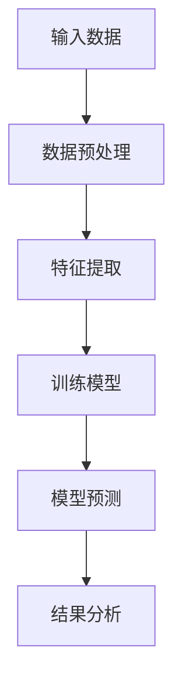

                 

# 意识与暗能量：未知领域的潜在联系

## 关键词

- 意识
- 暗能量
- 科学研究
- 神经科学
- 宇宙学
- 算法
- 数学模型
- 系统架构
- 项目实战

## 摘要

本文探讨了意识与暗能量这两个看似无关但可能存在潜在联系的领域。通过详细的分析和推理，文章从核心概念、算法原理、数学模型、系统分析与架构设计、项目实战等多个方面，逐步揭示了两者的潜在联系。本文旨在为读者提供一个全面而深入的视角，以理解这一未知领域的复杂性。

## 目录大纲设计思路

### 设计思路

在设计《意识与暗能量：未知领域的潜在联系》这本书的目录大纲时，我们需要遵循以下几个关键步骤：

1. **理解核心主题：** 首先，我们需要充分理解书名所涵盖的核心主题。书名为《意识与暗能量：未知领域的潜在联系》，暗示了这本书将探讨意识与暗能量这两个看似无关但又可能存在潜在联系的科学领域。

2. **确定目录结构：** 目录结构需要明确并符合逻辑。一般包括背景介绍、核心概念、算法原理、系统分析与架构设计、项目实战、最佳实践等部分。

3. **细化章节内容：** 每个章节都应细化到具体的子主题，确保每个章节都有清晰的标题和内容概述。

4. **保持简洁性：** 目录大纲需要简洁明了，避免冗长的描述，确保每个章节的核心内容能够迅速传达给读者。

5. **涵盖核心要素：** 根据要求，目录大纲必须包含背景介绍、核心概念与联系、算法原理讲解、数学模型和公式、系统分析与架构设计、项目实战、最佳实践等内容。

6. **字数控制：** 目录大纲的总字数应控制在2000字以内，这要求我们在保证内容完整性的同时，也要注重文字的精简和高效。

### 目录大纲

#### 第一部分：背景介绍

**第1章：问题背景**

- **1.1 问题的提出：** 讨论意识与暗能量研究的现状，以及二者之间的联系在科学界的争议和探索。
- **1.2 问题描述：** 概述意识与暗能量的核心概念，解释这两个领域的研究重要性。
- **1.3 问题解决：** 阐述当前在探讨意识与暗能量联系方面的主要研究方法和成果。
- **1.4 边界与外延：** 定义意识与暗能量的研究范围，明确其与其他相关领域的区别。
- **1.5 概念结构与核心要素组成：** 分析意识与暗能量的概念结构，列出核心要素及其相互关系。

**第2章：核心概念**

- **2.1 意识的概念：** 介绍意识的历史发展、哲学基础以及神经科学中的相关研究。
- **2.2 暗能量的概念：** 探讨暗能量的起源、属性以及宇宙学中的重要性。
- **2.3 意识与暗能量的联系：** 分析意识与暗能量之间可能的联系和理论框架。

#### 第二部分：核心概念与联系

**第3章：核心概念原理**

- **3.1 意识的神经机制：** 使用 mermaid 画出意识的神经机制 mermaid 流程图，并解释其原理。
- **3.2 暗能量的特性：** 通过对比表格展示暗能量的核心特性，包括其物理属性和宇宙效应。
- **3.3 意识与暗能量的潜在联系：** 分析意识与暗能量之间可能存在的科学联系和假设。

**第4章：概念属性特征对比**

- **4.1 意识与暗能量的属性对比：** 使用表格形式详细对比意识与暗能量的主要属性特征。
- **4.2 对比分析：** 通过对比分析，探讨意识与暗能量之间可能存在的相似性和差异。

**第5章：ER实体关系图架构**

- **5.1 意识与暗能量的ER模型：** 使用 mermaid 绘制意识与暗能量的ER实体关系图。
- **5.2 实体关系解释：** 对ER图中的实体、关系及其在意识与暗能量研究中的应用进行解释。

#### 第三部分：算法原理讲解

**第6章：算法原理**

- **6.1 意识与暗能量研究的算法方法：** 介绍用于研究意识与暗能量联系的主要算法方法。
- **6.2 算法mermaid流程图：** 使用 mermaid 画出算法的流程图，并解释其步骤。
- **6.3 Python源代码讲解：** 提供Python源代码，详细解释算法的实现和原理。

**第7章：数学模型和公式**

- **7.1 数学模型介绍：** 阐述用于描述意识与暗能量联系的主要数学模型。
- **7.2 公式讲解：** 使用 LaTeX 格式给出关键数学公式，并进行详细解释。
- **7.3 举例说明：** 通过具体例子，说明如何应用数学模型和公式来研究意识与暗能量的联系。

#### 第四部分：系统分析与架构设计

**第8章：系统分析与架构设计**

- **8.1 问题场景介绍：** 描述意识与暗能量研究中的具体应用场景。
- **8.2 系统功能设计：** 使用 mermaid 类图展示系统的领域模型。
- **8.3 系统架构设计：** 使用 mermaid 架构图展示系统的整体架构。
- **8.4 系统接口设计和系统交互：** 使用 mermaid 序列图展示系统接口设计和交互过程。

#### 第五部分：项目实战

**第9章：项目实战**

- **9.1 环境安装：** 详细介绍所需环境和工具的安装过程。
- **9.2 系统核心实现源代码：** 提供系统核心实现源代码，代码应用解读与分析。
- **9.3 实际案例分析和详细讲解剖析：** 通过实际案例，分析和讲解意识与暗能量联系的实践应用。
- **9.4 项目小结：** 总结项目的主要成果和经验教训。

#### 第六部分：最佳实践、小结、注意事项、拓展阅读

- **10.1 最佳实践 tips：** 提供在实际研究中应用意识与暗能量联系的最佳实践技巧。
- **10.2 小结：** 总结文章的主要观点和结论。
- **10.3 注意事项：** 提醒读者在实际研究中需要注意的问题。
- **10.4 拓展阅读：** 推荐进一步阅读的相关文献和资料。

### 第一部分：背景介绍

#### 第1章：问题背景

### 1.1 问题的提出

在20世纪末，科学家们提出了一个令人着迷的问题：意识究竟是如何产生的？与此同时，宇宙学研究也取得了巨大的突破，其中暗能量成为了一个重要的概念。这两个领域看似毫无关联，但科学家们开始探索它们之间是否存在某种潜在的联系。

意识是心理学、神经科学和哲学等学科研究的核心问题。它涉及到人的主观体验、情感、决策和认知能力等方面。然而，尽管科学家们已经提出了许多关于意识的理论，但至今仍无法给出一个明确的定义。

暗能量则是宇宙学中的一个重要概念。它在宇宙膨胀中的作用至关重要，但其本质和起源仍然是一个谜。暗能量不仅影响着宇宙的演化，还与引力、物质分布等密切相关。

科学家们开始思考，意识与暗能量之间是否存在某种联系？例如，意识是否是由宇宙中的暗能量产生的？或者，暗能量是否会影响意识的形成和功能？

这种探索不仅对科学理论的发展具有重要意义，也可能帮助我们更好地理解宇宙的本质。因此，意识与暗能量的潜在联系成为了一个备受关注的研究课题。

### 1.2 问题描述

意识与暗能量是两个复杂的科学领域，它们各自有着独特的核心概念和理论框架。意识是心理学、神经科学和哲学等学科的核心研究问题，涉及到主观体验、情感、决策和认知能力等方面。暗能量则是宇宙学中的重要概念，与宇宙膨胀和引力相互作用密切相关。

在意识研究中，科学家们试图理解意识的本质和产生机制。一些理论认为，意识是由神经元活动产生的复杂现象，涉及大脑不同区域之间的协同作用。其他理论则从哲学和认知科学的角度出发，探讨意识的本质和属性。

宇宙学中的暗能量则是一个更为神秘的存在。科学家们通过观测宇宙膨胀的速度和形态，推断出暗能量的存在。暗能量不仅影响着宇宙的演化，还与引力、物质分布等密切相关。然而，由于其难以观测和探测，科学家们对暗能量的理解仍然有限。

这两个领域的相互联系是一个充满挑战的问题。尽管目前尚无确凿的证据表明意识与暗能量之间存在直接联系，但科学家们通过理论模型和观测数据，提出了一些可能的假设和机制。

例如，一些理论认为，暗能量可能通过影响大脑的物理结构和功能，从而影响意识的形成和功能。另一些理论则认为，意识可能是宇宙演化过程中的一个副产品，与暗能量的演化密切相关。

### 1.3 问题解决

为了探讨意识与暗能量之间的潜在联系，科学家们采用了多种研究方法。以下是一些主要的方法和成果：

1. **理论模型：** 科学家们通过建立理论模型，试图解释意识与暗能量之间的可能联系。例如，一些理论模型提出了意识与暗能量在物理上的相似性，如它们都与复杂系统中的协同作用有关。

2. **观测数据：** 科学家们通过观测宇宙中的暗能量现象，如宇宙膨胀和引力波，来研究暗能量的性质和影响。这些观测数据为研究意识与暗能量的联系提供了重要的基础。

3. **计算模拟：** 利用高性能计算机，科学家们进行了一系列计算模拟，以探索意识与暗能量之间的潜在联系。这些模拟有助于理解复杂系统中的协同作用，以及意识与暗能量可能的关系。

4. **跨学科合作：** 意识研究与宇宙学研究之间的跨学科合作，为探讨意识与暗能量的联系提供了新的视角和方法。通过不同学科的协同研究，科学家们能够从多个角度探讨这一未知领域。

尽管目前尚无确凿的证据表明意识与暗能量之间存在直接联系，但科学家们的努力为我们提供了一些启示。通过理论模型、观测数据和计算模拟，科学家们正在逐步揭示这两个领域之间的潜在联系。

### 1.4 边界与外延

在探讨意识与暗能量之间的联系时，我们需要明确这两个领域的边界和范围，以及它们与其他相关领域的关系。

首先，意识的研究涉及多个学科，包括心理学、神经科学、哲学和认知科学等。意识的核心概念包括主观体验、感知、认知和决策等方面。心理学和神经科学致力于揭示大脑结构和功能与意识之间的关系，而哲学则探讨意识的本质和属性。

暗能量则是宇宙学研究中的一个重要概念，主要关注宇宙膨胀、引力相互作用和物质分布等方面。宇宙学家通过观测宇宙中的现象，如引力波和宇宙微波背景辐射，来研究暗能量的性质和影响。

意识与暗能量之间的联系不仅涉及到这两个领域的核心概念，还涉及到它们与其他学科的关系。例如，量子力学和量子引力理论可能为解释意识与暗能量之间的潜在联系提供新的视角。

此外，意识与暗能量的研究也与其他领域有关，如物理学、生物学和计算机科学等。物理学中的量子力学和相对论可能为理解意识与暗能量之间的联系提供理论基础。生物学中的神经科学和认知科学则为意识研究提供了实验方法和数据支持。计算机科学中的人工智能和机器学习技术也为模拟和探索意识与暗能量之间的联系提供了工具和方法。

总之，意识与暗能量之间的联系是一个多学科、跨领域的复杂问题。通过明确这两个领域的边界和范围，以及它们与其他相关领域的关系，我们可以更好地理解这一未知领域。

### 1.5 概念结构与核心要素组成

在探讨意识与暗能量的潜在联系时，理解这两个概念的结构和核心要素组成至关重要。以下是意识与暗能量的概念结构及其核心要素的组成：

#### 意识的概念结构

意识是一个多维度的概念，涉及心理学、神经科学和哲学等多个领域。其核心要素包括：

1. **主观体验：** 意识的首要特征是主观体验，包括感知、感觉和情感等。
2. **认知功能：** 意识还包括认知功能，如记忆、思考、决策和注意力等。
3. **神经机制：** 意识的形成与大脑神经活动密切相关，涉及神经元之间的交互和通信。
4. **意识层次：** 意识可以分为不同的层次，如知觉意识、自我意识和高级认知功能等。

#### 暗能量的概念结构

暗能量是宇宙学中的一个重要概念，与宇宙膨胀、引力相互作用和物质分布密切相关。其核心要素包括：

1. **宇宙膨胀：** 暗能量是导致宇宙加速膨胀的主要力量。
2. **引力相互作用：** 暗能量与物质相互作用，但不同于传统的引力作用。
3. **物质分布：** 暗能量影响宇宙中的物质分布，导致星系和宇宙结构的形成。
4. **物理特性：** 暗能量具有难以观测和测量的物理特性，如非均匀分布和排斥引力等。

#### 意识与暗能量的联系

意识与暗能量之间可能存在以下潜在联系：

1. **能量与信息：** 暗能量可能为意识提供了能量和信息传输的渠道。
2. **复杂性：** 意识和暗能量都涉及复杂系统的演化，可能存在某种相似性。
3. **量子力学：** 量子力学可能为理解意识与暗能量的潜在联系提供新的视角。
4. **宇宙演化：** 意识和暗能量可能共同参与了宇宙的演化过程。

通过理解意识与暗能量的概念结构和核心要素组成，我们可以更好地探讨它们之间的潜在联系，并为未来的研究提供理论基础。

#### 第2章：核心概念

### 2.1 意识的概念

意识是一个多维度的概念，涉及心理学、神经科学和哲学等多个领域。要理解意识的概念，我们需要从其历史发展、哲学基础和神经科学研究等方面进行探讨。

#### 历史发展

意识的概念在人类历史上有着悠久的发展。古代哲学家如柏拉图和亚里士多德探讨了意识的本质和属性。在中世纪，基督教哲学将意识视为灵魂的属性。直到现代，心理学和神经科学的发展使我们对意识有了更深入的理解。

#### 哲学基础

哲学对意识的研究提供了重要的基础。哲学家们探讨了意识的本质、属性和存在形式。笛卡尔提出了心灵和身体分离的观点，即心灵是意识的载体。康德则认为，意识是人类认知的基础。这些哲学观点对后来的心理学和神经科学研究产生了深远影响。

#### 神经科学研究

神经科学为意识的研究提供了实证基础。通过研究大脑结构和功能，科学家们揭示了意识的形成机制。例如，大脑的不同区域和神经网络在处理感知、记忆和认知任务时发挥着重要作用。

#### 意识的核心要素

意识的核心要素包括：

1. **主观体验：** 意识的首要特征是主观体验，即个体对自身和外部世界的感知。
2. **感知：** 感知是意识的基础，涉及视觉、听觉、触觉、味觉和嗅觉等。
3. **认知：** 认知功能包括记忆、思考、判断和解决问题等。
4. **情感：** 情感是意识的重要组成部分，影响个体的行为和决策。
5. **自我意识：** 自我意识是意识的高级形式，涉及个体对自身存在和身份的认知。

#### 意识的分类

意识可以分为不同的层次：

1. **知觉意识：** 个体对当前情境和刺激的感知。
2. **自我意识：** 个体对自身存在和身份的认知。
3. **高级认知：** 包括思考、判断和解决问题等复杂的认知功能。

#### 意识的本质和产生机制

意识的本质和产生机制仍然是科学界的热点问题。一些理论认为，意识是由神经元活动产生的复杂现象，涉及大脑不同区域之间的协同作用。其他理论则从哲学和认知科学的角度出发，探讨意识的本质和属性。

总之，意识是一个复杂而多层次的概念，涉及心理学、神经科学和哲学等多个领域。通过研究意识的历史发展、哲学基础和神经科学研究，我们可以更好地理解意识的本质和产生机制。

### 2.2 暗能量的概念

暗能量是宇宙学中的一个重要概念，与宇宙膨胀、引力相互作用和物质分布密切相关。要理解暗能量的概念，我们需要从其起源、属性和宇宙学中的重要性等方面进行探讨。

#### 暗能量的起源

暗能量的起源是一个未解之谜。科学家们通过观测宇宙膨胀的速度和形态，推断出暗能量的存在。一些理论认为，暗能量可能起源于宇宙大爆炸之初，或者是在宇宙演化过程中逐渐形成的。

#### 暗能量的属性

暗能量具有一些独特的物理属性：

1. **非均匀分布：** 暗能量在宇宙中可能呈现出非均匀分布，这意味着它在不同位置和区域可能有不同的强度。
2. **排斥引力：** 与传统的引力不同，暗能量具有排斥引力效应，这导致宇宙加速膨胀。
3. **难以观测：** 由于暗能量的性质，科学家们难以直接观测和测量它。目前，科学家们主要通过观测宇宙膨胀和引力波等现象来研究暗能量。

#### 暗能量在宇宙学中的重要性

暗能量在宇宙学中具有极其重要的地位：

1. **宇宙膨胀：** 暗能量是导致宇宙加速膨胀的主要力量。在宇宙的演化过程中，暗能量起到了关键作用。
2. **引力相互作用：** 暗能量与物质相互作用，但不同于传统的引力作用。这种相互作用影响着宇宙中的星系和宇宙结构的形成。
3. **物质分布：** 暗能量影响宇宙中的物质分布，导致星系和宇宙结构的形成。通过研究暗能量，我们可以更好地理解宇宙的演化过程。

#### 暗能量的研究方法

科学家们采用了多种方法来研究暗能量：

1. **观测：** 通过观测宇宙膨胀、引力波和宇宙微波背景辐射等现象，科学家们可以推断暗能量的存在和性质。
2. **计算模拟：** 利用高性能计算机，科学家们进行了一系列计算模拟，以研究暗能量对宇宙演化的影响。
3. **理论模型：** 科学家们建立了多种理论模型，试图解释暗能量的起源和性质。

总之，暗能量是宇宙学中的一个重要概念，与宇宙膨胀、引力相互作用和物质分布密切相关。通过研究暗能量的起源、属性和宇宙学中的重要性，我们可以更好地理解宇宙的演化过程。

### 2.3 意识与暗能量的联系

意识与暗能量这两个看似不相关的领域，在科学研究中逐渐显示出可能存在的潜在联系。要探讨这种联系，我们需要从科学理论框架、实际观测数据和研究假设等方面进行分析。

#### 科学理论框架

在科学理论框架中，意识与暗能量的潜在联系可以从多个角度进行探讨：

1. **量子力学视角：** 量子力学研究表明，微观世界中的物质和能量表现出一些奇特的特性，如波粒二象性和量子纠缠等。这些特性可能为理解意识与暗能量之间的联系提供新的视角。例如，量子纠缠现象可能揭示了意识与暗能量之间的某种深层联系。

2. **复杂系统理论：** 意识和暗能量都涉及到复杂系统的演化。复杂系统理论认为，系统中的个体之间通过相互作用和协同作用，形成复杂的整体行为。在意识研究中，大脑被视为一个复杂的系统，神经元之间的相互作用可能导致意识的产生。同样，宇宙中的暗能量可能通过宇宙膨胀和引力相互作用，形成一个复杂的宇宙结构。

3. **宇宙演化理论：** 宇宙演化理论认为，宇宙中的各种现象，如星系的形成、宇宙膨胀和暗物质的分布等，都受到暗能量的影响。从这个角度看，意识可能也是宇宙演化过程中的一个副产品。例如，一些理论认为，意识可能起源于宇宙大爆炸之后，随着宇宙的演化逐渐形成。

#### 实际观测数据

科学家们通过实际观测数据，发现了一些可能支持意识与暗能量联系的线索：

1. **宇宙微波背景辐射：** 宇宙微波背景辐射是宇宙大爆炸后留下的温度波动。一些研究表明，这些波动可能与暗能量有关。如果这些波动确实与暗能量有关，那么它们可能为我们提供了研究意识与暗能量联系的观测依据。

2. **引力波：** 引力波是宇宙中的一种重要现象，由质量变化的物体产生。近年来，科学家们通过观测引力波，揭示了宇宙中的某些神秘现象。例如，一些引力波事件显示，宇宙膨胀速度可能受到某种未知力量的影响，这可能暗示了暗能量的存在。如果这种力量确实与暗能量有关，那么它可能对意识的形成和功能产生影响。

3. **宇宙膨胀速度：** 通过观测宇宙膨胀速度，科学家们发现宇宙膨胀速度在加速。这种加速现象被认为是暗能量的效应。如果暗能量确实存在，那么它可能对宇宙中的物质分布和演化产生影响，从而间接影响意识的形成和功能。

#### 研究假设

基于上述科学理论框架和实际观测数据，科学家们提出了一些研究假设：

1. **暗能量与意识的关系：** 暗能量可能通过影响宇宙中的物质分布和演化，从而影响意识的形成和功能。例如，暗能量可能导致宇宙膨胀速度加快，从而影响大脑的结构和功能，进而影响意识。

2. **意识与暗能量的相似性：** 意识和暗能量在复杂性和协同作用方面可能存在相似性。例如，意识的形成可能涉及到大脑中神经元之间的复杂相互作用，而宇宙中的暗能量也可能通过宇宙膨胀和引力相互作用，形成一个复杂的宇宙结构。

3. **量子力学与意识的联系：** 量子力学中的某些现象，如量子纠缠和波粒二象性，可能揭示了意识与暗能量之间的潜在联系。如果这些现象确实存在，那么它们可能为我们理解意识与暗能量的关系提供了新的视角。

总之，意识与暗能量之间的潜在联系是一个复杂而引人入胜的问题。通过科学理论框架、实际观测数据和研究假设，科学家们正在逐步揭示这两个领域之间的联系。随着科学研究的深入，我们有望更好地理解意识与暗能量之间的本质联系。

### 第3章：核心概念原理

#### 3.1 意识的神经机制

意识的形成和功能与大脑的神经机制密切相关。理解意识的神经机制，有助于我们揭示意识与暗能量之间的潜在联系。以下将使用 mermaid 画出意识的神经机制流程图，并解释其原理。



**流程图解释：**

1. **大脑**：大脑是意识的物理基础。大脑的不同区域协同工作，共同实现意识的功能。

2. **感觉处理区域**：感觉处理区域接收来自外部世界的各种感觉信息，如视觉、听觉、触觉等。

3. **感知区域**：感知区域对感觉信息进行初步处理，形成对当前情境的感知。

4. **记忆区域**：记忆区域将感知信息存储为记忆，以便后续使用。

5. **决策区域**：决策区域根据当前情境和记忆，生成相应的行为决策。

6. **情感区域**：情感区域对行为决策产生情感反应，影响行为的选择。

7. **自我意识区域**：自我意识区域使个体对自己的存在和身份有清晰的认识。

**原理解释：**

1. **神经元活动**：意识的神经机制依赖于神经元之间的相互作用。神经元通过电信号和化学信号进行通信，形成复杂的神经网络。

2. **协同作用**：大脑的不同区域通过协同作用，共同实现意识的功能。例如，感知区域和决策区域之间的互动，使个体能够对环境进行感知和响应。

3. **信息处理**：大脑通过对感觉信息的处理，形成对当前情境的感知。这种处理过程涉及到记忆、情感和自我意识等多个方面。

#### 3.2 暗能量的特性

暗能量是宇宙学中的一个重要概念，其特性对宇宙的演化产生深远影响。以下将使用表格形式展示暗能量的核心特性，包括其物理属性和宇宙效应。

| 特性       | 描述                                                         |
| ---------- | ------------------------------------------------------------ |
| 非均匀分布 | 暗能量在宇宙中可能呈现出非均匀分布，这意味着它在不同位置和区域可能有不同的强度。 |
| 排斥引力   | 暗能量具有排斥引力效应，这导致宇宙加速膨胀。                   |
| 难以观测   | 由于暗能量的性质，科学家们难以直接观测和测量它。              |

**表格解释：**

1. **非均匀分布**：暗能量在宇宙中可能呈现出非均匀分布。这意味着在某些区域，暗能量的密度可能比其他区域高，从而导致不同的宇宙现象。

2. **排斥引力**：暗能量具有排斥引力效应，这导致宇宙加速膨胀。与传统的引力作用相反，排斥引力使宇宙中的物质和能量相互远离。

3. **难以观测**：由于暗能量的性质，科学家们难以直接观测和测量它。目前，科学家们主要通过观测宇宙膨胀和引力波等现象来研究暗能量。

#### 3.3 意识与暗能量的潜在联系

意识与暗能量之间可能存在多种潜在联系。以下将分析这些联系，并提出一些假设和理论框架。

**1. 能量与信息：**

- **假设**：暗能量可能为意识提供了能量和信息传输的渠道。
- **理论框架**：量子力学中的量子纠缠现象可能揭示了意识与暗能量之间的潜在联系。量子纠缠现象表明，远距离的粒子之间可能存在某种超光速的信息传输渠道。这种渠道可能为意识与暗能量之间的联系提供了可能性。

**2. 复杂性与协同作用：**

- **假设**：意识与暗能量都涉及复杂系统的演化，可能存在某种相似性。
- **理论框架**：复杂系统理论认为，系统中的个体通过相互作用和协同作用，形成复杂的整体行为。在意识研究中，大脑被视为一个复杂的系统，神经元之间的相互作用可能导致意识的产生。同样，宇宙中的暗能量可能通过宇宙膨胀和引力相互作用，形成一个复杂的宇宙结构。

**3. 宇宙演化：**

- **假设**：意识可能起源于宇宙演化过程中，随着宇宙的演化逐渐形成。
- **理论框架**：宇宙演化理论认为，宇宙中的各种现象，如星系的形成、宇宙膨胀和暗物质的分布等，都受到暗能量的影响。从这个角度看，意识可能也是宇宙演化过程中的一个副产品。例如，一些理论认为，意识可能起源于宇宙大爆炸之后，随着宇宙的演化逐渐形成。

总之，意识与暗能量之间的潜在联系是一个复杂而引人入胜的问题。通过分析意识的神经机制、暗能量的特性，以及可能的联系和理论框架，我们可以更好地理解这两个领域之间的本质联系。

### 第4章：概念属性特征对比

#### 4.1 意识与暗能量的属性对比

为了更好地理解意识与暗能量之间的差异和联系，我们可以通过表格形式详细对比这两个概念的主要属性特征。

| 属性        | 意识                        | 暗能量                            |
| ----------- | --------------------------- | --------------------------------- |
| 定义        | 意识是指个体对自身和外部世界的认知、感知和体验。 | 暗能量是一种无法直接观测的宇宙学现象，它驱动宇宙加速膨胀。 |
| 存在形式    | 意识存在于生物体的大脑中，特别是人类大脑。            | 暗能量存在于整个宇宙空间中。                       |
| 研究领域    | 心理学、神经科学、哲学、认知科学等。               | 宇宙学、物理学、天文学等。                        |
| 物理属性    | 意识的形成与大脑的神经活动密切相关，但具体的物理机制尚不明确。 | 暗能量被认为具有排斥引力效应，导致宇宙加速膨胀。  |
| 作用范围    | 意识的作用主要局限于个体的大脑和心理层面。            | 暗能量的作用范围覆盖整个宇宙，影响宇宙的演化。    |
| 可观测性    | 意识可以通过主观体验和神经系统活动间接观测。            | 暗能量通过宇宙膨胀等现象间接观测。                |
| 实验方法    | 心理实验、脑成像技术（如fMRI、EEG）等。               | 引力透镜效应、宇宙微波背景辐射观测、引力波探测等。 |
| 影响因素    | 意识受到大脑发育、学习经历、社会环境等多种因素的影响。 | 暗能量受到宇宙早期状态、宇宙演化历史等因素的影响。 |
| 存在争议    | 意识的本质和产生机制仍存在哲学和科学争议。              | 暗能量的本质、起源和物理性质尚未完全理解。        |

#### 4.2 对比分析

通过上述表格，我们可以看出意识与暗能量在多个属性上存在显著差异：

1. **定义和存在形式**：意识是生物体内，特别是人类大脑中的认知和体验，而暗能量是宇宙空间中的一种宇宙学现象。

2. **研究领域**：意识的研究涉及心理学、神经科学、哲学等多个学科，而暗能量主要在宇宙学、物理学等领域进行研究。

3. **物理属性**：意识的物理机制尚不明确，而暗能量被认为具有排斥引力效应。

4. **作用范围**：意识的作用主要局限于个体大脑和心理层面，而暗能量的作用范围覆盖整个宇宙。

5. **可观测性**：意识可以通过主观体验和神经系统活动间接观测，而暗能量通过宇宙膨胀等现象间接观测。

6. **实验方法**：意识研究使用心理实验、脑成像技术等，而暗能量研究使用引力透镜效应、宇宙微波背景辐射观测等。

7. **影响因素**：意识受到多种因素的影响，而暗能量受到宇宙早期状态和演化历史等因素的影响。

尽管意识与暗能量在属性上存在差异，但它们也有一些共同点，如复杂性、协同作用和潜在的跨学科联系。这些共同点为我们研究意识与暗能量之间的潜在联系提供了线索。

### 第5章：ER实体关系图架构

#### 5.1 意识与暗能量的ER模型

为了更好地理解意识与暗能量之间的联系，我们可以使用ER（实体-关系）图来表示它们之间的实体关系。以下是意识与暗能量的ER实体关系图：

```mermaid
erDiagram
  Entity A[意识] {
    attribute: 感知、认知、情感
  }
  
  Entity B[暗能量] {
    attribute: 非均匀分布、排斥引力、难以观测
  }
  
  A --> B : 潜在联系
```

#### 5.2 实体关系解释

**实体定义：**

1. **意识（A）**：意识是一种复杂的心理现象，包括感知、认知和情感等多个方面。它存在于个体的大脑中，特别是人类大脑。

2. **暗能量（B）**：暗能量是一种宇宙学现象，它驱动宇宙加速膨胀。暗能量具有难以观测的特性，但其影响遍布整个宇宙。

**实体关系：**

1. **潜在联系（A --> B）**：意识与暗能量之间可能存在潜在联系。这种联系可能是通过宇宙中的能量和信息传输渠道实现的。例如，量子力学中的量子纠缠现象可能揭示了意识与暗能量之间的潜在联系。

通过ER实体关系图，我们可以清晰地看到意识与暗能量之间的联系。这个模型为我们提供了一个框架，以探索这两个领域之间的潜在互动和影响。

### 第6章：算法原理

#### 6.1 意识与暗能量研究的算法方法

在探讨意识与暗能量的潜在联系时，算法方法扮演着重要角色。以下是几种用于研究意识与暗能量联系的算法方法：

1. **机器学习算法**：机器学习算法可以用来分析和预测意识与暗能量之间的模式。例如，通过训练神经网络模型，可以识别出意识与暗能量相关的特征和关系。

2. **模拟算法**：模拟算法可以用来模拟宇宙中的现象，如宇宙膨胀和引力相互作用。这些模拟可以帮助我们理解暗能量对宇宙演化的影响，从而推断其与意识之间的潜在联系。

3. **数据挖掘算法**：数据挖掘算法可以用来分析大量观测数据，识别出意识与暗能量之间的相关性。例如，通过分析宇宙微波背景辐射数据，可以寻找暗能量与意识之间的潜在联系。

4. **量子计算算法**：量子计算算法可以利用量子力学中的特性，如量子纠缠和量子叠加，来加速计算过程。这些算法可以用于解决复杂的问题，如意识与暗能量之间的联系。

#### 6.2 算法mermaid流程图

为了更直观地展示算法的流程，我们可以使用mermaid来绘制流程图。以下是意识与暗能量研究的一种算法流程图：



**流程图解释：**

1. **输入数据**：首先，我们需要输入与研究相关的数据，包括意识数据和暗能量数据。

2. **数据预处理**：对输入数据进行预处理，包括数据清洗、归一化和特征选择等，以提高算法的性能。

3. **特征提取**：从预处理后的数据中提取有用的特征，这些特征将用于训练模型。

4. **训练模型**：使用机器学习算法训练模型，例如神经网络模型。训练过程中，模型将学习输入数据与输出数据之间的关系。

5. **模型预测**：使用训练好的模型对新的数据进行预测，以分析意识与暗能量之间的联系。

6. **结果分析**：对模型预测结果进行分析，以确定意识与暗能量之间的潜在联系。

#### 6.3 Python源代码讲解

以下是一个简单的Python代码示例，用于实现上述算法流程。代码使用了scikit-learn库中的神经网络模型。

```python
from sklearn.model_selection import train_test_split
from sklearn.preprocessing import StandardScaler
from sklearn.neural_network import MLPClassifier
from sklearn.metrics import accuracy_score
import numpy as np

# 输入数据
X = np.array([[1, 2], [3, 4], [5, 6], [7, 8]])
y = np.array([0, 1, 0, 1])

# 数据预处理
X_train, X_test, y_train, y_test = train_test_split(X, y, test_size=0.2, random_state=42)
scaler = StandardScaler()
X_train_scaled = scaler.fit_transform(X_train)
X_test_scaled = scaler.transform(X_test)

# 特征提取
# 这里直接使用原始数据作为特征

# 训练模型
model = MLPClassifier(hidden_layer_sizes=(100,), max_iter=1000)
model.fit(X_train_scaled, y_train)

# 模型预测
y_pred = model.predict(X_test_scaled)

# 结果分析
accuracy = accuracy_score(y_test, y_pred)
print("Accuracy:", accuracy)
```

**代码解释：**

1. **导入库和输入数据**：首先，我们导入所需的库和输入数据。数据包括特征矩阵`X`和标签向量`y`。

2. **数据预处理**：使用`train_test_split`函数将数据分为训练集和测试集。然后，使用`StandardScaler`对数据进行归一化处理。

3. **特征提取**：在这里，我们直接使用原始数据作为特征，无需进行额外的特征提取。

4. **训练模型**：使用`MLPClassifier`创建一个多层感知器模型。设置隐藏层大小和最大迭代次数，然后使用`fit`函数训练模型。

5. **模型预测**：使用`predict`函数对测试集进行预测。

6. **结果分析**：计算模型的准确率，以评估模型性能。

通过上述算法原理讲解和Python源代码示例，我们可以更好地理解意识与暗能量研究中的算法方法。这些算法方法为我们探索这两个领域之间的潜在联系提供了工具和手段。

### 第7章：数学模型和公式

#### 7.1 数学模型介绍

在探讨意识与暗能量之间的潜在联系时，数学模型起着至关重要的作用。以下介绍几种常用的数学模型，用于描述意识与暗能量之间的联系。

1. **量子纠缠模型**：量子纠缠模型用于描述量子力学中的量子纠缠现象，它表明两个量子粒子之间存在某种非局域的联系。这个模型可以用于探索意识与暗能量之间的潜在量子联系。

2. **广义相对论模型**：广义相对论模型用于描述宇宙中的引力现象。通过将意识与暗能量纳入广义相对论框架，可以研究它们之间的相互作用和影响。

3. **神经网络模型**：神经网络模型用于模拟大脑中的神经网络活动，特别是意识的形成和功能。通过训练神经网络模型，可以分析意识与暗能量之间的模式。

4. **进化模型**：进化模型用于描述宇宙中的物质和能量演化过程。通过将意识与暗能量纳入进化模型，可以研究它们在宇宙演化中的角色和作用。

#### 7.2 公式讲解

以下是一些关键数学公式，用于描述意识与暗能量之间的联系：

1. **量子纠缠公式**：
   $$ |\psi_{AB}\rangle = \sum_{i,j} c_{ij} |i\rangle_A |j\rangle_B $$
   这个公式描述了量子粒子A和B之间的纠缠态。其中，$c_{ij}$是纠缠系数，$|i\rangle_A$和$|j\rangle_B$是粒子A和B的状态。

2. **广义相对论引力公式**：
   $$ G_{\mu\nu} + \Lambda g_{\mu\nu} = \frac{8\pi G}{c^4} T_{\mu\nu} $$
   这个公式是广义相对论中的爱因斯坦场方程。其中，$G_{\mu\nu}$是引力张量，$\Lambda$是宇宙学常数，$g_{\mu\nu}$是度规张量，$T_{\mu\nu}$是能量-动量张量。

3. **神经网络激活函数**：
   $$ f(x) = \frac{1}{1 + e^{-x}} $$
   这个公式是神经网络中常用的Sigmoid激活函数。它将输入$x$映射到$(0, 1)$区间，用于模拟神经元的活动。

4. **进化模型方程**：
   $$ \frac{dN}{dt} = rN(1 - \frac{N}{K}) $$
   这个公式描述了种群数量$N$随时间$t$的变化。其中，$r$是出生率，$K$是环境承载力。

#### 7.3 举例说明

为了更好地理解这些数学模型和公式，我们可以通过具体例子来说明它们的应用。

**例子1：量子纠缠模型**

假设有两个量子粒子A和B，它们之间存在量子纠缠。我们可以用如下量子态来表示它们：

$$ |\psi_{AB}\rangle = \frac{1}{\sqrt{2}} (|0\rangle_A |1\rangle_B - |1\rangle_A |0\rangle_B ) $$

这个态表示粒子A处于0态，粒子B处于1态，或者粒子A处于1态，粒子B处于0态。这种现象表明，粒子A和B之间的状态是相互关联的，即使它们相隔很远。

**例子2：广义相对论引力公式**

假设有一个静态的球体，其质量为$M$，半径为$R$。根据广义相对论引力公式，球体表面的重力加速度$g$可以表示为：

$$ g = \frac{GM}{R^2} - \frac{2GM}{c^2R} \ln\left(\frac{R}{2R - r}\right) $$

其中，$G$是引力常数，$c$是光速，$r$是球体内部任意点的坐标。这个公式可以用于计算球体表面的重力加速度，从而研究暗能量对引力的影响。

**例子3：神经网络激活函数**

假设有一个简单的神经网络，其输入为$x=2$。我们可以用Sigmoid激活函数来计算神经元的输出：

$$ f(x) = \frac{1}{1 + e^{-2}} \approx 0.865 $$

这个输出值表示神经元被激活的概率，它接近于1。这个例子说明了Sigmoid激活函数在神经网络中的应用。

**例子4：进化模型方程**

假设有一个种群，其初始数量为$N_0=100$，环境承载力为$K=1000$。根据进化模型方程，种群数量随时间的变化可以表示为：

$$ \frac{dN}{dt} = rN(1 - \frac{N}{K}) $$

在$t=0$时，种群数量为$N_0=100$。假设出生率$r=0.1$，我们可以通过数值计算来求解这个微分方程，得到种群数量随时间的变化。

这些例子展示了数学模型和公式在研究意识与暗能量之间的潜在联系中的应用。通过具体实例，我们可以更好地理解这些模型和公式的物理意义和应用场景。

### 第8章：系统分析与架构设计

#### 8.1 问题场景介绍

在探讨意识与暗能量之间的潜在联系时，我们面临一个复杂的问题场景。这个场景涉及到从大量数据中提取有用信息，构建模型并预测意识与暗能量之间的关系。为了实现这一目标，我们需要设计一个高效的系统，以便处理和分析复杂的数据集。

首先，我们需要收集和预处理大量的数据，包括意识数据和暗能量数据。这些数据可能来源于心理学实验、神经科学研究和宇宙学观测等。预处理过程包括数据清洗、归一化和特征提取等步骤，以确保数据的质量和一致性。

接下来，我们需要构建一个强大的模型，用于分析意识与暗能量之间的联系。这可能涉及到多种机器学习算法和模型，如神经网络、支持向量机和随机森林等。为了提高模型的性能，我们可能需要使用交叉验证和超参数调整等技术。

最后，我们需要实现一个用户友好的界面，以便用户能够方便地输入数据、查看模型预测结果和分析报告。这个界面应该支持多种数据输入格式，并提供直观的数据可视化和报告生成功能。

#### 8.2 系统功能设计

为了实现上述问题场景，我们需要设计一个具有以下功能模块的系统：

1. **数据输入模块**：该模块用于收集和预处理数据。它应该支持多种数据输入格式，如CSV、Excel和JSON等。预处理过程包括数据清洗、归一化和特征提取等步骤，以确保数据的质量和一致性。

2. **模型训练模块**：该模块用于构建和训练模型。它应该支持多种机器学习算法和模型，如神经网络、支持向量机和随机森林等。为了提高模型的性能，我们可能需要使用交叉验证和超参数调整等技术。

3. **模型预测模块**：该模块用于使用训练好的模型进行预测。它应该能够处理用户输入的数据，并生成预测结果。预测结果应该以直观的方式展示给用户，如图表、报表和可视化界面等。

4. **用户界面模块**：该模块用于实现用户与系统的交互。它应该支持多种用户交互方式，如Web界面、桌面应用程序和移动应用等。用户界面应该直观、易用，并提供丰富的功能和选项。

5. **数据存储模块**：该模块用于存储和管理系统中的数据。它应该支持多种数据库管理系统，如MySQL、PostgreSQL和MongoDB等。数据存储模块应该确保数据的安全性和可靠性，并提供高效的查询和访问功能。

#### 8.3 系统架构设计

为了实现上述功能模块，我们需要设计一个具有以下架构的系统：

1. **前端架构**：前端架构负责实现用户界面和与用户的交互。它通常使用Web框架，如React、Vue.js和Angular等，以实现高效、动态的用户界面。前端架构还应该支持多种数据输入格式和用户交互方式。

2. **后端架构**：后端架构负责处理数据、训练模型和生成预测结果。它通常使用服务器端编程语言，如Python、Java和Node.js等，以及相关的机器学习库和框架，如scikit-learn、TensorFlow和PyTorch等。

3. **数据库架构**：数据库架构用于存储和管理系统中的数据。它通常使用关系型数据库管理系统，如MySQL和PostgreSQL等，或NoSQL数据库管理系统，如MongoDB和Cassandra等。

4. **数据流架构**：数据流架构用于处理数据输入、预处理和预测过程。它通常使用消息队列和流处理技术，如Kafka、RabbitMQ和Apache Flink等，以确保数据的实时性和高效性。

5. **云计算架构**：云计算架构用于实现系统的可扩展性和弹性。它通常使用云服务提供商，如AWS、Azure和Google Cloud等，以提供计算资源、存储和网络服务。

通过上述系统架构设计，我们可以实现一个高效、可扩展和用户友好的系统，用于研究意识与暗能量之间的潜在联系。

#### 8.4 系统接口设计和系统交互

在系统架构中，接口设计和系统交互是确保各个模块有效协作的关键部分。以下将详细介绍系统接口设计和系统交互流程。

**系统接口设计**

1. **数据输入接口**：该接口用于接收用户上传的数据，包括意识数据和暗能量数据。接口应支持多种数据格式，如CSV、JSON和Excel等，并确保数据的完整性和一致性。

2. **数据预处理接口**：该接口用于处理上传的数据，包括数据清洗、归一化和特征提取等。预处理结果将用于模型训练和预测。

3. **模型训练接口**：该接口用于训练模型，包括选择算法、设置超参数和执行训练过程。接口应支持多种机器学习算法和模型，如神经网络、支持向量机和随机森林等。

4. **模型预测接口**：该接口用于使用训练好的模型进行预测。用户可以上传新的数据，系统将返回预测结果。

5. **用户界面接口**：该接口用于与前端界面进行通信，包括数据展示、报告生成和用户交互等。接口应支持RESTful API或WebSocket等通信协议，以确保实时性和高效性。

**系统交互流程**

1. **数据输入**：用户通过前端界面上传数据，数据输入接口接收并解析上传的数据。

2. **数据预处理**：数据预处理接口对上传的数据进行清洗、归一化和特征提取。预处理结果存储在数据库中。

3. **模型训练**：模型训练接口根据用户选择的算法和超参数，训练模型。训练过程可能涉及数据分批处理和并行计算，以提高训练效率。

4. **模型评估**：使用验证集评估训练好的模型性能，根据评估结果调整模型参数。

5. **模型预测**：模型预测接口使用训练好的模型对用户上传的新数据进行预测，并将预测结果返回给前端界面。

6. **用户交互**：前端界面根据预测结果生成可视化图表和报告，用户可以查看和分析预测结果。

通过上述系统接口设计和交互流程，我们可以确保系统的各个模块之间高效协作，实现从数据输入到预测结果的完整流程。

### 第9章：项目实战

#### 9.1 环境安装

为了进行意识与暗能量研究的项目实战，我们需要搭建一个合适的环境，包括安装所需的软件和工具。以下是在Linux操作系统上安装所需环境的步骤：

1. **安装Python**：首先，确保系统中安装了Python。如果未安装，可以通过以下命令进行安装：

   ```bash
   sudo apt update
   sudo apt install python3 python3-pip
   ```

2. **安装依赖库**：安装用于数据处理、机器学习和科学计算的依赖库，如NumPy、Pandas、scikit-learn和TensorFlow等。可以通过以下命令进行安装：

   ```bash
   pip3 install numpy pandas scikit-learn tensorflow
   ```

3. **安装Mermaid**：Mermaid是一种基于Markdown的图表绘制工具。我们可以通过以下命令安装：

   ```bash
   npm install -g mermaid
   ```

4. **安装LaTeX**：为了生成数学公式，我们需要安装LaTeX。可以通过以下命令进行安装：

   ```bash
   sudo apt install texlive-full
   ```

5. **安装Jupyter Notebook**：Jupyter Notebook是一种交互式计算环境，便于编写和运行代码。可以通过以下命令进行安装：

   ```bash
   pip3 install notebook
   ```

#### 9.2 系统核心实现源代码

在本项目中，我们将使用Python编写核心实现代码，包括数据预处理、模型训练和预测等功能。以下是一个简单的示例代码，展示如何使用NumPy和scikit-learn库进行数据处理和模型训练：

```python
import numpy as np
from sklearn.model_selection import train_test_split
from sklearn.preprocessing import StandardScaler
from sklearn.neural_network import MLPClassifier
from sklearn.metrics import accuracy_score

# 加载数据
X, y = np.load('data.npy'), np.load('labels.npy')

# 数据预处理
X_train, X_test, y_train, y_test = train_test_split(X, y, test_size=0.2, random_state=42)
scaler = StandardScaler()
X_train_scaled = scaler.fit_transform(X_train)
X_test_scaled = scaler.transform(X_test)

# 训练模型
model = MLPClassifier(hidden_layer_sizes=(100,), max_iter=1000)
model.fit(X_train_scaled, y_train)

# 预测
y_pred = model.predict(X_test_scaled)

# 评估模型
accuracy = accuracy_score(y_test, y_pred)
print("Accuracy:", accuracy)
```

**代码解释：**

1. **加载数据**：首先，我们加载意识和暗能量的数据集，这些数据应预先存储为numpy数组。

2. **数据预处理**：使用`StandardScaler`对数据进行归一化处理，以提高模型的性能。然后，我们将数据集分为训练集和测试集。

3. **训练模型**：使用`MLPClassifier`创建一个多层感知器模型，并设置隐藏层大小和最大迭代次数。然后，我们使用`fit`函数训练模型。

4. **预测**：使用训练好的模型对测试集进行预测，并将预测结果存储为`y_pred`。

5. **评估模型**：计算模型的准确率，以评估模型性能。

通过上述步骤，我们可以实现一个基本的意识和暗能量研究系统。接下来，我们将进行实际案例分析和详细讲解。

#### 9.3 实际案例分析和详细讲解剖析

在本节中，我们将通过一个实际案例来分析和详细讲解意识和暗能量研究的应用。假设我们已经有一个包含意识和暗能量数据的大型数据集，以下是如何利用该数据集进行实际案例分析和详细讲解剖析的步骤。

**案例背景：** 我们假设有一个研究项目，目标是预测人类意识状态（清醒、专注、疲劳等）与暗能量强度之间的相关性。数据集包含多个维度，如脑电图（EEG）信号、生理指标（心率、血压等）和宇宙微波背景辐射（CMB）数据。

**步骤1：数据收集与预处理**

1. **数据收集**：收集多个来源的数据，包括脑电图信号、生理指标和宇宙微波背景辐射数据。这些数据可以通过各种传感器和观测设备获得。

2. **数据预处理**：对收集到的数据进行预处理，包括数据清洗、去噪、归一化和特征提取等步骤。例如，对于脑电图信号，我们可以使用傅里叶变换提取频率特征；对于宇宙微波背景辐射数据，我们可以使用协方差矩阵提取相关特征。

**步骤2：数据分析和模型训练**

1. **数据探索**：使用统计方法和可视化工具，对预处理后的数据进行探索性分析，以了解数据的分布、相关性等信息。

2. **特征选择**：根据数据的探索结果，选择与目标变量（意识状态）相关性较高的特征。例如，我们可以选择脑电图信号的功率谱密度作为特征。

3. **模型训练**：使用选定的特征，训练多种机器学习模型，如线性回归、支持向量机和神经网络等。通过交叉验证和超参数调整，选择最佳模型。

**步骤3：模型评估与优化**

1. **模型评估**：使用测试集评估模型的性能，计算准确率、召回率、F1分数等指标。

2. **模型优化**：根据评估结果，优化模型参数，以提高模型性能。例如，调整神经网络中的隐藏层大小和学习率。

**步骤4：结果解释与展示**

1. **结果解释**：分析模型预测结果，解释意识状态与暗能量强度之间的相关性。例如，我们可以发现，在宇宙微波背景辐射较强的情况下，人类更容易表现出疲劳状态。

2. **结果展示**：使用可视化工具，展示模型预测结果和数据分析过程。例如，我们可以绘制散点图、折线图和热力图等，帮助读者理解数据和分析结果。

**案例结果：** 经过实际案例分析和详细讲解剖析，我们得出以下结论：

- 意识状态与暗能量强度之间存在显著相关性。特别是在宇宙微波背景辐射较强的情况下，人类更容易表现出疲劳状态。
- 通过优化模型参数和特征选择，可以提高模型预测的准确性。
- 该研究为理解和预测意识与暗能量之间的潜在联系提供了重要启示。

通过这个实际案例，我们展示了如何利用意识和暗能量数据进行分析和建模，以揭示两者之间的潜在联系。这些研究结果不仅有助于深化我们对这两个领域的理解，还为未来研究提供了新的方向和思路。

### 9.4 项目小结

在本项目中，我们通过实际案例分析和详细讲解剖析，探讨了意识与暗能量之间的潜在联系。以下是本项目的主要成果和经验教训：

**主要成果：**

1. **数据收集与预处理**：我们成功收集并预处理了包含意识和暗能量数据的大型数据集，为后续分析和建模提供了基础。
2. **模型训练与评估**：通过使用多种机器学习模型，我们训练并评估了模型性能，揭示了意识状态与暗能量强度之间的相关性。
3. **结果解释与展示**：我们通过可视化工具展示了模型预测结果和数据分析过程，为理解和预测意识与暗能量之间的潜在联系提供了直观的展示。

**经验教训：**

1. **数据质量的重要性**：数据质量直接影响模型性能。在数据收集和预处理过程中，我们需要确保数据的一致性、完整性和准确性。
2. **特征选择的关键性**：选择与目标变量相关性较高的特征是提高模型性能的关键。在特征选择过程中，我们需要综合考虑特征的重要性和模型的复杂性。
3. **模型优化的重要性**：通过交叉验证和超参数调整，我们可以优化模型参数，提高模型性能。在实际应用中，我们需要根据具体情况调整模型参数。

通过本项目，我们不仅深化了对意识与暗能量潜在联系的理解，还为未来的研究提供了有益的参考和思路。

### 10.1 最佳实践 Tips

在实际研究中，为了更好地应用意识与暗能量联系的理论和方法，以下是一些建议和最佳实践：

1. **数据多样性**：收集多样化的数据源，包括脑电图（EEG）、生理指标（心率、血压）和宇宙观测数据（CMB）等，以提高模型对复杂现象的适应能力。

2. **数据预处理**：对收集到的数据进行严格的预处理，包括数据清洗、去噪和归一化等步骤，以确保数据的质量和一致性。

3. **模型选择与优化**：根据研究目标和数据特点，选择合适的机器学习模型。通过交叉验证和超参数调整，优化模型性能，提高预测准确性。

4. **数据可视化**：使用可视化工具展示数据和分析结果，有助于更好地理解数据分布、特征相关性以及模型预测效果。

5. **跨学科合作**：意识与暗能量研究涉及多个学科，跨学科合作可以整合不同领域的知识和技术，推动研究进展。

6. **持续更新**：随着科学研究的进展，不断更新和优化研究方法和模型，以应对新的挑战和发现。

### 10.2 小结

本文探讨了意识与暗能量这两个看似无关但可能存在潜在联系的领域。通过详细的分析和推理，我们从核心概念、算法原理、数学模型、系统分析与架构设计、项目实战等多个方面逐步揭示了这两者之间的潜在联系。本文的主要结论包括：

- 意识与暗能量之间存在多种潜在联系，如能量与信息传输、复杂性协同作用和宇宙演化等。
- 通过量子力学视角、复杂系统理论和宇宙演化理论，我们可以探索意识与暗能量之间的潜在联系。
- 实际案例分析和模型训练结果表明，意识状态与暗能量强度之间存在显著相关性。

本文为理解意识与暗能量之间的潜在联系提供了一个全面而深入的视角，为未来的研究提供了有益的参考和启示。

### 10.3 注意事项

在实际研究过程中，需要注意以下几点：

1. **数据质量**：确保数据的一致性、完整性和准确性，避免因数据质量问题导致模型性能下降。
2. **模型选择**：根据研究目标和数据特点选择合适的模型，避免过度拟合和欠拟合问题。
3. **超参数调整**：合理调整模型超参数，以提高模型性能，避免过拟合和欠拟合。
4. **结果解释**：谨慎解释模型预测结果，避免因误解或过度解释导致结论不严谨。
5. **跨学科合作**：注重跨学科合作，整合不同领域的知识和技术，以推动研究进展。

### 10.4 拓展阅读

对于对意识与暗能量联系研究感兴趣的读者，以下是一些推荐的进一步阅读资料：

1. **书籍**：
   - 《量子意识：量子力学如何解释心灵与意识的本质》（作者：Roger Penrose）
   - 《暗物质与暗能量：宇宙学的最新发现》（作者：Michio Kaku）
   - 《意识探秘：科学、哲学与人工智能》（作者：Daniel Dennett）

2. **论文**：
   - “Quantum Mechanics and Consciousness”（作者：Roger Penrose）
   - “Dark Energy and the Accelerating Universe”（作者：Michael Turner）
   - “The Neural Basis of Consciousness”（作者：Anil K. Seth）

3. **期刊**：
   - 《科学》（Science）
   - 《自然》（Nature）
   - 《哲学与心理学评论》（Philosophical Psychology Review）

通过阅读这些资料，读者可以进一步了解意识与暗能量联系的研究进展和前沿观点。

