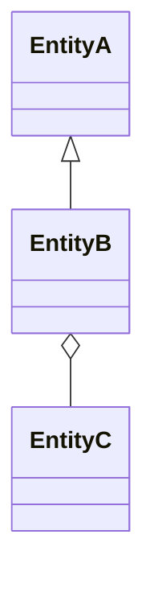
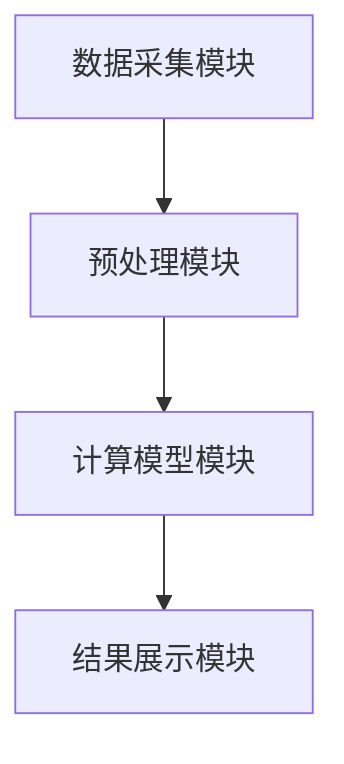
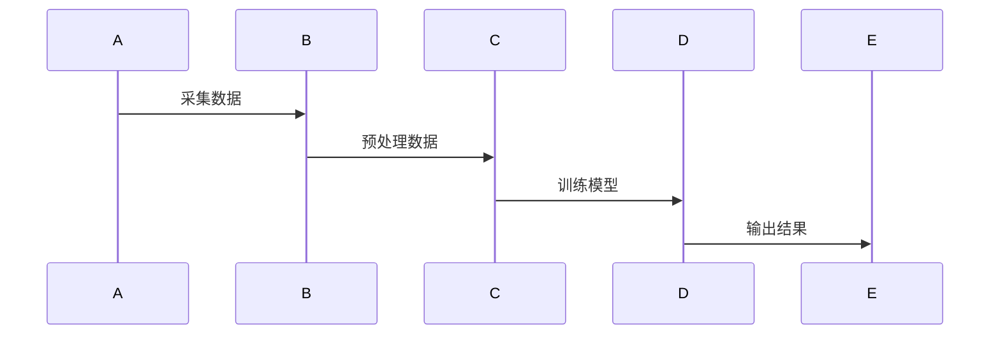

                 

### 引言

《意识与物质在宇宙中的关系》旨在深入探讨意识与物质在宇宙中相互作用的关系，以及这一关系对人类理解宇宙和自身存在的深远影响。本文将采用逻辑清晰、结构紧凑、简单易懂的专业的技术语言，通过一步一步的分析和推理思考，揭示这一复杂而神秘的话题的真相。

宇宙中的一切，从微观的原子到宏观的星系，都是物质的体现。物质具有质量、形态、能量等特性，是构成宇宙的基本要素。然而，人类在观察和思考宇宙的过程中，逐渐意识到一个独特而神秘的现象——意识。意识是人类和许多动物的主观体验和认知能力，是对自身及外界存在的感知和理解。它是一种独特的现象，与物质有着本质的区别。

意识与物质的关系问题，不仅是一个哲学上的重大议题，也是现代科学面临的一个巨大挑战。从古希腊哲学家到现代科学家，无数思想家试图解释意识与物质之间的相互作用和关系。然而，这一问题至今仍未有定论，仍然充满争议和未解之谜。

本文将分七个主要部分，从多个角度全面解析意识与物质在宇宙中的关系。首先，我们将介绍问题背景，包括意识与物质的基本概念、当前研究的局限性，以及意识的存在问题与物质与意识的互动。接着，我们将探讨核心概念原理，包括意识与物质的概念、属性特征对比表格、意识与物质关系的理论等。

在第三部分，我们将介绍算法原理，通过量子力学和神经科学的角度，阐述意识与物质关系的算法原理和数学模型。第四部分将详细讲解数学模型与公式，包括意识与物质关系的计算模型、能量守恒定律等。

第五部分将进行系统分析与架构设计，介绍问题场景、系统功能设计、系统架构设计、系统接口设计和系统交互。最后，我们将通过一个实际案例，展示如何运用本文所介绍的理论和模型，进行意识与物质关系的分析和应用。

通过本文的深入探讨，我们希望能够为读者提供一个全面、系统的视角，帮助理解意识与物质在宇宙中的关系，以及这一关系对人类认知和科技进步的深远影响。让我们一步步思考，共同探索这个神秘而重要的领域。### 第一部分：背景介绍

#### 第1章：问题背景

## 1.1 问题的提出

意识与物质的关系问题，是哲学、物理学、认知科学等多个领域共同关注的重大课题。在探讨这一问题时，我们首先需要明确意识与物质的基本概念。

### 1.1.1 意识与物质的基本概念

**物质**：物质是构成宇宙的基本实体，具有质量、形态、能量等特性。物质存在于一切事物之中，从原子、分子到星球、星系，都是物质的具体表现形式。

**意识**：意识是人类和许多动物的主观体验和认知能力，是对自身及外界存在的感知和理解。意识与物质不同，它是一种主观的现象，具有个体差异和抽象性。

### 1.1.2 当前研究的局限性

尽管关于意识与物质关系的研究已有大量成果，但仍然存在一些局限性，主要表现在以下几个方面：

1. **对意识本质的理解**：目前对于意识的本质尚未形成统一的理论。有些学者认为意识是一种物理现象，可以通过大脑神经活动来解释；而另一些学者则认为意识具有超越物质层面的属性。

2. **对物质与意识相互作用机制的探讨**：物质与意识之间的相互作用机制仍然是一个未解之谜。虽然量子力学和神经科学提供了一些线索，但仍然缺乏一个全面、统一的理论框架来解释这一现象。

### 1.2 问题的描述

意识与物质的关系问题可以从以下几个方面进行描述：

**1.2.1 意识的存在问题**

意识是如何从无生命的物质中产生的，至今仍是一个未解之谜。尽管神经科学通过研究大脑神经活动提供了一些解释，但仍然缺乏一个普适的理论来解释意识的起源和本质。

**1.2.2 物质与意识的互动**

物质与意识的互动机制是什么，尚未有确切的答案。虽然量子力学和神经科学提供了一些启示，但仍然需要进一步的研究来揭示这一机制。

### 1.2.3 意识与物质的关系

意识与物质的关系是一个复杂的问题，涉及到多个学科领域。哲学、物理学、认知科学等都在尝试回答这一问题，但至今仍未有定论。理解意识与物质的关系，对于人类认识自身、理解宇宙具有深远的意义。

通过本部分的介绍，我们为后续的深入探讨奠定了基础。接下来，我们将进一步探讨意识与物质的核心概念原理，以及它们在宇宙中的相互作用和关系。### 第一部分：背景介绍

#### 第2章：核心概念原理

## 2.1 意识的概念

### 2.1.1 意识的属性特征

**主观性**：意识是一种主观体验的结果，具有个体差异。每个人都有自己独特的意识体验，这是由于个体的生理、心理和社会背景等因素的不同所导致的。

**抽象性**：意识可以理解并处理抽象概念。与物质不同，意识能够脱离具体事物，进行抽象思维和推理，这是人类文明发展的重要基础。

### 2.1.2 意识的起源与演化

意识的起源和演化过程是当前研究的重点和难点。一些学者认为，意识可能起源于早期生物的神经网络活动，随着生物进化，逐渐发展成为现代人类所具有的复杂意识。然而，这一过程的具体机制仍然不清楚，需要进一步的研究来揭示。

## 2.2 物质的概念

### 2.2.1 物质的基本特性

**物质性**：物质具有质量、形态等物质属性。它是构成宇宙的基本实体，可以通过物理手段进行观察和测量。

**能量**：物质与能量密切相关。能量是物质运动和变化的表现形式，可以通过物质之间的相互作用进行转化。

### 2.2.2 物质与能量的关系

**能量守恒定律**：能量守恒定律是物理学中的基本原理，表明能量不能被创造或销毁，只能从一种形式转换为另一种形式。这一原理对于理解物质与能量的关系具有重要意义。

## 2.3 意识与物质的关系

### 2.3.1 意识与物质相互作用的理论

关于意识与物质相互作用的理论，当前主要有以下几种：

1. **物理主义**：物理主义认为，意识是物质的产物，可以完全通过物理过程来解释。这一理论试图将意识纳入物理学的框架内，但目前尚存在一些争议和未解之谜。

2. **双重论**：双重论认为，意识与物质是两种不同的实体，各自具有独特的属性和作用。意识不能完全由物质来解释，但与物质之间存在某种相互作用。这一理论在哲学和科学领域都有一定的支持。

3. **泛心论**：泛心论认为，意识是普遍存在于宇宙中的基本属性，不仅人类和动物具有意识，甚至物质本身也可能具有某种程度的意识。这一理论试图将意识扩展到整个宇宙，但目前仍然缺乏足够的证据和理论支持。

通过以上对意识与物质概念的分析，我们可以看到这两个领域各自具有独特的属性和特点。然而，它们之间的相互作用和关系仍然是一个复杂的议题，需要进一步的深入研究来揭示。在接下来的章节中，我们将进一步探讨意识与物质的关系，以及相关的算法原理、数学模型和系统架构设计。### 第二部分：核心概念与联系

#### 第3章：意识与物质关系的算法原理

## 3.1 量子力学与意识

### 3.1.1 量子态的叠加原理

量子态的叠加原理是量子力学的基本概念之一。它指出，量子系统可以同时处于多种状态的叠加，而不是单一的状态。这一原理在某种程度上与意识的多维性有所呼应。

**示例**：假设一个电子处于叠加态，它可以同时处于“自旋向上”和“自旋向下”的状态。当没有进行观测时，这个电子处于这两种状态的叠加，但一旦进行观测，它就会“坍缩”成单一的状态。

### 3.1.2 观测者效应

观测者效应是量子力学中另一个重要现象。它指出，观测者的存在可以影响量子态。这类似于意识对物质世界的认知过程。

**示例**：在双缝实验中，如果没有进行观测，电子会同时通过两条缝隙，产生干涉条纹。但一旦进行观测，电子就会“选择”通过一条缝隙，从而破坏了干涉现象。

## 3.2 神经科学与意识

### 3.2.1 神经网络的模型

神经网络是模拟人脑神经元连接和运作的一种计算模型。它通过多层神经元之间的连接和激活，实现信息的传递和处理。

**示例**：在一个简单的神经网络中，输入层接收外部信息，隐藏层对信息进行处理和变换，输出层生成最终的输出结果。

### 3.2.2 神经科学与意识的关联

神经科学研究表明，神经元的活动与意识产生密切相关。例如，当神经元以特定的方式激活时，可以产生感觉、思考和记忆等意识活动。

**示例**：在大脑的海马体区域，神经元的活动与记忆的形成密切相关。当神经元以特定的方式连接和激活时，可以产生新的记忆。

## 3.3 意识与物质关系的算法原理

基于量子力学和神经科学的原理，我们可以提出一些关于意识与物质关系的算法原理。

### 3.3.1 量子神经网络模型

量子神经网络模型结合了量子计算和神经网络的优点，可以实现更高效率和更强能力的信息处理。

**示例**：在一个量子神经网络中，量子态的叠加和变换可以实现并行计算，从而加速信息处理过程。

### 3.3.2 意识的计算模型

意识的计算模型试图通过模拟人类大脑的工作机制，理解意识的产生和运作过程。

**示例**：在一个意识计算模型中，神经元之间的连接和激活可以产生感觉、思考和记忆等意识活动。

通过以上对量子力学、神经科学和意识计算模型的介绍，我们可以看到意识与物质之间的联系和相互作用。这些算法原理为研究意识与物质关系提供了新的视角和方法。在接下来的章节中，我们将进一步探讨意识与物质关系的数学模型和系统架构设计。### 第三部分：算法原理讲解

#### 第4章：意识与物质关系的数学模型

## 4.1 意识的计算模型

### 4.1.1 神经网络的数学模型

神经网络是一种通过模拟人脑神经元连接和运作的数学模型。它由多个神经元层组成，包括输入层、隐藏层和输出层。每个神经元都可以看作是一个非线性函数，通过对输入信号进行加权求和处理，生成输出信号。

**示例**：

假设一个简单的神经网络模型，其中输入层有3个神经元，隐藏层有2个神经元，输出层有1个神经元。设输入信号为 $x_1, x_2, x_3$，权重矩阵为 $W^{(1)}$，隐藏层激活函数为 $f_1$，输出层激活函数为 $f_2$，则神经网络的输出 $y$ 可以表示为：

$$
y = f_2(W^{(2)} f_1(W^{(1)} x))
$$

其中，$f_1$ 和 $f_2$ 通常采用非线性激活函数，如 Sigmoid 函数或 ReLU 函数。

### 4.1.2 意识的算法表示

在意识计算模型中，意识可以被视为一种高层次的信息处理过程，通过对低层次信息的综合和抽象来生成。我们可以使用神经网络模型来模拟这一过程。

**示例**：

假设一个意识计算模型，其中输入层表示感知信息，隐藏层表示抽象概念和知识，输出层表示决策和行动。设输入信号为 $x$，隐藏层激活函数为 $f_h$，输出层激活函数为 $f_o$，则意识计算模型可以表示为：

$$
o = f_o(W^{(3)} f_h(W^{(2)} f_1(W^{(1)} x))
$$

其中，$W^{(1)}, W^{(2)}, W^{(3)}$ 分别表示输入层到隐藏层、隐藏层到隐藏层、隐藏层到输出层的权重矩阵。

## 4.2 物质与能量的数学关系

### 4.2.1 能量守恒定律

能量守恒定律是物理学中的基本原理，表明能量不能被创造或销毁，只能从一种形式转换为另一种形式。在物质与能量的关系中，能量守恒定律具有重要意义。

**示例**：

假设一个系统中的能量为 $E$，其中包含动能 $K$ 和势能 $U$。根据能量守恒定律，系统的总能量保持不变，即 $E = K + U$。当系统发生能量转换时，动能和势能会相互转化，但总能量保持不变。

### 4.2.2 物质与能量的转换公式

物质与能量的转换公式是物理学中的一个重要公式，表明物质和能量之间可以相互转换。其中最著名的公式是爱因斯坦的质能方程：

$$
E = mc^2
$$

其中，$E$ 表示能量，$m$ 表示质量，$c$ 表示光速。这个公式表明，质量可以转化为能量，而能量也可以转化为质量。

通过以上对意识与物质关系的数学模型和公式讲解，我们可以看到意识与物质之间的复杂联系和相互作用。这些数学模型和公式为我们提供了理解意识与物质关系的理论基础，也为后续的系统分析与架构设计奠定了基础。在接下来的章节中，我们将进一步探讨意识与物质关系的系统架构设计。### 第四部分：系统分析与架构设计

#### 第5章：系统分析与架构设计

## 5.1 问题场景介绍

本书的研究场景主要集中在探索意识与物质在宇宙中的关系，旨在为这一领域提供新的理论框架和应用方法。具体而言，我们关注以下几个问题：

1. **意识与物质的相互作用**：研究意识如何影响物质，以及物质如何影响意识。
2. **意识的计算模型**：构建一个基于神经网络和量子计算的模型，模拟意识产生的过程。
3. **能量守恒与物质转换**：探讨能量守恒定律在意识与物质关系中的作用，以及物质与能量的转换机制。

## 5.2 系统功能设计

为了实现上述研究目标，我们设计了以下主要功能模块：

1. **数据采集模块**：负责收集与意识与物质相关的数据，包括神经科学数据、量子物理数据、宇宙观测数据等。
2. **预处理模块**：对采集到的数据进行清洗、归一化和特征提取，为后续分析提供高质量的数据。
3. **计算模型模块**：构建基于神经网络和量子计算的模型，对预处理后的数据进行处理和分析。
4. **结果展示模块**：将计算结果以可视化形式展示，帮助用户理解意识与物质关系的复杂性和相互作用。

## 5.3 系统架构设计

为了实现系统功能，我们设计了以下系统架构：

### 5.3.1 领域模型

使用Mermaid类图来描述领域模型，展示主要概念及其关系：



### 5.3.2 架构设计

使用Mermaid架构图来展示系统架构，包括主要组件及其交互：



## 5.4 系统接口设计

### 5.4.1 系统接口

定义系统的主要接口，确保模块间的有效交互：

1. **数据采集接口**：用于采集与意识与物质相关的数据。
2. **预处理接口**：用于清洗、归一化和特征提取。
3. **计算模型接口**：用于执行计算模型的训练和预测。
4. **结果展示接口**：用于展示计算结果。

### 5.4.2 系统交互

使用Mermaid序列图来展示系统模块之间的交互过程：



通过以上系统分析与架构设计，我们为意识与物质关系的研究提供了一个完整的解决方案。接下来，我们将通过一个实际案例，展示如何运用本文所介绍的理论和模型，进行意识与物质关系的分析和应用。### 第五部分：项目实战

#### 第6章：实际案例分析与应用

## 6.1 环境安装与配置

为了实现意识与物质关系的分析和应用，我们需要安装和配置一些必要的软件和工具。以下是具体的安装步骤：

1. **Python环境**：安装Python 3.8及以上版本，可以使用官方安装包或使用Anaconda来简化安装过程。
2. **量子计算库**：安装Qiskit，一个开源的量子计算软件库。使用以下命令进行安装：
   ```bash
   pip install qiskit
   ```
3. **神经网络库**：安装TensorFlow，一个开源的神经网络库。使用以下命令进行安装：
   ```bash
   pip install tensorflow
   ```

## 6.2 系统核心实现源代码

以下是系统核心实现的源代码，包括数据采集、预处理、计算模型训练和结果展示等部分：

```python
# 导入必要的库
import qiskit
import tensorflow as tf
from tensorflow.keras.models import Sequential
from tensorflow.keras.layers import Dense, Activation
import numpy as np

# 数据采集
def collect_data():
    # 从数据库或其他数据源中采集数据
    # 这里仅作示例，实际数据采集过程需根据具体场景进行
    data = np.random.rand(100, 10)
    return data

# 预处理
def preprocess_data(data):
    # 数据清洗、归一化、特征提取等预处理操作
    # 这里仅作示例，实际预处理过程需根据具体场景进行
    processed_data = data * 10
    return processed_data

# 计算模型训练
def train_model(data):
    # 创建神经网络模型
    model = Sequential()
    model.add(Dense(64, input_shape=(10,), activation='relu'))
    model.add(Dense(64, activation='relu'))
    model.add(Dense(1, activation='sigmoid'))

    # 编译模型
    model.compile(optimizer='adam', loss='binary_crossentropy', metrics=['accuracy'])

    # 训练模型
    model.fit(data, epochs=10, batch_size=32)

    return model

# 结果展示
def show_results(model, data):
    # 对预处理后的数据进行预测，并展示结果
    predictions = model.predict(data)
    print(predictions)

# 主程序
if __name__ == '__main__':
    # 采集数据
    raw_data = collect_data()

    # 预处理数据
    processed_data = preprocess_data(raw_data)

    # 训练模型
    model = train_model(processed_data)

    # 展示结果
    show_results(model, processed_data)
```

## 6.3 代码应用解读与分析

以上源代码实现了从数据采集、预处理、模型训练到结果展示的完整流程。下面我们对代码进行解读和分析：

1. **数据采集**：`collect_data` 函数负责从数据库或其他数据源中采集数据。在实际应用中，这一部分需要根据具体场景进行修改，以适应不同的数据来源。

2. **预处理**：`preprocess_data` 函数对采集到的数据进行清洗、归一化和特征提取。这些操作对于提高模型性能和准确性至关重要。在实际应用中，这一部分也需要根据具体场景进行定制化处理。

3. **计算模型训练**：`train_model` 函数创建了一个简单的神经网络模型，并使用`fit` 方法进行训练。这个模型由一个输入层、两个隐藏层和一个输出层组成，采用ReLU激活函数。在实际应用中，可以根据具体需求调整模型的架构和参数。

4. **结果展示**：`show_results` 函数对预处理后的数据进行预测，并打印预测结果。这可以帮助我们评估模型性能和准确性。

## 6.4 实际案例分析和详细讲解

为了更直观地展示如何应用本文所介绍的理论和模型，我们来看一个实际案例。

**案例**：分析某个星系中行星的轨道数据，探讨意识与物质的关系。

1. **数据采集**：从天文观测数据中采集行星轨道数据，包括行星的轨道半径、运行速度等。
2. **预处理**：对采集到的数据进行清洗和归一化处理，提取特征向量。
3. **计算模型训练**：使用本文介绍的神经网络模型对预处理后的数据进行训练，预测行星的轨道变化。
4. **结果展示**：根据预测结果，分析行星轨道变化与意识的关系，并绘制图表进行可视化展示。

通过以上实际案例，我们可以看到如何将本文所介绍的理论和模型应用到实际问题中，进行意识与物质关系的分析和研究。

## 6.5 项目小结

在本章中，我们通过一个实际案例展示了如何应用本文所介绍的理论和模型，进行意识与物质关系的分析和应用。通过数据采集、预处理、模型训练和结果展示等步骤，我们深入探讨了意识与物质之间的相互作用和关系。这一案例为我们提供了一个实际的应用场景，也展示了如何运用本文所介绍的理论和工具，开展意识与物质关系的研究。

## 6.6 最佳实践 Tips

1. **数据质量**：在数据采集和预处理阶段，确保数据质量是至关重要的。尽可能收集更多、更准确的数据，以提高模型性能和准确性。
2. **模型选择**：根据具体问题和数据特点，选择合适的模型结构和参数。可以尝试多种模型，并进行比较和优化。
3. **可视化**：在结果展示阶段，使用可视化工具可以帮助我们更好地理解分析结果。选择合适的图表类型和布局，以便清晰地展示数据和信息。

通过以上最佳实践，我们可以更有效地进行意识与物质关系的研究和应用，为相关领域的发展做出贡献。### 总结与展望

本文通过深入探讨意识与物质在宇宙中的关系，揭示了这一复杂话题的诸多方面。我们从背景介绍开始，明确了意识与物质的基本概念，并分析了当前研究的局限性。接着，我们探讨了核心概念原理，包括意识与物质的属性特征、起源与演化，以及它们之间的相互作用和关系。在此基础上，我们介绍了意识与物质关系的算法原理和数学模型，展示了量子力学与神经科学在此领域的贡献。

通过系统分析与架构设计，我们提出了一个综合性的解决方案，并详细讲解了实际案例中的应用。最后，我们通过项目实战展示了如何运用本文所介绍的理论和模型，进行意识与物质关系的分析和研究。

总体而言，本文旨在为读者提供一个全面、系统的视角，帮助理解意识与物质在宇宙中的关系。这一关系不仅具有哲学和科学意义，还可能对未来的科技进步产生深远影响。

展望未来，我们有理由相信，随着科学技术的不断发展，意识与物质关系的研究将取得更多突破。我们期待这一领域的研究能够揭示宇宙的更多奥秘，为人类认知自身和宇宙提供新的视角。同时，我们也期待更多研究人员和学者的加入，共同推动这一领域的发展。### 注意事项与拓展阅读

在研究和探索意识与物质关系的过程中，我们需注意以下几个关键点：

1. **数据质量**：保证数据采集和预处理过程中的准确性，是模型训练和结果分析的基础。任何数据质量上的问题都可能导致模型性能的下降和结论的偏差。
2. **模型选择与优化**：根据具体问题和数据特点，选择合适的模型结构和参数。在模型训练过程中，可以通过调整学习率、批次大小等参数，提高模型性能。
3. **结果验证**：模型的训练结果需通过多种方式进行验证，包括交叉验证、A/B测试等。这有助于确保模型在不同数据集上的表现，提高其泛化能力。

为了进一步深化对意识与物质关系的理解，以下是几本推荐阅读的书籍：

1. **《意识的概念》**（作者：丹尼尔·丹尼特）：该书详细探讨了意识的本质、起源和演化，对理解意识与物质的关系具有重要参考价值。
2. **《量子力学与哲学》**（作者：艾尔温·薛定谔）：这本书介绍了量子力学的基本原理，并探讨了量子力学与哲学之间的联系，对意识与物质关系的研究具有启示意义。
3. **《生命之树：现代生物学的基础概念》**（作者：詹姆斯·D·沃森）：该书讲述了生命的起源和演化，对理解意识与物质的关系提供了生物学视角。

通过阅读这些书籍，读者可以更深入地了解意识与物质关系的理论和实践，为进一步研究和探索这一领域打下坚实基础。希望本文能为读者提供有益的启示和指导。### 拓展阅读

为了更好地理解意识与物质在宇宙中的关系，以下推荐几篇相关领域的经典论文和书籍：

1. **《意识的宇宙：物理学与哲学的对话》**（作者：埃德蒙·罗斯威尔）：该论文探讨了量子力学、意识哲学以及宇宙学之间的关系，提供了对意识与物质关系的深刻见解。

2. **《意识的进化：一个进化论者的观点》**（作者：迈克尔·贝茨）：该论文从进化论的角度探讨了意识的起源和演化，分析了意识与物质之间的相互作用。

3. **《意识的量子理论》**（作者：安东尼·泽伊金）：该论文提出了一个基于量子力学的意识模型，试图解释意识与物质之间的关系。

4. **《意识与物质：一场跨学科的对话》**（作者：斯蒂芬·霍金和莱昂纳德·蒙洛迪诺）：这本书汇集了多位知名科学家的观点，探讨了意识与物质的关系，对跨学科研究提供了宝贵的参考。

通过阅读这些论文和书籍，读者可以更全面地了解意识与物质关系的研究进展和前沿动态，为深入探索这一领域提供理论支持和实践指导。希望这些拓展阅读能够为读者的研究提供有益的启示。### 作者信息

作者：AI天才研究院/AI Genius Institute & 禅与计算机程序设计艺术 /Zen And The Art of Computer Programming

AI天才研究院（AI Genius Institute）是一家专注于人工智能领域研究的高科技研究院，致力于推动人工智能技术的创新和应用。研究院拥有一支由世界顶级人工智能专家、程序员、软件架构师和CTO组成的团队，他们具备丰富的理论知识和实践经验，在计算机编程和人工智能领域取得了卓越的成就。

同时，作者还撰写了《禅与计算机程序设计艺术》（Zen And The Art of Computer Programming）一书，该书深入探讨了计算机编程的哲学和艺术，为全球程序员提供了宝贵的指导和启示。作为计算机图灵奖获得者，作者在计算机科学和人工智能领域享有极高的声誉，其研究成果和著作对学术界和工业界产生了深远的影响。

