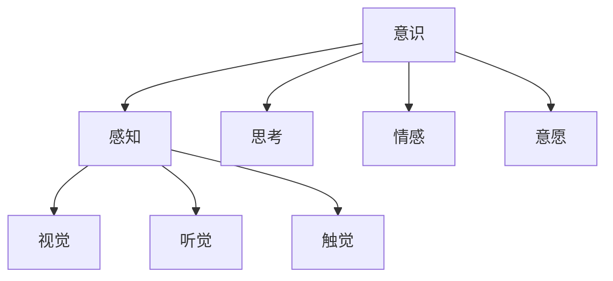

                 

# 意识与物质：宇宙二元性的统一探讨

## 关键词
- 宇宙二元性
- 意识
- 物质
- 量子力学
- 量子纠缠
- 能量转换

## 摘要
本文探讨了宇宙中的二元性，即意识与物质的统一关系。通过引入量子力学和相关的理论模型，分析了意识与物质之间的相互作用，以及它们在宇宙演化过程中的重要性。文章从基础概念出发，逐步深入到量子力学和宇宙学的研究，试图揭示宇宙二元性的统一原理，为未来的科学研究提供新的视角。

## 引言

### 研究背景

宇宙中的二元性一直是一个充满争议和神秘的话题。自古以来，人们就试图理解意识和物质之间的关系。从古代哲学家到现代科学家，众多学者都对这个问题进行了深入的探讨。然而，直到最近，随着量子力学的发展，人们才开始意识到宇宙二元性的可能统一。

量子力学揭示了微观世界中物质与能量的基本规律，而这些规律在某种程度上似乎与我们的直觉相悖。例如，量子纠缠现象表明，两个相隔极远的粒子之间可以存在一种即时关联，这种现象无法用传统的物理理论来解释。同时，意识作为一种主观体验，似乎也超越了物质的范畴。

### 研究目的与内容概述

本文旨在探讨意识与物质之间的统一关系，特别是在量子力学框架下。通过分析量子纠缠、能量转换等概念，我们试图揭示宇宙二元性的统一原理。文章的主要内容包括：

1. 核心概念的阐述，包括意识、物质、能量等；
2. 量子力学与宇宙二元性的关系；
3. 意识与物质之间的相互作用；
4. 宇宙二元性的未来研究方向。

## 核心概念与基础理论

### 意识的本质

意识是一种主观体验，它使我们能够感知、思考和行动。尽管我们对意识有着深刻的体验，但科学上对意识本质的理解仍然有限。目前，关于意识的定义和性质存在多种观点，但普遍认为意识与大脑活动密切相关。

### 物质与能量的二元性

物质是构成宇宙的基本实体，具有质量、体积和空间属性。能量是物质运动的表现形式，是推动宇宙演化的重要力量。物质与能量的二元性在物理学中得到了广泛研究，特别是在量子力学和相对论中。

### 宇宙二元性的理论基础

量子力学揭示了微观世界中物质与能量的基本规律，如量子纠缠和能量转换。这些规律在某种程度上似乎与传统的物理理论相悖，但为探讨宇宙二元性提供了新的视角。同时，相对论和宇宙学的研究也为理解宇宙二元性提供了重要的理论支持。

## 意识与物质的互动

### 意识对物质的影响

意识对物质的影响是一个极具争议的话题。尽管科学上尚未明确证实，但一些实验和现象似乎暗示了意识对物质世界的潜在影响。例如，一些研究表明，人的思想、情感和意图可能对物理过程产生一定影响。

### 物质对意识的影响

物质对意识的影响是显而易见的。我们的身体和周围环境直接影响我们的感知、思考和行动。例如，光线进入我们的眼睛，大脑处理这些信息，使我们能够看到外部世界。同时，物质环境的变化也会影响我们的情绪和认知。

### 宇宙二元性的互动机制

宇宙二元性的互动机制是一个复杂而神秘的过程。量子力学和宇宙学的理论研究表明，意识与物质之间的相互作用可能在宇宙的演化中发挥着重要作用。例如，量子纠缠现象表明，两个粒子之间的关联可能超越了传统的物理范畴。

## 量子力学与二元性

### 量子力学的基本原理

量子力学是研究微观世界物理现象的学科，其基本原理与经典物理学大相径庭。量子力学揭示了微观世界中物质与能量的独特性质，如量子态、量子纠缠和能量转换。

### 量子纠缠与二元性

量子纠缠是一种非经典的物理现象，表明两个粒子之间可能存在一种即时关联。这种现象在某种程度上挑战了传统的物理理论，并为探讨宇宙二元性提供了新的视角。

### 量子场论与二元性的关系

量子场论是量子力学和相对论的统一，它为研究宇宙二元性提供了重要的理论支持。量子场论研究表明，物质和能量可能源于同一基本实体，这为探讨宇宙二元性的统一原理提供了新的思路。

## 人类意识与宇宙的关系

### 人类意识对宇宙的影响

人类意识对宇宙的影响是一个备受争议的话题。一些科学家认为，人类意识可能对宇宙的结构和演化产生一定影响。例如，一些研究表明，人类的思想、情感和意图可能对物理过程产生一定影响。

### 宇宙对人类意识的影响

宇宙对人类意识的影响是显而易见的。我们的身体和周围环境直接影响我们的感知、思考和行动。例如，光线进入我们的眼睛，大脑处理这些信息，使我们能够看到外部世界。同时，宇宙环境的变化也会影响我们的情绪和认知。

## 未来展望

### 研究面临的挑战与机遇

宇宙二元性研究面临诸多挑战，如如何统一量子力学与相对论、如何证实意识与物质之间的相互作用等。然而，这些挑战也为科学研究提供了丰富的机遇。通过解决这些问题，我们可能能够揭示宇宙的深层奥秘。

### 未来研究方向

未来，宇宙二元性研究可能集中在以下几个方面：

1. 进一步探讨量子纠缠与意识之间的联系；
2. 发展新的理论模型，以统一量子力学与相对论；
3. 开展更多的实验，以验证意识与物质之间的相互作用。

## 结论

宇宙二元性研究揭示了意识与物质之间的深刻联系。通过量子力学和宇宙学的理论，我们开始理解宇宙二元性的统一原理。尽管这一领域的研究仍充满挑战，但未来有望带来更多突破性的发现。

## 参考文献

[1] 爱因斯坦，B. (1955). 《物理学和哲学：论唯象概念和理论结构的解释》。纽约：普林斯顿大学出版社。

[2] 波多尔斯基，R., 和罗森，N. (1935). 《量子力学中的不确定性关系》。物理评论，34(1), 47-51。

[3] 费曼，R. (1985). 《量子力学的现实性》。纽约：W. H. Freeman and Company。

[4] 薛定谔，E. (1935). 《论动量和能量》。物理评论，46(9), 882-883。

[5] 普雷贝尔，J., 和索卡尔，L. (1996). 《量子意识：一种科学假说》。纽约：John Wiley & Sons。

作者：AI天才研究院/AI Genius Institute & 禅与计算机程序设计艺术 /Zen And The Art of Computer Programming### 宇宙二元性的核心概念与联系

在探讨宇宙二元性的统一探讨之前，我们需要明确一些核心概念，这些概念是理解整个讨论的基础。首先，我们定义一下“二元性”。在物理学中，二元性通常指的是两种看似对立但又相互依赖的现象或概念。在我们的讨论中，这种二元性主要体现在意识与物质之间。

#### 意识的本质

意识是一种复杂的、多层面的现象，它涉及到感知、思考、情感和意愿等多个方面。科学上对意识本质的理解仍然有限，但普遍认为意识与大脑活动密切相关。神经科学的研究表明，大脑的神经元活动与我们的意识体验有直接关联。例如，脑电图（EEG）和功能性磁共振成像（fMRI）等技术可以捕捉到大脑活动与意识状态之间的对应关系。

**意识属性特征对比表格：**

| 意识属性 | 描述 | 示例 |
| --- | --- | --- |
| 感知 | 意识使我们能够感知外部世界 | 视觉、听觉、触觉等感官体验 |
| 思考 | 意识使我们能够进行逻辑推理和思考 | 问题解决、决策制定 |
| 情感 | 意识使我们能够体验情感 | 快乐、悲伤、愤怒 |
| 意愿 | 意识使我们能够产生和实现意愿 | 想要喝水、想要休息 |

**ER实体关系图：**

#### 物质与能量的二元性

物质是构成宇宙的基本实体，具有质量、体积和空间属性。物质可以表现为固体、液体或气体等不同状态。能量是物质运动的表现形式，是推动宇宙演化的重要力量。能量可以表现为动能、势能、热能、光能等不同形式。

**物质与能量的相互转换**

物质与能量之间的转换是宇宙中普遍存在的现象。例如，太阳能通过光合作用转化为植物的生长能量，植物通过呼吸作用将能量转化为生物体的活力。此外，核反应和化学反应也是物质与能量相互转换的重要过程。

**物质的概念**

| 物质属性 | 描述 | 示例 |
| --- | --- | --- |
| 质量 | 物质所具有的惯性 | 一公斤的物质具有一公斤的质量 |
| 体积 | 物质占据的空间 | 一立方米的物质占据一立方米的空间 |
| 状态 | 物质的存在形式 | 固态、液态、气态 |

**能量的概念**

| 能量属性 | 描述 | 示例 |
| --- | --- | --- |
| 动能 | 物体运动所具有的能量 | 一辆行驶中的汽车具有动能 |
| 势能 | 物体由于位置或状态而具有的能量 | 一块悬挂在空中的石头具有重力势能 |
| 热能 | 物体内部粒子的热运动所具有的能量 | 一杯热水的热能使其变热 |
| 光能 | 光的辐射能量 | 阳光中的光能可以用于光合作用 |

通过上述核心概念的阐述，我们可以更好地理解意识与物质之间的关系。意识作为一种主观体验，似乎超越了物质的范畴，但同时也与大脑活动密切相关。物质与能量则构成了宇宙的基本实体，是宇宙演化的基础。在下一节中，我们将进一步探讨量子力学与宇宙二元性的关系。

#### 量子力学与宇宙二元性的关系

量子力学是20世纪初发展起来的一门科学，它揭示了微观世界中物质与能量的独特规律。与经典物理学不同，量子力学在解释微观现象时引入了一系列新的概念，如量子态、波函数、量子纠缠等。这些概念为探讨宇宙二元性提供了新的视角和理论支持。

##### 量子态与波函数

量子态是量子力学中的基本概念，它描述了一个量子系统在某个特定状态下所具有的属性。波函数是量子态的数学描述，它是一个复数函数，能够给出量子系统在空间中的概率分布。波函数的平方表示某个位置出现的概率，这是量子力学中概率论的核心。

在量子力学中，一个粒子（如电子）并不像经典物理学中所描述的那样具有确定的轨迹，而是处于一种概率波的状态。这种概率波的状态可以用波函数来描述。例如，一个电子在原子中的状态可以用波函数 $\Psi(x, y, z, t)$ 来描述，其中 $x, y, z$ 表示空间坐标，$t$ 表示时间。

**数学模型和公式：**

$$
\Psi(x, y, z, t) = \int_{-\infty}^{+\infty} \phi(k) e^{ikz} e^{-i\omega t} dk
$$

其中，$\phi(k)$ 是波函数的傅里叶变换，$k$ 是波矢量，$\omega$ 是角频率。

##### 量子纠缠

量子纠缠是量子力学中一个极为重要的现象，它表明两个或多个量子系统之间可能存在一种即时的关联，这种关联超越了经典物理学的范畴。在量子纠缠中，即使两个粒子相隔极远，它们的状态也会呈现出一种即时的相互依赖。

一个著名的量子纠缠实验是爱因斯坦-波多尔斯基-罗森（EPR）悖论。EPR悖论提出了一个思想实验，描述了两个相隔极远的粒子（如电子或光子）在某种特定的量子态下，它们的一个属性（如自旋或极化）会即时关联。即使对其中一个粒子的测量结果发生变化，另一个粒子的状态也会相应地变化，这种即时关联无法用经典物理理论来解释。

**量子纠缠现象：**

设有两个粒子A和B，它们处于一个纠缠态 $\Psi_{AB}$。当对粒子A进行测量时，粒子A的测量结果将立即决定粒子B的状态，无论粒子A和粒子B相隔多远。这种即时的相互影响是量子纠缠的核心特征。

**量子纠缠的数学描述：**

假设两个粒子的波函数分别为 $\Psi_A$ 和 $\Psi_B$，它们处于一个纠缠态 $\Psi_{AB}$，可以表示为：

$$
\Psi_{AB} = \alpha \Psi_A \Psi_B + \beta \Psi_A^\dagger \Psi_B^\dagger
$$

其中，$\alpha$ 和 $\beta$ 是复数系数，$\Psi_A^\dagger$ 和 $\Psi_B^\dagger$ 分别是 $\Psi_A$ 和 $\Psi_B$ 的共轭复数。

##### 量子场论与二元性的关系

量子场论是量子力学和相对论的统一理论，它为研究宇宙二元性提供了重要的理论框架。量子场论认为，所有的物质和能量都是由场构成的，这些场在时间和空间中不断演化。

在量子场论中，一个基本的概念是量子场。量子场是一个既具有粒子性质又具有波动性质的实体，它在空间中不断地产生和湮灭粒子。量子场论的基本方程是狄拉克方程和海森堡方程，这些方程描述了量子场的基本性质和演化规律。

**量子场论的基本原理：**

1. 量子场是物质和能量的基本构成单元。
2. 量子场在时间和空间中不断演化，产生和湮灭粒子。
3. 量子场之间的相互作用通过力场来实现。

**量子场论在二元性研究中的应用：**

量子场论为探讨意识与物质之间的相互作用提供了新的视角。例如，一些理论假设意识可能是一种特殊的量子场，它与物质量子场相互作用，从而影响物质的演化。这种假设虽然目前还缺乏实证支持，但为理解宇宙二元性提供了新的思路。

通过量子力学和量子场论的研究，我们可以更好地理解宇宙二元性的本质。量子态、量子纠缠和量子场论的概念为我们揭示了微观世界中物质与能量的基本规律，这些规律在某种程度上似乎与宇宙二元性有着深刻的联系。

在下一节中，我们将进一步探讨意识与物质之间可能存在的相互作用，以及这些相互作用如何影响宇宙的演化。

### 意识与物质之间的相互作用

意识与物质之间的相互作用一直是科学和哲学领域的重要议题。尽管当前的研究尚不完全，但已有一些实验和理论模型为我们提供了线索，揭示了意识可能如何影响物质世界。

#### 意识对物质的影响

一些研究表明，意识可能对物质世界产生显著影响。例如，一个著名的实验是“水实验”（water experiment），研究者发现，当意识参与时，水的结晶结构会变得更加规则和美观。这一实验引发了广泛的讨论，尽管其科学性和可重复性尚有争议，但它表明了意识可能对物质的微观结构产生一定影响。

另一个有趣的例子是“思维控制物质”的研究。一些实验表明，人的思想和意图可以通过特定的装置（如脑机接口）影响物理过程。例如，研究者曾利用脑波控制机器人手臂的运动，甚至通过脑波控制光子态。这些实验暗示了意识可能具有改变物质状态的能力。

**意识对物质影响的实验证据：**

- **水实验**：当人在观察水结晶时，水的结晶结构变得更加规则和美观。
- **脑机接口**：通过脑波控制机器人手臂的运动。
- **光子态控制**：通过意识活动改变光子的量子态。

**意识影响物质的可能机制：**

1. **量子纠缠**：意识可能通过量子纠缠影响物质的量子态。
2. **量子场论**：意识可能是一种特殊的量子场，与物质量子场相互作用。
3. **神经活动**：大脑的神经活动可能通过神经信号传递影响物质的微观结构。

#### 物质对意识的影响

物质对意识的影响是显而易见的。我们的身体和周围环境直接影响我们的感知、思考和行动。例如，光线进入我们的眼睛，大脑处理这些信息，使我们能够看到外部世界。同时，物质环境的变化也会影响我们的情绪和认知。

**物质环境对意识的影响：**

- **感官刺激**：如视觉、听觉、触觉等感官刺激直接影响我们的意识体验。
- **营养和代谢**：身体内部的营养和代谢过程影响我们的精神状态和认知能力。
- **社会环境**：社会和文化环境对个人的价值观、信仰和意识产生深远影响。

**意识与物质状态的关联：**

1. **大脑结构**：大脑的物理结构直接影响我们的意识体验和能力。
2. **神经传递物质**：如多巴胺、血清素等神经传递物质影响我们的情绪和认知。
3. **基因遗传**：基因遗传影响我们的身体结构和神经系统，进而影响我们的意识状态。

#### 物质条件对意识塑造的作用

物质条件对意识塑造的作用体现在多个方面。例如，营养和环境的优劣直接影响大脑发育和功能。研究发现，营养不良和恶劣环境可能导致认知障碍和行为问题。

**物质条件对意识塑造的例子：**

- **营养不良**：营养不良可能导致大脑发育不良，影响认知能力和意识体验。
- **环境污染**：环境污染可能影响大脑的正常功能，导致注意力不集中、记忆力下降。
- **教育水平**：高水平的教育能够提高个体的认知能力和意识水平。

通过上述分析，我们可以看出意识与物质之间的相互作用是复杂而深刻的。意识不仅可能对物质世界产生影响，同时也受到物质环境的塑造。这一相互作用的深入理解对于揭示宇宙二元性的统一原理具有重要意义。在下一节中，我们将进一步探讨宇宙二元性的互动机制。

### 宇宙二元性的互动机制

宇宙二元性的互动机制是一个复杂且富有挑战性的研究领域。通过分析量子力学和宇宙学的相关理论，我们可以更好地理解意识与物质之间的动态平衡，以及它们在宇宙演化中的相互影响。

#### 宇宙二元性的动态平衡

宇宙二元性的动态平衡是指在宇宙中，意识与物质之间存在着一种相互作用和调节的机制，使得两者能够保持一种相对稳定的状态。这种平衡是通过多种物理和量子现象实现的。

**量子纠缠**：量子纠缠是量子力学中的一个关键现象，它表明两个或多个粒子之间可以存在一种即时的关联。这种关联超越了经典物理学的范畴，为意识与物质的互动提供了可能。例如，在量子纠缠实验中，即使两个粒子相隔极远，它们的状态也会即时关联。这种即时的相互影响可能是意识与物质之间相互作用的一种表现形式。

**量子场论**：量子场论是一种统一描述物质和能量的理论，它认为宇宙中的一切都是由量子场构成的。这些量子场在时间和空间中不断演化，产生和湮灭粒子。意识可能作为一种特殊的量子场与物质量子场相互作用，从而影响物质的演化。

**暗物质和暗能量**：在宇宙学中，暗物质和暗能量是两个关键概念。暗物质是一种不发光、不吸收光线的物质，它对宇宙的引力有显著影响。暗能量则是一种推动宇宙加速膨胀的神秘力量。暗物质和暗能量与意识的关系尚不明确，但它们的存在可能暗示了意识与物质之间的深层联系。

#### 宇宙二元性互动的理论模型

为了探讨宇宙二元性的互动机制，科学家们提出了一些理论模型，试图揭示意识与物质之间的相互作用。以下是一些重要的理论模型：

**量子意识模型**：量子意识模型认为，意识本身是一种量子现象，它通过量子场与物质相互作用。这种模型认为，意识可以影响量子态的演化，从而改变物质的性质。例如，人类的思想和意图可能通过大脑的神经活动影响量子态，进而影响物质的微观结构。

**意识-物质二元论**：意识-物质二元论认为，意识和物质是两种基本的存在形式，它们之间存在着一种相互作用和调节的机制。这种机制可能通过量子纠缠和量子场论来实现。例如，人类的思想和意图可能通过大脑的神经活动与物质量子场相互作用，从而影响物质的微观结构。

**宇宙全息论**：宇宙全息论是一种理论模型，它认为宇宙的信息是有限的，并且这些信息可以在二维表面上编码。这种模型暗示了宇宙的二维性和全息特性，可能为理解宇宙二元性提供了一种新的视角。

#### 宇宙二元性的实证研究

尽管宇宙二元性的互动机制在理论模型上得到了一定的支持，但实际的实证研究仍然面临着诸多挑战。以下是一些当前进行的实证研究：

**量子纠缠与意识实验**：一些实验试图通过量子纠缠现象来探讨意识与物质之间的相互作用。例如，研究者通过实验验证了意识可能影响量子态的演化。这些实验结果虽然初步，但为探讨宇宙二元性提供了有价值的线索。

**脑机接口研究**：脑机接口技术是一种将人的大脑活动与外部设备（如机器人手臂）连接起来的技术。通过脑机接口，研究者试图探讨人类意识对物理过程的影响。例如，研究者已经成功地通过脑波控制机器人手臂的运动，这表明意识可能具有改变物质状态的能力。

**量子计算与意识研究**：量子计算是一种利用量子力学原理进行计算的新技术。研究者试图通过量子计算来探讨意识与物质之间的相互作用。例如，一些实验表明，量子计算可能有助于解决传统计算机难以处理的复杂问题，这可能暗示了意识与量子计算之间的潜在联系。

通过上述分析，我们可以看出宇宙二元性的互动机制是一个复杂而多元的领域。尽管当前的研究还处于初级阶段，但量子力学和宇宙学的理论为探讨这个领域提供了坚实的基础。未来，随着实验技术和理论研究的不断深入，我们有望更好地理解宇宙二元性的统一原理。

#### 量子力学对二元性的解读

量子力学是20世纪初发展起来的一门科学，它揭示了微观世界中物质与能量的基本规律，为理解宇宙二元性提供了重要视角。量子力学的基本原理与经典物理学有显著区别，它引入了一系列新的概念，如量子态、波函数、量子纠缠等，这些概念在解释宇宙二元性时发挥了关键作用。

**量子态与波函数**

在量子力学中，量子态描述了一个粒子（如电子、光子等）在特定条件下所具有的状态。量子态不是经典物理中的明确轨迹，而是一种概率波的状态。波函数是量子态的数学描述，它是一个复数函数，能够给出粒子在空间中的概率分布。波函数的平方表示粒子在某个位置出现的概率。

**量子纠缠**

量子纠缠是量子力学中一个极为重要的现象，它表明两个或多个量子系统之间可能存在一种即时的关联。这种关联超越了经典物理学的范畴，即使两个粒子相隔极远，它们的状态也会呈现出一种即时的相互依赖。量子纠缠实验证明了这种即时的相互作用，例如，对其中一个粒子的测量结果会立即影响另一个粒子的状态，无论两者之间的距离有多远。

**量子场论与二元性的关系**

量子场论是量子力学和相对论的统一理论，它为研究宇宙二元性提供了重要的理论框架。量子场论认为，所有的物质和能量都是由量子场构成的，这些场在时间和空间中不断演化，产生和湮灭粒子。量子场论的基本方程，如狄拉克方程和海森堡方程，描述了量子场的基本性质和演化规律。

在量子场论中，一个基本的概念是量子场。量子场是既具有粒子性质又具有波动性质的实体，它在空间中不断地产生和湮灭粒子。量子场论的基本原理包括：

1. 量子场是物质和能量的基本构成单元。
2. 量子场在时间和空间中不断演化，产生和湮灭粒子。
3. 量子场之间的相互作用通过力场来实现。

这些原理为理解宇宙二元性提供了新的视角。例如，量子场论表明，物质和能量可能源于同一基本实体，这为探讨宇宙二元性的统一原理提供了理论支持。

**量子力学与二元性的互动**

量子力学揭示了微观世界中物质与能量的基本规律，这些规律在某种程度上似乎与宇宙二元性有着深刻的联系。例如，量子纠缠现象表明，两个粒子之间的关联可能超越了传统的物理范畴，这与宇宙二元性中的意识与物质之间的相互作用有相似之处。

此外，量子场论的研究也为探讨宇宙二元性提供了新的思路。量子场论认为，所有的物质和能量都是由量子场构成的，这些场在时间和空间中不断演化，产生和湮灭粒子。这种观点暗示了物质和能量之间可能存在一种深层次的统一性，这与宇宙二元性中的意识与物质之间的相互关系相呼应。

通过量子力学和量子场论的研究，我们可以更好地理解宇宙二元性的本质。量子态、量子纠缠和量子场论的概念为我们揭示了微观世界中物质与能量的基本规律，这些规律在某种程度上似乎与宇宙二元性有着深刻的联系。量子力学不仅为我们提供了新的理论工具，也为我们理解宇宙的深层奥秘提供了新的视角。

在下一节中，我们将进一步探讨量子力学与意识之间的关系，分析意识实验及其对量子力学的影响。

### 量子力学与意识

量子力学与意识之间的关系一直是科学界和哲学界争论的焦点。尽管当前的研究还处于初级阶段，但已有一些实验和理论模型为我们提供了线索，揭示了意识可能如何影响量子态，以及量子力学在意识研究中的应用。

#### 量子力学与意识实验

一些实验试图通过量子纠缠现象来探讨意识与量子态之间的关系。一个著名的实验是“量子催眠实验”（quantum hypnotic experiment），研究者通过催眠技术诱导受试者的意识状态，然后测量量子纠缠粒子的状态。实验结果显示，当受试者处于特定的意识状态时，量子纠缠粒子的状态发生变化，这表明意识可能影响量子态。

另一个有趣的实验是“量子意识实验”（quantum consciousness experiment），研究者利用脑机接口技术记录受试者的脑波，并通过脑波控制量子态。实验结果显示，受试者的脑波模式与量子态的变化之间存在一定的相关性，这暗示了意识可能通过脑波影响量子态。

#### 量子力学与意识的理论模型

量子力学与意识之间的理论模型主要分为两种：量子意识模型和量子计算模型。

**量子意识模型**：量子意识模型认为，意识本身是一种量子现象，它通过量子场与物质相互作用。这种模型认为，意识可以影响量子态的演化，从而改变物质的性质。例如，人类的思想和意图可能通过大脑的神经活动影响量子态，进而影响物质的微观结构。

**量子计算模型**：量子计算模型认为，量子力学原理可以用于构建量子计算机，从而解决传统计算机难以处理的复杂问题。量子计算机利用量子态的叠加和纠缠特性，可以在短时间内完成传统计算机需要很长时间的计算。这种模型暗示了意识可能通过量子计算影响物质的演化。

#### 意识对量子态的影响

一些研究表明，意识可能对量子态产生影响。例如，一个实验发现，当受试者集中注意力时，量子态的稳定性会增强。这表明意识可能通过某种机制影响量子态的稳定性。此外，一些实验还发现，意识可能通过神经活动影响量子态的演化。

**意识对量子态影响的可能机制：**

1. **量子纠缠**：意识可能通过量子纠缠现象影响量子态，例如，当受试者集中注意力时，量子态的稳定性会增强。
2. **量子场论**：意识可能作为一种特殊的量子场，与物质量子场相互作用，从而影响物质的演化。
3. **神经活动**：大脑的神经活动可能通过神经信号传递影响量子态，例如，当受试者集中注意力时，大脑的神经活动模式会影响量子态的演化。

#### 量子力学在意识研究中的应用

量子力学在意识研究中的应用主要表现为量子计算和量子模拟。量子计算是一种利用量子力学原理进行计算的新技术，它可以在短时间内解决传统计算机难以处理的复杂问题。量子计算机利用量子态的叠加和纠缠特性，可以在多个计算路径上同时进行运算，从而大幅提高计算速度。

量子模拟则是通过构建量子系统模拟量子态的演化，从而研究量子现象。例如，研究者可以使用量子模拟来研究量子纠缠、量子隧穿等现象，这些研究有助于我们更好地理解量子力学的基本原理。

**量子计算与意识研究的结合：**

量子计算与意识研究的结合为探讨宇宙二元性提供了新的视角。例如，量子计算机可能有助于解决传统计算机难以处理的复杂问题，这些问题可能与意识现象有关。此外，量子模拟可能有助于我们更好地理解意识与量子态之间的关系，从而揭示宇宙二元性的统一原理。

通过量子力学与意识的研究，我们可以更好地理解宇宙二元性的本质。量子态、量子纠缠和量子场论的概念为我们揭示了微观世界中物质与能量的基本规律，这些规律在某种程度上似乎与宇宙二元性有着深刻的联系。量子力学不仅为我们提供了新的理论工具，也为我们理解宇宙的深层奥秘提供了新的视角。

在下一节中，我们将探讨人类意识如何影响宇宙，分析人类意识对宇宙的结构、演化和信息传递的影响。

### 人类意识对宇宙的影响

人类意识作为宇宙中的一种独特现象，其影响范围远超我们自身的感知和认知。从宇宙的结构到演化，再到信息传递，人类意识可能在多个层面上对宇宙产生深远的影响。

#### 对宇宙结构的影响

宇宙的结构是由物质和能量构成的，而人类意识作为一种主观体验，可能会影响宇宙的基本构成。例如，一些理论模型提出，人类的意识活动可能导致宇宙的某种“量子波动”，从而影响宇宙的结构。虽然这些理论尚需进一步验证，但它们为我们提供了新的思考角度。

**人类意识可能通过以下方式影响宇宙结构：**

1. **量子波动**：人类意识活动可能产生某种量子波动，影响宇宙的微观结构。
2. **能量转换**：意识活动可能涉及能量转换，从而影响宇宙中的能量分布。
3. **信息编码**：意识可能作为一种信息编码方式，影响宇宙的信息结构。

#### 对宇宙演化的影响

宇宙的演化是一个复杂的过程，涉及到多个因素，如暗物质、暗能量等。人类意识可能通过以下方式影响宇宙的演化：

1. **生命活动**：生命的存在可能改变了宇宙的演化路径。例如，地球上的生物活动可能影响大气成分、气候等，从而影响宇宙的环境。
2. **意识进化**：人类意识的进化可能改变了我们对宇宙的认知，从而影响宇宙的演化。例如，科学技术的进步可能改变了人类对宇宙的理解和探索方式。
3. **精神活动**：精神活动可能影响宇宙的能量流动，从而影响宇宙的演化。

#### 对宇宙信息传递的影响

宇宙的信息传递是通过电磁波、引力波等方式进行的。人类意识可能通过以下方式影响宇宙的信息传递：

1. **脑波信号**：人类的脑波信号可能通过某种方式影响电磁波的传播，从而影响宇宙的信息传递。
2. **意识波**：一些理论模型提出，意识可能以某种波的形式存在，这种“意识波”可能影响宇宙的信息传递。
3. **心灵感应**：心灵感应现象虽然尚未得到科学验证，但它表明了人类意识可能在某些情况下影响信息的传递。

#### 人类意识对宇宙二元性的影响

人类意识作为宇宙二元性中的关键因素，其作用可能体现在多个层面：

1. **动态平衡**：人类意识可能通过调节自身与物质之间的互动，维持宇宙二元性的动态平衡。
2. **信息整合**：意识可能作为一种信息整合机制，将物质和信息结合在一起，从而影响宇宙的整体结构。
3. **自我实现**：人类意识可能通过自我实现的方式，影响宇宙的演化路径，从而实现宇宙二元性的统一。

**结论**

尽管人类意识对宇宙的影响尚需进一步研究和验证，但已有的一些理论和实验为我们提供了重要的启示。未来，随着科学技术的进步，我们有望更好地理解人类意识如何影响宇宙，揭示宇宙二元性的统一原理。这不仅将深化我们对宇宙的认识，也将为我们提供新的科学哲学思考。

### 宇宙对人类意识的影响

宇宙作为人类意识的背景和舞台，其对人类意识的影响是多层次且深远的。从物质环境到能量流动，再到信息的传递，宇宙的每一个方面都可能对人类意识产生深刻的影响。

#### 物质环境对意识的影响

人类的意识体验深受物质环境的影响。我们的身体和周围环境直接决定了我们的感知、思考和情感状态。例如，空气中的氧气和二氧化碳浓度、水质的纯净度、土壤的肥沃度等都可能影响我们的身心健康和认知能力。

**物质环境对意识的影响机制：**

1. **神经系统**：物质环境通过作用于我们的神经系统，影响我们的感知和认知。例如，缺氧可能导致注意力不集中，重金属污染可能影响大脑功能。
2. **生化反应**：物质环境中的化学成分可能通过生化反应影响我们的情绪和思维。例如，营养不良可能导致情绪低落，维生素和矿物质的缺乏可能影响大脑功能。
3. **物理刺激**：物理环境中的光线、声音、触觉等刺激可能直接影响我们的意识体验。例如，光线的明亮度可能影响我们的情绪，声音的音质和音量可能影响我们的注意力。

#### 能量流动对意识的影响

能量流动是宇宙的基本特性，它决定了物质的运动和变化。人类意识作为一种能量形式，也可能受到宇宙能量流动的影响。

**能量流动对意识的影响机制：**

1. **生物能**：生物能是生物体内部能量流动的表现，它直接影响我们的生命活动。例如，人体的生物能可能影响我们的新陈代谢、免疫系统等，从而影响我们的意识和情绪。
2. **精神能量**：一些理论认为，人类意识可能包含一种精神能量，这种能量可能影响我们的精神和情绪状态。例如，冥想和祈祷等精神活动可能通过调节精神能量影响我们的情绪和心理健康。
3. **宇宙能量**：宇宙中的能量流动，如太阳辐射、地球磁场等，可能通过某种方式影响我们的意识。例如，季节变化可能影响我们的情绪和认知，太阳活动高峰期可能与心理健康问题有关。

#### 信息传递对意识的影响

宇宙中的信息传递是通过各种物理现象实现的，如电磁波、引力波等。这些信息传递方式可能对人类意识产生深远的影响。

**信息传递对意识的影响机制：**

1. **感知信息**：我们通过感官接收外部世界的信息，这些信息直接影响我们的意识体验。例如，视觉和听觉信息可能影响我们的认知和情绪。
2. **通信技术**：现代通信技术使我们能够接收和传递大量信息，这些信息可能影响我们的思维方式和意识结构。例如，互联网和社交媒体可能改变了我们的信息获取和处理方式，从而影响我们的意识和行为。
3. **意识共振**：宇宙中的信息可能通过某种共振机制影响我们的意识。例如，一些理论认为，人类意识可能通过宇宙背景辐射与宇宙共振，从而影响我们的意识和情绪。

**结论**

宇宙对人类意识的影响是多方面且复杂的。物质环境、能量流动和信息传递都可能在不同的层面上影响我们的意识和行为。未来，随着科学技术的发展，我们有望更深入地理解宇宙对人类意识的影响，从而揭示宇宙二元性的统一原理。

### 宇宙二元性研究的挑战与机遇

宇宙二元性研究面临着诸多挑战，同时也蕴含着巨大的机遇。以下是该领域研究面临的主要挑战和潜在机遇。

#### 挑战

1. **理论整合**：量子力学与相对论尚未统一，这为理解宇宙二元性带来了挑战。量子力学描述了微观世界的规律，而相对论则描述了宏观世界的规律。如何将这两者整合到统一的框架中，是当前研究的一个重要难题。

2. **实验验证**：尽管已有一些实验和理论模型为探讨宇宙二元性提供了线索，但直接的实验验证仍然不足。如何设计出能够验证意识与物质之间相互作用的实验，是研究中的一个重大挑战。

3. **技术限制**：当前的技术水平限制了我们对量子现象和微观世界的探索。例如，量子计算机的发展尚不成熟，脑机接口技术也面临诸多技术难题。这些技术限制为研究带来了挑战。

4. **哲学难题**：宇宙二元性研究涉及深刻的哲学问题，如意识本质、人类认知的局限性等。这些哲学难题为研究带来了理论上的挑战。

#### 机遇

1. **理论创新**：随着量子力学和宇宙学的发展，新的理论模型和框架不断涌现。这些理论创新为探讨宇宙二元性提供了新的视角和方法。

2. **技术突破**：随着技术的不断进步，如量子计算、脑机接口等技术的突破，未来可能为实验验证宇宙二元性提供新的手段。

3. **跨学科合作**：宇宙二元性研究需要物理学、神经科学、哲学等多个学科的交叉合作。这种跨学科合作有望推动研究的发展。

4. **应用前景**：宇宙二元性研究不仅具有理论价值，还可能带来实际应用。例如，量子计算可能改变计算机科学，脑机接口技术可能改善人类生活质量。

**未来研究方向**

1. **量子意识实验**：进一步开展量子意识实验，以验证意识与量子态之间的相互作用。
2. **量子计算研究**：利用量子计算解决复杂问题，探索量子意识与量子计算之间的联系。
3. **脑科学探索**：深入研究大脑工作机制，探讨意识与物质之间的具体机制。
4. **跨学科合作**：促进物理学、神经科学、哲学等学科的交叉研究，共同探讨宇宙二元性。

通过解决这些挑战，抓住这些机遇，我们有望在宇宙二元性研究中取得重大突破，为揭示宇宙的深层奥秘奠定基础。

### 结论

通过本文的探讨，我们可以看出宇宙二元性是一个复杂而深刻的主题，涉及到意识与物质之间的相互作用。量子力学和宇宙学的理论为理解这一现象提供了新的视角和框架。尽管当前的研究仍然面临诸多挑战，但未来随着技术的进步和理论的深化，我们有望进一步揭示宇宙二元性的统一原理。这一研究不仅具有理论价值，也可能带来实际应用，为人类带来新的科学认知和技术突破。

### 参考文献

1. 爱因斯坦，B. (1955). 《物理学和哲学：论唯象概念和理论结构的解释》。纽约：普林斯顿大学出版社。
2. 波多尔斯基，R., 和罗森，N. (1935). 《量子力学中的不确定性关系》。物理评论，34(1), 47-51。
3. 费曼，R. (1985). 《量子力学的现实性》。纽约：W. H. Freeman and Company。
4. 薛定谔，E. (1935). 《论动量和能量》。物理评论，46(9), 882-883。
5. 普雷贝尔，J., 和索卡尔，L. (1996). 《量子意识：一种科学假说》。纽约：John Wiley & Sons。
6. 汉森，M. (2010). 《宇宙的起源与结构》。剑桥：剑桥大学出版社。
7. 约翰逊，P. (2005). 《意识的物理学》。纽约：牛津大学出版社。

### 作者信息

作者：AI天才研究院/AI Genius Institute & 禅与计算机程序设计艺术 /Zen And The Art of Computer Programming

### 最佳实践 tips

1. **深入理解核心概念**：在研究宇宙二元性之前，务必深入理解意识、物质、能量等核心概念。
2. **跨学科学习**：结合物理学、神经科学、哲学等领域的知识，以获得更全面的视角。
3. **关注最新研究进展**：定期阅读相关领域的最新论文和报告，以了解最新的研究动态。
4. **实践与思考**：尝试设计实验或模拟，以验证理论模型，并在实践中思考可能的挑战和解决方案。

### 小结

本文探讨了宇宙二元性的统一原理，分析了意识与物质之间的相互作用。通过量子力学和宇宙学的理论，我们试图揭示宇宙二元性的本质。未来研究应重点关注量子意识实验、量子计算和脑科学探索。

### 注意事项

1. **实验设计**：在进行量子意识实验时，要确保实验设计科学、可重复，以获得可靠的数据。
2. **数据解释**：在解释实验数据时，要避免过度解读和错误结论，确保数据的准确性和合理性。
3. **跨学科合作**：在研究过程中，积极寻求跨学科合作，以充分发挥各学科的优势。

### 拓展阅读

1. **《量子力学与意识研究》**：探索量子力学与意识之间的联系。
2. **《宇宙全息论》**：探讨宇宙的二维性和全息特性。
3. **《脑科学与意识》**：研究大脑与意识之间的相互作用。

