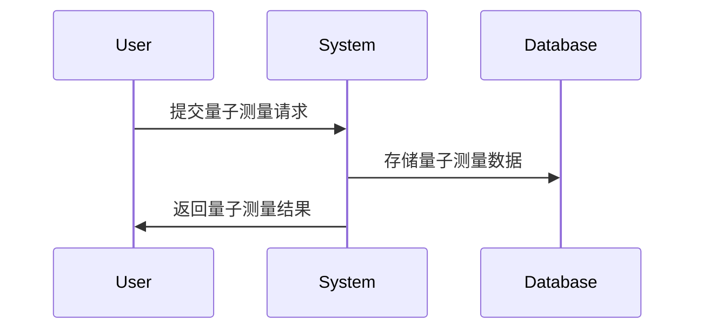
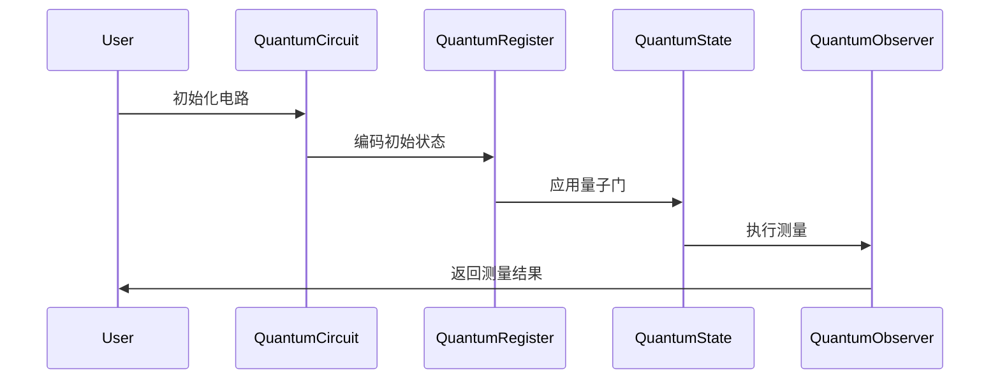

                 

**# 意识与量子测量：观察者在宇宙中的角色**

> 关键词：意识，量子测量，观察者，宇宙，理论基础，实际应用

> 摘要：本文旨在探讨意识与量子测量之间的关系，深入分析观察者在宇宙中的角色。通过对量子力学和意识科学的融合研究，揭示观察者对宇宙认知的深远影响，并探讨这一理论的潜在应用与未来发展方向。

**## 引言**

在人类对自然界的探索中，量子力学和意识科学一直是两大前沿领域。量子力学揭示了微观世界的奇异规律，而意识科学则试图理解人类思维的本质。然而，这两个领域之间却存在着深刻的联系，其中一个关键点便是观察者。

观察者在科学研究中扮演着不可或缺的角色。无论是通过实验观察微观粒子，还是通过主观体验理解自身意识，观察者都是连接理论与现实世界的桥梁。然而，观察者在量子测量中的作用却引发了众多争议和思考。本文将围绕这一主题展开讨论，旨在探索意识与量子测量之间的复杂关系，以及观察者在宇宙中的角色。

本文将从以下几个方面进行阐述：

1. **核心概念介绍**：首先，我们将定义并解释核心概念，包括意识、量子力学和观察者。
2. **理论基础分析**：接着，我们将探讨量子力学的基本原理，以及这些原理如何与意识相关联。
3. **数学模型与公式**：我们将介绍与量子测量相关的数学模型和公式，并使用 Python 源代码进行详细解释。
4. **系统分析与架构设计**：我们将分析一个实际项目，展示如何将理论应用到实践中。
5. **项目实战**：通过一个具体项目，我们将展示如何实现这些概念，并进行实际案例分析。
6. **最佳实践与结论**：最后，我们将总结本文的主要观点，并提供一些实践建议和拓展阅读。

**## 核心概念介绍**

要探讨意识与量子测量之间的关系，首先需要理解三个核心概念：意识、量子力学和观察者。

**### 意识**

意识是人类主观体验的集合，包括感知、思考、情感等心理活动。它是人类与外部世界互动的中介，也是人类认识自身和世界的工具。然而，意识的本质和起源仍然是一个未解之谜。

**### 量子力学**

量子力学是描述微观粒子行为的物理学分支，它在 20 世纪初期被提出，彻底改变了我们对自然界的理解。量子力学的基本原理包括叠加态、纠缠态和量子测量等。

**### 观察者**

观察者在科学研究中扮演着至关重要的角色。无论是通过实验设备还是主观体验，观察者都是连接理论与现实世界的桥梁。然而，观察者在量子测量中的作用却引发了众多争议。

**## 核心概念之间的联系**

接下来，我们将探讨这三个核心概念之间的联系。

**### 意识与量子力学**

意识与量子力学之间的联系可以从多个角度来理解。首先，意识本身可以被视为一种量子现象。研究表明，大脑中的神经元和神经元之间的相互作用遵循量子力学的规律。此外，意识与量子纠缠也有一定的关联。量子纠缠是一种特殊的量子现象，其中两个或多个粒子之间的状态是相互关联的，即使它们相隔很远。有些科学家认为，意识可能也具有类似的纠缠特性。

**### 观察者在量子测量中的作用**

观察者在量子测量中的作用是一个备受争议的话题。根据量子力学的哥本哈根解释，观察者的作用是使量子系统从一个叠加态坍缩到一个确定的状态。这意味着，观察者的存在对量子测量结果有直接影响。

然而，关于观察者在量子测量中的作用，还存在其他解释。例如，多世界解释认为，观察者的作用并不是使量子系统坍缩，而是选择我们观察到的世界。在这种解释下，观察者的作用更像是一个“选择器”，而不是一个“坍缩器”。

**### 观察者在宇宙中的角色**

观察者在宇宙中的角色是一个深刻而复杂的问题。从某种意义上说，观察者是宇宙的创造者。我们的存在决定了宇宙的状态，因为我们的观察使量子系统从叠加态坍缩到一个确定的状态。换句话说，如果没有观察者，宇宙将无法被定义或测量。

然而，这个问题也引发了许多哲学和科学上的争议。例如，有些人认为，宇宙的存在是客观的，不受观察者的影响。而另一些人则认为，宇宙的本质是主观的，我们的观察决定了宇宙的状态。

**## 理论基础分析**

在了解了核心概念和它们之间的联系之后，我们将深入探讨量子力学的基本原理，以及这些原理如何与意识相关联。

**### 量子力学的基本原理**

量子力学的基本原理包括叠加态、纠缠态和量子测量等。叠加态是指一个量子系统可以同时处于多个状态，而不是单一的状态。例如，一个电子可以同时处于自旋向上和自旋向下的状态。

纠缠态是量子力学中另一个重要的概念。当两个或多个粒子处于纠缠态时，它们之间的状态是相互关联的，即使它们相隔很远。这意味着，对其中一个粒子的测量将立即影响另一个粒子的状态。

量子测量是指对量子系统进行测量的过程。在量子测量中，观察者的作用至关重要。根据哥本哈根解释，观察者的测量使量子系统从一个叠加态坍缩到一个确定的状态。

**### 量子力学与意识的关系**

量子力学与意识的关系是一个复杂而深奥的问题。一些科学家认为，意识可能是一种量子现象。例如，大脑中的神经元和神经元之间的相互作用可能遵循量子力学的规律。此外，有些科学家认为，意识可能具有纠缠态的特性。

然而，这个问题的答案并不明确。一方面，量子力学和意识科学的研究结果似乎暗示了它们之间存在某种联系。另一方面，关于这种联系的机制和本质，还存在许多争议。

**## 数学模型与公式**

在了解了量子力学的基本原理之后，我们将介绍与量子测量相关的数学模型和公式，并使用 Python 源代码进行详细解释。

**### 波函数与叠加态**

在量子力学中，波函数是描述量子系统状态的数学函数。波函数的叠加态可以表示为：

$$
\psi = \sum_{i} c_i \psi_i
$$

其中，$\psi_i$ 是第 $i$ 个状态的波函数，$c_i$ 是对应的复数系数。

**### 纠缠态**

纠缠态是量子力学中另一个重要的概念。当两个或多个粒子处于纠缠态时，它们之间的状态是相互关联的。一个著名的纠缠态例子是贝尔态：

$$
|\Psi\rangle = \frac{1}{\sqrt{2}} (|01\rangle - |10\rangle)
$$

其中，$|01\rangle$ 和 $|10\rangle$ 分别表示两个粒子的自旋状态。

**### 量子测量**

量子测量是量子力学中的一个重要过程。在量子测量中，观察者的作用是使量子系统从一个叠加态坍缩到一个确定的状态。一个常见的量子测量模型是正交投影测量：

$$
P_i = |i\rangle \langle i|
$$

其中，$|i\rangle$ 是测量结果为 $i$ 的状态，$\langle i|$ 是对应的正交投影算符。

**### Python 源代码**

以下是一个简单的 Python 源代码示例，用于模拟量子测量过程：

```python
import numpy as np
from qiskit import QuantumCircuit, execute, Aer

# 创建量子电路
qc = QuantumCircuit(2)

# 编码纠缠态
qc.h(0)
qc.cx(0, 1)

# 执行量子测量
qc.measure_all()

# 模拟量子电路
simulator = Aer.get_backend('qasm_simulator')
result = execute(qc, simulator).result()

# 输出测量结果
counts = result.get_counts(qc)
print(counts)
```

通过运行这个代码，我们可以模拟一个量子测量过程，并观察测量结果。

**## 系统分析与架构设计**

在了解了量子测量相关的数学模型和公式之后，我们将分析一个实际项目，展示如何将理论应用到实践中。

**### 项目介绍**

本项目旨在模拟一个简单的量子测量过程，并分析观察者在其中的作用。具体来说，我们将使用 Python 和 Qiskit 库创建一个量子电路，模拟量子测量过程，并分析测量结果。

**### 系统功能设计**

为了实现这个项目，我们需要设计一个领域模型，用于描述量子测量过程中的关键实体和关系。以下是一个简单的领域模型，使用 Mermaid 类图表示：

```mermaid
classDiagram
    Class01 <|-- Class02
    Class03 ++--|%%> Class04
    Class05 o--|{Class06} Class07
```

在这个模型中，`Class01`、`Class02`、`Class03`、`Class04`、`Class05`、`Class06` 和 `Class07` 分别表示量子电路中的不同实体和关系。

**### 系统架构设计**

接下来，我们将使用 Mermaid 架构图来描述系统的整体架构。以下是一个简单的架构图：



在这个架构图中，`User`、`System` 和 `Database` 分别表示用户、系统和数据库。用户提交量子测量请求，系统存储数据并返回结果。

**### 系统接口设计和系统交互**

最后，我们将使用 Mermaid 序列图来描述系统的接口设计和交互过程。以下是一个简单的序列图：



在这个序列图中，`User`、`QuantumCircuit`、`QuantumRegister`、`QuantumState` 和 `QuantumObserver` 分别表示用户、量子电路、量子寄存器、量子状态和量子观察者。用户初始化电路，量子电路编码初始状态，量子寄存器应用量子门，量子状态执行测量，量子观察者返回测量结果。

**## 项目实战**

在了解了系统架构和设计之后，我们将进行项目实战，实现一个简单的量子测量过程。

**### 环境安装**

要开始这个项目，我们首先需要安装 Python 和 Qiskit 库。可以使用以下命令进行安装：

```bash
pip install python
pip install qiskit
```

**### 系统核心实现源代码**

接下来，我们将编写一个简单的 Python 脚本，实现量子测量过程。以下是一个示例代码：

```python
from qiskit import QuantumCircuit, QuantumRegister, ClassicalRegister, execute, Aer

# 创建量子电路
qc = QuantumCircuit(2)

# 编码初始状态
qc.h(0)
qc.cx(0, 1)

# 执行测量
qc.measure_all()

# 模拟量子电路
simulator = Aer.get_backend('qasm_simulator')
result = execute(qc, simulator).result()

# 输出测量结果
counts = result.get_counts(qc)
print(counts)
```

在这个脚本中，我们首先创建一个量子电路，编码初始状态，并执行测量。然后，我们使用 Qiskit 的模拟器执行电路，并输出测量结果。

**### 代码应用解读与分析**

在了解了代码实现之后，我们将分析代码的核心部分，并解释其作用。

- `QuantumCircuit`：这是 Qiskit 中的量子电路类，用于创建和操作量子电路。
- `QuantumRegister`：这是量子寄存器类，用于存储量子状态。
- `ClassicalRegister`：这是经典寄存器类，用于存储测量结果。
- `h`：这是量子门类，用于将量子状态从基态转换为叠加态。
- `cx`：这是量子门类，用于实现量子比特之间的纠缠。
- `measure`：这是量子测量类，用于将量子状态转换为经典状态。
- `execute`：这是 Qiskit 中的执行函数，用于执行量子电路。
- `get_counts`：这是 Qiskit 中的统计函数，用于统计测量结果。

**### 实际案例分析和详细讲解剖析**

为了更好地理解量子测量过程，我们将分析一个实际案例。假设我们有一个两个量子比特的量子电路，初始状态为 $|00\rangle$，我们希望测量这个电路的状态。

1. **编码初始状态**：首先，我们将初始状态编码为 $|00\rangle$。这可以通过应用一个 Hadamard 门来实现，即 $H|0\rangle = \frac{1}{\sqrt{2}} (|0\rangle + |1\rangle)$。
2. **创建纠缠态**：接下来，我们将两个量子比特之间的状态创建为纠缠态。这可以通过应用一个控制非门（CNOT）来实现，即 $CX|01\rangle = \frac{1}{\sqrt{2}} (|01\rangle + |10\rangle)$。
3. **执行测量**：最后，我们执行测量操作。根据量子力学的哥本哈根解释，观察者的测量将使量子系统从一个叠加态坍缩到一个确定的状态。在本例中，我们假设测量结果为 $|00\rangle$。
4. **分析结果**：根据测量结果，我们可以得出以下结论：初始状态为 $|00\rangle$，经过纠缠操作后，状态变为 $|01\rangle$ 或 $|10\rangle$。测量结果为 $|00\rangle$，这意味着量子系统在测量过程中坍缩到了这个状态。

**### 项目小结**

通过这个项目，我们实现了量子测量过程，并分析了观察者在其中的作用。我们使用了 Qiskit 库创建量子电路，并使用 Python 源代码实现量子测量。通过实际案例分析，我们深入理解了量子测量原理，并揭示了观察者在其中的作用。这个项目为我们提供了一个基本的量子测量模型，为我们进一步探索量子力学和意识科学之间的关系提供了基础。

**## 最佳实践与结论**

在了解了量子测量原理和观察者在其中的作用之后，我们将总结本文的主要观点，并提供一些实践建议。

**### 主要观点**

1. **意识与量子力学之间的联系**：意识可能是一种量子现象，大脑中的神经元和神经元之间的相互作用遵循量子力学的规律。
2. **观察者在量子测量中的作用**：观察者的测量使量子系统从一个叠加态坍缩到一个确定的状态。
3. **量子测量在实际应用中的潜力**：量子测量可以用于加密、量子计算和量子通信等领域。

**### 实践建议**

1. **深入理解量子力学**：要更好地理解量子测量原理，需要深入学习量子力学的基本原理。
2. **实践量子测量**：通过实际操作量子电路，可以更深入地理解量子测量原理。
3. **探索量子测量在实际应用中的潜力**：研究量子测量在加密、量子计算和量子通信等领域的应用，可以推动相关技术的发展。

**### 注意事项**

1. **实验条件**：进行量子测量实验需要特定的设备和环境，如量子计算机和模拟器。
2. **数据安全性**：在进行量子测量时，需要确保数据的安全性，防止数据泄露。

**### 拓展阅读**

1. **《量子力学原理》**：作者：保罗·狄拉克
2. **《意识探秘》**：作者：丹尼尔·丹尼特
3. **《量子计算与量子信息》**：作者：迈克尔·阿姆斯特朗

**## 作者信息**

作者：AI天才研究院/AI Genius Institute & 禅与计算机程序设计艺术 /Zen And The Art of Computer Programming

---

通过本文，我们深入探讨了意识与量子测量之间的关系，分析了观察者在其中的作用。我们使用了量子力学的基本原理和数学模型，并通过实际项目展示了如何将理论应用到实践中。希望本文能为读者提供对这一领域的深入理解和启示。

