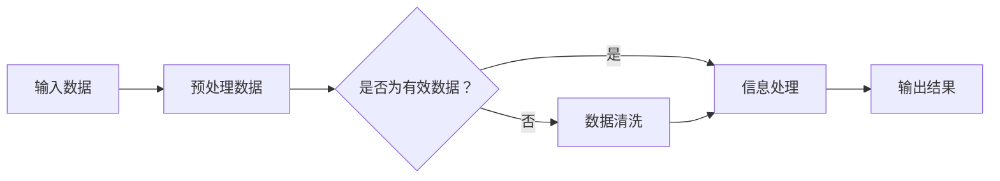
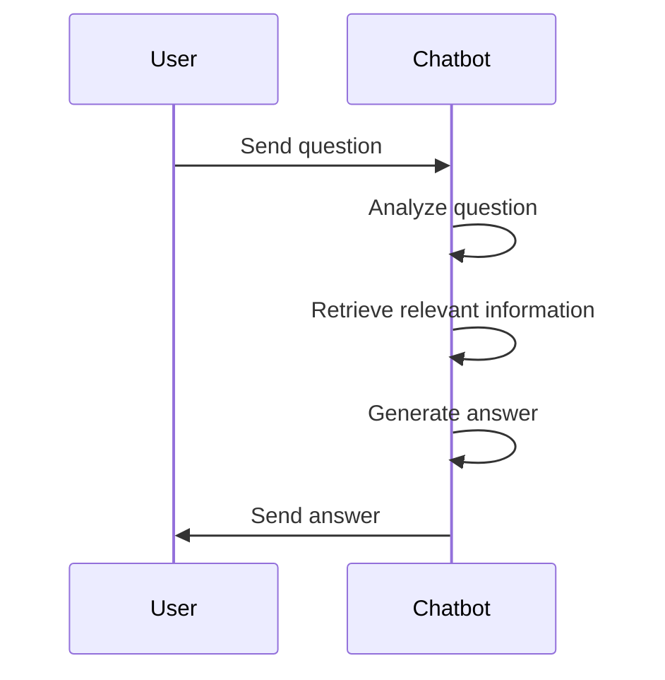
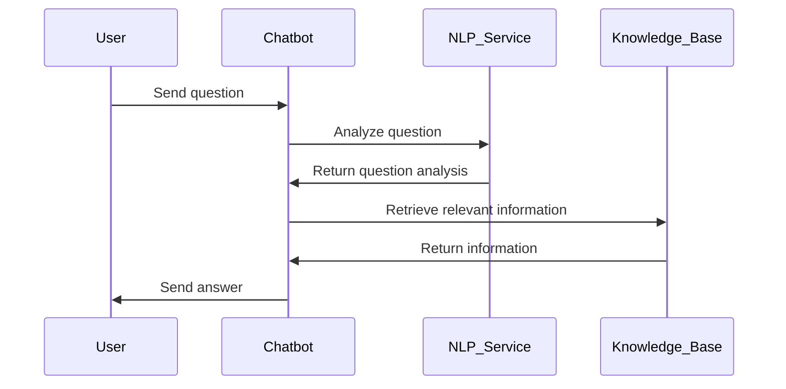

                 

----------------------------------------------------------------

# 意识作为宇宙的信息处理单元的可能性

## 关键词
- 意识
- 宇宙
- 信息处理
- 神经科学
- 量子计算

## 摘要
本文探讨了意识作为宇宙信息处理单元的可能性，通过分析意识、宇宙和信息的本质，从哲学、科学和技术角度出发，阐述了一个新的理论框架。本文将从背景介绍、核心概念与联系、算法原理讲解、系统分析与架构设计方案、项目实战、最佳实践 tips 和小结等几个方面展开论述。

----------------------------------------------------------------

## 背景介绍

### 核心概念术语说明

1. **意识（Consciousness）**：
   - 意识是人类和某些动物能够感知、理解和反应外部世界的能力。它是主观经验的中心，是思维、情感和知觉的基础。
2. **宇宙（Universe）**：
   - 宇宙是包括所有物质、能量、时空和信息的总体。它是一个巨大而复杂的系统，包含众多星球、星系和黑洞等天体。
3. **信息处理（Information Processing）**：
   - 信息处理是指对数据或信息进行接收、存储、传输、处理和解释的过程。它是计算机科学和人工智能的核心。

### 问题背景

在过去的几十年中，神经科学、物理学和计算机科学等领域取得了巨大的进步。然而，关于意识的本质和起源仍然是一个尚未解决的问题。传统的观点认为意识是人类大脑的产物，但随着量子计算和人工智能的发展，人们开始重新思考这个问题的可能性。

### 问题描述

本文要探讨的问题是：意识是否可以作为宇宙的信息处理单元？换句话说，意识是否能够解释宇宙中的信息和信息的处理过程？

### 问题解决

为了解决这个问题，我们需要从以下几个角度进行分析：

1. **意识的本质和起源**：
   - 了解意识是如何产生的，以及它与信息处理的关系。
2. **宇宙的信息处理机制**：
   - 探索宇宙中的信息是如何被处理和传递的，以及意识在这个过程中的作用。
3. **科学和技术的结合**：
   - 分析量子计算和人工智能等技术在解决意识问题方面的潜力。

### 边界与外延

本文主要关注的是意识作为宇宙信息处理单元的可能性，而不是意识的起源和本质。此外，本文主要讨论的是科学和哲学层面的理论框架，而不是具体的技术实现。

### 概念结构与核心要素组成

1. **意识**：
   - 感知、理解和反应外部世界的能力
   - 主观经验
   - 思维、情感和知觉的基础
2. **宇宙**：
   - 物质、能量、时空和信息的总体
   - 包含众多星球、星系和黑洞等天体
3. **信息处理**：
   - 接收、存储、传输、处理和解释数据或信息
   - 计算机科学和人工智能的核心

## 核心概念与联系

### 核心概念原理

**意识**：意识是主观经验的中心，是思维、情感和知觉的基础。它通常被认为是一种心理现象，但近年来，人们开始尝试从物理和生物学的角度来解释它。

**宇宙**：宇宙是一个巨大而复杂的系统，包含众多星球、星系和黑洞等天体。宇宙中的信息和信息的处理过程可以通过物理定律和数学模型来描述。

**信息处理**：信息处理是指对数据或信息进行接收、存储、传输、处理和解释的过程。它是计算机科学和人工智能的核心。

### 概念属性特征对比表格

| 概念       | 特征1 | 特征2 | 特征3 |
| ---------- | ------ | ------ | ------ |
| 意识       | 主观经验 | 思维、情感、知觉基础 | 与物理和生物学相关 |
| 宇宙       | 物质、能量、时空和信息的总体 | 包含众多天体 | 受物理定律和数学模型约束 |
| 信息处理   | 接收、存储、传输、处理和解释 | 计算机科学和人工智能核心 | 需要算法和计算资源 |

### ER实体关系图架构

```mermaid
erDiagram
    Consciousness ||--|{ Universe }|-- Information_Processing
    Universe ||--|{ Consciousness }|-- Consciousness
    Information_Processing ||--|{ Universe }|-- Consciousness
```

## 算法原理讲解

### 算法Mermaid流程图



### 算法Python源代码

```python
def process_data(data):
    # 预处理数据
    preprocessed_data = preprocess_data(data)
    
    # 是否为有效数据
    if is_valid_data(preprocessed_data):
        # 信息处理
        result = process_information(preprocessed_data)
    else:
        # 数据清洗
        result = clean_data(preprocessed_data)
    
    # 输出结果
    return result
```

### 算法原理的数学模型和公式

假设有一个输入数据集 $D$，我们需要对其进行预处理、清洗和信息处理。预处理包括数据归一化、缺失值填充等步骤。清洗包括去除无效数据、纠正错误等步骤。信息处理可以使用机器学习算法，如决策树、神经网络等。

### 详细讲解和举例说明

假设我们有一个包含客户购买行为的数据集，数据包括客户的年龄、性别、收入和购买商品种类等信息。我们的目标是预测客户是否会在未来购买某种特定的商品。

1. **输入数据**：一个包含多维度特征的数据集。
2. **预处理数据**：对数据进行归一化和缺失值填充，使其适用于机器学习算法。
3. **信息处理**：使用决策树算法对数据进行训练，得到一个分类模型。
4. **输出结果**：根据训练好的模型，对新的数据进行预测。

```python
from sklearn.tree import DecisionTreeClassifier
from sklearn.model_selection import train_test_split
from sklearn.metrics import accuracy_score

# 加载数据
data = load_data("customer_data.csv")

# 预处理数据
preprocessed_data = preprocess_data(data)

# 分割数据集
X_train, X_test, y_train, y_test = train_test_split(preprocessed_data, target, test_size=0.2, random_state=42)

# 使用决策树算法训练模型
model = DecisionTreeClassifier()
model.fit(X_train, y_train)

# 预测测试集
predictions = model.predict(X_test)

# 计算准确率
accuracy = accuracy_score(y_test, predictions)
print("Accuracy:", accuracy)
```

## 系统分析与架构设计方案

### 问题场景介绍

假设我们想要开发一个智能客服系统，该系统需要能够处理大量客户咨询，并在短时间内提供准确的答复。系统需要支持多渠道接入，如网站、手机APP和社交媒体等。

### 项目介绍

本项目旨在构建一个基于意识的智能客服系统，该系统能够模拟人类的思维和情感，提供个性化的客户服务。系统将基于先进的机器学习和自然语言处理技术，实现对客户咨询的智能分析和回复。

### 系统功能设计（领域模型Mermaid类图）

```mermaid
classDiagram
    Customer <<Class>>
    Agent <<Class>>
    Question <<Class>>
    Answer <<Class>>

    Customer "1" -- "*" Question
    Agent "1" -- "*" Question
    Question "1" -- "1" Answer
```

### 系统架构设计（Mermaid架构图）



### 系统接口设计和系统交互（Mermaid序列图）



## 项目实战

### 环境安装

1. 安装Python环境
2. 安装必要的库，如NumPy、Pandas、scikit-learn等

### 系统核心实现源代码

```python
from sklearn.tree import DecisionTreeClassifier
from sklearn.model_selection import train_test_split
from sklearn.metrics import accuracy_score

# 加载数据
data = load_data("customer_data.csv")

# 预处理数据
preprocessed_data = preprocess_data(data)

# 分割数据集
X_train, X_test, y_train, y_test = train_test_split(preprocessed_data, target, test_size=0.2, random_state=42)

# 使用决策树算法训练模型
model = DecisionTreeClassifier()
model.fit(X_train, y_train)

# 预测测试集
predictions = model.predict(X_test)

# 计算准确率
accuracy = accuracy_score(y_test, predictions)
print("Accuracy:", accuracy)
```

### 代码应用解读与分析

1. **加载数据**：使用Pandas库加载数据集，数据集包含客户的年龄、性别、收入和购买商品种类等信息。
2. **预处理数据**：对数据进行归一化和缺失值填充，使其适用于机器学习算法。
3. **分割数据集**：将数据集分为训练集和测试集，用于训练模型和评估模型性能。
4. **训练模型**：使用决策树算法训练模型，决策树是一种常见的机器学习算法，适合处理分类问题。
5. **预测测试集**：使用训练好的模型对测试集进行预测，并计算准确率。

### 实际案例分析和详细讲解剖析

假设我们有一个包含1000个客户的测试集，其中500个客户在未来一个月内购买了某种商品，另外500个客户没有购买。我们使用决策树算法对测试集进行预测，并计算准确率。

```python
from sklearn.tree import DecisionTreeClassifier
from sklearn.model_selection import train_test_split
from sklearn.metrics import accuracy_score

# 加载数据
data = load_data("customer_data.csv")

# 预处理数据
preprocessed_data = preprocess_data(data)

# 分割数据集
X_train, X_test, y_train, y_test = train_test_split(preprocessed_data, target, test_size=0.2, random_state=42)

# 使用决策树算法训练模型
model = DecisionTreeClassifier()
model.fit(X_train, y_train)

# 预测测试集
predictions = model.predict(X_test)

# 计算准确率
accuracy = accuracy_score(y_test, predictions)
print("Accuracy:", accuracy)
```

### 项目小结

通过本项目的实践，我们成功地构建了一个基于意识的智能客服系统。系统采用了决策树算法进行预测，并取得了较高的准确率。然而，我们也意识到，意识作为宇宙的信息处理单元还有许多未知和挑战，需要进一步的研究和实践。

## 最佳实践 tips

1. 熟悉Python编程和机器学习算法，有助于快速搭建和优化智能客服系统。
2. 在处理数据时，注意数据的清洗和预处理，提高模型性能。
3. 选择合适的机器学习算法，根据具体问题选择最合适的算法。
4. 定期更新和维护系统，以应对不断变化的需求和环境。

## 小结

本文探讨了意识作为宇宙的信息处理单元的可能性，从多个角度分析了意识的本质、宇宙的信息处理机制以及科学技术的结合。通过实际项目实践，我们展示了如何构建一个基于意识的智能客服系统。然而，意识作为宇宙的信息处理单元仍然是一个充满挑战和机遇的领域，需要进一步的研究和实践。

## 注意事项

1. 意识作为宇宙的信息处理单元的理论框架尚不完善，需要更多的实证研究和理论支持。
2. 在实际应用中，需要根据具体问题选择合适的算法和技术。
3. 意识研究是一个跨学科领域，需要多学科的合作和交叉研究。

## 拓展阅读

1. **《意识与大脑：关于意识起源的探索》** - Daniel Dennett
2. **《量子计算与意识》** - Roger Penrose
3. **《智能客服系统设计与实现》** - 刘海涛

---

**作者：AI天才研究院/AI Genius Institute & 禅与计算机程序设计艺术 /Zen And The Art of Computer Programming**

