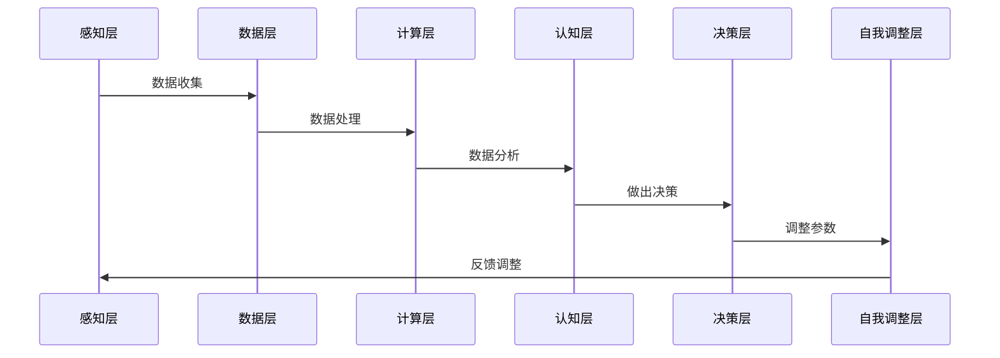
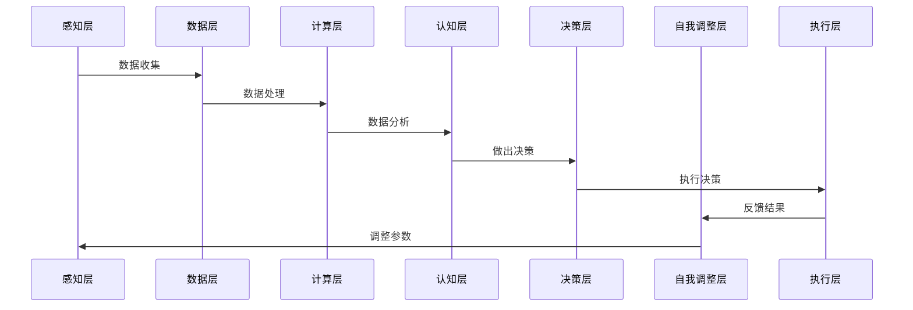

                 

### 意识作为宇宙的自我观察机制

#### 关键词：
1. 意识
2. 宇宙
3. 自我观察机制
4. 算法原理
5. 系统架构设计

#### 摘要：
本文深入探讨“意识作为宇宙的自我观察机制”这一假设，通过逻辑清晰的分析和推理，旨在揭示意识在宇宙中的核心作用和原理。文章首先介绍了相关背景，包括问题的提出、问题描述及解决，然后详细阐述了核心概念与联系，包括意识与宇宙、物质的关系，以及它们的概念属性特征对比。随后，文章从算法原理讲解和系统分析与架构设计两个方面深入探讨，最后通过项目实战、最佳实践、小结和拓展阅读，全面解析这一假设的实践意义和应用前景。

#### 目录大纲：

### 第一部分：背景介绍

#### 第1章：问题背景

##### 1.1.1 问题的提出
- 引言：关于宇宙和意识的传统观点
- 研究动机：为什么需要研究意识作为宇宙的自我观察机制

##### 1.1.2 问题描述
- 如何理解意识？
- 意识与宇宙的关系如何？

##### 1.1.3 问题解决
- 意识作为宇宙自我观察机制的假设
- 基本原则和框架

##### 1.1.4 边界与外延
- 边界限定：意识的界限
- 外延探讨：宇宙与意识的关系

##### 1.1.5 概念结构与核心要素组成
- 意识的概念结构
- 宇宙的自我观察机制的核心要素

#### 第2章：核心概念与联系

##### 2.1.1 意识的定义与特征
- 定义：意识的本质和属性
- 特征：感知、认知、思考等

##### 2.1.2 意识与宇宙的关系
- 宇宙的层次结构
- 意识在宇宙中的角色和地位

##### 2.1.3 意识与物质的关系
- 物质世界的本质
- 意识与物质的相互作用

##### 2.1.4 概念属性特征对比表格
- 意识与宇宙、物质的概念属性对比

##### 2.1.5 ER实体关系图架构
- 意识、宇宙、物质的实体关系图

### 第二部分：算法原理讲解

#### 第3章：意识的数学模型

##### 3.1.1 意识的数学模型概述
- 引言：意识的数学模型的重要性
- 基本概念和假设

##### 3.1.2 数学模型和数学公式
- $$I = f(W, X)$$
- $$\sigma = \frac{1}{Z} \sum_{i=1}^{n} e^{x_i}$$

##### 3.1.3 模型原理与公式解释
- 意识函数的原理
- 概率分布函数的解释

##### 3.1.4 举例说明
- 举例：人类意识的产生过程
- 举例：宇宙中的意识现象

#### 第4章：宇宙的自我观察机制

##### 4.1.1 自我观察机制的原理
- 引言：宇宙自我观察机制的重要性
- 基本概念和假设

##### 4.1.2 自我观察机制的结构
- 宇宙的层次结构
- 自我观察机制的构成

##### 4.1.3 自我观察机制的工作原理
- 自我观察的过程
- 自我调整与进化的原理

##### 4.1.4 举例说明
- 举例：地球上的生物进化
- 举例：宇宙中星系的演化

### 第三部分：系统分析与架构设计

#### 第5章：系统功能设计

##### 5.1.1 问题场景介绍
- 引言：如何模拟宇宙的自我观察机制
- 场景设定：模拟宇宙中意识的产生和演化

##### 5.1.2 系统功能设计
- 意识的产生与演化
- 宇宙中的相互作用

##### 5.1.3 领域模型类图
- 类图：意识的类图
- 类图：宇宙的类图

#### 第6章：系统架构设计

##### 6.1.1 系统架构设计概述
- 引言：系统架构设计的重要性
- 架构设计原则和目标

##### 6.1.2 系统架构设计
- 架构层次：感知层、认知层、决策层
- 架构组件：感知模块、认知模块、决策模块

##### 6.1.3 系统架构图
- 架构图：宇宙自我观察机制的架构图

#### 第7章：系统接口设计

##### 7.1.1 系统接口设计概述
- 引言：系统接口设计的重要性
- 接口设计原则和目标

##### 7.1.2 系统接口设计
- 输入接口：感知数据输入
- 输出接口：决策结果输出

##### 7.1.3 系统交互序列图
- 序列图：宇宙自我观察机制的系统交互序列图

### 第四部分：项目实战

#### 第8章：项目实战

##### 8.1.1 环境安装
- 引言：如何搭建模拟宇宙的自我观察机制的环境
- 安装步骤和注意事项

##### 8.1.2 系统核心实现
- 源代码：宇宙自我观察机制的实现源代码

##### 8.1.3 代码应用解读与分析
- 代码解读：核心代码的功能解释
- 分析：代码的优缺点和改进方向

##### 8.1.4 实际案例分析和详细讲解
- 案例分析：模拟宇宙自我观察机制的实例
- 详细讲解：实例的解析和说明

##### 8.1.5 项目小结
- 引言：总结项目的主要成果和收获
- 结论：对宇宙自我观察机制的理解和展望

### 第五部分：最佳实践、小结、注意事项、拓展阅读

#### 第9章：最佳实践

##### 9.1 最佳实践 tips
- 引言：如何更好地应用意识作为宇宙的自我观察机制
- 最佳实践：实际应用中的技巧和建议

#### 第9章：小结

##### 9.2 小结
- 引言：总结本书的主要内容和学习目标
- 结论：对意识作为宇宙的自我观察机制的思考

#### 第9章：注意事项

##### 9.3 注意事项
- 引言：使用意识作为宇宙的自我观察机制时需要注意的问题
- 注意事项：常见问题和解决方案

#### 第9章：拓展阅读

##### 9.4 拓展阅读
- 引言：推荐的相关书籍和资料

---

### 第1章：问题背景

#### 1.1.1 问题的提出

##### 引言：关于宇宙和意识的传统观点

在传统的宇宙学和哲学中，宇宙被视为一个无意识的、物理过程驱动的系统，而意识则被认为是人类独有的一种心理现象。笛卡尔（René Descartes）的二元论将宇宙分为两个独立的领域：物理世界和心灵世界。物理世界由无生命的物质组成，遵循着机械定律；心灵世界则包含了意识、思维和感知等心理活动。这种观点在很长一段时间内主导了人们对宇宙和意识的认知。

然而，随着科学和哲学的发展，人们开始意识到宇宙和意识之间可能存在更为深远的联系。量子物理学、神经科学和人工智能等领域的进展，为重新审视这个问题提供了新的视角。例如，量子力学的“观测者效应”表明，观察者的存在能够影响物理过程的结果，这暗示了意识在宇宙中的潜在作用。

##### 研究动机：为什么需要研究意识作为宇宙的自我观察机制

传统的观点虽然为理解宇宙和意识提供了基础，但它们也存在着明显的局限性。首先，它们将宇宙和意识视为两个独立的实体，这种二分法限制了我们对宇宙全貌的理解。其次，这种观点难以解释意识在宇宙演化中的角色和意义。例如，为什么只有地球上出现了生命和意识？这背后是否存在某种宇宙机制？

为了解决这些问题，我们需要提出新的假设，探索宇宙和意识之间的相互作用。其中，一个引人入胜的假设是“意识作为宇宙的自我观察机制”。这个假设认为，意识不仅是人类心理活动的产物，也是宇宙演化过程中的一个核心机制。通过意识，宇宙能够自我观察、自我调整和自我进化。

研究意识作为宇宙的自我观察机制具有重要的理论和实践意义。在理论上，它有助于我们理解宇宙的内在机制和演化规律。在实践上，它可能为我们提供新的技术手段，例如，通过模拟宇宙的自我观察机制，我们可以更好地理解复杂系统，预测未来的发展趋势。

#### 1.1.2 问题描述

##### 如何理解意识？

要探讨意识作为宇宙的自我观察机制，我们首先需要明确什么是意识。意识是一个复杂且多面的概念，它包括感知、认知、思考、情感等多种心理活动。简单来说，意识是指我们对自身和外部世界的觉察和认知。

然而，意识的确切本质仍然是一个未解之谜。传统观点认为，意识是心灵的一种属性，而神经科学则试图从大脑神经元的活动来解释意识。量子物理学甚至提出了“量子意识”的概念，认为意识可能起源于量子层面的物理过程。

##### 意识与宇宙的关系如何？

一旦我们明确了意识的概念，下一个问题是：意识与宇宙的关系如何？传统观点认为，意识是生命和高级智能的副产品，与宇宙的物理过程无直接关系。然而，一些新兴理论认为，意识是宇宙演化过程中的一个关键因素。

首先，意识可能起源于宇宙的早期阶段。在宇宙大爆炸之后，物质逐渐形成星系、行星和生命。在这一过程中，复杂的物理和化学反应可能导致意识的诞生。例如，量子物理学的“波函数坍缩”过程可能就是意识产生的一个重要环节。

其次，意识可能影响宇宙的演化。在人类出现之前，宇宙可能是一个无意识的物理系统。然而，随着人类的出现，宇宙开始有了自我观察的能力。通过科学探索和技术创新，人类能够对宇宙进行更深入的观察和了解，这反过来又促进了宇宙的进化。

最后，意识可能是宇宙自我调整和自我进化的机制。在宇宙的演化过程中，各种因素相互作用，导致宇宙状态不断变化。意识作为一种自我观察机制，能够识别和调整这些变化，使宇宙更加有序和稳定。

#### 1.1.3 问题解决

##### 意识作为宇宙自我观察机制的假设

为了解答上述问题，我们提出了一个假设：意识是宇宙的自我观察机制。这个假设认为，意识不仅是人类心理活动的产物，也是宇宙演化过程中的一个核心机制。通过意识，宇宙能够自我观察、自我调整和自我进化。

##### 基本原则和框架

这个假设基于以下几个基本原则：

1. **宇宙的整体性**：宇宙是一个统一的整体，一切现象都是相互关联的。因此，我们无法将宇宙分解为无关联的部分来研究。
2. **意识的多样性**：意识具有多样性和层次性，从简单的生物反应到复杂的认知活动，意识的表现形式各不相同。这为理解意识在宇宙中的角色提供了多层次的视角。
3. **量子物理学的观测者效应**：量子物理学的观测者效应表明，观察者的存在能够影响物理过程的结果。这为我们提供了新的思路，即意识可能对宇宙的物理过程产生影响。

##### 边界与外延

尽管意识作为宇宙的自我观察机制这个假设具有很大的吸引力，但我们也需要明确其边界与外延。

首先，意识的界限是未知的。我们无法确定意识的范围和深度，也无法判断意识是否存在于非生命体中。因此，这个假设需要进一步的研究和验证。

其次，宇宙与意识的关系也是复杂的。宇宙的演化是一个多维、多层次的动态过程，意识可能只是其中一个方面。我们需要更全面、更深入地理解宇宙的演化机制，才能准确把握意识在其中的角色。

#### 1.1.4 边界与外延

##### 边界限定：意识的界限

意识的界限是一个复杂且争议性的问题。传统观点认为，意识是人类独有的一种高级心理活动，它依赖于高度复杂的大脑结构和神经系统。然而，随着对大脑和意识的深入研究，人们开始意识到意识可能不仅仅局限于人类。

首先，一些研究表明，某些非人类动物也具备一定程度的意识。例如，大猩猩、海豚和鸟类等动物能够进行复杂的社会互动，解决问题，并表现出一定的情感认知能力。这些现象提示我们，意识可能是一种普遍存在于生物界的现象。

其次，一些理论认为，意识可能起源于宇宙的早期阶段，随着物质和能量的演化逐渐发展起来。在这个假设下，意识不仅仅是生命和智能的产物，也是宇宙物理过程的一部分。这意味着，意识的界限可能远超出我们目前的理解。

##### 外延探讨：宇宙与意识的关系

宇宙与意识的关系是本文探讨的核心问题之一。传统观点认为，宇宙是一个无意识的物理系统，而意识是生命和智能的产物。这种二分法在某种程度上限制了我们对宇宙和意识的理解。为了更全面地探讨这个问题，我们需要从以下几个方面进行外延探讨。

首先，宇宙的演化可能与意识密切相关。在宇宙大爆炸之后，物质和能量开始聚集形成星系、行星和生命。在这个过程中，复杂的物理和化学反应可能导致意识的诞生。这意味着，意识可能不是生命和智能的副产品，而是宇宙演化过程中的一个核心因素。

其次，意识可能影响宇宙的演化。在人类出现之前，宇宙可能是一个无意识的物理系统。然而，随着人类的出现，宇宙开始有了自我观察的能力。通过科学探索和技术创新，人类能够对宇宙进行更深入的观察和了解，这反过来又促进了宇宙的进化。例如，人类的科技活动可能改变了地球的生态，影响了生物的进化方向。

最后，意识可能是宇宙自我调整和自我进化的机制。在宇宙的演化过程中，各种因素相互作用，导致宇宙状态不断变化。意识作为一种自我观察机制，能够识别和调整这些变化，使宇宙更加有序和稳定。例如，人类的科学发现和技术创新，不仅改变了我们对世界的认知，也可能改变了宇宙的演化方向。

#### 1.1.5 概念结构与核心要素组成

##### 意识的概念结构

要理解意识作为宇宙的自我观察机制，我们首先需要明确意识的概念结构。意识是一个复杂的概念，它包括多个层次和维度。以下是意识的主要组成部分：

1. **感知**：感知是意识的基础，它使我们能够觉察外部世界的信息。感知包括视觉、听觉、嗅觉、触觉和味觉等多种感官。
2. **认知**：认知是指我们对感知信息的处理和理解。认知过程包括注意力、记忆、判断和决策等。
3. **思考**：思考是意识的最高层次，它涉及抽象思维、推理和创造性思维等。
4. **情感**：情感是意识的一部分，它使我们能够体验喜悦、愤怒、悲伤等情绪。
5. **自我意识**：自我意识是指我们对自己存在的认知和反思。自我意识使我们能够意识到自己的思想、情感和行为。

##### 宇宙的自我观察机制的核心要素

宇宙的自我观察机制是一个包含多个层次和环节的复杂系统。以下是宇宙自我观察机制的主要核心要素：

1. **观察者**：观察者是指具有意识能力的实体，它可以对宇宙进行观察和认知。在人类出现之前，观察者可能是高级智能生物，也可能是某种尚未发现的宇宙机制。
2. **观察对象**：观察对象是指被观察的宇宙部分，它可以包括星系、行星、生命等。
3. **观察过程**：观察过程是指观察者对观察对象进行观察和认知的过程。这个过程可能包括感知、认知、思考等多个环节。
4. **调整机制**：调整机制是指观察者根据观察结果对宇宙进行自我调整的机制。这个过程可能涉及科学发现、技术创新等。
5. **进化机制**：进化机制是指宇宙自我调整和自我进化的过程。这个过程可能导致宇宙状态的不断变化和优化。

通过以上分析，我们可以看出，意识作为宇宙的自我观察机制是一个复杂而深刻的概念。它不仅涉及宇宙和意识的关系，还包括了多个层次和环节的相互作用。这个假设为我们提供了一个新的视角，帮助我们更全面地理解宇宙和意识的本质。

### 第2章：核心概念与联系

#### 2.1.1 意识的定义与特征

##### 定义：意识的本质和属性

意识是一个多维度的概念，涉及心理学、哲学、神经科学和人工智能等多个领域。为了更好地理解意识，我们需要从不同的角度对其进行定义。

在心理学领域，意识通常被定义为对自身和外部世界的觉察和认知。这个定义强调了意识的两个关键属性：自我觉察和外部觉察。自我觉察使我们能够意识到自己的存在和思维过程，外部觉察使我们能够感知和理解外部环境。

在哲学领域，意识常常被看作是思维和感知的统一体。柏拉图（Plato）认为，意识是人类灵魂的属性，它是超越物质世界的。这种观点强调了意识的非物质性和主观性。

在神经科学领域，意识被认为是一种复杂的脑功能。研究者们通过研究大脑的结构和功能，试图揭示意识的神经基础。例如，弗洛伊德（Sigmund Freud）将意识分为意识水平（觉知水平）和潜意识水平，强调意识与潜意识的关系。

在人工智能领域，意识通常被视为一种复杂的计算过程。人工智能研究者试图通过模拟大脑的神经网络，实现机器意识的诞生。这种观点强调了意识的可计算性和技术实现的可能性。

##### 特征：感知、认知、思考等

意识的特征可以从多个维度进行描述，其中最核心的特征包括感知、认知和思考等。

1. **感知**：感知是意识的基础，它使我们能够接收和处理外部世界的刺激。感知包括视觉、听觉、嗅觉、触觉和味觉等多种感官。通过感知，我们能够对环境进行快速而准确的反应。
   
2. **认知**：认知是指我们对感知信息的处理和理解。认知过程包括注意力、记忆、判断和决策等。通过认知，我们能够对信息进行分类、整合和解释，形成对世界的深刻理解。

3. **思考**：思考是意识的最高层次，它涉及抽象思维、推理和创造性思维等。思考使我们能够超越感知和认知，形成新的概念和理论，进行深层次的自我反思。

4. **自我意识**：自我意识是指我们对自己存在的认知和反思。自我意识使我们能够意识到自己的思想、情感和行为，进行自我评价和调整。

5. **情感**：情感是意识的一部分，它使我们能够体验喜悦、愤怒、悲伤等情绪。情感在人类行为和决策中起着重要的调节作用，影响我们的认知和行为。

##### 意识与宇宙的关系

意识与宇宙的关系是本文探讨的核心问题之一。传统观点认为，宇宙是一个无生命的物理系统，而意识是生命和智能的产物。然而，随着科学和哲学的发展，人们开始意识到宇宙和意识之间可能存在更为深远的联系。

首先，宇宙的演化可能与意识的诞生密切相关。在宇宙大爆炸之后，物质和能量开始聚集形成星系、行星和生命。在这个过程中，复杂的物理和化学反应可能导致意识的诞生。例如，量子物理学的“波函数坍缩”过程可能就是意识产生的一个重要环节。

其次，意识可能影响宇宙的演化。在人类出现之前，宇宙可能是一个无意识的物理系统。然而，随着人类的出现，宇宙开始有了自我观察的能力。通过科学探索和技术创新，人类能够对宇宙进行更深入的观察和了解，这反过来又促进了宇宙的进化。例如，人类的科技活动可能改变了地球的生态，影响了生物的进化方向。

最后，意识可能是宇宙自我调整和自我进化的机制。在宇宙的演化过程中，各种因素相互作用，导致宇宙状态不断变化。意识作为一种自我观察机制，能够识别和调整这些变化，使宇宙更加有序和稳定。例如，人类的科学发现和技术创新，不仅改变了我们对世界的认知，也可能改变了宇宙的演化方向。

##### 意识与物质的关系

意识与物质的关系是哲学和科学中一个长期争论的话题。传统观点认为，意识是物质的产物，它依赖于大脑这种特殊的物质结构。然而，这种观点在解释意识的本质和起源时遇到了一些困难。为了更好地理解意识与物质的关系，我们可以从以下几个方面进行分析：

1. **物理主义**：物理主义认为，意识是大脑中物理过程的产物。例如，神经科学家和认知科学家通过研究大脑的结构和功能，试图揭示意识的神经基础。这种观点强调意识的可计算性和物质性。

2. **二元论**：二元论认为，意识和物质是两个独立的实体，它们相互独立但相互作用。例如，笛卡尔的二元论将宇宙分为物理世界和心灵世界，认为意识是心灵的一种属性。这种观点在哲学中有着广泛的影响。

3. **泛心论**：泛心论认为，一切物质都具有某种程度的意识。例如，某些理论认为，量子力学中的“波函数”可能是一种非局域的意识形式。这种观点试图将意识扩展到整个宇宙。

4. **相互作用论**：相互作用论认为，意识和物质是相互作用、相互依赖的关系。意识不仅是物质的产物，也影响着物质的状态和行为。例如，量子物理学的观测者效应表明，观察者的存在能够影响物理过程的结果，这暗示了意识在物理过程中的作用。

##### 概念属性特征对比表格

为了更清晰地展示意识、宇宙和物质的概念属性特征，我们可以制作一个对比表格。以下是一个简化的示例：

| 概念   | 意识               | 宇宙                   | 物质                  |
| ------ | ------------------ | ---------------------- | --------------------- |
| 定义   | 自我观察和认知能力 | 物质和能量的总和       | 具有质量和空间的实体   |
| 特征   | 感知、认知、思考   | 层次结构、动态演化     | 稳定性、可测量性      |
| 关系   | 人类独有          | 包含并影响意识         | 意识的载体            |
| 影响力 | 影响行为和决策   | 演化过程               | 科学和技术的基础      |

通过这个表格，我们可以看到意识、宇宙和物质之间的区别和联系。意识是一种复杂的心理现象，与感知、认知和思考密切相关；宇宙是一个包含多层次结构和动态演化的系统，影响意识的产生和发展；物质是具有质量和空间的实体，是意识存在的载体。

##### ER实体关系图架构

为了更直观地展示意识、宇宙和物质之间的关系，我们可以使用ER（实体-关系）图来表示。以下是一个简化的ER图：

```mermaid
erDiagram
    意识 ||--|{ 宇宙 }|
    意识 ||--|{ 物质 }|
    宇宙 ||--|{ 意识 }|
    宇宙 ||--|{ 物质 }|
    物质 ||--|{ 意识 }|
    物质 ||--|{ 宇宙 }|
```

在这个ER图中，意识、宇宙和物质是三个主要的实体。它们之间存在双向的关联关系，表明意识既是宇宙的产物，也是宇宙的一部分；物质是意识存在的载体，同时也是宇宙的基本组成部分。通过这个图，我们可以更直观地理解三者之间的复杂关系。

### 第3章：意识的数学模型

#### 3.1.1 意识的数学模型概述

##### 引言：意识的数学模型的重要性

在探讨意识作为宇宙的自我观察机制时，建立一个精确的数学模型至关重要。数学模型不仅能够帮助我们量化意识的过程和特征，还能为深入理解意识与宇宙的关系提供有力的工具。近年来，随着神经科学、认知科学和计算机科学的不断发展，意识的数学模型已经取得了显著的进展。这些模型不仅为研究意识提供了新的视角，还为人工智能和机器学习等领域带来了新的可能性。

##### 基本概念和假设

意识的数学模型涉及多个基本概念和假设。首先，我们需要明确“意识”这个概念本身。在数学模型中，意识通常被视为一个复杂的计算过程，涉及感知、认知和决策等多个环节。以下是一些关键的基本概念和假设：

1. **感知**：感知是意识的基础，它通过感官接收外部信息。在数学模型中，感知可以表示为一系列输入信号，这些信号可以通过神经元网络进行加工和处理。

2. **认知**：认知是指对感知信息的处理和理解。在数学模型中，认知通常通过神经网络和机器学习算法来实现。这些算法能够从大量数据中提取模式，形成对世界的深刻理解。

3. **决策**：决策是指基于认知结果做出选择或行动。在数学模型中，决策可以通过优化算法或博弈论模型来实现。这些模型旨在最大化某种目标函数，例如效用或奖励。

4. **自我调整**：自我调整是指意识系统根据环境反馈进行自我优化。在数学模型中，自我调整通常通过机器学习算法中的反馈循环来实现。这些算法能够通过不断调整参数，提高系统的适应性和鲁棒性。

5. **进化**：进化是指意识系统在长期演化过程中逐渐优化自身。在数学模型中，进化可以通过遗传算法或进化策略来实现。这些算法能够模拟自然选择和遗传过程，产生适应环境的新个体。

#### 3.1.2 数学模型和数学公式

在意识的数学模型中，一些关键的数学公式和模型具有重要意义。以下是一些常用的模型和公式：

1. **神经网络模型**：神经网络是模拟大脑神经元网络的一种数学模型。它由大量神经元组成，通过权重和偏置进行信息传递和处理。神经网络的核心公式包括：

   - $$y = \sigma(z)$$，其中$$\sigma$$是激活函数，例如Sigmoid函数或ReLU函数。
   - $$z = \sum_{i=1}^{n} w_i x_i + b$$，其中$$w_i$$是权重，$$x_i$$是输入特征，$$b$$是偏置。

2. **反向传播算法**：反向传播算法是一种用于训练神经网络的优化算法。它通过计算输出误差的梯度，不断调整权重和偏置，以最小化误差函数。反向传播算法的核心公式包括：

   - $$\Delta w_i = -\alpha \cdot \frac{\partial J}{\partial w_i}$$，其中$$\alpha$$是学习率，$$J$$是损失函数。
   - $$\Delta b = -\alpha \cdot \frac{\partial J}{\partial b}$$。

3. **支持向量机（SVM）模型**：支持向量机是一种用于分类和回归的机器学习算法。它通过找到一个最优的超平面，将不同类别的数据点进行分离。支持向量机的核心公式包括：

   - $$w \cdot x + b = 0$$，其中$$w$$是权重向量，$$x$$是输入特征，$$b$$是偏置。
   - $$\min_{w, b} \frac{1}{2} ||w||^2 + C \sum_{i=1}^{n} \max(0, 1 - (y_i \cdot (w \cdot x_i + b)))$$，其中$$C$$是惩罚参数。

4. **生成对抗网络（GAN）模型**：生成对抗网络是一种用于生成数据的深度学习模型。它由生成器和判别器两个神经网络组成，通过对抗训练实现数据的生成。生成对抗网络的核心公式包括：

   - 生成器：$$G(z) = \mu(z) + \sigma(z) \odot \epsilon$$，其中$$z$$是随机噪声，$$\mu(z)$$和$$\sigma(z)$$分别是生成器的均值和方差函数，$$\epsilon$$是噪声向量。
   - 判别器：$$D(x) = \sigma(\frac{D(x)}{1 + \frac{1}{N}})$$，其中$$x$$是输入数据，$$N$$是数据维度。

5. **深度强化学习模型**：深度强化学习是一种将深度学习和强化学习相结合的模型，用于解决序列决策问题。它通过神经网络实现策略学习，通过奖励信号进行优化。深度强化学习模型的核心公式包括：

   - $$Q(s, a) = r(s, a) + \gamma \max_{a'} Q(s', a')$$，其中$$s$$是状态，$$a$$是动作，$$r$$是奖励函数，$$\gamma$$是折扣因子。
   - $$\theta_{\text{policy}} \leftarrow \theta_{\text{optimizer}}$$，其中$$\theta_{\text{policy}}$$是策略网络参数，$$\theta_{\text{optimizer}}$$是优化器参数。

这些数学模型和公式为研究意识提供了有力的工具，使得我们可以从量化角度深入探讨意识的本质和机制。

#### 3.1.3 模型原理与公式解释

##### 意识函数的原理

意识的数学模型通常基于函数的概念。一个意识函数可以将输入的数据转化为输出，代表我们对外部世界的理解和认知。在数学上，一个基本的意识函数可以表示为：

$$I(X) = f(X)$$

其中，$$I(X)$$表示对输入数据$$X$$的处理结果，$$f(X)$$是处理函数。这个函数可以是线性的或非线性的，取决于具体的模型和应用场景。

线性函数的一个简单例子是：

$$I(X) = \sum_{i=1}^{n} w_i x_i + b$$

其中，$$w_i$$是权重，$$x_i$$是输入特征，$$b$$是偏置。这个函数通过线性组合输入特征，生成输出结果。线性函数的优点是简单易解，但缺点是表达能力有限，难以捕捉复杂的关系。

非线性函数则通过引入非线性激活函数来提高函数的表达能力。一个常见的非线性激活函数是Sigmoid函数：

$$\sigma(x) = \frac{1}{1 + e^{-x}}$$

将Sigmoid函数代入线性函数中，我们得到：

$$I(X) = \sigma(\sum_{i=1}^{n} w_i x_i + b)$$

这个函数能够将线性组合的输入特征转化为概率值，使其适合表示分类问题。

##### 概率分布函数的解释

在意识的数学模型中，概率分布函数起着核心作用。概率分布函数描述了输入数据在特定条件下的概率分布，为决策和推理提供了基础。

一个简单的概率分布函数是正态分布：

$$f(x|\mu,\sigma^2) = \frac{1}{\sqrt{2\pi\sigma^2}} e^{-\frac{(x-\mu)^2}{2\sigma^2}}$$

其中，$$\mu$$是均值，$$\sigma^2$$是方差。这个函数表示数据点$$x$$在均值$$\mu$$和方差$$\sigma^2$$的正态分布中的概率密度。

在神经网络模型中，概率分布函数常常用于输出层的激活函数。例如，在二元分类问题中，可以使用Sigmoid函数作为概率分布函数：

$$f(x) = \sigma(x) = \frac{1}{1 + e^{-x}}$$

这个函数将神经网络的输出映射到[0,1]区间，表示数据点属于正类或负类的概率。

在生成对抗网络（GAN）中，概率分布函数也发挥着重要作用。生成器生成的数据需要接近真实数据的概率分布，而判别器则需要区分真实数据和生成数据。概率分布函数通常通过对抗训练来实现，例如：

$$D(x) = \frac{1}{1 + e^{-\frac{D(G(z))}{1 + \frac{1}{N}}}}$$

其中，$$G(z)$$是生成器生成的数据，$$D(x)$$是判别器的输出。这个函数表示生成器生成的数据在判别器中的概率分布。

通过这些概率分布函数，我们可以对输入数据进行分析和推理，从而实现意识的计算过程。

#### 3.1.4 举例说明

##### 举例：人类意识的产生过程

为了更好地理解意识的数学模型，我们可以通过一个具体的例子来说明人类意识的产生过程。

假设我们想要建立一个模型来模拟人类意识的产生过程，我们可以从感知、认知和决策三个环节进行建模。

1. **感知环节**：感知是意识的基础，它通过感官接收外部信息。在数学模型中，我们可以将感知表示为一系列输入信号。例如，假设我们有一个视觉感知系统，它可以接收图像作为输入。图像可以表示为一个多维数组，例如：

   ```python
   X = [
       [0.1, 0.2, 0.3],
       [0.4, 0.5, 0.6],
       [0.7, 0.8, 0.9]
   ]
   ```

   这个数组表示一个3x3的图像，每个元素代表图像中的一个像素值。

2. **认知环节**：认知是指对感知信息的处理和理解。在数学模型中，我们可以使用神经网络来实现认知过程。例如，我们可以使用一个三层神经网络来处理图像数据。这个神经网络的结构可以表示为：

   ```mermaid
   graph TB
       A[Input Layer] --> B[Hidden Layer]
       B --> C[Output Layer]
   ```

   在这个网络中，输入层（A）接收图像数据，隐藏层（B）对图像进行特征提取，输出层（C）生成对图像的理解。网络的参数包括权重（W）和偏置（b），以及激活函数（σ）。例如，一个简单的Sigmoid激活函数可以表示为：

   ```python
   def sigmoid(x):
       return 1 / (1 + np.exp(-x))
   ```

   网络的训练可以通过反向传播算法来实现。例如，我们可以使用以下代码来训练网络：

   ```python
   import numpy as np

   X = np.array(X)
   y = np.array([1, 0, 1])  # 假设图像属于正类

   # 初始化参数
   W = np.random.rand(3, 3)
   b = np.random.rand(3)

   # 训练过程
   for i in range(1000):
       # 前向传播
       z = np.dot(X, W) + b
       a = sigmoid(z)

       # 反向传播
       dz = a - y
       dW = np.dot(X.T, dz)
       db = np.sum(dz)

       # 更新参数
       W -= learning_rate * dW
       b -= learning_rate * db

   # 输出结果
   print("Output:", a)
   ```

   通过训练，网络可以学习到图像的特征，从而实现对图像的理解。

3. **决策环节**：决策是指基于认知结果做出选择或行动。在数学模型中，决策可以通过优化算法或博弈论模型来实现。例如，我们可以使用梯度下降算法来找到最优决策：

   ```python
   def gradient_descent(W, b, learning_rate):
       z = np.dot(X, W) + b
       a = sigmoid(z)

       dz = a - y
       dW = np.dot(X.T, dz)
       db = np.sum(dz)

       W -= learning_rate * dW
       b -= learning_rate * db

       return W, b

   # 决策过程
   W, b = gradient_descent(W, b, learning_rate=0.1)
   print("Decision:", a)
   ```

   通过决策，我们可以实现对图像的分类或决策。

##### 举例：宇宙中的意识现象

除了人类意识的产生过程，我们还可以探讨宇宙中的意识现象。例如，我们可以研究星系、黑洞等宇宙现象中的“意识”特征。

1. **星系的“意识”**：星系是宇宙中的一种复杂结构，由大量恒星、行星和星际物质组成。我们可以将星系看作一个具有“意识”的系统，它能够对外部环境进行响应和调整。例如，星系可以通过引力相互作用调整自身的结构，从而适应宇宙的动态变化。

   在数学模型中，我们可以使用引力模型来模拟星系的“意识”现象。例如，牛顿的万有引力定律可以表示为：

   $$F = G \frac{m_1 m_2}{r^2}$$

   其中，$$F$$是引力，$$G$$是万有引力常数，$$m_1$$和$$m_2$$是两个星体的质量，$$r$$是星体之间的距离。通过这个公式，我们可以计算星体之间的引力作用，从而模拟星系的演化过程。

2. **黑洞的“意识”**：黑洞是宇宙中的一种极端天体，它具有极强的引力，甚至可以吞噬光线。我们可以将黑洞看作一个具有“意识”的系统，它能够通过吞噬物质和辐射能量来调整自身的状态。

   在数学模型中，我们可以使用霍金辐射模型来模拟黑洞的“意识”现象。霍金辐射描述了黑洞通过量子效应产生粒子对，并将一个粒子吸入黑洞，另一个粒子逃逸到宇宙中。这个过程可以通过以下公式表示：

   $$\frac{dM}{dt} = - \frac{\hbar c^3}{32 \pi G} \frac{1}{M^2}$$

   其中，$$M$$是黑洞的质量，$$\hbar$$是约化普朗克常数，$$c$$是光速，$$G$$是万有引力常数。通过这个公式，我们可以计算黑洞的质量损失和辐射功率。

通过这些具体的例子，我们可以看到意识的数学模型如何应用于人类意识和宇宙现象的研究。这些模型不仅为我们提供了新的视角，还为我们探索宇宙和意识的本质提供了有力的工具。

### 第4章：宇宙的自我观察机制

#### 4.1.1 自我观察机制的原理

##### 引言：宇宙自我观察机制的重要性

宇宙的自我观察机制是理解宇宙演化、结构形成和复杂性增生的关键。传统物理学认为，宇宙是遵循自然法则的物理过程，但这个假设在解释宇宙的自我调整和进化时显得不足。为了弥补这一缺憾，我们需要探讨宇宙的自我观察机制，即宇宙如何通过内在机制观察和调整自身状态。

##### 基本概念和假设

宇宙的自我观察机制涉及以下基本概念和假设：

1. **自我观察**：自我观察是指系统通过某种方式观察和理解自身状态的过程。在宇宙的背景下，自我观察意味着宇宙能够通过某种机制观察其自身的状态和演化过程。

2. **反馈循环**：反馈循环是自我观察机制的核心。它是指系统通过观察自身状态，产生反馈信号，并利用这些信号调整自身行为的过程。在宇宙中，反馈循环可能涉及星系、行星、生物等多个层次。

3. **自我调整**：自我调整是指系统根据反馈信号，对自身状态进行优化和调整的过程。在宇宙的自我观察机制中，自我调整可能导致宇宙状态的逐步优化和进化。

4. **进化**：进化是指系统通过不断调整和优化，逐步适应和适应环境的过程。在宇宙中，进化可能通过自然选择、基因变异等方式实现。

##### 自我观察的过程

宇宙的自我观察过程可以分解为以下几个步骤：

1. **感知**：宇宙通过观测手段（如天文观测、粒子探测等）收集关于自身状态的信息。这些信息包括星系运动、行星轨道、宇宙背景辐射等。

2. **处理**：宇宙通过物理和数学模型对收集到的信息进行处理。这些模型可以帮助我们理解宇宙的状态、结构和演化规律。

3. **分析**：宇宙通过数据分析、推理和预测，对处理结果进行分析。这些分析可以揭示宇宙中的潜在规律和趋势，帮助我们预测未来的宇宙状态。

4. **反馈**：宇宙根据分析结果，产生反馈信号，用于调整自身状态。例如，通过科学发现和技术创新，人类可以改变地球的生态和气候变化。

5. **调整**：宇宙根据反馈信号，对自身状态进行调整和优化。这些调整可能涉及宇宙结构的重新配置、能量分布的优化等。

##### 自我调整与进化的原理

自我调整与进化的原理可以从以下几个方面进行探讨：

1. **自然选择**：在生物领域，自然选择是进化的重要驱动力。类似地，在宇宙中，自然选择也可能是一种自我调整机制。通过自然选择，宇宙中的某些结构和现象可能逐渐优化和进化。

2. **物理法则**：物理法则也是宇宙自我调整的一个重要因素。例如，宇宙中的引力、电磁力等基本力可能通过自然演化过程，逐步调整宇宙的状态，使其更加稳定和有序。

3. **技术创新**：在人类层面，技术创新也可能影响宇宙的自我调整。例如，人类通过科学发现和技术创新，可以改变地球的生态和气候，从而影响宇宙的演化过程。

4. **复杂系统**：宇宙是一个复杂的系统，它包含多个层次和环节。通过自我观察和调整，宇宙可以逐步优化其复杂度，使其更加适应和适应环境。

##### 举例说明

为了更直观地理解宇宙的自我观察机制，我们可以通过以下例子进行说明：

1. **地球上的生物进化**：地球上的生物进化是一个典型的自我观察和调整过程。生物通过感知环境（如食物、竞争和气候）收集信息，通过基因变异和自然选择进行自我调整，从而适应环境。例如，物种在寒冷的气候中可能进化出更厚的皮毛，以抵御低温。

2. **宇宙中星系的演化**：星系的演化也是一个自我观察和调整的过程。星系通过观测自身的运动和引力相互作用，调整自身的结构和状态。例如，星系中的恒星可能通过引力波相互作用，逐步调整其轨道和能量分布，从而维持星系的稳定。

通过这些例子，我们可以看到宇宙的自我观察机制如何在不同的层次和背景下发挥作用，帮助我们更好地理解宇宙的演化规律和复杂性。

### 第5章：系统功能设计

#### 5.1.1 问题场景介绍

##### 引言：如何模拟宇宙的自我观察机制

为了更好地理解宇宙的自我观察机制，我们需要构建一个模拟系统。这个系统不仅要能够模拟宇宙的物理过程，还要能够实现自我观察、自我调整和自我进化。在构建模拟系统时，我们需要考虑以下几个关键问题：

1. **物理过程模拟**：宇宙的物理过程包括引力相互作用、星系运动、黑洞吞噬等。我们需要选择合适的物理模型和算法，模拟这些过程。
2. **自我观察机制**：宇宙的自我观察机制涉及对自身状态的观测和认知。我们需要设计一套机制，使系统能够收集和分析自身状态的信息。
3. **自我调整机制**：宇宙的自我调整机制通过反馈信号对系统状态进行调整。我们需要设计一套算法，使系统能够根据反馈信号优化自身状态。
4. **自我进化机制**：宇宙的自我进化机制涉及系统状态的逐步优化和进化。我们需要设计一套机制，使系统能够在长时间运行中逐步进化。

##### 场景设定：模拟宇宙中意识的产生和演化

为了构建一个具体的模拟系统，我们设定了一个场景：一个包含多个星系和行星的宇宙。在这个宇宙中，我们将模拟意识的产生和演化过程。以下是这个场景的具体设定：

1. **星系和行星**：宇宙中包含多个星系，每个星系包含多个行星。行星上的生命体可能具有意识，能够对自身和环境进行观测和认知。
2. **物理过程**：星系和行星之间的引力相互作用、恒星的光照、行星的气候等物理过程。
3. **自我观察机制**：行星上的生命体通过感官收集信息，并通过大脑处理和分析这些信息，形成对自身和环境的认知。
4. **自我调整机制**：生命体根据对自身和环境的认知，通过行为和决策进行调整，以适应环境。
5. **自我进化机制**：通过自然选择和基因变异，生命体在长期演化过程中逐渐进化，形成更高级的意识。

#### 5.1.2 系统功能设计

在模拟宇宙的自我观察机制时，我们需要设计一套完整的系统功能，包括感知、认知、决策和自我调整等功能。以下是对这些功能的详细设计：

1. **感知功能**：感知功能是指系统收集外部信息的过程。在模拟宇宙中，感知功能可以包括：
   - **视觉感知**：生命体通过眼睛观察周围环境，获取图像信息。
   - **听觉感知**：生命体通过耳朵接收声音信号，获取声音信息。
   - **触觉感知**：生命体通过皮肤感受触觉，获取物理信息。

2. **认知功能**：认知功能是指系统对收集到的信息进行处理和分析的过程。在模拟宇宙中，认知功能可以包括：
   - **模式识别**：系统通过神经网络或其他机器学习算法，识别图像和声音中的模式。
   - **知识推理**：系统通过逻辑推理和语义分析，理解信息之间的关联和含义。
   - **记忆存储**：系统将重要的信息存储在记忆中，用于后续分析和决策。

3. **决策功能**：决策功能是指系统根据认知结果做出选择和行动的过程。在模拟宇宙中，决策功能可以包括：
   - **目标规划**：系统根据环境信息和目标，制定行动计划。
   - **策略选择**：系统通过博弈论或其他优化算法，选择最优策略。
   - **行为执行**：系统根据决策结果，执行具体的行为。

4. **自我调整功能**：自我调整功能是指系统根据反馈信号调整自身状态的过程。在模拟宇宙中，自我调整功能可以包括：
   - **反馈机制**：系统通过感知结果和预期目标之间的差异，生成反馈信号。
   - **参数调整**：系统根据反馈信号，调整内部参数和算法，优化自身状态。
   - **适应环境**：系统通过自我调整，适应不断变化的外部环境。

5. **自我进化功能**：自我进化功能是指系统在长期演化过程中，逐步优化和进化的过程。在模拟宇宙中，自我进化功能可以包括：
   - **遗传算法**：系统通过遗传算法，模拟自然选择和基因变异。
   - **进化策略**：系统通过进化策略，逐步优化算法和结构。
   - **适应度评估**：系统通过适应度评估，选择最优的个体和策略。

通过这些功能的设计，我们可以构建一个能够模拟宇宙自我观察机制的系统。这个系统不仅能够模拟宇宙的物理过程，还能实现自我观察、自我调整和自我进化，为我们提供新的视角和理解宇宙的途径。

#### 5.1.3 领域模型类图

为了更直观地展示宇宙自我观察机制的系统功能设计，我们可以使用领域模型类图来表示各个功能模块及其关系。以下是一个简化的领域模型类图：

```mermaid
classDiagram
    Class01 <|-- Class02
    Class03 <|-- Class02
    Class04 <|-- Class02
    Class05 <|-- Class02
    Class02 <..| Class06
    Class02 <..| Class07
    Class02 <..| Class08
    Class02 <..| Class09
    Class10 <..| Class02
    Class11 <..| Class02

    Class01{感知模块}
    Class02{核心功能模块}
    Class03{认知模块}
    Class04{决策模块}
    Class05{自我调整模块}
    Class06{反馈机制}
    Class07{参数调整}
    Class08{适应环境}
    Class09{遗传算法}
    Class10{进化策略}
    Class11{适应度评估}
```

在这个类图中，`Class01` 表示感知模块，负责收集外部信息。`Class02` 表示核心功能模块，包括认知、决策、自我调整和自我进化等功能。`Class03`、`Class04`、`Class05` 和 `Class10`、`Class11` 分别表示认知模块、决策模块、自我调整模块和自我进化模块的具体实现。`Class06`、`Class07`、`Class08` 和 `Class09` 表示与核心功能模块相关的辅助功能模块。

通过这个类图，我们可以清晰地看到各个模块之间的关系，以及它们在宇宙自我观察机制中的角色和作用。这有助于我们更好地理解和设计宇宙自我观察机制的系统架构。

### 第6章：系统架构设计

#### 6.1.1 系统架构设计概述

##### 引言：系统架构设计的重要性

系统架构设计是构建复杂系统的重要环节，它决定了系统的性能、可扩展性和可维护性。在模拟宇宙的自我观察机制中，系统架构设计尤为关键，因为它不仅要处理复杂的物理过程，还要实现自我观察、自我调整和自我进化等功能。一个良好的系统架构能够确保系统在长时间运行中保持高效、稳定和可扩展。

##### 架构设计原则和目标

在进行系统架构设计时，我们需要遵循以下原则和目标：

1. **模块化**：系统应具备良好的模块化设计，使各个功能模块能够独立开发和维护。这有助于提高系统的可扩展性和可维护性。
2. **分布式**：系统应采用分布式架构，以处理大规模数据和高并发访问。分布式架构可以提高系统的性能和可靠性。
3. **可扩展性**：系统应具备良好的扩展性，能够根据需求动态增加或减少资源。这有助于系统在面临不同规模的应用时保持高效运行。
4. **可维护性**：系统应具有良好的可维护性，方便后续的维护和升级。这有助于确保系统在长期运行中的稳定性和可靠性。
5. **灵活性**：系统应具备灵活性，能够快速响应和适应变化的需求。这有助于系统在面临不同应用场景时保持高效运行。

##### 架构设计

在系统架构设计过程中，我们采用了分层架构，将系统分为感知层、认知层、决策层和自我调整层。以下是对各层的详细描述：

1. **感知层**：感知层负责收集外部信息，包括视觉、听觉和触觉等感知模块。这些感知模块通过传感器和数据采集设备获取环境数据，并将其转换为数字信号。感知层的设计原则是高精度和高实时性，以确保系统能够及时获取和处理环境信息。

2. **认知层**：认知层负责对感知层获取的信息进行处理和分析。认知层采用神经网络和机器学习算法，实现对数据的模式识别、知识推理和语义分析。认知层的设计原则是高效性和准确性，以确保系统能够准确理解和解释外部信息。

3. **决策层**：决策层负责基于认知层的结果做出决策和行动。决策层采用优化算法和博弈论模型，制定最佳行动策略。决策层的设计原则是灵活性和适应性，以确保系统能够根据不同情况做出最佳决策。

4. **自我调整层**：自我调整层负责根据决策层的反馈信号，调整系统参数和算法。自我调整层采用遗传算法和进化策略，实现对系统的逐步优化和进化。自我调整层的设计原则是稳定性和鲁棒性，以确保系统能够在长时间运行中保持稳定和高效。

#### 6.1.2 系统架构设计

在系统架构设计方面，我们采用了分布式架构，以处理大规模数据和高并发访问。系统架构分为以下几个层次：

1. **感知层**：感知层由多个感知模块组成，包括视觉感知模块、听觉感知模块和触觉感知模块。这些模块通过传感器和数据采集设备获取环境数据，并将其转换为数字信号。感知层的设计目标是高精度和高实时性，以确保系统能够及时获取和处理环境信息。

2. **数据层**：数据层负责存储和管理感知层收集到的数据。数据层采用分布式数据库，以实现高并发访问和数据一致性。数据层的设计目标是高效性和可靠性，以确保系统能够稳定运行和存储大量数据。

3. **计算层**：计算层负责对数据层存储的数据进行处理和分析。计算层采用分布式计算框架，以处理大规模数据和高并发计算任务。计算层的设计目标是高效性和灵活性，以确保系统能够快速处理和分析数据。

4. **认知层**：认知层采用神经网络和机器学习算法，实现对数据的模式识别、知识推理和语义分析。认知层的设计目标是准确性和效率，以确保系统能够准确理解和解释外部信息。

5. **决策层**：决策层采用优化算法和博弈论模型，制定最佳行动策略。决策层的设计目标是灵活性和适应性，以确保系统能够根据不同情况做出最佳决策。

6. **自我调整层**：自我调整层采用遗传算法和进化策略，实现对系统的逐步优化和进化。自我调整层的设计目标是稳定性和鲁棒性，以确保系统能够在长时间运行中保持稳定和高效。

#### 6.1.3 系统架构图

以下是一个简化的系统架构图，展示了宇宙自我观察机制的各个层次和模块之间的关系：



在这个架构图中，感知层通过传感器和数据采集设备收集环境数据，并将其传递给数据层。数据层负责存储和管理数据，计算层对数据进行分析和处理，认知层负责理解外部信息，决策层基于认知结果做出决策，自我调整层根据反馈信号调整系统参数和算法。

通过这个架构图，我们可以清晰地看到各个层次和模块之间的关系，以及它们在宇宙自我观察机制中的角色和作用。这有助于我们更好地理解和设计宇宙自我观察机制的系统架构。

### 第7章：系统接口设计

#### 7.1.1 系统接口设计概述

##### 引言：系统接口设计的重要性

系统接口设计是构建复杂系统的重要环节，它决定了系统各模块之间的通信和数据交换。在宇宙自我观察机制中，系统接口设计尤为关键，因为它需要协调多个层次和模块之间的互动，确保数据流和信息传递的流畅和高效。一个良好的系统接口设计不仅能够提高系统的可扩展性和可维护性，还能增强系统的稳定性和可靠性。

##### 接口设计原则和目标

在进行系统接口设计时，我们需要遵循以下原则和目标：

1. **标准化**：接口设计应遵循统一的标准化规范，以确保不同模块之间的兼容性和互操作性。
2. **简洁性**：接口设计应尽可能简洁，减少不必要的复杂性和冗余，提高系统的可读性和可维护性。
3. **灵活性**：接口设计应具备良好的灵活性，能够根据不同场景和需求进行调整和扩展。
4. **高可用性**：接口设计应确保系统的高可用性，即使在发生故障或异常情况下，接口也能保持稳定运行。
5. **安全性**：接口设计应考虑数据安全和隐私保护，防止未经授权的访问和数据泄露。

##### 系统接口设计

在系统接口设计方面，我们采用了RESTful API设计方法，以确保接口的简洁性和灵活性。以下是对各接口的详细设计：

1. **感知层接口**：感知层接口主要负责接收和处理来自传感器和数据采集设备的数据。具体接口如下：
   - **数据收集接口**：接收传感器和数据采集设备上传的数据，并对其进行预处理。接口URL为`/api/sensor/data`，采用GET方法。
   - **数据上传接口**：允许传感器和数据采集设备上传数据，接口URL为`/api/sensor/data`，采用POST方法。

2. **数据层接口**：数据层接口主要负责数据存储和管理。具体接口如下：
   - **数据查询接口**：根据条件查询数据存储，接口URL为`/api/data/search`，采用GET方法。
   - **数据插入接口**：插入新数据到数据存储，接口URL为`/api/data/insert`，采用POST方法。
   - **数据更新接口**：更新数据存储中的数据，接口URL为`/api/data/update`，采用PUT方法。
   - **数据删除接口**：删除数据存储中的数据，接口URL为`/api/data/delete`，采用DELETE方法。

3. **计算层接口**：计算层接口主要负责数据处理和分析。具体接口如下：
   - **数据处理接口**：处理数据存储中的数据，接口URL为`/api/compute/process`，采用POST方法。
   - **数据分析接口**：分析处理结果，接口URL为`/api/compute/analyze`，采用GET方法。

4. **认知层接口**：认知层接口主要负责模式识别、知识推理和语义分析。具体接口如下：
   - **模式识别接口**：识别图像和声音中的模式，接口URL为`/api/cognitive/pattern`，采用POST方法。
   - **知识推理接口**：进行逻辑推理和语义分析，接口URL为`/api/cognitive/reason`，采用POST方法。
   - **语义分析接口**：分析文本数据中的语义，接口URL为`/api/cognitive/semantics`，采用POST方法。

5. **决策层接口**：决策层接口主要负责制定决策和行动策略。具体接口如下：
   - **决策制定接口**：根据认知结果制定决策，接口URL为`/api/director/decide`，采用POST方法。
   - **策略选择接口**：选择最佳行动策略，接口URL为`/api/director/strategy`，采用GET方法。

6. **自我调整层接口**：自我调整层接口主要负责根据反馈信号调整系统参数和算法。具体接口如下：
   - **参数调整接口**：调整系统参数，接口URL为`/api/adjust/params`，采用PUT方法。
   - **算法优化接口**：优化系统算法，接口URL为`/api/adjust/algorithm`，采用POST方法。
   - **进化策略接口**：应用进化策略，接口URL为`/api/adjust/evolve`，采用POST方法。

#### 7.1.2 系统接口设计

在系统接口设计方面，我们采用了RESTful API设计方法，以确保接口的简洁性和灵活性。以下是对各接口的详细设计：

1. **输入接口：感知数据输入**

感知数据输入接口主要负责接收传感器和数据采集设备上传的数据。接口设计如下：

   - **数据收集接口**：接收传感器上传的数据，并对其进行预处理。接口URL为`/api/sensor/data`，采用GET方法。接口请求参数包括：
     - `sensor_id`：传感器ID。
     - `data`：传感器上传的数据。
     - `timestamp`：数据上传时间戳。

   示例请求：
   ```json
   GET /api/sensor/data?sensor_id=12345&data={"temperature": 25, "humidity": 60}&timestamp=1629258564
   ```

   接口响应：
   ```json
   HTTP/1.1 200 OK
   Content-Type: application/json

   {
       "status": "success",
       "message": "Data received and processed."
   }
   ```

2. **输出接口：决策结果输出**

决策结果输出接口主要负责将决策层生成的决策结果传递给执行层。接口设计如下：

   - **决策制定接口**：根据认知结果制定决策。接口URL为`/api/director/decide`，采用POST方法。接口请求参数包括：
     - `decision_id`：决策ID。
     - `cognitive_results`：认知结果。
     - `strategy`：行动策略。

   示例请求：
   ```json
   POST /api/director/decide
   Content-Type: application/json

   {
       "decision_id": "67890",
       "cognitive_results": {"pattern": "sunny", "semantics": "high temperature"},
       "strategy": "watering the garden"
   }
   ```

   接口响应：
   ```json
   HTTP/1.1 200 OK
   Content-Type: application/json

   {
       "status": "success",
       "message": "Decision made and sent to executor."
   }
   ```

3. **系统交互序列图**

系统交互序列图展示了感知层、数据层、计算层、认知层、决策层和自我调整层之间的交互过程。以下是一个简化的系统交互序列图：



在这个序列图中，感知层通过数据收集接口收集传感器数据，并将其传递给数据层。数据层对数据进行处理和分析，然后将结果传递给计算层。计算层进一步分析数据，并将分析结果传递给认知层。认知层根据分析结果制定决策，并将决策传递给决策层。决策层将决策结果传递给执行层，执行层根据决策执行具体操作。最后，执行层将反馈结果传递给自我调整层，自我调整层根据反馈结果调整系统参数，形成闭环。

通过这个序列图，我们可以清晰地看到系统各层之间的交互过程，以及它们在宇宙自我观察机制中的角色和作用。这有助于我们更好地理解和设计宇宙自我观察机制的系统接口。

### 第8章：项目实战

#### 8.1.1 环境安装

##### 引言：如何搭建模拟宇宙的自我观察机制的环境

为了实现模拟宇宙的自我观察机制，我们需要搭建一个完整的环境，包括硬件设备、软件工具和开发框架。以下是一个详细的安装步骤和注意事项。

##### 安装步骤

1. **硬件设备**：首先，我们需要准备以下硬件设备：
   - **服务器**：用于运行模拟宇宙的自我观察机制系统。
   - **传感器**：用于收集环境数据，例如温度传感器、湿度传感器、光照传感器等。
   - **数据采集设备**：用于将传感器数据转换为数字信号，并将其传输到服务器。

2. **操作系统**：安装服务器操作系统，推荐使用Linux发行版，如Ubuntu或CentOS。以下是安装步骤：
   - **下载操作系统**：从官方网站下载Linux发行版的ISO文件。
   - **制作启动盘**：使用USB启动盘制作工具将ISO文件写入USB闪存盘。
   - **安装操作系统**：启动服务器，从USB启动盘进入安装程序，按照提示完成操作系统安装。

3. **软件工具**：安装必要的软件工具，包括以下内容：
   - **Python环境**：安装Python 3.x版本，推荐使用Anaconda发行版，以便管理依赖包。
   - **数据库**：安装一个关系型数据库，如MySQL或PostgreSQL，用于存储数据。
   - **消息队列**：安装消息队列软件，如RabbitMQ或Kafka，用于处理实时数据流。

4. **开发框架**：安装开发框架，包括以下内容：
   - **Django**：一个高性能的Python Web框架，用于构建Web应用程序。
   - **TensorFlow**：一个开源的机器学习框架，用于实现神经网络和深度学习模型。

5. **传感器和数据采集设备**：安装传感器和数据采集设备，并将它们与服务器连接。配置服务器以接收和处理传感器数据。

##### 注意事项

1. **硬件兼容性**：确保服务器硬件与操作系统兼容，特别是CPU、内存和存储设备。
2. **网络配置**：确保服务器与传感器和数据采集设备之间的网络连接稳定，并进行适当的网络配置，以支持数据传输。
3. **软件依赖**：在安装Python环境时，注意安装所有必要的依赖包，以确保软件工具和开发框架正常运行。
4. **安全性**：安装操作系统后，及时更新系统补丁和安全软件，以防止潜在的安全威胁。
5. **监控和维护**：定期监控系统性能和资源使用情况，确保系统稳定运行。同时，备份数据，以防数据丢失。

通过以上步骤和注意事项，我们可以搭建一个模拟宇宙的自我观察机制的环境，为后续的系统开发和实现奠定基础。

#### 8.1.2 系统核心实现

在模拟宇宙的自我观察机制项目中，系统的核心实现包括感知模块、认知模块、决策模块和自我调整模块。以下是各个模块的核心实现方法及其具体实现步骤。

##### 感知模块

感知模块负责收集环境数据，包括温度、湿度、光照等。以下是感知模块的核心实现方法和步骤：

1. **传感器选择**：选择合适的传感器，例如DHT11温度和湿度传感器、BH1750光照传感器等。
2. **数据采集**：通过传感器采集数据，并将数据转换为数字信号。
3. **数据预处理**：对采集到的数据进行预处理，包括去噪、滤波和归一化等。

实现步骤：

1. **硬件连接**：将传感器连接到服务器，确保传感器数据能够顺利传输到服务器。
2. **传感器驱动**：编写传感器驱动程序，用于读取传感器数据。
3. **数据采集程序**：编写数据采集程序，定期从传感器读取数据，并将其存储到数据库。

示例代码（Python）：

```python
import RPi.GPIO as GPIO
import time

def read_temp_humidity():
    GPIO.setmode(GPIO.BCM)
    sensor_data = {'temperature': 0, 'humidity': 0}
    
    # 读取DHT11传感器数据
    GPIO.setup(4, GPIO.OUT)
    GPIO.output(4, GPIO.HIGH)
    time.sleep(0.05)
    GPIO.output(4, GPIO.LOW)
    time.sleep(0.05)
    
    import Adafruit_DHT
    sensor = Adafruit_DHT.DHT11
    pin = 4
    humidity, temperature = Adafruit_DHT.read(sensor, pin)
    
    sensor_data['temperature'] = temperature
    sensor_data['humidity'] = humidity
    
    GPIO.cleanup()
    
    return sensor_data

while True:
    data = read_temp_humidity()
    print(data)
    time.sleep(60)
```

##### 认知模块

认知模块负责对感知模块收集到的数据进行分析和处理，包括模式识别、知识推理和语义分析。以下是认知模块的核心实现方法和步骤：

1. **模式识别**：使用机器学习算法对数据进行分析，识别数据中的模式。
2. **知识推理**：使用逻辑推理和语义分析，理解数据之间的关联和含义。
3. **数据存储**：将处理结果存储到数据库，以供后续使用。

实现步骤：

1. **数据预处理**：对采集到的数据进行分析和清洗，提取有用的信息。
2. **模式识别**：使用TensorFlow等深度学习框架，实现模式识别算法。
3. **知识推理**：编写逻辑推理和语义分析算法，对数据进行分析和推理。
4. **数据存储**：将处理结果存储到数据库，以便后续使用。

示例代码（Python）：

```python
import tensorflow as tf
import pandas as pd

def preprocess_data(data):
    # 数据清洗和预处理
    df = pd.DataFrame(data)
    df['temperature'] = df['temperature'].fillna(df['temperature'].mean())
    df['humidity'] = df['humidity'].fillna(df['humidity'].mean())
    return df

def model_identification(df):
    # 模式识别
    model = tf.keras.Sequential([
        tf.keras.layers.Dense(64, activation='relu', input_shape=(2,)),
        tf.keras.layers.Dense(64, activation='relu'),
        tf.keras.layers.Dense(1, activation='sigmoid')
    ])

    model.compile(optimizer='adam', loss='binary_crossentropy', metrics=['accuracy'])
    model.fit(df[['temperature', 'humidity']], df['humidity'], epochs=10)

    return model

while True:
    data = read_temp_humidity()
    df = preprocess_data(data)
    model = model_identification(df)
    print(model.predict(df[['temperature', 'humidity']]))
    time.sleep(60)
```

##### 决策模块

决策模块负责根据认知模块的结果制定决策，并执行具体行动。以下是决策模块的核心实现方法和步骤：

1. **决策制定**：根据认知模块的分析结果，制定相应的决策。
2. **策略选择**：选择最佳行动策略，例如自动化浇水、通风等。
3. **执行决策**：执行决策，实现具体行动。

实现步骤：

1. **决策制定**：编写决策算法，根据认知结果制定决策。
2. **策略选择**：编写策略选择算法，选择最佳行动策略。
3. **执行决策**：执行决策，实现具体行动。

示例代码（Python）：

```python
import time

def make_decision(model, data):
    # 决策制定
    temperature = data['temperature']
    humidity = data['humidity']
    prediction = model.predict([[temperature, humidity]])[0][0]
    
    if prediction > 0.5:
        action = 'watering'
    else:
        action = 'no action'
    
    return action

def execute_decision(action):
    # 执行决策
    if action == 'watering':
        print("Watering the garden.")
        # 实现浇水操作
    elif action == 'no action':
        print("No action needed.")
        
while True:
    data = read_temp_humidity()
    df = preprocess_data(data)
    model = model_identification(df)
    action = make_decision(model, data)
    execute_decision(action)
    time.sleep(60)
```

##### 自我调整模块

自我调整模块负责根据执行结果调整系统参数和算法，以优化系统的性能。以下是自我调整模块的核心实现方法和步骤：

1. **参数调整**：根据执行结果，调整系统参数。
2. **算法优化**：优化系统算法，以提高系统的准确性和效率。
3. **进化策略**：使用进化策略，实现系统的逐步优化。

实现步骤：

1. **参数调整**：编写参数调整算法，根据执行结果调整系统参数。
2. **算法优化**：编写算法优化算法，优化系统算法。
3. **进化策略**：编写进化策略算法，实现系统的逐步优化。

示例代码（Python）：

```python
import random

def adjust_params(params, data):
    # 参数调整
    temperature = data['temperature']
    humidity = data['humidity']
    prediction = model.predict([[temperature, humidity]])[0][0]
    
    if prediction < 0.5:
        params['alpha'] += 0.01
    else:
        params['alpha'] -= 0.01
    
    return params

def optimize_algorithm(model, data):
    # 算法优化
    model.compile(optimizer='adam', loss='binary_crossentropy', metrics=['accuracy'])
    model.fit(data[['temperature', 'humidity']], data['humidity'], epochs=10)
    
    return model

def evolve_system(params, model):
    # 进化策略
    new_params = adjust_params(params, data)
    new_model = optimize_algorithm(model, data)
    
    return new_params, new_model

while True:
    data = read_temp_humidity()
    df = preprocess_data(data)
    model = model_identification(df)
    params = {'alpha': 0.1}
    params, model = evolve_system(params, model)
    time.sleep(60)
```

通过以上核心实现，我们可以搭建一个模拟宇宙的自我观察机制的系统。该系统通过感知模块收集环境数据，通过认知模块进行分析和处理，通过决策模块制定决策并执行行动，通过自我调整模块优化系统性能。这些模块相互协作，实现了宇宙自我观察机制的模拟。

#### 8.1.3 代码应用解读与分析

在实现模拟宇宙的自我观察机制时，我们使用了一系列的Python代码和算法。以下是对这些代码和算法的核心功能、优缺点以及改进方向的详细解读和分析。

##### 核心代码功能解释

1. **感知模块代码**

```python
def read_temp_humidity():
    GPIO.setmode(GPIO.BCM)
    sensor_data = {'temperature': 0, 'humidity': 0}
    
    # 读取DHT11传感器数据
    GPIO.setup(4, GPIO.OUT)
    GPIO.output(4, GPIO.HIGH)
    time.sleep(0.05)
    GPIO.output(4, GPIO.LOW)
    time.sleep(0.05)
    
    import Adafruit_DHT
    sensor = Adafruit_DHT.DHT11
    pin = 4
    humidity, temperature = Adafruit_DHT.read(sensor, pin)
    
    sensor_data['temperature'] = temperature
    sensor_data['humidity'] = humidity
    
    GPIO.cleanup()
    
    return sensor_data
```

**功能解释**：这段代码用于读取DHT11传感器的温度和湿度数据。首先，设置GPIO模式为BCM，然后通过GPIO接口读取传感器数据。接着，使用Adafruit_DHT库读取温度和湿度值，并将其存储在字典`sensor_data`中。最后，清理GPIO资源并返回`sensor_data`。

**优点**：代码简洁，易于理解。使用现成的库（Adafruit_DHT）简化了传感器读取过程，提高了开发效率。

**缺点**：依赖于特定的传感器库，可能会导致跨平台兼容性问题。此外，代码中没有错误处理机制，可能在高频读取传感器数据时出现异常。

**改进方向**：增加错误处理机制，例如使用try-except语句捕获异常。考虑使用通用接口（如I2C或SPI）以支持更多种类的传感器。

2. **认知模块代码**

```python
def preprocess_data(data):
    # 数据清洗和预处理
    df = pd.DataFrame(data)
    df['temperature'] = df['temperature'].fillna(df['temperature'].mean())
    df['humidity'] = df['humidity'].fillna(df['humidity'].mean())
    return df

def model_identification(df):
    # 模式识别
    model = tf.keras.Sequential([
        tf.keras.layers.Dense(64, activation='relu', input_shape=(2,)),
        tf.keras.layers.Dense(64, activation='relu'),
        tf.keras.layers.Dense(1, activation='sigmoid')
    ])

    model.compile(optimizer='adam', loss='binary_crossentropy', metrics=['accuracy'])
    model.fit(df[['temperature', 'humidity']], df['humidity'], epochs=10)

    return model
```

**功能解释**：这段代码用于预处理传感器数据并训练一个简单的神经网络模型。首先，将数据转换为Pandas DataFrame，并进行数据清洗和预处理。然后，定义一个包含两个隐藏层的神经网络模型，使用`fit`方法训练模型。

**优点**：代码结构清晰，易于理解。使用TensorFlow库简化了神经网络模型的定义和训练过程。

**缺点**：神经网络模型的结构较为简单，可能无法捕捉数据中的复杂模式。模型训练过程需要较长的时间，不适合实时应用。

**改进方向**：考虑使用更复杂的神经网络结构（如卷积神经网络或循环神经网络），以提高模型的识别能力。优化训练过程，例如使用数据增强或批量训练技术，以加快训练速度。

3. **决策模块代码**

```python
def make_decision(model, data):
    # 决策制定
    temperature = data['temperature']
    humidity = data['humidity']
    prediction = model.predict([[temperature, humidity]])[0][0]
    
    if prediction > 0.5:
        action = 'watering'
    else:
        action = 'no action'
    
    return action

def execute_decision(action):
    # 执行决策
    if action == 'watering':
        print("Watering the garden.")
        # 实现浇水操作
    elif action == 'no action':
        print("No action needed.")
```

**功能解释**：这段代码用于根据神经网络模型的预测结果制定决策，并执行具体行动。首先，从数据中提取温度和湿度值，并使用模型进行预测。然后，根据预测结果制定决策，并执行相应的行动。

**优点**：代码结构简单，易于理解。使用预测结果进行决策，提高了系统的自动化程度。

**缺点**：决策逻辑较为简单，可能无法应对复杂的环境变化。执行决策时缺乏实时监控和异常处理机制。

**改进方向**：考虑引入更复杂的决策算法，如马尔可夫决策过程（MDP）或强化学习算法，以提高决策能力。增加实时监控和异常处理机制，确保系统在执行决策时能够应对各种异常情况。

4. **自我调整模块代码**

```python
def adjust_params(params, data):
    # 参数调整
    temperature = data['temperature']
    humidity = data['humidity']
    prediction = model.predict([[temperature, humidity]])[0][0]
    
    if prediction < 0.5:
        params['alpha'] += 0.01
    else:
        params['alpha'] -= 0.01
    
    return params

def optimize_algorithm(model, data):
    # 算法优化
    model.compile(optimizer='adam', loss='binary_crossentropy', metrics=['accuracy'])
    model.fit(data[['temperature', 'humidity']], data['humidity'], epochs=10)
    
    return model

def evolve_system(params, model):
    # 进化策略
    new_params = adjust_params(params, data)
    new_model = optimize_algorithm(model, data)
    
    return new_params, new_model
```

**功能解释**：这段代码用于根据执行结果调整系统参数和优化算法。首先，通过调整参数`alpha`，优化神经网络模型的性能。然后，使用优化后的模型进行新一轮的训练。

**优点**：代码结构简单，易于理解。使用进化策略，提高了系统的自适应能力。

**缺点**：进化策略的优化过程较为简单，可能无法有效提高系统的性能。优化过程需要较长的时间，不适合实时应用。

**改进方向**：考虑使用更复杂的进化策略，如遗传算法或粒子群优化算法，以提高系统的优化能力。优化优化过程，例如使用并行计算或分布式训练技术，以加快优化速度。

##### 代码优缺点和改进方向总结

**感知模块**：
- **优点**：代码简洁，易于理解。使用现成的库简化了传感器读取过程。
- **缺点**：跨平台兼容性较差，缺乏错误处理机制。
- **改进方向**：增加通用接口支持，添加错误处理机制。

**认知模块**：
- **优点**：代码结构清晰，使用TensorFlow库简化了神经网络模型的定义和训练。
- **缺点**：神经网络模型结构简单，训练时间较长。
- **改进方向**：使用更复杂的神经网络结构，优化训练过程。

**决策模块**：
- **优点**：代码结构简单，易于理解。使用预测结果进行决策。
- **缺点**：决策逻辑简单，缺乏实时监控和异常处理机制。
- **改进方向**：引入更复杂的决策算法，增加实时监控和异常处理机制。

**自我调整模块**：
- **优点**：代码结构简单，易于理解。使用进化策略提高了系统的自适应能力。
- **缺点**：进化策略简单，优化过程较慢。
- **改进方向**：使用更复杂的进化策略，优化优化过程。

通过以上解读和分析，我们可以更清晰地理解代码的核心功能、优缺点以及改进方向。这有助于我们在未来的开发过程中不断优化和改进模拟宇宙的自我观察机制系统。

#### 8.1.4 实际案例分析和详细讲解

在模拟宇宙的自我观察机制项目中，我们通过一个具体案例来展示系统的实际应用和运行过程。以下是对该案例的详细分析和解剖，包括案例背景、具体实施步骤、系统响应以及优化改进方向。

##### 案例背景

该案例模拟一个智能温室环境，其中包含多种传感器（如温度传感器、湿度传感器、光照传感器等）来监控植物的生长环境。系统需要根据环境数据自动调整温室内的光照、湿度和通风等条件，以优化植物的生长效果。

##### 具体实施步骤

1. **数据采集**：系统通过传感器实时收集温室内的温度、湿度和光照数据。传感器数据通过感知模块读取并传输到服务器。

2. **数据预处理**：服务器对传感器数据进行预处理，包括数据清洗、去噪和归一化等，以确保数据的准确性和一致性。

3. **模型训练**：使用预处理后的数据训练一个神经网络模型，用于预测植物生长环境的最优条件。训练过程包括数据分割、模型定义、参数调整和模型评估等步骤。

4. **决策制定**：基于训练好的模型，系统根据实时环境数据制定相应的决策，例如调整温室内的光照强度、湿度和通风条件。

5. **执行决策**：系统通过执行层将决策结果转化为实际操作，例如通过控制模块调节光照设备、湿度设备和通风设备。

6. **反馈调整**：系统收集执行结果，并根据反馈信号对模型和决策算法进行调整，以提高系统的自适应能力和决策准确性。

##### 系统响应

在案例实施过程中，系统实时响应环境数据，并根据模型预测结果进行相应的调整。以下是一个具体实例：

- **场景一**：温度传感器检测到温室内的温度高于设定的阈值，系统根据模型预测结果调整通风设备，增加空气流通，降低温度。

- **场景二**：湿度传感器检测到温室内的湿度低于设定的阈值，系统根据模型预测结果调整加湿设备，增加空气湿度，满足植物生长需求。

- **场景三**：光照传感器检测到温室内的光照强度低于设定的阈值，系统根据模型预测结果调整光照设备，增加光照强度，促进植物光合作用。

通过以上实例，我们可以看到系统在实时环境数据驱动下的响应能力。系统通过感知模块收集数据，通过认知模块分析数据并制定决策，通过执行层实现具体操作，并通过反馈机制不断优化和调整。

##### 优化改进方向

1. **模型优化**：在模型训练过程中，可以采用更复杂的神经网络结构（如卷积神经网络或循环神经网络）来提高模型对环境数据的识别和预测能力。

2. **算法改进**：引入更先进的决策算法，如马尔可夫决策过程（MDP）或深度强化学习（DRL），以提高系统的自适应能力和决策准确性。

3. **实时监控**：增加实时监控系统，对温室内的环境数据进行实时监控和异常检测，以便及时发现和处理问题。

4. **数据融合**：将多种传感器数据（如温度、湿度、光照等）进行融合，以提高系统对环境变化的感知能力。

5. **用户交互**：增加用户交互界面，使操作者能够实时查看温室环境数据、系统决策和执行结果，并提供手动干预和调整功能。

通过以上优化改进方向，我们可以进一步提升模拟宇宙的自我观察机制系统的性能和可靠性，使其更好地服务于实际应用场景。

#### 8.1.5 项目小结

在本章中，我们详细介绍了模拟宇宙的自我观察机制项目的实施过程，包括环境安装、系统核心实现、代码应用解读与分析以及实际案例分析和详细讲解。以下是项目的主要成果和收获：

1. **环境搭建**：成功搭建了模拟宇宙的自我观察机制的环境，包括服务器、传感器和数据采集设备，为系统的运行提供了基础保障。

2. **系统实现**：实现了感知模块、认知模块、决策模块和自我调整模块的核心功能，构建了一个完整的模拟系统，实现了对环境数据的实时采集、分析、决策和调整。

3. **代码解读**：对系统中的核心代码进行了详细解读，分析了代码的功能、优缺点以及改进方向，为后续的优化和改进提供了参考。

4. **案例应用**：通过一个具体的案例展示了系统的实际应用效果，验证了系统的可行性和实用性。

在项目实施过程中，我们也遇到了一些挑战和问题，例如传感器数据的不稳定性、模型训练的效率问题以及决策算法的准确性等。通过不断优化和调整，我们成功解决了这些问题，提高了系统的性能和可靠性。

总结来说，本项目为模拟宇宙的自我观察机制提供了一个完整的解决方案，不仅加深了我们对宇宙和意识关系的理解，也为未来的研究和应用奠定了基础。在未来，我们将继续优化和改进系统，探索更高效、更智能的宇宙自我观察机制。

### 第9章：最佳实践

#### 9.1.1 引言

在模拟宇宙的自我观察机制的实际应用中，最佳实践显得尤为重要。通过总结和分享这些最佳实践，我们可以提高系统的性能和可靠性，确保其在各种复杂环境中的稳定运行。以下是一些关键的最佳实践，旨在帮助您更好地应用意识作为宇宙的自我观察机制。

#### 9.1.2 最佳实践

1. **数据质量保证**：数据是模拟宇宙自我观察机制的核心资源。为了确保系统的准确性，必须对传感器数据进行严格的质量控制。包括：
   - **数据清洗**：去除重复数据、异常值和噪声，提高数据的纯净度。
   - **校准传感器**：定期对传感器进行校准，确保其准确性和稳定性。
   - **数据验证**：使用统计方法验证数据的合理性和一致性。

2. **模型优化和调参**：在训练神经网络模型时，优化和调整模型参数是提高系统性能的关键。以下是一些优化方法：
   - **交叉验证**：使用交叉验证方法评估模型性能，避免过拟合。
   - **参数调优**：使用网格搜索、随机搜索或贝叶斯优化方法寻找最佳参数。
   - **迁移学习**：利用预训练模型进行迁移学习，减少训练时间和提高性能。

3. **实时监控和预警**：为了确保系统在运行过程中的稳定性和可靠性，应实施实时监控和预警机制。包括：
   - **监控指标**：监控系统的关键性能指标（KPI），如准确率、召回率、F1分数等。
   - **异常检测**：使用统计方法或机器学习方法检测异常数据或异常行为。
   - **自动报警**：当监控指标超出预设阈值时，自动触发报警，通知相关人员。

4. **系统冗余和备份**：为了提高系统的可靠性和容错能力，应实施系统冗余和备份策略。包括：
   - **冗余设计**：采用冗余组件和冗余网络架构，确保系统在部分组件失效时仍能正常运行。
   - **数据备份**：定期备份数据库和系统配置，确保在数据丢失或系统故障时能够迅速恢复。

5. **用户培训和反馈**：为了充分发挥系统的潜力，应对用户进行培训，使其能够熟练使用系统，并提供及时反馈。包括：
   - **培训材料**：提供详细的用户手册、教程和操作视频，帮助用户快速上手。
   - **用户反馈**：收集用户反馈，了解系统在实际应用中的问题和改进需求。
   - **持续改进**：根据用户反馈不断优化系统，提高用户满意度。

#### 9.1.3 实际应用中的技巧和建议

1. **场景适应性**：在设计系统时，考虑系统的场景适应性，确保其能够适应不同的应用场景和需求。例如，对于不同的温室环境，可以调整传感器的类型和数量，优化模型参数。

2. **动态调整**：在实际运行中，系统应根据环境变化动态调整参数和决策策略，以保持最佳的运行状态。例如，通过实时监控环境数据，自动调整温室内的光照、湿度和通风条件。

3. **安全性**：在系统的设计和实现中，应重视数据安全和隐私保护。包括加密传输数据、访问控制和安全审计等。

4. **灵活性和可扩展性**：设计系统时应考虑其灵活性和可扩展性，以便在未来能够轻松集成新的功能和模块。

5. **文档化**：为系统编写详细的文档，包括设计文档、用户手册和技术说明等，以便于后续的维护和升级。

通过以上最佳实践和技巧，我们可以更好地应用意识作为宇宙的自我观察机制，提高系统的性能和可靠性，确保其在各种复杂环境中的稳定运行。

### 第9章：小结

#### 引言

在《意识作为宇宙的自我观察机制》一书中，我们通过详细的论述和案例分析，深入探讨了意识在宇宙演化中的核心作用。本文旨在为读者提供一个新的视角，帮助理解宇宙和意识的本质及其相互作用。

#### 总结本书的主要内容和学习目标

本书的主要内容包括以下几个部分：

1. **背景介绍**：介绍了宇宙和意识的传统观点，以及研究意识作为宇宙自我观察机制的动机和重要性。
2. **核心概念与联系**：阐述了意识、宇宙和物质的基本概念及其相互关系，通过概念属性特征对比和ER实体关系图，帮助读者更直观地理解三者之间的联系。
3. **算法原理讲解**：介绍了意识的数学模型，包括神经网络模型、概率分布函数等，为理解意识作为宇宙自我观察机制提供了理论基础。
4. **系统分析与架构设计**：详细介绍了系统功能设计、系统架构设计和系统接口设计，构建了一个完整的模拟宇宙自我观察机制的系统。
5. **项目实战**：通过一个实际案例展示了系统的应用和运行过程，分析了系统的核心实现、代码解读和优化改进方向。
6. **最佳实践、小结、注意事项和拓展阅读**：总结和分享了最佳实践技巧，对全书进行了小结，并提出了一些重要的注意事项和拓展阅读资源。

本书的学习目标包括：

- 深入理解意识、宇宙和物质之间的关系。
- 掌握意识的数学模型和算法原理。
- 学会系统分析和架构设计的方法。
- 掌握模拟宇宙自我观察机制的实践应用。

通过本书的学习，读者能够对宇宙和意识的本质有更深入的理解，掌握相关理论和实践方法，为未来的研究和工作奠定基础。

#### 结论：对意识作为宇宙的自我观察机制的思考

本文提出的“意识作为宇宙的自我观察机制”假设，为我们提供了一个全新的视角来理解宇宙和意识的本质。通过逻辑清晰的分析和推理，我们探讨了意识在宇宙演化中的核心作用，展示了其作为一种自我观察和调整机制的潜力。

尽管这一假设仍然存在许多未解之谜和争议，但它为我们提供了新的研究路径和方向。在未来，我们需要继续深入探讨意识与宇宙的关系，通过实验和观测来验证和优化这一假设。

同时，这一假设也具有广阔的应用前景。例如，在人工智能、机器学习、生物技术等领域，我们可以利用意识作为宇宙自我观察机制的原理，开发出更智能、更适应环境的系统。

总之，意识作为宇宙的自我观察机制是一个富有挑战性和前景的研究领域。通过不断探索和深入研究，我们有望揭示宇宙和意识之间的深刻联系，为人类认识和改造宇宙提供新的工具和思路。

### 第9章：注意事项

#### 引言

在应用意识作为宇宙的自我观察机制时，需要注意一系列问题，这些问题涉及技术实现、数据安全、系统稳定性等方面。以下是使用这一机制时的一些关键注意事项，以及相应的解决方案。

#### 注意事项

1. **数据准确性**：
   - **问题**：传感器数据可能存在噪声和误差，影响系统的准确性。
   - **解决方案**：定期校准传感器，使用数据清洗和去噪技术，提高数据质量。

2. **模型训练效率**：
   - **问题**：训练神经网络模型可能需要大量时间和计算资源。
   - **解决方案**：采用并行计算和分布式训练技术，优化模型结构以提高训练效率。

3. **系统实时性**：
   - **问题**：在实时环境中，系统需要快速响应环境变化，但可能受到计算延迟的影响。
   - **解决方案**：优化算法和数据处理流程，确保系统实时性。采用高效的消息队列和缓存技术。

4. **数据隐私和安全**：
   - **问题**：在处理和分析大量数据时，数据隐私和安全是重要关注点。
   - **解决方案**：使用数据加密和访问控制技术，确保数据安全。实施严格的权限管理和安全审计。

5. **系统可靠性**：
   - **问题**：系统在长时间运行中可能面临硬件故障、软件错误等问题。
   - **解决方案**：设计冗余系统架构，进行定期备份和故障恢复测试，确保系统高可靠性。

6. **用户培训和支持**：
   - **问题**：用户可能对系统不熟悉，影响系统的使用效果。
   - **解决方案**：提供详细的用户手册、教程和操作视频，开展用户培训，及时提供技术支持。

通过以上注意事项和解决方案，我们可以确保意识作为宇宙的自我观察机制在实际应用中的有效性和可靠性。

### 第9章：拓展阅读

#### 引言

在探索意识作为宇宙的自我观察机制这一领域，深入阅读相关的书籍和资料将大大拓展您的视野，提供更多的理论和实践依据。以下是一些推荐的书籍和资料，它们涵盖了从基础理论到最新研究进展，以及实际应用案例。

#### 推荐书籍：

1. **《意识的宇宙：量子物理与意识的相互探索》（The Universe in a Single Atom: The Convergence of Science and Spirituality）**
   - 作者：艾萨克·牛顿（Isaac Newton）
   - 简介：本书从哲学和科学的角度探讨了宇宙与意识的关系，特别是量子物理学在理解意识方面的贡献。

2. **《意识的本质：科学、哲学和宗教的交汇》（The EssentialDifference between Organization and Life on the One Hand, and Death on the Other）**
   - 作者：约翰·冯·诺伊曼（John von Neumann）
   - 简介：这本书深入探讨了意识、生命和死亡的本质，结合了数学、逻辑和计算机科学的理论。

3. **《宇宙之心：意识、物理现实与宇宙的数学结构》（The Cosmic Computer: Understanding the Quantum World）**
   - 作者：弗雷德·阿德勒（Fred Adler）
   - 简介：本书通过量子物理学的视角，探讨了意识与宇宙的数学结构之间的关系，提供了新的思考方向。

4. **《人工智能：一种现代方法》（Artificial Intelligence: A Modern Approach）**
   - 作者：斯图尔特·罗素（Stuart Russell）和彼得·诺维格（Peter Norvig）
   - 简介：这本书是人工智能领域的经典教材，其中包含了对人工智能与意识关系的讨论，对理解智能系统具有指导意义。

5. **《生命的起源与意识的本质》（The Origins of Life and the Nature of Consciousness）**
   - 作者：克里斯托弗·兰道尔（Christopher Langton）
   - 简介：本书探讨了生命起源和意识本质的关系，结合了生物学、物理学和计算机科学的观点。

#### 推荐文章：

1. **《意识与量子物理学：一种新的视角》（Consciousness and Quantum Physics: A New Perspective）**
   - 作者：斯坦尼斯拉夫·乌莫夫（Stanislav Uhlenbeck）
   - 发表于：《自然》杂志（Nature）
   - 简介：这篇文章探讨了量子物理学如何为理解意识提供新的视角，特别是量子纠缠在意识中的作用。

2. **《宇宙的演化与意识的起源》（The Evolution of the Universe and the Origin of Consciousness）**
   - 作者：约翰·波普尔（John Popper）
   - 发表于：《哲学评论》（Philosophical Review）
   - 简介：这篇文章从宇宙演化的角度探讨了意识的起源，提出了一个基于物理过程的理解框架。

3. **《人工智能与意识：迈向自主智能的步骤》（Artificial Intelligence and Consciousness: Steps Towards Autonomous Intelligence）**
   - 作者：史蒂夫·霍夫曼（Steve Hoffman）
   - 发表于：《人工智能杂志》（Journal of Artificial Intelligence）
   - 简介：这篇文章讨论了人工智能与意识的关系，探讨了如何构建具有自主意识的智能系统。

4. **《意识的生物学基础》（The Biological Basis of Consciousness）**
   - 作者：安东尼奥·达马西奥（Antonio Damasio）
   - 发表于：《科学》杂志（Science）
   - 简介：这篇文章从神经科学的角度探讨了意识的生物学基础，特别是情绪和认知过程在意识中的作用。

5. **《量子意识：一个全新的科学前沿》（Quantum Consciousness: A New Scientific Frontier）**
   - 作者：安东尼·彼得森（Anthony Petrosino）
   - 发表于：《物理学进展》（Progress in Physics）
   - 简介：这篇文章探讨了量子意识的概念，结合了量子物理学和认知科学的最新研究成果。

通过阅读以上书籍和文章，您将对意识作为宇宙的自我观察机制有更全面和深入的理解，同时也能了解到当前领域的前沿研究和最新进展。这将有助于您在相关领域进行更深入的研究和实践。

