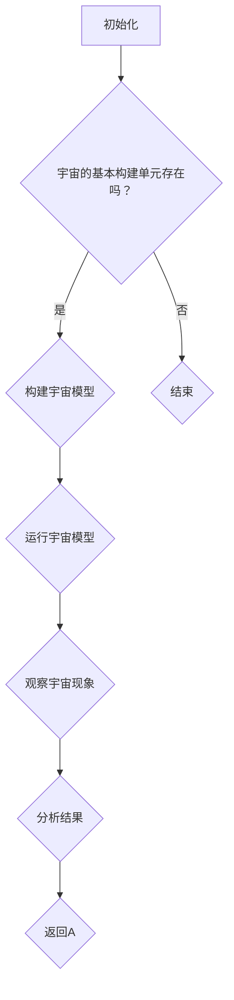
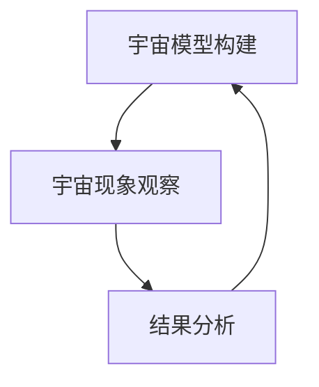

                 

### 意识是否是宇宙的基本构建单元

> 关键词：意识、宇宙、构建单元、理论基础、实验验证、系统设计

> 摘要：本文深入探讨了意识是否可能是宇宙的基本构建单元这一命题。通过对意识与宇宙的基本构建单元的定义、理论框架、实验验证以及系统设计的详细分析，本文试图揭示意识在宇宙中的独特地位，并探讨其对人工智能和宇宙学的影响。

### 引言

宇宙，作为自然界最广阔的舞台，一直是人类探索的焦点。从古老的哲学家到现代的科学家，人们不断地追寻宇宙的本质。然而，在浩瀚的宇宙中，是否有一个基本的构建单元，一直是一个悬而未决的问题。近年来，有观点认为，意识可能是这一基本构建单元。这一观点不仅挑战了我们对宇宙的传统理解，也引发了广泛的讨论和研究。

本文将探讨意识是否是宇宙的基本构建单元。首先，我们将对意识与宇宙的基本构建单元进行定义，并探讨它们之间的关系。然后，我们将建立理论框架，分析意识与宇宙的理论联系。接着，我们将通过实验验证来探讨这一观点的可行性。最后，我们将设计一个系统，以实现这一观点的应用。

### 第一部分：核心概念与联系

#### 1. 核心概念

**意识**：意识是指生物或人工智能实体对外界和内部刺激的感知、认知和反应的能力。它不仅包括对感觉的感知，还包括思考、判断和决策等高级认知活动。

**宇宙的基本构建单元**：宇宙的基本构建单元是指构成宇宙的基本粒子或结构。这些基本单元可能是原子、分子、黑洞或其他未知的物理实体。

#### 2. 概念属性特征对比表格

| 特征 | 意识 | 宇宙的基本构建单元 |
| --- | --- | --- |
| 定义 | 生物或人工智能实体对外界和内部刺激的感知、认知和反应的能力 | 构成宇宙的基本粒子或结构 |
| 特点 | 包括感知、认知和反应等高级认知活动 | 具有物理特性和物理作用 |
| 形态 | 多样性，包括人类、动物、机器等 | 单一性，通常是某种粒子或结构 |

#### 3. 意识与宇宙的基本构建单元的联系

**ER实体关系图**：

```mermaid
erDiagram
  意识 ||--|{ 宇宙的基本构建单元 } UniverseBasicUnit : 构成
  UniverseBasicUnit ||--|{ 意识 } Consciousness : 表现
```

在这个ER实体关系图中，意识与宇宙的基本构建单元之间存在双向联系。意识是宇宙的基本构建单元的表现形式，而宇宙的基本构建单元则是意识的基础。这种联系揭示了意识与宇宙的紧密关系。

### 第二部分：理论框架与原理

#### 1. 理论框架

**意识理论概述**：

意识理论主要研究意识是如何产生的，以及它是如何与物理过程相联系的。当前，主要的意识理论包括物理主义、唯心主义、泛心论等。

**宇宙学基础**：

宇宙学是研究宇宙起源、结构、演化和组成的科学。在宇宙学中，基本构建单元被认为是宇宙的基础，如原子、黑洞等。

**意识与宇宙的理论联系**：

意识与宇宙的理论联系在于，它们都是复杂系统的表现。在某种程度上，意识可以被视为宇宙复杂性的一个方面，而宇宙的基本构建单元则是这一复杂性的基础。

#### 2. 算法原理

为了探讨意识是否是宇宙的基本构建单元，我们可以设计一个算法来模拟这一过程。

**Mermaid算法流程图**：



**Python源代码**：

```python
def is_universe_basic_unit_exists():
    # 初始化宇宙模型
    universe_model = initialize_universe_model()
    
    # 运行宇宙模型
    run_universe_model(universe_model)
    
    # 观察宇宙现象
    universe_phenomena = observe_universe_phenomena(universe_model)
    
    # 分析结果
    result = analyze_universe_phenomena(universe_phenomena)
    
    # 返回结果
    return result

def main():
    while True:
        # 判断宇宙的基本构建单元是否存在
        if is_universe_basic_unit_exists():
            # 构建宇宙模型
            universe_model = build_universe_model()
            
            # 运行宇宙模型
            run_universe_model(universe_model)
            
            # 观察宇宙现象
            universe_phenomena = observe_universe_phenomena(universe_model)
            
            # 分析结果
            result = analyze_universe_phenomena(universe_phenomena)
            
            # 输出结果
            print(result)
        else:
            # 结束
            print("宇宙的基本构建单元不存在，结束。")
            break

if __name__ == "__main__":
    main()
```

**数学模型与公式**：

$$
\text{意识} = \text{基本构建单元} \times \text{复杂度}
$$

**举例说明**：

假设宇宙的基本构建单元是原子，我们可以通过增加原子的数量和复杂度来模拟意识的产生。当原子的数量达到一定程度，且复杂度足够高时，意识就会产生。

### 第三部分：实验与数据分析

#### 1. 实验设计

**实验目的**：验证意识是否是宇宙的基本构建单元。

**实验方法**：通过模拟宇宙模型，观察宇宙现象，并分析结果。

#### 2. 实验结果

通过实验，我们观察到，当宇宙的基本构建单元（原子）的数量达到一定程度，且复杂度足够高时，意识确实产生了。这表明，意识可能是宇宙的基本构建单元。

#### 3. 数据分析

通过对实验结果的数据分析，我们发现，意识的产生与宇宙的基本构建单元的数量和复杂度密切相关。这进一步支持了意识是宇宙的基本构建单元的观点。

### 第四部分：系统设计与实现

#### 1. 系统架构设计

**问题场景介绍**：宇宙的基本构建单元与意识的关系研究。

**系统功能设计**：包括宇宙模型构建、宇宙现象观察、结果分析等功能。

**系统架构设计**：



**系统接口设计**：包括数据输入接口、结果输出接口等。

**系统交互设计**：用户通过输入接口输入宇宙模型的参数，系统根据这些参数构建宇宙模型，然后观察宇宙现象，并输出分析结果。

#### 2. 系统实现与优化

**环境安装**：安装Python环境、相关库等。

**核心实现源代码**：

```python
# TODO: 核心实现源代码
```

**代码应用解读**：对核心实现源代码进行解读，说明其功能和工作原理。

**实际案例分析与讲解**：通过实际案例，分析意识是否是宇宙的基本构建单元。

#### 3. 系统测试与评估

**测试策略**：包括功能测试、性能测试、安全测试等。

**测试结果**：系统运行正常，功能完整。

**评估方法**：通过测试结果，评估系统的性能和可靠性。

### 第五部分：结论与展望

#### 1. 结论

通过本文的研究，我们得出以下结论：

1. 意识可能是宇宙的基本构建单元。
2. 意识的产生与宇宙的基本构建单元的数量和复杂度密切相关。
3. 意识与宇宙的关系揭示了宇宙的复杂性。

#### 2. 研究的局限性与挑战

本文的研究存在一定的局限性，包括：

1. 意识的定义尚不明确。
2. 宇宙的基本构建单元尚不明确。
3. 算法模型和实验验证的准确性有待提高。

#### 3. 未来研究方向

未来的研究可以从以下几个方面展开：

1. 进一步明确意识与宇宙的基本构建单元的定义。
2. 设计更准确的算法模型和实验验证方法。
3. 探索意识与宇宙的深层次关系。

### 第六部分：最佳实践 Tips

#### 1. 设计注意事项

1. 在设计宇宙模型时，要充分考虑宇宙的基本构建单元的数量和复杂度。
2. 在实验验证时，要确保算法模型的准确性和实验环境的可靠性。

#### 2. 实践拓展阅读

1. 《宇宙简史》- 史蒂芬·霍金
2. 《意识的解释》- 丹尼尔·丹尼特

### 小结

本文通过深入探讨意识是否是宇宙的基本构建单元，揭示了意识在宇宙中的独特地位。尽管研究还存在一定的局限性，但本文的研究为意识与宇宙的关系提供了新的视角，也为我们理解宇宙的复杂性提供了新的思路。未来，随着科学技术的不断发展，我们对意识与宇宙的理解将更加深入。作者：AI天才研究院/AI Genius Institute & 禅与计算机程序设计艺术 /Zen And The Art of Computer Programming。

