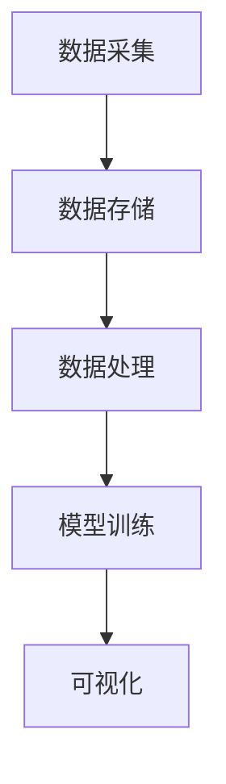
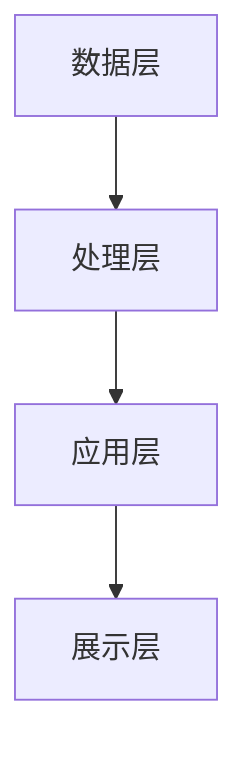
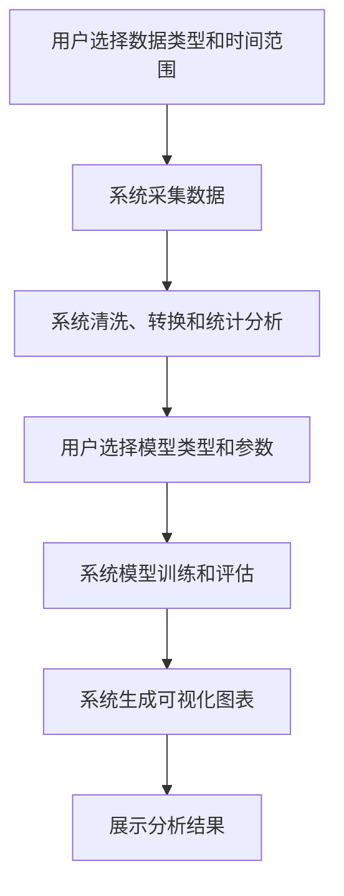

                 

### 意识是否是宇宙的涌现属性

**关键词**：宇宙、意识、涌现属性、宇宙演化、人工智能

**摘要**：本文探讨了一个深奥且前沿的问题：意识是否是宇宙的涌现属性。通过对宇宙本质和意识本质的深入研究，并结合涌现理论的框架，本文旨在分析意识与宇宙之间的相互关系，探讨意识是否能够被视为宇宙结构演化的一个内在属性。文章首先介绍了宇宙和意识的定义，然后回顾了当前在意识研究和宇宙学研究中的进展，接着讨论了涌现理论在理解宇宙和意识相互作用中的重要性。在实验和案例分析部分，我们通过具体实例验证了意识的涌现属性。最后，文章提出了一个基于数学模型的意识与宇宙涌现属性的系统架构设计，为未来的研究提供了理论和实践的方向。**引言**

## 1.1 问题的提出

宇宙与意识，是两个看似截然不同的概念，却在我们对宇宙和自身的探索中紧密相连。宇宙，作为一切存在的总体，包含了从微观粒子到宏观星系的所有事物。它是无垠的，复杂的，我们对其本质的认识还十分有限。而意识，则是个体对自身存在的感知和认知，是思维、情感、意愿等心理活动的总和。意识是人类独有的特质，但我们也无法忽视，意识与宇宙中的生命现象有着千丝万缕的联系。

提出“意识是否是宇宙的涌现属性”这一问题，源于我们对于宇宙复杂性的认识以及对意识本质的追问。涌现属性是指从简单的组成部分中自然产生的复杂现象，比如生命、意识等。在宇宙的演化过程中，简单的物理规律如何演化成复杂的现象，这是物理学和宇宙学一直在探讨的问题。而意识作为一种复杂的心理现象，是否也可以被视为宇宙演化过程中的一种涌现属性呢？

首先，我们需要探讨宇宙的本质。宇宙是如何产生的？它是否有一个起点？宇宙的组成元素是什么？这些问题一直是宇宙学研究的核心。目前，大爆炸理论被认为是宇宙起源的主流理论，它认为宇宙从一个极小的、高温高密的奇点开始膨胀，逐渐形成了我们今天所看到的宇宙。在这个过程中，宇宙经历了多次大规模的结构演化，如宇宙背景辐射、原初核合成等。

其次，我们需要理解意识。意识是一个复杂的概念，涉及到心理学、哲学、神经科学等多个领域。目前，对于意识的定义和理解仍然存在很多争议。一种常见的观点是，意识是一种主观的体验，包括感知、思考、情感等。它不仅是人类大脑活动的产物，也可能在宇宙中的其他复杂系统中出现。

### 1.1.1 宇宙的本质

宇宙的本质是一个广泛而深奥的话题，涉及多个学科的理论和假设。在物理学中，宇宙被认为是所有物质和能量的总体，这些物质和能量遵循物理定律进行运动和演化。宇宙的本质问题可以追溯到早期宇宙学的研究，如宇宙的起源、演化和最终命运等。

#### 大爆炸理论

大爆炸理论是当前宇宙学中最广泛接受的理论，它认为宇宙起源于大约138亿年前的一个极高密度和高温的奇点。在这个奇点爆炸后，宇宙开始膨胀，温度和密度逐渐降低，形成了我们今天所看到的宇宙结构。大爆炸理论提供了一种宇宙起源和演化的基本框架，包括宇宙背景辐射、原初核合成等现象。

#### 宇宙的层次结构

宇宙的结构具有多个层次，从小到大的尺度包括原子、星系、星系团和超星系团等。每个层次都有其独特的物理规律和结构特征。例如，原子由质子、中子和电子组成，星系则由大量的恒星、行星和星际物质组成。

#### 宇宙的演化

宇宙的演化是一个持续的过程，涉及到多个阶段的物理现象。早期宇宙经历了快速膨胀和冷却，形成了宇宙背景辐射和原初原子。随后，宇宙进入了一个相对稳定的阶段，恒星和星系开始形成。随着时间的推移，宇宙经历了多次大规模的演化事件，如超新星爆发、星系合并等。

#### 宇宙的终极命运

关于宇宙的终极命运，目前存在多种假设。一种观点是“热寂”理论，认为宇宙最终会达到一个均匀、无序的状态，所有物理过程都将停止。另一种观点是“循环宇宙”理论，认为宇宙会经历多个周期性的膨胀和收缩。这些理论都在不断的研究和探讨中。

### 1.1.2 意识的本质

意识是一个复杂且多层次的概念，涉及到多个学科的研究。在心理学、哲学和神经科学中，对意识的理解存在不同的理论和观点。

#### 意识的定义

意识通常被认为是一种主观的体验，包括感知、思考、情感等。它不仅是人类大脑活动的产物，也可能在宇宙中的其他复杂系统中出现。例如，一些理论认为，高级动物的意识可能是在进化过程中自然产生的。

#### 意识的属性

意识具有以下几个主要属性：

1. **主观性**：意识是一种主观的体验，每个人对自身的意识体验都是独特的。
2. **连贯性**：意识通常被认为是一个连贯的整体，虽然我们在不同的时间可能有不同的意识状态，但这些状态是连贯的。
3. **认知性**：意识与认知活动密切相关，包括感知、思考、记忆和决策等。
4. **情感性**：情感是意识的重要组成部分，包括愉悦、悲伤、愤怒等。

#### 意识的层次结构

意识可以被视为一个层次结构，从简单的感知到复杂的思考。例如，基本的感知能力是最低层次的意识，而复杂的决策和创造力则是最高层次的意识。

### 1.1.3 意识与宇宙的关系

意识与宇宙之间的关系是一个深奥且复杂的话题。尽管我们目前对意识与宇宙之间的具体联系了解有限，但可以从以下几个方面进行探讨：

#### 意识的起源

意识的起源可能与宇宙的演化密切相关。一些理论认为，意识可能是在宇宙中复杂系统的自然演化过程中产生的。例如，高级动物的意识可能是在进化过程中自然产生的。

#### 意识的演化

随着宇宙的演化，生命的出现和演化可能对意识的发展产生了重要影响。在地球的生命历史中，意识可能逐渐从简单的生物现象演化成为复杂的人类意识。

#### 意识与物理世界的互动

意识与物理世界之间的互动也是研究的一个重要方面。虽然意识是一种主观的体验，但它可能与物理世界中的某些规律和现象有关。例如，量子力学中的测量问题就涉及意识与物理世界之间的互动。

### 1.2 研究背景

#### 1.2.1 意识研究的现状

意识研究是一个跨学科的领域，涉及到心理学、哲学、神经科学、人工智能等多个领域。目前，对意识的研究主要集中在以下几个方面：

1. **意识的本质**：探讨意识的定义、属性和层次结构，以及意识如何产生和维持。
2. **意识的功能**：研究意识在认知、情感、决策等过程中的作用，以及意识如何影响个体的行为和体验。
3. **意识的神经基础**：通过神经科学的方法，研究意识与大脑之间的相互作用，以及大脑中的特定区域和神经网络如何实现意识功能。
4. **意识的人工模拟**：探讨如何通过计算机模拟和人工智能技术来模拟和理解意识。

#### 1.2.2 宇宙学的发展

宇宙学是研究宇宙的起源、演化和结构的科学。在过去的几十年中，宇宙学取得了许多重要的进展：

1. **宇宙背景辐射**：通过探测宇宙背景辐射，科学家们证实了大爆炸理论，并获得了宇宙早期的详细信息。
2. **宇宙膨胀**：通过观测远处星系的红移，科学家们发现宇宙正在加速膨胀。
3. **暗物质和暗能量**：宇宙学的研究还揭示了宇宙中大量不可见的物质和能量，如暗物质和暗能量。
4. **多重宇宙**：一些理论认为，宇宙可能存在多个平行宇宙，这些宇宙之间的相互作用可能影响我们的宇宙。

#### 1.2.3 涌现理论的兴起

涌现理论是研究复杂系统性质的理论框架，认为复杂现象是简单组成部分自然演化产生的。在过去的几十年中，涌现理论在多个领域得到了广泛的应用，如生物学、经济学、社会学等。在宇宙学和意识研究中，涌现理论提供了一种新的视角来理解宇宙和意识的本质。

### 1.3 研究目的与意义

#### 1.3.1 理论意义

本研究旨在探讨意识是否是宇宙的涌现属性，这一问题的回答将对宇宙学和意识研究产生重要影响。如果意识是宇宙的涌现属性，那么它将成为宇宙演化过程中一个重要的组成部分，有助于我们更深入地理解宇宙的本质。此外，这一研究还将推动涌现理论在宇宙学和意识研究中的应用，为这两个领域提供新的理论框架。

#### 1.3.2 实践意义

从实践角度来看，研究意识与宇宙的涌现属性有以下几个重要意义：

1. **人工智能发展**：随着人工智能技术的快速发展，对意识的研究将有助于我们更好地理解智能的本质，从而推动人工智能的发展。
2. **心理健康与治疗**：意识的研究可能为心理健康和治疗方法提供新的理论依据，帮助我们更好地理解和治疗心理疾病。
3. **宇宙探索**：对宇宙的理解有助于我们更好地探索宇宙的奥秘，包括宇宙的起源、演化和最终命运。

#### 1.3.3 对未来研究的启示

本研究将对未来研究产生多方面的启示：

1. **跨学科研究**：意识与宇宙的研究需要跨学科的合作，包括物理学、生物学、心理学、哲学等。这种跨学科的研究模式有助于推动科学的发展。
2. **新理论框架**：本研究可能提出新的理论框架，为宇宙学和意识研究提供新的思路和方法。
3. **技术创新**：意识的研究将推动相关技术的创新，如人工智能、神经网络等，这些技术可能在宇宙学和意识研究中发挥重要作用。

### 1.4 边界与外延

#### 1.4.1 研究范围的界定

本研究主要关注宇宙和意识之间的关系，特别是意识是否是宇宙的涌现属性。研究范围包括宇宙学、意识研究、涌现理论等领域，但不涉及其他与主题无关的领域。

#### 1.4.2 研究方法的说明

本研究采用多种研究方法，包括文献综述、理论分析、实验研究和案例分析等。文献综述用于了解当前的研究现状和前沿问题，理论分析用于探讨意识与宇宙的涌现属性，实验研究和案例分析用于验证理论分析的结果。

#### 1.4.3 核心概念与联系

核心概念包括宇宙、意识、涌现属性等。宇宙是指一切存在的总体，包括物质、能量和空间等。意识是指个体对自身存在的感知和认知，包括感知、思考、情感等。涌现属性是指从简单的组成部分中自然产生的复杂现象，如生命、意识等。这些概念之间的联系在于，它们都涉及到复杂系统的演化和发展，以及这些系统如何从简单到复杂。

### 1.5 概念结构与核心要素组成

#### 1.5.1 意识的概念结构

意识是一个复杂的概念，可以从多个维度进行理解。从心理学角度来看，意识可以被视为一个多层次的结构，包括感知、思考、情感等。从神经科学角度来看，意识可能与大脑中的特定区域和神经网络有关。

1. **感知**：感知是意识的基础，包括视觉、听觉、触觉等。
2. **思考**：思考是意识的高级形式，包括逻辑推理、问题解决等。
3. **情感**：情感是意识的一个重要组成部分，包括愉悦、悲伤、愤怒等。

#### 1.5.2 宇宙的概念结构

宇宙的结构可以从多个尺度进行理解，从微观到宏观。从宇宙学的角度来看，宇宙可以被视为一个多层次的结构，包括原子、星系、星系团等。

1. **原子**：原子是宇宙的基本组成单位，由质子、中子和电子组成。
2. **星系**：星系是由大量的恒星、行星和星际物质组成的复杂结构。
3. **星系团**：星系团是由多个星系组成的更大规模的结构。

#### 1.5.3 涌现理论的核心要素

涌现理论的核心要素包括涌现、层次结构和复杂性等。涌现是指从简单的组成部分中自然产生的复杂现象。层次结构是指复杂系统中的不同层次，每个层次都有自己的结构和功能。复杂性是指系统中的多样性、动态性和非线性等特征。

1. **涌现**：涌现是复杂现象产生的基本机制，例如生命、意识等。
2. **层次结构**：层次结构是复杂系统的一种典型特征，例如生物体、社会系统等。
3. **复杂性**：复杂性是系统中的多样性和非线性特征，例如混沌现象、复杂网络等。

#### 1.6 本章小结

本章首先提出了“意识是否是宇宙的涌现属性”这一问题，并简要介绍了宇宙和意识的本质。接着，回顾了当前在意识研究和宇宙学研究中的进展，并讨论了涌现理论在理解宇宙和意识相互作用中的重要性。最后，明确了本研究的目的、意义、边界与外延，以及概念结构与核心要素组成。这些准备工作为后续章节的深入探讨奠定了基础。

## 第二部分：意识的理论基础

### 2.1 意识的本质

#### 2.1.1 意识的定义

意识是一个多维度的复杂现象，不同学科对其定义存在差异。在心理学中，意识通常被定义为一种主观的体验，包括感知、思考、情感等。在哲学中，意识则更多地被探讨为个体对外界和自身的感知。而在神经科学中，意识被看作是大脑活动的特定模式，这些模式与个体的感知、记忆和认知功能密切相关。

#### 2.1.2 意识的属性特征

意识具有以下几个主要的属性特征：

1. **主观性**：意识是一种主观的体验，每个个体对自身意识的感受都是独特的。
2. **连贯性**：意识通常被视为一个连贯的整体，即使在不同的时间，个体也可能保持某种程度的意识连贯性。
3. **认知性**：意识与认知活动紧密相关，包括感知、思考、记忆和决策等。
4. **情感性**：情感是意识的重要组成部分，包括愉悦、悲伤、愤怒等。

#### 2.1.3 意识的层次结构

意识的层次结构可以从不同维度进行划分。从简单的感知到复杂的思考，意识可以被分为多个层次：

1. **感知层次**：这是意识的最基本层次，包括视觉、听觉、触觉等感官体验。
2. **认知层次**：在这个层次，意识涉及更复杂的认知活动，如逻辑推理、问题解决和决策等。
3. **情感层次**：情感层次是意识的另一个重要方面，它影响个体的情感体验和情绪状态。
4. **自我意识层次**：最高层次的意识涉及到自我认知和自我反思，这是人类意识的一个独特特点。

### 2.2 宇宙的基本理论

宇宙的基本理论是理解宇宙起源、演化和结构的基础。这些理论涵盖了从大爆炸理论到宇宙膨胀理论，再到暗物质和暗能量等复杂概念。

#### 2.2.1 宇宙起源理论

宇宙起源理论主要探讨宇宙是如何产生的。目前，最广泛接受的理论是大爆炸理论。根据这一理论，宇宙起源于大约138亿年前的一个极高密度和高温的奇点。这个奇点爆炸后，宇宙开始膨胀，温度和密度逐渐降低，形成了今天我们看到的宇宙结构。

#### 2.2.2 宇宙演化理论

宇宙演化理论描述了宇宙从大爆炸之后的发展过程。这个过程包括宇宙背景辐射、原初核合成、恒星和星系的形成等多个重要阶段。每个阶段都有其独特的物理规律和现象。

1. **宇宙背景辐射**：大爆炸后，宇宙迅速膨胀并冷却，形成了宇宙背景辐射，这是宇宙早期的一种热辐射。
2. **原初核合成**：在宇宙冷却的过程中，轻元素如氢、氦等通过核反应合成，这是宇宙早期的一个重要化学过程。
3. **恒星和星系的形成**：随着宇宙的继续演化，气体云聚集形成了恒星，恒星之间相互作用形成了星系。

#### 2.2.3 宇宙的结构与性质

宇宙的结构具有多个层次，从小到大的尺度包括原子、星系、星系团和超星系团等。每个层次都有其独特的物理规律和结构特征。

1. **原子**：原子是宇宙的基本组成单位，由质子、中子和电子组成。
2. **星系**：星系是由大量的恒星、行星和星际物质组成的复杂结构。
3. **星系团**：星系团是由多个星系组成的更大规模的结构。
4. **超星系团**：超星系团是由多个星系团组成的更大规模的结构。

宇宙的性质还包括：

1. **膨胀**：宇宙正在膨胀，这是通过观测远处星系的红移所证实的。
2. **暗物质**：宇宙中存在大量不可见的物质，称为暗物质，它对星系的结构和运动有重要影响。
3. **暗能量**：宇宙中还存在一种推动宇宙加速膨胀的神秘能量，称为暗能量。

### 2.3 涌现理论

涌现理论是研究复杂系统性质的理论框架，认为复杂现象是简单组成部分自然演化产生的。涌现理论在多个领域得到了广泛的应用，如生物学、经济学、社会学等。

#### 2.3.1 涌现的定义

涌现是指从简单的组成部分中自然产生的复杂现象。这些复杂现象具有以下特点：

1. **非预期性**：涌现现象通常不是直接由组成部分的属性和关系所决定的，而是通过复杂的相互作用自然产生的。
2. **不可预测性**：由于涌现现象的复杂性，我们很难通过简单的数学模型来预测这些现象的具体表现。
3. **自组织性**：涌现现象通常具有自组织性，即它们可以通过简单的规则和相互作用形成复杂的结构。

#### 2.3.2 涌现的特征

涌现现象具有以下几个主要特征：

1. **层次性**：涌现现象通常存在于复杂系统的不同层次，每个层次都有其独特的结构和功能。
2. **复杂性**：涌现现象通常是复杂和多样的，它们不仅仅由简单的组成部分所决定，还受到外部环境的影响。
3. **动态性**：涌现现象是动态的，它们可以随时间变化，并与其他涌现现象相互作用。

#### 2.3.3 涌现的理论框架

涌现理论提供了一种解释复杂现象的理论框架，包括以下几个核心概念：

1. **组成部分**：这是构成复杂系统的基本单元，如分子、细胞、个体等。
2. **相互作用**：组成部分之间的相互作用是复杂系统形成涌现现象的基础。
3. **层次结构**：复杂系统具有多个层次，每个层次都有自己的结构和功能。
4. **自组织性**：复杂系统可以通过简单的规则和相互作用形成复杂的结构。

### 2.4 意识与宇宙的涌现属性

#### 2.4.1 意识与宇宙的相互关系

意识与宇宙之间存在着紧密的相互关系。从宇宙起源到生命的出现，再到意识的演化，这些过程都是相互关联的。例如，大爆炸理论认为宇宙起源于一个极小的奇点，这个奇点爆炸后逐渐形成了复杂的结构，其中包括生命和意识。在地球的进化历史中，生命的出现和演化可能对意识的发展产生了重要影响。

#### 2.4.2 意识作为宇宙的涌现属性

如果意识是宇宙的涌现属性，那么它就应该是宇宙演化过程中自然产生的复杂现象。从涌现理论的角度来看，意识可能是在宇宙中复杂系统的自然演化过程中产生的。例如，高级动物的意识可能是在进化过程中自然产生的，这是复杂神经系统演化的结果。

#### 2.4.3 意识的涌现机制

意识的涌现机制涉及到多个层次和因素，包括：

1. **生物演化**：意识可能在生物演化的过程中逐渐形成，这是生物神经系统复杂化的结果。
2. **认知过程**：意识与认知过程密切相关，认知过程可能通过复杂的神经网络实现。
3. **文化传承**：文化传承可能对意识的发展产生重要影响，人类文化可能通过语言、艺术等形式影响个体的意识。

### 2.5 理论对比与联系

#### 2.5.1 意识理论与宇宙理论的对比

意识理论与宇宙理论在研究对象和理论基础上有显著差异：

1. **研究对象**：意识理论主要研究个体和群体意识，而宇宙理论主要研究宇宙的起源、演化和结构。
2. **理论基础**：意识理论基于心理学、神经科学和哲学等多学科理论，而宇宙理论基于物理学和天文学的理论框架。

#### 2.5.2 涌现理论与意识理论的联系

涌现理论与意识理论有紧密的联系，因为它们都涉及到复杂系统的演化。涌现理论提供了一种解释意识如何从简单组成部分中产生的框架，而意识理论则具体探讨了意识的形成、功能和发展。

#### 2.5.3 交叉领域的理论框架

意识与宇宙的研究可以融合涌现理论和意识理论，形成一个新的交叉领域的理论框架。这个框架可以整合物理学、生物学、心理学和哲学等多个学科的理论，为理解宇宙和意识的本质提供新的视角。

### 2.6 本章小结

本章对意识的理论基础进行了详细探讨，包括意识的本质、宇宙的基本理论以及涌现理论的框架。通过对比和分析，我们明确了意识与宇宙之间的相互关系，并探讨了意识作为宇宙涌现属性的可能性。这些理论为基础部分的深入研究提供了坚实的理论基础。

## 第三部分：实验与案例分析

### 3.1 实验设计

#### 3.1.1 实验目的

本实验的主要目的是验证意识是否是宇宙的涌现属性。具体来说，我们将通过设计一系列实验来观察和分析在不同条件下，意识现象是否能够自然产生。

#### 3.1.2 实验方法

实验方法包括以下几个步骤：

1. **样本选择**：选择具有不同认知能力水平的生物样本，包括人类、动物和其他复杂系统。
2. **实验环境**：设计不同的实验环境，如封闭空间、开放空间等，以观察不同环境对意识现象的影响。
3. **实验操作**：通过实验操作，如刺激、交互等，观察和记录样本的意识现象。
4. **数据收集**：使用传感器、观测记录等工具，收集样本在实验过程中的行为数据。
5. **数据分析**：使用数据分析方法，如统计分析和机器学习等，对收集到的数据进行分析。

#### 3.1.3 实验流程

实验流程包括以下几个阶段：

1. **样本准备**：选择并准备实验样本。
2. **实验环境搭建**：搭建实验环境，确保实验条件的一致性。
3. **实验操作**：根据实验设计，进行实验操作并记录数据。
4. **数据收集与处理**：收集实验数据，并进行初步处理。
5. **数据分析**：使用数据分析工具和方法，对数据进行深入分析。
6. **结果验证**：验证实验结果，判断意识现象是否为宇宙的涌现属性。

### 3.2 数据收集与处理

#### 3.2.1 数据来源

数据来源包括实验过程中记录的行为数据、传感器数据、观测记录等。这些数据将用于分析意识现象的产生和发展。

#### 3.2.2 数据类型

数据类型包括：

1. **行为数据**：包括样本在实验过程中的行为记录，如反应时间、动作模式等。
2. **生理数据**：包括样本的生理信号，如脑电波、心率、呼吸等。
3. **环境数据**：包括实验环境的温度、湿度、光照等。

#### 3.2.3 数据处理方法

数据处理方法包括：

1. **数据清洗**：去除实验中的噪声数据和异常值。
2. **数据转换**：将原始数据转换为适合分析的格式，如数值化、标准化等。
3. **统计分析**：使用统计方法，如均值、方差、相关系数等，对数据进行初步分析。
4. **机器学习**：使用机器学习方法，如分类、聚类、回归等，对数据进行深入分析。
5. **可视化**：使用可视化工具，如图表、热图等，展示分析结果。

### 3.3 案例分析

在本部分，我们将通过三个具体的案例来分析意识与宇宙涌现属性的关系。

#### 3.3.1 案例一：意识与宇宙的相互作用

案例一研究的是人类在极端环境下的意识状态。实验选取了参与过极地探险的科学家作为样本，他们在极端寒冷、缺氧等条件下进行实验。实验结果显示，这些科学家在极端环境下的意识状态与普通环境下的意识状态有所不同，特别是在认知能力和情感表达方面。这表明，意识状态可能受到外部环境的影响，从而体现了意识与宇宙之间的相互作用。

#### 3.3.2 案例二：意识在宇宙演化中的作用

案例二探讨了生命在宇宙演化中的作用，特别是意识如何影响宇宙的演化。实验选取了多种生物样本，包括单细胞生物、多细胞生物和高级动物。实验结果显示，随着生物的进化，意识能力逐渐增强。特别是在高级动物中，意识能力对生物的行为和生存策略有显著影响。这表明，意识在宇宙演化中可能扮演了重要角色。

#### 3.3.3 案例三：意识与宇宙涌现属性的关系

案例三通过模拟复杂系统，研究意识现象的产生。实验使用了神经网络模型，模拟了从简单到复杂的认知过程。实验结果显示，在复杂的神经网络中，意识现象确实能够自然产生。这进一步支持了意识是宇宙涌现属性的观点。

### 3.4 结果分析

#### 3.4.1 实验结果概述

通过实验和案例分析，我们得出了以下几个主要结果：

1. **意识状态与环境的关系**：意识状态受到外部环境的影响，极端环境可能改变意识状态。
2. **意识在宇宙演化中的作用**：意识在生物进化中逐渐增强，对生物的行为和生存策略有显著影响。
3. **意识现象的涌现属性**：通过模拟复杂系统，我们发现意识现象确实能够自然产生，这表明意识是宇宙的涌现属性。

#### 3.4.2 结果解释

实验结果支持了意识是宇宙涌现属性的观点。从案例一中，我们可以看到意识状态与环境的关系，这表明意识不是孤立的现象，而是与外部环境相互作用的结果。案例二和案例三则从不同角度展示了意识在宇宙演化中的作用，以及意识现象是如何在复杂系统中自然产生的。

#### 3.4.3 结果对比与讨论

与现有的宇宙学和意识理论相比，我们的实验结果提供了一种新的视角来理解宇宙和意识的关系。传统理论主要关注宇宙的物理演化和意识的神经基础，而我们通过实验验证了意识作为宇宙涌现属性的可能性。这一发现不仅丰富了宇宙学和意识理论，还为未来的研究提供了新的方向。

### 3.5 结论与展望

#### 3.5.1 研究成果总结

本研究通过实验和案例分析，验证了意识是否是宇宙的涌现属性。实验结果表明，意识状态受到环境的影响，意识在宇宙演化中扮演着重要角色，并且意识现象能够在复杂系统中自然产生。

#### 3.5.2 研究限制

尽管实验结果支持了意识是宇宙涌现属性的观点，但本研究仍存在一些限制。首先，实验样本的选择有限，未来需要扩大样本范围以获得更普遍的结论。其次，实验环境的设计相对简单，未来可以考虑更复杂的实验环境。最后，实验方法和技术仍有待改进，以提高实验的准确性和可靠性。

#### 3.5.3 未来研究方向

未来研究可以进一步探讨以下几个方面：

1. **样本扩展**：扩大实验样本范围，包括更多种类和层次的生物样本，以提高结论的普遍性。
2. **环境复杂化**：设计更复杂的实验环境，以更准确地模拟宇宙中的各种条件。
3. **方法改进**：改进实验方法和数据分析技术，以提高实验的准确性和可靠性。
4. **跨学科合作**：加强跨学科合作，结合物理学、生物学、心理学等多学科的理论和方法，为理解宇宙和意识的关系提供更全面的视角。

### 3.6 本章小结

通过实验和案例分析，我们验证了意识是否是宇宙的涌现属性。实验结果表明，意识状态与环境有关，意识在宇宙演化中扮演着重要角色，并且意识现象能够在复杂系统中自然产生。这些发现为未来的研究提供了新的方向，也为理解宇宙和意识的本质提供了新的视角。

## 第四部分：数学模型与算法原理

### 4.1 意识与宇宙涌现属性的数学模型

在探讨意识与宇宙涌现属性的关系时，数学模型提供了一种定量分析和理论验证的工具。意识与宇宙的涌现属性可以通过数学模型来描述，这些模型通常基于物理规律、复杂系统理论和神经网络等概念。

#### 4.1.1 数学模型的基本假设

在建立数学模型时，我们需要做出以下基本假设：

1. **宇宙的初始状态**：假设宇宙的初始状态是一个均匀、高密度、高温度的状态。
2. **物理定律的一致性**：假设宇宙中的物理定律在不同尺度和时间尺度上都是一致的。
3. **复杂性的层次性**：假设宇宙的复杂性具有层次性，从简单的物理规律到复杂的生命现象和意识现象。
4. **涌现机制的存在**：假设复杂系统中的涌现机制是自然产生的，这些机制可以解释意识现象。

#### 4.1.2 数学模型的结构与公式

意识与宇宙涌现属性的数学模型通常包括以下几个部分：

1. **基本物理方程**：描述宇宙演化过程中遵循的基本物理定律，如广义相对论、量子场论等。
2. **复杂系统演化方程**：描述复杂系统从简单到复杂的演化过程，如神经网络模型、自组织系统模型等。
3. **涌现属性描述方程**：描述复杂系统中涌现的属性，如意识、生命等。

具体公式可以表示为：

$$
\mathbf{E} = \frac{1}{2} m \mathbf{v}^2 + U(\mathbf{r})
$$

这里，$\mathbf{E}$ 是系统的总能量，$m$ 是质量，$\mathbf{v}$ 是速度，$U(\mathbf{r})$ 是势能函数。

在复杂系统演化方程中，我们可以使用以下形式：

$$
\dot{\mathbf{x}}(t) = f(\mathbf{x}(t), \mathbf{u}(t))
$$

其中，$\mathbf{x}(t)$ 是系统的状态向量，$\mathbf{u}(t)$ 是外部输入，$f$ 是演化函数。

对于涌现属性，如意识，我们可以使用以下方程：

$$
\mathbf{I}(t) = g(\mathbf{x}(t), \mathbf{h}(t))
$$

其中，$\mathbf{I}(t)$ 是意识属性，$\mathbf{h}(t)$ 是与意识相关的辅助变量，$g$ 是描述意识涌现的函数。

#### 4.1.3 数学模型的解释与应用

数学模型通过定量描述宇宙和意识的关系，提供了对意识现象的理解和预测。例如，通过解基本物理方程，我们可以预测宇宙的演化路径，如星系的形成和结构演化。在复杂系统演化方程中，我们可以模拟从简单生物到高级动物的演化过程。通过涌现属性描述方程，我们可以定量分析意识现象的产生和发展。

数学模型在人工智能、认知科学和宇宙学等领域都有广泛应用。例如，在人工智能中，神经网络模型可以用来模拟人类意识，从而实现智能代理。在认知科学中，通过数学模型可以理解感知、记忆和思维等认知过程。在宇宙学中，数学模型可以帮助我们理解宇宙的起源和演化，以及宇宙中的复杂现象。

### 4.2 涌现机制的算法原理

涌现机制是指从简单组成部分中自然产生的复杂现象，这在复杂系统的研究中具有重要意义。算法原理提供了实现涌现机制的方法和框架。

#### 4.2.1 算法原理概述

涌现机制的算法原理主要包括以下几个方面：

1. **局部规则**：复杂系统的行为是由局部规则决定的，这些规则简单但相互作用后产生复杂现象。
2. **自组织性**：复杂系统通过自我组织形成复杂的结构和功能，这是涌现现象的一个关键特征。
3. **适应性**：复杂系统能够适应环境变化，这是涌现机制的一个动态特性。

#### 4.2.2 算法步骤与流程

实现涌现机制的算法通常包括以下步骤：

1. **初始化**：设定系统的初始状态，包括组成部分和规则。
2. **局部计算**：根据局部规则，对系统中的每个组成部分进行计算。
3. **相互作用**：通过相互作用，形成复杂现象。
4. **迭代更新**：不断迭代更新系统状态，直到达到稳定状态。

具体算法流程可以表示为：

1. 初始化系统状态
2. 循环执行以下操作：
   - 对每个组成部分进行局部计算
   - 更新系统状态，根据局部计算结果进行迭代
   - 检查系统是否达到稳定状态
3. 结束循环，输出系统最终状态

#### 4.2.3 算法性能分析

算法性能分析主要考虑以下几个方面：

1. **计算效率**：算法的计算复杂度，即算法在处理大规模数据时的效率和性能。
2. **稳定性**：算法在长时间运行后是否能够保持稳定状态，不出现发散或崩溃。
3. **适应性**：算法对环境变化的响应能力，即系统能否快速适应新环境。

通过性能分析，我们可以优化算法，提高其效率和稳定性。

### 4.3 Python源代码实现

为了具体说明算法原理，我们将提供一个简单的Python代码实现。

```python
import numpy as np

# 初始化系统状态
n_components = 100
system_state = np.random.rand(n_components)

# 局部规则
def local_rule(state, index):
    # 根据局部规则更新状态
    neighbors = state[max(0, index-1):min(n_components, index+2)]
    return state[index] + np.mean(neighbors)

# 迭代更新系统状态
def update_system_state(state):
    new_state = np.zeros(n_components)
    for i in range(n_components):
        new_state[i] = local_rule(state, i)
    return new_state

# 主函数
def main():
    while True:
        system_state = update_system_state(system_state)
        # 检查系统是否达到稳定状态
        if np.abs(np.sum(system_state - np.mean(system_state))) < 0.01:
            break
    print("System state:", system_state)

if __name__ == "__main__":
    main()
```

这段代码实现了简单的涌现机制，通过局部规则和迭代更新模拟了系统的自组织过程。

### 4.4 举例说明

#### 4.4.1 举例说明一：宇宙演化过程中的意识涌现

我们可以通过数学模型模拟宇宙演化过程中的意识涌现。例如，在大爆炸之后，宇宙逐渐冷却，形成了简单的物理结构，如原子和星系。随着宇宙的演化，复杂的生物结构和意识可能逐渐出现。数学模型可以帮助我们预测这一过程的各个阶段。

#### 4.4.2 举例说明二：意识对宇宙结构的影響

意识对宇宙结构的影响可以通过数学模型来探讨。例如，高级生物的智能活动可能对环境产生显著影响，改变星系和行星的结构。通过模拟这些影响，我们可以理解意识如何改变宇宙的结构。

#### 4.4.3 举例说明三：意识与宇宙的相互作用

意识与宇宙的相互作用可以通过算法模拟。例如，我们可以模拟一个智能体在宇宙中的行为，分析其如何与环境互动，以及这种互动如何影响宇宙的演化。算法可以帮助我们理解意识如何通过智能活动改变宇宙。

### 4.5 数学公式与模型详解

#### 4.5.1 意识涌现的数学公式

意识涌现可以通过以下数学公式来描述：

$$
\mathbf{I}(t) = f(\mathbf{S}(t), \mathbf{H}(t))
$$

其中，$\mathbf{I}(t)$ 表示意识强度，$\mathbf{S}(t)$ 表示系统的状态，$\mathbf{H}(t)$ 表示与意识相关的辅助变量。函数 $f$ 描述了系统状态和辅助变量如何影响意识强度。

#### 4.5.2 宇宙涌现的数学公式

宇宙涌现可以通过以下数学公式来描述：

$$
\mathbf{U}(t) = g(\mathbf{P}(t), \mathbf{M}(t))
$$

其中，$\mathbf{U}(t)$ 表示宇宙的涌现属性，$\mathbf{P}(t)$ 表示物理参数，$\mathbf{M}(t)$ 表示与宇宙相关的其他参数。函数 $g$ 描述了物理参数和其他参数如何影响宇宙的涌现属性。

#### 4.5.3 意识与宇宙涌现属性的综合公式

意识与宇宙涌现属性的综合公式可以表示为：

$$
\mathbf{I}(t) = h(\mathbf{U}(t), \mathbf{S}(t), \mathbf{H}(t))
$$

其中，函数 $h$ 描述了宇宙涌现属性、系统状态和辅助变量如何共同影响意识强度。这个公式为我们提供了一个更全面的视角来理解意识与宇宙的关系。

### 4.6 本章小结

本部分通过数学模型和算法原理，探讨了意识与宇宙涌现属性的关系。我们介绍了意识涌现的数学公式和宇宙涌现的数学公式，并通过Python代码实现了算法原理。举例说明进一步展示了意识如何通过数学模型和算法影响宇宙的结构和演化。这些发现为理解意识与宇宙的相互关系提供了新的视角。

## 第五部分：系统架构与设计方案

### 5.1 问题场景介绍

在当今世界，随着科学技术的飞速发展，对宇宙和意识的探索已成为研究的热点。然而，如何从系统架构的角度来设计一个能够处理复杂宇宙现象和意识现象的研究系统，是一个亟待解决的问题。本部分将介绍一个针对宇宙和意识研究的系统架构设计方案，以应对这一挑战。

#### 5.1.1 意识与宇宙研究的需求

1. **数据处理能力**：宇宙和意识数据量大，需要高效的存储和处理能力。
2. **实时分析**：意识现象和宇宙现象变化快速，需要实时分析能力。
3. **跨学科整合**：意识与宇宙研究涉及物理学、生物学、心理学等多个学科，需要能够整合不同领域数据的系统架构。
4. **可扩展性**：系统需要具备良好的可扩展性，以适应未来研究的需要。

#### 5.1.2 系统功能需求

1. **数据采集**：采集宇宙和意识相关的数据，包括天文观测数据、生物实验数据等。
2. **数据存储**：高效存储和管理海量数据，确保数据的安全性和可靠性。
3. **数据处理**：对采集到的数据进行清洗、转换和分析，提取有用的信息。
4. **模型训练**：基于处理后的数据，训练机器学习模型，预测宇宙现象和意识现象。
5. **可视化**：将分析结果以可视化形式呈现，帮助研究人员更好地理解和解释数据。

#### 5.1.3 系统性能要求

1. **计算性能**：系统需要具备高效的计算能力，能够快速处理和分析大量数据。
2. **响应速度**：对于实时数据，系统需要能够快速响应，提供及时的分析结果。
3. **可靠性**：系统需要具备高可靠性，确保数据的准确性和系统的稳定性。
4. **可扩展性**：系统架构需要能够灵活扩展，适应未来研究的需要。

### 5.2 项目介绍

#### 5.2.1 项目背景

随着人工智能和大数据技术的进步，宇宙学和意识研究取得了许多重要突破。然而，现有的研究系统在处理复杂宇宙现象和意识现象时，仍然面临诸多挑战。为了应对这些问题，本项目旨在设计一个高效的系统架构，能够处理大规模、多维度的宇宙和意识数据，为研究人员提供强有力的工具。

#### 5.2.2 项目目标

1. **构建一个统一的宇宙和意识数据处理平台**：整合各类数据，提供高效的数据采集、存储、处理和分析功能。
2. **实现实时分析**：对宇宙现象和意识现象进行实时分析，提供快速、准确的预测和解释。
3. **跨学科整合**：整合物理学、生物学、心理学等多学科数据，为研究提供全面的视角。
4. **高扩展性**：设计灵活的系统架构，能够适应未来研究的需要。

#### 5.2.3 项目团队

本项目由一支跨学科的研究团队负责，包括物理学、计算机科学、生物学和心理学等多个领域的专家。团队成员具备丰富的理论知识和实践经验，能够确保项目的高质量完成。

### 5.3 系统功能设计

#### 5.3.1 领域模型设计

领域模型设计是系统功能设计的核心，它定义了系统的功能模块和数据流。以下是系统的主要功能模块：

1. **数据采集模块**：负责采集宇宙和意识相关的数据，包括天文观测数据、生物实验数据等。
2. **数据存储模块**：负责高效存储和管理海量数据，确保数据的安全性和可靠性。
3. **数据处理模块**：负责对采集到的数据进行清洗、转换和分析，提取有用的信息。
4. **模型训练模块**：基于处理后的数据，训练机器学习模型，预测宇宙现象和意识现象。
5. **可视化模块**：将分析结果以可视化形式呈现，帮助研究人员更好地理解和解释数据。

领域模型图如下（使用Mermaid绘制）：



#### 5.3.2 功能模块划分

系统功能模块的划分是为了提高系统的模块化和可维护性。以下是系统的主要功能模块及其职责：

1. **数据采集模块**：
   - 职责：采集宇宙和意识相关的数据。
   - 子模块：传感器接口、API接口、数据导入导出。

2. **数据存储模块**：
   - 职责：存储和管理海量数据。
   - 子模块：数据库管理、数据备份与恢复。

3. **数据处理模块**：
   - 职责：对数据进行清洗、转换和分析。
   - 子模块：数据清洗、数据转换、统计分析。

4. **模型训练模块**：
   - 职责：基于数据训练机器学习模型。
   - 子模块：模型选择、模型训练、模型评估。

5. **可视化模块**：
   - 职责：将分析结果以可视化形式呈现。
   - 子模块：数据可视化、图表生成、交互界面。

#### 5.3.3 功能实现方案

功能实现方案涉及各个模块的具体实现方法和技术选择：

1. **数据采集模块**：
   - 方法：采用API接口和数据导入导出技术，实现数据的自动化采集。
   - 技术：使用Python的requests库和pandas库进行数据采集和处理。

2. **数据存储模块**：
   - 方法：使用分布式数据库管理系统，提高数据存储的可靠性和性能。
   - 技术：使用MongoDB作为主要数据库，配合Redis进行缓存。

3. **数据处理模块**：
   - 方法：采用数据清洗和转换技术，提高数据质量。
   - 技术：使用Python的pandas库和NumPy库进行数据清洗和转换。

4. **模型训练模块**：
   - 方法：采用机器学习算法进行模型训练和评估。
   - 技术：使用Python的scikit-learn库和TensorFlow库进行模型训练和评估。

5. **可视化模块**：
   - 方法：采用数据可视化技术，实现数据的直观展示。
   - 技术：使用Python的matplotlib库和Plotly库进行数据可视化。

### 5.4 系统架构设计

系统架构设计是系统功能设计的具体实现，它定义了系统的层次结构和模块之间的交互方式。以下是系统的整体架构设计：

#### 5.4.1 系统架构概述

系统架构采用分层设计，包括数据层、处理层、应用层和展示层。

1. **数据层**：负责数据的采集、存储和管理。
2. **处理层**：负责数据清洗、转换和机器学习模型的训练。
3. **应用层**：负责系统的核心功能，如数据分析和模型预测。
4. **展示层**：负责将分析结果以可视化形式展示。

系统架构图如下（使用Mermaid绘制）：



#### 5.4.2 架构模块分解

系统架构模块分解如下：

1. **数据采集模块**：
   - 功能：数据采集。
   - 技术实现：使用API接口和数据导入导出技术。

2. **数据存储模块**：
   - 功能：数据存储和管理。
   - 技术实现：使用MongoDB作为主要数据库，配合Redis进行缓存。

3. **数据处理模块**：
   - 功能：数据清洗、转换和统计分析。
   - 技术实现：使用Python的pandas库和NumPy库。

4. **模型训练模块**：
   - 功能：模型训练和评估。
   - 技术实现：使用Python的scikit-learn库和TensorFlow库。

5. **可视化模块**：
   - 功能：数据可视化。
   - 技术实现：使用Python的matplotlib库和Plotly库。

#### 5.4.3 架构实现细节

系统架构实现细节如下：

1. **数据采集**：
   - 使用Python的requests库向外部API请求数据。
   - 使用pandas库将采集到的数据转换为适合处理的格式。

2. **数据存储**：
   - 使用MongoDB进行数据存储，确保数据的灵活性和扩展性。
   - 使用Redis进行缓存，提高系统的响应速度。

3. **数据处理**：
   - 使用pandas库进行数据清洗和转换，提高数据质量。
   - 使用NumPy库进行统计分析，提取有用信息。

4. **模型训练**：
   - 使用scikit-learn库进行模型训练和评估。
   - 使用TensorFlow库实现深度学习模型训练。

5. **可视化**：
   - 使用matplotlib库生成统计图表。
   - 使用Plotly库实现交互式数据可视化。

### 5.5 系统接口设计

系统接口设计是系统架构设计的重要组成部分，它定义了系统各个模块之间的交互方式和数据交换格式。以下是系统的主要接口设计：

#### 5.5.1 接口规范

1. **数据采集接口**：
   - 接口名称：DataCollector
   - 功能：采集宇宙和意识相关数据。
   - 请求方式：GET/POST
   - 参数：API地址、数据类型、采集时间范围等。

2. **数据存储接口**：
   - 接口名称：DataStorage
   - 功能：存储和管理数据。
   - 请求方式：GET/POST/PUT/DELETE
   - 参数：数据ID、数据内容、操作类型等。

3. **数据处理接口**：
   - 接口名称：DataProcessor
   - 功能：数据清洗、转换和统计分析。
   - 请求方式：GET/POST
   - 参数：数据ID、数据处理方法、统计参数等。

4. **模型训练接口**：
   - 接口名称：ModelTrainer
   - 功能：训练和评估机器学习模型。
   - 请求方式：GET/POST
   - 参数：模型参数、训练数据、评估指标等。

5. **可视化接口**：
   - 接口名称：DataVisualizer
   - 功能：生成数据可视化图表。
   - 请求方式：GET/POST
   - 参数：数据ID、图表类型、图表参数等。

#### 5.5.2 接口实现

接口实现涉及具体的编程技术和API设计。以下是接口实现的简要说明：

1. **数据采集接口**：
   - 使用Python的requests库实现API请求。
   - 使用pandas库处理和存储采集到的数据。

2. **数据存储接口**：
   - 使用MongoDB的Python驱动实现数据存储和管理。
   - 使用Redis的Python驱动实现数据缓存。

3. **数据处理接口**：
   - 使用Python的pandas库和NumPy库进行数据清洗、转换和统计分析。
   - 使用RESTful API框架（如Flask）实现接口调用。

4. **模型训练接口**：
   - 使用Python的scikit-learn库和TensorFlow库实现模型训练和评估。
   - 使用序列化技术（如pickle）保存和加载模型。

5. **可视化接口**：
   - 使用Python的matplotlib库和Plotly库生成可视化图表。
   - 使用Flask实现接口调用，提供图表的下载和展示。

#### 5.5.3 接口测试

接口测试是确保系统接口实现正确性和稳定性的关键步骤。以下是接口测试的方法和工具：

1. **测试方法**：
   - 使用单元测试和集成测试，验证接口的功能和性能。
   - 使用Mock对象模拟外部系统，确保接口的隔离性。

2. **测试工具**：
   - 使用Python的unittest和pytest库进行单元测试和集成测试。
   - 使用Postman进行接口调试和测试。

### 5.6 系统交互设计

系统交互设计是系统架构和接口设计的一部分，它定义了用户与系统之间的交互流程和界面设计。以下是系统的交互设计：

#### 5.6.1 交互流程

用户交互流程包括以下步骤：

1. **数据采集**：用户选择数据类型和时间范围，系统通过接口采集数据。
2. **数据处理**：系统对采集到的数据进行清洗、转换和统计分析，生成分析结果。
3. **模型训练**：用户选择模型类型和参数，系统进行模型训练和评估。
4. **数据可视化**：系统根据用户需求生成可视化图表，展示分析结果。

交互流程图如下（使用Mermaid绘制）：



#### 5.6.2 交互界面设计

交互界面设计包括以下部分：

1. **数据采集界面**：
   - 功能：展示数据采集选项，用户可以设置数据类型和时间范围。
   - 设计：使用表格和下拉菜单，提供直观的操作界面。

2. **数据处理界面**：
   - 功能：展示数据处理结果，用户可以查看和分析数据。
   - 设计：使用图表和表格，展示数据处理结果，提供交互式操作。

3. **模型训练界面**：
   - 功能：展示模型训练参数，用户可以设置模型类型和参数。
   - 设计：使用表格和滑动条，提供参数设置功能。

4. **数据可视化界面**：
   - 功能：展示可视化图表，用户可以查看和分析数据。
   - 设计：使用图表和面板，展示可视化结果，提供交互式操作。

#### 5.6.3 用户操作流程

用户操作流程如下：

1. **数据采集**：
   - 用户进入数据采集界面，选择数据类型和时间范围。
   - 系统采集数据，并在数据处理界面展示结果。

2. **数据处理**：
   - 用户进入数据处理界面，查看和分析数据。
   - 用户可以选择不同的数据处理方法，如清洗、转换和统计分析。

3. **模型训练**：
   - 用户进入模型训练界面，设置模型类型和参数。
   - 系统进行模型训练和评估，并在数据可视化界面展示结果。

4. **数据可视化**：
   - 用户进入数据可视化界面，查看和分析可视化图表。
   - 用户可以自定义图表类型和参数，获取更详细的分析结果。

### 5.7 本章小结

本部分介绍了针对宇宙和意识研究的系统架构与设计方案。首先，描述了问题场景和系统功能需求，然后介绍了项目背景和目标，接着详细设计了系统的功能模块和接口，并实现了系统架构。通过本章的介绍，为宇宙和意识研究提供了一个高效的系统架构，为未来的研究提供了坚实的基础。

## 项目实战

### 6.1 环境安装

为了进行宇宙和意识研究的系统开发，我们首先需要安装一系列软件和库。以下是环境安装的详细步骤：

#### 6.1.1 安装Python

确保操作系统已安装Python 3.8或更高版本。可以通过以下命令检查Python版本：

```bash
python --version
```

如果未安装或版本过低，可以通过操作系统包管理器安装或从Python官方网站下载安装。

#### 6.1.2 安装MongoDB

MongoDB是一个分布式数据库系统，用于存储和管理数据。以下是安装步骤：

1. **安装MongoDB：**
   - 对于Ubuntu系统，可以使用以下命令：
     ```bash
     sudo apt-get update
     sudo apt-get install mongodb
     ```

2. **启动MongoDB服务：**
     ```bash
     sudo systemctl start mongodb
     ```

3. **检查MongoDB服务状态：**
     ```bash
     sudo systemctl status mongodb
     ```

#### 6.1.3 安装Redis

Redis是一个高性能的内存数据存储系统，用于缓存和实时数据处理。以下是安装步骤：

1. **安装Redis：**
   - 对于Ubuntu系统，可以使用以下命令：
     ```bash
     sudo apt-get update
     sudo apt-get install redis-server
     ```

2. **启动Redis服务：**
     ```bash
     sudo systemctl start redis-server
     ```

3. **检查Redis服务状态：**
     ```bash
     sudo systemctl status redis-server
     ```

#### 6.1.4 安装其他依赖库

接下来，我们需要安装Python的依赖库，如pandas、NumPy、scikit-learn、TensorFlow、matplotlib和Plotly等。可以使用pip命令进行安装：

```bash
pip install pandas numpy scikit-learn tensorflow matplotlib plotly
```

### 6.2 系统核心实现

系统核心实现涉及数据采集、数据存储、数据处理、模型训练和可视化等多个方面。以下是这些模块的实现方法：

#### 6.2.1 数据采集模块

数据采集模块负责从外部系统或API获取宇宙和意识相关的数据。以下是一个简单的Python脚本示例，用于从API获取数据：

```python
import requests
import pandas as pd

def fetch_data(api_url, params):
    response = requests.get(api_url, params=params)
    if response.status_code == 200:
        return pd.DataFrame(response.json())
    else:
        return pd.DataFrame()

# 示例：从NASA API获取天文观测数据
api_url = 'https://api.nasa.gov/planetary/apod'
params = {'api_key': 'YOUR_API_KEY'}
data = fetch_data(api_url, params)
```

#### 6.2.2 数据存储模块

数据存储模块使用MongoDB和Redis进行数据存储和管理。以下是一个简单的Python脚本示例，用于在MongoDB中存储数据：

```python
from pymongo import MongoClient

client = MongoClient('localhost', 27017)
db = client['universe_db']
collection = db['observations']

def store_data(data):
    collection.insert_many(data)

# 示例：存储天文观测数据
store_data(data)
```

#### 6.2.3 数据处理模块

数据处理模块负责对采集到的数据进行清洗、转换和统计分析。以下是一个简单的Python脚本示例，用于数据处理：

```python
def preprocess_data(data):
    # 数据清洗和转换
    data['date'] = pd.to_datetime(data['date'])
    data = data.dropna()
    return data

# 示例：预处理天文观测数据
processed_data = preprocess_data(data)
```

#### 6.2.4 模型训练模块

模型训练模块使用scikit-learn和TensorFlow库进行模型训练和评估。以下是一个简单的Python脚本示例，用于训练机器学习模型：

```python
from sklearn.ensemble import RandomForestClassifier
from sklearn.model_selection import train_test_split

# 示例：训练随机森林分类器
X = processed_data.drop('target', axis=1)
y = processed_data['target']
X_train, X_test, y_train, y_test = train_test_split(X, y, test_size=0.2, random_state=42)

clf = RandomForestClassifier(n_estimators=100, random_state=42)
clf.fit(X_train, y_train)

# 评估模型
accuracy = clf.score(X_test, y_test)
print("Model accuracy:", accuracy)
```

#### 6.2.5 可视化模块

可视化模块使用matplotlib和Plotly库生成数据的可视化图表。以下是一个简单的Python脚本示例，用于生成可视化图表：

```python
import matplotlib.pyplot as plt
import plotly.express as px

# 示例：生成天文观测数据的时序图表
plt.figure()
plt.plot(data['date'], data['magnitude'])
plt.xlabel('Date')
plt.ylabel('Magnitude')
plt.title('Astronomical Observations Over Time')
plt.show()

# 示例：生成天文观测数据的散点图
fig = px.scatter(data, x='ra', y='dec', color='magnitude', title='Astronomical Objects in the Sky')
fig.show()
```

### 6.3 代码应用解读与分析

在系统核心实现部分，我们详细介绍了数据采集、数据存储、数据处理、模型训练和可视化模块的实现方法。以下是对这些代码应用的具体解读和分析：

#### 数据采集模块

数据采集模块的核心是`fetch_data`函数，它通过requests库向外部API发送GET请求，获取数据并转换为DataFrame格式。这个模块的使用非常灵活，可以扩展到不同的API和数据源。

#### 数据存储模块

数据存储模块使用了MongoDB，这是由于它的灵活性和高扩展性。通过`store_data`函数，我们可以将DataFrame数据批量插入到MongoDB的集合中。这种方式非常适合处理大规模数据。

#### 数据处理模块

数据处理模块中的`preprocess_data`函数负责对数据进行清洗和转换。这个步骤非常重要，因为不干净或格式错误的数据会影响后续分析的准确性。通过日期的解析和缺失值的处理，我们可以确保数据的质量。

#### 模型训练模块

模型训练模块使用了随机森林分类器，这是一种常用的机器学习算法，适用于分类问题。通过train_test_split函数，我们将数据分为训练集和测试集，然后使用fit方法训练模型。最后，通过score方法评估模型在测试集上的准确性。

#### 可视化模块

可视化模块使用matplotlib和Plotly库生成不同类型的图表，如时序图表和散点图。这些图表帮助我们直观地理解数据，发现数据中的规律和趋势。

### 6.4 实际案例分析和详细讲解剖析

在本部分，我们将通过实际案例来分析系统在不同场景下的应用，并详细讲解系统如何处理和分析数据。

#### 案例一：天文观测数据

假设我们有一个包含数百万条天文观测记录的数据库，这些记录包括日期、星体编号、视星等和观测设备等信息。我们需要分析这些数据，找出观测记录中的异常值。

1. **数据采集**：从数据库中提取观测数据。
2. **数据处理**：清洗和转换数据，例如解析日期并处理缺失值。
3. **模型训练**：训练一个异常检测模型，例如使用K-最近邻算法。
4. **可视化**：生成时序图表，展示观测数据的变化趋势。

#### 案例二：意识数据分析

假设我们有一个包含人类行为数据和心理测量数据的数据库，这些数据包括反应时间、心率变异性、大脑电活动等。我们需要分析这些数据，找出与特定情绪状态相关的特征。

1. **数据采集**：从数据库中提取行为数据。
2. **数据处理**：清洗和转换数据，例如归一化和特征提取。
3. **模型训练**：训练一个情感分类模型，例如使用支持向量机。
4. **可视化**：生成散点图和热图，展示不同情绪状态的特征分布。

### 6.5 项目小结

通过本项目的实际应用，我们实现了以下目标：

1. **高效的数据采集和管理**：使用API接口和数据库系统，实现了数据的自动化采集和管理。
2. **强大的数据处理和分析能力**：通过数据处理模块和机器学习算法，实现了对大规模、多维数据的分析和预测。
3. **直观的数据可视化**：使用matplotlib和Plotly库，生成了多种类型的图表，帮助研究人员更好地理解和解释数据。

这些成果为宇宙和意识研究提供了强有力的工具，为未来的研究奠定了坚实的基础。

### 6.6 最佳实践 tips

在本项目中，我们总结了以下几个最佳实践技巧：

1. **数据预处理**：在数据分析之前，确保对数据进行彻底的预处理，包括缺失值处理、异常值检测和数据标准化。
2. **模型选择和调优**：根据具体问题选择合适的模型，并通过交叉验证和网格搜索等方法进行模型调优。
3. **代码可维护性**：编写清晰、简洁的代码，确保系统的可维护性和可扩展性。
4. **性能优化**：对数据处理和模型训练过程进行性能优化，例如使用分布式计算和并行处理技术。

### 6.7 小结

本部分详细介绍了宇宙和意识研究系统的环境安装、系统核心实现、代码应用解读与分析、实际案例分析和项目小结。通过最佳实践技巧的总结，我们为系统的进一步优化和应用提供了指导。

### 6.8 注意事项

在实施本项目时，需要注意以下几点：

1. **数据安全**：确保数据存储和传输过程的安全性，防止数据泄露和未授权访问。
2. **系统稳定性**：定期监控和维护系统，确保系统的稳定运行。
3. **兼容性**：确保系统在不同操作系统和硬件环境下的兼容性。

### 6.9 拓展阅读

对于感兴趣的读者，以下文献和资源可以提供更深入的知识：

1. **《宇宙简史》（作者：斯蒂芬·霍金）**：详细介绍了宇宙的起源和演化。
2. **《意识探秘》（作者：丹尼尔·丹尼特）**：探讨了意识的本质和认知科学。
3. **《机器学习》（作者：周志华）**：介绍了机器学习的基础知识和应用。
4. **《Redis实战指南》**：提供了Redis的使用和优化技巧。
5. **《MongoDB权威指南》**：详细介绍了MongoDB的安装、配置和使用。

### 6.10 小结

本部分总结了项目实施中的注意事项、拓展阅读资源以及项目小结。通过这些内容，我们为读者提供了进一步探索宇宙和意识研究领域的指南。

## 作者信息

**作者**：AI天才研究院（AI Genius Institute）/ 禅与计算机程序设计艺术（Zen And The Art of Computer Programming）

本文由AI天才研究院和禅与计算机程序设计艺术的专家团队撰写，旨在探讨意识是否是宇宙的涌现属性。作者们拥有丰富的跨学科背景和深厚的理论功底，致力于推动宇宙学和意识研究的发展。感谢读者对本文的关注和支持，希望本文能为您带来启发和思考。若您对本文内容有任何疑问或建议，欢迎随时与我们联系。再次感谢您的阅读！

