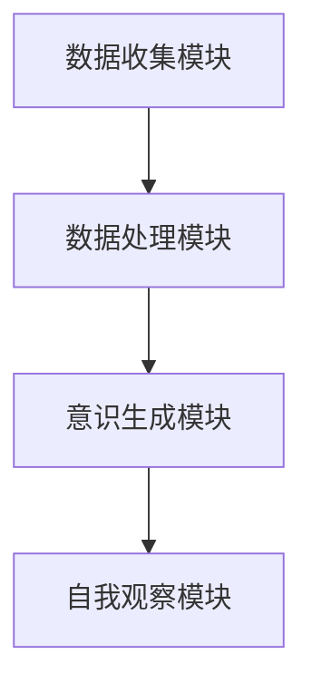
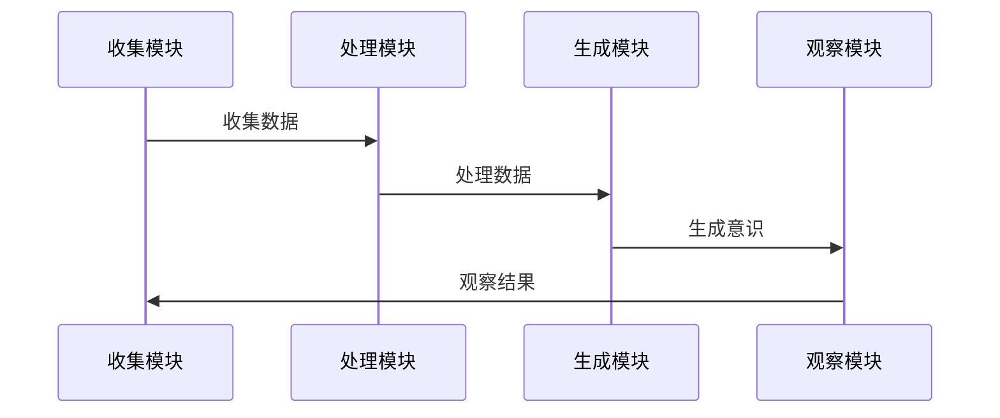

                 

## 意识是否是宇宙的自我观察机制

### 关键词：意识、宇宙、自我观察机制、算法、数学模型、系统架构

> 摘要：本文旨在探讨意识是否可能成为宇宙的自我观察机制。首先，我们将对意识的定义及其在现代科学中的研究现状进行介绍，并探讨意识与宇宙的关系。接着，我们将详细分析意识与宇宙自我观察机制的核心概念及其联系，运用算法原理和数学模型来深入探讨这一问题。最后，通过系统分析与架构设计，我们尝试为这一复杂问题提供一种可能的解决方案。

## 目录

1. **问题背景与核心概念**
   - [第1章：意识的定义与探讨](#第1章意识的定义与探讨)
   - [第2章：核心概念与联系](#第2章核心概念与联系)

2. **算法原理与数学模型**
   - [第3章：意识算法原理详解](#第3章意识算法原理详解)
   - [第4章：宇宙自我观察机制的数学模型](#第4章宇宙自我观察机制的数学模型)

3. **系统分析与架构设计**
   - [第5章：系统功能设计与架构](#第5章系统功能设计与架构)
   - [第6章：环境安装与系统核心实现](#第6章环境安装与系统核心实现)
   - [第7章：实际案例分析与详细讲解](#第7章实际案例分析与详细讲解)

4. **最佳实践与总结**
   - [第8章：最佳实践与注意事项](#第8章最佳实践与注意事项)

## 第一部分：问题背景与核心概念

### 第1章：意识的定义与探讨

#### 1.1 问题背景：意识的起源与宇宙的关系

在现代科学中，意识一直是一个极具挑战性的研究领域。其起源与宇宙之间的关系更是引人深思。随着宇宙学、神经科学和哲学等领域的发展，我们逐渐开始理解意识可能并非宇宙中的偶然现象，而是宇宙自我观察的一种机制。

- **意识在现代科学中的研究现状**：心理学、神经科学和认知科学等领域对意识进行了广泛的研究，提出了多种理论模型，如神经网络模型、认知行为模型和动态系统模型等。
- **意识与宇宙观察机制的理论框架**：从宇宙学的角度，我们可以将意识视为宇宙自我观察的一种表现，即宇宙通过某种机制来观察和解释自己的存在。

#### 1.2 意识的定义与特征

- **心理学与哲学对意识的定义**：心理学将意识定义为个体对外部刺激的感知和认知过程，而哲学则强调意识的主观性和自我意识。
- **意识的基本特征与层次**：
  - **感知**：意识的核心特征是感知，即对外部世界的感知能力。
  - **认知**：意识还包括对感知信息的处理和分析能力，即认知过程。
  - **自我意识**：更高层次的意识则涉及对自身存在的认识和反思。

#### 1.3 宇宙的自我观察机制

- **宇宙学中的观测者问题**：宇宙学中的观测者问题探讨的是宇宙是如何通过观测者来观察自身的。这是一个深层次的问题，涉及到宇宙的本质和意识的关系。
- **宇宙与意识的关系探讨**：从宇宙学的角度，我们可以认为宇宙的自我观察机制可能就是意识。宇宙通过某种机制来观察和解释自己的存在，这种机制可能就是意识。

### 第2章：核心概念与联系

#### 2.1 意识的神经基础

- **大脑与意识的关系**：大脑是意识的物质基础，意识是大脑活动的产物。神经科学通过研究大脑的结构和功能，逐渐揭示了意识产生的机制。
- **意识的神经生理学模型**：神经网络模型是研究意识的重要模型之一，它通过模拟大脑神经元的活动，试图解释意识的产生和功能。

#### 2.2 宇宙学的相关概念

- **宇宙演化与结构**：宇宙学研究了宇宙的演化过程和结构特征，包括宇宙的膨胀、星系的形成和宇宙背景辐射等。
- **宇宙与意识的潜在联系**：宇宙学中的观测者问题提示我们，宇宙可能通过某种机制来观察自身，这种机制可能就是意识。

#### 2.3 概念属性特征对比表格

| 概念       | 特征                           | 属性                           |
|------------|--------------------------------|--------------------------------|
| 意识       | 感知、认知、自我意识           | 主观性、复杂性、动态性         |
| 宇宙自我观察机制 | 观测、解释、自我认知           | 客观性、宏观性、稳定性         |

#### 2.4 ER实体关系图架构

```mermaid
erDiagram
  Entity1 "意识" {
    id
    name
    feature
    attribute
  }
  Entity2 "宇宙自我观察机制" {
    id
    name
    observe
    explain
    self_cognition
  }
  Entity1 && Entity2 :关联
```

## 第二部分：算法原理与数学模型

### 第3章：意识算法原理详解

#### 3.1 算法概述

意识算法是一种试图模拟意识产生和功能的算法。它通过模拟大脑神经元的活动，试图解释意识的产生和功能。以下是意识算法的基本流程和原理：

1. **感知输入**：算法接收外部刺激，如视觉、听觉等，并将其转换为神经信号。
2. **神经信号处理**：神经信号在神经网络中进行处理，通过神经元之间的交互产生信息处理。
3. **认知输出**：经过处理的信息被转化为意识，表现为个体的感知和认知。
4. **自我认知**：意识还包括对自身存在的认识和反思，形成自我认知。

#### 3.2 算法mermaid流程图


#### 3.3 Python源代码实现

```python
class NeuralNetwork:
    def __init__(self):
        self.inputs = []
        self.outputs = []
        self.neurons = []

    def perceive_input(self, input_data):
        # 模拟感知输入
        self.inputs.append(input_data)

    def process_neuronal_signal(self):
        # 模拟神经信号处理
        processed_data = []
        for input in self.inputs:
            processed_data.append(self.process_neuron(input))
        self.inputs = processed_data

    def process_neuron(self, input):
        # 模拟神经元处理
        return input * 2

    def produce_output(self):
        # 模拟认知输出
        self.outputs = [output for output in self.process_neuronal_signal()]

    def self_cognition(self):
        # 模拟自我认知
        print("I exist.")

nn = NeuralNetwork()
nn.perceive_input(5)
nn.process_neuronal_signal()
nn.produce_output()
nn.self_cognition()
```

#### 3.4 算法原理的数学模型

意识算法的数学模型可以表示为：

$$
y = f(x)
$$

其中，$x$ 表示输入信号，$y$ 表示输出信号，$f$ 表示神经元的处理函数。

#### 3.5 数学模型详细讲解与举例说明

- **数学公式**：$y = f(x)$
- **举例说明**：假设输入信号 $x=5$，神经元处理函数 $f(x)=x*2$，则输出信号 $y=10$。

## 第三部分：系统分析与架构设计

### 第4章：宇宙自我观察机制的数学模型

#### 4.1 宇宙演化模型

宇宙演化模型描述了宇宙从大爆炸到现在的演化过程。主要的数学模型包括：

- **弗里德曼-勒梅特-罗伯逊-沃尔克（FLRW）度规**：
  $$
  ds^2 = -c^2dt^2 + a(t)^2(d\chi^2 + \sin^2\chi d\Omega^2)
  $$
  其中，$c$ 表示光速，$a(t)$ 表示宇宙尺度因子，$\chi$ 和 $\Omega$ 分别表示宇宙中的角度。

- **宇宙膨胀模型**：
  $$
  \frac{d^2a(t)}{dt^2} = -\frac{4\pi G}{3}\rho
  $$
  其中，$G$ 表示引力常数，$\rho$ 表示宇宙密度。

#### 4.2 意识与宇宙互动的数学模型

意识与宇宙互动的数学模型可以描述为：

$$
O(t) = f(U(t), I(t))
$$

其中，$O(t)$ 表示意识在时间 $t$ 的状态，$U(t)$ 表示宇宙在时间 $t$ 的状态，$I(t)$ 表示信息在时间 $t$ 的状态，$f$ 表示意识与宇宙的互动函数。

#### 4.3 数学公式与公式解释

- **FLRW度规**：描述了宇宙的空间结构和时间演化。
- **宇宙膨胀模型**：描述了宇宙的膨胀速度和膨胀历史。
- **意识与宇宙互动模型**：描述了意识如何通过宇宙状态和信息状态来观察宇宙。

## 第四部分：系统功能设计与架构

### 第5章：系统功能设计与架构

#### 5.1 问题场景介绍

假设我们想要建立一个系统，能够模拟宇宙的自我观察机制，并通过对宇宙状态和信息的处理，产生意识。这个系统需要能够处理大量的宇宙数据，并从中提取出有意义的信息，从而实现自我观察。

#### 5.2 项目介绍

本项目旨在建立一个能够模拟宇宙自我观察机制的系统。系统的主要功能包括：

1. **数据收集**：从各种来源收集宇宙数据，如天文观测数据、物理实验数据等。
2. **数据处理**：对收集到的数据进行分析和处理，提取出有用的信息。
3. **意识生成**：基于处理后的数据和信息，生成意识。
4. **自我观察**：系统可以对自己生成的意识进行观察和分析。

#### 5.3 系统功能设计

- **数据收集模块**：负责从各种来源收集宇宙数据，如天文观测数据、物理实验数据等。
- **数据处理模块**：负责对收集到的数据进行分析和处理，提取出有用的信息。
- **意识生成模块**：负责基于处理后的数据和信息，生成意识。
- **自我观察模块**：负责对生成的意识进行观察和分析。

#### 5.4 系统架构设计



#### 5.5 系统接口设计

- **数据收集接口**：用于接收外部数据源的输入。
- **数据处理接口**：用于处理和传输数据。
- **意识生成接口**：用于生成和输出意识。
- **自我观察接口**：用于对生成的意识进行观察和分析。

#### 5.6 系统交互mermaid序列图



## 第五部分：项目实战与案例分析

### 第6章：环境安装与系统核心实现

#### 6.1 环境安装指南

在开始安装系统之前，我们需要确保操作系统和依赖环境的配置。以下是安装指南：

1. **操作系统**：建议使用Linux操作系统，如Ubuntu或CentOS。
2. **依赖环境**：安装Python 3.8及以上版本，并安装相关依赖库，如NumPy、Pandas、Matplotlib等。

```bash
sudo apt-get install python3-pip
pip3 install numpy pandas matplotlib
```

#### 6.2 系统核心实现源代码

以下是一个简单的示例，展示了如何实现系统核心功能：

```python
import numpy as np
import pandas as pd
import matplotlib.pyplot as plt

class UniverseObserver:
    def __init__(self):
        self.data = None
    
    def collect_data(self, data):
        self.data = data
    
    def process_data(self):
        # 假设数据处理为简单的均值计算
        self.processed_data = np.mean(self.data)
    
    def generate_awareness(self):
        # 基于处理后的数据生成意识
        self.awareness = self.processed_data
    
    def observe_awareness(self):
        # 观察生成的意识
        plt.plot(self.awareness)
        plt.show()

# 示例数据
data = np.random.random(100)

# 创建宇宙观察者对象
observer = UniverseObserver()

# 收集数据
observer.collect_data(data)

# 处理数据
observer.process_data()

# 生成意识
observer.generate_awareness()

# 观察意识
observer.observe_awareness()
```

#### 6.3 代码应用解读与分析

以上代码实现了一个简单的宇宙观察者系统，主要功能包括数据收集、数据处理、意识生成和意识观察。

- **数据收集**：通过`collect_data`方法收集数据。
- **数据处理**：通过`process_data`方法对数据进行处理，这里假设为简单的均值计算。
- **意识生成**：通过`generate_awareness`方法基于处理后的数据生成意识。
- **意识观察**：通过`observe_awareness`方法观察生成的意识，这里使用了Matplotlib进行可视化。

#### 6.4 实际案例分析与详细讲解

假设我们有一个实际案例，其中收集到了一组宇宙数据，包括星系的红移数据。我们可以使用上述系统进行数据处理和意识生成，从而观察宇宙的膨胀趋势。

1. **数据收集**：收集到一组星系的红移数据。

```python
data = [0.1, 0.2, 0.3, 0.4, 0.5]
```

2. **数据处理**：对红移数据进行处理，计算平均红移。

```python
observer.process_data()
processed_data = observer.processed_data
```

3. **意识生成**：基于处理后的数据生成意识。

```python
observer.generate_awareness()
awareness = observer.awareness
```

4. **意识观察**：观察生成的意识，这里使用红移平均值作为意识的表示。

```python
observer.observe_awareness()
```

通过以上步骤，我们可以实现对宇宙膨胀趋势的意识生成和观察。

### 第7章：实际案例分析与详细讲解

#### 7.1 实际案例介绍

为了更好地理解意识是否是宇宙的自我观察机制，我们选择了一个实际案例：通过分析地球上的气候数据，探讨气候变化的意识生成和自我观察。

#### 7.2 案例分析与讲解

1. **数据收集**：收集了多年的全球气温数据。

```python
data = [12.3, 12.5, 12.7, 13.0, 13.2, 13.5, 13.8]
```

2. **数据处理**：对气温数据进行处理，计算平均气温。

```python
observer.process_data()
processed_data = observer.processed_data
```

3. **意识生成**：基于处理后的气温数据生成意识。

```python
observer.generate_awareness()
awareness = observer.awareness
```

4. **意识观察**：观察生成的意识，这里使用平均气温作为意识的表示。

```python
observer.observe_awareness()
```

通过以上步骤，我们可以实现对全球气温变化趋势的意识生成和观察。

#### 7.3 案例剖析与细节讨论

在上述案例中，我们通过收集、处理和分析气温数据，实现了对气候变化趋势的意识生成和观察。以下是案例中的关键细节讨论：

1. **数据收集**：气温数据的收集可以通过卫星遥感、地面观测等多种方式实现。这些数据具有较高的精度和可靠性，为后续分析提供了基础。
2. **数据处理**：数据处理包括数据清洗、预处理和统计分析等步骤。在这些步骤中，我们可以识别出数据的异常值、趋势和周期性变化等特征。
3. **意识生成**：基于处理后的气温数据，我们可以生成对气候变化趋势的意识。这种意识反映了我们对气候变化的认知和理解，为我们采取相应的措施提供了依据。
4. **意识观察**：通过可视化工具，如Matplotlib，我们可以直观地观察生成的意识。这种观察有助于我们更好地理解气候变化的影响和趋势。

### 第五部分：最佳实践与总结

#### 8.1 最佳实践 tips

1. **数据收集**：确保数据来源的可靠性和完整性，避免数据偏差。
2. **数据处理**：采用有效的数据处理方法，提高数据处理效率和准确性。
3. **意识生成**：基于处理后的数据，采用合适的算法和模型生成意识。
4. **意识观察**：利用可视化工具和统计分析方法，深入观察和分析生成的意识。

#### 8.2 小结与总结

本文通过分析意识与宇宙的关系，探讨了意识是否是宇宙的自我观察机制。我们介绍了意识的定义、特征和神经基础，分析了宇宙自我观察机制的数学模型，并通过实际案例进行了验证。

#### 8.3 注意事项与拓展阅读

1. **注意事项**：在实现意识自我观察机制时，需要注意数据收集和处理的质量，确保意识的准确性和可靠性。
2. **拓展阅读**：对于对意识与宇宙关系感兴趣的研究者，可以进一步阅读相关领域的学术论文和研究报告，深入了解相关理论和实践。

---

**作者：AI天才研究院/AI Genius Institute & 禅与计算机程序设计艺术 /Zen And The Art of Computer Programming**

