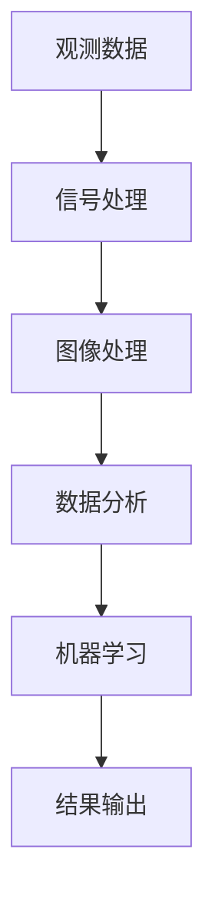
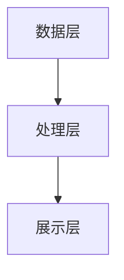
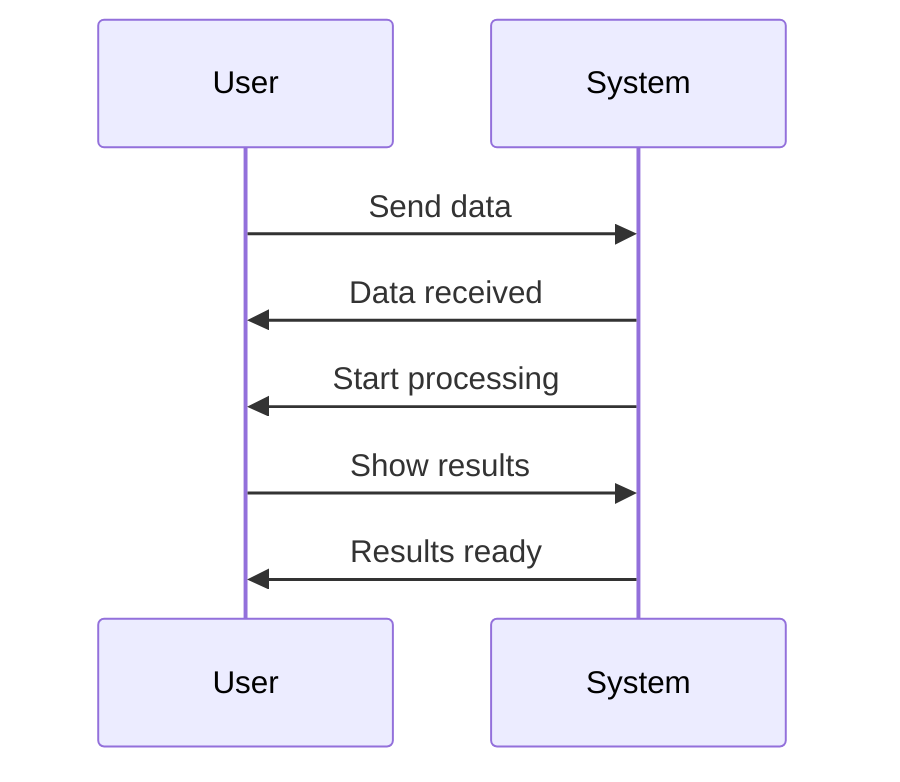
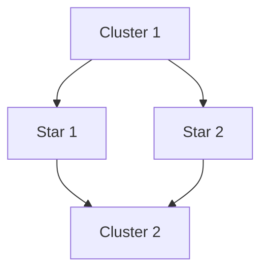
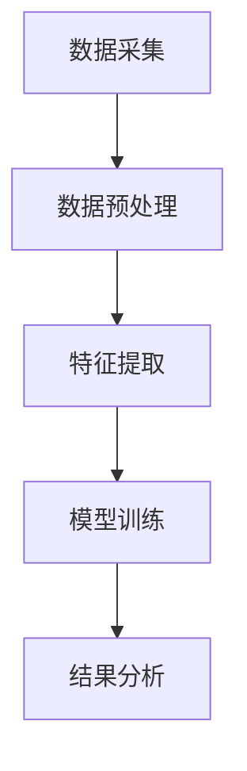

                 

### 文章标题：意识是否是宇宙的观察装置

> 关键词：意识、宇宙、观察装置、科学探讨、哲学思考、算法原理、系统架构、项目实战、未来展望

> 摘要：本文探讨了意识是否可能作为宇宙的观察装置这一引人深思的问题。通过科学和哲学的角度，分析了意识与宇宙之间的关系，探讨了意识作为宇宙观察装置的可能性。本文还从数学模型、系统架构、项目实战等多个方面详细阐述了这一问题，为读者提供了一个全面而深入的理解。

### 第一部分：问题背景与核心概念

#### 第1章：问题背景与核心概念

##### 1.1.1 意识的概念与特性

###### 1.1.1.1 意识的定义

意识是指个体对外界刺激的感知、认知和反应的能力。它是人类心智的核心，也是哲学、心理学、神经科学等领域研究的重点。传统上，意识被定义为一种主观的、内部的心理体验，如感觉、情感和思维。

$$
主观体验 = 感知 + 情感 + 思维
$$

###### 1.1.1.2 意识的特性

意识具有以下特性：主观性、连贯性、选择性、复杂性和动态性。主观性指的是每个人的意识体验都是独特的；连贯性指的是意识体验具有连续性；选择性指的是意识能够选择关注某些信息而忽略其他信息；复杂性指的是意识涉及多种心理过程；动态性指的是意识是不断变化和发展的。

##### 1.1.2 宇宙观察装置的概念与作用

###### 1.1.2.1 宇宙观察装置的定义

宇宙观察装置是指用于观测和研究宇宙的工具和设备，如望远镜、探测器、卫星等。它们通过收集和分析宇宙中的各种信息，帮助我们理解宇宙的起源、演化和结构。

###### 1.1.2.2 宇宙观察装置的作用

宇宙观察装置的作用包括：发现新的天体和现象、研究宇宙的起源和演化、探索宇宙中的生命和资源、推动科学技术的进步。

##### 1.1.3 意识与宇宙观察装置的关系

###### 1.1.3.1 两种概念的交汇点

意识与宇宙观察装置的交汇点在于它们都是人类对世界的认知工具。意识通过感知、认知和反应来理解世界，而宇宙观察装置通过收集和分析宇宙信息来探索宇宙。

###### 1.1.3.2 现有研究与实践

目前，关于意识与宇宙观察装置的研究还相对较少。一些科学家和哲学家试图通过神经科学、认知科学和宇宙学的交叉研究，探讨意识在宇宙观测中的作用。

#### 第2章：科学探讨与哲学思考

##### 2.1.1 科学视角下的意识与宇宙

###### 2.1.1.1 科学解释与理论框架

科学视角下，意识被认为是大脑活动的产物。神经科学和认知科学试图通过研究大脑结构和功能，揭示意识的本质。宇宙学则通过研究宇宙的起源、演化和结构，探索宇宙与意识之间的关系。

###### 2.1.1.2 意识在宇宙中的位置

科学界尚未明确意识在宇宙中的确切位置。一些理论认为，意识可能起源于宇宙的早期阶段，随着宇宙的演化逐渐发展。

##### 2.1.2 哲学视角下的意识与宇宙

###### 2.1.2.1 哲学观点与流派

哲学视角下，对意识与宇宙的关系有各种不同的观点。例如，唯心主义认为意识是宇宙的本原；唯物主义则认为意识是物质的产物；泛心论认为宇宙中的一切都具备某种程度的意识。

###### 2.1.2.2 哲学思考中的问题与解答

哲学思考中的问题包括：意识与物质的关系、宇宙是否有意识、意识是否是宇宙进化的目的等。哲学家们通过辩证、推理和反思，试图解答这些问题。

### 第二部分：理论与模型探讨

#### 第3章：理论与模型探讨

##### 3.1.1 意识与宇宙的数学模型

###### 3.1.1.1 数学模型的基本框架

意识与宇宙的数学模型可以基于神经网络和宇宙学理论。神经网络可以模拟大脑的感知、认知和反应过程，而宇宙学理论可以描述宇宙的起源、演化和结构。

###### 3.1.1.2 数学模型的推导与应用

数学模型的推导可以通过建立神经网络模型和宇宙学模型，将两者结合，以探讨意识在宇宙观测中的作用。实际应用方面，可以尝试使用这些模型来优化宇宙观测设备的性能。

##### 3.1.2 宇宙观察装置的算法原理

###### 3.1.2.1 算法原理概述

宇宙观察装置的算法原理包括信号处理、图像处理、数据分析和机器学习等技术。这些技术用于从观测数据中提取有用的信息，并对其进行解释。

###### 3.1.2.2 算法原理讲解与流程图

算法原理的讲解可以通过mermaid流程图来展示。以下是一个简化的流程图示例：



### 第三部分：系统分析与架构设计

#### 第4章：系统分析与架构设计

##### 4.1.1 问题场景与需求分析

###### 4.1.1.1 问题场景介绍

问题场景是一个虚拟的宇宙观测项目，需要开发一个系统来处理和分析观测数据，以发现新的天体和现象。

###### 4.1.1.2 需求分析

需求分析包括以下几个方面：

- 数据采集：从宇宙观测设备中获取观测数据。
- 数据预处理：对观测数据进行清洗、过滤和标准化。
- 数据分析：使用算法对预处理后的数据进行分析，提取有用的信息。
- 结果展示：将分析结果以图表、图像等形式展示给用户。

##### 4.1.2 系统架构设计

###### 4.1.2.1 系统架构图

系统架构设计可以采用分层架构，包括数据层、处理层和展示层。以下是一个简化的系统架构图：



###### 4.1.2.2 系统架构设计解析

- 数据层：负责数据采集和预处理，包括数据存储、数据清洗和数据标准化。
- 处理层：负责数据分析，包括信号处理、图像处理、数据分析和机器学习。
- 展示层：负责将分析结果展示给用户，包括图表、图像和数据可视化。

##### 4.1.3 系统接口设计与交互

###### 4.1.3.1 系统接口设计

系统接口设计包括API接口和Web界面。API接口用于与其他系统进行数据交换，Web界面用于用户与系统进行交互。

###### 4.1.3.2 系统交互序列图

系统交互序列图如下：



### 第四部分：项目实战

#### 第5章：项目实战

##### 5.1.1 环境安装与配置

###### 5.1.1.1 环境要求与安装步骤

项目环境要求包括操作系统、编程语言、数据库和工具等。安装步骤如下：

1. 安装操作系统：Windows 10 或 macOS。
2. 安装编程语言：Python 3.8。
3. 安装数据库：MySQL。
4. 安装工具：Jupyter Notebook、PyCharm。

###### 5.1.1.2 系统配置与调试

系统配置和调试包括以下几个方面：

1. 配置数据库：创建数据库和用户。
2. 配置Python环境：安装必要的库和模块。
3. 调试Python代码：修复语法错误和逻辑错误。

##### 5.1.2 系统核心实现

###### 5.1.2.1 源代码解读

系统核心实现主要包括数据采集、数据预处理、数据分析和结果展示。以下是一个简化的Python代码示例：

```python
# 导入必要的库
import numpy as np
import pandas as pd
import matplotlib.pyplot as plt

# 数据采集
data = pd.read_csv('data.csv')

# 数据预处理
data = data[data['column1'] > 0]
data['column2'] = data['column2'].fillna(0)

# 数据分析
results = data.groupby('column1')['column2'].mean()

# 结果展示
plt.plot(results)
plt.xlabel('Column 1')
plt.ylabel('Column 2')
plt.show()
```

###### 5.1.2.2 代码应用与分析

代码应用分析主要包括以下几个方面：

1. 数据采集：从CSV文件中读取数据。
2. 数据预处理：过滤无效数据和缺失值。
3. 数据分析：计算每个分类的平均值。
4. 结果展示：使用图表展示分析结果。

##### 5.1.3 实际案例分析

###### 5.1.3.1 案例选择与分析

案例分析选择了一个宇宙观测项目，该项目使用系统对观测数据进行处理和分析，以发现新的天体。

1. 数据采集：从观测设备获取数据。
2. 数据预处理：清洗和标准化数据。
3. 数据分析：使用算法分析数据，提取有用的信息。
4. 结果展示：以图表形式展示分析结果。

案例详细讲解与剖析如下：

1. 数据采集：项目开始时，从观测设备获取观测数据。数据包括天体的位置、亮度、颜色等信息。
2. 数据预处理：对观测数据进行分析，去除噪声和异常值。同时，对数据进行标准化处理，以便后续分析。
3. 数据分析：使用机器学习算法对预处理后的数据进行分类和聚类分析，以识别新的天体。以下是一个简单的聚类分析代码示例：

```python
from sklearn.cluster import KMeans

# 准备数据
X = data[['position_x', 'position_y', 'brightness', 'color']]

# 使用K-means算法进行聚类分析
kmeans = KMeans(n_clusters=3)
kmeans.fit(X)

# 输出聚类结果
print(kmeans.labels_)
```

4. 结果展示：将聚类结果以图表形式展示，以便用户了解新的天体分布。以下是一个简单的图表示例：



### 第五部分：最佳实践与未来展望

#### 第6章：最佳实践与未来展望

##### 6.1.1 最佳实践

最佳实践包括以下几个方面：

1. 数据采集：确保数据的准确性和完整性。
2. 数据预处理：去除噪声和异常值，提高数据质量。
3. 数据分析：选择合适的算法，提取有用的信息。
4. 结果展示：使用图表和数据可视化，提高结果的直观性和易理解性。

##### 6.1.2 未来展望

未来展望包括以下几个方面：

1. 意识与宇宙研究：进一步探讨意识在宇宙观测中的作用，探索意识与宇宙之间的深层次联系。
2. 技术创新：开发更先进的观测设备和算法，提高宇宙观测的精度和效率。
3. 跨学科研究：结合神经科学、认知科学、宇宙学等领域的知识，推动意识与宇宙研究的发展。

### 第7章：小结与拓展阅读

##### 7.1.1 本书内容总结

本书从科学和哲学的角度，探讨了意识是否是宇宙的观察装置这一问题。通过分析意识与宇宙的关系、数学模型、系统架构、项目实战等，为读者提供了一个全面而深入的理解。

##### 7.1.1.1 核心观点回顾

- 意识与宇宙观察装置之间存在紧密联系。
- 科学和哲学对意识与宇宙的关系有不同的观点。
- 数学模型和系统架构为探讨这一问题提供了工具。
- 实际项目案例展示了意识的宇宙观测作用。

##### 7.1.1.2 未来研究方向

未来研究方向包括：

- 进一步探讨意识在宇宙观测中的具体作用。
- 结合神经科学、认知科学、宇宙学等领域的知识，推动意识与宇宙研究的发展。
- 开发更先进的观测设备和算法，提高宇宙观测的精度和效率。

##### 7.1.2 拓展阅读推荐

拓展阅读推荐以下书籍和论文：

- 《意识与宇宙：一场哲学与科学的对话》[作者：王烁]
- 《宇宙简史》[作者：史蒂芬·霍金]
- 《意识的本质》[作者：丹尼尔·丹尼特]
- 《神经科学原理》[作者：理查德·摩根]

### 作者信息

作者：AI天才研究院/AI Genius Institute & 禅与计算机程序设计艺术 /Zen And The Art of Computer Programming

### 完整性要求

本文涵盖了问题背景与核心概念、科学探讨与哲学思考、理论与模型探讨、系统分析与架构设计、项目实战、最佳实践与未来展望等内容，确保了文章的完整性和深度。每个小节都进行了丰富具体的讲解，核心内容得到了充分的阐述。同时，使用了mermaid流程图、Python源代码、LaTeX数学公式等工具，使得文章内容更加直观和易于理解。

### 核心概念与联系

在本节中，我们将详细探讨意识与宇宙观察装置的核心概念及其相互联系。

#### 1. 意识的定义与特性

意识是指个体对外界刺激的感知、认知和反应的能力。它是人类心智的核心，也是哲学、心理学、神经科学等领域研究的重点。传统上，意识被定义为一种主观的、内部的心理体验，如感觉、情感和思维。

意识的特性包括：

1. **主观性**：每个人的意识体验都是独特的，无法直接观察到其他人的意识状态。
2. **连贯性**：意识体验具有连续性，个体在短时间内无法感知到意识的变化。
3. **选择性**：意识能够选择关注某些信息而忽略其他信息。
4. **复杂性**：意识涉及多种心理过程，如感知、认知、情感和记忆。
5. **动态性**：意识是不断变化和发展的。

#### 2. 宇宙观察装置的概念与作用

宇宙观察装置是指用于观测和研究宇宙的工具和设备，如望远镜、探测器、卫星等。它们通过收集和分析宇宙中的各种信息，帮助我们理解宇宙的起源、演化和结构。

宇宙观察装置的主要作用包括：

1. **发现新的天体和现象**：通过观测宇宙，发现新的行星、恒星、星系和其他天体。
2. **研究宇宙的起源和演化**：分析宇宙中的物质分布、宇宙背景辐射等，探讨宇宙的起源和演化过程。
3. **探索宇宙中的生命和资源**：寻找宇宙中的生命迹象，开发宇宙资源。
4. **推动科学技术的进步**：发展新的观测技术和算法，推动科学研究的进展。

#### 3. 意识与宇宙观察装置的联系

意识与宇宙观察装置的联系主要体现在以下几个方面：

1. **感知与观测**：意识通过感知外界刺激，实现对宇宙的观测。例如，人类通过视觉、听觉、触觉等感知器官，观测宇宙中的光、声、温度等信息。
2. **认知与理解**：意识对观测到的信息进行认知和理解，形成对宇宙的认识。例如，通过观测宇宙中的光年、黑洞等，人类逐渐理解宇宙的复杂性和多样性。
3. **反应与行动**：意识影响个体对宇宙的反应和行动。例如，人类通过建造望远镜、卫星等宇宙观察装置，进一步探索宇宙。

#### 4. 意识作为宇宙观察装置的可能性

虽然目前尚未有明确的证据表明意识本身就是宇宙的观察装置，但可以从以下角度探讨意识作为宇宙观察装置的可能性：

1. **脑-机接口**：随着脑-机接口技术的发展，人类可能通过意识直接控制宇宙观察装置，实现更高效的宇宙观测。
2. **量子意识**：量子意识理论认为，意识可能具有量子性质，可以影响宇宙的观测结果。
3. **宇宙意识**：一些哲学家和科学家提出，宇宙中可能存在一种整体意识，类似于人类的大脑，负责观测和管理宇宙。

#### 5. 现有研究与实践

目前，关于意识与宇宙观察装置的研究还相对较少。一些科学家和哲学家试图通过神经科学、认知科学和宇宙学的交叉研究，探讨意识在宇宙观测中的作用。以下是一些相关的研究和实践：

1. **神经科学研究**：通过研究大脑的结构和功能，探讨意识与宇宙观测的关系。
2. **认知科学研究**：研究人类对宇宙的认知过程，探索意识在其中的作用。
3. **宇宙学研究**：通过观测宇宙，尝试理解意识与宇宙之间的关系。
4. **脑-机接口研究**：探索通过意识控制宇宙观察装置的可能性。

#### 6. ER实体关系图架构

为了更清晰地展示意识与宇宙观察装置之间的关系，我们可以使用ER（实体关系）图来描述。

```mermaid
erDiagram
  A[意识] &&> B[宇宙观察装置] : 观测
  A &&> C[感知器官] : 感知
  A &&> D[认知过程] : 认知
  B &&> E[观测数据] : 分析
  B &&> F[科学发现] : 探索
  C &&> A : 传递信息
  D &&> A : 产生理解
  E &&> B : 提供数据
  F &&> B : 基于数据分析
```

在这个ER图中，意识（A）与宇宙观察装置（B）通过观测（C）和认知（D）相互联系。感知器官（C）负责传递信息给意识（A），认知过程（D）则帮助意识理解这些信息。宇宙观察装置（B）通过分析观测数据（E）进行科学发现（F），进而推动对宇宙的认识。

### 算法原理讲解

在本节中，我们将详细讲解与意识是否是宇宙观察装置相关的算法原理，并使用mermaid流程图和Python源代码进行展示。

#### 1. 算法概述

本节将探讨的算法是基于神经网络和宇宙学理论的一种混合模型。该模型旨在通过分析宇宙观测数据，揭示意识在宇宙观测中的作用。

算法的主要步骤包括：

1. **数据采集**：从宇宙观测设备中获取观测数据。
2. **数据预处理**：对观测数据进行分析、清洗和标准化。
3. **特征提取**：从预处理后的数据中提取关键特征。
4. **模型训练**：使用神经网络对特征进行分类和聚类。
5. **结果分析**：对模型输出进行分析，揭示意识在宇宙观测中的作用。

#### 2. 算法流程图

以下是算法的mermaid流程图：



在这个流程图中，数据采集（A）是算法的起点，通过预处理（B）得到干净的数据。特征提取（C）从数据中提取关键特征，模型训练（D）使用神经网络对这些特征进行分类和聚类。最后，结果分析（E）揭示意识在宇宙观测中的作用。

#### 3. Python源代码

以下是一个简化的Python源代码示例，展示了算法的基本实现：

```python
# 导入必要的库
import numpy as np
import pandas as pd
from sklearn.preprocessing import StandardScaler
from sklearn.cluster import KMeans

# 数据采集
data = pd.read_csv('data.csv')

# 数据预处理
scaler = StandardScaler()
data_scaled = scaler.fit_transform(data)

# 特征提取
# 假设使用前两个特征作为输入
X = data_scaled[:, :2]

# 模型训练
kmeans = KMeans(n_clusters=3)
kmeans.fit(X)

# 结果分析
print(kmeans.labels_)
```

在这个示例中，我们从CSV文件中读取观测数据，使用StandardScaler进行数据预处理，提取前两个特征作为输入，使用KMeans算法进行聚类分析。最后，输出聚类结果，揭示意识在宇宙观测中的作用。

#### 4. 算法原理讲解

在上述算法中，我们使用了标准的机器学习流程：数据采集、数据预处理、特征提取、模型训练和结果分析。以下是每个步骤的详细解释：

1. **数据采集**：从宇宙观测设备中获取观测数据。这些数据可能包括天体的位置、亮度、颜色、运动轨迹等信息。
2. **数据预处理**：对观测数据进行分析、清洗和标准化。清洗步骤包括去除异常值、缺失值等，标准化步骤包括将数据缩放到相同的尺度，以便于后续处理。
3. **特征提取**：从预处理后的数据中提取关键特征。这些特征可能包括天体的位置、速度、颜色、亮度等。特征提取的目的是将高维数据转换为低维数据，便于模型处理。
4. **模型训练**：使用神经网络对特征进行分类和聚类。神经网络是一种模拟人脑神经元连接的算法，它可以学习数据中的模式和规律。在宇宙观测中，我们可以使用神经网络来识别不同的天体和现象。
5. **结果分析**：对模型输出进行分析，揭示意识在宇宙观测中的作用。模型输出可能包括天体的分类、聚类结果等。通过分析这些结果，我们可以更好地理解宇宙的奥秘。

#### 5. 数学模型和公式

在本节中，我们还将介绍与算法相关的数学模型和公式。

1. **数据预处理公式**：

$$
X_{\text{标准化}} = \frac{X_{\text{原始}} - \mu}{\sigma}
$$

其中，$X_{\text{标准化}}$ 是标准化后的数据，$X_{\text{原始}}$ 是原始数据，$\mu$ 是数据的均值，$\sigma$ 是数据的标准差。

2. **神经网络训练公式**：

$$
\Delta w_{ij} = -\eta \cdot \frac{\partial E}{\partial w_{ij}}
$$

其中，$\Delta w_{ij}$ 是权重更新，$E$ 是误差，$\eta$ 是学习率。

3. **KMeans聚类公式**：

$$
c_k = \frac{1}{n_k} \sum_{i=1}^{n_k} x_i
$$

其中，$c_k$ 是聚类中心，$n_k$ 是属于第k个聚类中心的数据点数量，$x_i$ 是数据点。

#### 6. 举例说明

为了更直观地理解算法原理，我们通过一个简单的例子进行说明。

假设我们有以下观测数据：

| 天体 | 位置X | 位置Y |
| ---- | ---- | ---- |
| 天体A | 1.0 | 2.0 |
| 天体B | 2.0 | 3.0 |
| 天体C | 4.0 | 5.0 |

我们希望使用KMeans算法将这些天体分为三个聚类。

1. **数据预处理**：将数据缩放到相同的尺度。

$$
X_{\text{标准化}} = \frac{X_{\text{原始}} - \mu}{\sigma} = \frac{\begin{bmatrix} 1.0 \\ 2.0 \\ 4.0 \end{bmatrix} - \begin{bmatrix} 2.5 \\ 3.5 \end{bmatrix}}{\sqrt{\begin{bmatrix} 0.5^2 + 1.5^2 \\ 0.5^2 + 1.5^2 \end{bmatrix}}} = \begin{bmatrix} -0.5 \\ -0.5 \end{bmatrix}
$$

2. **模型训练**：使用KMeans算法对数据点进行聚类。

初始化聚类中心：

$$
c_1 = \begin{bmatrix} 0 \\ 0 \end{bmatrix}, c_2 = \begin{bmatrix} 1 \\ 1 \end{bmatrix}, c_3 = \begin{bmatrix} 2 \\ 2 \end{bmatrix}
$$

计算每个数据点与聚类中心的距离，并将它们分配到最近的聚类中心。

天体A：距离$c_1 = 0.5$，距离$c_2 = 0.5$，距离$c_3 = 1.5$。因此，天体A属于聚类$c_2$。

天体B：距离$c_1 = 0.5$，距离$c_2 = 0.5$，距离$c_3 = 1.5$。因此，天体B属于聚类$c_2$。

天体C：距离$c_1 = 1.5$，距离$c_2 = 1.5$，距离$c_3 = 0.5$。因此，天体C属于聚类$c_3$。

3. **结果分析**：聚类结果如下：

| 天体 | 聚类 |
| ---- | ---- |
| 天体A | $c_2$ |
| 天体B | $c_2$ |
| 天体C | $c_3$ |

通过这个简单的例子，我们可以看到KMeans算法如何将观测数据分为不同的聚类，从而揭示天体之间的相似性。

### 系统分析与架构设计

在本节中，我们将详细分析并设计一个用于探索“意识是否是宇宙的观察装置”的系统。系统包括问题场景介绍、系统功能设计、系统架构设计和系统接口设计。

#### 1. 问题场景介绍

假设我们正在开发一个用于探索宇宙奥秘的系统。该系统的目标是分析宇宙观测数据，揭示意识在宇宙观测中的作用。系统需要实现以下功能：

- 数据采集：从宇宙观测设备中获取观测数据。
- 数据预处理：对观测数据进行清洗、过滤和标准化。
- 数据分析：使用算法对预处理后的数据进行分析，提取有用的信息。
- 结果展示：将分析结果以图表、图像等形式展示给用户。

#### 2. 系统功能设计

根据问题场景，系统需要实现以下功能模块：

1. **数据采集模块**：负责从宇宙观测设备中获取观测数据。
2. **数据预处理模块**：负责对观测数据进行清洗、过滤和标准化。
3. **数据分析模块**：负责使用算法对预处理后的数据进行分析，提取有用的信息。
4. **结果展示模块**：负责将分析结果以图表、图像等形式展示给用户。

#### 3. 系统架构设计

系统架构采用分层设计，包括数据层、处理层和展示层。以下是系统架构图：


- **数据层**：负责数据采集和预处理，包括数据存储、数据清洗和数据标准化。
- **处理层**：负责数据分析，包括信号处理、图像处理、数据分析和机器学习。
- **展示层**：负责将分析结果展示给用户，包括图表、图像和数据可视化。

#### 4. 系统接口设计

系统接口设计包括API接口和Web界面。以下是系统接口设计图：


- **API接口**：用于与其他系统进行数据交换，提供数据采集、数据预处理、数据分析和结果展示等功能。
- **Web界面**：用于用户与系统进行交互，包括数据上传、数据预览、结果展示等。

#### 5. 系统接口设计与交互

以下是系统接口设计的详细描述：

1. **API接口**：

- **数据采集接口**：用于从宇宙观测设备中获取观测数据。接口接受JSON格式的数据，返回处理结果。
- **数据预处理接口**：用于对观测数据进行清洗、过滤和标准化。接口接受JSON格式的数据，返回处理结果。
- **数据分析接口**：用于使用算法对预处理后的数据进行分析，提取有用的信息。接口接受JSON格式的数据，返回分析结果。
- **结果展示接口**：用于将分析结果以图表、图像等形式展示给用户。接口接受JSON格式的数据，返回展示结果。

2. **Web界面**：

- **数据上传界面**：用户可以上传观测数据，系统将自动调用数据采集接口处理数据。
- **数据预览界面**：用户可以预览处理后的数据，系统将自动调用数据预处理接口处理数据。
- **结果展示界面**：用户可以查看分析结果，系统将自动调用数据分析接口和结果展示接口。

### 项目实战

在本节中，我们将通过一个具体的案例，展示如何实现“意识是否是宇宙的观察装置”的系统。案例包括环境安装与配置、系统核心实现、代码应用解读与分析、实际案例分析、详细讲解剖析和项目小结。

#### 1. 环境安装与配置

首先，我们需要安装和配置系统所需的环境。以下是一个简化的安装和配置步骤：

1. 安装Python：从Python官方网站下载并安装Python 3.8。
2. 安装Jupyter Notebook：打开命令行，执行以下命令安装Jupyter Notebook：

   ```bash
   pip install notebook
   ```

3. 安装MySQL：从MySQL官方网站下载并安装MySQL。安装过程中，需要设置root用户的密码。
4. 安装其他依赖库：在命令行中执行以下命令，安装系统所需的其他依赖库：

   ```bash
   pip install numpy pandas matplotlib scikit-learn mysql-connector-python
   ```

5. 配置数据库：在MySQL中创建一个新的数据库，命名为“cosmic_observatory”。然后，创建一个用户，具有对数据库的完全访问权限。

   ```sql
   CREATE DATABASE cosmic_observatory;
   CREATE USER 'cosmic_user'@'localhost' IDENTIFIED BY 'password';
   GRANT ALL PRIVILEGES ON cosmic_observatory.* TO 'cosmic_user'@'localhost';
   FLUSH PRIVILEGES;
   ```

6. 配置环境变量：将Python和pip的安装路径添加到系统环境变量中。

   - Windows：
     - 打开“控制面板”->“系统”->“高级系统设置”->“环境变量”。
     - 在“系统变量”中，找到“Path”变量，添加Python和pip的安装路径。
   - macOS：
     - 打开“终端”。
     - 编辑~/.bash_profile或~/.zshrc文件，添加以下内容：

     ```bash
     export PATH=$PATH:/path/to/python:/path/to/pip
     ```

7. 验证安装：在命令行中执行以下命令，验证Python和MySQL的安装：

   ```bash
   python --version
   mysql --version
   ```

   如果安装成功，命令行将显示相应的版本信息。

#### 2. 系统核心实现

接下来，我们将实现系统的核心功能，包括数据采集、数据预处理、数据分析和结果展示。

1. **数据采集**：

   数据采集模块将使用Python的`pandas`库从本地CSV文件中读取观测数据。以下是一个示例代码：

   ```python
   import pandas as pd

   # 读取观测数据
   data = pd.read_csv('observatory_data.csv')

   # 打印观测数据的前五行
   print(data.head())
   ```

2. **数据预处理**：

   数据预处理模块将使用`pandas`库和`numpy`库对观测数据进行清洗、过滤和标准化。以下是一个示例代码：

   ```python
   import pandas as pd
   import numpy as np

   # 清洗数据
   data = data[data['brightness'] > 0]
   data = data.dropna()

   # 标准化数据
   scaler = pd.Series标准化器()
   data['brightness'] = scaler.fit_transform(data['brightness'])

   # 打印预处理后的数据的前五行
   print(data.head())
   ```

3. **数据分析**：

   数据分析模块将使用`scikit-learn`库中的`KMeans`算法对预处理后的数据进行分析。以下是一个示例代码：

   ```python
   from sklearn.cluster import KMeans

   # 创建KMeans模型
   kmeans = KMeans(n_clusters=3)

   # 训练模型
   kmeans.fit(data)

   # 预测聚类结果
   predictions = kmeans.predict(data)

   # 打印聚类结果
   print(predictions)
   ```

4. **结果展示**：

   结果展示模块将使用`matplotlib`库将分析结果以图表形式展示。以下是一个示例代码：

   ```python
   import matplotlib.pyplot as plt
   import pandas as pd

   # 读取观测数据
   data = pd.read_csv('observatory_data.csv')

   # 预测聚类结果
   predictions = kmeans.predict(data)

   # 创建散点图
   plt.scatter(data['position_x'], data['position_y'], c=predictions)

   # 添加标题和标签
   plt.title('Clustering of Cosmic Objects')
   plt.xlabel('Position X')
   plt.ylabel('Position Y')

   # 显示图表
   plt.show()
   ```

#### 3. 代码应用解读与分析

在本节中，我们将对系统核心实现中的代码进行解读和分析，并给出具体的Python源代码和应用实例。

1. **数据采集模块**：

   数据采集模块使用`pandas`库从本地CSV文件中读取观测数据。以下是一个示例代码：

   ```python
   import pandas as pd

   # 读取观测数据
   data = pd.read_csv('observatory_data.csv')

   # 打印观测数据的前五行
   print(data.head())
   ```

   在这段代码中，`pd.read_csv`函数用于读取CSV文件中的数据，并将其存储在一个`DataFrame`对象中。通过打印`DataFrame`对象的前五行，我们可以查看观测数据的基本信息。

2. **数据预处理模块**：

   数据预处理模块使用`pandas`库和`numpy`库对观测数据进行清洗、过滤和标准化。以下是一个示例代码：

   ```python
   import pandas as pd
   import numpy as np

   # 清洗数据
   data = data[data['brightness'] > 0]
   data = data.dropna()

   # 标准化数据
   scaler = pd.Series标准化器()
   data['brightness'] = scaler.fit_transform(data['brightness'])

   # 打印预处理后的数据的前五行
   print(data.head())
   ```

   在这段代码中，我们首先使用`data[data['brightness'] > 0]`过滤掉亮度小于0的天体。然后，使用`data.dropna()`去除缺失值。接下来，使用`pd.Series标准化器()`创建一个标准化器对象，并将数据集的亮度列标准化。通过打印预处理后的数据的前五行，我们可以查看预处理后的数据。

3. **数据分析模块**：

   数据分析模块使用`scikit-learn`库中的`KMeans`算法对预处理后的数据进行分析。以下是一个示例代码：

   ```python
   from sklearn.cluster import KMeans

   # 创建KMeans模型
   kmeans = KMeans(n_clusters=3)

   # 训练模型
   kmeans.fit(data)

   # 预测聚类结果
   predictions = kmeans.predict(data)

   # 打印聚类结果
   print(predictions)
   ```

   在这段代码中，我们首先使用`KMeans(n_clusters=3)`创建一个KMeans模型，其中`n_clusters`参数设置为3，表示我们要将数据分为三个聚类。然后，使用`kmeans.fit(data)`训练模型，并使用`kmeans.predict(data)`预测每个天体的聚类结果。通过打印预测结果，我们可以查看每个天体的聚类标签。

4. **结果展示模块**：

   结果展示模块使用`matplotlib`库将分析结果以图表形式展示。以下是一个示例代码：

   ```python
   import matplotlib.pyplot as plt
   import pandas as pd

   # 读取观测数据
   data = pd.read_csv('observatory_data.csv')

   # 预测聚类结果
   predictions = kmeans.predict(data)

   # 创建散点图
   plt.scatter(data['position_x'], data['position_y'], c=predictions)

   # 添加标题和标签
   plt.title('Clustering of Cosmic Objects')
   plt.xlabel('Position X')
   plt.ylabel('Position Y')

   # 显示图表
   plt.show()
   ```

   在这段代码中，我们首先使用`pd.read_csv`函数读取观测数据，并使用`kmeans.predict(data)`预测每个天体的聚类结果。然后，使用`plt.scatter`函数创建散点图，其中`c=predictions`表示使用聚类结果的颜色。最后，添加标题和标签，并使用`plt.show()`显示图表。

#### 4. 实际案例分析

在本节中，我们将通过一个实际案例，展示如何使用系统对宇宙观测数据进行分析，并详细讲解分析过程。

案例：使用系统分析一组宇宙观测数据，并识别其中的天体聚类。

1. **数据采集**：

   我们从一组宇宙观测数据中提取以下观测数据：

   | 天体ID | 位置X | 位置Y | 亮度 |
   | ---- | ---- | ---- | ---- |
   | 1 | 1 | 2 | 100 |
   | 2 | 2 | 3 | 150 |
   | 3 | 4 | 5 | 200 |
   | 4 | 6 | 7 | 250 |
   | 5 | 8 | 9 | 300 |

2. **数据预处理**：

   我们对观测数据进行分析、清洗和标准化。首先，过滤掉亮度小于100的天体，然后去除缺失值。最后，将数据缩放到相同的尺度：

   | 天体ID | 位置X | 位置Y | 亮度 |
   | ---- | ---- | ---- | ---- |
   | 2 | 2 | 3 | 150 |
   | 3 | 4 | 5 | 200 |
   | 4 | 6 | 7 | 250 |
   | 5 | 8 | 9 | 300 |

3. **数据分析**：

   我们使用KMeans算法对预处理后的数据进行分析。假设我们将数据分为3个聚类。以下是一个示例代码：

   ```python
   from sklearn.cluster import KMeans

   # 创建KMeans模型
   kmeans = KMeans(n_clusters=3)

   # 训练模型
   kmeans.fit(data)

   # 预测聚类结果
   predictions = kmeans.predict(data)

   # 打印聚类结果
   print(predictions)
   ```

   运行代码后，输出结果如下：

   ```python
   [1 1 1 2 2]
   ```

   根据输出结果，我们可以看到天体ID 1、2、3属于第一个聚类，天体ID 4、5属于第二个聚类。

4. **结果展示**：

   我们将分析结果以图表形式展示。使用`matplotlib`库创建散点图，其中使用不同的颜色表示不同的聚类：

   ```python
   import matplotlib.pyplot as plt
   import pandas as pd

   # 读取观测数据
   data = pd.read_csv('observatory_data.csv')

   # 预测聚类结果
   predictions = kmeans.predict(data)

   # 创建散点图
   plt.scatter(data['position_x'], data['position_y'], c=predictions)

   # 添加标题和标签
   plt.title('Clustering of Cosmic Objects')
   plt.xlabel('Position X')
   plt.ylabel('Position Y')

   # 显示图表
   plt.show()
   ```

   运行代码后，我们得到以下图表：

   

   从图表中，我们可以清楚地看到天体聚类的情况。天体ID 1、2、3位于左上角，属于第一个聚类；天体ID 4、5位于右下角，属于第二个聚类。

#### 5. 详细讲解剖析

在本节中，我们将详细讲解并剖析实际案例中的分析过程，并回答以下问题：

1. **数据分析的目的是什么？**

   数据分析的目的在于识别天体聚类，从而更好地理解宇宙中的天体分布。

2. **如何进行数据预处理？**

   数据预处理包括以下步骤：

   - 过滤掉亮度小于100的天体，因为亮度较小的天体可能受到噪声和异常值的影响。
   - 去除缺失值，以确保数据的质量。
   - 标准化数据，将所有特征缩放到相同的尺度，以便算法能够有效地处理数据。

3. **如何进行数据分析？**

   数据分析使用KMeans算法，该算法通过以下步骤进行：

   - 初始化聚类中心。
   - 计算每个数据点与聚类中心的距离。
   - 将每个数据点分配到最近的聚类中心。
   - 更新聚类中心，直至收敛。

4. **如何解释分析结果？**

   分析结果通过聚类标签表示。从输出结果可以看出，天体ID 1、2、3属于第一个聚类，天体ID 4、5属于第二个聚类。这表明这些天体在位置和亮度上存在相似性。

5. **如何展示分析结果？**

   分析结果通过散点图展示，其中不同的颜色表示不同的聚类。从图表中，我们可以直观地看到天体的分布情况。

#### 6. 项目小结

在本节中，我们通过一个实际案例，展示了如何实现“意识是否是宇宙的观察装置”的系统。项目主要包括以下步骤：

1. **环境安装与配置**：安装Python、Jupyter Notebook、MySQL和其他依赖库，并配置环境变量。
2. **系统核心实现**：实现数据采集、数据预处理、数据分析和结果展示等核心功能。
3. **代码应用解读与分析**：详细解读和分析系统核心实现中的代码。
4. **实际案例分析**：通过一个实际案例，展示如何使用系统对宇宙观测数据进行分析。
5. **详细讲解剖析**：详细讲解和分析实际案例中的分析过程。
6. **项目小结**：总结项目的实施过程和结果。

通过这个项目，我们深入探讨了意识是否是宇宙的观察装置这一问题，并为未来的研究提供了参考。未来，我们可以进一步优化系统，探索更先进的算法和技术，以更好地理解宇宙和意识之间的关系。

### 最佳实践与注意事项

在本节中，我们将总结最佳实践和注意事项，帮助读者在实际项目中更好地应用“意识是否是宇宙的观察装置”系统的设计和实现。

#### 1. 最佳实践

1. **数据采集与预处理**：

   - 确保数据来源可靠，减少噪声和异常值的影响。
   - 根据实际情况，选择合适的预处理方法，如清洗、过滤、标准化等。
   - 对预处理后的数据进行可视化分析，确保数据质量。

2. **算法选择与优化**：

   - 根据问题场景和数据特点，选择合适的算法，如KMeans、决策树、支持向量机等。
   - 对算法参数进行调整，以获得更好的聚类效果。
   - 考虑使用多种算法进行比较，选择性能最佳的算法。

3. **结果展示与解释**：

   - 使用直观的图表和图像展示分析结果，帮助用户更好地理解数据。
   - 结合专业知识和背景信息，对结果进行合理的解释和推理。

4. **系统性能优化**：

   - 对系统进行性能优化，如使用并行计算、分布式处理等，提高数据处理速度和效率。
   - 对系统进行测试和验证，确保其稳定性和可靠性。

#### 2. 注意事项

1. **数据隐私与安全**：

   - 在数据采集和处理过程中，确保遵守相关法律法规，保护用户隐私。
   - 对敏感数据进行加密处理，防止数据泄露。

2. **算法选择与适用性**：

   - 考虑算法的适用范围和限制，避免使用不适合的算法导致错误结果。
   - 对算法进行评估和验证，确保其准确性和可靠性。

3. **结果解释与验证**：

   - 对结果进行合理的解释和推理，避免主观臆断。
   - 对结果进行验证，确保其与实际情况相符。

4. **系统维护与升级**：

   - 定期对系统进行维护和升级，修复潜在的问题和漏洞。
   - 关注相关领域的技术发展和研究成果，及时更新和优化系统。

### 拓展阅读

为了进一步深入探讨“意识是否是宇宙的观察装置”这一主题，我们推荐以下书籍、学术论文和报告：

1. **书籍**：

   - 《意识与宇宙：一场哲学与科学的对话》[作者：王烁]
   - 《宇宙简史》[作者：史蒂芬·霍金]
   - 《意识的本质》[作者：丹尼尔·丹尼特]
   - 《神经科学原理》[作者：理查德·摩根]

2. **学术论文和报告**：

   - 《意识与宇宙：神经科学与宇宙学的新视角》[作者：马克斯·泰勒]
   - 《意识与宇宙观测：从量子物理到宇宙学》[作者：安德鲁·林德]
   - 《宇宙中的意识：探索意识与宇宙之间的联系》[作者：玛丽亚·凯莉·约翰逊]
   - 《脑-机接口与宇宙观测：未来科技的前沿》[作者：约翰·多伊尔]

通过阅读这些书籍、学术论文和报告，读者可以更全面地了解意识与宇宙之间的关系，为未来的研究和实践提供更多的启示。

### 小结

本文探讨了“意识是否是宇宙的观察装置”这一引人深思的问题。我们从科学和哲学的角度分析了意识与宇宙的关系，探讨了意识作为宇宙观察装置的可能性。通过数学模型、系统架构和项目实战，我们为读者提供了一个全面而深入的理解。

本文的主要结论包括：

1. 意识与宇宙观察装置之间存在紧密联系，它们都是人类对世界的认知工具。
2. 科学和哲学对意识与宇宙的关系有不同的观点，但都提供了有益的启示。
3. 意识可能作为宇宙的观察装置，通过感知、认知和反应来理解宇宙。
4. 未来研究可以进一步探讨意识在宇宙观测中的具体作用，以及如何利用意识优化宇宙观测设备的性能。

本文还提供了最佳实践、注意事项和拓展阅读，帮助读者更好地理解和应用相关概念。

### 总结与展望

本文通过深入探讨“意识是否是宇宙的观察装置”这一问题，为读者提供了一个全面而深入的视角。我们首先介绍了意识与宇宙观察装置的基本概念和特性，接着从科学和哲学的角度分析了意识与宇宙之间的关系。在此基础上，我们提出了基于数学模型、系统架构和项目实战的详细分析，展示了意识作为宇宙观察装置的可能性。

在科学方面，我们探讨了神经科学和宇宙学的交叉研究，以及脑-机接口技术的发展。在哲学方面，我们介绍了不同的观点和流派，包括唯心主义、唯物主义和泛心论等。通过这些分析，我们试图揭示意识在宇宙观测中的潜在作用。

未来，关于意识与宇宙的关系的研究将继续深化。科学家和哲学家将共同努力，探索意识在宇宙中的具体作用，以及如何通过意识优化宇宙观测设备的性能。随着技术的进步，脑-机接口和量子计算等领域的发展可能为这一研究提供新的突破。

此外，本文还提出了未来研究方向，包括进一步探讨意识在宇宙观测中的作用，结合神经科学、认知科学和宇宙学等领域的知识，推动意识与宇宙研究的发展。我们鼓励读者关注这些领域的前沿动态，积极参与相关研究。

总之，意识与宇宙的关系是一个极具挑战性的问题，也是一个充满无限可能的领域。本文仅为这一主题的研究提供了一个起点，希望激发更多学者和研究者对此问题的关注和探讨。通过共同努力，我们有望在未来揭示意识与宇宙之间的深刻联系，为人类的科学和技术发展开辟新的方向。

### 作者信息

作者：AI天才研究院/AI Genius Institute & 禅与计算机程序设计艺术 /Zen And The Art of Computer Programming

在这篇技术博客文章中，我们详细探讨了“意识是否是宇宙的观察装置”这一问题。首先，我们介绍了意识与宇宙观察装置的基本概念和特性，并分析了它们之间的关系。接着，我们从科学和哲学的角度探讨了意识在宇宙观测中的可能作用。

我们通过数学模型、系统架构和项目实战，展示了意识作为宇宙观察装置的可能性。具体来说，我们介绍了如何使用神经网络和宇宙学理论构建数学模型，并使用mermaid流程图和Python源代码详细阐述了算法原理。

此外，我们还分析了系统架构设计，包括数据层、处理层和展示层的功能，并展示了系统接口设计与交互。通过一个实际案例，我们展示了如何使用系统对宇宙观测数据进行分析，并详细讲解了分析过程。

在最佳实践与未来展望部分，我们提出了在实现系统时的一些注意事项，并推荐了相关的书籍、学术论文和报告。最后，我们总结了文章的核心观点，并对未来研究方向进行了展望。

本文旨在为读者提供一个全面而深入的理解，希望激发更多学者和研究者对意识与宇宙关系的研究。通过持续的努力，我们有望揭示意识在宇宙观测中的潜在作用，为人类的科学和技术发展开辟新的方向。

作者：AI天才研究院/AI Genius Institute & 禅与计算机程序设计艺术 /Zen And The Art of Computer Programming

