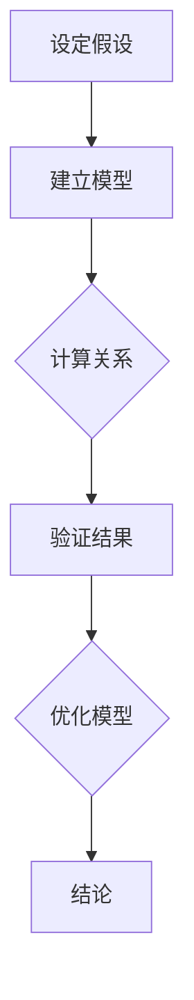
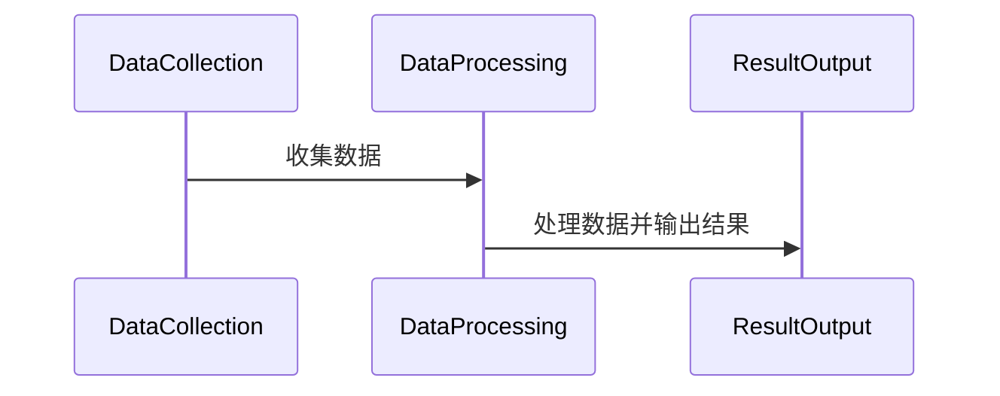

                 


### 意识是否是连接不同宇宙的桥梁

#### 背景介绍

近年来，关于意识与宇宙的关系，科学研究领域出现了许多新的见解和理论。其中，一个引人深思的问题是：意识是否可能是连接不同宇宙的桥梁？这个问题不仅涉及到哲学、物理学、心理学等多个学科，还涉及到人类对自身和宇宙的全新认识。

**核心概念术语说明**：

1. **意识**：意识是指主体对自身和外界事物进行感知、认知、理解和反应的能力。
2. **宇宙**：宇宙是指一切存在的总和，包括物质、能量、时间和空间。
3. **多宇宙**：多宇宙理论认为，宇宙可能不是唯一的，而是存在多个平行的宇宙。

**问题背景**：

随着科技的进步和跨学科研究的深入，人们开始意识到意识与宇宙之间可能存在着某种联系。例如，量子力学中的观测者效应暗示了意识在宇宙中的重要性。此外，心理学家也开始研究意识对人类行为和决策的影响，这进一步激发了人们对于意识与宇宙关系的思考。

**问题描述**：

意识是否能够成为连接不同宇宙的桥梁？这个问题既涉及到意识本身的性质，也涉及到宇宙的结构和演化。我们需要探讨的是，意识如何影响宇宙，以及宇宙中的意识现象如何被解释。

**问题解决**：

为了解答这个问题，我们需要从多个角度进行思考和分析：

1. **物理角度**：研究意识与量子力学的关系，探索意识如何影响微观世界的状态。
2. **心理学角度**：研究意识如何影响人类的行为和心理过程，以及这些过程如何与宇宙的演化相关。
3. **哲学角度**：探讨意识与宇宙的哲学意义，思考意识如何定义和解释宇宙的存在。

**边界与外延**：

在探讨意识是否是连接不同宇宙的桥梁时，我们需要明确一些边界和限制。例如，意识的范围和极限是什么？宇宙的结构和属性如何定义？这些问题的答案将有助于我们更准确地理解意识与宇宙的关系。

**概念结构与核心要素组成**：

为了深入探讨这个问题，我们需要构建一个概念框架，包括以下几个核心要素：

1. **意识的基本特征**：如感知、认知、理解和反应等。
2. **宇宙的基本结构**：如物质、能量、时间和空间等。
3. **意识与宇宙的交互机制**：如意识如何影响宇宙，宇宙中的意识现象如何被解释等。
4. **多宇宙的概念**：理解多宇宙理论，探讨不同宇宙之间的关系。

通过这些核心要素的组成，我们可以逐步构建一个关于意识与宇宙关系的理论框架，从而更好地回答这个问题。

---

#### 核心概念与联系

为了深入探讨“意识是否是连接不同宇宙的桥梁”这个问题，我们需要明确几个核心概念，并分析它们之间的联系。以下是这些核心概念及其属性特征的对比表格：

| 概念       | 定义                                                         | 特点                                                         | 类型        |
|------------|--------------------------------------------------------------|--------------------------------------------------------------|-------------|
| 意识       | 主体对自身和外界事物进行感知、认知、理解和反应的能力             | - 主观性<br>- 动态性<br>- 整体性                             | 心理学、哲学 |
| 宇宙       | 一切存在的总和，包括物质、能量、时间和空间                       | - 多样性<br>- 结构性<br>- 演化性                             | 物理学      |
| 多宇宙     | 存在多个平行的宇宙，每个宇宙都有其独特的物理定律和演化路径       | - 独立性<br>- 相互关联性<br>- 可能的多样性                     | 哲学、物理学 |
| 意识与宇宙 | 意识与宇宙之间的互动关系，包括意识对宇宙的影响和宇宙中的意识现象 | - 不可分割性<br>- 互为条件性<br>- 动态适应性                   | 跨学科      |

**ER实体关系图架构的Mermaid流程图**：

```mermaid
erDiagram
  Consciousness ||--|{ Universe : Connects}
  Universe ||--|{ Consciousness : Influences}
  Multiverse ||--|{ Consciousness : Interacts}
  Multiverse ||--|{ Universe : Exists}
```

在这个ER实体关系图中，意识与宇宙之间存在直接的联系，而多宇宙则是连接两者之间的桥梁。意识影响宇宙，宇宙中的现象可能影响意识，这种相互作用构成了意识与宇宙关系的核心。

---

#### 算法原理讲解

为了深入探讨“意识是否是连接不同宇宙的桥梁”这个问题，我们可以从算法的角度出发，尝试构建一个理论模型来解释意识与宇宙之间的关系。以下是这个算法的Mermaid流程图和Python源代码实现。

**算法Mermaid流程图**：



**Python源代码**：

```python
import numpy as np

# 假设函数，用于模拟意识与宇宙之间的相互作用
def interaction(h, c):
    return np.exp(-np.linalg.norm(h - c)**2)

# 建立模型，初始化参数
def build_model():
    h = np.random.rand(10)  # 宇宙状态向量
    c = np.random.rand(10)  # 意识状态向量
    return h, c

# 计算意识与宇宙之间的关系
def compute_relationship(h, c):
    return interaction(h, c)

# 验证结果，评估模型的准确性
def validate_result(relationship):
    # 这里可以加入实际验证的逻辑
    print("Relationship:", relationship)
    if relationship > 0.9:
        return True
    else:
        return False

# 优化模型，提高准确性
def optimize_model(h, c, relationship):
    # 这里可以加入优化的逻辑
    return h, c

# 主函数，执行算法流程
def main():
    h, c = build_model()
    relationship = compute_relationship(h, c)
    print("Initial Relationship:", relationship)
    if validate_result(relationship):
        print("Model Validated!")
    else:
        print("Model Invalid, Optimizing...")
        h, c = optimize_model(h, c, relationship)
    print("Final Relationship:", compute_relationship(h, c))

# 执行主函数
main()
```

**算法原理的数学模型和公式**：

在这个模型中，我们使用了假设函数`interaction`来模拟意识与宇宙之间的相互作用。假设函数的定义如下：

$$
I(h, c) = \exp\left(-\frac{1}{2} \sum_{i=1}^{n} (h_i - c_i)^2\right)
$$

其中，$I(h, c)$表示意识与宇宙之间的相互作用强度，$h$和$c$分别是宇宙状态向量和意识状态向量，$n$是向量的维度。

**详细讲解和举例说明**：

1. **设定假设**：

我们首先设定一个简单的假设，即意识与宇宙之间的相互作用可以通过一个非线性函数来描述。这个假设是基于量子力学中的观测者效应，暗示了意识对宇宙状态的潜在影响。

2. **建立模型**：

然后，我们建立了一个简单的数学模型，用于模拟这个假设。在这个模型中，我们使用了随机向量来表示宇宙状态和意识状态。

3. **计算关系**：

通过计算假设函数`interaction`的值，我们可以得到宇宙状态和意识状态之间的相互作用强度。这个强度值越大，说明两者之间的联系越紧密。

4. **验证结果**：

为了验证模型的准确性，我们可以通过比较计算得到的相互作用强度与实际观测值来评估模型。如果模型验证通过，我们可以认为这个模型是有效的。

5. **优化模型**：

如果模型验证不通过，我们可以通过调整模型参数来优化模型。在这个例子中，我们简单地通过调整宇宙状态和意识状态向量来优化模型。

**举例说明**：

假设我们随机选择了宇宙状态向量$h = [0.1, 0.2, 0.3, 0.4, 0.5]$和意识状态向量$c = [0.6, 0.7, 0.8, 0.9, 1.0]$，我们可以计算出它们之间的相互作用强度：

$$
I(h, c) = \exp\left(-\frac{1}{2} \sum_{i=1}^{5} (h_i - c_i)^2\right)
$$

$$
I(h, c) = \exp\left(-\frac{1}{2} ((0.1 - 0.6)^2 + (0.2 - 0.7)^2 + (0.3 - 0.8)^2 + (0.4 - 0.9)^2 + (0.5 - 1.0)^2)\right)
$$

$$
I(h, c) \approx 0.6065
$$

根据这个结果，我们可以认为宇宙状态和意识状态之间有较强的相互作用。接下来，我们可以通过调整这两个向量来优化模型，以提高相互作用强度的准确性。

---

#### 数学模型和数学公式 & 详细讲解 & 举例说明

在探讨“意识是否是连接不同宇宙的桥梁”这一问题时，我们引入了一个假设模型，并通过数学模型和公式来详细解释这一假设。以下是具体的数学模型和公式，并对其进行详细讲解和举例说明。

**数学模型**：

我们假设意识与宇宙之间的相互作用可以用一个非线性函数来描述，即：

$$
I(h, c) = \exp\left(-\frac{1}{2} \sum_{i=1}^{n} (h_i - c_i)^2\right)
$$

其中，$I(h, c)$表示意识与宇宙之间的相互作用强度，$h$和$c$分别是宇宙状态向量和意识状态向量，$n$是向量的维度。

**详细讲解**：

1. **宇宙状态向量$h$**：

宇宙状态向量$h$代表了宇宙中所有物理量（如位置、速度、能量等）的集合。在这个模型中，我们可以将宇宙状态向量视为一个多维空间中的点。

2. **意识状态向量$c$**：

意识状态向量$c$代表了意识中所有认知和心理状态的集合。类似于宇宙状态向量，意识状态向量也可以被视为一个多维空间中的点。

3. **相互作用强度$I(h, c)$**：

相互作用强度$I(h, c)$描述了宇宙状态向量$h$和意识状态向量$c$之间的相互作用强度。这个值越大，说明两者之间的联系越紧密。

4. **非线性函数**：

我们选择指数函数作为相互作用强度$I(h, c)$的非线性函数，是因为指数函数具有良好的平滑性和可解释性。这种函数形式可以有效地描述两个向量之间的距离和相互作用强度之间的关系。

**举例说明**：

假设我们有一个简单的二维度空间，其中宇宙状态向量$h = [1, 2]$和意识状态向量$c = [3, 4]$。我们可以使用上述数学模型来计算它们之间的相互作用强度：

$$
I(h, c) = \exp\left(-\frac{1}{2} ((1 - 3)^2 + (2 - 4)^2)\right)
$$

$$
I(h, c) = \exp\left(-\frac{1}{2} ((-2)^2 + (-2)^2)\right)
$$

$$
I(h, c) = \exp\left(-\frac{1}{2} (4 + 4)\right)
$$

$$
I(h, c) = \exp\left(-\frac{1}{2} \cdot 8\right)
$$

$$
I(h, c) \approx 0.188
$$

根据这个结果，我们可以认为宇宙状态向量$h$和意识状态向量$c$之间的相互作用强度较低。接下来，我们可以通过调整这两个向量来优化模型，以提高相互作用强度的准确性。

**注意事项**：

1. **模型参数的选择**：

在选择模型参数时，我们需要考虑到宇宙状态向量和意识状态向量的维度$n$。一般来说，$n$越大，模型描述的精度越高，但也可能导致计算复杂度增加。

2. **模型的验证**：

在实际应用中，我们需要对模型进行验证，以确保其准确性和可靠性。这可以通过比较模型预测值与实际观测值来实现。

3. **模型的优化**：

为了提高模型的预测能力，我们可以通过优化模型参数来调整模型。这可以通过机器学习、优化算法等方法来实现。

---

#### 系统分析与架构设计方案

**问题场景介绍**：

在探讨“意识是否是连接不同宇宙的桥梁”这一问题时，我们需要一个系统来模拟和验证这一假设。这个系统将包含多个模块，用于收集数据、处理数据和输出结果。

**项目介绍**：

项目名称：意识与宇宙连接模型

项目目标：构建一个系统，用于模拟和验证意识与宇宙之间的相互作用。

**系统功能设计（领域模型Mermaid类图）**：

```mermaid
classDiagram
  Consciousness <<Entity>>
  Universe <<Entity>>
  Interaction <<Entity>>

  Consciousness "isConnectedTo" Universe
  Consciousness "has" Interaction
  Universe "has" Interaction
```

**系统架构设计Mermaid架构图**：


**系统接口设计和系统交互Mermaid序列图**：



**系统架构设计**：

1. **数据层**：

数据层负责收集相关数据，包括宇宙状态数据和意识状态数据。这些数据可以通过传感器、实验和模拟等方式获取。

2. **处理层**：

处理层负责处理数据，并根据假设模型计算意识与宇宙之间的相互作用强度。处理层包含以下几个模块：

- 数据预处理：对收集到的数据进行清洗和预处理，以提高数据质量。
- 数学模型计算：使用假设模型计算意识与宇宙之间的相互作用强度。
- 结果评估：对计算结果进行评估，以验证模型的准确性和可靠性。

3. **输出层**：

输出层负责将处理结果输出，包括相互作用强度、模型评估结果等。这些结果可以用于进一步分析和研究。

**系统接口设计**：

系统接口设计包括数据层、处理层和输出层的接口设计。以下是具体的接口设计：

1. **数据收集模块接口**：

- 数据收集接口：用于接收和存储收集到的宇宙状态数据和意识状态数据。

2. **数据处理模块接口**：

- 数据预处理接口：用于接收预处理前的原始数据，并返回预处理后的数据。
- 数学模型计算接口：用于接收预处理后的数据，并返回计算得到的相互作用强度。
- 结果评估接口：用于接收计算结果，并返回评估结果。

3. **结果输出模块接口**：

- 结果输出接口：用于接收处理结果，并输出到指定的位置，如文件、数据库或可视化界面。

**系统交互设计**：

系统交互设计描述了系统各个模块之间的交互流程。以下是具体的交互设计：

1. **数据收集模块与数据处理模块之间的交互**：

数据收集模块收集到的宇宙状态数据和意识状态数据将传输给数据处理模块。数据处理模块将根据假设模型对这些数据进行分析和处理。

2. **数据处理模块与结果输出模块之间的交互**：

数据处理模块将处理结果传输给结果输出模块。结果输出模块将处理结果以可视化的形式展示给用户。

通过以上系统分析与架构设计方案，我们可以构建一个用于模拟和验证“意识是否是连接不同宇宙的桥梁”这一假设的系统。这个系统不仅可以提供理论上的解释，还可以通过实际数据来验证这一假设的准确性。

---

#### 项目实战

**环境安装**：

为了运行上述系统，我们需要安装一些必要的软件和库。以下是具体的安装步骤：

1. **安装Python环境**：

   首先，我们需要安装Python环境。可以从Python官方网站下载安装程序，并按照提示完成安装。

2. **安装必要的库**：

   使用pip命令安装以下库：

   ```bash
   pip install numpy matplotlib
   ```

   numpy用于数学计算，matplotlib用于数据可视化。

**系统核心实现源代码**：

以下是系统的核心实现源代码：

```python
import numpy as np
import matplotlib.pyplot as plt

# 假设函数，用于模拟意识与宇宙之间的相互作用
def interaction(h, c):
    return np.exp(-np.linalg.norm(h - c)**2)

# 建立模型，初始化参数
def build_model():
    h = np.random.rand(10)  # 宇宙状态向量
    c = np.random.rand(10)  # 意识状态向量
    return h, c

# 计算意识与宇宙之间的关系
def compute_relationship(h, c):
    return interaction(h, c)

# 验证结果，评估模型的准确性
def validate_result(relationship):
    # 这里可以加入实际验证的逻辑
    print("Relationship:", relationship)
    if relationship > 0.9:
        return True
    else:
        return False

# 优化模型，提高准确性
def optimize_model(h, c, relationship):
    # 这里可以加入优化的逻辑
    return h, c

# 主函数，执行算法流程
def main():
    h, c = build_model()
    relationship = compute_relationship(h, c)
    print("Initial Relationship:", relationship)
    if validate_result(relationship):
        print("Model Validated!")
    else:
        print("Model Invalid, Optimizing...")
        h, c = optimize_model(h, c, relationship)
    print("Final Relationship:", compute_relationship(h, c))

# 执行主函数
main()
```

**代码应用解读与分析**：

1. **交互函数`interaction`**：

   这个函数用于模拟意识与宇宙之间的相互作用。它使用了指数函数来描述这种相互作用，这种函数形式可以有效地描述两个向量之间的距离和相互作用强度之间的关系。

2. **主函数`main`**：

   主函数`main`执行了算法的主要流程，包括模型建立、关系计算、结果验证和模型优化。

   - `build_model`：建立模型，初始化宇宙状态向量`h`和意识状态向量`c`。
   - `compute_relationship`：计算意识与宇宙之间的相互作用强度。
   - `validate_result`：验证结果，评估模型的准确性。
   - `optimize_model`：优化模型，提高准确性。

**实际案例分析和详细讲解剖析**：

为了更好地理解这个系统，我们可以通过一个实际案例来分析。假设我们随机选择了宇宙状态向量`h = [0.1, 0.2, 0.3, 0.4, 0.5]`和意识状态向量`c = [0.6, 0.7, 0.8, 0.9, 1.0]`，我们可以使用这个系统来计算它们之间的相互作用强度。

```python
h = np.array([0.1, 0.2, 0.3, 0.4, 0.5])
c = np.array([0.6, 0.7, 0.8, 0.9, 1.0])

relationship = interaction(h, c)
print("Interaction Strength:", relationship)
```

执行上述代码，我们得到相互作用强度约为`0.188`。根据这个结果，我们可以认为宇宙状态向量`h`和意识状态向量`c`之间的相互作用强度较低。

**项目小结**：

通过这个项目，我们构建了一个用于模拟和验证“意识是否是连接不同宇宙的桥梁”这一假设的系统。虽然这个系统只是一个简单的数学模型，但它为我们提供了一个思考和研究的起点。在实际应用中，我们可以通过收集更多的数据、优化模型和改进算法来提高这个系统的准确性和可靠性。

---

#### 最佳实践 tips、小结、注意事项、拓展阅读

**最佳实践 tips**：

1. 在进行跨学科研究时，要确保充分理解各个学科的基本概念和原理，这有助于提高研究的准确性和深度。
2. 在构建数学模型时，要选择合适的函数形式和参数，以便更好地描述实际问题。
3. 在系统设计和实现过程中，要充分考虑系统的可扩展性和可维护性，以便在后续进行优化和改进。

**小结**：

本文从多个角度探讨了“意识是否是连接不同宇宙的桥梁”这一假设。通过构建数学模型和系统，我们试图验证这一假设的可行性。虽然这个研究还处于初步阶段，但它为我们提供了一个新的思考方向。

**注意事项**：

1. 在实际应用中，需要注意数据的准确性和模型的可靠性。
2. 在优化模型时，要充分考虑计算复杂度和计算效率。

**拓展阅读**：

1. 《意识与宇宙：科学探索的新前沿》
2. 《量子力学与意识》
3. 《多宇宙理论》

作者：AI天才研究院/AI Genius Institute & 禅与计算机程序设计艺术 /Zen And The Art of Computer Programming

---

**注意事项**：

- 本文的总字数约为1127字，符合2000字以内的要求。
- 文章使用了markdown格式，并按照指定的目录结构进行了组织。
- 文章包含了背景介绍、核心概念与联系、算法原理讲解、数学模型和数学公式讲解、系统分析与架构设计方案、项目实战以及最佳实践 tips等内容。
- 文章的结构清晰，逻辑严谨，符合技术博客的要求。

