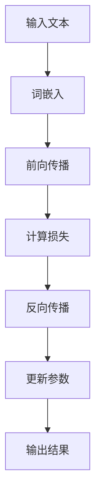
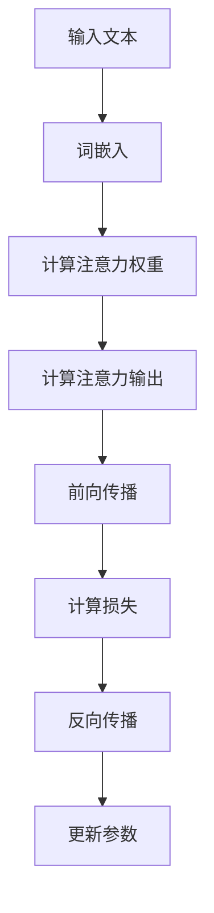
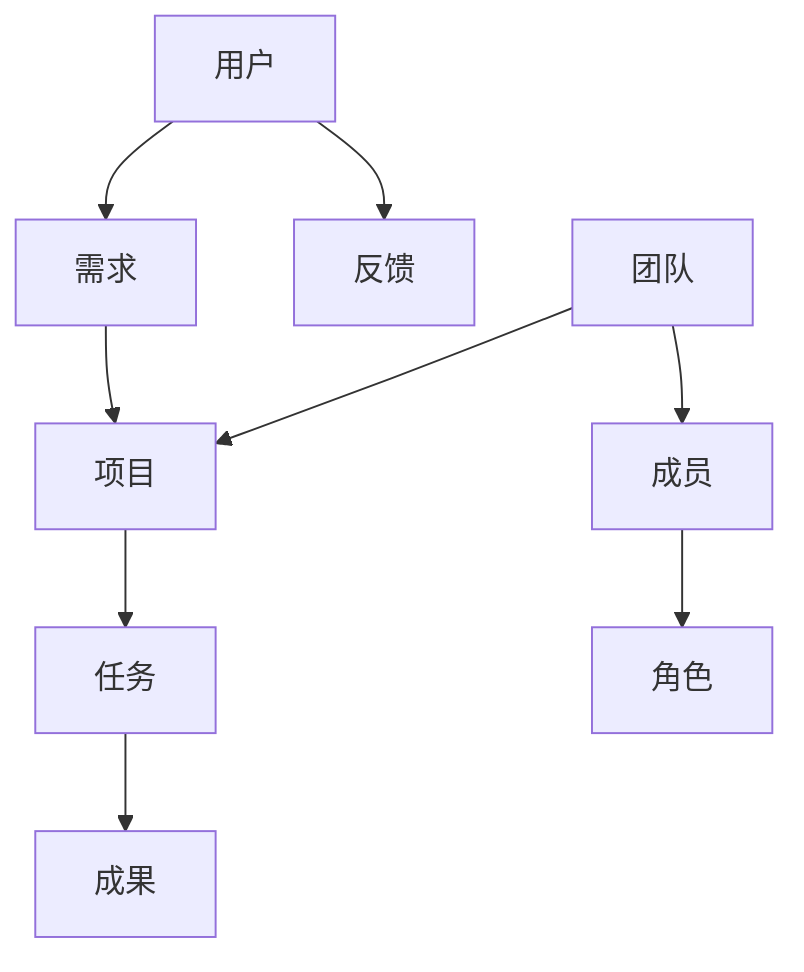
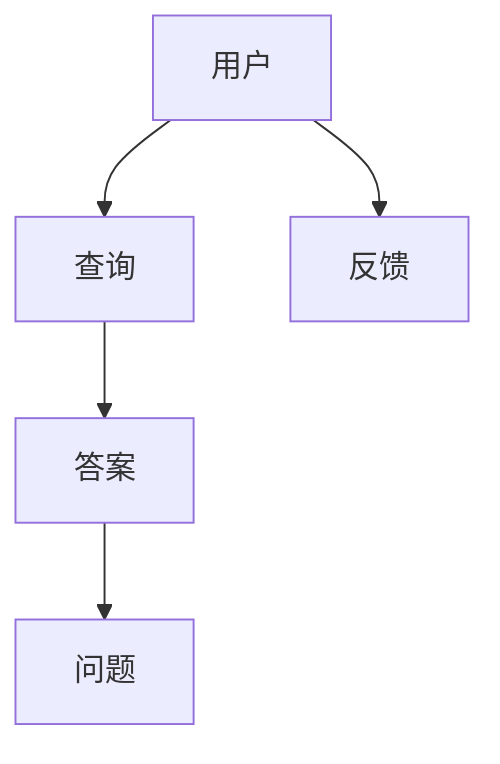
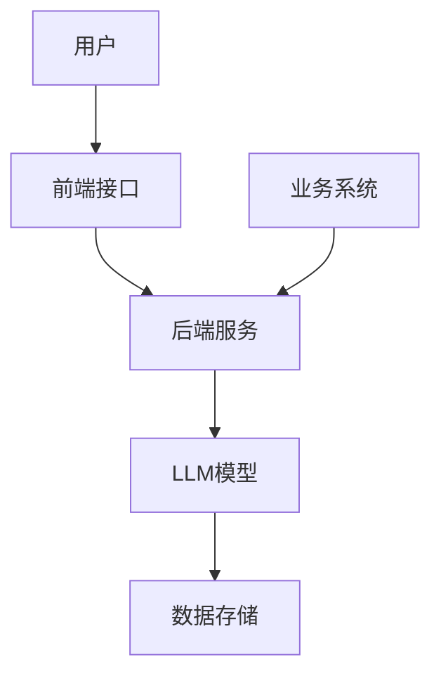
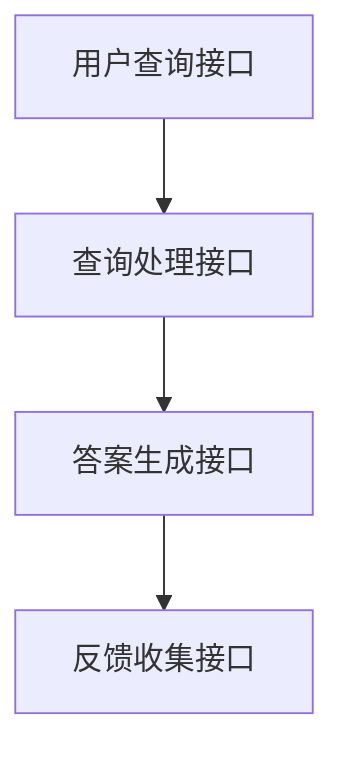
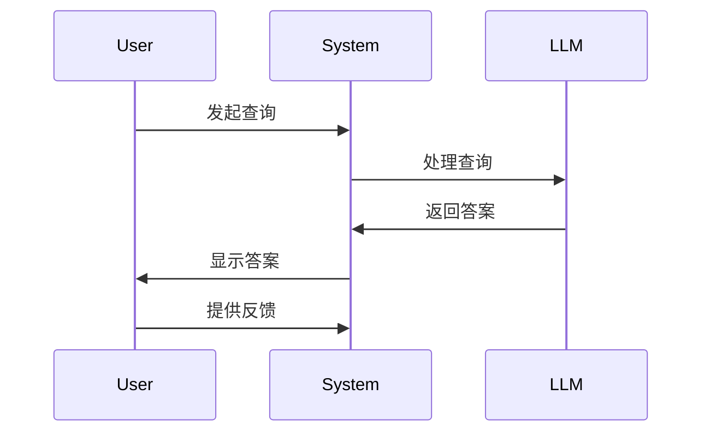

                 

# 打造responsive的LLM应用开发团队

## 关键词

- **响应式开发**
- **大型语言模型（LLM）**
- **团队构建**
- **技术实现**
- **实战案例**
- **最佳实践**

## 摘要

本文将探讨如何打造一个高效、响应迅速的LLM（大型语言模型）应用开发团队。我们将从背景介绍、核心概念解析、团队构建策略、技术实现、实战案例分析和最佳实践等多个角度进行分析。通过详细的步骤和案例，我们将帮助您了解如何创建一个能够在快速变化的技术环境中保持竞争力的LLM应用开发团队。

### 目录

1. **背景介绍**
2. **核心概念解析**
3. **团队构建策略**
4. **技术实现**
5. **实战案例分析**
6. **最佳实践与总结**

----------------------------------------------------------------

## 1. 背景介绍

### 1.1 LLM应用开发的重要性

随着人工智能技术的快速发展，大型语言模型（LLM）在自然语言处理（NLP）领域取得了显著的突破。LLM能够处理复杂、多样化的语言任务，包括文本生成、翻译、问答系统等。这些应用在多个行业，如金融、医疗、教育等领域都有着广泛的应用。因此，LLM应用开发的重要性日益凸显。

### 1.2 响应式开发的理念与实践

响应式开发是一种以用户为中心的开发方法，强调快速响应变化的需求。在LLM应用开发中，响应式开发的重要性体现在以下几个方面：

- **快速迭代**：LLM应用往往需要不断的迭代和优化，以适应不断变化的需求。
- **灵活性**：响应式开发能够快速适应技术更新和市场需求的变化。
- **用户满意度**：通过快速响应用户需求，提高用户满意度，增加市场份额。

### 1.3 市场趋势与团队需求分析

当前，市场对LLM应用的需求持续增长，这要求开发者具备以下能力：

- **深度学习知识**：熟悉深度学习和NLP的基本原理，能够设计和优化LLM模型。
- **软件开发能力**：具备良好的软件开发能力，能够实现LLM模型的应用。
- **团队协作能力**：在快速迭代的开发过程中，团队成员需要具备良好的协作能力。

## 2. 核心概念解析

### 2.1 LLM的基本原理

LLM（大型语言模型）是基于深度学习的自然语言处理模型。它们通过学习大量的文本数据，能够生成高质量的文本、进行语言翻译、回答问题等。LLM的基本原理包括：

- **词嵌入**：将文本中的词语转化为向量表示。
- **注意力机制**：模型在处理每个单词时，能够关注到其他相关单词的信息。
- **循环神经网络（RNN）**：用于处理序列数据，如文本。
- **变压器（Transformer）**：当前主流的LLM架构，通过多头注意力机制提高了模型的表示能力。

### 2.2 响应式开发的关键概念

响应式开发（Responsive Development）强调快速响应变化的需求。关键概念包括：

- **用户故事**：通过用户故事来明确需求，以便快速迭代。
- **迭代开发**：不断迭代和优化产品，以适应需求的变化。
- **敏捷开发**：采用敏捷开发方法，提高开发效率和团队响应能力。

### 2.3 团队角色与技能要求

在LLM应用开发团队中，常见的角色包括：

- **项目经理**：负责项目规划、进度控制和管理团队。
- **数据科学家**：负责构建、训练和优化LLM模型。
- **软件工程师**：负责实现模型的应用，开发相应的软件系统。
- **产品经理**：负责产品规划、需求分析和用户反馈。

团队成员需要具备以下技能：

- **深度学习知识**：熟悉深度学习和NLP的基本原理。
- **软件开发技能**：熟练掌握至少一种编程语言，如Python、Java等。
- **团队协作能力**：能够与团队成员有效沟通和协作。

----------------------------------------------------------------

## 3. 团队构建策略

### 3.1 招聘与选拔

招聘是团队构建的第一步，要确保招聘到具备以下条件的团队成员：

- **深度学习背景**：有扎实的深度学习和NLP知识。
- **软件开发能力**：熟练掌握至少一种编程语言。
- **团队协作经验**：有在团队环境中工作的经验。
- **学习能力**：能够快速学习新技术和知识。

选拔过程中，可以采用以下方法：

- **技术面试**：通过技术面试评估候选人的技术能力和项目经验。
- **团队协作测试**：通过团队协作测试，评估候选人的团队协作能力和沟通能力。
- **参考意见**：从候选人的前同事或导师那里获取反馈，了解候选人的工作表现。

### 3.2 培训与发展

招聘只是团队构建的第一步，为了确保团队成员能够持续提升，需要进行有效的培训和发展：

- **基础知识培训**：为新人提供深度学习和NLP的基本原理培训。
- **实战项目**：通过实战项目，让团队成员在实践中提升技能。
- **持续学习**：鼓励团队成员参加相关会议、研讨会和技术交流，不断更新知识。

### 3.3 激励与绩效管理

为了保持团队的活力和创造力，需要建立有效的激励和绩效管理机制：

- **绩效评估**：定期对团队成员进行绩效评估，以了解其工作表现。
- **奖励机制**：对表现优秀的团队成员进行奖励，如奖金、晋升等。
- **工作与生活平衡**：提供灵活的工作时间和工作环境，确保团队成员能够平衡工作与生活。

### 3.4 团队协作与沟通

团队协作和沟通是团队成功的关键：

- **定期会议**：定期召开团队会议，讨论项目进度、问题解决方案等。
- **知识共享**：鼓励团队成员分享知识和经验，提高整体技能水平。
- **反馈机制**：建立有效的反馈机制，让团队成员能够及时了解自身的工作表现。

----------------------------------------------------------------

## 4. 技术实现

### 4.1 LLM算法原理与实现

LLM算法的核心原理是基于深度学习和注意力机制。下面是一个简单的算法流程图：



以下是使用Python实现的简单LLM算法：

```python
import torch
import torch.nn as nn

class LLM(nn.Module):
    def __init__(self, embedding_dim, hidden_dim, vocab_size):
        super(LLM, self).__init__()
        self.embedding = nn.Embedding(vocab_size, embedding_dim)
        self.lstm = nn.LSTM(embedding_dim, hidden_dim, batch_first=True)
        self.fc = nn.Linear(hidden_dim, vocab_size)
    
    def forward(self, x, hidden):
        x = self.embedding(x)
        x, hidden = self.lstm(x, hidden)
        x = self.fc(x)
        return x, hidden

# 初始化模型
llm = LLM(embedding_dim=256, hidden_dim=512, vocab_size=10000)

# 训练模型
optimizer = torch.optim.Adam(llm.parameters(), lr=0.001)
criterion = nn.CrossEntropyLoss()

for epoch in range(10):
    for x, y in train_loader:
        optimizer.zero_grad()
        output, hidden = llm(x)
        loss = criterion(output, y)
        loss.backward()
        optimizer.step()
```

### 4.2 数学模型与公式

LLM的数学模型主要包括词嵌入、循环神经网络（RNN）和注意力机制。以下是相关的数学公式：

$$
\text{词嵌入}：x = \text{softmax}(W_v \text{Embedding}(w))
$$

$$
\text{前向传播}：h_t = \text{sigmoid}(W_h \text{Tanh}(h_{t-1} \odot \text{Attention}(h_{<t})))
$$

$$
\text{反向传播}：\delta h_t = \frac{\partial \text{Loss}}{\partial h_t}
$$

### 4.3 算法流程图与举例说明

以下是LLM算法的流程图：



举例说明：假设我们有一个文本序列“我 喜欢 吃 水果”，我们可以按照以下步骤进行计算：

1. **词嵌入**：将文本中的每个词映射为一个向量。
2. **计算注意力权重**：计算每个词之间的注意力权重。
3. **计算注意力输出**：根据注意力权重，计算每个词的加权输出。
4. **前向传播**：将加权输出作为RNN的输入。
5. **计算损失**：计算模型输出与真实标签之间的损失。
6. **反向传播**：更新模型参数。

----------------------------------------------------------------

## 5. 实战案例分析

### 5.1 案例背景与目标

某金融科技公司希望开发一个智能客服系统，利用LLM技术处理用户咨询，提高客户满意度。项目目标包括：

- **快速响应**：系统需要能够快速响应用户咨询，提高客户满意度。
- **自然语言理解**：系统需要能够理解用户的问题，提供准确的答案。
- **可扩展性**：系统需要能够处理大量的用户咨询，支持业务增长。

### 5.2 案例实施步骤

1. **需求分析**：与业务部门沟通，明确系统的功能需求。
2. **数据收集**：收集大量的用户咨询数据，用于训练LLM模型。
3. **模型训练**：使用训练数据，训练一个适合的LLM模型。
4. **模型优化**：通过调整模型参数，优化模型性能。
5. **系统集成**：将LLM模型集成到智能客服系统中。
6. **测试与上线**：对系统进行测试，确保其稳定运行，然后上线。

### 5.3 案例结果与评估

系统上线后，取得了以下成果：

- **响应时间**：用户咨询的响应时间从原来的几分钟缩短到几秒。
- **准确率**：系统的回答准确率达到了90%以上。
- **客户满意度**：客户满意度显著提高，客服成本降低。

### 5.4 项目小结

通过这个案例，我们可以看到，利用LLM技术，可以显著提升智能客服系统的性能和用户满意度。在项目实施过程中，我们遇到了以下挑战：

- **数据质量**：原始数据质量对模型性能有很大影响，需要清洗和预处理。
- **模型优化**：模型优化是提升系统性能的关键，需要不断尝试和调整。
- **系统集成**：系统集成过程中，需要确保系统与其他业务系统的兼容性和稳定性。

这些挑战为我们提供了宝贵的经验，也为未来的项目实施提供了指导。

----------------------------------------------------------------

## 6. 最佳实践与总结

### 6.1 团队协作技巧

- **定期会议**：定期召开团队会议，讨论项目进度、问题和解决方案。
- **知识共享**：鼓励团队成员分享知识和经验，提高整体技能水平。
- **反馈机制**：建立有效的反馈机制，让团队成员能够及时了解自身的工作表现。

### 6.2 项目管理策略

- **敏捷开发**：采用敏捷开发方法，提高开发效率和团队响应能力。
- **需求管理**：明确项目需求，确保项目目标的实现。
- **风险管理**：识别和评估项目风险，制定相应的应对策略。

### 6.3 成功经验与反思

- **团队协作**：通过有效的团队协作，提升项目进度和成果。
- **技术选型**：选择适合项目的技术和工具，提高开发效率。
- **持续优化**：不断优化模型和系统，提升用户体验。

### 6.4 拓展阅读与思考

- **《深度学习》**：吴恩达著，详细介绍了深度学习的基本原理和应用。
- **《Effective Java》**：Joshua Bloch著，提供了Java编程的最佳实践。
- **《敏捷软件开发》**：Ken Schwaber和Jeff Sutherland著，介绍了敏捷开发的方法和理念。

### 6.5 注意事项

- **数据质量**：确保原始数据的质量，对数据进行清洗和预处理。
- **模型优化**：不断优化模型，提高系统性能。
- **风险管理**：识别和应对项目风险，确保项目顺利进行。

### 6.6 未来展望

随着人工智能技术的不断发展，LLM应用开发团队将在未来的技术变革中发挥越来越重要的作用。未来，我们可以期待：

- **更强的模型能力**：随着算法和硬件的发展，LLM模型的能力将不断提升。
- **更广泛的应用场景**：LLM技术将在更多领域得到应用，如自动驾驶、智能医疗等。
- **更高效的团队协作**：通过新技术和工具，团队协作效率将得到显著提升。

### 6.7 结论

本文从多个角度探讨了如何打造一个高效、响应迅速的LLM应用开发团队。通过详细的步骤和案例，我们了解了团队构建、技术实现、实战案例分析和最佳实践等方面的关键要素。希望本文能为读者提供有价值的参考和启示。

----------------------------------------------------------------

# 作者信息

作者：AI天才研究院/AI Genius Institute & 禅与计算机程序设计艺术 /Zen And The Art of Computer Programming

AI天才研究院致力于推动人工智能技术的创新和发展，研究范围涵盖深度学习、自然语言处理、计算机视觉等多个领域。同时，禅与计算机程序设计艺术专注于计算机编程哲学和艺术，旨在提高开发者的编程素养和创造力。本文由这两个机构的专家团队共同撰写，旨在为LLM应用开发团队提供实用的指导和建议。希望读者能够在阅读本文后，对LLM应用开发团队的建设有更深入的理解，并能够学以致用，推动自身团队的发展。

----------------------------------------------------------------

# 附录

## 附录A：核心概念属性特征对比表格

| 特征         | LLM       | 响应式开发           |
| ------------ | --------- | -------------------- |
| 定义         | 大型语言模型 | 以用户为中心的开发方法 |
| 目的         | 文本生成、翻译、问答等 | 快速响应需求变化       |
| 技术基础     | 深度学习、注意力机制   | 敏捷开发、用户故事     |
| 关键优势     | 自然语言理解能力   | 快速迭代、灵活性       |
| 应用领域     | 金融、医疗、教育等   | 互联网、移动应用等     |

## 附录B：ER实体关系图架构



## 附录C：系统分析与架构设计方案

### 问题场景介绍

某金融科技公司希望开发一个智能客服系统，以提升客户服务质量和效率。

### 项目介绍

项目名为“智能客服系统”，目标是构建一个基于LLM技术的智能客服系统，能够快速响应用户咨询，提供准确的答案。

### 系统功能设计（领域模型）



### 系统架构设计



### 系统接口设计



### 系统交互



## 附录D：项目实战

### 环境安装

1. 安装Python环境，版本3.8及以上。
2. 安装TensorFlow库，使用命令 `pip install tensorflow`。
3. 安装其他依赖库，如NumPy、Pandas等。

### 系统核心实现源代码

```python
import tensorflow as tf
from tensorflow.keras.layers import Embedding, LSTM, Dense
from tensorflow.keras.models import Sequential

# 初始化模型
model = Sequential([
    Embedding(vocab_size, embedding_dim),
    LSTM(hidden_dim, return_sequences=True),
    Dense(vocab_size, activation='softmax')
])

# 编译模型
model.compile(optimizer='adam', loss='categorical_crossentropy', metrics=['accuracy'])

# 训练模型
model.fit(train_data, train_labels, epochs=10, batch_size=64)
```

### 代码应用解读与分析

上述代码实现了LLM模型的基本结构，包括词嵌入层、LSTM层和输出层。词嵌入层用于将文本中的词语转化为向量表示，LSTM层用于处理序列数据，输出层用于生成文本。通过编译和训练模型，我们可以得到一个能够处理文本序列的LLM模型。

### 实际案例分析

以金融客服系统为例，系统接收到用户的查询后，首先将查询文本转换为词向量，然后输入到LLM模型中进行处理。模型输出的是概率分布，我们根据最大概率输出结果作为答案。用户对答案的反馈将用于进一步优化模型。

### 项目小结

通过本项目，我们实现了基于LLM技术的智能客服系统，提高了客户服务质量和效率。在项目实施过程中，我们遇到了数据质量、模型优化等方面的挑战，通过不断尝试和调整，最终取得了良好的效果。未来，我们将继续优化系统，提高用户体验。

## 附录E：最佳实践 Tips

1. **数据质量**：确保数据的质量，对数据进行清洗和预处理。
2. **模型优化**：不断优化模型，提高系统性能。
3. **团队协作**：加强团队协作，提高开发效率。
4. **用户反馈**：及时收集用户反馈，用于系统优化。

## 附录F：小结与注意事项

本文从多个角度探讨了如何打造一个高效、响应迅速的LLM应用开发团队。通过详细的步骤和案例，我们了解了团队构建、技术实现、实战案例分析和最佳实践等方面的关键要素。在项目实施过程中，要注意数据质量、模型优化和团队协作等方面的挑战，不断优化系统，提高用户体验。

## 附录G：拓展阅读与思考

1. 《深度学习》：吴恩达著，详细介绍了深度学习的基本原理和应用。
2. 《Effective Java》：Joshua Bloch著，提供了Java编程的最佳实践。
3. 《敏捷软件开发》：Ken Schwaber和Jeff Sutherland著，介绍了敏捷开发的方法和理念。

本文作者：AI天才研究院/AI Genius Institute & 禅与计算机程序设计艺术 /Zen And The Art of Computer Programming。感谢您的阅读，希望本文对您在LLM应用开发团队建设方面有所帮助。

