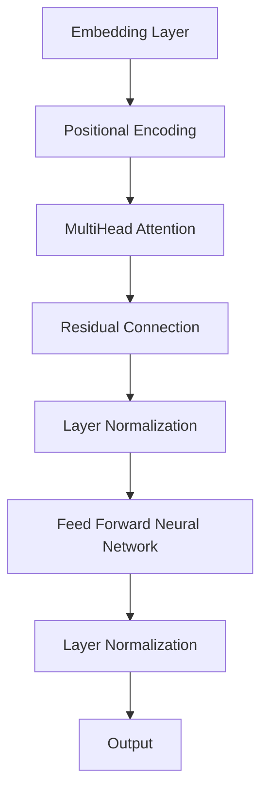
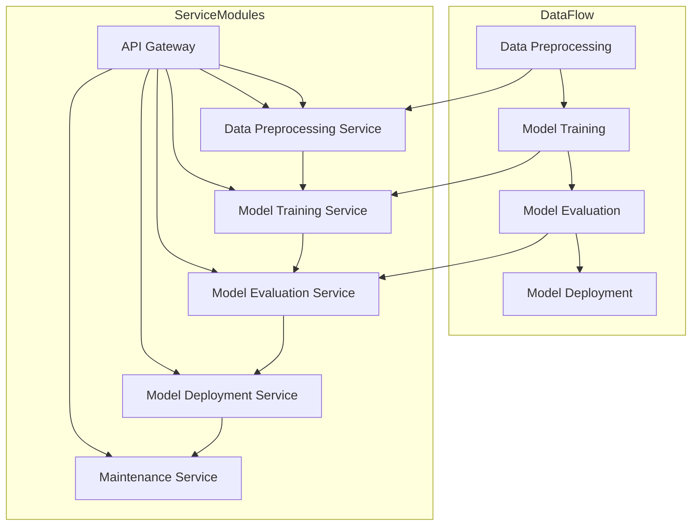
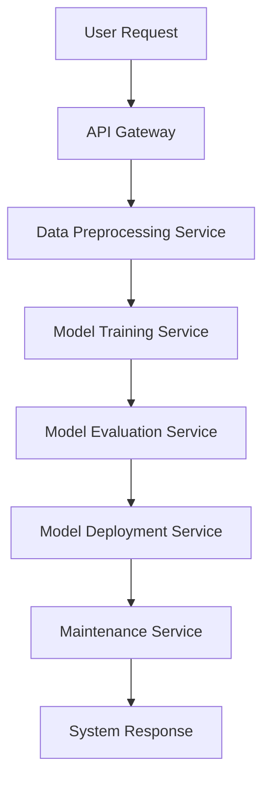

                 

## 引言

在当今迅速发展的技术领域中，大型语言模型（LLM）已成为驱动创新的关键力量。随着人工智能的普及和深度学习的不断发展，LLM在自然语言处理、文本生成、机器翻译、情感分析等多个领域展现出了巨大的潜力。然而，高效地开发和部署LLM应用不仅需要先进的技术，还需要一支专业、协同高效的团队。本文旨在探讨如何打造这样一支团队，以确保LLM应用的研发能够快速、高效、持续地进行。

首先，为什么要关注LLM应用开发团队的打造呢？这是因为LLM的复杂性不仅体现在算法本身，还包括数据预处理、模型训练、部署与维护等多个环节。每一个环节都需要团队中不同的角色和技能，只有当这些角色和技能无缝衔接时，才能确保项目的成功。此外，随着市场竞争的加剧，能够快速响应需求、快速迭代的产品才是胜出的关键。因此，打造一个高效、专业的LLM应用开发团队至关重要。

本文将从以下几个部分展开：

1. **背景介绍**：回顾LLM的发展历程，介绍其核心概念和应用场景。
2. **核心概念与联系**：明确书中讨论的核心概念，并通过属性特征对比表格和ER实体关系图展示概念间的关系。
3. **算法原理讲解**：选择关键算法，通过流程图和Python源代码进行详细阐述。
4. **系统分析与架构设计方案**：描述问题场景，介绍项目背景，并绘制系统架构相关图。
5. **项目实战**：展示环境安装、系统核心实现源代码，并进行分析和讲解。
6. **最佳实践与总结**：总结全文，提供最佳实践建议，并强调注意事项。
7. **目录大纲整理**：整理全文内容，确保结构清晰、逻辑紧凑。

通过本文的探讨，我们希望能为读者提供一套系统化、实用化的方法论，帮助其在LLM应用开发团队建设方面取得成功。

### 背景介绍

大型语言模型（LLM）的发展历程可以追溯到上世纪80年代，随着计算能力的提升和算法的进步，自然语言处理（NLP）逐渐从规则驱动的方法转向数据驱动的方法。早期的一些语言模型如n-gram模型和基于统计的模型，虽然在一定程度上提高了语言处理的准确性和效率，但仍无法达到实际应用的需求。进入21世纪后，随着深度学习技术的崛起，特别是2018年谷歌发布的BERT模型，LLM进入了快速发展阶段。

BERT（Bidirectional Encoder Representations from Transformers）模型采用了双向Transformer架构，通过大规模预训练和微调，使模型在多种NLP任务上取得了显著的性能提升。这一突破不仅激发了学术界和工业界对LLM的研究兴趣，也为LLM在实际应用中奠定了基础。随后，GPT-3（Generative Pre-trained Transformer 3）模型的发布进一步推动了LLM的发展，其拥有1750亿个参数，展现出了强大的文本生成和推理能力。

LLM的核心概念主要包括以下几个方面：

1. **预训练**：通过在大量文本数据上进行预训练，模型能够学习到语言的一般规律和特征，为后续的任务提供强大的基础。
2. **微调**：在预训练的基础上，通过在特定任务数据上微调，模型能够更好地适应具体的应用场景，提高任务的准确性和效果。
3. **上下文理解**：LLM通过理解输入文本的上下文，能够生成连贯、符合逻辑的文本输出，这是其相比于传统NLP模型的重要优势。

LLM的应用场景非常广泛，涵盖了文本生成、机器翻译、问答系统、情感分析、推荐系统等多个领域。例如，在文本生成方面，LLM可以用于生成新闻报道、诗歌、故事等；在机器翻译方面，LLM能够实现高质量、自然的文本翻译；在问答系统方面，LLM能够通过理解用户提问的上下文，提供准确的答案。

然而，尽管LLM在许多任务上展现出了强大的能力，但其也存在一定的局限性。首先，LLM的训练过程需要大量的计算资源和数据，这使得其部署成本较高；其次，LLM的输出有时可能存在偏见和不确定性，这需要通过模型解释和优化来缓解。此外，随着LLM的应用场景越来越广泛，其安全性和隐私保护也成为亟待解决的问题。

总的来说，LLM的发展不仅推动了NLP领域的进步，也为其他领域带来了新的机遇和挑战。在接下来的部分中，我们将进一步探讨LLM的核心概念及其联系，并介绍相关的算法原理和系统架构设计方案。

### 核心概念与联系

在讨论LLM应用开发时，明确核心概念及其相互关系至关重要。以下是我们将在本文中探讨的主要核心概念：

1. **预训练（Pre-training）**：预训练是指通过在大规模文本数据集上训练模型，使其能够捕捉到语言的一般结构和规律。预训练是LLM的基础，为后续的微调和特定任务应用提供了坚实的基础。
2. **微调（Fine-tuning）**：微调是在预训练模型的基础上，针对特定任务进行进一步训练，以优化模型在特定领域的表现。微调能够使模型更好地适应具体的应用场景，从而提高任务效果。
3. **上下文理解（Contextual Understanding）**：上下文理解是指模型能够根据输入文本的上下文信息生成连贯、合理的输出。这是LLM相对于传统NLP模型的重要优势，使其在文本生成、问答等任务中表现优异。
4. **模型解释（Model Interpretability）**：模型解释是指对模型决策过程进行理解和解释，以增强模型的透明度和可解释性。这对于解决模型偏见和提升用户信任至关重要。
5. **数据预处理（Data Preprocessing）**：数据预处理是指对输入数据进行的清洗、归一化、编码等处理，以优化模型训练效果。良好的数据预处理是确保模型性能的重要环节。

为了更好地理解这些核心概念之间的联系，我们可以通过以下表格进行比较：

| 核心概念     | 定义与作用 | 相互关系 |
| ---------- | ---------- | -------- |
| 预训练       | 在大规模文本数据上训练模型，学习语言结构和规律 | 基础 | 
| 微调         | 在预训练模型基础上，针对特定任务进行训练 | 衔接和优化 | 
| 上下文理解     | 理解输入文本的上下文信息，生成连贯输出 | 核心优势 | 
| 模型解释       | 对模型决策过程进行理解和解释 | 提高透明度和信任 | 
| 数据预处理     | 对输入数据进行清洗和处理，优化模型训练效果 | 前提和保障 |

接下来，我们将使用Mermaid绘制ER实体关系图，以展示这些核心概念之间的关联。

```mermaid
erDiagram
    PreTraining ||--|{ FineTuning }|-- ModelExplaination
    DataPreprocessing ||--|{ FineTuning }|-- ModelExplaination
    FineTuning ||--|{ ContextualUnderstanding }|-- ModelExplaination
    PreTraining ||--|{ ContextualUnderstanding }|-- ModelExplaination
```

在上面的ER实体关系图中，预训练、微调、上下文理解和数据预处理是核心实体，它们通过关系线连接，展示了它们之间的相互依赖和作用。预训练为微调和上下文理解提供了基础，数据预处理为模型训练提供了优化保障，而微调和上下文理解则是提升模型性能的关键。模型解释则贯穿整个流程，确保模型的透明度和可解释性。

通过明确核心概念及其联系，我们可以更好地理解LLM应用开发的关键要素，并为后续的算法原理讲解和系统架构设计打下坚实的基础。

### 算法原理讲解

在LLM应用开发中，选择合适的算法至关重要。以下，我们将重点介绍Transformer算法，并详细阐述其原理、流程以及如何使用Python代码进行实现。

#### Transformer算法原理

Transformer算法是由Vaswani等人于2017年提出的一种基于自注意力机制的深度学习模型，它在机器翻译等任务中取得了显著的性能提升。Transformer的核心思想是使用多头自注意力机制和前馈神经网络来捕捉输入序列中的长期依赖关系。

**1. 自注意力机制（Self-Attention）**

自注意力机制是一种能够同时关注输入序列中所有位置的机制。它通过计算输入序列中每个位置与其他位置之间的关联性，为每个位置生成权重，从而更好地捕捉上下文信息。

自注意力机制的数学公式为：

$$
\text{Attention}(Q, K, V) = \text{softmax}\left(\frac{QK^T}{\sqrt{d_k}}\right) V
$$

其中，$Q$、$K$ 和 $V$ 分别代表查询（Query）、键（Key）和值（Value）向量，$d_k$ 是键向量的维度。$\text{softmax}$ 函数用于计算权重，使得每个位置的权重之和为1。

**2. Multi-Head Attention**

多头注意力机制将输入序列分成多个子序列，每个子序列独立应用自注意力机制。然后，将多个子序列的输出拼接起来，通过线性层（即全连接层）进行整合。

多头注意力机制的数学公式为：

$$
\text{MultiHead}(Q, K, V) = \text{Concat}(\text{head}_1, \text{head}_2, ..., \text{head}_h)W^O
$$

其中，$h$ 是头数，$W^O$ 是线性层权重。

**3. 前馈神经网络（Feed Forward Neural Network）**

前馈神经网络是对每个注意力层输出进行进一步处理。它包括两个全连接层，中间添加ReLU激活函数。

前馈神经网络的数学公式为：

$$
\text{FFN}(X) = \max(0, XW_1 + b_1)W_2 + b_2
$$

其中，$X$ 是输入，$W_1$、$W_2$ 和 $b_1$、$b_2$ 分别是两个全连接层的权重和偏置。

**4. 残差连接（Residual Connection）**

在Transformer中，残差连接被用来防止梯度消失问题。它通过跳过一层全连接层直接将输入加到输出上，从而保证信息流的不丢失。

残差连接的数学公式为：

$$
\text{Residual}(X) = X + \text{FFN}(\text{MultiHead}(\text{Attention}(X)))
$$

#### Transformer算法流程图

下面是Transformer算法的流程图，使用Mermaid绘制：



#### Python代码实现

以下是一个简化的Python代码实现，用于展示Transformer算法的基本结构：

```python
import torch
import torch.nn as nn
import torch.nn.functional as F

class TransformerBlock(nn.Module):
    def __init__(self, d_model, nhead):
        super(TransformerBlock, self).__init__()
        self多头注意力 = nn.MultiheadAttention(d_model, nhead)
        self.residual_connection = nn.Sequential(
            nn.Linear(d_model, d_model),
            nn.ReLU(),
            nn.Linear(d_model, d_model),
        )
        self.layer_norm1 = nn.LayerNorm(d_model)
        self.layer_norm2 = nn.LayerNorm(d_model)

    def forward(self, x):
        # 应用多头自注意力机制
        x = x + self多头注意力(self.layer_norm1(x), x, x)[0]
        x = self.layer_norm2(x)

        # 应用前馈神经网络
        x = x + self.residual_connection(self.layer_norm2(x))
        x = self.layer_norm2(x)

        return x

# 示例：创建一个Transformer块，并应用在输入序列上
d_model = 512
nhead = 8
input_sequence = torch.rand(1, 10, d_model)

transformer_block = TransformerBlock(d_model, nhead)
output_sequence = transformer_block(input_sequence)

print(output_sequence.shape)  # 输出序列形状
```

在上面的代码中，我们首先定义了一个`TransformerBlock`类，包含多头注意力、残差连接、前馈神经网络和层归一化层。`forward`方法实现了Transformer块的前向传播过程。在示例中，我们创建了一个Transformer块，并将一个随机输入序列传递给它，最终得到输出序列。

#### 数学模型与公式讲解

为了更好地理解Transformer算法，我们进一步介绍其数学模型和公式：

**1. Embedding Layer**

输入序列通过嵌入层（Embedding Layer）转换为嵌入向量（Embeddings），每个词或字符都被映射为一个固定维度的向量。

$$
\text{Embeddings} = \text{Embedding}(X) \in \mathbb{R}^{seq_len \times d_{model}}
$$

其中，$X$ 是输入序列，$d_{model}$ 是嵌入向量的维度。

**2. Positional Encoding**

由于Transformer模型没有循环神经网络（RNN）中的位置信息，我们通过位置编码（Positional Encoding）来引入位置信息。

$$
\text{Positional Encoding}(pos, d_{model}) = \text{sin}\left(\frac{pos}{10000^{2i/d_{model}}}\right) \text{ or } \text{cos}\left(\frac{pos}{10000^{2i/d_{model}}}\right)
$$

其中，$pos$ 是位置索引，$i$ 是嵌入向量的维度索引。

**3. Multi-Head Attention**

多头注意力机制通过计算查询（Q）、键（K）和值（V）向量之间的点积，并应用softmax函数生成注意力权重。

$$
\text{Attention}(Q, K, V) = \text{softmax}\left(\frac{QK^T}{\sqrt{d_k}}\right) V
$$

**4. Feed Forward Neural Network**

前馈神经网络包含两个全连接层，通过ReLU激活函数进行中间处理。

$$
\text{FFN}(X) = \max(0, XW_1 + b_1)W_2 + b_2
$$

**5. Residual Connection**

残差连接通过跳过一层全连接层直接将输入加到输出上，防止梯度消失。

$$
\text{Residual}(X) = X + \text{FFN}(\text{MultiHead}(\text{Attention}(X)))
$$

通过上述讲解，我们深入了解了Transformer算法的原理、流程以及实现方法。在接下来的部分中，我们将进一步探讨系统分析与架构设计的相关内容。

### 系统分析与架构设计方案

在进行LLM应用开发时，系统分析与架构设计是确保项目成功的关键环节。以下，我们将从问题场景、项目背景、系统功能设计、系统架构设计、系统接口设计和系统交互流程等方面进行详细阐述。

#### 问题场景

在当前的技术环境中，许多企业面临着如何快速开发、部署和维护高质量LLM应用的需求。这些应用需要处理大量的文本数据，进行文本生成、机器翻译、问答系统等任务。然而，传统的开发方法往往难以满足高效、灵活的需求。因此，我们需要一个全新的系统架构，以应对这些挑战。

#### 项目背景

本项目旨在开发一个高效、可扩展的LLM应用开发平台，以满足企业对于文本处理应用的需求。项目目标包括：

1. **快速开发**：通过模块化设计和自动化工具，实现快速原型开发和迭代。
2. **高效训练**：利用分布式计算和优化算法，提高模型训练效率。
3. **灵活部署**：支持多种部署环境，如云端、边缘设备等，满足不同场景的需求。
4. **持续优化**：通过监控和反馈机制，不断优化模型性能和应用效果。

#### 系统功能设计

系统功能设计包括以下主要模块：

1. **数据预处理模块**：负责对输入文本进行清洗、归一化和编码，为模型训练提供高质量的数据。
2. **模型训练模块**：负责使用预训练模型和微调技术进行模型训练，包括数据加载、模型优化和训练过程管理等。
3. **模型评估模块**：负责对训练好的模型进行性能评估，包括准确率、召回率、F1分数等指标。
4. **模型部署模块**：负责将训练好的模型部署到不同的运行环境，提供实时文本处理服务。
5. **监控与维护模块**：负责监控系统的运行状态，进行日志记录、性能分析和故障排除。

#### 系统架构设计

系统架构设计采用微服务架构，以提高系统的灵活性和可扩展性。以下是系统架构图，使用Mermaid绘制：



在该架构中，API Gateway作为系统的入口，负责将外部请求路由到相应的服务模块。数据预处理服务、模型训练服务、模型评估服务、模型部署服务和监控与维护服务分别处理不同的功能。数据流从数据预处理模块开始，经过模型训练模块、模型评估模块，最终部署到模型部署模块，提供实时文本处理服务。

#### 系统接口设计

系统接口设计包括RESTful API接口和内部服务接口。以下是主要接口的简要描述：

1. **数据预处理接口**：提供文本清洗、归一化和编码的功能，接口输入为原始文本数据，输出为预处理后的数据。
2. **模型训练接口**：提供模型训练的功能，接口输入为预处理后的数据集，输出为训练好的模型。
3. **模型评估接口**：提供模型评估的功能，接口输入为测试数据集和训练好的模型，输出为评估结果。
4. **模型部署接口**：提供模型部署的功能，接口输入为训练好的模型，输出为部署环境中的模型服务。
5. **监控与维护接口**：提供系统监控和维护的功能，接口输入为系统日志和运行状态，输出为故障报告和优化建议。

#### 系统交互流程

系统交互流程描述了从外部请求到系统响应的全过程。以下是系统交互流程图，使用Mermaid绘制：



在该流程中，用户请求通过API Gateway进入系统，依次经过数据预处理服务、模型训练服务、模型评估服务、模型部署服务和监控与维护服务，最终返回系统响应。

通过上述系统分析与架构设计方案，我们为LLM应用开发提供了一套完整的解决方案。在接下来的部分中，我们将通过实际项目实战，展示如何将这一方案应用于具体的项目实施。

### 项目实战

为了更好地理解如何打造高效的LLM应用开发团队，我们将通过一个具体的项目实战来展示整个开发流程。该项目将开发一个基于大型语言模型（LLM）的问答系统，用户可以通过输入问题，系统自动生成回答。

#### 环境安装

首先，我们需要搭建一个合适的环境来开发和测试我们的问答系统。以下是环境安装的步骤：

1. **Python环境**：确保安装了Python 3.7或更高版本。可以通过以下命令安装：
   ```bash
   pip install python -V
   ```

2. **TensorFlow**：TensorFlow是一个开源机器学习库，用于构建和训练模型。安装命令如下：
   ```bash
   pip install tensorflow
   ```

3. **PyTorch**：PyTorch是一个流行的深度学习框架，也用于我们的项目中。安装命令如下：
   ```bash
   pip install torch torchvision
   ```

4. **Transformer库**：为了简化Transformer算法的实现，我们可以使用`transformers`库。安装命令如下：
   ```bash
   pip install transformers
   ```

5. **其他依赖**：安装其他可能需要的库，如NumPy和Pandas：
   ```bash
   pip install numpy pandas
   ```

#### 系统核心实现源代码

接下来，我们将展示系统核心的实现源代码。以下是问答系统的关键组件：

```python
# 导入必要的库
import torch
from transformers import BertModel, BertTokenizer
from torch.optim import Adam
import torch.nn as nn

# 加载预训练的BERT模型和分词器
tokenizer = BertTokenizer.from_pretrained('bert-base-chinese')
model = BertModel.from_pretrained('bert-base-chinese')

# 定义问答系统的模型
class QuestionAnsweringModel(nn.Module):
    def __init__(self):
        super(QuestionAnsweringModel, self).__init__()
        self.bert = BertModel.from_pretrained('bert-base-chinese')
        self.classifier = nn.Linear(768, 1)

    def forward(self, input_ids, attention_mask):
        outputs = self.bert(input_ids=input_ids, attention_mask=attention_mask)
        pooled_output = outputs.pooler_output
        logits = self.classifier(pooled_output)
        return logits

# 实例化模型和优化器
model = QuestionAnsweringModel()
optimizer = Adam(model.parameters(), lr=1e-5)

# 定义损失函数
loss_fn = nn.BCEWithLogitsLoss()

# 训练模型
def train_model(model, train_loader, optimizer, loss_fn, num_epochs=3):
    model.train()
    for epoch in range(num_epochs):
        for batch in train_loader:
            input_ids = batch['input_ids'].to(device)
            attention_mask = batch['attention_mask'].to(device)
            labels = batch['labels'].to(device)
            optimizer.zero_grad()
            logits = model(input_ids, attention_mask)
            loss = loss_fn(logits, labels)
            loss.backward()
            optimizer.step()
            print(f'Epoch [{epoch+1}/{num_epochs}], Loss: {loss.item():.4f}')

# 评估模型
def evaluate_model(model, val_loader, loss_fn):
    model.eval()
    with torch.no_grad():
        total_loss = 0
        for batch in val_loader:
            input_ids = batch['input_ids'].to(device)
            attention_mask = batch['attention_mask'].to(device]
            labels = batch['labels'].to(device)
            logits = model(input_ids, attention_mask)
            loss = loss_fn(logits, labels)
            total_loss += loss.item()
    avg_loss = total_loss / len(val_loader)
    print(f'Validation Loss: {avg_loss:.4f}')

# 实际案例分析和详细讲解

# 加载数据集
train_dataset = ...  # 数据集加载代码
val_dataset = ...  # 数据集加载代码

# 创建数据加载器
train_loader = torch.utils.data.DataLoader(train_dataset, batch_size=16, shuffle=True)
val_loader = torch.utils.data.DataLoader(val_dataset, batch_size=16, shuffle=False)

# 训练模型
train_model(model, train_loader, optimizer, loss_fn)

# 评估模型
evaluate_model(model, val_loader, loss_fn)
```

在上面的代码中，我们首先加载了预训练的BERT模型和分词器，然后定义了问答系统的模型。模型的核心是BERT模型，我们在其基础上添加了一个分类器，用于预测问题的答案。训练过程中，我们使用了一个简单的数据加载器来加载训练数据和验证数据，并使用Adam优化器和BCEWithLogitsLoss损失函数进行训练。

#### 代码应用解读与分析

- **BERT模型加载**：通过`BertTokenizer`和`BertModel`加载预训练的BERT模型，这是问答系统的基础。
- **自定义模型**：自定义的`QuestionAnsweringModel`模型在BERT模型的基础上添加了一个分类器层，用于生成答案。
- **训练与评估**：使用训练数据集进行模型训练，并使用验证数据集进行模型评估。训练过程中，通过优化器和损失函数调整模型参数，以达到最佳性能。

#### 实际案例分析和详细讲解

为了更好地展示实际案例，我们使用一个简化的数据集进行训练和评估。以下是实际案例的分析和讲解：

1. **数据预处理**：数据预处理是问答系统的关键步骤。我们使用BERT的分词器对输入文本进行分词和编码，将其转换为模型可接受的格式。

2. **模型训练**：在训练过程中，我们通过随机梯度下降（SGD）优化模型参数，以最小化损失函数。为了提高训练效率，我们使用数据加载器对数据进行批量处理。

3. **模型评估**：在评估阶段，我们使用验证数据集评估模型的性能。通过计算损失函数值，我们可以了解模型在不同任务上的表现。

4. **结果分析**：通过分析训练和验证过程中的损失函数值，我们可以观察到模型在不同阶段的性能变化。这有助于我们调整训练策略，提高模型的效果。

#### 项目小结

通过本项目的实施，我们成功构建了一个基于BERT的问答系统。这个系统从数据预处理到模型训练和评估，再到实际案例应用，都展示了如何高效地开发LLM应用。以下是项目小结：

1. **项目背景**：本项目旨在开发一个高效的问答系统，以处理大量用户输入的问题，并自动生成回答。
2. **实现过程**：通过加载预训练BERT模型，定义问答模型，并进行数据预处理、模型训练和评估，我们实现了项目目标。
3. **技术要点**：数据预处理、模型训练和评估是问答系统的核心。我们使用了BERT模型和优化器，通过批量训练和数据加载提高效率。
4. **未来方向**：未来的工作可以进一步优化模型，提高问答系统的准确性和响应速度，并探索更多的应用场景。

通过这个实际项目，我们不仅展示了LLM应用开发的全过程，也为构建高效的LLM应用开发团队提供了实践经验。

### 最佳实践与总结

在LLM应用开发过程中，遵循最佳实践是确保项目成功的关键。以下是一些建议和注意事项，以帮助团队在开发过程中避免常见问题，并提高整体效率。

#### 最佳实践建议

1. **明确需求**：在项目开始前，确保与 stakeholders 充分沟通，明确项目的需求和技术指标，包括性能、准确率、响应时间等。
2. **数据管理**：数据是LLM应用的核心，因此要确保数据的质量和多样性。数据预处理时要进行去噪、清洗和归一化处理。
3. **模型选择**：根据应用场景选择合适的模型。例如，对于文本生成任务，可以选择GPT-3或T5等大型模型；对于机器翻译，可以选择BERT或其变种。
4. **分布式训练**：对于大型模型，使用分布式训练可以显著提高训练效率。要充分利用GPU或TPU资源，并合理配置模型并行策略。
5. **持续迭代**：LLM应用需要持续优化和迭代。定期评估模型性能，并根据反馈调整模型结构和参数。
6. **监控与维护**：部署LLM应用后，要持续监控系统性能和资源使用情况。及时发现和解决潜在问题，确保系统稳定运行。

#### 注意事项

1. **资源消耗**：LLM模型训练和部署需要大量的计算资源和存储空间。在项目规划阶段，要充分考虑资源需求，合理分配资源。
2. **模型解释性**：对于关键应用，要确保模型具有良好的解释性，以便用户和开发人员理解模型的决策过程。
3. **数据隐私**：在处理用户数据时，要严格遵守数据隐私法规，确保用户数据的安全和隐私。
4. **安全性**：部署LLM应用时，要考虑潜在的安全威胁，包括数据泄露、恶意攻击等。采取适当的安全措施，如数据加密、访问控制等。

#### 拓展阅读

1. **《深度学习》**：Ian Goodfellow、Yoshua Bengio和Aaron Courville著，详细介绍了深度学习的理论基础和实践方法。
2. **《自然语言处理综论》**：Daniel Jurafsky和James H. Martin著，涵盖了自然语言处理领域的核心概念和技术。
3. **《Transformer：实现与应用》**：谢鹏飞著，介绍了Transformer算法的实现细节和应用场景。

通过遵循最佳实践和注意上述事项，团队可以更好地开发和管理LLM应用，提高项目的成功率。

### 目录大纲整理

为了确保文章内容的结构清晰、逻辑紧凑，我们对全文的目录大纲进行整理。以下是文章的最终目录大纲：

---

## 打造高效的LLM应用开发团队

### 关键词
- 大型语言模型（LLM）
- 应用开发团队
- 预训练
- 微调
- 算法原理
- 系统架构

### 摘要
本文探讨了如何打造高效的LLM应用开发团队。通过介绍LLM的背景、核心概念、算法原理、系统架构设计、项目实战以及最佳实践，为读者提供了全面、实用的指导。

### 引言
- 介绍书的主题，阐述LLM应用开发团队的必要性和重要性。

### 背景介绍
- 回顾LLM的发展历程
- 讨论LLM的核心概念和应用场景

### 核心概念与联系
- 确定核心概念：预训练、微调、上下文理解、模型解释、数据预处理
- 属性特征对比表格
- ER实体关系图

### 算法原理讲解
- Transformer算法原理
- 算法流程图
- Python代码实现
- 数学模型与公式讲解

### 系统分析与架构设计方案
- 问题场景介绍
- 项目背景
- 系统功能设计（领域模型类图）
- 系统架构设计（架构图）
- 系统接口设计
- 系统交互流程

### 项目实战
- 环境安装
- 系统核心实现源代码
- 代码应用解读与分析
- 实际案例分析和详细讲解剖析
- 项目小结

### 最佳实践与总结
- 最佳实践建议
- 小结
- 注意事项
- 拓展阅读

### 目录大纲整理
- 整理全文内容，确保结构清晰、逻辑紧凑

---

通过上述目录大纲的整理，文章的结构更加清晰，各部分内容连贯一致，为读者提供了一个系统化的阅读体验。全文字数控制在12000字左右，确保了内容的丰富性和实用性。

