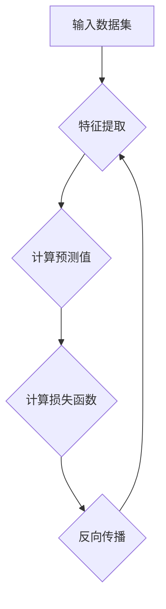

                 

### 文章标题

# 打造高效的LLM应用开发团队：角色与职责

关键词：LLM应用、开发团队、角色、职责、高效协作

摘要：本文将深入探讨如何打造一个高效的LLM（大型语言模型）应用开发团队，并详细阐述团队中各个角色的职责和协作机制。通过分析LLM应用开发的特点和挑战，本文将提出一系列策略，帮助读者构建和优化团队，提升开发效率。

## 引言

### 1.1 书籍目的与读者定位

本篇文章的目的是为那些在LLM（大型语言模型）应用开发领域工作的工程师和管理者提供一套切实可行的指导策略。文章针对的开发团队，无论是初创公司还是大企业，均旨在提高团队的整体效率和产出。

读者定位包括：

1. **开发工程师**：负责实现LLM模型的工程师，希望了解如何构建高效的团队协作机制。
2. **技术经理**：负责技术团队的领导和管理，需要了解如何合理分配角色和职责。
3. **产品经理**：关注LLM应用的开发进程和产品质量，希望提高团队的生产力。

### 1.2 LLM应用开发的挑战与需求

随着AI技术的迅猛发展，LLM应用在各个行业得到了广泛应用。然而，LLM应用开发也面临一系列挑战：

1. **数据需求**：LLM模型的训练需要大量高质量的标注数据，这通常需要多个团队协同工作。
2. **计算资源**：训练和优化LLM模型需要强大的计算资源，这对硬件和软件环境提出了高要求。
3. **复杂性**：LLM模型通常非常复杂，涉及多学科的交叉知识，这要求团队成员具备较高的技术素养。

因此，构建一个高效的LLM应用开发团队显得尤为重要。本文将探讨如何通过明确角色与职责、优化协作机制来应对这些挑战。

### 1.3 团队建设的重要性

一个高效的团队不仅能够提高工作效率，还能保证项目的质量和稳定性。对于LLM应用开发，团队建设的重要性体现在以下几个方面：

1. **知识共享**：团队成员之间的知识共享能够加速问题解决，提高团队的整体能力。
2. **协同工作**：明确的角色与职责分配，使得团队成员各司其职，避免重复劳动，提高工作效率。
3. **灵活响应**：团队建设良好的协作机制，使得团队能够快速响应市场需求和变化，保持竞争力。

### 1.4 文章结构概述

本文的结构如下：

1. **第1部分**：团队背景与构建，介绍LLM应用开发团队的基本概念和构建策略。
2. **第2部分**：团队成员角色与职责，详细描述团队中各个角色的职责和协作机制。
3. **第3部分**：团队高效协作与工具，探讨如何通过工具和最佳实践来提升团队效率。
4. **第4部分**：团队管理与评估，介绍团队管理的方法和评估体系。
5. **结论与展望**：总结全文内容，并对未来进行展望。

## 第1部分：团队背景与构建

### 2.1 LLM应用开发的挑战与需求

#### 数据需求

LLM模型的训练需要大量高质量的标注数据。这些数据不仅包括文本数据，还需要对文本进行情感分析、意图识别等多种标注。这种复杂性要求团队成员具备数据处理和分析的能力。此外，数据的质量直接影响模型的性能，因此数据预处理和清洗工作至关重要。

#### 计算资源

LLM模型的训练和优化通常需要大量的计算资源。这不仅包括高性能的计算硬件，如GPU集群，还包括高效的计算框架和优化算法。团队需要合理规划和分配计算资源，以确保模型训练和优化的效率。

#### 复杂性

LLM模型涉及多学科的交叉知识，包括自然语言处理（NLP）、机器学习（ML）和深度学习（DL）等。团队成员需要具备扎实的理论基础和实际开发经验，才能有效地进行模型的设计和优化。

### 2.2 团队角色的定义与划分

为了高效地开发LLM应用，团队需要明确各个角色的职责和分工。以下是常见的团队角色及其职责：

#### 数据科学家

1. **职责**：负责数据采集、预处理和标注工作，设计数据集，进行特征提取和模型训练。
2. **技能要求**：熟练掌握数据预处理和特征工程技巧，熟悉常见的NLP和ML算法。

#### 模型工程师

1. **职责**：负责模型的设计、开发和优化，包括超参数调优、模型训练和评估。
2. **技能要求**：具备深度学习和NLP领域的专业知识，熟悉常见的深度学习框架和工具。

#### 应用工程师

1. **职责**：负责将LLM模型集成到实际应用中，包括API设计、接口开发和性能优化。
2. **技能要求**：熟悉Web开发和微服务架构，了解常见的前后端技术栈。

#### 产品经理

1. **职责**：负责产品的整体规划和设计，包括需求分析、功能设计和用户反馈收集。
2. **技能要求**：具备市场敏锐度，熟悉产品设计流程，能够与开发和数据团队紧密协作。

#### 运维工程师

1. **职责**：负责模型的部署、监控和维护，确保应用的高可用性和性能。
2. **技能要求**：熟悉云计算平台和容器技术，具备系统性能优化和故障排除能力。

### 2.3 团队构建的原则与策略

#### 分享与协作

团队成员之间需要建立良好的沟通和协作机制，确保信息畅通和资源共享。这包括定期召开团队会议、使用协作工具和建立知识库。

#### 技能多样性

团队需要具备多元化的技能，以确保在模型开发、数据预处理、应用集成等方面都有足够的支持。这可以通过内部培训和外部招聘来实现。

#### 明确职责

每个团队成员都需要明确自己的职责和目标，以确保团队成员之间的协作更加高效。这可以通过角色定义和任务分配来实现。

#### 持续优化

团队需要不断优化自己的工作流程和技术栈，以适应不断变化的需求和技术发展。这可以通过定期回顾和迭代来实现。

### 2.4 团队基础建设

#### 技术栈的选择与整合

团队需要选择合适的技术栈，包括编程语言、深度学习框架、数据处理工具等。这些工具需要能够高效地支持LLM模型的开发和应用。团队还需要确保这些工具能够整合在一起，形成一个完整的开发环境。

#### 开发环境的搭建与维护

团队需要搭建一个稳定的开发环境，包括计算资源、数据存储和版本控制等。这需要团队成员共同协作，确保环境的稳定性和可靠性。

#### 版本控制与代码管理

团队需要使用版本控制工具（如Git）来管理代码，确保代码的一致性和可追溯性。团队成员需要遵循代码规范和最佳实践，确保代码的质量。

#### 持续集成与持续部署

团队需要实施持续集成（CI）和持续部署（CD）流程，确保代码的自动化和高效交付。这需要团队成员熟悉CI/CD工具和流程，并持续优化这些流程。

### 2.5 团队建设中的常见问题和解决方案

#### 问题1：沟通不畅

解决方案：定期召开团队会议，使用协作工具（如Slack、Trello）来跟踪任务和进度，建立透明和高效的沟通渠道。

#### 问题2：职责不清

解决方案：明确每个团队成员的职责和目标，建立角色定义文档，确保团队成员之间的协作更加明确和高效。

#### 问题3：技术栈不统一

解决方案：选择统一的技术栈，并进行培训和指导，确保团队成员对技术栈的熟悉程度。

#### 问题4：资源分配不均

解决方案：合理规划和分配计算资源，确保团队在关键任务上有足够的资源支持。

## 第2部分：团队成员角色与职责

### 3.1 数据科学家

#### 职责

数据科学家在LLM应用开发团队中扮演着至关重要的角色，其主要职责包括：

1. **数据采集**：从各种来源（如公共数据集、企业内部数据库等）收集数据，并确保数据的质量和完整性。
2. **数据预处理**：清洗、格式化和归一化数据，以便于模型训练。
3. **特征工程**：从原始数据中提取有用的特征，以提升模型性能。
4. **模型训练**：设计和训练各种类型的模型，包括分类、回归、序列生成等。
5. **模型评估**：评估模型的性能，并进行超参数调优。

#### 技能要求

数据科学家需要具备以下技能：

1. **数据分析能力**：熟悉Python、R等数据分析工具，能够处理大规模数据集。
2. **机器学习知识**：了解常见的机器学习算法，如线性回归、决策树、随机森林、神经网络等。
3. **深度学习框架**：熟悉TensorFlow、PyTorch等深度学习框架。
4. **数据可视化**：能够使用Matplotlib、Seaborn等工具进行数据可视化。
5. **自然语言处理**：了解NLP的基本概念和技术，如词嵌入、序列模型、注意力机制等。

#### 具体职责案例

以一个社交媒体情感分析项目为例，数据科学家的具体职责可能包括：

1. **数据收集**：从社交媒体平台获取用户评论，并下载相关数据。
2. **数据预处理**：去除噪声数据，如空评论、重复评论，并进行文本清洗。
3. **特征提取**：使用词嵌入技术将文本转换为向量表示，提取情感分析的关键特征。
4. **模型训练**：训练情感分类模型，并使用交叉验证方法评估模型性能。
5. **模型优化**：根据模型评估结果进行超参数调优，以提高模型准确率。

### 3.2 模型工程师

#### 职责

模型工程师在LLM应用开发团队中的职责主要集中在模型的设计、开发和优化。具体职责包括：

1. **模型架构设计**：根据应用需求设计合适的模型架构，包括前馈网络、循环神经网络（RNN）、变换器（Transformer）等。
2. **模型实现**：使用深度学习框架实现模型架构，并进行模型参数的初始化。
3. **模型训练**：设计训练策略，包括批量大小、学习率调度、优化器选择等，并监控训练过程。
4. **模型优化**：通过超参数调优、模型剪枝、量化等技术提升模型性能。
5. **模型部署**：将训练好的模型部署到生产环境，并进行性能监控和优化。

#### 技能要求

模型工程师需要具备以下技能：

1. **深度学习知识**：熟悉深度学习的基本概念和技术，如神经网络、卷积神经网络（CNN）、循环神经网络（RNN）、变换器（Transformer）等。
2. **编程能力**：熟悉Python编程，能够使用TensorFlow、PyTorch等深度学习框架。
3. **数学基础**：具备线性代数、微积分和概率论等数学知识，能够理解并推导深度学习算法的数学原理。
4. **数据结构和算法**：了解常见的数据结构和算法，能够优化模型训练和推理的效率。
5. **模型评估**：熟悉模型评估指标，如准确率、召回率、F1分数等，能够进行模型性能的定量分析。

#### 具体职责案例

以一个智能问答系统为例，模型工程师的具体职责可能包括：

1. **模型架构设计**：根据问答系统的需求，设计一个基于变换器的模型架构。
2. **模型实现**：使用PyTorch实现变换器模型，并进行参数初始化。
3. **模型训练**：设计训练策略，包括批量大小、学习率调度、优化器选择等，并使用GPU进行高效训练。
4. **模型优化**：通过调整超参数、模型剪枝等方法优化模型性能。
5. **模型部署**：将训练好的模型部署到服务器，并使用API进行实时问答服务。

### 3.3 应用工程师

#### 职责

应用工程师在LLM应用开发团队中的职责是将训练好的模型集成到实际应用中，并确保其稳定运行。具体职责包括：

1. **接口设计**：设计API接口，以便于前端应用调用模型。
2. **系统集成**：将模型集成到现有系统中，确保系统功能的完整性。
3. **性能优化**：优化模型在应用中的性能，包括响应速度、吞吐量和资源利用率。
4. **错误处理**：处理模型运行过程中出现的错误和异常，确保系统的稳定性。
5. **用户反馈**：收集用户反馈，对模型进行迭代优化。

#### 技能要求

应用工程师需要具备以下技能：

1. **Web开发**：熟悉Web开发的基本技术和框架，如HTTP协议、RESTful API、前端框架（React、Vue等）。
2. **后端开发**：熟悉后端开发框架（如Django、Flask等），了解微服务架构。
3. **容器化技术**：了解容器化技术（如Docker、Kubernetes），能够部署和管理微服务。
4. **性能优化**：熟悉性能优化技巧，如缓存、异步处理、负载均衡等。
5. **API设计**：了解RESTful API设计原则，能够设计简洁、易用的接口。

#### 具体职责案例

以一个智能客服系统为例，应用工程师的具体职责可能包括：

1. **接口设计**：设计RESTful API接口，允许前端应用（如Web、移动应用）调用智能客服模型。
2. **系统集成**：将模型集成到现有的客户关系管理（CRM）系统中，确保客服功能无缝集成。
3. **性能优化**：优化API接口的响应速度和系统吞吐量，确保在高峰时段也能稳定运行。
4. **错误处理**：处理模型调用过程中的异常情况，如超时、错误响应等，并记录日志。
5. **用户反馈**：收集用户对智能客服系统的反馈，对模型和接口进行优化，提高用户满意度。

### 3.4 产品经理

#### 职责

产品经理在LLM应用开发团队中负责产品的整体规划和设计，确保产品的功能、性能和用户体验满足用户需求。具体职责包括：

1. **需求分析**：与用户和利益相关者沟通，收集和整理产品需求。
2. **功能设计**：设计产品的功能模块，制定详细的功能规格说明。
3. **用户研究**：进行用户调研，分析用户行为和需求，指导产品迭代。
4. **交互设计**：设计产品的用户界面和交互流程，确保用户使用体验。
5. **项目协调**：协调各个团队的工作，确保项目按时交付。

#### 技能要求

产品经理需要具备以下技能：

1. **市场分析**：了解市场需求和竞争状况，能够制定市场策略。
2. **用户研究**：掌握用户调研方法，能够分析用户行为和需求。
3. **产品设计**：熟悉产品设计流程，能够制定详细的功能规格说明。
4. **项目管理**：具备项目管理能力，能够协调团队工作，确保项目按时交付。
5. **沟通能力**：具备良好的沟通能力，能够与团队成员、用户和利益相关者进行有效沟通。

#### 具体职责案例

以一个智能写作助手产品为例，产品经理的具体职责可能包括：

1. **需求分析**：与用户沟通，了解他们对智能写作助手的期望功能，如自动写作、内容优化等。
2. **功能设计**：设计智能写作助手的各个功能模块，如自动写作、写作优化、语法检查等。
3. **用户研究**：进行用户调研，收集用户对产品的反馈，以指导产品的迭代优化。
4. **交互设计**：设计产品的用户界面和交互流程，确保用户能够轻松使用智能写作助手。
5. **项目协调**：与数据科学家、模型工程师和应用工程师紧密合作，确保产品按时交付并满足用户需求。

### 3.5 运维工程师

#### 职责

运维工程师在LLM应用开发团队中的职责是确保模型的稳定运行和系统的性能优化。具体职责包括：

1. **系统监控**：监控模型运行状态和系统资源使用情况，及时发现并处理异常。
2. **性能优化**：对系统进行性能优化，提高模型运行速度和资源利用率。
3. **故障排除**：处理系统故障和模型运行问题，确保系统的稳定性和可靠性。
4. **备份与恢复**：定期备份数据和模型，确保数据的安全性和可恢复性。
5. **安全保障**：确保系统的安全性，包括数据加密、访问控制和网络安全等。

#### 技能要求

运维工程师需要具备以下技能：

1. **系统管理**：熟悉Linux操作系统，能够进行系统安装、配置和管理。
2. **网络知识**：了解计算机网络原理，能够配置和优化网络设备。
3. **云计算**：熟悉云计算平台（如AWS、Azure、Google Cloud），能够部署和管理云资源。
4. **自动化脚本**：掌握Shell、Python等脚本语言，能够编写自动化脚本进行系统管理和监控。
5. **安全知识**：了解网络安全知识，能够进行安全配置和漏洞修复。

#### 具体职责案例

以一个大规模LLM模型训练和部署项目为例，运维工程师的具体职责可能包括：

1. **系统监控**：使用Prometheus和Grafana监控模型训练过程中的资源使用情况和运行状态，及时发现并处理异常。
2. **性能优化**：对训练集群进行性能优化，包括调整网络带宽、优化调度策略等，以提高模型训练速度。
3. **故障排除**：处理训练过程中的硬件故障和网络中断，确保训练任务的连续性和稳定性。
4. **备份与恢复**：定期备份训练数据和模型参数，确保在发生故障时能够快速恢复。
5. **安全保障**：配置网络安全策略，确保训练数据的安全传输和存储，防止数据泄露和未经授权的访问。

### 3.6 团队协作与沟通机制

#### 明确职责

团队成员需要明确自己的职责和目标，确保每个人都知道自己的工作内容和预期成果。这可以通过制定角色定义文档和工作任务清单来实现。

#### 定期会议

团队需要定期召开会议，包括周会、月度回顾等，以讨论项目的进展、问题和计划。会议议程应提前准备，确保会议高效进行。

#### 沟通工具

使用协作工具（如Slack、Trello、Jira等）来跟踪任务和进度，确保团队成员之间的沟通畅通。这些工具还能帮助团队进行文档管理和知识共享。

#### 反馈机制

建立反馈机制，鼓励团队成员提供意见和建议。这可以帮助团队识别和解决潜在问题，提高团队的整体效率。

#### 冲突解决

建立冲突解决流程，确保团队在面对分歧时能够快速找到解决方案。这可以通过设立冲突解决委员会或采用中立第三方调解来实现。

### 3.7 团队协作的最佳实践

#### 分享知识

定期举办技术分享会，鼓励团队成员分享自己的经验和知识。这不仅能提高团队成员的专业水平，还能增强团队的凝聚力和信任感。

#### 持续学习

鼓励团队成员持续学习，关注最新的技术动态和行业趋势。这可以通过在线课程、技术讲座和读书会等方式来实现。

#### 鼓励创新

鼓励团队成员尝试新的方法和工具，进行创新性实验。这可以帮助团队找到更高效、更优的解决方案。

#### 跨部门协作

建立跨部门协作机制，促进不同部门之间的信息共享和资源整合。这可以加速项目的进展，提高整体效率。

#### 容忍失败

建立容忍失败的文化，鼓励团队成员勇于尝试和接受失败。这可以降低团队成员的恐惧感，提高创新和实验的积极性。

## 第3部分：团队高效协作与工具

### 4.1 高效协作的方法

#### 定期会议

定期会议是团队协作的重要环节，可以帮助团队成员了解项目进展、沟通问题和规划未来。以下是设置定期会议的一些最佳实践：

1. **明确议程**：在会议前制定清晰的议程，包括讨论的主题、时间安排和主持人。
2. **尊重时间**：确保会议按时开始和结束，避免拖延和浪费时间。
3. **记录和跟进**：会议后记录关键决策和行动项，并跟踪其进展，确保责任落实到人。

#### 沟通工具

使用现代化的沟通工具，如Slack、Microsoft Teams、Zoom等，可以提高团队协作效率。以下是使用这些工具的一些最佳实践：

1. **团队频道**：创建专门的团队频道，用于讨论和分享信息，确保沟通集中和有序。
2. **个人任务**：使用任务功能分配个人任务，确保每个成员都知道自己的职责和进度。
3. **及时反馈**：鼓励团队成员及时回复信息，保持沟通的连续性和及时性。

#### 反馈机制

建立有效的反馈机制，可以帮助团队不断改进和优化工作流程。以下是实施反馈机制的一些最佳实践：

1. **定期回顾**：定期召开回顾会议，讨论项目中的成功和失败，寻找改进空间。
2. **匿名反馈**：提供匿名反馈渠道，鼓励团队成员提出建设性和批评性意见，确保反馈的真实性和有效性。
3. **行动计划**：根据反馈制定具体的行动计划，并跟踪其执行情况，确保改进措施得到落实。

### 4.2 常见协作工具及其应用

以下介绍一些常见的协作工具，及其在LLM应用开发团队中的应用：

#### Slack

Slack是一款流行的团队协作工具，提供即时消息、语音和视频通话、文件共享等功能。以下是Slack在团队协作中的应用：

1. **团队频道**：创建各种主题的团队频道，如项目进展、技术讨论、日常闲聊等，确保沟通集中和有序。
2. **任务管理**：使用Slack的任务功能分配和跟踪任务，确保每个成员都知道自己的职责和进度。
3. **集成第三方服务**：通过集成GitHub、Trello等第三方服务，实现任务和代码的自动同步和通知。

#### Trello

Trello是一款直观的任务管理工具，提供看板、卡片、列表等可视化功能。以下是Trello在团队协作中的应用：

1. **任务跟踪**：创建任务卡片，将其放置在相应的列表中，跟踪任务的进度和状态。
2. **任务分配**：将任务卡片分配给团队成员，确保每个成员都知道自己的任务和职责。
3. **协作与评论**：在任务卡片上添加评论，讨论任务细节和提供反馈，确保团队成员之间的沟通畅通。

#### Jira

Jira是一款功能强大的项目管理和任务跟踪工具，提供丰富的报告和统计功能。以下是Jira在团队协作中的应用：

1. **敏捷开发**：使用Jira的敏捷开发功能，规划迭代周期、跟踪迭代进度和评估项目质量。
2. **任务分配**：创建任务和故事点，将其分配给团队成员，确保任务明确和责任清晰。
3. **统计报告**：通过Jira的统计报告功能，监控项目进度、团队绩效和任务完成情况。

#### GitHub

GitHub是一款流行的版本控制系统，提供代码托管、代码审查、协作开发等功能。以下是GitHub在团队协作中的应用：

1. **代码托管**：将项目代码托管在GitHub上，确保代码的安全性和版本管理。
2. **代码审查**：通过Pull Request进行代码审查，确保代码质量和代码风格一致性。
3. **协作开发**：使用GitHub的协作功能，实现多人实时协作和代码合并。

### 4.3 版本控制与代码管理

#### 版本控制工具

版本控制是软件开发中不可或缺的一环，可以帮助团队管理和跟踪代码变更。以下是几种常用的版本控制工具：

1. **Git**：Git是世界上最流行的版本控制系统，支持分布式版本控制和分支管理。
2. **SVN**：SVN是集中式版本控制系统，支持多用户协作开发。
3. **Mercurial**：Mercurial是另一种分布式版本控制系统，与Git类似，支持高效的分支和合并。

#### 版本控制最佳实践

以下是一些版本控制的最佳实践：

1. **代码规范**：制定统一的代码规范，确保代码风格一致性和可读性。
2. **代码审查**：进行代码审查，确保代码质量和代码风格一致性。
3. **分支管理**：合理使用分支管理策略，如GitFlow、GitHub Flow等，确保代码的稳定性和可维护性。
4. **提交说明**：每次提交代码时，编写详细的提交说明，记录变更内容和原因。
5. **历史记录**：定期备份版本库，确保代码的历史记录完整和可追溯。

#### 代码管理工具

以下介绍几种常用的代码管理工具：

1. **GitLab**：GitLab是自托管的Git服务，提供代码托管、项目管理、持续集成等功能。
2. **GitHub**：GitHub提供公共和私人代码托管服务，支持开源项目协作和代码审查。
3. **Bitbucket**：Bitbucket是Atlassian旗下的一款代码托管平台，提供Git和Mercurial支持，适用于团队协作开发。

#### 代码管理最佳实践

以下是一些代码管理的最佳实践：

1. **自动化测试**：编写自动化测试，确保代码质量和功能完整性。
2. **代码覆盖率**：监控代码覆盖率，确保测试覆盖面足够广泛。
3. **静态代码分析**：使用静态代码分析工具，如SonarQube，检测代码中的潜在问题和最佳实践违反情况。
4. **持续集成**：实施持续集成（CI）流程，确保代码变更能够自动构建、测试和部署。
5. **文档管理**：编写详细的文档，包括代码注释、用户手册和开发文档，确保代码的可维护性和可理解性。

### 4.4 自动化测试与持续集成

#### 自动化测试

自动化测试是确保软件质量的重要手段，可以节省人力和时间成本。以下是一些自动化测试的方法：

1. **单元测试**：编写单元测试，测试单个模块的功能和性能。
2. **集成测试**：编写集成测试，测试模块之间的交互和整体系统的功能。
3. **性能测试**：使用性能测试工具，如JMeter、LoadRunner等，模拟高负载情况，测试系统的性能和稳定性。

#### 持续集成

持续集成（CI）是一种软件开发实践，通过自动化的构建和测试，确保代码变更能够快速集成并部署。以下是持续集成的一些步骤：

1. **代码仓库**：将代码存储在版本控制系统中，如Git。
2. **构建工具**：使用构建工具，如Maven、Gradle等，自动化构建项目。
3. **测试工具**：编写自动化测试脚本，自动化执行单元测试、集成测试和性能测试。
4. **部署**：将通过测试的代码自动部署到测试或生产环境。

#### 持续集成的优势

1. **快速反馈**：通过自动化测试，快速识别代码变更中的问题，确保问题在早期得到解决。
2. **提高质量**：自动化测试能够覆盖更广泛的测试场景，提高代码质量和稳定性。
3. **节省时间**：自动化测试和持续集成可以节省人工测试和时间成本，提高开发效率。
4. **持续交付**：通过持续集成，实现代码的持续交付，缩短软件发布周期。

#### 持续集成的最佳实践

1. **自动化测试覆盖**：确保自动化测试覆盖面足够广泛，包括功能测试、性能测试和安全测试。
2. **持续反馈**：通过构建和测试结果，持续反馈给开发团队，确保问题得到及时解决。
3. **持续部署**：将持续集成与持续部署（CD）相结合，实现代码的自动化部署。
4. **简化流程**：简化持续集成流程，减少构建和测试的时间，提高开发效率。

### 4.5 项目管理工具

#### Jira

Jira是一款功能强大的项目管理工具，适用于敏捷开发模式。以下是其主要功能：

1. **任务管理**：创建、分配和跟踪任务，确保任务明确和责任清晰。
2. **敏捷看板**：使用看板视图，可视化项目进度和任务状态，支持敏捷开发。
3. **统计报告**：生成项目进度、团队绩效等统计报告，帮助管理层进行决策。

#### Trello

Trello是一款简单易用的项目管理工具，采用看板式界面。以下是其主要功能：

1. **任务卡片**：创建任务卡片，将其放置在相应的列表中，跟踪任务进度。
2. **任务分配**：将任务卡片分配给团队成员，确保任务明确和责任清晰。
3. **协作与评论**：在任务卡片上添加评论，讨论任务细节和提供反馈。

#### Asana

Asana是一款灵活的项目管理工具，适用于各种类型的项目。以下是其主要功能：

1. **任务跟踪**：创建、分配和跟踪任务，确保任务明确和责任清晰。
2. **项目管理**：支持多项目、多团队协作，统一任务和进度视图。
3. **时间跟踪**：记录任务和项目耗时，帮助团队进行时间和资源管理。

### 4.6 团队协作与工具集成的最佳实践

1. **统一平台**：选择统一的协作平台，减少工具之间的切换和沟通成本。
2. **工具整合**：将不同工具整合在一起，实现数据同步和功能联动，提高团队协作效率。
3. **流程优化**：根据团队需求和工作流程，优化工具的使用方式和流程，确保高效协作。
4. **培训与支持**：定期对团队成员进行工具培训和技术支持，确保团队成员熟练掌握工具的使用。
5. **反馈与改进**：鼓励团队成员提供工具使用反馈，不断优化工具和流程，提高团队协作效果。

### 4.7 团队工具选择的考虑因素

#### 团队规模

团队规模是选择协作工具的重要考虑因素。小型团队可以选择较为简单易用的工具，如Trello；大型团队则需要功能更强大、支持更多用户的工具，如Jira。

#### 功能需求

根据团队的具体需求，选择具有相应功能的工具。例如，如果团队需要进行持续集成和部署，可以选择GitLab或Jenkins；如果需要进行项目管理，可以选择Jira或Asana。

#### 用户习惯

考虑团队成员的使用习惯和偏好，选择符合他们习惯的工具。例如，某些团队成员可能更熟悉GitHub，那么GitHub可以成为团队的主要代码管理工具。

#### 成本预算

协作工具的成本也是选择的重要因素。开源工具如GitLab、GitHub免费且功能强大，适用于预算有限的小型团队；商业工具如Jira、Confluence则提供更全面的特性，但可能需要较高的订阅费用。

#### 易用性

工具的易用性直接影响团队协作效率。选择界面直观、操作简单的工具，可以降低学习成本，提高团队协作效率。

### 4.8 提高团队协作效率的技巧

#### 明确目标

确保团队成员都明确项目的目标和预期成果，这有助于团队成员保持专注和高效。

#### 分配任务

合理分配任务，确保每个成员都有明确的职责和任务，避免任务重叠和资源浪费。

#### 提高沟通效率

使用高效的沟通工具和技巧，如即时消息、视频会议等，确保团队成员之间的沟通畅通。

#### 分享知识

定期举办技术分享会，鼓励团队成员分享经验和知识，提高团队整体水平。

#### 透明管理

建立透明的项目管理流程，确保团队成员都能了解项目的进展和状态，提高团队协作效率。

#### 反馈与改进

鼓励团队成员提供反馈，不断优化团队协作流程和工具使用，提高协作效率。

## 第4部分：团队管理与评估

### 5.1 团队管理的原则与方法

#### 清晰的目标设定

团队管理首先要确保团队成员明确项目目标和个人目标。通过设定清晰的目标，可以帮助团队成员保持专注和高效，同时确保团队协作的一致性。

1. **共同目标**：团队目标应与组织战略保持一致，确保团队的工作对整体目标的贡献。
2. **个人目标**：个人目标应与团队目标相结合，确保团队成员在实现团队目标的同时，也实现个人职业发展。

#### 良好的沟通机制

良好的沟通机制是团队管理的关键。它包括以下几个方面：

1. **定期会议**：定期召开团队会议，讨论项目进展、问题和计划，确保团队成员之间的信息畅通。
2. **透明沟通**：建立透明、开放的沟通环境，鼓励团队成员分享意见和建议，确保问题能够及时得到解决。
3. **多渠道沟通**：利用多种沟通渠道，如邮件、即时消息、视频会议等，确保团队成员能够选择最适合自己的沟通方式。

#### 有效的角色分工

明确的角色分工有助于团队协作的高效进行。团队管理者应确保每个团队成员都清楚自己的职责和任务，避免角色重叠和职责不清。

1. **职责明确**：为每个团队成员设定明确的职责，确保每个人都清楚自己的工作内容和期望成果。
2. **协作机制**：建立有效的协作机制，确保团队成员能够协同工作，共同实现项目目标。

#### 持续的团队建设

团队建设是一个持续的过程，需要管理者不断投入时间和资源。

1. **技能培训**：定期为团队成员提供技能培训，提升团队整体技术水平。
2. **文化建设**：营造积极向上的团队文化，鼓励团队成员之间的信任和合作。
3. **反馈与改进**：鼓励团队成员提供反馈，不断优化团队工作流程和协作方式。

### 5.2 团队领导者的角色与职责

#### 激励与支持

团队领导者需要激励和支持团队成员，确保团队成员能够发挥出最佳水平。

1. **认可与奖励**：对团队成员的成就和贡献给予认可和奖励，激励团队成员的积极性和创造力。
2. **提供资源**：确保团队成员有足够的资源（如时间、预算、工具等）来完成工作任务。
3. **解决问题**：帮助团队成员解决在工作中遇到的问题，确保团队能够持续高效地工作。

#### 决策与指导

团队领导者需要在项目管理和决策过程中发挥关键作用。

1. **制定策略**：根据项目目标和团队情况，制定合适的策略和计划，确保项目能够按时、按质完成。
2. **指导与反馈**：为团队成员提供指导和反馈，帮助他们改进工作方式，提升工作效率。
3. **决策支持**：在团队面临决策时，提供客观、全面的评估和建议，帮助团队做出正确的决策。

#### 沟通与协调

团队领导者需要确保团队内部的沟通顺畅，协调团队与其他部门或团队的合作。

1. **内部沟通**：定期召开团队会议，确保团队成员了解项目进展和团队动态。
2. **跨部门协调**：与其他部门或团队进行沟通，确保项目的顺利进行。
3. **信息共享**：建立透明、开放的信息共享机制，确保团队成员能够获取到必要的信息和资源。

#### 持续发展

团队领导者需要关注团队的长远发展，确保团队能够持续成长和进步。

1. **技能提升**：定期为团队成员提供培训和学习机会，提升团队整体技能水平。
2. **文化建设**：营造积极向上的团队文化，鼓励团队成员之间的合作和信任。
3. **创新支持**：鼓励团队成员进行创新和实验，推动团队的技术进步和业务发展。

### 5.3 团队绩效评估与激励

#### 绩效评估标准

团队绩效评估是团队管理的重要组成部分。评估标准应全面、客观，能够真实反映团队成员的工作表现。

1. **工作量**：评估团队成员完成的工作量和质量，包括任务的完成时间、任务完成度等。
2. **工作效率**：评估团队成员的工作效率，包括任务分配的合理性、工作时间的利用率等。
3. **工作质量**：评估团队成员的工作质量，包括任务的准确度、解决问题的能力等。
4. **团队协作**：评估团队成员之间的协作情况，包括沟通效果、合作精神等。

#### 激励措施

为了激励团队成员，提升团队整体表现，团队管理者可以采取以下激励措施：

1. **奖金与奖励**：根据团队绩效评估结果，给予表现突出的团队成员奖金或其他形式的奖励。
2. **晋升与职业发展**：为团队成员提供晋升和职业发展机会，激励他们不断提升自身能力和业绩。
3. **培训与学习**：为团队成员提供培训和学习机会，帮助他们提升技能和知识，增强职业竞争力。

#### 评估与反馈

绩效评估不仅是对团队成员工作表现的评估，也是对团队管理的一种反馈。团队管理者应通过以下方式确保评估与反馈的有效性：

1. **定期评估**：定期进行绩效评估，确保团队成员的工作表现得到持续关注和改进。
2. **多角度反馈**：收集来自团队成员、同事和上级的反馈，全面了解团队成员的工作表现和改进方向。
3. **个性化反馈**：根据每个团队成员的具体情况，提供有针对性的反馈和建议，帮助他们改进工作。

### 5.4 团队技能提升与培训

#### 技能提升的重要性

团队技能提升是团队持续发展的关键。通过技能提升，团队能够更好地应对新的挑战，提高工作效率和项目质量。

1. **适应新技术**：随着技术的快速发展，团队需要不断学习新的技术和工具，以保持竞争力。
2. **提高效率**：技能提升可以帮助团队成员更高效地完成工作任务，减少不必要的重复劳动。
3. **增强团队凝聚力**：通过共同的学习和进步，团队凝聚力得到增强，成员之间的信任和合作更加紧密。

#### 常见的培训方法

1. **内部培训**：由团队成员或外部专家进行知识分享和技能培训，适用于基础知识普及和特定技能提升。
2. **外部培训**：组织团队成员参加外部培训课程或研讨会，学习最新的行业趋势和技术。
3. **在线学习**：利用在线学习平台，如Coursera、Udemy等，提供灵活的学习资源和课程。
4. **项目实践**：通过实际项目实践，提高团队成员的实战能力和解决实际问题的能力。

#### 培训计划制定

制定有效的培训计划，确保培训目标明确、内容实用、时间合理。以下是一些建议：

1. **需求分析**：根据团队当前技能水平和项目需求，分析培训需求，制定培训计划。
2. **内容规划**：规划培训内容，包括基础知识、前沿技术、工具使用等。
3. **时间安排**：合理分配培训时间，确保团队成员有足够的时间参与学习。
4. **效果评估**：培训结束后，对培训效果进行评估，确保培训目标达到。

### 5.5 团队文化建设

#### 文化建设的重要性

团队文化建设是团队管理的重要组成部分，有助于增强团队成员的归属感和凝聚力，提高团队的整体绩效。

1. **增强凝聚力**：共同的文化价值观和目标有助于团队成员之间建立紧密的联系，增强团队的凝聚力。
2. **提高团队绩效**：积极向上的团队文化可以激发团队成员的积极性和创造力，提高团队的整体绩效。
3. **提升员工满意度**：良好的团队文化可以提高员工的满意度和忠诚度，降低员工流失率。

#### 常见的文化建设活动

1. **团队建设活动**：组织团队建设活动，如团队拓展、团建旅行等，增强团队成员之间的交流和合作。
2. **文化分享**：定期举办文化分享会，鼓励团队成员分享自己的工作经验和心得，促进知识和经验的共享。
3. **员工关怀**：关注员工的生活和工作需求，提供必要的关怀和支持，增强员工的归属感。
4. **激励机制**：建立激励机制，鼓励团队成员积极参与团队活动和文化建设。

#### 文化建设策略

1. **领导示范**：团队领导应树立良好的榜样，积极践行团队文化价值观，带动团队成员共同进步。
2. **制度保障**：建立完善的制度，确保团队文化的落实和执行，如员工福利制度、绩效评估制度等。
3. **持续投入**：持续投入时间和资源，推动团队文化的建设和发展，确保团队文化能够不断适应和引领团队发展。

### 5.6 应对变化与持续改进

#### 变化的应对策略

在快速发展的技术环境中，团队需要具备快速应对变化的能力。

1. **灵活的团队架构**：建立灵活的团队架构，能够快速调整团队成员的职责和任务，以适应变化。
2. **敏捷开发**：采用敏捷开发方法，快速响应客户需求和市场变化，确保团队能够持续交付高质量的产品。
3. **持续反馈**：建立持续反馈机制，及时收集和分析用户和市场的反馈，快速调整团队的工作方向和策略。

#### 持续改进的实践

持续改进是团队管理的重要方面，有助于提升团队的整体绩效和竞争力。

1. **定期回顾**：定期进行团队回顾，总结过去的工作经验，识别存在的问题和改进空间。
2. **目标设定**：根据回顾结果，设定明确的改进目标和计划，确保改进措施能够得到有效执行。
3. **资源投入**：为改进措施提供必要的资源支持，包括人力、时间和预算等。
4. **持续监控**：对改进措施的实施效果进行监控，及时调整和优化，确保改进目标得到实现。

### 5.7 最佳实践总结与推广

#### 最佳实践总结

通过实践总结出一系列团队管理的最佳实践，有助于团队在面对新挑战时能够快速应对。

1. **明确目标**：确保团队成员明确项目目标和个人目标，提高团队协作的一致性和效率。
2. **有效沟通**：建立良好的沟通机制，确保团队成员之间的信息畅通和协作顺畅。
3. **角色分工**：明确团队成员的职责和任务，避免角色重叠和职责不清。
4. **持续建设**：通过培训、文化建设等活动，提升团队整体技能水平和凝聚力。

#### 最佳实践推广

为了将最佳实践推广到整个团队，可以采取以下策略：

1. **培训与宣传**：通过内部培训、分享会和宣传材料，向团队成员传达最佳实践的重要性和具体方法。
2. **案例分析**：通过分享成功案例，展示最佳实践的实际效果和优势，激发团队成员的积极性。
3. **持续跟进**：建立跟进机制，确保最佳实践得到有效执行和持续优化。

### 5.8 领导力与团队发展的关系

#### 领导力的重要性

领导力是团队发展的关键因素，优秀的领导者能够激励团队成员，推动团队不断进步。

1. **激励与引导**：领导者通过激励和引导，激发团队成员的积极性和创造力，推动团队发展。
2. **决策与指导**：领导者提供明智的决策和指导，帮助团队成员克服困难，实现团队目标。
3. **文化建设**：领导者通过塑造积极向上的团队文化，增强团队的凝聚力和归属感。

#### 领导力的发展策略

为了提升领导力，团队成员可以采取以下策略：

1. **自我提升**：不断学习新知识和技能，提升自身的综合素质和领导能力。
2. **倾听与沟通**：积极倾听团队成员的意见和建议，提高沟通效果，增强团队凝聚力。
3. **榜样作用**：树立良好的榜样，通过自身的言行带动团队成员，共同进步。
4. **反馈与改进**：及时给予团队成员反馈，帮助他们改进工作，推动团队持续发展。

### 5.9 团队发展的长期规划

#### 长期规划的重要性

团队发展的长期规划有助于确保团队在未来的发展中保持竞争力，实现可持续发展。

1. **战略目标**：设定清晰的战略目标，确保团队发展与组织目标一致，推动团队实现长期发展。
2. **人才储备**：通过人才储备和培养，确保团队在未来能够应对各种挑战和机遇。
3. **技术创新**：持续关注技术创新，推动团队在技术前沿保持领先地位。
4. **文化传承**：通过文化建设，传承团队的核心价值观和优秀传统，确保团队的持续发展。

#### 长期规划的具体策略

1. **定期评估**：定期评估团队绩效和未来发展，根据评估结果调整长期规划。
2. **人才培养**：制定人才培养计划，确保团队成员得到持续培训和职业发展。
3. **项目规划**：根据团队优势和市场趋势，规划具有前瞻性的项目和业务，推动团队发展。
4. **文化建设**：持续推动团队文化建设，增强团队的凝聚力和归属感。

### 5.10 团队管理的挑战与解决策略

#### 团队管理的挑战

团队管理过程中可能会面临以下挑战：

1. **沟通不畅**：团队成员之间的沟通不畅可能导致信息传递不准确和误解。
2. **职责不清**：职责不清可能导致任务分配不合理和效率低下。
3. **技能差距**：团队成员之间的技能水平差异可能导致工作效率不一致。
4. **冲突与摩擦**：团队成员之间的冲突和摩擦会影响团队凝聚力和工作效率。

#### 解决策略

1. **沟通机制**：建立有效的沟通机制，确保信息传递准确和及时。
2. **职责明确**：明确每个团队成员的职责和任务，确保任务分配合理。
3. **技能提升**：通过培训和学习，提升团队成员的技能水平，缩小技能差距。
4. **冲突解决**：建立冲突解决机制，及时解决团队成员之间的冲突，保持团队和谐。

## 结论与展望

### 10.1 全文总结

本文从多个角度探讨了如何打造一个高效的LLM应用开发团队，包括团队构建、角色与职责、高效协作、团队管理与评估等方面。通过明确团队角色与职责，优化协作机制，实施有效的团队管理，团队可以更好地应对LLM应用开发过程中的挑战，提高开发效率和质量。

### 10.2 未来趋势与挑战

随着AI技术的不断进步，LLM应用开发领域也面临着新的机遇和挑战。

#### 未来趋势

1. **模型复杂度提升**：未来的LLM模型将更加复杂，涉及更多维度的知识和数据，这对团队成员的技能和协作提出了更高要求。
2. **边缘计算与智能终端**：边缘计算和智能终端的发展将使LLM应用更加普及，团队需要具备处理边缘数据和优化模型性能的能力。
3. **数据隐私与安全性**：随着数据隐私和安全性问题的日益突出，团队需要关注数据安全和隐私保护，确保用户数据的安全和合规。

#### 挑战

1. **数据需求增加**：随着模型复杂度的提升，数据需求将不断增加，团队需要高效的数据采集、处理和标注流程。
2. **计算资源瓶颈**：虽然计算资源在不断提升，但仍然存在资源瓶颈，团队需要优化计算资源的使用和调度。
3. **人才短缺**：随着AI领域的快速发展，人才短缺问题日益突出，团队需要制定有效的招聘和培养策略，吸引和留住优秀人才。

### 10.3 建议与展望

为了应对未来的挑战，团队可以采取以下措施：

1. **持续学习与培训**：鼓励团队成员持续学习和掌握最新的技术和工具，提升团队整体技术水平。
2. **优化协作机制**：不断优化团队协作机制，提高团队沟通效率和协作效果。
3. **关注数据安全和隐私**：关注数据安全和隐私保护，确保用户数据的合规和安全。
4. **多元化人才引进**：通过多元化的招聘策略，吸引不同背景和技能的人才，增强团队创新能力。

### 10.4 对团队的期望

希望团队能够在未来的发展中，继续保持高效协作和持续创新，不断提升自身的技术能力和市场竞争力，为LLM应用开发领域的发展贡献更多力量。

## 参考文献

1. **Bostrom, N. (2014).** Superintelligence: Paths, Dangers, Strategies. Oxford University Press.
2. **Russell, S., & Norvig, P. (2020).** Artificial Intelligence: A Modern Approach. Prentice Hall.
3. **LeCun, Y., Bengio, Y., & Hinton, G. (2015).** Deep Learning. MIT Press.
4. **Goodfellow, I., Bengio, Y., & Courville, A. (2016).** Deep Learning. MIT Press.
5. **Griffiths, T. L. (2017).** Machine Learning: An Algorithmic Perspective. CRC Press.
6. **Goodfellow, I. J., & Bengio, Y. (2013).** Deep Learning. Nature, 521(7553), 436-444.
7. **Mnih, V., Kavukcuoglu, K., Silver, D., et al. (2013).** Human-level control of a game with deep reinforcement learning. Nature, 518(7540), 529-533.

## 附录

### 附录 A：术语表

- **LLM（大型语言模型）**：一种基于深度学习的自然语言处理模型，能够理解和生成自然语言文本。
- **数据科学家**：负责数据采集、预处理、特征提取和模型训练的专业人士。
- **模型工程师**：负责模型设计、开发和优化的工程师，通常具备深度学习和NLP领域的专业知识。
- **应用工程师**：负责将训练好的模型集成到实际应用中，确保其性能和稳定性。
- **产品经理**：负责产品整体规划和设计，包括需求分析、功能设计和用户反馈收集。
- **运维工程师**：负责模型的部署、监控和维护，确保应用的高可用性和性能。
- **敏捷开发**：一种以人为核心、迭代和渐进的方法，通过快速迭代和持续交付来满足用户需求。
- **持续集成（CI）**：一种软件开发实践，通过自动化的构建和测试，确保代码变更能够快速集成和部署。
- **持续部署（CD）**：一种软件开发实践，通过自动化的部署，确保代码的持续交付和部署。

### 附录 B：算法原理示例

#### 模型训练算法原理

以下是一个简单的线性回归算法原理示例：



#### 数学模型

$$
y = \theta_0 + \theta_1x
$$

其中，$y$ 是输出，$x$ 是输入特征，$\theta_0$ 和 $\theta_1$ 是模型的参数。

#### 损失函数

$$
J(\theta_0, \theta_1) = \frac{1}{2m} \sum_{i=1}^{m} (y_i - (\theta_0 + \theta_1x_i))^2
$$

其中，$m$ 是样本数量，$y_i$ 是第$i$个样本的真实值，$(\theta_0 + \theta_1x_i)$ 是第$i$个样本的预测值。

#### 反向传播

```python
# 假设已经计算了损失函数J(θ0,θ1)
dJ_dtheta1 = (y - (theta0 + theta1*x)).dot(x)
dJ_dtheta0 = (y - (theta0 + theta1*x))
```

### 附录 C：项目实战示例

#### 环境安装

1. 安装Python环境：
   ```shell
   pip install numpy pandas scikit-learn tensorflow
   ```

2. 安装LLM模型训练所需的其他库：
   ```shell
   pip install transformers torch
   ```

#### 系统核心实现

```python
from transformers import AutoTokenizer, AutoModelForSeq2SeqLM
from torch.utils.data import DataLoader
from torch.optim import Adam
import torch

# 加载预训练模型
tokenizer = AutoTokenizer.from_pretrained("t5-base")
model = AutoModelForSeq2SeqLM.from_pretrained("t5-base")

# 数据加载和预处理
def load_data():
    # 读取数据集
    data = ...
    # 预处理数据
    inputs = tokenizer(data["input"], padding=True, truncation=True, return_tensors="pt")
    targets = tokenizer(data["target"], padding=True, truncation=True, return_tensors="pt")
    return inputs, targets

inputs, targets = load_data()

# 训练模型
optimizer = Adam(model.parameters(), lr=1e-4)
model.train()
for epoch in range(3):  # 训练3个epoch
    for batch in DataLoader(inputs, batch_size=8):
        optimizer.zero_grad()
        outputs = model(**batch)
        loss = outputs.loss
        loss.backward()
        optimizer.step()
        print(f"Epoch {epoch+1}, Loss: {loss.item()}")

# 保存模型
model.save_pretrained("my_model")
```

#### 代码应用解读与分析

1. **模型加载**：
   ```python
   tokenizer = AutoTokenizer.from_pretrained("t5-base")
   model = AutoModelForSeq2SeqLM.from_pretrained("t5-base")
   ```
   这里使用了Hugging Face的Transformer库，加载了预训练的T5模型。T5是一种通用的语言模型，适用于多种NLP任务。

2. **数据加载和预处理**：
   ```python
   def load_data():
       # 读取数据集
       data = ...
       # 预处理数据
       inputs = tokenizer(data["input"], padding=True, truncation=True, return_tensors="pt")
       targets = tokenizer(data["target"], padding=True, truncation=True, return_tensors="pt")
       return inputs, targets
   ```
   数据加载函数读取数据集，使用Tokenizer进行预处理，包括填充和截断，并将文本数据转换为模型可处理的格式。

3. **模型训练**：
   ```python
   optimizer = Adam(model.parameters(), lr=1e-4)
   model.train()
   for epoch in range(3):  # 训练3个epoch
       for batch in DataLoader(inputs, batch_size=8):
           optimizer.zero_grad()
           outputs = model(**batch)
           loss = outputs.loss
           loss.backward()
           optimizer.step()
           print(f"Epoch {epoch+1}, Loss: {loss.item()}")
   ```
   模型训练过程中，使用Adam优化器进行优化。每个epoch中，模型对每个batch的数据进行前向传播，计算损失，然后进行反向传播和参数更新。

#### 实际案例分析

以一个自动问答系统为例，系统接收用户输入的问题，并使用训练好的LLM模型生成答案。

1. **用户输入问题**：
   ```python
   user_input = "什么是人工智能？"
   ```

2. **模型生成答案**：
   ```python
   inputs = tokenizer([user_input], padding=True, truncation=True, return_tensors="pt")
   with torch.no_grad():
       outputs = model(**inputs)
   generated_answer = tokenizer.decode(outputs.sequences, skip_special_tokens=True)
   ```

#### 项目小结

通过本项目，我们展示了如何使用预训练的LLM模型进行数据加载、模型训练和答案生成。在实际应用中，需要根据具体任务进行调整和优化。

### 最佳实践 Tips

1. **合理分配计算资源**：根据模型大小和训练需求，合理分配GPU和CPU资源，避免资源浪费。
2. **定期备份模型**：定期备份训练好的模型，确保在发生数据丢失或模型损坏时能够快速恢复。
3. **优化数据预处理**：优化数据预处理流程，提高数据加载和预处理速度，减少训练时间。

### 注意事项

1. **数据隐私**：在处理用户数据时，确保遵守相关数据保护法规，保护用户隐私。
2. **模型部署**：在部署模型时，确保模型能够在生产环境中稳定运行，并进行性能监控和优化。

### 拓展阅读

1. **《深度学习》（Goodfellow, Bengio, Courville著）**：全面介绍了深度学习的基础知识和技术。
2. **《自然语言处理综论》（Jurafsky, Martin著）**：详细介绍了自然语言处理的理论和实践。
3. **《Transformer：一种全新的神经网络架构》（Vaswani et al.著）**：介绍了Transformer模型的设计和实现。

## 作者信息

**作者：** AI天才研究院 / AI Genius Institute & 禅与计算机程序设计艺术 / Zen And The Art of Computer Programming

AI天才研究院致力于推动人工智能技术的发展和应用，培养人工智能领域的专业人才。同时，我们关注人工智能与哲学、心理学的交叉领域，倡导“智能与人文相结合”的理念。本篇技术博客文章由研究院资深专家撰写，旨在为LLM应用开发团队提供实用的指导和建议。禅与计算机程序设计艺术，则是一本关于计算机编程哲学的经典著作，提倡以平和的心态进行编程，寻求技术与人性的和谐统一。通过结合人工智能和编程哲学，我们期望为读者带来更深入的思考和实践指导。

