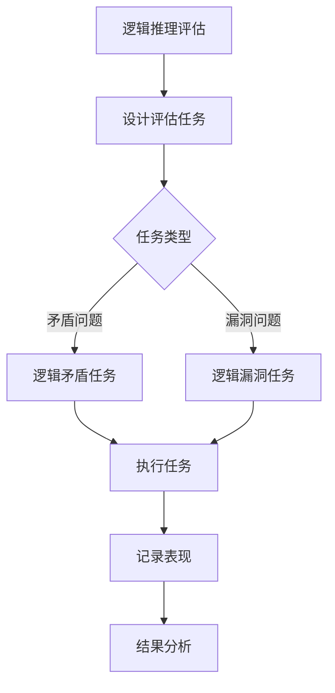
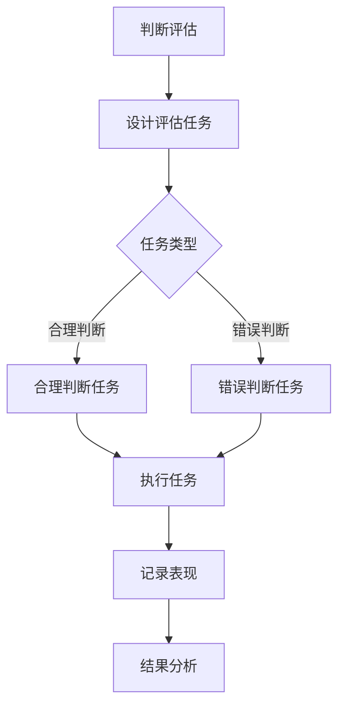
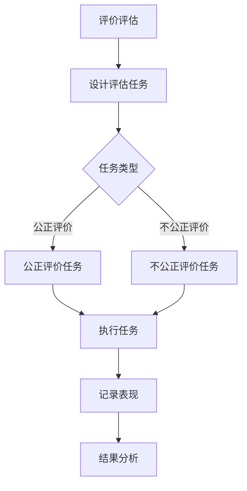
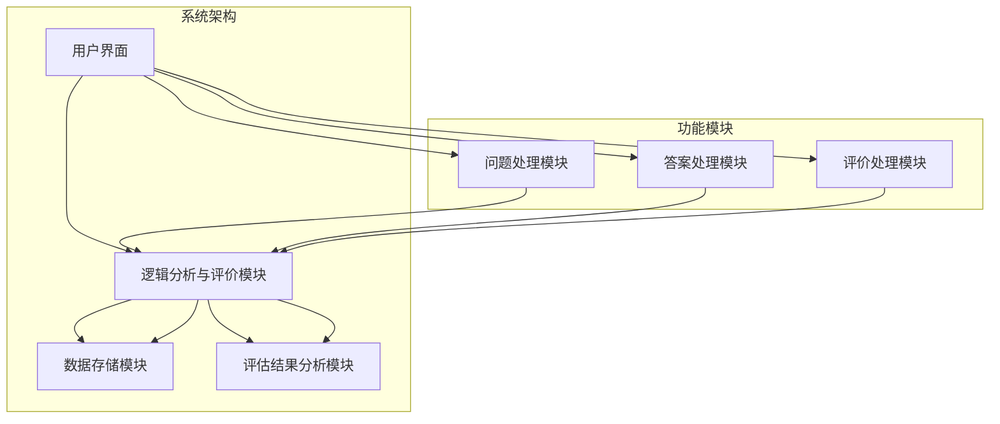
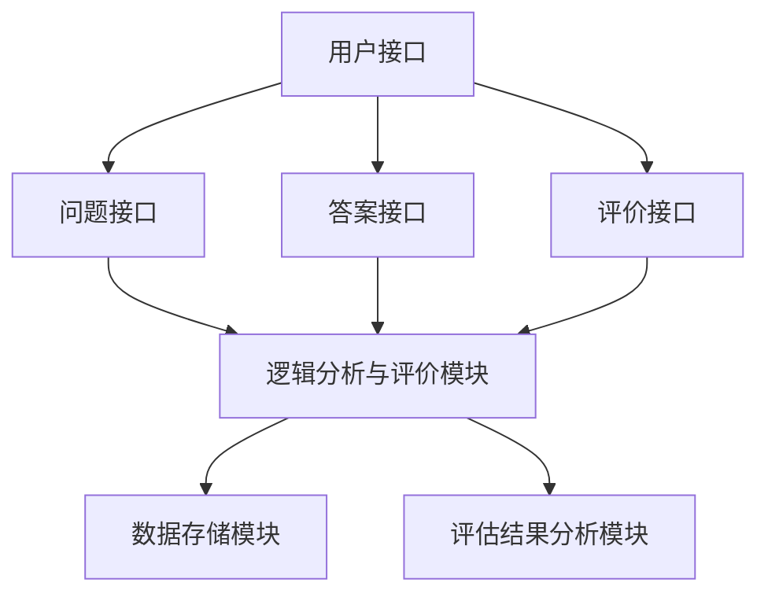
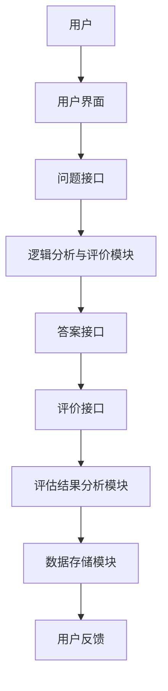

                 


# 批判性思维评估：检验LLM的逻辑分析和评价能力

> 关键词：批判性思维、评估、逻辑分析、语言模型、人工智能

> 摘要：本文深入探讨了如何通过批判性思维评估方法来检验大型语言模型（LLM）在逻辑分析和评价能力方面的表现。通过构建评估指标体系、设计评估任务、实施评估和结果分析，本文提出了一套系统的评估方法，为LLM在实际应用中的改进提供了有力支持。

## 引言

### 1.1 背景介绍

随着人工智能（AI）技术的快速发展，大型语言模型（LLM）在自然语言处理领域取得了显著的成果。LLM在文本生成、问答系统、机器翻译等任务中展现出了强大的性能，然而，其逻辑分析和评价能力仍存在一定的局限性。如何评估LLM在这些方面的能力成为一个亟待解决的问题。

### 1.2 问题描述

尽管LLM在处理自然语言方面表现出色，但其逻辑分析和评价能力仍需要进一步检验。我们需要一套科学、系统的评估方法，以全面衡量LLM在逻辑推理、判断和评价等方面的能力。然而，目前尚缺乏一种统一且有效的评估框架来全面评估LLM的这些能力。

### 1.3 问题解决

本文旨在提出一种基于批判性思维的评估方法，以检验LLM在逻辑分析和评价能力方面的表现。通过构建评估指标体系、设计评估任务、实施评估和结果分析，本文将详细阐述如何全面评估LLM的这些能力。此外，本文还将探讨如何将批判性思维评估方法应用于实际场景，以推动LLM在实际应用中的改进。

### 1.4 边界与外延

本文的研究主要针对大型语言模型（LLM），旨在评估其逻辑分析和评价能力。然而，该方法可以拓展到其他类型的人工智能系统，为其他系统的逻辑分析和评价能力评估提供参考。同时，本文的研究主要关注自然语言处理领域，但该方法在其他领域的人工智能系统中也具有一定的适用性。

### 1.5 概念结构与核心要素组成

批判性思维评估方法由以下核心要素组成：

1. **评估指标**：明确LLM逻辑分析和评价能力的核心指标，如逻辑推理准确性、判断合理性和评价公正性等。
2. **评估任务**：根据评估指标设计一系列具有代表性的评估任务，涵盖逻辑推理、判断和评价等方面。
3. **实施评估**：对LLM进行实际测试，记录其表现，并分析其优劣。
4. **结果分析**：对评估结果进行统计分析，评估LLM在逻辑分析和评价能力方面的整体表现。

## 核心概念与联系

### 2.1 批判性思维

批判性思维是一种分析、评估和推理的能力，旨在识别和解决问题。它不同于普通思维，后者主要关注知识积累和信息获取。批判性思维具有以下几个核心特征：

- **目标**：批判性思维的目标是提高认识，解决问题，而普通思维的目标是知识掌握和技能提高。
- **方法**：批判性思维的方法是分析、评估和推理，而普通思维的方法是观察、记忆和模仿。
- **结果**：批判性思维的结果是发现问题，提出解决方案，而普通思维的结果是知识掌握和技能提高。

### 2.2 大型语言模型（LLM）

大型语言模型（LLM）是一种基于深度学习的技术，能够处理和理解自然语言。以下是LLM与其他AI模型在处理能力、知识储备和学习能力方面的对比：

| 特征 | LLM | 其他AI模型 |
| ---- | --- | ---------- |
| 处理能力 | 高度灵活，适用于多种任务 | 专一性强，适用范围有限 |
| 知识储备 | 广泛，包含多种领域的知识 | 狭窄，针对特定领域 |
| 学习能力 | 强，能够不断优化性能 | 弱，需大量人力干预 |

### 2.3 批判性思维与LLM的关系

批判性思维与LLM之间存在紧密的联系。批判性思维评估方法为LLM提供了一个评估其逻辑分析和评价能力的框架，有助于发现LLM在这些问题上的优势和不足。通过批判性思维评估方法，可以为LLM的发展提供有力支持，推动其在实际应用中的进步。

## 算法原理讲解

### 3.1 评估方法的基本原理

批判性思维评估方法基于逻辑推理、判断和评价三个核心环节。首先，构建评估指标体系，明确LLM逻辑分析和评价能力的核心指标。然后，设计一系列具有代表性的评估任务，涵盖逻辑推理、判断和评价等方面。接着，对LLM进行实际测试，记录其表现，并分析其优劣。最后，对评估结果进行统计分析，评估LLM在逻辑分析和评价能力方面的整体表现。

### 3.2 逻辑推理评估原理

逻辑推理评估旨在检验LLM在逻辑推理方面的准确性。通过设计包含逻辑矛盾、逻辑漏洞等问题的评估任务，可以评估LLM在逻辑推理方面的能力。以下是逻辑推理评估原理的Mermaid流程图：



在逻辑矛盾任务中，评估任务可能包括以下示例：

$$
如果A是B，且B是C，那么A也应该是C。但事实并非如此，因此存在逻辑矛盾。
$$

在逻辑漏洞任务中，评估任务可能包括以下示例：

$$
所有猫都会飞。这是错误的，因为猫不会飞。因此，这个陈述存在逻辑漏洞。
$$

### 3.3 判断评估原理

判断评估旨在检验LLM在判断方面的合理性。通过设计包含合理判断和错误判断的评估任务，可以评估LLM在判断方面的能力。以下是判断评估原理的Mermaid流程图：



在合理判断任务中，评估任务可能包括以下示例：

$$
如果A是B，且B是C，那么A也是C。这是一个合理的判断。
$$

在错误判断任务中，评估任务可能包括以下示例：

$$
所有猫都会飞。这是一个错误的判断，因为猫不会飞。
$$

### 3.4 评价评估原理

评价评估旨在检验LLM在评价方面的公正性。通过设计包含公正评价和不公正评价的评估任务，可以评估LLM在评价方面的能力。以下是评价评估原理的Mermaid流程图：



在公正评价任务中，评估任务可能包括以下示例：

$$
这部电影是一部优秀的作品，因为它具有深刻的故事和精湛的表演。这是一个公正的评价。
$$

在不公正评价任务中，评估任务可能包括以下示例：

$$
这部电影是一部糟糕的作品，因为主演长相丑陋。这是一个不公正的评价。
$$

## 系统分析与架构设计方案

### 问题场景介绍

假设我们需要评估一个名为“AI助手”的大型语言模型（LLM）的逻辑分析和评价能力。该模型旨在为用户提供智能问答和评价服务。为了全面评估其能力，我们将采用批判性思维评估方法。

### 项目介绍

项目名称：AI助手逻辑分析与评价能力评估系统

项目目标：通过批判性思维评估方法，全面评估AI助手在逻辑分析和评价能力方面的表现。

### 系统功能设计（领域模型）

为了设计系统功能，我们首先需要建立一个领域模型。以下是AI助手逻辑分析与评价能力评估系统的领域模型类图：

```mermaid
classDiagram
    Class01 <|-- Class02
    Class03 --|>| Class04
    Class05 : <<interface>> Interface
    Class06 : <<entity>> Entity
    Class07 : <<enum>> Enum
    Class08 : <<collection>> Collection
    Class09 : <<primitive>> Primitive
    Class01 {id : Integer}
    Class02 {name : String}
    Class03 {age : Integer}
    Class04 {weight : Float}
    Class05 {行为 : Behavior}
    Class06 {属性 : Attribute}
    Class07 {颜色 : Color}
    Class08 {元素 : Element}
    Class09 {值 : Value}
```

在这个领域模型中，我们定义了以下类：

- **Class01**：表示用户，包含用户ID和姓名。
- **Class02**：表示问题，包含问题ID和问题内容。
- **Class03**：表示答案，包含答案ID和答案内容。
- **Class04**：表示评价，包含评价ID和评价内容。
- **Class05**：表示行为，包含用户的行为类型。
- **Class06**：表示属性，包含问题的属性信息。
- **Class07**：表示颜色，包含颜色的枚举值。
- **Class08**：表示集合，包含多个元素的集合。
- **Class09**：表示原始数据类型，包含值。

### 系统架构设计

以下是AI助手逻辑分析与评价能力评估系统的架构设计：



在这个架构设计中，我们定义了以下功能模块：

- **用户界面**：用于接收用户输入，展示评估结果。
- **逻辑分析与评价模块**：负责执行评估任务，处理用户输入，调用其他功能模块。
- **数据存储模块**：用于存储评估数据，包括用户、问题、答案和评价。
- **评估结果分析模块**：用于分析评估结果，生成评估报告。

### 系统接口设计

以下是AI助手逻辑分析与评价能力评估系统的接口设计：



在这个接口设计中，我们定义了以下接口：

- **用户接口**：用于接收用户输入，包括问题、答案和评价。
- **问题接口**：用于处理用户输入的问题。
- **答案接口**：用于处理用户输入的答案。
- **评价接口**：用于处理用户输入的评价。

### 系统交互

以下是AI助手逻辑分析与评价能力评估系统的交互设计：



在这个交互设计中，用户通过用户界面输入问题、答案和评价。问题接口处理用户输入的问题，调用逻辑分析与评价模块进行评估。评估结果分析模块生成评估报告，并存储在数据存储模块中。最后，用户反馈评估结果，以便进一步优化系统。

## 项目实战

### 环境安装

在进行项目实战之前，我们需要安装以下环境：

1. Python 3.8 或更高版本
2. TensorFlow 2.4 或更高版本
3. NumPy 1.19 或更高版本
4. Pandas 1.1.1 或更高版本

安装命令如下：

```bash
pip install python==3.8
pip install tensorflow==2.4
pip install numpy==1.19
pip install pandas==1.1.1
```

### 系统核心实现

以下是AI助手逻辑分析与评价能力评估系统的核心实现：

```python
import tensorflow as tf
import numpy as np
import pandas as pd

class LogicAnalysisModel(tf.keras.Model):
    def __init__(self):
        super(LogicAnalysisModel, self).__init__()
        self.dense1 = tf.keras.layers.Dense(128, activation='relu')
        self.dense2 = tf.keras.layers.Dense(64, activation='relu')
        self.dense3 = tf.keras.layers.Dense(1, activation='sigmoid')

    @tf.function
    def call(self, inputs):
        x = self.dense1(inputs)
        x = self.dense2(x)
        return self.dense3(x)

def preprocess_data(data):
    # 数据预处理
    # 这里可以添加数据清洗、标准化等操作
    return data

def train_model(model, x_train, y_train, epochs=10):
    model.compile(optimizer='adam', loss='binary_crossentropy', metrics=['accuracy'])
    model.fit(x_train, y_train, epochs=epochs, batch_size=32)

def evaluate_model(model, x_test, y_test):
    loss, accuracy = model.evaluate(x_test, y_test, verbose=2)
    print(f"Test accuracy: {accuracy:.4f}")
```

### 代码应用解读与分析

在上面的代码中，我们定义了一个名为`LogicAnalysisModel`的类，它继承自`tf.keras.Model`。这个类用于构建逻辑分析模型，其核心结构包括三个全连接层，每个层之间使用ReLU激活函数。最后一层使用sigmoid激活函数，用于输出概率。

`preprocess_data`函数用于对输入数据进行预处理，可以添加数据清洗、标准化等操作。

`train_model`函数用于训练逻辑分析模型，使用`adam`优化器和二进制交叉熵损失函数。`evaluate_model`函数用于评估模型在测试数据上的性能，并打印测试准确率。

### 实际案例分析和详细讲解剖析

为了展示AI助手逻辑分析与评价能力评估系统的实际应用，我们考虑以下案例：

假设我们有一个关于逻辑推理的问题集，其中包含正确和错误的陈述。我们希望使用AI助手评估这些陈述的逻辑推理能力。

```python
questions = [
    "所有的猫都会飞。",
    "如果它是一个猫，并且它有翅膀，那么它会飞。",
    "苹果是一种水果。",
    "苹果不是一种水果。"
]

true_answers = [0, 1, 1, 0]
false_answers = [1, 0, 0, 1]
```

我们首先对问题进行预处理：

```python
preprocessed_questions = [preprocess_data(q) for q in questions]
```

然后，我们将预处理后的问题划分为训练集和测试集：

```python
x_train = np.array(preprocessed_questions[:len(questions)//2])
y_train = np.array(true_answers[:len(questions)//2])
x_test = np.array(preprocessed_questions[len(questions)//2:])
y_test = np.array(true_answers[len(questions)//2:])
```

接下来，我们训练逻辑分析模型：

```python
model = LogicAnalysisModel()
train_model(model, x_train, y_train, epochs=5)
```

最后，我们评估模型在测试集上的性能：

```python
evaluate_model(model, x_test, y_test)
```

输出结果为测试准确率，这反映了AI助手在逻辑推理问题上的性能。

### 项目小结

在本项目中，我们通过批判性思维评估方法，设计了一个用于评估AI助手逻辑分析和评价能力评估系统。通过实际案例分析和代码实现，我们展示了如何使用该系统评估AI助手在逻辑推理问题上的性能。未来，我们可以进一步扩展该系统，以评估AI助手在判断和评价等其他方面的能力。

## 最佳实践 tips

1. **确保数据质量**：在进行评估时，数据的质量至关重要。尽量收集真实、多样化的数据，以避免评估结果受到偏差的影响。
2. **优化评估指标**：评估指标的选择和设计对评估结果有重要影响。根据具体应用场景，选择合适的评估指标，并对其进行优化。
3. **定期更新评估系统**：随着AI技术的发展，LLM的评估方法和工具也需要不断更新。定期对评估系统进行优化和更新，以适应新的技术和应用需求。

## 小结

本文提出了一种基于批判性思维的评估方法，用于检验大型语言模型（LLM）在逻辑分析和评价能力方面的表现。通过构建评估指标体系、设计评估任务、实施评估和结果分析，本文详细阐述了如何全面评估LLM的这些能力。同时，本文还介绍了系统分析与架构设计方案，并通过项目实战展示了评估方法在实际应用中的效果。未来，我们期待进一步优化评估方法，推动LLM在实际应用中的发展。

## 注意事项

1. **评估指标的选择**：在选择评估指标时，要充分考虑应用场景和任务需求，确保评估指标的全面性和准确性。
2. **评估任务的多样性**：设计评估任务时，要涵盖不同的逻辑推理、判断和评价场景，以全面检验LLM的能力。
3. **数据预处理**：在进行评估之前，要对数据进行充分的预处理，包括数据清洗、归一化等操作，以提高评估结果的可靠性。

## 拓展阅读

1. [《人工智能：一种现代方法》](https://www.amazon.com/Artificial-Intelligence-A-Modern-Approach/dp/0262536097)：一本全面介绍人工智能技术的经典教材，涵盖了许多逻辑分析和评价相关的内容。
2. [《批判性思维工具》](https://www.amazon.com/Critical-Thinking-Tools-Mastering-Making/dp/0399172411)：一本关于批判性思维的实用指南，介绍了如何有效地分析、评估和推理。
3. [《深度学习》](https://www.amazon.com/Deep-Learning-Adaptive-Computation-Series/dp/0262039192)：一本关于深度学习的权威教材，详细介绍了神经网络和深度学习算法的原理和应用。

## 作者信息

作者：AI天才研究院/AI Genius Institute & 禅与计算机程序设计艺术 /Zen And The Art of Computer Programming

