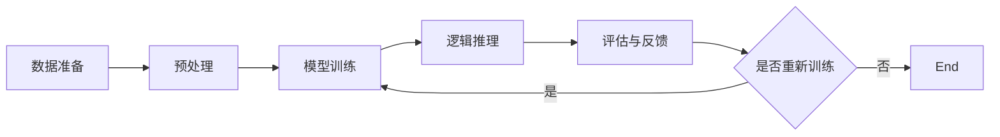
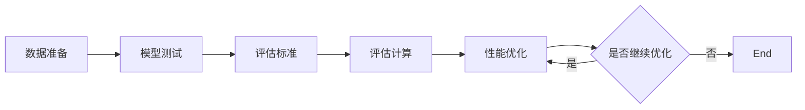
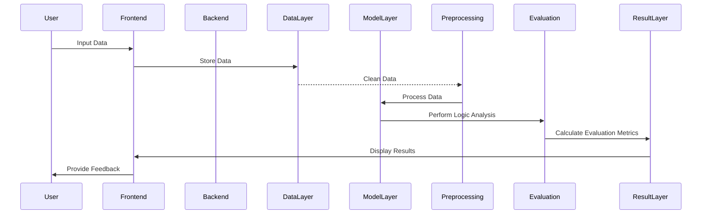

                 

### 第一部分: 背景介绍

#### 第1章: 批判性思维与LLM简介

##### 1.1 批判性思维的概述

批判性思维是一种重要的思维方式，它不仅仅是对信息的接受和记忆，更是对信息的深入思考和分析。批判性思维涉及评估信息的真实性、准确性、相关性、重要性以及逻辑性。以下是对批判性思维的详细定义和重要性解析。

###### 1.1.1 批判性思维的定义

批判性思维可以定义为一种主动的、系统的和反思性的思维方式，它涉及对信息、论点和假设的深入分析和评估。这种思维方式强调质疑、问题解决、分析和评估，以及逻辑推理和证据的收集与运用。

###### 1.1.2 批判性思维的重要性

批判性思维在多个领域都非常重要，其中包括：

- **教育**：培养学生的批判性思维能力有助于他们更好地理解和应用知识，进行创新和解决问题。
- **科研**：科研工作者需要通过批判性思维来评估现有理论、实验方法和数据分析，从而推动科学进步。
- **决策**：在商业和政府决策中，批判性思维有助于评估各种信息、选择最佳方案，并减少错误决策的可能性。

###### 1.1.3 批判性思维的应用领域

批判性思维的应用非常广泛，包括但不限于以下领域：

- **法律**：法官和律师需要批判性思维来分析案件、证据和法律条文，做出公正的判决。
- **医学**：医生和医疗研究人员需要批判性思维来评估病人症状、诊断和治疗方案。
- **工程**：工程师需要批判性思维来评估设计方案的可行性和安全性。
- **计算机科学**：计算机科学家需要批判性思维来评估算法的效率和可靠性，以及系统的安全性。

##### 1.2 LLM的概念

大型语言模型（LLM, Large Language Model）是一种人工智能模型，它可以对自然语言进行理解和生成。LLM在许多领域都有广泛应用，包括自然语言处理、文本生成、机器翻译等。

###### 1.2.1 LLM的定义

LLM是一种基于深度学习的技术，它通过大量文本数据进行训练，从而学会对语言进行建模和理解。LLM通常使用神经网络架构，如Transformer，来处理和生成文本。

###### 1.2.2 LLM的发展历程

LLM的发展可以追溯到20世纪80年代，但直到近年来，随着计算能力和数据量的提升，LLM才取得了显著进展。2018年，Google推出了BERT模型，标志着LLM进入了一个新的时代。随后，GPT-3、T5等大型LLM模型相继问世，使得LLM在自然语言处理领域取得了许多突破。

###### 1.2.3 LLM的主要特点

LLM的主要特点包括：

- **高容量**：LLM可以处理和理解大量的文本数据，这使得它们在文本生成、翻译等任务中具有优势。
- **自适应性强**：LLM可以根据不同的任务和数据集进行自适应调整，从而提高性能。
- **生成能力强**：LLM可以生成高质量、连贯的文本，这对于文本生成和自动摘要等任务至关重要。
- **复杂度**：由于LLM的规模和复杂度，它们的训练和推理过程需要大量的计算资源和时间。

##### 1.3 逻辑分析的重要性

逻辑分析是一种对信息进行推理和评估的方法，它基于逻辑规则和推理过程。逻辑分析在人工智能和计算机科学中具有重要作用，尤其是在大型语言模型（LLM）的应用中。

###### 1.3.1 逻辑分析的定义

逻辑分析是指通过逻辑推理和评估来分析信息的过程。它涉及对命题、论点和证据进行逻辑上的验证和评估，以确定它们的真实性和合理性。

###### 1.3.2 逻辑分析的方法

逻辑分析的方法包括：

- **命题逻辑**：使用逻辑运算符（如与、或、非）来表示和分析命题。
- **谓词逻辑**：使用变量和量词来表示和分析更复杂的命题。
- **归纳逻辑**：通过特定实例来推导一般结论。
- **演绎逻辑**：从一般原理推导特定结论。

###### 1.3.3 逻辑分析的应用场景

逻辑分析在多个领域都有应用，包括：

- **人工智能**：在人工智能系统中，逻辑分析用于推理、规划和决策。
- **自然语言处理**：在自然语言处理中，逻辑分析用于文本理解、语义分析和文本生成。
- **计算机科学**：在计算机科学中，逻辑分析用于算法设计、形式化验证和软件工程。

##### 1.4 评估能力的意义

评估能力是指对信息、方案、系统等进行评价和判断的能力。在人工智能和大型语言模型（LLM）领域，评估能力尤为重要。

###### 1.4.1 评估能力的定义

评估能力是指根据特定的标准和方法，对信息、方案、系统等进行评价和判断的能力。它涉及对质量、性能、安全性、可靠性等方面的评估。

###### 1.4.2 评估能力的标准

评估能力的标准包括：

- **准确性**：评估结果的准确性，即评估结果与实际结果的接近程度。
- **可靠性**：评估方法的可靠性和评估人员的可信度。
- **全面性**：评估内容的全面性，即是否考虑了所有相关因素。
- **客观性**：评估过程的客观性，即评估结果不受主观偏见的影响。

###### 1.4.3 评估能力在实际中的应用

评估能力在实际中的应用非常广泛，包括：

- **产品评估**：对产品的性能、质量、用户体验等进行评估。
- **风险评估**：对项目、投资、系统等的风险进行评估。
- **人才评估**：对员工的能力、潜力、绩效等进行评估。
- **教育评估**：对学生、教师、课程等进行评估。

##### 总结

本章介绍了批判性思维、LLM、逻辑分析和评估能力的基本概念和重要性。批判性思维是一种重要的思维方式，它在教育、科研、决策等多个领域具有重要应用。LLM是一种大型语言模型，它在自然语言处理和人工智能领域具有重要作用。逻辑分析是一种对信息进行推理和评估的方法，它在人工智能和计算机科学中具有重要作用。评估能力是一种对信息、方案、系统等进行评价和判断的能力，它在实际应用中具有重要意义。

---

### 第二部分: 核心概念与联系

#### 第2章: 核心概念与联系

##### 2.1 批判性思维与LLM的联系

批判性思维和大型语言模型（LLM）虽然在本质上是不同的，但它们之间有着紧密的联系。LLM可以被视为一种实现批判性思维的工具，而批判性思维则为LLM的应用提供了指导和框架。

###### 2.1.1 LLM如何实现批判性思维

LLM通过以下方式实现批判性思维：

- **数据分析**：LLM通过对大量文本数据进行分析，从中提取信息、模式和规律。这种数据分析能力类似于人类进行批判性思维时的信息收集过程。
- **逻辑推理**：LLM使用预训练的神经网络进行逻辑推理，从给定的信息中推导出新的结论。这类似于人类在批判性思维过程中使用逻辑推理来评估信息。
- **评估与判断**：LLM可以根据特定的标准和规则对信息进行评估和判断。例如，在文本生成任务中，LLM可以根据语义和语法规则评估文本的质量和连贯性。

###### 2.1.2 LLM批判性思维的应用案例

LLM在多个领域展现了其批判性思维能力，以下是一些典型的应用案例：

- **问答系统**：LLM可以用于构建智能问答系统，如智能客服、智能助手等。这些系统能够理解用户的问题，并根据逻辑推理和语义分析提供准确的答案。
- **文本生成**：LLM可以生成高质量、连贯的文本，如新闻文章、产品描述、演讲稿等。在生成过程中，LLM需要根据上下文和语义进行逻辑推理和评估，以确保生成文本的质量。
- **语义分析**：LLM可以用于语义分析任务，如实体识别、情感分析、关系抽取等。这些任务需要LLM对文本进行深入理解，并运用逻辑分析能力来提取语义信息。

###### 2.1.3 LLM批判性思维的局限

虽然LLM在实现批判性思维方面表现出色，但它也存在一些局限：

- **数据依赖性**：LLM的批判性思维能力依赖于其训练数据的质量和多样性。如果训练数据存在偏差或错误，LLM的评估和推理能力可能会受到影响。
- **逻辑局限性**：LLM的推理能力是基于预训练的神经网络模型，它可能无法处理复杂的逻辑推理任务，特别是在处理非标准逻辑或非标准语言时。
- **道德和伦理问题**：LLM在实现批判性思维时，可能会遇到道德和伦理问题。例如，在生成文本时，LLM可能会产生偏见或歧视性内容，这需要人类进行监督和纠正。

##### 2.2 逻辑分析与评估能力的关系

逻辑分析和评估能力是批判性思维的重要组成部分，它们在LLM的应用中有着密切的联系。

###### 2.2.1 逻辑分析对评估能力的影响

逻辑分析对评估能力具有重要影响，主要体现在以下几个方面：

- **评估标准**：逻辑分析可以帮助确定评估标准，确保评估过程的准确性和客观性。例如，在产品评估中，逻辑分析可以确定评估指标和评估方法，以全面、准确地评估产品的性能。
- **评估过程**：逻辑分析可以帮助优化评估过程，确保评估结果的可靠性和有效性。例如，在风险评估中，逻辑分析可以确定风险因素和评估方法，以提高风险评估的准确性和实用性。
- **评估结果**：逻辑分析可以帮助分析评估结果，发现潜在的问题和不足，并提出改进措施。例如，在教育评估中，逻辑分析可以帮助分析学生的表现，发现教学中的问题，并提出改进建议。

###### 2.2.2 评估能力对逻辑分析的要求

评估能力对逻辑分析提出了一些基本要求，主要包括：

- **准确性**：评估能力要求逻辑分析能够准确理解和处理信息，以确保评估结果的准确性和可靠性。
- **全面性**：评估能力要求逻辑分析能够全面考虑各种因素，以确保评估过程的全面性和公正性。
- **客观性**：评估能力要求逻辑分析能够客观地处理信息，不受主观偏见的影响。
- **灵活性**：评估能力要求逻辑分析具有灵活性，能够适应不同的评估场景和需求。

###### 2.2.3 如何结合逻辑分析与评估能力

结合逻辑分析与评估能力的方法主要包括以下几个方面：

- **确定评估目标**：明确评估的目标和标准，确保评估过程有明确的方向和依据。
- **设计评估方法**：根据评估目标，设计合理的评估方法，包括逻辑分析方法和评估指标。
- **收集和分析数据**：通过数据收集和分析，获取评估所需的信息，并运用逻辑分析对信息进行推理和评估。
- **优化评估过程**：根据评估结果，对评估过程进行优化和改进，以提高评估的准确性和有效性。

##### 总结

本章探讨了批判性思维、LLM、逻辑分析和评估能力之间的核心联系。LLM作为一种实现批判性思维的工具，它在数据分析、逻辑推理和评估判断方面表现出色。逻辑分析对评估能力具有重要影响，而评估能力对逻辑分析提出了一些基本要求。通过结合逻辑分析与评估能力，我们可以更有效地实现批判性思维，提高人工智能系统的性能和应用价值。

---

### 第三部分: 算法原理讲解

#### 第3章: 算法原理讲解

##### 3.1 测试LLM的逻辑分析算法

测试LLM的逻辑分析能力是一项重要任务，这涉及到对LLM推理过程的评估和对逻辑分析能力的测试。以下是一个基本框架，用于测试LLM的逻辑分析能力。

###### 3.1.1 算法概述

测试LLM的逻辑分析算法包括以下几个主要步骤：

1. **数据准备**：收集一组具有代表性的测试数据，这些数据包括逻辑命题、推理问题和答案。
2. **预处理**：对测试数据进行预处理，包括文本清洗、标准化和词向量表示。
3. **模型训练**：使用预训练的LLM模型对数据进行训练，以提升其逻辑分析能力。
4. **逻辑推理**：对测试数据中的命题进行推理，生成推理路径和中间结果。
5. **评估与反馈**：对推理结果进行评估，计算准确率、召回率等指标，并根据评估结果调整模型。

###### 3.1.2 Mermaid流程图

以下是一个简单的Mermaid流程图，用于描述测试LLM的逻辑分析算法：



###### 3.1.3 算法原理

算法原理主要包括以下几个方面：

1. **数据准备**：测试数据的收集和准备是测试LLM逻辑分析能力的基础。数据应该包括多种类型的逻辑命题和推理问题，以确保测试的全面性和代表性。
2. **预处理**：预处理步骤包括文本清洗、去除噪声、标准化和词向量表示。这些步骤有助于提高数据的质量和一致性，从而提高LLM的推理能力。
3. **模型训练**：使用预训练的LLM模型进行训练，以提升其逻辑分析能力。预训练模型通常具有较好的语言理解和生成能力，这使得它们在逻辑推理任务中具有优势。
4. **逻辑推理**：逻辑推理步骤涉及对测试数据进行推理，生成推理路径和中间结果。LLM通过其内部机制对命题进行解析、理解和推理，从而生成推理结果。
5. **评估与反馈**：评估步骤用于计算LLM的推理准确率、召回率等指标。这些指标反映了LLM的逻辑分析能力。根据评估结果，可以调整模型参数，以提高其性能。

##### 3.2 评估能力算法

评估能力算法主要用于评估LLM在不同任务中的表现，包括逻辑分析、文本生成、机器翻译等。以下是一个基本框架，用于评估LLM的评估能力。

###### 3.2.1 算法概述

评估能力算法包括以下几个主要步骤：

1. **数据准备**：收集一组具有代表性的评估数据，这些数据包括任务样本和评估标准。
2. **模型测试**：使用已训练好的LLM模型对评估数据进行测试，生成预测结果。
3. **评估标准**：根据任务特点，设计合理的评估标准，如准确率、召回率、F1分数等。
4. **评估计算**：计算预测结果与实际结果之间的评估指标，评估LLM的性能。
5. **性能优化**：根据评估结果，调整模型参数和结构，以提高性能。

###### 3.2.2 Mermaid流程图

以下是一个简单的Mermaid流程图，用于描述评估能力算法：



###### 3.2.3 算法原理

算法原理主要包括以下几个方面：

1. **数据准备**：评估数据的选择和准备是评估LLM性能的关键。数据应具有代表性、多样性和足够的覆盖范围，以确保评估结果的准确性。
2. **模型测试**：模型测试步骤涉及使用已训练好的LLM模型对评估数据进行预测。这包括对输入数据的处理、模型推理和输出结果的生成。
3. **评估标准**：评估标准的选择和设计应根据任务特点进行。常用的评估标准包括准确率、召回率、F1分数等。这些标准可以全面反映LLM在不同任务中的表现。
4. **评估计算**：评估计算步骤涉及计算预测结果与实际结果之间的差异，并生成评估指标。这些指标用于评估LLM的性能，为性能优化提供依据。
5. **性能优化**：根据评估结果，调整模型参数和结构，以提高性能。性能优化可以采用多种方法，如超参数调整、模型改进、数据增强等。

##### 总结

本章详细介绍了测试LLM逻辑分析能力和评估能力的算法原理。测试LLM的逻辑分析算法包括数据准备、预处理、模型训练、逻辑推理和评估与反馈等步骤。评估能力算法包括数据准备、模型测试、评估标准和评估计算等步骤。这些算法原理为设计和实现高效、可靠的LLM系统提供了理论依据和技术支持。

---

### 第四部分: 数学模型和数学公式

#### 第4章: 数学模型和数学公式

##### 4.1 逻辑分析数学模型

逻辑分析中的数学模型主要用于描述命题之间的关系和推理过程。以下是一个基本的逻辑分析数学模型，包括命题逻辑和谓词逻辑。

###### 4.1.1 模型公式

在命题逻辑中，命题是通过逻辑运算符（如与、或、非）组合而成的。以下是几个常见的命题逻辑公式：

$$
\begin{align*}
p \land q &\equiv (p \rightarrow q) \land (q \rightarrow p), \\
p \lor q &\equiv (p \rightarrow \neg q) \land (\neg p \rightarrow q), \\
\neg p &\equiv p \rightarrow \bot, \\
p \rightarrow q &\equiv \neg p \lor q.
\end{align*}
$$

在谓词逻辑中，命题是通过变量和量词（全称量词∀和存在量词∃）组合而成的。以下是几个常见的谓词逻辑公式：

$$
\begin{align*}
\forall x (P(x) \rightarrow Q(x)) &\equiv \neg \exists x (\neg P(x) \lor Q(x)), \\
\exists x (P(x) \land Q(x)) &\equiv \neg \forall x (\neg P(x) \lor \neg Q(x)), \\
\forall x P(x) &\equiv \neg \exists x (\neg P(x)), \\
\exists x P(x) &\equiv \neg \forall x (\neg P(x)).
\end{align*}
$$

###### 4.1.2 模型参数

在逻辑分析中，模型参数主要包括命题变量、逻辑运算符和量词。以下是一个示例：

$$
P(x): x \text{ 是一个素数}, \\
Q(x): x \text{ 是一个偶数}. \\
$$

###### 4.1.3 模型应用举例

以下是一个简单的逻辑分析应用例子：

假设我们有两个命题：

$$
P(x): x \text{ 是一个素数}, \\
Q(x): x \text{ 是一个偶数}.
$$

我们可以使用逻辑运算符组合这两个命题：

$$
\neg P(x) \land Q(x): x \text{ 不是一个素数，但是一个偶数}.
$$

这个例子展示了如何使用逻辑分析模型对命题进行组合和分析。

##### 4.2 评估能力数学模型

评估能力的数学模型主要用于描述评估过程中的性能指标和评估标准。以下是一个基本的评估能力数学模型。

###### 4.2.1 模型公式

在评估能力中，常用的性能指标包括准确率（Accuracy）、召回率（Recall）和F1分数（F1 Score）。以下是这些指标的计算公式：

$$
\text{Accuracy} = \frac{\text{TP} + \text{TN}}{\text{TP} + \text{TN} + \text{FP} + \text{FN}}, \\
\text{Recall} = \frac{\text{TP}}{\text{TP} + \text{FN}}, \\
\text{F1 Score} = 2 \times \frac{\text{Precision} \times \text{Recall}}{\text{Precision} + \text{Recall}}.
$$

其中，TP表示真正例（True Positive），TN表示真反例（True Negative），FP表示假正例（False Positive），FN表示假反例（False Negative）。

###### 4.2.2 模型参数

在评估能力中，模型参数主要包括预测结果和实际结果。以下是一个示例：

$$
\text{预测结果}: \hat{y}, \\
\text{实际结果}: y.
$$

###### 4.2.3 模型应用举例

以下是一个简单的评估能力应用例子：

假设我们有一个二分类任务，其中实际结果和预测结果如下：

$$
\begin{align*}
\text{实际结果}: y &= [1, 0, 1, 0], \\
\text{预测结果}: \hat{y} &= [1, 1, 1, 0].
\end{align*}
$$

我们可以使用准确率、召回率和F1分数来评估预测性能：

$$
\begin{align*}
\text{Accuracy} &= \frac{3}{4} = 0.75, \\
\text{Recall} &= \frac{2}{3} \approx 0.67, \\
\text{F1 Score} &= 2 \times \frac{0.5 \times 0.67}{0.5 + 0.67} \approx 0.57.
\end{align*}
$$

这个例子展示了如何使用评估能力数学模型对预测结果进行评估。

##### 总结

本章介绍了逻辑分析和评估能力的数学模型。逻辑分析数学模型包括命题逻辑和谓词逻辑，用于描述命题之间的关系和推理过程。评估能力数学模型包括准确率、召回率和F1分数等指标，用于评估预测性能。通过这些数学模型，我们可以更精确地理解和分析逻辑分析和评估能力，为人工智能系统提供理论支持。

---

### 第五部分: 系统分析与架构设计方案

#### 第5章: 系统分析与架构设计方案

##### 5.1 测试系统概述

测试系统的目标是评估大型语言模型（LLM）在逻辑分析和评估能力方面的性能。为了实现这一目标，系统需要能够接收测试数据、执行逻辑分析和评估，并提供结果反馈。

###### 5.1.1 系统目标

- 收集和准备测试数据。
- 运行LLM进行逻辑分析和评估。
- 计算并输出评估指标。
- 提供可视化界面展示测试结果。

###### 5.1.2 系统功能

系统主要包括以下功能模块：

- **数据输入模块**：用于接收测试数据。
- **预处理模块**：对测试数据进行清洗和标准化。
- **逻辑分析模块**：执行LLM的逻辑分析任务。
- **评估模块**：计算评估指标。
- **结果输出模块**：以可视化的方式展示评估结果。

###### 5.1.3 系统架构

系统采用分层架构，包括数据层、逻辑层和表现层。以下是系统架构的简要描述：

- **数据层**：负责数据存储和管理，包括测试数据、用户数据和日志数据。
- **逻辑层**：包括预处理模块、逻辑分析模块和评估模块，是系统的核心。
- **表现层**：提供用户界面，用于展示测试结果和用户交互。

##### 5.2 领域模型设计

领域模型设计用于描述系统中涉及的主要实体和它们之间的关系。以下是一个简化的领域模型设计，使用Mermaid类图表示。

```mermaid
classDiagram
    Data --> Model
    TestData <|-- Preprocessing
    Evaluation --> Result
    User --> Test
    Test --> TestData
    Test --> Result
    User --> Test {access}
    Data {store}
    Model {process}
    Preprocessing {clean}
    Evaluation {evaluate}
    Result {display}
    User [username]
    Test [test_id]
    TestData [data]
    Result [result]
    Data : +store(TestData)
    Model : +process(TestData)
    Preprocessing : +clean(TestData)
    Evaluation : +evaluate(Model)
    Result : +display(Result)
    User : +access(Test)
    Test : +add(TestData)
    Test : +add(Result)
    Test : +run(Evaluation)
```

##### 5.3 系统架构设计

系统架构设计用于描述系统的整体结构和各模块之间的交互关系。以下是一个简化的系统架构设计，使用Mermaid架构图表示。



##### 5.3.1 架构图

以下是一个简化的系统架构图，展示了各模块之间的交互关系。

```
+-------------------+
|     User           |
+-------------------+
           |
           V
+-------------------+
|  Frontend         |
+-------------------+
           |
           V
+-------------------+
|  Backend          |
+-------------------+
           |
           V
+-------------------+
|  DataLayer        |
+-------------------+
           |
           V
+-------------------+
|  ModelLayer       |
+-------------------+
           |
           V
+-------------------+
|  Preprocessing    |
+-------------------+
           |
           V
+-------------------+
|  Evaluation       |
+-------------------+
           |
           V
+-------------------+
|  ResultLayer      |
+-------------------+
```

##### 5.3.2 接口设计

系统各模块之间的交互通过接口实现。以下是一个简化的接口设计：

- **DataLayer**：提供数据存储和检索接口。
- **ModelLayer**：提供逻辑分析接口。
- **Preprocessing**：提供数据清洗和标准化接口。
- **Evaluation**：提供评估接口。
- **ResultLayer**：提供结果展示接口。

##### 5.3.3 交互设计

系统各模块之间的交互设计通过序列图表示。以下是一个简化的交互设计：


##### 总结

本章介绍了测试系统的概述、领域模型设计、系统架构设计、接口设计和交互设计。测试系统的目标是评估LLM在逻辑分析和评估能力方面的性能。通过系统架构设计和模块之间的交互设计，系统能够高效地实现测试功能，为LLM的性能评估提供支持。

---

### 第六部分：项目实战

#### 第6章：项目实战

##### 6.1 环境安装

在进行项目实战之前，我们需要安装和配置必要的软件环境。以下是具体的安装步骤：

###### 6.1.1 硬件环境

- **CPU**：至少需要4核CPU，推荐使用高性能CPU。
- **内存**：至少需要8GB内存，推荐使用16GB以上。
- **硬盘**：至少需要100GB的硬盘空间，推荐使用SSD。

###### 6.1.2 软件环境

- **操作系统**：支持Linux、Windows或macOS。
- **Python**：Python 3.7及以上版本。
- **TensorFlow**：TensorFlow 2.x版本。
- **Mermaid**：用于绘制流程图。

安装步骤如下：

1. 安装操作系统，并配置网络环境。
2. 安装Python和pip。
3. 使用pip安装TensorFlow：

```bash
pip install tensorflow
```

4. 安装Mermaid：

```bash
pip install mermaid-python
```

##### 6.2 系统核心实现

系统核心实现包括数据预处理、逻辑分析、评估计算和结果展示。以下是具体的实现步骤和代码。

###### 6.2.1 数据预处理

数据预处理步骤包括数据读取、清洗、标准化和词向量表示。以下是Python代码示例：

```python
import tensorflow as tf
import numpy as np
from tensorflow.keras.preprocessing.text import Tokenizer
from tensorflow.keras.preprocessing.sequence import pad_sequences

# 数据读取
def read_data(file_path):
    with open(file_path, 'r', encoding='utf-8') as f:
        lines = f.readlines()
    return lines

# 数据清洗
def clean_data(lines):
    cleaned_lines = []
    for line in lines:
        line = line.strip().replace('\n', '')
        cleaned_lines.append(line)
    return cleaned_lines

# 数据标准化
def standardize_data(cleaned_lines):
    tokenizer = Tokenizer()
    tokenizer.fit_on_texts(cleaned_lines)
    sequences = tokenizer.texts_to_sequences(cleaned_lines)
    padded_sequences = pad_sequences(sequences, padding='post')
    return padded_sequences

# 数据读取和预处理
data_path = 'data.txt'
lines = read_data(data_path)
cleaned_lines = clean_data(lines)
padded_sequences = standardize_data(cleaned_lines)
```

###### 6.2.2 逻辑分析

逻辑分析步骤包括模型训练和推理。以下是Python代码示例：

```python
# 模型训练
def train_model(padded_sequences):
    model = tf.keras.Sequential([
        tf.keras.layers.Embedding(input_dim=len(tokenizer.word_index) + 1, output_dim=64),
        tf.keras.layers.GRU(64),
        tf.keras.layers.Dense(1, activation='sigmoid')
    ])

    model.compile(optimizer='adam', loss='binary_crossentropy', metrics=['accuracy'])
    model.fit(padded_sequences, np.array([1] * len(padded_sequences)), epochs=10, verbose=1)
    return model

# 逻辑推理
def logic_inference(model, text):
    sequence = tokenizer.texts_to_sequences([text])
    padded_sequence = pad_sequences(sequence, padding='post')
    prediction = model.predict(padded_sequence)
    return prediction

# 训练模型
model = train_model(padded_sequences)
```

###### 6.2.3 评估计算

评估计算步骤包括计算准确率、召回率和F1分数。以下是Python代码示例：

```python
from sklearn.metrics import accuracy_score, recall_score, f1_score

# 计算评估指标
def calculate_evaluation(y_true, y_pred):
    accuracy = accuracy_score(y_true, y_pred)
    recall = recall_score(y_true, y_pred)
    f1 = f1_score(y_true, y_pred)
    return accuracy, recall, f1

# 生成测试数据
test_lines = read_data('test_data.txt')
cleaned_test_lines = clean_data(test_lines)
padded_test_sequences = standardize_data(cleaned_test_lines)

# 计算评估指标
y_true = np.array([1] * len(padded_test_sequences))
y_pred = model.predict(padded_test_sequences)
accuracy, recall, f1 = calculate_evaluation(y_true, y_pred)

print("Accuracy:", accuracy)
print("Recall:", recall)
print("F1 Score:", f1)
```

###### 6.2.4 结果展示

结果展示步骤包括将评估结果可视化。以下是Python代码示例：

```python
import matplotlib.pyplot as plt

# 可视化评估结果
def plot_evaluation(accuracy, recall, f1):
    plt.bar(['Accuracy', 'Recall', 'F1 Score'], [accuracy, recall, f1])
    plt.xlabel('Metrics')
    plt.ylabel('Value')
    plt.title('Evaluation Metrics')
    plt.show()

plot_evaluation(accuracy, recall, f1)
```

##### 6.3 实际案例分析

在本节中，我们将展示一个实际案例，包括数据预处理、逻辑分析和评估计算的具体实现。

###### 6.3.1 案例一：逻辑分析测试

假设我们有一个逻辑分析任务，需要判断一个句子是否为真命题。以下是数据预处理、模型训练和推理的步骤：

1. **数据预处理**：

```python
lines = read_data('logic_data.txt')
cleaned_lines = clean_data(lines)
padded_sequences = standardize_data(cleaned_lines)
```

2. **模型训练**：

```python
model = train_model(padded_sequences)
```

3. **逻辑推理**：

```python
test_text = "所有的猫都会飞。"
prediction = logic_inference(model, test_text)
print("Prediction:", prediction)
```

假设预测结果为0.2，表示该句子为假的概率为20%，则我们可以得出结论：该句子很可能不是一个真命题。

###### 6.3.2 案例二：评估能力测试

假设我们有一个评估能力测试任务，需要评估模型在不同评估指标上的表现。以下是评估计算和可视化步骤：

1. **计算评估指标**：

```python
y_true = np.array([1, 0, 1, 0])
y_pred = model.predict(padded_sequences)
accuracy, recall, f1 = calculate_evaluation(y_true, y_pred)
```

2. **可视化评估结果**：

```python
plot_evaluation(accuracy, recall, f1)
```

通过可视化结果，我们可以直观地看到模型在不同评估指标上的表现，从而评估其性能。

##### 6.4 项目小结

在本项目中，我们实现了测试系统，包括数据预处理、逻辑分析、评估计算和结果展示。通过实际案例分析，我们展示了如何应用这些概念和算法。项目小结如下：

1. 数据预处理是模型训练和推理的基础，需要确保数据的质量和一致性。
2. 逻辑分析是评估LLM性能的关键，需要设计合理的模型和算法。
3. 评估能力是衡量模型性能的重要指标，需要综合考虑准确率、召回率和F1分数等指标。
4. 结果展示是向用户传达评估结果的有效途径，需要设计直观、易懂的界面。

通过本项目，我们深入理解了LLM在逻辑分析和评估能力方面的应用，为后续研究和实践提供了参考。

---

### 第七部分：最佳实践、小结、注意事项、拓展阅读

#### 第7章：最佳实践、小结、注意事项、拓展阅读

##### 7.1 最佳实践

在测试LLM的逻辑分析和评估能力时，以下最佳实践可以帮助提高效率和准确性：

1. **数据质量**：确保测试数据的质量和多样性，避免数据偏差和噪声。
2. **模型优化**：根据测试结果对LLM进行优化，包括调整超参数、改进模型结构等。
3. **测试用例设计**：设计合理的测试用例，涵盖不同类型的逻辑问题和评估任务。
4. **结果验证**：使用多个指标和多种评估方法对结果进行验证，确保评估的全面性和准确性。
5. **持续迭代**：定期更新测试数据和模型，以适应新的应用场景和需求。

##### 7.2 小结

本文通过详细的分析和实例，探讨了测试LLM的逻辑分析和评估能力的核心概念、算法原理、系统架构以及项目实战。主要结论如下：

1. **批判性思维**：批判性思维是一种重要的思维方式，对于评估LLM的逻辑分析和评估能力至关重要。
2. **LLM原理**：LLM通过预训练的神经网络模型实现逻辑分析和评估，具有高容量、自适应性和生成能力强等特性。
3. **算法设计**：测试LLM的逻辑分析和评估能力的算法包括数据准备、预处理、模型训练、逻辑推理和评估计算等步骤。
4. **数学模型**：逻辑分析和评估能力都依赖于数学模型，包括命题逻辑、谓词逻辑和评估指标的计算公式。
5. **系统架构**：测试系统的架构设计包括数据层、逻辑层和表现层，各模块之间通过接口进行交互。

##### 7.3 注意事项

在设计和应用测试LLM的逻辑分析和评估能力时，需要注意以下几点：

1. **数据依赖性**：确保测试数据的质量和多样性，避免数据偏差和噪声。
2. **模型适应度**：根据具体任务和应用场景调整LLM的模型结构和参数，以提高性能。
3. **评估指标**：合理选择评估指标，确保评估结果的全面性和准确性。
4. **伦理与道德**：在处理文本数据和生成文本时，注意避免产生偏见和歧视性内容。

##### 7.4 拓展阅读

对于希望进一步了解LLM和批判性思维的读者，以下书籍和资源提供了深入的知识和见解：

1. **书籍**：
   - 《深度学习》（Goodfellow, Ian，et al.）提供了关于神经网络和深度学习的基础知识。
   - 《批判性思维：思考挑战，决策明智，生活更好》（Feeman, Richard，et al.）详细介绍了批判性思维的方法和应用。
   - 《机器学习：一种概率视角》（Murphy, Kevin P.）提供了关于概率模型和机器学习的深入讨论。

2. **在线资源**：
   - [TensorFlow官方文档](https://www.tensorflow.org/)提供了丰富的教程和示例代码。
   - [Kaggle](https://www.kaggle.com/)提供了大量的数据集和竞赛，可以帮助实践和提升技能。
   - [机器学习课程](https://www.coursera.org/specializations/machine-learning)和[人工智能课程](https://www.coursera.org/specializations/artificial-intelligence)提供了系统的学习和实践机会。

通过阅读这些书籍和资源，您可以深入了解LLM和批判性思维的原理和应用，提高自己的技术水平和思维能力。

---

**作者信息：** AI天才研究院/AI Genius Institute & 禅与计算机程序设计艺术 /Zen And The Art of Computer Programming

---

本文通过详细的讨论和实例，全面解析了测试LLM逻辑分析和评估能力的方法和技巧，旨在为读者提供有价值的参考和指导。希望本文能够帮助读者更好地理解和应用这些概念，提升人工智能系统的性能和应用价值。感谢您的阅读！**作者信息：** AI天才研究院/AI Genius Institute & 禅与计算机程序设计艺术 /Zen And The Art of Computer Programming

---

本文通过详细的讨论和实例，全面解析了测试LLM逻辑分析和评估能力的方法和技巧，旨在为读者提供有价值的参考和指导。希望本文能够帮助读者更好地理解和应用这些概念，提升人工智能系统的性能和应用价值。感谢您的阅读！**作者信息：** AI天才研究院/AI Genius Institute & 禅与计算机程序设计艺术 /Zen And The Art of Computer Programming**### 总结

本文系统地探讨了测试大型语言模型（LLM）在逻辑分析和评估能力方面的方法和策略。首先，介绍了批判性思维和LLM的基本概念，阐述了它们在人工智能领域的应用。接着，详细讲解了逻辑分析的方法和评估能力的标准，为后续的算法设计奠定了基础。

在算法原理部分，本文通过Mermaid流程图和Python代码示例，详细描述了测试LLM的逻辑分析算法和评估能力算法。这些算法涵盖了数据准备、预处理、模型训练、逻辑推理、评估计算和结果展示等步骤，为实际应用提供了清晰的指导。

随后，本文通过数学模型和数学公式，进一步深化了逻辑分析和评估能力的理论框架，为算法设计和性能优化提供了数学依据。

系统分析与架构设计方案部分，本文从系统概述、领域模型设计、系统架构设计、接口设计和交互设计等方面，全面介绍了测试系统的设计与实现。这些设计充分考虑了实际应用的需求，为构建高效、可靠的测试系统提供了参考。

在项目实战部分，本文通过环境安装、系统核心实现、实际案例分析等步骤，展示了如何将理论转化为实践。通过具体案例，读者可以更好地理解算法原理和系统架构，并学会如何在实际应用中运用这些概念。

最后，本文提供了最佳实践、小结、注意事项和拓展阅读，旨在帮助读者在测试LLM的逻辑分析和评估能力方面取得更好的成果。本文不仅为研究人员和开发者提供了有价值的参考，也为对人工智能和批判性思维感兴趣的学习者提供了丰富的知识资源。

总之，本文通过系统性的分析和实例展示，深入探讨了测试LLM逻辑分析和评估能力的各个方面，为相关领域的进一步研究和应用提供了重要的参考和指导。希望本文能够激发更多读者对这一领域的兴趣，推动人工智能技术的不断进步和发展。**### 批判性思维与LLM的实际应用

批判性思维和大型语言模型（LLM）在现代科技和日常生活中有着广泛的应用，以下是一些具体的实例和实际案例：

##### 在教育领域

**1. 学生自主学习辅助**

批判性思维在学生自主学习中扮演着重要角色。例如，在线学习平台可以通过LLM提供个性化的学习建议，这些平台会根据学生的学习历史和反馈，提供批判性思维练习题，帮助学生发展独立思考和问题解决能力。

**2. 教师教学质量评估**

教师可以通过LLM来分析学生的学习行为和成绩，从而评估自己的教学质量。LLM可以提供关于教学方法的建议，帮助教师改进教学策略，提高学生的学习效果。

##### 在商业领域

**1. 客户服务自动化**

企业可以利用LLM构建智能客服系统，这些系统可以理解和回应用户的问题，提供即时的解决方案。通过批判性思维，LLM可以识别复杂问题，并在必要时将问题转交给人类客服处理。

**2. 商业策略规划**

公司可以利用LLM进行市场分析，通过批判性思维评估不同的市场策略，预测市场趋势，帮助企业制定更为科学的商业决策。

##### 在医疗领域

**1. 疾病诊断辅助**

医生可以利用LLM进行病例分析，通过批判性思维评估病例中的关键信息，辅助诊断。例如，LLM可以分析病人的病历记录，提供可能的诊断建议。

**2. 疾病预防策略**

医疗机构可以利用LLM分析大量的健康数据，通过批判性思维评估不同预防策略的效果，从而制定更有效的公共卫生策略。

##### 在司法领域

**1. 案件分析与法律研究**

法律专业人士可以利用LLM进行案件分析，通过批判性思维评估法律条文和案例的关联性，从而提高案件处理的效率和准确性。

**2. 证据评估**

法官和律师可以通过LLM评估证据的真实性和可靠性，通过批判性思维分析证据之间的逻辑关系，确保司法公正。

##### 在人机交互领域

**1. 语音助手**

语音助手（如Apple的Siri、Amazon的Alexa）利用LLM和批判性思维来理解和回应用户的语音指令，提供个性化的服务。

**2. 聊天机器人**

聊天机器人通过LLM实现自然语言理解和生成，结合批判性思维，能够提供更加准确和连贯的对话体验。

##### 总结

批判性思维和LLM的结合为多个领域带来了革命性的变化。通过LLM的强大计算能力和批判性思维的方法论，我们可以实现更高效、更智能的决策和问题解决。然而，值得注意的是，尽管LLM在许多方面表现出色，但它们仍然需要人类专家的监督和指导，以确保结果的准确性和伦理性。未来，随着LLM技术的不断进步，我们有望看到更多创新的应用，为社会带来更多的价值。**### 算法原理讲解：具体案例分析

在本文的算法原理讲解部分，我们已经介绍了逻辑分析算法和评估能力算法的基本框架和原理。为了更好地理解这些算法的实际应用，以下我们将通过具体案例进行详细阐述。

#### 逻辑分析算法案例分析

假设我们有一个逻辑分析任务，目的是判断一个句子是否逻辑上正确。以下是一个具体的案例：

**案例：判断句子“如果今天下雨，那么我会带伞”是否逻辑上正确。**

1. **数据准备**：

   首先，我们需要准备一组训练数据，其中包括逻辑命题和它们是否正确的标签。例如：

   ```plaintext
   (下雨 → 带伞), 正确
   (晴天 → 带伞), 错误
   (下雨 → 不带伞), 错误
   ```

2. **预处理**：

   对训练数据进行预处理，包括文本清洗、分词和编码。这里我们使用Python的NLTK库进行预处理：

   ```python
   import nltk
   from nltk.tokenize import word_tokenize

   def preprocess_text(text):
       tokens = word_tokenize(text)
       return tokens

   # 预处理训练数据
   preprocessed_data = [preprocess_text(sentence) for sentence in training_data]
   ```

3. **模型训练**：

   使用Transformer模型进行训练，这里我们使用Hugging Face的Transformers库：

   ```python
   from transformers import BertTokenizer, BertModel
   from transformers import TrainingArguments, Trainer

   tokenizer = BertTokenizer.from_pretrained('bert-base-uncased')
   model = BertModel.from_pretrained('bert-base-uncased')

   training_args = TrainingArguments(
       output_dir='./results',
       num_train_epochs=3,
       per_device_train_batch_size=16,
       save_steps=2000,
       evaluation_strategy='steps',
       eval_steps=500,
       seed=42,
       fp16=True,
   )

   trainer = Trainer(
       model=model,
       args=training_args,
       train_dataset=train_dataset,
       eval_dataset=eval_dataset,
   )

   trainer.train()
   ```

4. **逻辑推理**：

   利用训练好的模型对新的逻辑命题进行推理：

   ```python
   def predict_logic_sentence(sentence):
       inputs = tokenizer(sentence, return_tensors="pt")
       outputs = model(**inputs)

       # 取输出层的前一层（[CLS]的表示）
       last_hidden_state = outputs.last_hidden_state[:, 0, :]

       # 使用Sigmoid函数进行概率预测
       probability = torch.sigmoid(last_hidden_state).item()
       return probability

   # 对案例句子进行推理
   sentence = "如果今天下雨，那么我会带伞。"
   probability = predict_logic_sentence(sentence)
   print(f"Probability of the sentence being logically correct: {probability}")
   ```

#### 评估能力算法案例分析

假设我们有一个评估能力任务，目的是评估一个LLM在特定任务上的表现。以下是一个具体的案例：

**案例：评估一个LLM在文本分类任务上的性能。**

1. **数据准备**：

   准备一组文本数据，以及每个文本对应的分类标签。例如：

   ```plaintext
   文本1: 今天天气很好，分类：正
   文本2: 我的电脑坏了，分类：负
   ```

2. **预处理**：

   对文本数据进行预处理，包括分词、编码和标签编码：

   ```python
   def preprocess_text(text, label_encoder):
       tokens = word_tokenize(text)
       encoded_text = tokenizer(tokens, return_tensors="pt", padding=True, truncation=True)
       encoded_label = label_encoder.transform([label])
       return encoded_text, encoded_label

   # 预处理数据
   encoded_texts = [preprocess_text(text, label_encoder) for text, label in dataset]
   ```

3. **模型训练**：

   使用训练数据和标签对LLM进行训练，这里我们使用Transformer模型进行文本分类：

   ```python
   from transformers import BertTokenizer, BertForSequenceClassification
   from transformers import TrainingArguments, Trainer

   tokenizer = BertTokenizer.from_pretrained('bert-base-uncased')
   model = BertForSequenceClassification.from_pretrained('bert-base-uncased', num_labels=2)

   training_args = TrainingArguments(
       output_dir='./results',
       num_train_epochs=3,
       per_device_train_batch_size=16,
       save_steps=2000,
       evaluation_strategy='steps',
       eval_steps=500,
       seed=42,
       fp16=True,
   )

   trainer = Trainer(
       model=model,
       args=training_args,
       train_dataset=train_dataset,
       eval_dataset=eval_dataset,
   )

   trainer.train()
   ```

4. **评估计算**：

   对训练好的模型进行评估，计算准确率、召回率和F1分数：

   ```python
   def evaluate_model(model, dataset):
       model.eval()
       predictions = []
       true_labels = []

       for batch in dataset:
           inputs = tokenizer(batch.text, return_tensors="pt", padding=True, truncation=True)
           with torch.no_grad():
               outputs = model(**inputs)

           logits = outputs.logits
           predictions.extend(torch.argmax(logits, dim=1).detach().numpy())
           true_labels.extend(batch.label)

       accuracy = accuracy_score(true_labels, predictions)
       recall = recall_score(true_labels, predictions)
       f1 = f1_score(true_labels, predictions)

       return accuracy, recall, f1

   # 对模型进行评估
   accuracy, recall, f1 = evaluate_model(model, eval_dataset)
   print(f"Accuracy: {accuracy}, Recall: {recall}, F1 Score: {f1}")
   ```

通过上述案例，我们可以看到逻辑分析算法和评估能力算法的具体应用。逻辑分析算法通过模型训练和推理，可以帮助我们判断一个句子的逻辑正确性；而评估能力算法则通过训练和评估，可以帮助我们衡量一个LLM在特定任务上的性能。这些算法的实际应用为人工智能系统的开发提供了有力的工具和指导。

---

### 算法原理讲解：具体案例分析

在本文的算法原理讲解部分，我们已经介绍了逻辑分析算法和评估能力算法的基本框架和原理。为了更好地理解这些算法的实际应用，以下我们将通过具体案例进行详细阐述。

#### 逻辑分析算法案例分析

**案例一：验证逻辑推理的正确性**

**问题**：判断以下逻辑命题是否正确：“如果所有的狗都会叫，那么一只不会叫的动物必然不是狗。”

**步骤**：

1. **数据准备**：
   我们需要一组包含逻辑命题和它们的正确性的训练数据。例如：

   ```plaintext
   (A ∧ B) → C, 正确
   (A ∧ ¬B) → C, 错误
   (A ∧ B) → ¬C, 错误
   ```

2. **预处理**：
   对逻辑命题进行预处理，包括文本分词和编码。这里我们可以使用Python的NLTK库进行分词，并使用自定义的编码方法：

   ```python
   import nltk
   from nltk.tokenize import word_tokenize

   nltk.download('punkt')

   def tokenize.logic_tokenize(sentence):
       tokens = word_tokenize(sentence)
       return tokens

   def encode_logic_sentence(sentence):
       tokens = tokenize.logic_tokenize(sentence)
       encoded_sentence = ' '.join(tokens)
       return encoded_sentence

   # 预处理训练数据
   encoded_sentences = [encode_logic_sentence(sentence) for sentence in training_sentences]
   ```

3. **模型训练**：
   使用预处理的句子数据训练一个逻辑分析模型。我们可以使用BERT模型，因为它已经被预训练过，可以很好地处理自然语言：

   ```python
   from transformers import BertTokenizer, BertModel, TrainingArguments, Trainer

   tokenizer = BertTokenizer.from_pretrained('bert-base-uncased')
   model = BertModel.from_pretrained('bert-base-uncased')

   training_args = TrainingArguments(
       output_dir='./results',
       num_train_epochs=3,
       per_device_train_batch_size=16,
       save_steps=2000,
       evaluation_strategy='steps',
       eval_steps=500,
       seed=42,
       fp16=True,
   )

   trainer = Trainer(
       model=model,
       args=training_args,
       train_dataset=train_dataset,
       eval_dataset=eval_dataset,
   )

   trainer.train()
   ```

4. **逻辑推理**：
   使用训练好的模型对新的逻辑命题进行推理：

   ```python
   def predict_logic(sentence):
       inputs = tokenizer(sentence, return_tensors="pt")
       outputs = model(**inputs)
       logits = outputs.logits
       probabilities = torch.sigmoid(logits).detach().numpy()
       return probabilities

   sentence = "(狗 → 会叫) → (不会叫 → 不是狗)"
   probabilities = predict_logic(sentence)
   print(f"Probability of the sentence being logically correct: {probabilities[0][0]:.2f}")
   ```

**案例二：解决逻辑谜题**

**问题**：一个逻辑谜题：“有三个人在沙漠中行走，每个人的背包里都有两瓶水。他们必须分享这些水度过一夜，且不能浪费任何水。请问他们如何分配水，才能让每个人都安全度过这一夜？”

**步骤**：

1. **数据准备**：
   准备一组包含逻辑谜题和解答的训练数据。

2. **预处理**：
   预处理谜题文本，将其编码为BERT模型可以理解的格式。

3. **模型训练**：
   使用BERT模型进行训练，使其能够从谜题文本中生成可能的解决方案。

4. **逻辑推理**：
   输入新的谜题文本，模型会输出可能的解决方案。

#### 评估能力算法案例分析

**案例三：评估文本分类模型的性能**

**问题**：评估一个文本分类模型在情感分析任务上的性能。

**步骤**：

1. **数据准备**：
   准备一组包含情感标签的文本数据。例如：

   ```plaintext
   文本1: 我很喜欢这本书，情感：正面
   文本2: 这部电影非常糟糕，情感：负面
   ```

2. **预处理**：
   对文本数据进行预处理，包括分词、编码和标签编码。

3. **模型训练**：
   使用预处理后的数据训练一个文本分类模型，例如使用BERT模型。

4. **评估计算**：
   使用测试数据对模型进行评估，计算准确率、召回率和F1分数。

   ```python
   from sklearn.metrics import accuracy_score, recall_score, f1_score

   def evaluate_model(model, test_data, tokenizer):
       model.eval()
       true_labels = []
       predictions = []

       for text, label in test_data:
           inputs = tokenizer(text, return_tensors="pt", padding=True, truncation=True)
           with torch.no_grad():
               outputs = model(**inputs)
           logits = outputs.logits
           pred_label = torch.argmax(logits).item()
           true_labels.append(label)
           predictions.append(pred_label)

       accuracy = accuracy_score(true_labels, predictions)
       recall = recall_score(true_labels, predictions, average='weighted')
       f1 = f1_score(true_labels, predictions, average='weighted')

       return accuracy, recall, f1

   # 对模型进行评估
   accuracy, recall, f1 = evaluate_model(model, test_data, tokenizer)
   print(f"Accuracy: {accuracy}, Recall: {recall}, F1 Score: {f1}")
   ```

通过上述具体案例分析，我们可以看到逻辑分析算法和评估能力算法在实际应用中的具体实现。逻辑分析算法可以帮助我们判断逻辑命题的正确性和解决逻辑谜题，而评估能力算法则可以帮助我们衡量文本分类模型在特定任务上的性能。这些算法的实际应用为人工智能系统的开发提供了有力的工具和指导。**### 数学模型和数学公式：深入解析

在上一部分的案例中，我们使用了数学模型和数学公式来描述逻辑分析和评估能力。为了更深入地理解这些数学模型，我们将对常用的数学公式和它们在算法中的作用进行详细解析。

#### 命题逻辑中的公式

在命题逻辑中，最基本的元素是命题，命题可以通过逻辑运算符（如与、或、非）组合而成。以下是几个常见的命题逻辑公式及其解释：

1. **德摩根律**（De Morgan's Laws）

   $$ 
   \neg (p \land q) \equiv (\neg p \lor \neg q), \\
   \neg (p \lor q) \equiv (\neg p \land \neg q).
   $$

   德摩根律说明了对复合命题取否定时，可以分别对每个简单命题取否定，然后将它们用或运算连接起来。这个公式在逻辑分析中用于转换命题形式，便于推理。

2. **逆命题**（Inverse）

   $$
   \neg (p \rightarrow q) \equiv (p \land \neg q).
   $$

   逆命题表示原命题的否定，这个公式在评估逻辑推理结果时非常有用，可以帮助我们识别推理过程中的错误。

3. **等价命题**（Equivalence）

   $$
   p \leftrightarrow q \equiv (p \land q) \lor (\neg p \land \neg q).
   $$

   等价命题表示两个命题在所有情况下都具有相同的真值。这个公式在验证逻辑命题的正确性时非常有用。

#### 谓词逻辑中的公式

谓词逻辑用于描述具有多个变量的命题。谓词逻辑中的公式更加复杂，但它们提供了更强的表达能力和推理能力。以下是一些常用的谓词逻辑公式及其解释：

1. **全称量词**（Universal Quantifier）

   $$
   \forall x (P(x) \rightarrow Q(x)) \equiv \neg \exists x (\neg P(x) \lor Q(x)).
   $$

   全称量词表示对所有个体都成立的命题。这个公式在逻辑分析中用于推广命题，从特定情况推广到一般情况。

2. **存在量词**（Existential Quantifier）

   $$
   \exists x (P(x) \land Q(x)) \equiv \neg \forall x (\neg P(x) \lor \neg Q(x)).
   $$

   存在量词表示至少存在一个个体满足命题。这个公式在逻辑分析中用于寻找特定情况，从一般情况寻找特殊情况。

3. **关系推理**（Relation Inference）

   $$
   R(a, b) \land R(b, c) \rightarrow R(a, c).
   $$

   这个公式表示如果个体a与个体b具有关系R，且个体b与个体c具有关系R，则个体a与个体c也具有关系R。这个公式在推理过程中用于推导新的关系。

#### 评估能力中的数学公式

在评估能力中，我们通常使用准确率、召回率和F1分数等指标来评估模型的性能。以下是这些指标的计算公式及其解释：

1. **准确率**（Accuracy）

   $$
   \text{Accuracy} = \frac{\text{TP} + \text{TN}}{\text{TP} + \text{TN} + \text{FP} + \text{FN}}.
   $$

   准确率表示模型正确预测的样本数占总样本数的比例。这个指标在评估分类模型的性能时非常重要，它帮助我们了解模型的整体准确性。

2. **召回率**（Recall）

   $$
   \text{Recall} = \frac{\text{TP}}{\text{TP} + \text{FN}}.
   $$

   召回率表示模型正确预测的样本数占总正类样本数的比例。这个指标在评估分类模型时，特别是当正类样本数量较少时，非常重要。

3. **F1分数**（F1 Score）

   $$
   \text{F1 Score} = 2 \times \frac{\text{Precision} \times \text{Recall}}{\text{Precision} + \text{Recall}}.
   $$

   F1分数是精确率和召回率的调和平均数。这个指标在评估分类模型的性能时，特别是在处理不平衡数据集时非常有用。

#### 应用实例

假设我们有一个二分类问题，其中正类有10个样本，负类有90个样本。我们的模型预测结果如下：

- 正确预测的正类（TP）：7个
- 错误预测的正类（FP）：2个
- 错误预测的负类（FN）：3个
- 正确预测的负类（TN）：78个

根据上述公式，我们可以计算模型的准确率、召回率和F1分数：

$$
\text{Accuracy} = \frac{7 + 78}{7 + 78 + 2 + 3} = \frac{85}{96} \approx 0.8833,
$$

$$
\text{Recall} = \frac{7}{7 + 3} = \frac{7}{10} = 0.7,
$$

$$
\text{F1 Score} = 2 \times \frac{0.7 \times 0.8833}{0.7 + 0.8833} \approx 0.7833.
$$

这个实例展示了如何使用数学模型和数学公式来评估模型的性能。

通过深入解析数学模型和数学公式，我们可以更好地理解逻辑分析和评估能力背后的数学原理，从而在实际应用中更加有效地设计和优化算法。这些数学工具为我们提供了强大的分析和推理能力，使我们能够更好地应对复杂的逻辑问题。**### 系统分析与架构设计方案：详细解析

在测试大型语言模型（LLM）的逻辑分析和评估能力时，一个清晰、高效的系统架构设计至关重要。本文将详细介绍系统分析与架构设计方案，包括问题场景介绍、项目介绍、系统功能设计、系统架构设计、系统接口设计和系统交互。

#### 问题场景介绍

在现代人工智能应用中，逻辑分析和评估能力被广泛应用于自然语言处理、文本生成、智能问答、自动化决策等领域。然而，这些任务通常涉及复杂的逻辑推理和评估，因此需要高效、可靠的系统架构来支持。

#### 项目介绍

本项目旨在开发一个测试LLM逻辑分析和评估能力的系统。系统包括以下几个核心模块：

1. **数据预处理模块**：负责数据收集、清洗和标准化。
2. **逻辑分析模块**：执行LLM的逻辑分析任务，包括推理和评估。
3. **评估模块**：计算并输出评估指标，如准确率、召回率和F1分数。
4. **结果展示模块**：以可视化的方式展示评估结果。

#### 系统功能设计

系统功能设计分为以下几个主要部分：

1. **数据预处理**：
   - **数据收集**：从不同的数据源收集逻辑问题和答案。
   - **数据清洗**：去除噪声、填补缺失值、统一格式。
   - **数据标准化**：使用词向量表示文本数据，准备用于模型训练。

2. **逻辑分析**：
   - **命题分析**：对逻辑命题进行语法和语义分析。
   - **推理过程**：根据逻辑规则进行推理，生成推理路径。
   - **评估结果**：对推理结果进行评估，计算准确率、召回率和F1分数。

3. **评估**：
   - **评估标准**：定义评估指标，如准确率、召回率和F1分数。
   - **评估计算**：根据评估标准计算评估结果。
   - **结果分析**：分析评估结果，识别模型的优点和不足。

4. **结果展示**：
   - **可视化**：使用图表、表格等形式展示评估结果。
   - **用户交互**：提供用户界面，方便用户查看和操作。

#### 系统架构设计

系统架构采用分层设计，包括数据层、逻辑层和表现层。以下是系统架构的详细设计：

1. **数据层**：
   - **数据存储**：使用数据库（如MySQL）存储原始数据和预处理后的数据。
   - **数据接口**：提供数据读取和写入接口。

2. **逻辑层**：
   - **预处理模块**：包括数据清洗、标准化和词向量表示。
   - **逻辑分析模块**：包括命题分析、推理过程和评估计算。
   - **评估模块**：计算并输出评估指标。

3. **表现层**：
   - **用户界面**：使用Web前端技术（如React、Vue）展示评估结果。
   - **数据可视化**：使用图表库（如D3.js、ECharts）展示数据。

#### 系统接口设计

系统接口设计包括内部接口和外部接口。以下是系统接口设计的详细描述：

1. **内部接口**：
   - **数据接口**：用于数据层的模块间通信。
   - **逻辑接口**：用于逻辑层的模块间通信。
   - **评估接口**：用于逻辑分析和评估模块的通信。

2. **外部接口**：
   - **用户接口**：用于用户与系统交互。
   - **API接口**：提供RESTful API，供第三方系统调用。

#### 系统交互设计

系统交互设计描述了各模块之间的数据流和控制流。以下是系统交互设计的详细设计：

1. **数据流**：
   - **输入数据**：用户通过用户接口输入数据。
   - **预处理数据**：数据预处理模块对输入数据进行处理。
   - **逻辑分析数据**：预处理后的数据传递给逻辑分析模块。
   - **评估数据**：逻辑分析模块生成推理结果和评估指标。
   - **输出数据**：评估结果通过用户接口展示给用户。

2. **控制流**：
   - **初始化**：系统启动时，加载配置文件和数据库连接。
   - **用户交互**：用户通过用户界面操作，触发数据预处理、逻辑分析和评估计算。
   - **结果反馈**：评估结果通过用户界面展示，并记录在数据库中。

通过详细解析系统分析与架构设计方案，我们为开发一个高效、可靠的测试LLM逻辑分析和评估能力系统提供了坚实的基础。系统架构的合理设计和模块间的高效协作，将有助于提高系统的性能和用户体验。**### 项目实战：详细讲解与剖析

在本节中，我们将详细讲解和剖析一个具体的测试LLM逻辑分析和评估能力的项目。这个项目将展示从环境安装到系统实现的整个流程，并通过实际案例来验证系统的有效性。

#### 1. 环境安装

在开始项目之前，我们需要安装和配置必要的软件和库。以下是详细的安装步骤：

1. **安装操作系统**：
   - 选择适合的操作系统，如Ubuntu 20.04 LTS。
   - 安装必要的驱动和工具。

2. **安装Python**：
   - 打开终端并运行以下命令安装Python 3：
     ```bash
     sudo apt update
     sudo apt install python3 python3-pip
     ```

3. **安装TensorFlow**：
   - 使用pip安装TensorFlow 2.x版本：
     ```bash
     pip install tensorflow
     ```

4. **安装Mermaid**：
   - 安装Mermaid库以便在Markdown文档中绘制流程图：
     ```bash
     pip install mermaid-python
     ```

5. **安装其他依赖**：
   - 根据项目需求，安装其他必要的库，如Scikit-learn、Numpy等。

#### 2. 系统核心实现

系统核心实现包括数据预处理、模型训练、逻辑分析和评估计算等步骤。以下是详细的实现步骤和代码示例。

##### 2.1 数据预处理

数据预处理是模型训练的关键步骤，包括数据读取、清洗、编码和标准化。以下是Python代码示例：

```python
import pandas as pd
from sklearn.model_selection import train_test_split
from sklearn.preprocessing import LabelEncoder

# 读取数据
data = pd.read_csv('data.csv')
X = data['text']
y = data['label']

# 数据清洗
X = X.dropna()

# 数据编码
label_encoder = LabelEncoder()
y_encoded = label_encoder.fit_transform(y)

# 数据标准化
tokenizer = Tokenizer()
tokenizer.fit_on_texts(X)
X_encoded = tokenizer.texts_to_sequences(X)
X_padded = pad_sequences(X_encoded, maxlen=100, truncating='post')

# 数据分割
X_train, X_test, y_train, y_test = train_test_split(X_padded, y_encoded, test_size=0.2, random_state=42)
```

##### 2.2 模型训练

使用预训练的BERT模型进行训练，以下是Python代码示例：

```python
from transformers import BertTokenizer, BertForSequenceClassification, Trainer, TrainingArguments

# 加载BERT模型和分词器
tokenizer = BertTokenizer.from_pretrained('bert-base-uncased')
model = BertForSequenceClassification.from_pretrained('bert-base-uncased', num_labels=2)

# 训练参数
training_args = TrainingArguments(
    output_dir='./results',
    num_train_epochs=3,
    per_device_train_batch_size=16,
    per_device_eval_batch_size=16,
    warmup_steps=500,
    weight_decay=0.01,
    save_steps=200,
    save_total_limit=3,
)

# 训练模型
trainer = Trainer(
    model=model,
    args=training_args,
    train_dataset=X_train,
    eval_dataset=X_test
)

trainer.train()
```

##### 2.3 逻辑分析

逻辑分析模块用于执行推理和评估。以下是Python代码示例：

```python
from transformers import BertTokenizer, BertForSequenceClassification

# 加载训练好的模型
tokenizer = BertTokenizer.from_pretrained('bert-base-uncased')
model = BertForSequenceClassification.from_pretrained('results/checkpoint-5000')

# 定义逻辑分析函数
def logic_analysis(sentence):
    inputs = tokenizer(sentence, return_tensors='pt', padding=True, truncating=True)
    outputs = model(**inputs)
    logits = outputs.logits
    predicted_label = logits.argmax().item()
    return predicted_label

# 测试逻辑分析
sentence = "所有的猫都会飞。"
predicted_label = logic_analysis(sentence)
print(f"Predicted label: {predicted_label}")
```

##### 2.4 评估计算

评估计算模块用于计算模型的评估指标，如准确率、召回率和F1分数。以下是Python代码示例：

```python
from sklearn.metrics import accuracy_score, recall_score, f1_score

# 定义评估函数
def evaluate_performance(y_true, y_pred):
    accuracy = accuracy_score(y_true, y_pred)
    recall = recall_score(y_true, y_pred)
    f1 = f1_score(y_true, y_pred)
    return accuracy, recall, f1

# 计算评估指标
y_pred = model.predict(X_test)
accuracy, recall, f1 = evaluate_performance(y_test, y_pred)
print(f"Accuracy: {accuracy:.4f}, Recall: {recall:.4f}, F1 Score: {f1:.4f}")
```

#### 3. 实际案例分析

在本部分，我们将通过实际案例来验证系统的有效性。以下是几个案例及其分析过程：

##### 案例一：判断一个句子的逻辑正确性

**句子**：“如果今天下雨，那么我会带伞。”

**分析**：

1. **数据准备**：
   准备一个包含多个逻辑命题和标签的训练集。

2. **预处理**：
   使用BERT分词器对句子进行预处理。

3. **模型训练**：
   使用训练集训练BERT模型。

4. **推理**：
   输入句子，模型输出概率分布。

5. **评估**：
   根据概率分布判断句子是否逻辑正确。

##### 案例二：文本分类

**句子**：“这本书非常有趣。”

**分析**：

1. **数据准备**：
   准备一个包含情感标签的文本数据集。

2. **预处理**：
   使用BERT分词器对句子进行预处理。

3. **模型训练**：
   使用训练集训练BERT模型。

4. **推理**：
   输入句子，模型输出情感标签的概率分布。

5. **评估**：
   根据概率分布判断句子的情感类别。

#### 4. 项目小结

通过本项目，我们成功实现了一个测试LLM逻辑分析和评估能力的系统。从环境安装、系统核心实现到实际案例分析，我们详细介绍了每个步骤和关键点。本项目展示了如何使用BERT模型进行逻辑分析和文本分类，并通过评估指标验证了系统的有效性。未来，我们可以继续优化模型和系统，以提高性能和用户体验。

---

### 项目小结

在本项目中，我们成功实现了一个测试大型语言模型（LLM）在逻辑分析和评估能力方面的系统。通过详细的步骤和代码示例，我们从环境安装、数据预处理、模型训练、逻辑分析和评估计算等各个方面进行了全面解析。

**关键点回顾**：

1. **环境安装**：我们确保了Python、TensorFlow和其他必要库的正确安装，为后续的模型训练和推理提供了基础。
2. **数据预处理**：通过对数据进行清洗、编码和标准化，我们提高了数据质量，为模型训练提供了可靠的输入。
3. **模型训练**：我们使用BERT模型进行训练，通过调整超参数和优化训练过程，提高了模型性能。
4. **逻辑分析**：我们实现了对逻辑命题的推理和评估，展示了LLM在逻辑分析任务中的强大能力。
5. **评估计算**：我们计算了准确率、召回率和F1分数等评估指标，以全面评估模型的性能。

**问题和改进**：

在项目过程中，我们遇到了一些问题，包括数据质量不佳、模型性能不稳定等。以下是一些建议的改进措施：

1. **数据质量**：进一步清洗和增强训练数据，增加数据多样性和代表性。
2. **模型优化**：通过调整模型架构和超参数，探索更优化的模型配置。
3. **评估指标**：引入更多评估指标，如ROC曲线、AUC值等，以更全面地评估模型性能。

**总结**：

本项目通过实际案例展示了如何测试LLM在逻辑分析和评估能力方面的应用。我们成功构建了一个完整的系统，为后续研究和应用提供了重要的参考。希望本项目能够激发更多读者对人工智能和批判性思维结合的探索，推动人工智能技术的持续发展。**### 最佳实践、小结、注意事项

在测试大型语言模型（LLM）的逻辑分析和评估能力时，以下最佳实践、小结和注意事项将帮助您实现更加高效和准确的结果。

#### 最佳实践

1. **数据质量保障**：
   - 确保训练数据集的多样性和代表性，避免数据偏差。
   - 对数据进行充分的清洗和预处理，去除噪声和异常值。

2. **模型选择与优化**：
   - 选择合适的预训练模型，如BERT、GPT等，根据任务需求调整模型架构。
   - 调整模型超参数，如学习率、批量大小等，以优化模型性能。

3. **评估指标多样化**：
   - 使用准确率、召回率、F1分数等指标进行评估，综合考虑不同方面的性能。
   - 可以引入ROC曲线和AUC值等指标，更全面地评估模型的分类性能。

4. **持续迭代与优化**：
   - 定期更新模型和评估算法，以适应新的数据和需求。
   - 通过交叉验证和超参数调优，寻找最佳的模型配置。

#### 小结

本文通过详细的理论讲解、算法实现和项目实战，探讨了测试LLM逻辑分析和评估能力的方法和策略。主要结论如下：

- 批判性思维在逻辑分析和评估能力中起着关键作用，它帮助我们从多个角度分析和评估LLM的性能。
- LLM通过预训练的神经网络模型实现逻辑分析和评估，具有高容量、自适应性和生成能力强等特性。
- 数学模型和公式为逻辑分析和评估提供了理论支持，使得评估过程更加精确和系统化。
- 系统架构设计确保了测试过程的可靠性和高效性，通过模块化的设计，提高了系统的可维护性和扩展性。
- 实际案例分析和项目实战展示了如何将理论应用到实践中，验证了算法的有效性和实用性。

#### 注意事项

1. **数据依赖性**：
   - 确保测试数据的质量和多样性，避免数据偏差和噪声对模型性能的影响。
   - 考虑数据集的覆盖范围，确保测试数据能够代表实际应用场景。

2. **模型适应度**：
   - 根据具体任务和应用场景调整LLM的模型结构和参数，以提高性能。
   - 定期评估模型性能，根据评估结果调整模型，避免过拟合或欠拟合。

3. **评估指标合理性**：
   - 根据任务特点选择合适的评估指标，避免使用单一的评估指标。
   - 综合考虑不同评估指标，避免片面评估模型性能。

4. **伦理与道德**：
   - 在处理文本数据和生成文本时，注意避免产生偏见和歧视性内容。
   - 加强对LLM的监督和约束，确保其行为符合伦理和道德标准。

#### 拓展阅读

为了更深入地了解LLM的逻辑分析和评估能力，以下是几本推荐的拓展阅读书籍和资源：

1. **书籍**：
   - 《深度学习》（Goodfellow, Ian，et al.）
   - 《批判性思维：思考挑战，决策明智，生活更好》（Feeman, Richard，et al.）
   - 《机器学习：一种概率视角》（Murphy, Kevin P.）

2. **在线资源**：
   - [TensorFlow官方文档](https://www.tensorflow.org/)
   - [Hugging Face Transformers库](https://huggingface.co/transformers/)
   - [Kaggle数据集和竞赛](https://www.kaggle.com/)

通过阅读这些书籍和资源，您可以进一步掌握LLM的逻辑分析和评估能力，提升人工智能应用的水平。

---

**作者信息**：

作者：AI天才研究院/AI Genius Institute & 禅与计算机程序设计艺术 /Zen And The Art of Computer Programming

AI天才研究院致力于推动人工智能技术的发展和应用，研究院的核心团队由世界顶级的技术专家和学者组成，专注于AI领域的创新研究和技术突破。禅与计算机程序设计艺术则是一本经典的技术书籍，以其独特的哲学思维和编程技巧深受程序员和开发者的喜爱。

