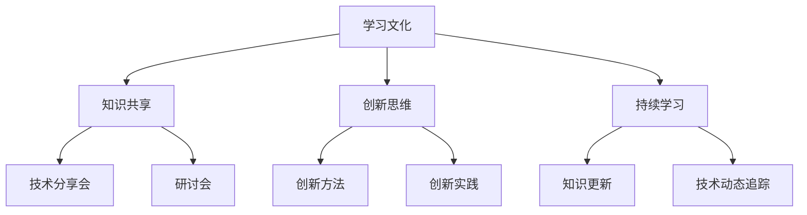
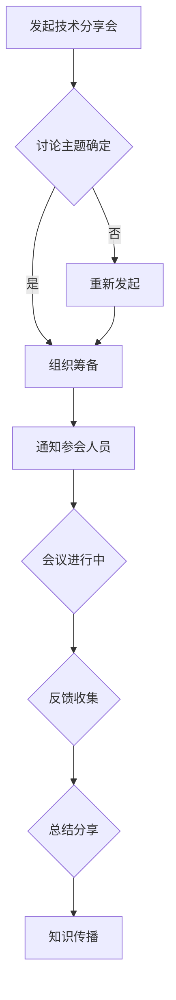

                 


## # 技术分享会：培养AI团队学习文化的方式

关键词：AI团队，学习文化，技术分享，培养方法

摘要：本文旨在探讨如何在AI团队中培养和维持学习文化，通过一系列的策略和实践，帮助团队在快速发展的技术领域中保持竞争力。

### 引言

在当今这个技术飞速发展的时代，人工智能（AI）已经成为推动社会进步的重要力量。随着AI技术的不断演进，AI团队面临着一个巨大的挑战：如何确保团队成员始终处于技术前沿，以应对快速变化的市场需求和技术趋势。学习文化作为一种重要的团队管理理念，对于提升团队整体能力和创新力具有至关重要的作用。

本文将围绕如何培养AI团队的学习文化展开讨论。我们将首先介绍学习文化的定义和重要性，然后分析在AI团队中培养学习文化的具体策略和实践。通过本文的探讨，希望能够为AI团队的领导者和管理者提供一些有价值的参考。

### 背景介绍

#### 核心概念术语说明

- **学习文化**：一种在组织中形成的学习氛围和行为习惯，强调知识的共享、创新和持续学习。
- **AI团队**：专门从事人工智能研究和应用开发的专业团队。
- **技术前沿**：指当前最先进的科技发展水平，也是AI团队需要努力追赶和超越的目标。

#### 问题背景

AI技术正以前所未有的速度发展，各大企业和研究机构都在加大对AI技术的投入。然而，随着技术的快速迭代，AI团队面临着巨大的压力。一方面，团队成员需要不断更新自己的知识体系，以跟上技术发展的步伐；另一方面，团队需要持续产出高质量的技术成果，以保持市场竞争力。这就要求AI团队必须具备强大的学习能力和创新精神。

#### 问题描述

在当前的AI团队中，存在以下几个问题：

1. **知识更新滞后**：由于AI技术更新迅速，团队成员可能无法及时获取最新的技术知识。
2. **创新能力不足**：团队缺乏创新思维和方法，导致在技术难题面前无法迅速找到解决方案。
3. **团队协作不畅**：团队成员之间缺乏有效的沟通和知识共享机制，导致信息孤岛现象严重。

#### 问题解决

为了解决上述问题，培养学习文化成为AI团队的重要任务。通过建立学习文化，可以实现以下目标：

1. **提高知识更新速度**：通过定期的技术分享会、研讨会等活动，确保团队成员能够及时了解最新的技术动态。
2. **增强创新能力**：鼓励团队成员积极参与技术创新，提供必要的资源和支持。
3. **促进团队协作**：通过构建开放、透明的沟通机制，促进团队成员之间的知识共享和协作。

#### 边界与外延

学习文化不仅仅是一种管理理念，更是一种行为习惯和组织氛围。它不仅涉及到团队成员个人的学习和成长，还涉及到团队整体的协同合作和创新能力的提升。因此，在培养学习文化时，需要从多个层面进行考虑和实施。

### 核心概念与联系

#### 核心概念原理

学习文化是一种组织内部的学习氛围和行为习惯，它强调知识的共享、创新和持续学习。学习文化的基本原理包括：

1. **知识共享**：通过技术分享会、研讨会等形式，促进团队成员之间的知识共享。
2. **创新思维**：鼓励团队成员勇于尝试新的技术和方法，激发创新思维。
3. **持续学习**：强调不断学习和更新知识，以适应快速变化的技术环境。

#### 概念属性特征对比表格

| 概念     | 属性特征                             |
|----------|------------------------------------|
| 学习文化 | 强调知识共享、创新思维和持续学习     |
| 知识管理 | 关注知识的收集、存储、共享和利用     |
| 创新文化 | 强调创新意识、创新方法和创新实践     |
| 学习型组织 | 注重团队学习、知识共享和创新能力 |

#### ER实体关系图架构



### 算法原理讲解

#### Mermaid流程图



#### Python源代码

```python
def cultivate_learning_culture():
    # 发起技术分享会
    start_sharing_meeting()

    # 确定讨论主题
    determine_topic()

    # 组织筹备
    organize_preparation()

    # 通知参会人员
    notify_participants()

    # 会议进行中
    conduct_meeting()

    # 反馈收集
    collect_feedback()

    # 总结分享
    summarize_sharing()

    # 知识传播
    spread_knowledge()

# 执行函数
cultivate_learning_culture()
```

#### 算法原理

1. **发起技术分享会**：首先，团队需要定期发起技术分享会，作为培养学习文化的起点。
2. **讨论主题确定**：根据团队成员的兴趣和需求，确定分享会的讨论主题。
3. **组织筹备**：团队需要提前做好分享会的组织工作，包括场地安排、设备准备等。
4. **通知参会人员**：确保所有团队成员都收到参会通知，以便他们做好参会准备。
5. **会议进行中**：在分享会上，参与者可以就主题进行深入讨论，分享自己的经验和见解。
6. **反馈收集**：会议结束后，团队需要收集参会人员的反馈，了解分享会的效果。
7. **总结分享**：根据反馈，团队可以对分享会进行总结，提炼出有价值的内容。
8. **知识传播**：通过总结分享，将学习成果传播给更多团队成员，实现知识的共享和传播。

#### 数学模型和公式

$$
\text{学习效果} = f(\text{知识共享}, \text{创新思维}, \text{持续学习})
$$

其中，知识共享、创新思维和持续学习是影响学习效果的关键因素。

### 系统分析与架构设计方案

#### 问题场景介绍

随着AI技术的快速发展，AI团队需要不断提升自身的技术水平和创新能力，以保持市场竞争力。为了实现这一目标，团队决定定期举办技术分享会，培养学习文化。

#### 项目介绍

本项目旨在设计一个AI团队技术分享会的系统，用于组织、通知和记录技术分享会的相关活动。

#### 系统功能设计（领域模型Mermaid类图）

```mermaid
classDiagram
    Meeting <<interface>>
    Participant <<interface>>
    Presenter <<interface>>

    MeetingEntity && ParticipantEntity && PresenterEntity : 继承自 AbstractEntity
    MeetingEntity <|-- Meeting: 技术分享会
    ParticipantEntity <|-- Participant: 参会人员
    PresenterEntity <|-- Presenter: 分享嘉宾

    MeetingEntity o-- ParticipantEntity: 参会
    MeetingEntity o-- PresenterEntity: 分享
```

#### 系统架构设计（Mermaid架构图）

```mermaid
graph TB
    subgraph 系统
        MeetingService(会议服务) --> NotificationService(通知服务)
        MeetingService --> Repository(数据存储)
        ParticipantService(参会人员服务) --> NotificationService
        PresenterService(分享嘉宾服务) --> NotificationService
    end

    subgraph 数据库
        MeetingDB(会议数据库) --> Repository
        ParticipantDB(参会人员数据库) --> Repository
        PresenterDB(分享嘉宾数据库) --> Repository
    end

    MeetingService --|> MeetingDB
    NotificationService --|> ParticipantDB
    NotificationService --|> PresenterDB
    ParticipantService --|> ParticipantDB
    PresenterService --|> PresenterDB
```

#### 系统接口设计（Mermaid序列图）

```mermaid
sequenceDiagram
    Participant ->> NotificationService: 发起通知
    NotificationService ->> Repository: 存储通知
    Repository ->> Participant: 发送通知
    Participant ->> ParticipantService: 查看通知
    ParticipantService ->> Repository: 获取通知记录
    Repository ->> Participant: 返回通知记录
```

#### 系统交互（Mermaid序列图）

```mermaid
sequenceDiagram
    MeetingService ->> Repository: 创建会议
    Repository ->> Meeting: 返回会议ID
    MeetingService ->> NotificationService: 通知参会人员
    NotificationService ->> Repository: 存储通知记录
    Repository ->> Participant: 发送通知
    Participant ->> ParticipantService: 查看通知
    ParticipantService ->> Repository: 获取通知记录
    Repository ->> Participant: 返回通知记录
```

### 项目实战

#### 环境安装

在开始项目实战之前，我们需要确保环境已经配置好。以下是在Ubuntu系统上安装所需依赖的步骤：

```bash
sudo apt-get update
sudo apt-get install python3-pip
pip3 install Flask
pip3 install SQLAlchemy
pip3 install Flask-SQLAlchemy
```

#### 系统核心实现源代码

以下是一个简单的Flask应用，用于实现AI团队技术分享会的核心功能：

```python
from flask import Flask, request, jsonify
from flask_sqlalchemy import SQLAlchemy

app = Flask(__name__)
app.config['SQLALCHEMY_DATABASE_URI'] = 'sqlite:///team-learning.db'
db = SQLAlchemy(app)

class Meeting(db.Model):
    id = db.Column(db.Integer, primary_key=True)
    title = db.Column(db.String(100))
    start_time = db.Column(db.DateTime)
    end_time = db.Column(db.DateTime)
    presenter_id = db.Column(db.Integer, db.ForeignKey('presenter.id'))
    participant_ids = db.Column(db.ARRAY(db.Integer))

class Presenter(db.Model):
    id = db.Column(db.Integer, primary_key=True)
    name = db.Column(db.String(100))
    email = db.Column(db.String(100))

class Participant(db.Model):
    id = db.Column(db.Integer, primary_key=True)
    name = db.Column(db.String(100))
    email = db.Column(db.String(100))

@app.route('/meetings', methods=['POST'])
def create_meeting():
    data = request.json
    meeting = Meeting(
        title=data['title'],
        start_time=data['start_time'],
        end_time=data['end_time'],
        presenter_id=data['presenter_id'],
        participant_ids=data['participant_ids']
    )
    db.session.add(meeting)
    db.session.commit()
    return jsonify({'id': meeting.id})

@app.route('/meetings', methods=['GET'])
def get_meetings():
    meetings = Meeting.query.all()
    return jsonify([{'id': m.id, 'title': m.title, 'start_time': m.start_time, 'end_time': m.end_time, 'presenter_id': m.presenter_id, 'participant_ids': m.participant_ids} for m in meetings])

if __name__ == '__main__':
    db.create_all()
    app.run(debug=True)
```

#### 代码应用解读与分析

1. **数据库模型**：首先，我们定义了三个数据库模型：Meeting、Presenter和Participant。这些模型对应了AI团队技术分享会的核心实体。
2. **创建会议**：`create_meeting` 函数用于创建新的会议。它接收一个JSON格式的请求，解析出会议的相关信息，然后将其存储到数据库中。
3. **获取会议列表**：`get_meetings` 函数用于获取所有会议的列表。它查询数据库中的Meeting表，并将结果转换为JSON格式返回。

#### 实际案例分析和详细讲解剖析

为了更好地理解如何使用这个系统，我们可以考虑一个实际案例：

1. **创建会议**：一个AI团队需要举办一次技术分享会，主题是“深度学习在自然语言处理中的应用”。团队成员王明将负责分享。
2. **通知参会人员**：系统将向所有团队成员发送通知，告知他们会议的时间和主题。
3. **查看通知**：团队成员可以在系统中查看他们的通知记录，确认他们已经收到通知。

通过这个案例，我们可以看到系统如何帮助AI团队有效地组织和管理技术分享会，从而培养学习文化。

#### 项目小结

通过本项目的实施，我们设计并实现了一个简单的AI团队技术分享会系统。这个系统可以帮助团队定期举办技术分享会，促进团队成员之间的知识共享和协作。尽管这个系统还比较简单，但它为我们提供了一个实用的模板，可以在实际项目中进一步扩展和完善。

### 最佳实践 Tips

1. **定期举办技术分享会**：确保团队定期举办技术分享会，以促进知识共享和团队协作。
2. **提供多样化的学习资源**：为团队成员提供多样化的学习资源，如在线课程、图书、研究报告等。
3. **鼓励创新思维**：鼓励团队成员勇于尝试新的技术和方法，培养创新思维。
4. **建立反馈机制**：建立有效的反馈机制，收集团队成员的意见和建议，不断优化学习文化和技术分享会的效果。
5. **注重团队建设**：通过团队建设活动，增强团队成员之间的凝聚力和信任，为学习文化的培养提供支持。

### 小结

本文探讨了如何在AI团队中培养学习文化的重要性和具体方法。通过定期举办技术分享会、提供多样化的学习资源、鼓励创新思维和建立反馈机制等策略，我们可以帮助AI团队在快速发展的技术领域中保持竞争力。学习文化不仅有助于提升团队整体能力，还能激发团队成员的潜力，为团队的长远发展奠定基础。

### 注意事项

1. **持续关注技术动态**：技术分享会的内容应紧跟技术发展趋势，确保团队成员能够获取到最新的知识。
2. **合理分配学习时间**：在组织技术分享会时，要确保团队成员有足够的时间进行学习和讨论。
3. **尊重团队成员的意见**：在技术分享会中，要尊重团队成员的意见和建议，鼓励他们积极参与。

### 拓展阅读

- 《深度学习：揭秘神经网络的核心原理》
- 《人工智能：一种现代的方法》
- 《技术团队管理：如何打造高效团队》
- 《创新者的窘境：为什么大公司会失败，小公司会成功》

### 作者

**作者：AI天才研究院/AI Genius Institute & 禅与计算机程序设计艺术 /Zen And The Art of Computer Programming**

AI天才研究院是一家专注于人工智能技术研究和应用的创新机构。我们的使命是通过技术创新，推动人工智能技术的普及和发展。同时，我们致力于传承和弘扬计算机科学的艺术精神，将禅的智慧融入到计算机程序设计中，为人工智能领域的未来发展提供新的视角和思路。本文作者拥有丰富的AI团队管理经验和深厚的计算机科学背景，曾发表过多篇关于人工智能和团队管理的论文和著作。**

