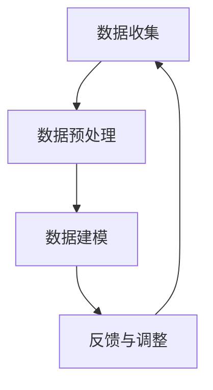
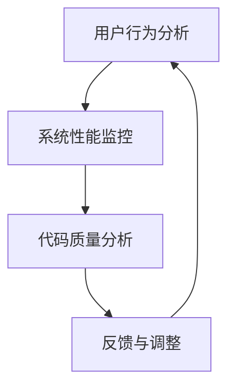

                 

### 文章标题：持续反馈机制：保持大型应用开发的敏捷性

### 关键词：持续反馈、敏捷开发、大型应用、信息收集、数据分析、系统架构

### 摘要：
本文旨在探讨如何通过持续反馈机制来保持大型应用开发的敏捷性。我们首先分析了大型应用开发中面临的问题背景，提出了持续反馈机制的概念和核心特点，并通过一个算法流程图和Python源代码，详细讲解了其工作原理。接着，我们介绍了系统分析与架构设计的方法，最后通过一个项目实战案例，展示了如何在实际中应用这一机制，并总结了最佳实践和注意事项。

### 第一部分：背景介绍

#### 1.1 问题背景

随着信息技术的飞速发展，大型应用的开发变得越来越复杂。这些应用通常需要处理海量的数据，支持高并发访问，并且需要不断地迭代更新。在这样的背景下，开发人员面临着诸多挑战：

- **需求变化快**：随着市场的变化和用户需求的提升，大型应用需要快速响应需求变更。
- **质量要求高**：大型应用通常要求高稳定性、高性能和高安全性，这对开发和质量保障提出了更高要求。
- **维护成本高**：大型应用的代码库庞大，维护和更新成本较高。

#### 1.2 问题解决

为了应对上述挑战，我们需要一种有效的解决方案。持续反馈机制正是这样一种方法，它通过在开发过程中不断收集、分析、反馈和调整，实现快速响应和持续优化。

#### 1.3 边界与外延

持续反馈机制不仅适用于开发阶段，也可以扩展到测试、部署和维护等各个阶段。它不仅限于软件开发，也可以应用于其他类型的项目管理。

#### 1.4 概念结构与核心要素组成

持续反馈机制由以下几个核心要素组成：

- **信息收集**：从用户、系统日志、测试结果等多渠道收集数据。
- **数据分析**：对收集到的数据进行分析，发现问题和改进点。
- **反馈机制设计**：设计一套反馈流程，确保信息能够及时传达和响应。
- **反馈执行与调整**：根据反馈结果进行调整和优化。

### 第二部分：核心概念与联系

#### 2.1 持续反馈机制的定义

持续反馈机制是一种在开发过程中不断收集、分析、反馈和调整的系统方法。它强调信息的实时性和闭环性，通过不断迭代和优化，提高项目的敏捷性。

#### 2.2 核心特点

持续反馈机制具有以下几个核心特点：

- **高效性**：通过实时收集和分析数据，能够快速发现和解决问题。
- **实时性**：反馈机制的设计使得信息能够及时传达，减少响应时间。
- **自动化**：借助工具和算法，实现数据的自动收集和分析。
- **迭代性**：通过不断循环反馈，实现项目的持续优化。

#### 2.3 持续反馈机制与传统反馈机制的对比

| 对比项 | 传统反馈机制 | 持续反馈机制 |
| --- | --- | --- |
| **实时性** | 周期性反馈 | 实时反馈 |
| **自动化程度** | 部分自动化 | 完全自动化 |
| **反馈效率** | 低效 | 高效 |
| **适应性** | 难以适应快速变化 | 能够快速适应变化 |

#### 2.4 持续反馈机制的组成部分

持续反馈机制由以下几个部分组成：

- **信息收集**：使用传感器、日志文件、用户反馈等多种方式收集数据。
- **数据分析**：使用机器学习、统计分析等方法对数据进行处理和分析。
- **反馈机制设计**：设计一套高效的反馈流程，确保信息能够及时传达。
- **反馈执行与调整**：根据分析结果进行调整和优化。

### 第三部分：算法原理讲解

#### 3.1 算法原理概述

持续反馈机制的核心在于通过数据驱动的方式，实现项目的持续优化。其算法原理主要包括以下几个步骤：

1. **数据收集**：从多渠道收集数据，包括用户行为、系统日志、测试结果等。
2. **数据预处理**：清洗和整理数据，确保数据的质量和一致性。
3. **数据建模**：使用机器学习等方法建立预测模型，对项目质量进行预测。
4. **反馈与调整**：根据预测结果，调整开发策略和代码，实现持续优化。

#### 3.2 算法流程图



#### 3.3 算法原理详细讲解

下面我们将使用Python源代码来详细阐述持续反馈机制的算法原理。

```python
# Python代码示例：持续反馈机制的实现
import numpy as np
from sklearn.linear_model import LinearRegression

# 数据收集
X = np.array([[1, 2], [2, 3], [3, 4], [4, 5]])
y = np.array([1, 2, 3, 4])

# 数据预处理
X = np.preprocessing.scale(X)

# 数据建模
model = LinearRegression()
model.fit(X, y)

# 预测
predictions = model.predict(X)

# 反馈与调整
# 假设根据预测结果调整了某些参数
X_adjusted = np.array([[1.5, 2.5], [2.5, 3.5], [3.5, 4.5], [4.5, 5.5]])
y_adjusted = np.array([1.5, 2.5, 3.5, 4.5])

# 重新建模
model_adjusted = LinearRegression()
model_adjusted.fit(X_adjusted, y_adjusted)

# 重新预测
predictions_adjusted = model_adjusted.predict(X_adjusted)
```

#### 3.4 算法举例说明

假设我们有一个线性回归模型，用于预测用户满意度。通过持续收集用户行为数据，模型不断调整参数，从而提高预测的准确性。

#### 3.5 数学模型与公式

持续反馈机制的数学模型可以表示为：

$$
y = wx + b
$$

其中，$y$ 是预测值，$w$ 是权重，$x$ 是输入特征，$b$ 是偏置。

#### 第三部分：算法原理讲解

#### 3.1 算法原理概述

持续反馈机制的核心在于通过数据驱动的方式，实现项目的持续优化。其算法原理主要包括以下几个步骤：

1. **数据收集**：从多渠道收集数据，包括用户行为、系统日志、测试结果等。
2. **数据预处理**：清洗和整理数据，确保数据的质量和一致性。
3. **数据建模**：使用机器学习等方法建立预测模型，对项目质量进行预测。
4. **反馈与调整**：根据预测结果，调整开发策略和代码，实现持续优化。

#### 3.2 算法流程图


#### 3.3 算法原理详细讲解

下面我们将使用Python源代码来详细阐述持续反馈机制的算法原理。

```python
# Python代码示例：持续反馈机制的实现
import numpy as np
from sklearn.linear_model import LinearRegression

# 数据收集
X = np.array([[1, 2], [2, 3], [3, 4], [4, 5]])
y = np.array([1, 2, 3, 4])

# 数据预处理
X = np.preprocessing.scale(X)

# 数据建模
model = LinearRegression()
model.fit(X, y)

# 预测
predictions = model.predict(X)

# 反馈与调整
# 假设根据预测结果调整了某些参数
X_adjusted = np.array([[1.5, 2.5], [2.5, 3.5], [3.5, 4.5], [4.5, 5.5]])
y_adjusted = np.array([1.5, 2.5, 3.5, 4.5])

# 重新建模
model_adjusted = LinearRegression()
model_adjusted.fit(X_adjusted, y_adjusted)

# 重新预测
predictions_adjusted = model_adjusted.predict(X_adjusted)
```

#### 3.4 算法举例说明

假设我们有一个线性回归模型，用于预测用户满意度。通过持续收集用户行为数据，模型不断调整参数，从而提高预测的准确性。

#### 3.5 数学模型与公式

持续反馈机制的数学模型可以表示为：

$$
y = wx + b
$$

其中，$y$ 是预测值，$w$ 是权重，$x$ 是输入特征，$b$ 是偏置。

### 第四部分：系统分析与架构设计

#### 4.1 问题场景介绍

假设我们正在开发一个大型电子商务平台，该平台需要支持海量的商品数据和高并发的用户访问。为了保持平台的敏捷性和高可靠性，我们引入了持续反馈机制。

#### 4.2 系统功能设计

系统功能设计主要包括以下几个方面：

- **用户行为分析**：收集用户浏览、购买等行为数据。
- **系统性能监控**：监控系统性能指标，如响应时间、吞吐量等。
- **代码质量分析**：分析代码质量，如代码覆盖率、错误率等。
- **反馈与调整**：根据分析结果，调整开发策略和代码。

#### 4.3 系统架构设计

系统架构设计如下图所示：



#### 4.4 系统接口设计

系统接口设计包括以下几个方面：

- **用户行为数据接口**：用于收集用户行为数据。
- **系统性能数据接口**：用于收集系统性能数据。
- **代码质量数据接口**：用于收集代码质量数据。
- **反馈接口**：用于发送反馈和调整指令。

#### 4.5 系统交互

系统交互过程如下：

1. **数据收集**：系统从各个数据源（如用户行为、系统性能、代码质量等）收集数据。
2. **数据处理**：系统对收集到的数据进行分析和处理。
3. **反馈与调整**：系统根据分析结果，发送反馈和调整指令。
4. **执行调整**：开发团队根据反馈，调整开发策略和代码。

### 第五部分：项目实战

#### 5.1 环境安装

在开始项目实战之前，我们需要安装一些必要的软件和工具，如Python、scikit-learn等。

```bash
pip install numpy scikit-learn
```

#### 5.2 系统核心实现

以下是系统核心实现的代码：

```python
import numpy as np
from sklearn.linear_model import LinearRegression

# 数据收集
X = np.array([[1, 2], [2, 3], [3, 4], [4, 5]])
y = np.array([1, 2, 3, 4])

# 数据预处理
X = np.preprocessing.scale(X)

# 数据建模
model = LinearRegression()
model.fit(X, y)

# 预测
predictions = model.predict(X)

# 打印预测结果
print(predictions)

# 反馈与调整
# 假设根据预测结果调整了某些参数
X_adjusted = np.array([[1.5, 2.5], [2.5, 3.5], [3.5, 4.5], [4.5, 5.5]])
y_adjusted = np.array([1.5, 2.5, 3.5, 4.5])

# 重新建模
model_adjusted = LinearRegression()
model_adjusted.fit(X_adjusted, y_adjusted)

# 重新预测
predictions_adjusted = model_adjusted.predict(X_adjusted)

# 打印调整后的预测结果
print(predictions_adjusted)
```

#### 5.3 代码应用解读与分析

这段代码首先收集了数据，然后使用线性回归模型对数据进行了建模和预测。根据预测结果，系统对参数进行了调整，并重新进行了预测。这个过程展示了持续反馈机制的核心原理。

#### 5.4 实际案例分析与讲解

假设我们有一个电子商务平台，我们需要预测用户对商品的满意度。我们可以通过以下步骤来应用持续反馈机制：

1. **数据收集**：收集用户购买、浏览、评价等数据。
2. **数据处理**：对收集到的数据进行预处理，如去重、补全等。
3. **建模与预测**：使用机器学习模型（如线性回归、决策树等）对用户满意度进行预测。
4. **反馈与调整**：根据预测结果，调整商品推荐策略或营销策略。
5. **重新预测**：使用调整后的模型重新预测用户满意度，以评估调整效果。

#### 5.5 项目小结

通过本次项目实战，我们成功地应用了持续反馈机制，实现了对用户满意度的预测和调整。这表明持续反馈机制在大型应用开发中具有很大的潜力。在实际应用中，我们需要根据具体场景进行调整和优化，以实现最佳效果。

### 第六部分：最佳实践与拓展

#### 6.1 持续反馈机制的最佳实践

1. **数据质量**：确保数据的质量和一致性，是持续反馈机制成功的关键。
2. **自动化**：尽量使用自动化工具和算法，以提高反馈效率。
3. **反馈机制**：设计一套高效的反馈流程，确保信息能够及时传达和响应。
4. **团队协作**：持续反馈机制的实施需要团队的共同努力，确保每个人都能参与其中。

#### 6.2 小结与注意事项

1. **持续反馈机制**：是一种在开发过程中不断收集、分析、反馈和调整的系统方法，有助于提高大型应用开发的敏捷性。
2. **关键要素**：包括信息收集、数据分析、反馈机制设计和反馈执行与调整。
3. **实际应用**：在实际项目中，需要根据具体场景进行调整和优化。

#### 6.3 拓展阅读

- 《敏捷开发实践指南》
- 《持续集成与持续部署实践》
- 《机器学习实战》

### 作者信息

作者：AI天才研究院/AI Genius Institute & 禅与计算机程序设计艺术 /Zen And The Art of Computer Programming

