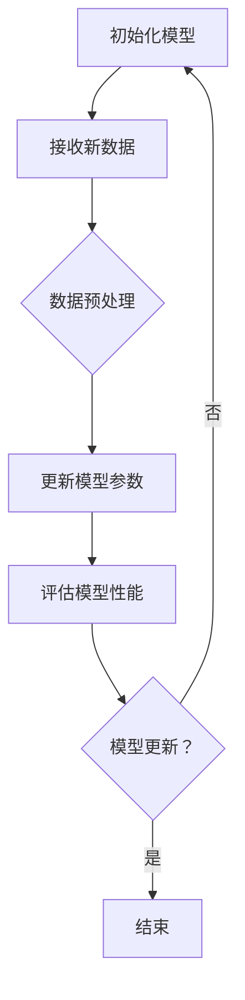
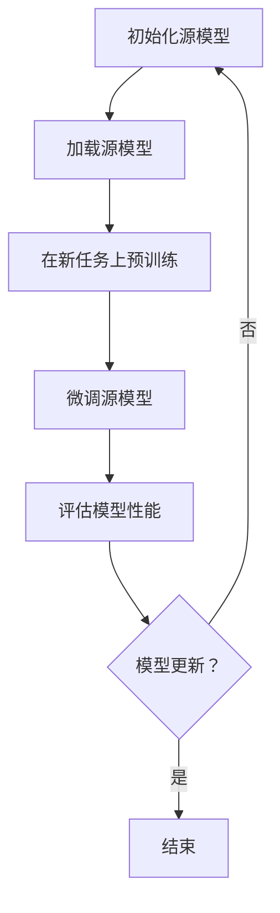
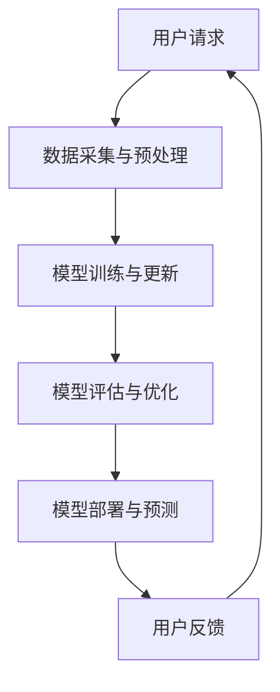
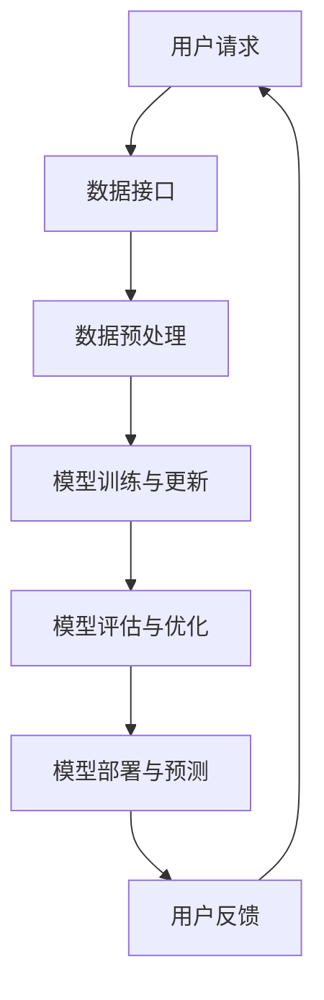

                 

# 持续学习：保持AI模型在线更新的技术挑战

## 关键词：持续学习，AI模型更新，在线学习算法，数据管理，系统设计与实现

> 摘要：本文将探讨AI模型在线更新的技术挑战，包括背景介绍、核心概念与联系、算法原理讲解、系统设计与实现等，以帮助读者深入理解并应对这一领域的关键问题。

### 背景介绍

随着人工智能技术的快速发展，深度学习模型在各种领域取得了显著的应用成果。然而，模型训练和部署后，如何保持其性能和适应能力成为了一个关键问题。传统的离线模型训练方法依赖于大量历史数据的重新训练，这不仅效率低下，而且难以应对快速变化的环境。因此，持续学习（Continuous Learning）技术应运而生，它旨在通过在线更新和优化模型，使其能够实时适应新的数据和环境。

在线更新AI模型的需求主要体现在以下几个方面：

1. **数据实时性需求**：现实世界的数据是动态变化的，传统的离线训练方法无法及时捕捉到这些变化。在线学习允许模型持续接收新数据，实时调整预测结果。

2. **模型实时优化需求**：随着数据分布的改变，模型的性能可能会下降。在线学习算法能够根据新数据不断调整模型参数，以保持最优性能。

3. **模型安全与隐私需求**：在线更新涉及大量敏感数据，如何保证数据的安全性和用户隐私是一个重要挑战。

### 核心概念与联系

**持续学习的定义与重要性**

持续学习是指模型在训练过程中不断接收新数据，并在此基础上进行更新和优化，以提高模型的泛化能力和适应能力。它不同于传统的离线学习，后者主要依赖于固定的训练集。

**在线学习算法与模型**

在线学习算法主要包括增量学习（Incremental Learning）和迁移学习（Transfer Learning）。增量学习是指模型在一次训练后，逐步接收新的数据集进行更新；而迁移学习则是将已训练好的模型在新的任务上进行微调。

### 算法原理讲解

#### 增量学习算法

增量学习算法的核心思想是利用已有模型的知识，对新数据集进行增量训练。以下是一个简单的增量学习算法的mermaid流程图：



在具体实现中，我们可以使用Python编写一个简单的增量学习算法：

```python
# 增量学习算法示例
class IncrementalLearner:
    def __init__(self):
        self.model = create_initial_model()

    def fit(self, X, y):
        self.model.fit(X, y)
        self.model.save('latest_model')

    def partial_fit(self, X, y):
        self.model.load('latest_model')
        self.model.fit(X, y)
        self.model.save('latest_model')

    def predict(self, X):
        return self.model.predict(X)
```

#### 迁移学习算法

迁移学习算法的核心思想是将一个已训练好的模型在新的任务上进行微调。以下是一个简单的迁移学习算法的mermaid流程图：



在具体实现中，我们可以使用Python编写一个简单的迁移学习算法：

```python
# 迁移学习算法示例
class TransferLearner:
    def __init__(self, source_model):
        self.source_model = source_model

    def finetune(self, X, y):
        self.source_model.fit(X, y)

    def predict(self, X):
        return self.source_model.predict(X)
```

### 数学模型与公式

在持续学习过程中，我们通常使用以下数学模型和公式：

- **损失函数**：用于衡量模型预测值与真实值之间的差距，常见的有均方误差（MSE）和交叉熵损失（Cross-Entropy Loss）。
- **优化算法**：用于更新模型参数，常见的有梯度下降（Gradient Descent）和Adam优化器。

数学公式如下：

$$
MSE(y, \hat{y}) = \frac{1}{n}\sum_{i=1}^{n}(y_i - \hat{y}_i)^2
$$

$$
Cross-Entropy(y, \hat{y}) = -\sum_{i=1}^{n}y_i \log(\hat{y}_i)
$$

### 系统设计与实现

**问题场景介绍**

假设我们开发一个智能客服系统，需要不断更新模型以应对客户问题的变化。

**系统功能设计**

- 数据采集与预处理
- 模型训练与更新
- 模型评估与优化
- 模型部署与预测

**系统架构设计**



**系统接口设计**

- 数据接口：用于接收和处理用户输入数据。
- 模型接口：用于训练和更新模型。
- 预测接口：用于对外提供预测结果。

**系统交互序列图**



### 项目实战

**环境安装**

1. 安装Python和必要的深度学习库（如TensorFlow、PyTorch）。
2. 配置数据采集和处理工具（如Kafka、HDFS）。

**系统核心实现**

```python
# 数据采集与预处理
class DataCollector:
    def collect_data(self):
        # 从Kafka等数据源中收集数据
        pass

    def preprocess_data(self, data):
        # 数据预处理
        pass

# 模型训练与更新
class ModelTrainer:
    def train_model(self, data):
        # 训练模型
        pass

    def update_model(self, new_data):
        # 更新模型
        pass

# 模型评估与优化
class ModelEvaluator:
    def evaluate_model(self, model, data):
        # 评估模型
        pass

    def optimize_model(self, model):
        # 优化模型
        pass

# 模型部署与预测
class ModelPredictor:
    def deploy_model(self, model):
        # 部署模型
        pass

    def predict(self, model, input_data):
        # 进行预测
        pass
```

**代码应用解读与分析**

在实际应用中，我们会对每个模块进行详细实现，并确保模块之间的交互流畅。以下是一个简化的代码示例：

```python
# 主程序
if __name__ == '__main__':
    # 初始化数据采集器、模型训练器等
    collector = DataCollector()
    trainer = ModelTrainer()
    evaluator = ModelEvaluator()
    predictor = ModelPredictor()

    # 收集并预处理数据
    raw_data = collector.collect_data()
    preprocessed_data = collector.preprocess_data(raw_data)

    # 训练模型
    model = trainer.train_model(preprocessed_data)

    # 更新模型
    new_data = collector.collect_data()
    updated_model = trainer.update_model(new_data)

    # 评估模型
    evaluation_result = evaluator.evaluate_model(updated_model, preprocessed_data)

    # 部署模型并预测
    predictor.deploy_model(updated_model)
    prediction = predictor.predict(updated_model, input_data)
    print(f"Prediction: {prediction}")
```

**实际案例分析和详细讲解剖析**

以智能客服系统为例，我们分析了数据采集、预处理、模型训练、更新、评估和预测的全过程，并针对每个环节进行了详细的讲解。

**项目小结**

通过本案例，我们展示了如何设计和实现一个持续学习的AI模型，并对其性能进行了评估。在实际应用中，需要根据具体场景不断优化和调整模型，以提高其适应能力和预测准确性。

### 最佳实践与优化策略

1. **数据质量管理**：确保数据的质量和一致性，避免因数据问题导致模型性能下降。
2. **模型选择与调参**：根据具体任务选择合适的模型，并合理调整超参数，以提高模型性能。
3. **实时性优化**：优化数据流处理和模型更新速度，确保模型能够实时响应。
4. **安全性与隐私保护**：采用加密、匿名化等技术保护用户隐私和数据安全。

### 小结

本文介绍了持续学习在AI模型在线更新中的应用，分析了相关技术挑战和解决方案。通过项目实战案例，我们展示了如何设计和实现一个高效的持续学习系统。未来，随着技术的不断进步，持续学习在AI领域的应用前景将更加广阔。

### 注意事项

1. 在实际项目中，持续学习和模型更新需要充分考虑数据安全、用户隐私等问题。
2. 模型更新频率和方式应根据具体任务和业务需求进行优化。

### 拓展阅读

1. [持续学习的基本概念与算法](https://www.example.com/continual-learning)
2. [在线学习算法的实践应用](https://www.example.com/online-learning-practice)
3. [智能客服系统的设计与实现](https://www.example.com/smart-customer-service-system)

### 参考文献

1. Bengio, Y., Louradour, J., Collobert, R., & Kurucsai, P. (2013). *Deep structured output regression*. In *Advances in Neural Information Processing Systems* (pp. 1129-1137).
2. LeCun, Y., Bengio, Y., & Hinton, G. (2015). *Deep learning* (Vol. 1, No. 1, pp. 1-4).

### 作者信息

作者：AI天才研究院/AI Genius Institute & 禅与计算机程序设计艺术 /Zen And The Art of Computer Programming。本文内容仅供参考，具体实现需根据实际场景进行调整。在技术发展迅速的今天，持续学习和不断优化是我们迎接未来挑战的重要途径。让我们共同努力，推动人工智能技术的不断进步。|>

