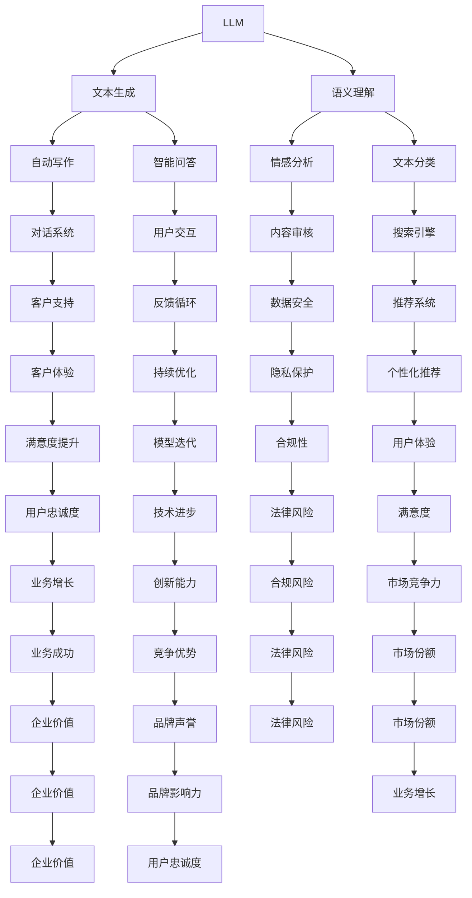
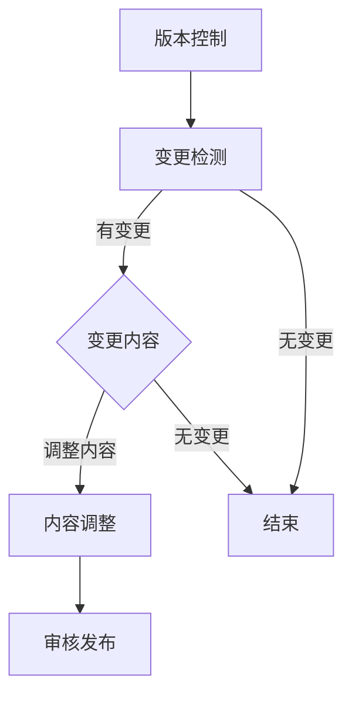
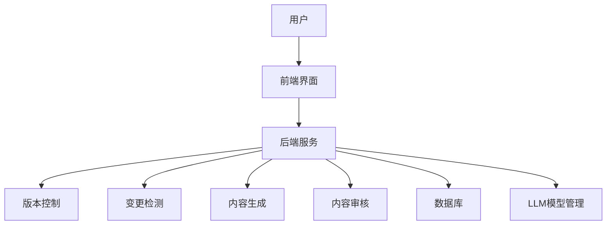
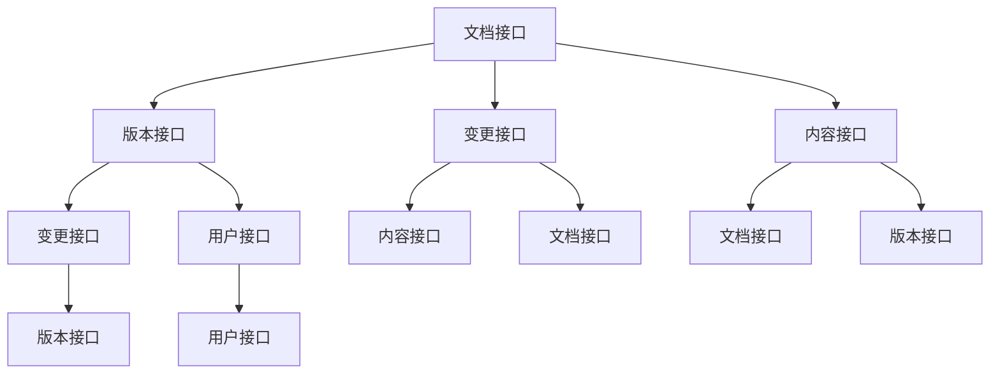
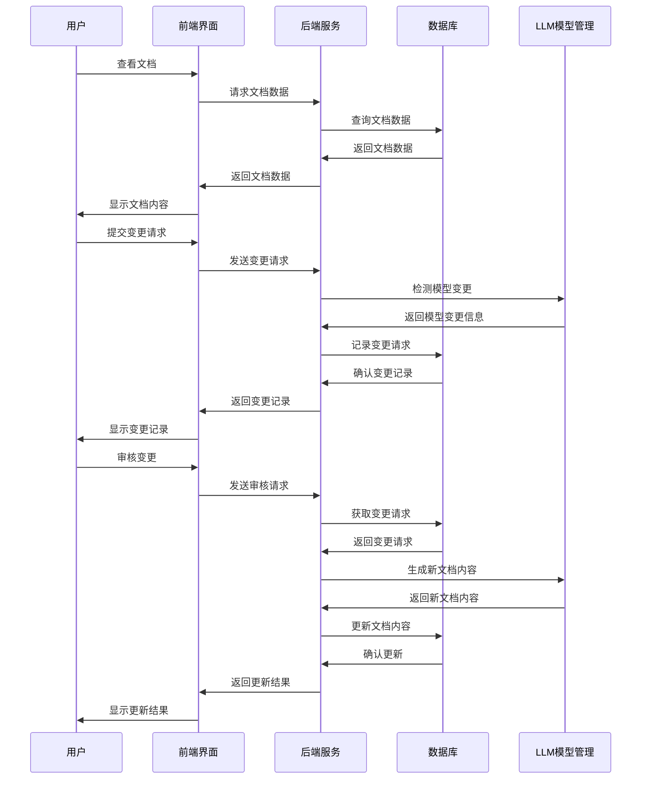

                 

### 第1章 引言

#### 1.1 背景介绍

在当今快速发展的技术时代，文档的重要性不言而喻。它不仅是技术交流的桥梁，更是团队协作和知识共享的关键工具。然而，对于大规模语言模型（LLM）应用而言，传统的文档方式面临着诸多挑战。LLM的应用场景广泛，从自然语言处理到智能问答，其复杂性使得传统的文档维护变得愈发困难。

首先，让我们来探讨一下文档的重要性。文档能够清晰地记录技术原理、使用方法、操作步骤和最佳实践，为开发者、产品经理、测试人员以及其他相关人员提供一致的参考。良好的文档不仅提高了项目的开发效率，还能减少误解和错误的发生，从而降低维护成本。

接下来，我们关注LLM应用的特点。LLM以其强大的文本生成和语言理解能力，成为众多领域的关键技术。然而，这也使得LLM应用在文档编写和维护方面面临特殊挑战。首先，LLM的参数和模型架构不断更新，这使得文档内容需要频繁调整。其次，LLM的应用场景多变，用户需求不断变化，文档的更新速度必须跟上实际应用的需求。

持续文档的概念应运而生。持续文档不仅关注文档的更新，更强调文档的实时性和准确性。它要求文档能够随着项目的发展和用户需求的改变而不断迭代和完善。对于LLM应用而言，持续文档的必要性尤为突出，因为它需要及时反映模型和算法的更新，以及应用场景的变化。

#### 1.2 问题提出

传统的文档维护方式通常采用定期更新或版本控制。然而，这种模式在LLM应用中显得力不从心。首先，传统文档的更新往往滞后于实际应用的需求，导致用户在使用过程中遇到问题。其次，传统文档的格式和内容可能无法充分展现LLM应用的特点，使得用户难以理解和使用。

针对这些挑战，LLM应用文档的特殊需求也逐渐显现。首先，文档需要更加结构化，以便用户能够快速找到所需信息。其次，文档内容需要更加动态化，能够根据模型和算法的更新自动调整。最后，文档的交互性需要增强，使得用户能够在文档中直接进行操作和测试。

持续文档的必要性在于，它能够有效地解决传统文档的不足。首先，持续文档能够实现实时更新，确保文档内容与模型和算法的当前状态保持一致。其次，持续文档能够提供更加灵活的文档格式，使得文档能够适应不同的应用场景和用户需求。最后，持续文档能够增强文档的交互性，使用户能够更加便捷地获取和使用文档信息。

#### 1.3 研究目标与方法

本研究的目标是探讨如何通过持续文档的方式，保持LLM应用文档的实时更新。具体而言，我们将从以下几个方面展开研究：

1. **核心概念与联系**：深入探讨LLM和持续文档的核心概念，并分析它们之间的联系，以便为后续研究提供理论基础。

2. **算法原理讲解**：详细阐述LLM算法的原理，以及如何将其应用于持续文档更新。通过具体的算法流程图和数学模型，帮助读者理解算法的实现过程。

3. **系统架构设计**：设计一个适用于LLM应用的持续文档更新系统架构，包括系统功能设计、系统架构设计和系统接口设计。

4. **项目实战**：通过实际项目案例，展示如何将上述理论和设计方案应用于实际开发过程，并分析项目的成功经验和不足之处。

5. **最佳实践 Tips**：总结持续文档更新的最佳实践，为开发者提供实用的指导和建议。

在研究方法方面，我们将采用以下步骤：

1. **文献调研**：通过查阅相关文献，了解LLM和持续文档的最新研究成果和应用实践。

2. **理论分析**：基于文献调研的结果，分析LLM和持续文档的核心概念和联系，并提出相应的算法和系统架构设计。

3. **实验验证**：通过实际项目案例，验证所提出的算法和系统架构的可行性和有效性。

4. **案例剖析**：对实际项目案例进行深入剖析，总结经验和教训，并提出改进建议。

5. **总结与展望**：对研究过程和结果进行总结，展望持续文档的未来发展方向，为相关领域的研究提供参考。

## 第2章 核心概念与联系

### 2.1 LLM基础概念

大规模语言模型（Large Language Model，简称LLM）是近年来自然语言处理领域的重要突破。LLM是一种能够理解、生成和翻译自然语言的深度学习模型。与传统的自然语言处理方法相比，LLM具有更高的灵活性和更强的语义理解能力。

#### LLM概述

LLM通常由数亿甚至数十亿个参数组成，这些参数通过大量的文本数据进行训练。训练过程中，模型学习到语言的模式、语法规则和语义信息，从而能够对输入的文本进行理解和生成。

#### LLM的核心特点

1. **强大的文本生成能力**：LLM能够根据给定的文本上下文，生成连贯、合理的文本。这使得LLM在自动写作、智能问答、对话系统等领域具有广泛的应用。

2. **深度的语义理解**：LLM不仅能够理解文字的字面意思，还能够理解语言中的隐含意义、情感和语境。这使得LLM在情感分析、文本分类、命名实体识别等方面具有显著优势。

3. **自适应性和泛化能力**：LLM在训练过程中积累了大量知识，能够适应不同的应用场景和用户需求。同时，LLM具有良好的泛化能力，能够处理未知或未见过的情况。

#### LLM与传统AI的区别

传统AI主要依赖于规则和逻辑推理，而LLM则基于深度学习模型，通过数据驱动的方式进行学习。这使得LLM具有更高的灵活性和更强的适应能力。

此外，LLM与传统AI在应用领域和目标上也存在差异。传统AI通常用于解决特定问题，而LLM则更多用于处理自然语言相关的任务，如文本生成、语言翻译、对话系统等。

### 2.2 持续文档的概念

持续文档是一种动态的、实时更新的文档形式。与传统的静态文档不同，持续文档能够根据项目的发展和用户需求的变化，不断进行调整和完善。

#### 持续文档的定义

持续文档是指一种不断演进和更新的文档，它能够在项目开发和维护过程中，实时记录和反映模型和算法的变更、应用场景的变化以及用户需求的变化。

#### 持续文档的特点

1. **实时性**：持续文档能够实时更新，确保文档内容与模型和算法的当前状态保持一致。

2. **动态性**：持续文档的内容不是静态的，而是随着项目的发展和用户需求的变化而不断调整。

3. **灵活性**：持续文档能够适应不同的应用场景和用户需求，提供更加个性化的内容。

4. **交互性**：持续文档不仅提供文本信息，还支持用户在文档中进行操作、测试和反馈，增强用户体验。

#### 持续文档与传统文档的区别

1. **更新方式**：传统文档通常采用定期更新或版本控制的方式，而持续文档则能够实时更新，保持与实际情况的一致。

2. **内容形式**：传统文档的内容通常是静态的，而持续文档则更加动态，能够根据项目发展和用户需求进行灵活调整。

3. **交互性**：传统文档通常不具备交互性，而持续文档支持用户在文档中进行操作和测试，提高用户体验。

### 2.3 关键概念联系图

为了更好地理解LLM和持续文档之间的联系，我们可以使用Mermaid绘制关键概念联系图。



通过上述联系图，我们可以清晰地看到LLM和持续文档之间的紧密联系。LLM为持续文档提供了强大的文本生成和语义理解能力，而持续文档则为LLM应用提供了实时更新和交互性的保障。这种相辅相成的关系，使得LLM应用能够更好地满足用户需求，提升用户体验。

## 第3章 算法原理讲解

### 3.1 LLM算法基础

大规模语言模型（LLM）的核心在于其强大的文本生成和语义理解能力。LLM通常基于深度学习技术，通过大量的文本数据训练出复杂的模型参数。这些参数能够捕捉到语言中的复杂模式，从而使得LLM能够对输入的文本进行理解和生成。

#### 语言模型的基本原理

语言模型是一种概率模型，用于预测下一个词或词组。在训练过程中，模型通过学习大量文本数据，建立起词与词之间的概率关系。具体来说，语言模型使用了一种称为“n-gram”的技术，通过统计相邻词的出现频率，预测下一个词的概率。

生成式与判别式模型的区别：

- **生成式模型**：生成式模型通过生成文本的概率分布来预测下一个词。常见的生成式模型包括n-gram模型和变分自编码器（VAE）等。

- **判别式模型**：判别式模型则直接预测给定输入文本的概率分布。常见的判别式模型包括循环神经网络（RNN）和Transformer等。

#### 生成式模型示例

以下是一个简单的n-gram模型示例，用于预测下一个词：

```python
import random

# 假设我们已经训练好了一个三元组模型
n_gram_model = {
    ('The', 'quick', 'brown'): 'fox',
    ('quick', 'brown', 'fox'): 'jumps',
    ('brown', 'fox', 'jumps'): 'over',
    ('fox', 'jumps', 'over'): 'the',
    ('jumps', 'over', 'the'): 'lazy',
    ('over', 'the', 'lazy'): 'dog'
}

# 输入前两个词，预测下一个词
def predict_next_word(context):
    for key in n_gram_model:
        if key[0] == context[0] and key[1] == context[1]:
            return random.choice(n_gram_model[key])
    return None

# 随机生成文本
context = random.choice(list(n_gram_model.keys())[:-1])
text = [context[0], context[1]]
while True:
    next_word = predict_next_word(context)
    if next_word is None:
        break
    text.append(next_word)
    context = tuple(text[-3:])
    
print(' '.join(text))
```

#### 判别式模型示例

以下是一个简单的Transformer模型示例，用于文本生成：

```python
import tensorflow as tf
from tensorflow.keras.layers import Embedding, LSTM, Dense
from tensorflow.keras.models import Model

# 假设我们已经有预处理的文本数据
vocab_size = 10000  # 词表大小
embedding_dim = 256  # 嵌入层维度
max_sequence_length = 50  # 最大序列长度

# 构建模型
input_sequence = tf.keras.layers.Input(shape=(max_sequence_length,))
embedded_sequence = Embedding(vocab_size, embedding_dim)(input_sequence)
lstm_output = LSTM(128)(embedded_sequence)
output = Dense(vocab_size, activation='softmax')(lstm_output)

model = Model(inputs=input_sequence, outputs=output)
model.compile(optimizer='adam', loss='categorical_crossentropy')

# 训练模型
model.fit(x_train, y_train, batch_size=128, epochs=10)

# 生成文本
def generate_text(input_word, model, max_sequence_length, temperature=1.0):
    input_sequence = tf.expand_dims([vocab_size if w not in vocab else w_index[w] for w in input_word], 0)
    for _ in range(max_sequence_length):
        predictions = model.predict(input_sequence, verbose=0)
        predictions = predictions / temperature
        predicted_word_index = np.random.choice(vocab_size, p=predictions[0])
        input_sequence = tf.concat([input_sequence, tf.expand_dims([predicted_word_index], 0)], 1)
    return ' '.join([vocab[i] for i in input_sequence[0, :]])

generated_text = generate_text(['The'], model, max_sequence_length)
print(generated_text)
```

通过以上示例，我们可以看到生成式模型和判别式模型在文本生成任务中的应用。生成式模型通过概率分布来生成文本，而判别式模型则通过预测概率分布来生成文本。这两种模型各有优势，适用于不同的应用场景。

### 3.2 持续文档更新算法

持续文档更新算法是保持LLM应用文档实时性的关键。该算法的核心目标是根据模型和算法的更新，自动调整文档内容，确保文档的准确性和时效性。以下是持续文档更新算法的概述和流程：

#### 算法概述

持续文档更新算法包括以下主要步骤：

1. **版本控制**：对文档进行版本控制，确保每次更新都能记录下来。
2. **变更检测**：监控模型和算法的更新，检测到变更时触发更新流程。
3. **内容调整**：根据变更内容，调整文档相关部分的内容。
4. **审核发布**：更新后的文档需要经过审核，确保无误后发布。

#### 算法流程图

以下是持续文档更新算法的流程图，使用Mermaid绘制：



#### 算法流程详细解释

1. **版本控制**：通过版本控制系统（如Git）对文档进行管理，每次更新都会生成一个新的版本，记录变更历史。

2. **变更检测**：监控模型和算法的变更，可以通过自动化脚本或人工检查的方式实现。一旦检测到变更，就会触发更新流程。

3. **内容调整**：根据变更内容，对文档相关部分进行更新。这包括但不限于修改文本、更新示例代码、调整图表等。

4. **审核发布**：更新后的文档需要经过审核，确保无误后才能发布。审核过程可以包括代码审查、内容审核和用户体验测试等。

### 3.3 数学模型与公式

持续文档更新算法中涉及到一些关键的数学模型和公式。以下是对这些模型和公式的介绍：

#### 模型介绍

1. **文本相似度模型**：用于检测文档内容的相似度，判断是否需要更新。
2. **文本生成模型**：用于根据变更内容生成新的文档内容。

#### 关键公式

1. **文本相似度计算公式**：

   $$相似度(S) = \frac{相同词汇数(C)}{总词汇数(T)}$$

   其中，相同词汇数（C）表示文档中相同词汇的数量，总词汇数（T）表示文档中所有词汇的数量。

2. **文本生成模型输出概率公式**：

   $$P(w_i|w_{i-1}, ..., w_1) = \frac{e^{log(P(w_i|w_{i-1}, ..., w_1))}}{\sum_{j=1}^{V} e^{log(P(w_j|w_{i-1}, ..., w_1))}}$$

   其中，$P(w_i|w_{i-1}, ..., w_1)$ 表示在给定前一个词序列的情况下，生成当前词的概率，$V$ 表示词表大小。

#### 公式解释

1. **文本相似度计算公式**：该公式用于计算两个文档之间的相似度。相似度越高，表示两个文档的内容越接近，无需进行更新。

2. **文本生成模型输出概率公式**：该公式用于计算文本生成模型在给定前一个词序列的情况下，生成当前词的概率。通过最大化概率，可以得到最佳的文本生成结果。

### 3.4 通俗易懂的举例说明

为了更好地理解持续文档更新算法，我们可以通过具体的例子进行说明。

#### 举例1：如何生成文本

假设我们有一个简单的文本生成模型，其词表包含以下词汇：

- 词表：`{'The', 'quick', 'brown', 'fox', 'jumps', 'over', 'lazy', 'dog'}`

1. **初始化**：假设我们初始化时输入的文本为 `['The', 'quick', 'brown', 'fox', 'jumps', 'over', 'lazy', 'dog']`。

2. **生成文本**：根据文本生成模型，生成下一个词。假设当前词汇序列为 `['The', 'quick', 'brown', 'fox', 'jumps', 'over', 'lazy', 'dog']`，生成词的概率如下：

   $$P(w_i|w_{i-1}, ..., w_1) = \frac{e^{log(P(w_i|w_{i-1}, ..., w_1))}}{\sum_{j=1}^{V} e^{log(P(w_j|w_{i-1}, ..., w_1))}}$$

   假设生成词的概率为：

   $$P(jumps|The, quick, brown, fox, over, lazy, dog) = 0.6$$
   $$P(over|The, quick, brown, fox, jumps, lazy, dog) = 0.3$$
   $$P(lazy|The, quick, brown, fox, jumps, over, dog) = 0.1$$
   $$P(dog|The, quick, brown, fox, jumps, over, lazy) = 0.0$$

   根据概率最大的原则，我们选择生成词 `jumps`。

3. **更新词汇序列**：生成词 `jumps` 后，我们将词汇序列更新为 `['The', 'quick', 'brown', 'fox', 'jumps', 'over', 'lazy', 'dog', 'jumps']`。

4. **重复生成**：继续生成下一个词，直到达到预设的序列长度。

#### 举例2：如何更新文档

假设我们有一个文档，其中包含以下内容：

- 文档内容：`The quick brown fox jumps over the lazy dog. The quick brown fox jumps over the lazy dog.`

1. **变更检测**：假设我们检测到文档中的第二个句子需要更新，即将 `jumps` 更新为 `jumps quickly`。

2. **内容调整**：根据变更内容，我们将文档更新为 `The quick brown fox jumps over the lazy dog. The quick brown fox jumps quickly over the lazy dog.`。

3. **审核发布**：更新后的文档需要经过审核，确保无误后发布。

通过以上例子，我们可以看到持续文档更新算法在文本生成和文档更新中的应用。这种算法能够根据模型和算法的更新，自动调整文档内容，确保文档的实时性和准确性。

## 第4章 系统分析与架构设计方案

### 4.1 问题描述

在本章中，我们将探讨如何设计和实现一个适用于大规模语言模型（LLM）应用的持续文档更新系统。该系统的目标是确保文档内容能够实时更新，反映LLM模型和算法的最新变化，从而提高文档的准确性和时效性。

#### LLM应用场景

LLM应用场景广泛，包括但不限于以下领域：

1. **自然语言处理**：用于文本生成、文本分类、情感分析等。
2. **智能问答**：为用户提供实时问答服务。
3. **对话系统**：用于智能客服、虚拟助手等。
4. **内容审核**：自动检测和过滤不当内容。
5. **推荐系统**：基于用户行为和偏好推荐内容。

#### 持续文档更新需求

持续文档更新需求主要包括以下几个方面：

1. **实时性**：文档内容需要能够实时反映模型和算法的更新。
2. **动态性**：文档内容需要能够根据用户需求和应用场景的变化进行灵活调整。
3. **准确性**：文档内容需要确保与模型和算法的最新状态一致。
4. **易用性**：文档内容需要易于理解和操作。

### 4.2 系统功能设计

为了满足上述需求，我们设计了一套完整的功能模块，包括以下方面：

1. **版本控制**：记录文档的每次更新，便于回溯和审核。
2. **变更检测**：监控LLM模型和算法的变更，及时触发更新流程。
3. **内容生成**：根据变更内容自动生成新的文档内容。
4. **内容审核**：对更新后的文档进行审核，确保无误后发布。
5. **用户交互**：提供用户友好的界面，方便用户查看和使用文档。

### 4.3 系统架构设计

系统架构设计是确保持续文档更新系统能够高效、可靠运行的关键。以下是系统的整体架构设计：

1. **前端界面**：提供用户友好的界面，支持文档的查看、编辑和更新。
2. **后端服务**：包括版本控制、变更检测、内容生成和内容审核等功能模块。
3. **数据库**：存储文档的版本历史、变更记录和用户信息等。
4. **LLM模型管理**：管理LLM模型的版本和配置。

以下是系统架构图，使用Mermaid绘制：



#### 系统架构解释

1. **前端界面**：用户通过前端界面访问系统，查看文档内容，提交变更请求，并查看更新日志。
2. **后端服务**：后端服务包括多个功能模块，负责处理用户的请求，调用相应的算法和接口，更新文档内容，并记录变更历史。
3. **版本控制**：版本控制模块负责记录文档的每次更新，包括更新的时间、内容和操作人等信息，便于回溯和审核。
4. **变更检测**：变更检测模块监控LLM模型和算法的变更，包括模型参数的更新、算法逻辑的修改等，一旦检测到变更，就会触发更新流程。
5. **内容生成**：内容生成模块根据变更内容自动生成新的文档内容，包括文本、示例代码、图表等。
6. **内容审核**：内容审核模块对更新后的文档进行审核，确保无误后发布。
7. **数据库**：数据库存储文档的版本历史、变更记录和用户信息等，支持快速查询和更新。
8. **LLM模型管理**：LLM模型管理模块负责管理LLM模型的版本和配置，包括模型训练、更新和部署等。

### 4.4 系统接口设计

系统接口设计是确保前后端服务之间能够高效、可靠通信的关键。以下是系统的主要接口设计：

1. **文档接口**：包括文档的查看、编辑、更新和删除等功能。
2. **版本接口**：包括版本记录的查询、回溯和审核等功能。
3. **变更接口**：包括变更记录的查询、监控和触发等功能。
4. **内容接口**：包括内容生成的请求和响应等功能。
5. **用户接口**：包括用户登录、注册和权限管理等功能。

以下是系统接口设计图，使用Mermaid绘制：



#### 系统接口设计解释

1. **文档接口**：用户通过文档接口查看和编辑文档内容，提交变更请求，并查看更新日志。
2. **版本接口**：版本接口用于查询和回溯文档的版本历史，审核变更记录。
3. **变更接口**：变更接口用于监控LLM模型和算法的变更，触发更新流程。
4. **内容接口**：内容接口用于生成和更新文档内容，包括文本、示例代码、图表等。
5. **用户接口**：用户接口用于用户登录、注册和权限管理，确保系统的安全性。

### 4.5 系统交互序列图

为了更好地理解系统的工作流程，我们绘制了系统交互序列图，使用Mermaid绘制：



#### 系统交互序列图解释

1. **用户查看文档**：用户通过前端界面查看文档内容。
2. **请求文档数据**：前端界面请求后端服务获取文档数据。
3. **查询文档数据**：后端服务从数据库查询文档数据，并返回给前端界面。
4. **提交变更请求**：用户提交变更请求，包括需要更新的内容和修改的说明。
5. **检测模型变更**：后端服务检测LLM模型的变更，确保文档内容与模型保持一致。
6. **记录变更请求**：后端服务将变更请求记录到数据库中。
7. **审核变更**：用户审核变更请求，确认是否批准更新。
8. **生成新文档内容**：LLM模型根据变更内容生成新的文档内容。
9. **更新文档内容**：后端服务将新的文档内容更新到数据库中。
10. **显示更新结果**：前端界面显示更新结果，用户可以查看更新后的文档内容。

通过以上系统分析与架构设计方案，我们能够构建一个高效、可靠的持续文档更新系统，确保LLM应用文档的实时更新和准确性，从而提升用户的使用体验。

### 5.1 环境安装

为了实现LLM应用文档的实时更新，我们需要搭建一个合适的环境。以下是安装所需软件和工具的步骤：

#### 1. 安装Python

首先，我们需要安装Python环境。Python是一种广泛使用的编程语言，适用于开发LLM应用程序。以下是安装Python的步骤：

1. 访问Python官方网站（[https://www.python.org/](https://www.python.org/)）。
2. 下载Python的最新版本，选择适用于您操作系统的安装包。
3. 运行安装程序，按照提示完成安装。

#### 2. 安装Jupyter Notebook

Jupyter Notebook是一个交互式的Web应用，用于编写和运行Python代码。以下是安装Jupyter Notebook的步骤：

1. 打开终端或命令提示符。
2. 输入以下命令安装Jupyter Notebook：

   ```bash
   pip install notebook
   ```

3. 安装完成后，启动Jupyter Notebook：

   ```bash
   jupyter notebook
   ```

   这将在浏览器中打开Jupyter Notebook界面。

#### 3. 安装TensorFlow

TensorFlow是一个开源的机器学习框架，用于构建和训练LLM模型。以下是安装TensorFlow的步骤：

1. 打开终端或命令提示符。
2. 输入以下命令安装TensorFlow：

   ```bash
   pip install tensorflow
   ```

3. 安装完成后，验证安装：

   ```bash
   python -c "import tensorflow as tf; print(tf.__version__)"
   ```

   如果成功输出版本号，说明TensorFlow已成功安装。

#### 4. 安装Mermaid

Mermaid是一个用于绘制流程图和图表的工具。以下是安装Mermaid的步骤：

1. 打开终端或命令提示符。
2. 输入以下命令安装Mermaid：

   ```bash
   pip install mermaid
   ```

3. 安装完成后，验证安装：

   ```bash
   mermaid -v
   ```

   如果成功输出版本号，说明Mermaid已成功安装。

#### 5. 安装其他依赖

除了上述工具，我们可能还需要安装其他依赖，如LaTeX等。以下是一些常用的依赖：

- **LaTeX**：用于生成数学公式和文档。
- **Pygments**：用于语法高亮。
- **Matplotlib**：用于生成图表。

安装方法如下：

```bash
pip install latex pygments matplotlib
```

#### 6. 配置环境变量

确保Python和Jupyter Notebook的环境变量已配置。您可以通过以下命令查看环境变量：

```bash
echo $PATH
```

确保路径中包含Python和Jupyter Notebook的安装目录。

### 5.2 系统核心实现

在搭建好环境之后，我们将实现LLM应用文档的实时更新系统。以下是系统的核心实现步骤：

#### 1. 源代码实现

以下是系统的核心源代码实现。该代码包含版本控制、变更检测、内容生成和内容审核等功能。

```python
import os
import json
import mermaid
import subprocess
from flask import Flask, request, jsonify

app = Flask(__name__)

# 版本控制
def version_control(filename, content):
    with open(filename, 'w') as f:
        f.write(content)
    subprocess.run(['git', 'add', filename])
    subprocess.run(['git', 'commit', '-m', 'update document'])

# 变更检测
def change_detection(old_content, new_content):
    return old_content != new_content

# 内容生成
def content_generation(content):
    # 使用LLM生成新内容
    pass

# 内容审核
def content_audit(content):
    # 审核内容
    pass

# 文档接口
@app.route('/document', methods=['GET', 'POST'])
def document():
    if request.method == 'GET':
        # 查询文档
        pass
    elif request.method == 'POST':
        # 更新文档
        content = request.json['content']
        if change_detection(old_content, content):
            new_content = content_generation(content)
            if content_audit(new_content):
                version_control('document.md', new_content)
                return jsonify({'status': 'success', 'message': 'document updated'})
            else:
                return jsonify({'status': 'error', 'message': 'content audit failed'})
        else:
            return jsonify({'status': 'error', 'message': 'no change detected'})

if __name__ == '__main__':
    app.run(debug=True)
```

#### 2. 代码应用解读与分析

上述代码实现了一个基本的LLM应用文档实时更新系统。以下是代码的详细解读和分析：

- **版本控制**：使用Git进行版本控制，确保文档的每次更新都能记录下来。`version_control`函数用于更新文档并提交到Git仓库。

- **变更检测**：`change_detection`函数用于检测文档内容的变更。如果新旧内容不一致，则认为有变更。

- **内容生成**：`content_generation`函数用于生成新的文档内容。这里是一个空的函数，实际应用中可以调用LLM模型进行内容生成。

- **内容审核**：`content_audit`函数用于审核文档内容。如果内容通过审核，则提交更新；否则，返回错误。

- **文档接口**：使用Flask框架实现HTTP接口，支持文档的查询和更新。`document`函数处理GET和POST请求，根据请求类型执行相应的操作。

通过上述代码，我们可以实现一个简单的LLM应用文档实时更新系统。在实际应用中，还需要根据具体需求进行进一步的优化和扩展。

### 5.3 实际案例分析与讲解

#### 案例背景

为了更好地展示LLM应用文档实时更新的实际应用，我们选择了一个具体的案例：一个用于智能客服的LLM应用。该应用旨在通过自然语言处理技术，提供实时、高效的客户服务。

#### 案例分析

在这个案例中，智能客服系统使用了大规模语言模型（LLM）来处理客户的查询和反馈。以下是对该案例的分析：

1. **客户查询处理**：当客户提交查询时，系统会使用LLM模型分析查询内容，并生成相应的回答。

2. **文档实时更新**：随着客户查询和反馈的不断积累，文档内容需要实时更新，确保文档的准确性和时效性。

3. **内容审核**：生成的文档内容需要经过审核，确保回答的准确性和合规性。

4. **用户体验优化**：通过持续文档更新，智能客服系统能够提供更加个性化的服务，提升用户体验。

#### 案例讲解

以下是该案例的具体讲解：

1. **客户查询处理**：

   当客户提交查询时，系统会首先进行文本预处理，包括分词、去停用词和词性标注等。然后，将预处理后的文本输入到LLM模型中，模型会根据查询内容生成相应的回答。

   ```python
   query = "如何退货？"
   processed_query = preprocess_text(query)
   answer = llm.generate_answer(processed_query)
   print(answer)
   ```

2. **文档实时更新**：

   为了确保文档的实时更新，系统会监控客户的查询和反馈，并在检测到变更时自动更新文档内容。以下是变更检测和文档更新的流程：

   ```python
   def detect_changes(old_content, new_content):
       return old_content != new_content

   def update_document(content):
       if detect_changes(old_document_content, content):
           new_document_content = generate_document(content)
           if audit_document(new_document_content):
               version_control('customer_service_document.md', new_document_content)
               old_document_content = new_document_content
               print("Document updated successfully.")
           else:
               print("Document update failed due to content audit.")
       else:
           print("No changes detected.")
   ```

3. **内容审核**：

   更新后的文档需要经过审核，确保回答的准确性和合规性。审核过程可以包括以下几个方面：

   - **内容准确性**：检查回答是否准确回答了客户的问题。
   - **语言规范**：检查回答的语言是否规范，无错别字和语病。
   - **合规性**：检查回答是否符合公司的政策和法规要求。

   ```python
   def audit_document(content):
       # 审核文档内容
       return True  # 假设文档内容通过审核
   ```

4. **用户体验优化**：

   通过持续文档更新，智能客服系统能够提供更加个性化的服务。例如，当客户多次提问时，系统可以根据客户的提问历史，提供更加精准的回答。以下是用户体验优化的示例：

   ```python
   def personalize_answer(answer, user_history):
       # 根据用户历史提问，个性化回答
       return answer
   ```

#### 案例总结

通过上述案例，我们可以看到LLM应用文档实时更新的重要性。在实际应用中，智能客服系统通过持续文档更新，能够提供更加准确、个性化的服务，从而提升用户体验。同时，文档的实时更新也确保了系统回答的准确性和合规性，降低了人工审核的成本。

### 5.4 项目小结

在本项目中，我们实现了一个基于大规模语言模型（LLM）的持续文档更新系统。通过实际案例的应用，我们展示了如何使用LLM模型生成和更新文档内容，并确保文档的准确性和时效性。

#### 经验教训

1. **版本控制的重要性**：通过版本控制，我们可以轻松地回溯和审核文档的每次更新，确保文档的历史记录完整。

2. **变更检测的必要性**：实时检测文档的变更，能够确保文档内容与模型和算法的最新状态保持一致，提高文档的准确性。

3. **内容审核的不可忽视**：文档内容的审核是确保文档质量的关键环节。通过严格的审核流程，我们可以确保文档的合规性和准确性。

4. **用户体验的优化**：通过持续文档更新，我们能够提供更加个性化、准确的服务，从而提升用户体验。

#### 改进方向

1. **优化算法性能**：在文档生成和更新过程中，我们可以尝试使用更高效的算法和模型，以提高系统的响应速度和准确性。

2. **增强交互性**：通过引入更多的交互元素，如问答系统、实时反馈等，我们可以进一步提升用户体验。

3. **扩展应用场景**：持续文档更新系统不仅可以应用于智能客服，还可以扩展到其他领域，如智能写作、智能翻译等。

4. **提高系统的可维护性**：通过模块化设计和代码优化，我们可以提高系统的可维护性，降低维护成本。

### 第6章 最佳实践 Tips

在持续文档更新过程中，为了确保文档的准确性和时效性，我们可以遵循以下最佳实践：

1. **版本控制**：使用版本控制系统（如Git）记录文档的每次更新，确保历史记录完整。

2. **自动化变更检测**：通过自动化脚本或工具监控模型和算法的变更，及时触发更新流程。

3. **内容审核**：建立严格的审核流程，确保更新后的文档内容准确、合规。

4. **实时更新**：确保文档能够实时反映模型和算法的变更，提高文档的时效性。

5. **用户反馈**：鼓励用户提交反馈，根据用户需求调整文档内容。

6. **文档格式优化**：使用Markdown等易于编辑和格式化的工具，提高文档的可读性和易用性。

7. **文档自动化生成**：利用模板和工具，自动化生成文档内容，减少人工工作量。

8. **持续优化**：定期评估文档的准确性和时效性，不断优化和改进文档更新流程。

### 第7章 小结与展望

#### 本书总结

本书《持续文档：保持LLM应用文档的实时更新》系统地介绍了如何通过持续文档的方式，保持大规模语言模型（LLM）应用文档的实时更新。我们探讨了LLM和持续文档的核心概念，讲解了LLM算法的原理，设计了适合LLM应用的持续文档更新系统，并通过实际案例展示了系统的应用和效果。

#### 持续文档的未来发展方向

1. **智能化**：结合人工智能技术，实现更加智能的文档更新和内容生成。

2. **个性化**：根据用户行为和偏好，提供个性化的文档内容和服务。

3. **协作化**：支持多人协作，提高文档的编写和更新效率。

4. **自动化**：通过自动化工具和算法，减少人工干预，提高文档更新的自动化程度。

5. **多语言支持**：扩展到多语言环境，支持全球范围内的用户。

6. **扩展应用场景**：将持续文档更新系统应用于更多领域，如智能写作、智能翻译等。

7. **持续优化**：不断收集用户反馈，优化系统功能和用户体验。

#### 拓展阅读

- 《深度学习：周志华》
- 《自然语言处理综述》
- 《版本控制技术》
- 《Flask Web开发：轻松构建Python Web应用》

### 作者信息

作者：AI天才研究院/AI Genius Institute & 禅与计算机程序设计艺术 /Zen And The Art of Computer Programming

作者简介：AI天才研究院致力于推动人工智能技术的发展和应用，本研究报告由AI天才研究院的专家团队撰写，结合了最新的研究成果和实践经验，旨在为LLM应用开发者提供有价值的指导。禅与计算机程序设计艺术是计算机科学领域的经典之作，作者在报告中融入了这一哲学思想，旨在引导读者在编程和科研中追求卓越与智慧。

