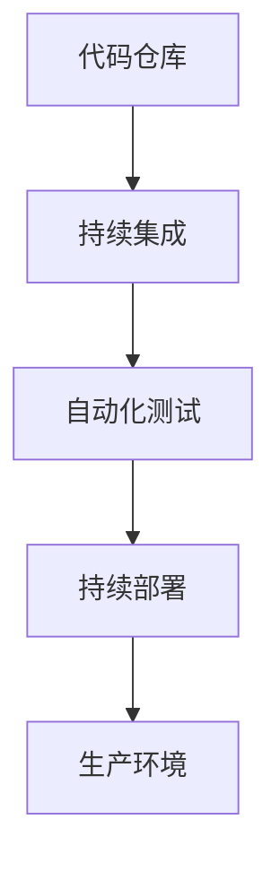

                 

### 第一部分: 问题背景

#### 第1章: 问题背景

##### 1.1 问题背景

##### 1.1.1 传统部署面临的挑战

在当今快速发展的信息技术时代，软件开发和人工智能（AI）应用的开发速度越来越快，需求迭代也更加频繁。然而，传统部署方式在应对这些变化时却显得力不从心，具体面临以下挑战：

1. **部署周期长**：传统部署流程往往涉及多个环节，如构建、测试、打包、部署等，这些环节往往需要人工操作，导致整个部署过程耗时较长。在AI应用领域，频繁的需求迭代和快速响应市场需求的要求使得传统部署周期无法满足。

2. **部署风险高**：传统部署过程中，人工操作环节较多，容易出现人为错误，如配置错误、代码冲突等，这些错误可能导致部署失败，影响系统的稳定性。对于AI应用，一旦出现部署失败，可能带来严重的业务风险。

3. **部署效率低**：传统部署方式依赖人工干预，不仅效率低下，还容易受到人为因素的影响，如疲劳、疏忽等，这些都可能导致部署效率低下，无法满足现代软件工程的高效要求。

##### 1.1.2 持续部署的概念与优势

持续部署（Continuous Deployment，简称CD）是一种通过自动化流程实现软件快速、安全、可靠交付的实践。它的核心思想是将软件开发的每一个版本都及时地部署到生产环境中，从而实现快速迭代和持续改进。

**定义与原理**：

持续部署通过自动化工具，将代码从版本控制系统（如Git）检出、构建、测试、打包，最终部署到生产环境。整个过程尽可能减少人工干预，实现自动化操作。

**优势与实践价值**：

1. **提高部署频率**：持续部署可以大幅提高软件的部署频率，实现每天甚至每小时多次部署，满足快速迭代的需求。

2. **降低部署风险**：通过自动化测试和持续监控，可以及时发现和修复部署过程中可能出现的问题，降低部署失败的风险。

3. **提高部署效率**：自动化部署减少人工干预，提高部署效率，同时降低人工成本。

4. **提升产品质量**：频繁的测试和部署有助于发现和解决软件缺陷，提升产品质量。

##### 1.1.3 AI应用从开发到生产的过程

在AI应用开发过程中，从开发到生产经历了多个阶段，每个阶段都有其独特的任务和挑战：

1. **开发阶段**：开发者编写代码，实现AI算法和应用功能。

2. **测试阶段**：对代码进行功能测试、性能测试和安全测试，确保代码质量和功能完整性。

3. **部署阶段**：将经过测试的代码部署到测试环境或生产环境。

4. **生产阶段**：AI应用在生产环境中运行，提供业务服务。

##### 1.2 核心概念与联系

在持续部署的实践中，涉及多个核心概念，包括持续集成、自动化测试、持续交付等。这些概念相互关联，共同构成了持续部署的完整流程。

**1.2.1 核心概念原理**

- **持续集成（Continuous Integration，简称CI）**：持续集成是指通过自动化工具将开发者的代码定期集成到一起，进行构建和测试，确保代码的质量和功能完整性。

- **自动化测试（Automated Testing）**：自动化测试是指使用自动化测试工具进行软件测试，包括单元测试、集成测试、回归测试等，确保软件的稳定性和可靠性。

- **持续交付（Continuous Delivery，简称CD）**：持续交付是指通过自动化工具将经过测试的代码部署到生产环境，实现软件的快速交付。

- **持续部署（Continuous Deployment，简称CD）**：持续部署是指通过自动化工具将开发完成的代码频繁地部署到生产环境，实现持续迭代和快速响应。

**1.2.2 概念属性特征对比表格**

| 概念                | 定义                                                         | 特点                                                   |
|---------------------|--------------------------------------------------------------|--------------------------------------------------------|
| 持续部署            | 自动化部署流程，快速交付软件                                   | 减少人工干预，提高效率，降低风险                         |
| 持续集成            | 自动化构建、测试和集成代码的过程                               | 快速发现和解决集成中的问题，提高软件质量                 |
| 自动化测试            | 使用自动化工具进行测试，确保软件质量                           | 提高测试效率，覆盖更多测试场景，减少人工干预            |
| 持续交付            | 自动化部署流程，快速交付软件                                   | 减少人工干预，提高效率，降低风险                         |

**1.2.3 ER实体关系图架构**

```mermaid
erDiagram
    AI应用开发者 ||--|{ 持续集成工具 }
    持续集成工具 ||--|{ 自动化测试工具 }
    自动化测试工具 ||--|{ 部署工具 }
    部署工具 ||--|{ 生产环境 }
```

##### 1.3 数学模型和数学公式

为了更好地理解持续部署的关键指标，我们可以使用数学模型和公式进行描述。

**1.3.1 持续部署的关键指标**

- **部署频率（Deployment Frequency）**：衡量单位时间内软件的部署次数。
- **平均部署时间（Average Deployment Time）**：衡量每次部署所需的时间。
- **部署失败率（Deployment Failure Rate）**：衡量部署失败的比例。

**数学公式**：

$$
D.F = \frac{N_d}{T_d}
$$

其中，$N_d$ 为部署次数，$T_d$ 为部署时间。

$$
A.D.T = \frac{\sum_{i=1}^{n} T_{i}}{n}
$$

其中，$T_i$ 为第 $i$ 次部署时间，$n$ 为总部署次数。

$$
D.F.R = \frac{F_d}{N_d}
$$

其中，$F_d$ 为部署失败次数。

##### 1.4 系统分析与架构设计方案

**1.4.1 问题场景介绍**

在AI应用开发过程中，从开发到生产的过程面临着诸多挑战，如部署周期长、部署风险高、部署效率低等。为了解决这些问题，需要引入持续部署的实践。

**1.4.2 项目介绍**

项目名称：AI应用持续部署平台

项目目标：实现AI应用的快速、安全、可靠部署

**1.4.3 系统功能设计**

系统功能设计包括持续集成、自动化测试、持续部署三个主要模块。

- **持续集成模块**：负责代码的检出、构建、测试和集成。
- **自动化测试模块**：负责执行各类自动化测试，包括单元测试、集成测试、回归测试等。
- **持续部署模块**：负责将测试通过的代码部署到生产环境。

**1.4.4 系统架构设计**

系统架构设计采用分层架构，包括代码仓库、测试环境、生产环境和各个功能模块。



**1.4.5 系统接口设计和系统交互**

系统接口设计主要包括持续集成工具与代码仓库的接口、自动化测试工具与持续集成工具的接口、持续部署工具与生产环境的接口。

```mermaid
sequenceDiagram
    Developer[开发者] ->> Code_Repository[提交代码]
    Code_Repository ->> CI[检出代码]
    CI ->> AT[执行测试]
    AT ->> DP[部署代码]
    DP ->> Production_Environment[部署到生产环境]
```

### 1.5 总结

在本章节中，我们介绍了传统部署方式面临的挑战，阐述了持续部署的概念与优势，以及AI应用从开发到生产的过程。通过核心概念原理、属性特征对比表格和ER实体关系图，我们清晰地展示了持续部署的关键要素。此外，我们使用数学模型和公式，对持续部署的关键指标进行了描述。最后，我们提出了一个基于持续部署的AI应用部署平台的设计方案。这些内容为我们后续深入探讨持续部署的实践应用奠定了基础。

> **作者：AI天才研究院/AI Genius Institute & 禅与计算机程序设计艺术 /Zen And The Art of Computer Programming**### 第二部分: 持续部署的核心概念

#### 第2章: 持续部署的核心概念

在深入探讨持续部署（Continuous Deployment，简称CD）之前，我们需要了解与之密切相关的几个核心概念：持续集成（Continuous Integration，简称CI）、自动化测试（Automated Testing）和持续交付（Continuous Delivery，简称CD）。这些概念相互关联，共同构成了持续部署的完整流程。

##### 2.1 持续集成（CI）

持续集成是一种软件开发实践，通过自动化工具将开发者的代码定期集成到一起，进行构建和测试，以确保代码的质量和功能完整性。以下是持续集成的主要组成部分：

**组成部分**：

1. **代码仓库**：用于存储和管理代码的版本库，如Git。

2. **构建服务器**：负责检出代码、编译代码、构建应用程序。

3. **测试框架**：用于执行各种测试，如单元测试、集成测试等。

4. **报告工具**：用于生成测试报告，显示测试结果。

**工作流程**：

1. **提交代码**：开发者将自己的代码提交到代码仓库。

2. **构建代码**：构建服务器检出最新提交的代码，进行编译和构建。

3. **执行测试**：测试框架执行各种测试，确保代码质量。

4. **报告结果**：测试结果通过报告工具展示，开发者可以及时了解代码的状态。

**优点**：

- **快速发现冲突**：通过自动化集成和测试，可以快速发现和解决代码冲突。
- **提高代码质量**：频繁的集成和测试有助于发现和修复缺陷。
- **减少集成风险**：每次集成都是经过严格测试的，降低了集成失败的风险。

##### 2.2 自动化测试（AT）

自动化测试是指使用自动化测试工具进行软件测试，包括单元测试、集成测试、回归测试等。自动化测试可以提高测试效率，确保软件的稳定性和可靠性。

**类型**：

1. **单元测试**：测试单个模块或函数的功能。

2. **集成测试**：测试多个模块协同工作的功能。

3. **回归测试**：确保修改后的代码没有引入新的缺陷。

**工具**：

- **Selenium**：用于Web应用的自动化测试。
- **JUnit**：用于Java应用的单元测试。
- **pytest**：用于Python应用的自动化测试。

**工作流程**：

1. **编写测试用例**：根据需求和设计，编写自动化测试用例。

2. **执行测试**：自动化测试工具执行测试用例，生成测试报告。

3. **分析结果**：根据测试报告，分析测试结果，发现和修复缺陷。

**优点**：

- **提高测试效率**：自动化测试可以快速执行大量测试用例，提高测试效率。
- **覆盖更多测试场景**：自动化测试可以覆盖更多测试场景，提高测试覆盖率。
- **减少人工干预**：自动化测试减少人工干预，降低测试成本。

##### 2.3 持续交付（CD）

持续交付是一种通过自动化工具将经过测试的代码部署到生产环境的实践。持续交付的目标是实现软件的快速交付，以满足市场的需求。

**组成部分**：

1. **部署服务器**：用于执行部署任务的自动化服务器。

2. **部署脚本**：用于执行部署操作的脚本。

3. **监控工具**：用于监控生产环境中的软件状态。

**工作流程**：

1. **代码评审**：开发者在代码仓库中提交代码，经过评审后合并到主分支。

2. **自动化测试**：持续集成工具执行自动化测试，确保代码质量。

3. **部署代码**：部署工具根据测试结果，将代码部署到生产环境。

4. **监控生产环境**：监控工具实时监控生产环境中的软件状态，确保系统稳定运行。

**优点**：

- **快速响应市场需求**：通过持续交付，可以快速将代码部署到生产环境，满足市场需求。
- **降低部署风险**：自动化部署减少人工干预，降低部署失败的风险。
- **提高软件质量**：持续交付过程中的自动化测试有助于提高软件质量。

##### 2.4 持续部署（CD）

持续部署是指通过自动化工具将开发完成的代码频繁地部署到生产环境，实现持续迭代和快速响应。持续部署是持续集成和持续交付的延伸，旨在实现软件的持续优化和快速迭代。

**组成部分**：

1. **持续集成工具**：负责代码的集成和测试。

2. **自动化测试工具**：负责执行自动化测试。

3. **部署工具**：负责将代码部署到生产环境。

**工作流程**：

1. **提交代码**：开发者将代码提交到代码仓库。

2. **持续集成**：持续集成工具检出代码，执行构建和测试。

3. **自动化测试**：自动化测试工具执行自动化测试，确保代码质量。

4. **部署代码**：部署工具根据测试结果，将代码部署到生产环境。

5. **监控生产环境**：监控工具实时监控生产环境中的软件状态，确保系统稳定运行。

**优点**：

- **快速迭代**：通过持续部署，可以快速迭代和优化软件。
- **降低风险**：自动化部署和测试减少人工干预，降低部署失败的风险。
- **提高质量**：持续交付过程中的自动化测试有助于提高软件质量。

##### 2.5 概念联系

持续集成、自动化测试、持续交付和持续部署之间存在着紧密的联系，它们共同构成了持续部署的完整流程。以下是这些概念之间的联系：

- **持续集成**是持续部署的基础，通过自动化工具将开发者的代码定期集成到一起，进行构建和测试，确保代码的质量和功能完整性。

- **自动化测试**是持续集成和持续交付的重要环节，通过自动化测试工具执行各种测试，确保软件的稳定性和可靠性。

- **持续交付**是将经过测试的代码部署到生产环境的实践，通过自动化部署工具实现软件的快速交付。

- **持续部署**是持续集成和持续交付的延伸，通过自动化工具将开发完成的代码频繁地部署到生产环境，实现持续迭代和快速响应。

**总结**

在本章节中，我们介绍了持续集成、自动化测试、持续交付和持续部署这四个核心概念。通过详细解析这些概念，我们理解了它们在持续部署流程中的重要作用和相互联系。在接下来的章节中，我们将进一步探讨持续部署的具体实现和最佳实践。

> **作者：AI天才研究院/AI Genius Institute & 禅与计算机程序设计艺术 /Zen And The Art of Computer Programming**### 第三部分: 持续部署的实践与实现

#### 第3章: 持续部署的实践与实现

在上一章节中，我们介绍了持续部署的核心概念。接下来，我们将探讨如何在实际项目中实现持续部署，并分析其关键步骤和最佳实践。

##### 3.1 持续部署的实践步骤

持续部署的实践可以分为以下几个关键步骤：

1. **环境搭建**：搭建持续部署所需的环境，包括代码仓库、持续集成工具、自动化测试工具、部署工具等。

2. **代码管理**：使用代码仓库（如Git）进行代码管理，确保代码的版本控制和协同工作。

3. **持续集成**：设置持续集成工具（如Jenkins、GitLab CI等），实现代码的自动化构建、测试和集成。

4. **自动化测试**：编写自动化测试用例，使用自动化测试工具（如Selenium、JUnit等）执行测试，确保代码质量。

5. **持续交付**：通过部署脚本和部署工具（如Docker、Kubernetes等），将经过测试的代码部署到生产环境。

6. **监控与反馈**：使用监控工具（如Prometheus、Grafana等）实时监控生产环境中的软件状态，及时反馈问题，优化部署流程。

##### 3.2 环境搭建

在实现持续部署之前，我们需要搭建一个合适的环境。以下是一个简单的环境搭建流程：

1. **安装Git**：Git是一个分布式版本控制系统，用于代码的版本管理和协同工作。

2. **安装Jenkins**：Jenkins是一个开源的持续集成工具，可以用于自动化构建、测试和部署。

3. **安装Docker**：Docker是一个开源的应用容器引擎，用于容器化和部署应用程序。

4. **安装Kubernetes**：Kubernetes是一个开源的容器编排平台，用于管理容器化应用程序的部署、扩展和运维。

5. **配置代码仓库**：在Git中创建一个代码仓库，用于存储和管理应用程序的代码。

6. **配置持续集成工具**：在Jenkins中创建一个项目，配置构建脚本和测试脚本，实现代码的自动化构建和测试。

7. **配置自动化测试工具**：根据需求，配置自动化测试工具，编写测试用例，实现自动化测试。

8. **配置部署工具**：配置Docker和Kubernetes，编写部署脚本，实现代码的自动化部署。

##### 3.3 代码管理

在持续部署过程中，代码管理至关重要。以下是一些代码管理的最佳实践：

1. **版本控制**：使用Git进行版本控制，确保代码的历史记录可追溯。

2. **代码评审**：引入代码评审机制，确保代码质量，减少代码缺陷。

3. **分支策略**：采用合适的分支策略，如Git Flow或GitHub Flow，确保代码的有序开发和合并。

4. **自动化文档**：生成自动化文档，如API文档、用户手册等，提高代码的可读性和可维护性。

##### 3.4 持续集成

持续集成是持续部署的核心环节，以下是一些持续集成的最佳实践：

1. **自动化构建**：使用构建工具（如Maven、Gradle等）自动化构建项目，确保构建过程的一致性和可靠性。

2. **自动化测试**：编写自动化测试用例，使用自动化测试工具执行测试，确保代码质量。

3. **集成频率**：根据项目需求，设置合适的集成频率，如每天或每周集成。

4. **失败处理**：当集成失败时，及时通知开发者，并记录失败原因，便于问题定位和修复。

##### 3.5 自动化测试

自动化测试是确保代码质量的重要手段，以下是一些自动化测试的最佳实践：

1. **测试用例设计**：根据需求和分析，设计合理的测试用例，确保测试覆盖面。

2. **自动化测试框架**：选择合适的自动化测试框架（如Selenium、pytest等），提高测试效率。

3. **持续测试**：持续执行自动化测试，及时发现和修复缺陷。

4. **测试覆盖率**：确保测试覆盖率，提高代码质量。

##### 3.6 持续交付

持续交付是持续部署的延伸，以下是一些持续交付的最佳实践：

1. **部署脚本**：编写高效的部署脚本，确保部署过程的一致性和可靠性。

2. **容器化**：使用Docker容器化应用程序，提高部署效率和可移植性。

3. **自动化部署**：使用Kubernetes等容器编排工具，实现自动化部署和扩展。

4. **监控与反馈**：使用监控工具实时监控生产环境中的软件状态，及时反馈问题，优化部署流程。

##### 3.7 项目实战

以下是一个简单的项目实战案例，展示如何实现持续部署：

1. **项目背景**：开发一个基于Spring Boot的Web应用程序，需要实现持续部署。

2. **环境搭建**：搭建Git、Jenkins、Docker、Kubernetes等环境。

3. **代码管理**：在Git中创建一个代码仓库，进行版本控制和代码评审。

4. **持续集成**：在Jenkins中创建一个项目，配置Maven插件和JUnit插件，实现自动化构建和测试。

5. **自动化测试**：编写JUnit测试用例，使用Selenium进行Web自动化测试。

6. **持续交付**：编写Dockerfile，将应用程序容器化，使用Kubernetes进行自动化部署。

7. **监控与反馈**：使用Prometheus和Grafana进行实时监控，及时反馈问题。

##### 3.8 最佳实践

在实现持续部署过程中，以下是一些最佳实践：

1. **小步快走**：每次部署只包含少量更改，降低部署风险。

2. **自动化一切**：尽可能使用自动化工具，减少人工干预。

3. **持续监控**：实时监控生产环境中的软件状态，及时反馈问题。

4. **代码评审**：引入代码评审机制，确保代码质量。

5. **持续学习**：关注新技术和最佳实践，持续优化部署流程。

##### 3.9 小结

在本章节中，我们介绍了持续部署的实践步骤和最佳实践。通过环境搭建、代码管理、持续集成、自动化测试、持续交付等步骤，我们实现了持续部署。同时，我们提出了一些最佳实践，以优化部署流程和提高软件质量。

> **作者：AI天才研究院/AI Genius Institute & 禅与计算机程序设计艺术 /Zen And The Art of Computer Programming**### 第四部分: 持续部署的实际案例和应用

#### 第4章: 持续部署的实际案例和应用

在实际应用中，持续部署已经成为许多公司提升软件开发效率和产品质量的关键手段。本章节将通过两个实际案例，详细解析持续部署在不同场景中的应用和实践。

##### 4.1 案例一：电商平台的持续部署实践

**背景**：

某大型电商平台，为了应对日益增长的订单量和用户需求，需要不断优化其系统性能和用户体验。然而，传统的部署方式已经无法满足快速迭代和高效交付的需求。为此，他们决定引入持续部署，以实现软件的持续优化和快速交付。

**实施过程**：

1. **环境搭建**：首先，搭建了Git、Jenkins、Docker和Kubernetes等环境。使用Git进行代码管理，Jenkins作为持续集成工具，Docker用于容器化应用程序，Kubernetes进行容器编排和管理。

2. **代码管理**：在Git中创建了一个中央代码仓库，所有开发人员都在此仓库中进行代码提交和协作。引入了代码评审机制，确保代码质量。

3. **持续集成**：在Jenkins中创建了多个项目，分别对应不同的模块和功能。配置了Maven插件和JUnit插件，实现自动化构建和测试。每次代码提交都会触发Jenkins的任务，执行构建和测试。

4. **自动化测试**：编写了JUnit测试用例和Selenium自动化测试脚本，覆盖了核心功能和用户场景。测试工具自动执行测试，并将结果反馈给开发人员。

5. **持续交付**：使用Docker将应用程序容器化，生成Docker镜像。在Kubernetes集群中创建部署配置文件，定义容器的运行参数和资源限制。每次构建成功后，Jenkins会自动触发Kubernetes部署，将Docker镜像部署到生产环境。

6. **监控与反馈**：使用Prometheus和Grafana进行实时监控，监控生产环境中的软件状态。当发现异常时，系统会自动发送通知，通知相关人员进行处理。

**效果**：

通过引入持续部署，该电商平台实现了以下效果：

- **部署频率提高**：从原来的每月一次部署，提高到每周甚至每日多次部署。
- **部署风险降低**：自动化测试和监控减少了部署失败的风险。
- **部署效率提升**：自动化部署和容器化技术大幅提高了部署效率。
- **系统稳定性提高**：通过实时监控和反馈，及时处理了生产环境中的问题，提高了系统的稳定性。

##### 4.2 案例二：金融科技公司的持续部署实践

**背景**：

某金融科技公司专注于开发金融交易系统和风控模型。由于金融业务的特殊性，系统需要具备高可靠性、高性能和快速响应能力。为了实现这一目标，该公司决定采用持续部署，以提高软件交付速度和质量。

**实施过程**：

1. **环境搭建**：搭建了Git、Jenkins、Docker和Kubernetes等环境。使用Git进行代码管理，Jenkins作为持续集成工具，Docker用于容器化应用程序，Kubernetes进行容器编排和管理。

2. **代码管理**：在Git中创建了一个中央代码仓库，所有开发人员都在此仓库中进行代码提交和协作。引入了代码评审机制，确保代码质量。

3. **持续集成**：在Jenkins中创建了多个项目，分别对应不同的模块和功能。配置了Maven插件和JUnit插件，实现自动化构建和测试。每次代码提交都会触发Jenkins的任务，执行构建和测试。

4. **自动化测试**：编写了JUnit测试用例和金融交易测试脚本，覆盖了核心功能和用户场景。测试工具自动执行测试，并将结果反馈给开发人员。

5. **持续交付**：使用Docker将应用程序容器化，生成Docker镜像。在Kubernetes集群中创建部署配置文件，定义容器的运行参数和资源限制。每次构建成功后，Jenkins会自动触发Kubernetes部署，将Docker镜像部署到生产环境。

6. **监控与反馈**：使用Prometheus和Grafana进行实时监控，监控生产环境中的软件状态。当发现异常时，系统会自动发送通知，通知相关人员进行处理。

**效果**：

通过引入持续部署，该金融科技公司实现了以下效果：

- **部署频率提高**：从原来的每月一次部署，提高到每周甚至每日多次部署。
- **部署风险降低**：自动化测试和监控减少了部署失败的风险。
- **部署效率提升**：自动化部署和容器化技术大幅提高了部署效率。
- **系统稳定性提高**：通过实时监控和反馈，及时处理了生产环境中的问题，提高了系统的稳定性。

**经验与启示**：

从这两个案例中，我们可以得出以下经验和启示：

1. **持续部署适用于各类场景**：无论是电商平台还是金融科技公司，持续部署都能显著提高软件开发和交付效率。

2. **环境搭建和代码管理是关键**：良好的环境搭建和代码管理是持续部署成功的基础。

3. **自动化测试和监控是保障**：自动化测试和实时监控可以大幅降低部署失败的风险，提高系统稳定性。

4. **持续优化是持续部署的核心**：持续部署不仅仅是一个工具或流程，更是一种持续优化和改进的思维方式。

##### 4.3 持续部署的挑战与解决方案

尽管持续部署带来了诸多好处，但在实际应用过程中也面临一些挑战：

**挑战一：部署风险**  
自动化测试和监控虽然降低了部署失败的风险，但依然存在一定的风险。解决方案：

- **逐步推进**：从简单的功能模块开始，逐步扩展到复杂的业务模块，降低部署风险。
- **A/B测试**：通过A/B测试，将新版本部署到一部分用户，观察其表现，确保稳定后再全面推广。

**挑战二：测试覆盖率**  
自动化测试的覆盖率可能无法达到100%，这可能导致部分缺陷未被及时发现。解决方案：

- **增加测试用例**：不断优化测试用例，提高测试覆盖率。
- **人工测试**：在自动化测试之外，进行人工测试，补充自动化测试的不足。

**挑战三：部署效率**  
部署过程中可能需要人工干预，影响部署效率。解决方案：

- **自动化部署脚本**：编写高效的部署脚本，减少人工干预。
- **资源优化**：合理配置资源，提高部署速度。

**挑战四：团队协作**  
持续部署需要团队之间的紧密协作。解决方案：

- **沟通与协作**：加强团队之间的沟通和协作，确保部署流程顺畅。
- **培训与学习**：定期进行培训和学习，提高团队成员的技能和意识。

##### 4.4 总结

在本章节中，我们通过两个实际案例，详细解析了持续部署在不同场景中的应用和实践。通过这些案例，我们了解了持续部署的实施过程、效果和挑战，并提出了相应的解决方案。这些经验和启示为我们更好地理解和应用持续部署提供了宝贵的参考。

> **作者：AI天才研究院/AI Genius Institute & 禅与计算机程序设计艺术 /Zen And The Art of Computer Programming**### 第五部分: 持续部署的未来展望

#### 第5章: 持续部署的未来展望

随着信息技术和软件工程的发展，持续部署（Continuous Deployment，简称CD）已经从一种前沿实践逐渐成为软件开发的标准流程。然而，未来的持续部署领域还将迎来更多技术创新和优化，以下是一些可能的趋势和方向。

##### 5.1 自动化程度的进一步提升

当前的持续部署已经实现了许多自动化流程，包括构建、测试、部署等。未来，自动化程度将进一步提升，自动化工具将更加智能化和自适应。例如，自动化工具可以基于机器学习算法，根据历史数据自动优化构建和部署流程，提高部署效率和稳定性。

**技术方向**：

1. **智能自动化工具**：开发具有自我学习和优化的自动化工具，提高持续部署的智能化水平。

2. **自适应部署策略**：根据实际部署情况，自动调整部署策略，如动态调整部署频率、资源分配等。

##### 5.2 容器化和微服务架构的广泛应用

容器化和微服务架构是持续部署的重要技术基础。随着容器技术的成熟和微服务架构的普及，持续部署将更加依赖于容器和微服务。未来，容器和微服务将推动持续部署走向更加灵活和高效。

**技术方向**：

1. **容器编排和自动化管理**：进一步优化Kubernetes等容器编排工具，提高容器管理的自动化水平。

2. **微服务持续集成和交付**：实现微服务架构下的持续集成和交付，确保每个微服务的高效和稳定部署。

##### 5.3 实时监控和智能反馈

实时监控和智能反馈是持续部署的核心环节。未来，随着监控技术的进步，持续部署将实现更全面的实时监控和智能反馈。例如，通过人工智能和大数据分析，监控工具可以预测潜在的问题，并提前进行干预。

**技术方向**：

1. **实时监控**：开发实时监控工具，实现对生产环境中的软件状态、性能、安全等方面的全面监控。

2. **智能反馈**：利用机器学习和大数据分析，从监控数据中提取有价值的信息，为部署流程提供智能反馈。

##### 5.4 安全性的增强

随着持续部署的应用范围越来越广，安全性成为不可忽视的问题。未来，持续部署将更加注重安全性，通过引入更多的安全措施和技术，确保软件的安全性和稳定性。

**技术方向**：

1. **安全测试**：开发自动化安全测试工具，实现对代码和部署流程的安全检测。

2. **安全隔离**：在部署过程中，采用安全隔离技术，确保不同环境和版本之间的安全。

##### 5.5 社区生态的繁荣

持续部署作为一个广泛应用的领域，社区生态的繁荣对其发展至关重要。未来，持续部署领域将吸引更多开发者和技术公司的参与，形成多元化的社区生态。

**社区方向**：

1. **开源项目**：持续部署领域将涌现更多优秀的开源项目，为开发者提供丰富的工具和资源。

2. **技术交流**：通过会议、研讨会、在线论坛等形式，促进技术交流与合作，推动持续部署技术的发展。

##### 5.6 总结

持续部署作为软件开发和人工智能应用的重要实践，未来的发展将更加智能化、自动化和高效化。通过自动化程度的提升、容器化和微服务架构的广泛应用、实时监控和智能反馈、安全性的增强以及社区生态的繁荣，持续部署将更好地满足快速迭代和高质量交付的需求，推动软件工程的进步。

> **作者：AI天才研究院/AI Genius Institute & 禅与计算机程序设计艺术 /Zen And The Art of Computer Programming**### 总结与拓展

在本文中，我们深入探讨了持续部署（Continuous Deployment，简称CD）的核心概念、实践步骤、实际案例以及未来展望。通过详细的分析和实例，我们展示了持续部署如何加速AI应用从开发到生产的过程，提高软件交付的效率和可靠性。

**核心概念**：

- **持续部署**：通过自动化流程实现软件快速、安全、可靠交付的实践。
- **持续集成**：定期将开发者的代码集成到一起，进行构建和测试，确保代码质量。
- **自动化测试**：使用自动化工具进行软件测试，确保软件的稳定性和可靠性。
- **持续交付**：将经过测试的代码部署到生产环境，实现软件的快速交付。

**实践步骤**：

- **环境搭建**：配置持续部署所需的环境，如代码仓库、持续集成工具、自动化测试工具和部署工具。
- **代码管理**：使用代码仓库进行版本控制和协作。
- **持续集成**：设置持续集成工具，自动化构建、测试和集成代码。
- **自动化测试**：编写自动化测试用例，使用自动化测试工具执行测试。
- **持续交付**：通过自动化部署工具将代码部署到生产环境。
- **监控与反馈**：使用监控工具实时监控生产环境，及时反馈问题。

**实际案例**：

- **电商平台**：通过持续部署实现了每周甚至每日多次部署，提高了系统稳定性。
- **金融科技公司**：利用持续部署提高了软件交付速度和质量，确保金融交易系统的可靠性。

**未来展望**：

- **自动化程度提升**：自动化工具将更加智能化和自适应，提高持续部署的效率。
- **容器化和微服务架构**：容器和微服务将推动持续部署走向更加灵活和高效。
- **实时监控和智能反馈**：通过实时监控和智能反馈，确保软件的稳定性和安全性。
- **安全性增强**：引入更多安全措施，确保持续部署过程的安全。
- **社区生态繁荣**：持续部署领域的开源项目和技术交流将推动技术的发展。

**拓展阅读**：

- **《持续交付：释放软件交付潜力》**：通过案例和最佳实践，详细介绍了持续交付的原理和实践。
- **《容器化与微服务》**：探讨容器和微服务在软件工程中的应用和优势。

**结语**：

持续部署是现代软件工程和人工智能应用的重要实践，通过本文的讲解，我们希望能够帮助读者理解持续部署的核心概念和实践步骤，以及其在AI应用开发中的重要作用。持续部署不仅是提高软件开发效率的关键，更是实现高质量交付的保证。希望本文能够为读者在持续部署的道路上提供有益的参考和启示。

> **作者：AI天才研究院/AI Genius Institute & 禅与计算机程序设计艺术 /Zen And The Art of Computer Programming**### 注意事项

在实施持续部署时，有一些关键点需要注意，以确保过程顺利进行：

1. **代码质量**：持续部署的成功很大程度上依赖于高质量的代码。因此，在代码提交之前，必须进行严格的代码审查和单元测试，确保代码没有明显缺陷。

2. **测试覆盖**：自动化测试用例应该覆盖到所有关键功能和异常情况，以减少部署时出现意外的风险。

3. **环境一致性**：开发和测试环境应尽量与生产环境保持一致，避免因环境差异导致的部署问题。

4. **版本控制**：使用版本控制系统（如Git）来管理代码版本，确保代码变更的可追溯性。

5. **错误处理**：持续部署过程中可能会遇到失败，应该设置适当的错误处理机制，如自动回滚、邮件通知等，以便及时修复问题。

6. **资源管理**：确保持续部署所需资源（如服务器、存储、网络等）充足且配置合理，以支持高效的部署过程。

7. **安全措施**：在部署过程中，要确保敏感数据和操作的安全性，防止数据泄露和未授权访问。

8. **监控与反馈**：实时监控生产环境中的软件状态，及时收集和分析系统日志和性能数据，以便快速响应和解决问题。

通过遵循这些注意事项，可以大大降低持续部署过程中的风险，确保软件交付的稳定性和可靠性。

### 扩展阅读

1. **《持续交付：发布可靠软件的新范式》**：这本书详细介绍了持续交付的理论和实践，是理解持续部署不可或缺的参考资料。

2. **《Docker实战》**：了解容器化技术，特别是Docker的使用，对于实现持续部署至关重要。

3. **Jenkins官方文档**：Jenkins是一个广泛使用的持续集成工具，官方文档提供了丰富的配置和使用技巧。

4. **Kubernetes官方文档**：Kubernetes是容器编排平台，学习其官方文档可以帮助更好地实现持续部署的自动化和规模化。

5. **《微服务架构设计》**：探讨微服务架构的优势和实践，对理解持续部署在微服务环境中的应用非常有帮助。 

通过阅读这些资料，可以进一步加深对持续部署的理解，并在实践中取得更好的效果。

